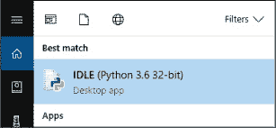

## 序言


你更倾向于选择图 1 中的哪种方法？左边是传统数学教学方法的例子，包括定义、命题和证明。这种方法需要大量的阅读和各种奇怪的符号。你永远不会猜到这与几何图形有什么关系。事实上，这段文字在讲解如何找到三角形的*质心*，或者说三角形的中心。但像这样的传统方法并没有告诉我们，为什么我们一开始就应该对找到三角形的中心感兴趣。


*图 1：关于质心的两种教学方法*

在这段文字旁边，你看到了一张动态草图，草图中大约有一百个旋转的三角形。这是一个具有挑战性的编程项目，如果你希望它旋转得正确（并且看起来很酷），你必须找到三角形的质心。在许多情况下，制作酷炫的图形几乎是不可能的，除非你了解几何学背后的数学原理。例如，正如你将在本书中看到的，了解三角形背后的数学知识，像是质心，就能让我们轻松创造出艺术作品。一个懂数学并能设计酷炫图形的学生，更有可能深入研究几何学，忍受一些平方根或三角函数。而一个看不出任何结果、只是在做教科书上的作业的学生，可能没有太大的动力去学习几何学。

在我作为数学教师的八年经验和三年计算机科学教师的经验中，我遇到了更多倾向于视觉方法的数学学习者。在创造有趣的东西的过程中，你会发现数学不仅仅是按步骤解方程。你会看到，运用编程来探索数学，可以有多种方法解决有趣的问题，并且在过程中会有许多意想不到的错误和改进的机会。

这就是学校数学与真实数学之间的区别。

### 学校数学的问题

我所说的“学校数学”到底是什么意思？在 19 世纪 60 年代的美国，学校数学是为成为一名职员准备的，帮助人们手工加总一列数字。而今天，工作不同了，为这些工作做准备也需要改变。

人们通过实践学习得最好。然而，在学校中，这种方式并没有得到日常的应用，学校更倾向于被动学习。在英语和历史课上，“做”可能意味着学生写论文或做演讲，科学课上学生做实验，但数学学生做什么呢？过去，在数学课上，你能做的主动“做”的事情就是解方程、因式分解和画图。但现在，计算机可以为我们做大部分计算，这些做法已经不再足够了。

单纯学习如何自动化解决问题、因式分解和绘制图形并不是最终目标。一旦学生学会了自动化某个过程，他们就能比以往更深入地探讨某个主题。

图 2 展示了你在教科书中会遇到的典型数学问题，要求学生定义一个函数“f(x)”并为许多值进行求值。


*图 2：传统的函数教学方法*

这种格式在接下来的 18 个问题中依然适用！这种类型的练习对于像 Python 这样的编程语言来说是个微不足道的问题。我们可以简单地定义函数`f(x)`，然后通过遍历一个列表来插入数值，像这样：

```py
import math

def f(x):
    return math.sqrt(x + 3) - x + 1

#list of values to plug in
for x in [0,1,math.sqrt(2),math.sqrt(2)-1]:
    print("f({:.3f}) = {:.3f}".format(x,f(x)))
```

最后一行只是为了让输出更加美观，并将所有解答四舍五入到小数点后三位，如下所示：

```py
f(0.000) = 2.732
f(1.000) = 2.000
f(1.414) = 1.687
f(0.414) = 2.434
```

在像 Python、JavaScript、Java 等编程语言中，函数是转化数字和其他对象（甚至其他函数）的一项至关重要的工具。使用 Python，你可以给函数一个描述性的名称，这样更容易理解其功能。例如，你可以命名一个计算矩形面积的函数为`calculateArea()`，像这样：

```py
def calculateArea(width,height):
```

一本在 21 世纪出版的数学教科书，在 Benoit Mandelbrot 首次为 IBM 工作时通过计算机生成他的著名分形图像几十年后，展示了曼德尔布罗特集的图像，并对这一发现赞不绝口。教科书描述曼德尔布罗特集，如图 3 所示，称其为“一个来自复数的迷人数学对象。其美丽的边界展示了混沌行为。”


*图 3：曼德尔布罗特集*

教科书随后带领读者进行一项艰苦的“探索”，展示如何在复平面中转换一个点。但学生仅仅是被教如何在计算器上完成此操作，这意味着只有两个点能够在合理时间内被转换（迭代七次）。仅仅是两个点。

在本书中，你将学习如何在 Python 中实现这一点，并让程序自动化地转换数十万个点，甚至*创建*你上面看到的曼德尔布罗特集！

### 关于本书

本书旨在通过使用编程工具使数学变得有趣且相关，同时仍保持一定挑战性。你将制作图表展示一个函数的所有可能输出。你将创作动态的、互动的艺术作品。你甚至会创建一个生态系统，里面有会移动、吃草和繁殖的羊群，你还将创建虚拟生物，它们会在你观察的过程中，尝试找到一条穿越一系列城市的最短路径！

你将使用 Python 和 Processing 来增强你在数学课上的能力。本书不是要跳过数学，而是利用最新、最酷的工具来进行创意探索，同时学习真正的计算机技能，并发现数学、艺术、科学和技术之间的联系。Processing 将提供图形、形状、运动和颜色，而 Python 则负责计算，并在背后执行你的指令。

对于本书中的每个项目，你将从零开始构建代码，从一个空白文件开始，并在每个步骤检查自己的进度。通过犯错和调试自己的程序，你将更深入地理解每一段代码的作用。

### 本书适合谁使用

本书适合任何正在学习数学的人，或是想要使用最现代工具来接触数学主题，如三角学和代数的人。如果你正在学习 Python，你可以利用本书，将你不断提升的编程技能应用于一些复杂项目，如元胞自动机、遗传算法和计算艺术。

教师可以使用本书中的项目来挑战学生，或让数学变得更易接近和更有意义。还有什么比通过将一堆点保存到矩阵并用它们来绘制三维图形更好的教矩阵的方式呢？掌握 Python 后，你可以做到这一切，甚至更多。

### 本书内容

本书从三章基本的 Python 概念开始，你将通过这些内容为探索更复杂的数学做准备。接下来的九章将探索数学概念和问题，你可以通过 Python 和 Processing 来可视化并解决这些问题。你可以尝试书中的练习，以应用所学内容并挑战自己。

**第一章：用海龟画多边形** 使用 Python 内建的`turtle`模块教授基本的编程概念，如循环、变量和函数。

**第二章：通过列表和循环让枯燥的算术变得有趣** 深入探讨编程概念，如列表和布尔值。

**第三章：用条件语句猜测与验证** 将你不断提升的 Python 技能应用于像因式分解和制作交互式猜数字游戏等问题。

**第四章：用代数变换和存储数字** 从解简单方程逐步到通过数值和图形解三次方程。

**第五章：用几何变换形状** 教你如何创建形状，然后将它们乘法、旋转并分布到屏幕上。

**第六章：用三角函数创建振荡** 不仅仅局限于直角三角形，它还让你创建振荡形状和波动。

**第七章：复数** 教你如何使用复数在屏幕上移动点，从而创建类似曼德尔布罗集的图形。

**第八章：使用矩阵进行计算机图形学和方程组求解** 带你进入三维空间，你将在其中转换和旋转三维形状，并使用一个程序解决庞大的方程组。

**第九章：使用类构建对象** 讲解了如何创建一个对象，或者根据你的电脑处理能力创建任意多个对象，里面有游动的绵羊和美味的草，它们为了生存展开了激烈的斗争。

**第十章：使用递归创建分形** 展示了如何使用递归作为一种全新的方式来测量距离并创造出意想不到的设计。

**第十一章：元胞自动机** 教你如何生成并编程让元胞自动机根据你设定的规则行为。

**第十二章：使用遗传算法解决问题** 展示了如何利用自然选择理论来解决那些我们在一百万年内也无法解决的问题！

### 下载和安装 Python

最简单的入门方式是使用 Python 3 软件分发版，可以免费从 [*https://www.python.org/*](https://www.python.org/) 下载。Python 已经成为全球最受欢迎的编程语言之一。它被用来创建像 Google、YouTube 和 Instagram 这样的网页，全球各地的研究人员也使用它来处理各个领域的数字，从天文学到动物学。至今发布的最新版本是 Python 3.7。请访问 [*https://www.python.org/downloads/*](https://www.python.org/downloads/) 并选择最新的 Python 3 版本，如 图 4 所示。


*图 4：Python 软件基金会的官方网站*


*图 5：点击下载的文件开始安装*

你可以选择适合你操作系统的版本。网站已检测到我正在使用 Windows。下载完成后，点击文件，如 图 5 所示。

按照说明进行操作，并始终选择默认选项。安装可能需要几分钟时间。安装完成后，搜索系统中的“IDLE”。那就是 Python 的 IDE，或称*集成开发环境*，你将需要它来编写 Python 代码。为什么叫“IDLE”？Python 编程语言的名称来源于蒙提·派森喜剧团（Monty Python），其中一位成员是 Eric Idle。

### 启动 IDLE

在系统中找到 IDLE 并打开它。



*图 6：在 Windows 上打开 IDLE*

一个名为“shell”的窗口将会出现。你可以在这里使用交互式编程环境，但你会想保存你的代码。点击 **文件**▸**新建文件**，或者按 ALT-N，一个文件将会打开（如 图 7 所示）。


*图 7：Python 的交互式 shell（左）和一个新的模块（文件）窗口，准备好编写代码！*

这里是你将编写 Python 代码的地方。我们还将使用 Processing，接下来我们来看看如何下载和安装 Processing。

### 安装 PROCESSING

使用 Python 你可以做很多事情，我们会经常使用 IDLE。但当我们需要进行一些复杂的图形处理时，我们将使用 Processing。Processing 是一个专业级的图形库，程序员和艺术家都使用它来创作动态的互动艺术和图形。

访问[*https://processing.org/download/*](https://processing.org/download/)，选择你的操作系统，如图 8 所示。


*图 8：Processing 官网*


*图 9：如何找到其他 Processing 模式，比如我们将使用的 Python 模式*

点击并按照指示下载适合你操作系统的安装程序。双击图标启动 Processing。默认情况下，它是 Java 模式。点击**Java**以打开下拉菜单，如图 9 所示，然后点击**添加模式**。

选择**Python 模式**▸**安装**。这应该只需一两分钟，但完成后你就可以使用 Processing 进行 Python 编程了。

现在你已经设置好了 Python 和 Processing，你可以开始探索数学了！
