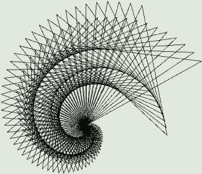

## 第一章：使用 TURTLE 模块绘制多边形

*几百年前，一位西方人听到一位印度人说地球就托在一只海龟的背上。当被问到海龟站在什么上面时，这位印度人解释道：“海龟就是站在海龟上，一直到无尽。”*


在开始使用数学构建本书中展示的所有酷炫东西之前，您需要学习如何使用一种名为 Python 的编程语言向计算机发出指令。在本章中，您将通过使用 Python 内置的 turtle 工具绘制不同的图形，熟悉一些基本的编程概念，如循环、变量和函数。正如您将看到的，turtle 模块是学习 Python 基本特性的有趣方式，也能让您初步体验到使用编程创建的乐趣。

### PYTHON 的 TURTLE 模块

Python 的 turtle 工具基于 Logo 编程语言中的原始“海龟”代理，该语言在 1960 年代发明，旨在让每个人都能更容易接触到计算机编程。Logo 的图形化环境让与计算机的交互变得直观和有趣。（请查阅 Seymour Papert 的精彩著作 *《心智风暴》*，了解更多使用 Logo 虚拟海龟学习数学的绝妙点子。）Python 编程语言的创造者非常喜欢 Logo 的海龟，于是他们在 Python 中编写了一个名为 *turtle* 的模块，用以复制 Logo 海龟的功能。

Python 的 turtle 模块让您控制一个小海龟形状的图像，就像视频游戏中的角色一样。您需要给出精确的指令来引导海龟在屏幕上移动。由于海龟在移动时会留下痕迹，我们可以利用它编写一个程序，绘制不同的图形。

让我们首先导入 turtle 模块！

#### 导入 TURTLE 模块

在 IDLE 中打开一个新的 Python 文件，并将其保存为 *myturtle.py* 文件，存放在 Python 文件夹中。您应该会看到一个空白页面。要在 Python 中使用海龟，首先必须导入 turtle 模块中的函数。

*函数* 是一组可重用的代码，用于在程序中执行特定的操作。Python 中有许多内置函数可供使用，您也可以编写自己的函数（稍后在本章中，您将学习如何编写自己的函数）。

在 Python 中，*模块* 是一个包含预定义函数和语句的文件，您可以在其他程序中使用它。例如，turtle 模块包含了很多有用的代码，当您安装 Python 时，它会自动下载这些代码。

尽管可以通过多种方式从模块中导入函数，但我们在这里使用一种简单的方法。在您刚刚创建的 *myturtle.py* 文件中，输入以下内容：

```py
from turtle import *
```

`from` 命令表示我们正在从外部文件导入某些内容。然后我们给出要导入的模块名称，在这个例子中是 `turtle`。我们使用 `import` 关键字从海龟模块中获取我们需要的有用代码。我们在这里使用星号（`*`）作为 *通配符命令*，意味着“从该模块导入所有内容”。确保 `import` 和星号之间有一个空格。

保存文件，并确保它位于 Python 文件夹中；否则，程序会抛出错误。

**警告**

*不要将文件保存为* turtle.py。*这个文件名已经存在，会导致与海龟模块的导入冲突！其他任何文件名都可以使用：* myturtle.py, turtle2.py, mondayturtle.py，*等等*。

#### 移动你的海龟

现在你已经导入了海龟模块，准备输入指令来移动海龟了。我们将使用 `forward()` 函数（缩写为 `fd`）使海龟前进一定步数，并留下一个轨迹。请注意，`forward()` 是我们刚刚从海龟模块中导入的函数之一。输入以下内容以使海龟前进：

```py
forward(100)
```

在这里，我们使用 `forward()` 函数，并在括号中输入数字 100，表示海龟应该走多少步。在这种情况下，100 是我们传递给 `forward()` 函数的 *参数*。所有函数都接受一个或多个参数。你可以随意传递其他数字给这个函数。当你按下 F5 运行程序时，一个新窗口应该会打开，中心有一个箭头，如 图 1-1 所示。


*图 1-1: 运行你的第一行代码！*

如你所见，海龟从屏幕中间开始，向前走了 100 步（实际上是 100 像素）。注意，默认形状是一个箭头，而不是海龟，且箭头默认朝右。要将箭头改为海龟，可以更新代码，使其如下所示：

```py
*myturtle.py*
from turtle import *
forward(100)
shape('turtle')
```

正如你可能猜到的，`shape()` 是海龟模块中定义的另一个函数。它允许你将默认的箭头形状改为其他形状，如圆形、方形或箭头。在这里，`shape()` 函数接受字符串值 `'turtle'` 作为参数，而不是数字。（你将在下一章学习更多关于字符串和不同数据类型的内容。）保存并重新运行 *myturtle.py* 文件，你应该会看到类似于 图 1-2 的效果。


*图 1-2: 将箭头改为海龟！*

现在你的箭头应该变成一个小海龟了！

#### 改变方向

海龟只能朝它当前面朝的方向前进。要改变海龟的方向，你必须先使用 `right()` 或 `left()` 函数让海龟转动指定的角度，然后才能前进。通过添加接下来显示的最后两行代码，更新你的 *myturtle.py* 程序：

```py
*myturtle.py*
from turtle import *
forward(100)
shape('turtle')
right(45)
forward(150)
```

在这里，我们将使用`right()`函数（或简称`rt()`）让乌龟在向前走 150 步之前先向右转 45 度。当你运行这段代码时，输出应该像图 1-3 一样。


*图 1-3：改变乌龟的方向*

正如你所看到的，乌龟从屏幕中间开始，向前走了 100 步，右转 45 度，然后又向前走了 150 步。注意 Python 按顺序运行每一行代码，从上到下。

练习 1-1：广场舞

返回到*myturtle.py*程序。你面临的第一个挑战是，仅使用`forward`和`right`函数修改程序中的代码，使得乌龟能够画出一个正方形。

### 使用循环重复代码

每种编程语言都有一种自动重复指定次数命令的方法。这非常有用，因为它可以避免你不断输入相同的代码，从而使程序变得冗长。它还可以帮助你避免拼写错误，避免程序无法正常运行。

#### 使用 FOR 循环

在 Python 中，我们使用`for`循环来重复代码。我们还使用`range`关键字来指定循环执行的次数。打开 IDLE 中的一个新程序文件，保存为*for_loop.py*，然后输入以下内容：

```py
*for_loop.py*
for i in range(2):
    print('hello')
```

在这里，`range()`函数为每个`for`循环创建了`i`，即一个*迭代器*。迭代器是一个每次使用时都会增加的值。括号中的数字 2 是我们传递给函数的参数，用来控制其行为。这类似于我们在前面章节中传递给`forward()`和`right()`函数的不同值。

在这个例子中，`range(2)`创建了一个包含两个数字（0 和 1）的序列。对于这两个数字中的每一个，`for`命令执行冒号后面指定的动作，也就是打印单词*hello*。

确保你通过按 TAB 键（一个 TAB 等于四个空格）来缩进所有你想要重复执行的代码行。缩进告诉 Python 哪些行在循环内，这样`for`就能准确地知道要重复哪些代码。别忘了结尾的冒号，它告诉计算机接下来是什么代码将在循环中执行。当你运行程序时，你应该在 shell 中看到以下内容：

```py
hello
hello
```

正如你所看到的，程序打印了两次`hello`，因为`range(2)`创建了一个包含两个数字（0 和 1）的序列。这意味着`for`命令会遍历序列中的两个项目，每次打印`hello`。让我们更新括号中的数字，像这样：

```py
*for_loop.py*
for i in range(10):
    print('hello')
```

当你运行这个程序时，应该会得到 10 次`hello`，像这样：

```py
hello
hello
hello
hello
hello
hello
hello
hello
hello
hello
```

让我们试试另一个例子，因为你在本书中将写很多`for`循环：

```py
*for_loop.py*
for i in range(10):
    print(i)
```

由于在 Python 中计数是从 0 开始的，而不是从 1 开始，因此 `for i in range(10)` 会给我们提供从 0 到 9 的数字。这段示例代码的意思是“对于范围 0 到 9 中的每一个值，显示当前数字。”`for` 循环会重复执行代码，直到范围中的数字用完。运行这段代码，你应该会看到类似这样的输出：

```py
0
1
2
3
4
5
6
7
8
9
```

未来你需要记住，在使用 `range` 的循环中，`i` 从 0 开始，并且在循环中的最后一个数字之前结束，但目前，如果你希望某些操作重复四次，你可以使用以下方式：

```py
for i in range(4):
```

就这么简单！让我们看看如何将这个方法应用到实际中。

#### 使用 `for` 循环绘制正方形

在练习 1-1 中，你的挑战是仅使用 `forward()` 和 `right()` 函数绘制一个正方形。为此，你必须将 `forward(100)` 和 `right(90)` 重复四次。但这需要多次输入相同的代码，既浪费时间又容易出错。

让我们使用 `for` 循环来避免重复相同的代码。以下是 *myturtle.py* 程序，它使用 `for` 循环来代替四次重复调用 `forward()` 和 `right()` 函数：

```py
*myturtle.py*
from turtle import *
shape('turtle')
for i in range(4):
    forward(100)
    right(90)
```

请注意，`shape('turtle')` 应该紧跟在导入 turtle 模块之后并在开始绘图之前。`for` 循环中的两行代码告诉海龟向前走 100 步，然后右转 90 度。（你可能需要站在与海龟相同的方向上才能知道“右”是哪个方向！）因为正方形有四条边，所以我们使用 `range(4)` 来将这两行代码重复四次。运行程序后，你应该会看到类似于 图 1-4 的效果。


*图 1-4：使用 `for` 循环绘制的正方形*

你应该看到海龟向前移动并向右转四次，最终回到原来的位置。你已经成功使用 `for` 循环绘制了一个正方形！

### 使用函数创建快捷方式

现在我们已经写了代码来绘制一个正方形，我们可以将所有这些代码保存到一个魔法关键词中，随时调用它来再次使用这些正方形代码。每种编程语言都有一种方法来实现这一点，在 Python 中，它被称为*函数*，这是计算机编程中最重要的特性。函数使代码更加紧凑且易于维护，将一个问题分解成多个函数通常能让你看到最好的解决方法。之前你使用了一些内置函数，它们来自 turtle 模块。在本节中，你将学习如何定义自己的函数。

要定义一个函数，你首先需要给它起个名字。这个名字可以是任何你想要的，只要它不是已经是 Python 关键词，比如 `list`、`range` 等等。在命名函数时，最好具有描述性，这样你在以后使用它们时能记得它们的作用。我们把函数命名为 `square()`，因为我们将用它来绘制正方形：

```py
*myturtle.py*
def square():
    for i in range(4):
        forward(100)
        right(90)
```

`def`命令告诉 Python 我们正在定义一个函数，之后列出的单词将成为函数名；在这里，它是`square()`。不要忘记`square`后面的括号！它们是 Python 中表示你在处理一个函数的标志。稍后我们会将值放入括号中，但即使没有任何值，括号也需要包含在内，以告诉 Python 你在定义一个函数。此外，不要忘记在函数定义末尾加上冒号。请注意，我们会将函数内部的所有代码缩进，以告诉 Python 哪些代码属于该函数。

如果你现在运行这个程序，什么也不会发生。你已经定义了一个函数，但你还没有告诉程序运行它。要做到这一点，你需要在*myturtle.py*文件的函数定义后面*调用*该函数。输入 Listing 1-1 中显示的代码。

```py
*myturtle.py*
from turtle import *
shape('turtle')
def square():
    for i in range(4):
        forward(100)
        right(90)
square()
```

*Listing 1-1：在文件末尾调用`square()`函数*。

当你像这样在最后调用`square()`时，程序应该会正确运行。现在你可以在程序中的任何地方使用`square()`函数来快速绘制另一个正方形。

你还可以在循环中使用这个函数来构建更复杂的内容。例如，要画一个正方形，稍微右转，画另一个正方形，再稍微右转，重复这些步骤，把函数放进循环中是有意义的。

下一个练习展示了一种由正方形组成的有趣形状！可能需要一些时间才能让你的海龟完成这个形状，所以你可以通过在`shape('turtle')`后面添加`speed()`函数来加速它。在*myturtle.py*中使用`speed(0)`可以让海龟移动得最快，而`speed(1)`是最慢的。如果你想，也可以尝试不同的速度，比如`speed(5)`和`speed(10)`。

练习 1-2：正方形的圆

编写并运行一个函数，绘制 60 个正方形，每个正方形之后右转 5 度。使用循环！你的结果应该看起来像这样：


### 使用变量绘制图形

到目前为止，我们的所有正方形都是相同大小的。为了画不同大小的正方形，我们需要改变海龟每条边前进的距离。我们不必每次想要不同的大小时都改变`square()`函数的定义，而是可以使用一个*变量*，在 Python 中，变量是一个可以表示并且可以改变的值。它类似于代数中*x*可以代表一个可以变化的值。

在数学课上，变量通常是单个字母，但在编程中，你可以给变量任何你想要的名字！就像函数一样，我建议给变量起一个具有描述性的名字，这样可以让代码更容易阅读和理解。

#### 在函数中使用变量

当你定义一个函数时，你可以在括号内使用变量作为函数的参数。例如，你可以将*myturtle.py*程序中`square()`函数的定义更改为以下内容，以便绘制任何大小的正方形，而不是固定大小：

```py
*myturtle.py*
def square(sidelength):
    for i in range(4):
        forward(sidelength)
        right(90)
```

这里，我们使用 `sidelength` 来定义 `square()` 函数。现在当你调用这个函数时，你必须在括号内放一个值，我们称这个值为 *参数*，括号中的任何数字都会代替 `sidelength`。例如，调用 `square(50)` 和 `square(80)` 会像 图 1-5 所示。


*图 1-5：大小为 50 和大小为 80 的两个正方形*

当你用变量来定义一个函数时，你可以通过输入不同的数字来直接调用 `square()` 函数，而不需要每次都更新函数定义。

#### 变量错误

目前，如果我们忘记在函数的括号中填写一个值，就会出现这个错误：

```py
Traceback (most recent call last):
  File "C:/Something/Something/my_turtle.py", line 12, in <module>
    square()
TypeError: square() missing 1 required positional argument: 'sidelength'
```

这个错误告诉我们缺少 `sidelength` 的值，因此 Python 不知道该把正方形做多大。为了避免这个问题，我们可以在函数定义的第一行给这个长度一个默认值，像这样：

```py
def square(sidelength=100):
```

这里，我们在 `sidelength` 中放了一个默认值 100。现在，如果我们在 `square` 后的括号中放一个值，它将绘制该长度的正方形；但是如果我们把括号留空，它将默认绘制一个边长为 100 的正方形，并且不会报错。更新后的代码应该会生成 图 1-6 中的图像：

```py
square(50)
square(30)
square()
```


*图 1-6：默认大小为 100 的正方形、大小为 50 的正方形和大小为 30 的正方形*

通过设置这样的默认值，可以更方便地使用我们的函数，而不用担心如果做错了什么会导致错误。在编程中，这被称为让程序变得更 *健壮*。

练习 1-3：尝试并再试

编写一个 `triangle()` 函数，绘制一个给定“边长”的三角形。

### 等边三角形

*多边形* 是一个具有多条边的图形。*等边三角形* 是一种特殊的多边形，具有三条相等的边。图 1-7 显示了它的样子。


*图 1-7：等边三角形的角度，包括一个外角*

等边三角形的三个内角都为 60 度。你可能记得几何课上有一个规则：等边三角形的三个角度加起来是 180 度。事实上，这对所有三角形都是成立的，不仅仅是等边三角形。

#### 编写 `triangle()` 函数

让我们运用你迄今为止学到的知识，编写一个函数，让海龟沿三角形路径行走。由于等边三角形的每个角都是 60 度，你可以将 `square()` 函数中的 `right()` 移动角度更新为 `60`，像这样：

```py
*myturtle.py*
def triangle(sidelength=100):
    for i in range(3):
        forward(sidelength)
        right(60)
triangle()
```

但是，当你保存并运行这个程序时，你不会得到一个三角形。相反，你会看到类似 图 1-8 的内容。


*图 1-8：第一次尝试绘制三角形*

看起来我们开始画的是一个六边形（一个六边形多边形），而不是一个三角形。我们得到了六边形，而不是三角形，因为我们输入的是 60 度，这是等边三角形的*内角*。我们需要输入的是*外角*，而不是`right()`函数中的内角，因为海龟是根据外角来转动的，而不是内角。对于正方形来说，这不是问题，因为正方形的内角和外角恰好是相同的：90 度。

要找到三角形的外角，只需用 180 减去内角。这意味着等边三角形的外角是 120 度。将代码中的 60 更新为 120，你应该就能得到一个三角形。

练习 1-4：多边形函数

写一个名为`polygon`的函数，它接受一个整数作为参数，并让海龟画出一个有该整数个边的多边形。

#### 使变量变化

我们可以对变量做更多的操作：我们可以自动增加变量的值，这样每次运行函数时，正方形就会比上一个大。例如，使用一个`length`变量，我们可以先画一个正方形，然后增加`length`变量一点，再画下一个正方形，像这样增加变量：

```py
length = length + 5
```

作为一个数学爱好者，当我第一次看到这行代码时，它让我感到困惑！“length 等于 length + 5”怎么可能呢？这不可能！但代码不是方程式，在这种情况下，等号（`=`）并不意味着“这边等于那边”。*在编程中，等号表示我们在给变量赋值*。

以以下示例为例。打开 Python shell，并输入以下代码：

```py
>>> radius = 10
```

这意味着我们正在创建一个名为`radius`的变量（如果它还不存在的话），并将其赋值为 10。你以后可以随时给它赋不同的值，比如这样：

```py
radius = 20
```

按下 ENTER 键，你的代码将会被执行。这意味着值 20 将被赋给`radius`变量。要检查一个变量是否等于某个值，可以使用双等号（`==`）。例如，要检查`radius`变量的值是否为 20，你可以在 shell 中输入以下内容：

```py
>>> radius == 20
```

按下 ENTER 键，它应该会打印出以下内容：

```py
True
```

现在`radius`变量的值是 20。通常，比起手动给变量赋数值，增量操作会更有用。你可以使用一个名为`count`的变量来统计程序中某个事件发生的次数。它应该从 0 开始，并在每次事件发生后增加 1。为了让一个变量增加 1，你可以将它的值加 1，然后将新值赋给该变量，像这样：

```py
count = count + 1
```

你也可以按以下方式编写代码，使其更加简洁：

```py
count += 1
```

这意味着“给我的计数变量加 1”。你可以在这种表示法中使用加法、减法、乘法和除法。让我们通过在 Python shell 中运行这段代码来看看它是如何工作的。我们将`x`赋值为 12，`y`赋值为 3，然后让`x`增加`y`的值：

```py
>>> x = 12
>>> y = 3
>>> x += y
>>> x
15
>>> y
3
```

注意`y`没有改变。我们可以通过加法、减法、乘法和除法来递增`x`，使用类似的符号表示法：

```py
>>> x += 2
>>> x
17
```

现在，我们将把`x`设置为其当前值减去 1：

```py
>>> x -= 1
>>> x
16
```

我们知道`x`是 16。现在我们将`x`设置为其当前值的两倍：

```py
>>> x *= 2
>>> x
32
```

最后，我们可以通过将`x`除以 4 来将其设置为当前值的四分之一：

```py
>>> x /= 4
>>> x
8.0
```

现在你知道如何使用算术运算符和等号递增一个变量。总之，`x += 3`将使`x`增加 3，而`x -= 1`将使其减少 1，以此类推。

你可以使用以下代码行让长度在每次循环时增加 5，这在接下来的练习中会非常有用：

```py
length += 5
```

使用这种符号表示法，每次使用`length`变量时，都会向其值添加 5，并将结果保存到该变量中。

练习 1-5：TURTLE 螺旋

创建一个函数来绘制 60 个正方形，每绘制一个正方形后旋转 5 度，并使每个连续的正方形变大。从`length`为 5 开始，每个正方形增加 5 个单位。它应该像这样：


### 总结

在本章中，你学习了如何使用 Python 的 turtle 模块及其内置函数，如`forward()`和`right()`来绘制不同的图形。你还看到了 turtle 能够执行比我们在这里介绍的更多功能。还有很多其他的功能，我鼓励你在进入下一章之前先尝试一下。如果你在网上搜索“python turtle”，第一个结果很可能是官方 Python 网站上的 turtle 模块文档 (*[`python.org/`](https://python.org/)*)。你将在该页面找到所有 turtle 方法，其中一些在图 1-9 中展示。


*图 1-9：你可以在 Python 网站上找到更多的 turtle 函数和方法！*

你学习了如何定义自己的函数，从而节省了可以随时重用的宝贵代码。你还学习了如何使用`for`循环多次运行代码，而无需重新编写代码。知道如何使用函数和循环节省时间并避免错误，将在你以后构建更复杂的数学工具时非常有用。

在下一章中，我们将基于你使用的基本算术运算符来递增变量。你将学习更多关于 Python 中基本运算符和数据类型的知识，以及如何使用它们来构建简单的计算工具。我们还将探索如何将项目存储在列表中，并使用索引访问列表项。

练习 1-6：星星的诞生

首先，编写一个“star”函数，它将绘制一个五角星，像这样：


接下来，编写一个名为`starSpiral()`的函数，它将绘制一个星星螺旋，像这样：


