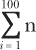
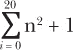

## 第二章：用列表和循环让繁琐的算术变得有趣

*“你是说我明天还得再来一次？” — 艾丹·法雷尔在第一天上学后*


大多数人在想到数学时，会想到算术：加法、减法、乘法和除法。虽然使用计算器和计算机做算术相当简单，但它仍然可能涉及很多重复的任务。例如，要使用计算器加上 20 个不同的数字，你必须输入加号运算符 19 次！

在本章中，你将学习如何使用 Python 自动化一些繁琐的算术操作。首先，你将了解数学运算符和 Python 中可以使用的不同数据类型。然后，你将学习如何使用变量来存储和计算值。你还将学习如何使用列表和循环来重复代码。最后，你将结合这些编程概念，编写函数来自动执行复杂的计算。你会发现，Python 可以比任何你能买到的计算器更强大，最棒的是，它是免费的！

### 基本运算符

在交互式 Python shell 中做算术很容易：你只需输入表达式，按下 ENTER 键即可进行计算。表 2-1 显示了一些最常见的数学运算符。

**表 2-1：Python 中常见的数学运算符**

| **运算符** | **语法** |
| --- | --- |
| 加法 | + |
| 减法 | – |
| 乘法 | * |
| 除法 | / |
| 指数 | ** |

打开你的 Python shell，尝试一下清单 2-1 中的基本算术示例。

```py
>>> 23 + 56  #Addition
79
>>> 45 * 89  #Multiplication is with an asterisk
4005
>>> 46 / 13  #Division is with a forward slash
3.5384615384615383
>>> 2 ** 4   #2 to the 4th power
16
```

*清单 2-1：尝试一些基本的数学运算符*

答案应作为输出显示。你可以使用空格使代码更具可读性（`6 + 5`），也可以不使用空格（`6+5`），但是在做算术时，Python 对这些空格不会有任何影响。

请记住，在 Python 2 中，除法有点棘手。例如，Python 2 会对 `46/13` 进行整数除法，只返回整数结果（3），而不是返回小数值，如在清单 2-1 中所示。因为你安装的是 Python 3，所以不应遇到这个问题。不过我们接下来看到的图形包使用的是 Python 2，因此我们在除法时必须确保要求返回小数结果。

#### 对变量进行操作

你也可以在变量上使用运算符。在第一章中，你学习了在定义函数时使用变量。像代数中的变量一样，编程中的变量可以通过存储结果并在之后再次使用，从而将复杂的计算分解为多个阶段。清单 2-2 展示了如何使用变量存储数字并对其进行操作，无论其值是什么。

```py
>>> x = 5
>>> x = x + 2
>>> length = 12
>>> x + length
19
```

*清单 2-2：在变量中存储结果*

在这里，我们将值 5 赋给 `x` 变量，然后将其增加 2，使得 `x` 变成 7。接着，我们将值 12 赋给变量 `length`。当我们将 `x` 和 `length` 相加时，我们在加 7 + 12，所以结果是 19。

#### 使用运算符编写 `average()` 函数

让我们练习使用运算符来计算一系列数字的平均值。正如你可能知道的，计算平均值的方法是将所有数字相加，再除以数字的个数。例如，如果你的数字是 10 和 20，你将 10 和 20 相加并将和除以 2，如下所示：

(10 + 20) / 2 = 15

如果你的数字是 9、15 和 23，你将它们相加并将和除以 3：

(9 + 15 + 23) / 3 = 47 / 3 = 15.67

手动做这件事可能会很繁琐，但用代码就简单多了。我们先创建一个名为 *arithmetic.py* 的 Python 文件，并编写一个函数来计算两个数字的平均值。你应该能够运行这个函数并传入两个数字作为参数，不需要任何运算符，最终输出平均值，如下所示：

```py
>>> average(10,20)
15.0
```

让我们来试一下。

#### 注意运算顺序！

我们的 `average()` 函数将两个数字 `a` 和 `b` 转换为它们和的一半，然后使用 `return` 关键字返回该值。这里是我们函数的代码：

```py
*arithmetic.py*
def average(a,b):
    return a + b / 2
```

我们定义了一个名为 `average()` 的函数，它需要两个数字 `a` 和 `b` 作为输入。我们编写该函数返回这两个数字的和除以 2。然而，当我们在 shell 中测试这个函数时，得到的结果是错误的：

```py
>>> average(10,20)
20.0
```

之所以这样，是因为我们在编写函数时没有考虑到 *运算顺序*。你可能还记得数学课上，乘法和除法优先于加法和减法，所以在这个例子中，除法是先执行的。这个函数是先将 `b` 除以 2，然后 *再* 加上 `a`。那么我们该如何修正这个问题呢？

#### 使用括号与运算符

我们需要使用括号来告诉 Python 先加两个数字，再进行除法运算：

```py
*arithmetic.py*
def average(a,b):
    return (a + b) / 2
```

现在，函数应该先加 `a` 和 `b`，再除以 2。以下是在 shell 中运行函数时发生的情况：

```py
>>> average(10,20)
15.0
```

如果你手动执行相同的计算，你会发现输出是正确的！尝试使用不同的数字来调用 `average()` 函数。

### PYTHON 中的数据类型

在继续对数字进行算术运算之前，让我们先了解一些基本的 Python 数据类型。不同的数据类型有不同的能力，并且你不能对所有数据类型执行相同的操作，因此了解每种数据类型的工作原理非常重要。

#### 整数与浮点数

在 Python 中，你常常需要对两个数据类型进行操作，它们是整数和浮点数。*整数*是没有小数部分的数字。*浮点数*是包含小数的数字。你可以通过使用 `float()` 和 `int()` 函数，分别将整数转换为浮点数，反之亦然，像这样：

```py
>>> x = 3
>>> x
3
>>> y = float(x)
>>> y
3.0
>>> z = int(y)
>>> z
3
```

在这个例子中，我们使用 `x = 3` 将值 3 赋给变量 `x`。然后我们使用 `float(x)` 将 `x` 转换为浮动类型，并将结果（`3.0`）赋给变量 `y`。最后，我们将 `y` 转换为整数并将结果（`3`）赋给变量 `z`。这展示了如何在浮动类型和整数之间轻松转换。

#### 字符串

*字符串* 是按顺序排列的字母数字字符，可以是字母组成的词，或者是数字。你可以通过将字符放在单引号（`''`）或双引号（`""`）中来定义字符串，例如：

```py
>>> a = "hello"
>>> a + a
'hellohello'
>>> 4*a
'hellohellohellohello'
```

在这里，我们将字符串 `"hello"` 存储在变量 `a` 中。当我们将变量 `a` 与自身相加时，我们得到一个新字符串 `'hellohello'`，它是两个 `hello` 的组合。请记住，字符串和数字数据类型（整数和浮动类型）不能相加。如果你尝试将整数 `2` 与字符串 `"hello"` 相加，你将得到以下错误信息：

```py
>>> b = 2
>>> b
2
>>> d = "hello"
>>> b + d
Traceback (most recent call last):
  File "<pyshell#34>", line 1, in <module>
    b + d
TypeError: unsupported operand type(s) for +: 'int' and 'str'
```

然而，如果一个数字是字符串（或者用引号括起来），你可以将它与另一个字符串相加，例如：

```py
>>> b = '123'
>>> c = '4'
>>> b + c
'1234'
>>> 'hello' + ' 123'
'hello 123'
```

在这个例子中，`'123'` 和 `'4'` 都是由数字组成的字符串，而不是数字数据类型。因此，当你将这两个字符串相加时，你得到一个更长的字符串（`'1234'`），它是这两个字符串的组合。你也可以用字符串 `'hello'` 和 `' 123'` 做同样的事情，尽管一个是字母组成，另一个是数字组成。将字符串连接起来形成一个新字符串叫做 *连接*。

你也可以通过将字符串乘以一个整数来重复该字符串，例如：

```py
>>> name = "Marcia"
>>> 3 * name
'MarciaMarciaMarcia'
```

但你不能将一个字符串减去、乘以或除以另一个字符串。在命令行中输入以下内容，看看会发生什么：

```py
>>> noun = 'dog'
>>> verb = 'bark'
>>> noun * verb
Traceback (most recent call last):
  File "<pyshell#6>", line 1, in <module>
    noun * verb
TypeError: can't multiply sequence by non-int of type 'str'
```

正如你所看到的，当你尝试将 `'dog'` 和 `'bark'` 相乘时，你会得到一个错误，告诉你不能将两个字符串数据类型相乘。

#### 布尔值

*布尔值* 是真/假的值，这意味着它们只能是其中之一，没有中间值。布尔值在 Python 中必须大写，通常用于比较两个事物的值。要比较值，你可以使用大于（`>`）和小于（`<`）符号，如下所示：

```py
>>> 3 > 2
True
```

因为 3 大于 2，所以这个表达式返回 `True`。但是检查两个值是否相等需要两个等号（`==`），因为一个等号只是将值赋给变量。这里是一个例子，展示了如何工作：

```py
>>> b = 5
>>> b == 5
True
>>> b == 6
False
```

首先，我们使用一个等号将值 5 赋给变量 `b`。然后我们使用两个等号检查 `b` 是否等于 5，这会返回 `True`。

#### 检查数据类型

你可以通过将一个变量传递给 `type()` 函数来始终检查你正在处理的数据类型。Python 会方便地告诉你该变量中的值是什么数据类型。例如，我们可以将一个布尔值赋给一个变量，如下所示：

```py
>>> a = True
>>> type(a)
<class 'bool'>
```

当你将变量 `a` 传递给 `type()` 函数时，Python 会告诉你变量 `a` 中的值是布尔类型。

尝试检查一个整数的数据类型：

```py
>>> b = 2
>>> type(b)
<class 'int'>
```

以下代码检查 0.5 是否是浮动类型：

```py
>>> c = 0.5
>>> type(c)
<class 'float'>
```

这个例子确认了引号中的字母数字符号是字符串：

```py
>>> name = "Steve"
>>> type(name)
<class 'str'>
```

现在你已经了解了 Python 中的不同数据类型以及如何检查你正在处理的值的数据类型，让我们开始自动化简单的算术任务吧。

### 使用列表存储值

到目前为止，我们一直使用变量来保存单个值。*列表*是一种可以保存多个值的变量类型，这在自动化重复任务时非常有用。要在 Python 中声明一个列表，你只需要为列表创建一个名称，像使用变量一样使用`=`命令，然后将你想放入列表的元素用方括号`[]`括起来，并用逗号分隔每个元素，如下所示：

```py
>>> a = [1,2,3]
>>> a
[1, 2, 3]
```

经常会创建一个空列表，这样以后可以向其中添加值，比如数字、坐标和对象。为了做到这一点，只需像平常一样创建列表，但不添加任何值，如下所示：

```py
>>> b = []
>>> b
[]
```

这会创建一个空列表`b`，你可以将不同的值填充到其中。让我们看看如何向列表添加元素。

#### 向列表添加元素

要向列表添加一个元素，请使用`append()`函数，如下所示：

```py
>>> b.append(4)
>>> b
[4]
```

首先，键入你想要添加元素的列表名称（`b`），然后加一个句点，接着使用`append()`并在括号内指定你想添加的元素。你可以看到列表现在仅包含数字 4。

你也可以向非空列表添加元素，像这样：

```py
>>> b.append(5)
>>> b
[4, 5]
>>> b.append(True)
>>> b
[4, 5, True]
```

添加到现有列表的元素会出现在列表的末尾。如你所见，列表不一定只能包含数字。这里，我们将布尔值`True`添加到包含数字 4 和 5 的列表中。

单个列表也可以包含多个数据类型。例如，你可以像这里这样将文本作为字符串添加进去：

```py
>>> b.append("hello")
>>> b
[4, 5, True, 'hello']
```

要添加一个字符串，你需要在文本周围加上双引号或单引号。否则，Python 会查找名为`hello`的变量，这个变量可能存在也可能不存在，从而导致错误或意外的行为。现在你在列表`b`中有四个元素：两个数字，一个布尔值和一个字符串。

#### 列表操作

和字符串一样，你可以在列表上使用加法和乘法运算符，但你不能直接将数字和列表相加。相反，你必须使用连接操作符将其附加到列表上。

例如，你可以使用`+`操作符将两个列表相加，像这样：

```py
>>> c = [7,True]
>>> d = [8,'Python']
>>> c + d #adding two lists
[7, True, 8, 'Python']
```

我们还可以通过一个数字来乘以一个列表，像这样：

```py
>>> 2 * d #multiplying a list by a number
[8, 'Python', 8, 'Python']
```

如你所见，将数字 2 与列表`d`相乘会使原始列表中的元素数量翻倍。

但是，当我们尝试用加号操作符将数字和列表相加时，会出现一个错误，称为类型错误（TypeError）：

```py
>>> d + 2 #you can't add a list and an integer
Traceback (most recent call last):
  File "<pyshell#22>", line 1, in <module>
    d + 2
TypeError: can only concatenate list (not "int") to list
```

这是因为你不能用加号将数字和列表相加。虽然你可以将两个列表相加，将一个元素添加到列表中，甚至将一个列表与一个数字相乘，但你只能将列表连接到另一个列表。

#### 从列表中移除元素

从列表中移除一个元素也很简单：你可以使用`remove()`函数，传入你要移除的元素作为参数，如下所示。确保引用你要移除的元素时与代码中完全一致，否则 Python 无法理解应该删除什么。

```py
>>> b = [4,5,True,'hello']
>>> b.remove(5)
>>> b
[4, True, 'hello']
```

在这个例子中，`b.remove(5)`从列表中移除`5`，但注意，其他项的顺序保持不变。顺序被保持这一点将变得很重要。

### 在循环中使用列表

在数学中，你常常需要对多个数字应用相同的操作。例如，一本代数书可能定义了一个函数，并要求你将一堆不同的数字代入该函数。你可以通过将数字存储在列表中，然后使用在第一章中学习到的`for`循环，对列表中的每一项执行相同的操作来完成此任务。记住，当你反复执行某个操作时，这叫做*迭代*。迭代器是`for i in range(10)`中的变量`i`，我们在之前的程序中使用过，但它不一定总是叫`i`；它可以是任何你想要的名字，就像这个例子：

```py
>>> a = [12,"apple",True,0.25]
>>> for thing in a:
        print(thing)

12
apple
True
0.25
```

这里，迭代器被称为`thing`，它对列表`a`中的每一项应用`print()`函数。注意，项是按顺序打印的，每项占一行。如果要将所有内容打印在同一行，你需要在`print()`函数中添加`end`参数并设置为空字符串，如下所示：

```py
>>> for thing in a:
        print(thing, end='')
12appleTrue0.25
```

这会将所有项打印在同一行，但所有值会连在一起，使得它们难以区分。`end`参数的默认值是换行符，如你在前面的例子中看到的那样，但你可以通过在引号中插入任何字符或标点来更改它。这里我添加了一个逗号：

```py
>>> a = [12,"apple",True,0.25]
>>> for thing in a:
        print(thing, end=',')
12,apple,True,0.25,
```

现在每项之间用逗号分隔，这样更容易阅读。

#### 使用列表索引访问单个项

你可以通过指定列表的名称，然后在方括号中输入索引来引用列表中的任何元素。*索引*是列表中项的位置或编号。列表的第一个索引是 0。索引使我们能够使用有意义的名称来存储一系列值，并在程序中轻松访问它们。你可以在 IDLE 中尝试以下代码，看看索引是如何工作的：

```py
>>> name_list = ['Abe','Bob','Chloe','Daphne']
>>> score_list = [55,63,72,54]
>>> print(name_list[0], score_list[0])
Abe 55
```

索引也可以是一个变量或迭代器，如下所示：

```py
>>> n = 2
>>> print(name_list[n], score_list[n+1])
Chloe 54
>>> for i in range(4):
        print(name_list[i], score_list[i])
Abe 55
Bob 63
Chloe 72
Daphne 54
```

#### 使用`enumerate()`获取索引和值

要获取列表中项的索引和值，你可以使用一个方便的函数，叫做`enumerate()`。它的工作原理如下：

```py
>>> name_list = ['Abe','Bob','Chloe','Daphne']
>>> for i, name in enumerate(name_list):
       print(name,"has index",i)

Abe has index 0
Bob has index 1
Chloe has index 2
Daphne has index 3
```

这里，`name`是列表中项的值，而`i`是索引。使用`enumerate()`时需要记住的重要事项是，索引先出现，然后是值。你将在后面看到，当我们将对象放入列表并同时访问对象及其在列表中的位置时，这一点非常重要。

#### 索引从零开始

在第一章中，你学习了`range(n)`函数，它生成一个从 0 开始，到`n`（但不包括`n`）的数字序列。类似地，列表索引从 0 开始，而不是 1，因此第一个元素的索引是`0`。尝试以下操作，看看它是如何工作的：

```py
>>> b = [4,True,'hello']
>>> b[0]
4
>>> b[2]
'hello'
```

在这里，我们创建了一个名为 `b` 的列表，然后请求 Python 显示列表 `b` 中索引为 `0` 的项目，也就是第一个位置。因此，我们得到 `4`。当我们请求列表 `b` 中索引为 `2` 的项目时，我们得到 `'hello'`。

#### 访问一系列列表项目

你可以在方括号内使用范围（`:`）语法来访问列表中的一系列元素。例如，要返回从列表中的第二项到第六项的所有元素，可以使用以下语法：

```py
>>> myList = [1,2,3,4,5,6,7]
>>> myList[1:6]
[2, 3, 4, 5, 6]
```

需要注意的是，`1:6` 范围语法包含该范围中的 *第一个* 索引 `1`，但 *不包括* 最后一个索引 `6`。这意味着范围 `1:6` 实际上给我们返回的是索引 `1` 到 `5` 之间的项目。

如果你没有指定范围的结束索引，Python 会默认使用列表的长度。默认情况下，它返回从第一个索引到列表末尾的所有元素。例如，你可以使用以下语法访问列表 `b` 中从第二个元素（索引 `1`）到列表末尾的所有内容：

```py
>>> b[1:]
[True, 'hello']
```

如果你没有指定起始位置，Python 会默认从列表的第一个项目开始，并且不会包括结束索引，如下所示：

```py
>>> b[:1]
[4]
```

在这个例子中，`b[:1]` 包含第一个项目（索引 `0`），但不包括索引为 `1` 的项目。一个非常有用的知识是，你可以通过使用负数来访问列表中的最后几个元素，即使你不知道它的长度。要访问最后一项，你可以使用 `-1`，要访问倒数第二项，你可以使用 `-2`，像这样：

```py
>>> b[-1]
'hello'
>>> b[-2]
True
```

当你使用他人制作的列表或使用非常长的列表时，这非常有用，因为在这些情况下很难跟踪所有的索引位置。

#### 查找项目的索引

如果你知道某个值在列表中，但不知道它的索引，可以通过给出列表名称，后跟`index`函数，并将你要搜索的值作为其参数放在括号中来找到它的位置。在 Shell 中，创建列表 `c`，如下面所示，然后尝试以下操作：

```py
>>> c = [1,2,3,'hello']
>>> c.index(1)
0
 >>> c.index('hello')
3
>>> c.index(4)
Traceback (most recent call last):
  File "<pyshell#85>", line 1, in <module>
    b.index(4)
ValueError: 4 is not in list
```

你可以看到，查询值 `1` 返回索引 `0`，因为它是列表中的第一个项目。当你查询 `'hello'` 的索引时，它告诉你是 `3`。然而，最后一次尝试会导致错误信息。如错误信息的最后一行所示，错误的原因是我们要找的值 `4` 不在列表中，因此 Python 无法返回它的索引。

要检查某个项目是否存在于列表中，使用 `in` 关键字，像这样：

```py
>>> c = [1,2,3,'hello']
>>> 4 in c
False
>>> 3 in c
True
```

在这里，如果某个项目在列表中，Python 会返回 `True`，如果不在列表中，则返回 `False`。

#### 字符串也使用索引

你学到的关于列表索引的所有知识同样适用于字符串。一个字符串有一个长度，字符串中的所有字符都有索引。在 Shell 中输入以下命令，看看它是如何工作的：

```py
>>> d = 'Python'
>>> len(d) #How many characters are in 'Python'?
6
>>> d[0]
'P'
>>> d[1]
'y'
>>> d[-1]
'n'
>>> d[2:]
'thon'
>>> d[:5]
'Pytho'
>>> d[1:4]
'yth'
```

在这里，你可以看到字符串 `'Python'` 由六个字符组成。每个字符都有一个索引，你可以使用与访问列表相同的语法来访问它们。

### 总结

当你在循环中加一堆数字时，跟踪这些数字的累加和非常有用。保持累加和是一个重要的数学概念，叫做 *求和*。

在数学课上，你经常会看到求和符号与一个大写的希腊字母 sigma 关联，代表 *S*（和）。其表示形式如下：



求和符号表示你将 *n* 替换为 *i*，从最小值（列在 sigma 下方）开始，一直到最大值（列在 sigma 上方）。与 Python 的 `range(n)` 不同，求和符号包括最大值。

#### 创建 `RUNNING_SUM` 变量

要在 Python 中编写求和程序，我们可以创建一个名为 `running_sum` 的变量（`sum` 已经是 Python 内置的函数）。我们首先将其初始化为零，然后每次添加值时递增 `running_sum` 变量。为此，我们再次使用 `+=` 符号。你可以在命令行中输入以下内容查看示例：

```py
>>> running_sum = 0
>>> running_sum += 3
>>> running_sum
3
>>> running_sum += 5
>>> running_sum
8
```

你学会了如何使用 `+=` 命令作为快捷方式：使用 `running_sum += 3` 等同于 `running_sum = running_sum + 3`。让我们通过多次递增累加和来测试它。为此，请将以下代码添加到 *arithmetic.py* 程序中：

```py
*arithmetic.py*
running_sum = 0
➊ for i in range(10):
➋    running_sum += 3
  print(running_sum)
```

我们首先创建一个值为 `0` 的 `running_sum` 变量，然后使用 `range(10)` 运行 `for` 循环 10 次 ➊。循环体中的缩进部分在每次循环时都会将 3 加到 `running_sum` 的值中 ➋。当循环执行完 10 次后，Python 会跳转到最后一行代码，这里是 `print` 语句，用于显示 `running_sum` 在 10 次循环后的值。

从这里，你可能能够推算出最终的和，下面是输出结果：

```py
30
```

换句话说，10 乘以 3 等于 30，因此输出是有道理的！

#### 编写 `MYSUM()` 函数

让我们将我们的累加和程序扩展为一个名为 `mySum()` 的函数，它接受一个整数作为参数，并返回从 1 到指定数字的所有数字的和，如下所示：

```py
>>> mySum(10)
55
```

首先，我们声明累加和的值，然后在循环中递增它：

```py
*arithmetic.py*
def mySum(num):
    running_sum = 0
    for i in range(1,num+1):
        running_sum += i
    return running_sum
```

为了定义 `mySum()` 函数，我们将累加和从 0 开始。然后，我们设置一个 `i` 的取值范围，从 1 到 `num`。请注意，`range(1,num)` 不包括 `num` 本身！接着，我们在每次循环后将 `i` 加到累加和中。当循环结束时，它应该返回累加和的值。

使用一个更大的数字在命令行中运行该函数。它应该能迅速返回从 1 到该数字的所有数字的和：

```py
>>> mySum(100)
5050
```

非常方便！要解决我们之前提到的更复杂的 sigma 问题，只需将循环修改为从 0 到 20（包括 20），并在每次循环时加上 `i` 的平方加 1：

```py
*arithmetic.py*
def mySum2(num):
    running_sum = 0
    for i in range(num+1):
        running_sum += i**2 + 1
    return running_sum
```

我将循环修改为从 0 开始，正如 sigma 符号所示：



当我们运行这个时，得到的结果是：

```py
>>> mySum2(20)
2891
```

练习 2-1：求和

求 1 到 100 的所有数字之和。那 1 到 1,000 呢？有没有发现什么规律？

### 求一组数字的平均值

现在你已经掌握了一些新技能，让我们来改进我们的平均值函数。我们可以编写一个函数，使用列表来计算任何数字列表的平均值，而无需指定数字的数量。

在数学课上，你学到要计算一组数字的平均值，方法是将这些数字的和除以数字的个数。在 Python 中，你可以使用名为`sum()`的函数来将列表中所有数字相加，像这样：

```py
>>> sum([8,11,15])
34
```

现在我们只需要找出列表中的项数。在本章前面编写的`average()`函数中，我们知道只有两个数字。但如果有更多呢？幸运的是，我们可以使用`len()`函数来计算列表中的项数。下面是一个示例：

```py
>>> len([8,11,15])
3
```

如你所见，你只需输入函数并将列表作为参数传递。这意味着我们可以同时使用`sum()`和`len()`函数，通过将列表的和除以列表的长度来求得列表中项的平均值。利用这些内置的关键字，我们可以创建一个简洁的平均值函数，它的样子可能是这样的：

```py
*arithmetic.py*
def average3(numList):
    return sum(numList)/len(numList)
```

当你在命令行中调用这个函数时，你应该得到以下输出：

```py
>>> average3([8,11,15])
11.333333333333334
```

这个版本的平均值函数的好处是，它既适用于短列表，也适用于长列表！

练习 2-2：求平均值

求下面列表中数字的平均值：

```py
d = [53, 28, 54, 84, 65, 60, 22, 93, 62, 27, 16, 25, 74, 42, 4, 42,
15, 96, 11, 70, 83, 97, 75]
```

### 总结

在本章中，你学习了数据类型，如整数、浮点数和布尔值。你学会了如何创建列表、添加和删除列表中的元素，并使用索引查找列表中的特定项。接着，你学习了如何使用循环、列表和变量来解决算术问题，比如求一组数字的平均值和保持累计和。

在下一章中，你将学习条件语句，这是另一个重要的编程概念，学习它你才能应对本书的其余部分。
