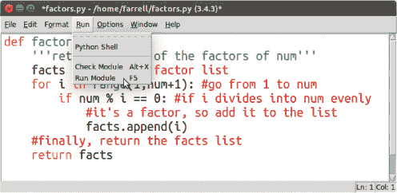
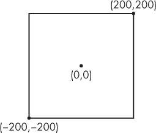
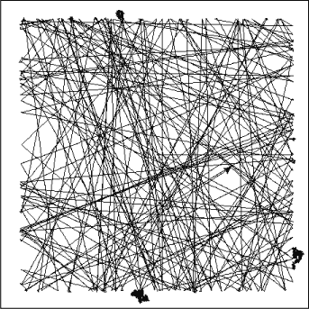
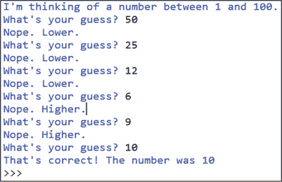

## 第三章：使用条件语句进行猜测和检查

*“当它热时，将面团放入烤箱：确保它确实是面团之后。” — 伊德里斯·沙阿，《学习如何学习》


在你为本书编写的几乎每个程序中，你都会指示计算机做出决策。你可以使用一个非常重要的编程工具，称为*条件语句*，来做到这一点。在编程中，我们可以使用条件语句

比如“如果这个变量大于 100，就做这个；否则，做那个”，用来检查某些条件是否满足，然后根据结果决定接下来该做什么。事实上，这是一种非常强大的方法，我们在解决大问题时会用到，甚至它是机器学习的核心。在最基本的层面上，程序是在进行猜测，然后根据反馈修改其猜测。

在本章中，你将学习如何使用猜测与检查方法，通过 Python 获取用户输入，并根据输入告诉程序打印什么内容。然后你将使用条件语句比较不同的数值，在不同的数学情境下使海龟在屏幕上随机漫游。你还将创建一个猜数字游戏，并使用相同的逻辑来找到大数的平方根。

### 比较运算符

正如你在第二章中学到的，`True` 和 `False`（在 Python 中我们将其大写）称为布尔值。Python 在比较两个值时会返回布尔值，你可以使用这些结果来决定接下来要做什么。例如，我们可以使用比较运算符，如大于（`>`）或小于（`<`）来比较两个值，像这样：

```py
>>> 6 > 5
True
>>> 6 > 7
False
```

在这里，我们让 Python 判断 6 是否大于 5，Python 返回`True`。接着我们问 6 是否大于 7，Python 返回`False`。

回顾一下，在 Python 中我们使用一个等号来给变量赋值。但检查相等性需要两个等号（`==`），如下所示：

```py
>>> 6 = 6
SyntaxError: can't assign to literal
>>> 6 == 6
True
```

如你所见，当我们尝试只使用一个等号进行检查时，会出现语法错误。我们还可以使用比较运算符来比较变量：

```py
>>> y = 3
>>> x = 4
>>> y > x
False
>>> y < 10
True
```

我们将变量`y`设置为 3，然后将变量`x`设置为 4。接着，我们使用这些变量来判断`y`是否大于`x`，因此 Python 返回`False`。然后我们问`y`是否小于 10，返回`True`。这就是 Python 如何进行比较的方式。

### 使用 IF 和 ELSE 语句进行决策

你可以通过 `if` 和 `else` 语句让程序决定运行哪些代码。例如，如果你设定的条件为 `True`，程序将运行一组代码。如果条件为 `False`，你可以让程序做其他事情，甚至什么也不做。以下是一个例子：

```py
>>> y = 7
>>> if y > 5:
    print("yes!")
yes!
```

在这里，我们说，将变量`y`的值设为 7。如果`y`的值大于 5，则打印“yes!”；否则，不做任何事情。

你还可以为你的程序提供备用代码，通过使用`else`和`elif`来运行。由于我们将编写一些较长的代码，打开一个新的 Python 文件并将其保存为*conditionals.py*。

```py
*conditionals.py*
y = 6
if y > 7:
    print("yes!")
else:
    print("no!")
```

在这个例子中，我们说的是，如果`y`的值大于 7，则打印“yes！”；否则，打印“no！”。运行这个程序，它应该打印“no！”，因为 6 并不大于 7。

你可以使用`elif`添加更多的替代条件，`elif`是“else if”的缩写。你可以根据需要添加任意数量的`elif`语句。下面是一个包含三个`elif`语句的示例程序：

```py
*conditionals.py*
age = 50
if age < 10:
    print("What school do you go to?")
elif 11 < age < 20:
    print("You're cool!")
elif 20 <= age < 30:
    print("What job do you have?")
elif 30 <= age < 40:
    print("Are you married?")
else:
    print("Wow, you're old!")
```

这个程序会根据`age`值所在的特定范围执行不同的代码。注意，你可以使用`<=`表示“小于或等于”，并且可以使用复合不等式，如`if 11 < age < 20:`表示“如果年龄在 11 到 20 之间”。例如，当`age = 50`时，输出将是以下字符串：

```py
Wow, you're old!
```

能够根据你定义的条件快速且自动地让程序做出决策，是编程中的一个重要方面！

### 使用条件语句查找因子

现在让我们使用到目前为止学到的知识来因数化一个数字！*因子*是能够整除另一个数字的数字；例如，5 是 10 的因子，因为我们可以用 5 整除 10。在数学课上，我们使用因子来做各种事情，从寻找最小公倍数到判断一个数字是否是质数。然而，手动寻找因子可能是一个繁琐的任务，特别是当处理较大的数字时，涉及大量的反复试探。让我们看看如何使用 Python 来自动化因数分解。

在 Python 中，你可以使用取余运算符（`%`）来计算两个数字相除的余数。例如，如果`a % b`等于零，表示`b`能整除`a`。下面是一个取余操作的示例：

```py
>>> 20 % 3
2
```

这表明，当你将 20 除以 3 时，得到的余数是 2，这意味着 3 不是 20 的因子。让我们试试 5：

```py
>>> 20 % 5
0
```

现在我们得到了余数为零，所以我们知道 5 是 20 的因子。

#### 编写 FACTORS.PY 程序

让我们使用取余运算符来编写一个函数，接收一个数字并返回该数字的所有因子。我们不仅仅打印因子，而是将它们放入一个列表中，以便稍后可以在另一个函数中使用这个因子列表。在开始编写这个程序之前，先规划一下我们的步骤。以下是*factors.py*程序的步骤：

1.  定义`factors`函数，接收一个数字作为参数。

1.  创建一个空的因子列表，准备填充因子。

1.  循环遍历从 1 到给定数字的所有数字。

1.  如果这些数字中有任何一个能够整除，则将其添加到因子列表中。

1.  在最后返回因子列表。

列表 3-1 显示了`factors()`函数。将这段代码输入到 IDLE 中的一个新文件，并将其保存为*factors.py*。

```py
*factors.py*
def factors(num):
    '''returns a list of the factors of num'''
    factorList = []
    for i in range(1,num+1):
        if num % i == 0:
            factorList.append(i)
    return factorList
```

*列出 3-1：编写* factors.py *程序*

我们首先创建一个空列表 `factorList`，稍后在找到因数时将其填充。然后我们开始一个循环，从 `1` 开始（因为不能除以零），以 `num + 1` 结束，这样循环就会包括 `num`。在循环内部，我们指示程序做出决策：如果 `num` 能被当前的 `i` 整除（余数为 0），则程序将 `i` 添加到因数列表中。最后，我们返回因数列表。

现在通过按下 F5 键或点击 **Run** ▸ **Run Module** 来运行 *factors.py*，如 图 3-1 所示。



*图 3-1：运行* factors.py *模块*

运行此模块后，你可以在普通的 IDLE 终端中使用 `factors` 函数，通过传入一个你想找到因数的数字，例如这样：

```py
>>> factors(120)
[1, 2, 3, 4, 5, 6, 8, 10, 12, 15, 20, 24, 30, 40, 60, 120]
```

你已经使用 `factors` 函数找到了 120 的所有因数！这比使用试错法要容易和快速得多。

练习 3-1：寻找因数

`factors()` 函数对于找到两个数字的最大公因数（GCF）很有用。编写一个函数来返回两个数字的 GCF，如下所示：

```py
>>> gcf(150,138)
6
```

#### 漫游的海龟

现在你知道如何指示程序自动做出决策，让我们探索如何让程序无限期地执行！首先，我们将让海龟在屏幕上四处走动，并使用条件语句让它在超出某个点时转身。

海龟的窗口是一个经典的 x-y 坐标系，默认情况下 x 轴和 y 轴的范围是从 -300 到 300。让我们将海龟的位置限制在 *x* 和 *y* 的 -200 到 200 之间，如 图 3-2 所示。



*图 3-2：海龟受限的坐标矩形*

在 IDLE 中打开一个新的 Python 文件，并将其保存为 *wander.py*。首先，让我们导入 turtle 模块。为此，添加以下代码：

```py
from turtle import *
from random import randint
```

请注意，我们还需要从 random 模块导入 `randint` 函数来生成随机整数。

##### 编写 wander.py 程序

现在让我们创建一个名为 `wander` 的函数，让海龟在屏幕上漫游，如 清单 3-2 所示。为此，我们使用 Python 的无限 `while True` 循环，该循环始终评估为 `True`。这将使海龟不停地漫游。要停止它，你可以点击海龟图形窗口上的 X。

```py
*wander.py*
speed(0)
def wander():
    while True:
        fd(3)
        if xcor() >= 200 or xcor() <= -200 or ycor()<= -200 or ycor() >= 200:
            lt(randint(90,180))
wander()
```

*清单 3-2：编写* wander.py *程序*

首先，我们将海龟的速度设置为 0，这是最快的速度，然后定义 `wander()` 函数。在函数内部，我们使用无限循环，所以 `while True` 内部的所有内容都会永远执行。然后海龟向前走三步（或 3 个像素），并使用条件语句评估其位置。海龟的 x 坐标和 y 坐标分别是 `xcor()` 和 `ycor()` 函数。

使用`if`语句，我们告诉程序，如果任何一个条件语句为`True`（海龟在指定区域外），那么让海龟随机转动 90 到 180 度之间的角度，防止它偏离方向。如果海龟在矩形内，条件判断为假，程序不执行任何操作。无论哪种情况，程序会返回到`while True`循环的顶部，并再次执行`fd(3)`。

##### 运行 wander.py 程序

当你运行*wander.py*程序时，你应该会看到类似于图 3-3 的内容。



*图 3-3：wander.py 程序的输出*

如你所见，海龟会沿着直线走，直到它的 x 坐标达到 200。（海龟总是从右向左走，沿着正 x 方向。）然后它会随机转动 90 到 180 度之间的角度，继续直线前进。有时，海龟会走出边界，因为它在 90 度转弯后仍然指向屏幕外，你会看到它每次循环时都会转身，试图重新进入矩形区域。这就是图 3-3 中你看到的矩形外的小点。

### 创建一个数字猜测游戏

你成功地使用了条件语句创建了一个似乎能自己做决定的海龟！让我们继续使用条件语句来编写一个互动的数字猜测程序，让它看起来像是有意识的。在这个游戏中，我会想一个 1 到 100 之间的数字，你来猜这个数字是多少。你认为你需要多少次猜测才能正确猜出我的数字？为了缩小选择范围，在每次猜错之后，我会告诉你是猜高一点还是低一点。幸运的是，我们可以使用在第二章中编写的`average`函数，让这个任务变得极其简单。

当你做出错误的猜测时，你的下一个猜测应该取决于你之前的猜测是过低还是过高。例如，如果你的猜测太低，那么下一个猜测应该是你上次猜测和最大可能值之间的中间数。如果你的猜测太高，那么下一个猜测应该是你上次猜测和最小可能值之间的中间数。

这听起来像是在计算两个数字的平均值——幸运的是，我们有`average`函数！我们将利用它编写*numberGame.py*程序，该程序通过每次将可能的数字范围缩小一半来做出智能猜测。你会惊讶于自己能多快找出答案。

让我们一步一步来，首先从制作一个随机数生成器开始。

#### 制作一个随机数生成器

首先，我们需要让计算机随机选择一个 1 到 100 之间的数字。在 IDLE 中创建一个新文件并保存为*numberGame.py*。然后输入清单 3-3 中的代码。

```py
*number Game.py*
from random import randint

def numberGame():
    #choose a random number
    #between 1 and 100
    number = randint(1,100)
```

*清单 3-3：编写`numberGame()`函数*

在这里，我们导入 `random` 模块，并使用 `randint()` 函数将一个随机整数分配给一个变量。然后我们创建一个 `number` 变量，它将存储一个 1 到 100 之间的随机数字，每次调用时都会生成。

#### 获取用户输入

现在程序需要让用户输入，以便他们可以进行猜测！以下是你可以在交互式 shell 中输入的示例，看看 `input()` 函数是如何工作的：

```py
>>> name = input("What's your name? ")
What's your name?
```

程序在 shell 中打印出“你叫什么名字？”提示用户输入他们的名字。用户输入一些内容，按下回车键，程序保存输入。

我们可以检查 Python 是否将用户输入保存到 `name` 变量中，像这样：

```py
What's your name? Peter
>>> print(name)
Peter
```

当我们让程序打印 `name` 时，它会打印出保存在该变量中的用户输入（在这个例子中是 Peter）。

我们可以创建一个名为 `greet()` 的函数，以便在程序的后续部分使用：

```py
def greet():
    name = input("What's your name? ")
    print("Hello, ",name)

greet()
```

输出将如下所示：

```py
>>>
What's your name? Al
Hello, Al
>>>
```

尝试编写一个简单的程序，接受用户的名字作为输入，如果他们输入“Peter”，程序将打印“那也是我的名字！”如果名字不是“Peter”，它只会打印“Hello”和名字。

#### 将用户输入转换为整数

现在你知道如何处理用户输入的文本，但我们将在猜数字游戏中接受数字输入。在第二章中，你学习了基本数据类型，比如整数和浮点数，你可以使用它们进行数学运算。在 Python 中，所有用户输入的内容始终被作为 *字符串* 处理。这意味着，如果我们需要数字输入，我们必须将它们转换为整数数据类型，这样才能在运算中使用。

要将字符串转换为整数，我们将输入传递给 `int()`，像这样：

```py
print("I'm thinking of a number between 1 and 100.")
guess = int(input("What's your guess? "))
```

现在，无论用户输入什么，都会被转换为 Python 可以操作的整数。

#### 使用条件语句检查是否猜对

现在 *numberGame.py* 程序需要一种方法来检查用户猜测的数字是否正确。如果正确，我们会宣布猜对了并结束游戏。否则，我们告诉用户应该猜更高还是更低。

我们使用 `if` 语句将输入与 `number` 的内容进行比较，使用 `elif` 和 `else` 来决定在每种情况下应该做什么。修改现有代码 *numberGame.py*，使其看起来像 列出 3-4 中的代码。

```py
*number Game.py*
from random import randint

def numberGame():
    #choose a random number
    #between 1 and 100
 number = randint(1,100)
    print("I'm thinking of a number between 1 and 100.")
    guess = int(input("What's your guess? "))

    if number == guess:
        print("That's correct! The number was", number)
    elif number > guess:
        print("Nope. Higher.")
    else:
        print("Nope. Lower.")

numberGame()
```

*列出 3-4：检查是否猜对*

如果存储在 `number` 中的随机数字与存储在 `guess` 中的输入相等，我们会告诉用户他们的猜测是正确的，并打印随机数字。否则，我们告诉用户是否需要猜更高或更低。如果他们猜的数字低于随机数字，我们会告诉他们猜更高。如果他们猜得更高，我们会告诉他们猜更低。

以下是到目前为止的输出示例：

```py
I'm thinking of a number between 1 and 100.
What's your guess? 50
Nope. Higher.
```

很不错，但目前我们的程序到此为止，并没有让用户进行更多猜测。我们可以使用循环来解决这个问题。

#### 使用循环再次猜测！

为了让用户再次猜测，我们可以创建一个循环，让程序不断请求更多的猜测，直到用户猜对为止。我们使用 `while` 循环来持续循环，直到 `guess` 等于 `number`，然后程序会打印出成功信息并跳出循环。用 Listing 3-4 中的代码替换为 Listing 3-5 中的代码。

```py
*number Game.py*
from random import randint

def numberGame():
    #choose a random number
    #between 1 and 100
    number = randint(1,100)
    print("I'm thinking of a number between 1 and 100.")
    guess = int(input("What's your guess? "))

    while guess:
        if number == guess:
            print("That's correct! The number was", number)
            break
        elif number > guess:
 print("Nope. Higher.")
        else:
            print("Nope. Lower.")
        guess = int(input("What's your guess? "))

numberGame()
```

*Listing 3-5: 使用循环允许用户再次猜测*

在这个例子中，`while guess` 表示“当变量 `guess` 包含一个值时”。首先，我们检查它选择的随机数是否等于猜测值。如果是，程序会打印出猜测正确并跳出循环。如果数字大于猜测值，程序会提示用户猜更大一些。否则，程序会打印出需要猜更小一些。然后，程序会接受下一个猜测并重新开始循环，允许用户根据需要多次猜测直到猜对为止。最后，当我们定义完函数后，写上 `numberGame()` 来调用这个函数，这样程序就可以运行了。

#### 猜测技巧

保存 *numberGame.py* 程序并运行它。每次你猜错时，你的下一个猜测应该恰好位于你的第一个猜测与范围的最近端之间。例如，如果你从猜测 50 开始，程序告诉你猜得更大一些，那么你的下一个猜测应该位于 50 和范围顶部 100 之间的中点，即猜 75。

这是到达正确数字的最有效方法，因为每次猜测时，你都在排除一半可能的数字，无论猜测是太高还是太低。让我们看看需要多少次猜测才能猜中 1 到 100 之间的一个数字。图 3-4 展示了一个例子。



*Figure 3-4: 数字猜测游戏的输出*

这次共猜了六次。

让我们看看在将 100 乘以二分之一后，能重复多少次，直到得到小于 1 的数字：

```py
>>> 100*0.5
50.0
 >>> 50*0.5
25.0
>>> 25*0.5
12.5
>>> 12.5*0.5
6.25
>>> 6.25*0.5
3.125
>>> 3.125*0.5
1.5625
>>> 1.5625*0.5
0.78125
```

要得到小于 1 的数字需要七次猜测，因此平均而言，猜一个 1 到 100 之间的数字大约需要六到七次尝试。这是因为每次猜测时，我们都在排除范围中一半的数字。这个策略可能看起来只适用于数字猜测游戏，但我们可以用这个相同的思路来找到一个数字的平方根的非常准确的值，接下来我们就要这样做。

### 寻找平方根

你可以使用数字猜测游戏的策略来近似计算平方根。正如你所知道的，有些平方根是整数（例如 100 的平方根是 10）。但更多的平方根是 *无理数*，它们是永无止境且不重复的小数。在坐标几何中，你经常需要找到多项式的根时，这种情况会经常出现。

那么，如何利用数字猜测游戏的策略来找到一个平方根的准确值呢？你可以简单地使用平均法来计算平方根，精确到八位或九位小数。事实上，你的计算器或电脑使用的正是类似数字猜测策略的迭代方法来求出精确到 10 位小数的平方根！

#### 应用数字猜测游戏逻辑

例如，假设你不知道 60 的平方根。首先，你将选项缩小到一个范围，就像我们在数字猜测游戏中做的那样。你知道 7 的平方是 49，8 的平方是 64，所以 60 的平方根必须介于 7 和 8 之间。使用`average()`函数，你可以计算 7 和 8 的平均值，得到 7.5，这就是你的第一次猜测。

```py
>>> average(7,8)
7.5
```

为了检查 7.5 是否是正确的猜测，你可以将 7.5 平方，看看是否得到 60：

```py
>>> 7.5**2
56.25
```

如你所见，7.5 的平方是 56.25。在我们的数字猜测游戏中，由于 56.25 小于 60，我们会被告知猜更大一些。

因为我们必须猜得更高，我们知道 60 的平方根应该介于 7.5 和 8 之间，所以我们取这两个数的平均值，并将新猜测代入，如下所示：

```py
>>> average(7.5, 8)
7.75
```

现在我们检查 7.75 的平方，看它是否为 60：

```py
>>> 7.75**2
60.0625
```

太大了！因此，平方根必须在 7.5 和 7.75 之间。

#### 编写 SQUAREROOT()函数

我们可以使用清单 3-6 中的代码来自动化这个过程。打开一个新的 Python 文件，并命名为*squareRoot.py*。

```py
*squareRoot.py*
def average(a,b):
    return (a + b)/2

def squareRoot(num,low,high):
    '''Finds the square root of num by
    playing the Number Guessing Game
    strategy by guessing over the
    range from "low" to "high"'''
    for i in range(20):
        guess = average(low,high)
        if guess**2 == num:
            print(guess)
        elif guess**2 > num: #"Guess lower."
            high = guess
        else: #"Guess higher."
            low = guess
    print(guess)

squareRoot(60,7,8)
```

*清单 3-6：编写`squareRoot()`函数*

在这里，`squareRoot()`函数有三个参数：`num`（我们想要求平方根的数字）、`low`（`num`的最小值）和`high`（`num`的最大值）。如果你猜测的数字的平方等于`num`，我们就打印出来并跳出循环。这种情况可能发生在整数上，但不适用于无理数。记住，无理数永远不会结束！

接下来，程序检查你猜测的数字的平方是否大于`num`，如果是这种情况，你应该猜更小的数字。我们将范围缩小到从`low`到猜测的数字，并用猜测替换`high`。另一种可能是猜测太小，此时我们将范围缩小到从猜测到`high`，并用猜测替换`low`。

程序会按照我们设定的次数（在这个例子中是 20 次）重复这一过程，然后打印出近似的平方根。记住，无论小数点后有多少位，它始终只能近似一个无理数。但我们仍然能得到非常好的近似值！

在最后一行，我们调用`squareRoot()`函数，传入我们想要求平方根的数字，以及我们知道平方根必须位于的低值和高值范围。我们的输出应如下所示：

```py
7.745966911315918
```

我们可以通过对其进行平方来找出我们的近似值有多接近：

```py
>>> 7.745966911315918**2
60.00000339120106
```

那么接近 60 了！难道不令人惊讶吗？我们仅凭猜测和平均计算就能如此准确地求出一个无理数的值？

练习 3-2：求平方根

求这些数字的平方根：

+   200

+   1000

+   50000（提示：你知道平方根应该介于 1 和 500 之间，对吧？）

### 总结

在这一章，你了解了一些有用的工具，如算术运算符、列表、输入和布尔值，以及一个关键的编程概念——条件语句。通过条件语句，我们可以让计算机自动、瞬时、反复地比较数值并做出选择，这个想法非常强大。每种编程语言都有类似的方式来实现这一点，而在 Python 中，我们使用`if`、`elif`和`else`语句。正如你将在本书中看到的，你将以这些工具为基础，解决更具挑战性的任务，探索数学问题。

在下一章，你将练习到目前为止学到的工具，以快速高效地解决代数问题。你将使用猜数字的策略来解决那些有多个解的复杂代数方程！你还将编写一个绘图程序，以便更好地估算方程的解，并使你的数学探索更加可视化！
