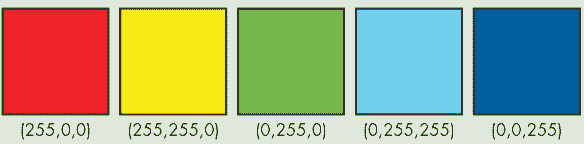

## 第四章：使用代数变换和存储数字

*“数学可以定义为我们永远不知道自己在讲什么，也不知道我们所说的是否正确。”*

— 伯特兰·罗素*


如果你在学校学过代数，你可能熟悉用字母代替数字的概念。例如，你可以写 2*x*，其中 *x* 是一个占位符，可以代表任何数字。所以 2*x* 代表将 2 乘以某个未知数字。在数学中

在代数课上，变量成为了“神秘数字”，你需要找出字母代表的是什么数字。图 4-1 展示了一位学生对“找 *x*”这一问题的调皮回应。


*图 4-1：定位 *x* 变量，而不是解出它的值*

正如你所看到的，这个学生在图中找到了变量 *x*，而不是*解出*它的值。代数课的核心就是解决这样的方程：解 2*x* + 5 = 13。在这个背景下，“解”意味着找出一个数字，当你用这个数字替换 *x* 时，使方程成立。你可以通过平衡方程来解代数问题，这需要你记住并遵循很多规则。

以字母作为占位符的方式就像在 Python 中使用变量。事实上，你已经在之前的章节中学会了如何使用变量来存储和计算数值。数学学生应学习的重要技能不是解变量，而是*使用*变量。事实上，手动解方程的价值是有限的。在这一章中，你将使用变量编写程序，快速而自动地找到未知数，而不必平衡方程！你还将学习使用一个叫做 Processing 的编程环境来绘制函数图像，帮助你直观地探索代数。

### 解一阶方程

一种通过编程解简单方程的方法是使用*暴力法*（即通过随机输入数字，直到找到正确的那个）。对于这个特定的方程，我们需要找到一个数字，*x*，当我们将它乘以 2 再加上 5 时，结果等于 13。我会做一个合理的猜测，认为 *x* 的值介于−100 和 100 之间，因为我们处理的主要是两位数或更小的数字。

这意味着我们可以编写一个程序，将所有介于−100 和 100 之间的整数代入方程，检查输出，并打印出使方程成立的数字。打开 IDLE 中新建一个文件，将其保存为 *plug.py*，然后输入 Listing 4-1 中的代码，看看这个程序是如何运行的。

```py
def plug():
  ➊ x = -100 #start at -100
    while x < 100: #go up to 100
      ➋ if 2*x + 5 == 13: #if it makes the equation true
            print("x =",x) #print it out
      ➌ x += 1 #make x go up by 1 to test the next number

plug() #run the plug function
```

*Listing 4-1：暴力破解程序，通过插入数字查看哪个数字满足方程*

在这里，我们定义了 `plug()` 函数并将 `x` 变量初始化为 `-100` ➊。在下一行，我们开始一个 `while` 循环，直到 `x` 等于 100，这是我们设置的范围上限。然后，我们将 `x` 乘以 2 并加上 5 ➋。如果输出等于 13，我们就告诉程序打印这个数字，因为那就是解。如果输出不等于 13，我们就告诉程序继续执行代码。

然后，循环重新开始，程序测试下一个数字，我们通过将 `x` 增加 1 ➌ 来获得。我们会继续循环，直到找到匹配的结果。一定要包括最后一行，这一行会使程序运行我们刚刚定义的 `plug()` 函数；如果你不加这一行，程序就不会有任何操作！输出应该是这样的：

```py
x = 4
```

使用猜测和检查法是解决这个问题的一种完全有效的方法。手动插入所有数字可能很费力，但使用 Python 可以轻松搞定！如果你怀疑解不是整数，你可能需要通过更小的数字来增加，在 ➌ 这一行改为 `x += .25` 或其他小数值。

#### 一阶方程的公式推导

另一种解像 2*x* + 5 = 13 这样的方程的方法是找出这种类型方程的一般公式。然后，我们可以使用这个公式在 Python 中写一个程序。你可能记得数学课上讲过，方程 2*x* + 5 = 13 是一个 *一阶方程* 的例子，因为在这个方程中，变量的最高指数是 1。你也应该知道，任何数的 1 次方等于它本身。

实际上，所有一阶方程都符合这个一般公式：a*x* + b = c*x* + d，其中 a、b、c 和 d 代表不同的数字。这里是一些其他一阶方程的例子：


在等号的两边，你可以看到一个 *x* 项和一个 *常数*，常数是一个没有 *x* 的数字。前面那个 *x* 变量的数字叫做 *系数*。例如，3*x* 的系数是 3。

但有时方程的一边根本没有 *x* 项，这意味着那个 *x* 的系数为零。你可以在第一个例子中看到这一点，3*x* − 5 = 22，其中 22 是等号右边唯一的项：


使用一般公式，你可以看到 a = 3，b = −5，d = 22。唯一缺少的似乎是 c 的值。但实际上它并不缺失。事实上，什么都没有意味着 c*x* = 0，这也就意味着 c 必须等于零。

现在让我们用一点代数来解方程 a*x* + b = c*x* + d 中的 *x*。如果我们能找到 *x* 的值，就可以用它来解几乎所有这种形式的方程。

为了解这个方程，我们首先通过从方程的两边同时减去 c*x* 和 b，将所有的 *x* 移到等号的一边，像这样：

a*x* − c*x* = d − b

然后我们可以从 a*x* 和 c*x* 中提取出 *x*：

*x*(a − c) = d − b

最后，除以 a − c 来孤立 *x*，这给出了 *x* 作为 a、b、c 和 d 的函数值：


现在，你可以使用这个一般方程来求解任何变量 *x*，当方程是一次方程并且所有系数（a、b、c 和 d）已知时。让我们用这个来编写一个 Python 程序，可以为我们解一次代数方程。

#### 编写 `equation()` 函数

要编写一个程序，它将接受一般方程的四个系数并打印出 *x* 的解，请在 IDLE 中打开一个新的 Python 文件，并将其保存为 *algebra.py*。我们将编写一个函数，接受四个数字 a、b、c 和 d 作为参数，并将它们代入公式中（参见清单 4-2）。

```py
def equation(a,b,c,d):
    ''''solves equations of the
    form ax + b = cx + d''''
    return (d - b)/(a - c)
```

*清单 4-2：使用编程求解 `x`*

记住，一次方程的一般公式是这样的：


这意味着对于任何形式为 a*x* + b = c*x* + d 的方程，如果我们将系数代入这个公式，就可以计算出 *x* 的值。首先，我们设置 `equation()` 函数，使其接受四个系数作为参数。然后，我们使用表达式 `(d - b)/(a − c)` 来表示一般方程。

现在让我们用你已经见过的方程来测试我们的程序：2*x* + 5 = 13。打开 Python shell，在 `>>>` 提示符下输入以下代码并按下 ENTER：

```py
>>> equation(2,5,0,13)
4.0
```

如果你将这个方程的系数输入到函数中，你将得到 4 作为解。你可以通过将 4 代入 *x* 来确认它是正确的。它有效！

练习 4-1：求解更多方程中的 x

使用你在清单 4-2 中编写的程序求解 12x + 18 = –34x + 67。

#### 使用 `print()` 而不是 `return`

在清单 4-2 中，我们使用 `return` 而不是 `print()` 来显示结果。这是因为 `return` 会返回一个可以赋值给变量并再次使用的数字。清单 4-3 展示了如果我们使用 `print()` 而不是 `return` 来查找 *x* 会发生什么：

```py
def equation(a,b,c,d):
    ''''solves equations of the
    form ax + b = cx + d''''
    print((d - b)/(a − c))
```

*清单 4-3：使用 `print()` 不允许我们保存输出*

当你运行这个程序时，你会得到相同的输出：

```py
>>> x = equation(2,5,0,13)
4.0
>>> print(x)
None
```

但是当你尝试使用 `print()` 来调用 `x` 的值时，程序无法识别你的命令，因为它没有保存结果。如你所见，`return` 在编程中更有用，因为它允许你保存函数的输出，以便在其他地方使用。这就是为什么我们在清单 4-2 中使用了 `return`。

要查看如何使用返回的输出，请使用练习 4-1 中的方程 12*x* + 18 = −34*x* + 67，并将结果赋值给 `x` 变量，如下所示：

```py
>>> x = equation(12,18,-34,67)
>>> x
1.065217391304348
```

首先，我们将方程的系数和常数传递给`equation()`函数，这样它就能为我们解方程并将解赋值给变量`x`。然后我们可以简单地输入 x 来查看它的值。现在变量`x`已经存储了解，我们可以将其代入方程中检查它是否是正确的答案。

输入以下内容来查找方程左侧 12*x* + 18 的值：

```py
>>> 12*x + 18
30.782608695652176
```

我们得到了`30.782608695652176`。现在输入以下内容，计算方程右侧的−34*x* + 67 的值：

```py
>>> -34*x + 67
30.782608695652172
```

除了第 15 位小数处的轻微舍入误差外，你可以看到方程的两边结果都接近 30.782608。所以我们可以有信心，1.065217391304348 确实是正确的*x*解！幸运的是，我们返回了这个解并保存了值，而不是仅仅打印一次。毕竟，谁想一遍又一遍地输入像 1.065217391304348 这样的数字呢？

练习 4-2：分数作为系数

使用`equation()`函数来解答你在第 55 页看到的最后一个最复杂的方程：


### 解高次方程

现在你知道如何编写程序求解一元一次方程中的未知值了，我们来尝试一些更难的题目。例如，当方程中有一个二次项时，事情会变得更加复杂，例如*x*² + 3*x* − 10 = 0。这些方程被称为*二次方程*，它们的一般形式是 a*x*² + b*x* + c = 0，其中 a、b、c 可以是任何数字：正数或负数、整数、分数或小数。唯一的例外是 a 不能为 0，因为那样会使其变成一元一次方程。与一元一次方程只有一个解不同，二次方程有两个可能的解。

要解含有平方项的方程，你可以使用*二次方程公式*，这是当你通过平衡方程 a*x*² + b*x* + c = 0 将*x*孤立出来时得到的公式：


二次方程公式是解决方程的一个非常强大的工具，因为无论 a、b、c 分别是多少，在方程 a*x*² + b*x* + c = 0 中，你只需将它们代入公式，并使用基本的算术运算就能找到解。

我们知道方程*x*² + 3*x* − 10 = 0 的系数分别是 1、3 和−10。当我们将这些数代入公式时，我们得到


将*x*孤立后，这个公式简化为


有两个解：


结果为 2，


结果等于−5。

我们可以看到，将*x*代入二次方程公式中的任一解，都能使方程成立：

(*2*)² + 3(*2*) − 10 = 4 + 6 − 10 = 0

(*−5*)² + 3(*−5*) − 10 = 25 − 15 − 10 = 0

接下来，我们将编写一个使用此公式的函数，返回任何二次方程的两个解。

#### 使用 QUAD()求解二次方程

假设我们想用 Python 来求解以下二次方程：

2*x*² + 7*x* − 15 = 0

为此，我们将编写一个名为 `quad()` 的函数，它接收三个系数（a、b 和 c）并返回两个解。但在我们做任何事情之前，我们需要从 math 模块导入 `sqrt` 方法。`sqrt` 方法让我们能够在 Python 中计算一个数字的平方根，就像计算器上的平方根按钮一样。它对正数效果很好，但如果你尝试计算负数的平方根，程序会报错：

```py
>>> frommath importsqrt
>>> sqrt(-4)
Traceback (most recent call last):
  File "<pyshell#11>", line 1, in <module>
    sqrt(-4)
ValueError: math domain error
```

在 IDLE 中打开一个新的 Python 文件，并将其命名为 *polynomials.py*。在文件顶部添加以下代码，以从 math 模块导入 `sqrt` 函数：

```py
from math import sqrt
```

然后输入清单 4-4 中的代码来创建 `quad()` 函数。

```py
def quad(a,b,c):
    ''''Returns the solutions of an equation
    of the form a*x**2 + b*x + c = 0''''
    x1 = (-b + sqrt(b**2 - 4*a*c))/(2*a)
    x2 = (-b - sqrt(b**2 - 4*a*c))/(2*a)
    return x1,x2
```

*清单 4-4：使用二次公式求解方程*

`quad()` 函数接收数字 `a`、`b` 和 `c` 作为参数，并将它们代入二次方程公式中。我们使用 `x1` 来存储第一个解的结果，`x2` 将存储第二个解的值。

现在，让我们测试这个程序，求解方程 2*x*² + 7*x* − 15 = 0。将 2、7 和 −15 代入 `a`、`b` 和 `c` 后，应该返回以下输出：

```py
>>> quad(2,7,-15)
(1.5, -5.0)
```

如你所见，*x* 的两个解是 1.5 和 −5，这意味着这两个值都应该满足方程 2*x*² + 7*x* − 15 = 0。为了验证这一点，我们将原方程 2*x*² + 7*x* − 15 = 0 中的所有 *x* 变量分别替换为 1.5（第一个解）和 −5（第二个解），如下所示：

```py
>>> 2*1.5**2 + 7*1.5 - 15
0.0
>>> 2*(-5)**2 + 7*(-5) - 15
0
```

成功！这证明了两个值都能在原始方程中成立。你可以在未来随时使用 `equation()` 和 `quad()` 函数。既然你已经学会了编写函数来解决一阶和二阶方程，我们来讨论如何解决更高次的方程吧！

#### 使用 `plug()` 求解三次方程

在代数课上，学生经常需要解这样的 *三次方程*，例如 6*x*³ + 31*x*² + 3*x* − 10 = 0，它包含一个三次项。我们可以修改我们在清单 4-1 中编写的 `plug()` 函数，使用暴力法来解这个三次方程。将清单 4-5 中的代码输入到 IDLE 中，看看它如何工作。

```py
*plug.py*
def g(x):
    return 6*x**3 + 31*x**2 + 3*x − 10

def plug():
    x = -100
    while x < 100:
        if g(x) == 0:
            print("x =",x)
        x += 1
    print("done.")
```

*清单 4-5：使用 `plug()` 求解三次方程*

首先，我们定义 `g(x)` 为一个函数，用于求解表达式 `6*x**3 + 31*x**2 + 3*x − 10`，这是我们三次方程的左边。然后我们让程序将 −100 到 100 之间的所有数字代入刚才定义的 `g(x)` 函数。如果程序找到一个使得 `g(x)` 等于零的数字，那么它就找到了一个解并输出给用户。

当你调用 `plug()` 时，应该会看到以下输出：

```py
>>> plug()
x = -5
done.
```

这样可以得到-5 作为解，但正如你可能从以前做二次方程时猜到的那样，*x*³项意味着这个方程可能有多达三个解。如你所见，你可以通过暴力求解的方式得到一个解，但你无法确定是否存在其他解或它们是什么。幸运的是，有一种方法可以看到函数的所有可能输入及其对应输出，那就是*图形化*。

### 图形化求解方程

在这一节中，我们将使用一个叫做 Processing 的酷工具来图形化更高次方程的解。这种工具将帮助我们以一种有趣且直观的方式找到高次方程的解！如果你还没有安装 Processing，请按照第 xxiii 页的“安装 Processing”部分进行操作。

#### 开始使用 Processing

Processing 是一个编程环境和图形库，能让你轻松地将代码可视化。你可以在*https://processing.org/examples/*这个示例页面看到你可以用 Processing 做出来的酷炫、动态、互动的艺术作品。你可以把 Processing 当作一个编程创意的草图本。事实上，你创建的每一个 Processing 程序都被称为*草图*。图 4-2 展示了一个在 Python 模式下的短 Processing 草图的样子。


*图 4-2：Processing 示例程序*

正如你所看到的，这里有一个编程环境，你可以在其中输入代码，以及一个独立的*显示窗口*，显示代码的可视化效果。这是一个简单程序的草图，程序会创建一个小圆形。我们将创建的每一个 Processing 草图都将包含两个 Processing 内置函数：`setup()`和`draw()`。我们在`setup()`函数中放入的代码会运行一次，当你点击界面左上角的播放按钮时。我们放在`draw()`中的内容会作为一个无限循环重复执行，直到你点击播放按钮旁边的停止按钮。

在图 4-2 中，你可以看到在`setup()`函数中，我们使用`size()`函数声明了显示屏的大小为 600 像素乘 600 像素。在`draw()`函数中，我们告诉程序使用`ellipse()`函数画一个圆。在哪里？多大？我们必须告诉`ellipse()`函数四个数字：椭圆的 x 坐标、y 坐标、宽度和高度。

注意到圆形出现在屏幕中央，在数学课上，这是*原点*(0,0)。但在 Processing 以及许多其他图形库中，(0,0)位于屏幕的左上角。所以为了把圆放到中间，我必须将窗口的长度（600）和宽度（600）各自除以二。因此，它的位置是(300,300)，而不是(0,0)。

Processing 有许多函数，比如`ellipse()`，可以帮助我们轻松绘制图形。要查看完整的函数列表，可以访问*[`processing.org/reference/`](https://processing.org/reference/)*，其中有绘制椭圆、三角形、矩形、弧线等图形的函数。在下一章中，我们将更详细地探讨如何在 Processing 中绘制图形。

**注意**

*在 Processing 中的代码颜色与 IDLE 中使用的颜色不同。例如，在图 4-2 中，可以看到`def`在 Processing 中显示为绿色，而在 IDLE 中则是橙色的*。

#### 创建你自己的图表工具

现在你已经下载了 Processing，我们可以用它来创建一个图表工具，帮助我们查看方程有多少个解。首先，我们创建一个蓝色线条组成的网格，看起来像图表纸。接着，我们用黑色线条创建 x 轴和 y 轴。

##### 设置图表尺寸

为了创建我们的图表工具，首先需要设置显示窗口的尺寸。在 Processing 中，可以使用`size()`函数来指定屏幕的宽度和高度，单位是像素。默认的屏幕尺寸是 600 像素×600 像素，但为了我们的图表工具，我们将创建一个包含从−10 到 10 的 x 和 y 值的图表。

在 Processing 中打开一个新文件，并将其保存为*grid.pyde*。确保处于 Python 模式。输入清单 4-6 中的代码，声明我们希望显示的 x 值和 y 值范围，用于我们的图表。

```py
*grid.pyde*
#set the range of x-values
xmin = -10
xmax = 10

#range of y-values
ymin = -10
ymax = 10

#calculate the range
rangex = xmax - xmin
rangey = ymax - ymin

def setup():
    size(600,600)
```

*清单 4-6：设置图表的 x 值和 y 值范围*

在清单 4-6 中，我们创建了两个变量，`xmin`和`xmax`，分别代表网格中最小和最大 x 值，然后我们对 y 值做同样的处理。接下来，我们声明`rangex`表示 x 轴范围，`rangey`表示 y 轴范围。我们通过将`xmax`减去`xmin`来计算`rangex`的值，对 y 值做同样的操作。

由于我们不需要一个 600 单位×600 单位的图表，因此我们需要通过将 x 坐标和 y 坐标乘以缩放因子来缩放坐标。当绘制图表时，我们必须记得将所有 x 坐标和 y 坐标都乘以这些缩放因子，否则它们不会在屏幕上正确显示。为此，在`setup()`函数中更新现有代码，加入清单 4-7 中的代码行。

```py
*grid.pyde*
def setup()
    global xscl, yscl
    size(600,600)
    xscl = width / rangex
 yscl = -height / rangey
```

*清单 4-7：使用缩放因子缩放坐标*

首先，我们声明全局变量`xscl`和`yscl`，它们将用于缩放我们的屏幕。`xscl`和`yscl`分别代表 x 轴缩放因子和 y 轴缩放因子。例如，如果我们希望 x 范围为 600 像素，即屏幕的完整宽度，那么 x 轴缩放因子就是 1。但如果我们希望屏幕显示的范围在−300 到 300 之间，那么 x 轴缩放因子就是 2，这可以通过将`width`（600）除以`rangex`（300）得到。

在我们的例子中，我们可以通过将 600 除以 x 范围（即 20，从 −10 到 10）来计算缩放因子。所以缩放因子是 30。从现在开始，我们需要将所有的 x 和 y 坐标都放大 30 倍，这样它们才能显示在屏幕上。好消息是，计算机会为我们完成所有的除法和缩放工作。我们只需要记得在绘制图表时使用 `xscl` 和 `yscl`！

##### 绘制网格

现在我们已经设置了图表的适当尺寸，我们可以像在图表纸上看到的那样绘制网格线。`setup()` 函数中的所有代码会执行一次。然后我们用一个名为 `draw()` 的函数创建一个无限循环。`Setup()` 和 `draw()` 是 Processing 中的内置函数，如果你想让草图运行，你不能改变它们的名称。请将代码添加到 Listing 4-8 中，以创建 `draw()` 函数。

```py
*grid.pyde*
#set the range of x-values
xmin = -10
xmax = 10

#range of y-values 
ymin = -10
ymax = 10

#calculate the range
rangex = xmax - xmin
rangey = ymax - ymin

def setup():
    global xscl, yscl 
    size(600,600)
    xscl = width / rangex
    yscl = height / rangey 

def draw():
    global xscl, yscl
    background(255) #white
    translate(width/2,height/2)
    #cyan lines
    strokeWeight(1)
 stroke(0,255,255)
    for i in range(xmin,xmax + 1):
        line(i*xscl,ymin*yscl,i*xscl,ymax*yscl)
        line(xmin*xscl,i*yscl,xmax*xscl,i*yscl)
```

*Listing 4-8: 为图表创建蓝色网格线*

首先，我们使用 `global xscl, yscl` 来告诉 Python，我们并不是创建新变量，而是使用我们已经创建的全局变量。然后，我们通过使用值 255 来将背景色设置为白色。我们使用 Processing 的 `translate()` 函数来上下或左右移动图形。代码 `translate(width/2,height/2)` 会将原点（x 和 y 都为 0）从左上角移动到屏幕中心。然后，我们通过 `strokeWeight` 设置线条的粗细，其中 `1` 是最细的。如果你想让线条更粗，可以使用更高的数字。你还可以使用 `stroke` 更改线条的颜色。在这里，我们使用青色（“天蓝色”），其 RGB 值是 (0,255,255)，意味着没有红色值，最大绿色和最大蓝色。

之后，我们使用 `for` 循环来避免输入 40 行代码绘制 40 条蓝色线条。我们希望蓝色线条从 `xmin` 到 `xmax`，包括 `xmax`，因为这就是我们的图表宽度。

RGB 值

RGB 值是红、绿、蓝三种颜色的混合，顺序为红、绿、蓝。值的范围从 0 到 255。例如，(255,0,0) 表示“最大红色，没有绿色，没有蓝色”。黄色是红色和绿色的混合，青色（“天蓝色”）是绿色和蓝色的混合。



其他颜色是不同红、绿、蓝三种颜色的混合：


你可以通过网页搜索“RGB 表”来获取更多颜色的 RGB 值！

在 Processing 中，你可以通过声明四个数字来绘制一条线：线段的起始点和结束点的 x 和 y 坐标。垂直线看起来像这样：

```py
line(-10,-10, -10,10)
line(-9,-10, -9,10)
line(-8,-10, -8,10)
```

但因为 `range(x)` 不包括 `x`（正如你之前学到的），所以我们的 `for` 循环需要从 `xmin` 到 `xmax + 1`，以包括 `xmax`。

同样，水平线会像这样：

```py
line(-10,-10, 10,-10)
line(-10,-9, 10,-9)
line(-10,-8, 10,-8)
```

这一次，你可以看到 y 值是 −10, −9, −8 等等，而 x 值则保持不变，分别是 −10 和 10，这就是 `xmin` 和 `xmax`。让我们添加另一个循环，从 `ymin` 到 `ymax`：

```py
for i in range(xmin,xmax+1):
    line(i,ymin,i,ymax)
for i in range(ymin,ymax+1):
    line(xmin,i,xmax,i)
```

如果你正确地绘制了图形，你现在会看到屏幕中间有一个小斑点，因为 x 和 y 坐标范围是从 −10 到 10，而屏幕默认范围是从 0 到 600。这是因为我们还没有将所有的 x 和 y 坐标乘以它们的缩放因子！为了正确显示网格，更新你的代码如下：

```py
for i in range(xmin,xmax+1):
    line(i*xscl,ymin*yscl,i*xscl,ymax*yscl)
for i in range(ymin,ymax+1):
    line(xmin*xscl,i*yscl,xmax*xscl,i*yscl)
```

现在你准备好创建 x 轴和 y 轴了。

##### 创建 X 轴和 Y 轴

为了添加两条黑色的线条作为 x 轴和 y 轴，我们首先通过调用 `stroke()` 函数将描边颜色设置为黑色（0 为黑色，255 为白色）。然后，我们从 (0,−10) 到 (0,10) 画一条垂直线，从 (−10,0) 到 (10,0) 画一条水平线。别忘了将这些值乘以它们各自的缩放因子，除非它们是 0，在这种情况下，乘上它们也不会改变它们。

清单 4-9 显示了创建网格的完整代码。

```py
*grid.pyde*
    #cyan lines
    strokeWeight(1)
    stroke(0,255,255)
    for i in range(xmin,xmax+1):
        line(i*xscl,ymin*yscl,i*xscl,ymax*yscl)
    for i in range(ymin,ymax+1):
        line(xmin*xscl,i*yscl,xmax*xscl,i*yscl)
    stroke(0) #black axes
    line(0,ymin*yscl,0,ymax*yscl)
    line(xmin*xscl,0,xmax*xscl,0)
```

*清单 4-9：创建网格线*

当你点击 **运行** 时，你应该会看到一个漂亮的网格，就像在 图 4-3 中一样。


*图 4-3：你已经创建了一个用于绘图的网格——而且你只需要做一次！*

这看起来已经完成了，但是如果我们试图在 (3,6) 位置放一个点（实际上是一个小椭圆），我们会看到一个问题。将以下代码添加到 `draw()` 函数的末尾：

```py
*grid.pyde*
#test with a circle
fill(0)
ellipse(3*xscl,6*yscl,10,10)
```

当你运行这个时，你会在图 4-4 中看到输出结果。


*图 4-4：检查我们的绘图程序。快完成了！*

如你所见，点最终出现在 (3,−6) 位置，而不是 (3,6) 位置。我们的图像颠倒了！要修正这个问题，我们可以在 `setup()` 函数中将 y 缩放因子加上一个负号，以翻转它：

```py
yscl = -height/rangey
```

现在，你应该能看到该点在正确的位置，就像在图 4-5 中所示。


*图 4-5：绘图程序正常工作！*

现在我们已经写好了绘图工具，让我们将其放入一个函数中，这样以后每次需要绘制方程时就可以重复使用它。

##### 编写 `grid()` 函数

为了保持代码的组织性，我们将所有创建网格的代码分离出来，放到一个叫做 `grid()` 的独立函数中。然后，我们像在清单 4-10 中那样，在 `draw()` 函数中调用 `grid()` 函数。

```py
*grid.pyde*
def draw():
    global xscl, yscl
    background(255)
    translate(width/2,height/2)
    grid(xscl,yscl) #draw the grid

def grid(xscl,yscl):
    #Draws a grid for graphing
    #cyan lines
    strokeWeight(1)
    stroke(0,255,255)
    for i in range(xmin,xmax+1):
        line(i*xscl,ymin*yscl,i*xscl,ymax*yscl)
    for i in range(ymin,ymax+1):
        line(xmin*xscl,i*yscl,xmax*xscl,i*yscl)
    stroke(0) #black axes
 line(0,ymin*yscl,0,ymax*yscl)
    line(xmin*xscl,0,xmax*xscl,0)
```

*清单 4-10：将所有网格代码移动到一个单独的函数中*

在编程中，我们通常将代码组织成函数。注意在清单 4-10 中，我们可以轻松看到在`draw()`函数中执行的内容。现在我们准备好解方程了：6*x*³ + 31*x*² + 3*x* − 10 = 0。

#### 绘制方程

绘制图形是一种有趣且直观的方式，用于寻找具有多个潜在解的多项式的解。例如，6*x*³ + 31*x*² + 3*x* − 10 = 0 这样的复杂方程，但在我们尝试绘制这样的复杂方程之前，先来绘制一个简单的抛物线。

##### 绘制点

在 清单 4-10 的 `draw()` 函数后面添加这个函数：

```py
*grid.pyde*
def f(x):
    return x**2
```

这定义了我们所调用的函数`f(x)`。我们正在告诉 Python 如何处理数字 *x* 以生成函数的输出。在这个例子中，我们告诉它对数字 *x* 进行平方运算并返回结果。数学课程传统上将函数称为`f(x)，g(x)，h(x)`，等等。使用编程语言，你可以根据自己的喜好命名函数！我们本可以给这个函数一个描述性的名字，比如`parabola(x)`，但由于`f(x)`是常见的表示方法，我们暂时还是使用它。

这是一个简单的抛物线，我们将在深入研究更复杂的函数之前先绘制它。曲线上的所有点仅仅是`x`和它对应的 y 值。我们本可以使用循环并在所有整数值的`x`上绘制小椭圆，但那样看起来就像是一个不连接的点集，如图 4-6 所示。


*图 4-6：一个由不连续点组成的图*

使用不同类型的循环，我们可以将点画得更靠近，就像在图 4-7 中那样。


*图 4-7：点更靠近了，但它仍然不像一条令人信服的曲线*。

绘制连接曲线的最佳方法是从一个点绘制到下一个点。如果这些点足够接近，它们就会看起来像曲线。首先，我们将在`f(x)`后创建一个`graphFunction()`函数。

##### 连接点

在`graphFunction()`函数中，从`xmin`开始设置`x`，像这样：

```py
*grid.pyde*
def graphFunction():
    x = xmin
```

为了使图形覆盖整个网格，我们将不断增加`x`，直到它等于`xmax`。这意味着我们将继续运行这个循环，“只要`x`小于或等于`xmax`”，如这里所示：

```py
def graphFunction():
    x = xmin
    while x <= xmax:
```

为了绘制曲线本身，我们将从每个点绘制一条线到下一个点，每次上升 0.1 个单位。即使我们的函数产生的是一条曲线，如果我们在两个非常接近的点之间绘制一条直线，你可能也不会注意到。例如，从(2, f(2))到(2.1, f(2.1))的距离非常小，因此整体输出看起来仍然是弯曲的。

```py
def graphFunction():
    x = xmin
    while x <= xmax:
        fill(0)
        line(x*xscl,f(x)*yscl,(x+0.1)*xscl,f(x+0.1)*yscl)
        x += 0.1
```

这段代码定义了一个函数，通过从`xmin`开始，一直到`xmax`，绘制`f(x)`的图像。只要 x 值小于或等于`xmax`，我们就会从(x, f(x))绘制一条线到((x + 0.1), f(x + 0.1))。我们不能忘记在循环结束时将`x`增加 0.1。

列表 4-11 显示了*grid.pyde*的完整代码。

```py
*grid.pyde*
#set the range of x-values
xmin = -10
xmax = 10

#range of y-values
ymin = -10
ymax = 10

#calculate the range
rangex = xmax - xmin
rangey = ymax - ymin

def setup():
    global xscl, yscl
    size(600,600)
    xscl = width / rangex
    yscl = -height / rangey

def draw():
    global xscl, yscl
    background(255) #white
    translate(width/2,height/2)
    grid(xscl,yscl)
    graphFunction()

def f(x):
    return x**2

def graphFunction():
    x = xmin
    while x <= xmax:
        fill(0)
        line(x*xscl,f(x)*yscl,(x+0.1)*xscl,f(x+0.1)*yscl)
        x += 0.1

def grid(xscl, yscl):
    #Draws a grid for graphing
    #cyan lines
    strokeWeight(1)
    stroke(0,255,255)
    for i in range(xmin,xmax+1):
        line(i*xscl,ymin*yscl,i*xscl,ymax*yscl)
    for i in range(ymin,ymax+1):
        line(xmin*xscl,i*yscl,xmax*xscl,i*yscl)
    stroke(0) #black axes
 line(0,ymin*yscl,0,ymax*yscl)
    line(xmin*xscl,0,xmax*xscl,0)
```

*列表 4-11：绘制抛物线的完整代码*

这样我们就得到了我们想要的曲线，如图 4-8 所示。


*图 4-8：一个漂亮的连续抛物线图！*

现在我们可以将函数更改为更复杂的形式，绘图器将轻松地绘制出来：

```py
*grid.pyde*
def f(x):
    return 6*x**3 + 31*x**2 + 3*x − 10
```

通过这个简单的修改，你将看到图 4-9 中的输出，但是函数会显示为黑色。如果你更喜欢红色曲线，只需将`graphFunction()`中的`stroke(0)`行改为`stroke(255,0,0)`，你就能得到红色曲线。


*图 4-9：绘制多项式函数图像*

只需要改变 `f()` 函数中的一行代码，程序就能自动绘制不同的函数图像，真是太棒了！方程的解（称为 *根*）是图形与 x 轴的交点。我们可以看到三个位置：一个是 *x* = −5，另一个是 *x* 位于 −1 和 0 之间，第三个是 *x* 位于 0 和 1 之间。

#### 使用猜测和检查法寻找根

我们已经看到在 第三章中，猜测和检查方法在猜数字时是多么有效。现在我们可以用它来近似求解方程 6*x*³ + 31*x*² + 3*x* − 10 = 0 的根或解。我们从 0 和 1 之间的根开始。是 0.5 还是其他值？为了验证这一点，我们可以轻松地将 0.5 代入方程。创建一个新文件，在 IDLE 中命名为 *guess.py*，并输入以下代码：

```py
*guess.py*
def f(x):
    return 6*x**3 + 31*x**2 + 3*x − 10

>>> f(0.5)
0.0
```

如你所见，当 *x* 等于 0.5 时，函数值为 0，因此我们的方程的另一个解是 *x* = 0.5。

接下来，我们尝试在 −1 和 0 之间找到根。我们首先尝试 −1 和 0 的平均值：

```py
>>> f(-0.5)
-4.5
```

在 *x* = −0.5 时，函数值为负，不是零。从图形上看，我们可以判断猜测过高，因此根一定位于 −1 和 −0.5 之间。我们将这两个端点取平均值，再次尝试：

```py
>>> f(-0.75)
2.65625
```

我们得到一个正值，所以猜测过低。因此，解应该位于 −0.75 和 −0.5 之间：

```py
>>> f(-0.625)
-1.23046875
```

仍然过高。这有点繁琐。我们来看看如何用 Python 来帮我们完成这些步骤。

#### 编写 guess() 函数

我们来创建一个函数，通过平均下限和上限的值并相应调整下一个猜测，来找到方程的根。这个方法适用于我们当前的任务，其中函数从正数经过 x 轴到负数。对于一个从负数到正数的上升函数，我们需要稍作调整。 列表 4-12 显示了这个函数的完整代码。

```py
'''The guess method'''
def f(x):
    return 6*x**3 + 31*x**2 + 3*x - 10

def average(a,b):
    return (a + b)/2.0

def guess():
    lower = -1
    upper = 0
  ➊ for i in range(20):
        midpt = average(lower,upper)
        if f(midpt) == 0:
            return midpt
        elif f(midpt) < 0:
            upper = midpt
        else:
            lower = midpt
    return midpt

x = guess()

print(x,f(x))
```

*列表 4-12：求解方程的猜测方法*

首先，我们声明我们尝试求解的方程的函数 `f(x)`。然后我们创建 `average()` 函数来找到两个数字的平均值，我们将在每一步中使用它。最后，我们编写一个 `guess()` 函数，起始时将下限设为 −1，上限设为 0，因为这是我们的图形穿过 x 轴的地方。

然后我们使用 `for i in range(20):` ➊ 来创建一个循环，将范围分割为 20 次。我们的猜测将是上下限的平均值或中点。我们将该中点代入 `f(x)`，如果输出为 0，我们就知道它是我们的根。如果输出为负值，我们知道我们的猜测过高。然后，中点将替换我们的上限，我们将再次猜测。否则，如果我们的猜测过低，中点将成为下限，我们将继续猜测。

如果我们在 20 次猜测后仍未找到解，我们将返回最新的中点及其对应的函数值。

当我们运行这个时，应该会得到两个值作为输出：

```py
-0.6666669845581055 9.642708896251406e-06
```

第一个输出是 x 值，接近−2/3。第二个输出是当我们将−2/3 作为 x 值代入时`f(x)`的结果。最后的`e-06`是科学记数法，意味着你把 9.64 的小数点向左移六位。因此，`f(x)`的结果是 0.00000964，非常接近零。通过这个猜测并检查程序并得到这个解决方案，或者说精确到百万分之一的近似值，在不到一秒钟的时间内弹出，仍然让我感到惊讶和欣喜！你能感受到使用像 Python 和 Processing 这样的自由软件探索数学问题的力量吗？

如果我们将迭代次数从 20 增加到 40，我们将得到一个更接近 0 的数字：

```py
-0.6666666666669698 9.196199357575097e-12
```

让我们检查`f(-0.6666666666669698)`，或者`f(-2/3)`：

```py
>>> f(-2/3)
0.0
```

这没错，所以 6*x³ + 31*x² + 3*x − 10 = 0 的三个解是*x* = −5, −2/3 和 1/2。

练习 4-3：寻找更多的根

使用你刚刚创建的图形工具找到方程 2x² + 7x – 15 = 0 的根。记住，根是图形与 x 轴交点的位置，或者说是函数等于 0 的地方。使用你的`quad()`函数检查你的答案。

### 总结

数学课以前总是需要花费多年时间来学习如何解高次方程。在这一章中，你学习到，使用我们的方法猜测并检查，程序化地解决这个问题并不是那么难。你还编写了其他方法来解决方程，比如使用二次公式和图形法。实际上，你已经学会了，要解决一个方程，不论它多复杂，我们所需要做的就是绘制它的图形，并估算它与 x 轴的交点位置。通过迭代并缩小有效值的范围，我们可以达到任意精度。

在编程中，我们使用代数创建变量来表示将会变化的值，比如物体的大小或坐标。用户可以在一个地方更改变量的值，然后程序会自动更新程序中所有地方的该变量的值。用户也可以通过循环改变这些变量的值，或者在函数调用中声明变量值。在未来的章节中，我们将模拟需要使用变量来表示模型参数和约束的现实情况，比如能量含量和重力。使用变量让我们能够轻松改变值，从而调整模型的不同方面。

在下一章中，你将使用 Processing 创建交互式图形，比如旋转的三角形和五彩斑斓的网格！
