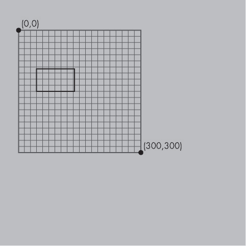

## 第五章：使用几何学变换形状

*有一天，纳斯鲁丁在茶馆里宣布他要卖掉自己的房子。当其他顾客让他描述房子时，他拿出了一块砖。“这只不过是这些东西的集合。”—伊德里斯·沙赫*


在几何学课堂上，你所学的一切都涉及使用形状来表示空间中的维度。你通常从一维的直线和二维的圆形、正方形或三角形开始，然后转向三维的物体，如球体和立方体。如今，借助科技和免费的软件，创建几何形状变得很容易，但操控和改变你创建的形状可能会更具挑战性。

本章中，你将学习如何使用 Processing 图形包来操控和变换几何形状。你将从基本的形状开始，如圆形和三角形，这将帮助你在后续章节中处理复杂的形状，如分形和细胞自动机。你还将学会如何将一些看似复杂的设计分解成简单的组成部分。

### 绘制一个圆形

让我们从一个简单的一维圆开始。在 Processing 中打开一个新的草图，并将其保存为 *geometry.pyde*。然后输入 列表 5-1 中的代码，在屏幕上绘制一个圆形。

```py
*geometry.pyde*
def setup():
    size(600,600)

def draw():
    ellipse(200,100,20,20)
```

*列表 5-1：绘制一个圆圈*

在绘制形状之前，我们首先定义草图的大小，称为 *坐标平面*。在这个例子中，我们使用 `size()` 函数设置我们的网格宽度为 600 像素，高度也为 600 像素。

设置好坐标平面后，我们使用绘图函数 `ellipse()` 在这个平面上绘制圆形。前两个参数，`200` 和 `100`，表示圆心的位置。这里，`200` 是圆心的 x 坐标，第二个数值 `100` 是 y 坐标，这样圆心就位于平面上的 `(200,100)`。

最后两个参数决定了形状的宽度和高度（单位：像素）。在这个例子中，形状的宽度为 20 像素，高度也是 20 像素。因为这两个参数相同，这意味着圆周上的各个点与中心的距离相等，从而形成一个完美的圆形。

点击 **运行** 按钮（看起来像播放符号），一个包含小圆圈的新窗口应该会打开，像 图 5-1 中所示。


*图 5-1：列表 5-1 的输出显示一个小圆圈*

Processing 提供了多个函数供你绘制形状。你可以查看完整的函数列表，访问 [*https://processing.org/reference/*](https://processing.org/reference/) 来探索其他形状函数。

现在你已经知道如何在 Processing 中绘制圆形，你几乎可以使用这些简单的形状来创建动态的交互式图形。为了实现这一点，你首先需要了解位置和变换。让我们从位置开始。

### 使用坐标指定位置

在示例 5-1 中，我们使用 `ellipse()` 函数的前两个参数来指定圆的位置。同样，使用 Processing 创建的每个形状都需要一个位置，这个位置由坐标系指定，其中图中的每个点由两个数字表示：(x,y)。在传统的数学图表中，原点（即 x=0 和 y=0）位于图表的中心，如图 5-2 所示。


*图 5-2：传统坐标系，原点在中心*

然而，在计算机图形学中，坐标系稍有不同。它的原点位于屏幕的左上角，因此 x 和 y 坐标分别在向右和向下移动时增加，如图 5-3 所示。


*图 5-3：计算机图形学的坐标系，原点在左上角*

这个平面上的每个坐标代表屏幕上的一个像素。如你所见，这意味着你不需要处理负坐标。我们将使用函数来转换并平移越来越复杂的形状。

绘制一个单独的圆形相对简单，但绘制多个形状会很快变得复杂。例如，假设你需要绘制一个像图 5-4 中所示的设计。


*图 5-4：由圆组成的圆形*

如果要指定每个圆的大小和位置，并且将它们间隔均匀地排列，就需要输入很多类似的代码行。幸运的是，实际上你并不需要知道每个圆的绝对 x 和 y 坐标就能做到这一点。使用 Processing，你可以轻松地将对象放置在网格的任何位置。

让我们通过一个简单的例子来看看如何实现这个功能。

### 变换函数

你可能记得在几何课上用铅笔和纸做变换时，你需要对一组点进行繁琐的操作以移动形状。让计算机来进行变换要有趣得多。事实上，没有变换，计算机图形就不可能有什么可看的！几何变换，如平移和旋转，可以让你在不改变对象本身的情况下，改变对象出现的位置和方式。例如，你可以使用变换将三角形移动到另一个位置，或将其旋转而不改变其形状。Processing 提供了许多内置的变换函数，使得平移和旋转对象变得非常简单。

#### 使用 TRANSLATE() 进行对象平移

*平移*意味着将形状在网格上移动，使得形状的所有点都朝相同的方向和相同的距离移动。换句话说，平移让你在不改变形状本身且不倾斜形状的情况下，将形状在网格上移动。

在数学课上，平移一个物体涉及手动改变物体上所有点的坐标。但在 Processing 中，平移物体是通过移动*网格*本身来实现的，而物体的坐标保持不变！举个例子，我们可以在屏幕上绘制一个矩形。请按照清单 5-2 中的代码修改你现有的*geometry.pyde*代码。

```py
*geometry.pyde*
def setup():
    size(600,600)

def draw():
    rect(20,40,50,30)
```

*清单 5-2：绘制一个矩形以进行平移*

在这里，我们使用`rect()`函数来绘制矩形。前两个参数是 x 和 y 坐标，告诉 Processing 矩形的左上角应该在哪里。第三和第四个参数分别表示矩形的宽度和高度。

运行这段代码，你应该能看到图 5-5 中的矩形。


*图 5-5：默认坐标设置，原点位于左上角*

**注意**

在这些示例中，我展示了网格以供参考，但你在屏幕上是看不见它的。

现在，让我们通过清单 5-3 中的代码来告诉 Processing 平移矩形。注意，我们并没有改变矩形的坐标。

```py
*geometry.pyde*
def setup():
    size(600,600)

def draw():
    translate(50,80);
    rect(50,100,100,60)
```

*清单 5-3：平移矩形*

在这里，我们使用`translate()`来平移矩形。我们提供两个参数：第一个参数告诉 Processing 在水平（x）方向上平移网格的距离，第二个参数表示在垂直方向（y）上平移的距离。因此，`translate(50,80)`将整个网格向右移动 50 像素并向下移动 80 像素，如图 5-6 所示。



*图 5-6：通过将网格向右移动 50 像素并向下移动 80 像素来平移矩形*

很多时候，将原点(0,0)放在画布的中心是非常有用的（也更容易！）。你可以使用`translate()`轻松地将原点移动到网格的中心。如果你希望画布更大或更小，也可以用它来改变画布的宽度和高度。让我们来看看 Processing 内置的`width`和`height`变量，它们允许你更新画布的大小，而无需手动更改数字。为了演示这一点，请更新清单 5-3 中的现有代码，使其像清单 5-4 那样。

```py
*geometry.pyde*
def setup():
    size(600,600)

def draw():
    translate(width/2, height/2)
    rect(50,100,100,60)
```

*清单 5-4：使用`width`和`height`变量平移矩形*

在 `setup()` 函数中，您在 `size` 声明中输入的任何数字都会成为画布的“宽度”和“高度”。在这个例子中，由于我使用了 `size(600,600)`，它们的宽度和高度都是 600 像素。当我们将 `translate()` 语句更改为 `translate(width/2, height/2)`，使用变量代替具体数字时，我们告诉 Processing 将位置 (0,0) 移动到显示窗口的中心，无论窗口大小如何。这意味着，如果您改变窗口的大小，Processing 会自动更新 `width` 和 `height`，您无需手动修改所有代码中的数字。

运行更新后的代码，您应该会看到类似 图 5-7 的效果。


*图 5-7：网格被平移到屏幕中心*。

注意，原点仍然标记为 (0,0)，这表明我们并没有真正移动原点，而是移动了整个坐标平面，使得原点位于画布的中心。

#### 使用 `ROTATE()` 旋转物体

在几何学中，*旋转*是一种变换，它使物体围绕中心点旋转，就像它绕轴旋转一样。Processing 中的 `rotate()` 函数围绕原点 (0,0) 旋转网格。它接受一个数字作为参数，用来指定您希望围绕点 (0,0) 旋转的角度。旋转角度的单位是弧度，这是您在预备微积分课中学到的内容。我们可以使用 2π（大约 6.28）弧度代替 360 度来进行完整的旋转。如果您像我一样习惯用度数思考，可以使用 `radians()` 函数轻松将度数转换为弧度，这样就不必自己做数学计算了。

为了查看 `rotate()` 函数如何工作，将 图 5-8 中显示的代码输入到现有草图中，替换 `draw()` 函数中的 `translate()` 代码，然后运行它们。图 5-8 显示了结果。


*图 5-8：网格始终围绕 (0,0) 旋转*

在 图 5-8 的左侧，网格围绕 (0,0) 旋转了 20 度，而 (0,0) 位于屏幕的左上角。在右侧的例子中，原点首先向右平移 200 个单位，向下平移 200 个单位，*然后* 网格进行了旋转。

`rotate()` 函数使得绘制一个物体圆形排列变得简单，就像 图 5-4 中那样，按照以下步骤操作：

1.  移动到您希望圆心所在的位置。

1.  旋转网格并将物体放置在圆的周长上。

现在，您已经知道如何使用变换函数来操作画布上不同物体的位置，让我们在 Processing 中重新创建 图 5-4。

#### 绘制圆形中的圆形

为了在图 5-4 中创建排列成圆形的圆形，我们将使用 `for i in range()` 循环来重复绘制圆形，并确保圆形均匀分布。首先，我们要考虑两个圆形之间的角度应该是多少，记住圆形总共有 360 度。

输入列表 5-5 中显示的代码来创建这个设计。

```py
*geometry.pyde*
def setup():
    size(600,600)

def draw():
    translate(width/2,height/2)
    for i in range(12):
        ellipse(200,0,50,50)
 rotate(radians(360/12))
```

*列表 5-5：绘制圆形设计*

请注意，`draw()` 函数中的 `translate(width/2,height/2)` 函数将坐标系平移到屏幕中心。然后，我们开始一个 `for` 循环，在坐标系上的某个点创建一个椭圆，从 (200,0) 开始，如函数的前两个参数所示。接着，我们通过将椭圆的 `width` 和 `height` 都设置为 `50` 来设定每个小圆形的大小。最后，我们在创建下一个椭圆之前，将坐标系旋转 360/12，即 30 度。请注意，我们在 `rotate()` 函数中使用 `radians()` 将 30 度转换为弧度。这意味着每个圆形与下一个圆形相距 30 度。

当你运行这段代码时，你应该会看到图 5-9 中显示的内容。


*图 5-9：使用变换创建圆形设计*

我们已经成功地将一堆圆形排列成了一个圆形！

#### 绘制方形的圆形

修改你在列表 5-5 中写的程序，将圆形改为方形。为此，只需将现有代码中的`ellipse`改为`rect`，即可将圆形变为方形，如下所示：

```py
*geometry.pyde*
def setup():
    size(600,600)

def draw():
    translate(width/2,height/2)
    for i in range(12):
        rect(200,0,50,50)
        rotate(radians(360/12))
```

这很简单！

### 动画化对象

Processing 很适合为你的对象制作动画，创建动态图形。在你的第一个动画中，你将使用 `rotate()` 函数。通常，`rotate` 会立即发生，因此你无法看到旋转的过程——只能看到旋转的结果。但这次，我们将使用一个时间变量 `t`，它允许我们实时看到旋转过程！

#### 创建 `t` 变量

让我们用这个方形的圆形来编写一个动画程序。首先，创建 `t` 变量，并通过在`setup()`函数前添加 `t = 0` 来初始化它。然后，将列表 5-6 中的代码插入到`for`循环之前。

```py
*geometry.pyde*
t = 0

def setup():
    size(600,600)

def draw():
    translate(width/2,height/2)
    rotate(radians(t))
    for i in range(12):
        rect(200,0,50,50)
        rotate(radians(360/12))
```

*列表 5-6：添加 `t` 变量*

然而，如果你尝试运行这段代码，你会看到以下错误信息：

```py
UnboundLocalError: local variable 't' referenced before assignment
```

这是因为 Python 无法确定我们是在函数内部创建一个与全局变量 `t` 无关的新的局部变量，还是在调用全局变量 `t`。由于我们希望使用全局变量，在 `draw()` 函数的开始处添加 `global t`，这样程序就知道我们指的是哪一个。

输入此处显示的完整代码：

```py
*geometry.pyde*
t = 0

def setup():
    size(600,600)

def draw():
    global t
    #set background white
    background(255)
 translate(width/2,height/2)
    rotate(radians(t))
    for i in range(12):
        rect(200,0,50,50)
        rotate(radians(360/12))
    t += 1
```

这段代码将 `t` 从 0 开始，旋转网格相应的角度，然后将 `t` 增加 1，接着重复执行。运行它后，你应该会看到方块开始以圆形模式旋转，如 图 5-10 所示。


*图 5-10：让方块围绕圆形旋转*

很酷！现在我们来试试旋转每个单独的方块。

#### 旋转单个方块

因为在 Processing 中旋转是围绕 (0,0) 进行的，所以在循环内，我们首先要将坐标系平移到每个方块应在的位置，然后进行旋转，最后绘制方块。将代码中的循环更改为 清单 5-7 的样子。

```py
*geometry.pyde*
for i in range(12):
    translate(200,0)
    rotate(radians(t))
    rect(0,0,50,50)
    rotate(radians(360/12))
```

*清单 5-7：旋转每个方块*

这段代码将网格平移到我们希望放置方块的位置，旋转网格使方块旋转，然后使用 `rect()` 函数绘制方块。

#### 使用 `pushMatrix()` 和 `popMatrix()` 保存方向

当你运行 清单 5-7 时，你会看到它会产生一些奇怪的行为。方块没有围绕中心旋转，而是继续在屏幕上移动，就像在 图 5-11 中所示。


*图 5-11：方块飞得四处乱窜！*

这是由于改变中心点和频繁改变网格方向所致。在平移到方块位置后，我们需要先旋转回圆心，然后再平移到下一个方块的位置。我们可以使用另一个 `translate()` 函数来撤销第一个平移，但可能还需要撤销更多的变换，这样会变得有些混乱。幸运的是，有更简单的方法。

Processing 有两个内建函数，它们可以在某个特定点保存网格的方向，并且可以返回该方向：`pushMatrix()` 和 `popMatrix()`。在这种情况下，我们希望在屏幕中心时保存方向。为此，修改循环使其看起来像 清单 5-8。

```py
*geometry.pyde*
for i in range(12):
    pushMatrix() #save this orientation
    translate(200,0)
    rotate(radians(t))
    rect(0,0,50,50)
    popMatrix() #return to the saved orientation
    rotate(radians(360/12))
```

*清单 5-8：使用 `pushMatrix()` 和 `popMatrix()`*

`pushMatrix()` 函数保存了方块圆环中心的坐标系位置。然后我们将坐标系平移到方块的位置，旋转网格使得方块旋转，最后绘制方块。然后我们使用 `popMatrix()` 快速返回到方块圆环的中心，并对所有 12 个方块重复此过程。

#### 绕中心旋转

上述代码应该能够正常工作，但旋转效果可能看起来有点奇怪；这是因为 Processing 默认将矩形定位到其左上角并围绕左上角旋转。这使得方块看起来像是偏离了大圆的路径。如果你希望方块围绕它们的中心旋转，可以在 `setup()` 函数中添加以下行：

```py
    rectMode(CENTER)
```

请注意，`rectMode()`中的全大写`CENTER`是很重要的。（你也可以尝试其他类型的`rectMode()`，比如`CORNER`、`CORNERS`和`RADIUS`。）添加`rectMode(CENTER)`应该让每个方格围绕其中心旋转。如果你想让方格旋转得更快，可以更改`rotate()`这一行，增加`t`中的时间，如下所示：

```py
    rotate(radians(5*t))
```

这里，`5`是旋转的频率。这意味着程序将`t`的值乘以 5，然后根据乘积旋转。因此，方格将旋转之前的五倍。更改它，看看会发生什么！注释掉循环外的`rotate()`这一行（通过在前面加上一个井号），使方格围绕其中心旋转，如列表 5-9 所示。

```py
    translate(width/2,height/2)
    #rotate(radians(t))
    for i in range(12):
        rect(200,0,50,50)
```

*列表 5-9：注释掉一行代码而不是删除它*

能够使用`translate()`和`rotate()`等变换来创建动态图形是一项非常强大的技巧，但如果顺序错误，可能会产生意想不到的结果！

### 创建一个交互式彩虹网格

现在你已经学会了如何使用循环创建设计，并以不同的方式旋转它们，我们将创造一些相当酷的东西：一个方格网，其中的彩虹颜色会随着你的鼠标光标移动！第一步是制作一个网格。

#### 绘制一个物体网格

许多涉及数学的任务以及像扫雷这样的游戏都需要使用网格。网格对于我们在后续章节中将创建的一些模型和所有的细胞自动机来说都是必要的，因此值得学习如何编写可重复使用的网格代码。首先，我们将制作一个 12 × 12 的方格网，方格大小均匀且间隔相等。制作这个大小的网格可能看起来是一个费时的任务，但事实上，使用循环很容易实现。

打开一个新的 Processing 草图并保存为*colorGrid.pyde*。真可惜我们之前用了“grid”这个名字。我们将在白色背景上制作一个 20 × 20 的方格网。方格需要是`rect`，并且我们需要在一个`for`循环内再嵌套一个`for`循环，确保它们的大小相同且均匀间隔。此外，我们需要让我们的 25 × 25 像素的方格每 30 像素绘制一次，使用以下代码：

```py
rect(30*x,30*y,25,25)
```

随着`x`和`y`变量每增加 1，方格将在两个维度上按 50 像素的间隔绘制。我们将像往常一样，从编写`setup()`和`draw()`函数开始，就像在上一个草图中一样（参见列表 5-10）。

```py
*colorGrid.pyde*
def setup():
    size(600,600)

def draw():
    #set background white
    background(255)
```

*列表 5-10：Processing 草图的标准结构：`setup()`和`draw()`*

这将窗口的大小设置为 600 × 600 像素，并将背景颜色设置为白色。接下来，我们将创建一个嵌套循环，其中两个变量都从 0 到 19，总共 20 个数字，因为我们需要 20 行 20 个方格。列表 5-11 展示了创建网格的代码。

```py
def setup():
    size(600,600)

def draw():
    #set background white
    background(255)
    for x in range(20):
        for y in range(20):
            rect(30*x,30*y,25,25)
```

*列表 5-11：网格的代码*

这应该会创建一个 20 × 20 的方格网，如图 5-12 所示。现在是时候给我们的网格添加一些颜色了。


*图 5-12：一个 20 × 20 的网格！*

#### 为对象添加彩虹色

Processing 的`colorMode()`函数帮助我们为草图添加一些酷炫的颜色！它用于在 RGB 和 HSB 模式之间切换。回想一下，RGB 使用三个数字表示红、绿、蓝的数量；而在 HSB 中，三个数字分别表示色调、饱和度和亮度。这里我们需要改变的只有第一个数字，也就是色调值。其他两个数字可以设置为最大值 255。图 5-13 展示了通过仅更改第一个值——色调来创建彩虹色。这里，10 个方块的色调值如图所示，饱和度为 255，亮度为 255。


*图 5-13：使用 HSB 模式并更改色调值来显示彩虹色*

由于我们在代码清单 5-11 中将矩形放置在`(30*x,30*y)`位置，我们将创建一个变量来测量鼠标与该位置的距离：

```py
         d = dist(30*x,30*y,mouseX,mouseY)
```

Processing 有一个`dist()`函数，用来计算两点之间的距离，在这个例子中是方块和鼠标之间的距离。它将距离保存在一个叫做`d`的变量中，我们将色调与这个变量关联。代码清单 5-12 展示了代码的变化。

```py
*colorGrid.pyde*
def setup():
    size(600,600)
    rectMode(CENTER)
  ➊ colorMode(HSB)

def draw():
    #set background black
  ➋ background(0)
    translate(20,20)
    for x in range(30):
        for y in range(30):
          ➌ d = dist(30*x,30*y,mouseX,mouseY)
            fill(0.5*d,255,255)
            rect(30*x,30*y,25,25)
```

*代码清单 5-12：使用`dist()`函数*

我们插入`colorMode()`函数，并传递`HSB`给它 ➊。在`draw()`函数中，我们首先将背景设为黑色 ➋。然后我们计算鼠标与方块之间的距离，方块位于`(30*x,30*y)`位置 ➌。接着，在下一行中，我们使用 HSB 值设置填充颜色。色调值是距离的一半，而饱和度和亮度都设为 255，即最大值。

色调是我们唯一需要更改的：我们根据矩形与鼠标的距离来更新色调。我们用`dist()`函数来做到这一点，它有四个参数：两个点的 x 和 y 坐标，返回两个点之间的距离。

运行这段代码，你应该能看到一个非常多彩的设计，它会根据鼠标的位置变化颜色，如图 5-14 所示。

现在你已经学会了如何为对象添加颜色，让我们来探讨如何创建更复杂的形状。


*图 5-14：为网格添加颜色*

### 使用三角形绘制复杂图案


*图 5-15：Roger Antonsen 绘制的 90 个旋转的等边三角形草图。查看动态图像请访问* [`rantonse.no/en/art/2016-11-30`](https://rantonse.no/en/art/2016-11-30)。

在本节中，我们使用三角形创建更复杂的、类似螺旋图形的模式。例如，看看图 5-15 中的草图，它是由奥斯陆大学的 Roger Antonsen 创建的，包含旋转的三角形。

原始设计是会动的，但在本书中，你需要想象所有的三角形都在旋转。这幅草图让我震撼！虽然这个设计看起来非常复杂，但其实并不难制作。记得本章开头纳斯鲁丁的关于砖块的笑话吗？就像纳斯鲁丁的房子一样，这个复杂的设计其实只是由相同形状的图形组成。那么，是什么形状呢？安东森在命名这幅草图为“90 个旋转的等边三角形”时给了我们一个有用的线索。这告诉我们，我们需要做的就是弄清楚如何画一个等边三角形，旋转它，然后重复这一过程，共画 90 个三角形。让我们先讨论一下如何使用`triangle()`函数画一个等边三角形。首先，打开一个新的 Processing 草图，并将其命名为*triangles.pyde*。清单 5-13 中的代码展示了创建旋转三角形的一种方法，但并不是等边三角形。

```py
*triangles.pyde*
def setup():
    size(600,600)
    rectMode(CENTER)

t = 0

def draw():
    global t
    translate(width/2,height/2)
    rotate(radians(t))
    triangle(0,0,100,100,200,-200)
    t += 0.5
```

*清单 5-13：绘制旋转三角形，但不是正确的那种*

清单 5-13 使用了你之前学到的知识：它创建了一个`t`变量（用于时间），平移到我们希望三角形所在的位置，旋转坐标网格，然后绘制三角形。最后，它递增`t`。运行这段代码后，你应该能看到类似于图 5-16 的效果。


*图 5-16：围绕一个顶点旋转三角形*

如图 5-16 所示，三角形围绕其*顶点*（或角点）旋转，从而形成一个外点构成的圆形。你还会注意到，这个是一个直角三角形（包含 90 度角的三角形），而不是等边三角形。

为了重新创建安东森的草图，我们需要绘制一个等边三角形，它是一个边长相等的三角形。我们还需要找到等边三角形的中心，以便能够围绕其中心旋转它。为此，我们需要找到三角形三个顶点的位置。接下来，让我们讨论如何通过定位三角形的中心来绘制等边三角形，并指定其顶点的位置。

#### 30-60-90 三角形


*图 5-17：一个被分成三个相等部分的等边三角形*

为了找到我们等边三角形的三个顶点的位置，我们将复习一种你在几何课上可能见过的特殊三角形：*30-60-90 三角形*，它是一种特殊的*直角三角形*。首先，我们需要一个等边三角形，如图 5-17 所示。

这个等边三角形由三个相等的部分组成。中间的点是三角形的中心，三条分割线在 120 度角相交。为了在 Processing 中绘制三角形，我们给`triangle()`函数六个数字：三个顶点的 x 和 y 坐标。为了找到图 5-17 中所示等边三角形的顶点坐标，我们将底部三角形对半切割，如图 5-18 所示。


*图 5-18：将等边三角形划分为特殊三角形*

将底部三角形对半切割会创建两个直角三角形，它们是经典的 30-60-90 三角形。如你所记得，30-60-90 三角形的边长比可以像图 5-19 所示那样表示。


*图 5-19：30-60-90 三角形中边长的比例，来自 SAT 考试的图例*

如果我们将较短的直角边的长度称为*x*，那么斜边是该长度的两倍，即 2*x*，而较长的直角边是*x*乘以 3 的平方根，即大约 1.732*x*。我们将使用从图 5-18 中大等边三角形的中心到其中一个顶点的长度来创建我们的函数，而该顶点恰好是 30-60-90 三角形的斜边。这意味着我们可以以该长度为单位来测量所有其他长度。例如，如果我们将斜边称为`length`，那么较短的直角边将是该长度的一半，即`length/2`。最后，较长的直角边将是`length`除以 2 乘以 3 的平方根。图 5-20 放大了 30-60-90 三角形。


*图 5-20：30-60-90 三角形的近距离观察*

如你所见，30-60-90 三角形的内部角度为 30 度、60 度和 90 度，边长的比例是已知的。你可能对这个比例很熟悉，它出现在勾股定理中，稍后我们将再次提到。

我们将从较大等边三角形的中心到其顶点的距离称为“长度”，这也是 30-60-90 三角形的*斜边*。你需要知道这个特殊三角形的边长比例，以便找到相对于中心的等边三角形的三个顶点——你可以通过指定三角形每个点的位置来绘制它（我们要绘制的大等边三角形）。

直角三角形中与 30 度角相对的较短的直角边总是斜边的一半，而较长的直角边是较短的直角边乘以 3 的平方根。所以，如果我们使用中心点来绘制大的等边三角形，那么三个顶点的坐标将如图 5-21 所示。


*图 5-21：等边三角形的顶点*

正如你所看到的，因为这个三角形由所有边上的 30-60-90 三角形组成，我们可以利用它们之间的特殊关系来确定每个等边三角形的顶点应该离原点多远。

#### 绘制等边三角形

现在我们可以使用从 30-60-90 三角形推导出的顶点来创建一个等边三角形，使用列表 5-14 中的代码。

```py
*triangles.pyde*
def setup():
    size(600,600)
    rectMode(CENTER)

t = 0

def draw():
    global t
    translate(width/2,height/2)
    rotate(radians(t))
    tri(200) #draw the equilateral triangle
    t += 0.5

➊ def tri(length):
 '''Draws an equilateral triangle
    around center of triangle'''
    ➋ triangle(0,-length,
             -length*sqrt(3)/2, length/2,
             length*sqrt(3)/2, length/2)
```

*列表 5-14：制作旋转等边三角形的完整代码*

首先，我们编写`tri()`函数，传入变量`length` ➊，它是我们将等边三角形切割成的特殊 30-60-90 三角形的斜边。然后，我们使用找到的三个顶点来构建一个三角形。在对`triangle()`函数的调用 ➋ 中，我们指定了三角形三个顶点的位置：`(0,-length)`、`(-length*sqrt(3)/2, length/2)`和`(length*sqrt(3)/2, length/2)`。

当你运行代码时，你应该看到类似于图 5-22 的内容。


*图 5-22：一个旋转的等边三角形！*

现在，我们可以通过在`draw()`函数的开头添加这一行来遮掩旋转过程中创建的所有三角形：

```py
    background(255) #white
```

这应该会擦除所有旋转三角形，除了一个，因此屏幕上只会显示一个等边三角形。我们只需要像本章之前那样，用`rotate()`函数将 90 个三角形放置在一个圆圈中。

练习 5-1：旋转周期

在 Processing 草图中创建一个等边三角形的圆圈，并使用`rotate()`函数旋转它们。

#### 绘制多个旋转三角形

现在你已经学会了如何旋转一个等边三角形，我们需要弄清楚如何将多个等边三角形排列成一个圆圈。这与旋转正方形时的创建方式类似，但这次我们将使用我们的`tri()`函数。将列表 5-15 中的代码替换为 Processing 中的`def draw()`部分，然后运行它。

```py
*triangles.pyde*
def setup():
    size(600,600)
    rectMode(CENTER)

t = 0

def draw():
    global t
    background(255)#white
    translate(width/2,height/2)
  ➊ for i in range(90):
        #space the triangles evenly
        #around the circle
        rotate(radians(360/90))
      ➋ pushMatrix() #save this orientation
        #go to circumference of circle
        translate(200,0)
        #spin each triangle
        rotate(radians(t))
        #draw the triangle
        tri(100)
        #return to saved orientation
    ➌ popMatrix()
    t += 0.5

def tri(length):
  ➍ noFill() #makes the triangle transparent

    triangle(0,-length,
             -length*sqrt(3)/2, length/2,
             length*sqrt(3)/2, length/2)
```

*列表 5-15：创建 90 个旋转三角形*

在 ➊ 处，我们使用`for`循环将 90 个三角形排列在圆圈中，确保它们均匀间隔，通过将 360 除以 90 来实现。然后在 ➋ 处，我们使用`pushMatrix()`在移动网格之前保存当前位置。在循环末尾的 ➌ 处，我们使用`popMatrix()`返回到保存的位置。在 ➍ 处的`tri()`函数中，我们添加了`noFill()`这一行来使三角形透明。

现在我们有了 90 个旋转的透明三角形，但它们的旋转方式完全相同。虽然有点酷，但还不如 Antonsen 的草图那么酷。接下来，你将学会如何让每个三角形与相邻的三角形稍微不同地旋转，以使图案更加有趣。

#### 旋转的相位偏移

我们可以通过*相位偏移*来改变三角形旋转的方式，这使得每个三角形在相邻的三角形后面稍微滞后，从而赋予图形“波浪”或“级联”效果。每个三角形在循环中都有一个编号，表示为`i`。我们需要在`rotate(radians(t))`函数中将`i`加到`t`上，像这样：

```py
        rotate(radians(t+i))
```

运行这个代码时，你应该看到类似于图 5-23 的效果。


*图 5-23：带有相位偏移的旋转三角形*

注意到屏幕右侧的图案有一个断裂。这个图案的断裂是因为从第一个三角形到最后一个三角形的相位偏移没有对齐。我们希望有一个平滑无缝的图案，因此必须确保相位偏移加起来是 360 度的倍数，才能完成圆形。由于设计中有 90 个三角形，我们将 360 除以 90，再乘以`i`：

```py
        rotate(radians(t+i*360/90))
```

计算 360/90（即 4）并将这个数字代入代码很容易，但我保留了这个表达式，因为如果以后我们想改变三角形的数量时，它会用得上。现在，这应该能够创建一个平滑的无缝图案，如图 5-24 所示。


*图 5-24：带有相位偏移的无缝旋转三角形*

通过使我们的相位偏移加起来成为 360 的倍数，我们成功地去除了图案中的断裂。

#### 完成设计

为了让设计看起来更像图 5-15 中的设计，我们需要稍微调整相位偏移。自己试试看如何改变草图的外观！

在这里，我们将通过将`i`乘以 2 来改变相位偏移，这将增加每个三角形与相邻三角形之间的偏移。在代码中的`rotate()`行改为以下内容：

```py
        rotate(radians(t+2*i*360/90))
```

做出这个更改后，运行代码。正如图 5-25 所示，我们的设计现在看起来非常接近我们想要重新创建的设计。


*图 5-25：重新创建 Antonsen 的“90 个旋转的等边三角形”，来自图 5-15*

现在你已经学会了如何重新创建这样的复杂设计，尝试下一个练习来测试你的变换技能！

练习 5-2：彩虹三角形

使用`stroke()`为旋转三角形草图中的每个三角形上色。它应该像这样。


### 总结

在本章中，你学习了如何绘制圆形、正方形和三角形，并使用 Processing 的内置变换函数将它们排列成不同的图案。你还学习了如何通过动画化图形和添加颜色使形状具有动态效果。就像 Nasrudin 的房子只是一堆砖块一样，本章中的复杂代码示例也只是一些更简单的形状或函数的组合。

在下一章，你将基于本章所学的内容，扩展你的技能，学习使用三角函数，如正弦和余弦。你将绘制更加酷炫的设计，并编写新的函数，创造出更复杂的行为，比如留下轨迹并从一组顶点创建任意形状。
