## 第六章：用三角函数创建振荡

*我家里有一个振荡风扇。风扇来回摆动，看起来风扇在说“不要”。所以我喜欢问它一些风扇会说“不”的问题。“你能保持我的头发整齐吗？你能整理我的文件吗？你有三个档位吗？骗子！”我的风扇骗了我。—米奇·赫德伯格*


*三角学*字面意思是三角形的研究。具体来说，它是对直角三角形及其各边之间特殊比率的研究。然而，从传统三角学课堂上教授的内容来看，你可能会认为这就是三角学的全部。图 6-1 显示的是典型三角学作业的一部分。

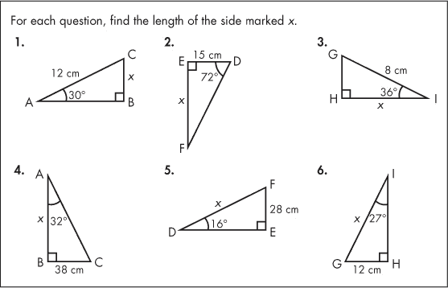

*图 6-1：传统三角学课堂上关于三角形未知边的一个个问题*

这是大多数人从三角学课上记得的任务，解决三角形中未知边长是一个常见的作业。*但这并不是三角函数在现实中的常见用途*。三角函数，如正弦和余弦，更多的应用于振荡运动，比如水波、光波和声波。假设你拿出你在第四章中使用的图形代码 *grid.pyde*，并将函数修改为以下内容：

```py
def f(x):
    return sin(x)
```

在这种情况下，你会得到图 6-2 中显示的输出。

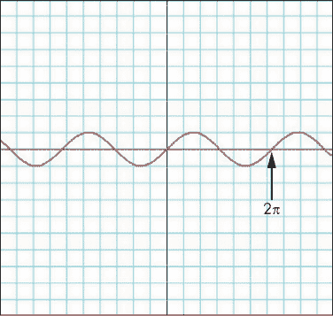

*图 6-2：正弦波*

x 轴上的数值是弧度，是正弦函数的输入值。y 轴是输出值。如果你在计算器或 Python shell 中输入 `sin(1)`，你会得到一个以 0.84 开头的长小数……这就是当 x = 1 时曲线的高度。它几乎处于曲线的顶部，在图 6-2 中可以看到。输入 `sin(3)` 到计算器中，你会得到 0.14……在曲线上，你会看到当 x = 3 时它几乎在 x 轴上。输入其他任何 x 值，输出都会遵循这种上下波动的模式，*在 1 和 -1 之间振荡*。一个完整的波形大约需要六个单位的时间，或者一个 *波长*，我们也称之为该函数的 *周期*。正弦函数的周期是 2π，或在 Processing 和 Python 中为 6.28 弧度。在学校里，你不会做比画出这样的波形更多的事情。但在本章中，你将使用正弦、余弦和正切函数来实时模拟振荡运动。你还将使用三角学在 Processing 中创建一些有趣的动态交互式草图。主要的三角函数见图 6-3。

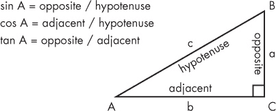

*图 6-3：直角三角形各边的比率*

我们将使用三角函数生成任意边数的多边形，以及任何（奇数）角度的星形。之后，你将创建一个从点沿圆周旋转的正弦波。你将绘制类似 Spirograph 和 harmonograph 的图形，这些都需要三角函数。你还将使五颜六色的点在圆内外振荡！

让我们首先讨论一下，使用三角函数将如何使变换、旋转和振荡形状变得比以前更容易。

### 使用三角学进行旋转和振荡

首先，正弦和余弦使旋转变得非常简单。在图 6-3 中，sin A 表示为对边除以斜边，或者边 a 除以边 c：

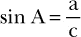

解这个方程来求边 a，你会得到斜边乘以角 A 的正弦值：

a = c Sin A

因此，点的 y 坐标可以表示为原点到该点的距离乘以该点与水平线之间的角度的正弦值。想象一个半径为 r 的圆，斜边是三角形的斜边，围绕点(0,0)旋转，如图 6-4 所示。

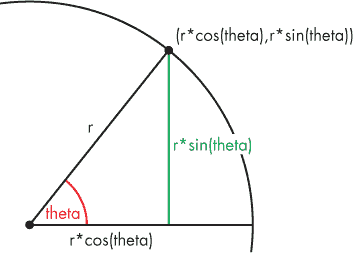

*图 6-4：点的极坐标形式*

要旋转一个点，我们将保持圆的半径不变，简单地改变角度 theta。计算机会通过将半径 r 乘以角度 theta 的余弦或正弦值来重新计算所有点的位置！我们还需要记住，正弦和余弦函数期望的是弧度输入，而不是度数。幸运的是，你已经学会了使用 Processing 内建的`radians()`和`degrees()`函数，轻松地将单位转换为我们想要的任何形式。

### 编写绘制多边形的函数

将顶点看作围绕中心旋转的点，使得创建多边形变得非常容易。回想一下，多边形是一个多边形状；*规则多边形*是通过将一定数量的点等间距地连接在圆周上形成的。还记得我们在第五章中需要多少几何知识才能绘制一个等边三角形吗？有了三角函数帮助旋转后，我们只需要使用图 6-4 来创建一个多边形函数，就能绘制多边形。

在 Processing 中打开一个新草图并将其保存为*polygon.pyde*。然后输入清单 6-1 中的代码，通过`vertex()`函数绘制一个多边形。

```py
*polygon.pyde*
def setup():
    size(600,600)

def draw():
    beginShape()
    vertex(100,100)
    vertex(100,200)
    vertex(200,200)
    vertex(200,100)
    vertex(150,50)
    endShape(CLOSE)
```

*清单 6-1：使用`vertex()`绘制多边形*

我们当然可以使用`line()`来绘制多边形，但一旦我们连接了所有的线条，就无法用颜色填充形状了。Processing 函数`beginShape()`和`endShape()`通过使用`vertex()`函数来定义我们想要的任何形状，指定形状的各个点位置。这让我们能够创建任意数量的顶点。

我们总是从`beginShape()`开始形状，列出形状的所有顶点并通过`vertex()`函数传递它们，最后通过`endShape()`结束形状。如果我们在`endShape()`函数中放入`CLOSE`，程序将连接最后一个顶点和第一个顶点。

当你运行这段代码时，你应该看到类似于图 6-5 的图形。


*图 6-5：由顶点组成的房屋形状多边形*

然而，手动输入四五个以上的点是很麻烦的。如果我们能够通过循环将一个点围绕另一个点旋转就好了。接下来我们试试看。

#### 使用循环绘制六边形

我们可以使用`for`循环来创建六个六边形的顶点，代码见清单 6-2。

```py
*polygon.pyde*
def draw():
    translate(width/2,height/2)
    beginShape()
    for i in range(6):
        vertex(100,100)
        rotate(radians(60))
    endShape(CLOSE)
```

*清单 6-2：尝试在`for`循环中使用`rotate()`*

然而，你会发现，如果你运行这段代码，你会看到一片空白屏幕！你不能在形状内部使用`rotate()`函数，因为这个函数会旋转整个坐标系统。这就是为什么我们需要你在图 6-4 中看到的正弦和余弦表示法来旋转顶点！这*正是*我们需要的原因！

图 6-6 展示了如何通过表达式`(r*cos(60*i), r*sin(60*i))`来创建六边形的每个顶点。当 i = 0 时，括号中的角度为 0 度；当 i = 1 时，角度为 60 度；以此类推。

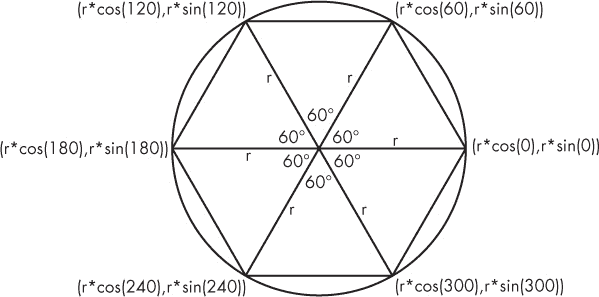

*图 6-6：使用正弦和余弦旋转点绕中心*

要在代码中重新创建这个六边形，我们需要创建一个变量`r`，它表示从旋转中心到每个顶点的距离，而这个距离不会改变。我们唯一需要改变的是`sin()`和`cos()`函数中的角度，它们都是 60 的倍数。一般情况下，它可以写成这样：

```py
for i in range(6):
    vertex(r*cos(60*i),r*sin(60*i))
```

首先，我们让`i`从 0 到 5，这样每个顶点的角度将是 60 的倍数（0、60、120 等等），如图 6-7 所示。接着，我们将`r`更改为 100 并将角度转换为弧度，这样代码就像清单 6-3 一样。

```py
*polygon.pyde*
def setup():
    size(600,600)

def draw():
    translate(width/2,height/2)
    beginShape()
    for i in range(6):
        vertex(100*cos(radians(60*i)),
               100*sin(radians(60*i)))
    endShape(CLOSE)
```

*清单 6-3：绘制六边形*

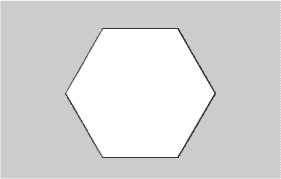

*图 6-7：使用`vertex()`函数和`for`循环绘制的六边形*

现在我们已经将`r`设置为 100 并将角度转换为弧度，当我们运行这段代码时，我们应该看到一个类似于图 6-7 的六边形。

事实上，我们可以创建一个函数，通过这种方式绘制*任何*多边形！

#### 绘制等边三角形

现在让我们用这个函数创建一个等边三角形。清单 6-4 展示了一种更简单的方法，通过循环来创建等边三角形，而不是像我们在第五章中那样使用平方根。

```py
*polygon.pyde*
def setup():
    size(600,600)

def draw():
    translate(width/2,height/2)
    polygon(3,100) #3 sides, vertices 100 units from the center

def polygon(sides,sz):
    '''draws a polygon given the number
    of sides and length from the center'''
    beginShape()
    for i in range(sides):
    step = radians(360/sides)
        vertex(sz*cos(i * step),
               sz*sin(i * step))
    endShape(CLOSE)
```

*清单 6-4：绘制等边三角形*

在这个示例中，我们创建了一个`polygon()`函数，根据边数(`sides`)和多边形的大小(`sz`)来绘制多边形。每个顶点的旋转角度是 360 度除以边数。在我们的六边形中，我们旋转 60 度，因为六边形有六个边（360 / 6 = 60）。`polygon(3,100)`这一行调用了多边形函数，并传入了两个参数：边数为 3，中心到顶点的距离为 100。

运行这段代码，你应该会看到图 6-8 所展示的效果。

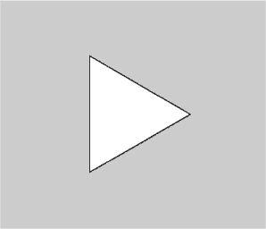

*图 6-8：一个等边三角形！*

现在，绘制任意边数的规则多边形应该非常简单。无需平方根！图 6-9 展示了一些可以使用`polygon()`函数绘制的样本多边形。

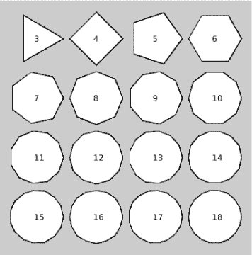

*图 6-9：你想要的所有多边形！*

尝试更新`polygon(3,100)`中的数字，看看多边形如何改变形状！

### 制作正弦波

就像章节开头提到的 Mitch Hedberg 的风扇一样，正弦和余弦用于旋转和振荡。当测量圆上的一个点随时间变化的高度时，正弦和余弦函数会形成波浪。为了让这一点更具体，我们可以画一个圆来可视化正弦波的生成，在圆的圆周上放置一个点（用红色椭圆表示）。当这个点沿着圆周移动时，它的高度随时间变化将画出一条正弦波。

启动一个新的 Processing 草图并将其保存为*CircleSineWave.pyde*。在屏幕左侧创建一个大圆，如图 6-10 所示。在查看代码之前，自己尝试一下。

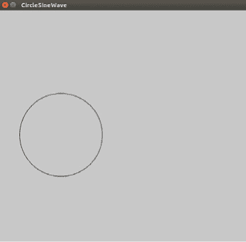

*图 6-10：正弦波草图的开始*

清单 6-5 展示了绘制一个红点在大圆圆周上的草图代码。

```py
*CircleSineWave.pyde*
r1 = 100 #radius of big circle
r2 = 10  #radius of small circle
t = 0 #time variable

def setup():
    size(600,600)

def draw():
    background(200)
    #move to left-center of screen
    translate(width/4,height/2)
    noFill() #don't color in the circle
    stroke(0) #black outline
    ellipse(0,0,2*r1,2*r1)

    #circling ellipse:
    fill(255,0,0) #red
    y = r1*sin(t)
    x = r1*cos(t)
    ellipse(x,y,r2,r2)
```

*清单 6-5：我们的圆形和点*

首先，我们声明圆的半径变量，并使用`t`表示使点移动所需的时间。在`draw()`中，我们将背景设置为`gray(200)`，将画布移到屏幕的中心，并绘制半径为`r1`的大圆。接着，我们使用极坐标绘制围绕圆旋转的椭圆，分别为 x 和 y 坐标。

为了让椭圆绕着圆旋转，我们只需要改变三角函数中的数字（在这种情况下是`t`）。在`draw()`函数的末尾，我们只需让时间变量稍微增加一点，如下所示：

```py
    t += 0.05
```

如果你现在运行这段代码，你会看到一个关于`local variable 't' referenced before assignment`的错误信息。Python 函数有局部变量，但我们希望`draw()`函数使用全局时间变量`t`。因此，我们需要在`draw()`函数的开始部分添加以下代码：

```py
global t
```

现在你会看到一个红色椭圆沿着圆周移动，如图 6-11 所示。

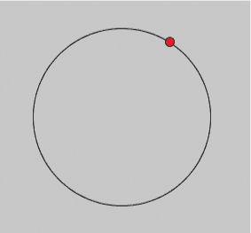

*图 6-11：红色椭圆沿着大圆的圆周运动*。

现在我们需要选择屏幕右侧的一个位置来开始绘制波形。我们将在红色椭圆的基础上延伸一条绿色的线，假设是 x = 200。将这些行添加到你的`draw()`函数中，在`t += 0.05`之前。绘制正弦波的完整代码应如下所示，清单 6-6。

```py
*CircleSineWave.pyde*
r1 = 100 #radius of big circle
r2 = 10  #radius of small circle
t = 0 #time variable

def setup():
    size(600,600)

def draw():
    global t
    background(200)
    #move to left-center of screen
    translate(width/4,height/2)
    noFill() #don't color in the circle
    stroke(0) #black outline
    ellipse(0,0,2*r1,2*r1)
    #circling ellipse:
    fill(255,0,0) #red
    y = r1*sin(t)
    x = r1*cos(t)
    ellipse(x,y,r2,r2)
    stroke(0,255,0) #green for the line
    line(x,y,200,y)
    fill(0,255,0) #green for the ellipse
    ellipse(200,y,10,10)

    t += 0.05
```

*清单 6-6：添加一行来绘制波形*

在这里，我们绘制了一条与旋转的红色椭圆保持相同高度（y 值）的绿色线。这条绿色线始终与水平线平行，因此当红色椭圆上下移动时，绿色椭圆会保持在相同的高度。当你运行程序时，你会看到类似图 6-12 的效果。

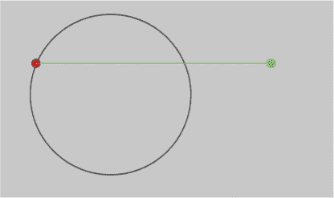

*图 6-12：准备绘制波形！*

你可以看到，我们添加了一个绿色椭圆，它只衡量红色椭圆上下移动的距离，别的什么都不做。

#### 留下轨迹

现在我们希望绿色椭圆留下一个轨迹，以显示它随时间的高度变化。留下轨迹实际上意味着我们保存所有的高度并在每次循环时显示它们。为了保存许多东西，比如数字、字母、单词、点等，我们需要一个*列表*。在程序开始时声明的变量中，在`setup()`函数之前，添加这一行：

```py
circleList = []
```

这会创建一个空列表，我们将在其中保存绿色椭圆的位置。将`circleList`变量添加到`draw()`函数中的`global`行：

```py
global t, circleList
```

在`draw()`函数中计算 x 和 y 之后，我们需要将 y 坐标添加到`circleList`中，但有几种不同的方法可以做到这一点。你已经知道`append()`函数，它会将点添加到列表的末尾。我们可以使用 Python 的`insert()`函数将新点放到列表的开头，像这样：

```py
circleList.insert(0,y)
```

然而，列表会在每次循环时变大。我们可以通过将新值添加到前 249 个已有项中，将其长度限制为 250，如清单 6-7 所示。

```py
    y = r1*sin(t)
    x = r1*cos(t)
    #add point to list:
    circleList = [y] + circleList[:249]
```

*清单 6-7：向列表中添加一个点并将列表限制为 250 个点*

新的一行代码将我们刚刚计算的 y 值与`circleList`中的前 249 个项连接起来。这个包含 250 个点的列表现在变成了新的`circleList`。

在`draw()`函数的末尾（在增加`t`之前），我们将放入一个循环，遍历`circleList`中的所有元素并绘制一个新的椭圆，模拟绿色椭圆留下轨迹的效果。这在清单 6-8 中有所展示。

```py
    #loop over circleList to leave a trail:
    for i in range(len(circleList)):
        #small circle for trail:
        ellipse(200+i,circleList[i],5,5)
```

*清单 6-8：循环遍历圆形列表并在列表中的每个点绘制椭圆*

这段代码使用了一个循环，其中`i`从 0 到`circleList`的长度，并为列表中的每个点绘制一个椭圆。x 值从 200 开始，并随着`i`的变化而增加。椭圆的 y 值是我们保存到`circleList`中的 y 值。

当你运行此代码时，你将看到类似于图 6-13 的效果。

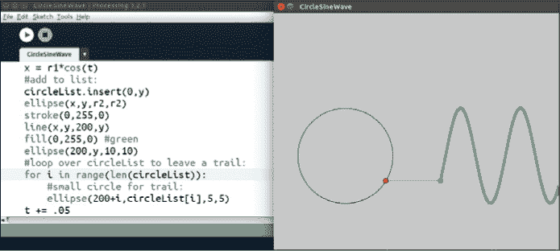

*图 6-13：正弦波！*

你可以看到波形被绘制出来，留下了绿色的轨迹。

#### 使用 Python 内置的`enumerate()`函数

你还可以使用 Python 内置的`enumerate()`函数在列表中的每个点上绘制一个椭圆。这是一种更便捷、更“Pythonic”的方法，用于跟踪列表中项目的索引和值。要查看此功能的演示，请在 IDLE 中打开一个新文件，并输入清单 6-9 中的代码。

```py
>>> myList = ["I","love","using","Python"]
>>> for index, value in enumerate(myList):
        print(index,value)

0 I
1 love
2 using
3 Python
```

*清单 6-9：学习使用 Python 的`enumerate()`函数*

你会注意到有两个变量（索引和值），而不仅仅是一个（`i`）。要在你的圆列表中使用`enumerate()`函数，你可以使用两个变量来跟踪迭代器（`i`，索引）和圆（`c`，值），就像在清单 6-10 中那样。

```py
    #loop over circleList to leave a trail:
    for i,c in enumerate(circleList):
        #small circle for trail:
        ellipse(200+i,c,5,5)
```

*清单 6-10：使用`enumerate()`获取列表中每个项目的索引和值*

最终的代码应类似于你在清单 6-11 中看到的。

```py
*CircleSineWave.pyde*
r1 = 100 #radius of big circle
r2 = 10  #radius of small circle
t = 0 #time variable
circleList = []
def setup():
    size(600,600)
def draw():
    global t, circleList
    background(200)
    #move to left-center of screen
    translate(width/4,height/2)
    noFill() #don't color in the circle
    stroke(0) #black outline
    ellipse(0,0,2*r1,2*r1)
    #circling ellipse:
    fill(255,0,0) #red
    y = r1*sin(t)
    x = r1*cos(t)
    #add point to list:
    circleList = [y] + circleList[:245]
    ellipse(x,y,r2,r2)
    stroke(0,255,0) #green for the line
    line(x,y,200,y)
    fill(0,255,0) #green for the ellipse
    ellipse(200,y,10,10)
 #loop over circleList to leave a trail:
    for i,c in enumerate(circleList):
        #small circle for trail:
        ellipse(200+i,c,5,5)

    t += 0.05
```

*清单 6-11：* CircleSineWave.pyde *草图的最终代码*

这是通常展示给初学三角学的学生的动画，而你已经做出了自己的版本！

### 创建一个涡轮图形程序

现在你已经知道如何旋转圆并留下轨迹，让我们做一个涡轮图形类型的模型！*涡轮图形*是一种由两个重叠的圆形齿轮组成的玩具，这些齿轮相互滑动。齿轮上有孔，你可以将笔和铅笔穿过这些孔来绘制酷炫的曲线图案。许多人在小时候玩过涡轮图形，手工绘制这些图案。但我们可以利用计算机和你刚刚学到的正弦和余弦代码来制作涡轮图形类型的图案。

首先，在 Processing 中启动一个新的草图，命名为*spirograph.pyde*。然后添加清单 6-12 中的代码。

```py
*spirograph.pyde*
r1 = 300.0 #radius of big circle
r2 = 175.0 #radius of circle 2
r3 = 5.0   #radius of drawing "dot"
#location of big circle:
x1 = 0
y1 = 0
t = 0 #time variable
points = [] #empty list to put points in

def setup():
    size(600,600)

def draw():
    global r1,r2,x1,y1,t
    translate(width/2,height/2)
    background(255)
    noFill()
    #big circle
    stroke(0)
    ellipse(x1,y1,2*r1,2*r1)
```

*清单 6-12：将大圆显示在屏幕上*

我们首先在屏幕中央放一个大圆，并为大圆创建变量，然后将一个较小的圆放在其圆周上，就像涡轮图形套件中的圆盘一样。

#### 绘制较小的圆

让我们将较小的圆放在大圆的圆周上，如图 6-14 所示。

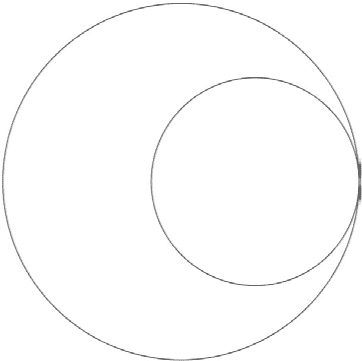

*图 6-14：两个圆*

接下来，我们将让较小的圆绕着较大的圆“内部”旋转，就像一个涡轮图形齿轮。更新清单 6-12 中的代码，并使用清单 6-13 中的代码绘制第二个圆。

```py
    #big circle
    stroke(0)
    ellipse(x1,y1,2*r1,2*r1)

    #circle 2
    x2 = (r1 - r2)
    y2 = 0
    ellipse(x2,y2,2*r2,2*r2)
```

*清单 6-13：添加较小的圆*

为了让较小的圆在较大的圆内部旋转，我们需要将正弦和余弦部分添加到“圆 2”的位置，使其发生振荡。

#### 旋转较小的圆

最后，在`draw()`函数的最后，我们需要像在清单 6-14 中那样递增我们的时间变量`t`。

```py
    #big circle
    stroke(0)
    ellipse(x1,y1,2*r1,2*r1)
 #circle 2
    x2 = (r1 - r2)*cos(t)
    y2 = (r1 - r2)*sin(t)
    ellipse(x2,y2,2*r2,2*r2)
    t += 0.05
```

*清单 6-14：使圆旋转的代码*

这意味着圆 2 将在大圆内沿圆形路径上下左右振动。运行代码，你应该能看到圆 2 顺利旋转！但是，齿轮上笔的位置和绘制轨迹的那个孔怎么办呢？我们将创建第三个椭圆来表示那个点。它的位置将是第二个圆的中心加上半径差。关于“绘制点”的代码在清单 6-15 中有展示。

```py
    #drawing dot
    x3 = x2+(r2 - r3)*cos(t)
    y3 = y2+(r2 - r3)*sin(t)
    fill(255,0,0)
    ellipse(x3,y3,2*r3,2*r3)
```

*清单 6-15：添加绘制点*

当你运行这段代码时，你会看到绘制点正好位于圆 2 的边缘，旋转得就像圆 2 沿着圆 1 的圆周滑动一样。圆 3（绘制点）必须在圆 2 的中心和其圆周之间保持一定比例，因此我们需要在`setup()`函数之前引入一个比例变量（`prop`）。在`draw()`函数的开头确保将其声明为全局变量，正如在清单 6-16 中所示。

```py
prop = 0.9
*--snip--*

global r1,r2,x1,y1,t,prop
*--snip--*

x3 = x2+prop*(r2 - r3)*cos(t)
y3 = y2+prop*(r2 - r3)*sin(t)
```

*清单 6-16：添加比例变量*

现在我们需要弄清楚绘制点旋转的速度。只需一点代数就可以证明它的角速度（旋转速度）是大圆大小与小圆大小的比例。注意，负号意味着点的旋转方向相反。将`draw()`函数中的`x3`和`y3`行改为如下：

```py
x3 = x2+prop*(r2 - r3)*cos(-((r1-r2)/r2)*t)
y3 = y2+prop*(r2 - r3)*sin(-((r1-r2)/r2)*t)
```

剩下的就是将点`(x3,y3)`保存到`points`列表中，并像我们在波形草图中一样，在点之间绘制线条。将`points`列表添加到全局线：

```py
global r1,r2,x1,y1,t,prop,points
```

绘制完第三个椭圆后，将这些点放入一个列表中。这与我们在本章前面使用的*CircleSineWave.pyde*中的步骤相同。最后，遍历列表并在点之间绘制线条，就像在清单 6-17 中所做的那样。

```py
    fill(255,0,0)
    ellipse(x3,y3,2*r3,2*r3)
    #add points to list
    points = [[x3, y3]] + points[:2000]
    for i,p in enumerate(points): #go through the points list
        if i < len(points)-1: #up to the next to last point
            stroke(255,0,0) #draw red lines between the points
            line(p[0],p[1],points[i+1][0],points[i+1][1])

    t += 0.05
```

*清单 6-17：在 Spirograph 中绘制点*

我们在圆形波形示例中使用了类似的技巧，将当前点的列表与包含 2000 个`circleList`项目的列表连接起来。这会自动限制我们保存的点数。运行这段代码，你将看到程序绘制出 Spirograph，正如图 6-15 所示。

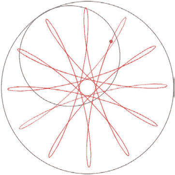

*图 6-15：绘制 Spirograph*

你可以通过改变第二个圆的大小（`r2`）和绘制点的位置（`prop`）来绘制不同的设计。例如，图 6-16 中的 Spirograph 的`r2`为 105，`prop`为 0.8。

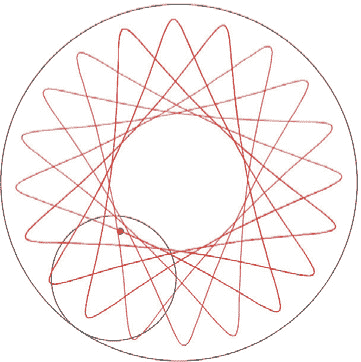

*图 6-16：通过改变`r2`和`prop`创建的另一个 Spirograph 设计*

到目前为止，我们一直在使用正弦和余弦让形状上下或左右振动，但如何让形状在两个不同方向上振动呢？接下来我们将尝试这一点。

### 制作和谐图

在 1800 年代，有一种名为 *和谐图* 的发明，它是一个与两个摆锤相连的桌子。当摆锤摆动时，附着的笔会在纸上绘画。随着摆锤来回摆动并逐渐减速（*衰减*），图案会以有趣的方式发生变化，如 图 6-17 所示。

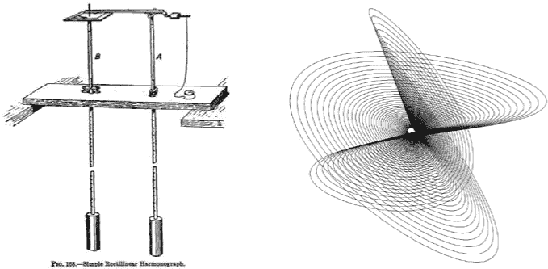

*图 6-17：和谐图机器与设计*

通过编程和几个方程式，我们可以模拟和谐图如何绘制其图案。模拟一个摆锤振荡的方程式是：

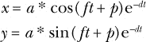

在这些方程中，*x* 和 *y* 分别表示笔的水平和垂直位移（左右和上下的距离）。变量 *a* 是运动的振幅（大小），*f* 是摆锤的频率，*t* 是经过的时间，*p* 是相位偏移，e 是自然对数的底数（它是一个常数，约为 2.7），*d* 是衰减因子（摆锤减速的速度）。时间变量 *t* 在这两个方程中当然是相同的，但其他所有变量可以不同：例如，左右的频率可以与上下的频率不同。

#### 编写和谐图程序

让我们创建一个 Python-Processing 草图来模拟摆锤的运动。创建一个新的 Processing 草图并命名为 *harmonograph.pyde*。初始代码如 清单 6-18 所示。

```py
*harmonograph.pyde*
t = 0

def setup():
    size(600,600)
    noStroke()

def draw():
      global t
    ➊ a1,a2 = 100,200 #amplitudes
      f1,f2 = 1,2 #frequencies
      p1,p2 = 0,PI/2 #phase shifts
      d1,d2 = 0.02,0.02 #decay constants
      background(255)
      translate(width/2,height/2)
    ➋ x = a1*cos(f1*t + p1)*exp(-d1*t) 
      y = a2*cos(f2*t + p2)*exp(-d2*t)
      fill(0) #black
      ellipse(x,y,5,5)
      t += .1
```

*清单 6-18：和谐图草图的初始代码*

这只是通常的 `setup()` 和 `draw()` 函数，带有时间变量（`t`）和振幅（`a1,a2`）、频率（`f1,f2`）、相位偏移（`p1,p2`）以及衰减常数（`d1,d2`）的值。

然后，从 ➊ 开始，我们定义了一堆变量来代入和谐图绘图笔位置的两个公式中。`x =` 和 `y =` 的代码行 ➋ 使用这些变量并计算椭圆的坐标。

现在运行这段代码，你应该会看到圆形在移动，但它在画什么？我们需要将点放入一个列表中，然后绘制出列表中的所有点。在声明 `t` 变量后，创建一个名为 `points` 的列表。目前的代码如 清单 6-19 所示。

```py
*harmonograph.pyde*
t = 0
points = []

def setup():
    size(600,600)
    noStroke()

def draw():
    global t,points
    a1,a2 = 100,200
    f1,f2 = 1,2
    p1,p2 = 0,PI/2
    d1,d2 = 0.02,0.02
    background(255)
    translate(width/2,height/2)
    x = a1*cos(f1*t + p1)*exp(-d1*t)
    y = a2*cos(f2*t + p2)*exp(-d2*t)
    #save location to points List
    points.append([x,y])
    #go through points list and draw lines between them
    for i,p in enumerate(points):
        stroke(0) #black
        if i < len(points) - 1:
            line(p[0],p[1],points[i+1][0],points[i+1][1])
    t += .1
```

*清单 6-19：用点之间的线条绘制和谐图的代码*

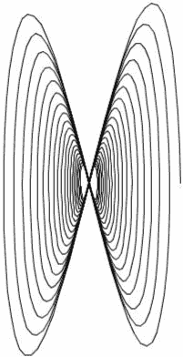

*图 6-18：和谐图*

我们首先在文件顶部定义`points`列表，并在`draw()`函数中将点添加到全局变量中。在计算出`x`和`y`的位置后，我们添加一行代码，将点`[x,y]`添加到`points`列表中。最后，我们遍历`points`列表，并从每个点绘制一条线到下一个点。然后我们使用 Python 的`enumerate()`函数，停止在倒数第二个点之前。这样我们就不会得到索引超出范围的错误信息，当它尝试从最后一个点绘制到下一个点时。现在，当我们运行代码时，看到点在后面留下了轨迹，就像在图 6-18 中看到的那样。

请注意，如果你注释掉公式中的衰减部分，如下所示，程序将简单地在相同的线条上进行绘制：

```py
    x = a1*cos(f1*t + p1)#*exp(-d1*t)
    y = a2*cos(f2*t + p2)#*exp(-d2*t)
```

衰减模拟了摆锤最大振幅的逐渐减小，这也正是许多和谐图图像中“波浪状”效果的来源。前几次观看代码绘制设计时很有趣，但过程会有些慢。如果我们能够一次性填充`points`列表呢？

#### 即时填充列表

我们不再在每一帧都绘制整个列表，而是想出一种方法来即时填充列表。我们可以将整个和谐图的代码从`draw()`函数中剪切出来，粘贴到一个独立的函数中，像在清单 6-20 中那样。

```py
def harmonograph(t):
    a1,a2 = 100,200
    f1,f2 = 1,2
    p1,p2 = PI/6,PI/2
    d1,d2 = 0.02,0.02
    x = a1*cos(f1*t + p1)*exp(-d1*t)
    y = a2*cos(f2*t + p2)*exp(-d2*t)
    return [x,y]
```

*清单 6-20：分离出的`harmonograph()`函数*

现在在`draw()`函数中，你只需要一个循环，在其中为`t`的值添加一堆点，就像在清单 6-21 中那样。

```py
def draw():
    background(255)
    translate(width/2,height/2)
    points = []
    t = 0
    while t < 1000:
        points.append(harmonograph(t))
        t += 0.01

    #go through points list and draw lines between them
    for i,p in enumerate(points):
        stroke(0) #black
        if i < len(points) - 1:
            line(p[0],p[1],points[i+1][0],points[i+1][1])
```

*清单 6-21：新的`draw()`函数，它调用了`harmonograph()`函数*

运行这段代码，你将立即看到一个完整的和谐图！因为我们改变了椭圆的大小和相位偏移，所以下面的结果看起来与之前不同，正如你在图 6-19 中看到的。自己改变每个值，看看它如何改变设计！

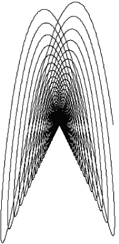

*图 6-19：使用不同的公式来生成和谐图*

#### 两个摆锤比一个摆锤更好

我们可以通过在每个公式中添加另一个项来增加另一个摆锤，从而制作出更复杂的设计，像这样：

```py
    x = a1*cos(f1*t + p1)*exp(-d1*t) + a3*cos(f3*t + p3)*exp(-d3*t)
    y = a2*sin(f2*t + p2)*exp(-d2*t) + a4*sin(f4*t + p4)*exp(-d4*t)
```

这只是在每一行中添加相同的代码，只改变几个数字，以模拟每个方向上不止一个摆锤。当然，你需要创建更多的变量并给它们赋值。在清单 6-22 中是我建议的，复制我在 *[`www.walkingrandomly.com/?p=151`](http://www.walkingrandomly.com/?p=151)* 上找到的设计。

```py
def harmonograph(t):
    a1=a2=a3=a4 = 100
    f1,f2,f3,f4 = 2.01,3,3,2
    p1,p2,p3,p4 = -PI/2,0,-PI/16,0
    d1,d2,d3,d4 = 0.00085,0.0065,0,0
    x = a1*cos(f1*t + p1)*exp(-d1*t) + a3*cos(f3*t + p3)*exp(-d3*t)
    y = a2*sin(f2*t + p2)*exp(-d2*t) + a4*sin(f4*t + p4)*exp(-d4*t)
    return [x,y]
```

*清单 6-22：在图 6-20 中的和谐图设计代码*

在清单 6-22 中，我们只改变了`a`、`f`、`p`和`d`的常数，制作了一个完全不同的设计。如果你在绘制线条之前向代码中添加`stroke(255,0,0)`，你会使线条变成红色，正如在图 6-20 中看到的那样。

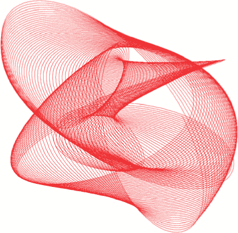

*图 6-20：一个完整的 harmonograph！*

清单 6-23 显示了*harmonograph.pyde*的最终代码。

```py
*harmonograph.pyde*
t = 0
points = []

def setup():
    size(600,600)
    noStroke()

def draw():
    background(255)
    translate(width/2,height/2)
    points = []
    t = 0
    while t < 1000:
        points.append(harmonograph(t))
        t += 0.01
    #go through points list and draw lines between them
    for i,p in enumerate(points):
        stroke(255,0,0) #red
        if i < len(points) - 1:
            line(p[0],p[1],points[i+1][0],points[i+1][1])

def harmonograph(t):
    a1=a2=a3=a4 = 100
    f1,f2,f3,f4 = 2.01,3,3,2
    p1,p2,p3,p4 = -PI/2,0,-PI/16,0
    d1,d2,d3,d4 = 0.00085,0.0065,0,0
    x = a1*cos(f1*t + p1)*exp(-d1*t) + a3*cos(f3*t + p3)*exp(-d3*t)
    y = a2*sin(f2*t + p2)*exp(-d2*t) + a4*sin(f4*t + p4)*exp(-d4*t)
    return [x,y]
```

*清单 6-23：harmonograph 草图的最终代码*

### 总结

三角学课上的学生必须解算三角形中未知的边长或角度测量。但是现在你知道了*正弦*和*余弦*的*真正*用途是旋转和转换点与形状，从而制作 Spirograph 和 harmonograph 设计！在本章中，你看到保存点到列表中，然后遍历列表绘制点之间的线条是多么有用。我们还复习了一些 Python 工具，如`enumerate()`和`vertex()`。

在下一章中，我们将使用正弦和余弦以及你在本章学到的旋转概念，发明一种全新的数字！我们还将使用这些新数字来旋转和转换网格，并通过像素的位置创造出复杂（有意为之）的艺术作品！
