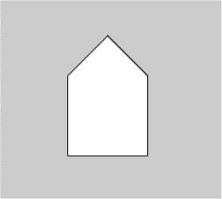

## 6

使用三角学创建振荡

*我家有一台振荡风扇。风扇来回摆动。它看起来像是在说“不”。所以我喜欢问它一些风扇会说“不”的问题。“你能保持我的头发整齐吗？你能保持我的文件整齐吗？你有三个档位吗？骗子！”我的风扇骗了我。——米奇·赫德伯格*

*三角学*字面意思是研究三角形。具体来说，它是研究直角三角形以及它们的边之间存在的特殊比率。然而，从传统三角学课程中所教授的内容来看，你可能会认为就到此为止。图 6-1 展示了典型三角学家庭作业的一部分。

*图 6-1：传统三角学课堂中关于三角形未知边的一个个问题*

这就是大多数人记得的三角学课程任务，解未知三角形边长是常见的作业。*但实际上，三角函数很少是这样使用的*。正弦和余弦等三角函数更常见的用途是用于振荡运动，比如水波、光波和声波。假设你把第四章中*grid.pyde*的绘图代码拿来，并将函数改成如下：

def f(x):

return sin(x)

在这种情况下，你将得到图 6-2 中所示的输出。

*图 6-2：正弦波*

x 轴上的数值是弧度，表示正弦函数的输入。y 轴是输出。如果你在计算器或 Python 终端中输入 sin(1)，你会得到一个以 0.84 开始的长小数。……这就是当 x = 1 时曲线的高度。它几乎位于图 6-2 中曲线的顶部。输入 sin(3)到计算器中，你会得到 0.14……在曲线上，你可以看到当 x = 3 时，它几乎在 x 轴上。输入其他任何 x 值，输出应该遵循这种上下波动的模式，*在 1 和-1 之间振荡*。该波形需要超过六个单位才能完成一个完整的波形，或者一个*波长*，我们也称之为该函数的*周期*。正弦函数的周期是 2π，或者在 Processing 和 Python 中为 6.28 弧度。在学校，你不会再做更多的事情，除了像这样画很多波形。但在本章中，你将使用正弦、余弦和正切来模拟实时的振荡运动。你还将使用三角学在 Processing 中制作一些有趣的动态交互式草图。图 6-3 展示了主要的三角函数。

*图 6-3：直角三角形的边比*

我们将使用三角函数生成任意边数的多边形以及具有任意（奇数）齿数的星形。之后，你将创建一个从围绕圆旋转的点生成的正弦波。你将绘制 Spirograph 和 harmonograph 类型的设计，这些设计需要使用三角函数。你还将让一波五颜六色的点在圆圈内外振荡！

让我们首先讨论一下，如何使用三角函数使得变换、旋转和振荡形状比以前更加容易。

### 使用三角学进行旋转和振荡

首先，正弦和余弦使得旋转变得非常简单。在图 6-3 中，sin A 被表示为对边除以斜边，或者说是 a 边除以 c 边：

解这个方程，得到斜边乘以角 A 的正弦：

a = c Sin A

因此，一个点的 y 坐标可以表示为从原点到该点的距离乘以该点与水平线的夹角的正弦。想象一个半径为 r 的圆，它是三角形的斜边，围绕(0,0)点旋转，如图 6-4 所示。

*图 6-4：点的极坐标形式*

要旋转一个点，我们将保持圆的半径不变，只改变θ角度。计算机会通过将半径 r 与角度θ的余弦或正弦相乘，来重新计算点的所有位置！我们还需要记住，正弦和余弦期望的是弧度输入，而不是角度。幸运的是，你已经学会了如何轻松使用 Processing 的内置函数 radians()和 degrees()来进行单位转换。

### 编写函数绘制多边形

将顶点视为绕中心旋转的点，使得创建多边形变得非常简单。回想一下，多边形是一个多边形状；一个*正多边形*是通过连接一定数量均匀分布在圆周上的点来构成的。记得在第五章中，我们需要多少几何知识来绘制一个等边三角形吗？有了三角函数帮助我们旋转，我们绘制多边形所需要做的就是使用图 6-4 来创建一个多边形函数。

在 Processing 中打开一个新的草图并将其保存为*polygon.pyde*。然后输入清单 6-1 中的代码，使用 vertex()函数绘制一个多边形。

*polygon.pyde*

def setup():

size(600,600)

def draw():

beginShape()

vertex(100,100)

vertex(100,200)

vertex(200,200)

vertex(200,100)

vertex(150,50)

endShape(CLOSE)

*清单 6-1：使用 vertex()绘制多边形*

我们总是可以使用 line()函数绘制多边形，但一旦我们连接了所有的线条，就无法用颜色填充形状。Processing 函数 beginShape()和 endShape()通过使用 vertex()函数定义我们想要的任何形状，告诉程序形状的点应该在哪里。这使得我们可以创建任意数量的顶点。

我们总是从 beginShape() 开始绘制形状，通过将所有的点发送到 vertex() 函数来列出形状上的所有点，最后用 endShape() 结束形状。如果我们在 endShape() 函数中添加 CLOSE，程序将把最后一个顶点与第一个顶点连接起来。

当你运行这段代码时，应该会看到类似图 6-5 的内容。

*图 6-5：由顶点构成的房子形状多边形*

然而，手动输入超过四个或五个点非常繁琐。如果我们能通过循环将一个点围绕另一个点旋转，那就太好了。接下来我们就来尝试这个方法。

#### 使用循环绘制六边形

让我们使用 for 循环来创建六个顶点的六边形，代码见清单 6-2。

*polygon.pyde*

def draw():

translate(width/2,height/2)

beginShape()

for i in range(6):

vertex(100,100)

rotate(radians(60))

endShape(CLOSE)

*清单 6-2：尝试在 for 循环中使用 rotate()*

然而，你会发现如果运行这段代码，你将看到一个空白屏幕！你不能在形状内使用 rotate() 函数，因为该函数会旋转整个坐标系。这正是我们需要你在图 6-4 中看到的正弦和余弦表示法来旋转顶点的原因！

图 6-6 展示了表达式 (r*cos(60*i),r*sin(60*i)) 如何生成六边形的每个顶点。当 i = 0 时，括号中的角度为 0 度；当 i = 1 时，角度为 60 度；依此类推。

*图 6-6：使用正弦和余弦将点旋转到中心周围*

为了在代码中重新创建这个六边形，我们需要创建一个变量 r，表示从旋转中心到每个顶点的距离，这个值不会变化。我们唯一需要更改的是 sin() 和 cos() 函数中的角度，这些角度都是 60 的倍数。通常可以这样写：

for i in range(6):

vertex(r*cos(60*i),r*sin(60*i))

首先，我们让 i 从 0 到 5，这样每个顶点都会是 60 的倍数（0, 60, 120 等），如图 6-7 所示。让我们将 r 改为 100，并将角度数转换为弧度，这样代码就像清单 6-3 所示。

*polygon.pyde*

def setup():

size(600,600)

def draw():

translate(width/2,height/2)

beginShape()

for i in range(6):

vertex(100*cos(radians(60*i)),

100*sin(radians(60*i)))

endShape(CLOSE)

*清单 6-3：绘制六边形*

*图 6-7：使用 vertex() 函数和 for 循环构建的六边形*

现在我们已经将 r 设置为 100，并将角度转换为弧度，当我们运行这段代码时，应该会看到一个像图 6-7 中的六边形。

实际上，我们可以创建一个函数来用这种方式绘制*任何*多边形！

#### 绘制一个等边三角形

现在让我们使用这个函数绘制一个等边三角形。列表 6-4 展示了一个更简单的方法，通过循环而不是像在 第五章 中那样使用平方根来绘制等边三角形。

*polygon.pyde*

def setup():

size(600,600)

def draw():

translate(width/2,height/2)

polygon(3,100) #3 个边，顶点距中心 100 单位

def polygon(sides,sz):

'''根据边数绘制一个多边形

边数和从中心到顶点的长度'''

beginShape()

for i in range(sides):

step = radians(360/sides)

vertex(sz*cos(i * step),

sz*sin(i * step))

endShape(CLOSE)

*列表 6-4: 绘制一个等边三角形*

在这个例子中，我们创建了一个 polygon() 函数，给定边数（sides）和多边形的大小（sz），即可绘制一个多边形。每个顶点的旋转角度是 360 除以边数。对于我们的六边形，旋转角度是 60 度，因为六边形有六个边（360 / 6 = 60）。polygon(3,100) 这行代码调用了 polygon 函数，并传入两个输入：3 代表边数，100 代表从中心到顶点的距离。

运行这段代码，你应该能看到 图 6-8 中展示的内容。

*图 6-8: 等边三角形！*

现在，制作任意边数的正多边形应该轻松得多。不再需要使用平方根！图 6-9 展示了你可以使用 polygon() 函数绘制的一些示例多边形。

*图 6-9: 所有你想要的多边形！*

尝试更新 polygon(3,100) 中的数字，看看多边形的形状如何变化！

### 制作正弦波

就像本章开头提到的 Mitch Hedberg 的风扇一样，正弦和余弦用于旋转和振荡。当测量圆上某一点的高度随时间变化时，正弦和余弦函数会形成波动。为了让这一点更加具体，我们可以创建一个圆，来可视化通过将一个点（显示为红色椭圆）放置在圆的周长上而生成正弦波。当这个点沿圆周运动时，其高度随时间变化会绘制出正弦波。

开始一个新的 Processing 草图并保存为 *CircleSineWave.pyde*。在屏幕的左侧创建一个大圆，像 图 6-10 中那样。在查看代码之前，先自己尝试一下。

*图 6-10: 正弦波草图的开始*

列表 6-5 显示了绘制一个红点在大圆周长上的代码。

*CircleSineWave.pyde*

r1 = 100 #大圆的半径

r2 = 10  #小圆的半径

t = 0 #时间变量

def setup():

size(600,600)

def draw():

background(200)

#移动到屏幕的左中心

translate(width/4,height/2)

noFill() #不填充圆

stroke(0) #黑色轮廓

ellipse(0,0,2*r1,2*r1)

#环绕椭圆：

fill(255,0,0) #红色

y = r1*sin(t)

x = r1*cos(t)

ellipse(x,y,r2,r2)

*列表 6-5: 我们的圆和点*

首先，我们声明了圆的半径变量，并使用 t 来表示使点移动所需的时间。在 draw()中，我们将背景设置为灰色（200），并将原点移到屏幕的中心，然后绘制大圆。接下来，我们通过使用极坐标计算 x 和 y 来绘制旋转的椭圆。

为了让椭圆绕圆旋转，我们只需要改变三角函数中的数字（在本例中是 t）。在 draw()函数的末尾，我们只需要让时间变量增加一点点，像这样：

t += 0.05

如果你现在尝试运行这段代码，你会收到一个关于局部变量‘t’在赋值前被引用的错误信息。Python 函数有局部变量，但我们希望 draw()函数使用全局时间变量 t。因此，我们必须在 draw()函数的开始添加以下这一行：

global t

现在你会看到一个红色椭圆沿圆的周长移动，就像图 6-11 中所示。

*图 6-11：红色椭圆沿大圆的周长移动*。

现在我们需要在屏幕的右侧选择一个位置来开始绘制波形。我们将从红色椭圆延伸一条绿色线段，假设 x = 200。将这些代码添加到 draw()函数中，放在 t += 0.05 之前。绘制正弦波的完整代码应该像 Listing 6-6 这样。

*CircleSineWave.pyde*

r1 = 100 #大圆的半径

r2 = 10  #小圆的半径

t = 0 #时间变量

def setup():

size(600,600)

def draw():

global t

background(200)

#移动到屏幕的左侧中央

translate(width/4,height/2)

noFill() #不填充圆形

stroke(0) #黑色轮廓

ellipse(0,0,2*r1,2*r1)

# 绕圈旋转的椭圆：

fill(255,0,0) #红色

y = r1*sin(t)

x = r1*cos(t)

ellipse(x,y,r2,r2)

stroke(0,255,0) #绿色线条

line(x,y,200,y)

fill(0,255,0) #绿色用于椭圆

ellipse(200,y,10,10)

t += 0.05

*Listing 6-6: 添加一条线来绘制波形*

在这里，我们在与旋转红色椭圆相同的高度（y 值）绘制了一条绿色线。这条绿色线保持与水平平行，因此当红色椭圆上下移动时，绿色椭圆将保持在同一高度。运行程序时，你将看到类似图 6-12 的效果。

*图 6-12：准备绘制波形！*

你可以看到，我们添加了一个绿色椭圆，它仅用来测量红色椭圆上下移动的距离，其他没有任何作用。

#### 留下轨迹

现在，我们希望绿色椭圆留下轨迹，显示它随时间变化的高度。留下轨迹实际上意味着我们保存所有的高度并显示它们——每次循环都这样做。为了保存很多东西，比如数字、字母、单词、点等等，我们需要一个*列表*。将这行代码添加到程序开始时声明的变量中，放在 setup()函数之前：

circleList = []

这创建了一个空列表，我们将把绿色椭圆的位置保存在其中。将`circleList`变量添加到`draw()`函数中的全局行：

global t, circleList

在我们计算了 x 和 y 值之后，接下来需要将 y 坐标添加到`circleList`中，但有几种不同的方法可以做到这一点。你已经知道了`append()`函数，但它会将点添加到列表的末尾。我们可以使用 Python 的`insert()`函数将新点放到列表的开头，像这样：

circleList.insert(0,y)

然而，列表会在每次循环时变大。我们可以通过将新值添加到前 249 个已有的项中来限制它的长度为 250，具体方法见 Listing 6-7。

y = r1*sin(t)

x = r1*cos(t)

#将点添加到列表：

circleList = [y] + circleList[:249]

*Listing 6-7：向列表中添加一个点并将列表限制为 250 个点*

新的一行代码将包含我们刚刚计算出的 y 值和`circleList`中前 249 个项目的列表连接起来。这个包含 250 个点的列表现在就成了新的`circleList`。

在`draw()`函数的末尾（在递增`t`之前），我们会加入一个循环，遍历`circleList`的所有元素并绘制一个新的椭圆，使绿色椭圆看起来像是在留下轨迹。具体见 Listing 6-8。

#遍历 circleList 以留下轨迹：

for i in range(len(circleList)):

#轨迹的小圆：

ellipse(200+i,circleList[i],5,5)

*Listing 6-8：遍历圆形列表并在每个点绘制一个椭圆*

这段代码使用了一个循环，`i`从 0 增加到`circleList`的长度，并在列表中的每个点上绘制一个椭圆。椭圆的 x 值从 200 开始，并根据`i`的值递增。椭圆的 y 值是我们保存到`circleList`中的 y 值。

当你运行这个时，你会看到类似图 6-13 的效果。

*图 6-13：正弦波！*

你可以看到波形被绘制出来，留下了绿色的轨迹。

#### 使用 Python 的内置`enumerate()`函数

你还可以使用 Python 的内置`enumerate()`函数，在列表中的每个点上绘制一个椭圆。这是一种方便且更“Pythonic”的方式，用来跟踪列表中项的索引和值。要看到这个的实际效果，打开 IDLE 中的新文件，并输入 Listing 6-9 中的代码。

>>> myList = ["I","love","using","Python"]

>>> for index, value in enumerate(myList):

print(index,value)

0 I

1 love

2 using

3 Python

*Listing 6-9：学习使用 Python 的`enumerate()`函数*

你会注意到有两个变量（index 和 value），而不仅仅是一个（i）。要在`circleList`中使用`enumerate()`函数，你可以使用两个变量来跟踪迭代器（i，索引）和圆形（c，值），就像在 Listing 6-10 中那样。

#遍历 circleList 以留下轨迹：

for i,c in enumerate(circleList):

#轨迹的小圆：

ellipse(200+i,c,5,5)

*清单 6-10：使用 enumerate()获取列表中每个项的索引和值*

最终代码应如清单 6-11 所示。

*CircleSineWave.pyde*

r1 = 100 #大圆的半径

r2 = 10  #小圆的半径

t = 0 #时间变量

circleList = []

def setup():

size(600,600)

def draw():

global t, circleList

background(200)

#移动到屏幕的左中部

translate(width/4,height/2)

noFill() #不填充圆

stroke(0) #黑色轮廓

ellipse(0,0,2*r1,2*r1)

#环形椭圆：

fill(255,0,0) #红色

y = r1*sin(t)

x = r1*cos(t)

#将点添加到列表：

circleList = [y] + circleList[:245]

ellipse(x,y,r2,r2)

stroke(0,255,0) #绿色的线条

line(x,y,200,y)

fill(0,255,0) #绿色的椭圆

ellipse(200,y,10,10)

#遍历 circleList 留下轨迹：

for i,c in enumerate(circleList):

#用于轨迹的小圆：

ellipse(200+i,c,5,5)

t += 0.05

*清单 6-11：*CircleSineWave.pyde*草图的最终代码*

这是通常展示给初学三角函数学生的动画，而你已经制作了自己的版本！

### 创建一个涡轮画图程序

现在你知道如何旋转圆并留下轨迹了，让我们来制作一个涡轮画图类型的模型！*Spirograph*是一种玩具，由两个重叠的圆形齿轮组成，它们相互滑动。齿轮上有孔，你可以将钢笔和铅笔插入其中，绘制出酷炫的曲线设计。许多人小时候玩过涡轮画图，手工绘制这些设计。但我们可以使用计算机和你刚学到的正弦和余弦代码，制作类似涡轮画图的设计。

首先，在 Processing 中创建一个新的草图，命名为*spirograph.pyde*。然后添加清单 6-12 中的代码。

*spirograph.pyde*

r1 = 300.0 #大圆的半径

r2 = 175.0 #圆 2 的半径

r3 = 5.0   #画“点”的半径

#大圆的位置：

x1 = 0

y1 = 0

t = 0 #时间变量

points = [] #空列表存放点

def setup():

size(600,600)

def draw():

global r1,r2,x1,y1,t

translate(width/2,height/2)

background(255)

noFill()

#大圆

stroke(0)

ellipse(x1,y1,2*r1,2*r1)

*清单 6-12：将大圆放到屏幕上的代码*

我们首先将一个大圆放置在屏幕的中央，并为大圆创建变量，然后将一个较小的圆放在它的圆周上，就像涡轮画图工具中的齿轮。

#### 绘制较小的圆

让我们将较小的圆放置在大圆的圆周上，如图 6-14 所示。

*图 6-14：两个圆*

接下来，我们将让较小的圆在“大圆”的“内部”旋转，就像涡轮画图的齿轮一样。更新清单 6-12 中的代码，使用清单 6-13 中的代码来绘制第二个圆。

#大圆

stroke(0)

ellipse(x1,y1,2*r1,2*r1)

#圆 2

x2 = (r1 - r2)

y2 = 0

ellipse(x2,y2,2*r2,2*r2)

*清单 6-13：添加更小的圆*

为了让较小的圆在较大的圆内旋转，我们需要将正弦和余弦部分添加到“圆 2”的位置，以便它能振荡。

#### 旋转较小的圆

最后，在`draw()`函数的最后，我们必须增加时间变量`t`，就像在 Listing 6-14 中所示。

#大圆

stroke(0)

ellipse(x1,y1,2*r1,2*r1)

#圆 2

x2 = (r1 - r2)*cos(t)

y2 = (r1 - r2)*sin(t)

ellipse(x2,y2,2*r2,2*r2)

t += 0.05

*Listing 6-14: 使圆旋转的代码*

这意味着圆 2 将在大圆内部沿着圆形路径上下左右振荡。运行代码，你应该看到圆 2 在旋转得很好！但是关于齿轮上的那个孔，笔就在其中并绘制轨迹呢？我们将创建第三个椭圆来表示那个点。它的位置将是第二个圆的中心加上半径的差。关于“绘制点”的代码可以在 Listing 6-15 中找到。

#绘制点

x3 = x2+(r2 - r3)*cos(t)

y3 = y2+(r2 - r3)*sin(t)

fill(255,0,0)

ellipse(x3,y3,2*r3,2*r3)

*Listing 6-15: 添加绘制点*

当你运行这段代码时，你会看到绘制点刚好位于圆 2 的边缘，旋转就像圆 2 沿着圆 1 的圆周滑动一样。圆 3（绘制点）必须位于圆 2 的中心与其圆周之间的某个比例位置，因此我们需要在`setup()`函数之前引入一个比例变量（prop）。确保在`draw()`函数的开始部分声明它为全局变量，正如在 Listing 6-16 中所示。

prop = 0.9

*--snip--*

global r1,r2,x1,y1,t,prop

*--snip--*

x3 = x2+prop*(r2 - r3)*cos(t)

y3 = y2+prop*(r2 - r3)*sin(t)

*Listing 6-16: 添加比例变量*

现在我们需要计算绘制点的旋转速度。通过一些简单的代数可以证明，它的角速度（即旋转速度）是大圆与小圆的尺寸比。注意负号意味着点的旋转方向相反。将`draw()`函数中的 x3 和 y3 行改成以下内容：

x3 = x2+prop*(r2 - r3)*cos(-((r1-r2)/r2)*t)

y3 = y2+prop*(r2 - r3)*sin(-((r1-r2)/r2)*t)

剩下的就是将点（x3，y3）保存到一个点列表中，并在这些点之间画线，就像我们在波浪草图中做的那样。将点列表添加到全局线条中：

global r1,r2,x1,y1,t,prop,points

在绘制第三个椭圆之后，将点放入列表中。这是我们在本章早些时候的*CircleSineWave.pyde*中使用的相同过程。最后，遍历列表并在点之间画线，就像在 Listing 6-17 中所示。

fill(255,0,0)

ellipse(x3,y3,2*r3,2*r3)

#添加点到列表

points = [[x3, y3]] + points[:2000]

for i,p in enumerate(points): #遍历点列表

if i < len(points)-1: #直到倒数第二个点

stroke(255,0,0) #在点之间画红色线

line(p[0],p[1],points[i+1][0],points[i+1][1])

t += 0.05

*清单 6-17：绘制 Spirograph 中的点*

我们在圆形波例子中使用了类似的方法将点添加到列表中。我们将包含当前点的列表与包含 2000 个圆形列表项的列表连接在一起。这会自动限制我们保存到点列表中的点的数量。运行这段代码并观察程序绘制 Spirograph 图形，如图 6-15 所示。

*图 6-15：绘制 Spirograph 图形*

你可以改变第二个圆的大小（r2）和绘图点的位置（prop），以绘制不同的图形。例如，图 6-16 中的 Spirograph 图形，r2 为 105，prop 为 0.8。

*图 6-16：通过改变 r2 和 prop 创建的另一种 Spirograph 设计*

到目前为止，我们一直在使用正弦和余弦让形状上下或左右振荡，但如果要让形状在两个不同方向上振荡呢？接下来我们就尝试一下。

### 创建谐振图形

在 19 世纪，曾经有一种叫做*谐振图形*的发明，它是一个与两个摆锤连接的桌子。当摆锤摆动时，附着的笔会在纸上绘图。当摆锤来回摆动并逐渐停下（*衰减*）时，图案会以有趣的方式发生变化，如图 6-17 所示。

*图 6-17：谐振图形机器与设计*

通过编程和几个方程式，我们可以模拟谐振图形绘制其图案的过程。模拟单个摆锤振荡的方程式如下：

在这些方程中，*x*和*y*分别表示笔的水平和垂直位移（左右和上下的距离）。变量*a*表示运动的振幅（大小），*f*是摆锤的频率，*t*是经过的时间，*p*是相位移，e 是自然对数的底数（大约为 2.7），*d*是衰减因子（摆锤减速的速度）。时间变量*t*在这两个方程中当然是相同的，但其他所有变量都可以不同：例如，左右方向的频率可以不同于上下方向的频率。

#### 编写谐振图形程序

我们来创建一个 Python-Processing 草图，用于模拟摆锤的运动。创建一个新的 Processing 草图，并将其命名为*harmonograph.pyde*。初始代码显示在清单 6-18 中。

*harmonograph.pyde*

t = 0

def setup():

size(600,600)

noStroke()

def draw():

global t

➊ a1,a2 = 100,200 #振幅

f1,f2 = 1,2 #频率

p1,p2 = 0,PI/2 #相位移

d1,d2 = 0.02,0.02 #衰减常数

background(255)

translate(width/2,height/2)

➋ x = a1*cos(f1*t + p1)*exp(-d1*t)

y = a2*cos(f2*t + p2)*exp(-d2*t)

fill(0) #黑色

ellipse(x,y,5,5)

t += .1

*清单 6-18：谐振图形草图的初始代码*

这就是常见的 setup() 和 draw() 函数，包含了一个时间变量（t）以及振幅（a1,a2）、频率（f1,f2）、相位偏移（p1,p2）和衰减常数（d1,d2）的值。

然后，从 ➊ 开始，我们定义了一些变量，用于插入到两个公式中，以确定 harmonograph 绘图笔的位置。x = 和 y = 这两行 ➋ 使用这些变量并计算椭圆的坐标。

现在运行这段代码，你应该能看到圆圈在移动，但它在画什么呢？我们需要将点放入一个列表中，然后绘制该列表中的所有点。声明 t 变量之后，创建一个名为 points 的列表。到目前为止的代码在 列表 6-19 中显示。

*harmonograph.pyde*

t = 0

points = []

def setup():

size(600,600)

noStroke()

def draw():

global t,points

a1,a2 = 100,200

f1,f2 = 1,2

p1,p2 = 0,PI/2

d1,d2 = 0.02,0.02

background(255)

translate(width/2,height/2)

x = a1*cos(f1*t + p1)*exp(-d1*t)

y = a2*cos(f2*t + p2)*exp(-d2*t)

#将位置保存到 points 列表

points.append([x,y])

#遍历 points 列表，绘制点与点之间的线条

for i,p in enumerate(points):

stroke(0) #黑色

if i < len(points) - 1:

line(p[0],p[1],points[i+1][0],points[i+1][1])

t += .1

*列表 6-19：使用点之间的线条绘制 harmonograph 的代码*

*图 6-18：Harmonograph*

我们从文件顶部定义 points 列表并在 draw() 函数中将点添加到全局变量。计算出 x 和 y 的位置后，我们添加一行代码，将点 [x,y] 添加到 points 列表。最后，我们遍历 points 列表，从每个点绘制到下一个点之间的线条。然后，我们使用 Python 的 enumerate() 函数，并在倒数第二个点停止。这样可以避免出现错误消息，提示索引超出范围，因为它尝试从最后一个点绘制到下一个点。现在，当我们运行代码时，我们看到点留下了轨迹，就像在 图 6-18 中一样。

注意，如果你注释掉公式中的衰减部分，像这样，程序将简单地在相同的线条上重复绘制：

x = a1*cos(f1*t + p1)#*exp(-d1*t)

y = a2*cos(f2*t + p2)#*exp(-d2*t)

衰减模拟了摆锤最大振幅的逐渐减少，它创造了许多 harmonograph 图像中的“扇形”效果。刚开始看到代码绘制设计效果时很酷，但这会花费一些时间。如果我们能够一次性填充整个 points 列表呢？

#### 立即填充列表

与其在每一帧中绘制整个列表，不如想办法立即填充这个列表。我们可以将整个 harmonograph 代码从 draw() 函数中剪切出来，并粘贴到自己的函数中，就像在 列表 6-20 中一样。

def harmonograph(t):

a1,a2 = 100,200

f1,f2 = 1,2

p1,p2 = PI/6,PI/2

d1,d2 = 0.02,0.02

x = a1*cos(f1*t + p1)*exp(-d1*t)

y = a2*cos(f2*t + p2)*exp(-d2*t)

return [x,y]

*列表 6-20：将 harmonograph() 函数分离*

现在，在 draw()函数中，你只需要一个循环来为 t 的值添加许多点，就像在 Listing 6-21 中一样。

def draw():

background(255)

translate(width/2,height/2)

points = []

t = 0

while t < 1000:

points.append(harmonograph(t))

t += 0.01

#遍历点列表并在它们之间绘制线条

for i,p in enumerate(points):

stroke(0) #黑色

if i < len(points) - 1:

line(p[0],p[1],points[i+1][0],points[i+1][1])

*Listing 6-21: 新的 draw()函数，调用了 harmonograph()函数*

运行这个代码，你会立即看到一个完整的和谐图！因为我们改变了椭圆的大小和相位变化，所以这个和谐图看起来不同，正如你在 Figure 6-19 中看到的那样。自己修改每个值，看看这会如何改变设计！

*Figure 6-19: 使用不同的公式来制作和谐图*

#### 两个摆锤比一个更好

我们可以通过在每个公式中添加另一个项来添加另一个摆锤，从而制作更复杂的设计，像这样：

x = a1*cos(f1*t + p1)*exp(-d1*t) + a3*cos(f3*t + p3)*exp(-d3*t)

y = a2*sin(f2*t + p2)*exp(-d2*t) + a4*sin(f4*t + p4)*exp(-d4*t)

所做的仅仅是在每一行代码中添加相同的代码，只改变了一些数字，以模拟每个方向的多个摆锤。当然，你需要创建更多的变量并给它们赋值。在 Listing 6-22 中是我根据* [`www.walkingrandomly.com/?p=151`](http://www.walkingrandomly.com/?p=151)*找到的设计给出的建议。

def harmonograph(t):

a1=a2=a3=a4 = 100

f1,f2,f3,f4 = 2.01,3,3,2

p1,p2,p3,p4 = -PI/2,0,-PI/16,0

d1,d2,d3,d4 = 0.00085,0.0065,0,0

x = a1*cos(f1*t + p1)*exp(-d1*t) + a3*cos(f3*t + p3)*exp(-d3*t)

y = a2*sin(f2*t + p2)*exp(-d2*t) + a4*sin(f4*t + p4)*exp(-d4*t)

return [x,y]

*Listing 6-22: Figure 6-20 中设计的和谐图代码*

在 Listing 6-22 中，我们所改变的只是 a, f, p 和 d 的常数，来创建一个完全不同的设计。如果你在绘制线条前加入 stroke(255,0,0)，你将会让这些线条变成红色，正如在 Figure 6-20 中所示。

*Figure 6-20: 一个完整的和谐图！*

Listing 6-23 显示了*harmonograph.pyde*的最终代码。

*harmonograph.pyde*

t = 0

points = []

def setup():

size(600,600)

noStroke()

def draw():

background(255)

translate(width/2,height/2)

points = []

t = 0

while t < 1000:

points.append(harmonograph(t))

t += 0.01

#遍历点列表并在它们之间绘制线条

for i,p in enumerate(points):

stroke(255,0,0) #红色

if i < len(points) - 1:

line(p[0],p[1],points[i+1][0],points[i+1][1])

def harmonograph(t):

a1=a2=a3=a4 = 100

f1,f2,f3,f4 = 2.01,3,3,2

p1,p2,p3,p4 = -PI/2,0,-PI/16,0

d1,d2,d3,d4 = 0.00085,0.0065,0,0

x = a1*cos(f1*t + p1)*exp(-d1*t) + a3*cos(f3*t + p3)*exp(-d3*t)

y = a2*sin(f2*t + p2)*exp(-d2*t) + a4*sin(f4*t + p4)*exp(-d4*t)

return [x,y]

*列表 6-23：和谐图草图的最终代码*

### 总结

三角学课上的学生需要解出三角形中的未知边长或角度。但现在你知道了，*正弦*和*余弦*的真正用途是旋转和变换点和形状，以制作螺旋图和和谐图设计！在这一章中，你看到了将点保存到列表中并通过循环遍历列表在点之间画线是多么有用。我们还回顾了一些 Python 工具，如`enumerate()`和`vertex()`。

在下一章中，我们将使用你在这一章中学到的正弦和余弦以及旋转的概念，发明一种全新的数字！我们还将使用这些新数字旋转和变换网格，并利用像素的位置创作复杂（字面和双关的意思）艺术作品！
