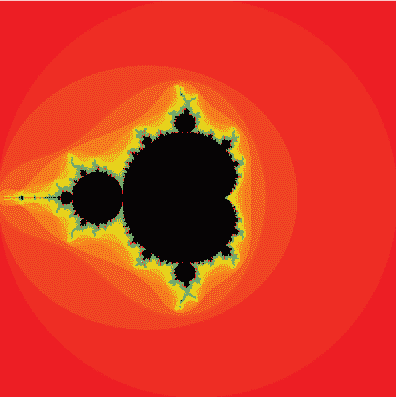

## 第七章：复数

*虚数是神圣精神的美妙庇护所，几乎是存在与非存在之间的两栖物种。——戈特弗里德·莱布尼茨*


包含 –1 的平方根的数字在数学课堂上常常被误解。我们把 –1 的平方根称为 *虚数*，或 *i*。称某物为“虚拟”会让它看起来像是不存在的，或者好像没有实际的用途。但虚数确实存在，而且在电磁学等领域中有很多实际应用。

在本章中，你将体验使用 *复数* 创建美丽艺术作品的乐趣。复数是具有实部和虚部的数字，写成 *a* + *bi* 的形式，其中 *a* 和 *b* 是实数，*i* 是虚数。由于复数包含两个不同的信息，实部和虚部，你可以利用它将一维物体转化为二维物体。使用 Python 后，操作这些数字变得更加简单，我们可以将其用于一些非常神奇的用途。事实上，我们使用复数来解释电子和光子的行为，而我们认为是自然的、“正常”的数字实际上是虚部为零的复数！

本章开始时，我们回顾如何在复数坐标平面中绘制复数。你还将学习如何将复数表示为 Python 列表，然后编写函数对其进行加法和乘法运算。最后，你将学习如何求复数的大小或绝对值。在本章后面，我们编写用于生成曼德尔布罗特集合和朱莉亚集合的程序时，了解如何操作复数将大有帮助。

### 复数坐标系

正如弗兰克·法里斯在他精彩且插图精美的著作《*对称的创造*》中总结的那样：“复数……仅仅是一种将实数的笛卡尔有序对（*x, y*）紧凑地表示为一个单一数字 *z* = *x* + *iy* 的方式。” 我们都知道，笛卡尔坐标系使用 *x* 表示水平轴，*y* 表示垂直轴，但我们从未对这些数字进行加法或乘法运算；它们仅仅代表一个位置。

相比之下，复数不仅可以表示位置，还可以像其他数字一样进行运算。从几何角度来看复数会更有帮助。让我们稍微改变一下坐标系统，使得实数位于水平轴上，虚数位于垂直轴上，如 图 7-1 所示。


*图 7-1：复数坐标系*

在这里，你可以看到 *a* + *bi* 和 *a* – *bi* 在复数坐标系中的位置。

### 复数相加

复数的加法和减法与实数的操作一样：你从一个数开始，然后按照另一个数所表示的步数进行操作。例如，要加上 2 + 3*i* 和 4 + *i*，你只需分别加上它们的实部和虚部，得到 6 + 4*i*，如图 7-2 所示。


*图 7-2：加法运算的复数*

如你所见，我们从 4 + *i* 开始。为了加上 2 + 3*i*，我们向正实轴方向移动两个单位，向正虚轴方向移动三个单位，最终到达 6 + 4*i*。

让我们编写一个用于加法运算的复数函数，代码示例见清单 7-1。在 IDLE 中打开一个新文件并命名为 *complex.py*。

```py
def cAdd(a,b):
    '''adds two complex numbers'''
    return [a[0]+b[0],a[1]+b[1]]
```

*清单 7-1：加法运算函数示例*

在这里，我们定义了一个名为 `cAdd()` 的函数，给它两个复数以列表形式 `[x,y]` 传入，该函数返回另一个列表。列表的第一个元素 `a[0] + b[0]` 是我们提供的复数的第一个项（索引 0）的和。第二个元素 `a[1] + b[1]` 是两个复数的第二个项（索引 1）的和。保存并运行此程序。

现在让我们使用复数 `u = 1 + 2i` 和 `v = 3 + 4i` 来测试这个程序。在交互式 shell 中将它们传递给我们的 `cAdd()` 函数，如下所示：

```py
>>> u = [1,2]
>>> v = [3,4]
>>> cAdd(u,v)
[6, 4]
```

你应该得到 6 + 4*i*，这是复数 1 + 2*i* 和 3 + 4*i* 的和。复数相加就像是先沿 x 方向走一步，再沿 y 方向走一步，当我们需要创建像曼德尔布罗集和朱莉亚集这样的美丽设计时，这个函数还会再次出现。

### 乘以复数的 *i*

但是，复数相加并不是最有用的操作，乘法才是。例如，乘以 *i* 会让复数绕原点旋转 90 度。在复数坐标系统中，乘以 -1 相当于绕原点旋转 180 度，如图 7-3 所示。


*图 7-3：乘以 -1 表示 180 度旋转*

如你所见，1 乘以 -1 等于 -1，这使得 1 绕零点旋转到了另一侧。

因为乘以 -1 相当于进行 180 度的旋转，所以 -1 的平方根表示 90 度的旋转，如图 7-4 所示。


*图 7-4：乘以 *i* 表示 90 度旋转*

这意味着 *i* 代表 -1 的平方根，乘以 1 时将我们旋转至 -1 的一半。将结果 (*i*) 再乘以 *i* 会让我们再旋转 90 度，最终得到 -1。这样就验证了平方根的定义，因为通过将同一个数 (*i*) 自身乘以两次，我们可以得到一个负数。

### 乘法运算：两个复数的乘法

让我们看看当我们相乘两个复数时会发生什么。就像你会用 FOIL 方法相乘两个二项式一样，你可以用代数方式通过 FOIL 方法相乘两个复数：


为了简化这一过程，让我们将这个过程转化为`cMult()`函数，如列表 7-2 所示。

```py
def cMult(u,v):
    '''Returns the product of two complex numbers'''
    return [u[0]*v[0]-u[1]*v[1],u[1]*v[0]+u[0]*v[1]]
```

*列表 7-2：编写乘法函数以相乘两个复数*

要测试`cMult()`函数，尝试将 u = 1 + 2*i*与 v = 3 + 4*i*相乘。在交互式 shell 中输入以下内容：

```py
>>> u = [1,2]
>>> v = [3,4]
>>> cMult(u,v)
[-5, 10]
```

如你所见，乘积是–5 + 10*i*。

回想一下上一节内容，复数与*i*相乘等同于在复平面坐标系原点进行 90 度旋转。现在，让我们用 v = 3 + 4*i*来试一试：

```py
>>> cMult([3,4],[0,1])
[-4, 3]
```

结果是 –4 + 3*i*。当我们将 3 + 4*i*与–4 + 3*i*画出时，你应该会看到类似于图 7-5 所示的内容。


*图 7-5：通过与*i*相乘将复数旋转 90 度*

如你所见，–4 + 3*i*是 3 + 4*i*的 90 度旋转结果。

现在你已经知道如何加法和乘法运算复数，让我们来看看如何求一个复数的模，你将使用它来创建曼德尔布罗特集和朱莉亚集。

### 编写 MAGNITUDE()函数

复数的*模*，或*绝对值*，表示复数与复平面原点的距离。现在，让我们使用毕达哥拉斯定理来创建一个模函数。返回到*complex.py*并确保在文件顶部从 Python 的`math`模块导入平方根函数：

```py
from math import sqrt
```

`magnitude()`函数就是毕达哥拉斯定理：

```py
def magnitude(z):
    return sqrt(z[0]**2 + z[1]**2)
```

让我们来找出复数 2 + i 的模：

```py
>>> magnitude([2,1])
2.23606797749979
```

现在，你已经准备好编写一个 Python 程序，根据复数的大小为显示窗口上的像素上色。复数的意外行为将导致一个无限复杂的设计，无法在没有计算机的情况下复制！

### 创建曼德尔布罗特集

为了创建曼德尔布罗特集，我们将把显示窗口上的每个像素表示为复数*z*，然后反复对其进行平方，并加上原始的复数*z*。

 然后，我们将对输出进行相同的处理，一次又一次。如果数值持续增大，我们将根据其模大于某个特定值（如 2）所需的迭代次数为原始复数对应的像素上色。如果数值持续变小，我们将为其选择不同的颜色。

你已经知道，将一个数与大于 1 的数相乘会使原始数变大。将一个数与 1 相乘保持不变，而与小于 1 的数相乘则会使原始数变小。复数遵循类似的模式，你可以在复平面上表示，如图 7-6 所示。


*图 7-6：可视化当你乘以复数时发生的情况*

如果我们只是在乘以复数，曼德布罗集合将看起来像图 7-6，一个圆形。但不仅仅是对复数进行平方，之后还会加上一个数字。这将使得圆形变成一个无限复杂且令人惊叹的美丽图形。但是在此之前，我们需要对网格上的每个点进行操作！

根据操作的结果，有些复数将变小并*收敛*到零，而其他的则变大并*发散*。在数学术语中，接近某个数字称为*收敛*，而变得过大则称为*发散*。对于我们的目的，我们将根据每个像素点需要多少次迭代才能变得太大并飞出网格来为其上色。我们将数字代入的公式类似于我们在清单 7-2 中使用的 `cMult()` 函数，只不过多了一步。我们将数字平方，再加上原始的复数，并重复这个过程，直到它发散。如果平方后的复数的大小大于 2，就意味着它已经发散（我们可以选择任何数字作为最大值）。如果它从未超过 2，我们将保持其颜色为黑色。

例如，我们手动尝试使用复数 *z* = 0.25 + 1.5*i* 来进行曼德布罗集合操作：

```py
>>> z = [0.25,1.5]
```

我们通过将 `z` 乘以它自己并将结果保存到变量 `z2` 来进行平方：

```py
>>> z2 = cMult(z,z)
>>> z2
[-2.1875, 0.75]
```

然后我们使用 `cAdd()` 函数将 `z2` 和 `z` 相加：

```py
>>> cAdd(z2,z)
[-1.9375, 2.25]
```

我们有一个函数可以用来测试这个复数是否距离原点超过两单位，方法是使用毕达哥拉斯定理。我们可以使用之前的 `magnitude()` 函数来检查得到的复数的大小是否大于 2：

```py
>>> magnitude([-1.9375,2.25])
2.969243380054926
```

我们设定规则如下：“如果一个数字离原点超过两单位，它就会发散。”因此，复数 *z* = 0.25 + 1.5*i* 在进行 1 次迭代后就会发散！

这次，我们尝试 *z* = 0.25 + 0.75*i*，如下所示：

```py
>>> z = [0.25,0.75]
>>> z2 = cMult(z,z)
>>> z3 = cAdd(z2,z)
>>> magnitude(z3)
1.1524430571616109
```

在这里，我们重复了之前的相同过程，只不过这次我们需要再次将 `z2` 和 `z` 相加，并将其保存为 `z3`。它仍然在离原点两单位以内，因此我们用这个新值替换 `z` 并再次进行该过程。首先，我们创建一个新变量 `z1`，用于对原始的 `z` 进行平方：

```py
>>> z1 = z
```

让我们使用复数 `z3` 的最新值重复这个过程。我们将对其进行平方，加上 `z1`，然后找出大小：

```py
>>> z2 = cMult(z3,z3)
>>> z3 = cAdd(z2,z1)
>>> magnitude(z3)
0.971392565148097
```

因为 0.97 小于 1.152，我们可能猜测结果正在变小，因此看起来不会发散，但我们只重复了两次这个过程。手动进行这些操作很费劲！让我们自动化这些步骤，以便能够快速轻松地重复这一过程。我们将使用平方、相加和求大小的函数来编写一个名为 `mandelbrot()` 的函数，自动化检查过程，这样我们就能将发散的数字与收敛的数字区分开来。你认为它会呈现什么样的设计？一个圆形？一个椭圆？让我们来看看！

#### 编写 `MANDELBROT()` 函数

让我们打开一个 Processing 草图，并将其命名为 *mandelbrot.pyde*。我们在这里尝试重现的 Mandelbrot 集合以数学家贝努瓦·曼德布罗特（Benoit Mandelbrot）的名字命名，他在 1970 年代首次使用计算机探索这个过程。我们将重复平方和相加的过程，最多迭代若干次，或者直到数字发散，具体过程见清单 7-3。

```py
def mandelbrot(z,num):
    '''runs the process num times
    and returns the diverge count '''
  ➊ count=0
    #define z1 as z
    z1=z
    #iterate num times
  ➋ while count <= num:
        #check for divergence
        if magnitude(z1) > 2.0:
        #return the step it diverged on
            return count
        #iterate z
      ➌ z1=cAdd(cMult(z1,z1),z)
        count+=1
    #if z hasn't diverged by the end
    return num
```

*清单 7-3：编写 `mandelbrot()` 函数以检查复数发散所需的步数*

`mandelbrot()` 函数接受一个复数 `z` 和一个迭代次数作为参数。它返回 `z` 发散所需的次数，如果 `z` 永远不发散，则返回 `num`（在函数结束时）。我们创建了一个 `count` 变量 ➊ 来跟踪迭代次数，并创建了一个新的复数 `z1`，它被平方并如此继续，但 `z` 保持不变。

我们开始一个循环，在 `count` 变量小于 `num` ➋ 时重复这个过程。在循环内，我们检查 `z1` 的大小，看看它是否已经发散，如果发散了，我们返回 `count` 并停止代码。否则，我们对 `z1` 进行平方操作并将 `z` 加到其中 ➌，这就是我们对复数的操作定义。最后，我们将 `count` 变量加 1，并再次进行循环。

使用 *mandelbrot.pyde* 程序，我们可以将复数 *z* = 0.25 + 0.75*i* 插入，并在每次迭代后检查其大小。以下是每次循环后的大小：

```py
0.7905694150420949
1.1524430571616109
 0.971392565148097
1.1899160852817983
2.122862368187107
```

第一个数字是 z = 0.25 + 0.75*i* 在任何迭代之前的大小：


你可以看到它在四次迭代后发散，因为它与原点的距离超过了两单位。图 7-7 绘制了每一步的图表，帮助你可视化它们。


*图 7-7：运行复数 0.25 + 0.75*i* 通过 `mandelbrot()` 函数直到它发散*

红色圆圈的半径为两单位，表示我们对复数发散设定的限制。当对原始值 `z` 进行平方和相加时，我们使数字的位置旋转并平移，最终使它们距离原点比我们的规则允许的更远。

让我们使用在第四章中学到的一些绘图技巧，在 Processing 显示中绘制点和函数。将*complex.py*中的所有复数函数（`cAdd`、`cMult`和`magnitude`）复制并粘贴到*mandelbrot.pyde*文件的底部。我们将使用 Processing 的`println()`函数打印出一个点发散所需的步骤数。将清单 7-4 中的代码添加到你在清单 7-3 中编写的`mandelbrot()`代码之前。

```py
*mandelbrot.pyde*
#range of x-values
xmin = -2
xmax = 2

#range of y-values
ymin = -2
ymax = 2
 #calculate the range
rangex = xmax - xmin
rangey = ymax - ymin

def setup():
    global xscl, yscl
    size(600,600)
    noStroke()
    xscl = float(rangex)/width
    yscl = float(rangey)/height

def draw():
    z = [0.25,0.75]
    println(mandelbrot(z,10))
```

*清单 7-4：曼德博集合代码的开始部分*

我们在程序的顶部计算实数值（`x`）和虚数值（`y`）的范围。在`setup()`函数内，我们计算所需的缩放因子（`xscl`和`yscl`），将像素乘以（在这种情况下是 0 到 600），以获得复数（在这种情况下是从–2 到 2）。在`draw()`函数中，我们定义我们的复数`z`，然后将其传递给`mandelbrot()`函数并打印出结果。此时，屏幕上不会显示任何内容，但在控制台中，你会看到打印出的数字 4。现在，我们将遍历屏幕上的每一个像素，并将它们的位置输入`mandelbrot()`函数并显示结果。

让我们回到`mandelbrot()`函数，位于*mandelbrot.pyde*程序中。对像素位置进行重复的乘法和加法操作会返回一个数值，如果这个数值从不发散，我们就将该像素涂成黑色。整个`draw()`函数展示在清单 7-5 中。

```py
*mandelbrot.pyde*
def draw():
    #origin in center:
    translate(width/2,height/2)
    #go over all x's and y's on the grid
  ➊ for x in range(width):
        for y in range(height):
         ➋ z = [(xmin + x * xscl) ,
                 (ymin + y * yscl) ]
            #put it into the mandelbrot function
         ➌ col=mandelbrot(z,100)
            #if mandelbrot returns 0
            if col == 100:
                fill(0) #make the rectangle black
            else:
                fill(255) #make the rectangle white
            #draw a tiny rectangle
            rect(x,y,1,1)
```

*清单 7-5：遍历显示窗口中所有像素*

遍历所有像素需要一个嵌套循环来处理`x`和`y` ➊。我们声明复数`z`为 x + *i*y ➋。根据窗口坐标计算复数`z`稍微有点复杂。我们从`xmin`值开始，例如，然后加上我们所采取的步数乘以缩放因子。我们并不是在 0 和 600 之间变化，这是显示窗口的像素大小；我们实际上是在–2 和 2 之间变化。我们将其传递给`mandelbrot()`函数 ➌。

`mandelbrot()`函数将复数平方并加起来 100 次，并返回数值发散所需的迭代次数。这个数字保存到一个名为`col`的变量中，因为`color`已经是 Processing 中的关键词。`col`中的数字决定我们将该像素设置为哪种颜色。目前，我们只需通过将每个不发散的像素设置为黑色，来在屏幕上绘制曼德博集合。否则，我们将使矩形变为白色。运行这段代码，你应该会看到著名的曼德博集合，像图 7-8 中那样。


*图 7-8：著名的曼德博集合*

不觉得这很神奇吗？而且绝对是出乎意料的：仅通过对复数进行平方并相加，再根据数字的大小给像素上色，我们就绘制出了一个复杂到无穷的图案，没有计算机，这种设计是无法想象的！你可以通过改变`x`和`y`的范围来放大图案中的特定区域，像在清单 7-6 中一样。

```py
#range of x-values
xmin = -0.25
xmax = 0.25

#range of y-values
ymin = -1
ymax = -0.5
```

*清单 7-6：改变值的范围以放大曼德布罗集合*

现在输出应该类似于图 7-9。


*图 7-9：放大曼德布罗集合！*

我强烈推荐你查看网上一些人发布的关于放大曼德布罗集合的视频。

#### 为曼德布罗集合添加颜色

现在，让我们为你的曼德布罗设计添加一些颜色。通过添加以下代码，告诉 Processing 你使用的是 HSB（色调、饱和度、亮度）色标，而不是 RGB（红色、绿色、蓝色）色标：

```py
def setup():
    size(600,600)
    colorMode(HSB)
    noStroke()
```

然后根据`mandelbrot()`函数返回的值为矩形上色：

```py
            if col == 100:
                fill(0)
            else:
                fill(3*col,255,255)
            #draw a tiny rectangle
            rect(x*xscl,y*yscl,1,1)
```

在`fill`行中，我们将`col`变量（复数发散所需的迭代次数）乘以 3，并将其作为 HSB 颜色模式中的 H（色调）组件。运行这段代码，你应该会看到一个漂亮的着色曼德布罗集合，就像在图 7-10 中看到的那样。



*图 7-10：使用发散值为曼德布罗集合着色*

你可以看到每一步发散的点，从深橙色的圆圈到变成黑色曼德布罗集合的浅橙色椭圆。你也可以试验其他颜色。例如，将填充行更改为以下内容：

```py
                fill(255-15*col,255,255)
```

运行此更新，你会看到图像中更多的蓝色，正如图 7-11 所示。


*图 7-11：在曼德布罗集合中试验不同的颜色*

接下来，我们将探索一个相关的设计，叫做朱莉亚集合，它的外观可以根据我们输入的不同而变化。

### 创建朱莉亚集合

在曼德布罗集合中，为了确定每个点的颜色，我们从点作为复数 z 开始，然后反复对其平方并加上原始数字 z。朱莉亚集合的构造方式与曼德布罗集合相同，但在对复数进行平方之后，我们并不是加上该点的原始复数，而是不断加上一个常数复数*c*，该常数对所有点保持相同。通过为*c*选择不同的值，我们可以创建许多不同的朱莉亚集合。

#### 编写`JULIA()`函数

维基百科页面上列出了许多美丽的 Julia 集合示例，以及用于创造这些集合的复数。让我们尝试使用 *c* = –0.8 + 0.156*i* 来创建一个。我们可以轻松地将 `mandelbrot()` 函数修改为 `julia()` 函数。将你的 *mandelbrot.pyde* 草图保存为 *julia.pyde*，并更改 `mandelbrot()` 函数的代码，使其看起来像清单 7-7。

```py
*julia.pyde*
def julia(z,c,num):
    '''runs the process num times
    and returns the diverge count'''
    count = 0
    #define z1 as z
    z1 = z
    #iterate num times
    while count <= num:
        #check for divergence
        if magnitude(z1) > 2.0:
            #return the step it diverged on
            return count
        #iterate z
      ➊ z1 = cAdd(cMult(z1,z1),c)
        count += 1
```

*清单 7-7：为 Julia 集合编写 `julia()` 函数*

它与曼德尔布罗特函数几乎相同。唯一改变的代码行是➊，其中 `z` 被改为 `c`。复数 `c` 会与 `z` 不同，因此我们需要将其传递给 `draw()` 中的 `julia()` 函数，如清单 7-8 所示。

```py
def draw():
    #origin in center:
    translate(width/2,height/2)
    #go over all x's and y's on the grid
    x = xmin
 while x < xmax:
        y = ymin
        while y < ymax:
            z = [x,y]
          ➊ c = [-0.8,0.156]
            #put it into the julia program
            col = julia(z,c,100)
            #if julia returns 100
            if col == 100:
                fill(0)
            else:
                #map the color from 0 to 100
                #to 0 to 255
                #coll = map(col,0,100,0,300)
                fill(3*col,255,255)
            rect(x*xscl,y*yscl,1,1)
            y += 0.01
        x += 0.01
```

*清单 7-8：为 Julia 集合编写 `draw()` 函数*

除了我们为这个 Julia 集合选择的复数 `c` ➊ 之外，其他与 *mandelbrot.pyde* 中的内容完全相同。紧接着，我们将 `c` 添加到调用 `julia()` 函数时的参数中。当你运行时，你将得到一个与曼德尔布罗特集合大不相同的设计，如图 7-12 所示。


*图 7-12：对应于* c *= –0.8 + 0.156* i 的 Julia 集合

Julia 集合的精彩之处在于你可以改变输入的 `c` 值，从而得到不同的输出。例如，如果你将 *c* 改为 0.4 + 0.6*i*，你应该会看到类似于图 7-13 的图案。


*图 7-13：对应于* c *= –0.4 + 0.6*i 的 Julia 集合

练习 7-1：绘制 Julia 集合

绘制一个 *c* = 0.285 + 0.01*i* 的 Julia 集合。

### 摘要

在这一章中，你学习了复数是如何在复数坐标平面上绘制的，以及它们如何让你执行旋转操作——并且你跟随它们的逻辑，深入学习了如何加法和乘法运算。你使用学到的知识编写了 `mandelbrot()` 和 `julia()` 函数，将复数转化为不可思议的艺术作品，这些艺术作品如果没有复数的发明和计算机的出现，是无法实现的。

如你所见，这些数字一点也不虚幻！希望当你现在想到复数时，它们会让你想起那些你可以通过数字和代码创造出来的美丽设计。
