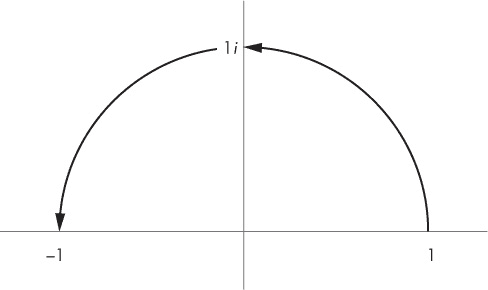

## 7

复数

*虚数是神圣精神的一个美妙而精致的避难所，几乎是存在与非存在之间的两栖物种。—戈特弗里德·莱布尼茨*

包含平方根-1 的数字在数学课堂上常常被冠上一个不太好的名字。我们称平方根-1 为*虚数*，或者*i*。把某物称为“虚拟的”会让它看起来似乎不存在，或者没有实际用途。但虚数*确实*存在，并且在电磁学等领域中有很多实际应用。

在本章中，你将体验使用*复数*创造的美丽艺术作品。复数是既有实部又有虚部的数字，表示为 *a* + *bi*，其中 *a* 和 *b* 是实数，*i* 是虚数。由于复数包含两种不同的信息——实部和虚部，你可以用它来将一维物体转变为二维物体。使用 Python 后，操作这些数字变得更加容易，我们可以将它们用于一些非常神奇的目的。实际上，我们用复数来解释电子和光子的行为，而我们认为的自然、“正常”的数字实际上是虚部为零的复数！

本章开始时，我们回顾了如何在复数坐标平面中绘制复数。你还将学习如何将复数表示为 Python 列表，然后编写函数来对它们进行加法和乘法运算。最后，你将学习如何求复数的模，或称绝对值。掌握复数的操作技巧对后续章节中编写创建曼德尔布罗集合和朱利亚集合的程序将大有帮助。

### 复杂坐标系统

正如弗兰克·法里斯在他精彩且精美插图的著作《创造对称》中总结的那样：“复杂数... 只是表达实数的笛卡尔有序对（*x, y*）的一种紧凑的方式，作为一个单一的数字 *z* = *x* + *iy*。”我们都知道，笛卡尔坐标系使用 *x* 表示横轴，*y* 表示纵轴，但我们从不对这些数字进行加法或乘法操作；它们只是表示一个位置。

相比之下，复数不仅可以表示位置，还可以像其他数字一样进行运算。我们可以从几何角度来看待复数。让我们稍微调整一下坐标系统，使得实数位于横轴，虚数位于纵轴，如图 7-1 所示。

*图 7-1：复杂坐标系统*

在这里，你可以看到 *a* + *bi* 和 *a* – *bi* 在复数坐标系统中的位置。

### 复数的加法

加减复数与加减实数是一样的：你从一个数开始，然后根据另一个数的大小进行步进。例如，要将复数 2 + 3*i* 和 4 + *i* 相加，你只需分别将实部和虚部相加，得到 6 + 4*i*，如图 7-2 所示。

*图 7-2：加两个复数*

如你所见，我们从 4 + *i* 开始。为了加上 2 + 3*i*，我们首先在实数轴上向正方向移动两步，再在虚数轴上向正方向移动三步，最终到达 6 + 4*i*。

让我们使用清单 7-1 中的代码来编写一个加两个复数的函数。在 IDLE 中打开一个新文件并命名为 *complex.py*。

def cAdd(a,b):

'''将两个复数相加'''

return [a[0]+b[0],a[1]+b[1]]

*清单 7-1：两个复数相加的函数*

在这里，我们定义了一个名为 cAdd() 的函数，输入两个复数的列表形式 [x,y]，并返回另一个列表。列表的第一个元素 a[0]+b[0] 是我们提供的两个复数的第一项（索引 0）的和。第二个元素 a[1]+b[1] 是两个复数的第二项（索引 1）的和。保存并运行这个程序。

现在让我们使用复数 u = 1 + 2i 和 v = 3 + 4i 来测试程序。将它们输入到我们的 cAdd() 函数中，如下所示：

>>> u = [1,2]

>>> v = [3,4]

>>> cAdd(u,v)

[6, 4]

你应该得到 6 + 4*i*，这是复数 1 + 2*i* 和 3 + 4*i* 的和。加复数就像先在 x 轴方向上走一步，再在 y 轴方向上走一步，我们在创建像曼德尔布罗特集和朱莉亚集这样的美丽图形时会再次看到这个函数。

### 乘以复数 I

但加复数并不是最有用的事情，乘复数才是。例如，将复数乘以 *i* 会将复数围绕原点旋转 90 度。在复数坐标系中，将实数乘以 -1 会围绕原点旋转 180 度，正如在图 7-3 中所示。

*图 7-3：将一个数乘以 -1 作为 180 度旋转*

如你所见，1 乘以 -1 等于 -1，这会将 1 旋转到零的另一侧。

因为将复数乘以 -1 相当于进行 180 度旋转，所以 -1 的平方根表示的是 90 度旋转，正如在图 7-4 中所示。

*图 7-4：将一个数乘以* i *作为 90 度旋转*

这意味着 *i* 代表 –1 的平方根，这个数字当我们将它与 1 相乘时会将我们旋转到 –1 的一半位置。再次将结果（*i*）与 *i* 相乘会导致我们再旋转 90 度，最终得到 –1。这确认了平方根的定义，因为我们能够通过将一个数字与相同的数字（*i*）相乘两次，得到该数字的负值。

### 乘法两个复数

让我们看看当我们将两个复数相乘时会发生什么。就像你乘法两个二项式一样，你可以使用 FOIL 方法代数地乘法两个复数：

为了简化这个过程，让我们将其转化为一个 cMult() 函数，如列表 7-2 所示。

def cMult(u,v):

'''返回两个复数的乘积'''

return [u[0]*v[0]-u[1]*v[1],u[1]*v[0]+u[0]*v[1]]

*列表 7-2: 编写两个复数相乘的函数*

为了测试 cMult() 函数，尝试将 u = 1 + 2*i* 和 v = 3 + 4*i* 相乘。在交互式命令行中输入以下内容：

>>> u = [1,2]

>>> v = [3,4]

>>> cMult(u,v)

[-5, 10]

正如你所看到的，乘积是 –5 + 10*i*。

回想一下上一节提到的，将复数乘以 *i* 就相当于围绕复数坐标系统的原点进行 90 度的旋转。现在，让我们用 v = 3 + 4*i* 来试试：

>>> cMult([3,4],[0,1])

[-4, 3]

结果是 –4 + 3*i*。当我们将 3 + 4*i* 和 –4 + 3*i* 绘制在图表上时，你应该看到类似图 7-5 所示的样子。

*图 7-5: 通过乘以* i 将复数旋转 90 度

如你所见，–4 + 3*i* 是 3 + 4*i* 旋转了 90 度的结果。

现在你知道如何加法和乘法复数，让我们来看看如何求复数的模长，这将用于创建曼德尔布罗特集和朱莉亚集。

### 编写 magnitude() 函数

复数的 *模*，或 *绝对值*，是复数在复数坐标平面上离原点的距离。现在，让我们使用勾股定理创建一个模长函数。返回 *complex.py* 文件，并确保在文件顶部导入 Python 数学模块中的平方根函数：

from math import sqrt

magnitude() 函数就是勾股定理：

def magnitude(z):

return sqrt(z[0]**2 + z[1]**2)

让我们找出复数 2 + i 的模长：

>>> magnitude([2,1])

2.23606797749979

现在，你已经准备好编写一个 Python 程序，根据复数的大小为显示窗口上的像素着色。复数的意外行为将导致一个无限复杂的设计，这在没有计算机的情况下是无法复制的！

### 创建曼德尔布罗特集

为了创建曼德尔布罗特集，我们将把显示窗口上的每个像素表示为一个复数 *z*，然后重复对其平方，并加上原始的复数 *z*。

 然后，我们将对输出进行相同的操作，一遍又一遍。如果数字不断增大，我们将根据其幅度变大超过某个特定数值（如 2）所需的迭代次数来为对应的原始复数像素上色。如果数字不断变小，我们将为其赋予不同的颜色。

你已经知道，乘以大于 1 的数会使原始数变大，乘以 1 的数保持不变，而乘以小于 1 的数会使原始数变小。复数遵循类似的规律，你可以在复平面上表示它们，如 图 7-6 所示。

*图 7-6：可视化当你乘以复数时发生的情况*

如果我们只是在进行复数相乘，曼德尔布罗特集合将看起来像 图 7-6 中的一个圆。然而，不仅仅是复数被平方，之后还加了一个数。这将把圆形变成一个无限复杂且惊人美丽的图形。但在我们做这些之前，我们需要对网格上的每个点进行操作！

根据操作的结果，有些会变小并*收敛*到零。其他的则会变大并*发散*。在数学中，接近某个数被称为*收敛*；而变得过大被称为*发散*。为了我们的目的，我们将根据每个像素的迭代次数为网格上的每个像素着色，直到它变得过大并飞出网格。我们将数字代入的公式类似于 清单 7-2 中的 cMult() 函数，只是多了一个步骤。我们先平方该数，再将原始复数加到平方上，然后重复这个过程，直到它发散。如果平方后的复数幅度大于 2，就意味着它已经发散了（我们可以选择任何一个数字作为最大值）。如果它从未超过 2，我们就将其保持为黑色。

例如，我们手动尝试使用复数 *z* = 0.25 + 1.5*i* 进行曼德尔布罗特集合的操作：

>>> z = [0.25,1.5]

我们通过将 z 自乘并将结果保存到变量 z2 来对 z 进行平方：

>>> z2 = cMult(z,z)

>>> z2

[-2.1875, 0.75]

然后我们使用 cAdd() 函数将 z2 和 z 相加：

>>> cAdd(z2,z)

[-1.9375, 2.25]

我们有一个函数可以用来测试这个复数是否超出原点两单位远，利用勾股定理。让我们使用之前的 magnitude() 函数来检查我们得到的复数的幅度是否大于 2：

>>> magnitude([-1.9375,2.25])

2.969243380054926

我们设定规则如下：“如果一个数离原点超过两单位，它就会发散。”因此，复数 *z* = 0.25 + 1.5*i* 在仅仅 1 次迭代后就发散了！

这次，让我们尝试 *z* = 0.25 + 0.75*i*，如下所示：

>>> z = [0.25,0.75]

>>> z2 = cMult(z,z)

>>> z3 = cAdd(z2,z)

>>> magnitude(z3)

1.1524430571616109

在这里，我们重复了之前的过程，只不过这次我们需要将 z2 和 z 相加，保存为 z3。它仍然在原点的两单位范围内，所以我们将 z 替换为这个新值，并再次执行该过程。首先，我们创建一个新变量 z1，用于平方原始的 z：

>>> z1 = z

让我们使用复数 z3 的最新值重复这个过程。我们将它平方，加入 z1，然后找出大小：

>>> z2 = cMult(z3,z3)

>>> z3 = cAdd(z2,z1)

>>> magnitude(z3)

0.971392565148097

因为 0.97 小于 1.152，我们可以猜测结果正在变小，因此看起来似乎不会发散，但我们仅仅重复了两次这个过程。手动做这个过程非常费力！让我们自动化这些步骤，这样我们就能快速且轻松地重复这个过程。我们将使用平方、加法和大小函数来编写一个名为 mandelbrot() 的函数，自动化检查过程，以便我们可以直观地将发散的数字与收敛的数字区分开来。你觉得它会形成什么样的图形？一个圆？一个椭圆？让我们来看看吧！

#### 编写 MANDELBROT() 函数

让我们打开一个 Processing 草图，并命名为 *mandelbrot.pyde*。我们在这里尝试重建的曼德尔布罗集（Mandelbrot set）是以数学家 Benoit Mandelbrot 的名字命名的，他在 1970 年代首次使用计算机探索了这个过程。我们将重复平方和加法过程，最多迭代 num 次，或者直到数字发散，如 清单 7-3 所示。

def mandelbrot(z,num):

'''运行过程 num 次

并返回发散次数 '''

➊ count=0

#将 z1 定义为 z

z1=z

#迭代 num 次

➋ 当 count <= num 时：

#检查发散

如果 magnitude(z1) > 2.0:

#返回发散的步骤

return count

#迭代 z

➌ z1=cAdd(cMult(z1,z1),z)

count+=1

#如果 z 在结束时没有发散

return num

*清单 7-3：编写 mandelbrot() 函数来检查复数发散需要多少步骤*

mandelbrot() 函数以复数 z 和迭代次数 num 作为参数。它返回 z 发散所需的次数，如果从不发散，则返回 num（在函数结束时）。我们创建了一个 count 变量 ➊ 来跟踪迭代次数，并创建了一个新的复数 z1，它被平方，依此类推，但不改变 z。

我们开始一个循环，当 count 变量小于 num 时重复该过程 ➋。在循环内，我们检查 z1 的大小，以查看 z1 是否已经发散，如果发散则返回 count 并停止代码。否则，我们将 z1 平方并加上 z ➌，这就是我们对复数操作的定义。最后，我们将 count 变量加 1，并再次执行循环。

使用 *mandelbrot.pyde* 程序，我们可以将复数 *z* = 0.25 + 0.75*i* 插入，并检查每次迭代后的大小。以下是每次循环后的大小：

0.7905694150420949

1.1524430571616109

0.971392565148097

1.1899160852817983

2.122862368187107

第一个数字是 z = 0.25 + 0.75*i* 经过任何迭代之前的幅度：

你可以看到它在经过四次迭代后发散，因为它离原点的距离超过了两个单位。图 7-7 绘制了每个步骤，你可以通过图形化来观察它们。

*图 7-7：将复数 0.25 + 0.75*i* 通过 mandelbrot() 函数直到它发散*

红色圆圈的半径为两个单位，表示我们设定的复数发散的限制。当对 z 的原始值进行平方和加法时，我们会导致数值的位置旋转和平移，并最终使其远离原点，超过我们的规则允许的范围。

让我们使用在第四章中学到的一些绘图技巧，在 Processing 显示器中绘制点和函数。将 *complex.py* 中的所有复数函数（cAdd、cMult 和 magnitude）复制并粘贴到 *mandelbrot.pyde* 的底部。我们将使用 Processing 的 println() 函数在控制台输出一个点发散所需的步骤数。在你在清单 7-3 中编写的 mandelbrot() 代码之前，加入清单 7-4 中的代码。

*mandelbrot.pyde*

#x 值的范围

xmin = -2

xmax = 2

#y 值的范围

ymin = -2

ymax = 2

#计算范围

rangex = xmax - xmin

rangey = ymax - ymin

def setup():

global xscl, yscl

size(600,600)

noStroke()

xscl = float(rangex)/width

yscl = float(rangey)/height

def draw():

z = [0.25,0.75]

println(mandelbrot(z,10))

*清单 7-4：Mandelbrot 代码的开头*

我们在程序的顶部计算实数值（x）和虚数值（y）的范围。在 setup() 中，我们计算所需的缩放因子（xscl 和 yscl），这些因子需要乘以像素值（在此情况下为 0 到 600），以便获得复数（在此情况下为 -2 到 2）。在 draw() 函数中，我们定义复数 z，然后将其传入 mandelbrot() 函数，并打印出我们得到的结果。此时屏幕上不会显示任何内容，但在控制台中你将看到数字 4 被打印出来。现在我们将遍历屏幕上的每个像素，并将它们的位置传入 mandelbrot() 函数，显示出结果。

让我们回到 *mandelbrot.pyde* 程序中的 mandelbrot() 函数。对一个像素的位置重复进行乘法和加法操作会返回一个数值，如果这个数值从未发散，我们就将像素涂成黑色。整个 draw() 函数的代码如清单 7-5 所示。

*mandelbrot.pyde*

def draw():

#原点位于中心：

translate(width/2,height/2)

#遍历网格上的所有 x 和 y

➊ for x in range(width):

for y in range(height):

➋ z = [(xmin + x * xscl) ,

(ymin + y * yscl) ]

#将其传入 mandelbrot 函数

➌ col=mandelbrot(z,100)

#如果 mandelbrot 返回 0

if col == 100:

fill(0) #将矩形填充为黑色

else:

fill(255) #将矩形设置为白色

#绘制一个小矩形

rect(x,y,1,1)

*清单 7-5：遍历显示窗口中的所有像素*

遍历所有像素需要对 x 和 y 进行嵌套循环 ➊。我们声明复数 z 为 x + *i*y ➋。根据窗口坐标计算复数 z 有点棘手。例如，我们从 xmin 值开始，然后加上我们采取的步数乘以缩放因子。我们不是在 0 和 600 之间移动，600 是显示窗口的像素大小；我们只是介于–2 和 2 之间。然后我们将其传递给 mandelbrot()函数 ➌。

mandelbrot()函数对复数进行 100 次平方和相加，并返回复数发散所需的迭代次数。这个数字会保存在名为 col 的变量中，因为在 Processing 中“color”已是一个关键字。col 中的数字决定了我们为该像素设置的颜色。目前，我们先通过将所有没有发散的像素设置为黑色来在屏幕上显示曼德尔布罗特集合。否则，我们将矩形设置为白色。运行此代码后，你应该能看到著名的曼德尔布罗特集合，像图 7-8 那样。

*图 7-8：著名的曼德尔布罗特集合*

真不惊人吗？而且完全出乎意料：仅仅通过对复数进行平方和相加，并根据数字的增大程度为像素上色，我们就绘制出了一个无法想象的复杂图案，这个图案如果没有计算机是根本无法构思的！你可以通过更改 x 和 y 的范围来放大设计中的特定部分，就像在清单 7-6 中那样。

#x 值范围

xmin = -0.25

xmax = 0.25

#y 值范围

ymin = -1

ymax = -0.5

*清单 7-6：更改值范围以放大曼德尔布罗特集合*

现在输出应该像图 7-9 那样显示。

*图 7-9：放大曼德尔布罗特集合！*

我强烈建议你查看一些人们在互联网上发布的放大曼德尔布罗特集合的视频。

#### 向曼德尔布罗特集合添加颜色

现在让我们为你的曼德尔布罗特设计添加一些颜色。通过添加以下代码，告诉 Processing 你使用的是 HSB（色相、饱和度、亮度）色彩模式，而不是 RGB（红、绿、蓝）色彩模式：

def setup():

size(600,600)

colorMode(HSB)

noStroke()

然后根据 mandelbrot()函数返回的值为这些矩形上色：

if col == 100:

fill(0)

else:

fill(3*col,255,255)

#绘制一个小矩形

rect(x*xscl,y*yscl,1,1)

在 fill 行中，我们将 col 变量（复数发散所需的迭代次数）乘以 3，并使其成为 HSB 色彩模式中的 H（色相）分量。运行此代码后，你应该能看到像图 7-10 那样的漂亮着色曼德尔布罗特集合。

*图 7-10：使用发散值为曼德尔布罗特集合上色*

你可以看到每一步发散的点，从深橙色的圆圈到变成黑色 Mandelbrot 集合的浅橙色椭圆。你还可以尝试其他颜色。例如，修改填充行如下：

fill(255-15*col,255,255)

运行这个更新，你会看到图像中更多的蓝色，如 图 7-11 所示。

*图 7-11：在 Mandelbrot 集中实验不同的颜色*

接下来，我们将探索一个相关的设计，称为 Julia 集，它可以根据我们给定的输入改变外观。

### 创建 JULIA 集

在 Mandelbrot 集中，为了确定每个点的颜色，我们从一个复数点 z 开始，然后重复对其进行平方并加上原始的 z 值。Julia 集的构造方式与 Mandelbrot 集相同，但在平方复数后，我们不是加上该点的原始复数，而是不断加上一个常数复数 *c*，该常数对所有点的值相同。通过为 *c* 设置不同的值，我们可以创建出许多不同的 Julia 集。

#### 编写 JULIA() 函数

Wikipedia 上关于 Julia 集的页面提供了许多美丽 Julia 集的示例以及创建它们所需的复数。让我们尝试使用 *c* = –0.8 + 0.156*i* 来创建一个。我们可以轻松地将 mandelbrot() 函数修改为 julia() 函数。将你的 *mandelbrot.pyde* 草图保存为 *julia.pyde*，并更改 mandelbrot() 函数的代码，使其如下所示 列表 7-7。

*julia.pyde*

def julia(z,c,num):

'''执行 num 次过程

并返回发散计数'''

count = 0

#定义 z1 为 z

z1 = z

#迭代 num 次

当 count <= num 时：

#检查是否发散

如果 magnitude(z1) > 2.0:

#返回它发散的步骤

返回 count

#迭代 z

➊ z1 = cAdd(cMult(z1,z1),c)

count += 1

*列表 7-7：编写 julia() 函数*

它与 Mandelbrot 函数几乎相同。唯一改变的代码行是 ➊，其中 z 改为了 c。复数 c 与 z 不同，因此我们需要将其传递给 draw() 中的 julia() 函数，如 列表 7-8 所示。

定义 draw()：

#原点在中心：

translate(width/2,height/2)

#遍历网格上的所有 x 和 y

x = xmin

当 x < xmax 时：

y = ymin

当 y < ymax 时：

z = [x,y]

➊ c = [-0.8,0.156]

#将其放入 julia 程序

col = julia(z,c,100)

#如果 julia 返回 100

如果 col == 100:

fill(0)

否则：

#将颜色映射从 0 到 100

#从 0 到 255

#coll = map(col,0,100,0,300)

fill(3*col,255,255)

rect(x*xscl,y*yscl,1,1)

y += 0.01

x += 0.01

*列表 7-8：编写 julia 集的 draw() 函数*

一切与 *mandelbrot.pyde* 一样，直到我们声明为此 Julia 集选择的复数 c ➊。紧接着，我们在调用 `julia()` 函数时将 c 添加到参数中。当你运行它时，你会看到一个与 Mandelbrot 集截然不同的设计，如 图 7-12 所示。

*图 7-12：* c *= –0.8 + 0.156*i 的 Julia 集

Julia 集的伟大之处在于，你可以改变输入的 c 值，从而得到不同的输出。例如，如果你将 *c* 改为 0.4 + 0.6*i*，你应该能看到类似于 图 7-13 的效果。

*图 7-13：* c *= –0.4 + 0.6*i 的 Julia 集

练习 7-1：绘制一个 Julia 集

绘制一个 *c* = 0.285 + 0.01*i* 的 Julia 集。

### 总结

在这一章中，你学习了如何在复数坐标平面上绘制复数，以及它们如何使你能够执行旋转——你跟随它们的逻辑进入了更深的领域，学习了如何对复数进行加法和乘法运算。你运用所学内容编写了 `mandelbrot()` 和 `julia()` 函数，将复数转化为令人惊叹的艺术作品，这些作品在没有复数的创造和计算机发明之前是无法实现的。

正如你所看到的，这些数一点也不“虚构”！希望现在，当你想到复数时，它们能让你想起你用数字和代码创造的美丽设计。
