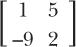

## 8

用矩阵进行计算机图形学和方程组解法

*“我很庞大，我包含了无数种类。”*

——沃尔特·惠特曼，《我自己的歌》*

在数学课上，学生们被教导如何加、减和乘矩阵，却从未学习过它们的真正用途。这很可惜，因为矩阵可以让我们轻松地将大量项归组在一起，并模拟物体从多个视角的坐标，使其在机器学习中非常有用，且在 2D 和 3D 图形中至关重要。换句话说，如果没有矩阵，就没有视频游戏！

要理解矩阵在图形创建中的应用，首先需要了解如何对矩阵进行运算。在本章中，你将复习如何加法和乘法运算矩阵，从而能够在 Processing 中创建和转换 2D 与 3D 物体。最后，你将学习如何使用矩阵瞬间解算大型方程组。

### 什么是矩阵？

*矩阵*是一个由数字组成的矩形数组，具有特定的运算规则。图 8-1 显示了矩阵的样子。

*图 8-1：矩阵有* m *行和* n *列*

在这里，数字被排列成行和列，其中*m*和*n*分别表示行数和列数的总和。你可以拥有一个 2 × 2 的矩阵，包含两行两列，像这样：

或者你可以拥有一个 3 × 4 的矩阵，它有三行四列，像这样：

传统上，我们用字母*i*表示行号，用字母*j*表示列号。请注意，矩阵中的数字并不是彼此相加；它们只是被排列在一起。这类似于我们使用格式(x,y)来排列坐标，但你不会对坐标进行运算。例如，坐标点(2,3)并不意味着你要加或乘 2 和 3；它们只是并排显示，告诉你点在图表中的位置。但是，正如你很快会看到的，你*可以*像对待普通数字一样加、减、乘矩阵。

### 矩阵相加

你只能加减相同尺寸（大小和形状）的矩阵，这意味着你只能加减*对应的元素*。下面是如何加两个 2 × 2 矩阵的示例：

例如，我们将 1 和 5 相加，因为它们是矩阵中对应的元素，意味着它们处于相同的位置：第一行，第一列。因此，我们在左上角得到 6。将对应的元素 3 和–7 相加得到–4，正如你在结果的左下角看到的那样。

这很容易转化为一个 Python 函数，因为你可以将矩阵保存到变量中。在 IDLE 中打开一个新文件，并将其保存为*matrices.py*。然后编写示例 8-1 中的代码。

*matrices.py*

A = [[2,3],[5,-8]]

B = [[1,-4],[8,-6]]

def addMatrices(a,b):

'''将两个 2x2 矩阵相加'''

C = [[a[0][0]+b[0][0],a[0][1]+b[0][1]],

[a[1][0]+b[1][0],a[1][1]+b[1][1]]]

return C

C = addMatrices(A,B)

print(C)

*清单 8-1：编写* matrices.py *程序以添加矩阵*

这里，我们使用 Python 的列表语法声明了几个 2 × 2 的矩阵 A 和 B。例如，A 是一个包含两个列表的列表，每个列表包含两个元素。然后，我们声明了一个名为 addMatrices() 的函数，它接受两个矩阵作为参数。最后，我们创建了另一个矩阵 C，它将第一个矩阵中的每个元素加上第二个矩阵中对应的元素。

当你运行这个时，输出应该像这样：

[[3, -1], [13, -14]]

这显示了通过将矩阵 A 和 B 相加得到的 2 × 2 矩阵：

现在你已经知道如何加法矩阵了，让我们试着乘法它们，这将让你变换坐标。

### 矩阵乘法

矩阵乘法比矩阵加法更有用。例如，你可以通过将 (x, y) 坐标矩阵与变换矩阵相乘来旋转一个二维或三维形状，正如你将在本章后面做的那样。

在矩阵乘法中，你不仅仅是将对应的元素相乘。相反，你将第一个矩阵每一行的元素与第二个矩阵每一列的相应元素相乘。这意味着第一个矩阵的列数必须等于第二个矩阵的行数。否则，它们不能相乘。例如，以下两个矩阵可以相乘：

首先，我们将第一个矩阵的第一行（1 和 2）与第二个矩阵的第一列（5 和 6）中的元素相乘。所有这些乘积的和将成为结果矩阵中第一行第一列的元素。对第一个矩阵的第二行进行相同的操作，以此类推。结果如下：

这是一个 2 × 2 矩阵乘以 2 × 2 矩阵的通用公式：

我们还可以乘以下列两个矩阵，因为 *A* 是一个 1 × 4 矩阵，*B* 是一个 4 × 2 矩阵：

结果矩阵会是什么样子？嗯，*A* 的第一行将与 *B* 的第一列相乘，成为结果中第一行第一列的数字。对于第一行第二列，操作也一样。结果矩阵将是一个 1 × 2 的矩阵。你可以看到，在矩阵乘法中，第一矩阵的行中的元素与第二矩阵的列中的元素相匹配。这意味着结果矩阵将拥有第一矩阵的行数和第二矩阵的列数。

现在，我们将直接将矩阵 *A* 中的元素与矩阵 *B* 中的相应元素相乘并加总所有乘积。

这看起来可能是一个复杂的过程，需要自动化，但只要我们有矩阵作为输入，我们就能轻松找出列数和行数。

清单 8-2 显示了一个矩阵乘法程序，用 Python 编写，需要比加法代码更多的工作。将此代码添加到 *matrices.py* 中。

def multmatrix(a,b):

#返回矩阵 a 和矩阵 b 的乘积

m = len(a) #第一个矩阵的行数

n = len(b[0]) #第二个矩阵的列数

newmatrix = []

for i in range(m):

row = []

#对于 b 的每一列

for j in range(n):

sum1 = 0

#对于列中的每一个元素

for k in range(len(b)):

sum1 += a[i][k]*b[k][j]

row.append(sum1)

newmatrix.append(row)

return newmatrix

*清单 8-2：编写矩阵乘法函数*

在这个示例中，multmatrix()函数接收两个矩阵作为参数：a 和 b。函数的开始，我们声明 m 为矩阵 a 的行数，n 为矩阵 b 的列数。我们创建一个名为 newmatrix 的空列表作为结果矩阵。“行乘列”操作将执行 m 次，因此第一个循环是 for i in range(m)，使得 i 重复 m 次。对于每一行，我们向 newmatrix 添加一个空行，以便将该行填充为 n 个元素。接下来的循环使得 j 重复 n 次，因为 b 有 n 列。比较复杂的部分是如何正确地匹配元素，但这只需要稍微思考一下。

只需要考虑哪些元素将被相乘。当 j = 0 时，我们将 a 的第 i 行的元素与 b 的第一列（索引 0）的元素相乘，得到的结果成为 newmatrix 新行的第一列，正如在前面的示例中看到的那样。接着，当 j = 1 时，a 的第 i 行的元素和 b 的第二列（索引 1）的元素也会进行相乘。这个乘积成为 newmatrix 新行的第二列。这个过程会对 a 的每一行重复执行。

对于矩阵 a 中每一行的每一个元素，都有一个对应的矩阵 b 中的列元素。a 的列数和 b 的行数是相同的，但我们可以表示为 len(a[0])或 len(b)。我选择了 len(b)。因此，在第三个循环中，k 会重复 len(b)次。a 的第 i 行的第一个元素和 b 的第 j 列的第一个元素将被相乘，可以写成如下：

a[i][0] * b[0][j]

对于 a 的第 i 行的第二个元素和 b 的第 j 列的第二个元素，操作是相同的：

a[i][1] * b[1][j]

因此，对于每一列（在 j 循环中），我们会将求和初始值设为 0（因为 sum 已经是 Python 的关键字，所以我用 sum1），并且它会对每一个 k 元素进行累加：

sum1 += a[i][k] * b[k][j]

看起来没什么，但这就是那条将跟踪并相乘所有对应元素的代码！在完成所有 k 元素的计算后（即 k 循环结束），我们会将总和添加到行中，一旦遍历完 b 中的所有列（即 j 循环结束），我们将把这一行放入 newmatrix 中。在遍历完 a 中的所有行后，我们返回结果矩阵。

让我们通过将我们的示例矩阵测试一下这个程序，将一个 1 × 4 矩阵与一个 4 × 2 矩阵相乘：

>>> a = [[1,2,-3,-1]]

>>> b = [[4,-1],

[-2,3],

[6,-3],

[1,0]]

>>> print(multmatrix(a,b))

[[-19, 14]]

这验证无误：

因此，我们的新函数用于相乘任何两个矩阵（如果它们*可以*被相乘）是有效的。让我们通过将一个 2 × 2 矩阵与另一个 2 × 2 矩阵相乘来测试它：

输入以下内容以将矩阵 a 与矩阵 b 相乘：

>>> a = [[1,-2],[2,1]]

>>> b = [[3,-4],[5,6]]

>>> multmatrix(a,b)

[[-7, -16], [11, -2]]

这段代码展示了如何使用 Python 列表输入 2 × 2 矩阵。乘法也如下所示：

 让我们检查这些答案。我们从将 a 的第一行与 b 的第一列相乘开始：

(1)(3) + (–2)(5) = 3 – 10 = –7

而 –7 是结果矩阵中第一行、第一列的数字。接下来，我们将 a 的第二行与 b 的第一列相乘：

(2)(3) + (1)(5) = 6 + 5 = 11

而 11 是结果矩阵中第二行、第一列的数字。其他的数字也是正确的。`multmatrix()` 函数将帮我们节省大量繁琐的计算！

### 矩阵乘法中的顺序很重要

一个关于矩阵乘法的重要事实是，A × B 并不一定等于 B × A。让我们通过反转之前的示例来证明这一点：

下面是如何在 Python shell 中反向相乘这些矩阵的方法：

>>> a = [[1,-2],[2,1]]

>>> b = [[3,-4],[5,6]]

>>> multmatrix(b,a)

[[-5, -10], [17, -4]]

如你所见，当你使用 `multmatrix(b, a)` 而不是 `multmatrix(a, b)` 来反向相乘相同的矩阵时，你会得到一个完全不同的结果矩阵。记住，在矩阵相乘时，*A × B 并不等于 B × A*。

### 绘制二维图形

现在你知道如何对矩阵进行操作了，让我们将一些点放入列表中来绘制一个二维图形。在 Processing 中打开一个新的草图，并将其保存为 *matrices.pyde*。如果你仍然保留着 Listing 4-11 中的 *grid.pyde* 草图，你可以复制并粘贴绘制网格的必要代码。否则，添加 Listing 8-3 中的代码。

*matrices.pyde*

#设置 x 值的范围

xmin = -10

xmax = 10

#y 值的范围

ymin = -10

ymax = 10

#计算范围

rangex = xmax - xmin

rangey = ymax - ymin

def setup():

global xscl, yscl

size(600,600)

#绘制网格时的缩放因子：

xscl = width/rangex

yscl = -height/rangey

noFill()

def draw():

global xscl, yscl

background(255) #白色

translate(width/2,height/2)

grid(xscl, yscl)

def grid(xscl,yscl):

'''绘制一个用于作图的网格'''

#青色线条

strokeWeight(1)

stroke(0,255,255)

for i in range(xmin,xmax+1):

line(i*xscl,ymin*yscl,i*xscl,ymax*yscl)

for i in range(ymin,ymax+1):

line(xmin*xscl,i*yscl,xmax*xscl,i*yscl)

stroke(0) #黑色坐标轴

line(0,ymin*yscl,0,ymax*yscl)

line(xmin*xscl,0,xmax*xscl,0)

*清单 8-3：绘制网格的代码*

我们将绘制一个简单的图形并使用矩阵进行变换。我将使用字母*F*，因为它没有旋转或反射对称性（而且因为它是我的首字母）。我们将先画出它的草图来获取点，如图 8-2 所示。

*图 8-2：绘制* F *所需的点*

在`draw()`函数后添加清单 8-4 中的代码，以输入*F*的所有角点，并在这些点之间画线。

fmatrix = [[0,0],[1,0],[1,2],[2,2],[2,3],[1,3],[1,4],[3,4],[3,5],[0,5]]

def graphPoints(matrix):

#在连续的点之间绘制线段

beginShape()

for pt in matrix:

vertex(pt[0]*xscl,pt[1]*yscl)

endShape(CLOSE)

*清单 8-4：绘制* F *的点的图形*

这里，我们首先创建一个名为 fmatrix 的列表，并在每一行输入对应字母*F*中的点。graphPoints()函数接受一个矩阵作为参数，每一行都会成为使用 Processing 的 beginShape()和 endShape()函数创建的图形的一个顶点。此外，我们在`draw()`函数中使用 fmatrix 作为参数调用 graphPoints()函数。将清单 8-5 中的代码添加到`draw()`函数的末尾：

strokeWeight(2) #更粗的线条

stroke(0) #黑色

graphPoints(fmatrix)

*清单 8-5：让程序绘制* F *的点*

我们正在创建 fmatrix 作为一个包含多个坐标的列表，并调用 graphPoints()函数告诉程序绘制所有的点。

Processing 内建的 strokeWeight()函数让你可以控制线条的粗细，而 stroke()函数让你选择线条的颜色。我们将首先用黑色绘制*F*。输出看起来像图 8-3。

*图 8-3：绘制矩阵中点的结果，称为“f-matrix”*

当我们在学校学习矩阵时，我们学会了如何加法和乘法运算，但从未学过为什么要这样做。只有当你绘制它们时，你才会意识到矩阵的乘法其实是在*变换*它们。接下来，我们将使用矩阵乘法来变换我们的*F*。

### 变换矩阵

为了看到矩阵相乘如何让你变换它们，我们将使用一个在网上找到的 2 × 2 变换矩阵（见图 8-4）。

*图 8-4：一个在网上找到的变换矩阵，来自* mathworld.wolfram.com

它将使我们的 *F* 逆时针旋转一个角度，角度由 theta (θ) 给出。如果角度为 90 度，则 cos(90) = 0，sin(90) = 1。因此，90 度逆时针旋转的旋转矩阵是

我们可以通过在 *matrices.pyde* 中的 setup() 函数之前添加以下代码来创建一个变换矩阵：

transformation_matrix = [[0,-1],[1,0]]

接下来，我们将 f-matrix 与变换矩阵相乘，并将结果保存到一个新矩阵中。由于 f-matrix 是一个 10 × 2 矩阵，而变换矩阵是 2 × 2，唯一的相乘方式是 F × T，而不是 T × F。

请记住，第一个矩阵的列数必须等于第二个矩阵的行数。我们将以黑色绘制 f-matrix，并将新矩阵的描边颜色改为红色。将 graphPoints(fmatrix) 替换为在 Listing 8-6 中添加以下代码到 draw() 函数。

newmatrix = multmatrix(fmatrix,transformation_matrix)

graphPoints(fmatrix)

stroke(255,0,0) # 红色结果矩阵

graphPoints(newmatrix)

*Listing 8-6: 矩阵相乘并绘制点*

运行此代码时，它将看起来像 Figure 8-5。

*Figure 8-5: 一个顺时针旋转？*

那可不是逆时针旋转！再看一下 Figure 8-4 中的数学符号，我们可以看到乘法的顺序与我们的不同。公认的做法是先乘以变换矩阵，再乘以要变换的点：

这意味着变换后的向量 v (*v'*) 是旋转向量 R[θ] 与初始向量 v[0] 相乘的结果。向量符号与坐标符号不同。例如，沿 x 方向走 2，沿 y 方向走 3 的向量，不像标准的 (x,y) 坐标表示为 (2,3)，而是表示为

就像是 2 × 1 的矩阵，而不是 1 × 2 的矩阵。在我们的列表符号中，我们将其写为 [[2],[3]]。这意味着我们必须将 f-matrix 改为

fmatrix = [[[0],[0]],[[1],[0]],[[1],[2]],[[2],[2]],[[2],[3]],

[[1],[3]],[[1],[4]],[[3],[4]],[[3],[5]],[[0],[5]]]

或者

fmatrix = [[0,1,1,2,2,1,1,3,3,0],[0,0,2,2,3,3,4,4,5,5]]

第一个示例至少保持了点的 x 和 y 值在一起，但括号太多了！第二个甚至连 x 和 y 值都没放在一起。让我们看看是否还有其他方法。

### 转置矩阵

矩阵中的一个重要概念是 *转置*，即列变为行，反之亦然。在我们的例子中，我们希望将 *F* 改为 *F^T*，这是“f-matrix 转置”的符号。

我们来编写一个 transpose() 函数，用来转置任何矩阵。将 Listing 8-7 中的代码添加到 *matrices.pyde* 的 draw() 函数之后。

def transpose(a):

'''转置矩阵 a'''

output = []

m = len(a)

n = len(a[0])

#创建一个 n x m 的矩阵

for i in range(n):

output.append([])

for j in range(m):

#将 a[i][j] 替换为 a[j][i]

output[i].append(a[j][i])

return output

*列表 8-7：转置矩阵的代码*

首先，我们创建一个名为 output 的空列表，它将是转置矩阵。然后我们定义 m，矩阵的行数，以及 n，矩阵的列数。我们将把 output 转换成一个 n × m 的矩阵。对于所有 n 行，我们将启动一个空列表，然后把矩阵的第 i 行中的所有元素添加到转置矩阵的第 j 列中。

转置函数中的以下代码行交换了 a 的行和列：

output[i].append(a[j][i])

最后，我们返回转置后的矩阵。让我们测试一下。将 transpose() 函数添加到你的 *matrices.py* 文件中并运行。然后我们可以在终端输入以下代码：

>>> a = [[1,2,-3,-1]]

>>> transpose(a)

[[1], [2], [-3], [-1]]

>>> b = [[4,-1],

[-2,3],

[6,-3],

[1,0]]

>>> transpose(b)

[[4, -2, 6, 1], [-1, 3, -3, 0]]

它有效！我们所需要做的就是在将 f-matrix 与转换矩阵相乘之前，先对其进行转置。为了绘制它，我们会将其转置回来，正如 列表 8-8 中所示。

*matrices.pyde*

def draw():

global xscl, yscl

background(255) #白色

translate(width/2,height/2)

grid(xscl, yscl)

strokeWeight(2) #更粗的线

stroke(0) #黑色

➊ newmatrix = transpose(multmatrix(transformation_matrix,

➋ transpose(fmatrix)))

graphPoints(fmatrix)

stroke(255,0,0) #红色的结果矩阵

graphPoints(newmatrix)

*列表 8-8：转置矩阵、乘法运算，然后再转置*

将对 transpose() ➋ 函数的调用添加到 draw() 函数中的 newmatrix 行 ➊。这应该能得到正确的逆时针旋转，如图 8-6 所示。

*图 8-6：由矩阵实现的逆时针旋转*

*matrices.pyde* 的最终代码应如下所示 列表 8-9。

*matrices.pyde*

#设置 x 值的范围

xmin = -10

xmax = 10

#y 值的范围

ymin = -10

ymax = 10

#计算范围

rangex = xmax - xmin

rangey = ymax - ymin

transformation_matrix = [[0,-1],[1,0]]

def setup():

global xscl, yscl

size(600,600)

#绘制网格时的缩放因子：

xscl= width/rangex

yscl= -height/rangey

noFill()

def draw():

global xscl, yscl

background(255) #白色

translate(width/2,height/2)

grid(xscl,yscl)

strokeWeight(2) #更粗的线

stroke(0) #黑色

newmatrix = transpose(multmatrix(transformation_matrix,

transpose(fmatrix)))

graphPoints(fmatrix)

stroke(255,0,0) #红色的结果矩阵

graphPoints(newmatrix)

fmatrix = [[0,0],[1,0],[1,2],[2,2],[2,3],[1,3],[1,4],[3,4],[3,5],[0,5]]

def multmatrix(a,b):

'''返回乘积

矩阵 a 和矩阵 b'''

m = len(a) #第一个矩阵的行数

n = len(b[0]) #第二个矩阵的列数

newmatrix = []

for i in range(m): #对于 a 中的每一行

row = []

#对于 b 中的每一列

for j in range(n):

sum1 = 0

#对每一列的元素进行操作

for k in range(len(b)):

sum1 += a[i][k]*b[k][j]

row.append(sum1)

newmatrix.append(row)

return newmatrix

def transpose(a):

'''转置矩阵 a'''

output = []

m = len(a)

n = len(a[0])

#创建一个 n x m 矩阵

for i in range(n):

output.append([])

for j in range(m):

#将 a[i][j] 替换为 a[j][i]

output[i].append(a[j][i])

return output

def graphPoints(matrix):

#绘制连续点之间的线段

beginShape()

for pt in matrix:

vertex(pt[0]*xscl,pt[1]*yscl)

endShape(CLOSE)

def grid(xscl, yscl):

'''绘制图形网格'''

#青色线条

strokeWeight(1)

stroke(0,255,255)

for i in range(xmin,xmax + 1):

line(i*xscl,ymin*yscl,i*xscl,ymax*yscl)

for i in range(ymin,ymax+1):

line(xmin*xscl,i*yscl,xmax*xscl,i*yscl)

stroke(0) #黑色坐标轴

line(0,ymin*yscl,0,ymax*yscl)

line(xmin*xscl,0,xmax*xscl,0)

*清单 8-9：绘制和变换字母* F 的完整代码

练习 8-1：更多变换矩阵

查看当你将变换矩阵改为这些矩阵时，形状会发生什么：

 ### 实时旋转矩阵

所以你刚刚学会了矩阵如何变换点。但这可以实时发生，并且还可以交互式地进行！将 *matrices.pyde* 中的 draw() 函数代码更改为清单 8-10 中的内容。

def draw():

global xscl, yscl

background(255) #白色背景

translate(width/2,height/2)

grid(xscl, yscl)

ang = map(mouseX,0,width,0,TWO_PI)

rot_matrix = [[cos(ang),-sin(ang)],

[sin(ang),cos(ang)]]

newmatrix = transpose(multmatrix(rot_matrix,transpose(fmatrix)))

graphPoints(fmatrix)

strokeWeight(2) #更粗的线条

stroke(255,0,0) #红色结果矩阵

graphPoints(newmatrix)

*清单 8-10：使用矩阵实时旋转*

请记住，我们在第七章中使用了 sin() 和 cos() 来旋转和振荡形状。在这个例子中，我们正在使用旋转矩阵来变换一个点矩阵。以下是典型的 2 × 2 旋转矩阵的样子：

因为我没有θ（θ）键，所以我将旋转角度称为 ang。我们现在所做的有趣的事情是通过鼠标来改变 ang 变量。所以，在每次循环中，鼠标的位置决定了 ang 的值，然后将 ang 代入每个表达式中。它会迅速计算 ang 的正弦和余弦，并将旋转矩阵与 f 矩阵相乘。每次循环中，旋转矩阵都会有所不同，取决于鼠标的位置。

*图 8-7：使用矩阵实时变换点！*

现在，当你左右移动鼠标时，红色 *F* 应该围绕原点旋转，如图 8-7 所示。

这是你在电脑屏幕上看到任何动画时，实际上发生的变换。计算机图形学的创建可能是矩阵最常见的应用之一。

### 创建 3D 形状

到目前为止，我们使用矩阵来创建和操作二维形状。你可能会好奇，作为数学家，我们是如何将数字运算处理后，把三维物体表示在二维表面上，比如计算机屏幕上的显示。

返回到 Listing 8-11 中的代码，并将其保存为*matrices3D.pyde*。将 fmatrix 转换为以下矩阵：

fmatrix = [[0,0,0],[1,0,0],[1,2,0],[2,2,0],[2,3,0],[1,3,0],[1,4,0],

[3,4,0],[3,5,0],[0,5,0],

[0,0,1],[1,0,1],[1,2,1],[2,2,1],[2,3,1],[1,3,1],[1,4,1],

[3,4,1],[3,5,1],[0,5,1]]

*Listing 8-11：我们 f-matrix 的 3D 版本*

为了给我们的*F*添加深度，我们需要在点的矩阵中添加另一个层次。由于目前我们的*F*只有二维，它只由 x 值和 y 值构成。但我们可以将二维物体视为具有第三维度，表示为 z 轴。二维物体的 z 值为 0。所以对于每个点，我们将添加一个 0 作为其第三个值，使前 10 个点变成三维点。然后我们复制并粘贴这些值，将第三个值改为 1。这样就创建了后层，它是一个与前层相同的*F*，只不过在后面一单位的位置。

现在我们已经为*F*创建了两个层次，我们需要将前层的点与后层的点连接起来。让我们创建一个边列表，这样我们就可以简单地告诉程序哪些点用线段连接，如 Listing 8-12 所示。

# 连接点的列表：

edges = [[0,1],[1,2],[2,3],[3,4],[4,5],[5,6],[6,7],

[7,8],[8,9],[9,0],

[10,11],[11,12],[12,13],[13,14],[14,15],[15,16],[16,17],

[17,18],[18,19],[19,10],

[0,10],[1,11],[2,12],[3,13],[4,14],[5,15],[6,16],[7,17],

[8,18],[9,19]]

*Listing 8-12：跟踪边（点与点之间的线）的情况（*F*）

这是一种跟踪哪些点将被线段（或*边*）连接的方式。例如，第一个条目[0,1]表示从点 0 (0,0,0)到点 1 (1,0,0)绘制了一条边。前 10 条边绘制了前面的*F*，接下来的 10 条边绘制了后面的*F*。然后我们在前面*F*的点和后面*F*的对应点之间绘制边。例如，边[0,10]绘制了一条从点 0 (0,0,0)到点 10 (0,0,1)的线段。

现在当我们绘制这些点时，我们不仅仅是将每个连续的点之间画线。Listing 8-13 展示了新的 graphPoints()函数，它绘制了列表中点之间的*边*。将旧的 graphPoints()函数替换为以下代码，放在 grid()函数定义之前。

def graphPoints(pointList,edges):

'''使用线段绘制列表中的点'''

for e in edges:

line(pointList[e[0]][0]*xscl,pointList[e[0]][1]*yscl,

pointList[e[1]][0]*xscl,pointList[e[1]][1]*yscl)

*Listing 8-13：使用边绘制点*

请记住，在 Processing 中，你是通过使用 line(x1,y1,x2,y2) 来绘制两点之间的线，(x1,y1) 和 (x2,y2)。在这里，我们通过使用点列表中的数字来调用点（当我们运行时会发送 fmatrix）。该函数循环遍历边列表中的每个项 e，并将由第一个数字 e[0] 表示的点与由第二个数字 e[1] 表示的点连接起来。x 坐标将乘以 xscl 变量，这个变量用于缩放 x 值：

pointList[e[0]][0]*xscl

我们对 y 坐标做同样的处理：

pointList[e[0]][1]*yscl

我们可以通过创建两个旋转变量：rot 和 tilt，来使鼠标表示旋转角度。第一个变量 rot，将鼠标的 x 值映射到一个 0 到 2π 之间的角度，这个值将放入像我们在 Listing 8-5 中做的旋转矩阵。对于 tilt，我们做同样的事情，以便它能够映射鼠标的 y 值。在将矩阵相乘之前，将 Listing 8-14 中的代码放入 draw() 函数中。

rot = map(mouseX,0,width,0,TWO_PI)

tilt = map(mouseY,0,height,0,TWO_PI)

*Listing 8-14：通过鼠标的上下左右移动来连接上下和左右旋转*

接下来，我们将创建一个函数来将旋转矩阵相乘，这样我们所有的变换就可以合并成一个矩阵。这就是使用矩阵乘法进行变换的优点。你只需要通过乘法“添加”更多的变换！

### 创建旋转矩阵

现在让我们把两个单独的旋转矩阵合成一个。如果你在数学书中看到 3D 旋转矩阵，它们可能看起来像下面的方程。

*R*[y]() 将旋转点，以 y 轴作为旋转轴，所以这是一个左右旋转。*R*[x]() 将绕 x 轴旋转点，所以它是一个上下旋转。

[Listing 8-15] 显示了创建 rottilt() 函数的代码，该函数将接受 rot 和 tilt 的值并将其放入矩阵中。这就是我们如何将两个矩阵合并成一个。将 Listing 8-15 中的代码添加到 *matrices3D.pyde*：

def rottilt(rot,tilt):

# 返回用于旋转一定角度的矩阵

rotmatrix_Y = [[cos(rot),0.0,sin(rot)],

[0.0,1.0,0.0],

[-sin(rot),0.0,cos(rot)]]

rotmatrix_X = [[1.0,0.0,0.0],

[0.0,cos(tilt),sin(tilt)],

[0.0,-sin(tilt),cos(tilt)]]

return multmatrix(rotmatrix_Y,rotmatrix_X)

*Listing 8-15：创建旋转矩阵的函数*

我们将 rotmatrix_Y 和 rotmatrix_X 相乘，得到一个旋转矩阵作为输出。这在矩阵操作序列中很有用，比如绕 x 轴旋转*R[x]*、绕 y 轴旋转*R[y]*、缩放*S*和位移*T*。我们可以将所有这些操作合并到一个矩阵中，而不是分别进行每次乘法。矩阵乘法使得我们能够创建一个新的矩阵：*M* = *R[y]*(*R[x]*(*S*(*T*)))。这意味着我们的 draw()函数也会发生变化。通过上面的新增内容，draw()函数应该如下所示 Listing 8-16：

def draw():

global xscl, yscl

background(255) #白色

translate(width/2,height/2)

grid(xscl, yscl)

rot = map(mouseX,0,width,0,TWO_PI)

tilt = map(mouseY,0,height,0,TWO_PI)

newmatrix = transpose(multmatrix(rottilt(rot,tilt),transpose(fmatrix)))

strokeWeight(2) #更粗的线条

stroke(255,0,0) #红色结果矩阵

graphPoints(newmatrix,edges)

*Listing 8-16: 新的* draw() *函数*

当你运行程序时，得到的结果如图 8-8 所示。

*图 8-8：一个三维* F！

我们可以通过改变 xmin、xmax、ymin 和 ymax 变量，并注释掉 draw()函数中的 grid()调用，来去除蓝色网格并将*F*变大。

Listing 8-17 显示了绘制旋转三维形状的完整代码。

*matrices3D.pyde*

#设置 x 值的范围

xmin = -5

xmax = 5

#y 值的范围

ymin = -5

ymax = 5

#计算范围

rangex = xmax - xmin

rangey = ymax - ymin

def setup():

global xscl, yscl

size(600,600)

#绘制网格时的缩放因子：

xscl= width/rangex

yscl= -height/rangey

noFill()

def draw():

global xscl, yscl

background(0) #黑色

translate(width/2,height/2)

rot = map(mouseX,0,width,0,TWO_PI)

tilt = map(mouseY,0,height,0,TWO_PI)

strokeWeight(2) #更粗的线条

stroke(0) #黑色

newmatrix = transpose(multmatrix(rottilt(rot,tilt),transpose(fmatrix)))

#graphPoints(fmatrix)

stroke(255,0,0) #红色结果矩阵

graphPoints(newmatrix,edges)

fmatrix = [[0,0,0],[1,0,0],[1,2,0],[2,2,0],[2,3,0],[1,3,0],[1,4,0],

[3,4,0],[3,5,0],[0,5,0],

[0,0,1],[1,0,1],[1,2,1],[2,2,1],[2,3,1],[1,3,1],[1,4,1],

[3,4,1],[3,5,1],[0,5,1]]

#要连接的点的列表：

edges = [[0,1],[1,2],[2,3],[3,4],[4,5],[5,6],[6,7],

[7,8],[8,9],[9,0],

[10,11],[11,12],[12,13],[13,14],[14,15],[15,16],[16,17],

[17,18],[18,19],[19,10],

[0,10],[1,11],[2,12],[3,13],[4,14],[5,15],[6,16],[7,17],

[8,18],[9,19]]

def rottilt(rot,tilt):

#返回一个旋转矩阵，旋转指定角度

rotmatrix_Y = [[cos(rot),0.0,sin(rot)],

[0.0,1.0,0.0],

[-sin(rot),0.0,cos(rot)]]

rotmatrix_X = [[1.0,0.0,0.0],

[0.0,cos(tilt),sin(tilt)],

[0.0,-sin(tilt),cos(tilt)]]

return multmatrix(rotmatrix_Y,rotmatrix_X)

def multmatrix(a,b):

'''返回的结果是

矩阵 a 和矩阵 b'''

m = len(a) #第一个矩阵的行数

n = len(b[0]) #第二个矩阵的列数

newmatrix = []

for i in range(m): #遍历 a 中的每一行

row = []

#遍历 b 中的每一列

for j in range(n):

sum1 = 0

#对列中的每个元素

for k in range(len(b)):

sum1 += a[i][k]*b[k][j]

row.append(sum1)

newmatrix.append(row)

return newmatrix

def graphPoints(pointList,edges):

'''通过线段绘制列表中的点'''

for e in edges:

line(pointList[e[0]][0]*xscl,pointList[e[0]][1]*yscl,

pointList[e[1]][0]*xscl,pointList[e[1]][1]*yscl)

def transpose(a):

'''转置矩阵 a'''

output = []

m = len(a)

n = len(a[0])

#创建一个 n × m 矩阵

for i in range(n):

output.append([])

for j in range(m):

#将 a[i][j] 替换为 a[j][i]

output[i].append(a[j][i])

返回输出

*代码清单 8-17：旋转 3D* F 的完整代码

我去掉了网格，并且在 draw() 函数中将背景调用改为 background(0)，这样背景就变成了黑色，*F* 看起来像是在外太空中旋转（参见 图 8-9）！

*图 8-9：移动你的鼠标会让* F 发生变换！

### 使用矩阵解方程组

你曾经尝试过解包含两个或三个未知数的方程组吗？对于任何数学学生来说，这是一个棘手的任务。而且，随着未知数的增加，方程组的解法会变得更加复杂。矩阵对于解这类方程组非常有用：

例如，你可以使用矩阵表达这个乘法：

这看起来与代数方程 2*x* = 10 相似，我们可以通过将两边都除以 2 来轻松解出答案。如果我们也能将系统的两边都除以左边的矩阵就好了！

事实上，正如你可以通过乘以 ½ 来将一个数字除以 2，一样有一种方法可以做到这一点，即通过求矩阵的逆矩阵。这被称为 2 的 *乘法逆*，但这是一个复杂的方法。

#### 高斯消元法

更高效的解法是使用行操作将左边的 2 × 2 矩阵转化为 *单位矩阵*，这是代表数字 1 的矩阵。例如，将一个矩阵乘以单位矩阵会得到原矩阵，如下所示：

右边的数字将是 *x* 和 *y* 的解，因此我们要做的就是把零和一放到正确的位置。正确的位置是矩阵的对角线，如下所示：

每个方阵中的单位矩阵在对角线上有 1，且行号等于列号。

*高斯消元法* 是一种通过对矩阵的整行进行操作来达到单位矩阵的方法。你可以将一行乘以或除以常数，也可以将一行加到或减去另一行。

在使用高斯消元法之前，我们首先需要将系数和常数排列成一个矩阵，如下所示：

然后，我们将整个行除以一个数字，这个数字将使我们在左上角得到 1。也就是说，我们首先需要将第一行中的所有项都除以 2，因为 2/2 等于 1。这个操作会得到如下结果：

现在，我们得到我们想要零的项的*加法逆元*（与另一个数相加得到零的数字）。例如，在第二行，我们希望将 3 变为零，因为我们想将这个矩阵转换为单位矩阵。因为 3 的加法逆元是 –3，所以我们将第一行中的每一项都乘以 –3，然后将积加到第二行中的对应项。这意味着我们将第一行中的 1 乘以 –3，然后加上积，即仍然是 –3，得到第二行。我们对行中的所有项都重复这个过程。例如，第三列中的 –1/2 会被乘以 –3（得到 1.5），然后加到该列中的所有数字上。在这个例子中，结果是 –13，所以和为 –11.5 或 –23/2。继续这个过程，最后得到如下结果：

现在重复操作，我们希望在第二行中得到 1。我们可以将第二行中的所有元素乘以 –2/23，这样就能得到如下结果：

最后，我们将第一行的所有项加到第二行中，乘以 5/2 的加法逆元，这就是我们想在第一行中得到零的位置。我们将第一行中的每一项加到第二行中对应项乘以 –5/2 的结果。注意，这不会影响第一行中的 1，因为我们希望保留它：

现在，方程组的解已经在右列中：*x* = –3, *y* = 1。

我们可以通过将这些数字代入原始方程组来检查我们的答案：

两个解都是正确的，但这个过程很繁琐。让我们用 Python 自动化这个过程，这样我们就可以解任何大小的方程组了！

#### 编写 GAUSS() 函数

在这一部分，我们编写一个名为 gauss() 的函数，用来为我们解方程组。尝试用编程方式实现这一步看似复杂，但实际上我们只需要编写两步代码：

1.  将一行中的所有元素除以对角线上的项。

1.  将一行中的每一项加到另一行中的对应项。

##### 划分一行中的所有项

第一个任务是将一行中的所有项除以一个数字。假设我们有这一行数字 [1,2,3,4,5]。例如，我们可以使用 Listing 8-18 中的代码将这一行除以 2。打开一个新的 Python 文件，命名为 *gauss.py*，然后输入 Listing 8-18 中的代码。

divisor = 2

row = [1,2,3,4,5]

for i, term in enumerate(row):

row[i] = term / divisor

print(row)

*Listing 8-18: 将一行中的所有项除以一个除数*

这个循环遍历行列表，使用 `enumerate()` 函数跟踪索引和值。然后我们将每个项 row[i] 替换为该项除以除数的结果。当你运行这个时，你将得到一个包含五个值的列表：

[0.5, 1.0, 1.5, 2.0, 2.5]

##### 将每个元素加到其对应的元素上

第二个任务是将一行中的每个元素加到另一行的对应元素上。例如，将第 0 行以下的所有元素加到第 1 行的元素上，并用和替换第 1 行的元素：

>>> my_matrix = [[2,-4,6,-8],

[-3,6,-9,12]]

>>> for i in range(len(my_matrix[1])):

my_matrix[1][i] += my_matrix[0][i]

>>> print(my_matrix)

[[2, -4, 6, -8], [-1, 2, -3, 4]]

我们正在遍历 `my_matrix` 的第二行（索引 1）中的所有项。然后，我们将第二行中的每个项（索引 i）增加与第一行对应项（索引 0）的值。我们成功地将第一行的项加到了第二行中。注意，第一行没有变化。我们将在解线性方程组时使用这些步骤。

##### 重复每行的过程

现在我们只需将这些步骤组合起来，应用于矩阵中的所有行。我们将矩阵称为 *A*。一旦我们将 *x, y* 和 *z* 的系数与常数项按顺序排列，我们只将系数和常数项放入矩阵：

首先，我们将每一行的每个项除以对角线上的项，这样对角线项就会变成 1，使用 Listing 8-19 中的代码。

for j,row in enumerate(A):

#对角线项变为 1

#通过将行除以对角线项

如果 row[j] != 0: #对角线项不能为 0

divisor = row[j] #对角线项

for i, term in enumerate(row):

row[i] = term / divisor

*Listing 8-19: 将每一行的每个项除以该行的对角线项*

使用 `enumerate`，我们可以得到 *A* 的第一行（例如 [2,1,-1,8]），此时 j 将是该行的索引（在这种情况下是 0）。对角线项是行号与列号相同的位置，例如第 0 行、第 0 列，或第 1 行、第 1 列。

现在我们遍历矩阵中的每一行，并执行第二步。对于每一行（其中 i 不等于 j），计算第 j 项的加法逆元，将第 j 行的每一项乘以该逆元，并将这些项加到第 i 行对应的项上。将 Listing 8-20 中的代码添加到 `gauss()` 函数中。

for i in range(m):

如果 i != j: #不要对第 j 行执行此操作

#计算加法逆元

addinv = -1*A[i][j]

#对第 i 行的每个项执行操作

for ind in range(n):

#加到第 j 行的对应项上

#乘以加法逆元

#加到第 i 行的项上

A[i][ind] += addinv*A[j][ind]

*Listing 8-20: 使每行的非对角线项为 0*

这个过程会发生在每一行，所以由于 m 是行数，我们从 for i in range(m)开始。我们已经将相关行除以对角线项，所以不需要对该行做任何处理。这就是为什么只有当 i 不等于 j 时才进行操作。在我们的示例中，A 的第一行中的每个项都会乘以 3 并加到第二行的相应项上。然后，第一行的每个项都会乘以 2 并加到第三行的相应项上。这将使得第一列的第二行和第三行的项变为零：

现在第一列已经完成，我们希望对角线为 1。因此，我们希望第二列的第二行也为 1，于是我们重复这个过程。

##### 将一切结合起来

将所有代码整合到 gauss()函数中并打印结果。清单 8-21 展示了完整的代码。

def gauss(A):

'''将矩阵转换为单位矩阵

通过高斯消元法消去矩阵，其中

最后一列包含解

对变量进行求解'''

m = len(A)

n = len(A[0])

for j,row in enumerate(A):

#对角线项为 1

#通过除以对角线项

if row[j] != 0: #对角线项不能为零

divisor = row[j]

for i, term in enumerate(row):

row[i] = term / divisor

#将其他行加到加法逆元上

#对每一行进行操作

for i in range(m):

if i != j: #不要对第 j 行进行操作

#计算加法逆元

addinv = -1*A[i][j]

#对第 i 行的每一项进行操作

for ind in range(n):

#将相应的项加到第 j 行

#乘以加法逆元

#加到第 i 行的项

A[i][ind] += addinv*A[j][ind]

return A

#示例：

B = [[2,1,-1,8],

[-3,-1,2,-1],

[-2,1,2,-3]]

print(gauss(B))

*清单 8-21：完整的* gauss() *函数代码*

输出应为以下内容：

[[1.0, 0.0, 0.0, 32.0], [0.0, 1.0, 0.0, -17.0], [-0.0, -0.0, 1.0, 39.0]]

这是矩阵形式的结果：

我们查看每一行的最后一个数字，因此我们的解是*x* = 32，*y* = -17，和*z* = 39。我们通过将这些值代入原始方程来检查解的正确性：

这是一个重大成就！现在，我们不仅可以解包含两个或三个未知数的方程组，还可以解包含任意数量未知数的方程组！如果学生不懂 Python，解一个包含四个未知数的方程组是一个繁琐的任务。但幸运的是，我们懂 Python！每当在 Python shell 中快速显示出正确的解时，我总是感到震惊。如果你曾经需要手动执行高斯消元法，练习题 8-2 也会让你感到惊讶。

练习题 8-2：输入矩阵

使用你刚刚编写的程序解这个方程组，求解*w, x, y* 和 *z*：

### 摘要

你在数学冒险中走了很长一段路！你从一些基础的 Python 开始，让海龟在屏幕上走动，然后继续创建更复杂的 Python 函数来解决更难的数学问题。在这一章中，你不仅学会了如何使用 Python 来加法和乘法矩阵，还亲身体验了矩阵如何在二维和三维图形中进行变换！我们使用 Python 进行矩阵加法、乘法、转置等操作的能力简直让人难以置信。

你还学会了自动化本来需要手动解决方程组的过程。对于一个 3 × 3 矩阵有效的程序，也同样适用于 4 × 4 或任何更大的方阵！

矩阵是构建神经网络的关键工具，神经网络中有数十个甚至数百个路径连接虚拟神经元。输入通过矩阵乘法和转置“传播”通过网络，这正是你在这一章中创建的工具。

曾经，只有能够接触到庞大、昂贵的计算机——它们占据了大学或大公司的一整层楼——的人，才能做到你在这一章中做的事情。而现在，你可以使用 Python 执行快速的矩阵计算，并利用 Processing 可视化结果！

在这一章中，我指出了我们能够即时求解复杂的方程组，以及在探索图形时，能够对鼠标移动做出即时响应的伟大之处。在下一章中，我们将创建一个包含草和羊的生态系统模型，并让它自行运行。随着羊的出生、吃草、繁殖和死亡，模型将随着时间的推移发生变化。只有让模型运行一到两分钟后，我们才能判断环境是否能够在草生长和羊吃草繁殖之间找到平衡。
