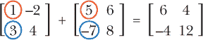

## 第八章：使用矩阵进行计算机图形学和方程组

*“我很伟大，我包容万象。”*

—沃尔特·惠特曼，摘自《我歌唱我自己》*


在数学课上，学生被教导如何加、减和乘矩阵，但他们从未真正学过矩阵是如何应用的。这是很遗憾的，因为矩阵使我们能够轻松地将大量项目分组，并模拟物体从多个角度的坐标，这使得它们在机器学习中非常有用，对 2D 和 3D 图形至关重要。换句话说，如果没有矩阵，就不会有视频游戏！

要理解矩阵如何用于创建图形，首先需要理解如何对它们进行算术运算。在本章中，你将回顾如何加法和乘法运算矩阵，以便你可以在 Processing 中创建和转换 2D 和 3D 对象。最后，你将学习如何使用矩阵瞬间解决大型方程组。

### 什么是矩阵？

*矩阵* 是一个矩形的数字数组，有特定的规则用于对它们进行操作。图 8-1 显示了矩阵的样子。


*图 8-1：矩阵有* `m` *行和* `n` *列*

在这里，数字按行和列排列，其中 *m* 和 *n* 分别表示行数和列数。你可以有一个 2 × 2 的矩阵，包含两行两列，如下所示：


或者，你可以有一个 3 × 4 的矩阵，包含三行四列，如下所示：


传统上，我们使用字母 *i* 来表示行号，使用字母 *j* 来表示列号。注意，矩阵中的数字并不是彼此相加；它们只是排在一起。这类似于我们使用坐标格式 (x, y) 来排列坐标，但你并不对坐标进行运算。例如，一个位于 (2, 3) 的点并不意味着你要加或乘 2 和 3；它们只是并排在一起，告诉你该点在图表中的位置。但正如你很快会看到的那样，你 *确实可以* 像对待普通数字一样，对两个矩阵进行加、减和乘法运算。

### 添加矩阵

你只能对相同维度（大小和形状）的矩阵进行加法和减法运算，这意味着你只能加或减 *对应元素*。以下是如何加两个 2 × 2 矩阵的示例：



例如，我们加 1 和 5，因为它们是矩阵中对应的元素，意味着它们处于相同的位置：第一行，第一列。因此，我们得到 6 在左上角。将对应的元素 3 和 –7 相加，得到 –4，就像你在结果的左下角看到的那样。

这对于放入 Python 函数来说足够简单，因为你可以将一个矩阵保存到一个变量中。在 IDLE 中打开一个新文件并将其保存为 *matrices.py*。然后按照 Listing 8-1 编写代码。

```py
*matrices.py*
A = [[2,3],[5,-8]]
B = [[1,-4],[8,-6]]

def addMatrices(a,b):
    '''adds two 2x2 matrices together'''
    C = [[a[0][0]+b[0][0],a[0][1]+b[0][1]],
         [a[1][0]+b[1][0],a[1][1]+b[1][1]]]
    return C

C = addMatrices(A,B)
print(C)
```

*Listing 8-1：编写* `matrices.py` *程序以添加矩阵*

在这里，我们使用 Python 的列表语法声明了两个 2 × 2 的矩阵，`A` 和 `B`。例如，`A` 是一个包含两个列表的列表，每个列表都有两个元素。然后，我们声明了一个名为 `addMatrices()` 的函数，它接受两个矩阵作为参数。最后，我们创建了另一个矩阵 `C`，它将第一个矩阵中的每个元素与第二个矩阵中对应的元素相加。

当你运行这个时，输出应该类似于下面这样：

```py
[[3, -1], [13, -14]]
```

这展示了将矩阵 A 和 B 相加得到的 2 × 2 矩阵：


现在你知道如何加矩阵了，让我们来试试矩阵乘法，它将帮助你进行坐标转换。

### 矩阵乘法

矩阵相乘比矩阵相加更有用。例如，你可以通过将 (x,y) 坐标矩阵与变换矩阵相乘来旋转一个二维或三维形状，正如你将在本章稍后做的那样。

在矩阵相乘时，你不是直接相乘对应的元素。相反，你将第一个矩阵每一行的元素与第二个矩阵每一列的对应元素相乘。这意味着第一个矩阵的列数必须等于第二个矩阵的行数。否则，它们就不能相乘。例如，下面这两个矩阵可以相乘：


首先，我们将第一个矩阵的第一行（1 和 2）与第二个矩阵第一列的元素（5 和 6）相乘。这些乘积的和将成为结果矩阵第一行第一列的元素。对第一个矩阵的第二行执行相同的操作，依此类推。结果将如下所示：


这里是将 2 × 2 矩阵与 2 × 2 矩阵相乘的通用公式：


我们还可以乘以以下两个矩阵，因为 *A* 是一个 1 × 4 矩阵，*B* 是一个 4 × 2 矩阵：


结果矩阵将是什么样子？好吧，*A*的第一行将与*B*的第一列相乘，得到结果矩阵的第一行第一列的数字。对于第一行第二列也是一样。结果矩阵将是一个 1 × 2 矩阵。你可以看到，当你在做矩阵乘法时，第一个矩阵的行元素会与第二个矩阵的列元素对应起来。这意味着结果矩阵的行数将等于第一个矩阵的行数，而列数将等于第二个矩阵的列数。

现在我们将直接将矩阵 *A* 中的元素与矩阵 *B* 中的对应元素相乘，并将所有的乘积相加。


这看起来可能是一个复杂的自动化过程，但只要我们有矩阵作为输入，就能轻松找出列数和行数。

示例 8-2 展示了一个矩阵乘法程序，它比加法代码稍微复杂一些。将此代码添加到*matrices.py*中。

```py
def multmatrix(a,b):
    #Returns the product of matrix a and matrix b
    m = len(a) #number of rows in first matrix
    n = len(b[0]) #number of columns in second matrix
    newmatrix = []
    for i in range(m):
        row = []
        #for every column in b
        for j in range(n):
            sum1 = 0
            #for every element in the column
            for k in range(len(b)):
                sum1 += a[i][k]*b[k][j]
            row.append(sum1)
        newmatrix.append(row)
    return newmatrix
```

*示例 8-2：编写矩阵乘法函数*

在这个示例中，`multmatrix()`函数接受两个矩阵作为参数：`a`和`b`。在函数一开始，我们声明了`m`，即矩阵`a`的行数，以及`n`，即矩阵`b`的列数。我们创建一个名为`newmatrix`的空列表作为结果矩阵。 “行乘列”的操作将进行`m`次，所以第一个循环是`for i in range(m)`，使得`i`重复`m`次。对于每一行，我们向`newmatrix`中添加一个空行，以便我们可以用`n`个元素填充该行。接下来的循环使得`j`重复`n`次，因为矩阵`b`有`n`列。棘手的部分是匹配正确的元素，但这只需要一点思考。

只需考虑哪些元素会被相乘。当`j = 0`时，我们将矩阵`a`的第`i`行的元素与矩阵`b`的第一列（索引 0）相乘，结果成为`newmatrix`新行中的第一列，正如你在之前的示例中看到的那样。然后，当`j = 1`时，矩阵`a`的第`i`行和矩阵`b`的第二列（索引 1）发生同样的情况。该乘积成为`newmatrix`新行中的第二列。这个过程会为矩阵`a`的每一行重复进行。

对于矩阵`a`中每一行的每个元素，矩阵`b`中有一个对应的列元素。矩阵`a`的列数和矩阵`b`的行数是相同的，但我们可以将其表示为`len(a[0])`或`len(b)`。我选择了`len(b)`。因此，在第三个循环中，`k`将重复`len(b)`次。矩阵`a`的第`i`行的第一个元素与矩阵`b`的第`j`列的第一个元素将相乘，可以写成这样：

```py
a[i][0] * b[0][j]
```

对于矩阵`a`的第`i`行的第二个元素和矩阵`b`的第`j`列的第二个元素，同样的操作：

```py
a[i][1] * b[1][j]
```

因此，对于每一列（在`j`循环中），我们将从 0 开始累加求和（因为`sum`已经是 Python 的关键字，所以我使用`sum1`），并且它会随着每个`k`元素的增加而增加：

```py
sum1 += a[i][k] * b[k][j]
```

看起来不算很多，但这行代码会跟踪并相乘所有对应的元素！在完成所有`k`元素的循环后（即`k`循环结束后），我们将把和添加到行中，并且一旦遍历完矩阵`b`中的所有列（即`j`循环结束后），我们将把该行放入`newmatrix`中。完成矩阵`a`中的所有行后，我们返回结果矩阵。

让我们通过将我们的样本矩阵相乘来测试这个程序，乘以一个 1 × 4 的矩阵和一个 4 × 2 的矩阵：

```py
>>> a = [[1,2,-3,-1]]
>>> b = [[4,-1],
         [-2,3],
         [6,-3],
         [1,0]]
>>> print(multmatrix(a,b))
[[-19, 14]]
```

这样检查是正确的：


因此，我们的新函数用于乘任何两个矩阵（如果它们*可以*相乘）工作。让我们通过将一个 2 × 2 的矩阵与一个 2 × 2 的矩阵相乘来测试它：


输入以下内容来将矩阵`a`乘以矩阵`b`：

```py
>>> a = [[1,-2],[2,1]]
>>> b = [[3,-4],[5,6]]
>>> multmatrix(a,b)
[[-7, -16], [11, -2]]
```

该代码展示了如何使用 Python 列表输入 2 × 2 的矩阵。矩阵乘法也像这样：

 让我们检查这些答案。我们从将 `a` 的第一行与 `b` 的第一列相乘开始：

(1)(3) + (–2)(5) = 3 – 10 = –7

而 –7 是结果矩阵中第一行、第一列的数字。接下来我们将 `a` 的第二行与 `b` 的第一列相乘：

(2)(3) + (1)(5) = 6 + 5 = 11

11 是结果矩阵中第二行、第一列的数字。其他数字也是正确的。`multmatrix()` 函数将帮助我们避免做大量繁琐的计算！

### 矩阵乘法中顺序很重要

关于矩阵乘法的一个重要事实是 A × B 不一定等于 B × A。让我们通过反转之前的示例来证明这一点：


下面是在 Python shell 中反向乘法的方法：

```py
>>> a = [[1,-2],[2,1]]
>>> b = [[3,-4],[5,6]]
>>> multmatrix(b,a)
[[-5, -10], [17, -4]]
```

如你所见，当你用 `multmatrix(b,a)` 而不是 `multmatrix(a,b)` 反向相乘相同的矩阵时，你会得到完全不同的结果矩阵。记住，矩阵相乘时，*A × B 不一定等于 B × A*。

### 绘制二维形状

现在你知道如何进行矩阵操作了，让我们将一堆点放入列表中，形成一个二维形状。在 Processing 中打开一个新草图，并将其保存为 *matrices.pyde*。如果你仍然保留着 列表 4-11 中的 *grid.pyde* 草图，可以复制并粘贴绘制网格的核心代码。否则，请添加 列表 8-3 中的代码。

```py
*matrices.pyde*
#set the range of x-values
xmin = -10
xmax = 10

#range of y-values
ymin = -10
ymax = 10

 #calculate the range
rangex = xmax - xmin
rangey = ymax - ymin

def setup():
    global xscl, yscl
    size(600,600)
    #the scale factors for drawing on the grid:
    xscl= width/rangex
    yscl= -height/rangey
    noFill()

def draw():
    global xscl, yscl
    background(255) #white
    translate(width/2,height/2)
    grid(xscl, yscl)

def grid(xscl,yscl):
    '''Draws a grid for graphing'''
    #cyan lines
    strokeWeight(1)
    stroke(0,255,255)
    for i in range(xmin,xmax+1):
        line(i*xscl,ymin*yscl,i*xscl,ymax*yscl)
    for i in range(ymin,ymax+1):
        line(xmin*xscl,i*yscl,xmax*xscl,i*yscl)
    stroke(0) #black axes
    line(0,ymin*yscl,0,ymax*yscl)
    line(xmin*xscl,0,xmax*xscl,0)
```

*列表 8-3：绘制网格的代码*

我们将绘制一个简单的图形，并通过矩阵变换它。我将使用字母*F*，因为它没有旋转或对称反射的特性（而且因为它是我的名字首字母）。我们将先画出它的轮廓来获得点，如 图 8-2 所示。


*图 8-2：绘制 *F* 所需的点*

在 `draw()` 函数后添加 列表 8-4 中的代码，以输入 *F* 的所有角点，并在这些点之间画线。

```py
fmatrix = [[0,0],[1,0],[1,2],[2,2],[2,3],[1,3],[1,4],[3,4],[3,5],[0,5]]

def graphPoints(matrix):
    #draw line segments between consecutive points
    beginShape()
    for pt in matrix:
        vertex(pt[0]*xscl,pt[1]*yscl)
    endShape(CLOSE)
```

*列表 8-4：绘制 *F* 的点*

在这里，我们首先创建一个名为 `fmatrix` 的列表，并在每一行中输入与字母 *F* 中的点相对应的坐标。`graphPoints()` 函数以矩阵为参数，每一行成为形状的一个顶点，使用 Processing 的 `beginShape()` 和 `endShape()` 函数。同时，我们在 `draw()` 函数中使用 `fmatrix` 作为参数调用 `graphPoints()` 函数。在 `draw()` 函数的末尾添加 列表 8-5 中的代码：

```py
    strokeWeight(2) #thicker line
    stroke(0) #black
    graphPoints(fmatrix)
```

*列表 8-5：让程序绘制 *F* 的点*

我们正在创建 `fmatrix`，它是一个包含许多坐标的列表，并且调用 `graphPoints()` 函数来指示程序绘制所有的点。

Processing 内置的`strokeWeight()`函数允许你控制轮廓的厚度，而`stroke()`函数让你选择轮廓的颜色。我们将用黑色绘制第一个*F*。输出结果如图 8-3 所示。


*图 8-3：绘制矩阵中点的输出，称为“f-矩阵”*

当我们在学校学习矩阵时，我们学会了如何进行加法和乘法运算，但我们从未学过为什么。只有当你将它们绘制出来时，才会意识到矩阵乘法实际上是在*变换*它们。接下来，我们将使用矩阵乘法来变换我们的*F*。

### 变换矩阵

为了展示如何通过矩阵相乘来进行变换，我们将使用我在网上找到的一个 2 × 2 的变换矩阵（见图 8-4）。


*图 8-4：一个在网上找到的变换矩阵* `mathworld.wolfram.com`

它将把我们的*F*逆时针旋转一个角度，角度由θ（θ）给出。如果角度是 90 度，则 cos(90) = 0 且 sin(90) = 1。因此，逆时针旋转 90 度的旋转矩阵是


我们可以通过在`setup()`函数之前，将以下代码添加到*matrices.pyde*文件中来创建一个变换矩阵：

```py
transformation_matrix = [[0,-1],[1,0]]
```

接下来，我们将 f-矩阵与变换矩阵相乘，并将结果保存到一个新矩阵中。由于 f-矩阵是 10 × 2 矩阵，而变换矩阵是 2 × 2 矩阵，所以它们相乘的唯一方式是 F × T，而不是 T × F。

记住，第一个矩阵的列数必须等于第二个矩阵的行数。我们将用黑色绘制 f-矩阵，并将新矩阵的描边颜色更改为红色。通过将以下代码添加到`draw()`函数中的清单 8-6 来替换`graphPoints(fmatrix)`。

```py
    newmatrix = multmatrix(fmatrix,transformation_matrix)
    graphPoints(fmatrix)
    stroke(255,0,0) #red resultant matrix
    graphPoints(newmatrix)
```

*清单 8-6：矩阵相乘并绘制点*

当你运行这个时，它将显示为图 8-5。


*图 8-5：顺时针旋转？*

这不是逆时针旋转！再看一下图 8-4 中的数学表示法，我们发现乘法的顺序与我们的不同。标准的方法是先乘以变换矩阵，再乘以要变换的点：


这意味着变换后的向量 v（*v'*）是通过将旋转矩阵 R[θ]与初始向量 v[0]相乘得到的。向量表示法不同于坐标表示法。例如，向量在 x 方向上为 2，y 方向上为 3，不是像标准（x，y）坐标那样给出为（2,3）。相反，它表示为


它像一个 2 × 1 矩阵，而不是 1 × 2 矩阵。在我们的列表表示法中，我们会将其写作`[[2],[3]]`。这意味着我们需要将我们的 f-矩阵更改为

```py
fmatrix = [[[0],[0]],[[1],[0]],[[1],[2]],[[2],[2]],[[2],[3]],
           [[1],[3]],[[1],[4]],[[3],[4]],[[3],[5]],[[0],[5]]]
```

或者

```py
fmatrix = [[0,1,1,2,2,1,1,3,3,0],[0,0,2,2,3,3,4,4,5,5]]
```

第一个例子至少能保持点的 x 和 y 值在一起，但这有很多括号！第二个例子甚至没有将 x 和 y 值放在一起。我们来看看是否有其他方法。

### 转置矩阵

在矩阵中，一个重要的概念是 *转置*，即将列变成行，反之亦然。在我们的例子中，我们想将 *F* 转换成 *F^T*，即“f 矩阵的转置”。


让我们编写一个 `transpose()` 函数，它将转置任何矩阵。将 列表 8-7 中的代码添加到 *matrices.pyde* 的 `draw()` 函数后面。

```py
def transpose(a):
    '''Transposes matrix a'''
    output = []
    m = len(a)
    n = len(a[0])
    #create an n x m matrix
    for i in range(n):
        output.append([])
        for j in range(m):
            #replace a[i][j] with a[j][i]
            output[i].append(a[j][i])
    return output
```

*列表 8-7：转置矩阵的代码*

首先，我们创建一个名为 `output` 的空列表，它将是转置后的矩阵。接着，我们定义 `m`，矩阵的行数，以及 `n`，矩阵的列数。我们将把 output 变成一个 `n` × `m` 的矩阵。对于所有 `n` 行，我们将开始一个空列表，然后将矩阵中第 `i` 行的所有内容添加到转置矩阵的第 `j` 列。

`transpose` 函数中的以下代码行交换了 `a` 的行和列：

```py
output[i].append(a[j][i])
```

最后，我们返回转置后的矩阵。让我们测试一下。将 `transpose()` 函数添加到你的 *matrices.py* 文件中并运行它。然后我们可以在 shell 中输入以下代码：

```py
>>> a = [[1,2,-3,-1]]
>>> transpose(a)
[[1], [2], [-3], [-1]]
>>> b = [[4,-1],
         [-2,3],
         [6,-3],
         [1,0]]
>>> transpose(b)
[[4, -2, 6, 1], [-1, 3, -3, 0]]
```

它有效！我们需要做的就是在将 f 矩阵与变换矩阵相乘之前对其进行转置。为了绘制它，我们会将其转置回去，如 列表 8-8 中所示。

```py
*matrices.pyde*
def draw():
    global xscl, yscl
    background(255) #white
    translate(width/2,height/2)
    grid(xscl, yscl)
    strokeWeight(2) #thicker line
    stroke(0) #black
 ➊ newmatrix = transpose(multmatrix(transformation_matrix,
                          ➋ transpose(fmatrix)))
    graphPoints(fmatrix)
    stroke(255,0,0) #red resultant matrix
    graphPoints(newmatrix)
```

*列表 8-8：转置矩阵、相乘，然后再转置*

将 `transpose()` ➋ 函数的调用添加到 `draw()` 函数的 `newmatrix` 行 ➊。这样应该能获得正确的逆时针旋转，如 图 8-6 所示。


*图 8-6：通过矩阵进行逆时针旋转*

最终的 *matrices.pyde* 代码应如下所示 列表 8-9。

```py
*matrices.pyde*
#set the range of x-values
xmin = -10
xmax = 10

#range of y-values
ymin = -10
ymax = 10

#calculate the range
rangex = xmax - xmin
rangey = ymax - ymin

transformation_matrix = [[0,-1],[1,0]]

def setup():
    global xscl, yscl
    size(600,600)
    #the scale factors for drawing on the grid:
    xscl= width/rangex
    yscl= -height/rangey
    noFill()

def draw():
    global xscl, yscl
    background(255) #white
    translate(width/2,height/2)
    grid(xscl,yscl)
    strokeWeight(2) #thicker line
    stroke(0) #black
    newmatrix = transpose(multmatrix(transformation_matrix,
                          transpose(fmatrix)))
    graphPoints(fmatrix)
    stroke(255,0,0) #red resultant matrix
    graphPoints(newmatrix)

fmatrix = [[0,0],[1,0],[1,2],[2,2],[2,3],[1,3],[1,4],[3,4],[3,5],[0,5]]

def multmatrix(a,b):
    '''Returns the product of
    matrix a and matrix b'''
    m = len(a) #number of rows in first matrix
    n = len(b[0]) #number of columns in second matrix
    newmatrix = []
    for i in range(m): #for every row in a
        row = []
        #for every column in b
        for j in range(n):
            sum1 = 0
            #for every element in the column
            for k in range(len(b)):
                sum1 += a[i][k]*b[k][j]
            row.append(sum1)
        newmatrix.append(row)
    return newmatrix

def transpose(a):
    '''Transposes matrix a'''
    output = []
    m = len(a)
    n = len(a[0])
    #create an n x m matrix
    for i in range(n):
        output.append([])
        for j in range(m):
            #replace a[i][j] with a[j][i]
            output[i].append(a[j][i])
    return output

def graphPoints(matrix):
    #draw line segments between consecutive points
    beginShape()
    for pt in matrix:
        vertex(pt[0]*xscl,pt[1]*yscl)
    endShape(CLOSE)

def grid(xscl, yscl):
    '''Draws a grid for graphing'''
    #cyan lines
    strokeWeight(1)
    stroke(0,255,255)
    for i in range(xmin,xmax + 1):
        line(i*xscl,ymin*yscl,i*xscl,ymax*yscl)
    for i in range(ymin,ymax+1):
        line(xmin*xscl,i*yscl,xmax*xscl,i*yscl)
    stroke(0) #black axes
    line(0,ymin*yscl,0,ymax*yscl)
    line(xmin*xscl,0,xmax*xscl,0)
```

*列表 8-9：绘制并变换字母* `F` *的完整代码*

练习 8-1：更多的变换矩阵

查看当你将变换矩阵改为这些矩阵时，形状会发生什么变化：

 ### 实时旋转矩阵

所以你刚刚学到了矩阵如何变换点。但这个过程可以实时进行，也可以进行交互式操作！将 *matrices.pyde* 中 `draw()` 函数的代码更改为 列表 8-10 中的内容。

```py
def draw():
    global xscl, yscl
    background(255) #white
    translate(width/2,height/2)
    grid(xscl, yscl)
    ang = map(mouseX,0,width,0,TWO_PI)
    rot_matrix = [[cos(ang),-sin(ang)],
                [sin(ang),cos(ang)]]
    newmatrix = transpose(multmatrix(rot_matrix,transpose(fmatrix)))
    graphPoints(fmatrix)
    strokeWeight(2) #thicker line
    stroke(255,0,0) #red resultant matrix
    graphPoints(newmatrix)
```

*列表 8-10：使用矩阵实时旋转*

回想一下，我们在 第七章 中使用了 `sin()` 和 `cos()` 来旋转和振荡形状。在这个例子中，我们正在使用旋转矩阵变换一个点的矩阵。这里是一个典型的 2 × 2 旋转矩阵的样子：


因为我没有 θ（θ）键，我将旋转角度称为`ang`。我们现在做的有趣的事情是通过鼠标改变`ang`变量。因此，在每次循环时，鼠标位置决定`ang`的值，然后将`ang`代入每个表达式。它快速计算`ang`的正弦和余弦，并将旋转矩阵与 f 矩阵相乘。每次循环时，旋转矩阵会略有不同，具体取决于鼠标的位置。


*图 8-7：使用矩阵实时变换点！*

现在，当你在图表上左右移动鼠标时，红色的*F*应该围绕原点旋转，如图 8-7 所示。

这就是你在计算机屏幕上看到任何动画时发生的变换。创建计算机图形学可能是矩阵最常见的应用。

### 创建 3D 形状

到目前为止，我们已经使用矩阵创建和操作二维形状。你可能会好奇，我们数学家是如何计算数字，将三维物体表示在像计算机屏幕这样的二维表面上的。

返回清单 8-11 中的代码，并将其保存为*matrices3D.pyde*。将`fmatrix`转换为以下点矩阵：

```py
fmatrix = [[0,0,0],[1,0,0],[1,2,0],[2,2,0],[2,3,0],[1,3,0],[1,4,0],
          [3,4,0],[3,5,0],[0,5,0],
          [0,0,1],[1,0,1],[1,2,1],[2,2,1],[2,3,1],[1,3,1],[1,4,1],
          [3,4,1],[3,5,1],[0,5,1]]
```

*清单 8-11：我们 f 矩阵的 3D 版本*

为我们的*F*添加深度需要向我们的点矩阵中添加另一个层。因为我们的*F*现在只有二维，所以它只由 x 和 y 值组成。但是我们可以将二维物体视为具有第三维度，表示为 z 轴。二维物体的 z 值为 0。因此，对于每个点，我们将添加一个零作为其第三个值，使前 10 个点成为三维。然后，我们将这些值复制粘贴，并将第三个值更改为 1。这将创建后层，这是一个与前层*F*相同的图形，且位于前层后面一个单位。

现在我们已经为*F*创建了两个层，我们需要将前层的点与后层的点连接起来。我们创建一个`edges`列表，这样就可以简单地告诉程序要用线段连接哪些点，如清单 8-12 所示。

```py
#list of points to connect:
edges = [[0,1],[1,2],[2,3],[3,4],[4,5],[5,6],[6,7],
        [7,8],[8,9],[9,0],
        [10,11],[11,12],[12,13],[13,14],[14,15],[15,16],[16,17],
        [17,18],[18,19],[19,10],
        [0,10],[1,11],[2,12],[3,13],[4,14],[5,15],[6,16],[7,17],
        [8,18],[9,19]]
```

*清单 8-12：跟踪边（点与点之间的线*`F`）

这是跟踪哪些点将被线段连接的方式，或称为*边*。例如，第一个条目`[0,1]`从点 0（0,0,0）到点 1（1,0,0）画一条边。前 10 条边画出前*F*，接下来的 10 条边画出后*F*。然后我们画出连接前*F*上的点与后*F*上相应点之间的边。例如，边`[0,10]`画出点 0（0,0,0）与点 10（0,0,1）之间的线段。

现在，在绘制这些点时，我们不仅仅是在相邻的点之间绘制线条。列表 8-13 显示了新的 `graphPoints()` 函数，它绘制了列表中点与点之间的 *边缘*。将旧的 `graphPoints()` 函数替换为以下代码，放在 `grid()` 函数的定义之前。

```py
def graphPoints(pointList,edges):
    '''Graphs the points in a list using segments'''
    for e in edges:
        line(pointList[e[0]][0]*xscl,pointList[e[0]][1]*yscl,
            pointList[e[1]][0]*xscl,pointList[e[1]][1]*yscl)
```

*列表 8-13：使用边缘绘制点*

记住，在 Processing 中，你通过 `line(x1,y1,x2,y2)` 在两个点（x1, y1）和（x2, y2）之间绘制一条线。在这里，我们通过在 `edges` 列表中的数字来调用 `pointList` 中的点（当我们运行时将传递 `fmatrix`）。该函数会遍历 `edges` 列表中的每个元素 `e`，并将由第一个数字 `e[0]` 表示的点与由第二个数字 `e[1]` 表示的点连接起来。x 坐标会乘以 `xscl` 变量，这个变量会缩放 x 值：

```py
pointList[e[0]][0]*xscl
```

我们对 y 坐标做相同的操作：

```py
pointList[e[0]][1]*yscl
```

我们可以通过创建两个旋转变量：`rot` 和 `tilt`，让鼠标代表旋转角度。第一个变量 `rot` 将鼠标的 x 值映射到 0 到 2π 之间的角度，这个值将放入我们在 列表 8-5 中制作的旋转矩阵中。我们对 `tilt` 做同样的操作，使其能映射鼠标的 y 值。在将矩阵相乘之前，将 列表 8-14 中的代码放入 `draw()` 函数中。

```py
    rot = map(mouseX,0,width,0,TWO_PI)
    tilt = map(mouseY,0,height,0,TWO_PI)
```

*列表 8-14：将上下和左右旋转与鼠标移动关联起来*

接下来，我们将创建一个函数，将旋转矩阵相乘，以便将所有的变换合并到一个矩阵中。这就是使用矩阵乘法执行变换的优点。你只需要通过乘法不断“添加”更多的变换！

### 创建旋转矩阵

现在，让我们将两个单独的旋转矩阵合并成一个单一的旋转矩阵。如果你在数学书中看到 3D 旋转矩阵，它们可能会像以下方程那样：


*R*[y]() 会旋转这些点，y 轴作为旋转轴，所以这是一个左右旋转。*R*[x]() 会围绕 x 轴旋转这些点，因此它是一个上下旋转。

列表 8-15 显示了创建 `rottilt()` 函数的代码，该函数将接收 `rot` 和 `tilt` 值，并将它们放入矩阵中。这就是我们如何将两个矩阵合并成一个矩阵。将 列表 8-15 中的代码添加到 *matrices3D.pyde* 文件中：

```py
def rottilt(rot,tilt):
    #returns the matrix for rotating a number of degrees
    rotmatrix_Y = [[cos(rot),0.0,sin(rot)],
                   [0.0,1.0,0.0],
                   [-sin(rot),0.0,cos(rot)]]
    rotmatrix_X = [[1.0,0.0,0.0],
                   [0.0,cos(tilt),sin(tilt)],
                   [0.0,-sin(tilt),cos(tilt)]]
    return multmatrix(rotmatrix_Y,rotmatrix_X)
```

*列表 8-15：创建旋转矩阵的函数*

我们将`rotmatrix_Y`和`rotmatrix_X`相乘，得到一个旋转矩阵作为输出。当有一系列矩阵操作时，这非常有用，比如围绕 x 轴旋转*R[x]*，围绕 y 轴旋转*R[y]*，缩放*S*，平移*T*。我们可以将所有这些操作合并到一个矩阵中，而不是为每个操作执行单独的乘法。矩阵乘法使我们能够创建一个新的矩阵：*M* = *R[y]*(*R[x]*(*S*(*T*)))。这意味着我们的`draw()`函数也会改变。通过上述新增内容，`draw()`函数应该像清单 8-16 中所示：

```py
def draw():
    global xscl, yscl
    background(255) #white
    translate(width/2,height/2)
    grid(xscl, yscl)
    rot = map(mouseX,0,width,0,TWO_PI)
    tilt = map(mouseY,0,height,0,TWO_PI)
    newmatrix = transpose(multmatrix(rottilt(rot,tilt),transpose(fmatrix)))
    strokeWeight(2) #thicker line
    stroke(255,0,0) #red resultant matrix
    graphPoints(newmatrix,edges)
```

*清单 8-16：新的* `draw()` *函数*

当你运行程序时，你会看到图 8-8 中显示的内容。


*图 8-8：一个 3D* `F`！

我们可以去掉蓝色网格，并通过更改`xmin`、`xmax`、`ymin`和`ymax`变量，以及注释掉`draw()`中对`grid()`函数的调用来增大*F*的尺寸。

清单 8-17 展示了绘制旋转 3D 形状的完整代码。

```py
*matrices3D.pyde*
#set the range of x-values
xmin = -5
xmax = 5

#range of y-values
ymin = -5
ymax = 5

#calculate the range
rangex = xmax - xmin
rangey = ymax - ymin

def setup():
    global xscl, yscl
    size(600,600)
    #the scale factors for drawing on the grid:
    xscl= width/rangex
    yscl= -height/rangey
    noFill()

def draw():
    global xscl, yscl
    background(0) #black
    translate(width/2,height/2)
    rot = map(mouseX,0,width,0,TWO_PI)
    tilt = map(mouseY,0,height,0,TWO_PI)
    strokeWeight(2) #thicker line
    stroke(0) #black
    newmatrix = transpose(multmatrix(rottilt(rot,tilt),transpose(fmatrix)))
 #graphPoints(fmatrix)
    stroke(255,0,0) #red resultant matrix
    graphPoints(newmatrix,edges)

fmatrix = [[0,0,0],[1,0,0],[1,2,0],[2,2,0],[2,3,0],[1,3,0],[1,4,0],
          [3,4,0],[3,5,0],[0,5,0],
          [0,0,1],[1,0,1],[1,2,1],[2,2,1],[2,3,1],[1,3,1],[1,4,1],
          [3,4,1],[3,5,1],[0,5,1]]

#list of points to connect:
edges = [[0,1],[1,2],[2,3],[3,4],[4,5],[5,6],[6,7],
        [7,8],[8,9],[9,0],
        [10,11],[11,12],[12,13],[13,14],[14,15],[15,16],[16,17],
        [17,18],[18,19],[19,10],
        [0,10],[1,11],[2,12],[3,13],[4,14],[5,15],[6,16],[7,17],
        [8,18],[9,19]]

def rottilt(rot,tilt):
    #returns the matrix for rotating a number of degrees
    rotmatrix_Y = [[cos(rot),0.0,sin(rot)],
                   [0.0,1.0,0.0],
                   [-sin(rot),0.0,cos(rot)]]
    rotmatrix_X = [[1.0,0.0,0.0],
                   [0.0,cos(tilt),sin(tilt)],
                   [0.0,-sin(tilt),cos(tilt)]]
    return multmatrix(rotmatrix_Y,rotmatrix_X)

def multmatrix(a,b):
    '''Returns the product of
    matrix a and matrix b'''
    m = len(a) #number of rows in first matrix
    n = len(b[0]) #number of columns in second matrix
    newmatrix = []
    for i in range(m): #for every row in a
        row = []
        #for every column in b
        for j in range(n):
            sum1 = 0
            #for every element in the column
            for k in range(len(b)):
                sum1 += a[i][k]*b[k][j]
            row.append(sum1)
        newmatrix.append(row)
    return newmatrix

def graphPoints(pointList,edges):
    '''Graphs the points in a list using segments'''
    for e in edges:
        line(pointList[e[0]][0]*xscl,pointList[e[0]][1]*yscl,
             pointList[e[1]][0]*xscl,pointList[e[1]][1]*yscl)

def transpose(a):
    '''Transposes matrix a'''
    output = []
    m = len(a)
    n = len(a[0])
    #create an n x m matrix
    for i in range(n):
        output.append([])
        for j in range(m):
            #replace a[i][j] with a[j][i]
            output[i].append(a[j][i])
    return output
```

*清单 8-17：旋转 3D* `F`的完整代码

我去掉了网格，并将`draw()`函数中对`background()`函数的调用更改为`background(0)`，这样背景会变为黑色，*F*将看起来在外太空中旋转（见图 8-9）！


*图 8-9：移动鼠标将使* `F` *发生变化！*

### 使用矩阵解线性方程组

你是否曾经尝试过解一个有两个或三个未知数的方程组？对于任何数学学生来说，这是一个棘手的任务。随着未知数的增加，方程组变得更加复杂。矩阵在解决这种方程组时非常有用：


例如，你可以使用矩阵表示这种乘法：


这看起来类似于代数方程 2*x* = 10，我们可以通过将两边同时除以 2 来轻松求解。如果我们能将系统的两边都除以左边的矩阵就好了！

实际上，有一种方法可以做到这一点，即通过求矩阵的逆，类似于你可以通过乘以 ½ 来将一个数字除以 2。这被称为 2 的*乘法逆*，但它是一种复杂的方法。

#### 高斯消元法

使用矩阵解线性方程组的更高效方法是使用行变换将左边的 2 × 2 矩阵转换为*单位矩阵*，单位矩阵代表数字 1。例如，将一个矩阵与单位矩阵相乘，结果就是原矩阵，像这样：


右边的数字就是*x*和*y*的解，因此我们的目标是将这些零和一放置在正确的位置。正确的位置就是矩阵的对角线，像这样：


每个方阵中的单位矩阵在对角线上有 1，且行号等于列号。

*高斯消元法*是一种通过对矩阵的整行进行操作来得到单位矩阵的方法。你可以将一行乘以常数或除以常数，也可以将一行加到或从另一行中减去。

在使用高斯消元法之前，我们首先需要将系数和常数排列成一个矩阵，如下所示：


然后，我们将整个行除以一个数，使得左上角变为 1。这意味着我们首先需要将第一行的所有项除以 2，因为 2/2 等于 1。这个操作会给我们以下结果：


现在，我们得到我们想要零的位置的*加法逆元*（与另一个数相加得到零的数）。例如，在第二行中，我们希望在 3 的位置得到零，因为我们希望将这个矩阵转化为单位矩阵。由于 3 的加法逆元是–3，我们将第一行的每一项乘以–3，并将结果加到第二行对应的项上。也就是说，我们将第一行中的 1 乘以–3，然后将结果（仍然是–3）加到第二行。我们对行中的所有项都执行这个过程。例如，第三列中的–1/2 将乘以–3（得到 1.5），然后加到该列中的所有数值上。在这种情况下，它是–13，因此和为–11.5 或–23/2。继续这个过程，你应该得到以下结果：


现在，我们在第二行中想要得到 1 的位置重复这个过程。我们可以将第二行中的所有项乘以–2/23，这应该给我们如下结果：


最后，我们将第一行的所有项加到第二行，乘以 5/2 的加法逆元，这样就能在第一行得到零。我们将第一行的每一项加到对应的第二行项，乘以–5/2。注意，这不会影响第一行中的 1，我们希望保留这个 1：


方程组的解现在在右边的列中：*x* = –3，*y* = 1。

我们可以通过将这些数值代入原方程组来检查我们的答案：


两个解都是正确的，但这个过程非常繁琐。让我们使用 Python 来自动化这个过程，这样我们就可以解决任意大小的方程组了！

#### 编写 GAUSS()函数

在本节中，我们编写了一个名为`gauss()`的函数，用于为我们解线性方程组。尝试通过编程来实现这个过程看起来可能很复杂，但实际上我们只需要编码两个步骤：

1.  将行中的所有元素除以对角线上的元素。

1.  将一行中的每一项加到另一行中对应的项。

##### 将一行中的所有项除以常数

第一个任务是将一行中的所有项除以一个数。假设我们有一行数字 `[1,2,3,4,5]`。例如，我们可以使用 Listing 8-18 中的代码将此行除以 2。打开一个新的 Python 文件，命名为 *gauss.py* 并输入 Listing 8-18 中的代码。

```py
divisor = 2
row = [1,2,3,4,5]
for i, term in enumerate(row):
    row[i] = term / divisor
print(row)
```

*Listing 8-18: 将每一行的所有项除以一个除数*

这段代码遍历 `row` 列表，使用 `enumerate()` 函数跟踪索引和值。然后，我们将每个项 `row[i]` 用除数除过的结果替换。当你运行它时，你将得到一个包含五个值的列表：

```py
[0.5, 1.0, 1.5, 2.0, 2.5]
```

##### 将每个元素加到其对应元素上

第二个任务是将一行中的每个元素与另一行中相应的元素相加。例如，将第 0 行下面的所有元素加到第 1 行的元素上，并用和替换第 1 行的元素：

```py
>>> my_matrix = [[2,-4,6,-8],
             [-3,6,-9,12]]
>>> for i in range(len(my_matrix[1])):
        my_matrix[1][i] += my_matrix[0][i]
>>> print(my_matrix)
[[2, -4, 6, -8], [-1, 2, -3, 4]]
```

我们正在循环遍历 `my_matrix` 的第二行（索引 1）中的所有项。然后我们将第二行中的每个项（索引 `i`）递增，增加对应第一行（索引 0）中的项。我们成功地将第一行的项加到第二行的项上。请注意，第一行没有改变。我们将在解线性方程组时使用这些步骤。

##### 对每一行重复这个过程

现在我们只需要将这些步骤组合在一起，应用到矩阵中的所有行。我们将矩阵命名为 *A*。一旦我们把 *x, y* 和 *z* 的系数以及常数项排好顺序，我们只需将系数和常数项放入矩阵中：


首先，我们将行中的每个项除以对角线上的项，使得对角线项变为 1，使用 Listing 8-19 中的代码。

```py
    for j,row in enumerate(A):
        #diagonal term to be 1
        #by dividing row by diagonal term
        if row[j] != 0: #diagonal term can't be 0
            divisor = row[j] #diagonal term
 for i, term in enumerate(row):
                row[i] = term / divisor
```

*Listing 8-19: 将每个项除以该行的对角线项*

使用 `enumerate`，我们可以获取 *A* 的第一行（例如 `[2,1,-1,8]`），并且 `j` 将是该行的索引（在这种情况下为零）。对角线项是行号与列号相同的地方，比如第 0 行、第 0 列，或者第 1 行、第 1 列。

现在我们遍历矩阵中的每个其他行，执行第二步。对于每个其他行（其中 `i` 不等于 `j`），计算 `j` 项的加法逆元，将该逆元乘以第 `j` 行中的每一项，并将这些项加到对应的第 `i` 行中的项上。将 Listing 8-20 中的代码添加到 `gauss()` 函数中。

```py
        for i in range(m):
            if i != j: #don't do this to row j
                #calculate the additive inverse
                addinv = -1*A[i][j]
           #for every term in the ith row
           for ind in range(n):
               #add the corresponding term in the jth row
               #multiplied by the additive inverse
               #to the term in the ith row
               A[i][ind] += addinv*A[j][ind]
```

*Listing 8-20: 将每行的非对角线项变为 0*

这会发生在每一行，因此由于 m 是行数，我们从 `for i in range(m)` 开始。我们已经将相关行除以对角线上的元素，因此无需对该行进行其他操作。也正因如此，只有当 `i` 不等于 `j` 时我们才会进行操作。在我们的示例中，A 的第一行中的每个元素将乘以 3 并加到第二行的相应元素上。然后，第一行中的每个元素将乘以 2 并加到第三行的相应元素上。这将使得第一列的第二行和第三行变为零：


现在我们的第一列已经完成，我们希望对角线上的值是 1。因此，我们希望第二列第二行的值为 1，于是我们重复这一过程。

##### 整合所有内容

将所有代码整合成一个 `gauss()` 函数，并输出结果。清单 8-21 显示了完整代码。

```py
def gauss(A):
    '''Converts a matrix into the identity
    matrix by Gaussian elimination, with
 the last column containing the solutions
    for the variables'''
    m = len(A)
    n = len(A[0])
    for j,row in enumerate(A):
        #diagonal term to be 1
        #by dividing row by diagonal term
        if row[j] != 0: #diagonal entry can't be zero
            divisor = row[j]
            for i, term in enumerate(row):
                row[i] = term / divisor
        #add the other rows to the additive inverse
        #for every row
        for i in range(m):
            if i != j: #don't do it to row j
                #calculate the additive inverse
                addinv = -1*A[i][j]
                #for every term in the ith row
                for ind in range(n):
                    #add the corresponding term in the jth row
                    #multiplied by the additive inverse
                    #to the term in the ith row
                    A[i][ind] += addinv*A[j][ind]
    return A
#example:
B = [[2,1,-1,8],
     [-3,-1,2,-1],
     [-2,1,2,-3]]
print(gauss(B))
```

*清单 8-21：完整的 `gauss()` 函数代码*

输出应该是以下内容：

```py
[[1.0, 0.0, 0.0, 32.0], [0.0, 1.0, 0.0, -17.0], [-0.0, -0.0, 1.0, 39.0]]
```

这是矩阵形式的表现：


我们查看每行的最后一个数字，因此我们的解是 *x* = 32, *y* = –17 和 *z* = 39。我们通过将这些值代入原始方程来检查：


这是一个重要的成就！现在，我们不仅能解两元或三元的方程组，还能解任意数量未知数的方程组！如果学生不知道 Python，解四元方程组是一项繁重的任务。但幸运的是，我们知道！当正确的解答迅速出现在 Python 命令行中时，我总是感到震惊。如果你曾经手动执行过高斯消元法，练习 8-2 也会让你震撼。

练习 8-2：进入矩阵

使用你刚才编写的程序解这个方程组的 *w, x, y* 和 *z*：


### 总结

你在数学探险的旅程中走了很长一段路！你从一些基本的 Python 开始，做一些简单的海龟图形操作，然后逐步创建更复杂的 Python 函数来解决更难的数学问题。在本章中，你不仅学会了如何使用 Python 来加法和乘法矩阵，还亲身体验了矩阵如何创建并转换 2D 和 3D 图形！我们使用 Python 来加法、乘法、转置以及进行其他矩阵操作的能力真是让人叹为观止。

你还学会了自动化你本来会手动完成的过程，以求解一个方程组。适用于 3 × 3 矩阵的同一个程序也能用于 4 × 4 或任何更大的方阵！

矩阵是构建神经网络的关键工具，神经网络中有数十个甚至数百条路径连接虚拟神经元。输入通过矩阵乘法和转置在网络中“传播”，这些正是你在本章中创建的工具。

曾几何时，像你在本章所做的事情，对于没有访问庞大昂贵计算机的人来说是遥不可及的，那些计算机需要占用大学或大型企业整整一层楼的空间。而现在，你可以使用 Python 进行高速的矩阵计算，并通过 Processing 可视化结果！

在本章中，我指出了我们能够即时获得复杂方程组的解，以及在探索图形时可以即时响应鼠标移动的优势。在下一章，我们将创建一个包含草和羊的生态系统模型，并让它自行运行。随着羊的出生、吃草、繁殖和死亡，模型将随时间变化。只有在让模型运行一分钟或更长时间后，我们才能判断环境是否能够在草生长和羊吃草、繁殖之间找到平衡。
