## 第九章：使用类构建对象

*老教师永远不会死，他们只是失去了他们的班级。*

—匿名*


现在，使用函数和 Processing 中的其他代码，你已经创建了很酷的图形，你可以通过使用类来进一步激发你的创造力。*类*是一种结构，它让你可以创建新的对象类型。对象类型（通常称为*对象*）可以有*属性*，即变量，也可以有*方法*，即函数。有时你可能想要在 Python 中绘制多个对象，但绘制太多会非常麻烦。类让你能够轻松地绘制多个具有相同属性的对象，但它们需要特定的语法，你需要学习。

以下是来自官方 Python 网站的示例，展示了如何使用类创建一个“狗”对象。要进行编码，可以在 IDLE 中打开一个新文件，将其命名为*dog.py*，并输入以下代码。

```py
*dog.py*
class Dog:
    def __init__(self,name):
        self.name = name
```

这行代码通过`class Dog`创建了一个新的对象，名为`Dog`。在 Python 以及许多其他语言中，类名通常是大写的，但即使你不这样做，它仍然能正常工作。为了实例化，或者说创建这个类，我们必须使用 Python 的`__init__`方法，`init`前后都有两个下划线，这意味着它是一个特殊的方法，用于创建（或*构造*）对象。`__init__`这一行使得我们可以创建类的实例（在这里就是狗）。在`__init__`方法中，我们可以创建类的任何属性。由于这是狗，它可以有一个名字，而且每只狗都有自己的名字，所以我们使用`self`语法。我们在调用对象时不需要使用它，只在定义时使用。

然后，我们可以使用以下代码行创建一个有名字的狗：

```py
d = Dog('Fido')
```

现在，`d`是一个`Dog`，它的名字是 Fido。你可以通过运行文件并在 shell 中输入以下内容来确认这一点：

```py
>>> d.name
'Fido'
```

现在，当我们调用`d.name`时，我们会得到 Fido，因为那是我们刚才赋予它的`name`属性。我们可以创建另一个`Dog`并给它命名为 Bettisa，像这样：

```py
>>> b = Dog('Bettisa')
>>> b.name
'Bettisa'
```

你可以看到一只狗的名字和另一只狗的名字是不同的，但程序能完美记住它们！当我们为我们创建的对象赋予位置和其他属性时，这将非常重要。

最后，我们可以通过在类中放置一个函数来让狗做点事情。但别称它为函数！类中的函数叫做*方法*。狗会叫，所以我们将在示例 9-1 的代码中添加这个方法。

```py
*dog.py*
class Dog:
    def __init__(self,name):
        self.name = name

    def bark(self):
        print("Woof!")

d = Dog('Fido')
```

*示例 9-1：创建一只会叫的狗！*

当我们调用`d`狗的`bark()`方法时，它会叫：

```py
>>> d.bark()
Woof!
```

从这个简单的例子中，你可能不太明白为什么需要一个`Dog`类，但知道你可以用类做任何你想做的事情，发挥创意，真的是很重要的。在这一章，我们将使用类来创建许多有用的对象，比如弹跳的球和吃草的羊。让我们从弹跳球的例子开始，看看如何通过使用类来做一些很酷的事情，同时节省很多工作量。

### 弹跳球程序

启动一个 Processing 草图并将其保存为*BouncingBall.pyde*。我们将在屏幕上绘制一个圆形，并将其变成一个弹跳的小球。清单 9-2 展示了绘制一个圆形的代码。

```py
*BouncingBall.pyde*
def setup():
    size(600,600)

def draw():
    background(0) #black
    ellipse(300,300,20,20)
```

*清单 9-2：绘制一个圆形*

首先，我们将窗口的大小设置为 600 像素宽和 600 像素高。然后，我们将背景设置为黑色，并使用`ellipse()`函数绘制一个圆形。函数中的前两个数字表示圆心距离窗口左上角的水平和垂直距离，最后两个数字表示椭圆的宽度和高度。在这个例子中，`ellipse(300,300, 20,20)`创建了一个 20 像素宽、20 像素高的圆形，位于显示窗口的中心，如图 9-1 所示。

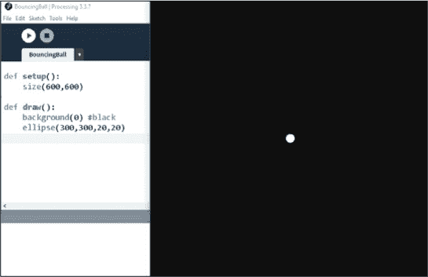

*图 9-1：为弹跳小球草图绘制一个圆形*

现在我们已经成功地创建了一个位于显示窗口中心的圆形，让我们尝试让它移动。

#### 让小球移动

我们将通过改变小球的位置来让它移动。为此，首先创建一个表示 x 值的变量和一个表示 y 值的变量，并将它们的值设置为 300，这个值是屏幕的中间位置。回到清单 9-2，并在代码的开头插入以下两行，就像在清单 9-3 中一样。

```py
*BouncingBall.pyde*
xcor = 300
ycor = 300

def setup():
    size(600,600)
```

*清单 9-3：设置 x 值和 y 值的变量*

在这里，我们使用`xcor`变量来表示 x 值，使用`ycor`变量来表示 y 值。然后，我们将这两个变量的值都设置为 300。

现在让我们通过改变 x 值和 y 值来改变椭圆的位置。确保使用这些变量来绘制椭圆，如清单 9-4 中所示。

```py
*BouncingBall.pyde*
xcor = 300
ycor = 300

def setup():
    size(600,600)

def draw():
 ➊ global xcor, ycor
    background(0) #black
    xcor += 1
    ycor += 1
    ellipse(xcor,ycor,20,20)
```

*清单 9-4：递增`xcor`和`ycor`来改变椭圆的位置*

在这个例子中，值得注意的关键点是`global xcor, ycor` ➊，它告诉 Python 使用我们已经创建的变量，而不是仅仅为了`draw()`函数而创建新的变量。如果你没有包含这行代码，你将会看到类似“在赋值之前引用了局部变量`xcor`”这样的错误信息。一旦 Processing 知道了要为`xcor`和`ycor`分配什么值，我们就可以将它们都增加 1，并使用全局变量`(xcor, ycor)`绘制椭圆。

当你保存并运行清单 9-4 时，你应该看到小球移动，就像在图 9-2 中看到的那样。

现在小球开始向下和向右移动，因为它的 x 值和 y 值都在增加，但是接着它移出了屏幕，我们再也看不见它了！程序会继续顺从地递增我们的变量。它并不知道自己在绘制一个小球，或者我们希望小球能反弹回墙壁。让我们来探索如何避免小球消失。

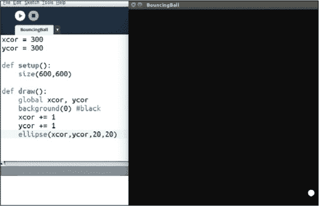

*图 9-2：小球在移动！*

#### 让小球从墙壁反弹

当我们通过增加 1 来改变 x 值和 y 值时，我们在改变一个物体的位置。在数学中，这种随时间变化的位置变化被称为*速度*。x 在时间上的正向变化（正 x 速度）看起来像是向右移动（因为 x 在增大），而负 x 速度则看起来像是向左移动。我们可以用这种“正向右，负向左”的概念让球弹跳出墙壁。首先，我们通过在现有代码中添加以下几行来创建 x 速度和 y 速度变量，具体代码见 Listing 9-5。

```py
*BouncingBall.pyde*
xcor = 300
ycor = 300
xvel = 1
yvel = 2

def setup():
    size(600,600)

def draw():
    global xcor,ycor,xvel,yvel
    background(0) #black
    xcor += xvel
    ycor += yvel
    #if the ball reaches a wall, switch direction.
    if xcor > width or xcor < 0:
        xvel = -xvel
    if ycor > height or ycor < 0:
        yvel = -yvel
    ellipse(xcor,ycor,20,20)
```

*Listing 9-5: 添加代码让球弹跳出墙壁*

首先，我们设置`xvel = 1`和`yvel = 2`来指定球的运动方式。你可以使用其他值，观察它们如何改变运动。然后在`draw()`函数中，我们告诉 Python `xvel`和`yvel`是全局变量，并且通过使用这些变量来增量地改变 x 和 y 坐标。例如，当我们设置`xcor += xvel`时，我们通过速度（位置的*变化*）来更新位置。

这两个`if`语句告诉程序，如果球的位置超出屏幕边界，它应该将球的速度改为其负值。当我们将球的速度改为负值时，我们告诉程序将球向它原本的相反方向移动，这样就看起来像球在弹跳。

我们需要精确地告诉程序，在什么情况下球应该改变方向，具体是基于它的坐标。例如，`xcor > width`表示`xcor`大于显示窗口的宽度，这时球碰到了屏幕的右边缘。而`xcor < 0`表示`xcor`小于 0，或者球碰到了屏幕的左边缘。同样，`ycor > height`检查`ycor`大于窗口的高度，或者球到达了屏幕的底部。最后，`ycor < 0`检查球是否到达屏幕的上边缘。由于向右移动是正的 x 速度（x 的正向变化），相反方向就是负的 x 速度。如果速度已经是负值（即球向左移动），那么负的负值就是正值，这意味着球将向右移动，正如我们希望的那样。

当你运行 Listing 9-5 时，你应该会看到类似于 Figure 9-3 中所示的效果。

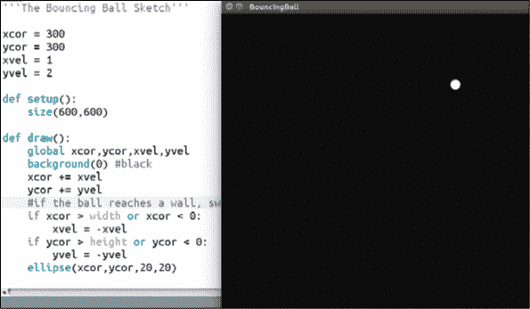

*Figure 9-3: 一个弹跳的球！*

球看起来像是在弹跳出墙壁，因此保持在视图中。

#### 没有类的情况下制作多个球

现在假设我们想要制作另一个弹跳球，或者多个弹跳球。我们该怎么做呢？我们可以为第二个球的 x 值创建一个新变量，为第二个球的 y 值创建另一个变量，为其 x 速度创建第三个变量，为其 y 速度创建第四个变量。然后，我们必须按其速度递增其位置，检查是否需要从墙壁上反弹，最后绘制它。然而，我们最终将得到双倍的代码量！再增加一个球就会使代码量增加三倍！二十个球体根本无法处理。你*不*想跟踪所有这些位置和速度的变量。清单 9-6 显示了这将是什么样子。

```py
#ball1:
ball1x = random(width)
ball1y = random(height)
ball1xvel = random(-2,2)
ball1tvel = random(-2,2)

#ball2:
ball2x = random(width)
ball2y = random(height)
ball2xvel = random(-2,2)
ball2tvel = random(-2,2)

#ball3:
ball3x = random(width)
ball3y = random(height)
ball3xvel = random(-2,2)
ball3tvel = random(-2,2)

#update ball1:
ball1x += ball1xvel
ball1y += ball1yvel
ellipse(ball1x,ball1y,20,20)

#update ball2:
ball2x += ball2xvel
ball2y += ball2yvel
ellipse(ball2x,ball2y,20,20)

#update ball3:
ball3x += ball3xvel
ball3y += ball3yvel
ellipse(ball3x,ball3y,20,20)
```

*清单 9-6：没有使用类创建多个球体。代码量太多了！*

这是仅创建三个球体的代码。如你所见，它非常长，而且这还没有包括弹跳部分！让我们看看如何使用类来简化这个任务。

#### 使用类创建对象

在编程中，类就像一个食谱，详细说明了如何创建具有特定属性的对象。使用类，我们告诉 Python 如何创建一个球体一次。然后，我们所要做的就是使用 `for` 循环创建多个球体，并将它们放入一个列表中。列表非常适合保存许多事物——字符串、数字和对象！

使用类创建对象时，请按照以下三个步骤操作：

1.  *编写类*。这就像是制作球体、行星、火箭等的食谱。

1.  *实例化对象*。你可以通过在 `setup()` 函数中调用对象来做到这一点。

1.  *更新对象*。在 `draw()` 函数（显示循环）中执行此操作。

让我们使用这些步骤将我们已经编写的代码放入类中。

##### 编写类

使用类创建对象的第一步是编写一个类，告诉程序如何制作一个球体。让我们将 清单 9-7 中的代码添加到我们现有程序的最前面。

```py
*BouncingBall.pyde*
ballList=[] #empty list to put the balls in

class Ball:
    def __init__(self,x,y):
        '''How to initialize a Ball'''
        self.xcor = x
        self.ycor = y
        self.xvel = random(-2,2)
        self.yvel = random(-2,2)
```

*清单 9-7：定义一个名为 `Ball` 的类*

请注意，由于我们将位置和速度变量作为属性放入了 `Ball` 类中，你可以从现有代码中删除以下几行：

```py
xcor = 300
ycor = 300
xvel = 1
yvel = 2
```

在 清单 9-7 中，我们创建了一个空列表，用于保存球体；然后我们开始定义这个食谱。类对象的名称（在本例中为 `Ball`）总是以大写字母开头。`__init__` 方法是 Python 中创建类的必要条件，它包含了对象在初始化时获得的所有属性。否则，类将无法正常工作。

`self`语法意味着每个对象都有自己的方法和属性，这些函数和变量只能被`Ball`对象使用。这意味着每个`Ball`都有自己的`xcor`，自己的`ycor`，等等。因为我们可能在某个时刻需要在特定位置创建一个`Ball`，我们将`x`和`y`设置为`__init__`方法的参数。添加这些参数可以让我们在创建`Ball`时告诉 Python 它的位置，如下所示：

```py
Ball(100,200)
```

在这种情况下，球将位于坐标(100, 200)。

示例 9-7 中的最后几行告诉 Processing 为新球的 x 速度和 y 速度分配一个介于-2 和 2 之间的随机数。

##### 实例化对象

既然我们已经创建了一个名为`Ball`的类，我们需要告诉 Processing 每次`draw()`函数循环时如何更新球。我们将创建一个`update`方法，并将其嵌套在`Ball`类中，就像我们之前做的`__init__`方法一样。你可以简单地将所有球的代码剪切并粘贴到`update()`方法中，然后为每个对象的属性添加`self.`，如下所示在示例 9-8 中展示。

```py
*BouncingBall.pyde*
ballList=[] #empty list to put the balls in

class Ball:
    def __init__(self,x,y):
        '''How to initialize a Ball'''
        self.xcor = x
        self.ycor = y
        self.xvel = random(-2,2)
        self.yvel = random(-2,2)

    def update(self):
        self.xcor += self.xvel
        self.ycor += self.yvel
        #if the ball reaches a wall, switch direction
        if self.xcor > width or self.xcor < 0:
            self.xvel = -self.xvel
        if self.ycor > height or self.ycor < 0:
            self.yvel = -self.yvel
        ellipse(self.xcor,self.ycor,20,20)
```

*示例 9-8：创建`update()`方法*

这里，我们将所有移动和弹跳球的代码都放入了`Ball`类的`update()`方法中。唯一的新代码是`self`出现在速度变量中，使它们成为`Ball`对象的速度属性。虽然看起来有很多`self`，但这就是我们告诉 Python，举个例子，x 坐标属于特定的那个球而不是其他球。很快，Python 将要更新上百个球，所以我们需要`self`来追踪每个球的位置和速度。

现在程序知道如何创建和更新一个球，我们来更新`setup()`函数，创建三个球并将它们放入球列表（`ballList`）中，具体见示例 9-9。

```py
def setup():
    size(600,600)
    for i in range(3):
        ballList.append(Ball(random(width),
                             random(height)))
```

*示例 9-9：在`setup()`函数中创建三个球*

我们已经在示例 9-7 中创建了`ballList`，现在我们在列表中随机位置添加一个`Ball`。当程序创建（实例化）一个新的球时，它会选择一个介于 0 和屏幕宽度之间的随机数作为 x 坐标，另一个介于 0 和屏幕高度之间的随机数作为 y 坐标。然后，它会将这个新的球添加到列表中。因为我们使用了`for i in range(3)`的循环，程序会向球列表中添加三个球。

##### 更新对象

现在让我们告诉程序遍历`ballList`，并在每次循环中更新列表中的所有球（即绘制它们），使用以下`draw()`函数：

```py
*BouncingBall.pyde*
def draw():
    background(0) #black
    for ball in ballList:
        ball.update()
```

请注意，我们仍然希望背景是黑色的，然后我们遍历球列表，对于列表中的每个球，我们运行它的`update()`方法。`draw()`中之前的所有代码都被移到了`Ball`类中！

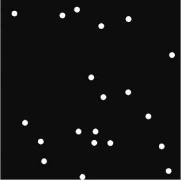

*图 9-4：创建任意数量的弹跳球！*

当你运行这个草图时，你应该能看到三个小球在屏幕上移动并撞击墙壁！使用类的一个好处是可以轻松更改小球的数量。你所要做的就是在`setup()`函数中的`for i in range(*number*)`里更改*`number`*，这样就能创建更多的小球。例如，将这个数字改为 20，你就会看到类似图 9-4 的效果。

使用类的一个酷点是，你可以为对象赋予任何你想要的属性或方法。例如，我们不必让所有的小球都使用相同的颜色。你可以将 Listing 9-10 中的三行代码添加到你现有的`Ball`类中。

```py
*BouncingBall.pyde*
class Ball:
    def __init__(self,x,y):
        '''How to initialize a Ball'''
        self.xcor = x
        self.ycor = y
        self.xvel = random(-2,2)
        self.yvel = random(-2,2)
        self.col = color(random(255),
                         random(255),
                         random(255))
```

*Listing 9-10: 更新`Ball`类*

这段代码在创建每个小球时给它分配一个独立的颜色。Processing 的`color()`函数需要三个数字，分别代表红色、绿色和蓝色。RGB 值的范围是从 0 到 255。使用`random(255)`让程序随机选择这三个数字，从而得到一个随机的颜色。然而，因为`__init__`方法只执行一次，所以一旦小球拥有了颜色，它就会保持这个颜色。

接下来，在`update()`方法中，添加如下代码，使得椭圆被填充上自己随机选中的颜色：

```py
        fill(self.col)
        ellipse(self.xcor,self.ycor,20,20)
```

在绘制形状或线条之前，你可以使用`fill`为形状声明颜色，或者使用`stroke`为线条声明颜色。在这里，我们告诉 Processing 使用小球自己的颜色（通过`self`）来填充下面的形状。

现在，当你运行程序时，每个小球应该都有一个随机颜色，如图 9-5 所示！

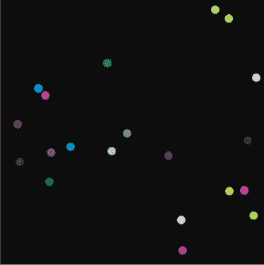

*图 9-5：给小球赋予不同的颜色*

练习 9-1：创建不同大小的小球

给每个小球一个自己的大小，大小范围为 5 到 50 单位。

### 放牧羊程序

现在你已经可以创建类了，我们来做一些有用的事情。我们将编写一个 Processing 草图，模拟羊在草地上走动并吃草的生态系统。在这个草图中，羊有一定的能量，走动时能量会减少，而吃草时能量会恢复。如果它们获得足够的能量，它们就会繁殖。如果能量不足，它们就会死亡。通过创建和调整这个模型，我们可能会学到很多关于生物学、生态学和进化学的知识。

在这个程序中，`Sheep`对象有点像你在本章前面创建的`Ball`对象；每个对象都有自己的 x 和 y 坐标及大小，并且用圆形表示。

#### 编写羊类代码

开始一个新的 Processing 草图，并将其保存为*SheepAndGrass.pyde*。首先，我们创建一个类，使其能够生成一个具有自己 x 和 y 坐标及大小的`Sheep`对象。然后我们将创建一个`update`方法，在羊的位置画出一个椭圆，表示羊的大小。

类的代码几乎与`Ball`类相同，正如你在 Listing 9-11 中所看到的那样。

```py
*SheepAndGrass.pyde*
class Sheep:
    def __init__(self,x,y):
        self.x = x #x-position
        self.y = y #y-position
        self.sz = 10 #size

    def update(self):
        ellipse(self.x,self.y,self.sz,self.sz)
```

*Listing 9-11: 为一只羊创建类*

因为我们知道将要创建一堆羊，所以我们从创建一个`Sheep`类开始。在必需的`__init__`方法中，我们将羊的 x 和 y 坐标设置为我们在创建羊实例时声明的参数。我将羊的大小（即椭圆的直径）设置为 10 像素，但如果你喜欢，也可以有更大或更小的羊。`update()`方法只是简单地在羊的位置绘制一个与羊大小相同的椭圆。

下面是包含一个`Sheep`对象（我将其命名为`shawn`）的 Processing 草图中的`setup()`和`draw()`代码。将清单 9-12 中的代码添加到你刚刚在清单 9-11 中编写的`update()`方法下方。

```py
def setup():
    global shawn
    size(600,600)
    #create a Sheep object called shawn at (300,200)
    shawn = Sheep(300,200)

def draw():
    background(255)
    shawn.update()
```

*清单 9-12：创建一个名为`shawn`的`Sheep`对象*

我们首先在`setup()`函数中创建了一个`shawn`，它是一个`Sheep`对象的实例。然后我们在`draw()`函数中更新它——但是 Python 并不知道我们指的是同一个`shawn`，除非我们告诉它`shawn`是一个全局变量。

当你运行这段代码时，你应该看到类似图 9-6 中的效果。

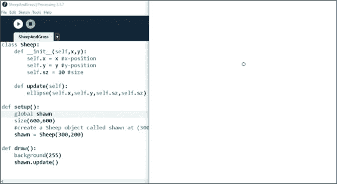

*图 9-6：一只羊*

你会看到一个白色的屏幕，屏幕上有一个小圆形的羊，位于坐标（300，200）处，也就是从起点向右 300 像素，向下 200 像素。

#### 编程让羊四处移动

现在让我们教一个`Sheep`如何移动。我们将从编程让`Sheep`随机移动开始。（如果以后你想要让它以不同的方式移动，随时可以更改。）清单 9-13 通过一个介于-10 和 10 之间的随机数来改变`Sheep`的 x 和 y 坐标。返回到现有代码，在`update()`方法中的`ellipse()`函数上方添加以下几行代码：

```py
    *SheepAndGrass.pyde*
    def update(self):
        #make sheep walk randomly
        move = 10 #the maximum it can move in any direction
        self.x += random(-move, move)
        self.y += random(-move, move)
        fill(255) #white
        ellipse(self.x,self.y,self.sz,self.sz)
```

*清单 9-13：让羊随机移动*

这段代码创建了一个名为`move`的变量，用来指定羊能够在屏幕上移动的最大值或距离。然后我们将`move`设置为 10，并使用它通过一个介于`-move`（–10）和`move`（10）之间的随机数来更新羊的 x 和 y 坐标。最后，我们使用`fill(255)`将羊的颜色暂时设置为白色。

当你运行这段代码时，你应该看到羊随机地在四处游荡——它可能会游荡出屏幕之外。

让我们给羊群增加一些伙伴。如果我们想创建和更新多个对象，把它们放进一个列表是个不错的主意。然后在`draw()`函数中，我们会遍历这个列表并更新每一个`Sheep`对象。更新你的现有代码，使其像清单 9-14 一样。

```py
*SheepAndGrass.pyde*
class Sheep:
    def __init__(self,x,y):
        self.x = x #x-position
        self.y = y #y-position
        self.sz = 10 #size

    def update(self):
        #make sheep walk randomly
        move = 10 #the maximum it can move in any direction
        self.x += random(-move, move)
        self.y += random(-move, move)
        fill(255) #white
        ellipse(self.x,self.y,self.sz,self.sz)

sheepList = [] #list to store sheep

def setup():
    size(600,600)
    for i in range(3):
        sheepList.append(Sheep(random(width),
                               random(height)))

def draw():
    background(255)
    for sheep in sheepList:
        sheep.update()
```

*清单 9-14：使用`for`循环创建更多的羊*

这段代码与我们之前写的将弹跳球放入列表的代码类似。首先，我们创建一个列表来存储羊。然后，我们创建一个`for`循环，将一只`Sheep`添加到羊的列表中。接着，在`draw()`函数中，我们再写一个`for`循环，遍历羊列表，并根据我们已经定义的`update()`方法更新每只羊。当你运行这段代码时，应该会看到三只`Sheep`在随机走动。你可以将`for i in range(3):`中的数字`3`改成更大的数字，以增加更多的羊。

#### 创建能量属性

走路会消耗能量！让我们在羊创建时给予它一定的能量，并在它们走动时消耗掉能量。使用清单 9-15 中的代码来更新你现有的`__init__`和`update()`方法，在*SheepAndGrass.pyde*中完成。

```py
class Sheep:
    def __init__(self,x,y):
        self.x = x #x-position
        self.y = y #y-position
        self.sz = 10 #size
        self.energy = 20 #energy level

    def update(self):
        #make sheep walk randomly
        move = 1
        self.energy -= 1 #walking costs energy
        if sheep.energy <= 0:
            sheepList.remove(self)
        self.x += random(-move, move)
        self.y += random(-move, move)
        fill(255) #white
        ellipse(self.x,self.y,self.sz,self.sz)
```

*清单 9-15：使用`energy`属性更新`__init__`和`update()`方法*

我们通过在`__init__`方法中创建一个`energy`属性并将其设置为 20，表示每只羊的初始能量水平。然后，在`update()`方法中，`self.energy -= 1`会让羊在四处走动时减少 1 点能量。

然后我们检查羊是否能量耗尽，如果是，就将其从`sheepList`中移除。在这里，我们使用一个条件语句来检查`if sheep.energy <= 0`是否返回`True`。如果是，我们使用`remove()`函数从`sheepList`中移除那只羊。一旦那只`Sheep`实例被移除，它就不再存在。

#### 使用类创建草

当你运行程序时，应该会看到`Sheep`走动一会儿然后消失——走动会消耗羊的能量，一旦能量用尽，羊就会死掉。我们需要做的是给羊提供草让它们吃。我们将每片草称为`Grass`并为其创建一个新类。`Grass`将具有自己的 x、y 坐标、大小和能量含量。我们还会让它在被吃掉时改变颜色。

事实上，在这个草图中，我们将使用许多不同的颜色来表示羊和草，所以让我们将清单 9-16 中的代码添加到程序的最开始，这样我们就可以通过颜色名称来引用它们。如果你想，也可以添加其他颜色。

```py
WHITE = color(255)
BROWN = color(102,51,0)
RED = color(255,0,0)
GREEN = color(0,102,0)
YELLOW = color(255,255,0)
PURPLE = color(102,0,204)
```

*清单 9-16：将颜色设置为常量*

使用全大写的颜色名称表示它们是常量，不会改变值，但这只是对程序员而言。常量本身并没有什么魔力，如果你愿意，可以更改这些值。设置常量的好处是你可以直接使用颜色名称，而不必每次都写 RGB 值。我们将在让草变绿时做这个更新。通过在*SheepAndGrass.pyde*中将清单 9-17 中的代码添加到`Sheep`类之后来更新你现有的代码：

```py
class Grass:
    def __init__(self,x,y,sz):
        self.x = x
        self.y = y
        self.energy = 5 #energy from eating this patch
        self.eaten = False #hasn't been eaten yet
        self.sz = sz

    def update(self):
        fill(GREEN)
        rect(self.x,self.y,self.sz,self.sz)
```

*清单 9-17：编写`Grass`类*

你可能已经开始习惯类的结构了。它通常从`__init__`方法开始，在这个方法中你会创建它的属性。在这种情况下，你告诉程序`Grass`将有一个 x 和 y 位置，一个能量级别，一个布尔值（`True`/`False`）变量用于跟踪草地是否被吃掉了，还有一个大小。要更新一块草地，我们只需在`Grass`对象的位置创建一个绿色矩形。

现在我们需要像处理羊一样初始化和更新草地。因为草地数量会很多，所以我们可以为草地创建一个列表。在`setup()`函数之前，添加以下代码。

```py
sheepList = [] #list to store sheep
grassList = [] #list to store grass
patchSize = 10 #size of each patch of grass
```

我们可能希望将来改变草地的大小，因此我们创建一个名为`patchSize`的变量，这样我们只需在一个地方修改它即可。在`setup()`函数中，创建羊之后，添加新代码来创建草地，具体见清单 9-18。

```py
def setup():
    global patchSize
    size(600,600)
    #create the sheep
    for i in range(3):
        sheepList.append(Sheep(random(width),
                               random(height)))
    #create the grass:
    for x in range(0,width,patchSize):
        for y in range(0,height,patchSize):
            grassList.append(Grass(x,y,patchSize))
```

*清单 9-18：使用`patchSize`变量更新`Grass`对象*

在这个例子中，`global patchSize`告诉 Python 我们在所有地方使用相同的`patchSize`变量。然后我们写两个`for`循环（一个用于 x，另一个用于 y），将`Grass`添加到草地列表中，这样我们就可以创建一个方形的草地网格。

然后，我们像处理羊一样，在`draw()`函数中更新所有内容。无论先绘制什么，都会被后绘制的内容覆盖，因此我们会首先更新草地，通过将`draw()`函数改为清单 9-19 中的代码。

```py
*SheepAndGrass.pyde*
def draw():
    background(255)
    #update the grass first
    for grass in grassList:
        grass.update()
    #then the sheep
    for sheep in sheepList:
        sheep.update()
```

*清单 9-19：在羊之前更新草地*

当你运行这段代码时，你应该能看到一个绿色方块的网格，就像在图 9-7 中一样。

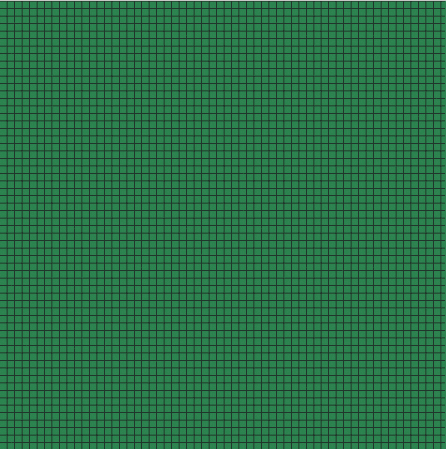

*图 9-7：带有网格线的草地*

让我们关闭黑色轮廓，这样看起来就像是一片平滑的草地。在`setup()`函数中添加`noStroke()`，以去掉绿色方块的轮廓：

```py
def setup():
    global patchSize
    size(600,600)
    noStroke()
```

现在我们有草地了！

#### 让草地在被吃掉时变成棕色

那么，如何让羊在站在草地上时获取草地的能量，并且草地变成棕色，表示羊已经吃掉了它呢？通过添加以下代码行来修改`Grass`的`update()`方法：

```py
    def update(self):
        if self.eaten:
            fill(BROWN)
        else:
            fill(GREEN)
        rect(self.x,self.y,self.sz,self.sz)
```

这段代码告诉 Processing，如果草地被“吃掉”，矩形应该填充为棕色。否则，草地应该是绿色的。羊吃草的方式有不止一种。 一种方法是让每块草地检查整个`sheepList`，看是否有羊在其位置上，这可能意味着成千上万块草地在检查成千上万只羊。这些数字可能会很大。然而，由于每块草地都在`grassList`中，另一种方法是，当羊改变位置时，它可以简单地将该位置的草地标记为“已吃”（如果它还没被吃过的话），并从吃草中获得能量。这意味着会少做很多检查。

问题是，羊的 x、y 坐标与草地区域在`grassList`中的位置并不完全匹配。例如，我们的`patchSize`是 10，这意味着如果一只羊在(92,35)的位置，它会在右侧第 10 个草地区域和下方第 4 个草地区域（因为“第一个”区域是从 x = 0 到 x = 9）。我们通过除以`patchSize`来获取“缩放后的”x、y 值，即 9 和 3。

然而，`grassList`没有行和列。我们知道 x 值为 9，意味着它是第 10 行（别忘了行 0），所以我们只需要加上 9 行 60（高度除以`patchSize`），然后再加上 y 值来获得羊所在草地区域的索引。因此，我们需要一个变量来告诉我们每行有多少个草地区域，我们将其命名为`rows_of_grass`。将`global rows_of_grass`添加到`setup()`函数的开头，然后在声明大小之后，将此行代码添加到`setup()`中：

```py
rows_of_grass = height/patchSize
```

这段代码计算显示窗口的宽度，并将其除以草地区域的大小，以告诉我们有多少列草地。添加到`Sheep`类中的代码见清单 9-20。

```py
        *SheepAndGrass.pyde*
        self.x += random(-move, move)
        self.y += random(-move, move)
        #"wrap" the world Asteroids-style
     ➊ if self.x > width:
            self.x %= width
        if self.y > height:
            self.y %= height
        if self.x < 0:
            self.x += width
        if self.y < 0:
            self.y += height
        #find the patch of grass you're on in the grassList:
     ➋ xscl = int(self.x / patchSize)
        yscl = int(self.y / patchSize)
     ➌ grass = grassList[xscl * rows_of_grass + yscl]
        if not grass.eaten:
            self.energy += grass.energy
            grass.eaten = True
```

*清单 9-20：更新羊的能量水平并将草地变成棕色*

更新羊的位置后，我们将坐标“包装” ➊，这样如果羊在某一方向走出屏幕，它会出现在屏幕的另一边，就像视频游戏《*小行星*》中那样。我们根据`patchSize` ➋计算羊所在的草地区域。然后，我们使用代码将 x、y 值转换为该区域在`grassList`中的索引 ➌。现在我们知道羊所处的草地区域的确切索引。如果这块草地还没有被吃掉，羊就会吃掉它！它从草地中获取能量，草地的`eaten`属性被设置为`True`。

运行这段代码，你会看到三只羊四处奔跑，吃掉草地，而草地一旦被吃掉就会变成棕色。通过将`move`变量改为较小的值（比如 5）来减慢羊的速度。你也可以通过修改`patchSize`变量将草地区域缩小到 5。你可以尝试其他值。

现在我们可以创建更多的`Sheep`了。让我们将`for i in range`行中的数字改为 20，像这样：

```py
    #create the sheep
    for i in range(20):
        sheepList.append(Sheep(random(width),
                               random(height)))
```

当你运行这段代码时，你应该能看到类似图 9-8 的内容。

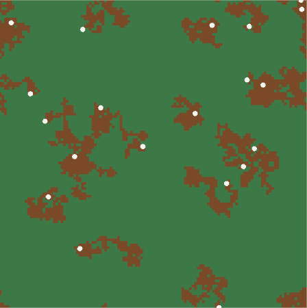

*图 9-8：一群羊！*

现在有 20 只羊在四处走动，留下了棕色的草地。

#### 为每只羊指定一个随机颜色

让我们让羊在“出生”时选择一种颜色。在定义颜色常量的代码之后，我们将一些颜色放入一个颜色列表，如下所示：

```py
YELLOW = color(255,255,0)
PURPLE = color(102,0,204)
colorList = [WHITE,RED,YELLOW,PURPLE]
```

对`Sheep`类进行以下更改以使用不同的颜色。首先，你需要为`Sheep`添加一个颜色属性。由于`color`在 Processing 中已经是一个关键字，所以在清单 9-21 中使用了`col`。

```py
class Sheep:
    def __init__(self,x,y,col):
        self.x = x #x-position
        self.y = y #y-position
        self.sz = 10 #size
        self.energy = 20
        self.col = col
```

*清单 9-21：为`Sheep`类添加颜色属性*

然后，在`update()`方法中，用以下代码替换填充行：

```py
        fill(self.col) #its own color
        ellipse(self.x,self.y,self.sz,self.sz)
```

在椭圆形绘制之前，`fill(self.col)`告诉 Processing 使用`Sheep`自身随机选择的颜色来填充椭圆。

当所有`Sheep`在`setup()`函数中被实例化时，你需要给它们随机分配一个颜色。这意味着在程序的顶部，你必须从`random`模块导入`choice()`函数，如下所示：

```py
from random import choice
```

Python 的`choice()`函数允许你从列表中随机选择一个项并返回。我们应该能够让程序按如下方式执行：

```py
choice(colorList)
```

现在程序将从颜色列表中返回一个单一的值。最后，在创建`Sheep`时，将颜色列表中的随机选择颜色作为参数之一传递给`Sheep`构造函数，如下所示：

```py
def setup():
    size(600,600)
    noStroke()
    #create the sheep
    for i in range(20):
        sheepList.append(Sheep(random(width),
                               random(height),
                               choice(colorList)))
```

现在，当你运行这段代码时，你应该会看到一群随机颜色的羊在屏幕上走动，如图 9-9 所示。

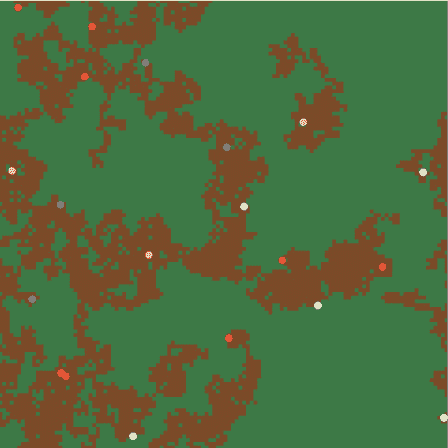

*图 9-9：五颜六色的羊*

每只新羊都会被分配到我们在`colorList`中定义的四种颜色之一：白色、红色、黄色或紫色。

#### 编程让羊繁殖

不幸的是，在我们当前的程序中，羊会吃草，直到它们离草地太远，能量耗尽并死亡。为了防止这种情况发生，让我们指示羊使用一部分能量来繁殖。

让我们使用清单 9-22 中的代码，指示羊在能量达到 50 时进行繁殖。

```py
if self.energy <= 0:
    sheepList.remove(self)
if self.energy >= 50:
    self.energy -= 30 #giving birth takes energy
    #add another sheep to the list
    sheepList.append(Sheep(self.x,self.y,self.col))
```

*清单 9-22：为羊添加繁殖条件*

条件语句`if self.energy >= 50:`检查该羊的能量是否大于或等于 50。如果是，它会将能量水平减少 30（用于生育），并将另一只羊添加到羊群中。注意，新羊的位置与它的父母相同，且颜色也与父母相同。运行这段代码，你应该会看到羊繁殖，像图 9-10 所示。

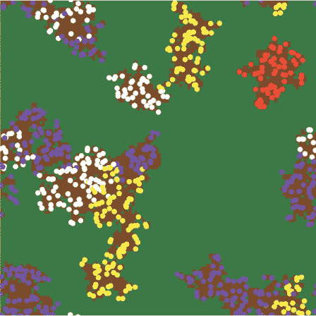

*图 9-10：羊吃草并繁殖*

很快你会看到看起来像是同色羊群的场景。

#### 让草重新生长

不幸的是，羊很快吃光了它们区域内的所有草并死亡（可能在这里有某种教训）。我们需要让草重新生长。为此，请将`Grass`类的`update()`方法修改为如下：

```py
    def update(self):
        if self.eaten:
            if random(100) < 5:
                self.eaten = False
            else:
                fill(BROWN)
        else:
            fill(GREEN)
        rect(self.x,self.y,self.sz,self.sz)
```

Processing 代码`random(100)`生成一个介于 0 和 100 之间的随机数。如果该数字小于 5，我们通过将草的`eaten`属性设置为`False`来重新生长一块草。我们选择 5 这个数字，因为它让吃过的草在每帧中以 5/100 的概率重新生长。否则，草仍然保持棕色。

运行代码，你应该会看到类似图 9-11 的效果。

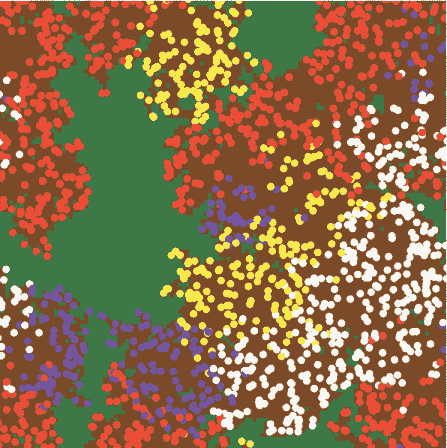

*图 9-11：草重新生长，羊群占据了整个屏幕！*

现在，你可能会发现羊群数量增加到程序开始变慢！这可能是因为羊群有过多的能量。如果是这样，尝试将每块草地所含的能量从 5 减少到 2：

```py
class Grass:
    def __init__(self,x,y,sz):
        self.x = x
        self.y = y
        self.energy = 2 #energy from eating this patch
        self.eaten = False #hasn't been eaten yet
        self.sz = sz
```

这似乎是一个很好的平衡，使得羊群数量以合理的速度增长。随意调整数字——这是你的世界！

#### 提供进化优势

让我们给其中一群羊提供一个优势。你可以选择任何你能想到的优势（例如，从草地上获得更多能量或一次性繁殖更多后代）。在这个例子中，我们将让紫色的羊走得比其他羊稍远一点。这会有什么不同吗？为了找出答案，请让`Sheep`的`update()`方法与以下代码匹配：

```py
    def update(self):
        #make sheep walk randomly
 move = 5 #the maximum it can move in any direction
        if self.col == PURPLE:
            move = 7
        self.energy -= 1
```

这个条件语句检查`Sheep`的颜色是否为紫色。如果是，它将`Sheep`的`move`值设置为 7。否则，保持值为 5。这样，紫色的羊可以走得更远，因此比其他羊更有可能找到绿色的草地。我们运行代码并检查结果，应该会看到如图 9-12 所示。

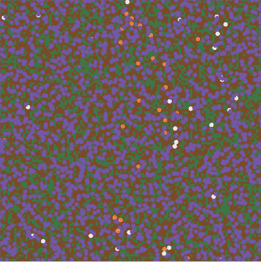

*图 9-12：给紫色羊提供优势*

过了一段时间，看起来紫色羊的微小优势确实取得了回报。它们正在主导环境，通过争夺草地把其他羊排挤出去。这个模拟可能引发关于生态学、外来物种、生物多样性和进化的有趣讨论。

练习 9-2：设置羊的寿命

创建一个“年龄”属性，并在每次更新羊时将其减少，让它们只活有限的时间。

练习 9-3：改变羊的大小

根据羊的能量水平来变化羊的大小。

### 总结

在这一章中，你学习了如何使用类创建对象，包括定义类的属性，然后实例化（“创建”）并更新对象。这使得你能够更高效地创建多个相似但独立的对象，且它们具有相同的属性。你使用类越多，就越能通过让自主对象行走、飞行或跳跃，而不需要每一步都手动编写代码，从而变得更加富有创造力！

学会使用类可以大大增强你的编程能力。现在你可以轻松创建复杂情况的模型，一旦你告诉程序如何处理一个粒子、一个行星或一只羊，它就能非常轻松地创建出十只、百只，甚至是百万只这样的模型！

你还体验了用极少的方程式建立模型，探索物理、生物、化学或环境问题！有位物理学家曾告诉我，这通常是解决涉及多个因素或“代理”的问题最有效的方法。你建立一个计算机模型，让它运行，然后查看结果。

在下一章中，你将学习如何使用一种几乎神奇的现象——递归，来创建分形。
