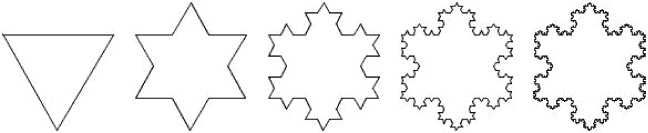

## 第十章：使用递归创建分形

*“thesaurus”的另一个词是什么？*

— 史蒂文·赖特*


分形是令人愉快的复杂设计，其中设计的每个小部分都包含了整个设计（参见图 10-1）。它们由贝努瓦·曼德布罗特于 1980 年发明（或者说是发现，因为分形在自然界中存在），当时他在一台先进的 IBM 计算机上可视化一些复杂函数。


*图 10-1：分形的例子*

分形看起来不像我们在几何学中认识的常规形状，比如正方形、三角形和圆形。它们的形状曲折且 jagged（锯齿状），使得它们成为模拟自然现象的绝佳模型。实际上，科学家使用分形来模拟从你心脏的动脉，到地震，再到大脑中的神经元等一切。

分形之所以如此有趣，是因为它们展示了如何通过简单的规则反复运行，以及模式在更小尺度上不断重复，从而获得出乎意料的复杂设计。

我们的主要兴趣是你可以用分形制作的那些有趣且复杂的设计。如今每本数学书中都有分形的图像，但教科书从不告诉你如何制作分形——你需要计算机来做这件事。在本章中，你将学习如何使用 Python 创建自己的分形。

### 海岸线的长度

在你开始创建分形之前，让我们看一个简单的例子，帮助理解分形如何有用。一位数学家名叫路易斯·理查森提出了一个简单的问题：“英国的海岸线有多长？”正如你在图 10-2 中看到的，答案取决于你使用的尺子的长度。


*图 10-2：逼近海岸线长度*

你的尺子越小，你就能越精确地逼近海岸线的曲折边缘，这意味着你最终得到的测量值会更长。有趣的是，*当尺子的长度接近零时，海岸线的长度接近无限大！* 这被称为海岸线悖论。

认为这只是抽象的数学胡思乱想？在现实世界中，海岸线的长度估算差异很大。即使是现代技术，最终还是取决于用来测量地图的尺度。我们将绘制一幅像图 10-3 这样的图，科赫雪花，以展示分形如何证明一个足够粗糙的海岸线可以变得任意长！



*图 10-3：一个越来越详细的分形，模拟一个越来越崎岖的海岸线*

首先，你需要学习一些技巧，比如递归。

#### 递归是什么？

分形的强大之处在于你可以重复数值或形状的模式，每一步都会变得更小，直到你处理的是非常小的数字。重复这些代码的关键是一个叫做*递归*的概念，它是指某事物以自身为定义的方式进行描述。以下一些笑话说明了递归的工作原理：

+   如果你在谷歌中搜索“递归”，它会问你：“你是想搜*递归*吗？”

+   在多本计算机编程书籍的索引中，你会看到类似这样的条目：“递归，见*递归*。”

正如你可以想象的，递归是一个相当奇怪的概念。递归的优点是它能够简化本来过于复杂的代码，但缺点是你可能会用尽过多的内存。

#### 编写`factorial()`函数

让我们通过编写一个计算数字阶乘的函数来观察递归的实际应用。你可能还记得数学课上，*n*的阶乘（表示为*n!*）被定义为从 1 到*n*的所有整数的乘积。例如，5! = 1 × 2 × 3 × 4 × 5 = 120。

公式看起来像这样：*n*! = 1 × 2 × 3 . . . × (*n* – 2) × (*n* – 1) × *n*。这是递归序列的一个例子，因为 5! = 5 × 4!，4! = 4 × 3!，依此类推。递归是数学中的一个重要概念，因为数学本质上是关于模式的，而递归使你能够无限地复制和扩展模式！

我们可以将 n 的阶乘定义为 n 与 n – 1 的阶乘的乘积。我们只需要定义 0 的阶乘（它是 1，而不是 0）和 1 的阶乘，然后使用递归语句。在 IDLE 中打开一个新文件，保存为*factorial.py*，然后输入清单 10-1 中的代码。

```py
*factorial.py*
def factorial(n):
    if n == 0:
        return 1
    else:
        return n * factorial(n – 1)
```

*清单 10-1：使用递归语句编写`factorial()`函数*

首先，我们说：“如果用户（或程序）请求 0 或 1 的阶乘，返回 1。”这是因为 0!和 1!都等于 1。然后我们告诉程序，“对于任何其他数字*n*，返回*n*乘以比*n*小 1 的数字的阶乘。”

请注意，在清单 10-1 的最后一行，我们在定义`factorial()`函数时*内部*调用了`factorial()`函数！这就像是一个面包食谱，里面有“烤一个面包”这样的步骤。人们根本不会开始按照这样的食谱去做。但是计算机可以从头到尾地执行这些步骤。

在这个例子中，当我们请求 5 的阶乘时，程序会顺从地执行，直到最后一行，它请求*n* – 1 的阶乘，在这种情况下（因为*n* = 5），就是 4 的阶乘。为了计算阶乘（5 – 1），程序会再次启动`factorial()`函数，*n* = 4，并试图以相同的方式计算 4 的阶乘，然后是 3 的阶乘、2 的阶乘、1 的阶乘，最后是 0 的阶乘。因为我们已经定义了函数将 0 的阶乘返回为 1，所以函数可以按照顺序回到上一步，计算 1 的阶乘、2 的阶乘、3 的阶乘、4 的阶乘，最后是 5 的阶乘。

递归地定义一个函数（通过在其自身定义中调用该函数）可能会让人感到困惑，但它是本章所有分形图案的关键。我们从一个经典的例子开始：分形树。

#### 构建一个分形树

创建分形图形从定义一个简单的函数开始，并在函数内部调用该函数。让我们尝试构建一个像图 10-4 一样的分形树。


*图 10-4：一棵分形树*

如果你需要告诉程序每一条要画的线，这将是一个非常复杂的设计。但如果使用递归，这所需的代码 surprisingly 少。通过平移、旋转和`line()`函数，我们将在 Processing 中首先绘制一个 Y 形，如图 10-5 所示。


*图 10-5：分形树的初步形态*

最终将这个 Y 形转变为分形的唯一要求是，在程序绘制完 Y 树和分支后，程序必须返回到“树干”的底部。因为“分支”将会变成 Y 形本身。如果程序每次不返回到 Y 的底部，我们就无法得到树的结构。

##### 编写`y()`函数

你的 Y 形不必完美或对称，但这是我绘制 Y 形的代码。打开 Processing 中新建一个草图，将其命名为*fractals.pyde*，并输入清单 10-2 中的代码。

```py
*fractals.pyde*
def setup():
    size(600,600)

def draw():
    background(255)
    translate(300,500)
    y(100)

def y(sz):
    line(0,0,0,-sz)
    translate(0,-sz)
    rotate(radians(30))
    line(0,0,0,-0.8*sz) #right branch
    rotate(radians(-60))
    line(0,0,0,-0.8*sz) #left branch
    rotate(radians(30))
    translate(0,sz)
```

*清单 10-2：编写用于分形树的`y()`函数*

我们像往常一样设置 Processing 草图：在`setup()`函数中告诉程序显示窗口的大小，然后在`draw()`函数中设置背景色（255 为白色）并进行平移，确定绘制起始点。最后，我们调用`y()`函数并传递数字 100 作为分形树“树干”的大小。

`y()`函数接受一个数字`sz`作为参数，表示树干的长度。然后，所有分支将基于这个数字。`y()`函数中的第一行代码使用垂直线绘制树干。为了创建一条向右分叉的线，我们将垂直线沿着树干（负 y 方向）平移，然后将其向右旋转 30 度。接下来，我们绘制另一条右分支的线，再将其旋转到左侧（负 60 度），并绘制另一条左分支的线。最后，我们需要旋转回直立的方向，以便再次沿着树干向下平移。保存并运行这个草图，你应该能够看到图 10-5 中的 Y 形。

我们可以通过将分支变成*更小*的 Y 形状，将这个绘制单一 Y 的程序转换为绘制分形的程序。但是，如果我们仅仅在`y()`函数中将“line”替换为“y”，程序就会陷入无限循环，抛出类似这样的错误：

```py
RuntimeError: maximum recursion depth exceeded
```

回想一下，我们在阶乘函数中并没有直接调用 `factorial(n)`，而是调用了 `factorial(n-1)`。我们必须在 `y()` 函数中引入一个 `level` 参数。然后，每向上分支一次，树的级别就会下降一级，因此该分支将获得 `level - 1` 参数。这意味着树干总是最高编号的级别，树上最后一组分支总是级别 0。下面是如何更改 Listing 10-3 中的 `y()` 函数。

```py
*fractals.pyde*
def setup():
    size(600,600)

def draw():
    background(255)
    translate(300,500)
    y(100,2)

def y(sz,level):
    if level > 0:
        line(0,0,0,-sz)
        translate(0,-sz)
        rotate(radians(30))
        y(0.8*sz,level-1)
        rotate(radians(-60))
        y(0.8*sz,level-1)
        rotate(radians(30))
        translate(0,sz)
```

*Listing 10-3: 向 `y()` 函数添加递归*

注意，我们已经将代码中所有的 `line()` 函数替换为 `y()` 函数来绘制分支。因为我们将 `draw()` 函数中的 `y()` 调用改为 `y(100,2)`，所以我们将得到一个树干大小为 100 且有两个级别的树。试试三级树，四级树，依此类推！你应该能看到类似 Figure 10-6 的效果。


*Figure 10-6: 1 到 4 级的树*

##### 映射鼠标

现在，让我们创建一个程序，允许你通过上下移动鼠标实时控制分形的形状！我们可以通过追踪鼠标并根据其位置返回一个 0 到 10 之间的值，动态地改变旋转的级别。用 Listing 10-4 中的代码更新 `draw()` 函数。

```py
*fractals.pyde*
def draw():
    background(255)
    translate(300,500)
    level = int(map(mouseX,0,width,0,10))
    y(100,level)
```

*Listing 10-4: 向 `draw()` 函数添加 `level` 参数*

我们的鼠标 x 值可以在 0 和窗口宽度之间的任何地方。`map()` 函数将一个范围的值替换为另一个范围的值。在 Listing 10-4 中，`map()` 会将 x 值转换为 0 到 10 之间的值，而不是 0 到 600（显示屏的宽度），这是我们希望绘制的级别范围。所以我们将该值分配给一个名为 `level` 的变量，并将该值传递给下一行中的 `y()` 函数。

现在，我们已经调整了 `draw()` 函数，使其根据鼠标的位置返回一个值，我们可以通过将鼠标的 y 坐标与旋转角度关联，来改变树的形状。

旋转角度应该限制在 180 度以内，因为树木在 180 度时会“完全折叠”，但是鼠标的 y 值可以达到 600，因为这是我们在 `setup()` 中声明的屏幕高度。我们可以做一些数学运算来自己转换这些值，但直接使用 Processing 内置的 `map()` 函数会更简单。我们告诉 `map()` 函数我们想要映射的变量，指定它的当前最小值和最大值，以及所需的最小值和最大值。Y 分形树的完整代码显示在 Listing 10-5 中。

```py
*fractals.pyde*
def setup():
    size(600,600)

def draw():
    background(255)
    translate(300,500)
    level = int(map(mouseX,0,width,0,15))
    y(100,level)

def y(sz,level):
    if level > 0:
        line(0,0,0,-sz)
        translate(0,-sz)
        angle = map(mouseY,0,height,0,180)
        rotate(radians(angle))
        y(0.8*sz,level-1)
        rotate(radians(-2*angle))
        y(0.8*sz,level-1)
        rotate(radians(angle))
        translate(0,sz)
```

*Listing 10-5: 创建动态分形树的完整代码*

我们取鼠标的 y 值，并将其转换为 0 到 180 之间的范围（如果你已经习惯使用弧度，则可以将其映射到 0 到π之间）。在`rotate()`行中，我们为其指定该角度（以度为单位），并让 Processing 将度数转换为弧度。第一行`rotate()`将向右旋转。第二行`rotate()`将旋转一个负角度，也就是向左旋转两倍。然后第三行`rotate()`将再次向右旋转。

当你运行代码时，你应该看到类似于图 10-7 的内容。


*图 10-7：动态分形树*

现在，当你上下、左右移动鼠标时，分形的级别和形状应该会相应地改变。

通过绘制分形树，你学会了如何使用递归绘制复杂的设计，而仅需写非常少的代码。现在，我们将回到海岸线问题。海岸线或任何线条，如何通过变得更崎岖而使长度加倍或加三倍呢？

### 科赫雪花

科赫雪花（Koch snowflake）是一个著名的分形，得名于瑞典数学家赫尔格·冯·科赫（Helge von Koch），他在 1904 年发表的论文中讨论了这一形状！它由一个等边三角形构成。我们从一条线开始，并为其添加一个“突起”。然后，我们在每个结果线段上添加一个更小的突起，并重复这一过程，如图 10-8 所示。


*图 10-8：为每个线段添加“突起”*

让我们开始一个新的 Processing 草图，命名为*snowflake.pyde*，并添加清单 10-6 中的代码，这将给我们一个倒置的等边三角形。

```py
*snowflake.pyde*
def setup():
    size(600,600)

def draw():
    background(255)
    translate(100,100)
    snowflake(400,1)

def snowflake(sz,level):
    for i in range(3):
        line(0,0,sz,0)
        translate(sz,0)
        rotate(radians(120))
```

*清单 10-6：编写`snowflake()`函数*

在`draw()`函数中，我们调用了`snowflake()`函数，目前该函数仅接受两个参数：`sz`（初始三角形的大小）和`level`（分形的级别）。`snowflake()`函数通过启动一个循环绘制三角形，这个循环重复三次。在循环内部，我们绘制一条长度为`sz`的线段，它将是三角形的一边，然后沿着这条线段平移到三角形的下一个顶点并旋转 120 度。然后，我们绘制三角形的下一条边。

当你运行清单 10-6 中的代码时，你应该能看到图 10-9。


*图 10-9：级别 1 雪花：一个三角形*

#### 编写`SEGMENT()`函数

现在我们需要告诉程序如何将一条线变成具有不同级别的线段。级别 0 时只是直线，但下一级别会在边上添加“凸起”。我们实际上是将线段分成三等分，然后将中间的线段复制，使它变成一个小等边三角形。我们将修改`snowflake()`函数，调用另一个函数来绘制线段。这将是递归函数，因为随着级别的增加，线段会变成图 10-10 中更小的线段副本。


*图 10-10：将线段分成三等分，并在中间三分之一处添加一个“凸起”*

我们将边称为*线段*。如果级别是 0，线段仅仅是一条直线，即三角形的边。在下一步中，我们在边的中间添加一个凸起。图 10-10 中的所有线段长度相同，为整个边长的三分之一。这需要 11 个步骤：

1.  绘制一条边长三分之一的线段。

1.  平移到你刚才绘制的线段的末端。

1.  旋转–60 度（向左）。

1.  绘制另一个线段。

1.  平移到该线段的末端。

1.  旋转 120 度（向右）。

1.  绘制第三个线段。

1.  平移到该线段的末端。

1.  再次旋转–60 度（向左）。

1.  绘制最后一个线段。

1.  平移到该线段的末端。

现在，我们不再画直线，而是调用`snowflake()`函数中的`segment()`函数，这个函数将完成绘制和移动操作。在清单 10-7 中添加`segment()`函数。

```py
*snowflake.pyde*
def snowflake(sz,level):
    for i in range(3):
        segment(sz,level)
        rotate(radians(120))

def segment(sz,level):
    if level == 0:
        line(0,0,sz,0)
        translate(sz,0)
    else:
        line(0,0,sz/3.0,0)
        translate(sz/3.0,0)
        rotate(radians(-60))
        line(0,0,sz/3.0,0)
        translate(sz/3.0,0)
        rotate(radians(120))
        line(0,0,sz/3.0,0)
        translate(sz/3.0,0)
        rotate(radians(-60))
        line(0,0,sz/3.0,0)
        translate(sz/3.0,0)
```

*清单 10-7：在三角形的边上绘制一个“凸起”*

在`segment()`函数中，如果级别为 0，它就是一条直线，然后我们平移到该直线的末端。否则，我们有 11 行代码，对应着制作“凸起”的 11 个步骤。首先，我们画一条边长三分之一的线段，然后平移到该线段的末端。我们向左旋转（–60 度）绘制第二个线段。该线段的长度也是三角形边长的三分之一。我们平移到该线段的末端，然后右转 120 度。接着，我们绘制一个线段，再次向左旋转–60 度。最后，我们绘制第四条线（线段），并平移到边的末端。

如果级别是 0，这会绘制一个三角形，如果级别不为 0，则在每条边上添加一个凸起。正如图 10-8 所示，在每一步中，前一步中的每个线段都会有一个凸起。没有递归的话，这将非常头疼！但我们将绘制直线的那行代码改成绘制线段，只是把级别降低了一个。这就是递归步骤。

接下来，我们需要将每条线替换为一个更低一级的线段，其长度为`sz`除以 3。`segment()`函数的代码如清单 10-8 所示。

```py
*snowflake.pyde*
def segment(sz,level):
    if level == 0:
        line(0,0,sz,0)
        translate(sz,0)
    else:
        segment(sz/3.0,level-1)
 rotate(radians(-60))
        segment(sz/3.0,level-1)
        rotate(radians(120))
        segment(sz/3.0,level-1)
        rotate(radians(-60))
        segment(sz/3.0,level-1)
```

*清单 10-8：用线段替代直线*

所以我们所做的只是将清单 10-7 中每个`line`的实例（其层级大于 0）替换为`segment()`。因为我们不想进入无限循环，所以这些片段必须比前一个片段低一级（`level - 1`）。现在我们可以通过在`draw()`函数中更改雪花的层级，如下面的代码所示，从而看到不同的设计，如图 10-11 所示。

```py
def draw():
    background(255)
    translate(100,height-100)
    snowflake(400,3)
```


*图 10-11：一个 3 级雪花*

更好的是，我们可以通过将鼠标的 x 值映射到层级来实现交互式功能。鼠标的 x 值可以在 0 到屏幕宽度之间的任何位置。我们希望将这个范围更改为 0 到 7 之间。以下是相应的代码：

```py
level = map(mouseX,0,width,0,7)
```

然而，我们只希望得到整数层级，因此我们将使用`int`将该值转换为整数，如下所示：

```py
level = int(map(mouseX,0,width,0,7))
```

我们将把它添加到`draw()`函数中，并将输出的“层级”传递给`snowflake()`函数。科赫雪花的完整代码见清单 10-9。

```py
*snowflake.pyde*
def setup():
    size(600,600)

def draw():
    background(255)
    translate(100,200)
    level = int(map(mouseX,0,width,0,7))
    #y(100,level)
    snowflake(400,level)

def snowflake(sz,level):
    for i in range(3):
        segment(sz,level)
        rotate(radians(120))

def segment(sz,level):
    if level == 0:
        line(0,0,sz,0)
        translate(sz,0)
    else:
        segment(sz/3.0,level-1)
        rotate(radians(-60))
        segment(sz/3.0,level-1)
        rotate(radians(120))
        segment(sz/3.0,level-1)
        rotate(radians(-60))
        segment(sz/3.0,level-1)
```

*清单 10-9：科赫雪花的完整代码*

现在，当你运行程序并左右移动鼠标时，你会看到雪花的片段上出现更多的“凸起”，就像在图 10-12 中看到的那样。


*图 10-12：一个 7 级雪花*

这如何帮助我们理解海岸线悖论呢？回顾图 10-3，我们将三角形的边长（即边长）定为 1 个单位（例如 1 英里）。当我们将它分成三份，取出中间部分，并在中间加入一个长为三分之二的“凸起”时，这一边现在的长度变为 1 1/3 单位。它变长了三分之一，对吧？雪花的周长（即“海岸线”）在每一步都会增加三分之一。所以在第*n*步时，海岸线的长度是原始三角形周长的(4/3)^(n)倍。虽然可能不容易看出，但经过 20 步，雪花的海岸线变得如此曲折，以至于其总长度已经超过了原始长度的 300 倍！

### 谢尔宾斯基三角形

谢尔宾斯基三角形是一个著名的分形，首次由波兰数学家瓦茨瓦夫·谢尔宾斯基（Wacław Sierpiński）在 1915 年描述，但早在 11 世纪，就有意大利教堂地板上出现过类似的设计！它遵循了一种简单易懂的几何图案，但其设计却出奇复杂。它基于一个有趣的递归思想：首先画一个三角形作为第一层，接着在下一层，将每个三角形的三个角落各自转化为三个更小的三角形，如图 10-13 所示。


*图 10-13：谢尔宾斯基三角形，层级 0、1 和 2*

第一步很简单：只需绘制一个三角形。打开一个新草图并命名为*sierpinski.pyde*。我们像往常一样设置它，包括`setup()`和`draw()`函数。在`setup()`中，我们将输出窗口的大小设置为 600 像素乘 600 像素。在`draw()`中，我们将背景设为白色，并将画布平移到屏幕左下角的(50,450)点，开始绘制三角形。接下来，我们编写一个名为`sierpinski()`的函数，类似于我们在`tree()`中做的，当级别为 0 时绘制一个三角形。到目前为止的代码如清单 10-10 所示。

```py
*sierpinski.pyde*
def setup():
    size(600,600)

def draw():
    background(255)
    translate(50,450)
    sierpinski(400,0)

def sierpinski(sz, level):
    if level == 0: #draw a black triangle
        fill(0)
        triangle(0,0,sz,0,sz/2.0,-sz*sqrt(3)/2.0)
```

*清单 10-10：谢尔宾斯基分形的设置*

`sierpinski()`函数有两个参数：图形的大小(`sz`)和`level`变量。填充颜色为 0，表示黑色，但你可以通过使用 RGB 值将其设置为任何颜色。三角形的线包含六个数字：等边三角形的三个角的 x 和 y 坐标，边长为`sz`。

如你在图 10-13 中看到的，级别 1 包含在原始三角形的每个角落的三个三角形。这些三角形的大小也比前一层的三角形小一半。我们的做法是创建一个较小的低层次谢尔宾斯基三角形，平移到下一个角落，然后旋转 120 度。将清单 10-11 中的代码添加到`sierspinski()`函数中。

```py
def draw():
    background(255)
    translate(50,450)
    sierpinski(400,8)

def sierpinski(sz, level):
    if level == 0: #draw a black triangle
        fill(0)
        triangle(0,0,sz,0,sz/2.0,-sz*sqrt(3)/2.0)
    else: #draw sierpinskis at each vertex
        for i in range(3):
            sierpinski(sz/2.0,level-1)
            translate(sz/2.0,-sz*sqrt(3)/2.0)
            rotate(radians(120))
```

*清单 10-11：向谢尔宾斯基程序中添加递归步骤*

这段新代码告诉 Processing 当级别不为 0 时该做什么（行`for i in range(3):`表示“重复三次”）：绘制一个比当前小一半大小的谢尔宾斯基三角形，并将其平移到等边三角形的中点，再向右旋转 120 度。注意`sierspinski()`函数在`sierspinski(sz/2.0,level-1)`中被执行，这就是递归步骤！当你调用

```py
sierpinski(400,8)
```


*图 10-14：一个 8 级谢尔宾斯基三角形*

在`draw()`函数中，你将看到一个 8 级谢尔宾斯基三角形，如图 10-14 所示。

有趣的是，谢尔宾斯基三角形也出现在其他分形中，比如下一个，它并不是从三角形开始的。

### 方形分形

我们也可以用方形来创建谢尔宾斯基三角形。例如，我们可以创建一个方形，去掉右下象限，然后将剩余的每个象限用相同的形状替换。当我们重复这个过程时，应该会得到类似图 10-15 的效果。


*图 10-15：0 级、1 级、2 级和 3 级的方形分形*

为了创建这个分形，我们必须将三个较小的方形变成整个形状的副本。开始一个新的 Processing 草图，命名为*squareFractal.pyde*，然后使用清单 10-12 中的代码设置草图。

```py
*squareFractal.pyde*
def setup():
    size(600,600)
    fill(150,0,150) #purple
    noStroke()

def draw():
    background(255)
    translate(50,50)
    squareFractal(500,0)

def squareFractal(sz,level):
    if level == 0:
        rect(0,0,sz,sz)
```

*清单 10-12：创建`squareFractal()`函数*


*图 10-16：紫色正方形（层级 0）*

我们可以在 `setup()` 函数中使用紫色的 RGB 值，因为我们不会在其他地方更改填充颜色。我们使用 `noStroke()` 以避免看到正方形上的黑色轮廓。在 `draw()` 函数中，我们调用 `squareFractal()` 函数，告诉它每个正方形的大小为 500 像素，层级为 0。在函数定义中，我们告诉程序如果层级为零，就简单地绘制一个正方形。这应该会给我们一个漂亮的大紫色正方形，如 图 10-16 所示。

对于下一个层级，我们将制作初始正方形边长一半的正方形。一个将放置在图形的左上角；然后我们将进行平移，将另外两个正方形放置在左下角和右上角，图 10-16 中展示了这个过程。列表 10-13 在此过程中去掉了大正方形的四分之一。

```py
*squareFractal.pyde*
def squareFractal(sz,level):
    if level == 0:
        rect(0,0,sz,sz)
    else:
        rect(0,0,sz/2.0,sz/2.0)
        translate(sz/2.0,0)
        rect(0,0,sz/2.0,sz/2.0)
        translate(-sz/2.0,sz/2.0)
        rect(0,0,sz/2.0,sz/2.0)
```

*列表 10-13：向正方形分形中添加更多正方形*

在这里，如果层级为 0，我们绘制一个大正方形。如果层级不是 0，我们会在屏幕的左上角添加一个较小的正方形，向右平移后，在右上角添加另一个较小的正方形，再向左（负 x 轴）和平移向下（正 y 轴），并在屏幕的左下角添加一个较小的正方形。

这是下一个层级，当我们在 `draw()` 函数中将 `squareFractal(500,0)` 更新为 `squareFractal(500,1)` 时，它应该给我们一个底部右侧四分之一被去掉的正方形，如 图 10-17 所示。


*图 10-17：正方形分形的下一个层级*

对于接下来的层级，我们希望每个正方形进一步细分为分形，因此我们将 `rect` 线条替换为 `squareFractal()`，将 `sz` 中的值除以 2，并告诉它向下一层级移动，像在 列表 10-14 中那样。

```py
*squareFractal.pyde*
def squareFractal(sz,level):
    if level == 0:
        rect(0,0,sz,sz)
    else:
        squareFractal(sz/2.0,level-1)
        translate(sz/2.0,0)
        squareFractal(sz/2.0,level-1)
 translate(-sz/2.0,sz/2.0)
        squareFractal(sz/2.0,level-1)
```

*列表 10-14：向正方形分形中添加递归步骤*


*图 10-18：不是我们预期的！*

在 列表 10-14 中，注意到 `rect` 线条（当层级不是 0 时）被 `squareFractal()` 替代。当我们在 `draw()` 函数中调用 `squareFractal(500,2)` 时，我们并没有得到预期的输出——而是得到了 图 10-18。

这是因为我们没有像在本章的 Y 分形中那样返回到起始点。

虽然我们可以手动计算需要多少平移，但我们也可以在 Processing 中使用 `pushMatrix()` 和 `popMatrix()` 函数，这些你在 第五章 中学过。

我们可以使用 `pushMatrix()` 函数来保存当前屏幕的方向——即原点 (0,0) 的位置以及网格的旋转角度。之后，我们可以进行任意多的平移和旋转，然后使用 `popMatrix()` 函数返回到保存的方向，而无需任何计算！

让我们在 `squareFractal()` 函数的开头添加 `pushMatrix()`，在结尾添加 `popMatrix()`，就像在清单 10-15 中一样。

```py
*squareFractal.pyde*
def squareFractal(sz,level):
    if level == 0:
        rect(0,0,sz,sz)
    else:
        pushMatrix()
        squareFractal(sz/2.0,level-1)
        translate(sz/2.0,0)
        squareFractal(sz/2.0,level-1)
        translate(-sz/2.0,sz/2.0)
        squareFractal(sz/2.0,level-1)
        popMatrix()
```

*清单 10-15：使用 `pushMatrix()` 和 `popMatrix()` 完成方形分形*

现在，来自第 1 层的每个小方块都应该转变成一个分形，右下角的方块被去除，如图 10-19 所示。


*图 10-19：方形分形的第 2 层*

现在让我们尝试让鼠标生成层级数字，像我们之前做的那样，通过将 `squareFractal(500,2)` 替换为清单 10-16 中的代码。

```py
*squareFractal.pyde*
def draw():
    background(255)
    translate(50,50)
    level = int(map(mouseX,0,width,0,7))
    squareFractal(500,level)
```

*清单 10-16：让方形分形变得互动*

在更高的层级，方形分形看起来非常像谢尔宾斯基三角形，正如你在图 10-20 中所看到的那样！


*图 10-20：高级方形分形看起来像是谢尔宾斯基三角形！*

### 龙曲线

我们将要创建的最终分形与我们迄今为止创建的其他分形不同，因为每个层级上的形状不是变小，而是变大。图 10-21 展示了从第 0 层到第 3 层的龙曲线示例。


*图 10-21：龙曲线的前四个层级*

正如数学娱乐家 Vi Hart 在她的 YouTube 视频中展示的那样，龙曲线的后半部分是前半部分的完美复制，她通过折叠和展开纸张来模拟这一过程。图 10-21 中的第三层（第 2 层）看起来像是两次左转后跟随一次右转。“铰链”或“折痕”位于每个龙曲线的中点。看看你能否在你的龙曲线中找到它！稍后，你将动态旋转曲线的一部分，以匹配下一个层级的曲线。

打开一个新的 Processing 草图，并将其命名为 *dragonCurve.pyde*。为了创建这个分形，我们首先创建一个“左龙”的函数，像在清单 10-17 中一样。

```py
*dragonCurve.pyde*
def setup():
    size(600,600)
    strokeWeight(2) #a little thicker lines

def draw():
    background(255)
    translate(width/2,height/2)
    leftDragon(5,11)

def leftDragon(sz,level):
    if level == 0:
        line(0,0,sz,0)
        translate(sz,0)
    else:
        leftDragon(sz,level-1)
        rotate(radians(-90))
        rightDragon(sz,level-1)
```

*清单 10-17：编写 `leftDragon()` 函数*

在常规的 `setup()` 和 `draw()` 函数之后，我们定义我们的 `leftDragon()` 函数。如果层级为 0，我们只需画一条线，然后沿着线进行平移。这有点像第一章中的海龟画线。当层级大于 0 时，先画一个左龙（降低一级），然后左转 90 度，再画一个右龙（降低一级）。

现在我们来创建“右龙”函数（参见清单 10-18）。它与 `leftDragon()` 函数非常相似。如果层级为 0，只需画一条线并沿着它移动。否则，先画一个左龙，然后这次向 *右* 转 90 度，再画一个右龙。

```py
*dragonCurve.pyde*
def rightDragon(sz,level):
    if level == 0:
        line(0,0,sz,0)
        translate(sz,0)
    else:
        leftDragon(sz,level-1)
        rotate(radians(90))
        rightDragon(sz,level-1)
```

*清单 10-18：编写 `rightDragon()` 函数*

有趣的是，在这种情况下，递归语句不仅仅在一个函数内，而且还在左龙函数和右龙函数之间来回跳转！执行它后，第 11 级将呈现如图 10-22 所示的样子。


*图 10-22：第 11 级龙形曲线*

远非单纯的混乱角度堆积，这个分形在足够的级别后开始看起来像一条龙！记得我说过龙形曲线在中间是“折叠”的吗？在代码清单 10-19 中，我添加了一些变量来改变级别和大小，并且我让一个`angle`变量随鼠标的 x 坐标变化。这将使龙形曲线围绕下一级龙形曲线的“铰链”旋转。看看你是如何通过简单地旋转曲线，得到下一级曲线的两个部分！

```py
*dragonCurve.pyde*
➊ RED = color(255,0,0)
  BLACK = color(0)
 def setup():
  ➋ global thelevel,size1
    size(600,600)
  ➌ thelevel = 1
    size1 = 40

 def draw():
    global thelevel
    background(255)
    translate(width/2,height/2)
  ➍ angle = map(mouseX,0,width,0,2*PI)
    stroke(RED)
    strokeWeight(3)
    pushMatrix()
    leftDragon(size1,thelevel)
    popMatrix()
    leftDragon(size1,thelevel-1)
  ➎ rotate(angle)
    stroke(BLACK)
    rightDragon(size1,thelevel-1)

 def leftDragon(sz,level):
    if level == 0:
        line(0,0,sz,0)
        translate(sz,0)
    else:
        leftDragon(sz,level-1)
        rotate(radians(-90))
        rightDragon(sz,level-1)

 def rightDragon(sz,level):
    if level == 0:
        line(0,0,sz,0)
        translate(sz,0)
    else:
        leftDragon(sz,level-1)
        rotate(radians(90))
        rightDragon(sz,level-1)

 def keyPressed():
    global thelevel,size1
  ➏ if key == CODED:
        if keyCode == UP:
            thelevel += 1
        if keyCode == DOWN:
            thelevel -= 1
        if keyCode == LEFT:
            size1 -= 5
        if keyCode == RIGHT:
            size1 += 5
```

*代码清单 10-19：动态龙形曲线*

在代码清单 10-19 中，我们添加了一些颜色 ➊ 用于曲线。在`setup()`函数中，我们声明了两个全局变量，`thelevel`和`size1` ➋，它们的初始值在 ➌ 声明，并且我们在文件末尾的`keyPressed()`函数中使用箭头键来改变它们。

在`draw()`函数中，我们将一个`angle`变量 ➍ 与鼠标的 x 位置关联。之后，我们设置描边颜色为红色，稍微加大描边宽度，并使用`thelevel`和`size1`的初始值绘制左龙形曲线。你还记得`pushMatrix()`和`popMatrix()`函数，它们只是将绘图点返回到原始位置，以便绘制另一个曲线。然后我们按照`angle`变量的弧度数 ➎ 来旋转网格，并绘制另一个黑色的龙形曲线。`leftDragon()`和`rightDragon()`函数与之前完全相同。

Processing 的内置`keyPressed()`函数对于在草图中改变变量非常有用！你只需要声明你想要改变的全局变量，并通过键盘上的左（在此情况下），右，上，下箭头键来控制它们的变化。请注意，`CODED` ➏ 表示它不是字母或字符键。最后，它检查按下的是哪个箭头键，并根据按下的是上下箭头键（则调整`level`变量），还是左右箭头键（则调整`size`变量）来改变变量。

当你运行这个版本的*dragonCurve*草图时，它会在第 5 级绘制一个红色的龙形曲线；然后你可以旋转一个第 4 级曲线，看看第 5 级曲线是如何由两个第 4 级曲线组成的，只不过在中间旋转过，如图 10-23 所示。


*图 10-23：第 5 级龙形曲线与动态交互式第 4 级曲线*

当你移动鼠标时，黑龙曲线应该会旋转，你可以看到它如何与红色曲线的两半相吻合。上下箭头控制曲线的级别；按下上箭头，曲线会变长。如果曲线超出显示窗口，可以使用左箭头使每段变短，这样它就能适应屏幕。右箭头则使其变大。

这很有道理，因为`leftDragon()`函数首先执行，向左转，形成了一个右龙曲线。`rightDragon()`函数只是在`leftDragon()`的基础上转向相反的方向：它在中间右转，而不是左转。难怪它最终成了一个完美的复制品。

### 总结

我们仅仅触及了分形的表面，但希望你已经感受到分形的美丽以及它们在模拟自然界的复杂性方面的强大功能。分形和递归可以帮助我们重新审视关于逻辑和测量的观念。问题不再是“海岸线有多长？”而是“它有多崎岖？”

对于像海岸线和蜿蜒河流这样的分形线条，标准特征是自相似的尺度，或者说我们需要把地图放大多少，才能让它看起来像是同一事物的不同尺度。这实际上就是你通过输入`0.8*sz`、`sz/2.0`或`sz/3.0`到下一个层级所做的。

在下一章，我们将创建元胞自动机（CAs），我们会将它们绘制为屏幕上的小方块，这些方块会出生、成长并响应周围的环境。就像在第九章中我们的吃草羊一样，我们将创建元胞自动机并让它们运行——就像分形一样，我们将观察到由非常简单的规则生成的惊人且美丽的图案。
