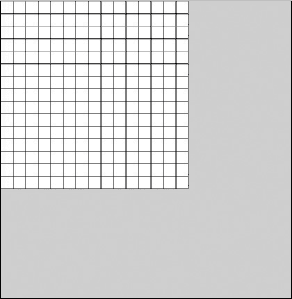

## 第十一章：细胞自动机

*我喜欢把加湿器和除湿器放在一个房间里，让它们互相对抗。*

—斯蒂文·赖特*


数学方程式是建模我们可以测量的事物的非常强大的工具；毕竟，方程式甚至帮助我们登上了月球。但是尽管它们非常强大，方程式在生物学和社会科学中的应用却有限，因为生物体并不是按照方程式来生长的。

生物在一个充满其他生物的环境中生长，并在一天中进行无数的互动。这些互动的网络决定了生物如何生长，而方程式通常无法捕捉这种复杂的关系。方程式可以帮助我们计算单个互动或反应所转换的能量或质量，但要模拟一个生物系统，例如，你需要重复计算几百或几千次。

幸运的是，有一种工具可以模拟细胞、生物和其他活系统如何根据环境生长和变化。由于它们与独立的生物有相似性，这些模型被称为*细胞自动机 (CAs)*。术语*自动机*指的是能够自主运行的事物。图 11-1 展示了使用计算机生成的两个细胞自动机示例。


*图 11-1：一个基础细胞自动机的例子，以及充满虚拟生物的屏幕*

我们在本章中将创建的 CAs 是由*单元格*组成的网格。每个细胞在 CA 中有多个*状态*（例如，开/关，生/死，或有色/空白）。细胞根据邻居的状态变化，这使得它们能够像活着一样生长和变化！

细胞自动机从上世纪 40 年代开始就成为研究对象，但它们真正起飞是在计算机变得普及之后。事实上，细胞自动机实际上只能通过计算机进行研究，因为尽管它们遵循非常简单的规则，比如“如果一个生物没有足够的邻居，它就会死”，这些规则只有在创建了数百或数千个这些生物并允许它们运行几百或几千代之后，才能产生有用的结果。

由于数学是研究模式的学科，细胞自动机这一数学主题充满了有趣的想法、编程挑战和无限的美丽输出可能！

### 创建一个细胞自动机

打开一个新的 Processing 草图，并命名为*cellularAutomata.pyde*。让我们从一个方格网开始，细胞将驻留在其中。我们可以轻松地画出一个 10×10 的方格网，每个方格的大小为 20，如清单 11-1 所示。

```py
*cellular Automata.pyde*
def setup():
    size(600,600)

def draw():
    for x in range(10):
 for y in range(10):
            rect(20*x,20*y,20,20)
```

*清单 11-1：创建一个方格网*

保存并运行这个草图，你应该能看到像图 11-2 中展示的那样的网格。


*图 11-2：一个 10 × 10 的网格*

然而，每次我们想要更大的单元格，或者一个维度不同的网格时，都需要更改一堆数字。因此，如果我们使用变量，稍后修改起来会更容易。由于`height`、`width` 和 `size` 这些关键字已经用于图形窗口，我们需要使用不同的变量名。列表 11-2 通过创建一个易于调整大小的网格来改进列表 11-1，同时这些单元格也易于调整大小——这一切都通过使用变量来实现。

```py
*cellular Automata.pyde*
GRID_W = 15
GRID_H = 15

#size of cell
SZ = 18
def setup():
    size(600,600)

def draw():
    for c in range(GRID_W): #the columns
        for r in range(GRID_H): #the rows
            rect(SZ*c,SZ*r,SZ,SZ)
```

*列表 11-2：使用变量改进的网格程序*

我们为网格的高度（`GRID_H`）和宽度（`GRID_W`）创建变量，使用大写字母表示这些是常量，并且它们的值不会变化。单元格的大小也是一个常量（目前如此），因此在声明其初始值时我们也将其大写（`SZ`）。现在，当你运行这段代码时，你应该能看到一个更大的网格，像图 11-3 中所示的那样。



*图 11-3：使用变量创建的更大的网格*

#### 编写一个单元格类

我们需要编写一个类，因为我们创建的每个单元格都需要有自己的位置、状态（“开”或“关”）、邻居（它旁边的单元格）等等。我们通过添加列表 11-3 中所示的代码来创建`Cell`类。

```py
*cellular Automata.pyde*
#size of cell
SZ = 18

class Cell:
    def __init__(self,c,r,state=0):
        self.c = c
        self.r = r
        self.state = state

    def display(self):
        if self.state == 1:
            fill(0) #black
        else:
            fill(255) #white
        rect(SZ*self.r,SZ*self.c,SZ,SZ)
```

*列表 11-3：创建`Cell`类*

单元格的初始`state`属性为 0（即关闭）。`__init__`方法中的`state=0`代码意味着如果我们没有指定状态，`state`将被设置为 0。`display()`方法只是告诉`Cell`对象如何在屏幕上显示自己。如果它是“开”的，单元格将显示为黑色；否则，显示为白色。此外，每个单元格都是正方形的，我们需要通过将其列和行号乘以它们的大小（`self.SZ`）来将单元格分开。

在`draw()`函数之后，我们需要写一个函数来创建一个空列表，用于存放我们的`Cell`对象，并使用嵌套循环将这些`Cell`对象添加到列表中，而不是像之前一样一个一个地绘制它们，如列表 11-4 所示。

```py
*cellular Automata.pyde*
def createCellList():
    '''Creates a big list of off cells with
    one on Cell in the center'''
 ➊ newList=[]#empty list for cells
    #populate the initial cell list
    for j in range(GRID_H):
     ➋ newList.append([]) #add empty row
        for i in range(GRID_W):
         ➌ newList [j].append(Cell(i,j,0)) #add off Cells or zeroes
    #center cell is set to on
 ➍ newList [GRID_H//2][GRID_W//2].state = 1
    return newList
```

*列表 11-4：创建单元格列表的函数*

首先，我们创建一个名为`newList`的空列表 ➊，并添加一个空列表作为一行 ➋，这个列表将填充`Cell`对象 ➌。然后，我们通过将行数和列数除以 2（双斜杠表示整数除法）来获取中心单元格的索引，并将该单元格的`state`属性设置为 1（即“开”） ➍。

在`setup()`中，我们将使用`createCellList()`函数，并将`cellList`声明为全局变量，这样它就可以在`draw()`函数中使用。最后，在`draw()`中，我们将循环遍历`cellList`中的每一行并更新它。新的`setup()`和`draw()`函数见列表 11-5。

```py
def setup():
    global cellList
    size(600,600)
    cellList = createCellList()

def draw():
    for row in cellList:
        for cell in row:
            cell.display()
```

*列表 11-5：用于创建网格的新的`setup()`和`draw()`函数*

然而，当我们运行这段代码时，我们得到的是一个显示窗口角落里有更小单元格的网格，像图 11-4 中所示的那样。


*图 11-4：尚未居中的单元格网格*

现在我们可以通过改变 15x15 网格的大小，来创建我们想要的任意大小的单元格列表。

#### 调整每个单元格的大小

为了调整单元格的大小，我们可以让 `SZ` 自动依赖于窗口的宽度。现在宽度是 600，所以我们可以按照列表 11-6 中的代码修改 `setup()` 函数。

```py
*cellular Automata.pyde*
def setup():
    global SZ,cellList
    size(600,600)
    SZ = width // GRID_W + 1
    cellList = createCellList()
```

*列表 11-6：调整单元格大小以自动适应显示窗口*

双斜杠 (`//`) 表示 *整数除法*，它只返回商的整数部分。现在，当你运行程序时，它应该会生成一个网格，除了中心有一个彩色单元格外，其他单元格都是空的，像在图 11-5 中那样。


*图 11-5：中心单元格为“开启”的网格*

请注意，当你像在列表 11-16 中那样将 `SZ` （单元格的大小）加 1 时，这段代码的效果会更好，因为如果不加，网格有时无法填满整个显示窗口。但你也可以选择不加。

#### 让 CA 生长

现在我们希望根据邻居的状态为“开启”的数量来改变单元格的状态。本部分灵感来源于斯蒂芬·沃尔夫拉姆（Stephen Wolfram）的《新科学》中描述的二维 CA。你可以在图 11-6 中看到这个 CA 的一个版本是如何生长的。


*图 11-6：细胞自动机的生长阶段*

在这个设计中，如果一个单元格有 *一个或四个* 开启的邻居，我们就让它变为开启状态（并保持开启）。

#### 将单元格放入矩阵中

很容易找到列表中该单元格前后紧挨的单元格，这样我们就能得到它左边和右边的邻居。那么，如何找到单元格上方和下方的邻居呢？为了更容易做到这一点，我们可以将单元格放入一个二维 *数组* 或 *矩阵* 中，这是一种每一行都是列表的列表。这样，如果一个单元格位于第 5 列，我们就知道它的“上方”和“下方”邻居也会在第 5 列。

在 `Cell` 类中，我们添加了一个名为 `checkNeighbors()` 的方法，使得单元格能够统计有多少邻居是开启状态的。如果开启邻居的数量是 1 或 4，那么该单元格将返回 1 表示“开启”。否则，它返回 0 表示“关闭”。我们从检查上方的邻居开始：

```py
    def checkNeighbors(self):
        if self.state == 1: return 1 #on Cells stay on
        neighbs = 0
        #check the neighbor above
        if cellList[self.r-1][self.c].state == 1:
            neighbs += 1
```

这段代码检查 `cellList` 中与当前单元格在同一列（`self.c`）但位于上一行（`self.r – 1`）的项。如果该项的 `state` 属性是 1，那么它是开启状态，我们将 `neighbs` 变量加 1。然后，我们需要对该单元格下面的邻居进行相同的操作，再对左侧和右侧的邻居进行相同操作。你能在这里看到简单的规律吗？

```py
cellList[self.r - 1][self.c + 0] #above
cellList[self.r + 1][self.c + 0] #below
cellList[self.r + 0][self.c - 1] #left
cellList[self.r + 0][self.c + 1] #right
```

我们只需要跟踪行号和列号的变化。我们只需检查四个方向，对于“左边一个，右边一个”邻居，依此类推：`[-1,0]`、`[1,0]`、`[0,-1]` 和 `[0,1]`。如果我们把它们叫做 `dr` 和 `dc`（*d*，或希腊字母*delta*，是表示变化的传统数学符号），我们就可以避免重复自己：

```py
*cellular Automata.pyde*
def checkNeighbors(self):
    if self.state == 1: return 1 #on Cells stay on
    neighbs = 0 #check the neighbors
    for dr,dc in [[-1,0],[1,0],[0,-1],[0,1]]:
        if cellList[self.r + dr][self.c + dc].state == 1:
            neighbs += 1
    if neighbs in [1,4]:
        return 1
    else:
        return 0
```

最后，如果邻居数量是 1 或 4，`state` 属性将被设置为 1。在 Python 中，`if neighbs in [1,4]` 等同于说 `if neighbs == 1 or neighbs == 4:`。

#### 创建单元格列表

到目前为止，我们通过在 `setup()` 中运行 `createCellList()` 函数并将输出赋值给 `cellList` 来创建了单元格列表，接着我们遍历了 `cellList` 中的每一行并更新了每个单元格。现在我们需要检查规则是否有效。围绕中心单元格的四个方格应该在下一步中改变状态。这意味着我们需要运行 `checkNeighbors()` 方法，然后显示结果。请按照以下方式更新你的 `draw()` 函数：

```py
def draw():
    for row in cellList:
        for cell in row:
         ➊ cell.state = cell.checkNeighbors()
            cell.display()
```

更新后的第 ➊ 行运行所有的 `checkNeighbors()` 代码，并根据结果设置单元格的开关状态。运行它，你应该会得到如下错误：

```py
IndexError: index out of range: 15
```

错误出现在检查右边邻居的那一行。果然，由于每行只有 15 个单元格，15 号单元格右边没有邻居是合乎逻辑的。

如果一个单元格右边没有邻居（意味着它的列号是 `GRID_W` 减一），显然我们不需要检查那个邻居，可以直接跳到下一个单元格。对于检查位于第 0 行的单元格上方的邻居也是如此，因为它们上面没有单元格。类似地，第 0 列的单元格没有左边的邻居，第 14 行（即 `GRID_H` 减 1）的单元格也没有下面的邻居。在示例 11-7 中，我们使用了一个有价值的 Python 技巧，称为*异常处理*，通过 `try` 和 `except` 关键字添加到 `checkNeighbors()` 方法中。

```py
    *cellular Automata.pyde*
    def checkNeighbors(self,cellList):
        if self.state == 1: return 1 #on Cells stay on
        neighbs = 0
        #check the neighbors
        for dr,dc in [[-1,0],[1,0],[0,-1],[0,1]]:
         ➊ try:
                if cellList[self.r + dr][self.c + dc].state == 1:
                    neighbs += 1
         ➋ except IndexError:
                continue
        if neighbs in [1,4]:
            return 1
        else:
            return 0
```

*示例 11-7：在 `checkNeighbors()` 中添加条件判断*

`try` 关键字 ➊ 字面意思是“尝试运行下一行代码”。在早期的错误信息中，我们遇到了一个 `IndexError`。我们使用 `except` 关键字 ➋ 来表示“如果遇到这个错误，就执行这个”。因此，如果我们遇到 `IndexError`，我们就继续进行下一轮循环。运行这段代码，你会得到一些有趣的结果，如图 11-7 所示。这显然与我们在图 11-6 中看到的不同。


*图 11-7：不是我们预期的结果！*

问题在于我们检查邻居并改变当前单元格的状态。然后，单元格的邻居在检查它们的邻居，但它们是在检查邻居的新状态。我们希望所有的单元格都检查它们的邻居，并将信息保存在一个新的列表中；然后，当所有单元格完成检查后，我们可以一次性更新整个网格。这就需要另一个列表来存储单元格，`newList`，它将在循环结束时替换掉`cellList`。

所以我们需要做的就是声明`newList`等于`cellList`，对吧？

```py
cellList = newList  #?
```

尽管这似乎合乎逻辑，但 Python 并没有像你可能期望的那样将`newList`的内容复制到`cellList`的原始内容中。它实际上是引用了`newList`，但是当你更改`newList`时，`cellList`也会被更改。

### Python 列表很奇怪

Python 的列表有一种奇怪的行为。假设你声明了一个列表，并将另一个列表设置为它的副本，然后更改第一个列表。你可能不期望第二个列表也会变化，但事实正是如此，正如这里所展示的那样：

```py
>>> a = [1,2,3]
>>> b = a
>>> b
[1, 2, 3]
 >>> a.append(4)
>>> a
[1, 2, 3, 4]
>>> b
[1, 2, 3, 4]
```

如你所见，我们创建了列表`a`，然后将列表`a`的值赋给了列表`b`。当我们更改列表`a`时，没有更新列表`b`，但是 Python 也会更改列表`b`！

#### 列表索引符号

确保在更新一个列表时不会意外更新另一个列表的一种方法是使用索引符号。将列表`a`的所有内容赋给列表`b`应该能够避免这种情况发生：

```py
>>> a = [1,2,3]
>>> b = a[::]
>>> b
[1, 2, 3]
>>> a.append(4)
>>> a
[1, 2, 3, 4]
>>> b
[1, 2, 3]
```

这里，我们使用`b = a[::]`来表示“将列表`a`中的所有内容赋给变量`b`”，而不是简单地声明列表`a`等于列表`b`。这样，两个列表就不会相互关联。

在声明`SZ`之后，我们需要添加以下代码行来声明`generation`变量的初始值，这将追踪我们正在查看的代数：

```py
generation = 0
```

我们将在更新代码的最后使用索引符号来避免列表引用问题。让我们在`draw()`后创建一个新的`update()`函数，这样所有更新将会在那个独立的函数中完成。示例 11-8 展示了`setup()`和`draw()`函数应该如何编写。

```py
*cellular Automata.pyde*
def setup():
    global SZ, cellList
    size(600,600)
    SZ = width // GRID_W + 1
    cellList = createCellList()

def draw():
    global generation,cellList
    cellList = update(cellList)
    for row in cellList:
        for cell in row:
            cell.display()
 generation += 1
    if generation == 3:
        noLoop()

def update(cellList):
    newList = []
    for r,row in enumerate(cellList):
        newList.append([])
        for c,cell in enumerate(row):
            newList[r].append(Cell(c,r,cell.checkNeighbors()))
    return newList[::]
```

*示例 11-8：检查更新是否生效，并在三代后停止*

我们在`setup()`函数中创建第一次的`cellList`，然后将其声明为全局变量，以便在其他函数中使用。在`draw()`函数中，我们使用`generation`变量来表示我们要检查的代数（在这个例子中是三代）；然后我们调用来更新`cellList`。我们像之前一样绘制单元格，使用`display()`方法，接着递增`generation`并检查它是否达到了我们想要的代数。如果达到了，内建的 Processing 函数`noLoop()`将停止循环。

我们使用 `noLoop()` 来关闭无限循环，因为我们只想绘制给定数量的世代。如果你注释掉它，程序将继续运行！图 11-8 显示了三代之后 CA 的样子。


*图 11-8：一个正常工作的 CA！*

使用变量来定义网格大小的好处是，我们可以通过简单地改变 `GRID_W` 和 `GRID_H` 变量来大幅改变 CA，如下所示：

```py
GRID_W = 41
GRID_H = 41
```

如果我们将世代数增加到 13（在当前显示 `if generation == 3` 的行中），输出结果应该像图 11-9 那样。


*图 11-9：我们的 CA 在更高级别上的样子，带有网格（左）和不带网格（右）*

要去掉 CA 中空细胞周围的网格，只需在 `setup()` 函数中添加这一行：

```py
    noStroke()
```

这应该会关闭方格的轮廓，但填充颜色仍会显示，像图 11-9 那样。

到目前为止，我们做了很多工作！我们创建了二维列表，填充了细胞，并根据简单的规则打开了某些细胞。然后我们更新了这些细胞并展示了它们。CA 就这样不断生长！

练习 11-1：手动生长 CA

使用你在第十章中学到的 `keyPressed()` 函数手动让 CA 生长。

#### 让你的 CA 自动生长

如果你希望 CA 从第 0 级循环到最大世代数（你为窗口选择适当的数字），只需将 `draw()` 函数更改为清单 11-9 中所示的内容。

```py
*cellular Automata.pyde*
def draw():
    global generation,cellList
 ➊ frameRate(10)
    cellList = update(cellList)
    for row in cellList:
        for cell in row:
            cell.display()
    generation += 1
 ➋ if generation == 30:
        generation = 1
        cellList = createCellList()
```

*清单 11-9: 使 CA 自动生长和再生*

为了减慢动画的速度，我们使用了 Processing 内置的 `frameRate()` 函数 ➊。默认情况下是每秒 60 帧，所以我们将其减慢至 10 帧。然后我们告诉程序，如果 `generation` 变量达到 30 ➋（你可以将其更改为其他数字），就重置 `generation` 为 1，并创建一个新的 `cellList`。现在你应该能够根据需要观看 CA 以任何速度生长。更改规则，看看这如何改变 CA。你也可以更改颜色！

我们刚刚定义了一个简单的规则（如果一个细胞有 1 个或 4 个邻居，它是“开启”的），并编写了一个程序，将这个规则应用到成千上万的细胞上！结果看起来像一个活的、不断生长的有机体。接下来，我们将把代码扩展到一个著名的元胞自动机（CA），其中虚拟有机体可以移动、成长并死亡！

### 玩《生命游戏》

在 1970 年出版的《科学美国人》杂志中，数学科普作家马丁·加德纳（Martin Gardner）引起了人们对一个奇怪而美妙的游戏的关注，其中细胞的生死取决于它们有多少个邻居。这款游戏由英国数学家约翰·康威（John Conway）发明，具有三个简单的规则：

1.  如果一个活细胞有少于两个活邻居，它会死亡。

1.  如果一个活细胞有超过三个活邻居，它会死亡。

1.  如果一个死细胞有恰好三个活邻居，它将复生。

通过这样一套简单的规则，这个游戏变得非常复杂也令人惊讶。1970 年，大多数人只能通过棋盘上的跳棋来可视化这个游戏，并且一个世代的计算可能需要很长时间。幸运的是，我们有计算机，而我们刚刚编写的元胞自动机代码已经包含了大部分创建此游戏所需的 Python 代码。保存我们到目前为止编写的元胞自动机文件，然后用不同的名字保存它，例如 *生命游戏*。

在这个游戏中，我们的细胞也将有对角线邻居。这意味着我们需要在`dr,dc`行中添加四个新值。列表 11-10 展示了你需要对`checkNeighbors()`代码进行的更改。

```py
    *GameOfLife.pyde*
    def checkNeighbors(self):
        neighbs = 0  #check the neighbors
     ➊ for dr,dc in [[-1,-1],[-1,0],[-1,1],[1,0],[1,-1],[1,1],[0,-1],[0,1]]:
            try:
                if cellList[self.r + dr][self.c + dc].state == 1:
                    neighbs += 1
            except IndexError:
                continue
     ➋ if self.state == 1:
            if neighbs in [2,3]:
                return 1
            return 0
        if neighbs == 3:
            return 1
        return 0
```

*列表 11-10：修改 `checkNeighbors()` 代码以包括对角线邻居*

首先，我们添加四个值 ➊ 来检查对角线邻居：`[-1,-1]` 表示左上方的邻居，`[1,1]` 表示右下方的邻居，依此类推。然后我们告诉程序，如果细胞位于 ➋ 上，检查它是否有两个或三个也处于打开状态的邻居。如果有，我们告诉程序返回 1，如果没有，则返回 0。否则，如果细胞关闭，我们告诉它检查是否有三个邻居是开启的。如果是，返回 1；如果不是，返回 0。

然后我们将活细胞随机放置在网格中，因此我们需要从 Python 的 `random` 模块导入 `choice()` 函数。将这一行添加到程序的顶部：

```py
from random import choice
```

然后我们使用 `choice()` 函数随机选择一个新的 `Cell` 是开还是关。所以我们只需要将 `createCellList()` 函数中的 `append` 行更改为以下内容：

```py
newList [j].append(Cell(i,j,choice([0,1])))
```

现在，我们不再需要前一个文件中的生成代码。`draw()`函数中的剩余代码如下所示：

```py
def draw():
    global cellList
    frameRate(10)
    cellList = update(cellList)
    for row in cellList:
        for cell in row:
            cell.display()
```

运行这段代码，你将看到一场充满活力的动态游戏，其中生物在移动、变形、分裂，并与其他生物互动，正如图 11-10 所展示的那样。


*图 11-10：生命游戏正在运行！*

有趣的是，细胞的“云”如何变形、移动并与其他云（家族？群体？）碰撞。一些生物在屏幕上游荡，直到最终，网格将稳定到某种平衡状态。图 11-11 展示了这种平衡的示例。


*图 11-11：进入稳定状态的生命游戏示例*

在这个平衡状态的示例中，某些形状看起来稳定且不动，而其他形状则陷入了重复的模式中。

### 基本元胞自动机

这个最后的元胞自动机非常酷，涉及了一些额外的数学，但它仍然是一个简单的模式，只不过是扩展了的（虽然只是一个维度的扩展，这就是它为什么叫做“基本元胞自动机”）。我们从一行细胞开始，并将中间细胞的状态设置为 1，如图 11-12 所示。


*图 11-12：一个基本元胞自动机的第一行*

这段代码很容易编写。创建一个新的 Processing 草图并命名为 *elementaryCA.pyde*。绘制第一行单元格的代码如 清单 11-11 所示。

```py
   *elementaryCA.pyde*
➊ #CA variables
   w = 50
   rows = 1
   cols = 11

   def setup():
       global cells
       size(600,600)
       #first row:
    ➋ cells = []
       for r in range(rows):
           cells.append([])
           for c in range(cols):
               cells[r].append(0)
    ➌ cells[0][cols//2] = 1

   def draw():
       background(255) #white
       #draw the CA
       for i, cell in enumerate(cells): #rows
         for j, v in enumerate(cell): #columns
          ➍ if v == 1:
                 fill(0)
            else: fill(255)
          ➎ rect(j*w-(cols*w-width)/2,w*i,w,w)
```

*清单 11-11：绘制初等 CA 的第一行（代数）*

首先，我们声明一些重要变量 ➊，例如每个单元格的大小和我们的 CA 的行列数。接下来，我们开始创建 `cells` 列表 ➋。我们在 `cells` 中创建 `rows` 行，并在每个列表中附加 `cols` 个 0。在行中，我们将中间的单元格设置为 1（或开） ➌。在 `draw()` 函数中，我们使用 `enumerate` 循环遍历行（很快就会有多行！）和列。我们检查元素是否为 1，如果是，则将其涂成黑色 ➍。否则，将其涂成白色。最后，我们绘制单元格的方框 ➎。x 值看起来有点复杂，但这只是确保 CA 始终居中。

当你运行这段代码时，你应该会看到 图 11-12 中展示的内容：一排单元格，其中中心有一个“开”的单元格。CA 下一行单元格的状态将取决于我们为每个单元格及其两个邻居设定的规则。总共有多少种可能性？每个单元格有两种可能的状态（1 或 0，或者“开”或“关”），因此左邻居、中心单元格和右邻居各有两种状态。这就意味着 2 × 2 × 2 = 8 种可能性。所有的组合展示在 图 11-13 中。


*图 11-13：单元格及其两个邻居的所有可能组合*

第一种可能性是中心单元格为开且两个邻居单元格也为开。接下来的可能性是中心单元格为开，左邻居为开，右邻居为关——以此类推。这个顺序非常重要。（你看出规律了吗？）我们如何将这些可能性描述给计算机程序呢？我们可以像下面这样写出八个条件语句：

```py
if left == 1 and me == 1 and right == 1:
```

但是有一种更简单的方法。在《*新科学的种类*》中，斯蒂芬·沃尔夫拉姆根据三个单元格所代表的二进制数字为这些可能性分配了数字。记住，1 是开，0 是关，你可以看到 111 在二进制中是 7，110 是 6，以此类推，如 图 11-14 所示。


*图 11-14：八种可能性的编号方法*

现在我们已经为每种可能性编号，我们可以创建一个规则集——即一个列表，其中包含在下一代中处理每种可能性的规则。请注意，这些数字就像列表的索引，只不过是反过来的。我们可以很容易地解决这个问题。我们可以随机地或根据某些计划为每种可能性分配一个结果。图 11-15 展示了一个结果集。


*图 11-15：为 CA 中每种可能性分配的结果集*

每个可能性下方的框表示结果，或者是 CA 下一代中单元格的状态。左侧“可能性 7”下的白色框表示“如果单元格打开且两个邻居都打开，则在下一代中它会关闭。”同样，对于接下来的两个可能性（在我们的 CA 中尚不存在）：结果是“关闭”。如图 11-12 所示，我们有很多“关闭”单元格被“关闭”单元格包围，这就是图 11-14 右侧显示的可能性：三个白色方块。在这种情况下，中间的单元格将在下一代中关闭。我们还有一个“打开”的单元格被两个“关闭”的单元格包围（可能性 5）。在下一代中，单元格将会打开。我们将使用 0 和 1 来表示我们的`ruleset`列表，如图 11-16 所示。


*图 11-16：将生成下一行规则放入列表中*

我们将把所有这些数字收集到一个名为`ruleset`的列表中，我们将在`setup()`函数之前添加这个列表：

```py
ruleset = [0,0,0,1,1,1,1,0]
```

可能性顺序很重要，因为这个规则集被称为“规则 30”（00011110 在二进制中是 30）。我们的任务是根据规则创建下一行。让我们创建一个`generate()`函数，它查看第一行并生成第二行，然后查看第二行生成第三行，以此类推。添加列表 11-12 中显示的代码。

```py
   *elementaryCA.pyde*
   #CA variables
   w = 50
➊ rows = 10
   cols = 100
   --snip--
   ruleset = [0,0,0,1,1,1,1,0] #rule 30

➋ def rules(a,b,c):
       return ruleset[7 - (4*a + 2*b + c)]

   def generate():
       for i, row in enumerate(cells): #look at first row
           for j in range(1,len(row)-1):
               left = row[j-1]
               me = row[j]
               right = row[j+1]
               if i < len(cells) - 1:
                    cells[i+1][j] = rules(left,me,right)
       return cells
```

*列表 11-12：编写`generate()`函数以生成 CA 中的新行*

首先，通过更新行和列的数量来增大 CA ➊。接下来，我们创建`rules()`函数 ➋，它接受三个参数：左邻居的数字、当前单元格的数字和右邻居的数字。该函数检查`ruleset`并返回下一代中单元格的值。我们利用二进制数字，行`4*a + 2*b + c`将“1,1,1”转换为 7，将“1,1,0”转换为 6，依此类推。然而，正如你从图 11-15 中回忆的那样，索引是反向排序的，因此我们从 7 中减去总数，以获得`ruleset`的正确索引。

在`setup()`函数的末尾添加以下行：

```py
cells = generate()
```

这将创建完整的 CA，而不仅仅是第一行。当你运行此代码时，你应该能看到使用“规则 30”制作的前 10 行 CA，如图 11-17 所示。


*图 11-17：规则 30 的前 10 行*


*图 11-18：规则 30 的更多内容*

程序正在从顶部开始，逐行生成下一行，依据我们在`ruleset`中给定的规则。如果我们继续执行会怎样呢？将行数和列数改为 1000，将每个单元格的宽度（`w`）设为 3。在`setup()`函数中添加`noStroke()`来去掉单元格的轮廓，然后运行草图。你应该能看到图 11-18 中的内容。

规则 30 是一个迷人的设计，因为它既不完全随机，也不完全规则。规则 73 也很酷；实际上，一位名叫 Fabienne Serriere 的女士将这一规则编程到编织机上，创造出带有该图案的围巾，如图 11-19 所示。你可以从*[`knityak.com/`](https://knityak.com/)*购买带有这一及其他算法生成规则的围巾。


*图 11-19：一条设计为元胞自动机的围巾：规则 73！*

练习 11-2：改变规则集

将`ruleset`改为数字 90 的二进制形式。结果的元胞自动机（CA）是什么样子？提示：它是一个分形。

练习 11-3：放大与缩小

使用你在第十章中学到的`keyPressed()`函数，通过上下箭头键来改变宽度变量`w`的值。这应该能让你在元胞自动机（CA）中放大和缩小！

### 总结

在本章中，你学习了如何使用 Python 创建元胞自动机，或根据特定规则独立运作的单元格。我们编写程序使这些单元格在巨大的网格中遵循某些规则并自我更新，一代代产生出出乎意料的美丽设计和令人惊讶的生命般的行为。

在下一章，我们将创建虚拟生物，它们将为我们解决问题！这些生物将通过不断进化出更好的解决方案，来猜测一个秘密短语或在多个城市间找到最短的路线。
