## 第十二章：使用遗传算法解决问题

*Steve: 我们迷路了。*

Mike: 我们有多迷路？*


当很多人想到数学时，他们会想到“石刻般”的方程式和运算，答案要么是对的，要么是错的。他们可能会惊讶地发现，在我们代数探索中，已经进行了很多的猜测和验证。

在本章中，你将学习以一种间接的方式破解密码和隐藏信息。这有点像第四章中的“猜测和验证”方法，我们只是将一堆整数代入方程，如果其中任何一个让方程成立，我们就将其打印出来。这次，我们将猜测一堆值，而不仅仅是一个。这不是解决问题的最优雅方式，但有了计算机，有时候蛮力方法反而是最有效的。

为了找出我们的秘密短语，我们生成猜测，然后根据它们与目标的匹配程度进行评分。但这就是我们与猜测和验证方法不同的地方：我们保留最好的猜测，并随机地反复变异，直到揭开谜底。程序不知道哪些字母是对的，哪些字母是错的，但通过不断变异我们目前为止做出的最佳猜测，我们会越来越接近正确答案。虽然这种方法现在看起来可能不太有希望，但你会发现它能出奇地迅速破解密码。这种方法被称为 *遗传算法*，计算机科学家使用它基于自然选择和进化生物学理论来寻找问题的解决方案。它的灵感来自于适应和变异的生物体，以及它们如何建立微小的优势，正如我们在第九章的类章节中看到的羊模型一样。

然而，对于更复杂的问题，随机变异不足以解决我们的难题。在这些情况下，我们加入 *交叉*，用来结合最适应的个体（或最佳猜测），以提高破解密码的可能性，就像最适应的生物更有可能将它们的遗传物质组合传递给后代一样。除了评分之外，所有这些活动都将相当随机，因此，可能会让人惊讶的是，我们的遗传算法竟然能这么有效。

### 使用遗传算法猜测短语

打开 IDLE，创建一个名为 *geneticQuote.py* 的新文件。与在第四章中猜数字不同，这个程序试图猜测一个秘密短语。我们只需要告诉程序它猜对了多少个字符——而不是字符的位置或是哪一个字符，只需告诉它猜对了多少个字符。

我们的程序将能够比猜测短密码做得更好。

#### 编写 MAKELIST() 函数

为了了解这个如何工作，让我们创建一个目标短语。这里有一句我儿子从漫画《火影忍者》中想出来的长句子：

```py
target = "I never go back on my word, because that is my Ninja way."
```

在英语中，我们可以选择一堆字符：小写字母、大写字母、空格和一些标点符号。

```py
characters = " abcdefghijklmnopqrstuvwxyzABCDEFGHIJKLMNOPQRSTUVWXYZ.',?!"
```

让我们创建一个名为`makeList()`的函数，它将随机创建一个与`target`长度相同的字符列表。稍后，当我们尝试猜测目标短语时，我们将通过逐个字符地与目标进行比较来评分。较高的分数意味着猜测更接近目标。然后，我们将随机更改猜测中的一个字符，看看是否能提高其分数。看起来这种随机方法似乎不可能让我们得到确切的目标短语，但它会成功。

首先，导入`random`模块并编写`makeList()`函数，如列表 12-1 所示。

```py
*genetic
Quote.py*
import random

target = "I never go back on my word, because that is my Ninja way."
characters = " abcdefghijklmnopqrstuvwxyzABCDEFGHIJKLMNOPQRSTUVWXYZ.',?!"

def makeList():
    '''Returns a list of characters the same length
    as the target'''
    charList = [] #empty list to fill with random characters
    for i in range(len(target)):
        charList.append(random.choice(characters))
    return charList
```

*列表 12-1：编写`makeList()`函数以创建一个与目标长度相同的随机字符列表*

在这里，我们创建一个名为`charList`的空列表，并根据目标中的字符数量循环。每次循环时，程序将从`characters`中随机选取一个字符放入`charList`中。循环完成后，返回`charList`。让我们测试它，以确保它能正常工作。

#### 测试 MAKE LIST()函数

首先，让我们找出目标的长度，并检查我们的随机列表是否具有相同的长度：

```py
>>> len(target)
57
>>> newList = makeList()
>>> newList
['p', 'H', 'Z', '!', 'R', 'i', 'e', 'j', 'c', 'F', 'a', 'u', 'F', 'y', '.',
'w', 'u', '.', 'H', 'W', 'w', 'P', 'Z', 'D', 'D', 'E', 'H', 'N', 'f', ' ',
'W', 'S', 'A', 'B', ',', 'w', '?', 'K', 'b', 'N', 'f', 'k', 'g', 'Q', 'T',
'n', 'Q', 'H', 'o', 'r', 'G', 'h', 'w', 'l', 'l', 'W', 'd']
>>> len(newList)
57
```

我们测量了`target`列表的长度，它有 57 个字符。我们的新列表长度也为 57 个字符。为什么要创建一个列表而不是字符串呢？我们创建列表是因为有时列表比字符串更容易操作。例如，你不能简单地在字符串中用另一个字符替换一个字符。但在列表中，你可以做到这一点，就像你在这里看到的那样：

```py
>>> a = "Hello"
>>> a[0] = "J"
Traceback (most recent call last):
  File "<pyshell#16>", line 1, in <module>
    a[0] = "J"
TypeError: 'str' object does not support item assignment
>>> b = ["H","e","l","l","o"]
>>> b[0] = "J"
>>> b
['J', 'e', 'l', 'l', 'o']
```

在这个例子中，当我们尝试用`"J"`替换`"Hello"`字符串中的第一个项时，Python 不允许我们这样做，并且会报错。然而，使用列表进行相同的操作就没有问题。

在我们的*geneticQuote.py*程序中，我们希望以字符串形式查看随机生成的引号，因为这样更容易阅读。以下是如何使用 Python 的`join()`函数将列表打印为字符串：

```py
>>> print(''.join(newList))
pHZ!RiejcFauFy.wu.HWwPZDDEHNf WSAB,w?KbNfkgQTnQHorGhwllWd
```

这些都是`newList`中的字符，但它们是字符串形式。看起来不像是一个有前景的开始！

#### 编写 SCORE()函数

现在让我们编写一个名为`score()`的函数，通过将每个猜测逐个字符与目标进行比较，来为每个猜测打分，如列表 12-2 所示。

```py
*genetic
Quote.py*
def score(mylist):
    '''Returns one integer: the number of matches with target'''
    matches = 0
    for i in range(len(target)):
        if mylist[i] == target[i]:
            matches += 1
    return matches
```

*列表 12-2：编写`score()`函数以为猜测打分*

`score()`函数接受我们传入的列表（`mylist`）中的每个项，并检查`mylist`的第一个字符是否与`target`列表的第一个字符匹配。然后，函数检查第二个字符是否匹配，以此类推。对于每个匹配的字符，我们将`matches`增加 1。最终，函数返回一个单一的数字，而不是正确的字符，因此我们实际上并不知道*哪些*字符是正确的！

我们的得分是多少？

```py
>>> newList = makeList()
>>> score(newList)
0
```

我们的第一次猜测完全失败。一个匹配都没有！

#### 编写 MUTATE()函数

现在我们将编写一个函数，通过随机更改一个字符来突变列表。这将允许我们的程序“猜测”直到接近我们尝试猜测的目标短语。代码见 Listing 12-3。

```py
*genetic
Quote.py*
def mutate(mylist):
    '''Returns mylist with one letter changed'''
    newlist = list(mylist)
 new_letter = random.choice(characters)
    index = random.randint(0,len(target)-1)
    newlist[index] = new_letter
    return newlist
```

*Listing 12-3：编写用于更改列表中一个字符的`mutate()`函数*

首先，我们将列表中的元素复制到一个名为`newlist`的变量中。然后我们从`characters`列表中随机选择一个字符，作为将替换现有字符的新字母。我们随机选择一个 0 到目标长度之间的数字，作为替换字母的索引。然后我们将`newlist`中该索引位置的字符设置为新字母。这个过程在循环中反复进行。如果新列表的得分更高，它将成为“最佳”列表，最佳列表会继续突变，希望进一步提高其得分。

#### 生成随机数

在所有函数定义之后启动程序时，我们通过调用`random.seed()`来确保随机性。调用`random.seed()`会将随机数生成器重置为当前时间。然后我们创建一个字符列表，由于第一个列表是目前为止最好的列表，所以我们将其声明为最佳列表。它的得分将是最佳得分。

```py
*genetic
Quote.py*
random.seed()
bestList = makeList()
bestScore = score(bestList)
```

我们跟踪我们已经做了多少次猜测：

```py
guesses = 0
```

现在我们开始一个无限循环，将突变`bestList`以生成新的猜测。我们计算其得分，并增加`guesses`变量：

```py
while True:
    guess = mutate(bestList)
    guessScore = score(guess)
    guesses += 1
```

如果新猜测的得分小于或等于目前为止的最佳得分，程序可以“继续”，如下面所示。那意味着它会回到循环的开头，因为它不是一个好的猜测，我们不需要对其做任何其他处理。

```py
    if guessScore <= bestScore:
        continue
```

如果我们仍然在循环中，那意味着猜测已经足够好，可以输出了。我们也打印出它的得分。我们可以打印出列表（作为字符串）、得分以及进行了多少次总猜测。如果新猜测的得分等于目标的长度，那么我们就解决了这个引用，可以跳出循环：

```py
    print(''.join(guess),guessScore,guesses)
    if guessScore == len(target):
        break
```

否则，新猜测必须比目前为止的最佳列表更好，但还不完美，所以我们可以将其声明为最佳列表并保存其得分作为最佳得分：

```py
    bestList = list(guess)
    bestScore = guessScore
```

Listing 12-4 展示了*geneticQuote.py*程序的完整代码。

```py
*genetic Quote.py*
import random

target = "I never go back on my word, because that is my Ninja way."
characters = " abcdefghijklmnopqrstuvwxyzABCDEFGHIJKLMNOPQRSTUVWXYZ.',?!"

#function to create a "guess" list of characters the same length as target
def makeList():
    '''Returns a list of characters the same length
    as the target'''
    charList = [] #empty list to fill with random characters
    for i in range(len(target)):
        charList.append(random.choice(characters))
    return charList

#function to "score" the guess list by comparing it to target
def score(mylist):
    '''Returns one integer: the number of matches with target'''
    matches = 0
    for i in range(len(target)):
        if mylist[i] == target[i]:
            matches += 1
    return matches

#function to "mutate" a list by randomly changing one letter
def mutate(mylist):
    '''Returns mylist with one letter changed'''
    newlist = list(mylist)
    new_letter = random.choice(characters)
    index = random.randint(0,len(target)-1)
    newlist[index] = new_letter
    return newlist

#create a list, set the list to be the bestList
#set the score of bestList to be the bestScore
 random.seed()
bestList = makeList()
bestScore = score(bestList)

guesses = 0

#make an infinite loop that will create a mutation
#of the bestList, score it
while True:
    guess = mutate(bestList)
    guessScore = score(guess)
    guesses += 1

#if the score of the newList is lower than the bestList,
#"continue" on to the next iteration of the loop
    if guessScore <= bestScore:
        continue

#if the score of the newlist is the optimal score,
#print the list and break out of the loop
    print(''.join(guess),guessScore,guesses)
    if guessScore == len(target):
        break

#otherwise, set the bestList to the value of the newList
#and the bestScore to be the value of the score of the newList
    bestList = list(guess)
    bestScore = guessScore
```

*Listing 12-4：* *geneticQuote.py* *程序的完整代码*

现在当我们运行这个时，我们会得到一个非常快速的解决方案，并打印出所有改善得分的猜测。

```py
i.fpzgPG.'kHT!NW WXxM?rCcdsRCiRGe.LWVZzhJe zSzuWKV.FfaCAV 1 178
i.fpzgPG.'kHT!N  WXxM?rCcdsRCiRGe.LWVZzhJe zSzuWKV.FfaCAV 2 237
i.fpzgPG.'kHT!N  WXxM?rCcdsRCiRGe.LWVZzhJe zSzuWKV.FfwCAV 3 266
i fpzgPG.'kHT!N  WXxM?rCcdsRCiRGe.LWVZzhJe zSzuWKV.FfwCAV 4 324
--snip--
I nevgP go back on my word, because that is my Ninja way. 55 8936
I neveP go back on my word, because that is my Ninja way. 56 10019
I never go back on my word, because that is my Ninja way. 57 16028
```

这个输出显示最终得分为 57，总共进行了 16,028 次猜测才能完全匹配该引用。请注意输出的第一行，达到得分 1 时需要进行 178 次猜测！有更高效的方法来猜测一个引用，但我想通过一个简单的例子介绍基因算法的概念。重点是展示如何通过评分猜测并随机突变“目前最佳猜测”来在非常短的时间内得到准确结果。

现在，你可以利用这种通过打分和变异成千上万的随机猜测的思路，来解决其他问题。

### 求解旅行商问题 (TSP)

我的一个学生对猜测名言的程序不感兴趣，因为“我们已经知道名言是什么了。”所以让我们使用遗传算法来解决一个我们还不知道答案的问题。*旅行商问题*，简称*TSP*，是一个古老的难题，容易理解，但解决起来却非常困难。一个销售员需要访问给定的多个城市，目标是找到距离最短的路线。听起来简单吧？而且通过计算机，我们应该可以通过程序运行所有可能的路线并测量它们的距离，对吧？

事实证明，当城市数量超过一定程度时，即使是今天的超级计算机，计算复杂度也变得太大了。让我们看看在有六个城市时，有多少条可能的路线，如图 12-1 所示。

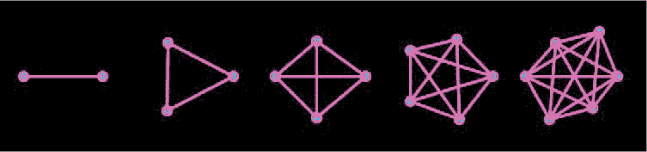

*图 12-1：在`n`城市之间的路径数量，`n`从 2 到 6 的可能路线。*

当只有两三个城市时，只有一条可能的路线。加上第四个城市后，它可以在之前的三个城市之间访问，因此将前一个步骤的路线数量乘以 3。所以，在四个城市之间，有三条可能的路线。再加上第五个城市，它可以在之前的四个城市之间访问，因此数量是前一步的四倍，结果是 12 条可能的路线。看到规律了吗？在*n*个城市之间，有

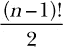

所以，在 10 个城市之间有 181,440 条可能的路线。在 20 个城市之间，有 60,822,550,204,416,000 条路线。超过一万亿之后呢？即使一台计算机每秒能检查一百万条路线，计算仍然需要将近 2000 年。这对于我们的目的来说太慢了。肯定有更好的方法。

#### 使用遗传算法

类似于我们的名言猜测程序，我们将创建一个包含路线“基因”的对象，然后通过路线的短暂程度来为其打分。最佳路线随后将被随机变异，我们会对其变异进行评分。我们可以将一堆“最佳路线”拼接在一起，生成它们的“后代”，然后为后代打分。这个探索的最佳部分是我们*并不知道*答案。我们可以给程序一组城市及其位置，或者仅让它随机绘制城市并尝试优化路线。

打开一个新的 Processing 草图，并命名为*travelingSalesperson.pyde*。我们首先需要创建一个`City`对象。每个城市将有自己的 x 和 y 坐标以及一个用于标识它的编号。这样，我们就可以通过一个城市编号列表来定义一条路线。例如，[5,3,0,2,4,1]表示从城市 5 出发，前往城市 3，再到城市 0，依此类推。规则是销售员必须最终返回到第一个城市。Listing 12-5 显示了`City`类。

```py
*travelingSales person.pyde*
class City:
    def __init__(self,x,y,num):
        self.x = x
        self.y = y
        self.number = num #identifying number

    def display(self):
        fill(0,255,255) #sky blue
        ellipse(self.x,self.y,10,10)
        noFill()
```

*清单 12-5：编写`City`类以供`travelingSalesperson.pyde`程序使用*

在初始化`City`时，我们获取 x 和 y 坐标，并为每个`City`对象赋予它自己的（`self`）x 和 y 分量。我们还获取一个数字，这个数字是城市的标识号。在`display()`方法中，我们选择一个颜色（在这种情况下是天蓝色），并在该位置绘制一个椭圆。在用`noFill()`函数绘制城市后，我们关闭填充，因为其他形状不需要填充颜色。

让我们确保它能够正常工作。我们创建`setup()`函数，声明一个显示窗口的大小，并创建`City`类的一个实例。记住，我们必须为它提供两个坐标的位置和一个标识编号，如在清单 12-6 中所示。

```py
def setup():
    size(600,600)
    background(0)
    city0 = City(100,200,0)
    city0.display()
```

*清单 12-6：编写`setup()`函数以创建一个城市*

运行这个，你将看到你的第一座城市（见图 12-2）！

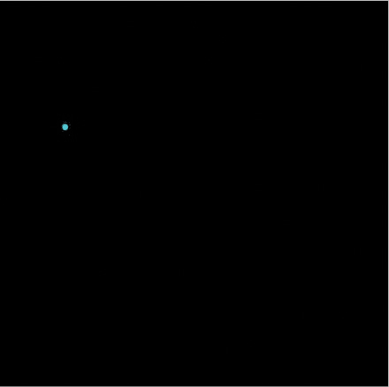

*图 12-2：第一座城市*

可能有助于让城市在其上方显示编号。要做到这一点，在城市的`display()`方法中，`noFill()`之前添加以下代码：

```py
        textSize(20)
        text(self.number,self.x-10,self.y-10)
```

我们使用 Processing 内置的`textSize()`函数声明文本的大小。然后，我们使用`text()`函数告诉程序要打印的内容（城市的编号）以及打印位置（离城市左侧和上方 10 个像素）。在创建城市时，让我们开始一个`cities`列表，并在随机位置将更多城市添加到屏幕上。为了使用`random`模块中的方法，我们需要在文件顶部导入`random`：

```py
import random
```

现在我们可以像在清单 12-7 中一样更新我们的`setup()`函数。

```py
*travelingSalesperson.pyde*
cities = []

def setup():
    size(600,600)
    background(0)
    for i in range(6):
        cities.append(City(random.randint(50,width-50),
                           random.randint(50,height-50),i))

    for city in cities:
        city.display()
```

*清单 12-7：编写`setup()`函数以创建六个随机城市*

在`setup()`函数中，我们添加了一个循环，执行六次。它在屏幕上添加一个位置随机的`City`对象，离边缘 50 个单位。下一个循环遍历`cities`列表中的所有元素，并显示每一个。运行这个，你将看到六个城市在随机位置显示，每个城市都标有其 ID 号，如在图 12-3 中所示。

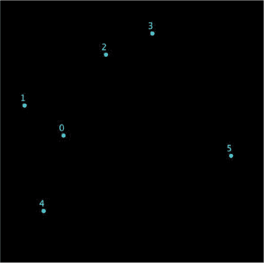

*图 12-3：六个城市，标有它们的编号*

现在让我们考虑一下城市之间的路线。我们将`City`对象（包含它们的位置和编号）放入`cities`列表中，最终，这个数字列表（我们的“遗传物质”）将由按某种顺序排列的城市编号组成。因此，`Route`对象也需要一个随机的数字列表：一个包含所有城市编号的随机顺序。当然，数字的范围将从 0 到城市数量减去 1。我们不想在每次想要更改城市数量时就到处修改代码中的数字，因此我们将为城市数量创建一个变量。将这一行放在文件的开头，在`City`类之前：

```py
N_CITIES = 10
```

为什么 `N_CITIES` 要全大写？在整个代码中，我们不会改变城市的数量。因此，它实际上不是一个变量，而是一个常量。在 Python 中，常量的名称通常会大写，以便与变量区分开。这样做不会改变 Python 对这些常量的处理方式；即使是大写名称的变量，也仍然可以被修改。所以要小心。

我们将在需要使用城市总数的地方使用 `N_CITIES`，而且我们只需要改变一次这个值！将 Listing 12-8 中显示的代码放在 `City` 类之后。

```py
class Route:
    def __init__(self):
        self.distance = 0
        #put cities in a list in order:
        self.cityNums = random.sample(list(range(N_CITIES)),N_CITIES)
```

*Listing 12-8: `Route` 类*

首先，我们将路线的距离（或长度，但 `length` 是 Processing 中的关键字）设置为零，然后我们创建一个 `cityNums` 列表，将城市的编号按随机顺序排列，以构成这条路线。

你可以使用 `random` 模块的 `sample()` 函数，给 Python 一个列表，然后通过告诉它要随机选择多少个项目来从该列表中取样。这就像 `choice()` 函数，但它不会选择同一个项目超过一次。在概率论中，这种方法叫做“无放回抽样”。输入以下代码到 IDLE 中查看抽样的效果：

```py
>>> n = list(range(10))
>>> n
[0, 1, 2, 3, 4, 5, 6, 7, 8, 9]
>>> import random
>>> x = random.sample(n,5)
>>> x
[2, 0, 5, 3, 8]
```

在这里，我们通过调用 `range(10)` 并将其转换为一个列表（它是一个“生成器”）来创建一个名为 `n` 的包含 0 到 9 之间数字的列表。接着，我们导入 `random` 模块，并让 Python 使用 `sample()` 函数从列表 `n` 中随机选择五个项目，并将它们保存到列表 `x` 中。在我们的 `Route` 代码中，参考 Listing 12-8，由于变量 `N_CITIES` 代表城市数量，值为 10，我们使用 `range(10)` 随机选择了 0 到 9 之间的 10 个数字，并将它们赋值给 `Route` 的 `cityNums` 属性。

那么它将如何显示呢？让我们在城市之间绘制紫色的线条。你也可以使用任何你喜欢的颜色。

这样在城市之间画线应该会让你想起代数或三角函数课上画图形的情形。唯一的区别是，现在在图形的结尾我们必须回到起点。还记得第六章中使用 `beginShape`、`vertex` 和 `endShape` 吗？就像我们用线条绘制形状一样，我们会将 `Route` 对象绘制成形状的轮廓，只不过这次我们不会填充它。使用 `endshape(CLOSE)` 会自动关闭循环！将 Listing 12-9 中的代码添加到 `Route` 类中。

```py
    def display(self):
        strokeWeight(3)
        stroke(255,0,255) #purple
        beginShape()
        for i in self.cityNums:
            vertex(cities[i].x,cities[i].y)
            #then display the cities and their numbers
 cities[i].display()
        endShape(CLOSE)
```

*Listing 12-9: 编写 `Route` 类的 `display` 方法*

循环将 `Route` 的 `cityNums` 列表中的每个城市都作为多边形的一个顶点。路线就是多边形的轮廓。注意，在 `Route` 的 `display()` 方法中，我们调用了城市的 `display()` 方法。这样，我们就不需要手动分别命令每个城市进行显示。

在 `setup()` 函数中，我们将创建一个 `Route` 对象，并传入 `cities` 列表和一个数字列表作为参数。然后我们显示它。清单 12-10 底部的最后两行代码就是实现这一点。

```py
def setup():
    size(600,600)
    background(0)
    for i in range(N_CITIES):
        cities.append(City(random.randint(50,width-50),
                           random.randint(50,height-50),i))
    route1 = Route()
    route1.display()
```

*清单 12-10：显示一条路线*

运行这个，你会看到一个随机顺序的城市间路径，如图 12-4 所示。

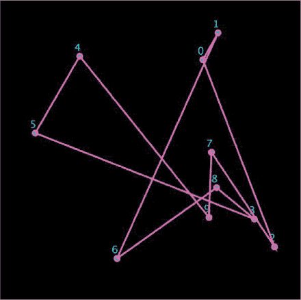

*图 12-4：一个随机的路线顺序*

要改变城市的数量，只需将第一行中声明 `N_CITIES` 的值改为其他数字，然后运行程序。图 12-5 显示了我对 `N_CITIES = 7` 的输出。

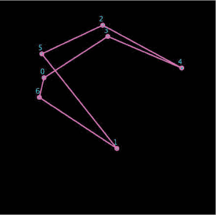

*图 12-5：包含七个城市的路线*

现在你可以创建和显示路线了，接下来我们写一个函数来测量每条路线的距离。

#### 编写 `CALCLENGTH()` 方法

`Route` 对象有一个 `distance` 属性，它在创建时被设为零。每个 `Route` 对象还有一个按顺序排列的城市列表，叫做 `cityNums`。我们只需遍历 `cityNums` 列表，并累加每对城市之间的距离。对于城市 0 到 4 没问题，但我们还需要计算从最后一个城市返回第一个城市的距离。

清单 12-11 显示了 `calcLength()` 方法的代码，它位于 `Route` 对象内部。

```py
    def calcLength(self):
        self.distance = 0
        for i,num in enumerate(self.cityNums):
        # find the distance from the current city to the previous city
            self.distance += dist(cities[num].x,
                                cities[num].y,
                                cities[self.cityNums[i-1]].x,
                                cities[self.cityNums[i-1]].y)
        return self.distance
```

*清单 12-11：计算 `Route` 的长度*

首先，我们将 `Route` 的 `distance` 属性设为零，这样每次调用此方法时，它都会从零开始。我们使用 `enumerate()` 函数，这样不仅能获取 `cityNums` 列表中的城市编号，还能获取其索引。然后，我们通过当前城市（`num`）与前一个城市（`self.cityNums[i-1]`）之间的距离来增加 `distance` 属性。接下来，让我们在 `setup()` 函数的末尾添加这一行代码：

```py
    println(route1.calcLength())
```

我们现在可以在控制台中看到销售人员所走的总距离，像在图 12-6 中一样。

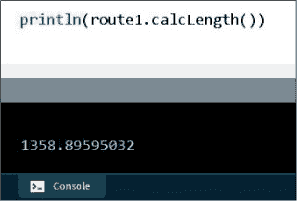

*图 12-6：我们已经计算出距离……我想是的*。

这真的是距离吗？让我们确认一下。

#### 测试 `CALCLENGTH()` 方法

让我们给程序设置一个简单的路线，即一个边长为 200 的正方形，并检查距离。首先，我们将城市数量的常量改为 4：

```py
N_CITIES = 4
```

接下来，我们将 `setup()` 函数改为清单 12-12 所示的样子。

```py
cities = [City(100,100,0), City(300,100,1),
                  City(300,300,2), City(100,300,3)]

def setup():
    size(600,600)
    background(0)
    '''for i in range(N_CITIES):
        cities.append(City(random.randint(0,width),
                           random.randint(0,height),i))'''
    route1 = Route()
    route1.cityNums = [0,1,2,3]
    route1.display()
    println(route1.calcLength())
```

*清单 12-12：手动创建一个 `Route` 来测试 `calcLength()` 方法*

我们注释掉了随机创建城市的循环，因为在检查 `calcLength()` 方法之后，我们会回到这个部分。我们创建了一个新的 `cities` 列表，包含一个边长为 200 的正方形的顶点。我们还声明了 `cityNums` 列表用于 `route1`；否则，它会随机混合城市。我们预计这个 `Route` 的长度是 800。

当我们运行代码时，看到的内容如图 12-7 所示。

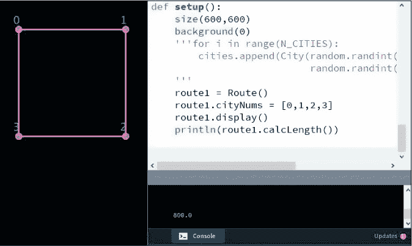

*图 12-7：`calcLength()` 方法有效！*

结果是 800 单位，正如预测的那样！你可以尝试一些矩形路线或其他容易验证的路线。

#### 随机路线

为了找到到达目的地的最短路线，我们需要找出所有可能的路线。为此，我们需要使用无限循环和 Processing 内建的 `draw()` 函数。我们将把路线代码从 `setup()` 函数移到 `draw()` 函数中。我们还会创建一堆随机路线，并显示它们及其长度。完整的代码展示在 Listing 12-13 中。

```py
*travelingSales person.pyde*
import random

N_CITIES = 10

class City:
    def __init__(self,x,y,num):
        self.x = x
        self.y = y
        self.number = num #identifying number

    def display(self):
        fill(0,255,255) #sky blue
 ellipse(self.x,self.y,10,10)
        textSize(20)
        text(self.number,self.x-10,self.y-10)
        noFill()

class Route:
    def __init__(self):
        self.distance = 0
        #put cities in a list in numList order:
        self.cityNums = random.sample(list(range(N_CITIES)),N_CITIES)

    def display(self):
        strokeWeight(3)
        stroke(255,0,255) #purple
        beginShape()
        for i in self.cityNums:
            vertex(cities[i].x,cities[i].y)
            #then display the cities and their numbers
            cities[i].display()
        endShape(CLOSE)

    def calcLength(self):
        self.distance = 0
        for i,num in enumerate(self.cityNums):
        # find the distance to the previous city
            self.distance += dist(cities[num].x,
                                cities[num].y,
                                cities[self.cityNums[i-1]].x,
                                cities[self.cityNums[i-1]].y)
        return self.distance

cities = []

def setup():
    size(600,600)
    for i in range(N_CITIES):
        cities.append(City(random.randint(50,width-50),
                           random.randint(50,height-50),i))

def draw():
    background(0)
    route1 = Route()
    route1.display()
    println(route1.calcLength())
```

*Listing 12-13: 创建和显示随机路线*

当你运行这个时，你应该会看到一堆路线被显示，并且一堆数字被打印到控制台。

但我们真正关心的是保留最好的（最短的）路线，因此我们将添加一些代码来保存“`bestRoute`”并检查新的随机路线。将 `setup()` 和 `draw()` 修改为 Listing 12-14 中所示。

```py
cities = []
random_improvements = 0
mutated_improvements = 0

def setup():
    global best, record_distance
    size(600,600)
    for i in range(N_CITIES):
        cities.append(City(random.randint(50,width-50),
                           random.randint(50,height-50),i))
    best = Route()
    record_distance = best.calcLength()

def draw():
    global best, record_distance, random_improvements
    background(0)
    best.display()
    println(record_distance)
    println("random: "+str(random_improvements))
    route1 = Route()
    length1 = route1.calcLength()
    if length1 < record_distance:
        record_distance = length1
        best = route1

        random_improvements += 1
```

*Listing 12-14: 跟踪随机改进*

在 `setup()` 函数之前，我们创建一个变量来计数程序所做的随机改进次数。同时，我们创建另一个变量，稍后会用它来计数突变改进的次数。

在 `setup()` 中，我们创建了 `route1` 作为第一个 `Route`，我们将其命名为“最佳路线”，并将其距离命名为 `record_distance`。由于我们希望将这些变量与其他函数共享，我们在函数开始时将它们声明为全局变量。

在 `draw()` 中，我们持续生成新的随机路线，并检查它们是否比我们认为最好的路线更优。由于我们只使用 10 个城市，如果让程序运行一段时间，这可能会得到一个最优解。你会发现，它只需要大约十几个随机改进。但是，请记住，只有 181,440 条独特的路线可以穿越 10 个城市。一个 10 城市路线如 Figure 12-8 所示。

然而，如果你将城市数增加到 20，程序将不断运行，如果你允许它运行几天，可能永远也无法接近最优解。我们需要开始使用章节开头提到的短语猜测程序中的思路，给我们的猜测打分，并突变最好的猜测。与之前不同，我们将创建一个“交配池”，将最好的路线进行基因般的组合。

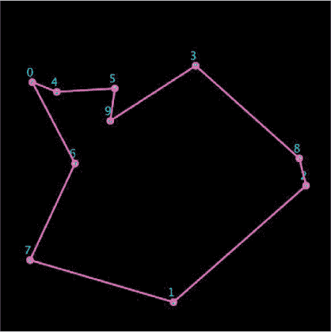

*Figure 12-8: 随机寻找最优路线——如果你能等几分钟的话*

#### 应用短语猜测突变思想

数字列表（销售员访问的城市顺序）将是 `Route` 的遗传物质。首先，我们看看一些随机突变的路线如何解决旅行商问题（就像我们在短语猜测程序中做的一样），然后我们将突变和“交配”更好的路线，以（希望）创造一个更优的路线。

#### 在列表中突变两个数字

让我们编写一个方法，随机变异 `Route` 对象中 `cityNums` 列表中的两个数字。实际上，这只是一个交换操作。你应该能猜到我们将如何随机选择两个数字并让它们在列表中交换位置。

Python 有一种独特的语法来交换两个数字的值。你可以在不创建临时变量的情况下交换两个数字。例如，如果你在 IDLE 中输入 列表 12-15 中的代码，它将无法正常工作。

```py
>>> x = 2
>>> y = 3
>>> x = y
>>> y = x
>>> x
3
>>> y
3
```

*列表 12-15：交换变量值的错误方式*

当你通过输入 `x = y` 将 `x` 的值改为与 `y` 相同，它们都变成了 3。现在当你尝试将 `y` 设置为与 `x` 相同的值时，它并没有设置为 `x` 原来的值（2），而是当前 `x` 的值，即 3。所以两个变量最终都变成了 3。

但你*可以*在同一行交换值，像这样：

```py
>>> x = 2
>>> y = 3
>>> x,y = y,x
>>> x
3
>>> y
2
```

这样交换两个变量的值对我们接下来要做的变异非常有用。我们可以将交换操作扩展到多个城市，而不仅仅局限于交换两个数字。我们可以将交换操作放入循环中，这样程序将选择任意数量的城市并交换前两个数字，然后交换下一个数字对，以此类推。`mutateN()` 方法的代码如 列表 12-16 所示。

```py
def mutateN(self,num):
    indices = random.sample(list(range(N_CITIES)),num)
    child = Route()
    child.cityNums = self.cityNums[::]
    for i in range(num-1):
        child.cityNums[indices[i]],child.cityNums[indices[(i+1)%num]] = \
        child.cityNums[indices[(i+1)%num]],child.cityNums[indices[i]]
    return child
```

*列表 12-16：编写 `mutateN()` 方法，变异任意数量的城市*

我们给 `mutateN()` 方法传入 `num`，即要交换的城市数量。然后该方法通过从城市编号的范围中随机抽取样本，生成一个要交换的索引列表。它创建一个“子” `Route`，并将自身的城市编号列表复制给子类。然后它交换 `num-1` 次。如果交换了完整的 `num` 次，第一次交换的城市将会与所有其他索引交换，最后回到它原来的位置。

那一长行代码其实就是我们之前看到的 `a,b = b,a` 语法，只不过这里交换的是两个 `cityNums`。`%` 运算符确保索引不会超过 `num`，即样本中的城市数量。例如，如果你交换的是四个城市，当 `i` 为 `4` 时，它会将 `i + 1` 从 `5` 改为 `5 % 4`，结果是 1。

接下来，我们在 `draw()` 函数的末尾添加一个部分，变异最优秀的 `Route` 的城市编号列表，并测试变异后的 `Route` 的长度，如 列表 12-17 所示。

```py
def draw():
    global best,record_distance,random_improvements
    global mutated_improvements
    background(0)
 best.display()
    println(record_distance)
    println("random: "+str(random_improvements))
    println("mutated: "+str(mutated_improvements))
    route1 = Route()
    length1 = route1.calcLength()
    if length1 < record_distance:
        record_distance = length1
        best = route1
        random_improvements += 1
    for i in range(2,6):
        #create a new Route
        mutated = Route()
        #set its number list to the best one
        mutated.cityNums = best.cityNums[::]
        mutated = mutated.mutateN(i) #mutate it
        length2 = mutated.calcLength()
        if length2 < record_distance:
            record_distance = length2
            best = mutated
            mutated_improvements += 1
```

*列表 12-17：变异最优秀的“生物”*

在 `for i in range(2,6):` 循环中，我们告诉程序在 `number` 列表中变异 2、3、4 和 5 个数字，并检查结果。现在，程序通常可以在几秒钟内很好地处理 20 城市的路线，如 图 12-9 所示。

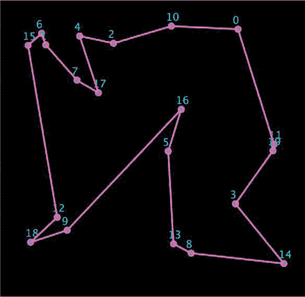

*图 12-9：一条 20 城市的路线*

变异后的“生物”在改善距离方面表现得比随机的要好得多！图 12-10 显示了打印输出。

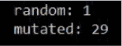

*图 12-10：变异的结果比随机改进效果要好得多！*

图 12-10 对所有改进进行了分类，其中 29 个改进来自变异，只有一个改进来自随机生成的`Route`。这表明，变异列表比创建新的随机路线更能找到最优路线。我通过修改这一行，增加了变异强度，将 2 到 10 个城市进行交换：

```py
for i in range(2,11):
```

尽管这在 20 城市问题中有所提升，甚至对于一些 30 城市问题也有效，但程序往往会陷入非最优的死胡同，如图 12-11 所示。

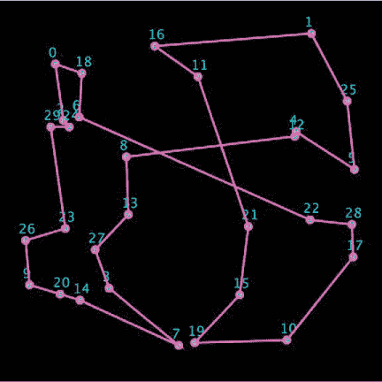

*图 12-11：一个陷入非最优状态的 30 城市问题*

我们将迈出最后一步，完全走向基因算法。现在，我们不再局限于我们认为最好的路线。相反，我们将拥有一个庞大的种群来选择最佳路线。

我们将为任意数量的路线创建一个`population`列表，挑选出最“适应”的路线，交叉它们的数字列表，并希望能生成更好的路线！在`setup()`函数之前，在`cities`列表后，添加`population`列表和路线数量常量，如列表 12-18 所示。

```py
cities = []
random_improvements = 0
mutated_improvements = 0
population = []
POP_N = 1000 #number of routes
```

*列表 12-18：初始化`population`列表和种群大小变量*

我们刚刚创建了一个空列表，用来存放我们的路线种群，并为总路线数创建了一个变量。在`setup()`函数中，我们将`POP_N`条路线填充进`population`列表，如列表 12-19 所示。

```py
def setup():
    global best,record_distance,first,population
    size(600,600)
    for i in range(N_CITIES):
        cities.append(City(random.randint(50,width-50),
                           random.randint(50,height-50),i))
    #put organisms in population list
    for i in range(POP_N):
        population.append(Route())
    best = random.choice(population)
    record_distance = best.calcLength()
    first = record_distance
```

*列表 12-19：创建路线种群*

请注意，我们必须将`population`列表声明为全局变量。我们使用`for i in range(POP_N)`将`POP_N`条路线放入`population`列表中，然后我们将一个随机选择的路线作为当前最好的路线。

#### 改进路线的交叉

在`draw()`函数中，我们将对`population`列表进行排序，以便最短的`Route`对象排在最前面。我们将创建一个名为`crossover()`的方法，随机地将`cityNums`列表拼接在一起。它的工作方式如下：

```py
a: [6, 0, 7, 8, 2, 1, 3, 9, 4, 5]
b: [1, 0, 4, 9, 6, 2, 5, 8, 7, 3]
index: 3
c: [6, 0, 7, 1, 4, 9, 2, 5, 8, 3]
```

“父母”是列表`a`和`b`。索引是随机选择的：索引 3。然后，`a`列表从索引 2（`7`）到索引 3（`8`）之间被切割，因此子列表从`[6,0,7]`开始。剩余的、不在切片中的数字按它们在`b`列表中的顺序添加到子列表中：`[1,4,9,2,5,8,3]`。我们将这两个列表连接起来，得到子列表。`crossover()`方法的代码见列表 12-20。

```py
    def crossover(self,partner):
        '''Splice together genes with partner's genes'''
        child = Route()
        #randomly choose slice point
        index = random.randint(1,N_CITIES - 2)
        #add numbers up to slice point
        child.cityNums = self.cityNums[:index]
        #half the time reverse them
        if random.random()<0.5:
            child.cityNums = child.cityNums[::-1]
        #list of numbers not in the slice
        notinslice = [x for x in partner.cityNums if x not in child.cityNums]
        #add the numbers not in the slice
        child.cityNums += notinslice
        return child
```

*列表 12-20：编写`Route`类的`crossover()`方法*

`crossover()`方法要求我们指定`partner`，另一个父母路线。`child`路线就此生成，并且会随机选择一个切片位置。子列表获取第一个切片中的数字，然后我们有一半的时间会反转这些数字，以增加基因多样性。我们创建一个列表，包含不在切片中的数字，并将这些数字按顺序加入另一个父母（或合作父母）的列表中。最后，连接这些切片并返回`child`路线。

在`draw()`函数中，我们需要检查`population`列表中的路线，找出最短的一条。我们还需要像之前那样检查每一条路线吗？幸运的是，Python 提供了一个方便的`sort()`函数，我们可以用它按`calcLength()`对`population`列表进行排序。所以，列表中的第一个`Route`就是最短的那条。`draw()`函数的最终代码展示在列表 12-21 中。

```py
def draw():
    global best,record_distance,population
    background(0)
    best.display()
    println(record_distance)
    #println(best.cityNums) #If you need the exact Route through the cities!
 ➊ population.sort(key=Route.calcLength)
    population = population[:POP_N] #limit size of population
    length1 = population[0].calcLength()
    if length1 < record_distance:
        record_distance = length1
        best = population[0]

    #do crossover on population
 ➋ for i in range(POP_N):
        parentA,parentB = random.sample(population,2)
        #reproduce:
        child = parentA.crossover(parentB)
        population.append(child)

    #mutateN the best in the population
 ➌ for i in range(3,25):
        if i < N_CITIES:
            new = best.mutateN(i)
            population.append(new)
 #mutateN random Routes in the population
 ➍ for i in range(3,25):
        if i < N_CITIES:
            new = random.choice(population)
            new = new.mutateN(i)
            population.append(new)
```

*列表 12-21：编写最终的`draw()`函数*

我们在➊使用`sort()`函数，然后修剪`population`列表的末尾（最长的路线），使得列表保持`POP_N`条路线的长度。接下来，我们检查`population`列表中的第一个项目，看它是否比最优路线更短。如果是，我们就像以前一样将其设为最佳路线。接着，我们随机从人群中选取两条路线，对它们的`cityNums`列表进行交叉操作，并将结果`child`路线添加到人群中 ➋。在➌，我们突变`best`路线，交换 3、4、5 个数字，直到最多 24 个数字（如果这少于草图中城市的数量）。最后，我们随机从人群中选择路线，并对其进行突变，以尝试改进距离 ☐。

现在，使用 10,000 条路线的人群，我们的程序可以对 100 个城市的最优路线做出相当好的近似。图 12-12 展示了程序如何将一条初始长度为 26,000 单位的路线优化到低于 4,000 单位。

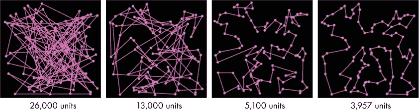

*图 12-12：通过 100 个城市的路线改进*

这“只”花了半个小时就完成了！

### 总结

在本章中，我们不仅仅使用 Python 来解答那些数学课上答案已经知道的问题。相反，我们使用间接方法（为字符串或经过多个城市的路线打分）来解决没有答案的题目！

为了做到这一点，我们模仿了基因发生突变的生物体行为，利用了某些突变比其他突变在解决当前问题时更有用的事实。我们在本章开始时就知道了目标短语，但为了确定我们的最终路线是否最优，我们必须保存城市位置并多次运行程序。这是因为遗传算法，就像真实的生物体一样，只能从它们开始时的状态出发，并且常常陷入非最优的困境，正如你所看到的那样。

但这些间接方法出奇地有效，并且在机器学习和工业过程中得到广泛应用。方程式适合表达非常简单的关系，但许多情况并不像那样简单。现在你有了许多有用的工具，比如我们的“羊与草”模型、分形、元胞自动机，最后是遗传算法，用于研究和建模非常复杂的系统。
