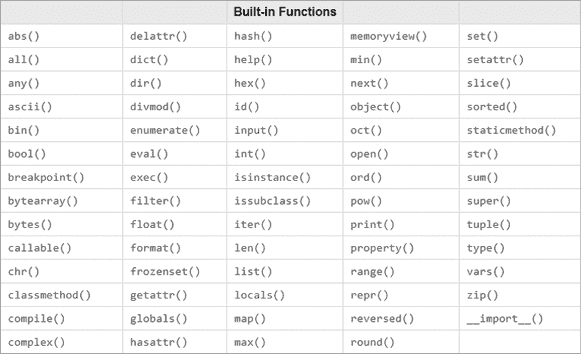

# 第一部分：入门

## 设置 Python、Anaconda 和 Spyder


即使你之前从未编写过代码，本章也会指导你安装运行本书 Python 脚本所需的软件。我们将使用 Anaconda 和 Spyder，因此我们将分别讨论选择此 Python 发行版和开发环境的优点。我会根据你的操作系统（无论是 Windows、Mac 还是 Linux）指导你完成安装过程。然后，你将学习如何在 Spyder 编辑器中开始编写代码。最后，我们将讨论基本的 Python 规则和操作。

在开始之前，在你的计算机上为本章创建文件夹*/mpt/ch01/*。本章（及后续章节）中的所有脚本都可以在本书的资源页面找到，[`www.nostarch.com/make-python-talk/`](https://www.nostarch.com/make-python-talk/)。

## 介绍 Anaconda 和 Spyder

安装 Python 并运行脚本有很多方法。在本书中，我们将使用 Anaconda 和 Spyder。

*Anaconda*是一个开源的 Python 发行版、包和环境管理器。它用户友好，提供了许多实用的 Python 模块，安装这些模块本来可能非常麻烦。我们将从下载带有 Spyder 的 Anaconda Python 发行版开始。

*Spyder*是一个功能完整的集成开发环境（IDE），用于编写脚本。它提供许多有用的功能，如自动代码补全、自动调试、代码建议和警告。

## 安装 Anaconda 和 Spyder

Python 是一个跨平台的编程语言，意味着你可以在 Windows、Mac 或 Linux 上运行 Python 脚本。然而，软件和模块的安装在不同操作系统上可能会有所不同。我将展示如何在你的操作系统中安装各种模块。一旦这些模块正确安装，Python 代码在不同操作系统中运行是一样的。

### 在 Windows 上安装 Anaconda 和 Spyder

要在 Windows 上安装 Anaconda，请访问[`www.anaconda.com/products/individual/`](https://www.anaconda.com/products/individual/)并下载最新版本的 Python 3。

我推荐使用图形安装程序，而不是命令行安装程序，特别是对初学者来说，以避免错误。确保下载适合你机器的 32 位或 64 位版本。运行安装程序并按照提示完成安装。

找到并打开 Anaconda 导航器，你应该能看到像图 1-1 那样的界面（如果需要，可以在搜索栏中搜索*Anaconda navigator*）。


图 1-1：Anaconda 导航器

点击**启动**按钮，位于 Spyder 图标下方。如果 Spyder 尚未安装，点击**安装**以安装 Spyder 开发环境。安装完成后，点击**启动**。

### 在 macOS 中安装 Anaconda 和 Spyder

要通过 Anaconda 在 macOS 上安装 Python，请访问[`www.anaconda.com/products/individual/`](https://www.anaconda.com/products/individual/)，向下滚动并下载适用于 Mac 的最新 Python 3 版本。选择图形安装程序并按照提示进行操作。

通过在 Spotlight 搜索中搜索*Anaconda navigator*来打开 Anaconda 导航器。macOS 中的 Anaconda 导航器界面应类似于图 1-1，可能会有一些小的差异。

要启动 Spyder，请点击 Spyder 图标下的**启动**按钮（如果您看到的是**安装**按钮，请点击它先安装 Spyder）。

### 在 Linux 上安装 Anaconda 和 Spyder

在 Linux 上安装 Anaconda 和 Spyder 的步骤比其他操作系统更多。首先，访问[`www.anaconda.com/products/individual/`](https://www.anaconda.com/products/individual/)，向下滚动并找到最新的 Linux 版本。选择适当的 x86 或 Power8 和 Power9 包。点击并下载最新的安装脚本。例如，在我的安装过程中，安装脚本的链接是[`repo.anaconda.com/archive/Anaconda3-2020.11-Linux-x86_64.sh`](https://repo.anaconda.com/archive/Anaconda3-2020.11-Linux-x86_64.sh)。此链接会随时间变化，但我们将以此版本作为示例。

默认情况下，安装脚本会下载并保存在您的计算机的*下载*文件夹中。如果您的 bash 脚本路径不同，您应按照以下方式安装 Anaconda。

```py
**bash ~/Downloads/Anaconda3-2020.11-Linux-x86_64.sh**
```

按下回车后，系统会提示您查看并同意许可协议。安装过程中的最后一个问题是：

```py
installation finished.
Do you wish the installer to prepend the Anaconda3 install location to PATH 
in your /home/mark/.bashrc ? [yes|no]
[no] >>>
```

您应输入 `yes` 并按回车，以便在终端中使用 `conda` 命令打开 Anaconda。

现在，您需要通过执行以下命令来激活安装：

```py
**source ~/.bashrc**
```

要打开 Anaconda 导航器，请在终端中输入以下命令：

```py
**anaconda-navigator**
```

您应该在您的计算机上看到 Anaconda 导航器，类似于图 1-1。要启动 Spyder，请点击 Spyder 图标下的**启动**按钮（如果您看到的是**安装**按钮，请点击它先安装 Spyder）。

## 使用 Spyder

为了帮助您快速上手，我们将在 Spyder 中创建一个非常简单的脚本。接着我将介绍一些在开始编写代码之前非常有用的基本概念。

### 在 Spyder 中编写 Python 代码

如前所述，Spyder 是一个功能齐全的集成开发环境（IDE）。让我们从一个简单的脚本开始。在启动 Spyder 开发环境后，您应该会看到类似于图 1-2 的布局。


图 1-2：Spyder 开发环境

Spyder 带有几个预定义的布局，您可以根据个人喜好自定义布局。默认布局包含三个面板。让我们来看看这个默认布局。

左侧是*Spyder 编辑器*，你可以在其中编写 Python 代码。右上方是*变量资源管理器*，它显示你的脚本生成的数据的详细信息。随着脚本变得复杂，变量资源管理器成为一个重要的工具，帮助你检查变量中存储的值。

右下角是*交互式 Python（IPython）控制台*，它显示脚本的输出或执行 Python 代码片段。IPython 控制台也是你输入需要用户信息的脚本输入的地方。如果脚本中有错误，它也会显示错误信息。

现在，让我们开始编程。前往 Spyder 编辑器窗口（默认位置在左侧），并输入以下代码：

```py
**print("This is my very first Python script!")**
```

点击**文件**▶**另存为**，并将文件保存为*my_first_script.py*，保存在你的章节文件夹中。

运行脚本有三种方式，所有方式都会导致相同的结果：

1.  转到**运行**菜单并选择**运行**。

1.  按下键盘上的 F5 键。

1.  按下图标栏中的绿色三角形图标►。

运行脚本后，你应该会看到类似图 1-3 的内容。在 IPython 控制台中显示的输出是一个简单的打印信息：`This is my very first Python script!` 恭喜你——你已经编写并成功运行了你的第一个 Python 脚本！


图 1-3：在 Spyder 开发环境中运行脚本

### 检查 Spyder 中的代码

除了运行整个脚本，Spyder 还可以逐行或逐块运行代码。逐步运行脚本对于仔细跟踪脚本的执行非常有用，可以验证脚本是否完全按照你的预期执行。返回到*my_first_script.py*示例，并添加另一行：

```py
**print("This is my second Python message!")**
```

将光标放在第二行上并按 F9 键，你应该能看到如图 1-4 所示的输出。


图 1-4：在 Spyder 编辑器中仅运行一行代码

如你所见，只有高亮的那一行被执行。输出如下：

```py
This is my second Python message!
```

现在按 F5 键，你会看到脚本中的每一行都被执行：

```py
This is my very first Python script!
This is my second Python message!
```

若要运行特定的代码块，选中这些行并按 F9 键\。

## 理解 Python 编程

在我们开始介绍 Python 的编程概念之前，你需要了解一些基本的内容。本节将介绍 Python 的语法和基本的数学运算。

### Python 语法

首先，Python 是区分大小写的。在处理大写字母和小写字母时，你需要非常小心。变量*X*和*Y*与变量*x*和*y*是不同的。字符串`"Hello"`和`"hello"`也彼此不同。

其次，在 Python 中缩进非常重要。像制表符这样的不可打印字符必须在整个脚本中一致地应用。如果你有其他编程语言的经验，比如 C 或 Java，你可能会注意到 Python 中缺少括号和分号；这是故意设计的。代码块通过缩进来定义。代码中的不必要空格很可能会暴露你的意图，正如我们在第二章讨论条件执行、循环和函数中的缩进时所看到的那样。

第三，Python 使用单引号和双引号（大多数情况下）可以互换使用。例如，将字符序列放在单引号内与放在双引号内效果相同（除非其中某个字符是转义字符或单引号）。

第四，Python 允许你做注释，这些注释被称为*注释*。一种常用的写注释的方法是使用井号（`#`）。井号后面的内容在同一行中不会被执行。最好在你的脚本中做些注释，这样别人可以更容易理解代码的作用——并且当你在几周或几个月后重新查看代码时，也能提醒自己当初做出的决定。例如，在 *my_first_script.py* 的第一行，我们有以下内容：

```py
# -*- coding: utf-8 -*-
```

由于这一行以 `#` 开头，Python 会忽略它，理解它是注释而不是需要执行的代码。

当你的注释不能写在一行时，你可以将注释放在三重引号（`"""`）中，第一组引号和最后一组引号之间的内容不会被 Python 脚本执行。例如，在 *my_first_script.py* 的第 2 到第 6 行，我们有以下内容：

```py
"""
Created on Fri Apr 16 14:49:19 2021

@author: hlliu2
"""
```

所有这些行都会被 Python 忽略。

### Python 中的基本操作

Python 能够进行基本的数学运算。例如，要计算 7 乘以 123，你可以在 Spyder 编辑器中输入以下内容：

```py
print(7*123)
```

将光标放在这一行，按 F9，你会得到输出 861。

表 1-1 提供了 Python 中的其他基本数学运算。

表 1-1：基本数学运算符

| **运算符** | **操作** |
| --- | --- |
| `+` | 加法：`print(5+6)`会给你一个结果`11`。 |
| `-` | 减法：`print(9-4)`会给你一个结果`5`。 |
| `/` | 除法：`print(9/3)`会给你一个结果`3`。 |
| `**` | 指数：`print(5**3)`会给你一个结果`125`。 |
| `%` | 余数：`print(13%5)`会给你一个结果`3`，因为 13 = 5 × 2 + 3。 |
| `//` | 整数商：`print(13//5)`会给你一个结果`2`，因为 13 = 5 × 2 + 3。 |

这些运算有*优先级*，意味着它们会按照特定的顺序执行。运算顺序如下：括号内的运算具有最高优先级，其次是指数运算，再然后是乘法和除法，它们具有相同的优先级，按从左到右的顺序执行。加法和减法的优先级最低，且被平等对待，因此先出现的先执行。

对于更复杂的数学运算，比如三角学中的余弦函数或自然对数，我们需要导入模块，这部分内容我将在第二章讲解。

## 总结

在本章中，你学习了如何通过 Anaconda 安装 Python 和 Spyder。你还学会了如何使用 Spyder 运行 Python 脚本。

在第二章中，我们将讨论你在本书其余部分需要掌握的 Python 技能。你将学习四种主要的值类型以及如何将一种类型转换为另一种类型。我们还将讨论条件执行和循环，以及函数和模块在 Python 中的工作原理，从而帮助你完成更复杂的任务。

## 章节末练习

1.  在*my_first_script.py*中添加一行代码，使其打印出一条第三条消息，内容为`Here is a third message!`

1.  以下每个 Python 语句的输出是什么？首先写下答案，然后在 Spyder 中运行命令来验证。

    ```py
    print(2)
    print(3**2)
    print(7//3)
    print(7/3)
    print(7%3)
    print(2+2)
    print(10*2)
    ```

1.  如果你想计算 55 乘以 234，Spyder 编辑器中的命令行应该输入什么？

## Python 基础回顾


本章是对基本 Python 知识的回顾。本章的目的不是全面回顾 Python 中的所有基本命令，而是向你提供对本书其余部分最重要的 Python 技能。

具体来说，你将学习四种 Python 变量类型（字符串、整数、浮点数和布尔值），以及如何将一种类型转换为另一种类型。函数是编程语言中的有用工具，你将学习如何使用 Python 内置函数以及如何导入 Python 标准库中的模块。

你还将学习函数是如何工作的以及如何定义你自己的函数。本书中我们使用的许多模块不在 Python 标准库中，你将学习如何在你的计算机上安装这些模块。

我们将讨论模块的工作原理以及如何创建你自己的自定义模块。然后你将学习虚拟环境，了解它为何有用，以及如何创建和激活它。

Python 使用字符串、列表、字典和元组作为元素集合来完成复杂的任务。在这一章中，你将逐一学习这四种集合类型，并查看它们的使用示例。

在你开始之前，为本章设置文件夹*/mpt/ch02*。像第一章一样，本章的所有脚本可以在本书的资源页面找到，[`www.nostarch.com/make-python-talk/`](https://www.nostarch.com/make-python-talk/)。

## 变量和数值

*变量*是一个保留的内存位置，用于在 Python（以及其他编程语言）中存储值。我们可以将值赋给变量，并使用变量名来调用关联的值。Python 有四种类型的值：字符串、浮点数、整数和布尔值。

### 字符串

*字符串*是由引号括起来的一系列字符，通常用于表示文本。以下是一些字符串的示例：

```py
Name1 = 'University of Kentucky '
Name2 = "Gatton College 2021"
```

你可以使用`type()`函数来查找一个变量的类型。在 Spyder 编辑器中输入以下内容：

```py
**print(type(Name1))**
**print(type(Name2))**
```

执行后，你将看到以下输出：

```py
<class 'str'>
<class 'str'>
```

这意味着两个变量都是字符串值。你可以对字符串进行加法或乘法运算，但不是传统的数学运算；而是可以连接字符串或重复字符串。例如，假设你在 Spyder 编辑器中运行以下两行代码：

```py
print(Name1+Name2)
print(Name1*3)
```

你将看到以下输出：

```py
University of Kentucky Gatton College 2021
University of Kentucky University of Kentucky University of Kentucky
```

加号将两个字符串连接在一起，而将一个字符串乘以 3 意味着将字符串中的字符重复三次。请注意，我故意在字符串`University of Kentucky`的末尾留了一个空格，这样它们连接在一起时，字符串之间会有一个空格。

### 浮动类型

*浮点数*，也称为*浮动类型*，是一种数字类型，相当于数学中的小数。以下是两个浮点数的示例：

```py
x = -17.8912
y = 0.987
```

你可以使用`round()`函数将浮动数限制为小数点后特定的位数。浮动数可以是正数、负数或零。运行以下代码：

```py
**print(type(x))**
**print(type(y))**
**print(round(x,3))**
**print(round(y,1))**
```

你将看到以下输出：

```py
<class 'float'>
<class 'float'>
-17.891
1.0
```

浮动类型用于执行计算。

### 整数

*整数*是另一种数字类型；它们不能有小数部分，因此必须是整数。整数主要用于 Python 中的索引目的。整数可以是正数、负数或零。以下是一些整数的示例：

```py
a = 7
b = -23
c = 0
```

重要的是要知道，浮点数总是有小数部分，而整数没有。你无需告诉 Python 你想使用哪种类型；相反，Python 可以通过你提供的信息自动判断。如果你输入一个没有引号且没有小数点的数字，Python 知道你在使用整数。即使你将一个浮动数字四舍五入到小数点后零位，数字后面仍会跟着小数点和零。运行以下代码：

```py
**print(type(a))**
**print(type(b))**
**print(type(c))**
**print(round(7.346,1))**
**print(round(7.346,0))** 
```

你将得到以下输出：

```py
<class 'int'>
<class 'int'>
<class 'int'>
7.3
7.0
```

输出显示所有三个变量，`a`、`b`和`c`，都是整数。你不会从`print(round(7.346,0))`得到`7`，因为使用小数是 Python 区分整数和浮动类型的一种方式。

### 布尔值

*布尔值*，或称*布尔型*，是二进制变量，只能取`True`或`False`的值。请注意，`True`和`False`的首字母必须始终大写。我们使用布尔值来验证代码中的真值，并进行逻辑判断。例如，运行以下两行代码来比较两个数字：

```py
**print(4 > 5)**
**print(10 >= 6)**
```

你将得到以下输出：

```py
False
True
```

结果显示逻辑语句`4 > 5`的值为`False`，而逻辑语句`10 >= 6`的值为`True`。`True`或`False`（不带引号）不是字符串，而是 Python 保留的特殊值。试试以下命令：

```py
**print('4 > 5')**
**print(type(4 > 5))**
**print(type('4 > 5'))**
```

这是输出：

```py
4 > 5
<class 'bool'>
<class 'str'>
```

如你所见，一旦你将`4 > 5`放入引号中，它就变成了字符串变量，而不是布尔值。

布尔值也可以用`1`（或者实际上，任何非零值）表示`True`，用`0`表示`False`。运行此代码：

```py
**print(int(True))**
**print(int(False))**
**print(float(True))**
**print(str(False))**
```

它输出如下：

```py
1
0
1.0
'False'
```

`bool()` 函数将任何非零值转换为`True`，将`0`转换为`False`。运行以下代码：

```py
**print(bool(1))**
**print(bool(-2))**
**print(bool(0))**
**print(bool('hello'))**
```

你将得到如下输出：

```py
True
True
False 
True
```

### 转换变量类型

你可以使用函数`str()`、`int()`、`bool()`和`float()`转换变量类型，但前提是你要转换的类型与目标类型兼容。例如，你可以使用`int("17")`或`float("17")`将字符串变量`"17"`转换为整数或浮点数，因为 17 是一个可以被识别为整数或浮点数的数字。然而，你不能将字符串`"Kentucky"`转换为整数或浮点数。

请考虑以下代码行：

```py
print(int(17.0))
print(int("88")) 
print(int("3.45"))
print(str(17.0))
print(float(-4))
```

输出如下：

```py
17
88
ValueError: invalid literal for int() with base 10: '3.45'
'17.0'
-4.0
```

布尔值`True`和`False`可以分别转换为整数`1`和`0`，因为`1`和`0`通常用来表示`True`和`False`。而浮点数`17.0`和字符串变量`"88"`可以转换为整数，但字符串变量`"3.45"`不能转换为整数，因为它有小数点后的数值。

几乎任何东西都可以转换成字符串变量；例如，浮点数`17.0`可以转换为字符串变量`"17.0"`。你也可以将任何整数转换为浮点数：例如，整数`–4`可以转换为浮点数`–4.0`。

### 变量名规则

命名变量时有一些规则，并不是所有内容都可以作为变量名。变量名必须以字母（无论大写或小写）或下划线（`_`）开头。例如，你不能使用`8python`作为变量名，因为它以数字开头。

变量名唯一可以包含的特殊字符是下划线，因此像`@`或`&`这样的特殊字符是不允许的。请参阅 Python 命名规范：[`www.python.org/dev/peps/pep-0008/#id34/`](https://www.python.org/dev/peps/pep-0008/#id34/)*.*

变量名不能是 Python 关键字或 Python 内建函数。要获取所有关键字的列表，可以在 Spyder 编辑器中运行以下两行代码：

```py
**from keyword import kwlist**
**print(kwlist)**
```

输出是 Python 关键字的完整列表：

```py
['False', 'None', 'True', 'and', 'as', 'assert', 'async', 'await', 'break',
'class', 'continue', 'def', 'del', 'elif', 'else', 'except', 'finally', 
'for', 'from', 'global', 'if', 'import', 'in', 'is', 'lambda', 'nonlocal', 
'not', 'or', 'pass', 'raise', 'return', 'try', 'while', 'with', 'yield']
```

然而，变量名*可以包含*关键字。例如，`first_break`和`class1`是有效的变量名，即使`break`和`class`不是。

变量名不应当是 Python 内建函数。图 2-1 列出了这些函数，相关内容可以在 Python 文档中的[`docs.python.org/3/library/functions.html`](https://docs.python.org/3/library/functions.html)*.* 你应该熟悉这个列表，并避免将这些术语作为变量名。



图 2-1：Python 内建函数列表

## 循环与条件执行

循环和条件语句让你在代码中做出决策，以便在特定条件发生时运行某些代码。

### 条件执行

`if` 语句允许你的代码根据条件是否满足来执行特定的操作。请考虑以下代码行：

```py
x = 5
if x > 0:
    print('x is positive')
else: 
    print('x is nonpositive')
```

这里，`x > 0`是条件。如果`x`的值大于 0，则条件成立，脚本会打印出消息`x is positive`。Python 中的条件语句总是在条件语句后面需要一个冒号（`:`）。如果条件不满足，脚本将跳到`else`分支并打印`x is nonpositive`。

我们还可以通过使用`elif`关键字来处理多个条件。考虑以下代码：

```py
x = 5
if x > 0:
    print('x is positive')
elif x == 0:
    print('x is zero')
else: 
    print('x is negative')
```

Python 使用双等号（`==`）作为比较运算符，以区别于我们使用单等号（`=`）进行赋值操作。当满足某个条件时，脚本有三种可能的输出结果：`x is positive`，`x is zero`，或`x is negative`。

如果我们需要更多的条件，首个条件必须紧跟在`if`语句后，最后一个条件必须跟在`else`语句后，而所有中间的条件应使用`elif`关键字：

```py
score = 88
if score >= 90:
    print('grade is A')
elif score >= 80:
    print('grade is B')
elif score >= 70:
    print('grade is C')
elif score >= 60:
    print('grade is D')
else:
    print('grade is F')
```

脚本根据分数的值打印字母成绩：如果分数大于或等于 90，则为 A；如果不是，则分数大于 80 时为 B，依此类推。

### 循环

计算机的一个巨大优势是它们能够快速地重复执行相同的任务。这在编程中被称为*循环*或*迭代*。Python 有两种循环类型：`while`循环和`for`循环。

#### `while`循环

`while`循环用于在满足某个条件时执行一段代码块。在这里，我们使用`while`语句创建一个循环，每次循环都将`n`的值加 1，直到`n`达到`3`。然后，循环退出，脚本打印`finished`。将此保存为*whileloop.py*：

```py
n = 0
while n < 3:
    n = n+1 
    print(n)
print('finished')
```

我们首先将`n`赋值为`0`。然后，脚本以条件`n < 3`开始`while`循环。只要条件满足，循环就会继续执行。注意冒号，它告诉 Python 接下来缩进的行是循环的一部分。这些行将在每次循环运行时执行。最后一行没有缩进，只有在循环结束后才会执行。

在第一次迭代中，`n`的值从`0`增加到`1`，并打印出更新后的`n`值。在第二次迭代中，`n`的值增加到`2`，并打印出更新后的`n`值。在第三次迭代中，`n`的值增加到`3`，并打印出`3`。当脚本进入第四次迭代时，条件`n < 3`不再满足，循环停止。之后，执行最后一行。结果，我们看到来自*whileloop.py*的以下输出：

```py
1
2
3
finished
```

`while`循环在我们事先不知道需要多少次迭代时最为有用，尽管它也可以用于执行与`for`循环相同的任务。在本书的后面部分，我们经常使用语句`while True`来创建一个无限循环，将脚本置于待机模式。

#### `for`循环

`for`循环通常用于你想要执行固定次数的代码块。以下脚本*forloop.py*是一个`for`循环的示例，它实现了与我们刚才做的`while`循环相同的功能，将变量`n`加 1，直到`n`达到`3`：

```py
for n in range(3):
    n = n + 1 
    print(n)
print('finished')
```

我们首先使用`range()`，这是 Python 中的一个内建函数，来生成从 0 到 2 的数值范围（Python 的计数从 0 开始）。这一行指示脚本循环遍历这三个值，每次循环处理一个值，并为每个值执行接下来的两行代码，每次循环将`n`加 1。当范围用尽时，循环退出，输出`finished`。

*forloop.py*中的代码输出与*whileloop.py*相同。

### 循环中的循环

你可以将一个循环放在另一个循环内，这就是所谓的*嵌套*。嵌套循环在每次外层循环迭代时，需要对内层循环的每一次迭代重复某些操作时非常有用。示例脚本*loop_in_loop.py*遍历一个列表和一个元组，在每次迭代中打印列表中的每个成员与元组中的每个成员，每次迭代打印一对值：

```py
for letter in ["A", "B", "C"]:
    for num in (1, 2):
        print(f"this is {`letter`}{`num`}")
```

首先，我们使用`for`开始外层循环，然后第一行缩进代码开始内层循环。脚本获取外层循环中的第一个值，遍历内层循环的所有迭代，并在每次迭代时打印一条消息。然后它会用外层循环中的第二个值重复这个过程。我们需要将内层循环的内容缩进两次，这样脚本才能知道哪些代码行属于哪个循环。*loop_in_loop.py*的最终输出如下所示：

```py
this is A1
this is A2
this is B1
this is B2
this is C1
this is C2
```

请注意，我们使用了`f"{}"`字符串格式化的方法。字符串`f"this is {``letter``}{``num``}"`告诉 Python 将花括号中的内容替换为相应变量的实际值。

你可以将循环嵌套得几乎无限深，脚本会在每次外层循环值的组合下，遍历内层循环的所有值。然而，过多的嵌套会使代码难以阅读，因此通常不推荐这种做法。

### 循环命令

循环有几个命令，方便控制循环的行为——即`continue`、`break`和`pass`。这些命令通过使用`if`语句，让你在循环中做出决策。

#### continue

`continue`命令告诉 Python 停止执行当前迭代中的剩余命令，并进入下一次迭代。当你希望在满足某些条件时跳过某些操作时，可以使用`continue`。例如，脚本*forloop1.py*使用`continue`命令跳过打印数字 2，并进入下一次迭代：

```py
for n in (1, 2, 3):
    if n == 2:
        continue
  1 print(n)
print('finished')
```

当`n`的值为`2`时，第一行代码不会执行，因为`continue`命令告诉脚本跳过这一行，直接进入下一次迭代。该脚本的输出如下所示：

```py
1
3
finished
```

#### break

`break`命令告诉 Python 打破循环并跳过所有剩余的迭代。当你希望退出循环时，使用`break`。示例脚本*forloop2.py*使用`break`命令，当数字达到值`2`时退出`for`循环：

```py
for n in (1, 2, 3):
    if n == 2:
        break
    print(n)
1 print('finished')
```

当`n`的值为`2`时，整个循环停止，脚本直接跳到第 1 行。因此，输出如下：

```py
1
finished
```

在本书的后面部分，我们将经常使用`break`命令来告诉脚本停止由`while True`语句生成的无限循环。

#### pass

`pass`命令告诉 Python 什么都不做，它在需要一行命令但不需要执行任何操作时使用。我们通常与`try`和`except`一起使用它，稍后我们将在本书中再次提到这个命令。脚本*forloop3.py*使用`pass`命令，当数字的值为`2`时，告诉脚本不执行任何操作：

```py
for n in (1, 2, 3):
    if n == 2:
        pass
    print(n)
print('finished')
```

当`n`的值为`2`时，不需要采取任何操作。因此，下面是前一个脚本的输出：

```py
1
2
3
finished
```

这与*forloop.py*的输出相同。

## 字符串

*字符串*是由单引号或双引号括起来的字符序列。字符串中的字符可以是字母、数字、空格或特殊字符。我们将讨论如何对字符串中的元素进行索引、如何切片以及如何将多个字符串连接在一起。

### 字符串索引

字符串中的字符是从左到右按 0 开始索引的。这是因为 Python 使用*零基索引*，因此第一个元素的索引是 0，而不是 1\。

你可以通过使用方括号操作符和字符的索引来访问字符串中的字符：

```py
msg = "hello"
print(msg[1])
```

由于`e`是字符串`"hello"`中的第二个字符，因此输出是：

```py
e 
```

Python 还使用*负索引*，它是从字符串的末尾开始的。字符串中的最后一个字符可以通过`[-1]`索引，倒数第二个字符通过`[-2]`索引，依此类推。当你有一个很长的字符串并且希望定位字符串末尾的字符时，这非常有用。

要查找字符串`msg`的倒数第三个字符，你可以使用以下代码：

```py
print(msg[-3])
```

下面是输出：

```py
l
```

### 字符串切片

*切片*字符串意味着提取字符的一个子集。我们再次使用方括号操作符：

```py
msg = "hello"
print(msg[0:3])
```

这将输出以下内容：

```py
hel
```

代码`msg[``a``:``b``]`从字符串`msg`中的位置`a`到位置`b`提取子字符串，其中位置`a`的字符包含在子字符串中，但位置*b*的字符不包含。因此，`msg[0:3]`会生成字符串`msg`中前面三个字符的子字符串。

### 字符串方法

我将介绍一些我们在本书中将会使用的常见字符串方法。

#### replace()

`replace()`方法用于将字符串中的某些字符或子字符串替换为其他字符。它接受两个参数：要替换的字符和用来替换它的字符。例如：

```py
inp = "University of Kentucky"
inp1 = inp.replace(' ','+')
print(inp1)
```

我们使用`replace()`将所有空格替换为加号。前一个脚本的输出如下所示：

```py
University+of+Kentucky
```

本方法将在本书稍后的章节中有用，当我们处理语音识别功能时。我们将使用 `replace()` 方法将语音引擎的语音文本转换为适合脚本的格式。

#### lower()

`lower()` 方法将字符串中的所有大写字母转换为小写字母。由于 Python 字符串区分大小写，因此在匹配字符串时将所有字母转换为小写，意味着我们不会错过应该匹配的大小写子字符串。

假设我们希望通过语音识别模块捕捉到“department of education”这一语音短语。我们不能确定该短语是否会被捕捉为 `Department of Education`。你可以使用 `lower()` 将短语转换为全小写字符串，以避免不匹配，示例如下：

```py
inp = "Department of Education"
inp1 = "department of education"
print(inp.lower() == inp1.lower())
```

该脚本测试了当忽略大小写时，两个字符串 `inp` 和 `inp1` 是否相同。输出如下：

```py
True
```

#### find()

你可以使用 `find()` 来查找字符在字符串中的位置。该方法返回字符在字符串中的索引。

将以下代码行输入 Spyder 编辑器并保存为 *extract_last_name.py*，然后运行：

```py
**email = "John.Smith@uky.edu"**
**pos1 = email.find(".")**
**print(pos1)**
**pos2 = email.find("@")**
**print(pos2)**
**last_name = email[(1+pos1):pos2]**
**print(last_name)**
```

字符串变量 `email` 有一个模式：它由名字、点和姓氏组成，后面跟着 `@uky.edu`。我们使用这个模式来定位点和@符号的位置，然后根据这两个位置提取姓氏。

首先，我们获取 `.` 的位置，并将其定义为变量 `pos1`。然后，我们找到 `@` 的位置，并将其定义为 `pos2`。最后，我们对字符串进行切片，取出两个位置之间的字符，并将子字符串作为变量 `last_name` 返回。

运行脚本后应该输出以下内容：

```py
4 
10 
Smith
```

`.` 和 `@` 在电子邮件中的索引分别是 `4` 和 `10`，而姓氏是 `Smith`。

你还可以使用字符串方法 `find()` 来定位子字符串。该方法返回子字符串在原始字符串中的起始位置。例如，如果你运行以下代码：

```py
email = "John.Smith@uky.edu"
pos = email.find("uky.edu")
print(pos)
```

你将得到以下输出：

```py
11 
```

输出显示子字符串 `uky.edu` 从电子邮件中的第 12 个字符开始。

#### split()

`split()` 方法将字符串拆分成多个字符串，使用指定的分隔符。在 Spyder 中输入以下代码并运行：

```py
**msg = "Please think of an integer"**
**words = msg.split()**
**print(words)**
```

输出如下：

```py
['Please', 'think', 'of', 'an', 'integer']
```

默认的 *delimiter*（分隔符的 fancy 名称）是空格（`' '`）。你也可以在使用 `split()` 时指定分隔符。让我们重新审视从电子邮件地址中提取姓氏的例子，并将新脚本命名为 *split_string.py*，如 列表 2-1 所示。

```py
email = "John.Smith@uky.edu"
(name, domain) = email.split('@')
(first, last) = name.split('.')
print(f"last name is {last}")
```

列表 2-1：使用分隔符拆分电子邮件地址

我们首先通过使用`@`作为分隔符，将电子邮件分为两部分，并将用户名和域名赋值给元组。（我们将在本章后面讨论*元组*的定义。）结果，元组中的第一个元素，即变量`name`，是子字符串：`John.Smith`。然后，脚本将`John.Smith`按照`.`分隔符分为名字和姓氏，并将它们保存在元组`(``first``, ``last``)`中。最后，我们打印出元组中的第二个元素作为姓氏。

输出如下所示：

```py
last name is Smith
```

#### join()

`join()`方法将多个字符串连接成一个字符串，就像这个脚本中的*join_string.py*一样：

```py
mylink = ('&')
strlist = ['University', 'of', 'Kentucky']
joined_string = mylink.join(strlist)
print(joined_string)
```

我们将`&`定义为变量`mylink`，作为分隔符。`strlist`是一个包含我们希望连接的三个单词的列表。我们使用`join()`将这三个单词组合成一个单一的字符串。请注意，`join()`需要放在分隔符之后。最后，我们打印出连接后的字符串：

```py
University&of&Kentucky
```

## 列表

*列表*是由逗号分隔的值的集合。列表中的值称为*元素*，或*项*，它们可以是值、变量或其他列表。

### 创建一个列表

要创建一个新列表，只需将元素放在方括号中：

```py
lst = [1, "a", "hello"]
```

我们定义了一个包含三个元素的列表`lst`：一个整数`1`和两个字符串。注意，`list()`是 Python 的内置函数，因此不能将`list`用作变量名或列表名。我建议你使用具有描述性的名称，以帮助未来的读者理解代码。

你可以使用一对空的方括号创建一个空列表：

```py
lst1 = []
```

或者，你也可以使用`list()`函数：

```py
lst2 = list()
```

### 访问列表中的元素

你可以使用括号操作符访问列表中的元素：

```py
lst = [1, "a", "hello"]
print(lst[2])
```

这将生成以下内容：

```py
hello
```

在这里，`lst[2]`指的是列表中的第三个元素，因为 Python 与大多数计算机编程语言一样，从零开始计数。

你可以使用循环遍历列表中的元素：

```py
for x in range(len(lst)):
    print(lst[x])
```

这给我们以下结果：

```py
1
a
hello
```

我们使用内置函数`len()`来返回列表的长度，在此例中是`3`。内置函数`range()`在此返回`0`、`1`和`2`。

### 使用列表的列表

一个列表可以将其他列表作为元素。这对于将元素位置映射到二维空间中的坐标非常有用。以下是一个示例：

```py
llst = [[1,2,3,5],
          [2,2,6,8],
          [2,3,5,9],
          [3,5,4,7],
          [1,3,5,0]]
print('the value of llst[1][2] is ', llst[1][2])
print('the value of llst[3][2] is ', llst[3][2])
print('the value of llst[1][3] is ', llst[1][3])
```

这是输出结果：

```py
the value of llst[1][2] is  6
the value of llst[3][2] is  4
the value of llst[1][3] is  8
```

列表`llst`本身包含五个列表。为了查找`llst[1][2]`的值，代码首先查看外部列表`llst`中的第二项，即列表`[2, 2, 6, 8]`。该列表的第三个元素是`6`，因此`llst[1][2] = 6`。

现在，让我们在二维空间中绘制一个相应的图形，如图 2-2 所示。


图 2-2：将列表的列表映射到二维空间

我们将在第三部分中使用它来创建互动游戏的棋盘。

### 添加或乘法列表

你可以在列表上使用加号（`+`）和乘号（`*`）操作符，但不是在数学意义上。例如，运行以下代码：

```py
**lst = [1, "a", "hello"]**
**print(lst + lst)**
**print(lst * 3)**
```

你应该看到以下输出：

```py
[1, "a", "hello", 1, "a", "hello"]
[1, "a", "hello", 1, "a", "hello", 1, "a", "hello"]
```

加号操作符将两个列表合并成一个更大的列表，乘号操作符将列表中的元素重复。如果你将一个列表乘以 3，元素将出现三次。

### 列表方法

我将在这里介绍几个有用的列表方法，我们将在本书的后续章节中使用它们。

#### enumerate()

`enumerate()`方法会打印出列表中的所有元素及其对应的索引。假设我们有以下列表`names`：

```py
names = ['Adam','Kate','Peter']
```

以下代码行

```py
for x, name in enumerate(names):
    print(x, name)
```

将生成如下输出：

```py
0 Adam
1 Kate
2 Peter
```

索引为`0`的第一个元素是 Adam，索引为`1`的第二个元素是 Kate，依此类推。

你可以选择将起始值设置为 1 而不是 0，使用`start=1`，如下所示：

```py
names = ['Adam','Kate','Peter']
for x, name in enumerate(names, start=1): 
    print(x, name)
```

输出结果如下：

```py
1 Adam
2 Kate
3 Peter
```

#### append()

你可以通过使用`append()`方法将一个元素添加到列表的末尾。考虑这个脚本，*list_append.py*：

```py
lst = [1, "a", "hello"]
1 lst.append(2) 
print(lst)
```

这段代码正在将元素`2`添加到现有的列表`lst`中，生成如下结果：

```py
[1, "a", "hello", 2]
```

新的`lst`现在有四个元素。

你每次只能添加一个元素，它会被默认添加到列表的末尾。添加两个元素会导致错误信息。请将脚本*list_append.py*中的第 1 行更改为如下：

```py
lst.append(2**, 3)** 
```

你将收到如下错误信息：

```py
TypeError: append() takes exactly one argument (2 given)
```

但是，你可以将多个元素作为列表添加。将两个数字用方括号括起来，如下所示：

```py
lst.append([2, 3]) 
```

你将得到以下输出：

```py
[1, "a", "hello", [2, 3]]
```

新的列表有四个元素。

要将两个或更多元素添加到现有列表中，你应该使用加号操作符。例如，要将 2 和 3 作为两个独立的元素添加到列表中，可以使用以下代码：

```py
lst + [2, 3] 
```

输出将如下所示：

```py
[1, a, "hello", 2, 3]
```

#### remove()

你可以通过使用`remove()`方法从列表中删除一个元素：

```py
lst = [1, "a", "hello", 2]
lst.remove("a") 
print(lst)
```

我们移除了索引为 1 的元素，结果如下：

```py
[1, "hello", 2]
```

新的列表中不再有元素`a`。每次只能移除一个元素。

#### index()

你可以通过使用`index()`方法找到元素在列表中的位置：

```py
lst = [1, "a", "hello", 2]
print(lst.index("a"))
```

从中我们得到如下结果：

```py
1
```

结果告诉你，元素`a`在列表中的索引为`1`。

#### count()

你可以通过使用`count()`来计算一个元素在列表中出现的次数：

```py
lst = [1, "a", "hello", 2, 1]
print(lst.count(1)) 
print(lst.count("a")) 
```

这将生成如下结果：

```py
2
1
```

这告诉我们，元素`1`在列表中出现了两次，而元素`a`出现了一次。

#### sort()

你可以通过使用`sort()`方法对列表中的元素进行排序。元素必须是相同类型（或者至少可以转换为相同类型）。例如，如果你的列表中同时包含整数和字符串，尝试对其排序时会出现如下错误信息：

```py
TypeError: '<' not supported between instances of 'str' and 'int'
```

数字按从小到大的顺序排序。如果在方法中添加`reverse=True`作为选项，它将会反转排序顺序。以下是一个示例：

```py
lst = [5, 47, 12, 9, 4, -1]
lst.sort()
print(lst)
lst.sort(reverse=True)
print(lst)
```

这将输出如下：

```py
[-1, 4, 5, 9, 12, 47]
[47, 12, 9, 5, 4, -1]
```

字母按字母顺序排序，并且排在数字之后。考虑以下示例：

```py
Lst = ['a', 'hello', 'ba', 'ahello', '2', '-1']
lst.sort()
print(lst)
```

输出显示如下：

```py
['-1', '2', 'a', 'ahello', 'ba', 'hello']
```

### 使用内建函数与列表

我们可以直接对列表使用几个 Python 内置函数，包括`min()`、`max()`、`sum()`和`len()`。这些函数分别返回列表的最小值、最大值、总和和长度，如下所示：

```py
lst = [5, 47, 12, 9, 4, -1]
print("the range of the numbers is", max(lst)-min(lst))
print("the mean of the numbers is", sum(lst)/len(lst))
```

这是输出结果：

```py
the range of the numbers is 48
the mean of the numbers is 12.666666666666666
```

### list()

你可以使用`list()`函数将字符串转换为字符列表：

```py
msg = "hello"
letters = list(msg)
print(letters)
```

输出如下：

```py
['h', 'e', 'l', 'l', 'o']
```

有趣的是，Python 字符串可以像字符列表一样处理。

## 字典

*字典*是一个包含键值对的集合。我们通过将元素放入花括号中来创建字典，如列表 2-2 所示。

```py
scores = {'blue':10, 'white':12}
```

列表 2-2：创建一个包含两个键值对的字典

字典`scores`有两个键值对元素，用逗号分隔：第一个元素是键`blue`，值为`10`，通过位置和冒号分隔。第二个元素是`'white':12`。

要创建一个空字典，你可以使用`dict()`或一对空的花括号：

```py
Dict1 = dict()
Dict2 = {}
```

你可以按如下方式向现有字典中添加一个新元素：

```py
Dict3 = {}
Dict3['yellow'] = 6
print(Dict3)
```

这一行`Dict3['yellow'] = 6`将值`6`分配给键`yellow`。新的`Dict3`包含了元素`6`，可以通过键`yellow`访问该元素。

### 访问字典中的值

你可以通过使用方括号操作符来访问字典中的值。每个键值对中的键值充当索引。例如，我们可以按照如下方式访问列表 2-2 中`score`字典的值：

```py
print(scores['blue'])
print(scores['white']) 
```

这将给你以下结果：

```py
10
12 
```

我们还可以使用`get()`方法。使用`get()`的优点是，当用户请求一个不在字典中的键时，它会返回`None`作为默认值，而不是返回错误。请考虑以下脚本，*get_score.py*：

```py
scores = {'blue':10, 'white':12}
print(scores['blue'])
print(scores['white'])
print(scores.get('yellow'))
print(scores.get('yellow',0))
```

这将产生以下结果：

```py
10
12
None
0
```

由于键`yellow`不在`scores`中，方法`get('yellow')`返回值`None`。进一步地，当你在方法中添加选项`0`时，`get('yellow', 0)`将返回值`0`。

### 使用字典方法

你可以使用`keys()`方法来生成字典中所有键的列表：

```py
scores = {'blue':10, 'white':12}
teams = list(scores.keys())
print(teams) 
```

这将给我们以下结果：

```py
['blue', 'white']
```

我们可以使用`values()`方法生成字典中所有值的列表：

```py
points = list(scores.values())
print(points)
```

输出如下：

```py
[10, 12]
```

我们可以使用`items()`获取每个键值对的列表，作为元组（参见第 37 页的“元组”）。

```py
print(list(scores.items()))
```

这将产生以下结果：

```py
[('blue', 10), ('white', 12)]
```

### 如何使用字典

字典中的值可以是任何类型的变量、列表，甚至另一个字典。这里我们有一个使用列表作为值的字典：

```py
scores2 = {'blue':[5, 5, 10], 'white':[5, 7, 12]}
```

每个键的值是一个包含三个元素的列表。这三个值分别表示每个玩家在比赛上半场、下半场和总分的得分。要查找白队在下半场的得分，可以调用以下内容：

```py
print(scores2['white'][1])
```

字典的优势在于它的键可以是任何值，不一定是整数。这使得字典在许多场景下都非常有用。例如，*most_freq_word.py*使用字典来统计单词：

```py
news = (
'''Python is an interpreted, high-level, and general-purpose programming
 language. Python's design philosophy emphasizes code readability with
 its notable use of significant whitespace. 
 Its language constructs and object-oriented approach aim to help 
 programmers write clear, logical code for small- and large-scale 
 projects.
''')
wdcnt = dict()
wd = news.split()
for w in wd:
    wdcnt[w] = wdcnt.get(w, 0) + 1
print(wdcnt)   
for w in list(wdcnt.keys()):
    if wdcnt[w] == max(list(wdcnt.values())):
        print(w)
```

我们将`news`定义为一个包含简短段落的字符串变量。然后我们创建一个空字典`wdcnt`。接下来，我们将字符串拆分为一个单独单词的列表。然后我们统计每个单词的频率，并将信息存储在字典中，使用单词作为键，单词的计数作为值。因为我们使用`get()`方法，如果字典中没有该单词作为键，`get()`中的第二个参数会将该单词的值设为`0`。

最后，我们打印出频率最高的单词。结果如下：

```py
{'Python': 1, 'is': 1, 'an': 1, 'interpreted,': 1, 'high-level': 1, 'and': 3,
 'general-purpose': 1, 'programming': 1, 'language.': 1, "Python's": 1,
 'design': 1, 'philosophy': 1, 'emphasizes': 1, 'code': 2, 'readability': 1,
 'with': 1, 'its': 1, 'notable': 1, 'use': 1, 'of': 1, 'significant': 1, 
'whitespace.': 1, 'Its': 1, 'language': 1, 'constructs': 1, 
'object-oriented': 1, 'approach': 1, 'aim': 1, 'to': 1, 'help': 1, 
'programmers': 1, 'write': 1, 'clear,': 1, 'logical': 1, 'for': 1, 
'small-': 1, 'large-scale': 1, 'projects.': 1}
and
```

事实证明，新闻文章中最常见的单词是`and`，它出现了三次。

### 交换键和值

有时你可能需要交换键和值的位置。现在让我们字面上理解*字典*的含义，假设你有以下英语到西班牙语的字典，使用英语单词作为键，西班牙语翻译作为值：

```py
spanish = {'one': 'uno', 'two': 'dos', 'three': 'tres'}
```

你想创建一个西班牙语到英语的字典。你可以通过使用以下代码行来实现：

```py
**english = {y:x for x,y in spanish.items()}**
```

命令`x,y in spanish.items()`检索`spanish`中的所有键值对。命令`y:x for x,y`交换了键和值的位置。你必须在等号右侧的所有内容周围加上花括号，以便脚本将其视为字典。为了验证，输入以下内容：

```py
**print(english)**
```

你将得到以下输出：

```py
{'uno': 'one', 'dos': 'two', 'tres': 'three'}
```

### 合并两个字典

要将两个字典`x`和`y`合并为一个大的字典`z`，你可以赋值`z = {**x, **y}`：

```py
spanishenglish = {**spanish, **English}
```

结果是一个新的字典，称为`spanishenglish`，其中包含六个元素：三个来自`spanish`，三个来自`english`。

## 元组

*元组*是由逗号分隔的值的集合，类似于列表——但最大的区别在于元组在定义后不能被更改（也就是说，元组是不可变的）。元组的元素存在圆括号内，而不是方括号，以此来区分元组和列表。这里我们创建一个元组并尝试修改它：

```py
tpl = (1, 2, 3, 9, 0)
tpl.append(4)
print(tpl)
```

我们得到以下错误信息：

```py
AttributeError: 'tuple' object has no attribute 'append'
```

因为元组是不可变的，我们不能对其使用`append()`或`remove()`等方法。我们也无法对元组中的元素进行排序。

元组的元素是通过整数索引的，我们可以使用方括号运算符来访问它们：

```py
tpl = (1, 2, 3, 9, 0)
print(tpl[3])
print(tpl[1:4])
```

我们的输出如下所示：

```py
9
(2, 3, 9)
```

我们在*split_string.py*中看到过将值赋给元组的例子（清单 2-1）。

你可以比较两个元组。这个过程从比较它们的第一个元素开始。如果第一个元素相同，我们接着检查第二个元素是否匹配。如果第二个元素也相同，我们再比较第三个元素，依此类推，直到发现不同之处。

在你的 Spyder 编辑器中运行以下代码：

```py
**lt = [(1, 2), (3, 9), (0, 7), (1, 0)]**
**lt.sort()**
**print(lt)**
```

你将看到以下输出：

```py
 [(0, 7), (1, 0), (1, 2), (3, 9)]
```

## 函数

*函数*（理想情况下）是一个为完成特定任务而设计的代码块。有许多执行各种任务的函数，但通常认为最佳实践是设计一个只执行一个任务的函数（并且不更改其他变量）。有些函数有定义的参数（输入）。我们可以将函数代码分配给一个变量名，这样每次需要完成任务时，就不必重复相同的代码。相反，我们只需调用该函数并输入参数。

函数还可以提高代码的可读性，使代码更有组织性，减少混乱并减少出错的可能性。

### 使用内置 Python 函数

Python 自带了许多可以直接使用的内置函数，包括第一章中的`print()`。在这里，我将讨论一些我们在本书中将频繁使用的内置函数。

#### `range()` 函数

`range()` 函数用于生成一个整数列表。当我们在第 21 页讨论循环时，我们已经介绍过`range()`。我们知道，例如，`range(5)`会生成值`[0, 1, 2, 3, 4]`。`range()`函数生成的默认起始值是`0`，因为 Python 使用零索引，但你也可以指定起始值。例如，`range(3, 6)`会生成以下三个值的列表：`[3, 4, 5]`。

默认增量值是`1`，但你也可以将增量值作为可选的第三个参数来指定。例如，代码

```py
for x in range(-5, 6, 2):
    print(x)
```

将会输出以下内容：

```py
-5
-3
-1
1
3
5
```

`range(-5, 6, 2)`中的第三个参数告诉脚本每个元素的值增加 2。

如果增量值是负整数，列表中的值会减少。例如，`range(9, 0, -3)`会生成列表`[9, 6, 3]`。

#### `input()` 函数

*语音合成*是将书面文本转换为人类语音的过程，因此了解 Python 如何使用一个名为`input()`的内置函数来接收书面文本输入是很重要的。

在 Spyder 中运行以下脚本：

```py
**color = input('What is your favorite color?')**
**print('I see, so your favorite color is {}'.format(color))**
```

你应该看到一个类似于图 2-3 的屏幕。


图 2-3：Python 请求输入时的截图

如你在图 2-3 中看到的，脚本在右下角的 IPython 控制台中请求你的输入。它会等待你输入一些文本并按下回车键，然后才会继续运行。如果你输入`blue`，脚本将输出以下内容：

```py
What is your favorite color? **blue**
I see, so your favorite color is blue.
```

你可以像这样请求多个输入：

```py
FirstName = input('What is your first name?\n')
LastName = input('What is your last name?\n')
print(f'Nice to meet you, {FirstName } {LastName }.')
```

脚本请求两个输入。序列`\n`是一个转义字符，用于在问题“你的名字是什么？”下方插入新的一行。

### 定义你自己的函数

除了使用内置函数外，我们还可以构建自己的函数。我将向你展示如何创建一个函数，这个过程也将展示函数是如何工作的。函数可以接受一个或多个输入，称为*参数*，或者没有任何输入。

#### 没有参数的函数

我们将从构建一个打印`Finished printing`消息的函数开始。这个函数不接受任何输入：

```py
def TheEnd():
    print('Finished printing') 
for i in (1, 2, 3):
    print(i)
TheEnd() 
```

我们使用 `def` 来表示函数定义，给函数命名，并紧跟空括号和冒号。冒号告诉 Python 要期待函数体。之后的所有缩进行都被视为函数的一部分。

脚本打印出三个数字，接着我们调用该函数。输出结果如下：

```py
1
2
3
Finished printing
```

如你所见，函数中的命令只有在函数被调用时才会执行，而不是在函数定义时执行。

#### 一个带有一个参数的函数

现在我们将编写一个接受一个输入的函数。我们需要给 50 个人写感谢信。除收件人的名字外，信息内容相同。我们将定义一个函数来打印信息，每次调用时只需要提供每个消息的名字。我们首先定义一个名为 `msgs()` 的函数，具体如下：

```py
def msgs(name): 
    print(f"Thank you, {name}, I appreciate your help!") 
```

函数的名称是 `msgs`，其唯一的输入是变量 `name`。如果我们按如下方式调用该函数两次：

```py
msgs("Mary")
msgs("Bob")
```

输出将是这样的：

```py
Thank you, Mary, I appreciate your help!
Thank you, Bob, I appreciate your help!
```

要写 50 张感谢信，你可以调用该函数 50 次：每次传入一个名字。

#### 一个带有多个参数的函数

函数可以有两个或更多的输入参数。请参考列表 2-3 中的脚本 *team_sales.py*，它定义了一个需要三个输入的函数。

```py
def team_sales(sales1, sales2, sales3):
    sales = sales1 + sales2 + sales3
    return sales
print(team_sales(100, 150, 120))
```

列表 2-3：定义一个带有三个参数的函数

我们定义了一个函数来计算一个由三名成员组成的小组的总销售额。该函数使用单个成员的销售额 `sales1`、`sales2` 和 `sales3` 作为三个参数。我们通过将三项销售额相加来计算团队的总销售额 `sales`。然后，我们通过使用 `return` 命令告诉脚本输出该函数的结果。因此，当调用函数 `team_sales()` 时，你将得到三项销售额的总和。

如果个人销售额分别为 100、150 和 120，当我们调用函数 `team_sales()` 时，输出将是 370。

#### 一个接收不定数量参数的函数

有时输入的数量是未知的。例如，你想定义一个函数来计算一组销售人员的总销售额，但不同的小组有不同数量的销售人员。你可以通过使用参数 `*args` 来定义一个适用于任何小组规模的函数，该参数允许你将不同长度的多个值传递给函数。列表 2-4 中的 *total_sales.py* 就完成了这项工作。

```py
def total_sales(*args):
    total = 0
    for arg in args:
       total = total + arg
    return total
`--snip--`
```

列表 2-4：*total_sales.py* 的第一部分

我们开始 `total_sales()`，它接收 `*args` 作为参数。我们将变量 `total` 的值设置为 `0`，然后遍历参数 `args` 中的每个元素。对于参数中的每个元素，我们将其加到变量 `total` 中。最后我们输出该小组的总销售额。可以通过列表 2-5 来测试。

```py
`--snip--`
print(total_sales(200,100,100,100))
print(total_sales(800,500,400))
```

列表 2-5：脚本 *total_sales.py* 的第二部分

从中我们得到以下结果：

```py
500
1700 
```

如你所见，函数接收一个参数 `*args`，但你可以在函数中放入任意多个元素。

## 模块

你不仅仅限于使用 Python 内建函数。Python 标准库有许多模块，提供了其他可以从你自己的代码中调用的函数。

### 导入模块

我们将讨论使用模块中函数的三种方式以及每种方式的优缺点。

#### 导入模块

第一种方式是导入整个模块。例如，要查找 30 度角的余弦值，你可以先导入 *math* 模块。然后，你可以通过调用模块名和函数名来使用模块中的 `cos()` 函数：`math.cos()`。

在 Spyder 中输入以下代码：

```py
**import math**
**print(math.cos(30))**
```

你将得到一个输出 `0.15425144988758405`。

你必须在调用 `math.cos()` 之前先导入模块。如果你没有导入 *math* 模块并直接运行这个命令：

```py
print(math.cos(30))
```

Python 会给出一个错误信息：

```py
NameError: name 'math' is not defined
```

此外，当你调用函数时，必须始终将模块名放在函数名之前。在 Python 中输入以下两行代码：

```py
**import math**
**print(cos(30))**
```

你将收到这个错误信息：

```py
NameError: name 'cos' is not defined
```

这是因为 Python 不知道在哪里找到 `cos()` 函数，尽管你已经导入了 *math* 模块。

#### 导入函数

如果你只需要某个模块中的一两个函数，可以通过只导入这一个或两个函数来节省时间。这样你就可以直接使用函数名，而不必附加模块名。输入以下两行代码：

```py
**from math import cos, log**
**print(cos(30)+log(100))**
```

你将得到正确的输出 `4.759421635875676`。我们不需要使用 `math`，因为我们已经告诉脚本在哪里查找这两个函数。如果你需要在脚本中使用这个函数几十次或上百次，这种方式特别有用。

#### 使用星号导入

如果你的脚本依赖于模块中的许多函数，你可以通过使用星号导入 `from module import *` 来节省时间。然而，许多 Python 社区的成员警告不要使用这种方式，因为 `import *` 语句可能会污染你的命名空间，可能会干扰你自己定义的函数（或来自其他模块的函数）。我们在本书中不会使用这种方法。

### 创建你自己的模块

在 列表 2-3 中，我们在 *team_sales.py* 文件中定义了 `team_sales()` 函数，然后调用了该函数。你可能需要在多个脚本中计算总销售额。通过将该函数构建到模块中，你可以避免在每个脚本中重新编写代码。

让我们首先创建一个名为 *create_local_module.py* 的脚本，如 列表 2-6 所示。

```py
def team_sales(sales1, sales2, sales3):
    sales = sales1 + sales2 + sales3
    return sales
```

列表 2-6：本地模块的代码

这个脚本定义了 `team_sales()` 函数，但没有调用它。接下来，创建一个新的脚本 *import_local_module.py*，如 列表 2-7 所示，并将其保存在与 *create_local_module.py* 相同的文件夹中。

```py
from create_local_module import team_sales
print(team_sales(100, 160, 200))
print(team_sales(200, 250, 270))
print(team_sales(150, 120, 200))
```

列表 2-7：导入本地模块的代码

当你导入一个模块时，Python 首先会在导入脚本所在的目录中查找，所以模块必须位于相同的文件夹中。这种模块被称为 *本地模块*。

如果你运行脚本，你将获得以下结果：

```py
460
720
470
```

`team_sales()` 函数正确计算了三个团队的总销售额。

本地模块与 Python 标准库中的模块一样工作，但它们需要存放在 Python 期望它们所在的文件夹中。

对于你下载的模块，Python 会在后台存储已下载模块的文件路径，并在导入时遵循该路径。例如，*tkinter* 包就在我们稍后在本书中使用的 Python 标准库中。当你安装它时，文件会被放置在一个特定的路径下，在 Windows 系统中通常是以下类似的路径：

```py
C:\Users\`ME`\Anaconda3\envs\MYEV\Lib\tkinter
```

它被这样隐藏起来，是为了防止你不小心更改或丢失它，否则你将无法继续使用它。

### 使用第三方模块

Python 的主要优势之一是程序员可以相互免费分享模块。这些模块中有许多不在 Python 标准库中，包括我们将用于文本转语音和语音识别功能的模块。这些外部模块，被称为 *第三方模块*，可以单独安装。在安装之前，你需要先检查该模块是否已安装。

#### 检查已安装模块

Python 标准库中的所有模块都会在你安装 Python 时自动安装到你的计算机上。其他模块可能会在你下载各种软件或模块时一并安装。例如，当你在第十四章安装 *pandas* 时，约有 23 个其他支持模块也将被安装，因为 *pandas* 依赖它们。

你可以通过以下命令在 Spyder 编辑器中检查模块是否已经安装：

```py
help("modules")
```

这将为你提供计算机上所有已安装模块的列表。不过，Python 列出所有模块并让你检查它们可能需要较长时间。

另外，你也可以通过尝试导入模块来检查它是否已安装：

```py
import `ModuleName`
```

要检查 *pandas* 是否已安装在你的计算机上，运行 `import pandas`，如果没有错误消息，说明模块已经安装。如果输出显示 `ModuleNotFoundError`，则需要安装它。让我们来看一下如何安装。

#### Pip 安装模块

我们将在第四章使用的 *gTTS* 模块不包含在 Python 标准库中，因此我们需要通过 `pip install` 安装它。打开 Anaconda 提示符（Windows）或终端（Mac 或 Linux），并输入以下命令：

```py
**pip install gTTS** 
```

按照屏幕上的指示完成操作，*gTTS* 模块将被安装。

#### Conda 安装模块

如果你通过 `pip install` 找不到你想要的模块，可以尝试 `conda install`。

我们将通过在 Anaconda 提示符（Windows）或终端（Mac 或 Linux）中使用以下命令来安装 *yt* 模块：

```py
**conda install yt** 
```

许多人认为 `pip install` 和 `conda install` 是一样的，但其实它们并不相同。Pip 是 Python 包管理机构推荐的工具，用于从 Python 包索引安装包。你只能使用 `pip install` 安装 Python 软件。与此相对，Conda 是一个跨平台的包和环境管理器，它不仅安装 Python 软件，还可以安装 C 或 C++ 库中的包、R 包或其他软件。

随着你在 Python 中构建越来越多的项目，你将会安装许多模块。有些模块可能会与其他模块发生冲突，而且不同的项目可能使用相同模块的不同版本。为了避免模块冲突问题，我建议你为每个项目创建一个虚拟环境。*虚拟环境*是一种将项目彼此隔离的方式。

## 创建虚拟环境

要创建虚拟环境，请打开 Anaconda 提示符（在 Windows 中）或终端（在 Mac 或 Linux 中）。我们将为本书中的项目命名虚拟环境为 *chatting*。输入以下命令：

```py
**conda create -n chatting**
```

按下回车键后，按照屏幕上的指示操作，当提示你输入 `y/n` 时按 **y**。一旦你在机器上创建了虚拟环境，就需要激活它。

### 在 Windows 中激活虚拟环境

在 Anaconda 提示符（在 Windows 中）或终端（在 Mac 或 Linux 中），输入以下命令：

```py
**conda activate chatting**
```

在 Windows 中，你将在 Anaconda 提示符中看到以下内容：

```py
(chatting) C:\>
```

你可以看到 `(chatting)` 提示符，表示命令行现在位于你刚刚创建的虚拟环境 *chatting* 中。

在 Mac 上，你应该在终端中看到类似以下内容（用户名会不同）：

```py
(chatting) Macs-MacBook-Pro:~ macuser$
```

在 Linux 中，你应该在终端中看到类似以下内容（用户名会不同）：

```py
(chatting) mark@mark-OptiPlex-9020:~$
```

### 在 Windows 中设置虚拟环境中的 Spyder

现在我们需要在新的虚拟环境中安装 Spyder。首先确保你已激活虚拟环境。然后运行以下命令：

```py
**conda install spyder**
```

然后，在同一个已激活虚拟环境的终端中执行以下命令以启动 Spyder：

```py
**spyder**
```

## 总结

在本章中，你学习了四种变量类型以及如何将一种类型转换为另一种类型。你还学习了 Python 中函数的工作原理。你学习了三种将模块导入脚本的方法，并了解了每种方法的优缺点。

你还创建了自己的函数。你创建了一个本地模块并将其导入到脚本中，以使代码更加简洁清晰。最后，你创建并激活了虚拟环境，以便在不同的项目中分离包。

在第三章中，你将学习如何安装与语音识别相关的模块，使 Python 能够理解人类的声音。

## 本章练习

1.  假设：

    ```py
    name1 = 'Kentucky '
    name2 = "Wildcats"
    ```

    以下每个 Python 语句的输出是什么？首先写下答案，然后在 Spyder 中运行该命令以验证。

    ```py
    print(type(name1))
    print(type(name2))
    print(name1 + name2)
    print(name2 + name1)
    print(name2 + ' @ ' + name1)
    print(3 * name2)
    ```

1.  假设：

    ```py
    x = 3.458
    y = -2.35
    ```

    以下每个 Python 语句的结果是什么？

    ```py
    print(type(x))
    print(type(y))
    print(round(x, 2))
    print(round(y, 1))
    print(round(x, 0))
    ```

1.  以下是一些整数的例子：

    ```py
    a = 57
    b = -3
    c = 0
    ```

    以下每条 Python 语句的结果是什么？

    ```py
    print(type(b))
    print(str(a))
    print(float(c))
    ```

1.  以下每条 Python 语句的输出是什么？

    ```py
    print(type(5==9))
    print('8<7')
    print(5==9)
    print(type('8<7'))
    print(type('True'))
    ```

1.  以下每条 Python 语句的输出是什么？

    ```py
    print(int(-23.0))
    print(int("56")) 
    print(str(-23.0))
    print(float(8))
    ```

1.  以下每条 Python 语句的输出是什么？

    ```py
    print(int(True))
    print(float(False))
    print(str(False))
    ```

1.  以下每条 Python 语句的输出是什么？

    ```py
    print(bool(0))
    print(bool(-23))
    print(bool(17.6))
    print(bool('Python'))
    ```

1.  以下变量名是否有效，为什么？

    ```py
    global
    2pirnt
    print2
    _squ
    list
    ```

1.  在以下脚本中使用了循环命令`break`。输出应该是什么？首先写下答案，然后在 Spyder 中运行命令以验证。

    ```py
    for letter in ("A", "B", "C"):
        if letter == "B": 
            break
        for num in (1, 2):  
            print(f"this is {letter}{num}")
    ```

1.  在以下脚本中使用了循环命令`continue`。输出应该是什么？首先写下答案，然后在 Spyder 中运行命令以验证。

    ```py
    for letter in ("A", "B", "C"):
        if letter == "B": 
            continue
        for num in (1, 2):  
            print(f"this is {letter}{num}")
    ```

1.  在以下脚本中使用了循环命令`pass`。输出应该是什么？首先写下答案，然后在 Spyder 中运行命令以验证。

    ```py
    for letter in ("A", "B", "C"):
        if letter == "B": 
            pass
        for num in (1, 2):  
            print(f"this is {letter}{num}")
    ```

1.  以下每条命令的输出是什么？首先写下答案，然后在 Spyder 中运行命令以验证。

    ```py
    for i in range(5):
        print(i)
    ```

    ```py
    for i in range(10, 15):
        print(i)
    ```

    ```py
    for i in range(10, 15, 2):
        print(i)
    ```

1.  根据本章中定义的函数，`team_sales(50, 100, 120)`的值是多少？

1.  将脚本*import_local_module.py*中的模块导入方法从`from` `module` `import` `function`方法改为`import` `module`方法。将新脚本命名为*import_local_module1.py*，并确保它产生相同的输出。

1.  班级中八个小组的期中项目成绩保存在列表`midterm = [95, 78, 77, 86, 90, 88, 81, 66]`中。使用 Python 内置函数计算成绩的范围和平均值。

1.  假设`inp = "University of Kentucky"`，请确定`inp[5:10]`、`inp[-1]`、`inp[:10]`和`inp[5:]`的值。

1.  如果`email = John.Smith@uky.edu`，`email.find("y")`的结果是什么？

1.  假设`llst = [[1,2,3,5],[2,2,6,8],[2,3,5,9],[3,5,4,7],[1,3,5,0]]`。`llst[2]`、`llst[2][2]`和`llst[3][0]`的值分别是多少？

1.  以下每条 Python 语句的输出是什么？

    ```py
    [1, "a", "hello", 2].remove(1)
    [1, "a", "hello", 2].append("hi")
    ```

1.  假设`scores2 = {'blue':[5, 5, 10], 'white':[5, 7, 12]}`。`scores2['blue'][2]`的值是多少？

1.  这是一个元组的例子：`tpl = (1, 2, 3, 9, 0)`。`tpl[3:4]`的值是多少？

1.  你有一个列表`lst = [1, "a", "hello", 2]`。创建一个字典，包含四个键值对：键是`lst`中每个元素的位置，值是该位置上的元素。
