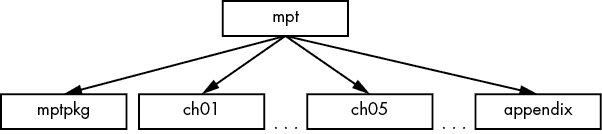
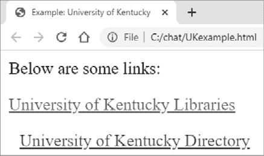
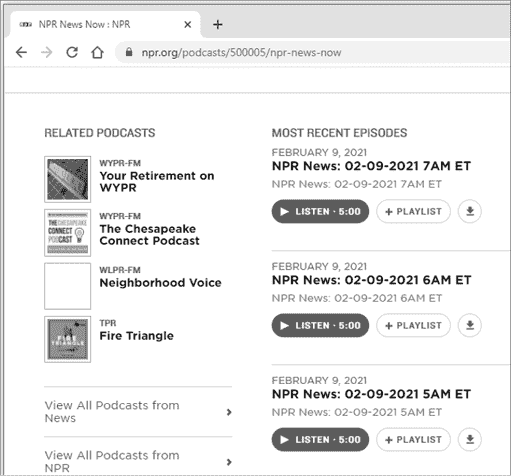
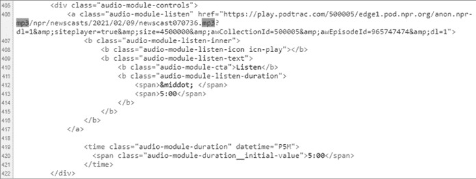
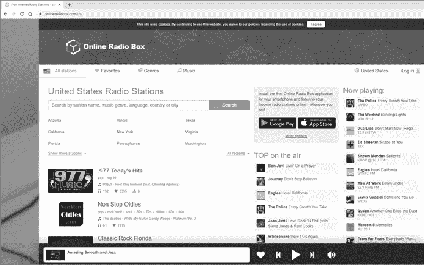
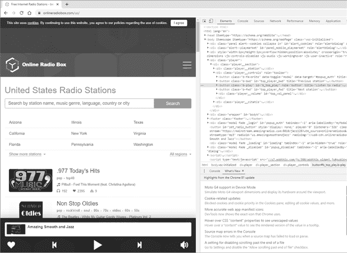
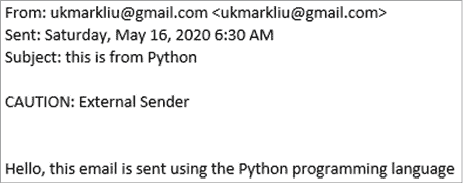
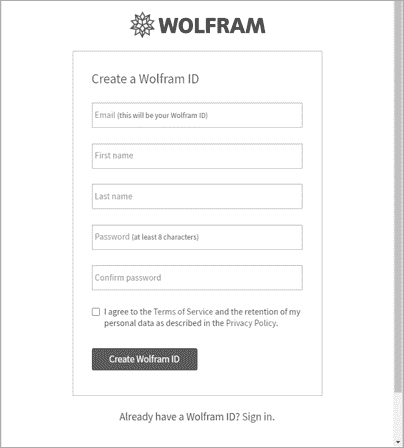
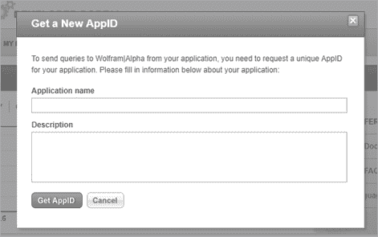

# 第二部分：学习说话

## 语音识别


在本章中，我们将通过语音与 Python 互动。我们将首先安装*SpeechRecognition*模块；安装过程可能会让人感到沮丧，因此需要特别注意。然后，你将创建一个脚本，让 Python 识别你的语音并打印出来，确保语音识别功能在你的计算机上能够顺利运行。

你将使用语音控制完成几个任务，包括语音听写、打开网页浏览器、打开文件和播放计算机上的音乐。你会把所有与语音识别相关的代码放入一个自定义本地模块中，这样最终的脚本简洁易读。

在开始之前，为本章创建文件夹*/mpt/ch03/*。本章所有脚本都可以在本书的资源页面找到，[`www.nostarch.com/make-python-talk/`](https://www.nostarch.com/make-python-talk/)。

## 安装 SpeechRecognition 模块

安装*SpeechRecognition*模块可能会有些棘手，甚至让人感到沮丧。别慌，我们会讨论如何在 Windows、Mac 和 Linux 上安装它。安装*SpeechRecognition*模块比大多数模块多了一步，因为它依赖于*Pyaudio*模块，我们需要手动安装它。*Pyaudio*模块提供了跨平台音频输入/输出库*Portaudio*的绑定。

你也不能在 Anaconda 提示符中使用`pip install`安装*Pyaudio*模块。相反，你需要使用`conda install`来安装它。

### 在 Windows 中

首先，你需要从第二章激活虚拟环境*chatting*。去你的 Anaconda 提示符，输入以下命令：

```py
**conda activate chatting**
```

你应该看到一个修改过的提示符：

```py
(chatting) c:\>
```

请注意，提示符中的`(chatting)`表示你现在处于虚拟环境*chatting*中。如果命令没有成功，返回到第二章，查看如何创建和激活虚拟环境的完整说明。

接下来，在 Anaconda 提示符中输入以下命令：

```py
(chatting) c:\> **pip install SpeechRecognition** 
```

如果你尝试导入并运行脚本，Spyder 会告诉你需要*Pyaudio*模块才能使*SpeechRecognition*模块正常运行。

在虚拟环境*chatting*激活的情况下，在你的 Anaconda 提示符中运行以下命令：

```py
(chatting) c:\> **conda install pyaudio** 
```

请按照说明完成所有步骤。

### 在 Mac 或 Linux 中

首先，激活虚拟环境*chatting*。打开终端，输入并执行以下命令：

```py
**conda activate chatting**
```

接下来，在终端中执行以下命令：

```py
**pip install SpeechRecognition** 
```

如果你现在尝试导入*SpeechRecognition*并运行脚本，Spyder 会告诉你需要*Pyaudio*才能让*SpeechRecognition*正常工作。虚拟环境*chatting*激活后，在终端中运行以下命令：

```py
**conda install pyaudio** 
```

请按照说明完成所有步骤。

## 测试并微调 SpeechRecognition

接下来，我们将测试并微调*SpeechRecognition*模块，以便 Python 能够接受你的语音命令。

### 导入 SpeechRecognition

要在你的 Python 脚本中导入*SpeechRecognition*，请使用以下命令：

```py
**import speech_recognition**
```

请注意，在安装模块和导入模块时，模块名称略有不同：一个是*SpeechRecognition*，另一个是*speech_recognition*。确保在导入时不要漏掉模块名中的下划线。

如果你使用的是台式电脑，记得要插入麦克风。大多数笔记本电脑自带内置麦克风，但有时候使用外接麦克风会更方便，能让你靠近麦克风说话，避免环境噪音的干扰。

### 测试 SpeechRecognition

接下来，我们来测试硬件和软件。将 Listing 3-1 输入到你的 Spyder 编辑器中，并将其保存为*sr.py*，或者你也可以从书籍的资源中下载该文件。

```py
import speech_recognition as sr
speech = sr.Recognizer()
print('Python is listening...')
with sr.Microphone() as source:
    speech.adjust_for_ambient_noise(source)
    audio = speech.listen(source)
    inp = speech.recognize_google(audio)
print(f'You just said {inp}.') 
```

Listing 3-1：测试*SpeechRecognition*

我们导入*SpeechRecognition*模块。接下来，我们调用`Recognizer()`来从该模块创建一个*Recognizer*实例，这样脚本就准备好将语音转换为文本。我们将其保存为变量`speech`，并打印出一条消息，通知你麦克风已经准备好接收语音输入。

我们通过`Microphone()`告诉脚本音频来源来自麦克风。我们使用`adjust_for_ambient_noise()`方法来减少环境噪音对语音输入的影响。脚本从定义的麦克风捕获语音输入，将其转换为文本，并保存到`inp`变量中。我们打印出`inp`的值。

请注意，在这个脚本中，*Recognizer*实例使用`recognize_google()`来识别音频源中的语音。此方法使用 Google Web Speech 应用程序编程接口（API），需要良好的互联网连接。*SpeechRecognition*模块中的*Recognizer*实例还提供了其他方法，如`recognize_bing()`（使用微软 Bing 语音识别），`recognize_ibm()`（使用 IBM Speech to Text）等。唯一可以离线使用的方法是`recognize_sphinx()`，它使用 CMU Sphinx 的服务。然而，`recognize_sphinx()`的识别准确度远不如`recognize_google()`，因此我们在本书中将使用`recognize_google()`。

运行*sr.py*，并说一些简单的话，比如“Hello”或“How are you?”，来测试 Python 是否能正确打印出你的语音输入。如果你说了“How are you?”，应该会看到以下输出：

```py
Python is listening...
You just said **how are you**.
```

如果脚本正常运行，说明你已经成功安装了语音识别功能。如果没有，请仔细检查前面的步骤，并确保你的麦克风正确连接。同时，确保你处在一个相对安静的地方，并且网络连接良好。

注意，Python 会将几乎所有的语音输入转换为小写文本，这是一个不错的功能，因为字符串变量是区分大小写的。这样，Python 就不会因为大小写问题而错过某个命令。

### 微调语音识别功能

现在你将微调语音识别代码，使其更适合本书的后续内容。我们将在一些常见错误上使用`try`和`except`，以便在遇到错误后，代码能够继续执行，而不是导致脚本崩溃。

常见错误`UnknownValueError`发生在 Google 语音识别服务器无法理解音频时，可能是因为语音不清晰或周围有噪音。`RequestError`错误发生在 Google 语音识别请求失败时，可能是由于网络连接差或服务器过于繁忙。`WaitTimeoutError`错误发生在脚本长时间未检测到麦克风的音频时。

如果不使用`try`和`except`，脚本会崩溃，你需要重新启动脚本。通过使用异常处理结构，脚本会继续运行而不会崩溃。我提到的这些错误并没有足够严重到需要处理，所以我们的脚本会允许这些错误通过。

列表 3-2，*stand_by.py*，使用了一个无限循环，首先进入待命状态，然后反复接收语音输入并打印出来。这样，我们就不必每次都重新运行脚本才能让脚本接收我们的语音输入。

```py
import speech_recognition as sr

speech = sr.Recognizer()
while True:
    print('Python is listening...')
    inp = "" 
 with sr.Microphone() as source:
        speech.adjust_for_ambient_noise(source)
      1 try:
            audio = speech.listen(source)
            inp = speech.recognize_google(audio)
        except sr.UnknownValueError:
            pass
        except sr.RequestError:
            pass        
        except sr.WaitTimeoutError:
            pass
  2 print(f'You just said {inp}.')
    if inp == "stop listening":
        print('Goodbye!')
        break
```

列表 3-2：*stand_by.py* 的代码

我们启动一个`while`循环，使脚本处于待命状态。这样，在获取你的语音输入后，脚本会打印出你说的话，并重新开始监听。每次迭代时，脚本都会打印`Python is listening`，让你知道它已经准备好。我们在每次迭代开始时将变量`inp`定义为空字符串。否则，如果用户一段时间内没有说话，脚本会使用上次迭代的`inp`值。通过清空字符串，我们避免了潜在的混淆。

我们在连接到 Google 语音识别服务器时使用异常处理。如果出现`UnknownValueError`、`RequestError`或`WaitTimeoutError`，我们让脚本继续运行而不会崩溃。

在每次迭代时，脚本会打印你说的话，以便你检查语音识别软件是否正确捕捉到你的声音。

最后，我们不希望脚本永远运行下去，所以我们添加了一个停止条件。当你说“停止监听”时，`if`分支会被激活，脚本会打印`Goodbye!`，然后`while`循环停止。

这是一个示例输出，我的语音输入以粗体显示：

```py
Python is listening...
You just said **hello**.
Python is listening...
You just said **how are you**.
Python is listening...
You just said **today is a Saturday**.
Python is listening...
You just said **stop listening**.
Goodbye!
```

接下来，你将在多个项目中应用语音识别功能。它们中有些是实际且有用的，其他的则是为了为后续章节积累技能。

## 执行语音控制的网页搜索

我们的第一个项目是编写一个脚本，使用语音控制浏览网页。你将学习使用*webbrowser*模块在计算机上打开浏览器。然后，你将添加语音控制功能，打开浏览器并执行各种在线搜索。

### 使用 webbrowser 模块

*webbrowser*模块为你提供了使用计算机默认浏览器打开网站的工具。该模块属于 Python 标准库，因此无需安装。

要在你的计算机上测试*webbrowser*模块，请在 Spyder 编辑器中输入以下代码行并运行：

```py
**import webbrowser**
**webbrowser.open("http://"+"wsj.com")**
```

我们在`open()`函数内部使用`"http://"+`，这样你只需要输入网站地址的主体部分，而不必输入完整的 URL。这是为了为下一部分的语音激活做准备。如果使用*https://*代替*http://*或在完整 URL 中包含*www*，网页浏览器会自动纠正 URL。

一个新的网页浏览器窗口应该会在*华尔街日报*网站上打开。Microsoft Edge 是我计算机上的默认浏览器，结果如图 3-1 所示。


图 3-1：使用`webbrowser.open("http://"+"wsj.com")`命令的结果

### 添加语音控制

现在我们将添加语音识别功能。将清单 3-3 保存为*voice_browse.py*。

```py
import webbrowser
import speech_recognition as sr

speech = sr.Recognizer()
1 def voice_to_text():
    voice_input = "" 
    with sr.Microphone() as source:
        speech.adjust_for_ambient_noise(source)
        try:
            audio = speech.listen(source)
            voice_input = speech.recognize_google(audio)
        except sr.UnknownValueError:
            pass
        except sr.RequestError:
            pass        
        except sr.WaitTimeoutError:
            pass
    return voice_input 
2 while True:   
    print('Python is listening...')
    inp = voice_to_text()
    print(f'You just said {inp}.')
    if inp == "stop listening":
        print('Goodbye!')
        break
    elif "browser" in inp: 
        inp = inp.replace('browser ','')
        webbrowser.open("http://"+inp)
        continue
```

清单 3-3：*voice_browse.py*代码

我们导入了该脚本所需的两个模块：*webbrowser*和*SpeechRecognition*。在 1 处，我们定义了`voice_to_text()`函数，该函数包含了*stand_by.py*中的大部分步骤：它以空字符串`voice_input`开始，将麦克风的音频转换为文本，并将其放入`voice_input`中。它还对`UnknownValueError`、`RequestError`和`WaitTimeoutError`进行异常处理。一旦调用，该函数将返回保存在`voice_input`中的值。

脚本启动一个无限循环，持续接收语音输入 2。在每次迭代时，它会打印`Python is listening...`，以便你知道它已准备好。

我们调用`voice_to_text()`来捕获你的语音输入，并将转换后的文本保存在`inp`中。请注意，我故意为局部变量`voice_input`和全局变量`inp`使用不同的变量名，以避免混淆。

如果你对麦克风说“Stop listening”，则`if`分支会被激活。脚本会打印`Goodbye!`并停止运行。如果语音命令中包含*browser*这个词，`elif`分支会被激活。脚本随后会把`http://`和你接下来所说的内容放到地址栏，并打开网页浏览器。例如，如果你说“browser abc.com”，`replace()`方法会将“browser”及其后面的空格替换为空字符串，这样就有效地将`inp`修改为`abc.com`。

这是一个示例输出，带有我用粗体显示的语音输入：

```py
Python is listening...
You just said **browser cnn.com**.
Python is listening...
You just said **browser pbs.org**.
Python is listening...
You just said **stop listening**.
Goodbye!
```

相关的网页浏览器弹出窗口如图 3-2 所示。


图 3-2：*voice_browse.py*的一个示例输出

你使用*browser*而不是*browse*来确保脚本能够理解你的命令：如果你对着麦克风说“Browse”，Python 可能会将其转换为`brows`。你可能会遇到一些需要微调的情况。由于每个人的声音、麦克风和发音（口音、语调、重音等）不同，你的调整可能与我的不同。

### 执行 Google 搜索

接下来，我们将修改*voice_browse.py*，使你能够通过语音激活 Google 搜索。你只需要修改*voice_browse.py*中的这一行代码：

```py
 webbrowser.open("http://"+inp)
```

将其更改为：

```py
 webbrowser.open("http://**google.com/search?q=**"+inp)
```

然后将修改后的脚本保存为*voice_search.py*。（你也可以从本书的资源页面下载它。）

这里我们利用了 Google 搜索时会将搜索词附加在*http://google.com/search?q=*后面，并作为地址栏中的 URL。例如，当你在 Google 中搜索`how many liters are in a gallon`时，得到的结果与输入 URL *http://google.com/search?q=how many liters are in a gallon*相同。

在 Spyder 编辑器中运行*voice_search.py*。对着麦克风提问，比如“Browser yards in a mile”。脚本应打开默认浏览器，执行`yards in a mile`的 Google 搜索，并显示与图 3-3 类似的结果。


图 3-3：当你说“browser yards in a mile”时的结果

你还可以以任何使用 Google 的方式使用该脚本，例如作为语音控制的词典。如果你想知道单词*diligence*的准确定义，可以说：“Browser define diligence。”

## 打开文件

利用 Python 脚本中的语音识别功能，你可以通过语音控制完成许多操作。我们将编写一个脚本来打开各种类型的文件，包括文本文件、PDF 文件和音乐文件。

### 使用 os 和 pathlib 模块访问和打开文件

你可以使用*os*和*pathlib*模块访问计算机上的文件和文件夹。*os*模块用于访问操作系统的功能，比如*进入文件夹*、*打开文件*等等。然而，这些命令在不同操作系统上有所不同。例如，在 Windows 中打开文件的命令是`explorer`，在 Mac 中是`open`，在 Linux 中是`xdg-open`。

为了让你的脚本在跨平台上更具便携性，我们将使用*platform*模块，它允许脚本自动识别你的操作系统，并选择适合的命令。*pathlib*模块可以让你找到文件路径并指定文件或文件夹路径。幸运的是，*pathlib*是跨平台的，所以你不必担心正斜杠或反斜杠的问题。这三个模块——*os*、*pathlib*和*platform*——都在 Python 标准库中，因此无需额外安装。

在你的章节文件夹中，创建一个名为*files*的子文件夹，并将一个名为*example.txt*的文件保存在其中。然后，在 Spyder 编辑器中输入 Listing 3-4，并将其保存为*os_platform.py*。

```py
import os
import pathlib
import platform

myfolder = pathlib.Path.cwd()
print(myfolder)
myfile = myfolder/'files'/'example.txt'
print(myfile)
if platform.system() == "Windows":
    os.system(f"explorer {myfile}") 
elif platform.system() == "Darwin":
    os.system(f"open {myfile}") 
else:
    os.system(f"xdg-open {myfile}") 
```

Listing 3-4：*os_platform.py*的代码

我们导入模块后，使用*pathlib*中的`Path.cwd()`找到脚本的当前工作目录。我们将以此作为导航的起始路径。

然后，我们指定要打开的文件的路径和名称。在*pathlib*模块中，我们使用正斜杠表示子文件夹，无论你使用的是哪个操作系统。命令`/'files'`指示脚本进入子文件夹*files*，`/'example.txt'`则表示将*example.txt*文件定义为*myfile*。

*os*模块中的`system()`方法在子 shell 中执行命令。`explorer`命令会在 Windows 中打开一个文件夹或文件。然而，如果你使用的是 Mac，*os*模块中的`system()`方法会使用`open`命令，在 Linux 中，命令则是`xdg-open`。因此，脚本会在子文件夹*files*中打开文件*example.txt*。

例如，假设你使用的是 Windows，并将脚本保存在章节文件夹*C:\chat\mpt\ch03*中。运行脚本后，你将在 IPython 控制台中看到以下输出：

```py
C:\chat\mpt\ch03
C:\chat\mpt\ch03\files\example.txt
```

同时，文件*example.txt*应该被打开。

### 通过语音控制打开文件

现在，我们将演示如何打开各种文件类型，如 MP3、Microsoft Word、PowerPoint 和 Excel 文件，以及 PDF 文件。在运行以下脚本之前，请在你刚刚创建的章节文件夹中的*files*子文件夹中保存一个 MP3 文件、一个 Word 文件、一个 PowerPoint 文件、一个 Excel 文件和一个 PDF 文件。将这五个文件分别命名为*presentation.mp3*、*lessons.docx*、*graduation.pptx*、*book.xlsx*和*desk.pdf*。文件最好不要太大。

列表 3-5 显示了*voice_open_file.py*，该脚本也可以从书本的资源页面下载。

```py
import os
import pathlib
import platform

import speech_recognition as sr 

speech = sr.Recognizer()
directory = pathlib.Path.cwd()

1 def voice_to_text():
    voice_input = "" 
    with sr.Microphone() as source:
        speech.adjust_for_ambient_noise(source)
        try:
 audio = speech.listen(source)
            voice_input = speech.recognize_google(audio)
        except sr.UnknownValueError:
            pass
        except sr.RequestError:
            pass        
        except sr.WaitTimeoutError:
            pass
    return voice_input
def open_file(filename):
    if platform.system() == "Windows":
        os.system(f"explorer {directory}\\files\\{filename}") 
    elif platform.system() == "Darwin":
        os.system(f"open {directory}/files/{filename}") 
    else:
        os.system(f"xdg-open {directory}/files/{filename}")
2 while True:
    print('Python is listening...')
    inp = voice_to_text().lower()
    print(f'You just said {inp}.')
    if inp == "stop listening":
        print('Goodbye!')
        break
    elif "open pdf" in inp: 
        inp = inp.replace('open pdf ','')
        myfile = f'{inp}.pdf'
        open_file(myfile)
        continue
    elif "open word" in inp: 
        inp = inp.replace('open word ','')
        myfile = f'{inp}.docx'
        open_file(myfile)
        continue
    elif "open excel" in inp: 
        inp = inp.replace('open excel ','')
        myfile = f'{inp}.xlsx'
        open_file(myfile)
        continue
    elif "open powerpoint" in inp: 
        inp = inp.replace('open powerpoint ','')
        myfile = f'{inp}.pptx'
        open_file(myfile)
        continue
    elif "open audio" in inp: 
        inp = inp.replace('open audio ','')
        myfile = f'{inp}.mp3'
        open_file(myfile)
        continue
```

列表 3-5：*voice_open_file.py*的代码

和*voice_browse.py*一样，我们定义了`voice_to_text()`来将你的语音命令转换为文本。我们还定义了`open_file()`来识别你的操作系统并使用正确的命令，`explorer`、`open`或`xdg-open`，在你的计算机上打开文件。请注意，虽然 Windows 操作系统使用反斜杠(`\`)进入子文件夹，但 Mac 和 Linux 使用正斜杠(`/`)来实现这一目的。

然后，脚本通过使用`while`循环进入待机模式。在循环内，麦克风首先检测到你的声音并将其转换为文本。由于我们在`voice_to_text()`后面使用了`lower()`方法，变量`inp`中的所有字母都会变为小写，以避免因大小写不匹配而出错。

如果你说“停止监听”，脚本会打印`Goodbye!`并停止运行。如果语音命令中包含*open pdf*，第一个`elif`分支将被激活。然后，脚本将用空字符串替换`open pdf`，这样`inp`中就只剩下文件名。脚本会进入子文件夹并打开正确的 PDF 文件。例如，当你说“打开 PDF 桌面”时，文件*desk.pdf*将在你的计算机上打开。

当你说“打开 Word 课件”时，第二个`elif`分支会被激活。对于 Excel 文件和 PowerPoint 文件，同样的原理适用。当你说“打开音频演示”时，音频文件*presentation.mp3*会在你的计算机上播放，使用默认的 MP3 播放器。

这是我与系统交互的输出：

```py
Python is listening...
You just said **open pdf desk**.
Python is listening...
You just said **open word lessons**.
Python is listening...
You just said 
Python is listening...
You just said **open excel book**.
Python is listening...
You just said **open powerpoint graduation**.
Python is listening...
You just said **open audio presentation**.
Python is listening...
You just said **stop listening**.
Goodbye!
```

## 创建并导入本地模块

如你所见，三个脚本*voice_browse.py*、*voice_search.py*和*voice_open_file.py*共享大量相同的代码：导入语音识别模块并定义`voice_to_text()`函数的代码。

为了提高脚本效率，我们将所有与语音识别相关的命令行放入本地模块中。然后，我们可以在任何使用语音识别功能的脚本中导入这个模块。

### 创建本地模块 mysr

在 Spyder 编辑器中输入列表 3-6，并将其保存为*mysr.py*。或者，你可以从本书的资源页面下载它。

```py
# Get rid of ALSA lib error messages in Linux
1 import platform
import speech_recognition as sr

if  platform.system() == "Linux":
    from ctypes import CFUNCTYPE, c_char_p, c_int, cdll

    # Define error handler
    error_handler = CFUNCTYPE\
    (None, c_char_p, c_int, c_char_p, c_int, c_char_p)
    # Don't do anything if there is an error message
  2 def py_error_handler(filename, line, function, err, fmt):
      pass
    # Pass to C
    c_error_handler = error_handler(py_error_handler)
    asound = cdll.LoadLibrary('libasound.so')
    asound.snd_lib_error_set_handler(c_error_handler)

# Now define the voice_to_text() function for all platforms
3 import speech_recognition as sr

def voice_to_text():
    voice_input = "" 
    with sr.Microphone() as source:
        speech.adjust_for_ambient_noise(source)
        try:
            audio = speech.listen(source)
            voice_input = speech.recognize_google(audio)
        except sr.UnknownValueError:
            pass
        except sr.RequestError:
            pass        
        except sr.WaitTimeoutError:
            pass
    return voice_input
```

列表 3-6：自制模块*mysr*的代码

如果你不使用 Linux，可以忽略代码 1 的第一部分。高级 Linux 声音架构 (ALSA) 配置使用 C 编程语言编写，每次导入*pyaudio*模块时，都会输出如下警告信息：

```py
ALSA lib pcm.c:2212:(snd_pcm_open_noupdate) Unknown PCM cards.pcm.rear
ALSA lib pcm.c:2212:(snd_pcm_open_noupdate) Unknown PCM cards.pcm.center_lfe
ALSA lib pcm.c:2212:(snd_pcm_open_noupdate) Unknown PCM cards.pcm.side
ALSA lib audio/pcm_bluetooth.c:1613:(audioservice_expect) 
BT_GET_CAPABILITIES failed : Input/output error(5)
ALSA lib audio/pcm_bluetooth.c:1613:(audioservice_expect) 
BT_GET_CAPABILITIES failed : Input/output error(5)
ALSA lib audio/pcm_bluetooth.c:1613:(audioservice_expect) 
BT_GET_CAPABILITIES failed : Input/output error(5)
ALSA lib audio/pcm_bluetooth.c:1613:(audioservice_expect) 
BT_GET_CAPABILITIES failed : Input/output error(5)
ALSA lib pcm_dmix.c:957:(snd_pcm_dmix_open) 
The dmix plugin supports only playback stream
ALSA lib pcm_dmix.c:1018:(snd_pcm_dmix_open) unable to open slave
```

我们在 Python 2 中创建了一个错误处理程序，并将其传递给 C，以便在导入*pyaudio*时不会显示任何错误信息。具体细节超出了本书的范围，所以如果你不理解这一部分也没关系。只需将错误处理程序保留在模块*mysr*中，它不会影响你对本书其他部分的理解。

从第 3 行开始，我们导入了*SpeechRecognition*模块，初始化`Recognizer()`类，并定义了`voice_to_text()`函数。

请注意，如果你运行*mysr.py*，什么也不会发生。这是因为我们只在这个脚本中定义了`voice_to_text()`，但没有调用它。

### 导入 mysr

让我们重新审视*stand_by.py*并修改它以使用*mysr*。将列表 3-7 保存为*stand_by1.py*。

```py
# Make sure you put mysr.py in the same folder as this script
from mysr import voice_to_text

while True:
    print('Python is listening...')
  1 inp = voice_to_text()
    print(f'You just said {inp}.')
    if inp == "stop listening":
        print('Goodbye!')
        break
```

列表 3-7：*stand_by1.py*的代码

我们用一行代码替代了所有与语音识别相关的代码：`from mysr import voice_to_text`。这行代码告诉脚本去本地模块*mysr*导入`voice_to_text()`，并在当前脚本中使用。

每当你需要将语音转换为文本时，只需调用`voice_to_text()` 1。

## 小结

在本章中，我们安装了*SpeechRecognition*模块，并使用`try`和`except`来处理潜在的错误。通过这种方式，我们防止脚本关闭，而是让它继续运行。我们使用几个项目测试了语音控制功能：语音控制网页浏览和语音控制网页搜索。

你学习了如何使用*os*模块打开文件，如何使用*pathlib*模块在文件路径中导航，以及如何使用*platform*模块使你的 Python 代码跨平台。

最后，你将所有与语音识别相关的代码放入一个自制的本地模块中，这样你的脚本看起来简洁、简短且清晰。我们将在本书的剩余部分使用这个模块。

## 本章结束练习

1.  修改*stand_by.py*，使得你可以通过说“Quit the script”来结束`while`循环，而不是说“Stop listening”。当`while`循环结束时，脚本会打印`Have a great day!`

1.  修改*voice_open_file.py*，使得当你说“Open text filename”时，*filename.txt*文件将在你的电脑上打开。

1.  修改*voice_open_file.py*，使其从本地*mysr*模块导入`voice_to_text()`。

## 让 Python 发声


在本章中，你将学习如何让 Python 用人类的声音回应你。你将首先根据操作系统安装文本转语音模块，然后教 Python 大声朗读你在电脑上输入的内容。你还将添加你在第三章中学到的语音识别功能，让 Python 重复你自己的话。最后，你将构建一个实际的应用程序，使用语音输入让 Python 计算矩形的面积，并用人类的声音告诉你答案。

为了节省空间，你将所有与文本转语音相关的代码放入自制模块中。完成后，你可以将该模块导入到任何需要文本转语音功能的脚本中。

你还将学习如何让 Python 大声朗读一篇长的文本文件，例如新闻文章。在开始之前，为本章设置文件夹*/mpt/ch04/*。像之前的章节一样，你可以从[`www.nostarch.com/make-python-talk/`](https://www.nostarch.com/make-python-talk/)下载所有脚本的代码。

## 安装文本转语音模块

Python 有两个常用的文本转语音模块：*pyttsx3*和*gTTS*。如果你使用 Windows，你将安装*pyttsx3*并在本书中始终使用它。在 Windows 操作系统中，*pyttsx3*模块是离线工作的，语音听起来像人类，并且可以调整语音属性——即语音输出的速度、音量和性别。

然而，*pyttsx3*模块在 Mac 和 Linux 上的工作方式不同。语音听起来很机械，而且语音属性不容易调整。因此，如果你使用 Mac 或 Linux，需安装*gTTS*。*gTTS*模块需要互联网连接，因为它使用了 Google 翻译的文本转语音 API。此外，*gTTS*不会直接播放声音，而是将语音保存为音频文件或类似文件的对象。你需要使用自己的音频播放器来播放语音。*gTTS*生成的语音非常像人类的声音。

在第二章中，你创建了一个名为*chatting*的虚拟环境，并在第三章中使用它进行语音识别。你将在同一个虚拟环境中安装*pyttsx3*或*gTTS*模块，这样你的脚本就既能进行语音识别，又能实现文本转语音功能。

### 设置

如果你使用的是 Windows，请前往“在 Windows 中安装*pyttsx3*”部分，并跳过“在 Mac 或 Linux 中安装*gTTS*”部分。否则，请跳过“在 Windows 中安装*pyttsx3*”部分，转到“在 Mac 或 Linux 中安装*gTTS*”部分。

#### 在 Windows 中安装 pyttsx3

*pyttsx3*模块不在 Python 标准库中，因此你需要通过 pip 安装它。

如果你还没有设置*聊天*虚拟环境，请返回第二章并按照指示进行设置。然后在 Anaconda 提示符中通过执行以下命令激活*聊天*虚拟环境：

```py
conda activate chatting
```

激活你的*聊天*虚拟环境后，输入以下命令：

```py
pip install pyttsx3
```

按照屏幕上的指示完成安装。

#### 在 Mac 或 Linux 中安装 gTTS

*gTTS*模块不在 Python 标准库中，因此你需要通过 pip 安装它。

如果你还没有设置*聊天*虚拟环境，请返回第二章并按照指示进行设置。然后在终端中通过执行以下命令激活*聊天*虚拟环境：

```py
conda activate chatting
```

激活你的*聊天*虚拟环境并在终端中输入以下命令：

```py
pip install gTTs
```

按照屏幕上的指示完成安装。

### 测试你的文本转语音模块

在开始之前，你需要检查你的文本转语音模块是否正确安装并正常工作。根据你的操作系统，跳过不适用的部分。

#### 在 Windows 中运行示例脚本

激活虚拟环境并打开 Spyder 后，将脚本*test_pyttsx3.py*复制到编辑器中，并将其保存在你的章节文件夹中。如果你愿意，也可以通过[`www.nostarch.com/make-python-talk/`](https://www.nostarch.com/make-python-talk/)从书籍资源下载该文件。

```py
import pyttsx3
engine = pyttsx3.init()
engine.say("hello, how are you?")
engine.runAndWait()
```

首先，将*pyttsx3*模块导入脚本。然后使用`init()`启动一个文本转语音引擎，并将其命名为`engine`。*pyttsx3*模块中的`say()`函数将文本转换为语音信号，并准备将其发送到扬声器。接下来，`runAndWait()`函数将实际的语音信号发送到扬声器，这样你就能听到声音。`runAndWait()`函数还会保持引擎运行，以便在脚本的后续部分需要将文本转换为语音时，无需重新启动引擎。

为了理解每一行代码的功能，使用 F9 键逐行运行*test_pyttsx3.py*。

如果模块正确安装，运行完整个脚本后，你应该听到一个声音说：“Hello, how are you？”如果没有，请重新检查指示并确保电脑扬声器工作正常且音量合适。本章稍后将讨论如何自定义与*pyttsx3*模块相关的语速、音量和语音性别。

#### 在 Mac 或 Linux 中运行示例脚本

你将使用 gtts-cli 工具（*cli*代表*命令行*）将文本转换为语音，而不是先将文本转换为音频文件再播放。gtts-cli 工具比另一种方法更快。一旦安装了*gTTS*模块，gtts-cli 工具将在你的虚拟环境中的命令行中可用。gtts-cli 工具将文本转换为类似文件的对象，你需要选择一个音频播放器来播放它。我发现 mpg123 播放器效果很好。

首先，你需要在电脑上安装 mpg123 播放器。如果你使用的是 Mac，请在终端运行以下命令：

```py
brew install mpg123
```

如果你使用的是 Linux，请在终端运行以下两个命令：

```py
sudo apt-get update
sudo apt-get install mpg123
```

完成后，在虚拟环境激活的情况下，在终端运行以下命令：

```py
gtts-cli --nocheck "hello, how are you?" | mpg123 -q -
```

如果你已经正确安装了一切，你应该能听到一个声音说：“你好，你好吗？”如果没有，重新检查指令，确保你电脑上的扬声器正常工作并且音量合适。此外，既然你已经在虚拟环境中安装了*gTTS*模块，你需要在激活虚拟环境的情况下运行上述命令。否则，它将无法正常工作。

此命令中的`nocheck`选项是为了加速执行。`q`标志指示该模块即使在交互模式下也不显示版权和版本信息。确保你没有遗漏命令末尾的连字符。

接下来，你将使用 Python 中的*os*模块在子 shell 中执行命令。

将*test_gtts.py*脚本复制到你的 Spyder 编辑器中，并保存在章节文件夹里。该脚本也可以通过[`www.nostarch.com/make-python-talk/`](https://www.nostarch.com/make-python-talk/)在本书的资源中获取。

```py
import os

os.system('gtts-cli --nocheck "hello, how are you?" | mpg123 -q -')
```

首先将*os*模块导入到脚本中。然后使用`system()`在子 shell 中执行命令，以达到与在终端中运行命令相同的效果。因此，gtts-cli 工具被用来将文本转换为类似文件的对象。之后，mpg123 播放器播放该声音对象，这样你就可以听到人声。

如果你做对了，你应该能听到一个声音说：“你好，你好吗？”

#### 在 Windows 中将文本转换为语音

现在让我们练习将输入的文本转换成 Windows 中的人声。在你的虚拟环境已激活并且 Spyder 已打开的情况下，将 Listing 4-1 中显示的*tts_windows.py*脚本复制到编辑器中，保存并运行它。

```py
import pyttsx3

engine = pyttsx3.init()
1 while True:
    inp = input("What do you want to covert to speech?\n")
    if inp == "done":
         print(f"You just typed in {inp}; goodbye!")
         engine.say(f"You just typed in {inp}; goodbye!")
         engine.runAndWait()        
         break
  2 else:
        print(f"You just typed in {inp}")
        engine.say(f"You just typed in {inp}")
        engine.runAndWait()
        continue
```

Listing 4-1：在 Windows 中将文本转换为语音

在导入*pyttsx3*模块并初始化文本转语音引擎后，开始一个无限循环来接受用户的文本输入。在每次迭代中，脚本会在 IPython 控制台中请求文本输入。如果你想停止脚本，请输入`done`，然后脚本会用人声打印并说：“你刚刚输入了 done；再见！”之后，循环停止，脚本退出运行。

如果文本输入不是`done`，`else`分支会执行 2，脚本会用人类的声音大声说出你的文本输入。之后，脚本会进入下一次迭代，再次接受你的文本输入。

以下是脚本的示例输出（用户输入为**粗体**）：

```py
What do you want to covert to speech?
**Python is great!**
You just typed in Python is great!

What do you want to covert to speech?
**Hello, world!**
You just typed in Hello, world!

What do you want to covert to speech?
**done**
You just typed in done; goodbye!
```

#### 在 Mac 或 Linux 上将文本转换为语音

现在我们将练习将书面文本输入转换为人类声音，在 Mac 或 Linux 上。激活你的虚拟环境并打开 Spyder 后，将脚本*tts_mac_linux.py*（清单 4-2）复制到编辑器中，然后保存并运行。

```py
import os

while True: 1
    inp = input("What do you want to covert to speech?\n")
    if inp == "done":
        print(f"You just typed in {inp}; goodbye!")
        os.system(f'gtts-cli --nocheck "You just typed in {inp}; goodbye!" | mpg123 -q -')
        break
    else: 2
        print(f"You just typed in {inp}")
        os.system(f'gtts-cli --nocheck "You just typed in {inp}" | mpg123 -q -')
        continue
```

清单 4-2：在 Mac 和 Linux 上将文本转换为语音

在导入*os*模块后，你可以在子 shell 中运行命令，开始一个无限循环来接收用户的文本输入 1。在每次迭代中，脚本会在 IPython 控制台上请求文本输入。如果你想停止脚本，输入`done`，脚本会打印并用人类的声音说：“你刚输入了 done；再见！”之后，循环停止，脚本退出运行。

如果文本输入不是`done`，`else`分支会执行 2，脚本会用人类的声音大声说出你的文本输入。之后，脚本会进入下一次迭代，再次接受你的文本输入。

以下是脚本的示例输出（用户输入为**粗体**）：

```py
What do you want to covert to speech?
**Python is great!**
You just typed in Python is great!

What do you want to covert to speech?
**Hello, world!**
You just typed in Hello, world!

What do you want to covert to speech?
**done**
You just typed in done; goodbye!
```

## 跟我念

我们将从一个简单的脚本开始，它可以听到你大声说的话，并用人类的声音重复出来。这个脚本有两个目的。首先，你将学习脚本如何接收你的语音输入，以及哪些词语是脚本最容易理解的——一些不常见的词语是无法理解的。其次，你将学会如何将语音识别和文本转语音功能放在同一个脚本中，这样你就可以仅通过人类的声音与计算机进行交流。

我们还将使脚本具有跨平台可移植性。如果你使用的是 Windows，脚本会自动选择*pyttsx3*模块；如果不是，则选择*gTTS*模块。

开始一个新的脚本，命名为*repeat_me.py*，并输入清单 4-3 中的代码。确保将其保存在你的章节文件夹中。你还需要将第三章中的*mysr.py*文件复制到同一文件夹中，因为你将需要从该脚本中调用`voice_to_text()`。

```py
# Make sure you put mysr.py in the same folder as this script
from mysr import voice_to_text

import platform 1
if platform.system() == "Windows":
    import pyttsx3
    engine = pyttsx3.init()
else:
    import os

while True:   
    print('Python is listening...')
    inp = voice_to_text() 2
    if inp == "stop listening":
        print(f'You just said {inp}; goodbye!')
        if platform.system() == "Windows":
 engine.say(f'You just said {inp}; goodbye!')
            engine.runAndWait()
        else:
            os.system(f'gtts-cli --nocheck "You just said {inp}; goodbye!" | mpg123 -q -')
        break

    else:
        print(f'You just said {inp}')
        if platform.system() == "Windows": 3
            engine.say(f'You just said {inp}')
            engine.runAndWait()
        else:
            os.system(f'gtts-cli --nocheck "You just said {inp}" | mpg123 -q -')
        continue
```

清单 4-3：大声重复

首先，从*mysr*模块导入`voice_to_text()`函数，将语音命令转换为字符串变量。然后，导入*platform*模块，让脚本自动识别你的操作系统，并为你选择合适的命令 1。如果你使用的是 Windows，脚本会导入*pyttsx3*模块并启动文本转语音引擎。否则，脚本会导入*os*模块，以便你在子 shell 中使用 gtts-cli 工具。

然后，你开始一个无限循环以接收语音输入。脚本将你的语音命令转换为一个名为`inp` 2 的字符串变量。如果你对着麦克风说“Stop listening”，脚本将大声说，“你刚才说的是停止监听；再见！”然后脚本停止。该脚本根据你的操作系统使用*pyttsx3*模块或 gtts-cli 工具。

如果你对着麦克风说任何其他话，循环将继续运行。在每次迭代中，脚本将重复你所说的话 3。

以下是我依次对着麦克风说“Hello”、“How are you”和“Stop listening”后脚本的输出：

```py
Python is listening...
You just said **hello**
Python is listening...
You just said **how are you**
Python is listening...
You just said **stop listening**; goodbye!
```

## 自定义语音

在本节中，你将学习如何自定义你的文本到语音模块所产生的语音。你可以调整语速、音量以及在 Windows 中*pyttsx3*模块的语音身份。如果你使用的是 Mac 或 Linux，唯一可以自定义的就是*pyttsx3*模块中语音的语速。

跳过任何不适用于你操作系统的以下小节。

### 在 Windows 中检索*pyttsx3*模块的默认设置

首先，你需要查看*pyttsx3*模块中语速、音量和语音身份的默认参数值。

这个脚本将检索你的语音模块的默认设置。在 Spyder 中，输入 Listing 4-4 中的代码并将其保存为*pyttsx3_property.py*，并保存在章节文件夹中。

```py
import pyttsx3

engine = pyttsx3.init()
1 voices = engine.getProperty('voices')
for voice in voices:
    print(voice)
2 rate = engine.getProperty("rate")
print("the default speed of the speech is", rate)
vol = engine.getProperty("volume")
print("the default volume of the speech is", vol)
```

Listing 4-4：检索默认设置

在第 1 步，你使用`getProperty()`获取引擎中使用的语音的属性。然后，你遍历`voices`列表中的所有语音对象，并打印出每个语音对象。

你使用`getProperty()` 2 获取语速的属性并打印出默认语速，然后对默认音量做同样的操作。

如果你在 Windows 中运行这个脚本，你将看到类似以下的语音脚本默认设置输出：

```py
<Voice id=HKEY_LOCAL_MACHINE\SOFTWARE\Microsoft\Speech\Voices\Tokens\TTS_MS_EN-US_DAVID_11.0
          name=Microsoft David Desktop - English (United States)
          languages=[]
          gender=None
          age=None>
<Voice id=HKEY_LOCAL_MACHINE\SOFTWARE\Microsoft\Speech\Voices\Tokens\TTS_MS_EN-US_ZIRA_11.0
          name=Microsoft Zira Desktop - English (United States)
          languages=[]
          gender=None
          age=None>
the default speed of the speech is 200
the default volume of the speech is 1.0
```

在这里，你可以看到*pyttsx3*模块中提供的两种语音。第一种语音，名为*David*，具有男性音调；第二种语音，名为*Zira*，具有女性音调。默认的语音是 David——因此你在*test_pyttsx3.py*中听到的是男性声音。

默认的语速为每分钟 200 个单词。默认的音量设置为 1。接下来你将学习如何在 Windows 中调整*pyttsx3*模块的语速、音量和身份。

### 在 Windows 中调整*pyttsx3*模块的语音属性

这个脚本将改变默认设置，以便你可以听到具有你偏好的语速、音量和身份的语音。将 Listing 4-5 保存为*pyttsx3_adjust.py*。

```py
import pyttsx3
engine = pyttsx3.init()
voice_id = 1
1 voices = engine.getProperty('voices')
engine.setProperty('voice', voices[voice_id].id)
engine.setProperty('rate', 150)
engine.setProperty('volume', 1.2)
engine.say("This is a test of my speech id, speed, and volume.")
engine.runAndWait()
```

Listing 4-5：调整一些设置

选择第二个语音 ID，它有一个女性声音。在 1 的位置，脚本会获取文本到语音引擎中可用的语音对象，并将它们保存在名为`voices`的列表中。通过提供索引`[1]`，选择列表`voices`中的第二个对象，它有一个女性的声音。`setProperty()`函数需要两个参数：要设置的属性和要设置的值。将值设置为`voices[voice_id].id`，以选择 Windows 中女性语音对象的`id`值，即*HKEY_LOCAL_MACHINE\SOFTWARE\Microsoft\Speech\Voices\Tokens\TTS_MS_EN-US_ZIRA_11.0*。如果你想切换到 Windows 中的男性语音，可以使用`voices[0].id`。

接下来，你将语音速度设置为每分钟 150 个单词。我们大多数人在日常对话中的语速约为每分钟 125 个单词。对于更快的语速，将`rate`设置为大于 125 的数值；对于更慢的语速，将其设置为小于 125 的数值。

然后，音量设置为 1.2，比分贝默认值 1 更大。你可以根据自己的喜好和扬声器，将其设置为大于或小于 1 的值。

最后，脚本使用调整后的属性将`'say()'`中的文本转换为语音。尝试多次运行这个脚本，使用不同的参数组合，直到找到最适合你的设置。你可以随时返回此脚本并进行调整。

### 在 Mac 或 Linux 中自定义 gTTS 模块

你可以根据*gTTS*文档自定义语音的速度，但不能自定义音量或 ID；例如，参见[`buildmedia.readthedocs.org/media/pdf/gtts/latest/gtts.pdf`](https://buildmedia.readthedocs.org/media/pdf/gtts/latest/gtts.pdf)。然而，*gTTS*可以将文本转换为大多数世界主要语言的语音，包括西班牙语、法语、德语等，而*pyttsx3*模块无法做到这一点。你将在第十六章中使用*gTTS*的这个功能来构建语音翻译器。

这个脚本会将默认的语速改为慢速模式，适用于*gTTS*模块。在 Spyder 中，输入以下代码并将其保存为* gtts_slow.py*，放入章节文件夹中：

```py
import os

os.system('gtts-cli --nocheck --slow "hello, how are you?" | mpg123 -q -')
```

这个脚本与之前创建的*test_gtts.py*脚本相同，不同之处在于它添加了`--slow`选项。这会使语音输出比正常速度更慢。

如果你在 Mac 或 Linux 中运行这个脚本，你会听到计算机缓慢地说：“你好，你好吗？”

由于默认的速度设置是`slow=False`，而这是我们更倾向的设置，因此我们不会自定义*gTTS*模块。

## 构建本地 mysay 模块

在第三章中，你将所有与语音识别相关的命令放入一个名为*mysr*的本地模块。在这里你也会做同样的事，将所有与文本到语音相关的命令放入一个本地模块。

### 创建 mysay

你将创建一个本地模块*mysay*，并将其保存在与使用文本转语音功能的脚本相同的文件夹中。这样，你可以节省主脚本的空间。该模块已调整了*pyttsx3_adjust.py*中设置的语音速度、音量和性别属性（如果你使用的是 Windows）。如果你使用的是 Mac 或 Linux，本地模块*mysay*将使用*gTTS*模块中的默认属性。你可以根据自己的偏好修改这些参数。

输入列表 4-6 中的代码，并将其保存为*mysay.py*，放入你的章节文件夹中。

```py
# Import the platform module to identify your OS
import platform

# If you are using Windows, use pyttsx3 for text to speech
1 if platform.system() == "Windows":
    import pyttsx3
  2 try:
        engine = pyttsx3.init()
    except ImportError:
        pass
    except RuntimeError:
        pass    
    voices = engine.getProperty('voices')
    engine.setProperty('voice', voices[1].id)
    engine.setProperty('rate', 150)
    engine.setProperty('volume', 1.2)
 def print_say(txt):
        print(txt)
        engine.say(txt)
        engine.runAndWait()

# If you are using Mac or Linux, use gtts for text to speech
3 if  platform.system() == "Darwin" or platform.system() == "Linux":
    import os

    def print_say(texts):
        print(texts)
        texts = texts.replace('"','')
        texts = texts.replace("'","")
        os.system(f'gtts-cli --nocheck "{texts}" | mpg123 -q -')
```

列表 4-6：构建模块

你首先导入平台模块来识别你的操作系统。如果你使用的是 Windows 1，*pyttsx3*模块会被导入。你在初始化文本转语音引擎时使用了异常处理 2，以便如果遇到`ImportError`或`RuntimeError`，脚本会继续运行而不会崩溃。然后你定义了`print_say()`，该函数打印文本并将文本转换为语音。

如果你使用的是 Mac 或 Linux 3，*os*模块被导入以使用 gtts-cli 工具在子进程中运行命令。然后，你定义了一个不同的`print_say()`函数，该函数打印文本并将文本转为语音。

### 导入 mysay

准备好*mysay*后，你可以直接将该模块导入到你的脚本中，使用文本转语音功能。让我们重新审视脚本*repeat_me.py*并修改它，使用*mysay*模块。将以下内容保存为*repeat_me1.py*：

```py
# Put mysr.py and mysay.py in the same folder as this script
from mysr import voice_to_text
from mysay import print_say

while True:   
    print('Python is listening...')
    inp = voice_to_text()
    if inp == "stop listening":
        print_say(f'You just said {inp}; goodbye!')
        break
    else:
        print_say(f'You just said {inp}')
        continue
```

你首先从*mysay*导入`print_say()`。你还从第三章创建的*mysr*模块导入`voice_to_text()`。你使用`voice_to_text()`将语音命令转换为变量`inp`。当你想要将文本转换为语音时，你使用`print_say()`。

运行脚本并对着麦克风说话进行测试。我依次对着脚本说了“Hello again”，“这个使用的是文本转语音模块”，以及“Stop listening”。以下是输出结果：

```py
Python is listening...
You just said **hello again**
Python is listening...
You just said **this one is using a text-to-speech module**
Python is listening...
You just said **stop listening**; goodbye!
```

## 构建一个语音控制的计算器

你将使用文本转语音和语音解析技巧，构建一个可以通过语音命令控制的计算器。计算器会找到矩形的面积，并用人声告诉你面积。

这个脚本接受你输入的矩形宽度和长度，并语音播报其面积。将列表 4-7 保存为*area_hs.py*，放入你的章节文件夹中。

```py
# Put mysr.py and mysay.py in the same folder as this script
from mysr import voice_to_text
from mysay import print_say

# Ask the length of the rectangle
1 print_say('What is the length of the rectangle?')
# Convert the voice input to a variable inp1
inp1 = voice_to_text()
print_say(f'You just said {inp1}.')
# Ask the width of the rectangle
print_say('What is the width of the rectangle?')
# Save the answer as inp2
inp2 = voice_to_text()
print_say(f'You just said {inp2}.')
# Calculate the area
2 area = float(inp1)*float(inp2)
# Print and speak the result
print_say(f'The area of the rectangle is {area}.')
```

列表 4-7：计算矩形的面积

你首先从本地模块导入文本转语音和语音识别函数。脚本会询问你矩形的长度 1。对着麦克风说出一个数字，脚本将你的语音输入转换为文本并保存为变量`inp1`。然后脚本会询问你矩形的宽度。当你说出答案时，脚本会将你的语音输入保存在变量`inp2`中。

根据你的输入，脚本通过将语音输入转换为浮动变量并进行相乘来计算矩形的面积。

脚本不仅会大声朗读结果，还会将互动内容打印到屏幕上。以下是与脚本的一个互动示例：

```py
What is the length of the rectangle?
You just said **5.**
What is the width of the rectangle?
You just said **3.**
The area of the rectangle is 15.0.
```

当我告诉脚本矩形的长度为 5，宽度为 3 时，脚本告诉我面积是 15.0。

如果你说的不是数字，脚本将无法工作。为了避免脚本意外将你的响应转换为字符串而不是数字类型，最安全的做法是包含小数点（例如，“五点零”）。

## 大声朗读文件

在这一节中，你将学习如何将文件读取到脚本中，让 Python 能够大声朗读文本。

清单 4-8 包含了你将使用的简短新闻文章。

```py
Storm Dorian likely to strengthen into hurricane

Thomson Reuters
BY BRENDAN O'BRIEN Aug 25th 2019 3:49PM

Tropical Storm Dorian was likely to strengthen into a hurricane during the next two days as it churned westward in the Caribbean Sea, putting Puerto Rico, the Lesser Antilles and the Virgin Islands on alert, forecasters said on Sunday.

The storm, 465 miles (750 km) east-southeast of Barbados, packed 40 mph winds as it headed west at 14 mph. It was forecast to be near the central Lesser Antilles late on Monday or early Tuesday, the National Hurricane Center (NHC) said in a midday advisory on Sunday.

"Right now, it's a tropical storm and we are expecting it to strengthen close to or reaching hurricane intensity as it approaches," NHC meteorologist Michael Brennan told Reuters.

Dorian was expected to turn toward the west-northwest on Monday and continue on that path through Tuesday night, the NHC said.

As of Sunday afternoon, Barbados was under a tropical storm warning while a tropical storm watch was in effect for St. Lucia and St. Vincent and the Grenadines.

The NHC was likely to issue additional watches for portions of the Windward and Leeward Islands on Sunday, Brennan said, noting that Puerto Rico, the Virgin Islands and Hispaniola should monitor Dorian's progress.

"We are approaching the peak of the hurricane season so everybody in the Caribbean and along the U.S. South, Gulf and East Coast needs to be aware and follow these systems," Brennan said. Dorian's winds could weaken as it passes south of Puerto Rico and approaches Hispaniola. Many Caribbean islands are likely to receive 2 to 4 inches (5 to 10 cm) of rain, but some part of the
Lesser Antilles islands could get 6 inches, the NHC said.
```

清单 4-8：文本文件内容

直接将这篇文章包含到脚本中显然不太方便，因此将其保存为名为*storm.txt*的文本文件（你可以通过本书的其他资源下载*storm.txt*）。你可以先在章节文件夹中创建一个名为*files*的子文件夹，然后将*storm.txt*保存在子文件夹中。

将清单 4-9 保存为*newsfile.py*，让 Python 大声朗读新闻文章。

```py
# Put mysay.py in the same folder as this script
from mysay import print_say
import pathlib

# Open the file, and read the content of the text file
1 myfile = pathlib.Path.cwd() / 'files' / 'storm.txt'
with open(myfile,'r') as f:
      content = f.read()

# Let Python speak the text in the file
print_say(content)
```

清单 4-9：朗读文本文件

你首先让脚本知道在哪里找到新闻文件 1。你使用`open()`从子文件夹*files*访问*storm.txt*。然后，你使用`read()`将文件内容读取到一个名为`content`的字符串变量中。最后，脚本以人类的声音大声朗读文件内容。很简单！

如果你将*storm.txt*保存在与前面脚本相同的文件夹中，那么无需指定文件路径。Python 将在没有指定路径时自动查找脚本所在的文件夹。

## 总结

在这一章中，你学习了如何安装文本转语音模块让 Python 说话。你将关键的文本转语音功能移入了模块*mysay*，以便在脚本中导入。

你还学习了如何让 Python 重复你说的话。你将新学到的技能应用到一个实际的应用中：使用语音输入要求 Python 计算矩形的面积，并以人类声音告诉你答案。

现在你已经知道如何让 Python 说话和听话了，在第五章中你将学习如何将这两项功能应用到多个有趣的实际应用中。

## 章节末练习

1.  如果你使用的是 Windows 系统，请在*pyttsx3_adjust.py*中按如下方式修改代码：

    1.  该语音为男性声音。

    1.  语速为每分钟 160 个单词。

    1.  音量是 0.8。

1.  修改脚本*area_hs.py*，让它在你说出三角形的高度和底边长度时计算三角形的面积。

## 语音应用


现在你已经知道如何让 Python 说话和聆听，我们将创建几个利用这些技能的实际应用。但在此之前，你将创建一个本地包。由于你将在书中剩余的章节中使用 *mysr* 和 *mysay* 本地模块，你将创建一个 Python 包来包含所有本地模块。这样，你就不需要将这些模块复制粘贴到每一章节的文件夹中。这还可以帮助保持全书代码的一致性。在这个过程中，你将学习如何创建一个 Python 包以及它的工作原理。

在第一个应用中，你将创建一个“猜数字”游戏，该游戏能够接收语音命令并用人类的声音回应你。

接下来，你将学习如何解析文本，从国家公共广播电台（NPR）中提取新闻摘要，并让 Python 朗读它们。你还将构建一个脚本，根据你的语音查询从 Wikipedia 提取信息并读出答案。

最后，你将学习如何通过语音遍历文件夹中的文件，目标是构建你自己的 Alexa。你可以对脚本说：“Python，播放 Selena Gomez，”然后一首保存在你计算机中的 Selena Gomez 歌曲将开始播放。

和往常一样，你可以从 [`www.nostarch.com/make-python-talk/`](https://www.nostarch.com/make-python-talk/) 下载所有脚本的代码。在开始之前，为本章节创建文件夹 */mpt/ch05/*。

## 创建你自己的本地 Python 包

在第三章中，你创建了一个自定义的本地模块 *mysr* 来包含所有与语音识别相关的代码。每当你需要使用语音识别功能时，就从该模块导入 `voice_to_text()`。类似地，在第四章中，你创建了一个自定义的本地模块 *mysay* 来包含所有与语音合成相关的代码。每当你使用语音合成功能时，就从该模块导入 `print_say()`。

在本章以及本书的其他章节中，你将使用这两个自定义的本地模块。为了使这些模块正常工作，你需要将模块文件（即 *mysr.py* 和 *mysay.py*）放在与使用这些模块的脚本相同的目录中。这意味着你可能需要将这些文件复制粘贴到本书几乎每一章的目录中。你可能会想：有没有更高效的方法来实现这一点？

答案是肯定的，这正是 Python 包的用途。

接下来，你将首先了解什么是 Python 包及其如何工作。然后，你将学习如何创建自定义的本地包。最后，你将使用 Python 脚本测试并导入你的包。

### 什么是 Python 包？

许多人认为 Python 模块和 Python 包是一样的。其实它们并不相同。

Python *模块*是一个具有*.py*扩展名的单个文件。与此不同，Python *包*是包含在单一目录中的多个 Python 模块集合。该目录必须有一个名为 *__init__.py* 的文件，以便将其与其他仅包含*.py*扩展名文件的目录区分开来。

我将一步一步地引导你完成创建本地包的过程。

### 创建你自己的 Python 包

要创建本地 Python 包，你需要为其创建一个单独的目录，并将所有相关文件放入其中。在本节中，你将创建一个本地包来包含我们的语音识别和语音合成模块文件——即 *mysr.py* 和 *mysay.py*。

#### 创建包目录

首先，你需要为包创建一个目录。

在本书中，你为每一章使用一个单独的目录。例如，本章中的所有 Python 脚本和相关文件都放置在目录 */mpt/ch05/* 中。由于你正在创建一个将在本书所有章节中使用的包，你将创建一个与所有章节并列的目录。具体来说，你将使用目录 */mpt/mptpkg/*，其中 *mptpkg* 是包名。图 5-1 解释了包相对于书籍章节的位置。



图 5-1：*mptpkg* 包相对于章节文件夹的位置

如你所见，包目录与章节目录并列，所有目录都包含在本书的目录 */mpt* 中，就像 *Make Python Talk* 一样。

#### 为你的包创建必要的文件

接下来，你需要创建并放置包中所需的文件。

首先，将你在第三章和第四章创建的两个模块 *mysr.py* 和 *mysay.py* 复制并粘贴到包目录 */mpt/mptpkg/* 中。不要对这两个文件进行任何更改。

然后将以下脚本 *__init__.py* 保存在包目录 */mpt/mptpkg/* 中（你也可以从本书资源中下载它）：

```py
from .mysr import voice_to_text
from .mysay import print_say
```

这个文件的目的是双重的：它导入 `voice_to_text()` 和 `print_say()`，使你可以在包级别使用这些函数，并且它还告诉 Python 该目录是一个包，而不是一个恰好有 Python 脚本的文件夹。

最后，将以下脚本 *setup.py* 保存在书籍目录 */mpt* 中，位于包目录 */mpt/mptpkg/* 上一级。该脚本也可以从本书的资源中获得。

```py
from setuptools import setup
setup(name='mptpkg',
version='0.1',
description='Install local package for Make Python Talk',
author='Mark Liu',
author_email='mark.liu@uky.edu',
packages=['mptpkg'],
zip_safe=False)
```

该文件提供关于包的信息，例如包名、作者、版本、描述等。

接下来，你将学习如何在计算机上安装这个本地包。

#### 安装你的包

因为你将在本书后续部分修改本地包并为其添加更多功能，所以最好以可编辑模式安装该包。

打开 Anaconda 提示符（Windows）或终端（Mac 或 Linux），激活本书的虚拟环境 *chatting*。运行以下命令：

```py
**pip install -e** `path-to-mpt`
```

将 `path-to-mpt` 替换为 */mpt* 目录的实际路径。例如，在我的办公电脑上，运行 Windows 操作系统的 */mpt* 目录是 *C:\mpt*，因此我使用以下命令安装本地包：

```py
pip install -e C:\mpt
```

在我的 Linux 机器上，*/mpt* 目录的路径是 */home/mark/Desktop/mpt*，因此我使用以下命令安装本地包：

```py
pip install -e /home/mark/Desktop/mpt
```

`-e`选项告诉 Python 以可编辑模式安装包，这样你就可以在需要时随时修改该包。

至此，本地包已安装在你的计算机上。

### 测试你的包

现在你已经安装了自己制作的本地包，你将学习如何导入它。

你将编写一个 Python 脚本来测试你刚刚创建的包。

让我们回顾一下第四章中的脚本*repeat_me1.py*。在你的 Spyder 编辑器中输入以下代码行，并将其保存在第五章目录*/mpt/ch05/*下，命名为*repeat_me2.py*：

```py
# Import functions from the local package mptpkg
from mptpkg import voice_to_text
from mptpkg import print_say

while True:
    print('Python is listening...')
    inp = voice_to_text()
    if inp == "stop listening":
        print_say(f'you just said {inp}; goodbye!')
        break
    else:
        print_say(f'you just said {inp}')
        continue
```

首先，直接从*mptpkg*包中导入`voice_to_text()`和`print_say()`函数。回想一下，在脚本`__init__.py`中，你已经将这两个函数从模块*.mysr*和*.mysay*导入到包中。因此，在这里你可以直接从包中导入这两个函数。

剩下的脚本与*repeat_me1.py*中的相同。它会重复你说的内容。如果你说“停止监听”，脚本会停止。

以下是与*repeat_me2.py*的交互，我的语音输入以粗体显示：

```py
Python is listening...
you just said **how are you**
Python is listening...
you just said **I am testing a python package**
Python is listening...
you just said **stop listening**; goodbye! 
```

如你所见，脚本正常工作，这意味着你已经成功从本地包中导入了函数。

### 更多关于 Python 包的内容

在继续之前，我想提到关于 Python 包的几点事项。

首先，你可以向你的包中添加更多模块。在本书的后续章节中，你将向现有的本地包*mptpkg*中添加更多模块。你将使用整个书籍中的唯一本地包。这将减少目录的数量并帮助组织文件。

其次，如果你有一个有趣的包，想要与全世界分享，你可以很容易做到。你只需要添加一些额外的文件，比如许可证、README 文件等。关于如何分发你的 Python 包的教程，请参阅例如 Python Packaging Authority 网站，[`packaging.python.org/tutorials/packaging-projects/`](https://packaging.python.org/tutorials/packaging-projects/)。

## 互动猜数字游戏

*猜数字*是一个流行的游戏，其中一个玩家写下一个数字，要求另一个玩家在有限的尝试次数内猜出这个数字。每次猜测后，第一个玩家会告诉第二个玩家猜测是否正确，还是太高或太低。

游戏的各种版本可以在网上和书籍中找到，我们将查看我们自己的版本，猜一个 1 到 9 之间的数字。启动一个新脚本并将其保存为*guess_hs.py*；*hs*代表*听和说*。

因为脚本相对较长，我将把它分成三部分并逐一解释。列表 5-1 给出了第一部分。

```py
1 import time
import sys

# Import functions from the local package mptpkg
from mptpkg import voice_to_text
from mptpkg import print_say

# Print and announce the rules of the game in a human voice
2 print_say('''Think of an integer, 
      bigger or equal to 1 but smaller or equal to 9,
      and write it on a piece of paper''')
print_say("You have 5 seconds to write your number down")
# Wait for five seconds for you to write down the number
time.sleep(5)
print_say('''Now let's start. I will guess a number and you can say: 
    too high, that is right, or too small''')
# The script asks in a human voice whether the number is 5
print_say("Is it 5?")
# The script is trying to get your response and save it as re1
# Your response has to be 'too high', 'that is right', or 'too small'
3 while True:
    re1 = voice_to_text()
    print_say(f"You said {re1}")
    if re1 in ("too high", "that is right", "too small"):
        break
# If you say "that is right", game over
    if re1 == "that is right":
        print_say("Yay, lucky me!")
        sys.exit
`--snip--`
```

列表 5-1：猜数字游戏的第一部分

我们通过导入所需的模块来开始脚本。首先，我们导入*time*模块，以便在脚本中暂停一段时间。我们还导入*sys*模块，以便在脚本结束时退出。

如前一节所述，我们从本地包*mptpkg*中导入`voice_to_text()`和`print_say()`，用以将语音转换为文本并打印出来，以及通过语音播报文本信息。

脚本接着会用语音和文本打印出游戏规则 2。由于说明内容跨越多行，我们将它们放在三引号中，以使其更易读。

脚本宣布你有五秒钟的时间写下一个数字，然后通过使用`sleep()`暂停五秒钟，给你时间写下数字。

脚本然后开始猜测，它会用人声问数字是否是五。在第 3 步，我们开始一个无限循环来接受你的语音输入。当你对着麦克风说话时，计算机会将你的语音输入转换为一个名为`re1`的文本字符串变量。脚本会把你说的内容重复给你听。你的回应必须是以下三种之一：“太高”，“正确”或“太小”。如果不是，脚本会继续要求你回应，直到它匹配其中一个短语。这给了你一个机会，在脚本继续进行下一步之前，做出正确的回应。

如果你的回应是“正确”，计算机会说：“耶，真幸运！”然后退出脚本。接下来我们进入“太高”回应的行为。清单 5-2 展示了*guess_hs.py*脚本的中间部分。

```py
`--snip--`
# If you say "too high", the computer keeps guessing 
elif re1 == "too high":
    # The computer guesses 3 the second round
    print_say("Is it 3?")
    # The computer is trying to get your response to the second guess
    while True:
        re2 = voice_to_text()
        print_say(f"You said {re2}")
        if re2 in ("too high", "that is right", "too small"):
            break
    # If the second guess is right, game over
    if re2 == "that is right":
        print_say("Yay, lucky me!")
        sys.exit
    # If the second guess is too small, the computer knows it's 4
    elif re2 == "too small":
        print_say("Yay, it is 4!")
        sys.exit
    # If the second guess is too high, the computer guesses the third time
    elif re2 == "too high":
        # The third guess is 1
        print_say("Is it 1?")
        # The computer is getting your response to the third guess
        while True:
            re3 = voice_to_text()
            print_say(f"You said {re3}")
 if re3 in ("too high", "that is right", "too small"):
                break
        # If the third guess is too small, the computer knows it's 2
        if re3 == "too small":
            print_say("It is 2!")
            sys.exit
        # If the third guess is right, game over
        elif re3 == "that is right":
            print_say("Yay, lucky me!")
            sys.exit
`--snip--`
```

清单 5-2： “太高”行为

如果你的回应是“太高”，计算机会继续猜测，这次猜一个更低的数字。计算机的第二次猜测将是三，因为猜三可以减少计算机需要的尝试次数，以便找到答案。脚本将检测并捕捉你对第二次猜测的回应。

以下是你对第二次猜测的回应选项：如果是“正确”，计算机会说“耶，真幸运！”然后退出脚本。如果是“太小”，计算机会知道数字是四，并且会这么说。如果是“太高”，计算机会进行第三次猜测，猜数字一。

接下来，计算机会捕捉你对第三次猜测的回应。如果你的回应是“太小”，计算机会知道数字是二。如果你的回应是“正确”，计算机会说：“耶，真幸运！”然后退出。

现在让我们来看一下*guess_hs.py*的最后一部分，它处理对第一个猜测的“太小”回应。清单 5-3 展示了代码。

```py
`--snip--`
# If you say "too small", the computer keeps guessing 
elif re1 == "too small":
    # The computer guesses 7 the second round
    print_say("Is it 7?")
    # The computer is trying to get your response to the second guess
    while True:
        re2 = voice_to_text()
        print_say(f"You said {re2}")
        if re2 in ("too high", "that is right", "too small"):
            break
    # If the second guess is right, game over
    if re2 == "that is right":
        print_say("Yay, lucky me!")
        sys.exit
    # If the second guess is too high, the computer knows it's 6
    elif re2 == "too high":
        print_say("Yay, it is 6!")
        sys.exit
    # If the second guess is too small, the computer guesses the third time
    elif re2 == "too small":
        # The third guess is 8
 print_say("Is it 8?")
        while True:
            re3 = voice_to_text ()
            print_say(f"You said {re3}")
            if re3 in ("too high", "that is right", "too small"):
                break
        # If the third guess is too small, the computer knows it's 9
        if re3 == "too small":
            print_say("It is 9!")
            sys.exit
        # If the third guess is right, game over
        elif re3 == "that is right":
            print_say("Yay, lucky me!")
            sys.exit
```

清单 5-3： “太小”行为

脚本的最后一部分类似于中间部分。如果你告诉计算机第一次猜测的五是“太小”，计算机会给你第二次猜测七。脚本将捕捉你对第二次猜测的回应。

如果你回应“正确”，计算机会说：“耶，真幸运！”然后退出脚本。如果你说“太高”，计算机会知道数字是六。如果你的回应是“太小”，计算机会进行第三次猜测，猜八。

然后，计算机会捕捉到你对第三次猜测的回应。如果你的回答是“too small”，计算机将知道数字是九。如果你的回答是“that is right”，计算机将说：“耶，我真幸运！”然后退出脚本。

如果你在一个安静的环境中有良好的互联网连接，你就可以和计算机进行接近完美的沟通。互联网连接非常重要，因为我们使用 Google Web Speech API 将语音输入转换为文本。*SpeechRecognition*模块有一个离线方法叫做`recognize_sphinx()`，但它会出很多错误，所以我们使用在线方法。

这是脚本在我的数字是 8 时的输出（我的语音输入用**粗体**标注）：

```py
Please think of an integer,
bigger or equal to 1 but smaller or equal to 9,
and write on a piece of paper
You have 5 seconds to write it down
Now let's start. I will guess a number and you can say:
too high, that is right, or too small
Is it 5?
You said **too small**
Is it 7?
You said **too small**
Is it 8?
You said **that is right**
Yay, lucky me!
```

脚本完美地理解了我说的每一个字。当然，这部分原因是因为我选择了某些词汇来避免歧义。在构建你自己的项目时，你将需要使用独特的语音命令，或者将这些词语放在特定的语境中，以便获得一致且正确的结果。由于每个语音命令通常很短，Python 脚本可能会在理解你的语音输入的上下文并返回正确的单词时遇到困难。

例如，如果你对着麦克风说“too large”，脚本可能会返回“two large”，这虽然是一个有意义的短语。因此，我们在*guess_hs.py*中使用“too high”而不是“too large”。

类似地，当我对着麦克风说“too low”时，脚本时不时会返回“tulo”。当我使用“too small”时，我每次都会得到正确的回应。

## 语音播报新闻

在这个项目中，我们将抓取 NPR 新闻网站，以收集最新的新闻摘要，并让 Python 将其朗读出来。这个项目分为两个脚本：一个用于抓取和整理新闻，另一个用于处理语音识别和文本转语音功能。我们先从网页抓取开始。

### 抓取新闻摘要

首先，我们需要从新闻网站抓取信息，并将其整理成一个干净且易读的格式。

不同的新闻网站内容排版方式不同，因此抓取的方法通常会有所不同。你可以参考第六章了解网页抓取的基础。如果你有兴趣抓取其他新闻网站，你需要根据该网站的特点调整此代码。我们首先来看一下这个网站和相应的源代码。

我们感兴趣的新闻出现在 NPR 新闻网站的首页，见图 5-2。

这个页面的一个实用功能是简短的新闻摘要。正如你所看到的，首页列出了最新的新闻，每条新闻都有一个简短的摘要。

你想要提取每篇新闻的标题和简短摘要并打印出来。为此，你需要在 HTML 程序中定位相应的标签。


图 5-2：NPR 新闻首页的新闻摘要

在网页上，按下键盘上的 ctrl-U。网页的源代码应该会显示出来。你可以看到它有将近 2000 行长。要找到需要的标签，按下 ctrl-F 打开右上角的搜索框。由于第一篇新闻文章的标题是`Answering Your Coronavirus Questions`（回答您的冠状病毒问题），如 Figure 5-2 所示，你应该输入`Answering Your Coronavirus Questions`并点击**Search**。然后跳转到相应的 HTML 代码，如 Listing 5-4 所示。

```py
`--snip--`
1 <div class="item-info">
    <div class="slug-wrap">
    <h3 class="slug">
<a href="https://www.npr.org/series/821003492/the-national-conversation-with-
all-things-considered">The National Conversation With All Things Considered
</a>
</h3>
    </div>
2 <h2 class="title">
<a href="https://www.npr.org/2020/04/28/847585398/answering-your-coronavirus-
questions-new-symptoms-economy-and-virtual-celebratio" data-
metrics='{"action":"Click Featured Story Headline 1-
3","category":"Aggregation"}' >Answering Your Coronavirus Questions: New 
Symptoms, Economy And Virtual Celebrations
</a>
</h2>
3 <p class="teaser">
<a href="https://www.npr.org/2020/04/28/847585398/answering-your-coronavirus-
questions-new-symptoms-economy-and-virtual-celebratio"><time datetime="2020-
04-28"><span class="date">April 28, 2020 &#149; </span></time>On this 
broadcast of <em>The National Conversation, </em>we answer your questions 
about the economy, mental health and new symptoms of COVID-19\. We'll also 
look at how people are celebrating big life events.

</a>
</p>
</div>
`--snip--`
```

Listing 5-4: NPR 新闻首页部分源代码

请注意，所有的标题和摘要信息都被封装在一个父`<div>`标签中，该标签的`class`属性为`item-info`1。新闻标题的信息位于一个子`<h2>`标签中，该标签的`class`属性为`title`2。摘要的信息位于一个子`<p>`标签中，该标签的`class`属性为`teaser`3。

我们将使用这些模式编写一个 Python 脚本来提取所需的信息。脚本*news.py*将抓取信息并以简洁的方式整理所有标题和摘要。我已经在需要详细解释的地方添加了注释。

脚本将编译新闻摘要并以文本形式打印出来。输入 Listing 5-5，并将其保存为*news.py*。

```py
# Import needed modules
import requests
import bs4

# Obtain the source code from the NPR news website
1 res = requests.get('https://www.npr.org/sections/news/')
res.raise_for_status()
# Use beautiful soup to parse the code
soup = bs4.BeautifulSoup(res.text, 'html.parser')
# Get the div tags that contain titles and teasers
div_tags = soup.find_all('div',class_="item-info")
# Index different news
2 news_index = 1
# Go into each div tag to retrieve the title and the teaser
3 for div_tag in div_tags:
    # Print the news index to separate different news
    print(f'News Summary {news_index}')
    # Retrieve and print the h2 tag that contains the title
    h2tag = div_tag.find('h2', class_="title")
    print(h2tag.text)
    # Retrieve and print the p tag that contains the teaser
    ptag = div_tag.find('p', class_="teaser")
    print(ptag.text)
    # Limit to the first 10 news summaries
    news_index += 1
    if news_index>10:
        break
```

Listing 5-5: 抓取 NPR 新闻首页的 Python 代码

我们首先导入需要的模块*bs4*和*requests*（*bs4*是最新版本的 Beautiful Soup 库）。如果需要，按照第二章中的三步安装这些模块。

在第 1 步，我们获取 NPR 新闻首页的源代码，该代码是 HTML 格式的。然后，我们使用*bs4*模块解析 HTML 文件。因为我们需要的信息被封装在`class`属性为`item-info`的`<div>`标签中，所以我们找到所有这样的标签并将它们放入名为*div_tags*的列表中。为了区分不同的新闻摘要，我们创建了一个变量*news_index*来标记它们 2。

然后我们进入每个收集到的单独`<div>`标签 3。首先，我们打印出新闻摘要的索引以区分单独的新闻项目。其次，我们提取包含新闻标题的`<h2>`标签并打印出来。接着，我们提取包含新闻摘要的`<p>`标签并打印出来。最后，如果新闻索引超过 10，我们就停止，以确保输出的新闻摘要数量不超过 10 条。

如果运行*news.py*，输出将如下所示：Listing 5-6。

```py
News Summary 1
Answering Your Coronavirus Questions: New Symptoms, Economy And Virtual Celebrations
April 28, 2020 • On this broadcast of The National Conversation, we answer your questions 
about the economy, mental health and new symptoms of COVID-19\. We'll also look at how people 
are celebrating big life events.
News Summary 2
More Essential Than Ever, Low-Wage Workers Demand More
April 28, 2020 • In this lockdown, low-wage workers have been publicly declared "essential" —
up there with doctors and nurses. But the workers say their pay, benefits and protections 
don't reflect it.
News Summary 3
We Asked All 50 States About Their Contact Tracing Capacity. Here's What We Learned
April 28, 2020 • To safely reopen without risking new COVID-19 outbreaks, states need enough 
staffing to do the crucial work of contact tracing. We surveyed public health agencies to 
find out how much they have.
News Summary 4
Coronavirus Has Now Killed More Americans Than Vietnam War
April 28, 2020 • The number of lives taken by COVID-19 in the U.S. has reached a grim 
milestone: More people have died of the disease than the 58,220 Americans who perished in the 
Vietnam War.
`--snip--`
```

Listing 5-6: 从 NPR 新闻首页抓取的新闻摘要

现在我们让 Python 给我们读新闻。

### 添加文本转语音功能

下一步是让文本转语音模块将新闻摘要转换成语音。将 Listing 5-7 添加到一个新文件中，并保存为*news_hs.py*。

```py
# Import needed modules
import requests
import bs4
import sys

# Import functions from the local package mptpkg
from mptpkg import voice_to_text
from mptpkg import print_say
# Define the news_teaser() function
1 def news_teaser():
 `--snip--`
      2 print_say(f'News Summary {news_index}')
        h2tag = div_tag.find('h2', class_="title")
        print_say(h2tag.text)
        ptag = div_tag.find('p', class_="teaser")
        print_say(ptag.text)
        `--snip--`
# Print and ask you if you like to hear the news summary
print_say("Would you like to hear the NPR news summary?")
# Capture your voice command
inp = voice_to_text().lower()
# If you answer yes, activate the newscast
if inp == "yes":
    news_teaser()
# Otherwise, exit the script
else: 
    sys.exit
```

Listing 5-7: 语音激活新闻播报的 Python 代码

我们首先导入常用的模块，并从自制的*mptpkg*包中导入`voice_to_text()`和`print_say()`。

接着，我们定义了一个名为`news_teaser()`的函数 1，它完成了*news.py*所做的所有工作。唯一的例外是，它不仅打印新闻索引、标题和摘要，还会同时朗读出来 2。接着，我们设置脚本询问：“你想听 NPR 新闻摘要吗？”`voice_to_text()`函数捕捉到你的语音响应，并将其转换成一个全小写字母的字符串变量。如果你说“是”，Python 将开始播放新闻。如果你说的不是“是”，脚本将退出。

## 语音控制维基百科

在本节中，我们将构建一个会说话的维基百科。不同于新闻播报员项目，我们将使用*wikipedia*模块直接获取所需信息。之后，我们将使脚本理解你提出的问题，检索答案，并大声朗读出来。

### 访问维基百科

Python 有一个*wikipedia*模块，可以帮助你深入了解你想了解的主题，因此我们不需要自己编写这部分代码。这个模块不在 Python 标准库或 Anaconda 导航器中。你需要使用 pip 进行安装。在 Windows 中打开 Anaconda 提示符，或者在 Mac 或 Linux 中打开终端，然后运行以下命令：

```py
**pip install wikipedia**
```

接下来，运行以下脚本作为*wiki.py*：

```py
import wikipedia

my_query = input("What do you want to know?\n")
answer = wikipedia.summary(my_query)
print(answer)
```

脚本运行后，在右下角的 IPython 控制台中，输入你想了解的主题。脚本会将你的查询保存为变量*my_query*。`summary()`函数将生成你的问题的摘要答案。最后，脚本会打印出来自维基百科的答案。

我输入了`U.S. China trade war`并得到了以下结果：

```py
What do you want to know? 
**U.S. China trade war**
China and the United States have been engaged in a trade war through increasing tariffs and other measures since 2018\. Hong Kong economics professor Lawrence J. Lau argues that a major cause is the growing battle between China and the U.S. for global economic and technological dominance. He argues, "It is also a reflection of the rise of populism, isolationism, nationalism and protectionism almost everywhere in the world, including in the US."
```

这个答案相对较短。大多数维基百科的搜索结果会更长。如果你希望限制响应的长度，比如只显示前 200 个字符，你可以在`answer`后面输入`[0:200]`。

### 添加语音识别和语音合成

现在我们将把语音识别和语音合成功能添加到脚本中。输入 Listing 5-8 作为*wiki_hs.py*。

```py
import wikipedia

# Import functions from the local package mptpkg
from mptpkg import voice_to_text
from mptpkg import print_say

# Ask what you want to know
1 print_say("What do you want to know?")
# Capture your voice input
2 my_query = voice_to_text()
print_say (f"you said {my_query}")
# Obtain answer from Wikipedia
ans = wikipedia.summary(my_query)
# Say the answer in a human voice
print_say(ans[0:200])
```

Listing 5-8: 语音控制的会说话维基百科的 Python 代码

一旦你启动脚本，系统会询问：“你想知道什么？” 1。2 时，脚本调用`voice_to_text()`将你的语音输入转化为文本。然后，脚本从维基百科获取问题的答案，将其保存为字符串变量*ans*，并将其转化为人声朗读。

运行脚本后，如果你对着麦克风说“美国联邦储备银行”，你将得到类似以下的结果：

```py
What do you want to know? 
you said **U.S. federal reserve bank** 
The Federal Reserve System (also known as the Federal Reserve or simply the 
Fed) is the central banking system of the United States of America. It was 
created on December 23,
1913, with the enactment
```

我已经在变量`ans`后面添加了`[0:200]`字符限制，所以结果只会打印和朗读前 200 个字符。

就这样，你拥有了自己的语音控制会说话的维基百科。尽管问吧！

## 语音激活的音乐播放器

在这里，你将学习如何让 Python 通过一个简单的命令，比如“Python, play Selena Gomez”来播放某个艺术家或音乐类型的歌曲。你只需说出你想听的艺术家的名字，脚本会将其作为关键字，并在特定的文件夹中搜索这些关键字。为了实现这一点，你需要能够遍历文件和文件夹。

### 遍历文件夹中的文件

假设你在章节文件夹中有一个子文件夹*chat*。如果你想列出子文件夹中的所有文件，可以使用这个*traverse.py*脚本：

```py
import os

with os.scandir("./chat") as files:
    for file in files:
        print(file.name)
```

首先，脚本导入了*os*模块。这个模块使脚本能够访问与操作系统相关的功能，比如访问文件夹中的所有文件。

接下来，你将所有子文件夹*chat*中的文件放入一个名为*files*的列表中。脚本会遍历列表中的所有项目，并打印出每个项目的名称。

我在我的电脑上运行上述脚本后的输出结果如下：

```py
book.xlsx 
desk.pdf 
storm.txt 
graduation.pptx
`--snip--`
HilaryDuffSparks.mp3 
country
classic
lessons.docx
SelenaGomezWolves.mp3
TheHeartWantsWhatItWantsSelenaGomez.mp3
```

如你所见，我们可以遍历文件夹中的所有文件和子文件夹，并打印出它们的名称。文件名包括文件扩展名。子文件夹的名称后面没有扩展名。例如，我在*chat*文件夹中有两个子文件夹，*country*和*classic*。因此，你会在前面的输出中看到`country`和`classic`。

接下来，你将使用这个功能来选择你想播放的歌曲。

### Python，播放 Selena Gomez

清单 5-9 中的脚本（*play_selena_gomez.py*）能够根据你指定的任何艺术家（例如，Selena Gomez）来挑选并播放歌曲。你可以将歌曲保存在子文件夹*chat*中，或者将文件路径替换为你电脑中存储音乐的路径。

```py
# Import the required modules
import os
import random
from pygame import mixer

# Import functions from the local package mptpkg
from mptpkg import voice_to_text
from mptpkg import print_say

# Start an infinite loop to take your voice commands
1 while True:
    print_say("how may I help you?")
    inp = voice_to_text()
    print_say(f"you just said {inp}")
    # Stop the script if you say 'stop listening'
    if inp == "stop listening":
        print_say("Goodbye! ")
        break
    # If 'play' is in voice command, music mode is activated
  2 elif "play" in inp:
        # Remove the word play from voice command
      3 inp = inp.replace('play ','')
        # Separate first and last names
        names = inp.split()
        # Extract the first name
        Firstname = names[0]
        # Extract the last name
        if len(names)>1:
            lastname = names[1]
        # If no last name, use the first name as last name;  
        else:
            lastname = firstname
        # Create a list to contain songs 
        mysongs = []
        # If either first name or last name in the file name, put in list
        with os.scandir("./chat") as files:
            for file in files:
          4 if (firstname in file.name or lastname in file.name) \
and "mp3" in file.name:
                mysongs.append(file.name)
        # Randomly select one from the list and play
      5 mysong = random.choice(mysongs)
        print_say(f"play the song {mysong} for you")
        mixer.init()
        mixer.music.load(f'./chat/{mysong}')
        mixer.music.play()
        break
```

清单 5-9：Python 代码，用于通过语音激活计算机上某个艺术家的歌曲

我们首先导入所需的模块。特别是，我们导入*os*模块来遍历文件，导入*random*模块来从脚本生成的列表中随机选择一首歌。我们使用*pygame*模块中的`mixer()`来播放音乐文件。

接下来，我们启动一个无限循环，将脚本置于待机模式，等待你的语音命令。如果脚本检测到语音命令中有*play*这个词，音乐模式就会被激活。然后，我们用空字符串替换命令中的`play`及其后面的空格，这样你的命令“Play Selena Gomez”就变成了`Selena Gomez`。接下来的命令将分离出名字和姓氏。对于只以名字为人熟知的艺术家（例如 Madonna、Prince 或 Cher），我们将其名字作为占位符存入变量`lastname`中。

然后，我们遍历子文件夹*chat*中的所有文件。如果一个文件具有*mp3*扩展名，并且包含艺术家的名字（无论是名字还是姓氏），它将被添加到列表*mysongs*中。我们使用*random*模块中的`choice()`来随机选择列表*mysongs*中的一首歌，并通过`mixer.music.load()`加载它。接着，我们使用`mixer.music.play()`来播放它。

结果是，一旦你对脚本说“播放 Selena Gomez”，它会随机播放子文件夹*chat*中的两首歌曲之一，*SelenaGomezWolves.mp3*或*TheHeartWantsWhatItWantsSelenaGomez.mp3*。

### Python，播放一首乡村歌曲

我们现在做的事情类似于与脚本*play_selena_gomez.py*交互，但在这里你将学习如何通过使用*os*模块访问不同的子文件夹，以及另一种播放音乐文件的方法。

假设你已经按音乐类型整理了你的歌曲。你将所有古典音乐文件放在子文件夹*classic*中，将所有乡村音乐文件放在*country*文件夹中，依此类推。这些子文件夹都被放置在你刚刚创建的*chat*文件夹中。

我们要编写一个脚本，这样当你说“Python，播放一首乡村歌曲”时，脚本会从*country*文件夹中随机选择一首歌并播放。输入列表 5-10 中的代码并将其保存为*play_genre.py*。

```py
# Import needed modules
import os
import random
from pygame import mixer

# Import functions from the local package mptpkg
from mptpkg import voice_to_text
from mptpkg import print_say

while True:
    print_say("how may I help you?")
    inp = voice_to_text().lower()
    print_say(f'you just said {inp}')
    if inp == "stop listening":
        print_say('Goodbye!')
        break
    elif "play a" in inp and "song" in inp:
        # Remove 'play a' and 'song' so that only the genre name is left
      1 inp = inp.replace('play a ','')
      2 inp = inp.replace(' song','')

        # Go to the genre folder and randomly select a song
        with os.scandir(f"./chat/{inp}") as entries:
            mysongs = [entry.name for entry in entries]
        # Use pygame mixer to play the song
      3 mysong = random.choice(mysongs)
        print_say(f"play the song {mysong} for you")
        mixer.init()
        mixer.music.load(f"./chat/{inp}/{mysong}")
        mixer.music.play()
        break
```

列表 5-10：用于按音乐类型语音激活歌曲的 Python 代码

Python 检查语音命令中的*play a*和*song*，如果找到，就激活音乐模式。然后，脚本将`play a` 1 和 `song` 2 以及它们后面的空格替换为空字符串，只留下类型——此处为`country`——在语音命令中。这个类型会被用作脚本搜索的文件夹：在本例中为*./chat/country*。最后，脚本从该文件夹 3 中随机选择一首歌并播放。

请注意，我们在脚本中使用`lower()`函数来处理`voice_to_text()`，这样语音命令就会变成全小写。这是因为脚本有时会将语音命令转换为`play A Country Song`。我们这样做是为了避免由于大小写不一致导致的匹配错误。另一方面，路径和文件名不区分大小写，因此即使路径或文件名中有大写字母，也不会出现匹配错误。

## 总结

在这一章中，你首先学会了创建一个 Python 包来包含本地的文本到语音和语音识别模块。之后，你构建了几个能够理解语音命令、做出反应并发声的真实应用。

你创建了一个语音控制的、能说话的“猜数字”游戏。在这个游戏中，你从 1 到 9 之间选择一个数字，并与脚本互动让它进行猜测。然后，你学习了如何解析文本，从 NPR 网站提取新闻摘要，加入语音识别和文本转语音功能，制作一个语音控制的新闻广播。

你学会了如何使用*wikipedia*模块来获取你查询的答案。

你使用*os*模块遍历了计算机上的文件夹中的文件，然后创建了一个脚本，当你要求时，它会播放某个音乐类型或艺术家的歌曲。

现在你已经知道如何让 Python 说话和倾听，你将在本书的其余部分中将这两个功能应用到许多其他有趣的情境中，这样你就可以仅通过语音与计算机互动。

## 章节结束练习

1.  修改*guess_hs.py*，使得脚本的第三次猜测变为 2 而不是 1。

1.  修改 *wiki.py*，使其打印出来自 Wikipedia 结果的前 300 个字符。

1.  修改 *play_genre.py*，使脚本通过使用 *os* 模块和计算机上的默认音乐播放器播放音乐，而不是使用 *pygame* 模块。

1.  假设你计算机上的音乐文件不是 MP3 格式，而是 WAV 格式。你如何修改*play_selena_gomez.py*，使得脚本仍然能够正常工作？

## Web 爬取播客、电台和视频


在本章中，你将基于第五章中的 Web 爬取基础知识，使用这些技能实现语音激活播客、直播电台和不同网站上的视频。

你还将学习超文本标记语言（HTML）是如何工作的，以及各种 HTML 标签如何构建网页。你将学习如何使用 Python 的 Beautiful Soup 库来解析 HTML 文件并提取信息。

凭借这些技能，你将构建三个应用程序来执行以下操作：

+   解析在线播客的源文件，找到 MP3 文件并播放播客。

+   使用语音控制播放在线直播电台。

+   播放在线视频，例如 NBC 的 *Nightly News with Lester Holt*。

在开始之前，为本章设置文件夹 */mpt/ch06/*。如同往常，你可以从 [`www.nostarch.com/make-python-talk/`](https://www.nostarch.com/make-python-talk/) 下载所有脚本的代码。

## Web 爬取入门

Beautiful Soup 库旨在从网站中提取信息。在本书中，我们将经常使用它，正如许多 Python 程序员在现实世界中使用一样。

我将首先讨论 HTML 标记的基础知识以及不同类型的标签如何在网站上形成各种区块。然后，你将学习如何使用 Beautiful Soup 库通过解析源代码从网站中提取信息。

### 什么是 HTML？

正如本章开头所提到的，*HTML* 代表 *超文本标记语言*，是一种告诉浏览器如何构建和显示网页内容的编程语言。HTML 使用各种类型的标签来构建网页的结构。

#### HTML 标签的结构

表 6-1 列出了常用的一些标签及其主要功能。

表 6-1：常用 HTML 标签

| **标签名称** | **描述** |
| --- | --- |
| `<html>` | HTML 文档的根级标签。它包含了所有其他 HTML 标签。 |
| `<head>` | HTML 文档的头部部分，包含有关页面的元数据。 |
| `<title>` | 网页的标题，将显示在浏览器的标签页上。 |
| `<body>` | HTML 文档的主体部分，包含所有显示的内容。 |
| `<h1>` | 级别 1 标题，例如新闻文章的标题。 |
| `<p>` | 一段显示的内容。 |
| `<div>` | 用于页面元素的容器，将 HTML 文档分成不同的部分。 |
| `<a>` | 超链接，用于将一个页面链接到另一个页面。 |
| `<li>` | 一个列表项。 |

所有标签以`< >`开头，以`</ >`结尾，以便浏览器能够识别不同的标签。例如，段落标签以`<p>`开始，以`</p>`结束。

让我们用`<a>`标签来说明 HTML 标签的组成部分。下面是使用`<a>`标签创建超链接的一个例子：

```py
<a class="suprablue" href="http://libraries.uky.edu">Libraries</a>
```

这个超链接在开口标签中有可选的属性：`<a class="suprablue" href="http://libraries.uky.edu">`。`class`属性告诉浏览器从层叠样式表（CSS）中使用哪种样式，`suprablue`类名是预定义的（你将在接下来的部分学习如何定义一个类）。`href`属性指定了超链接的目标地址，[`libraries.uky.edu/`](http://libraries.uky.edu/)。标签的内容将在页面上显示，位于开口和闭合标签之间：`Libraries`。

#### 从 HTML 标签到网页

为了理解 HTML 如何使用标签构建网页，让我们看一个极为简化的例子。输入清单 6-1 中的脚本，并将其保存为*UKYexample.html*到你的章节文件夹中，或者你也可以从书籍的资源页面下载该文件。所有 HTML 文件都需要以*.html*或*.htm*为扩展名。

```py
 1 <html> 
      <head> 
    <title>Example: University of Kentucky</title>
<style>
.redtext {
  color: red;
}
.leftmargin {
  margin-left: 10px;
}
</style>
  </head>
  2 <body> 
    <p>Below are some links:</p>
      <p><a class="redtext" href="http://libraries.uky.edu/">
      University of Kentucky Libraries</a></p> 
      <p><a class="leftmargin" href="https://directory.uky.edu/">
      University of Kentucky Directory</a></p> 
  </body>
</html>
```

清单 6-1：一个简单网页的 HTML 代码

在我解释代码之前，让我们先看一下实际网页的样子。进入你的章节文件夹，用你喜欢的浏览器打开*UKYexample.html*。我使用的是谷歌浏览器，网页显示效果如图 6-1 所示。



图 6-1：一个简单的网页

现在让我们将 HTML 代码链接到网页显示。

在 1 处，我们开始一个开口的`<html>`标签，用来包含脚本中的所有代码。接着，我们有一个嵌套在`<head>`标签中的`<title>`标签。`<head>`标签通常用于包含元数据，例如文档标题或 CSS 样式。`<title>`标签的内容是`Example: University of Kentucky`，这将设置网页标题，在浏览器标签的左上角显示，如图 6-1 所示。

`<style>`标签中的内容是用来定义两个类：`redtext`和`leftmargin`。第一个类告诉 HTML 将内容以红色显示，而第二个类则告诉 HTML 留出 10 像素的左边距。你可以在一个类中指定多种样式，如背景颜色、内边距或边距等。

在 2 处，我们开始了网页主体 HTML 部分，该部分将显示在页面上。在其中我们有三个嵌套的`<p>`标签。`<p>`标签定义了 HTML 文档中的一个独立段落；添加一个新的`<p>`标签将开始一个新段落。第一个`<p>`标签包含信息`以下是一些链接：`。

然后，我们提供两个超链接，每个都位于嵌套在`<p>`标签中的`<a>`标签里。我们将每个`<a>`标签放在单独的`<p>`标签中，这样链接会作为两个不同的段落显示，而不是并排显示在同一行。如果点击第一个链接，它将带你到肯塔基大学图书馆。如果点击第二个链接，它会将你引导到肯塔基大学目录。第一个标签具有`redtext`的类属性，按之前在`<style>`标签中定义的方式将文本显示为红色。类似地，第二个标签具有`leftmargin`类属性，因此文本`University of Kentucky Library`前会有 10 像素的边距。

### 使用 Beautiful Soup 提取信息

现在你已经理解了几个基本的 HTML 标签是如何工作的，接下来你将使用 Beautiful Soup 库来解析 HTML 代码并提取你需要的信息。我将首先讨论如何解析本地保存的 HTML 文件。然后你将学习如何从实时网页中提取信息。

让我们重新查看你在章节文件夹中保存的简单示例*UKYexample.html*。假设你想从网页中提取一些网址。你可以使用列表 6-2 中的*parse_local.py*来完成此任务。

```py
# Import the Beautiful Soup library
from bs4 import BeautifulSoup
# Open the local HTML file as a text file
1 textfile = open("UKYexample.html", encoding='utf8')
# Use the findAll() function to locate all <p> tags
soup = BeautifulSoup(textfile, "html.parser")
ptags = soup.findAll("p")
# Print out <p> tags
print(ptags)
# Find the <a> tag nested in the third <p> tag
2 atag = ptags[2].find('a')
print(atag)
# Print the web address of the hyperlink
print(atag['href'])
# Print the content of the <a> tag
print(atag.text)
```

列表 6-2：解析本地 HTML 文件

首先，我们从*bs4*模块导入`BeautifulSoup()`，这是 Beautiful Soup 的最新版本。在步骤 1 中，我们通过使用 Python 内建的`open()`函数以文本文件的形式打开本地 HTML 文件。然后我们使用`findAll()`来定位 HTML 文件中的所有`<p>`标签，并将它们放入`ptags`列表中。

列表`ptags`中有三个`<p>`标签：

```py
[**<p>**Below are some links:</p>, 
**<p>**<a class="redtext" href="http://libraries.uky.edu/">
University of Kentucky Libraries</a></p>, 
**<p>**<a class="leftmargin" href="https://directory.uky.edu/">
University of Kentucky Directory</a></p>]
```

以第三个标签为例。在步骤 2 中，我们定位到嵌套在第三个`<p>`标签中的`<a>`标签。然后我们打印出该`<a>`标签的`href`属性：

```py
https://directory.uky.edu/
```

最后，我们打印出`<a>`标签的内容：

```py
University of Kentucky Directory
```

整个脚本的输出结果如下：

```py
[<p>Below are some links:</p>, 
<p><a class="redtext" href="http://libraries.uky.edu/">
University of Kentucky Libraries</a></p>, 
<p><a class="leftmargin" href="https://directory.uky.edu/">
University of Kentucky Directory</a></p>]
<a class="leftmargin" href="https://directory.uky.edu/">
University of Kentucky Directory</a>
https://directory.uky.edu/
University of Kentucky Directory
```

## 抓取实时网页

现在让我们抓取一个实时网页。实时网页的 HTML 标记比我们简单的静态版本要复杂得多，可能有成千上万行，所以你需要学会快速定位你需要的代码行。

假设你想从肯塔基大学图书馆网站提取联系信息。访问[`libraries.uky.edu/`](http://libraries.uky.edu/)。然后滚动到页面底部，你将看到不同区域的联系信息，如图 6-2 所示。


图 6-2：你从一个实时网页中获取的信息

你想要提取图 6-2 中显示的三个部门的信息：流通部、参考部和馆际借阅部的部门名称、电话号码和电子邮件地址。首先，你需要在 HTML 文档中找到相应的标签。

在网页上，按下键盘上的 ctrl-U（或者右键点击并选择**查看**▶**源代码**）。网页的源代码应该会出现。你会看到它有超过 2,000 行长。为了定位你需要的标签，按 ctrl-F 在右上角打开搜索框。输入`Circulation`并点击**搜索**，这样就可以跳转到对应的 HTML 代码，如清单 6-3 所示。

```py
`--snip--`
1 <div class="sf-middle"> 
            2 <div class="dashing-li"> 
          <span class="contact_area">Circulation:</span>
          <span class="contact_methods">
              <div class="contact_phone"><a class="suprablue"
               href="tel:8592181881">(859) 218-1881</a></div>
              <div class="contact_email"><a class="suprablue"
               href="mailto:lib.circdesk@email.uky.edu">
 lib.circdesk@email.uky.edu</a></div>
          </span>
      </div>
    3 <div class="dashing-li"> 
          <span class="contact_area">Reference:</span>
          <span class="contact_methods">
              <div class="contact_phone"><a class="suprablue" 
               href="tel:8592182048">(859) 218-2048</a></div>
              <div class="contact_email"><a class="suprablue" 
               href="mailto:refdesk@uky.edu">refdesk@uky.edu</a></div>
          </span>
      </div>
    4 <div class="dashing-li"> 
          <span class="contact_area">Interlibrary Loan:</span>
          <span class="contact_methods">
              <div class="contact_phone"><a class="suprablue" 
               href="tel:8592181880">(859) 218-1880</div>
              <div class="contact_email"><a class="suprablue" 
               href="mailto:ILLBorrowing@uky.edu">
               ILLBorrowing@uky.edu</a></div>
          </span>
      </div>
      <div class="dashing-li-last">
          <span class="featured_area">All Other Questions & Comments:
          </span>
          <span class="featured_email"><a class="suprablue" 
           href="mailto:webadmin@lsv.uky.edu">
           WebAdmin@lsv.uky.edu</a></span>
      </div>
  </div>
`--snip--`
```

清单 6-3：实时网页源代码的一部分

注意，所有信息都被封装在一个`class`属性为`sf-middle`的父`<div>`标签中 1。Circulation 部门的信息（包括名称、电话号码和电子邮件地址）被存放在一个类属性为`dashing-li`的子`<div>`标签中 2。其他两个区域的信息，Reference 3 和 Interlibrary Loan 4，则存放在父标签中的两个其他子`<div>`标签里。在每个子标签内，子标签分别包含以下几项信息：部门名称、电话号码和电子邮件地址。

这些模式在编写 Python 脚本以提取所需信息时非常重要。接下来，我将解释如何利用这些模式从 HTML 文件中提取信息。

从书籍的资源页面下载*scrape_live_web.py*并保存在你的章节文件夹中。脚本的第一部分如清单 6-4 所示，定位了每个区域的`<div>`标签。

```py
from bs4 import BeautifulSoup
import requests
# Provide the web address of the live web
url = 'http://libraries.uky.edu'
# Obtain information from the live web
1 page = requests.get(url)
# Parse the page to obtain the parent div tag
soup = BeautifulSoup(page.text, "html.parser")
div = soup.find('div', class_="sf-middle")
# Locate the three child div tags
2 contacts = div.find_all("div", class_="dashing-li")
# Print out the first child div tag to examine it
print(contacts[0])
`--snip--`
```

清单 6-4：爬取实时网页的 Python 代码

我们导入了*requests*模块来获取来自实时网页的源代码。网页地址保存在变量`url`中。在第 1 步，我们使用`get()`来获取 HTML 代码。然后，我们找到类值为`sf-middle`的`<div>`标签，并将其作为父标签。

在第 2 步，我们定位到三个子`<div>`标签，它们的类值为`dashing-li`，并将它们放入列表`contacts`中，因为每个子`<div>`标签包含一个部门的所有联系信息。列表中的每个元素对应一个部门。例如，第一个元素包含了 Circulation 部门的所有信息，我们在清单 6-5 中打印出来。

```py
<div class="dashing-li">
<span class="contact_area">Circulation:</span>
<span class="contact_methods">
<div class="contact_phone"><a class="suprablue" href="tel:8592181881">
(859) 218-1881</a></div>
<div class="contact_email"><a class="suprablue" 
href="mailto:lib.circdesk@email.uky.edu">lib.circdesk@email.uky.edu
</a></div>
</span>
</div>
```

清单 6-5：Circulation 部门的实时网页源代码

*scrape_live_web.py*的第二部分将打印出每个区域的详细信息。如清单 6-6 所示。

```py
`--snip--`
# Obtain information from each child tag
for contact in contacts:
    # Obtain the area name
    area = contact.find('span', class_="contact_area")
    print(area.text)
 # Obtain the phone and email
    atags = contact.find_all('a', href = True)
    for atag in atags:
        print(atag.text)
```

清单 6-6：打印出爬取信息的 Python 代码

我们遍历列表`contacts`中的每个元素。为了打印出部门名称，我们找到带有`contact_area`类属性的`<span>`标签。该标签的内容就是部门名称。两个`<a>`标签包含每个部门的电话号码和电子邮件地址，我们也将它们打印出来。输出结果如下所示：

```py
Circulation:
(859) 218-1881
lib.circdesk@email.uky.edu
Reference:
(859) 218-2048
refdesk@uky.edu
Interlibrary Loan:
(859) 218-1880
ILLBorrowing@uky.edu
```

## 语音激活的播客

在这个项目中，我们的目标是编写一个脚本，使你可以说：“Python，告诉我最新的新闻。”脚本将播放来自 NPR 新闻播客的简报。你将首先学会如何提取与播客相关的 MP3 文件并播放它，然后你会将语音识别功能添加到脚本中，以便通过语音激活。由于新闻简报大约是五分钟长，你还将学会如何在新闻播放时通过语音控制停止播客。

### 提取并播放播客

首先，找到一个你喜欢的新闻播报网站。为此，我们将使用*NPR News Now*，因为它是免费的并且每小时更新，全天候提供。网址是[`www.npr.org/podcasts/500005/npr-news-now/`](https://www.npr.org/podcasts/500005/npr-news-now/)。

访问该网站，你应该能看到类似图 6-3 的内容。



图 6-3：*NPR News Now*首页

如你所见，我的最新新闻简报是在 2021 年 2 月 9 日东部时间早上 7 点更新的。在其下方，你还可以看到早上 6 点、5 点等时段的新闻简报。

要定位包含新闻简报的 MP3 文件，右键单击页面上的任意位置，然后从弹出的菜单中选择**查看页面源代码**选项（或按 ctrl-U）。你应该能看到源代码，如图 6-4 所示。



图 6-4：*NPR News Now*的源代码

你会注意到 MP3 文件包含在`<a>`标签中。我们需要使用 Beautiful Soup 库提取所有包含 MP3 文件的`<a>`标签，然后从第一个标签中提取链接，这将包含最新的新闻简报。如果你愿意，还可以收听以前的新闻简报；例如，第二个和第三个标签包含了图 6-3 中的早上 6 点和 5 点的新闻简报。

接下来，我们需要提取链接，去除不需要的部分，并使用*webbrowser*模块打开 MP3 文件的 URL，以便开始播放播客。在清单 6-7 中，脚本*npr_news.py*展示了如何实现这一功能。

```py
# Import needed modules
import requests
import bs4
import webbrowser

# Locate the website for the NPR news brief
url = 'https://www.npr.org/podcasts/500005/npr-news-now'
# Convert the source code to a soup string
response = requests.get(url)
1 soup = bs4.BeautifulSoup(response.text, 'html.parser')
# Locate the tag that contains the mp3 files
2 casts = soup.findAll('a', {'class': 'audio-module-listen'})
print(casts)
# Obtain the weblink for the mp3 file related to the latest news brief
3 cast = casts[0]['href']
print(cast)
# Remove the unwanted components in the link
4 pos = cast.find('?')
print(cast[0:pos])
# Extract the mp3 file link, and play the file
mymp3 = cast[0:pos]
webbrowser.open(mymp3)
```

清单 6-7：播放在线播客的脚本

我们首先使用`get()`方法从*requests*模块获取*NPR News Now*网站的源代码，并将其保存在变量`response`中。在步骤 1 中，我们使用 Beautiful Soup 库解析文本，并选择`html.parser`选项来指定源代码是 HTML 格式的。我们在图 6-4 中看到，MP3 文件被保存在具有`class`属性为`audio-module-listen`的`<a>`标签中。因此，在步骤 2 中，我们使用 Beautiful Soup 中的`findAll()`方法获取所有这些标签，并将它们存入`casts`列表中。清单 6-8 显示了`casts`的内容。

```py
[<a class="audio-module-listen" 
href="https://play.podtrac.com/500005/edge1.pod.npr.org/anon.npr-
mp3/npr/newscasts/2021/02/09/newscast070736.mp3?dl=1&amp;
siteplayer=true&amp;size=4500000&amp;awCollectionId=500005&amp;
awEpisodeId=965747474&amp;dl=1">
<b class="audio-module-listen-inner">
<b class="audio-module-listen-icon icn-play"></b>
<b class="audio-module-listen-text">
<b class="audio-module-cta">Listen</b>
<b class="audio-module-listen-duration">
<span>· </span>
<span>5:00</span>
</b>
</b>
</b>
</a>, <a class="audio-module-listen" 
href="https://play.podtrac.com/500005/edge1.pod.npr.org/anon.npr-
mp3/npr/newscasts/2021/02/09/newscast060736.mp3?dl=1&amp;
siteplayer=true&amp;size=4500000&amp;awCollectionId=500005&amp;
awEpisodeId=965731320&amp;dl=1">
<b class="audio-module-listen-inner">
<b class="audio-module-listen-icon icn-play"></b>
<b class="audio-module-listen-text">
<b class="audio-module-cta">Listen</b>
<b class="audio-module-listen-duration">
<span>· </span>
<span>5:00</span>
</b>
</b>
</b>
</a>, <a class="audio-module-listen" 
href="https://play.podtrac.com/500005/edge1.pod.npr.org/anon.npr-
mp3/npr/newscasts/2021/02/09/newscast050736.mp3?dl=1&amp;
siteplayer=true&amp;size=4500000&amp;awCollectionId=500005&amp;
awEpisodeId=965721223&amp;dl=1"> 
`--snip--`
</a>]
```

清单 6-8：所有具有`class`属性为`audio-module-listen`的`<a>`标签

如你所见，多个`<a>`标签包含 MP3 文件。在步骤 3 中，我们提取列表中的第一个`<a>`标签，并获取该标签的`href`属性（指向 MP3 文件的链接），并将其保存在`cast`中。链接如下：

```py
https://play.podtrac.com/500005/edge1.pod.npr.org/anon.npr-
mp3/npr/newscasts/2021/02/09/newscast070736.mp3?dl=1&siteplayer=true&size=450
0000&awCollectionId=500005&awEpisodeId=965747474&dl=1 
```

我们修剪链接，以使其以*.mp3*扩展名结尾。为此，我们利用链接中*.mp3*后面紧跟的*?*字符，并使用字符串方法`find()`来定位链接中*?*的位置 4. 然后相应地修剪链接并打印出来。修剪后的链接如下所示：

```py
https://play.podtrac.com/500005/edge1.pod.npr.org/anon.npr-
mp3/npr/newscasts/2021/02/09/newscast070736.mp3
```

最后，我们提取在线 MP3 文件的链接，并使用*webbrowser*模块中的`open()`打开和播放 MP3 文件。

如果您运行脚本，您应该听到最新的 NPR 新闻简报在您的默认网络浏览器中播放。

### 语音激活播客

接下来，我们将在脚本中添加语音识别，以便您可以语音激活播客。此外，由于播客大约有五分钟长，能够用语音停止它非常有用。为了实现这一点，我们需要安装*pygame*模块，因为它允许 Python 脚本在音频播放时停止音频文件。*webbrowser*模块没有这个功能。

在 Windows 中安装*pygame*非常简单。在 Anaconda 提示符下执行以下代码行，并确保虚拟环境已激活：

```py
**pip install pygame**
```

然后按照说明操作。

如果您使用的是 Mac，最新版本的 macOS 需要安装 Pygame 2\. 要安装它，请在终端中执行以下代码，并确保虚拟环境已激活：

```py
**pip install pygame==2.0.0**
```

然后按照说明操作。

如果您使用的是 Linux，请在终端中执行以下三行代码，并确保虚拟环境已激活：

```py
**sudo apt-get install python3-pip python3-dev**
**sudo pip3 install pygame**
**pip install pygame**
```

请参阅本书结尾的附录 A 以获取更多详细信息。如果安装不成功，可以使用*vlc*模块作为替代。

脚本*news_brief_hs.py*在列表 6-9 中展示了如何使用语音控制激活*NPR News Now*播客并在需要时停止它。

```py
from io import BytesIO

import requests
import bs4
from pygame import mixer

# Import functions from the local package
from mptpkg import voice_to_text, print_say

1 def news_brief():
    # Locate the website for the NPR news brief
    url = 'https://www.npr.org/podcasts/500005/npr-news-now'
    # Convert the source code to a soup string
    response = requests.get(url)
    soup = bs4.BeautifulSoup(response.text, 'html.parser')
    # Locate the tag that contains the mp3 files
    casts = soup.findAll('a', {'class': 'audio-module-listen'})
    # Obtain the web link for the mp3 file
    cast = casts[0]['href']
    # Remove the unwanted components in the link
    mp3 = cast.find("?")
    mymp3 = cast[0:mp3]
    # Play the mp3 using the pygame module
    mymp3 = requests.get(mymp3)
    Voice = BytesIO()
    voice.write(mymp3.content)
    voice.seek(0)
    mixer.init()
 mixer.music.load(voice)
    mixer.music.play()
2 while True:
    print_say('Python is listening…')
    inp = voice_to_text().lower()
    print_say(f'you just said: {inp}')
    if inp == "stop listening":
        print_say('Goodbye!')
        break
    # If "news" in your voice command, play news brief
    3 elif "news" in inp: 
        news_brief()
        # Python listens in the background
        while True:
            background = voice_to_text().lower()
            # Stops playing if you say "stop playing"
            if "stop playing" in background:
                mixer.music.stop()
                break
        continue 
```

列表 6-9：用于语音激活*NPR News Now*的 Python 脚本

首先导入所需的模块。特别是，我们从*io*模块导入`BytesIO()`来创建一个临时文件，用于保存新闻简报的音频文件。这可以防止在重新运行脚本时发生覆盖文件的崩溃。

我们定义`news_brief()` 1. 此函数完成了我们在*npr_news.py*中所做的事情，但有一些例外。我们下载 MP3 文件并将其保存到临时文件*voice*中。之后，我们使用*pygame*模块播放*NPR News Now*的最新新闻简报。

在 2 处，我们启动一个无限循环。在每次迭代中，脚本会捕捉您的语音。当您的语音命令中包含*news*时 3，脚本将调用`news_brief()`并开始播放最新的 NPR 新闻简报。当新闻播放时，脚本会在后台持续监听您的语音命令。当您说“停止播放”时，无论何时在或之后，循环将中断并返回主菜单。如果要结束脚本，只需说“停止监听”。

## 语音激活收音机播放器

我们在这个项目中的目标是编写一个脚本，通过语音控制播放在线直播广播。当你说“Python，播放在线广播”时，脚本将访问该网站并点击播放按钮，使得直播广播在你的计算机上开始播放。

我们将使用*selenium*模块来自动化从 Python 与网页浏览器的交互。接下来，我们将在脚本中添加语音控制，以实现语音激活。

### 安装 selenium 模块

*selenium*模块不在 Python 标准库中，因此我们首先需要安装它。打开 Anaconda 提示符（Windows）或终端（Mac 或 Linux），激活您的虚拟环境，并执行以下命令：

```py
**conda install selenium** 
```

按照屏幕上的指示完成安装。

### 控制网页

*selenium*模块允许您用 Python 自动化网页浏览器的交互。

在线广播盒（*https://onlineradiobox.com/us/*）将作为我们的广播平台。您可以将其更改为任何您喜欢的在线广播电台，例如 Magic 106.7 或 NPR 在线电台。

访问该网站，您应该看到类似于图 6-5 所示的屏幕。



图 6-5：在线广播盒的首页

当网页加载完成后，直播广播并未开始播放。您需要使用*selenium*与网页浏览器进行交互，点击播放按钮（如图 6-5 中底部的白色三角形按钮）。

现在，您将学习如何定位网站上播放按钮的 XPath。*XPath*是*可扩展标记语言（XML）路径*的缩写。它是通过使用 XML 路径表达式查找网页元素的语法。

以下是查找播放按钮 XPath 的步骤：

1.  使用 Chrome 浏览器打开在线广播盒的网页，如图 6-5 所示。

1.  将鼠标光标放在播放按钮上（不要点击）。然后右键单击，选择**检查**（Inspect）从弹出菜单中。源代码将在网页右侧显示，如图 6-6 所示。

1.  右键单击页面右侧高亮的代码行，并选择**复制**▶**XPath**。

1.  将 XPath 粘贴到一个空文件中，以便以后使用。在本例中，播放按钮的 XPath 是`//*[@id="b_top_play"]`。



图 6-6：定位播放按钮的 XPath

接下来，您需要为特定的浏览器下载网页驱动。如果您想了解更多关于 Selenium 项目的信息，可以访问其官网。

按照[`chromedriver.chromium.org/downloads/`](https://chromedriver.chromium.org/downloads/)上的说明下载适合您操作系统的可执行文件。在 Windows 中，这个文件是*chromedriver_win32.zip*；解压 ZIP 文件并将可执行文件放在章节文件夹中。在 Unix 操作系统中，可执行文件叫做*chromedriver*，而在 Windows 中，它的文件名是*chromedriver.exe*。

最后一步，将*play_live_radio.py*保存在您的章节文件夹中并运行它。该脚本也可以在本书的资源页面找到，显示在清单 6-10 中。

```py
# Put your web driver in the same folder as this script 
from selenium import web driver
browser = webdriver.Chrome(executable_path='./chromedriver')
browser.get("https://onlineradiobox.com/us/")
button = browser.find_element_by_xpath('//*[@id="b_top_play"]')
button.click()
```

清单 6-10：用于自动化在线直播电台的 Python 代码

我们首先从*selenium*模块中导入`webdriver()`。首先，脚本启动网页浏览器。然后，`get()`函数根据提供的网址将我们带到直播电台网站。接着，我们将播放按钮定义为变量`button`，使用我们生成的 XPath。最后，我们使用*selenium*模块中的`click()`来激活网站上的播放按钮。因此，如果一切安装和配置正确，当您运行脚本时，网页浏览器将打开，在线直播电台将开始播放。

使用 F9 键逐行运行脚本非常具有教育意义。您将看到，在第一行执行后，Chrome 浏览器会在您的计算机上打开，在第二行执行后，浏览器会将您带到在线电台网站。通过最后两行，播放按钮被激活。此时，您将听到正在播放的直播电台。

### 语音激活直播电台

我们将为脚本添加语音识别和文本转语音功能，以便您可以通过语音激活在线直播电台。脚本*voice_live_radio.py*在清单 6-11 中展示了如何实现这一功能。

```py
# Put web driver in the same folder as this script 
# Import the web driver function from selenium
from selenium import webdriver
from selenium.webdriver.chrome.options import Options

# Import functions from the local package
from mptpkg import voice_to_text, print_say

1 def live_radio():
    global button
    chrome_options = Options()  
    chrome_options.add_argument("—headless") 
    browser = webdriver.Chrome\
    (executable_path = './chromedriver',chrome_options = chrome_options)
    browser.get("https://onlineradiobox.com/us/")
    button = browser.find_element_by_xpath('//*[@id="b_top_play"]')
    button.click()

  2 while True:
        print_say("how may I help you?")
      3 inp = voice_to_text().lower() 
        print_say(f'you just said {inp}')
      4 if inp == "stop listening": 
            print_say('Goodbye!')
            break
      5 elif "radio" in inp: 
            print_say('OK, play live radio online for you!')
            live_radio()
            while True:
                background = voice_to_text().lower()
                if "stop playing" in background:
                    button.click()
                    break
                else:
                    continue
```

清单 6-11：用于语音激活在线直播电台的 Python 代码

我们首先导入所有需要的模块。由于我们需要语音识别和文本转语音功能，我们从本地的`mptpkg`包中导入`voice_to_text()`来将语音转换为文本。我们还从本地的`mptpkg`包中导入`print_say()`来将文本转换为语音。

然后我们定义`live_radio()`，通过一些修改来实现*play_live_radio.py*的功能。当该函数被激活时，脚本将访问在线直播电台站点并点击播放按钮，从而启动直播电台的播放。我们使用`headless`选项，因此您不会看到浏览器弹出。我们还将变量`button`设为全局变量，以便以后在脚本中使用该变量。

在第 2 行，一个无限循环开始。每次迭代时，脚本都会问：“我能为您做些什么？”在您对着麦克风讲话后，`voice_to_text()`将您的语音转换为文本，并将其保存为字符串变量`inp`。`lower()`函数将所有字符转换为小写，以避免由于字母大写而导致的匹配错误。

当你说“停止监听”时，代码中的`if`分支被激活 4。脚本会打印`Goodbye`，循环中断，脚本结束。当你的语音命令中包含*radio*时，代码中的`elif`分支被激活 5。因此，`live_radio()`被调用，在线直播电台开始播放。当电台播放时，脚本会在后台静默监听你的命令。如果你在播放过程中说“停止播放”，按钮会再次被点击，电台的状态会从播放变为停止。之后，脚本退出电台模式并返回主菜单。

## 语音激活视频

你可以应用在前一节中学到的方法，来语音激活预录的在线视频或甚至是在线直播电视。

NBC 的*Nightly News with Lester Holt*提供预录视频，网址为[`www.nbcnews.com/nightly-news-full-episodes/`](https://www.nbcnews.com/nightly-news-full-episodes/)，如图 6-7 所示。


图 6-7：NBC 的*Nightly News*首页

我们将使用 Python 与网页浏览器互动，点击激活在线视频的播放按钮。你可以在视频框架中看到一个三角形的播放按钮。按照“控制网页”一节中的步骤（第 125 页）找到该按钮的 XPath。

列表 6-12 中的脚本*voice_online_video.py*展示了如何语音激活在线视频。

```py
# Import functions from the local package
from mptpkg import voice_to_text, print_say 

# Import the web driver function from selenium
from selenium import webdriver
def online_video(): 
    browser = webdriver.Chrome(executable_path='./chromedriver')
    browser.get("https://www.nbcnews.com/nightly-news-full-episodes")
    button = browser.find_element_by_xpath\
('//*[@id="content"]/div[6]/div/div[3]/div/\ 
1 section[2]/div[2]/div/div[1]/article/div[1]/h2/a[2]/span') 
    button.click() 
2 while True: 
    print_say("how may I help you?")
    inp = voice_to_text().lower() 
    print_say(f'you just said {inp}')
    if inp == "stop listening": 
        print('Goodbye!')
        break
    elif "video" in inp:
        print_say('OK, play online video for you!')
        online_video()
        break
```

列表 6-12：语音激活在线视频的脚本

逻辑与处理直播电台时相同。我们首先定义`online_video()`，以便稍后调用。当该函数被激活时，脚本将访问网站，定位播放按钮的 XPath 1，并点击它以便视频开始播放。

一个无限循环从第 2 行开始。在每次循环中，脚本会询问：“我能帮您做什么？”在你对着麦克风说话后，`voice_to_text()`将你的语音转换为文本，并将其保存为一个全小写的字符串变量`inp`。

当你说“停止监听”时，代码中的`if`分支被激活。脚本会打印`Goodbye!`，循环中断，脚本结束。当你的语音命令中包含*video*时，代码中的`elif`分支被激活。结果，`online_video()`被调用，在线视频开始播放。

## 总结

在本章中，你学习了网页抓取的基础知识：HTML 是如何工作的，包括 HTML 标签的不同类型及其用途，以及如何使用 Beautiful Soup 库解析 HTML 文件并抓取所需信息。

利用这些技巧，你学会了如何解析播客《NPR News Now》的源文件并定位其 MP3 文件。然后，你使用*webbrowser*模块播放在线 MP3 文件。你还学会了如何语音激活在线播客，利用*pygame*模块播放音频文件，从而可以通过语音命令随时停止播放。

然后，你学习了如何语音激活在线电台盒子。具体来说，你学习了如何使用 Selenium 网络驱动程序与网页浏览器互动。你指示 Python 点击播放按钮以启动在线广播。你还学会了使用语音控制来完成这些任务。

最后，你将相同的思路应用到了在线视频中，比如 NBC 的 *莱斯特·霍尔特晚间新闻*。

## 章节末练习

1.  修改 *parse_local.py* 以打印出 `class` 属性值和肯塔基大学图书馆的 `<a>` 标签的网页地址。

1.  修改 *scrape_live_web.py* 以打印出“所有其他问题与评论”区域的信息，如 图 6-2 所示。

1.  这个网址指向由格温妮斯·帕特洛和奥普拉·温弗瑞主持的播客：*https://goop.com/the-goop-podcast/gwyneth-x-oprah-power-perception-soul-purpose/.* 编写一个脚本来语音激活这个在线播客。

## 构建虚拟个人助手


在本章和下一章，你将学习如何创建你自己的虚拟个人助手（VPA），类似于亚马逊的 Alexa。你将首先了解你的 VPA 及其功能概述。然后，你将一次性导入所有需要的模块，以便能够立即开始运行你的 VPA。你将编写一个脚本，让你的 VPA 全天候待命而不打扰你。每当你需要帮助时，可以说“你好，Python”来唤醒它，当你希望它再次待机时，可以使用语音命令让它进入待机模式。

接下来，你将检查为你的 VPA 添加的各种功能。前两个功能是定时器和闹钟。

第三个功能使你的虚拟个人助手（VPA）能够讲笑话。当你说“告诉我一个笑话”时，脚本会从列表中随机选择一个笑话并大声讲给你听。

第四个功能是发送电子邮件。如果你说“给杰西卡发邮件”，脚本将启动电子邮件功能，从你的收件人列表中提取杰西卡的电子邮件地址，并询问你输入主题行和内容，你可以口述后告诉 VPA 发送。

在第八章，你将学习如何让你的 VPA 能够回答（几乎）任何问题。在开始之前，请为本章创建文件夹 */mpt/ch07/*。和往常一样，本章的所有脚本可以在书籍的资源页面找到，[`www.nostarch.com/make-python-talk`](https://www.nostarch.com/make-python-talk)/。

## 虚拟个人助手概述

在你了解 VPA 的功能之前，让我们先来看看它的结构。你将从下载所需文件并安装第三方模块开始。

### 下载 VPA 文件

让我们下载所需的文件。访问书籍的资源网站 [`www.nostarch.com/make-python-talk/`](https://www.nostarch.com/make-python-talk/%20)，从 */mpt/mptpkg/* 目录中下载以下文件：*mywakeup.py*、*mytimer.py*、*myalarm.py*、*myjoke.py* 和 *myemail.py*。将它们放在你存放自己制作的本地包文件的计算机同一目录中。有关说明，请参考第五章。我将在本章后面解释这些文件的作用。

接下来，打开计算机中包目录 */mpt/mptpkg/* 下的脚本 *__init__.py*。正如你在第五章中所回忆的，你已经将以下两行代码放入其中：

```py
from .mysr import voice_to_text
from .mysay import print_say
```

将清单 7-1 中的五行代码添加到 *__init__.py* 的末尾。

```py
from .mywakeup import wakeup
from .mytimer import timer
from .myalarm import alarm
from .myjoke import joke
from .myemail import email
```

清单 7-1：从本地模块导入函数到本地包

这段代码从五个模块中导入了五个函数 `wakeup()`、`timer()`、`alarm()`、`joke()` 和 `email()` 到本地包中，以便你稍后可以在包级别导入它们。关于这一点，我稍后会详细解释。

接下来，访问书籍的资源网站，并从章节目录 */mpt/ch07/* 中下载 *vpa.py*。将其保存在你存放本章 Python 脚本的计算机位置。*vpa.py* 的代码展示在清单 7-2 中。

```py
# Import functions from the local package
from mptpkg import voice_to_text, print_say, wakeup, timer, alarm, joke, email

# Put the script in standby
1 while True:
    # Capture your voice command quietly in standby
    wake_up = wakeup()
    # You can wake up the VPA by saying "Hello Python"
    while wake_up == "Activated":
        print_say("How may I help you?")
        inp = voice_to_text().lower()
        print_say(f'You just said {inp}.')
        if "back" in inp and "stand" in inp:
            print_say('OK, back to standby; let me know if you need help!')
            break
        # Activate the timer
      2 elif "timer for" in inp and ("hour" in inp or "minute" in inp):
            timer(inp)
            continue
        # Activate the alarm clock
        elif "alarm for" in inp and ("a.m." in inp or "p.m." in inp):
            alarm(inp)
            continue
        # Activate the joke-telling functionality
        elif "joke" in inp and "tell" in inp:
            joke()
            continue
        # Activate the email-sending functionality
        elif "send" in inp and "email" in inp:
            email()
            continue
        else:     
            continue
    # End the script by including "stop" in your voice command
 if wake_up == "ToQuit":
        print_say("OK, exit the script; goodbye!")
        break
```

清单 7-2：VPA 的 Python 代码

我们首先从本地包 *mptpkg* 中导入七个函数（`voice_to_text()`、`print_say()`、`wakeup()` 等）。清单 7-1 中的代码已经从本地模块导入了五个函数（`wakeup()`、`timer()` 等）到 *mptpkg*，因此这里我们直接在包级别导入这些函数。

我们通过创建一个无限循环 1 来启动脚本。在每次迭代中，VPA 在后台安静地监听你的语音命令。你可以说“Hello Python”来唤醒 VPA。唤醒后，VPA 会询问：“How may I help you？”并接收你的语音命令。你可以激活 VPA 的四个功能之一 2：设置计时器、设置闹钟、讲笑话或发送电子邮件。

完成后，你可以通过在语音输入中加入“back”和“standby”将 VPA 置于待机状态。当脚本处于待机状态时，你可以通过说“停止脚本”或“停止监听”来终止脚本。

在运行 *vpa.py* 之前，你需要安装一个第三方模块。

### 安装 arrow 模块

我们首先安装 *arrow* 模块，用于为计时器和闹钟功能提供时间和日期信息。

Python 标准库中有几个可以提供时间和日期的模块，包括著名的 *time* 和 *datetime*。然而，它们不太易用，格式也复杂。而且，为了实现我们在本章中的目标，你需要使用多个 Python 标准库中的模块。因此，我们将使用第三方模块 *arrow*，它提供了一种更方便的时间处理方式。

您可以通过在 Anaconda 提示符（Windows）或终端（Mac 或 Linux）中使用以下命令安装 *arrow*，并激活虚拟环境 *chatting*：

```py
**conda install arrow**
```

## 管理待机模式

在这里，您将为您的 VPA 设置待机模式。在本节结束时，您将能够通过说，“Hello Python”来激活 VPA。VPA 将回应，“How may I help you?”

然后，如果您说，“返回待机模式”，脚本将进入待机模式并保持安静。在待机模式下，您甚至可以选择通过在语音命令中包含 *stop* 来结束脚本。

### 创建本地模块 mywakeup

首先，您需要设置脚本以识别某些命令。在您的 Spyder 编辑器中打开您刚刚下载的 *mywakeup.py*。此脚本基于第三章的 *mysr.py*，并进行了重大修改。列表 7-3 突出了这些差异。

```py
import speech_recognition as sr

speech = sr.Recognizer()
# Define a wakeup() function to determine the status of the VPA
1 def wakeup():
    wakeup = "StandBy"
    voice_input = "" 
    with sr.Microphone() as source:
        speech.adjust_for_ambient_noise(source)
        try:
          2 audio = speech.listen(source,timeout=3)
            voice_input = speech.recognize_google(audio).lower()
        except sr.UnknownValueError:
            pass
        except sr.RequestError:
            pass
        except sr.WaitTimeoutError:
            pass
    if "hello" in voice_input and "python" in voice_input:
        wakeup = "Activated" 
    elif "stop" in voice_input:
        wakeup = "ToQuit"
    return wakeup
```

列表 7-3：*my**w**akeup* 模块的 Python 代码

我们首先导入 `speech_recognition` 并定义 `wakeup()` 1。我们创建一个变量 `wakeup` 并将默认值设置为 `StandBy`。然后，我们从麦克风捕获语音输入。

在这里，我做了一些调整，使脚本更具响应性：`listen()` 方法中的 `timeout=3` 选项告诉脚本每 3 秒超时并分析语音输入 2，这意味着它每 3 秒检查一次语音命令。如果没有这个选项，脚本可能会等待太长时间才能响应，您可能需要多次说，“Hello Python”才能引起脚本的注意。

我们将所有文本转换为小写字母，以避免由于大小写不匹配而导致的错误。我们还使用异常处理来防止脚本崩溃。

当捕获到语音命令时，脚本会检查语音输入中是否包含 *hello* 和 *Python*。如果包含，变量 `wakeup` 的值将更改为 `Activated`。类似地，如果您说，“停止监听”或“停止脚本”，变量 `wakeup` 将更改为 `ToQuit`。当调用该函数时，它将返回变量 `wakeup` 中存储的任何值。

### 设置一些响应

现在，您已经了解了 *mywakeup* 模块的工作原理，让我们学习如何管理待机模式。

在您的 Spyder 编辑器中运行 *vpa.py*。您会注意到，当脚本正在运行时，什么都没有发生。然而，您的 VPA 正在静静地在后台监听。您可以通过说，“Hello Python”来激活 VPA。一旦完成任务，您可以将其返回待机模式。

以下输出来自与脚本的一次交互，我的语音输入以粗体显示：

```py
**hello Python**
How may I help you?
**go back to standby**
You just said go back to standby.
OK, back to standby; let me know if you need help!
**hello Python**
How may I help you?
**go back to standby**
You just said go back to standby.
OK, back to standby; let me know if you need help!
**stop listening**
OK, exit the script; goodbye!
```

如您所见，我激活了 VPA 然后又将其返回待机模式。我激活了 VPA 然后第二次将其返回待机模式。之后，我说，“停止监听”以结束脚本。

多次运行脚本，确保您可以通过语音激活 VPA，将其置于待机模式，并结束脚本。接下来，我们将逐个查看 VPA 的各项功能。

## 让您的 VPA 设置定时器

让我们探索第一个功能：设置定时器。为了做到这一点，你首先要学习如何在 Python 中获取时间。我们将使用*arrow*模块获取当前时间，然后创建一个接受书面命令的定时器。最后，我们将在本地模块*mytimer*中创建一个`timer()`函数，并将其导入到 VPA 脚本中；这样，我们就可以通过语音命令来设置定时器。

### 使用 Python 获取时间

让我们先学习如何使用 Python 获取时间。

以下脚本，*get_time.py*，展示了如何以不同格式获取当前时区的时间。这只是一个示例，帮助你熟悉*arrow*模块；它并不是 VPA 脚本的一部分。

```py
import arrow

# Current time in HH:MM:SS format
1 current_time = arrow.now().format('H:m:s')
print('the current time is', current_time)
2 current_time12 = arrow.now().format('hh:mm:ss A')
print('the current time is', current_time12)
# We can also print out hour, minute, and second individually
3 print("the current hour is",arrow.now().format('H'))
print("the current minute is",arrow.now().format('m'))
print("the current second is",arrow.now().format('s'))
```

我们首先导入*arrow*模块。它的`now()`函数提供当前本地日期和时间，但你需要使用`format()`来指定格式和细节级别。

表 7-1 列出了`format()`函数在*arrow*模块中常用的格式及其含义。例如，大写的`HH`和`H`分别以 24 小时制生成当前小时值，带有或不带有前导零，而`hh`和`h`则以 12 小时制生成相同的值。

在第 1 步，我们以 24 小时制的`H:m:s`格式获取当前时间，并打印出来。在第 2 步，我们以 12 小时制的格式`hh:mm:ss`获取时间，并加上 AM 或 PM。最后，我们打印出当前时间的小时值。你也可以对分钟值或秒钟值执行相同的操作。

如果你运行该脚本，输出将类似如下：

```py
the current time is 8:35:46
the current time is 08:35:46,AM
the current hour is 8
the current minute is 35
the current second is 46
```

表 7-1：*arrow*模块`format()`方法的一些常用格式

| **格式代码** | **含义** |
| --- | --- |
| `dddd` | 完整的星期几名称 |
| `ddd` | 星期几的简写 |
| `MMM` | 月份的简写名称 |
| `MMMM` | 完整的月份名称 |
| `YYYY` | 年份的正常格式（例如，2021） |
| `HH` | 带前导零的小时数（24 小时制，十进制） |
| `hh` | 带前导零的小时数（12 小时制，十进制） |
| `A` | AM 或 PM |
| `mm` | 带前导零的分钟数（十进制） |
| `ss` | 带前导零的秒数（十进制） |

你还可以使用*arrow*模块获取今天的日期和星期几信息，如*get_date.py*脚本所示：

```py
import arrow

# Get today's date
1 today_date = arrow.now()

# Print today's date in different formats
2 print("today is", today_date.format('MMMM DD, YYYY'))
print("today is", today_date.format('MMM D, YYYY'))
print("today is", today_date.format('MM/DD/YYYY'))
# Print today's weekday in different formats
3 print("today is", today_date.format('dddd'))
print("today is", today_date.format('ddd'))
```

在第 1 步，我们使用`now()`生成当前日期和时间，并将其保存到字符串变量`today_date`中。在第 2 步，我们以“2021 年 1 月 1 日”的格式打印出日期，月份名称使用简写形式，日期则使用 MM/DD/YYYY 模式的数字格式。在第 3 步，我们打印出星期几，并再次使用简写形式。

该脚本生成类似如下的输出：

```py
today is March 01, 2021
today is Mar 01, 2021
today is 03/01/2021
today is Monday
today is Mon
```

现在你知道如何在 Python 中获取时间了，接下来你将学习如何设置定时器。

### 构建一个定时器

我们将使用新的*arrow*模块技能和*time*模块中的`sleep()`函数来构建一个可以接受书面命令的计时器。你不会在你的 VPA 脚本中使用这个，但你会学到构建一个可以接受语音命令的计时器所需的技能。

我们将限制输入只能包含小时、分钟或小时和分钟（脚本不会接受秒）。因此，你可以将计时器设置为 2 小时后响起，或者 1 小时 30 分钟后响起，或者 20 分钟后响起，但不能设置为 1 小时 30 分钟 20 秒后响起。

在详细介绍脚本之前，我们先理解一下其背后的逻辑。你的书面命令应该是`set a timer for 1 hour 20 minutes`、`set a timer for 2 hours`或`set a timer for 25 minutes`的形式。然后，脚本将你的命令保存在字符串变量`inp`中。

字符串方法`find()`如果找不到你要查找的字符，则返回`-1`。我们将使用这个特性来提取`inp`中的小时和分钟值。

有三种情况：

+   `inp.find("hour")`的值不是`-1`，而`inp.find("minute")`的值是`-1`。这意味着`minute`不在变量`inp`中，但`hour`在。你已经将计时器设置为`set a timer for 2 hours`的形式。我们提取`timer for`和`hour`之间的小时数，并将分钟数设置为`0`。

+   `inp.find("hour")`的值是`-1`，而`inp.find("minute")`的值不是`-1`。这意味着`minute`在变量`inp`中，而`hour`不在。你已经将计时器设置为`set a timer for 25 minutes`的形式。我们提取`timer for`和`minute`之间的分钟数，并将小时数设置为`0`。

+   `inp.find("hour")`的值和`inp.find("minute")`的值都不是`-1`。这意味着`hour`和`minute`都在变量`inp`中。你已经将计时器设置为`set a timer for 1 hour 20 minutes`的形式。我们提取`timer for`和`hour`之间的小时数，以及`hour`和`minute`之间的分钟数。

我们将把这个时间添加到当前时间中，以确定计时器应何时响起。然后，我们每 0.5 秒检查一次时间，确保不漏掉计时器响起的时刻。当时间达到预设时间时，计时器响起。

计时器在*timer.py*中设置，见列表 7-4。

```py
import time
import arrow

# Tell you the format to set the timer
print('''set your timer; you can set it to the number of hours,
      number of minutes, 
      or a combination of both ''')
# Set the timer
1 inp = input("How long do you want to set your timer for?\n")
# Find the positions of "timer for" and "hour" and "minute"
pos1 = inp.find("timer for")
pos2 = inp.find("hour")
pos3 = inp.find("minute")
# Handle the case "set a timer for hours only"
2 if pos3 == -1:
    Addhour = inp[pos1+len("timer for"):pos2]
    Addminute = 0
# Handle the case "set a timer for minutes only"
3 elif pos2 == -1:
    addhour=0
    addminute = inp[pos1+len("timer for"):pos3]
# Handle the case for "set a timer for hours and minutes"
4 else:
    Addhour = inp[pos1+len("timer for"):pos2]
    Addminute = inp[pos2+len("hour"):pos3]
# Current hour, minute, and second
startHH = arrow.now().format('H')
startmm = arrow.now().format('m')
startss = arrow.now().format('s')
# Obtain the time for the timer to go off
newHH = int(startHH)+int(addhour)
newmm = int(startmm)+int(addminute)
5 if newmm>59:
    newmm -= 60
    newHH += 1
newHH = newHH%24
end_time = str(newHH)+":"+str(newmm)+":"+startss
print("Your timer will go off at "+end_time)
while True:
    timenow = arrow.now().format('H:m:s')
    if timenow == end_time:
       print("Your timer has gone off!")
       break
    time.sleep(0.5)
```

列表 7-4：设置计时器的脚本

我们首先打印出指令。在步骤 1 中，脚本获取用户的书面输入，指定设置计时器的时间，然后将其保存到变量`inp`中。

然后我们检查输入中是否包含`hour`和`minute`。如果输入 2 中没有`minute`，我们将`addminute`的值设置为`0`，并将`addhour`的值设置为`timer for`和`hour`之间的数字。我们将使用类似的方法处理当书面命令中没有`hour`的情况 3，或同时包含`hour`和`minute`的情况 4。

*arrow* 模块中的 `now()` 函数获取当前的小时、分钟和秒值。我们将 `addminute` 和 `addhour` 的值加到当前时间上，得到计时器应该响铃的时间。5 时，我们会调整分钟值超过 59 或小时值超过 23 的情况。然后我们将闹钟响铃的时间设置为 `H:m:s` 格式。

我们启动一个无限的 `while` 循环，每 0.5 秒检查一次当前时间。当当前时间达到设定的闹钟时间时，我们触发闹钟。脚本会打印出 `Your timer has gone off!`，然后脚本结束。

这是与 *timer.py* 的交互示例，用户输入以粗体显示：

```py
 set your timer; you can set it to the number of hours,
      number of minutes, 
      or a combination of both

How long do you want to set your timer for?
**set a timer for 1 minute**
Your timer will go off at 21:9:15
Your timer has gone off!
```

### 创建 mytimer 模块

现在我们将创建一个类似于 *timer.py* 脚本的 `timer()` 函数，但我们将使用语音命令而不是书面命令。

打开你刚刚从书籍资源网站下载的 *mytimer.py* 文件，并在 Spyder 编辑器中打开它。该模块将定义你的 VPA 将使用的 `timer()` 函数，如 列表 7-5 所示。

```py
import time

import arrow

from mptpkg import print_say

def timer(v_inp):
    # Find the positions of "timer for" and "hour" and "minute"
    pos1= v_inp.find("timer for")
    pos2= v_inp.find("hour")
`--snip--`
    print_say("Your timer will go off at "+end_time)
`--snip--`
           print_say("Your timer has gone off!")
`--snip--`
```

列表 7-5：本地 *mytimer* 模块的脚本

### 设置计时器

现在你将测试 VPA 的第一个功能。让我们放大到你可以在 VPA 脚本中激活计时器的部分：

```py
`--snip--`
from mptpkg import timer
`--snip--`
        # Activate the timer
        elif "timer for" in inp and ("hour" in inp or "minute" in inp):
            timer(inp)
            continue        
`--snip--`
```

首先，我们将 `timer()` 函数导入到脚本中。其次，在内嵌的 `while` 循环中，`if` 分支和 `else` 分支之间的 `elif` 分支是设置计时器的位置。

如果你运行 *vpa.py*，它将以待机模式启动。你可以通过说“Hello Python”唤醒它。然后，你可以通过说“Set a timer for 1 hour 20 minutes”或“Set a timer for 2 hours”来设置计时器。

以下是与脚本交互时的输出，我的语音输入以粗体显示：

```py
**hello Python**
How may I help you?
**set a timer for 1 minute**
You just said set a timer for 1 minute
Your timer will go off at 21:37:46
Your timer has gone off!
How may I help you?
`--snip--`
```

如你所见，我首先激活了 VPA，然后设定了一个一小时的计时器。VPA 告诉我，“你的计时器将在 21:37:46 时响起。” 一分钟后，计时器响起。

## 请求你的 VPA 设置闹钟

现在你将学习如何让你的 VPA 设置闹钟。你将首先使用书面命令设置闹钟。然后你将创建一个 *myalarm* 模块，在其中定义 `alarm()` 函数。最后，你将把 `alarm()` 导入到 VPA 脚本中，通过语音命令设置闹钟。

### 构建一个闹钟

构建闹钟与设置计时器类似，只是我们指定闹钟响起的时间，而不是说它应该从现在起在某个时间响起。你可以单独指定小时值，例如 8 点，或指定小时和分钟的值，例如 7:25 am。

目前，脚本将接收书面命令。脚本 *alarm_clock.py* 如 列表 7-6 所示。

```py
import time

import arrow

# Tell you the format to set the timer
print('''set your alarm clock\nyou can use the format of:\n 
      \tset an alarm for 7 a.m., or
      \tset an alarm for 2:15 p.m.''')
# Set the alarm
1 inp = input("What time would you like to set your alarm for?\n")
# Find the positions of the four indicators
1 p1 = inp.find("alarm for") 
p2 = inp.find("a.m.") 
p3 = inp.find("p.m.") 
p4 = inp.find(":")
# Handle the four different cases
2 if p2 != -1 and p4 != -1: 
    inp=inp[p1+len("alarm for")+1:p2]+"AM"
elif p3 != -1 and p4 != -1: 
    inp=inp[p1+len("alarm for")+1:p3]+"PM" 
elif p2 != -1 and p4 == -1: 
    inp=inp[p1+len("alarm for")+1:p2-1]+":00 AM"
elif p3 != -1 and p4 == -1: 
    inp=inp[p1+len("alarm for")+1:p3-1]+":00 PM"
print(f"OK, your alarm will go off at {inp}!")
3 while True:
    # Obtain time and change it to "7:25 AM" format
    tm = arrow.now().format('h:mm A')
    time.sleep(5)
    # If the clock reaches alarm time, the alarm clock goes off
    if inp == tm:
        print("Your alarm has gone off!")
        break
```

列表 7-6：设置闹钟的脚本

首先，脚本捕获我们的书面输入并将其保存为字符串变量 `inp`。然后我们查找四个指示符的位置：`alarm for`、`a.m.`、`p.m.` 和 `:` 1。如果你的输入中包含冒号，脚本会知道检查分钟值。

根据你在 2 处传递的内容，产生四种不同的结果：

+   你输入 `a.m.` 并指定了小时和分钟值。我们提取预设的时间值，在 `set alarm for` 和 `a.m.` 之间，将其转换为字符串，并在末尾加上 `AM`。例如，如果你输入 `set an alarm for 7:34 a.m.`，返回的字符串值是 `7:34 AM`。

+   你输入 `p.m.` 并指定了小时和分钟值。我们提取预设的时间值，将其转换为字符串，并在末尾加上 `PM`。例如，如果你输入 `set an alarm for 2:55 p.m.`，返回的字符串值是 `2:55 PM`。

+   你输入 `a.m.` 但只指定了小时值。我们提取预设的时间值，将其转换为字符串，并在末尾加上 `:00 AM`。例如，如果你输入 `set an alarm for 7 a.m.`，返回的字符串值是 `7:00 AM`。

+   你输入 `p.m.` 但只指定了小时值。我们提取预设的时间值，将其转换为字符串，并在末尾加上 `:00 PM`。例如，如果你输入 `set an alarm for 3 p.m.`，返回的字符串值是 `3:00 PM`。

一旦我们提取出闹钟应该响起的时间，我们开始一个无限循环 3。在每次迭代中，我们每五秒检查一次当前时间，格式为 7:25 AM。

最后，我们检查设置的闹钟时间是否与当前时间匹配。如果时间匹配，闹钟会响起，并且脚本会打印出`Your alarm has gone off!`。

运行脚本并用它为自己设置一个闹钟。尝试四种情况：有无分钟值，以及末尾是否有 `a.m.` 或 `p.m.`。接下来，我们将基于这个脚本创建一个闹钟模块。

### 创建闹钟模块

现在，我们将创建 `alarm()` 函数，它将使用 *alarm_clock.py* 代码。该代码将接受语音输入，而不是书面输入，并同时提供语音和文本输出。

打开你刚从书籍资源网站下载的 *myalarm.py*，并在 Spyder 编辑器中打开它。该脚本将定义虚拟助手使用的 `alarm()` 函数，见 Listing 7-7。

```py
import time

import arrow

from mptpkg import print_say

# Define the Alarm() function
def alarm(v_inp):
    # Find the positions of the four indicators
    p1 = v_inp.find("alarm for") 
`--snip--`
```

Listing 7-7：本地 *myalarm* 模块的脚本

### 设置闹钟

现在，你可以要求你的虚拟助手（VPA）为你设置一个闹钟。让我们放大看看 *vpa.py* 中能够设置闹钟的部分：

```py
`--snip--`
from mptpkg import alarm
`--snip--`
        # Activate the alarm clock
        elif "alarm for" in inp and ("a.m." in inp or "p.m." in inp):
            alarm(inp)
            continue
`--snip--`
```

首先，我们从自制包 *mptpkg* 中的本地 *myalarm* 模块导入了 `alarm()` 函数到脚本中。其次，在内部的 `while` 循环中，我们添加了一个 `elif` 分支，通过在语音命令中包含 *alarm for* 和 *a.m.* 或 *p.m.* 来激活闹钟。

运行 *vpa.py*。你可以在唤醒虚拟助手后设置闹钟。以下输出是与脚本的一次交互，**我的语音输入**为粗体：

```py
**hello Python**
How may I help you?
**set an alarm for 8:38 a.m.**
You just said set an alarm for 8:38 a.m.
OK, your alarm will go off at 8:38 AM!
Your alarm has gone off!
How may I help you?
`--snip--`
```

## 让你的虚拟助手讲个笑话

在本节中，你将学习如何要求虚拟助手讲笑话。你将找到一个好的笑话列表，然后创建一个笑话模块，并将其导入到你的主脚本中，这样你的虚拟助手就能用人声讲笑话给你听。

### 创建你的笑话列表

你可以从许多资源中创建笑话列表。我使用的是 Quick, Funny Jokes! 网站（[`www.quickfunnyjokes.com/math.html`](https://www.quickfunnyjokes.com/math.html)）。

我挑选了 15 个笑话并将它们保存在我电脑上章节文件夹*/mpt/ch07/*中的文件*jokes.txt*里。你可以使用任意数量的笑话，只要你也将它们保存在一个单独的文本文件中，就像我们在这里做的一样。以下是我的 15 个笑话：

```py
There are three kinds of people in the world—those who can count and those who can't. 

Without geometry, life is pointless.

Write the expression for the volume of a thick-crust pizza with height "a" and radius "z". 

Two random variables were talking in a bar. They thought they were being discrete, but I heard their chatter continuously. 

3 out of 2 people have trouble with fractions. 

Parallel lines have so much in common . . . it's a shame they'll never meet. 

Math is like love; a simple idea, but it can get complicated. 

Dear Math, please grow up and solve your own problems; I'm tired of solving them for you. 

Dear Algebra, Please stop asking us to find your X. She's never coming back, and don't ask Y. 

Old mathematicians never die; they just lose some of their functions. 

I strongly dislike the subject of math; however, I am partial to fractions. 

Zenophobia is the irrational fear of convergent sequences. 

Philosophy is a game with objectives and no rules. Mathematics is a game with rules and no objectives. 

Classification of mathematical problems as linear and nonlinear is like classification of the universe as bananas and non-bananas.

A circle is just a round straight line with a hole in the middle.
```

接下来，你将详细了解如何创建讲笑话模块。

### 创建笑话模块

在这一部分，你将创建一个`joke()`函数。当这个函数被调用时，它会访问你电脑中的文件*jokes.txt*，获取内容并将其拆分成单个笑话，然后将它们放入一个列表。它接着会从这个列表中随机选择一个笑话，并大声读出来。

我们将把脚本*myjoke.py*（见列表 7-8）作为本地模块导入到你的 VPA 中。

```py
1 import random

from mptpkg import print_say

# Define the joke() function
2 def joke():
    # Read the content from the file jokes.txt
    with open('../ch07/jokes.txt','r') as f:
        content = f.read()
    # Split the content at double line breaks
  3 jokelist = content.split('\n\n')
    # Randomly select a joke from the list
    joke = random.choice(jokelist)
    print_say(joke)
```

列表 7-8：创建一个*joke*模块的脚本

首先，我们导入*random*模块，我们将用它来从列表中随机选择一个笑话。在第 1 行，我们开始定义`joke()`。

然后，我们读取文件*jokes.txt*中的内容，并将其存储在字符串变量`content`中。请注意，由于我们将*jokes.txt*放在了与模块脚本*myjoke.py*不同的目录中，我们需要指定文件的路径，`../ch07/`告诉 Python 文件位于名为*mptpkg*的平行文件夹中。通过这种方式，我们还可以在其他章节中使用讲笑话的功能，这一点我们将在第十七章中实现。

我们知道单个笑话之间是通过双空行分隔的，因此我们使用`split()`将文件内容拆分成独立的字符串，并将它们放入列表`jokelist`中。接着，我们使用*random*模块中的`choice()`随机选择一个笑话。最后，脚本将选中的笑话打印出来并大声朗读。

### 讲笑话

现在，你将把刚创建的笑话模块导入到你的 VPA 中，这样它就能用人类的声音讲笑话给你听。让我们聚焦在*vpa.py*中讲笑话的部分：

```py
`--snip--`
from mptpkg import joke
`--snip--`
        # Activate the joke-telling functionality
        elif "joke" in inp and "tell" in inp:
            joke()
            continue
`--snip--`
```

我们首先从本地*mptpkg*包中导入新建的*myjoke*模块中的`joke()`函数。在 VPA 代码的内部`while`循环部分，有一个`elif`分支，在这个分支中，我们告诉 VPA，如果语音命令中包含*tell*和*joke*，则激活讲笑话的功能。

这是我与脚本*vpa.py*进行一次交互的结果，我的输入部分用粗体标出：

```py
**hello Python**
How may I help you?
**tell me a joke**
You just said tell me a joke
I strongly dislike the subject of math; however, I am partial to fractions. 
How may I help you?
`--snip--`
```

## 发送免提电子邮件

在这一部分，我们将探讨如何实现完全免提的发送电子邮件功能。你将首先学习如何使用书面命令通过 Python 发送电子邮件；这将使你能够创建一个接受语音命令的电子邮件模块。之后，你将把这个电子邮件模块导入到你的 VPA 中，这样你就可以用语音发送电子邮件了。

### 发送带有书面命令的电子邮件

在继续之前，你需要准备一些东西。

首先，你需要一个电子邮件帐户来通过 Python 发送电子邮件。这个示例使用了我的 Gmail 账户，ukmarkliu@gmail.com，你应该用自己的电子邮件地址替换它。

Gmail 和许多其他邮件提供商要求你申请一个单独的应用程序密码，这与常规的电子邮件密码不同。例如，Google 账户帮助页面展示了如何设置 Gmail 应用密码；请参见[`support.google.com/accounts/answer/185833/`](https://support.google.com/accounts/answer/185833/)。

在 Python 中发送电子邮件需要几个步骤。你首先需要连接到你的邮件提供商的简单邮件传输协议（SMTP）服务器。SMTP 是用于发送电子邮件的互联网标准。一旦连接建立，你需要使用电子邮件地址和密码登录。然后，你需要提供收件人的电子邮件地址、主题行和电子邮件内容。最后，你将请求 Python 发送实际的电子邮件。

*smtplib*模块在 Python 标准库中，因此无需安装。你还需要至少一个电子邮件地址作为收件人的地址。你可以使用另一个自己的电子邮件地址，或者请求一个朋友的地址。

脚本*emails.py*可以接收你输入的命令，并使用 Python 发送电子邮件，如清单 7-9 所示。

```py
import smtplib

# Build a dictionary of names and emails
emails = {'mark':'mark.liu@uky.edu',
         'sarah':'Sarah email address here',
         'chris':'Chris email address here'}
# Different email providers have different domain names and port numbers
1 mysmt = smtplib.SMTP('smtp.gmail.com', 587)
mysmt.ehlo()
mysmt.starttls()
# Use your own login info; you may need an app password
mysmt.login('`ukmarkliu@gmail.com`', '`{Your password here}`')
# Ask for the name of the recipient
2 name = input('Who do you want to send the email to?\n')
email = emails[name]
print(f"You just said {name}.")
# Ask for the subject line
subline = input('What is the subject line?\n')
print(f"You just said {subline}.")
# Ask for the email content
content = input('What is the email content?\n')
print(f"You just said {content}.")
# Send the actual email
3 mysmt.sendmail('`ukmarkliu@gmail.com`', email, 
               f'Subject: {subline}.\nHello, {content}.')
{}
print('Ok, email sent')
mysmt.quit()
```

清单 7-9：使用 Python 发送电子邮件的脚本

我们导入了*smtplib*模块，并创建了一个字典*emails*，用于将姓名与电子邮件地址匹配。这样，当你输入一个人的名字时，脚本将从字典中检索对应的电子邮件。

在第 1 步，我们连接到 Gmail 的 SMTP 服务器。如果你不是使用 Gmail，你需要查找你的邮件提供商的域名和端口号。如果你使用 Gmail，则无需更改。

然后，我们开始与您的邮件服务器建立通信，并使用传输层安全性（TLS）加密。脚本需要 TLS 加密来保证安全性。一旦连接建立，你需要使用电子邮件地址和密码登录，因此请确保将`ukmarkliu@gmail.com`替换为你自己的电子邮件地址。我已经在代码中屏蔽了我的 Gmail 密码。

然后，脚本请求一些信息以发送电子邮件 2。它首先请求收件人的姓名，你必须已经将其存储在字典`emails`中，供脚本检索。通过姓名，脚本从字典中检索电子邮件。然后，它还会要求你输入电子邮件的主题行和内容，你将在屏幕右下角的 IPython 控制台中输入。

在第 3 步，我们使用`sendmail()`发送电子邮件，它需要三个输入：你的电子邮件地址；收件人的电子邮件地址；以及用换行符`\n`分隔的主题行和电子邮件内容。

完成后，脚本将确认电子邮件已发送。你可以自己尝试这个脚本，并确保你可以使用 Python 发送电子邮件。

接下来，我们将创建一个使用 Python 发送电子邮件的模块，然后将其添加到您的 VPA 中。

### 创建电子邮件模块

我们首先需要创建脚本*myemail.py*，将其用作 VPA 中的本地模块。在该模块中，我们定义了一个`email()`函数。调用该函数后，它将连接到您的电子邮件服务器，并要求您通过语音输入——收件人姓名、主题行和电子邮件内容——然后发送电子邮件。

*myemail.py*的内容类似于*emails.py*，有一些不同之处：脚本将通过语音输入和打印消息来请求您的输入，并且您需要使用语音输入而不是书面输入。这些不同之处在列表 7-10 中有突出显示。

```py
`--snip--`
from mptpkg import voice_to_text, print_say

# Define the email() function
def email():
    # Build a dictionary of names and emails
`--snip--`
    # Voice input the name of the recipient
    print_say('Who do you want to send the email to?')
    name = voice_to_text().lower()
    email = emails[name]
    print_say(f"You just said {name}.")
    # Voice input the subject line
    print_say('What is the subject line?')
    subline = voice_to_text()
    print_say(f"You just said {subline}.")
    # Voice input the email content
    print_say('What is the email content?')
    content = voice_to_text()
    print_say(f"You just said {content}.")
    # Send the actual email
    mysmt.sendmail('ukmarkliu@gmail.com', email, 
                   f'Subject: {subline}.\nHello, {content}.')
    {}
    print_say('Ok, email sent.')
    mysmt.quit()
```

列表 7-10：创建本地*myemail*模块的脚本

正如您所看到的，您需要从本地*mptpkg*包中导入`voice_to_text()`来捕捉您的语音输入，以口述收件人的姓名、电子邮件主题行和内容。您还需要从本地*mptpkg*包中导入`print_say()`来打印并朗读消息。

现在，模块已经准备好，可以导入到 VPA 脚本中了。

### 添加电子邮件功能

接下来，您需要将`email()`从*myemail.py*导入到 VPA 中，这样您就可以 100%免提地发送电子邮件。让我们聚焦到*vpa.py*中负责发送电子邮件的部分：

```py
`--snip--`
from mptpkg import email
`--snip--`
        # Activate the email-sending functionality
        elif "email" in inp and "send" in inp:
            email()
            continue
`--snip--`
```

我们从本地*mptpkg*包中导入本地*myemail*模块中的`email()`函数。在其中有一个`elif`分支，您可以激活发送电子邮件功能。

以下是与*vpa.py*的一个交互示例，我的语音输入为粗体显示。所有输出都会打印并大声朗读。

```py
**hello Python**
How may I help you?
**send an email**
You just said send an email
Who do you want to send the email to?
**mark**
You just said mark.
What is the subject line?
**this is from python**
You just said this is from python.
What is the email content?
**this email is sent using the Python programming language**
You just said this email is sent using the Python programming language
Ok, email sent
How may I help you?
`--snip--`
```

首先，您应该唤醒 VPA。在您说“发送电子邮件”之后，电子邮件功能会被激活。VPA 会询问收件人的姓名——我说了我的名字，然后我的肯塔基大学（UKY）电子邮件地址与之匹配。它还会询问主题行和电子邮件内容。收集完信息后，电子邮件被发送，脚本退出电子邮件功能。

图 7-1 显示了我在 UKY 电子邮件账户中收到的电子邮件。



图 7-1：使用 Python 脚本 100%免提发送的电子邮件

## 总结

在本章中，您学会了如何创建一个可以设置闹钟和计时器、讲笑话甚至免提发送电子邮件的 VPA！您通过说“Hello Python”唤醒 VPA，然后给出指令以激活四个功能之一。本章教会了您如何创建新功能，将其制作成本地模块，并在主脚本中使用。

在下一章中，您将学习如何使用 WolframAlpha API，利用该网站的广阔知识空间，使您的 VPA 能够回答（几乎）任何问题。

## 章节末练习

1.  编写一个脚本，打印出一条消息并大声朗读今天的日期和时间，格式为“今天是 2021 年 9 月 8 日，现在的时间是 09:03:07 AM。”

1.  修改*mywakeup.py*，使得结束脚本*vpa.py*的唯一方式是说“退出脚本”。

## 无所不知的 VPA


我们在第七章创建的虚拟个人助理（VPA）可以为你设置计时器或闹钟，讲笑话，或者发送邮件。现在我们将对它进行升级，使你可以向它询问几乎任何问题——包括每日新闻和天气、油价以及旅行信息——并利用它几乎无限的科学、数学、历史和社会知识。

在本章中，你将访问计算引擎 WolframAlpha 的信息库，并在 WolframAlpha 无法提供答案时，使用 Wikipedia 作为备选。如果两个网站都无法回答，你的 VPA 将告诉你：“我还在学习，暂时不知道答案。” 你的 VPA 将会完善，能够回答几乎任何问题。

在开始之前，为本章设置文件夹*/mpt/ch08/*。像往常一样，本章中的所有脚本都可以在书籍资源页面找到。

## 从 WolframAlpha 获取答案

*WolframAlpha*是一个计算知识引擎，提供用于事实查询的在线服务，特别专注于数值和计算能力，尤其是在科学和技术领域。在本节中，你将学习如何通过 API 从 WolframAlpha 获取答案，然后编写一个 Python 脚本来检索信息。

### 申请 API 密钥

第一步是申请一个 API 密钥。WolframAlpha 为你提供每月最多 2,000 次免费的非商业 API 调用。前往[`account.wolfram.com/login/create/`](https://account.wolfram.com/login/create/)并按照步骤创建账户，如图 8-1 所示。



图 8-1：创建你的免费 Wolfram ID。

点击**创建 Wolfram ID**，然后登录。Wolfram ID 本身只提供浏览器访问权限，因此你需要获取一个 AppID 才能使用 Python 进行查询。前往[`products.wolframalpha.com/api/`](https://products.wolframalpha.com/api/)申请 API，并点击左下角的**获取 API 访问权限**，如图 8-2 所示。


图 8-2：在 WolframAlpha 申请 API。

应该会弹出一个小对话框，如图 8-3 所示。



图 8-3：WolframAlpha 获取新 AppID 窗口

填写应用名称和描述信息，然后点击**获取 AppID**。例如，你可以在应用名称字段中输入`虚拟助手`，在描述字段中输入`学习如何用 Python 构建自己的虚拟个人助手`。

之后，你的 AppID 应该会出现在弹出窗口中。你需要点击**确定**来激活 AppID。这个密钥将是一个长且独特的字符字符串，用于区分其他用户，类似于`HG**************YQ`（我已遮挡中间的字符）。将你的 AppID 保存在安全的地方；你稍后会用到它。

### 获取信息

一旦你获得了 WolframAlpha API，你就可以使用 Python 脚本发送查询并从 WolframAlpha 获取答案。你必须首先在电脑上安装第三方 *wolframalpha* 模块。进入 Anaconda 提示符（Windows）或终端（Mac 或 Linux），激活虚拟 *chatting* 环境；然后在命令行中运行以下命令：

```py
**pip install wolframalpha** 
```

按照说明完成安装。

清单 8-1 中的 *wolfram.py* 脚本通过使用文本输入从 WolframAlpha 获取信息。

```py
# Import the wolframalpha module
import wolframalpha

# Enter your own WolframAlpha APIkey below
APIkey = "`{your WolframAlpha APIkey}`" 
wolf = wolframalpha.Client(APIkey)
# Enter your query 
1 inp = input("What do you want to know from WolframAlpha?\n")
# Send your query to WolframAlpha and get a response
2 response = wolf.query(inp)
# Retrieve the text from the response
res = next(response.results).text 
# Print out the response
print(res) 
```

清单 8-1：用于脚本 *w**olfram**.**py* 的 Python 代码

我们首先导入 *wolframalpha* 模块。将你之前获得的 API 密钥作为 `APIkey` 变量的值输入。如果没有它，脚本将无法工作。

然后，我们使用你的 AppID 创建客户端。在第 1 步，脚本会要求用户输入一个查询，该查询将通过 IPython 控制台在 Spyder IDE 的右下面板中输入。

在第 2 步，我们将查询发送给 WolframAlpha，并检索 `result` 对象，将其保存在变量 `response` 中。`result` 对象包含一个生成器对象中的多个结果。*生成器函数* 是构建迭代器的便捷快捷方式，有时用于避免将大量数据保存在短期内存（RAM）中。你可以从权威的在线资源（例如，[`wiki.python.org/moin/Generators`](https://wiki.python.org/moin/Generators)）了解更多关于生成器的内容。这就是我们为何使用内置函数 `next()` 来遍历来自 WolframAlpha 的不同答案组，并提取答案的文本部分。关于如何使用 *wolframalpha* 模块进行查询过程的详细描述，请参考 [`pypi.org/project/wolframalpha/`](https://pypi.org/project/wolframalpha/)。最后，提取的文本将被打印出来。

这是与 *wolfram.py* 的一个简单交互，输入的文本为加粗部分：

```py
What do you want to know from WolframAlpha?
**How many states are in the USA?**
50 
```

正如你所见，WolframAlpha 给出了一个正确且简洁的答案。

### 探索不同领域的知识

WolframAlpha 能提供关于多种主题的信息，因此我们将通过提问天气、常识、科学和数学问题来检验 *wolfram.py*，然后将 API 集成到你的 VPA 中。

#### 实时信息

WolframAlpha 提供实时信息，例如你所在地区的当前温度。下面是与脚本 *wolfram.py* 的一次交互，我的输入文本加粗：

```py
What do you want to know from WolframAlpha?
**What is the temperature outside right now?**
87 °F
(2 hours 21 minutes ago)
```

脚本会告诉你以华氏度表示的温度以及自信息获取以来经过的时间。WolframAlpha 通过查看与你的 IP 地址关联的位置来获取你的本地信息。如果你启用了虚拟专用网络（VPN），则本地信息将显示为你 VPN 提供商的位置。

你还可以获取某个地点特定日期的天气预报，方法如下：

```py
What do you want to know from WolframAlpha?
**What is the weather forecast for Chicago in 2 days?**
between 70 °F and 74 °F
rain (very early morning) | clear (all day)
```

你还可以查询其他实时信息，如本地油价或美国通货膨胀率：

```py
What do you want to know from WolframAlpha?
**What is the current gas price?**
$2.548/gal (US dollars per gallon) (Monday, February 8, 2021)
```

#### 一般性问题

你可以询问一般知识类问题，比如一杯多少茶匙，如何将华氏温度转换为摄氏温度，地方销售税率，州首府等等：

```py
What do you want to know from WolframAlpha?
**How many yards are in a mile?**
1760 yards

What do you want to know from WolframAlpha?
**What's the capital of West Virginia?**
Charleston, West Virginia, United States

What do you want to know from WolframAlpha?
**What is the calorie expenditure walking an hour at 5 miles per hour?**
energy expenditure | 366 Cal (dietary calories)
fat burned | 0.1 lb (pounds)
oxygen consumption | 19.3 gallons
metabolic equivalent | 4.8 metabolic equivalents
(estimates based on CDC standards)

What do you want to know from WolframAlpha?
**What is the speed of light?**
2.998×10⁸ m/s (meters per second)
```

WolframAlpha 收集了来自各种来源的信息，例如 CIA 的*世界事实手册*和*美国地质调查局*，因此它拥有全面的历史数据。你可以问关于事件、人物或事实的问题，比如车辆安全气囊是什么时候发明的：

```py
What do you want to know from WolframAlpha?
**When was the airbag invented**
1941
```

你甚至可以通过使用*define*将 WolframAlpha 当作词典来使用，方法如下：

```py
What do you want to know from WolframAlpha?
**Define obliterate**
1 | verb | mark for deletion, rub off, or erase
2 | verb | make undecipherable or imperceptible by obscuring or concealing
3 | verb | remove completely from recognition or memory
4 | verb | do away with completely, without leaving a trace
5 | adjective | reduced to nothingness
(5 meanings)
```

#### 数学计算

WolframAlpha 可以回答你在数学、科学和技术领域的问题，涵盖从基础数学到微积分，再到常微分方程等内容。

例如，如果你想将 125 转换为二进制，你可以如下使用*wolfram.py*：

```py
What do you want to know from WolframAlpha?
**convert 125 to binary**
1111101_2
```

输出末尾的`2`表示响应是二进制格式。WolframAlpha 还可以回答关于个人财务的问题，比如抵押贷款支付、信用卡计算和州税等。例如，要计算每月的抵押贷款支付，你只需要提供三项信息——贷款金额、利率和贷款期限——你就能得到答案：

```py
What do you want to know from WolframAlpha?
**mortgage $150,000 6.5% 30 years**
monthly payment | $948
```

使用关键字`mortgage`，你告诉脚本贷款金额`$150,000`，利率`6.5%`，以及期限`30 年`。请注意，你查询的格式并不重要——你不需要在数字中使用逗号，参数的顺序也可以随意，脚本应该能够理解。

## 为你的虚拟个人助理（VPA）添加一个全能功能

我们在这里的目标是为你在第七章创建的虚拟个人助理（VPA）添加一个全能功能。我们主要依赖 WolframAlpha 来回答你的问题，但 WolframAlpha 也不能回答所有问题。在这种情况下，我们将搜索维基百科。如果维基百科也无法提供答案，VPA 将告诉你它没有答案。

为了使用下一个脚本，确保在虚拟环境激活的情况下安装以下包：

```py
**pip install wikipedia** 
```

### WolframAlpha 无法回答的问题

尽管 WolframAlpha 拥有庞大的知识库，但它并不能回答所有问题。在某些领域，尤其是一般性参考问题，维基百科提供的答案比 WolframAlpha 更多。例如，如果你在*wolfram.py*中输入`University of Kentucky`作为查询，脚本将抛出一个`StopIteration`异常。这是因为`next()`无法在任何答案组中找到结果。

另一方面，如果你运行第五章中的脚本*wiki.py*并输入`University of Kentucky`作为查询，你将得到以下输出：

```py
The University of Kentucky (UK) is a public university in Lexington,
 Kentucky. Founded in 1865 by John Bryan Bowman as the Agricultural and
 Mechanical College of Kentucky
`--snip--`
```

维基百科也不能回答你所有的问题。例如，如果你在*wiki.py*中输入`how many people live outside the earth`作为查询，API 将抛出一个`PageError`异常，导致该版本的脚本以错误状态突然结束。

我们将通过编写一个脚本来改进我们的 VPA，该脚本首先查询 WolframAlpha，如果没有找到结果，则查询 Wikipedia。如果在 Wikipedia 上也找不到答案，脚本将打印出 `I am still learning. I don't know the answer to your question yet.` 我们将通过将调用放在 `try` 块中并在 `except` 块中处理异常来处理这些外部 API 引发的错误。

访问书本的资源页面，下载 *know_all.py* 并将其保存在章节文件夹中。该脚本显示在 列表 8-2 中。

```py
import wolframalpha
import wikipedia

# You must put your WolframApha APIkey below
1 APIkey = "{your WolframAlpha appID here}" 
wolf = wolframalpha.Client(APIkey)

while True:
    # Put your question here 
    Inp = input("What do you want to know?\n")
    # Stop the loop if you type in "done"
    if inp == "done":
        break
    # Look for answer in Wolfram Alpha
    res = wolf.query(inp)
    # Use try and except to handle errors
    try:
        print(next(res.results).text)
    except:
    # If no answer, try Wikipedia
        try:
            ans = wikipedia.summary(inp)
            print(ans[0:200])
        except:
        # If still no answer
            print('I am still learning. I don\'t know the answer to your question yet')
```

列表 8-2：脚本 *k**now_all**.py* 的 Python 代码

我们首先导入了两个模块 *wolframalpha* 和 *wikipedia*。在第 1 行，你应该将你自己的 WolframAlpha AppID 放入脚本中，以使其正常工作。然后，我们将脚本放入一个无限的 `while` 循环中。在每次迭代中，它将你的文本输入作为查询。如果你输入 `done` 这个词，`while` 循环将停止，脚本结束。

脚本首先将查询发送到 WolframAlpha。我们使用 `try` 和 `except` 来处理 WolframAlpha API 可能引发的任何错误。如果 WolframAlpha 没有返回答案，脚本将同样的查询发送到 Wikipedia。如果 Wikipedia 上也没有找到答案，脚本会打印 `I am still learning. I don't know the answer to your question yet.`

现在，如果你运行脚本 *know_all.py* 并输入 `University of Kentucky` 和 `How many people live outside the earth?` 作为两个查询，你将得到以下输出：

```py
What do you want to know?
**University of Kentucky**
The University of Kentucky (UK) is a public university in Lexington, Kentucky. Founded in 1865 by John Bryan Bowman as the Agricultural and Mechanical College of Kentucky, the university is one of the

What do you want to know?
**How many people live outside the earth?**

I am still learning. I don't know the answer to your question yet

What do you want to know?
**done**
```

如你所见，脚本不会崩溃，它为第一个查询提供了结果，但第二个查询没有结果。

### 创建 myknowall 模块

现在我们将创建 `know_all()` 函数，该函数将使用脚本 *myknowall.py*，但这次将接受语音命令，而不是书面命令，并且将同时打印和说出响应，而不仅仅是打印消息。

从书本资源中下载 *myknowall.py* 并将其保存在本地包文件夹 */mpt/mptpkg/* 中。由于我们将把它作为本地包中的一个本地模块使用，请确保将其保存在本地包文件夹中，而不是章节文件夹中。该脚本将定义 VPA 使用的 `know_all()` 函数，简化版本显示在 列表 8-3 中。

```py
`--snip--`
# Import the print_say() function from the local package
from mptpkg import print_say
`--snip--`
def know_all(v_inp):
    #look for answer in Wolfram Alpha
    res = wolf.query(v_inp)
`--snip--`
            print_say('I am still learning. I don\'t know the answer to your question yet')
```

列表 8-3：本地 *myk**nowall* 模块的脚本

`know_all()` 的内容与脚本 *know_all.py* 类似，只是输入和输出包括了语音。

### 一个可以回答（几乎）任何问题的 VPA

现在，你将使你的 VPA 能够回答（几乎）任何问题，使用 *know_all.py* 模块。

首先，打开你电脑上包目录 */mpt/mptpkg/* 中的脚本 *__init__.py* 文件。在文件末尾添加以下代码行并保存更改：

```py
**from .myknowall import know_all**
```

这段代码从 *myknowall* 模块导入 `know_all()` 到本地包中，以便稍后可以在包级别导入它。

接下来，打开上一章的 *vpa.py*，在脚本中添加以下内容，并将其保存为本章文件夹中的 *vpa.py*。你需要删除内部 `while` 循环中的原 `else` 分支，并用以下内容替换：

```py
# Import the know_all() function from the local package
from mptpkg import know_all
`--snip--`
        # Activate the Know-It-All functionality
        else:
            if len(inp)>6:
                know_all(inp)
            continue        
`--snip--`
```

我们从本地的 *mptpkg* 包中导入 `know_all()`，并替换原来的 `else` 分支。在第七章的 *vpa.py* 中，如果没有激活四种功能，脚本会进入下一次迭代。而在新的 *vpa.py* 脚本中，如果四种功能都没有激活，则会启用知无不言的功能，默认情况下，脚本会在 WolframAlpha 和 Wikipedia 中搜索答案。

注意，这里我们在调用 `know_all()` 之前添加了条件 `if len(inp)>6`。如果没有这个条件，如果你长时间什么都不说，脚本会将输入视为空字符串。结果，你会不断听到回答 `I am still learning. I don't know the answer to your question yet.` 有了这个条件，如果你没有说任何话，脚本会进入下一次迭代，而不会执行任何操作，因为空字符串的长度为 0。

运行 *vpa.py* 并通过说“Hello Python”来唤醒它。之后，你可以问任何你想问的问题。以下是与脚本交互的示例输出，我的语音输入以粗体显示：

```py
**hello Python**
how may I help you?
**who was us president in 1981**
you just said who was us president in 1981
Jimmy Carter (from January 20, 1977 to January 20, 1981)
Ronald Reagan (from January 20, 1981 to January 20, 1989)

how may I help you?
**coronavirus**
you just said coronavirus
Coronaviruses are a group of related RNA viruses that cause diseases in mammals and birds. In humans, these viruses cause respiratory tract infections that can range from mild to lethal. Mild illness
`--snip--`
```

如你所见，激活 VPA 后，我首先问了 1981 年美国总统是谁。答案包括了两位总统，因为权力交接发生在 1981 年 1 月。之后，我问了关于冠状病毒的问题。VPA 提供了详细的回答。

## 概述

在本章中，你将第七章中的 VPA 进行了升级，现在你可以问它几乎任何问题——包括有关天气、油价、旅行情况的最新信息，以及关于科学、数学、历史和社会的几乎无限的事实。

你学会了如何申请 API 并访问计算引擎 WolframAlpha 中的庞大知识库，当 WolframAlpha 无法提供答案时，你还可以使用 Wikipedia 作为备选。如果这两个网站都无法回答，你的 VPA 会告知你。到此为止，你的 VPA 已经完成，能够为你回答几乎所有问题。使用这样的 API 是一项极为强大的技能。

在接下来的几章中，你将学习如何创建自己控制语音的图形游戏，游戏能够与你对话。
