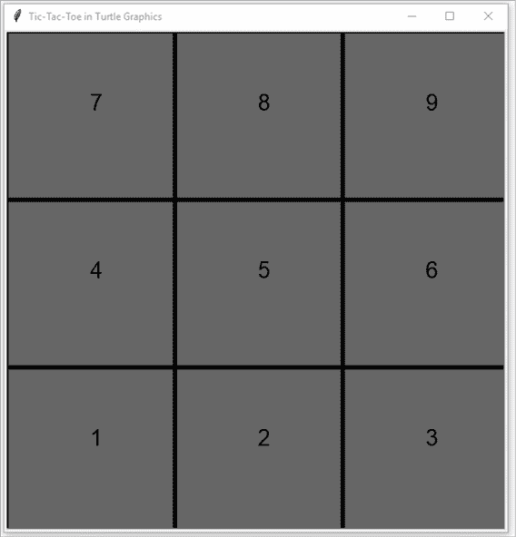
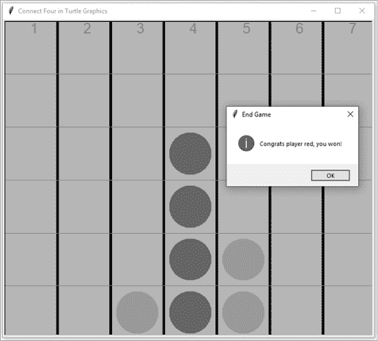

# 第三部分：互动游戏

## 使用 *turtle* 模块进行图形和动画


我们在接下来的几章中的目标是构建语音控制的图形游戏，如井字棋、四连棋和猜单词。你将使用 *turtle* 模块来完成所有这些。

在这一章，你将不会使用语音交互。相反，你将学习 *turtle* 模块的基本命令，这些命令将帮助你设置海龟屏幕、绘制形状和创建动画。这些功能将成为你将要构建的所有游戏的基础。

在开始之前，为本章设置文件夹 */mpt/ch09/*。和往常一样，本章中的所有脚本都可以在本书的资源页面找到，[`www.nostarch.com/make-python-talk/`](https://www.nostarch.com/make-python-talk/)。

## 基本命令

*turtle* 模块允许我们使用一个机器人海龟在画布上绘制图形并创建动画。海龟模仿了人们在物理画布上绘画的方式，但我们使用命令来移动海龟并创建图画。

对于其底层图形，*turtle* 模块使用了 *tkinter* 模块，这是 Python 的事实标准图形用户界面（GUI）包。*turtle* 和 *tkinter* 都包含在 Python 标准库中，因此无需安装它们。

海龟图形是在 1960 年代发明的，比 Python 语言早了三十年。*turtle* 模块允许 Python 程序员利用海龟图形的许多特性。第一个特性是它的简单性：*turtle* 比其他游戏模块，如 *pygame* 或 *tkinter*，更容易学习。*turtle* 模块还很直观，使得通过操控画笔在画布（即屏幕）上绘制图片和形状变得简单。

*turtle* 模块也更适合语音激活。与其他游戏模块不同，后者通常通过游戏循环运行得太快，无法捕捉语音命令，*turtle* 脚本不需要游戏循环。这使得语音控制的游戏成为可能。

### 创建一个海龟屏幕

要使用 *turtle*，你需要创建一个海龟屏幕来容纳脚本中的所有对象。下面的脚本向你展示了一个简单的海龟屏幕示例。在 Spyder 中输入以下代码行，并将脚本保存为 *set_up_screen.py*：

```py
import turtle as t

1 t.Screen()
t.setup(600,500,100,200)
t.bgcolor('SpringGreen3')
2 t.title('Setting Up a Screen with Turtle Graphics')
t.done()
t.bye() 
```

我们导入 *turtle* 模块并为其指定一个简短的别名 `t`。这是一个简短别名有利的情况，因为我们将多次调用模块中的多个函数。因此，我们希望在所有函数前面只使用 `t.`，而不是 `turtle.`。

在步骤 1，我们通过使用`Screen()`创建一个屏幕，这不需要任何参数。接着我们使用`setup()`来指定屏幕的大小和位置。四个参数依次是屏幕宽度、屏幕高度、距离计算机屏幕左上角的水平距离以及距离计算机屏幕左上角的垂直距离。我们的屏幕将是 600 像素宽、500 像素高，距离计算机屏幕左边缘 100 像素，距离上边缘 200 像素。

接下来，我们通过使用`bgcolor()`为海龟屏幕设置背景颜色。*turtle*模块提供了多种颜色，包括`brown`（棕色）、`black`（黑色）、`gray`（灰色）、`white`（白色）、`yellow`（黄色）、`gold`（金色）、`orange`（橙色）、`red`（红色）、`purple`（紫色）、`navy`（海军蓝）、`blue`（蓝色）、`lightblue`（浅蓝色）、`darkblue`（深蓝色）、`cyan`（青色）、`turquoise`（绿松石色）、`lightgreen`（浅绿色）、`green`（绿色）和`darkgreen`（深绿色）。

在步骤 2，我们为屏幕添加一个标题，你可以在屏幕顶部看到它，靠近海龟图形符号（图 9-1）。

`done()`命令告诉脚本开始事件，这样屏幕上的对象就可以进行动画处理。`bye()`命令则告诉脚本在你点击 X 符号时退出*turtle*模块。

屏幕应该看起来像图 9-1 所示。


图 9-1：设置屏幕的大小、背景颜色和标题。

海龟屏幕使用的是*笛卡尔*坐标系，坐标原点为(x = 0, y = 0)。x 值从左到右递增，y 值从下到上递增，就像你在高中数学中学到的二维平面。

### 创建动作

在早期，海龟光标实际上是一个在屏幕上移动的海龟图像。现在，默认的光标是一个小箭头，取代了原来的海龟图像。海龟有三个属性：位置、方向和画笔。你可以调整画笔的颜色和宽度，还可以决定是否将画笔放在平面上，这样海龟移动时就会在其路径上留下痕迹，或者将画笔抬起，这样就不会跟踪移动。

在我们查看模块中的各种动作之前，先看看实际的绘图。在 Spyder 编辑器中输入示例 9-1 中的代码，并将其保存为*show_turtle.py*，放在你的章节文件夹中。

```py
import turtle as t

t.Screen()
t.setup(600,500,100,200)
t.bgcolor('SpringGreen')
t.title('Show Turtle')
1 t.shape('turtle')
t.forward(200)
t.right(90)
t.up()
t.forward(100)
t.done()
t.bye()
```

示例 9-1：显示*turtle*模块中的海龟

在步骤 1，我们将光标的形状改回原始的海龟形状，正如图 9-2 所示。如果你运行脚本，你会看到海龟从位置(x = 0, y = 0)开始并朝右移动。它在默认的放下画笔状态下向前移动 200 像素，因此在画布上绘制了一条线。然后我们将海龟右转 90 度并抬起画笔，再向前移动 100 像素。这次由于画笔没有接触到画布，因此不会绘制线条。


图 9-2：海龟在画布上移动进行绘图。

现在，我们将详细讨论一些在*turtle*模块中非常有用的基本动作，这些动作对我们的项目非常重要。

#### forward() 和 backward() 函数

`forward()` 函数让乌龟在屏幕上向前移动指定的像素数。`backward()` 函数做相同的操作，只不过是向后移动。在 Spyder 编辑器中输入 列表 9-2 中显示的代码，并将其保存为 *forward_backward.py* 文件到您的章节文件夹中。

```py
import turtle as t

t.Screen()
t.setup(600,500,100,200)
t.bgcolor('blue')
t.title('Movements in Turtle Graphics')
1 t.forward(200)
2 t.backward(300)
t.done()
t.bye()
```

列表 9-2：*turtle* 模块中的基本运动函数

我们设置了一个不同背景颜色和标题的屏幕。在 1 处，乌龟前进 200 像素。乌龟的默认起始位置是 (x = 0, y = 0)，面朝右侧，因此前进 200 像素后，乌龟的位置将到达 (x = 200, y = 0)。

在 2 处，乌龟从点 (x = 200, y = 0) 向后移动 300 像素，最终停在 (x = -100, y = 0) 处。

#### left() 和 right() 函数

`left()` 或 `right()` 函数改变乌龟的方向。我们给定一个角度值作为参数，用以表示乌龟要转动的角度。例如，`90` 度让乌龟转向与原方向垂直的方向。`360` 度的角度让乌龟旋转一圈，从而仍然朝向原来的方向。

列表 9-3 中的脚本 *left_right.py* 展示了 `left()` 和 `right()` 函数的用法。

```py
import turtle as t

t.Screen()
t.setup(600,500,100,200)
t.bgcolor('light blue')
t.title('Python Turtle Graphics')
1 t.pensize(5)
2 t.right(30)
t.forward(200)
t.left(30)
t.backward(400)
t.left(90)
3 t.pencolor('red')
t.forward(200)
t.done()
try:
    t.bye()
except Terminator:
    print('exit turtle')
```

列表 9-3：*left_right.py* 的 Python 代码

`pensize()` 函数指定乌龟绘制的线条粗细，默认值为 1 像素。在这里，我们将笔的大小设置为 5 像素。在 2 处，我们让乌龟右转 30 度。然后，我们让乌龟前进 200 像素。接着，我们让乌龟左转 30 度并后退 400 像素。

`pencolor()` 函数将绘图笔的颜色改为红色 3，默认颜色为黑色。经过这一步，绘制的线条将变为红色，而不是黑色。

运行脚本后，您应该会看到类似于 图 9-3 的屏幕。


图 9-3：*turtle* 模块中的 `left()` 和 `right()` 函数

#### goto() 函数

`goto()` 函数告诉乌龟移动到屏幕上的指定点。结合 `up()` 和 `down()`，它可以绘制直线和虚线。`up()` 函数意味着乌龟的笔没有接触到画布，因此在移动时不会绘制任何内容。`down()` 函数则将笔放在画布上，开始绘图。

如果乌龟的笔处于下方位置，`goto()` 将在当前位置和指定位置之间绘制一条直线。然而，如果乌龟的笔处于上方位置，`goto()` 将不会在屏幕上绘制任何东西，而只是将乌龟从当前位置移动到指定位置。通过绘制一系列短线并在它们之间留空，可以创建虚线。

在 列表 9-4 中输入脚本 *create_lines.py*。

```py
import turtle as t

t.Screen()
t.setup(600,500,100,200)
t.bgcolor('lightgreen')
t.title('Python Turtle Graphics')
t.pensize(6)
1 t.goto(200,100)
2 t.up()
t.pencolor('blue')
3 for i in range(8):
    t.goto(-200+50*i,-150)
    t.down()
    t.goto(-200+50*i+30,-150)
    t.up()
4 t.hideturtle()
t.done()
try:
    t.bye()
except t.Terminator:
    print('exit turtle')
```

列表 9-4：*create_lines.py* 的 Python 代码

在第 1 步，我们告诉乌龟移动到 (x = 200, y = 100)。默认情况下，乌龟是处于下笔状态，起始位置是 (x = 0, y = 0)，因此 `goto(200,100)` 会在两个点 (0, 0) 和 (200, 100) 之间画一条线，如图 9-4 所示。

在第 2 步，脚本指示乌龟抬起画笔，这样乌龟移动到另一个点时，屏幕上不会画出任何线条。然后我们将画笔颜色改为蓝色。在第 3 步，我们开始一个 `for` 循环。在每次迭代中，乌龟会到达一个点，放下画笔，然后移动到右边 30 像素的地方。这样就会留下一个 30 像素长的短线，重复八次，之间有间隙。

`hideturtle()` 函数可以隐藏乌龟，使得屏幕上不显示黑色的箭头光标 4。

运行脚本后，你应该能看到一个类似于 图 9-4 的屏幕。


图 9-4：使用 `goto()` 函数通过 *turtle* 模块绘制直线。

## 基本形状

*turtle* 模块有多个内建的形状，包括常用的 `dot()` 函数，它可以创建圆点。你还将学习如何创建基本形状，如三角形、正方形和网格线。

### 使用 dot() 函数

`dot()` 函数创建一个指定直径和颜色的圆点。例如，命令 `dot(30, 'red')` 会创建一个直径为 30 像素的红色圆点。我们将在井字游戏和四子棋游戏中使用这个功能来创建游戏棋子。

示例 9-5，*dots.py* 展示了 `dot()` 函数的使用方法。

```py
import turtle as t

t.Screen()
t.setup(600,500,100,200)
t.bgcolor('lightgreen')
t.title('Python Turtle Graphics')
1 t.up()
t.goto(150,100)
t.dot(120,'red')
t.goto(-150,100)
t.dot(135,'yellow')
2 t.goto(150,-100)
t.dot(125,'blue')
t.goto(-150,-100)
t.dot(140,'green')
t.hideturtle()
t.done()
try:
    t.bye()
except t.Terminator:
    print('exit turtle')
```

示例 9-5：*dots.py* 的 Python 代码

首先我们抬起画笔 1。然后我们移动到点 (150, 100)。我们告诉乌龟在点 (150, 100) 处画一个直径为 120 像素的红色圆点。

接下来，我们将乌龟移到 (–150, 100)，并画一个直径为 135 像素的黄色圆点。请注意，你不需要再次使用 `up()`，因为画笔已经抬起。画笔抬起时，乌龟依然可以画圆点。

从第 2 步开始，乌龟会到达 (150, –100) 并画出一个直径为 125 像素的蓝色圆点。然后它移动到 (–150, –100) 并画出一个直径为 140 像素的绿色圆点。图 9-5 展示了最终效果。


图 9-5：使用 *turtle* 模块创建圆点。

### 绘制自己的图形

你也可以使用 *turtle* 模块绘制自己的图形。我们将在这里介绍一些基本形状。

#### 三角形

创建三角形的最简单方法是使用 `goto()`。示例 9-6 中，*triangle.py* 绘制了一个三角形，三个角的坐标分别为 (–50, –50)、(50, –50) 和 (0, 100)。

```py
from turtle import *

Screen()
setup(600,500,100,200)
bgcolor('springgreen3')
title('Python Turtle Graphics')
hideturtle()
tracer(False)
1 pencolor('blue')
pensize(5)
up()
goto(-50,-50)
down()
goto(50,-50)
goto(0,100)
goto(-50,-50)
update()
done()
try:
    bye()
except Terminator:
    pass
```

示例 9-6：*t**riangle.py* 的 Python 代码

`tracer()` 函数告诉脚本是否追踪乌龟的运动。默认值是 `tracer(True)`，意味着脚本会逐步展示乌龟的移动。当乌龟画出一些内容时，你将看到每一笔的绘制过程。这里我们使用 `tracer(False)`，因此最终的图形会被打印出来，但脚本不会显示中间的步骤。

我们将笔的颜色改为蓝色 1，大小设置为 5。然后抬起笔，移动到点（–50, –50），再放下笔，移动到点（50, –50）。这形成了三角形的第一条边。笔下后，我们让海龟移动到点（0, 100），形成第二条边。最后，我们将笔移动回点（–50, –50），完成三角形的底边。

注意，由于我们使用了命令`tracer(False)`来禁用每一步绘图的显示（从而节省时间），因此在脚本末尾需要使用`update()`来显示完整的图像，如图 9-6 所示。


图 9-6: 使用 *turtle* 模块绘制三角形。

#### 矩形

我们可以像绘制三角形一样，使用`goto()`绘制矩形，但我们也可以使用`forward()`和`left()`。在许多情况下，你可以通过使用`goto()`函数或`forward()`和`left()`函数来实现相同的目标。如果你知道目的地的坐标，`goto()`更简单；如果你知道两点之间的距离，方向函数则更易用。

在这里，我们将使用`forward()`和`left()`。你也可以通过使用`goto()`来实现相同的结果，详见第 187 页的“章节末练习”部分。

我们将绘制一个矩形，四个顶点为（0, 0）、（200, 0）、（200, 100）和（0, 100）。请输入列表 9-7 中的 *rectangle.py* 脚本。

```py
import turtle as t

# Set up the screen
t.Screen()
t.setup(600,500,100,200)
t.bgcolor('green')
t.title('Python Turtle Graphics')
t.hideturtle()
t.tracer(False)
1 t.pensize(6)
# Draw the first side
2 t.forward(200)
t.left(90)
# Draw the second side
t.forward(100)
t.left(90)
# Draw the third side
t.forward(200)
t.left(90)
# Finish the rectangle
t.forward(100)
t.update()
t.done()
try:
    t.bye()
except t.Terminator:
    print('exit turtle')
```

列表 9-7: *rectangle.py* 的 Python 代码

我们首先设置屏幕。在第 1 步，我们将笔的大小设置为 6。由于没有指定笔的颜色，因此使用默认的黑色。在第 2 步，海龟从初始位置（0, 0）向前移动 200 像素，形成矩形的第一条边。

接下来，海龟向左转 90 度，面朝上方。然后它向前移动 100 像素，形成第二条边。接着，我们让海龟向左转 90 度，面朝西方，并向前移动 200 像素，形成第三条边。矩形的最后一条边以类似方式绘制。

输出结果如图 9-7 所示。


图 9-7: 使用 *turtle* 模块绘制矩形。

我们将使用这种绘制矩形的技巧来为即将到来的游戏创建一个棋盘。

### 绘制网格线

像井字游戏和四连棋这样的游戏都使用网格。我们可以通过绘制方形来简单地创建网格。这里，我们将绘制一个包含六行七列的游戏棋盘；水平线将比垂直线更细、更浅，以符合我们在四连棋游戏中所做的设计。请输入列表 9-8 中的 *grid_lines.py* 代码。

```py
import turtle as t

# Set up the screen
t.Screen()
t.setup(810,710, 10, 70)
t.hideturtle()
t.tracer(False)
t.bgcolor('lightgreen')
# Draw the vertical lines to create 7 columns
1 t.pensize(5)
for i in range(-350,400,100):
    t.up()
    t.goto(i, -298)
    t.down()
    t.goto(i, 303)
    t.up()
# Draw the horizontal lines to separate the screen in 6 rows
2 t.pensize(1)
t.color('gray')
for i in range(-300,400,101):  
    t.up()
    t.goto(-350,i)
    t.down()
    t.goto(350,i)
    t.up()   
t.done()
try:
    t.bye()
except t.Terminator:
    print('exit turtle')
```

列表 9-8: *grid_lines.py* 的 Python 代码

我们首先设置屏幕。由于我们计划绘制一个包含六行七列的游戏棋盘，我们将屏幕大小设置为 810 像素宽、710 像素高。这样，我们可以将每个单元格设置为 100×100 像素，棋盘四周留有 55 像素的边距。考虑屏幕大小非常重要，这样可以帮助你计算出各个点的坐标。

我们用笔的大小为 5 1 画了八条粗的垂直线，将屏幕划分为七列。函数 `range(-350,400,100)` 会产生八个值：`-350, -250, ..., 350`。  

之后，我们画七条细的灰色水平线，形成六行 2。如果你运行脚本，你会看到一个类似于 图 9-8 的屏幕。  

我们将在第十一章的游戏中使用这个板。  

## 动画  

在这一部分，你将学习如何使用 `clear()` 和 `update()` 来清除当前图像并用下一个图像替换，从而产生动画帧。  

  

图 9-8: 绘制网格线以形成一个六行七列的游戏板  

### 如何动画工作  

`clear()` 函数会清除海龟在屏幕上画的所有内容。然后你可以重新绘制对象，并使用 `update()` 将它们显示在屏幕上。如果你重复这个过程，图像的快速替换将产生动画效果。  

我们将通过制作一个简单的时钟来探索动画，时钟在 示例 9-9 的 *turtle_clock.py* 中展示。  

```py
import turtle as t
import time

import arrow

# Set up the screen
t.setup(800,600, 10, 70)
t.tracer(False)
t.bgcolor('lightgreen')
t.hideturtle()
# Put the script in an infinite loop
1 while True:
    # Clear the screen
    t.clear()
    # Obtain the current time
    current_time = arrow.now().format('hh:mm:ss A')
 t.color('blue')
    t.up()
    t.goto(-300,50)
    # Write the first line of text
  2 t.write('The Current Time Is\n',font=('Arial',50,'normal'))
    t.color('red')
    t.goto(-300,-100)
    # Write what time it is
  3 t.write(current_time,font=('Arial',80,'normal'))
    time.sleep(1)
    # Put everything on screen
    t.update()
t.done()
try:
    t.bye()
except t.Terminator:
    print('exit turtle')
```

示例 9-9: *turtle_clock**.py* 的 Python 代码  

我们导入模块并设置屏幕。在 1 处，我们开始一个无限循环。在每次迭代中，脚本首先通过使用 `clear()` 清除屏幕上的所有内容。然后我们通过使用 *arrow* 模块获取当前时间，并将值存储在变量 `current_time` 中。  

*turtle* 模块的 `write()` 函数将在屏幕上写文本。它的第一个参数是要显示的文本，第二个参数是使用的字体。在 2 处，我们用蓝色在屏幕上写 `The Current Time Is`。在 3 处，脚本用红色写下当前时间。  

然后脚本暂停一秒，并确保通过使用 `update()` 更新所有新的绘图。如果你运行脚本，你会注意到时间每秒都会变化（见 图 9-9）。  

  

图 9-9: 在 *turtle* 模块中创建动画

我们将在各种游戏中频繁使用这种方法来创建动画。  

### 使用多个海龟  

现在我们来看一下如何同时使用两个海龟——相当于使用两支笔。在第十二章，当我们创建一个猜词游戏时，我们将使用一个海龟在游戏板上画一个金币，另一个用来计算玩家剩余的机会次数。每当玩家错过一个字母时，我们将擦除之前的数字，并用新数字替换。如果我们只使用一个海龟，那么所有内容，包括金币图像都会被清除。如果我们使用第二个海龟，我们可以保持屏幕上的其他内容不变，只更改第二个海龟所绘制的部分。  

在 示例 9-10，*two_turtles.py* 中，我们将使用一个海龟绘制一个正方形，另一个海龟在其下方写字。  

```py
import turtle as t

# Set up the screen
t.setup(810,710, 10, 70)
t.tracer(False)
t.hideturtle()
t.bgcolor('lightgreen')
t.color('blue')
t.pensize(5)
1 t.up()
t.goto(-200,-100)
t.down()
t.forward(400)
t.left(90)
t.forward(400)
t.left(90)
t.forward(400)
t.left(90)
t.forward(400)
# Create a second turtle 
2 msg = t.Turtle()
msg.hideturtle()
msg.up()
msg.color('red')
msg.goto(-300,-200)
msg.write('this is written by the second turtle',font=('Arial',30,'normal'))
t.update()
t.done()
try:
    t.bye()
except t.Terminator:
    print('exit turtle')
```

示例 9-10: *two_turtles**.py* 的 Python 代码  

我们导入 *turtle* 模块，并设置一个大小为 810 x 710 像素的屏幕。从 1 开始，我们在屏幕中央画一个蓝色的正方形，类似于我们画矩形的方式，只不过四条边长度相等。  

在 2 处，我们通过`Turtle()`创建了第二只海龟，并将其命名为`msg`。我们告诉脚本隐藏第二只海龟

第二只海龟`msg`抬起画笔，将颜色改为红色，移动到坐标（–300, –200），并写下消息`this is written by the second turtle`。`update()`函数刷新屏幕，绘制由两只海龟创建的所有内容，如图 9-10 所示。


图 9-10：由两只海龟创建的屏幕

## 总结

在这一章中，你学习了*turtle*模块的基础知识。你首先学习了如何设置海龟屏幕，然后学习了基本的移动方式，比如前进、后退以及左转、右转。你通过使用内置函数和基本移动命令创建了各种形状。

最后，你学会了通过使用`clear()`和`update()`函数在*turtle*模块中创建动画效果。在接下来的几章中，你将学习如何使用这些技能创建语音控制的图形游戏。

## 章节末练习

1.  修改*set_up_screen.py*，使屏幕宽度为 500 像素，高度为 400 像素，背景颜色为蓝色，标题为`Modified Screen`。

1.  修改*forward_backward.py*，使得海龟先后退 100 像素，再前进 250 像素。

1.  修改*dots.py*，使其只包含两个直径为 60 的浅绿色点，分别位于坐标（–100, –100）和（100, 100）处。

1.  修改*triangle.py*，使得三角形的三条边为红色，边宽为 3\。

1.  通过使用`goto()`函数来复制*rectangle.py*中的结果。你不能使用`forward()`、`backward()`、`left()`或`right()`等函数。

## 井字棋


在这一章中，你将构建一个语音控制的井字棋游戏，将你所有的新技能付诸实践。你将绘制一个带有蓝色和白色棋子的游戏棋盘，禁止无效的移动，并检测玩家是否获胜。接着，你会添加语音识别和文本转语音功能，并设置游戏，让你与自己的电脑进行对战。

和往常一样，本章的所有脚本都可以在本书的资源页面上找到，[`www.nostarch.com/make-python-talk/`](https://www.nostarch.com/make-python-talk/)。在开始之前，设置本章的文件夹*/mpt/ch10/*。

## 游戏规则

井字棋可能是世界上最著名的游戏之一，但为了确保，我们在创建游戏棋盘之前先复习一下规则。在井字棋中，两个玩家轮流在一个三乘三的网格中标记一个格子，标记为 X 或 O。第一个将三个 X 或 O 连成一排（横向、纵向或对角线）的人获胜。如果在所有格子填满之前没有人连成三个，游戏将以平局结束。我们将用蓝色和白色的点代替 X 和 O 作为棋子。

## 绘制游戏棋盘

我们将在屏幕上绘制一个三乘三的网格，并为每个单元格分配一个编号，以便告诉脚本在哪里放置每个棋子。打开你的 Spyder 编辑器，复制 清单 10-1 中的代码，并将脚本保存为 *ttt_board.py*，存放在你的章节文件夹中。

```py
import turtle as t

# Set up the screen
t.setup(600,600,10,70)
t.tracer(False)
t.bgcolor("red")
t.hideturtle()
t.title("Tic-Tac-Toe in Turtle Graphics")
# Draw horizontal lines and vertical lines to form grid
t.pensize(5)
1 for i in (-100,100):
    t.up()
    t.goto(i,-300)
    t.down()
    t.goto(i,300)
    t.up()
    t.goto(-300,i)
    t.down()
 t.goto(300,i)
    t.up()
# Create a dictionary to map cell numbers to cell center coordinates
2 cellcenter = {'1':(-200,-200), '2':(0,-200), '3':(200,-200),
            '4':(-200,0), '5':(0,0), '6':(200,0),
            '7':(-200,200), '8':(0,200), '9':(200,200)} 
# Go to the center of each cell, write down the cell number
3 for cell, center in list(cellcenter.items()):
    t.goto(center)
    t.write(cell,font = ('Arial',20,'normal'))
t.done()
try:
    t.bye()
except t.Terminator:
    print('exit turtle')
```

清单 10-1：绘制井字游戏棋盘

我们导入 *turtle* 模块中的所有函数，并将屏幕设置为 600 像素 × 600 像素。由于我们有一个三乘三的网格，因此每个单元格的大小是 200 像素 × 200 像素。我们将背景色设置为红色，并将标题设置为 `Tic-Tac-Toe in Turtle Graphics`。

使用命令 `for i in (-100, 100)`，我们将变量 `i` 在范围 -100 到 100 之间进行迭代。结果，`for` 循环产生了两条水平线和两条垂直线。两条水平线分别位于点 (–300, –100) 和 (300, –100)，以及点 (–300, 100) 和 (300, 100) 之间。两条垂直线分别位于点 (–100, –300) 和 (–100, 300)，以及点 (100, –300) 和 (100, 300) 之间。这些线均匀地将屏幕分成了九个单元格。

然后我们创建一个字典 `cellcenter`，将每个单元格编号映射到相应单元格中心的 x 和 y 坐标。例如，左下角的单元格是单元格编号 1，它的中心坐标是 (x = –200, y = –200)。我们为字典中的所有九个单元格执行相同操作，使用单元格编号作为键，坐标作为值。

在第 3 步，我们使用 `for` 循环迭代九对值，在每个单元格的中心写入单元格编号。命令 `list(cellcenter.items())` 会生成一个包含来自 `cellcenter` 的九个键值对的列表，结果应该如下所示：

```py
[('1', (-200, -200)), ('2', (0, -200)), ('3', (200, -200)), ('4', (-200, 0)),
('5', (0, 0)), ('6', (200, 0)), ('7', (-200, 200)), ('8', (0, 200)), ('9', 
(200, 200))]
```

在每次迭代 `for` 循环时，海龟会移动到单元格的中心，并在那里写下单元格编号。运行脚本后，你应该能看到类似于 图 10-1 的屏幕。



图 10-1：井字游戏的棋盘

## 创建游戏棋子

现在，我们将添加代码，将游戏棋子放置到单元格中。你将首先了解鼠标点击在 *turtle* 模块中的工作原理，然后使用它们来放置棋子。

### 鼠标点击在 turtle 中的工作原理

当你在 turtle 屏幕上左键点击时，点击位置的 x 和 y 坐标会显示在屏幕上。清单 10-2 中的 *mouse_click.py* 处理一个简单的鼠标点击事件。这只是示范用的代码；我们不会在最终的脚本中使用这段代码，但会使用相同的原理。

```py
import turtle as t

# Set up the screen
t.setup(620,620,360,100)
t.title("How Mouse-Clicks Work in Turtle Graphics")
# Define get_xy() to print the coordinates of the point you click
1 def get_xy(x,y):
    print(f'(x, y) is ({x}, {y})')
# Hide the turtle so that you don't see the arrowhead
t.hideturtle()
# Bind the mouse click to the get_xy() function
2 t.onscreenclick(get_xy)
3 t.listen()    
t.done()
try:
    t.bye()
except t.Terminator:
    print('exit turtle') 
```

清单 10-2：鼠标点击在 *turtle* 模块中的工作原理

和往常一样，我们导入 *turtle* 模块并设置屏幕。在第 1 步中，我们定义了函数 `get_xy()`，它会输出你点击的 x 和 y 坐标。我们还隐藏了海龟图形，这样你就不会看到光标在屏幕上移动了。在第 2 步中，我们使用 *turtle* 的 `onscreenclick()` 函数将屏幕上的鼠标点击绑定到 `get_xy()` 函数，该函数返回点击的 x 和 y 坐标。因此，`onscreenclick(get_xy)` 将鼠标点击的 x 和 y 坐标作为输入传递给 `get_xy()`。在第 3 步中，我们使用 `listen()` 来检测诸如鼠标点击和键盘按键等事件。

运行 *mouse_click.py*，随机点击屏幕几次，你应该会看到类似这样的输出：

```py
(x, y) is (-46.0, 109.0)
(x, y) is (14.0, -9.0)
(x, y) is (-185.0, -19.0)
(x, y) is (-95.0, 109.0)
(x, y) is (13.0, -81.0)
```

在我五次点击中，`onscreenclick()` 捕捉到了点击点的 x 和 y 坐标，并将这两个值提供给 `get_xy()`，后者打印出了相应的 x 和 y 值。

### 将鼠标点击转换为单元格编号

接下来，我们将棋盘创建和点击检测脚本结合起来，这样当你点击一个单元格时，脚本会输出单元格编号。在图 10-2 中，我在游戏棋盘上标出了行和列的编号，以及网格线的 x 和 y 坐标。

打开 *ttt_board.py*，在底部（`t.done()` 之前）添加列表 10-3 中的代码，并将新的脚本保存为 *cell_number.py* 到你的章节文件夹中。这个脚本只是一个示例，我们在最终的代码中不会使用它，但会使用类似的代码。

```py
`--snip--`
for cell, center in list(cellcenter.items()):
    t.goto(center)
    t.write(cell,font = ('Arial',20,'normal'))
# Define a function cell_number() to print out the cell number
1 def cell_number(x,y):
    if -300<x<300 and -300<y<300:
        # Calculate the column number based on x value
      2 col = int((x+500)//200)
        print('column number is ', col)
        # Calculate the row number based on y value
 row = int((y+500)//200)
        print('row number is ', row)
        # Calculate the cell number based on col and row
      3 cellnumber = col+(row-1)*3
        print('cell number is ', cellnumber)
    else:
        print('you have clicked outside the game board')
# Hide turtle so that you don't see the arrowhead
t.hideturtle()
# bind the mouse click to the cell_number() function
  onscreenclick(cell_number)
t.listen()
`--snip--`
```

列表 10-3：将鼠标点击转换为单元格编号


图 10-2：在游戏棋盘上标出行和列的编号。

在第 1 步中，我们定义了 `cell_number()`，该函数将鼠标点击的 x 和 y 坐标转换为单元格编号。在函数内部，我们将你点击的点的 x 和 y 坐标限制在棋盘的范围内。如果你点击的地方超出了范围，脚本会输出 `you have clicked outside the game board`。

在第 2 步，我们将点击的 x 坐标转换为列号。第一列的点的 x 坐标在 -300 到 -100 之间，第二列的点的 x 坐标在 -100 到 100 之间，因此我们使用公式 `col = int((x+500)//200)` 来获取列中像素坐标的完整范围，从而将 x 坐标转换为列号。我们使用相同的方法将 y 坐标转换为行号。

然后我们使用公式 `cellnumber = col+(row-1)*3` 来计算单元格编号，因为单元格编号是从左到右、从下到上增加的。最后，我们将屏幕点击事件绑定到 `cell_number()`。

运行 *cell_number.py*。以下是与脚本交互的一次输出：

```py
column number is  3
row number is  2
cell number is  6
column number is  1
row number is  3
cell number is  7
column number is  2
row number is  1
cell number is  2
```

每次点击单元格时，脚本会输出列号、行号和单元格编号。

### 放置游戏棋子

接下来，我们将把棋子放到棋盘上。当你第一次点击任何一个单元格时，一个蓝色棋子会出现在单元格的中心。再点击一次，棋子会变成白色，然后是蓝色，如此交替。

打开*ttt_board.py*，添加列表 10-4 中的代码，并将新脚本保存为*mark_cell.py*，保存在你的章节文件夹中。确保不要把这段代码加入到*cell_number.py*中！

```py
`--snip--`
for cell, center in list(cellcenter.items()):
 t.goto(center)
 t.write(cell,font = ('Arial',20,'normal'))
# The blue player moves first
turn = "blue"
# Define a function mark_cell() to place a dot in the cell
1 def mark_cell(x,y):
    # Make the variable turn a global variable
 2 global turn
    # Calculate the cell number based on x and y values
    if -300<x<300 and -300<y<300:
        col = int((x+500)//200)
        row = int((y+500)//200)
        # The cell number is a string variable
      3 cellnumber = str(col + (row - 1)*3)
    else:
        print('you have clicked outside the game board')

    # Go to the corresponding cell and place a dot of the player's color
    t.up()
  4 t.goto(cellcenter[cellnumber])
    t.dot(180,turn)
    t.update()
    # give the turn to the other player
    if turn == "blue":
        turn = "white"
    else:
        turn = "blue"

# Hide the turtle so that you don't see the arrowhead
t.hideturtle()
# Bind the mouse click to the mark_cell() function
t.onscreenclick(Mark_cell)
t.listen()
`--snip--`
```

列表 10-4：在棋盘上放置棋子

我们先绘制棋盘，然后定义变量`turn`来跟踪轮到谁走棋。我们首先将`blue`赋值给该变量，这样蓝色玩家就会先走。

在第 1 步，我们定义了`mark_cell()`，它会在你点击的单元格中放置棋子。在第 2 步，我们声明了全局变量`turn`。Python 提供了`global`关键字，允许`turn`在`mark_cell()`函数内外都能使用。如果没有将变量声明为全局变量，每次点击棋盘时，你都会看到错误信息`UnboundLocalError: local variable 'turn' referenced before assignment`。

然后，我们将点击的 x 和 y 坐标转换为棋盘上的单元格编号 3。在同一行内，我们还将单元格编号从整数转换为字符串，以匹配字典`cellcenter`中使用的变量类型。

在第 4 步，我们从`cellcenter`获取被点击单元格的中心坐标，并告诉海龟到达该位置。海龟会绘制一个 180 像素宽的点，颜色为`turn`中存储的值。然后，轮到另一个玩家。最后，我们将`mark_cell()`绑定到鼠标点击事件上。

运行脚本后，你就可以点击棋盘并标记单元格了。点的颜色会在蓝色和白色之间交替，如图 10-3 所示。


图 10-3：在井字棋盘上标记单元格。

现在脚本已经可以进行游戏了！不过，我们需要实现三个新规则，以使其符合井字游戏的规则：

+   如果一个单元格已经被占用，你就不能再次标记它。

+   如果玩家在一条直线上——无论是水平、垂直还是对角线——标记了三个单元格，则该玩家获胜，游戏应该停止。

+   如果所有九个单元格都被占用，游戏应该停止，如果没有玩家获胜，则判定为平局。

## 确定有效的移动、胜利和平局

接下来，我们将实现这些规则，仅允许有效的移动，并判定胜利（或平局）。从书籍资源中下载*ttt_click.py*并将其保存到章节文件夹中，或者根据列表 10-5 中的不同之处修改*mark_cell.py*。

```py
from tkinter import messagebox
`--snip--`
# The blue player moves first
turn = "blue"
# Count how many rounds played
rounds = 1 1
# Create a list of valid moves
validinputs = list(cellcenter.keys())
# Create a dictionary of moves made by each player
occupied = {"blue":[],"white":[]}
# Determine if a player has won the game
def win_game(): 2
    win = False
    if '1' in occupied[turn] and '2' in occupied[turn] and '3' in occupied[turn]:
        win = True
    if '4' in occupied[turn] and '5' in occupied[turn] and '6' in occupied[turn]:
        win = True
    if '7' in occupied[turn] and '8' in occupied[turn] and '9' in occupied[turn]:
        win = True
    if '1' in occupied[turn] and '4' in occupied[turn] and '7' in occupied[turn]:
        win = True
    if '2' in occupied[turn] and '5' in occupied[turn] and '8' in occupied[turn]:
        win = True
    if '3' in occupied[turn] and '6' in occupied[turn] and '9' in occupied[turn]:
        win = True
    if '1' in occupied[turn] and '5' in occupied[turn] and '9' in occupied[turn]:
        win = True
    if '3' in occupied[turn] and '5' in occupied[turn] and '7' in occupied[turn]:
        win = True
    return win
# Define a function mark_cell() to place a dot in the cell
def mark_cell(x,y):
 # Declare global variables
    global turn, rounds, validinputs 3
 # Calculate the cell number based on x and y values
 if -300<x<300 and -300<y<300:
 col = int((x+500)//200)
 row = int((y+500)//200)
 # The cell number is a string variable
 cellnumber = str(col + (row - 1)*3)
 else:
 print('you have clicked outside the game board')
    # Check if the move is a valid one
    if cellnumber in validinputs: 4
        # Go to the corresponding cell and place a dot of the player's color
 t.up()
 t.goto(cellcenter[cellnumber])
 t.dot(180,turn)
 t.update()
        # Add the move to the occupied list for the player
        occupied[turn].append(cellnumber) 5
        # Disallow the move in future rounds
        validinputs.remove(cellnumber)
        # Check if the player has won the game
        if win_game() == True: 6
            # If a player wins, invalid all moves, end the game
            validinputs = []
            messagebox.showinfo("End Game",f"Congrats player {turn}, you won!")
        # If all cells are occupied and no winner, it's a tie
        elif rounds == 9: 7
            messagebox.showinfo("Tie Game","Game over, it's a tie!")
        # Counting rounds
        rounds += 1
        # Give the turn to the other player
 if turn == "blue":
 turn = "white"
 else:
 turn = "blue"
    # If the move is not a valid move, remind the player 
    else:
        messagebox.showerror("Error","Sorry, that's an invalid move!")
# Bind the mouse click to the mark_cell() function
t.onscreenclick(mark_cell)
`--snip--`
```

列表 10-5：仅允许有效的移动并判定胜利和平局。

我们的第一个修改是从*tkinter*包中导入*messagebox*模块；这个模块会显示一个消息框，用于显示胜利、平局或无效的移动。

从第 1 行开始，我们创建了一个变量`rounds`、一个列表`validinputs`和一个字典`occupied`。变量`rounds`用于跟踪已进行的回合数，也就是已标记的单元格数。当回合数达到 9 且没有玩家获胜（在井字棋中这通常发生），我们将宣布平局。

我们使用`validinputs`来判断一个移动是否有效。如果一个单元格已被玩家标记，我们将把它从有效移动列表中移除。

字典`occupied`跟踪每个玩家的移动。在游戏开始时，键`blue`和`white`的值都是空列表。当玩家占据一个单元格时，该单元格编号将被添加到该玩家的列表中。例如，如果蓝色玩家占据了单元格 1、5 和 9，白色玩家占据了单元格 3 和 7，`occupied`将变为`{"blue":["1","5","9"],"white":["3","7"]}`。我们稍后将使用它来确定玩家是否获胜。

在第 2 行，我们定义了`win_game()`函数，用于检查玩家是否获胜。玩家可以通过八种方式获胜，我们将明确检查这些方式：

+   单元格 1、2 和 3 已被同一玩家占据。

+   单元格 4、5 和 6 已被同一玩家占据。

+   单元格 7、8 和 9 已被同一玩家占据。

+   单元格 1、4 和 7 已被同一玩家占据。

+   单元格 2、5 和 8 已被同一玩家占据。

+   单元格 3、6 和 9 已被同一玩家占据。

+   单元格 1、5 和 9 已被同一玩家占据。

+   单元格 3、5 和 7 已被同一玩家占据。

函数`win_game()`创建了变量`win`，并将其默认值设置为`False`。该函数检查字典`occupied`，获取当前轮到的玩家占据的单元格列表，并检查之前列出的八种获胜情况。如果其中一种情况匹配，`win`的值将变为`True`。当调用`win_game()`时，它返回存储在变量`win`中的值。

我们对`mark_cell()`做了重大修改。在第 3 行，我们声明了三个全局变量；所有这些都必须声明为全局变量，因为它们将在函数内部被修改。在第 4 行，我们检查最近点击的单元格编号是否在`validinputs`列表中；如果在，则该单元格上会标记一个点，且该单元格编号会被添加到玩家的占据单元格列表中。然后，单元格会从`validinputs`中移除，以防止玩家在未来的回合中再次标记该单元格。

在第 6 行，我们调用`win_game()`，查看当前玩家是否获胜。如果获胜，我们将`validinputs`清空，这样就不能再进行任何移动。弹出一个消息框，显示`恭喜蓝色玩家，你获胜了！`或`恭喜白色玩家，你获胜了！`，并使用*messagebox*模块的`showinfo()`函数（见图 10-4）。


图 10-4：蓝色玩家获胜！

如果玩家没有获胜，脚本会检查回合数是否达到了九回合（7）。如果是，脚本会宣布平局，显示`游戏结束，平局！`（图 10-5）。


图 10-5：平局

如果游戏没有结束，我们将增加回合数，并把回合交给另一个玩家。在游戏过程中，如果玩家点击了一个无效的格子，我们会显示`抱歉，那是一个无效的动作！`（图 10-6）。


图 10-6：无效的动作

## 语音控制版本

现在我们准备好添加语音控制和语音功能了。一个显著的变化是，我们将对手设置为计算机。我们将基于最新的*ttt_click.py*文件进行构建。在你作为蓝色玩家走完一步后，计算机会随机选择一个动作作为白色玩家，直到游戏结束。

从书本资源中下载*ttt_hs.py*，或按照列表 10-6 中的修改内容进行调整。

```py
import turtle as t
from random import choice
from tkinter import messagebox

# Import functions from the local package
from mptpkg import voice_to_text, print_say
*--snip--*
 if '3' in occupied[turn] and '5' in occupied[turn] and '7' in occupied[turn]:
 win = True
 return win
# Start an infinite loop to take voice inputs
1 while True:
    # Ask for your move
    print_say(f"Player {turn}, what's your move?")
    # Capture your voice input
    inp = voice_to_text()
    print(f"You said {inp}.")
    inp = inp.replace('number ','')
    inp = inp.replace('one','1')   
    inp = inp.replace('two','2')
    inp = inp.replace('three','3')
    inp = inp.replace('four','4')
    inp = inp.replace('five','5')
    inp = inp.replace('six','6')
    inp = inp.replace('seven','7')
    inp = inp.replace('eight','8')
    inp = inp.replace('nine','9')
    if inp in validinputs:
        # Go to the corresponding cell and place a dot of the player's color
        t.up()
        t.goto(cellcenter[inp])
        t.dot(180,turn)
        t.update()
        # Add the move to the occupied list for the player
        occupied[turn].append(inp)
        # Disallow the move in future rounds
        validinputs.remove(inp)
        # **Check if the player has won the game**
      2 if win_game() == True:
            # If a player wins, invalid all moves, end the game
            validinputs = []
            print_say(f"Congrats player {turn}, you won!")
            messagebox.showinfo\
            ("End Game",f"Congrats player {turn}, you won!")
            break

        # If all cells are occupied and no winner, game is a tie
        elif rounds == 9:
            print_say("Game over, it's a tie!")
            messagebox.showinfo("Tie Game","Game over, it's a tie!")
            break

 # Counting rounds
        rounds += 1
        # Give the turn to the other player
        if turn == "blue":
            turn = "white"
        else:
            turn = "blue"  

        # The computer makes a random move
      3 inp = choice(validinputs)
        print_say(f'The computer occupies cell {inp}.')
        t.up()
        t.goto(cellcenter[inp])
        t.dot(180,turn)
        t.update()
        occupied[turn].append(inp)
        validinputs.remove(inp)
        if win_game() == True:
            validinputs = []
            print_say(f"Congrats player {turn}, you won!")
            messagebox.showinfo\
            ("End Game",f"Congrats player {turn}, you won!")
            break
        elif rounds == 9:
            print_say("Game over, it's a tie!")
            messagebox.showinfo("Tie Game","Game over, it's a tie!")

            break
        rounds += 1
        if turn == "blue":
            turn = "white"
        else:
            turn = "blue"     

    # If the move is not a valid move, remind the player 
    else:
        print_say("Sorry, that's an invalid move!")
t.done()
`--snip--`
```

列表 10-6：添加语音和语音控制功能

我们导入所需的函数：从*random*模块导入`choice()`函数，让计算机随机选择一个动作，以及从自定义包*mptpkg*导入我们的`print_say()`和`voice_to_text()`函数。

在 1 处，我们开始了一个无限的`while`循环。在每次循环中，脚本都会大声询问你的动作。你对着麦克风说出你的动作，脚本捕捉到你的语音命令，将回应存储在变量`inp`中。

这里我们对`voice_to_text()`做了一些调整，使其更能响应你的语音命令。当你的语音输入只有一个词时，比如“One”或“Two”，软件很难理解该词的上下文并作出反应。另一方面，如果你说“Number one”或“Number two”，软件就能轻松理解你的意思。脚本简单地将语音命令中的“number”部分替换为空字符串，这样`inp`中就只剩下数字部分。有时`voice_to_text()`返回的是文字形式的数字，比如`one`或`two`，而不是数字形式，比如`1`或`2`。因此，我们还将所有的文字形式转换为数字形式。这样，你可以对着麦克风说“number one”或`one`，`inp`将始终是你想要的形式：`1`。

如果你的选择在`validinputs`中，脚本将执行一系列动作来完成这一步：在相应的格子中放置一个圆点，将该格子的编号添加到你占据的格子列表中，并从有效输入的列表中移除该格子的编号。

脚本接着检查你是否赢得了比赛或是否平局，并适当地大声回应。

一旦你的回合结束，计算机会从`validinputs`中随机选择一个动作与您对抗。脚本会检查计算机是否赢得了比赛或是否平局。如果你的语音命令不是有效的动作，脚本会发出警告。

这是与游戏的一次互动：

```py
Player blue, what's your move?
You said 7.
The computer occupies cell 3.
Player blue, what's your move?
You said 8.
The computer occupies cell 1.
Player blue, what's your move?
You said 9.
Congrats player blue, you won!
```

我已经在三步内赢得了比赛！

## 总结

在本章中，你学会了构建一个语音控制的图形井字游戏，它能够用人声进行对话。在这个过程中，你掌握了一些新技能。

你学会了如何在*turtle*模块中处理鼠标点击。凭借这一知识，你在游戏棋盘上通过鼠标点击来标记单元格。

你学会了如何根据明确的游戏规则判断玩家是否赢得了井字游戏。这是游戏创建的核心。你列出了所有玩家可以获胜的情况，然后添加了代码来检查所有这些情况并判断是否有赢家。

你还将语音识别和文本转语音功能添加到了游戏中，进行了一些调整，以确保脚本能够理解你的输入。通过结合这些技能，你将能够创建自己的语音控制游戏。

## 章节末练习

1.  修改*ttt_board.py*，使得单元格编号出现在每个单元格的左下角，字体大小为 15 点（从单元格中心水平和垂直偏移 80 像素）。

1.  修改*mouse_click.py*，使得每次点击屏幕时，脚本输出附加信息`x + y is`，后面跟着点击点的 x 和 y 坐标的实际值。

1.  修改*cell_number.py*，使得每次点击屏幕时，脚本输出`you clicked the point (``x``,` `y``)`，然后再输出列、行和单元格编号，其中`x`和`y`是实际坐标。例如，如果你点击的是(x = –100, y = 50)的点，信息应显示为`you clicked the point (-100, 50)`。

1.  修改*mark_cell.py*，使得白色玩家先手。

1.  修改*ttt_click.py*，使得玩家只有通过横向或纵向连续标记三个单元格才能获胜，但不能通过对角线获胜。

## 四子棋


在本章中，你将构建一个语音控制的四子棋游戏。与第十章中的井字游戏相似，你将首先绘制棋盘并设置黄色和红色棋子交替轮流。你还将为棋子从列的顶部落下到最底层空白行的过程添加动画效果，使游戏更加具有视觉吸引力。你将禁止无效的移动，检测玩家是否获胜，并检测是否所有 42 个单元格都已被占满而没有赢家，意味着游戏平局。

在第十章中，你学会了如何通过列出所有的获胜情形，并检查当前的游戏棋盘是否符合其中一种情形，从而判断玩家是否获胜。我们将在这里应用同样的策略。你还将学习如何使用异常处理来防止在检查过程中崩溃，以及如何避免负索引错误。

一旦游戏设置完成，我们将添加语音识别和文本转语音功能，让你仅凭声音就能玩游戏。

首先，为本章设置文件夹*/mpt/ch11/*。本章的所有脚本可以通过本书的资源页面获取：[`www.nostarch.com/make-python-talk/`](https://www.nostarch.com/make-python-talk/)。

## 游戏规则

连接四子是一个著名的棋盘游戏，但为了澄清即将展示的代码逻辑，我会先介绍一下规则。在连接四子中，两名玩家轮流将棋子从顶部投放到七列中的一个。一个玩家使用红色棋子，另一个使用黄色棋子。七列位于一个六行的垂直悬挂网格上。当棋子被投放到某一列时，它会掉落到该列中最低的可用空间。棋子无法从一列移动到另一列。

第一个形成四个连续棋子（无论是横向、纵向还是对角线）的玩家获胜。如果 42 个格子都被填满且没有人获胜，游戏平局。我们将用红色圆点和黄色圆点来代表棋子。

## 绘制游戏棋盘

我们首先绘制一个六行七列的网格。我们将在屏幕顶部为每一列编号，方便玩家进行游戏。

打开你的 Spyder 编辑器，输入列表 11-1 中的代码。将脚本保存为*conn_board.py*，并放在你的章节文件夹中。

```py
import turtle as t

# Set up the screen
1 t.setup(700,600,10,70)
t.hideturtle()
t.tracer(False)
t.bgcolor("lightgreen")
t.title("Connect Four in Turtle Graphics")
# Draw six thick vertical lines
2 t.pensize(5)
for i in range(-250,350,100):
    t.up()
    t.goto(i,-350)
    t.down()
    t.goto(i,350)
    t.up()
# Draw five thin gray horizontal lines to form grid
3 t.pensize(1)
t.pencolor("grey")
for i in range(-200,300,100):  
    t.up()
    t.goto(-350,i)
    t.down()
    t.goto(350,i)
    t.up()
# Write column numbers on the board
4 colnum = 1
for x in range(-300,350,100):
    t.goto(x,270)
    t.write(colnum,font = ('Arial',20,'normal'))
    colnum += 1
t.done()
try:
    t.bye()
except t.Terminator:
    print('exit turtle')
```

列表 11-1：绘制连接四子的游戏棋盘

我们首先导入*turtle*模块中的所有函数，然后将屏幕设置为 700x600 像素。这使得我们可以将每个单元格设置为 100x100 像素，保持简单。我们将背景色设置为浅绿色，标题为`Connect Four in Turtle Graphics`。

我们接着画了六条粗的垂直线，将屏幕分成七列。在第 2 行，我们将画笔宽度设置为 5 像素。命令行`for i in range(-250,350,100)`让变量`i`遍历以下六个值：–250、–150、–50、50、150 和 250。这些是六条垂直线的 x 坐标。六条垂直线两个端点的 y 坐标都是–350 和 350。类似地，我们画了五条细的灰色横线，把屏幕分成六行。从第 3 行开始，画笔大小为 1 像素，颜色为灰色，这样线条看起来又细又轻。这就为我们提供了一个均匀的网格，包含七列六行。

接下来，我们为列编号，以便玩家知道将棋子放在哪一列。我们首先创建一个变量`colnum`并赋值为`1`。然后我们遍历七列中心的 x 坐标，并通过将`colnum`的值加一来写出相应的列号。

运行脚本后，你应该能看到类似于图 11-1 的画面。


图 11-1：连接四子游戏的棋盘

## 鼠标点击版

现在你有了一个游戏棋盘。让我们把一些棋子投放到列中。在这一部分，你将学习如何使用鼠标点击将棋子放入某一列，并让它掉落到最低可用的单元格。之后，你将检测无效的操作、胜利和平局。

### 投放棋子

在这里，你将使用鼠标点击将棋子放入你选择的列中。棋子所在的列由你点击的位置决定。行号则取决于该列中已有的棋子数量。

当你第一次点击一列时，红色的圆点将被放置在该列最底部可用的单元格中。每次点击时，颜色将交替变化。

打开*conn_board.py*并添加 Listing 11-2 中的代码。然后将新的脚本保存为*show_disc.py*，并放入你的章节文件夹中。

```py
`--snip--`
# Write column numbers on the board
colnum = 1
for x in range(-300, 350, 100):
 t.goto(x,270)
 t.write(colnum,font = ('Arial',20,'normal'))
 colnum += 1
# The red player moves first
1 turn = "red"
# The x-coordinates of the center of the 7 columns
2 xs = [-300,-200,-100,0,100,200,300]
# The y-coordinates of the center of the 6 rows
ys = [-250,-150,-50,50,150,250]
# Keep track of the occupied cells
occupied = [list(),list(),list(),list(),list(),list(),list()]
# Define a function conn() to place a disc in a cell
3 def conn(x,y):
    # Make the variable turn a global variable
    global turn
    # Calculate the column number based on x- and y-values
    if -350<x<350 and -300<y<300:
        col = int((x+450)//100)
    else:
        print('You have clicked outside the game board!')
    # Calculate the lowest available row number in that column
    row = len(occupied[col-1])+1
    # Go to the cell and place a dot of the player's color
    t.up()
    t.goto(xs[col-1],ys[row-1])
    t.dot(80,turn)
    # Add the move to the occupied list to keep track
    occupied[col-1].append(turn)
    # Give the turn to the other player
    if turn == "red":
        turn = "yellow"
    else:
        turn = "red"
# Bind the mouse click to the conn() function
t.onscreenclick(conn)
t.listen()    
t.done()
`--snip--`
```

Listing 11-2: 在棋盘上放置棋子

红色玩家先行，所以在绘制完棋盘后，我们定义了变量`turn`并将值`red`赋给它 1。从第 2 行开始，我们定义了三个列表。列表`xs`包含与七列中点的 x 坐标对应的值。列表`ys`包含与六行中点的 y 坐标对应的六个值。稍后，我们将使用这些列表来确定所有 42 个单元格中心的 x 和 y 坐标。

列表`occupied`是一个列表的列表。它一开始是一个包含七个空列表的列表，每个列表代表一列。当你将棋子放置到某列时，棋子将被添加到对应的列表中。这样，`occupied`将追踪所有已放置的棋子及其位置。

在第 3 行，我们定义了`conn()`，它将棋子放置在你点击的列上。我们将`turn`声明为全局变量，这样它的值在`conn()`内外都能被识别。接着，我们将用户点击的 x 坐标转换为棋盘上的列号。然后，我们确定该列中最底部可用的行，这告诉我们应该将棋子放置在哪一行。请注意，`occupied[col-1]`是该列中当前所有棋子的列表，我们使用`col-1`而不是`col`，因为 Python 使用零索引，但我们的列是从 1 开始编号的。

然后，我们获取要放置新棋子的单元格中心的 x 和 y 坐标。*turtle*模块会以直径为 80 像素的大小放置一个圆点，颜色值为`turn`中存储的颜色。我们将棋子添加到`occupied`中的相应列表中，这样下次将棋子放置在同一列时，适当的单元格将被标记为无效。这样，玩家的回合就结束了，接着我们将回合交给另一位玩家。最后，我们将`conn()`绑定到鼠标点击事件上。

运行脚本，你应该能够点击游戏棋盘，并用红色或黄色圆点标记单元格。继续点击，圆点的颜色将在红色和黄色之间交替变化（见图 11-2）。


图 11-2：将棋子放置在四连棋的棋盘上。

### 动画化掉落的棋子

当你在现实世界中玩四连棋时，你将棋子从上方丢下，它会掉入适当的位置。接下来，你将创建棋子掉落的动画效果。这是一个很好的机会来学习如何使用*turtle*模块创建动画效果。

打开*show_disc.py*并添加 Listing 11-3 中的代码。将其保存为*disc_fall.py*，并放入你的章节文件夹中。

```py
import turtle as t
1 from time import sleep
*--snip--*
# Keep track of the occupied cells
occupied = [list(),list(),list(),list(),list(),list(),list()] 
# Create a second turtle to show disc falling
2 fall = t.Turtle()
fall.up()
3 fall.hideturtle()
# Define a function conn() to place a disc in a cell
def conn(x,y):
 # Make the variable turn a global variable
 global turn
 # Calculate the column number based on x and y values
 if -350<x<350 and -300<y<300:
 col = int((x+450)//100)
 else:
 print('You have clicked outside the game board!')
 # Calculate the lowest available row number in that column
 row = len(occupied[col-1])+1
    # Show the disc fall from the top
    4 if row<6:
        for i in range(6,row,-1):
            fall.goto(xs[col-1],ys[i-1])
            fall.dot(80,turn)
            update()
            sleep(0.05)
            fall.clear()
 # Go to the cell and place a dot of the player's color
 up()
`--snip--`
```

Listing 11-3: 显示棋子掉落动画效果的脚本

我们导入`sleep()`，以便在脚本中暂停，让下落的棋盘片在单元格中停留片刻，允许用户看到它的移动 1。接下来，从第 2 行开始，我们创建一个名为`fall`的第二个海龟（turtle）。我们抬起新海龟的画笔，这样它移动时就不会留下痕迹。同时，我们使用`hideturtle()`来隐藏光标 3。

从第 4 行开始，我们动画化下落的棋盘片。首先，我们通过检查行号是否小于 6 来查看列是否已满。如果是的话，就显示动画效果。如果该列下方的行已经满了，棋盘片就可以停留在当前位置（无需展示棋盘片下落）。

我们通过迭代`i`遍历所有空单元格，直到最低可用单元格上方。如果最低可用位置是`row = 2`，例如，命令`for i in range(6,row,-1)`会将`i`依次设为 6、5、4 和 3。`-1`告诉 range 函数按倒序计数。在每次迭代中，`fall`海龟会在空单元格的中心放置一个点。脚本在屏幕上绘制一个点，暂停 0.05 秒后再擦除该点，然后进入下一次迭代。

现在脚本已经是一个完整的游戏了！然而，目前，玩家必须自行判断并遵守以下规则：

+   如果某列已经满了，就不能再在该列放置棋盘片。

+   如果某个玩家将四个单元格连成一条直线，该玩家获胜，游戏应停止。

+   如果所有 42 个单元格都已占满且没有人获胜，游戏应停止并宣布平局。

让我们将这些代码添加到游戏中。

## 确定有效移动、胜利和平局

接下来，我们将通过阻止无效移动并声明胜利或平局来改进游戏。打开*disc_fall.py*并添加清单 11-4 中的代码。将新的脚本保存为*conn_click.py*。代码更改分为两个部分，便于在阅读解释时参考代码。

```py
import turtle as t
from time import sleep
from tkinter import messagebox

# Set up the screen
`--snip--`
# Create a second turtle to show disc falling
fall = t.Turtle()
fall.up()
fall.hideturtle()
# Create a list of valid moves
1 validinputs = [1,2,3,4,5,6,7]
# Define a horizontal4() function to check connecting 4 horizontally
2 def horizontal4(x, y, turn):
    win = False
    for dif in (-3, -2, -1, 0):
        try:
            if occupied[x+dif][y] == turn\
            and occupied[x+dif+1][y] == turn\
            and occupied[x+dif+2][y] == turn\
            and occupied[x+dif+3][y] == turn\
            and  x+dif >= 0:
                win = True 
        except IndexError:
            pass
    return win     
# Define a vertical4() function to check connecting 4 vertically
3 def vertical4(x, y, turn):
    win = False
    try:
        if occupied[x][y] == turn\
        and occupied[x][y-1] == turn\
        and occupied[x][y-2] == turn\
        and occupied[x][y-3] == turn\
        and y-3 >= 0:
          win = True
    except IndexError:
        pass
    return win      
# Define a forward4() function to check connecting 4 diagonally in / shape
def forward4(x, y, turn):
    win = False
    for dif in (-3, -2, -1, 0):
        try:
            if occupied[x+dif][y+dif] == turn\
            and occupied[x+dif+1][y+dif+1] == turn\
            and occupied[x+dif+2][y+dif+2] == turn\
            and occupied[x+dif+3][y+dif+3] == turn\
            and x+dif >= 0 and y+dif >= 0:
              win = True
        except IndexError:
            pass
    return win     
# Define a back4() function to check connecting 4 diagonally in \ shape
def back4(x, y, turn):
    win = False
    for dif in (-3, -2, -1, 0):
        try:
            if occupied[x+dif][y-dif] == turn\
            and occupied[x+dif+1][y-dif-1] == turn\
            and occupied[x+dif+2][y-dif-2] == turn\
            and occupied[x+dif+3][y-dif-3] == turn\
            and x+dif >= 0 and y-dif-3 >= 0:
              win = True
        except IndexError:
            pass
    return win 
# Define a win_game() function to check if someone wins the game
4 def win_game(col, row, turn):
    win = False
    # Convert column and row numbers to indexes in the list of lists occupied
    x = col-1
    y = row-1
    # Check all winning possibilities
    if vertical4(x, y, turn) == True:
        win = True
    if horizontal4(x, y, turn) == True:
        win = True
    if forward4(x, y, turn) == True:
        win = True
    if back4(x, y, turn) == True:
        win = True
    # Return the value stored in win
    return win
`--snip--`
```

清单 11-4：脚本的前半部分，用于禁止无效移动并声明胜利和平局

我们从*tkinter*包中导入*messagebox*模块，以便在游戏中显示关于胜利、平局和无效移动的消息。

在第 1 行，我们创建了列表`validinputs`来跟踪有效的移动。最开始，所有七列都是有效的。如果某列已满六个棋盘片，它将从列表中移除。

玩家可以通过在四个方向之一连成四个棋盘片来获胜：水平、垂直、斜向（/）或反斜向（\）。因此，我们定义了四个函数来检查每种获胜方式。

在 2 处，我们定义了 `horizontal4()`，它检查玩家是否通过成功地将四个棋子水平连接成一排赢得游戏。在这个函数中，我们创建了变量 `win` 并将其默认值设为 `False`。函数接着检查玩家是否将四个棋子水平连接成一排。如果是，`win` 的值会变为 `True`。当调用 `horizontal4()` 函数时，它返回存储在变量 `win` 中的值。让我们来看一下这个函数的详细情况。

我们将使用 `x = col-1` 和 `y = row-1` 将游戏板上的列号和行号转换为 `occupied` 列表中的索引。列号为 `col` 和行号为 `row` 的单元格对应于 `occupied[x][y]`。为了简便起见，本章其余部分我们将称这个单元格为 `[x][y]`。

玩家可以通过四种方式将四个棋子水平连接：

+   单元格 `[x-3][y]`、`[x-2][y]` 和 `[x-1][y]` 的颜色与单元格 `[x][y]` 相同。

+   单元格 `[x-2][y]`、`[x-1][y]` 和 `[x+1][y]` 的颜色与单元格 `[x][y]` 相同。

+   单元格 `[x-1][y]`、`[x+1][y]` 和 `[x+2][y]` 的颜色与单元格 `[x][y]` 相同。

+   单元格 `[x+1][y]`、`[x+2][y]` 和 `[x+3][y]` 的颜色与单元格 `[x][y]` 相同。

因此，我们定义了一个变量 `dif` 来遍历四个值 `(-3, -2, -1, 0)`。对于每个 `dif` 的值，我们检查四个单元格——`[x+dif][y]`、`[x+dif+1][y]`、`[x+dif+2][y]` 和 `[x+dif+3][y]`——是否具有相同的颜色。如果是，我们将 `win` 的值改为 `True`。

在此过程中，我们需要处理 `IndexError` 的例外情况，因为例如，`x+3` 的值可能是 8，但棋盘只有七列。如果我们不处理 `IndexError` 的例外情况，脚本在检查玩家是否赢得游戏的过程中会崩溃。

此外，我们确保所有索引都没有负值，因为负索引在 Python 中有非常特定的含义。在 Python 中，负索引会绕回到列表的开头，而不是在末尾掉出。例如，索引 `-1` 在 Python 中表示列表中的最后一个元素，`-2` 表示倒数第二个，以此类推。负索引不会引发 `IndexOutOfBounds` 错误，但它的行为也不会如你预期那样。

让我们看一个具体的例子：对于 x = 1 和 y = 2，当脚本检查单元格 `[x-3][2]` 时，它实际上会查看单元格 `[-2][2]`，而这个单元格实际上是 `[5][2]`，因为 `-2` 指的是 x 中倒数第二个值，即 5（也就是第六列，因为一共有七列）。因此，我们在函数中加入条件 `x+dif >= 0` 以确保没有任何地方出现负索引。

最后，我们在四种通过水平连接四个棋子的获胜情况中使用`try`和`except`。如果我们只为所有四种获胜情况使用一组`try`和`except`，那么每当发生`IndexError`时，脚本会跳过所有剩余的情况，直接进入`except`分支。这样就会导致脚本无法识别许多获胜的情况。

同样地，我们定义了`vertical4()`来检查通过竖直方向连接四个棋子是否获胜。然后，`forward4()`检查前斜线方向的获胜情况，`back4()`检查后斜线方向的获胜情况。

在第 4 行，我们定义了`win_game()`，该函数检查 13 种获胜场景中的任何一种（四个水平， 一个垂直，四个前斜线方向，四个后斜线方向）。在`win_game()`中，我们创建了变量`win`并将其默认值设为`False`。该函数首先将列和行号`col`和`row`转换为`occupied`列表中的索引`x`和`y`。然后，该函数调用先前定义的四个函数来检查玩家是否可能获胜。如果有任何一个函数返回`True`，`win`的值将变为`True`，并且每当调用`win_game()`时，它将返回`True`。

现在让我们查看脚本的后半部分（我们将其保存为*conn_click.py*），见清单 11-5。

```py
`--snip--`
# Count the number of rounds
1 rounds=1
# Define a function conn() to place a disc in a cell
def conn(x,y):
    # Declare global variables
  2 global turn, rounds, validinputs
 # Calculate the column number based on x and y values
 if -350<x<350 and -300<y<300:
 col = int((x+450)//100)
 else:
 print('You have clicked outside the game board!')
    # Check if it's a valid move
    if col in validinputs:
 # Calculate the lowest available row number in that column
 row = len(occupied[col-1])+1
`--snip--`
 # Go to the cell and place a dot of the player's color
 t.up()
 t.goto(xs[col-1],ys[row-1])
 t.dot(80,turn)
 t.update()
 # Add the move to the occupied list to keep track
 occupied[col-1].append(turn)
# Check if the player has won
      3 if win_game(col, row, turn) == True:
            # If a player wins, invalid all moves, end the game
            validinputs = []
            messagebox.showinfo\
           ("End Game",f"Congrats player {turn}, you won!")
        # If all cells are occupied and no winner, it's a tie
        elif rounds == 42:
            messagebox.showinfo("Tie Game","Game over, it's a tie!")
        # Counting rounds
        rounds += 1

        # Update the list of valid moves
      4 if len(occupied[col-1]) == 6:
 validinputs.remove(col)
 # Give the turn to the other player
 if turn == "red":
 turn = "yellow"
 else:
 turn = "red" 
    # If col is not a valid move, show error message
  5 else:
        messagebox.showerror("Error","Sorry, that's an invalid move!")

# Bind the mouse click to the conn() function
t.onscreenclick(conn)
t.listen()
`--snip--`
```

清单 11-5：脚本的后半部分，用于禁止无效操作并宣布胜利和平局

在第 1 行，我们创建了变量`rounds`，用来追踪游戏中进行的回合数，这与棋盘上棋子的数量相对应，以便在回合数达到 42 时可以宣布平局。

我们将`conn()`中的第 2 行修改为声明三个全局变量，这样它们的值就可以在函数内部和外部都能被识别。在第 3 行，我们调用`win_game()`来检查是否有人获胜。如果是，我们将`validinputs`更改为空列表，这样就无法再进行任何操作。一个消息框会弹出，显示`恭喜红方玩家，您赢了！`或`恭喜黄方玩家，您赢了！`

图 11-3 显示了红方玩家赢得了比赛。



图 11-3：红方获胜！较深色的棋子是红色，较浅色的是黄色。

如果没有人获胜，且`rounds`达到 42，脚本将声明平局（图 11-4）。


图 11-4：平局

如果没有玩家获胜或游戏没有平局，我们将`rounds`的值加一，并将轮到的玩家交给另一个玩家。我们还会更新有效操作的列表。如果当前列的棋子数达到六个，我们会从`validinputs`列表中移除该列的编号。

在游戏过程中，如果玩家点击了一个无效的单元格，第 5 行，消息框将显示`抱歉，这是一个无效的操作！`（图 11-5）。


图 11-5：一个无效的移动

## 语音控制版本

现在我们准备添加语音控制功能了！

首先，我们将计算机设为你的对手。在你作为红方落子后，计算机会随机选择一个黄方动作，直到游戏结束。一旦你了解了与计算机对战的方式，语音控制游戏中与其他人对战就非常简单了。我将这作为章节末的练习，脚本可以在书本资源网站上找到。

从书本资源中下载*conn_hs.py*并将其保存在章节文件夹中。清单 11-6 展示了*conn_hs.py*和*conn_click.py*之间的差异。

```py
import turtle as t
from time import sleep
from tkinter import messagebox
from random import choice

# Import functions from the local package
from mptpkg import voice_to_text, print_say

# Set up the screen
`--snip--`
# Create a list of valid moves
validinputs = ['1','2','3','4','5','6','7']
`--snip--`
# Add a dictionary of words to replace
to_replace = {'number ':'', 'cell ':'',
              'one':'1', 'two':'2', 'three':'3',
              'four':'4', 'for':'4', 'five':'5',
              'six':'6', 'seven':'7'}
# Start an infinite loop to take voice inputs
1 while True:
    # Ask for your move
 print_say(f"Player {turn}, what's your move?")
    # Capture your voice input
    inp = voice_to_text().lower()
    print_say(f"You said {inp}.")
    for x in list(to_replace.keys()):   
        inp = inp.replace(x, to_replace[x])
    # If it is not a valid move, try again
    if inp not in validinputs:
        print_say("Sorry, that's an invalid move!")    
    # If your voice input is a valid move, play the move
  2 else:
        col = int(inp)
 # Calculate the lowest available row number in that column
 row = len(occupied[col-1])+1
 # Show the disc fall from the top
 if row<6:
 for i in range(6,row,-1):
 fall.goto(xs[col-1],ys[i-1])
 fall.dot(80,turn)
 t.update()
 sleep(0.05)
 fall.clear()
 # Go to the cell and place a dot of the player's color
 t.up()
 t.goto(xs[col-1],ys[row-1])
 t.dot(80,turn)
 t.update()
 # Add the move to the occupied list to keep track
 occupied[col-1].append(turn)

 # Check if the player has won
 if win_game(col, row, turn) == True:
 # If a player wins, invalid all moves, end the game
 validinputs = []
          3 print_say(f"Congrats player {turn}, you won!")
 messagebox.showinfo/
 ("End Game",f"Congrats player {turn}, you won!")
 break
 # If all cells are occupied and no winner, it's a tie
 elif rounds == 42:
            print_say("Game over, it's a tie!")
 messagebox.showinfo("Tie Game","Game over, it's a tie!")
 break
 # Counting rounds
 rounds += 1
 # Update the list of valid moves
        if len(occupied[col-1]) == 6:
            validinputs.remove(str(col)) 
 # Give the turn to the other player
 if turn == "red":
 turn = "yellow"
 else:
 turn = "red" 
 # The computer randomly selects a move
      4 if len(validinputs)>0:
            col = int(choice(validinputs))
        print_say(f'The computer chooses column {col}.')
        # Calculate the lowest available row number in that column
        row = len(occupied[col-1])+1
        # Show the disc fall from the top
        if row < 6:
            for i in range(6,row,-1):
                fall.goto(xs[col-1],ys[i-1])
                fall.dot(80,turn)
                update()
                sleep(0.05)
                fall.clear()
        # Go to the cell and place a dot of the player's color
        t.up()
        t.goto(xs[col-1],ys[row-1])
        t.dot(80,turn)
        t.update()
        # Add the move to the occupied list to keep track
        occupied[col-1].append(turn)

        # Check if the player has won
        if win_game(col, row, turn) == True:
            # If a player wins, invalid all moves, end the game
            validinputs = []
          5 print_say(f"Congrats player {turn}, you won!")
            messagebox.showinfo\
            ("End Game",f"Congrats player {turn}, you won!")
            break
        # If all cells are occupied and no winner, it's a tie
        elif rounds == 42:
            print_say("Game over, it's a tie!")
            messagebox.showinfo("Tie Game","Game over, it's a tie!")
            break
        # Counting rounds
        rounds += 1
        # Update the list of valid moves
        if len(occupied[col-1])==6:
            validinputs.remove(str(col))
        # Give the turn to the other player
        if turn == "red":
            turn = "yellow"
        else:
            turn = "red" 
t.done()
`--snip--`
```

清单 11-6：语音控制版 Connect Four 游戏的脚本亮点

我们导入了一些额外的模块。来自*random*模块的`choice()`函数让计算机随机选择一个动作来与您对战。我们还从本地包*mptpkg*中导入了本地的`print_say()`和`voice_to_text()`函数，用于处理语音控制功能。

这次，我们将使用字符串值而不是整数来表示列表`validinputs`中的七个列号，因为语音输入本质上是字符串变量，并且在许多情况下，尝试将语音输入转换为整数会导致脚本崩溃。

在第 1 步，我们开始了一个无限的`while`循环。在每次迭代中，脚本会大声询问你的动作。你通过麦克风说出你的动作，脚本捕捉到你的语音命令并将其存储在`inp`中。

我们对`voice_to_text()`进行了些微调整，使其对你的语音命令更加敏感，正如第十章中所做的那样（参见清单 10-6 以作提醒）。此外，脚本总是将*number four*解读为`number for`，因此我们用`4`替换`for`，以便从脚本获得更好的响应。

如果你的语音命令不在`validinputs`中，脚本会大声提醒你：“抱歉，那是一个无效的动作！”我已经将无效的语音输入提到前面，使得`if`和`else`分支在脚本中彼此靠近，这样你就能更容易理解逻辑。如果这两个分支相距太远，很容易在长长的代码行中迷失。

如果你的语音命令是有效的动作，脚本会按指示放置棋子，让棋子落到列中的最低可用位置，将该单元格号码添加到你已占用单元格的列表中，并将该单元格号码从有效输入列表中移除，等等。

脚本接着会检查你是否赢得了游戏，如果是，它会大声祝贺你。如果没有，它将检查是否平局，并相应地宣布。

当你的回合结束，并且如果你没有赢得游戏或平局，计算机会从`validinputs`中随机选择一个动作与您对战，进行该动作，并检查计算机是否赢得了游戏。它还会检查是否平局。

这是一次与游戏互动的打印消息：

```py
Player red, what's your move?
You said number four.
The computer chooses column 2.
Player red, what's your move?
You said number four.
The computer chooses column 2.
Player red, what's your move?
You said number four.
The computer chooses column 2.
Player red, what's your move?
You said number four.
Congrats player red, you won! 
```

图 11-6 显示了我获胜的游戏。


图 11-6：红方赢得了语音控制版本

## 总结

在这一章中，你创建了一个语音控制的图形化 Connect Four 游戏，并且它会用人类的声音与你对话。你设置了游戏板和机制，就像在第十章中一样，不过这一次你为游戏添加了动画效果。

你学会了如何让 Python 判断玩家是否赢得了游戏。在此过程中，你学习了列出所有获胜的情况，并使用脚本检查每一个。你还学会了如何正确使用异常处理，避免负索引导致脚本出错。

你添加了语音识别和文本转语音功能，并对代码进行了重构，以确保在添加新功能时代码仍然易于阅读。在接下来的几章中，你将创建更多的语音控制图形游戏，并使它们变得更加智能。

## 章节结束练习

1.  修改 *conn_board.py* 使得六个行号出现在屏幕右侧，顶行是 6，底行是 1。并且将行号的 x 坐标设置为 325。

1.  修改 *disc_fall.py* 使得圆盘以两倍的速度下落。

1.  修改 *conn_click.py* 使得玩家仅通过横向或对角线连接四个相同颜色的圆盘来获胜，而不是通过垂直方向。

1.  当前，当你使用最终版的 *conn_hs.py* 玩 Connect Four 时，如果你想将圆盘放在 4 列，你可以说“number four”或“four”。修改脚本，使得你也可以说“column four”将圆盘放入该列。

1.  修改 *conn_hs.py* 使得你与一个人对战，而不是与计算机对战。

## 猜单词游戏


在这一章中，你将构建一个语音控制的图形化猜单词游戏。这是一个有趣的挑战，因为在玩猜单词时，玩家通常会说得很快，因此我们需要调整脚本的听力功能。

和往常一样，我们将回顾游戏规则并绘制游戏板；这个游戏板使用六个硬币代表你的六次猜测。你将学习如何将图片加载到 Python 脚本中，并在屏幕上创建多个图像。你还将学会让图像一个接一个地消失。

我们将通过书面输入开始游戏。然后，当游戏运行良好时，我们将添加语音识别和文本转语音功能。

本章中的所有脚本可以在本书的资源页面上找到：[`www.nostarch.com/make-python-talk/`](https://www.nostarch.com/make-python-talk/)。首先为本章创建文件夹 */mpt/ch12/*。

## 游戏规则

我们的猜单词游戏是基于猜字游戏（hangman）的一个简单版本。我们的游戏只会呈现四个字母的单词，以简化游戏，但当你熟悉其工作原理时，应该尝试稍后进行适配。让我们先来回顾一下游戏规则。

与“刽子手”游戏类似，我们的猜单词游戏涉及两名玩家。第一名玩家想出一个单词，并画出与单词字母数量相等的虚线。第一名玩家还在屏幕中央画出六个硬币，代表第二名玩家允许犯错的六次机会。

第二名玩家通过一次猜一个字母来试图猜出单词。如果猜中的字母在单词中，第一名玩家会在正确的位置填入该字母。如果猜中的字母不在单词中，第一名玩家将在屏幕中间擦掉一个硬币。如果第二名玩家在六次错误猜测之前完成了单词，他们就赢得了游戏。如果该玩家在用完六次错误机会之前没有猜出单词，他们就输了。

## 绘制游戏板

我们的游戏板将预加载四个虚线，表示单词的字母。我们还将在屏幕上显示`incorrect guesses`（猜错的字母）消息。打开你的 Spyder 编辑器，输入代码并保存为 Listing 12-1，文件名为*guess_word_board.py*。

```py
import turtle as t

# Set up the board
t.setup(600,500)
t.hideturtle()
t.tracer(False)
t.bgcolor("lavender")
t.title("Guess the Word Game in Turtle Graphics")
# Define a variable to count how many guesses left
1 score = 6
# Create a second turtle to show guesses left
left = t.Turtle()
left.up()
left.hideturtle()
left.goto(-290,200)
left.write(f"guesses left:   {score}",font=('Arial',20,'normal'))
# Put incorrect guesses on top
t.up()
t.goto(-290,150)
t.write("incorrect guesses:",font=('Arial',20,'normal'))
# Put four empty spaces for the four letters at bottom
2 for x in range(4):
    t.goto(-275+150*x,-200)
    t.down()
    t.goto(-175+150*x,-200)
    t.up()
t.done()
try:
    t.bye()
except t.Terminator:
    print('exit turtle')
```

Listing 12-1：绘制猜单词游戏板的 Python 脚本

我们导入了*turtle*模块，并将屏幕设置为 600 x 500 像素，背景为薰衣草色。标题将显示`Guess the Word Game in Turtle Graphics`。注意，我们在`setup()`中省略了最后两个参数，因此游戏板默认会出现在计算机屏幕的中央。

在第 1 步，我们创建了一个变量`score`来跟踪玩家剩余的猜测次数。它的初始值为 6。在游戏中，每当玩家猜错一个字母时，值将减少 1。我们还创建了一个新的海龟对象，命名为`left`，表示剩余的猜测次数。我们使用这个新的海龟对象来写下玩家剩余的机会，并擦除之前写的内容。通过使用新的海龟对象，我们限制了需要重新绘制的对象数量。

接下来，我们添加了文本`incorrect guesses`，它将显示玩家猜错的字母。我们在游戏板的底部绘制了四个虚线，用来表示单词中的四个字母。运行脚本后，你应该能看到一个与图 12-1 类似的游戏板。


图 12-1：猜单词游戏的游戏板

## 文本版本

在本节中，你将把六个硬币放在屏幕上，并允许玩家通过键盘输入字母。接下来，你将判断玩家是赢了还是输了。这样就完成了猜单词游戏的无声版本。

### 加载硬币

你将在屏幕中央放置六个硬币。在此过程中，你将学习如何将图片加载到脚本中，调整图片的大小，甚至可以根据需要放置任意数量的对象到海龟屏幕上。如前所述，每个硬币对应一个错误的猜测。

从书籍资源中下载图片文件*cash.png*并将其放入章节文件夹中。打开*guess_word_board.py*，将示例 12-2 中高亮的代码添加进去，然后将新脚本保存为*show_coins.py*，并将其保存在包含*cash.png*的相同章节文件夹中。

```py
`--snip--`
from tkinter import PhotoImage
from time import sleep
`--snip--`
# Put four empty spaces for the four letters at bottom
for x in range(4):
 t.goto(-275+150*x,-200)
 t.down()
 t.goto(-175+150*x,-200) 
 t.up()
# Load a picture of the coin to the script
1 coin = PhotoImage(file="cash.png").subsample(10,10)
t.addshape("coin", t.Shape("image", coin))
# Create six coins on screen 
2 coins = [0]*6
for i in range(6):
    coins[i] = t.Turtle('coin')
    coins[i].up()
    coins[i].goto(-100+50*i,0)
t.update()
3 sleep(3)
# Make the coins disappear one at a time
for i in range(6):
    coins[-(i+1)].hideturtle()
    t.update()
    sleep(1)
t.done()
`--snip--`
```

示例 12-2：显示和移除金币的脚本

我们从*tkinter*模块中导入`PhotoImage()`类，从*time*模块中导入`sleep()`函数。然后我们使用`PhotoImage()`加载*cash.png*。我们使用`subsample()`来缩放图像至所需大小。在这个例子中，我们使用缩放因子`(10,10)`，这意味着图片的宽度和高度都是原始图片的十分之一。

在第 2 步中，我们通过使用`[0]*6`创建了一个包含六个元素的列表`coins`。如果你打印出这个列表，它将是这样的：

```py
[0, 0, 0, 0, 0, 0]
```

我们稍后会修改这些元素；`0`值只是占位符。

接下来，我们为`coins`中的每个元素创建一个新的海龟。然后我们让这些金币海龟移动到屏幕中心并水平排列。为了演示如何加载和隐藏金币，我们让它们在屏幕上停留三秒钟后，再通过调用*turtle*模块中的`hideturtle()`逐个将它们从屏幕上隐藏，顺序从最后一个开始。

图 12-2 显示了在前三秒内的屏幕，金币已排成一行。


图 12-2：在猜字游戏板上显示金币

### 猜字母

游戏的下一个版本将使用 15 个四个字母的单词，这些单词来自于诺特丹大学 Barry Keating 教授网站上列出的最常用四个字母的单词列表（*https://bit.ly/3g7z7cg*）。Keating 教授在商业预测和数据挖掘领域做了大量工作。他还是畅销教材《预测与预测分析》（McGraw Hill, 2018）的合著者。

在我们做出以下修改后，脚本将随机选择一个单词，要求你猜一个字母，并从 IPython 控制台接受输入。如果猜对了，字母会出现在对应位置的破折号上。如果字母在单词中出现了两次，它会在两个破折号上显示。如果字母不在单词中，它会显示在屏幕顶部的错误猜测列表中。我们将跳过在这个脚本中放置金币的部分，以便更容易地跟踪代码测试。

打开*guess_word_board.py*，将示例 12-3 中高亮的代码添加进去，然后将新脚本保存为*guess_letter.py*。

```py
import turtle as t
from random import choice
`--snip--`
# Put four empty spaces for the four letters at bottom
for x in range(4):
 t.goto(-275+150*x,-200)
 t.down()
 t.goto(-175+150*x,-200)
 t.up()
t.update()
# Put words in a dictionary and randomly pick one
1 words = ['that', 'with', 'have', 'this', 'will', 'your', 
   'from', 'they', 'know', 'want', 'been', 
   'good', 'much', 'some', 'time']
word = choice(words)
# Create a missed list
2 missed = []
# Start the game loop
3 while True:
    # Take written input 
    inp = input("What's your guess?\n").lower()
    # Stop the loop if you key in "done"
    if inp == "done":
        break
    # Check if the letter is in the word
  4 elif inp in list(word):
        # If yes, put it in the right position(s)
        for w in range(4):
            if inp == list(word)[w]:
                t.goto(-250+150*w,-190)
                t.write(inp,font=('Arial',60,'normal'))
    # If the letter is not in the word, show it at the top
  5 else:
        missed.append(inp)
        t.goto(-290+80*len(missed),60)
        t.write(inp,font=('Arial',60,'normal'))
    # Update everything that happens in the iteration
    t.update()
try:
 t.bye()
except t.Terminator:
 print('exit turtle')
```

示例 12-3：将字母放到游戏板上的脚本

我们首先从*random*模块导入`choice()`，这样脚本可以从列表中随机选择一个单词。我们将 15 个单词放入列表`words` 1，并将随机选择的单词分配给`word`。在 2 处，我们创建了列表`missed`，用于保存所有猜错的字母。然后我们将脚本放入一个无限循环 3 中，不断接收你的文本输入。如果你想停止循环，可以在 Spyder IPython 控制台中输入`done`。

在 4 处，我们检查你猜测的字母是否出现在`word`中的字母里。我们使用`list()`，它将字符串变量作为输入，并将其分解为一个包含各个字母的列表；例如，命令`list("have")`会生成列表`["h","a","v","e"]`。

如果你猜测的字母在`word`中，函数会检查`word`中的每个字母，看你的猜测是否与该位置的字母匹配。如果匹配，函数将在相应位置显示该字母。

如果你的猜测不在`word` 5 中，字母会被添加到`missed`并显示在屏幕顶部的`incorrect guesses`部分。

请注意，我们还在此脚本中移除了`t.done()`这一行。这意味着，一旦你完成猜测并输入`done`，脚本将结束，屏幕上的所有内容将消失。

下面是与脚本的一次交互输出，当脚本从 15 个单词的列表中随机选择了单词*have*时，我输入的内容以粗体显示：

```py
What's your guess?
**a**
What's your guess?
**b**
What's your guess?
**v**
What's your guess?
**v**
What's your guess?
**b**
What's your guess?
**h**
What's your guess?
**e**
What's your guess?
**f**
What's your guess?
**g**
What's your guess?
**h**
What's your guess?
**u**
What's your guess?
**done**
```

图 12-3 显示了结果屏幕。


图 12-3：一个带有字母的猜单词游戏板

它已经工作了，但你可能注意到有些地方需要改进。为了完成一个完整的猜单词游戏，我们需要让脚本执行以下操作：

1.  防止玩家重复猜测同一个字母。在我之前的互动中，我重复猜测了*b*、*v*和*h*，浪费了猜测机会。

1.  在单词完成时通知玩家。

1.  玩家完成单词后停止接受输入。

1.  将六个硬币显示在屏幕上，每当玩家猜错一个字母时，就移除一个硬币。

### 确定有效的猜测、胜利和失败

接下来，我们将禁止重复字母的猜测，如果你在错过少于六个字母的情况下完成了单词，就宣告胜利，否则宣告失败。

打开*guess_letter.py*，并在列表 12-4 中添加高亮的部分。然后将新脚本保存为*guess_word.py*。在*guess_letter.py*中的一段代码被修改并替换为新添加的代码块。如果你不确定有什么不同，可以从本书资源页面下载脚本*guess_word.py*。

```py
import turtle as t
from random import choice
from tkinter import messagebox
from tkinter import PhotoImage

`--snip--`
# Create a missed list
missed = []
# Load a picture of the coin to the script
1 coin = PhotoImage(file = "cash.png").subsample(10,10)
t.addshape("coin", t.Shape("image", coin))
# Create six coins on screen 
coins = [0]*6
for i in range(6):
    coins[i] = t.Turtle('coin')
    coins[i].up()
    coins[i].goto(-100+50*i,0)
2 t.update()
# Prepare the validinputs and gotright lists
3 validinputs = list('abcdefghijklmnopqrstuvwxyz')
gotright = []
# Start the game loop
while True:
 # Take written input 
 inp = input("What's your guess?\n").lower()
 # Stop the loop if you key in "done"
 if inp == "done":
 break
    # If the letter is not a valid input, remind
    elif inp not in validinputs:
        messagebox.showerror("Error","Sorry, that's an invalid input!")
    # Otherwise, go ahead with the game
  4 else:
        # Check if the letter is in the word
        if inp in list(word):
            # If yes, put it in the right position(s)
            for w in range(4):
                if inp == list(word)[w]:
                    t.goto(-250+150*w,-190)
                    t.write(inp,font = ('Arial',60,'normal'))
                    gotright.append(inp)
            # If got four positions right, the player wins
            if len(gotright) == 4:
                messagebox.showinfo\
                ("End Game","Great job, you got the word right!")
                break
        # If the letter is not in the word, show it at the top
      5 else:
            # Reduce guesses left by 1
            score -=  1
            # Remove a coin
            coins[-(6-score)].hideturtle()
            # Update the number of guesses left on board
            left.clear()
            left.write\
            (f"guesses left:   {score}",font = ('Arial',20,'normal'))
            t.update()            
            missed.append(inp)
            t.goto(-290+80*len(missed),60)
            t.write(inp,font = ('Arial',60,'normal'))
            if len(missed) == 6:
                # If all six chances are used up, end game
 messagebox.showinfo\
                ("End Game","Sorry, you used up all your six guesses!")
                break 
        # Remove the letter from the validinputs list
        validinputs.remove(inp)       
 # Update everything that happens in the iteration
 t.update()
`--snip--`
```

列表 12-4：一个带有图形界面的猜单词游戏，接受书面输入

我们再次从*tkinter* Python 包中导入*messagebox*模块，以便能够在游戏屏幕上显示消息。

从 1 开始，我们在屏幕上显示六个硬币。我们更新屏幕，以确保我们放置的所有内容都能正确显示 2。

在 3 中，我们创建了`validinputs`列表，其中包含了字母表中的 26 个字母作为元素。在脚本后面，如果玩家猜测一个字母，我们会从列表中删除该字母，以避免同一个字母被猜测多次。我们还创建了一个空列表`gotright`，稍后我们将使用它来跟踪玩家在单词中正确猜中的位置数。

我们开始一个无限的`while`循环，每次迭代时请求你的键盘输入。如果你输入`done`，循环停止，脚本不再接收你的输入。如果你输入无效的内容（非字母或已经猜过的字母），脚本会弹出一个消息框，显示`抱歉，这是无效输入！`

如果你输入有效的内容 4，脚本会检查字母是否在单词中。如果是，脚本会检查单词中的四个位置，并对每一个匹配的字母，都会将该字母添加到`gotright`列表中。需要注意的是，由于同一个字母可以在单词中出现多次，所以一个字母可能会被多次添加到`gotright`列表中。

脚本接着检查`gotright`是否包含四个元素。如果是，说明所有四个字母都已正确猜出，脚本会弹出一个消息框，显示`太棒了，你猜对了单词！`

如果猜测的字母不在单词中 5，`score`的值减少 1，意味着玩家剩余的猜测次数减少。脚本会通过使用`hideturtle()`从屏幕上移除一个硬币。第二只海龟会清除它在屏幕上绘制的内容，并重新写上剩余的猜测次数。如果`missed`列表的长度达到了六个，一个消息框会出现，显示`抱歉，你已经用完了所有六次猜测！`

这是与脚本的一次交互，用户输入部分用粗体显示：

```py
What's your guess?
**a**
What's your guess?
**o**
What's your guess?
**d**
What's your guess?
**c**
What's your guess?
**b**
What's your guess?
**k**
What's your guess?
**m**
```

我的失败游戏显示在图 12-4 中。


图 12-4：一个失败的猜单词游戏

## 语音控制版本

现在我们将基于已写输入版本的游戏，添加语音功能。下载*guess_word_hs.py*并将其保存在你的章节文件夹中。新代码在清单 12-5 中高亮显示。

```py
`--snip--`
# Import functions from the local package
from mptpkg import voice_to_text, print_say
`--snip--`
# Start the game loop
1 while True:
    # Ask for your move
    print_say("What's your guess?")
    # Capture your voice input
    inp = voice_to_text().lower()
    print_say(f"you said {inp}")
    inp = inp.replace('letter ','')
# Say "stop listening" or press CTRL-C to stop the game
    if inp == "stop listening":
        break
 # If the letter is not a valid input, remind
 elif inp not in validinputs:
        print_say("Sorry, that's an invalid input!")
 # Otherwise, go ahead with the game
  2 else: 
 # Check if the letter is in the word
 if inp in list(word):
 # If yes, put it in the right position(s)
 for w in range(4):
 if inp == list(word)[w]:
 t.goto(-250+150*w,-190)
 t.write(inp,font = ('Arial',60,'normal'))
 gotright.append(inp)
 # If got four positions right, the player wins
 if len(gotright) == 4:
              3 print_say("Great job, you got the word right!")
 messagebox.showinfo\
 ("End Game","Great job, you got the word right!")
 break
 # If the letter is not in the word, show it at the top
 else:
 # Reduce guesses left by 1
 score -= 1
 # Remove a coin
 coins[-(6-score)].hideturtle()
 # Update the number of guesses left on board
 left.clear()
 left.write\
 (f"guesses left:   {score}",font = ('Arial',20,'normal'))
 t.update() 
 missed.append(inp)
 t.goto(-290+80*len(missed),60)
 t.write(inp,font = ('Arial',60,'normal'))
 if len(missed) == 6:
 # If all six changes are used up, end game
              4 print_say("Sorry, you used up all your six guesses!")
                messagebox.showinfo\
                ("End Game","Sorry, you used up all your six guesses!")
`--snip--`
```

清单 12-5：一个图形化的猜单词游戏，支持语音输入

我们从本地包*mptpkg*中导入了常用函数：`voice_to_text()`和`print_say()`。因为我们已安装该包（以可编辑模式），所以不需要告诉系统在哪里找到它。

我们开始一个无限的`while`循环，在每次迭代中询问你选择的字母 1。你将你的猜测通过麦克风说出，脚本会捕捉到你的语音命令并将其存储在`inp`中。我们做了一些处理，以允许玩家说“字母 a”或仅说`a`。如果是前者，我们会将*letter*替换为空字符串，这样变量`inp`中只剩下`a`。

要停止`while`循环，你只需说：“停止监听。”如果你的猜测不在列表`validinputs`中，脚本会大声回答：“抱歉，那个是无效输入！”如果你的猜测在`validinputs`中，脚本会检查字母是否在单词里。这一次，当你在不漏掉六次的情况下完成单词时，游戏会说：“太棒了，你猜对了！”如果你猜错六次，语音会说：“抱歉，你已经用完了六次猜测！”

这是与脚本的一个对话，玩家成功猜出单词*good*，只漏掉了两个字母：

```py
What's your choice?
you said letter a
What's your choice?
you said letter d
What's your choice?
you said letter f
What's your choice?
you said letter o
What's your choice?
you said letter g
Great job, you got the word right!
```

你可以在图 12-5 中看到屏幕。


图 12-5：赢得语音控制猜字游戏

## 总结

在本章中，你创建了一个语音控制的图形化猜字游戏，它能用人类的声音回应你。

你首先学习了如何绘制游戏板。然后你学会了将图片文件上传到脚本，并按你想要的大小缩放它。你使用这张图片在屏幕上创建了六个硬币，代表货币奖励，并让它们一个接一个地从屏幕上消失。你还学会了如何输入你的猜测并让它显示在屏幕上。你学会了如何禁止重复猜测同一个字母，以及如何判断玩家是赢了还是输了。

你添加了语音识别和文本转语音功能，使得游戏可以通过语音控制。在这个过程中，你学习了如何通过操作图片文件来创建图像，并学会了如何使用多个海龟来减少需要重新绘制的对象数量。

## 章末练习

1.  修改*show_coins.py*，使得六个硬币的位置在垂直方向上比当前的位置下移 10 个像素，其他一切位置保持不变。

1.  修改*show_coins.py*，使得最左边的硬币最先从屏幕上消失，最右边的硬币最后消失。

1.  尝试弄明白下面这一行代码将产生什么结果。首先写下你的答案，然后在 Spyder 中运行代码进行验证。

    ```py
    list('Hi Python')
    ```

## 智能游戏：增加智能


在我们第十一章中创建的单人版“四连棋”游戏中，计算机总是随机选择一步。这让我们能够专注于游戏的语音识别和文本转语音功能。

然而，一旦你和随机计算机玩了几局游戏，你会开始想，是否有方法让我们的四连棋游戏更加具有挑战性。答案是肯定的，在这一章中，你将学习如何制作一个智能的四连棋对手。

在一种方法中，我们将让脚本思考三步，像人类玩游戏时那样：计算机走两步，玩家走一步。

在第一步中，计算机检查一步是否会立即导致游戏获胜。如果是，计算机将选择这一步。

在四连棋中思考两步意味着计算机会尽力防止对手在下一回合获胜。这是复杂的，因为有时计算机必须阻止某个位置，而其他时候又必须避免占据某个位置。计算机会区分这两种情况，既会阻挡某些步伐，也会避免某些步伐，以防止对手获胜。

通过三步思考，计算机会选择一条最有可能在三步内带来胜利的路径。在许多情况下，三步思考可以保证三步内获胜。特别是，如果有一步可以确保计算机在三步内获胜，计算机会选择这一作为最佳下一步。

第二种方法采用了一种可以归类为*机器学习*的方式。你将模拟百万场游戏，其中双方玩家随机选择步伐。然后记录游戏结果和中间步骤。通过这些数据，计算机会在每一步学习，选择最有可能导致胜利的步骤。

我们将评估这两种策略的有效性，并选择一种更难以战胜的策略。然后，我们会为智能四连棋加入语音识别和文本转语音功能。

在此过程中，我还将挑战你将相同的方法应用于第 267 页“章节末练习”中的井字游戏。和往常一样，所有脚本都可以在[`www.nostarch.com/make-python-talk/`](https://www.nostarch.com/make-python-talk/)下载，你应为本章创建文件夹*/mpt/ch13/*。

## 三步思考策略

我们将首先使用鼠标点击版本的四连棋来加速脚本的测试。在我们加入“三步思考”策略之后，再将语音功能加入。

### 思考一步

在四连棋中思考一步很容易。计算机会检查所有可能的下一步，如果其中一步能立即赢得游戏，计算机会选择这一步。

从书中的资源下载*conn_think1.py*并保存到你的章节文件夹中。这个脚本基于第十一章中的*conn_click.py*，但我已经修改了代码，使得你在和一个自动化玩家对战，自动化玩家会思考一步，而不是与另一个人类玩家对战。

列表 13-1 展示了*conn_think1.py*中的关键部分。

```py
`--snip--`
from random import choice
from copy import deepcopy
`--snip--`
# Define a horizontal4() function to check connecting 4 horizontally
1 def horizontal4(x, y, color, board):
    win = False
    for dif in (-3, -2, -1, 0):
        try:
            if board[x+dif][y] == color\
            and board[x+dif+1][y] == color\
            and board[x+dif+2][y] == color\
            and board[x+dif+3][y] == color\
            and  x+dif >= 0:
                win = True
        except IndexError:
            pass
    return win     
# Define a vertical4() function to check connecting 4 vertically
def vertical4(x, y, color, board):
`--snip--`
# Define a win_game() function to check if someone wins the game
2 def win_game(num, color, board):
    win = False
    # Convert column and row numbers to indexes in the list of lists board
    x = num-1
    y = len(board[x])-1
    # Check all winning possibilities
    if vertical4(x, y, color, board) == True:
        win = True
    if horizontal4(x, y, color, board) == True:
        win = True
    if forward4(x, y, color, board) == True:
        win = True
    if back4(x, y, color, board) == True:
        win = True
    # Return the value stored in win
    return win
 `--snip--`
# Define the best_move() function
3 def best_move():
    # Take column 4 in the first move
    if len(occupied[3]) == 0:
        return 4
    # If only one column has free slots, take it
    if len(validinputs) == 1:
 return validinputs[0]
    # Otherwise, see what will happen in the next move hypothetically 
  4 winner = []
    # Go through all possible moves and see if there is a winning move
    for move in validinputs:
        tooccupy = deepcopy(occupied)
        tooccupy[move-1].append('red')
        if win_game(move,'red',tooccupy) == True:
            winner.append(move)        
    # If there is a winning move, take it
    if len(winner)>0:
            return winner[0] 
5 def computer_move():
    global turn, rounds, validinputs
    # Choose the best move
    col = best_move()
    if col == None:
        col = choice(validinputs)
    # Calculate the lowest available row number in that column
    row = 1+len(occupied[col-1])
`--snip--`
 # Check if the player has won the game
  6 if win_game(col, turn, occupied) == True:
`--snip--`
# Computer moves first
computer_move()
# Define a function conn() to place a disc in a cell
def conn(x,y):
 # Declare global variables
 global turn, rounds, validinputs
`--snip--`
      7 if win_game(col, turn, occupied) == True:
`--snip--`
 # Computer moves next
    if len(validinputs)>0:
        computer_move()
`--snip--`
```

列表 13-1：在四连棋游戏中思考一步。

我们导入了所有需要的模块。特别地，我们从*random*模块导入`choice()`，从*copy*模块导入`deepcopy()`。*copy*模块是 Python 标准库的一部分，因此无需安装。

为了寻找最佳策略，我们将提前一步预测在采取某些行动时可能发生的情况。我们需要`deepcopy()`来复制列表而不改变原始列表。在此脚本中，复制列表时不能简单地使用赋值语句。Python 中的赋值语句会创建与原始列表对象的链接，因此，如果我们修改副本，就会同时修改原始列表。修改原始列表不是我们所期望的，这会导致意外的行为。

在第 1 行，我们将`horizontal4(x,y,color,board)`函数改得更通用，以便它能应用于任何四个参数。在脚本后面，我们会使用它检查某些移动是否通过水平排列四个棋盘来获胜。我们也用类似的方式定义了`vertical4()`、`forward4()`和`back4()`函数。

在第 2 行，我们定义了`win_game(num,color,board)`，它会检查玩家是否在之前的四种情况中获胜。我们还省略了行号作为参数，因为它会通过参数`board`来推断。

主要的操作在`best_move()`函数中，从第 3 行开始。此函数会为计算机（红色玩家）寻找最佳的行动。如果第 4 列为空，计算机会选择中心列。由于红色玩家先行，这行代码确保游戏的第一步总是中心列 4，从而让先手玩家获得优势。

如果只剩下一步（即六列已满，只有一列有空格），就没有必要再寻找最佳移动，因此计算机会采取唯一剩余的动作。

如果剩下多个动作，函数会检查每个可能的移动，看是否有任何一项会立即让计算机获胜。脚本创建了一个列表`winner`来包含潜在的获胜移动。我们遍历所有可能的下一步。我们使用`win_game()`来检查某个移动是否会赢得游戏。如果是，这个移动会被添加到`winner`列表中。接着，函数会检查`winner`是否为空，如果不为空，计算机会选择列表中的第一个可用动作。

然后我们定义了`computer_move()`函数。当调用时，该函数会让计算机执行由`best_move()`生成的动作。计算机然后将棋盘放置在相应的列中。棋盘放置完后，脚本使用`win_game()`来检查此举是否会赢得游戏。

计算机会先行一步。之后，我们定义了`conn()`，让你可以点击屏幕进行你的移动。脚本会检查你的移动是否获胜。如果游戏未结束，计算机会在你之后移动。

反复运行脚本并与计算机对战。你会注意到，如果有获胜的机会，计算机会总是选择获胜的动作。例如，在图 13-1 的左侧，红色玩家可以通过选择第 7 列来赢得比赛。计算机会提前一步，做出获胜的决策。


图 13-1：一个提前思考一步的“连接四”游戏

### 提前思考两步

在“连接四”中提前思考两步有点复杂。计算机的下一步可以是阻止对手（即你）获胜，或者帮助对手在下一回合赢得游戏。

我们将这两种情况分开：如果计算机的动作能阻止对手获胜，脚本会执行该动作；如果计算机的动作能帮助对手获胜，脚本会避免该动作。让我们通过示例来演示这两种情况。

#### 需要避免的动作

在这个例子中，计算机应该避免某个动作，以防对手在下一轮获胜。

在图 13-2 的左边，轮到红色玩家。如果红色玩家选择第 6 列作为下一步，按照图中右侧的展示，对手可以在下一回合获胜。因此，红色玩家应该避免这个动作。


图 13-2：在这个例子中，红色玩家应该避免选择第 6 列。

这里，红色玩家已经走了一步，允许黄色玩家获胜。我们可以用这个规则避免这种获胜情况：如果你做出下一步* x*，并且你的对手在两步之后将棋子放在同一列* x*并赢得游戏，那么你应该在下一步避免走* x*。

#### 需要阻止的动作

在下一个例子中，计算机应该阻止某个动作，以防对手在两步之内获胜。

在图 13-3 的左侧，轮到红色玩家。如果红色玩家下一步不选择第 3 列，对手可以选择第 3 列并在下一回合获胜。因此，红色玩家应该阻止这个动作。


图 13-3：红色玩家应该阻止第 3 列。

这里，红色玩家选择了另一个动作——第 6 列——并输了游戏。所以规则如下：如果红色玩家做出下一步* x*，而黄色对手可以在两步内做出不同的动作* y*并获胜，那么红色应该在下一步阻止黄色的动作* y*。

### 实现两步思考策略

让计算机通过使用刚才讨论的三种技术来提前思考两步（其中一种是思考一步，另外两种是思考两步）。

打开*conn_think1.py*，将其中的`best_move()`替换为在列表 13-2 中定义的新`best_move()`函数，并将新脚本保存为*conn_think2.py*到你的章节文件夹（或者你也可以从书籍资源中下载它）。

```py
`--snip--`
# Define the best_move() function
def best_move():
    # Take column 4 in the first move
    if len(occupied[3]) == 0:
        return 4
    # If only one column has free slots, take it
    if len(validinputs) == 1:
        return validinputs[0]
    # Otherwise, see what will happen in the next move hypothetically 
    winner = []
    # Go through all possible moves and see if there is a winning move
  1 for move in validinputs:
        tooccupy = deepcopy(occupied)
        tooccupy[move-1].append('red')
        if win_game(move,'red',tooccupy) == True:
            winner.append(move)        
    # If there is a winning move, take it
    if len(winner)>0:
        return winner[0]  
    # If no winning move, look two steps ahead
  2 if len(winner) == 0 and len(validinputs)>=2:
        loser = []
        # Check if your opponent has a winning move
        for m1 in validinputs:
            for m2 in validinputs:
                if m2 != m1:
                    tooccupy = deepcopy(occupied)
                    tooccupy[m1-1].append('red')
                    tooccupy[m2-1].append('yellow')
                    if win_game(m2, 'yellow',tooccupy) == True:
                        winner.append(m2) 
                if m2 == m1 and len(occupied[m1-1]) <= 4:
                    tooccupy2 = deepcopy(occupied)
                    tooccupy2[m1-1].append('red')
                    tooccupy2[m2-1].append('yellow')
                    if win_game(m2,'yellow',tooccupy2) == True:
                        loser.append(m2) 
        # If your opponent has a winning move, block it
        if len(winner)>0:
            return winner[0]
 # If you can make a move to help your opponent to win, avoid it
      3 if len(loser)>0:
            myvalids = deepcopy(validinputs)
            for i in range(len(loser)):
                myvalids.remove(loser[i])
            if len(myvalids)>0:
                return choice(myvalids)  
`--snip--`
```

列表 13-2：让计算机提前思考两步。

在新定义的函数`best_move()`中，脚本根据当前棋盘上的棋子搜索最佳移动。如果这是游戏的第一步，函数会选择中间的列。如果只剩下一步，函数将定义最佳移动为剩下的唯一一步。

如果剩下多个着法，函数会检查每个可能的着法，看看是否有任何一个能让红方玩家（计算机）立刻获胜 1。如果有，函数将返回这个着法作为最佳着法，并将其存储在`winner`中。如果没有，函数将向前看两步，看看对手是否能在两步之内获胜 2。

该函数检查两种不同的情况：如果红方玩家的第一步`m1`和黄方玩家的第二步`m2`在两步后导致黄方获胜，我们将把着法`m2`添加到`winner`列表。如果红方玩家的第一步`m1`和黄方玩家的第二步`m2=m1`导致黄方在两步内获胜，我们将把着法`m2`添加到`loser`列表。

脚本检查`winner`是否为空。如果不为空，计算机将选择对手的获胜着法来阻止对手获胜。否则，计算机将检查`loser`列表是否为空。如果不为空，计算机将避免所有`loser`中的元素，以免帮助对手获胜 3。

运行*conn_think2.py*并多次与计算机对战。你会注意到游戏有了改进，因为计算机现在可以考虑两步之后的局面，并尝试阻止你在下一轮获胜。

### 三步先思考

这一部分将允许计算机在下棋之前考虑最多三步。如果计算机在下一步没有获胜的着法，并且对手在两步后也没有获胜的着法，计算机将考虑三步之后的局面。

计算机将采取最有可能在三步内获胜的下一步。特别是，如果有一着能够保证计算机在三步内获胜，计算机将选择该步作为最佳着法。让我们用一个例子来演示。

#### 三步内获胜的例子

脚本*conn_think2.py*比*conn_think1.py*更难击败，但并非不可能。一个高水平的玩家会注意到，计算机错过了一些能够导致三步内获胜的着法。

这是一个例子。在图 13-4 的左侧，轮到计算机（红方玩家）下棋。如果计算机在第 3 列落子，计算机保证在下一步获胜，因为对手（黄方玩家）只能阻止第 1 列或第 5 列中的其中一列。然后，计算机可以占据另外一列（第 5 列或第 1 列），在第三步赢得比赛。

而是，计算机选择了第 6 列，如图 13-4 右侧所示，错过了保证获胜的机会。


图 13-4：计算机（红方玩家）未能做出能够保证获胜的着法。

因此，我们应该进一步改进游戏。你将构建一个能够考虑三步先思考的游戏。

#### 实现三步先思考策略

让我们允许计算机考虑最多三步之后的局面。

打开 *conn_think2.py*，将新定义的 `validmoves()` 函数和 列表 13-3 中的高亮部分添加到 `best_move()` 函数，并将新脚本保存为 *conn_think.py* 到你的章节文件夹中。或者，你可以从书籍资源中下载该脚本。这是我们思考提前策略的完整脚本。

```py
`--snip--`
# Define the validmoves() function to ensure three future moves 
# will not cause any column to have more than six discs in it 
def validmoves(m1,m2,m3,occupied):
    validmove = False
    if m1 == m2 == m3 and len(occupied[m1-1]) <= 3:
 validmove = True
    if m1 == m2 and m2 != m3 and len(occupied[m1-1]) <= 4:
        validmove = True
    if m1 == m3 and m2 != m3 and len(occupied[m1-1]) <= 4:
        validmove = True
    if m3 == m2 and m2 != m1 and len(occupied[m3-1]) <= 4:
        validmove = True
    return validmove
# Define the best_move() function
def best_move():
 # Take column 4 in the first move
`--snip--`
# Otherwise, look 3 moves ahead
      1 if len(winner) == 0 and len(loser) == 0:
            # Look at all possible combinations of 3 moves ahead
            for m1 in validinputs:
                for m2 in validinputs:
                    for m3 in validinputs:
                        if validmoves(m1,m2,m3,occupied) == True: 
                            tooccupy3 = deepcopy(occupied)
                            tooccupy3[m1-1].append('red')
                            tooccupy3[m2-1].append('yellow')
                            tooccupy3[m3-1].append('red')
                            if win_game(m3, 'red', tooccupy3) == True:
                                winner.append(m1) 
            # See if there is a move now that can lead to winning in 3 moves
            if len(winner)>0:
             2 cnt = {winner.count(x):x for x in winner}
               maxcnt = sorted(cnt.keys())[-1]
               return cnt[maxcnt]
`--snip--`
```

列表 13-3：让计算机提前考虑最多三步。

我们首先定义 `validmoves(m1,m2,m3,occupied)` 来确保游戏板上未来三个假设的步伐 `m1`、`m2` 和 `m3`（由列表 `occupied` 表示）不会导致任何列中有超过六个棋子。如果这三步导致七列中的任何一列含有超过六个棋子，函数将返回 `False`；否则，它返回 `True`。

与 *conn_think2.py* 中一样，计算机首先检查是否可以立即做出获胜的步伐。如果可以，它将采取该步伐。如果不能，它将检查是否可以在两步之后为对手制造获胜的机会。如果可以，计算机会尽力阻止对手。

如果对手在两步之内没有获胜的机会，计算机会考虑三步之内的情况 1。它检查所有三步的组合：计算机的下一步 `m1`；对手两步之内的步伐 `m2`；以及计算机第三步的移动 `m3`。如果某个组合能导致玩家获胜，那么下一步 `m1` 就会被添加到 `winner` 列表中。

然而，仅仅因为某个步伐 `x` 出现在 `winner` 中，并不意味着这个步伐能够确保计算机在三步内获胜，因为它不能保证对手在第二步选择 `m2`。此外，`winner` 中可能包含多个值。因此，`best_move()` 函数会寻找 `winner` 中最常见的值，因为这就是最可能在三步内为计算机带来胜利的步伐。

与 Python 中的大多数情况一样，找到列表中最常见的值有很多种方法*。* 我们利用一个技巧，称为 *列表推导式*，来创建一个内联字典 `cnt`*。* 在这个字典中，键是一个动作在 `winner` 中出现的次数，值是该动作 2。例如，如果 `winner` 有六个元素 `[7, 6, 6, 5, 5, 5]`，则字典 `cnt` 将是 `{1:7, 2:6, 3:5}`。然后我们对 `cnt` 中的键进行排序，以找到出现频率最高的值，并将其称为 `maxcnt`。在这里，`maxcnt` 的值为 `3`，因为出现次数最多的值是三次。最后，我们使用 `maxcnt` 来获取频率最高的字典元素。在此情况下，`5` 这个步伐在 `winner` 中出现的频率最高。

如果你运行 *conn_think.py* 并进行游戏，你会发现计算机几乎不可能被击败。如果你一切都做对，你可以打平比赛。一旦你走错一步，计算机会抓住机会并赢得比赛。

## 机器学习策略

另一种让四子棋更智能的方法是让计算机从实际的游戏结果中学习。你将生成一百万局游戏，在这些游戏中，两位玩家都采用随机的步骤。你将记录每局游戏的中间步骤和结果。计算机将使用这些游戏结果数据来设计最佳策略。

在每一步棋中，计算机会查看所有具有与当前棋盘相同游戏历史的游戏。它计算每个可能的下一步棋的平均结果，并选择最可能导致有利结果的那一步。

### 创建模拟游戏的数据集

机器学习策略的第一步是生成可供学习的数据。我们将模拟两个玩家选择随机步骤，并记录结果和达到该结果的步骤。尽管两名玩家的步骤是随机的，我们会多次重复游戏。通过大数法则，这些游戏中的随机性被消除。因此，结果数据对计算机预测一步棋的结果非常有用。

从书籍资源中下载*conn_simulation.py*。我在列表 13-4 中解释了该脚本。

```py
from random import choice
import pickle

# Define a simulate() function to generate a complete game
  def simulate():
    occupied=[list(),list(),list(),list(),list(),list(),list()]
    validinputs=[1,2,3,4,5,6,7]
# Define a horizontal4() function to check connecting 4 horizontally
def horizontal4(x, y, turn):
    win=False
    for dif in (-3, -2, -1, 0):
`--snip--`
  1 def win_game(col, row, turn):
        win=False
`--snip--`
        # Return the value stored in win
        return win
    # The red player takes the first move 
  2 turn="red"
    # Keep track of all intermediate moves
    moves=[]
    # Use winlose to record game outcome, default value is 0 (a tie)
    winlose=[0]
    # Play a maximum of 42 steps
  3 for i in range(42):
        # The player randomly selects a move
        col=choice(validinputs)
        row=len(occupied[col-1])+1
        moves.append(col)
        # Check if the player has won
        if win_game(col, row, turn)==True:
            if turn=='red':
                winlose[0]=1
            if turn=='yellow':
                winlose[0]=-1
            break
        # Add the move to the occupied list to keep track
        occupied[col-1].append(turn)
        # Update the list of valid moves
        if len(occupied[col-1])==6 and col in validinputs:
            validinputs.remove(col)
        # Give the turn to the other player
        if turn=="red":
            turn="yellow"
        else:
 turn="red" 
    # Record both game outcome and intermediate steps
    return winlose+moves
# Simulate the game 1 million times and record all games
results=[]        
4 for x in range(1000000):
    result=simulate()
    results.append(result)
# Save the simulation data on your computer
5 with open('conn_simulates.pickle', 'wb') as fp:
    pickle.dump(results,fp)
# Read the data and print out the first 10 games
with open('conn_simulates.pickle', 'rb') as fp:
    mylist=pickle.load(fp)
print(mylist[0:10])
```

列表 13-4：模拟一百万局四子棋游戏

我们首先定义`simulate()`。调用时，它会模拟一局完整的四子棋游戏，并记录每一步棋和游戏结果。为了节省时间，我们省略了游戏的图形部分。

我们定义了`win_game()`来检查玩家是否获胜 1。每局游戏中，红方玩家先行 2。我们创建了两个列表`moves`和`winlose`，分别记录中间步骤和游戏结果。

我们创建了一个游戏循环，最多迭代 42 次，因为每局四子棋游戏最多有 42 步 3。在每次迭代中，玩家随机选择一个步骤。该步骤被添加到`moves`中，以跟踪游戏的历史。在每一步，我们检查玩家是否获胜。如果是的话，如果获胜的是红方玩家，则记录结果为`1`；如果获胜的是黄方玩家，则记录结果为`-1`。默认结果是平局，这时记录`0`。

然后我们调用`simulate()`一百万次 4。每局游戏的结果保存在一个名为`result`的列表中，其第一个元素是游戏的结果（`-1`、`1`或`0`），后面跟着游戏的中间步骤。

百万局游戏的结果和中间步骤保存在*conn_simulates.pickle*中，供以后使用 5。我们打印出前 10 局游戏的结果，见列表 13-5。

```py
[[1, 1, 7, 1, 5, 7, 6, 5, 1, 5, 7, 5, 2, 5], 
[1, 5, 4, 2, 7, 5, 2, 5, 6, 2, 7, 5], 
[1, 7, 3, 5, 5, 3, 7, 3, 7, 4, 2, 7, 7, 6], 
[-1, 6, 7, 6, 6, 5, 1, 5, 3, 5, 7, 6, 5, 4, 2, 5, 7, 3, 4,
7, 1, 1, 6, 4, 5, 6, 1, 1, 4, 1, 7, 3, 3, 7, 2, 3, 2, 3, 4], 
[-1, 1, 3, 5, 1, 4, 5, 4, 6, 2, 7, 3, 2, 3, 4, 2, 3], 
[1, 6, 5, 7, 1, 3, 3, 1, 5, 5, 5, 2, 3, 6, 7, 2, 6, 3, 2, 7, 
5, 4, 3, 7, 6, 7, 6, 6, 1, 2, 2, 4, 5, 4, 7, 3, 2, 1, 1, 4], 
[1, 2, 5, 3, 5, 3, 4, 7, 7, 5, 3, 4, 2, 2, 2, 5, 4, 4, 4, 4, 6, 6], 
[1, 2, 5, 6, 4, 6, 7, 5, 5, 7, 4, 1, 3, 6, 3, 2, 1, 7, 1, 6], 
[1, 7, 4, 4, 6, 3, 1, 2, 2, 3, 3, 4, 6, 3, 6, 1, 3, 4, 1, 3, 7, 7, 5, 4], 
[-1, 1, 4, 1, 4, 1, 2, 4, 5, 6, 6, 6, 3]] 
```

列表 13-5：前 10 局模拟的四子棋游戏

例如，第一局游戏的输出是`[1, 1, 7, 1, 5, 7, 6, 5, 1, 5, 7, 5, 2, 5]`。第一个元素`1`表示红方玩家获胜。剩余的元素`1, 7, 1...`表示玩家将棋子放入的列，红黄玩家交替进行。红方玩家最终通过在第 5 列垂直连接四个红色棋子获胜。

### 应用数据

下一步是使用结果数据为计算机设计智能动作。每次移动时，计算机会查阅模拟数据，检索所有相同历史的游戏。它会搜索所有可能的下一步，找到最有利的结果并将其作为下一步。

下载*conn_ml.py*并将其保存在你的章节文件夹中。该脚本基于*conn_think.py*。列表 13-6 突出了它们的主要区别。

```py
`--snip--`
# A history of moves made
moves_made=[]
# Obtain game data
with open('conn_simulates.pickle', 'rb') as fp:
    gamedata=pickle.load(fp)
# Define the best_move() function
1 def best_move():
 # Take column 4 in the first move
 if len(occupied[3])==0:
 return 4
 # If there is only one column has free slots, use the column
 if len(validinputs)==1:
 return validinputs[0]
    simu=[]
    for y in gamedata:
       if y[1:len(moves_made)+1]==moves_made:
           simu.append(y)
    # Now we look at the next move; 
    outcomes={x:[] for x in validinputs} 
    # We collect all the outcomes for each next move
    for y in simu:
       outcomes[y[len(moves_made)+1]].append(y[0])
    # Set the initial value of bestoutcome
    bestoutcome=-2;
    # Randomly select a move to be best_move
 best_move=validinputs[0]
    # iterate through all possible next moves 
    for move in validinputs:
        if len(outcomes[move])>0:
            outcome=sum(outcomes[move])/len(outcomes[move])
            # If the average outcome beats the current best 
            if outcome>bestoutcome:
                # Update the bestoutcome
                bestoutcome=outcome
                # Update the best move
                best_move=move
    return best_move
# Define a function computer_move()
2 def computer_move():
 # Declare global variables
 global turn, rounds, validinputs
 # Get the best move
 col=best_move()
 if col==None:
 col=choice(validinputs)
`--snip--`
    moves_made.append(col)
`--snip--`
# Computer moves first
3 computer_move()
# Define a function conn() to place a disc in a cell
4 def conn(x,y):
 # Declare global variables
 global turn, rounds, validinputs
`--snip--`
    moves_made.append(col)
`--snip--`
 # Computer moves next
 if len(validinputs)>0:
 computer_move()
`--snip--`
```

列表 13-6：具有机器学习策略的“连接四”游戏玩家

我们创建了一个新的列表`moves_made`来跟踪目前为止游戏中的所有动作；稍后我们将在`best_move()`中使用它。我们打开模拟的“连接四”游戏数据并将其保存在列表`gamedata`中。

在`best_move()`中，我们确保第一次移动总是将棋子放置在第 4 列，因为这给计算机提供了一个起始优势 1。我们检查是否只剩下一步，如果是，就将其作为下一个最佳选择。否则，我们检查所有与当前游戏历史相同的模拟游戏，并查看哪个下一步最有利于红方玩家。我们将该动作指定为最佳动作。我将在*ml_move.py*中使用具体示例详细解释我们是如何做到这一点的。

在 2 处，我们定义了`computer_move()`。当轮到计算机玩家时，它会调用`best_move()`来生成一个动作。计算机执行这个动作，并将该动作添加到列表`moves_made`中以跟踪游戏历史。

我们设置计算机先手 3。之后，玩家点击进行自己的回合 4。人类玩家的动作也会被添加到`moves_made`中。如果游戏没有结束，计算机将在玩家之后进行下一步。

运行*conn_ml.py*并进行几次游戏。你可能会惊讶地发现，赢得比赛相对容易。机器学习策略远不如我们的三步法有效。我们将在本章后面探讨原因。

## 测试两种策略的有效性

接下来，我们想要衡量这两种策略的智能程度。我们将模拟 1,000 场游戏并记录结果。在每场比赛中，智能计算机版本将与一个选择随机动作的简单计算机玩家对战。我们将查看智能玩家获胜或平局的次数。

### 三步预测策略

我们将从三步法版本开始。脚本 *outcome_conn_think.py*，如列表 13-7 所示，让我们的两个计算机玩家进行 1,000 场对战，然后输出获胜、平局和失败的场次。

```py
import pickle
from random import choice
from copy import deepcopy

# Define the simulate() function to play a complete game
1 def simulate():
    occupied=[list(),list(),list(),list(),list(),list(),list()]
    validinputs=[1,2,3,4,5,6,7]
`--snip--`
    def win_game(num, color, lst):
        win=False
`--snip--`
    def best_move():
        # Take column 4 in the first move
        if len(occupied[3])==0:
            return 4
`--snip--`
    # The red player takes the first move
    turn="red"
    # Keep track of all intermediate moves
    moves_made=[]
 2 winlose=[0]
    # Play a maximum of 42 steps (21 rounds)
    for i in range(21):
        # The player selects the best move
      3 col=best_move()
        if col==None:
            col=choice(validinputs)
        moves_made.append(col)
`--snip--`
        # The other player randomly selects a move
        col=choice(validinputs)
        moves_made.append(col)
`--snip--`
    # Record both game outcome and intermediate steps 
  4 return winlose+moves_made
# Repeat the game 1000 times and record all game outcomes
results=[]        
5 for x in range(1000):
    result=simulate()
    results.append(result)    
with open('outcome_conn_think.pickle', 'wb') as fp:
    pickle.dump(results,fp)
with open('outcome_conn_think.pickle', 'rb') as fp:
    mylist=pickle.load(fp)    
winlose=[x[0] for x in mylist]
# Print out the number of winning games
  print("the number of winning games is", winlose.count(1))
# Print out the number of tying games
print("the number of tying games is", winlose.count(0))
# Print out the number of losing games
print("the number of losing games is", winlose.count(-1))
```

列表 13-7：测试三步预测策略的有效性。

在 1 处，我们定义了`simulate()`，它让使用三步预测策略的智能计算机（红方玩家）与一个选择随机动作的计算机玩家对战。

`win_game()`和`best_move()`函数与*conn_think.py*中定义的相同。我们使用`winlose`列表来记录游戏结果：`1`表示红方获胜，`-1`表示黄方获胜，`0`表示平局。

游戏开始后，红方玩家调用`best_move()`获得了第 3 步，而黄方玩家随机选择了第 4 步。

在第 5 步时，我们调用`simulate()` 1,000 次并记录所有游戏的结果。然后我们打印出获胜、平局和失败的游戏数量，将`1`、`-1`和`0`的计数汇总，方便查看。以下是输出示例：

```py
the number of winning games is 995
the number of tying games is 0
the number of losing games is 5
```

在所有的游戏中，使用三步提前思考策略的智能玩家赢了 995 次，从未平局，输了 5 次。

### 机器学习策略

现在我们将以相同的方式测试机器学习策略。下载*outcome_conn_ml.py*并将其保存在你的章节文件夹中。它与*outcome_conn_think.py*类似，因此我只会在这里强调其中的不同点：

```py
`--snip--`
    # Obtain gamedata
    with open('conn_simulates.pickle', 'rb') as fp:
        gamedata=pickle.load(fp)
# Define the best_move() function based on the machine-learning strategy
    def best_move():
        # Take column 4 in the first move
        if len(occupied[3])==0:
            return 4
`--snip--`
with open('outcome_conn_ml.pickle', 'wb') as fp:
    pickle.dump(results,fp)
with open('outcome_conn_ml.pickle', 'rb') as fp:
    mylist=pickle.load(fp)    
`--snip--`
```

首先，我们获取之前在*conn_simulation.py*中生成的模拟游戏结果数据。其次，我们将`best_move()`的定义基于机器学习策略，而不是三步策略。

我们调用`simulate()` 1,000 次并记录结果，像以前一样打印出来。以下是一个示例输出：

```py
the number of winning games is 882
the number of tying games is 0
the number of losing games is 118 
```

在所有的游戏中，计算机赢了 882 次，从未平局，输了 118 次——这比三步策略的表现差得多。让我们看看为什么。

### 为什么机器学习策略在四子棋中效果不好？

机器学习策略在我们的游戏中效果较差，主要是因为在四子棋游戏中可供选择的步数太多：最多有 42 步。这意味着，指数级地，存在大量可能的游戏结果。我们模拟了 100 万局游戏，虽然听起来很多，但当数据分布在众多游戏结果之间时，不可避免地会有一些游戏结果不在模拟数据中。因此，对于许多游戏历史，无法找到最佳策略。

作为一个例子，我们将用一个特定的游戏历史来测试机器学习策略。假设红方和黄方玩家各已经走了三步，现在轮到红方玩家。此时的棋盘如图 13-5 所示。


图 13-5：一个游戏模拟

我们将在代码中模拟这个游戏设置，看看我们的机器学习策略如何决定下一步走哪一步。请参见*ml_move.py*，如清单 13-8 所示。

```py
import pickle
  validinputs=[1,2,3,4,5,6,7]
# A game history
  moves_made=[4,5,4,5,4,5]
# The game board
occupied=[list(),list(),list(),
            ['red','red','red'],
            ['yellow','yellow','yellow'],
            list(),list()]
# Obtain gamedata
with open('conn_simulates.pickle', 'rb') as fp:
    gamedata=pickle.load(fp)
1 simu=[]
for y in gamedata:
   if y[1:len(moves_made)+1]==moves_made:
       simu.append(y)
# Now we look at the next move 
outcomes={x:[] for x in validinputs} 
# We collect all the outcomes for each next move
for y in simu:
   outcomes[y[len(moves_made)+1]].append(y[0])
2 print(outcomes) 
# Set the initial value of bestoutcome
bestoutcome=-2;
# Randomly select a move to be best_move
best_move=validinputs[0]
# Iterate through all possible next moves 
3 for move in validinputs:
    if len(outcomes[move])>0:
        outcome=sum(outcomes[move])/len(outcomes[move])
        print\
        (f'when the next move is {move}, the average outcome is {outcome}')
        # If the average outcome from that move beats the current best move
        if outcome>bestoutcome:
            # Update the best outcome
            bestoutcome=outcome
            # Update the best move
            best_move=move
4 print(f'the best next move is {best_move}')
```

清单 13-8：搜索最佳机器学习策略步伐。

我们导入*pickle*，它使我们能够处理以*pickle*格式保存的数据集。我们打开早先在*conn_simulation.py*中创建的模拟数据文件*conn_simulates.pickle*。数据保存在`gamedata`列表中。

此时，红方玩家可以在下一步中将棋子放入任意七列中的一列，因此我们在`validinputs`中有所有七个值。我们将图 13-4 中已经完成的六个步骤，`[4, 5, 4, 5, 4, 5]`，保存在列表`moves_made`中。列表`occupied`跟踪当前游戏板上的棋子位置。

我们检查百万次模拟游戏的数据，看看其中是否有任何游戏的历史与当前游戏的历史匹配。如果有，我们将所有匹配的历史游戏放入列表`simu`1。然后，我们专注于这些游戏中的第七步。我们查看与每个七个可能的步骤（从 1 到 7）相关联的所有游戏的结果（胜、负或平），并将它们放入字典`outcomes`中。

然后我们打印出`outcomes`2 的内容：

```py
{1: [], 2: [-1, 1], 3: [1], 4: [1], 5: [-1], 6: [-1, -1, 1], 7: [-1]}
```

正如你所看到的，九局游戏有相同的游戏历史：没有一局将棋子放入第 1 列，两个使用了第 2 列作为下一步，另一个使用了第 3 列，以此类推。方括号中的`-1`、`0`和`1`表示红方玩家分别输了、平局和赢了。

为了帮助我们比较七个步骤中哪个对红方玩家最有利，我们计算每个步骤的平均结果 3。如果某一步每次都赢，平均结果为`1`；如果某一步的结果是 50%的胜利和 50%的失败，平均结果为`0`；如果某一步每次都输，平均结果为`-1`。

我们打印出平均结果（我们没有第一步的结果，因为在`simu`中没有模拟游戏使用这个步骤）：

```py
when the next move is 2, the average outcome is 0.0
when the next move is 3, the average outcome is 1.0
when the next move is 4, the average outcome is 1.0
when the next move is 5, the average outcome is -1.0
when the next move is 6, the average outcome is -0.3333333333333333
when the next move is 7, the average outcome is -1.0
```

第 3 步和第 4 步都导致了平均结果为`1`。脚本打印出了第一个最佳步骤，在这种情况下是 3：图 4：

```py
the best next move is 3
```

然而，当我们在游戏中查看这个步骤时（图 13-6），我们可以清楚地看到它并不是我们可以做出的最佳步骤。


图 13-6：机器学习计算机犯了一个错误。

正如你所看到的，机器学习策略的问题在于我们没有足够的模拟游戏匹配我们的游戏历史。

你可能会想，是否可以通过增加模拟游戏的数量来解决这个问题。答案是既可以，也不行。增加模拟游戏的数量会让策略变得更加智能，但它也会增加数据量，导致机器学习脚本的响应变慢。因此，玩家将不得不等待很长时间，才能让计算机做出决策。这就是使用机器学习时的权衡。

我们来通过将模拟游戏的数量增加到 1000 万次来测试这一点。生成这些数据需要几个小时。我们用更大的数据集重新运行*ml_move.py*，并得到以下输出：

```py
{1: [-1, 1, -1, 1, -1, -1, 1, 1, -1, -1, -1, 1, 1, -1, 1], 
2: [1, 1, -1, 1, 1, 1, 1, -1, -1, 1, 1, -1, 1, 1], 
3: [-1, -1, -1, -1, -1, 1, -1, -1, -1, -1, -1], 
4: [1, 1, 1, 1, 1, 1, 1, 1, 1], 
5: [1, 1, 1, 1, 1, 1, -1], 
6: [-1, -1, 1, -1, -1, 1, 1, -1, 1, 1, -1, 1, -1], 
7: [1, -1, 1, -1, -1, -1, 1, -1, -1, 1]}
when the next move is 1, the average outcome is -0.06666666666666667
when the next move is 2, the average outcome is 0.42857142857142855
when the next move is 3, the average outcome is -0.8181818181818182
when the next move is 4, the average outcome is 1.0
when the next move is 5, the average outcome is 0.7142857142857143
when the next move is 6, the average outcome is -0.07692307692307693
when the next move is 7, the average outcome is -0.2
the best next move is 4
```

现在我们有更多的数据来为我们的决策提供依据，机器学习策略正确地推荐了第 4 列，导致了图 13-7。


图 13-7：在 1000 万次模拟游戏中，策略做出了正确的决策。

## 语音控制的智能四子棋游戏

本章的最后，我们将为智能四子棋游戏添加语音识别和文本转语音功能。

### 一个能预测的语音控制游戏

我们将之前创建的两个脚本*conn_think.py*和*conn_hs.py*合并成*conn_think_hs.py*。从书籍资源中下载该文件并保存在你的章节文件夹中。主要的不同之处见清单 13-9。

```py
`--snip--`
1 def best_move():
    # Take column 4 in the first move
    if len(occupied[3])==0:
        return 4
`--snip--`
# Define the computer_move() function
2 def computer_move():
    global turn, rounds, validinputs
    # Choose the best move
    col=best_move()
    if col==None:
        col=choice(validinputs)
    print_say(f"The computer chooses column {col}.")
`--snip--`
    # Check if the player has won
    if win_game(col, turn, occupied)==True:
        # If a player wins, invalid all moves, end the game
        validinputs=[]
      3 print_say(f"Congrats player {turn}, you won!")
        messagebox.showinfo("End Game",f"Congrats player {turn}, you won!")
    # If all cells are occupied and no winner, it's a tie
    if rounds==42:
        print_say("Game over, it's a tie!")
        messagebox.showinfo("Tie Game","Game over, it's a tie!")
`--snip--`
# Computer moves first
4 computer_move()
# Add a dictionary of words to replace
to_replace = {'number ':'', 'cell ':'', 'column ':'',
              'one':'1', 'two':'2', 'three':'3',
              'four':'4', 'for':'4', 'five':'5',
              'six':'6', 'seven':'7'}
# Start a while loop to take voice inputs
5 while len(validinputs)>0:
    # Ask for your move
    print_say(f"Player {turn}, what's your move?")
    # Capture your voice input
    inp= voice_to_text().lower()
    print_say(f"You said {inp}.")
    for x in list(to_replace.keys()):   
        inp = inp.replace(x, to_replace[x])
    try:
        col=int(inp)
    except:
        print_say("Sorry, that's an invalid input!")
        continue
    # If col is not a valid move, try again
  6 if col not in validinputs:
        print_say("Sorry, that's an invalid move!") 
        continue
    # If your voice input is a valid column number, play the move
    else:
        # Calculate the lowest available row number in that column
        row=len(occupied[col-1])+1
`--snip--`
            print_say(f"Congrats player {turn}, you won!")
`--snip--`
            print_say("Game over, it's a tie!")
`--snip--`
        if len(validinputs)>0:
            computer_move()
`--snip--`
```

清单 13-9：带有三步策略的语音控制四子棋游戏

函数`best_move()`与脚本*conn_think.py*中的相同 1。我们定义了`computer_move()`2，它使用`best_move()`选择一个移动，并大声宣布选择的列。如果计算机的移动赢得或平局了游戏，脚本也会宣布这一结果 3。

计算机随后会进行游戏的第一步 4，并启动一个`while`循环，只要列表`validinputs`不为空 5，它会一直运行。在每次迭代中，脚本会捕捉你的语音输入，应该是你想放置棋子的列号。你可以说“数字五”，“列五”或“5”。然后它会将语音命令转换为整数，以匹配`validinputs`中的格式，这样它就可以将你的输入与列表进行比较。如果你说了无法转换为整数的内容，脚本会说：“抱歉，这是一个无效的输入。”

如果你给出了一个无效的移动 6，脚本会说：“抱歉，这是一个无效的移动。”如果你的移动有效，脚本将在游戏板上放置棋子。在此过程中，它会检查你是否赢得或平局了游戏，如果是，脚本会大声宣布结果。如果游戏尚未结束，计算机会进行下一步。

运行脚本并与计算机一起玩语音控制游戏。你会发现，这个游戏更具挑战性，也更有趣。

### 一个使用机器学习的语音控制游戏

我们将之前创建的两个脚本*conn_ml.py*和*conn_hs.py*合并成*conn_ml_hs.py*。从书籍资源中下载该文件并保存在你的章节文件夹中。清单 13-10 显示了主要的不同之处。

```py
`--snip--`
import pickle
`--snip--`
# A history of moves made
moves_made=[]
# Obtain gamedata
with open('conn_simulates.pickle', 'rb') as fp:
    gamedata=pickle.load(fp)
# Define the best_move() function based on machine learning
def best_move():
    # Take column 4 in the first move
    if len(occupied[3])==0:
        return 4
`--snip--`
# Define the computer_move() function 
def computer_move():
    global turn, rounds, validinputs
    # Choose the best move
    move=best_move()
    if move==None:
        move=choice(validinputs)
    print_say(f"The computer decides to occupy cell {move}.")
`--snip--`
    moves_made.append(move)
`--snip--`
# Computer moves first
computer_move()
# Start an infinite loop to take voice inputs
while len(validinputs)>0:
    # Ask for your move
    print_say(f"Player {turn}, what's your move?")
    # Capture your voice input
    inp= voice_to_text().lower()
`--snip--`
        moves_made.append(inp)
`--snip--`
        # Computer moves
        if len(validinputs)>0:
            computer_move()
`--snip--`
```

清单 13-10：使用机器学习策略的语音控制四子棋游戏

这和语音控制三步版的工作方式相同。运行脚本并进行游戏。你会发现游戏有趣，但比三步策略更容易战胜。

## 小结

在本章中，你通过使用两种方法：三步预测策略和机器学习策略，创建了智能的语音控制图形版四子棋游戏。这教会了一些重要的推理技巧——我们如何让脚本变得智能？——以及一些基本的机器学习技巧。

你学会了将这两种策略进行概括，并将它们应用于特定的游戏。你可以运用这些技能来创建你自己的智能语音控制游戏。

## 章节末尾的练习

1.  修改*conn_think1.py*，使得人类玩家先手，计算机后手。

1.  将第十章中的*ttt_click.py*与*conn_think1.py*结合，创建一个鼠标点击版的井字棋游戏，其中计算机提前思考一步。

1.  创建一个鼠标点击版的井字棋游戏，其中计算机根据*ttt_click.py*和*conn_think2.py*提前思考两步。

1.  在`best_move()`函数中，定义在*conn_think.py*文件里，如果列表`winner`有八个元素`[7, 7, 4, 5, 6, 6, 6, 6]`，那么`cnt`、`maxcnt`和`cnt[maxcnt]`的值分别是多少？

1.  设计一个鼠标点击版的井字棋游戏，其中计算机根据*ttt_click.py*和*conn_think.py*提前思考三步。

1.  模拟一百万场井字棋游戏，并将游戏结果和中间步骤保存为*ttt_simulates.pickle*。然后创建一个鼠标点击版的井字棋游戏，其中计算机使用机器学习策略，类似于我们在*conn_simulation.py*和*conn_ml.py*中所做的。

1.  修改*outcome_conn_think.py*和*outcome_conn_ml.py*，测试在你刚刚创建的井字棋游戏中，三步策略和机器学习策略的效果。

1.  在运行*conn_simulation.py*后，我们从数据集*conn_simulates.pickle*中打印出 10 条观察数据，如列表 13-5 所示。第 10 条观察数据是`[-1, 1, 4, 1, 4, 1, 2, 4, 5, 6, 6, 6, 3]`。谁赢得了第 10 局？四个棋子是垂直、水平还是对角线连接的？
