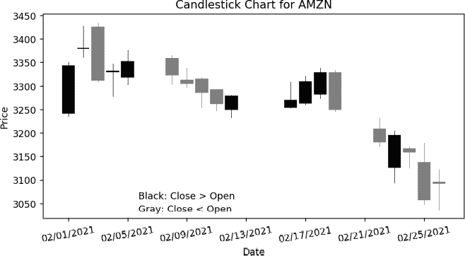
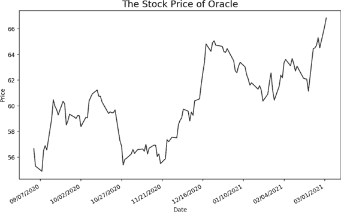
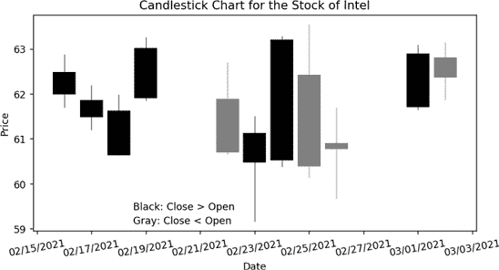

# 第四部分：进一步深入

## 金融应用


语音识别和文本到语音技术可以应用于生活的许多方面。在本章中，我们将专注于追踪金融市场，但你在这里学到的技术可以轻松推广并应用到你感兴趣的任何领域。

在本章中，你将构建三个项目：一个应用程序，报告任何上市公司最新的股价；一个构建股价可视化的脚本；以及一个应用程序，使用最近的日常股价计算回报、执行回归分析并进行详细分析。

和往常一样，所有脚本都可以通过本书的资源页面获取：[`www.nostarch.com/make-python-talk/`](https://www.nostarch.com/make-python-talk/)。首先创建 */mpt/ch14/* 文件夹，用于本章内容。

## Python，Facebook 股票价格是多少？

在这个项目中，你将使用 *yahoo_fin* 包来根据股票的代码获取实时价格信息。*股票代码* 是一串字符或代码，用于唯一标识一只股票。大多数人并不知道公司关联的股票代码。

这提供了一个从后向前工作的机会。你将学习如何抓取网页，以便从公司名称中获取股票的代码。当你在脚本中输入一个公司的名称时，Python 会告诉你该公司股票的代码。最后，你将添加文本到语音和语音识别功能。

### 获取最新的股票价格

*yahoo_fin* 包可以让你从 Yahoo! Finance 获取最新的股价信息。这个包不在 Python 标准库中，因此你需要首先使用 `pip` `install` 来安装它。

打开你的 Anaconda 提示符（Windows 中）或终端（Mac 或 Linux 中），激活虚拟环境 *chatting*，并运行以下命令（注意包名中间有下划线）：

```py
**pip install yahoo_fin**
```

接下来，打开你的 Spyder 编辑器，并将列表 14-1 保存为 *live_price.py* 到你的章节文件夹中。要使用这个脚本，你需要事先找到你感兴趣的股票的代码。

```py
from yahoo_fin import stock_info as si

# Start an infinite loop
1 while True:
    # Obtain ticker symbol from you
 ticker = input("Which stock (ticker symbol) are you looking for?\n")
    # If you want to stop, type in "done"
  2 if ticker == "done":
        break
    # Otherwise, type in a stock ticker symbol
    else:
        # Obtain stock price from Yahoo!
      3 price = si.get_live_price(ticker)
        # Print out the stock price
        print(f"The stock price for {ticker} is {price}.")
```

列表 14-1：获取实时股价

我们从 *yahoo_fin* 包中导入 *stock_info* 模块，并给它取别名为 `si`。然后，我们将脚本放入一个无限循环中，持续接收你输入的请求，获取股票代码。每当你想停止脚本时，可以输入 `done`。否则，脚本将自动继续从 Yahoo! Finance 获取你请求的公司最新股价信息。最后，脚本将打印出股票价格信息。

下面是与脚本交互的输出，其中用户输入部分用粗体显示：

```py
Which stock (ticker symbol) are you looking for?
**MSFT**
The stock price for MSFT is 183.25.

Which stock (ticker symbol) are you looking for?
**AAPL**
The stock price for AAPL is 317.94000244140625.

Which stock (ticker symbol) are you looking for?
**done**
```

如你所见，我输入了微软和苹果的股票代码（`MSFT` 和 `AAPL`），脚本返回了它们的最新价格。

注意，Apple 股票的价格有很多小数位。稍后我们会调整代码，只显示所有股票价格的小数点后两位。

为了让脚本正常工作，你需要公司的股票代码，例如 MSFT 或 AAPL。你可能会想，如果我不知道我感兴趣的股票的股票代码怎么办？如果我只知道公司名称，比如 Microsoft 或 Apple，Python 能找到它吗？答案是可以的，这时你在第六章学到的网页抓取技术就派上用场了。

### 查找股票代码

很多时候，你知道你感兴趣的公司名称，但不知道它的股票代码。这个脚本会在你输入公司名称时找到股票代码。这一点很重要，因为我们的最终目标是创建在金融市场中可以通过语音控制的应用程序。通过语音命令获取股票代码对 Python 脚本来说相对较难，但识别公司名称要容易得多。

我们首先需要找到一个可以可靠提供公司股票代码的网站。我们将使用 Yahoo! Finance，并通过 URL [`query1.finance.yahoo.com/v1/finance/search?q=`](https://query1.finance.yahoo.com/v1/finance/search?q=) 查询该网站，后面跟上你想查询的公司名称。例如，如果你在后面加上 *Bank of America*，你将得到一组适合 Python 使用的数据结果，如 图 14-1 所示。


图 14-1：查询美国银行股票代码时的结果

这些数据采用 *JSON* 格式，JSON 是 *JavaScript 对象表示法* 的缩写。该文件格式用于浏览器与服务器之间的通信，使用人类可读的文本来存储和传输数据对象。JSON 起源于 JavaScript，但现在已成为一种与语言无关的数据格式，被许多编程语言使用，包括 Python。

为了让 JSON 数据更易读，我们将使用在线 JSON 数据格式化工具 [`jsonformatter.curiousconcept.com/`](https://jsonformatter.curiousconcept.com/)。打开该网址，你将看到一个类似 图 14-2 的页面。


图 14-2：格式化 JSON 数据的网站

将 图 14-1 中的数据粘贴到指定区域，并点击 **处理**。格式化工具将把数据转换为更易读的格式，如 清单 14-2 所示。

```py
{
    "explains":[

    ],
    "count":18,
    "quotes":
    {
        "exchange":"NYQ",
        "shortname":"Bank of America Corporation",
        "quoteType":"EQUITY",
      1 "symbol":"BAC",
        "index":"quotes",
        "score":208707.0,
        "typeDisp":"Equity",
        "longname":"Bank of America Corporation",
        "isYahooFinance":true
      },
       {
        "exchange":"NYQ",
        "shortname":"Bank of America Corporation Non",
        "quoteType":"EQUITY",
        "symbol":"BAC-PL",
        "index":"quotes",
        "score":20322.0,
        "typeDisp":"Equity",
        "longname":"Bank of America Corporation",
        "isYahooFinance":true
      },
      {
        "exchange":"NYQ",
        "shortname":"Bank of America Corporation Dep",
 "quoteType":"EQUITY",
        "symbol":"BAC-PC",
        "index":"quotes",
        "score":20183.0,
        "typeDisp":"Equity",
        "longname":"Bank of America Corporation",
        "isYahooFinance":true
      },

`--snip--`
}
```

清单 14-2：股票代码查询的格式化 JSON 数据

数据集是一个包含多个元素的大型字典，键值包括 `explains`、`count`、`quotes` 等等。`quotes` 键的值是一个包含多个字典的列表。第一个字典包含键 `exchange`、`shortname`、`quoteType` —— 更重要的是，包含 `symbol`，它的值是 `BAC`，即我们需要的股票代码 1。

接下来，我们使用一个 Python 脚本，根据之前的模式提取股票代码符号。脚本*get_ticker_symbol.py*（见[列表 14-3）实现了这一功能。

```py
import requests

# Start an infinite loop
1 while True:
    # Obtain company name from you
    firm = input("Which company's ticker symbol are you looking for?\n")
    # If you want to stop, type in "done"
    if firm == "done":
        break
    # Otherwise, type in a company name
  2 else:
      3 try:
            # Extract the source code from the website
            url = 'https://query1.finance.yahoo.com/v1/finance/search?q='+firm
            response = requests.get(url)
            # Read the JSON data
            response_json = response.json()
            # Obtain the value corresponding to "quotes"
          4 quotes = response_json['quotes']
            # Get the ticker symbol
            ticker = quotes[0]['symbol']
            # Print out the ticker
            print(f"The ticker symbol for {firm} is {ticker}.")
        except:
            print("Sorry, not a valid entry!")
        continue
```

列表 14-3：根据公司名称查找股票的代码符号

我们导入*requests*模块，它允许 Python 发送超文本传输协议（HTTP）请求。在第 1 行，我们开始一个无限循环，在每次迭代中要求提供书面输入。要退出循环，输入`done`。否则，输入公司名称 2。我们使用异常处理来防止崩溃 3。

我们进入 JSON 数据，提取与`quotes`键对应的列表 4。然后我们查找第一个元素，并寻找与`symbol`键对应的值。脚本将在 IPython 控制台输出股票代码符号。如果没有结果，脚本将打印出`抱歉，输入无效！`。

多次运行脚本，搜索几家公司，检查它是否正常工作。以下是与脚本的一次交互输出：

```py
Which company's ticker symbol are you looking for?
**ford motor**
The ticker symbol for ford motor is F.

Which company's ticker symbol are you looking for?
**walt disney company**
The ticker symbol for walt disney company is DIS.

Which company's ticker symbol are you looking for?
**apple**
The ticker symbol for apple is AAPL.

Which company's ticker symbol are you looking for?
**done**
```

如你所见，脚本适用于单词公司名称（如 Apple）以及更长的公司名称（如 Walt Disney Company）。

### 通过语音获取股票价格

现在我们将脚本*live_price.py*和*get_ticker_symbol.py*结合起来，并添加语音识别和文本转语音功能。在 Spyder 编辑器中输入列表 14-4，并将其保存为*live_price_hs.py*，保存在你的章节文件夹中，或者从书籍资源中下载该脚本。

```py
import requests
from yahoo_fin import stock_info as si

from mptpkg import voice_to_text, print_say

# Start an infinite loop
1 while True:
    # Obtain company name from you
    print_say("Which company's stock price do you want to know?")
    firm = voice_to_text()
    print_say(f"You just said {firm}.")
    # If you want to stop, type in "stop listening"
    if firm == "stop listening":
        print_say("OK, goodbye then!")
        break
    # Otherwise, say a company name
  2 else:
      try:
            # Extract the source code from the website
            url = 'https://query1.finance.yahoo.com/v1/finance/search?q='+firm
            response = requests.get(url)
            # Read the JSON data
            response_json = response.json()
            # Obtain the value corresponding to "quotes"
            quotes = response_json['quotes']
            # Get the ticker symbol
            ticker = quotes[0]['symbol']

            # Obtain live stock price from Yahoo!
          3 price = round(float(si.get_live_price(ticker)),2)
            # Speak the stock price
            print_say(f"The stock price for {firm} is {price}.")        
        # In case the price cannot be found, the script will tell you
        except:
             print_say("Sorry, I cannot find what you are looking for!")        
        continue
```

列表 14-4：通过语音获取实时股票价格

我们现在从本地*mptpkg*包中导入`print_say()`和`voice_to_text()`，以添加文本转语音和语音识别功能。

在第 1 行，我们开始一个无限循环，要求提供语音输入。要退出循环，你可以说“停止监听”。否则，你说出公司名称 2，脚本会搜索股票代码符号。我们在这里使用`try`和`except`来防止脚本因 Yahoo! Finance 没有结果而崩溃。

我们将 Yahoo! Finance 中的股票价格保存在`price`中 3。注意，我们使用`round()`将股票价格四舍五入到小数点后两位。脚本将朗读公司的股票价格，或者如果没有结果，将说“抱歉，我找不到你要找的信息！”

以下是一个交互示例：

```py
Which company's stock price do you want to know?
You just said **JPMorgan Chase**.
The stock price for JPMorgan Chase is 97.31.

Which company's stock price do you want to know?
You just said **Goldman Sachs**.
The stock price for Goldman Sachs is 196.49.

Which company's stock price do you want to know?
You just said **stop listening**.
OK, goodbye then! 
```

## 语音控制数据可视化

分析数据的一种高效方法——例如，寻找股票走势中的模式——是通过数据可视化。*数据可视化*将数据呈现为图形和图表等可视化形式，使人脑更容易理解。

您在本章第一个项目中获得的股价是股票的最新价格。也就是说，您查询的每只股票都有一个数据点。然而，为了更好地了解某只股票，最好获取该股票的多个最近价格，以便您可以了解其速度和方向。该股票是保持在差不多的价值、上涨还是下跌？如果价格发生变化，这一变化有多快？

在这个项目中，您将从 Yahoo! Finance 获取最新的每日股价信息。然后，您将绘制图表，以查看股价随时间的变化。您还将学习如何创建蜡烛图，以便查看日内股票的运动模式。设置好这些后，我们将添加语音识别和文本到语音功能。

### 创建股价图

我们将使用*pandas_datareader*模块和*matplotlib*来创建过去六个月的股价图表。首先，您将学习如何提取数据，然后学习如何创建图表。

在我们开始之前，您需要安装一些第三方模块。打开 Anaconda 提示符（Windows）或终端（Mac 或 Linux），并激活虚拟的*聊天*环境。然后逐行运行以下代码：

```py
**conda install pandas** 
**conda install matplotlib** 
**pip install pandas_datareader** 
```

按照说明完成安装。*pandas_datareader*模块可以从各种来源提取在线数据，并将其导入到*pandas*数据框中。然后，在您的 Spyder 编辑器中输入示例 14-5 并将脚本保存为*price_plot.py*，放在您的章节文件夹中。

```py
import matplotlib.pyplot as plt
from pandas_datareader import data as pdr
import matplotlib.dates as mdates

# Set the start and end dates
1 start_date = "2020-09-01"
end_date = "2021-02-28"

# Choose stock ticker symbol
2 ticker = "TSLA"
# Get stock price
3 stock = pdr.get_data_yahoo(ticker, start=start_date, end=end_date)
print(stock)
# Obtain dates
4 stock['Date']=stock.index.map(mdates.date2num)
# Choose figure size
5 fig = plt.figure(dpi=128, figsize=(10, 6))
# Format date to place on the x-axis
6 formatter = mdates.DateFormatter('%m/%d/%Y')
plt.gca().xaxis.set_major_formatter(formatter)
# Plot data
7 plt.plot(stock['Date'], stock['Adj Close'], c='blue')
# Format plot
8 plt.title("The Stock Price of Tesla", fontsize=16)
plt.xlabel('Date', fontsize=10)
fig.autofmt_xdate()
plt.ylabel("Price", fontsize=10)
9 plt.show()
```

示例 14-5：创建股价图的脚本

我们导入模块，然后指定我们想要提取的数据的开始和结束日期 1。这些日期目前将被硬编码；稍后我们会使日期动态化。日期应采用*YYYY*-*MM*-*DD*格式。在此案例中，我们将使用从 2020 年 9 月 1 日到 2021 年 2 月 28 日的六个月期间。我们还提供了股票的股票代码——在此情况下为特斯拉，股票代码为 TSLA 2。

我们使用`get_data_yahoo()`函数，该函数位于*pandas_datareader*模块中，用于提取每日股价信息，并将数据保存为名为`stock`的*pandas*数据框。数据集如下所示：

```py
 High         Low  ...     Volume   Adj Close
Date                                ...                       
2020-09-01  502.489990  470.510010  ...   90119400  475.049988
2020-09-02  479.040009  405.119995  ...   96176100  447.369995
2020-09-03  431.799988  402.000000  ...   87596100  407.000000
2020-09-04  428.000000  372.019989  ...  110321900  418.320007
2020-09-08  368.739990  329.880005  ...  115465700  330.209991
               ...         ...  ...        ...         ...
2021-02-22  768.500000  710.200012  ...   37269700  714.500000
2021-02-23  713.609985  619.000000  ...   66606900  698.840027
2021-02-24  745.000000  694.169983  ...   36767000  742.020020
2021-02-25  737.210022  670.580017  ...   39023900  682.219971
2021-02-26  706.700012  659.510010  ...   41011300  675.500000

[123 rows x 6 columns]
```

数据集使用日期作为索引。123 行代表六个月期间的 123 个交易日。六列分别代表每个交易日的信息：最高价、最低价、开盘价、收盘价、交易量和调整后的收盘价。

然后，我们将数据集的时间戳索引读取为数字，并将其保存为一个额外的（第七）列 4。此步骤是必要的，因为数据集没有将索引识别为单独的变量，但我们需要日期信息来作为图表的 x 轴。然后，我们使用*matplotlib.pyplot*中的`figure()`函数来指定图表的大小和分辨率，并将生成的图形命名为`fig`5。`dpi=128`参数使输出为每英寸 128 像素。`figsize=(10,6)`参数将图表宽度设置为 10 英寸，高度设置为 6 英寸。

我们使用*matplotlib.dates*中的`DateFormatter()`方法来指定我们想要显示的日期格式 6。实际绘图是通过使用`plot()`7 来完成的。前两个参数分别是 x 轴和 y 轴的变量。我们还使用第三个参数来指定颜色。在这种情况下，我们将调整后的收盘价与日期作图，并使用蓝色作为颜色。

从第 8 步开始，我们在图表上添加标题并标注 x 轴和 y 轴。我们还使用`autofxt_xdate()`将 x 轴的日期显示为斜体，以防止文字重叠。

最后，调用`show()`来显示图表 9。图 14-3 显示了输出结果。


图 14-3：2020 年 9 月到 2021 年 2 月的特斯拉股票价格图

我们可以看到特斯拉在这六个月期间的价格波动模式。2020 年 9 月初股票价格不到每股 500 美元，但到了 12 月下旬涨到了每股超过 800 美元，之后在 2 月中旬略有下跌。这个可视化比之前的`stock`数据框输出更具可读性（也更有信息量）！

### 创建蜡烛图

价格图表非常适合通过每天一个观测值来总结模式。有时你会对几种日内价格波动感兴趣，比如当天的价格波动范围、收盘价是否高于或低于开盘价等等。使用*蜡烛图*，你可以可视化每天四个价格信息：日最高价、日最低价、开盘价和收盘价。

以下脚本生成了 2021 年 2 月亚马逊股票的蜡烛图。我不建议绘制超过一个月的股票价格图，因为图表可能会变得过于拥挤，导致很难发现模式。

首先，你需要安装第三方的*mplfinance*模块。打开你的 Anaconda 命令行（Windows 系统）或终端（Mac 或 Linux 系统），激活虚拟环境*chatting*，并运行以下命令：

```py
**pip install mplfinance**
```

然后打开你的 Spyder 编辑器，并将列表 14-6 保存为* candle_stick.py*文件，放入你的章节文件夹中。

```py
import matplotlib.pyplot as plt
from pandas_datareader import data as pdr
import matplotlib.dates as mdates
from mplfinance.original_flavor import candlestick_ohlc

# Set the start and end date
start_date = "2021-02-01"
end_date = "2021-02-28"
# Choose stock ticker symbol
ticker = "AMZN"
# Get stock price
stock = pdr.get_data_yahoo(ticker, start=start_date, end=end_date)
# Obtain dates
stock['Date'] = stock.index.map(mdates.date2num)
# Choose the four daily prices: open, high, low, and close
1 df_ohlc = stock[['Date','Open', 'High', 'Low', 'Close']]
# Choose figure size
figure, fig = plt.subplots(dpi=128, figsize = (8,4))
# Format dates
formatter = mdates.DateFormatter('%m/%d/%Y')
# Choose x-axis
fig.xaxis.set_major_formatter(formatter)
fig.xaxis_date()
2 plt.setp(fig.get_xticklabels(), rotation = 10)
# Create the candlestick chart
3 candlestick_ohlc(fig, 
                 df_ohlc.values, 
                 width=0.8, 
                 colorup='black', 
                 colordown='gray')
# Put text in the chart that black color means close > open
4 plt.figtext(0.3,0.2,'Black: Close > Open')
# Put text in the chart that gray color means close < open
plt.figtext(0.3,0.15,'Gray: Close < Open')
# Put chart title and axis labels
5 plt.title(f'Candlesticks Chart for {ticker}')
plt.ylabel('Price')
plt.xlabel('Date')
plt.show()
```

列表 14-6：创建蜡烛图的脚本

我们导入所有需要的模块和函数，包括来自*mplfinance*模块的`candlestick_ohlc()`函数，这个函数将用于创建蜡烛图。

在第 1 步，我们选择了要提取并在图表中可视化的四个日价格：开盘价、日最高价、日最低价和收盘价。

来自*matplotlib*的`setp()`函数用于设置对象属性，我们调用它来旋转 x 轴上的日期 2。我们传递两个参数（第一个用于获取 x 轴标签，第二个用于设置属性），将 x 轴标签旋转 10 度，以防文本重叠。在 3 处，我们使用`candlestick_ohlc()`生成蜡烛图。第一个参数指定图表放置的位置，第二个指定使用的数据。第三个参数是蜡烛实体相对于两次观察之间的距离（即 x 轴上两个交易日之间的距离）的宽度。

蜡烛图使用颜色传达额外的数据。我们使用黑色表示收盘价高于开盘价；否则，使用灰色。该信息也通过图例 4 传达。最后，我们给图表添加标题并标注两个坐标轴 5。

2021 年 2 月亚马逊股票价格的蜡烛图如图 14-4 所示。图表中的空白区域表示非交易日（周末和节假日）。

每日最高价和最低价位于细线的两端（看起来像蜡烛的烛芯），而开盘价和收盘价位于宽线的两端（看起来像蜡烛的实体部分）。因此得名！

从中我们可以快速看到，2 月 1 日股价猛涨：蜡烛的实体部分跨度接近 100 美元，并且是黑色的。与第二天对比，尽管细线相对较长，蜡烛的实体部分却很短，表明尽管有波动，但收盘价几乎与开盘价相同。



图 14-4：2021 年 2 月亚马逊每日股票价格的蜡烛图

### 添加语音控制

让我们添加语音功能。当你说出公司名称时，脚本将搜索该公司股票的股票代码，获取每日价格信息，并显示绘图或图表。我们首先需要创建两个本地模块：一个用于显示股票价格绘图，另一个用于显示蜡烛图。

#### 股票价格绘图模块

我们将基于*price_plot.py*创建一个股票价格绘图模块。在你的 Spyder 编辑器中输入 Listing 14-7，并将其保存为*myplot.py*。

```py
`--snip--`
from datetime import date, timedelta 

from mptpkg import print_say

1 def price_plot(firm):
    try:
        # Extract the source code from the website
      2 url = 'https://query1.finance.yahoo.com/v1/finance/search?q='+firm
        response = requests.get(url)
        # Read the JSON data
        response_json = response.json()
        # Obtain the value corresponding to "quotes"
        quotes = response_json['quotes']
        # Get the ticker symbol
        ticker = quotes[0]['symbol']
        # Set the start and end date
      3 end_date = date.today().strftime("%Y-%m-%d")
        start_date = (date.today() - timedelta(days=180)).strftime("%Y-%m-%d")
        # Get stock price
        stock = pdr.get_data_yahoo(ticker, start=start_date, end=end_date)
        # Obtain dates
        stock['Date']=stock.index.map(mdates.date2num)
        # Choose figure size
      4 fig = plt.figure(dpi=128, figsize=(10, 6))
        # Format date to place on the x-axis
        formatter = mdates.DateFormatter('%m/%d/%Y')
        plt.gca().xaxis.set_major_formatter(formatter)
        # Plot data
        plt.plot(stock['Date'], stock['Adj Close'], c='blue')
        # Format plot
        plt.title\
        (f"The Stock Price of {firm} in the Last Six Months", fontsize=16)

 plt.xlabel('Date', fontsize=10)
        fig.autofmt_xdate()
        plt.ylabel("Price", fontsize=10)
        plt.show()    
        # Let you know that the plot is ready via voice and print
      5 print_say(f"OK, here is the stock price plot for {firm}.")
    except:
        print_say("Sorry, not a valid entry!")
```

Listing 14-7：股票绘图模块的脚本

我们导入了所需的模块，包括用于绘制股票价格和解析 HTML 源文件以查找公司股票代码的模块。我们还从本地的*mptpkg*包中导入了`print_say()`函数。

在 1 处，我们启动`stock_plot()`，它以公司名称作为参数。我们再次使用`try`和`except`来防止程序崩溃。首先，我们查找公司的股票代码 2。

在这里，我们使价格信息变得动态 3。结束日期是今天的日期，而开始日期是六个月前。脚本将生成一个绘图 4，并告诉你绘图已经准备好 5。如果找不到股票代码或价格信息，脚本将打印并说：“抱歉，输入无效！”

#### 蜡烛图模块

接下来我们将创建蜡烛图模块。打开书中资源中的*mychart.py*，如清单 14-8 所示。

```py
from mplfinance.original_flavor import candlestick_ohlc
from mptpkg import print_say
from datetime import date, timedelta
*--snip--*
1 def candle_stick(firm):

`--snip--`
        # Set the start and end date
        start_date = (date.today() - timedelta(days=14)).strftime("%Y-%m-%d")
        end_date = date.today().strftime("%Y-%m-%d")
`--snip--`
        # Choose the four daily prices: open, high, low, and close
      2 df_ohlc = stock[['Date','Open', 'High', 'Low', 'Close']]
        # Choose figure size
        figure, fig = plt.subplots(dpi=128, figsize = (8,4))
`--snip--`
        plt.show()
      3 print_say(f"Here is the candlestick chart for {firm}.")
`--snip--`
    except:
        print_say("Sorry, not a valid entry!")
```

清单 14-8：创建蜡烛图模块的脚本

我们导入模块，包括来自*mplfinance*模块的`candlestick_ohlc()`函数。

我们在第 1 行定义`candle_stick()`。这里我们使得价格信息具有动态性。结束日期是今天的日期，而开始日期是两周前。然后我们执行与*myplot.py*相同的操作来查找股票代码。通过股票代码，我们从 Yahoo! Finance 获取过去 14 天的每日股价信息。为了节省空间，我已经剪裁了这部分脚本。

用于蜡烛图的数据将包括日期、开盘价、每日最高和最低价格以及收盘价 2。脚本会构建蜡烛图并在完成时通知你 3。

#### 主脚本

接下来，我们将导入这两个模块到主脚本中，以便可以通过语音激活股价图表或蜡烛图。将清单 14-9 输入到你的 Spyder 编辑器中，并将其保存为*plot_chart_hs.py*，保存在你的章节文件夹中。

```py
from myplot import price_plot
from mychart import candle_stick
from mptpkg import voice_to_text, print_say

# Start an infinite loop
1 while True:
    # Obtain voice input from you
    print_say("How may I help you?")
    inp = voice_to_text()
    print_say(f"You said {inp}.")
    # If you want to stop, say "stop listening"
  2 if "stop listening" in inp:
        print_say("Nice talking to you, goodbye!")
        break
    # If "price pattern for" in voice, activate plot functionality
  3 elif "price pattern for" in inp:
        pos = inp.find('price pattern for ')
        firm = inp[pos+len('price pattern for '):]
        price_plot(firm)
        continue
    # If "candlestick chart for" in voice, activate chart functionality 
  4 elif "chart for" in inp:
        pos = inp.find('chart for ')
        firm = inp[pos+len('chart for '):]
        candle_stick(firm)
        continue
    # Otherwise, go to the next iteration
    else:
        continue
```

清单 14-9：语音控制绘制和图表创建的脚本

我们导入模块并添加`print_say()`和`voice_to_text()`函数。我们还从本地*myplot*模块导入`price_plot()`，并从本地*mychart*模块导入我们刚刚创建的`candle_stick()`。

在第 1 行，我们启动一个无限循环，询问你的语音输入。要退出脚本，你可以说：“停止监听”2。要查看某个公司的股价图表（比如，Goldman Sachs），你可以说：“Goldman Sachs 的股价图案”。“股价图案”会触发股价图表功能 3。我们使用“股价图案”而不是“股价图表”，因为这样更容易被麦克风识别。脚本随后提取公司名称，这里是 Goldman Sachs，并将其作为`price_plot()`函数的参数。

要查看某个公司的蜡烛图（比如，通用汽车），你可以说：“通用汽车的图表。”语音命令中的“图表”部分将触发蜡烛图功能 4。脚本随后提取公司名称，并将其作为`candle_stick()`函数的参数。

这是我的示例输出：

```py
How may I help you?
You said **price pattern for Oracle.**
OK, here is the stock price plot for Oracle.

How may I help you?
You said **chart for Intel.**
Here is the candlestick chart for Intel.

How may I help you?
You said **stop listening.**
Nice talking to you, goodbye!
```

“Oracle 的价格图案”这个短语触发了价格图表功能，脚本为 Oracle 生成了价格图表，如图 14-5 所示。



图 14-5：Oracle 的语音控制股价图表

“Intel 的图表”这个短语促使脚本为 Intel 创建了一个蜡烛图，如图 14-6 所示。



图 14-6：Intel 的语音控制蜡烛图

## 语音控制股票报告

虽然价格图表和蜡烛图可以让我们看到最近的价格波动，但它们并不能提供关于股票相对于整体市场表现的信息。许多时候，投资者关心的是股票与基准指数相比的表现如何。他们还关心股票的风险，即股票价格相对于整体市场的波动性。

为此，我们将进一步详细分析股票的价格。你将获取最近的每日股票价格信息，并进行回归分析，以了解股票的近期表现和市场风险。你将通过对股票回报与市场回报的回归分析，计算股票的异常回报（*alpha*，即股票相对于整体市场的表现）和市场风险（*beta*，即股票回报相对于整体市场的波动性）。

### 分析近期股票表现和风险

你将使用我们迄今为止使用的方法，通过*pandas_datareader*模块从 Yahoo! Finance 提取最近的每日股票价格信息。然后，你将使用一个新的模块*statsmodels*进行统计分析。

首先，我们将安装第三方模块并提取数据。进入你的 Anaconda 提示符（在 Windows 中）或终端（在 Mac 或 Linux 中），并激活虚拟的*chatting*环境。然后运行以下命令：

```py
**conda install statsmodels** 
```

在你的 Spyder 编辑器中输入 Listing 14-10，并将脚本保存为*alpha_beta.py*，保存在你的章节文件夹中。

```py
from datetime import date, timedelta

import statsmodels.api as sm
from pandas_datareader import data as pdr

# Set the start and end dates
end_date = date.today().strftime("%Y-%m-%d")
start_date = (date.today() - timedelta(days=180)).strftime("%Y-%m-%d")
market = "^GSPC" 
ticker = "MSFT"
# Retrieve prices
sp = pdr.get_data_yahoo(market, start=start_date, end=end_date)
stock = pdr.get_data_yahoo(ticker, start=start_date, end=end_date)
# Calculate returns for sp500 and the stock
sp['ret_sp'] = (sp['Adj Close']/sp['Adj Close'].shift(1))-1
stock['ret_stock'] = (stock['Adj Close']/stock['Adj Close'].shift(1))-1
# Merge the two datasets, keep only returns
df = sp[['ret_sp']].merge(stock[['ret_stock']],\
        left_index=True, right_index=True) 

# Add risk-free rate (assume constant for simplicity) 
1 df['rf'] = 0.00001
# We need a constant to run regressions
df['const'] = 1 
df['exret_stock'] = df.ret_stock - df.rf
df['exret_sp'] = df.ret_sp - df.rf
# Remove missing values
df.dropna(inplace=True) 
# Calculate the stock's alpha and beta
2 reg = sm.OLS(endog=df['exret_stock'],\
             exog=df[['const', 'exret_sp']], missing='drop')
results = reg.fit()
print(results.summary())
3 alpha = round(results.params['const']*100,3)
beta = round(results.params['exret_sp'],2)
# Print the values of alpha and beta
print(f'The alpha of the stock of {ticker} is {alpha} percent.')
print(f'The beta of the stock of {ticker} is {beta}.')
```

Listing 14-10：计算股票 alpha 和 beta 的脚本

我们导入模块后，指定你想要提取的数据的起始和结束日期。我们再次使用最近的六个月数据。我们还提供市场指数的股票代码，市场指数代表整体市场。S&P 500 指数通常被用作市场指数，我们也将使用该指数。我们将分析的公司是微软公司。我们使用*pandas_datareader*模块中的`get_data_yahoo()`方法提取市场指数和微软的每日股票价格信息，并将数据分别保存为两个*pandas* DataFrame，命名为`sp`和`stock`。

然后，我们计算 S&P 500 和微软的每日股票回报。*pandas*中的`shift()`方法允许我们将索引按所需的周期数移动。我们使用`shift(1)`获取前一个交易日的价格信息。这使我们能够看到今天与昨天的比较。比较这两天可以帮助我们计算回报。*毛回报*是当前价值与前一个交易日收盘价的比值，*净回报*是毛回报减去 1。

为了计算 alpha 和 beta，我们首先将两个数据集合并为一个。为了简便，我们使用一个小常数值作为无风险利率 1。然后，我们使用*statsmodels*模块中的`OLS()`方法进行回归 2，并输出回归结果。我们需要的 alpha 和 beta 分别是常数项和市场超额收益的回归系数 3。

图 14-7 显示了回归结果。


图 14-7：微软回归分析结果

最后，我们按如下方式输出公司的 alpha 和 beta 值：

```py
The alpha of the stock MSFT is 0.202 percent.
The beta of the stock MSFT is 1.1.
```

分析显示，alpha 和 beta 分别为 0.202%和 1.1。这意味着微软的日均表现超越了市场上类似股票 0.202%，并且该公司市场风险稍大于平均公司（其 beta 为 1），这意味着该股票的回报波动性略高于整体市场。

### 添加语音控制

让我们加入语音控制！你可以询问某家公司，脚本将搜索其股票代码，获取每日股价信息并计算 alpha 和 beta。然后，脚本会通过语音告诉你这些信息。短语“某公司股票报告”将触发股票报告功能。

在你的 Spyder 编辑器中输入列表 14-11，并将脚本保存为*alpha_beta_hs.py*在你的章节文件夹中。

```py
from datetime import date, timedelta 
import statsmodels.api as sm
from pandas_datareader import data as pdr
import requests

from mptpkg import voice_to_text, print_say

1 def alpha_beta(firm):
    try:
        # Extract the source code from the website
      2 url = 'https://query1.finance.yahoo.com/v1/finance/search?q='+firm
        response = requests.get(url)
        # Read the JSON data
        response_json = response.json()
        # Obtain the value corresponding to "quotes"
        quotes = response_json['quotes']
        # Get the ticker symbol
        ticker = quotes[0]['symbol']
`--snip--`
    # Speak the values of alpha and beta
  3 print_say(f'The alpha of the stock of {firm} is {alpha} percent.')
    print_say(f'The beta of the stock of {firm} is {beta}.')

# Start an infinite loop
4 while True:
    # Obtain voice input from you
    print_say("How may I help you?")
    inp = voice_to_text()
    print_say(f"You said {inp}.")
    # If you want to stop, say "stop listening"
    if inp == "stop listening":
        print_say("Nice talking to you; goodbye!")
        break
    # If keywords in command, go to the stock report functionality
    elif "stock report for" in inp:
        # Locate the company name 
        pos = inp.find('stock report for ')
      5 firm = inp[pos+len('stock report for '):]
        alpha_beta(firm)
        continue
    # Otherwise, go to the next iteration
    else:
        continue
```

列表 14-11：语音控制股票 alpha 和 beta 的计算

我们导入模块，包括*requests*模块以及`print_say()`和`voice_to_text()`函数。

在第 1 步，我们开始定义`alpha_beta()`函数，使用公司名称作为其参数。如之前所示，我们使用加号将单词连接起来，作为 Yahoo! Finance 2 上的股票代码的搜索关键词。我们使用`try`和`except`来防止程序崩溃，并让用户知道输入是否无效。然后，脚本计算公司的 alpha 和 beta，正如在*alpha_beta.py*中一样，最后输出并朗读 alpha 和 beta 3。

在第 4 步，我们开始一个无限循环，询问你的语音输入。要退出脚本，可以说“停止监听”。否则，你可以说“某公司股票报告”，后接公司名称，以激活股票报告功能。脚本将从你的语音命令中提取公司名称，并为你准备报告 5。

这是我的示例交互：

```py
How may I help you?
You said **stock report for alibaba.**
The alpha of the stock alibaba is 0.059 percent.
The beta of the stock alibaba is 0.61.

How may I help you?
You said **stop listening.**
Nice talking to you; goodbye!
```

我询问了“阿里巴巴的股票报告”，脚本为我获取了报告并回答说：“阿里巴巴的 alpha 为 0.059%，阿里巴巴股票的 beta 为 0.61。”

## 总结

在本章中，你将语音识别和文本转语音技术应用于金融市场。这些技能——抓取信息、构建可用于 URL 的搜索词，并获取实时以及最近的每日股价信息——可以广泛应用于各种网页应用程序。你还学到了一些数据分析和可视化技能，这些技能在许多应用中也非常有用。

在下一章中，你将创建图形化的语音市场监控工具，适用于如美国股票市场或外汇市场等金融市场。

## 章节末练习

1.  修改 *price_plot.py*，使得开始日期和结束日期分别为 2021 年 3 月 1 日和 2021 年 6 月 1 日，并且图表的颜色为红色。

1.  修改 *candle_stick.py*，使得 x 轴上的日期格式为 01-01-2021（而不是 01/01/2021 或 2021 年 1 月 1 日），并旋转 15 度。

## 股票市场监控工具


在这一章中，你将创建一个图形化的语音应用程序，实时监控美国股票市场。当你在交易时段运行脚本时，你将看到主要股指和你选择的几只股票的图形展示。该应用程序还会用人的声音告诉你股指和股票价格的数值。

为了掌握必要的技能，你将首先创建一个图形化的比特币监控工具，显示实时价格信息，使用 Python 的 *tkinter* 包。你可以将这些技巧应用于其他金融市场，例如世界股票市场或美国国债市场。

一如既往，所有脚本可以通过本书的资源页面访问：[`www.nostarch.com/make-python-talk/`](https://www.nostarch.com/make-python-talk/)，你应为本章创建文件夹 */mpt/ch15/*。

## 比特币监控工具

我们将从比特币开始，因为比特币的价格是 24/7 更新的，不像股票市场，股票市场只有在开放时才会更新实时价格。在创建比特币监控工具的过程中，你将学会构建其他金融市场监控工具所需的技能。该脚本会在比特币价格变化时提醒你，或者当价格超出预设的上下限时发出警告。

首先，你将学习如何读取 JSON 数据以及一些 *tkinter* 包的基础知识。

### 如何读取 JSON 数据

比特币的价格可以在网上免费获取，并且每分钟更新一次，全天候更新。我们将通过 Python 使用 API [`api.coindesk.com/v1/bpi/currentprice.json`](https://api.coindesk.com/v1/bpi/currentprice.json) 来获取比特币价格。用浏览器打开该 URL，你应该能看到类似 图 15-1 的价格信息。


图 15-1：比特币价格的实时在线信息

这些数据是 JSON 格式的，且难以阅读。由于有许多嵌套字典，很难分辨每个字典的起始和结束位置。我们在第十四章中讨论了如何通过使用在线 JSON 数据格式化工具来使数据更易于理解。

类似于你在那一章所做的，访问在线 JSON 数据格式化网站 [`jsonformatter.curiousconcept.com/`](https://jsonformatter.curiousconcept.com/)，将 图 15-1 中的数据粘贴到指定位置，然后点击 **Process**。格式化工具会将数据转换为更易读的格式，如 清单 15-1 所示。

```py
{
  1 "time":{
      "updated":"Mar 3, 2021 09:58:00 UTC",
      "updatedISO":"2021-03-03T09:58:00+00:00",
      "updateduk":"Mar 3, 2021 at 09:58 GMT"
   },
  2 "disclaimer":"This data was produced from the CoinDesk 
    Bitcoin Price Index (USD). Non-USD currency data converted 
    using hourly conversion rate from openexchangerates.org",
  3 "chartName":"Bitcoin",
  4 "bpi":{
      "USD":{
         "code":"USD",
         "symbol":"&#36;",
         "rate":"51,462.6831",
         "description":"United States Dollar",
         "rate_float":51462.6831
      },
      "GBP":{
         "code":"GBP",
         "symbol":"&pound;",
         "rate":"36,859.0146",
         "description":"British Pound Sterling",
         "rate_float":36859.0146
      },
      "EUR":{
         "code":"EUR",
         "symbol":"&euro;",
         "rate":"42,617.8433",
         "description":"Euro",
         "rate_float":42617.8433
      }
   }
}
```

列表 15-1：有关比特币价格的格式化 JSON 数据

数据集是一个包含四个元素的大字典，键分别为`time` 1、`disclaimer` 2、`chartName` 3 和 `bpi` 4。`bpi`键的值又是一个字典，包含三个键：`USD`、`GBP`和`EUR`，分别表示比特币在美元、英镑和欧元中的价格。

我们想要获取美元（USD）的比特币价格。脚本*bitcoin_price.py*（见列表 15-2）获取比特币价格并将其打印出来。

```py
import requests

# Specify the url to find the bitcoin price
url = 'https://api.coindesk.com/v1/bpi/currentprice.json'
# Retrieve the live information from bitcoin url
response = requests.get(url)
# Read the JSON data
response_json = response.json()
# Obtain the USD dictionary
usd = response_json['bpi']['USD']
# Get the price
price = usd['rate_float']
print(f"The Bitcoin price is {price} dollars.")
```

列表 15-2：用于获取比特币价格的脚本

我们导入了*requests*模块，并指定了实时比特币价格的 URL。然后，我们使用*requests*模块中的`get()`方法从 API 中拉取数据。*requests*模块中的`json()`方法将信息读取为 JSON 格式。接着，我们提取包含所有比特币价格信息的美元（USD）字典。我们需要从字典中获取的值是价格，并使用`rate_float`键来检索它。

最后，我们打印出比特币价格。输出应该类似于以下内容：

```py
The Bitcoin price is 51462.6831 dollars.
```

### *tkinter*包简要介绍

Python 用于构建图形用户界面（GUI）的默认标准包是*tkinter*，即*Tk 界面*的缩写。*tkinter*包有多种*控件*，例如按钮、标签、输入框和消息框等各种工具。控件作为小型窗口出现在顶层根窗口内，但也可以是独立的实体。我们将重点介绍标签控件，因为在市场监控项目中，我们将使用它们。

*tkinter*包是 Python 标准库的一部分，无需安装。如果你使用的是 Linux，并且在导入*tkinter*时遇到`ModuleNotFoundError`，请在终端执行以下命令来安装它：

```py
**sudo apt-get install python3-tk**
```

我将向你介绍*tkinter*的基础知识，包括如何设置屏幕和创建标签控件。脚本*tk_label.py*（见列表 15-3）设置了一个屏幕并添加了一个标签。

```py
import tkinter as tk

# Create the root window
root = tk.Tk()
# Specify the title and size of the root window
root.title("A Label Inside a Root Window")
root.geometry("800x200")
# Create a label inside the root window
label = tk.Label(text="this is a label", fg="Red", font=("Helvetica", 80))
label.pack()
# Run the game loop
root.mainloop()
```

列表 15-3：在*tkinter*包中创建标签

我们导入了*tkinter*包。我们设置了一个根窗口，用来容纳我们将要添加到脚本中的所有控件。我们使用命令`Tk()`并将根窗口命名为`root`。

*标签*是用于显示消息或图片的简单控件，主要用于信息展示。我们为根窗口设置一个标题`A Label Inside a Root Window`，该标题会显示在标题栏中。我们调用`geometry()`方法来指定根窗口的宽度和高度为 800x200 像素。

我们通过使用`Label()`来初始化一个标签，该方法接受你想要显示的文本（或图片）。你也可以选择性地指定颜色和字体。我们使用红色，并将字体设置为`("Helvetica", 80)`。

使用`pack()`方法，我们可以指定标签的位置。默认情况下，控件从根窗口的顶部中心开始对齐。最后，`mainloop()`启动游戏循环，使得窗口出现在计算机屏幕上并保持显示。

运行脚本，你应该看到图 15-2。


图 15-2：*tkinter*中根窗口内的标签

### 一个图形化的比特币监视器

现在，我们将使用*tkinte*包创建一个图形化比特币监视器。打开你的 Spyder 编辑器，并将列表 15-4 中的代码保存为*bitcoin_tk.py*，存放在章节文件夹中。

```py
import tkinter as tk
import requests

1 import arrow

# Specify the url to find the Bitcoin price
url = 'https://api.coindesk.com/v1/bpi/currentprice.json'
# Create a root window to hold all widgets
2 root = tk.Tk()
# Specify the title and size of the root window
root.title("Bitcoin Watch")
root.geometry("1000x400")
# Create a first label using the Label() function
3 label = tk.Label(text="", fg="Blue", font=("Helvetica", 80))
label.pack()
# Create a second label
label2 = tk.Label(text="", fg="Red", font=("Helvetica", 60))
label2.pack()

# Define the bitcoin_watch() function
4 def bitcoin_watch():
    # Get the live information from Bitcoin url
    response = requests.get(url)
    response_json = response.json()
    price = response_json['bpi']['USD']['rate_float']
    # Obtain current date and time information         
    tdate = arrow.now().format('MMMM DD, YYYY')
    tm = arrow.now().format('hh:mm:ss A')
    # Put the date and time information in the first label
  5 label.configure(text=tdate + "\n" + tm)
    # Put price info in the second label        
    label2.configure(text=f'Bitcoin: {price}', justify=tk.LEFT)
    # Call the bitcoin_watch() function after 1000 milliseconds
  6 root.after(1000, bitcoin_watch)

# Call the bitcoin_watch() function
bitcoin_watch()

# Run the game loop
root.mainloop()
```

列表 15-4：创建一个图形化比特币价格监视器

我们导入了必要的函数和模块，包括用于显示当前时间和日期的*arrow*模块 1。然后我们使用`Tk()`方法创建一个顶级根窗口，并指定标题和大小 2。

我们使用`Label()`创建了两个标签 3。首先我们将两个标签中的信息设置为空字符串，因为这些信息将从比特币监视器中填充。在第 4 行，我们定义了`bitcoin_watch()`。该函数首先使用 *requests* 模块从我们提供的 URL 获取比特币价格信息。我们还获取了当前的日期和时间，并分别将它们保存在变量`tdate`和`tm`中。

在第 5 行，我们将当前的日期和时间信息放入第一个标签，使用转义字符`\n`来分隔行。我们将实时的比特币价格放入第二个标签。

接下来我们设置动画效果 6。我们使用`after()`在指定的时间后调用另一个函数。命令`after(1000, bitcoin_watch)`在 1000 毫秒后调用`bitcoin_watch()`函数。在`bitcoin_watch()`函数内调用该命令，会创建一个无限循环，每 1000 毫秒执行一次`bitcoin_watch()`中的所有命令行。结果是时间不断更新，你会看到时间值每秒变化。如果你让屏幕长时间保持活跃，你也会看到比特币价格每隔大约一分钟发生变化。

运行时，脚本应类似于图 15-3。


图 15-3：使用`after()`函数创建一个动画比特币监视器

### 一个会说话的比特币监视器

接下来，我们将添加语音功能。每当价格更新时，脚本会用人声通知你。我们还将添加一个警报系统：当比特币价格超出预设的上下限时，脚本会大声提醒你。

打开章节文件夹中的*bitcoin_watch.py*。它与*bitcoin_tk.py*的区别在列表 15-5 中有突出显示。

```py
`--snip--`
from mptpkg import print_say

# Specify the url to find the Bitcoin price
url = 'https://api.coindesk.com/v1/bpi/currentprice.json'
`--snip--` 
# Create a second label
label2 = tk.Label(text="", fg="Red", font=("Helvetica", 60))
label2.pack()
# Set up the price bounds
response = requests.get(url)
response_json = response.json()
1 oldprice = response_json['bpi']['USD']['rate_float']
maxprice = oldprice * 1.05
minprice = oldprice * 0.95
2 print_say(f'The Bitcoin price is now {oldprice}!')

# Define the bitcoin_watch() function
def bitcoin_watch():
  3 global oldprice
    # Get the live information from Bitcoin url
    response = requests.get(url)
    response_json = response.json()
    price = response_json['bpi']['USD']['rate_float']
    # If there is update in price, announce it    
  4 if price != oldprice:
        oldprice = price
        print_say(f'The Bitcoin price is now {oldprice}!')
    # If price goes out of bounds, announce it    
  5 if price > maxprice:
        print_say('The Bitcoin price has gone above the upper bound!')
    if price < price:
        print_say('The Bitcoin price has gone below the lower bound!')
        # Obtain current date and time information         
    tdate = arrow.now().format('MMMM DD, YYYY')
    tm = arrow.now().format('hh:mm:ss A')
`--snip--`
```

列表 15-5：创建一个会说话的图形化比特币价格监视器的脚本

我们导入了必要的模块，包括来自本地*mptpkg*包的`print_say()`函数。

我们获取比特币的价格作为起始价格，并将其保存为`oldprice` 1。我们设置上限和下限，分别为`oldprice`存储值的上下 5%的数值，并将其保存为`maxprice`和`minprice`。脚本会用人声宣布比特币当时的价格 2。

我们将`oldprice`声明为全局变量，这样它可以在`bitcoin_watch()`函数内外都能被识别 3。每次调用`bitcoin_watch()`时，它都会获取最新的比特币价格，并与`oldprice`中存储的值进行比较。如果值不同，`oldprice`的值会更新为新价格，并且脚本会宣布更新后的价格 4。

在第 5 步，脚本会检查价格是否超过上限；如果是，脚本会进行播报。类似地，脚本还会检查价格是否低于下限，如果是，也会进行播报。

这是运行脚本几分钟后的输出：

```py
The Bitcoin price is now 51418.8064!
The Bitcoin price is now 51377.4967!
The Bitcoin price is now 51419.3027!
```

## 一个会讲解的股市监控

现在我们将使用这些技巧来构建一个可以讲解的、图形化的实时美国股市监控。我们会对比特币版本做出一些重要的修改。

首先，我们将不再只展示一个资产，而是涵盖市场中的三大玩家：苹果、亚马逊和特斯拉。我们还会展示我们感兴趣的主要指数：道琼斯工业平均指数和标准普尔 500 指数。

其次，我们将脚本的更新时间从每千毫秒一次调整为每两分钟更新一次。脚本需要获取五个信息，而不是仅仅一个，频繁更新会导致信息过载，从而可能导致脚本冻结。更重要的是，市场指数和前三只股票的价格在交易时间内每几秒更新一次。过于频繁的更新会导致语音宣布不停，反而分散注意力。你可以根据自己的喜好调整脚本的更新时间频率。

将列表 15-6 中的脚本保存为*stock_watch.py*，放入章节文件夹中，或者从书籍的资源页面下载。

```py
import tkinter as tk

import arrow
from yahoo_fin import stock_info as si

from mptpkg import print_say

# Create a root window hold all widgets
1 root = tk.Tk()
# Specify the title and size of the root window
root.title("U.S. Stock Market Watch")
root.geometry("1100x750")
# Create a first label using the Label() function
label = tk.Label(text="", fg="Blue", font=("Helvetica", 80))
label.pack()
# Create a second label
label2 = tk.Label(text="", fg="Red", font=("Helvetica", 60))
label2.pack()
# Set up tickers and names
tickers = ['^DJI', '^GSPC', 'AAPL', 'AMZN', 'TSLA']
names = ['DOW JONES', 'S&P500', 'Apple', 'Amazon', 'Tesla']
# Set up the oldprice values and price bounds
2 oldprice = []
maxprice = []
minprice = []
for i in range(5):
    p = round(float(si.get_live_price(tickers[i])), 2)
    oldprice.append(p)
    maxprice.append(p * 1.05)
    minprice.append(p * 0.95)
    if i <= 1:
        print_say(f'The latest value for {names[i]} is {p}!')
    else:
        print_say(f'The latest stock price for {names[i]} is {p} dollars!')

# Define the stock_watch() function
3 def stock_watch():
    # Declare global variables 
    global oldprice, maxprice, minprice
    # Obtain live information about the DOW JONES index from Yahoo
  4 p1 = round(float(si.get_live_price("^DJI")), 2)
    m1 = f'DOW JONES: {p1}'
    # Obtain live information about the SP500 index from Yahoo 
    p2 = round(float(si.get_live_price("^GSPC")), 2)
    m2 = f'S&P500: {p2}'
    # Obtain live price information for Apple stock from Yahoo
    p3 = round(float(si.get_live_price("AAPL")), 2)
    m3 = f'Apple: {p3}'
    # Obtain live price information for Amazon stock from Yahoo
    p4 = round(float(si.get_live_price("AMZN")), 2)
    m4 = f'Amazon: {p4}'
    # Obtain live price information for Tesla stock from Yahoo
    p5 = round(float(si.get_live_price("TSLA")), 2)
    m5 = f'Tesla: {p5}'
    # Put the five prices in a list p
  5 p = [p1, p2, p3, p4, p5]
    # Obtain current date and time information
    tdate = arrow.now().format('MMMM DD, YYYY')
    tm = arrow.now().format('hh:mm:ss A')
    # Put the date and time information in the first label
    label.configure(text=tdate + "\n" + tm)
    # Put all the five messages on the stock market in the second label
    label2.configure(text=m1 +\
         "\n" + m2 + "\n" + m3 + "\n" + m4 + "\n" + m5, justify=tk.LEFT)
    # If there is update in the market, announce it
  6 for i in range(5):
        if p[i] != oldprice[i]:
            oldprice[i] = p[i]
            if i <= 1:
                print_say(f'The latest value for {names[i]} is {p[i]}!')
            else:
                print_say\
                (f'The latest stock price for {names[i]} is {p[i]} dollars!')
    # If price goes out of bounds, announce it
 7 for i in range(5):
        if p[i] > maxprice[i]:
            print_say(f'{names[i]} has moved above the upper bound!')
        if p[i] < minprice[i]:
            print_say(f'{names[i]} has moved below the lower bound!')
    # Call the stock_watch() function
  8 root.after(120000, stock_watch)

# Call the stock_watch() function
stock_watch()
# Run the game loop
root.mainloop()
```

列表 15-6：创建一个讲解的、图形化的实时美国股市监控脚本

我们导入了模块，包括用于显示时间和日期的*arrow*以及用于获取股票价格信息的*yahoo_fin*。我们还从本地的*mptpkg*包中导入了`print_say()`来进行语音播报。

从第 1 步开始，我们创建了*tKinter*根窗口，并在其中放置了两个标签，就像在*bitcoin_watch.py*中做的一样。然后我们创建了三个列表：`oldprice`、`maxprice`和`minprice` 2。我们使用`oldprice`来跟踪脚本运行时两个指数和三只股票的价格。`maxprice`列表保存上限，数值为`oldprice`中相应值的 5%之上。同样，我们在`minprice`中定义了五个下限。

然后，脚本会宣布两个指数的值和三只股票的价格。请注意，我们在三只股票价格后加上了`dollars`，但没有在两个指数值后加，因为指数值不是以美元为单位的。

我们在 3 处定义了`stock_watch()`，声明了`oldprice`为全局变量。每次调用该函数时，它会检索我们感兴趣的值 4。我们将所有值保留两位小数，并将它们保存在列表`p`中 5。

我们获取时间和日期并将其放入第一个标签。我们将两个指数和三只股票的值放入第二个标签。在 6 时，我们检查五个值是否有更新，并打印并宣布任何更新。同时，我们还会相应地更新存储在`oldprice`中的值。

从 7 处开始，我们检查五个值是否有越界。如果有，脚本会发出通知。最后，我们使用`after()`创建动画效果 8。`stock_watch()`函数每隔 120,000 毫秒调用一次自身，每两分钟更新一次屏幕。

以下是与脚本交互的一次输出：

```py
The latest value for DOW JONES is 31477.02!
The latest value for S&P500 is 3861.02!
The latest stock price for Apple is 124.65 dollars!
The latest stock price for Amazon is 3062.5 dollars!
The latest stock price for Tesla is 692.41 dollars!
The latest value for DOW JONES is 31460.43!
The latest value for S&P500 is 3859.14!
The latest stock price for Apple is 124.49 dollars!
The latest stock price for Amazon is 3062.32 dollars!
The latest stock price for Tesla is 690.8 dollars!
The latest value for DOW JONES is 31434.83!
The latest value for S&P500 is 3853.88!
The latest stock price for Apple is 124.26 dollars!
The latest stock price for Amazon is 3052.31 dollars!
The latest stock price for Tesla is 687.56 dollars!
```

仅仅几分钟，脚本已经更新了所有五个值三次。图 15-4 展示了最终的屏幕。


图 15-4：一个图形化的美国股市实时监控

## 将方法应用于其他金融市场

我们可以将这些方法应用到其他金融市场。如果从 Yahoo! Finance 可以获取价格信息，修改就很小：我们只需在脚本中更改股票代码。

如果从 Yahoo! Finance 无法获取价格信息，请在线查找一个提供市场 JSON 数据的网站，然后使用我们之前用来获取比特币价格的方法。

## 总结

在本章中，你首先学会了如何从 JSON 数据中获取信息，并使用这些信息创建一个图形化的比特币监控，使用了*tkinter*包。你在线获取了实时比特币价格，并在*tkinter*中创建了带动画的小部件。

通过这些技能，你创建了一个带语音提示的美国股市实时图形监控。脚本生成了两个主要美国股指和你感兴趣的三只股票的图形化显示。当价格发生变化时，脚本会用人声告诉你。若某个指数值或股票价格超出了预设范围，脚本也会发出警报。

你还学会了如何应用这个过程，为其他金融市场创建一个带语音的图形化市场监控。

## 章节末练习

1.  修改*bitcoin_price.py*，以检索英镑价格而不是美元价格，并将其作为字符串变量而非浮动点数。

1.  修改*tk_label.py*，使得根窗口的大小为 850x160 像素，并且标签中的消息显示为`here is your label`。

1.  修改*bitcoin_tk.py*，使得屏幕每 0.8 秒刷新一次。

1.  修改 *bitcoin_watch.py*，使得当您开始运行脚本时，上下限设置为价格的 3% 上下浮动。

## 使用世界语言


到目前为止，我们已经教会了 Python 如何用英语进行听说。但是 Python 可以理解许多其他世界语言。在本章中，您将首先教会 Python 使用我们之前使用的模块进行几种其他语言的口语表达。然后，我会介绍一个有用的模块 *translate*，它可以将一种语言翻译成另一种语言，您将用它来静默翻译语言。接着我们将添加语音识别和语音合成功能，这样您就可以用一种语言对 Python 脚本说话，脚本将以您选择的另一种语言进行翻译。

和往常一样，本章的所有脚本可以在本书的资源页面找到，网址为 [`www.nostarch.com/make-python-talk/`](https://www.nostarch.com/make-python-talk/)。首先创建文件夹 */mpt/ch16/* 来存放本章内容。

## 其他语言的语音合成

为了使用非英语语言，我们将使用 *gTTS*，因为它支持大多数主要的世界语言。使用 *gTTS* 的缺点是它需要一个单独的模块来播放音频文件，但替代方案 (*pyttsx3*) 不支持广泛的非英语语言。这里我们将尝试使用 *gTTS* 模块进行一些示例。

### 安装模块

在 Windows 中安装 *gTTS* 模块，激活虚拟环境 *chatting*，然后在 Anaconda 提示符中执行以下命令，并按照屏幕上的说明操作：

```py
**pip install gTTS**
```

如果您使用的是 Mac 或 Linux，您应该已经在第四章中安装了 *gTTS* 模块。然而，Google 翻译已知会对该模块进行重大更改，因此您应该通过在终端中运行以下命令来升级到最新版本，同时激活虚拟环境 *chatting*：

```py
**pip install --upgrade gTTS**
```

您还需要安装 *pydub* 模块来播放音频文件。无论您使用的是 Windows、Mac 还是 Linux，您都需要执行这一步。在激活 *chatting* 虚拟环境的情况下，在 Anaconda 提示符（Windows）或终端（Mac 或 Linux）中执行以下两行代码：

```py
**conda install -c conda-forge pydub**
**conda install -c conda-forge ffmpeg**
```

按照指示一直执行下去。

### 将文本转换为西班牙语语音

在 清单 16-1 中的脚本 *speak_spanish.py* 展示了 *gTTS* 模块如何将书面西班牙语转换为口语西班牙语。在 Spyder 编辑器中输入这些代码行，并将脚本保存为 *speak_spanish.py*，保存在您的章节文件夹中。

```py
from io import BytesIO

from gtts import gTTS
from pydub import AudioSegment
from pydub.playback import play

# Convert text to speech in Spanish
tts = gTTS(text='Buenos días',lang='es')
# Create a temporary file 
voice = BytesIO()
# Save the voice output as an audio file
tts.write_to_fp(voice)
# Play the audio file
voice.seek(0)
play(AudioSegment.from_mp3(voice))
```

清单 16-1：将书面西班牙语转换为口语西班牙语的脚本

我们首先导入模块，包括 *gTTS* 和 *pydub*，这些模块将播放音频文件。

接下来，我们使用`gTTS()`函数将西班牙语短语`Buenos días`转换为语音西班牙语。该短语可以字面翻译为*早安*。`gTTS()`的第一个参数指定要转换的短语，第二个参数指定使用的语言。在这种情况下，我们使用`es`，即*Español*，或者*西班牙语*（请参见表 16-1 查看语言代码列表）。

脚本通过使用`BytesIO()`函数在*io*模块中生成一个临时文件*voice*。如果你使用固定的文件名（例如*myfile.mp3*），脚本可能会阻止你在重新运行时覆盖该文件，并可能导致崩溃。通过每次运行脚本时使用临时文件，可以避免崩溃。

最后，我们将语音输出保存为我们刚才创建的临时文件*voice*中的音频文件。然后，我们使用*pydub*模块播放音频文件。运行脚本可以听到 Python 用西班牙语说“Buenos días”。

### 支持其他语言的文本转语音

*gTTS*模块可以将文本转换为大多数主要语言的语音。表 16-1 提供了该模块支持的语言的一个不完全列表，后面跟着在`gTTS()`函数中使用的代码。

表 16-1：主要世界语言及其在*gTTS*模块中的对应代码

| **语言名称** | **语言代码** |
| --- | --- |
| 阿拉伯语 | `ar` |
| 中文 | `zh` |
| 荷兰语 | `nl` |
| 英语 | `en` |
| 法语 | `fr` |
| 德语 | `de` |
| 意大利语 | `it` |
| 日语 | `ja` |
| 韩语 | `ko` |
| 葡萄牙语 | `pt` |
| 俄语 | `ru` |
| 西班牙语 | `es` |

你可以在[`cloud.google.com/speech-to-text/docs/languages/`](https://cloud.google.com/speech-to-text/docs/languages/)找到更全面的列表。

接下来，你将创建一个脚本来选择你想要的语言。之后，你会让脚本将短语从文本转换为语音。

### 将文本转换为世界语言的语音

脚本*speak_world_languages.py*（见列表 16-2）演示了如何将文本转换为几种主要世界语言的语音。

```py
from io import BytesIO

from gtts import gTTS
from pydub import AudioSegment
from pydub.playback import play

# Create a dictionary of languages and the corresponding codes
1 lang_abbre = {"english":"en",
            "chinese":"zh",
 "spanish":"es",
            "french":"fr",
            "japanese":"ja",
            "portuguese":"pt",
            "russian":"ru",
            "korean":"ko",
            "german":"de",
            "italian":"it"}
2 lang = input("What language do you want to use?\n")
phrase = input("What phrase do you want to convert to voice?\n")
# Convert text to speech
tts = gTTS(text=phrase,lang=lang_abbre[lang])
# Create a temporary file 
voice = BytesIO()
# Save the voice output as an audio file
tts.write_to_fp(voice)
# Play the audio file
voice.seek(0)
play(AudioSegment.from_mp3(voice))
```

列表 16-2：将书面语言转换为语音语言的脚本

我们创建了一个字典*lang_abbre*，将不同的外语映射到*gTTS*模块中的相应代码。然后脚本会询问你想使用的语言。你可以在 IPython 控制台中输入你的选择。然后在提示符中输入你想转换为语音的短语。

脚本将你的短语转换成音频文件，并保存在临时文件*voice*中。然后它使用*pydub*模块播放音频文件。

以下是与脚本的交互，我的文本输入为粗体：

```py
What language do you want to use?
**chinese**

What phrase do you want to convert to voice?
**嗨,你好吗?**
```

我首先选择了中文语言，然后输入了文本`嗨,你好吗?`，这是中文的*嗨，你好吗？* 运行脚本后，我听到了 Python 用中文说话。

## 主要世界语言的语音识别

本书中使用的语音识别模块也能够识别其他主要世界语言。我们只需要告诉脚本我们想使用哪种语言。

我们将使用日语作为示例来说明它是如何工作的。列表 16-3 中的脚本 *sr_japanese.py* 能够识别日语语音并将你的声音转换为文字。

```py
import speech_recognition as sr

# Initiate speech recognition
speech = sr.Recognizer()
# Use it to capture spoken Japanese 
print('Python is listening in Japanese...')
with sr.Microphone() as source:
    speech.adjust_for_ambient_noise(source)
    try:
        audio = speech.listen(source)
      1 my_input = speech.recognize_google(audio, language="ja")
        print(f"you said: {my_input}")    
    except sr.UnknownValueError:
        pass
```

列表 16-3：日语语音识别

我们首先导入语音识别模块。然后，我们通过使用 `Recognizer()` 函数启动语音识别。脚本会打印出信息 `Python is listening in Japanese` 来提示你对着麦克风说日语。我们使用 `adjust_for_ambient_noise()` 函数来减少环境噪声对语音输入的影响。

在第 1 行中，我们通过在 `recognize_google()` 函数中传递 `language="ja"` 来指定日语。回想一下第三章，`recognize_google()` 使用的是 Google Web Speech API；与此相对的是其他方法，例如使用 Microsoft Bing Speech 服务的 `recognize_bing()`，或者使用 IBM Speech to Text 服务的 `recognize_ibm()`。然后，脚本会输出你用日语输入的语音内容。

这是我与计算机互动的输出：

```py
Python is listening in Japanese...
you said: ありがとうございます
```

我对着麦克风用日语说“谢谢”。脚本正确地捕捉到这句话并输出。

你可以轻松修改 *sr_japanese.py*，只需将 `language="ja"`（以及提示中的适当语言标题）替换为你选择的语言，这样你就可以用另一种语言与计算机互动。世界语言及其相应代码的列表可以在 [`www.science.co.il/language/Locale-codes.php.`](https://www.science.co.il/language/Locale-codes.php) 找到。

## 会话维基百科

维基百科支持大多数主要世界语言，详细信息请参见 [`en.wikipedia.org/wiki/List_of_Wikipedias`](https://en.wikipedia.org/wiki/List_of_Wikipedias)。在第五章中，我们创建了一个英文版的会话维基百科。我们将构建一个版本，您可以将其调整为适应任何主要语言。列表 16-4 使用了中文。将以下代码输入到 Spyder 编辑器中并保存为 *wiki_world_languages.py*。

```py
from io import BytesIO
```

```py
 import speech_recognition as sr
from gtts import gTTS
from pydub import AudioSegment
from pydub.playback import play
import Wikipedia

from mptpkg import print_say

# Create a dictionary of languages and the corresponding codes
lang_abbre = {"english":"en",
            "chinese":"zh",
            "spanish":"es",
            "french":"fr",
            "japanese":"ja",
            "portuguese":"pt",
            "russian":"ru",
            "korean":"ko",
            "german":"de",
            "italian":"it"}
Lang = input("What language do you want to use?\n")

# Initiate speech recognition
speech = sr.Recognizer()
# Request a query in a specified language
1 print_say(f"Say what you want to know in {lang}...")
# Capture your voice query in the language of your choice
2 with sr.Microphone() as source:
    speech.adjust_for_ambient_noise(source)
    while True:
        try:
            audio = speech.listen(source)
            my_input = speech.recognize_google(audio, language=lang_abbre[lang])
 break
        except sr.UnknownValueError:
            print_say("Sorry, I cannot understand what you said!")
# Print out what you said
3 print(f"you said: {my_input}")
# Obtain answer from Wikipedia and print out
wikipedia.set_lang(lang_abbre[lang])
Ans = wikipedia.summary(my_input)[0:200]
print(ans)
# Convert text to speech in the language of your choice
4 tts = gTTS(text=ans,lang=lang_abbre[lang])
# Create a temporary file 
Voice = BytesIO()
# Save the voice output as an audio file
tts.write_to_fp(voice)
# Play the audio file
voice.seek(0)
play(AudioSegment.from_mp3(voice))
```

列表 16-4：多种主要世界语言的会话维基百科

我们导入模块，包括在第五章中使用的 *wikipedia* 模块。字典 *lang_abbre* 将不同的外语映射到 *gTTS* 模块中的相应代码。我们还将使用 *speech_recognition* 模块和 *wikipedia* 模块中的语言代码。

然后，脚本会询问你想使用哪种语言 1。你可以在 IPython 控制台中输入你的选择。然后，用你选择的语言对着麦克风说出你的查询 2。脚本会捕捉语音输入，将其转为文字，并保存在 `my_input` 中。

然后，脚本会打印出你的查询 3。完成后，我们将维基百科的语言设置为你选择的语言。接着，我们将查询发送给维基百科并打印结果。最后，我们将答案转换为语音，并让脚本用人声播放 4。

下面是与脚本交互的输出，其中我的书面输入和语音输入以粗体显示：

```py
What language do you want to use?
**chinese**
Say what you want to know in chinese...
美利堅合眾國（英語：United States of America, 縮寫為 USA,一般稱為 United States(U.S.或 US),或 America),中文通稱「美國」,是由其下轄 50 个州、華盛頓哥倫比亞特區、五个自治领土及外岛共同組成的聯邦共和国。美國本土 48 州和联邦特区位於北美洲中部，東臨大西洋，北面是加拿大，南部和墨西哥及墨西哥灣接壤，本土位於溫帶、副熱帶地區。阿拉斯加州位於北美大陸西
```

我首先输入了`chinese`作为我的语言选择。然后，我用中文在麦克风前说出了“United States of America”（美国），脚本存储了美国的简短描述，并将其打印出来，同时用语音播报。

## 创建你自己的语音翻译器

现在你将创建你自己的语音翻译器。当你用任何主要语言对着脚本讲话时，脚本会将其翻译成你选择的另一种语言并用语音播报。

我们首先会使用*translate*模块创建一个文本版本，然后添加语音识别和文本转语音功能。

### 一种基于文本的翻译器

我们首先需要安装由谷歌翻译提供支持的*translate*模块。该模块不在 Python 标准库中，因此我们需要使用`pip install`进行安装。打开 Anaconda 提示符（Windows 中）或终端（Mac 或 Linux 中）。在激活虚拟环境*chatting*的情况下，运行以下命令：

```py
**pip install translate** 
```

按照说明完成安装。

清单 16-5 中的脚本将英语翻译为中文，并将中文翻译为英语，使用文本输入。打开 Spyder 编辑器并复制以下代码；然后将其保存为*english_chinese.py*，放入你的章节文件夹中。

```py
# Import the Translator function from the translate module
from translate import Translator

# Specify the input and output languages
translator = Translator(from_lang="en",to_lang="zh")
# Do the actual translation
translation = translator.translate("hello all")
print(translation)
# Specify the input and output languages
translator = Translator(from_lang="zh",to_lang="en")
# Do the actual translation
translation = translator.translate("请再说一遍")
print(translation)
```

清单 16-5：英语和中文之间的翻译

我们首先从*translate*模块导入`Translator()`函数。我们需要指定输入语言（此处为英语`from_lang="en"`）和输出语言（此处为中文`to_lang="zh"`）。我们将短语`hello all`从英语翻译为中文并打印出来。

然后，我们反转输入和输出语言，将短语`请再说一遍`从中文翻译为英语并打印出来。输出如下：

```py
大家好！
please say it again
```

我们可以在*english_chinese.py*中修改输入和输出语言，以使用任何两种主要的世界语言。要查看*translate*模块支持的语言及其对应的代码，请访问[`www.labnol.org/code/19899-google-translate-languages/`](https://www.labnol.org/code/19899-google-translate-languages/)。

### 一种基于语音的翻译器

接下来，我们将添加语音识别和文本转语音功能。再次强调，我们将硬编码要翻译的语言，但你可以轻松地将此脚本适配为任何支持的语言。

这个版本将英语翻译为西班牙语，西班牙语翻译为英语。打开你的 Spyder 编辑器并复制清单 16-6。将脚本保存为*voice_translator.py*，并放入你的章节文件夹中。

```py
from io import BytesIO

from translate import Translator
import speech_recognition as sr
from gtts import gTTS
from pydub import AudioSegment
from pydub.playback import play

# Initiate speech recognition
speech = sr.Recognizer()
# Prompt you to say something in English
print('say something in English')
# Capture spoken English 
with sr.Microphone() as source:
    speech.adjust_for_ambient_noise(source)
    try:
        audio = speech.listen(source)
        my_input = speech.recognize_google(audio, language="en")
        print(f"you said: {my_input}")    
    except sr.UnknownValueError:
        pass
# Specify the input and output languages
1 translator = Translator(from_lang="en",to_lang="es")
# Do the actual translation
translation = translator.translate(my_input)
2 print(translation)
# Convert text to speech in Spanish
tts = gTTS(text=translation,lang='es')
# Create a temporary file 
voice = BytesIO()
# Save the voice output as an audio file
3 tts.write_to_fp(voice)
# Play the audio file
voice.seek(0)
play(AudioSegment.from_mp3(voice))
# Prompt you to say something in Spanish
4 print('say something in Spanish')
# Capture spoken Spanish 
with sr.Microphone() as source:
    speech.adjust_for_ambient_noise(source)
    try:
        audio = speech.listen(source)
        my_input = speech.recognize_google(audio, language="es")
        print(f"you said: {my_input}")    
    except sr.UnknownValueError:
        pass
# Specify the input and output languages
Translator = Translator(from_lang="es",to_lang="en")
# Do the actual translation
translation = translator.translate(my_input)
print(translation)
# Convert text to speech in Spanish
tts = gTTS(text=translation,lang='en')
# Create a temporary file 
voice = BytesIO()
# Save the voice output as an audio file
tts.write_to_fp(voice)
# Play the audio file
voice.seek(0)
play(AudioSegment.from_mp3(voice))
```

清单 16-6：英语和西班牙语之间的语音翻译器

我们首先导入所有模块。然后，通过使用`Recognizer()`函数启动语音识别。接下来，脚本打印`say something in English`，提示你说出想要翻译的英语短语。

脚本捕捉到你的语音输入，将其保存在变量`my_input`中并打印。在第 1 步，我们指定输入语言为英语，输出语言为西班牙语。然后，我们将存储在`my_input`中的文本翻译成西班牙语并打印出来 2。打印完翻译后，我们将西班牙语文本转换为语音。最后，我们将翻译保存为音频文件并播放 3。

从第 4 步开始，我们反转了输入和输出语言。你可以说出一句西班牙语短语进行翻译，计算机会给出英语翻译。

这是与脚本交互的输出，包含我用**粗体**标出的语音输入：

```py
say something in English
you said: **today is a great day**
Hoy es un gran día.

say something in Spanish
you said: **uno dos tres**
1 2 3
```

我用英语说了短语“Today is a great day”。脚本打印并朗读了西班牙语翻译`Hoy es un gran día`。然后，我用西班牙语说“uno, dos, tres”。脚本正确地打印并朗读了英语翻译`1 2 3`。

## 总结

在本章中，你调整了你的语音脚本，以使用任何主要的世界语言。在此过程中，你学习了如何将文本转化为西班牙语、中文、日语、法语等主要世界语言的语音。你还学习了如何在这些主要世界语言中进行语音识别。通过这些技能，你能够用非英语语言与计算机互动。

你学习了如何安装*translate*模块，它可以将文本从一种语言翻译成另一种语言。我们将该模块与语音识别和文本转语音功能结合，创建了一个语音翻译器。这是一个非常实用的现实功能，可以帮助使你部署的应用程序具备全球适应性。

## 终极虚拟个人助理


在本章中，你将加载一个虚拟个人助理（VPA），并结合本书中的有趣项目，如语音控制游戏、语音翻译器、语音音乐激活等。你将首先向脚本添加聊天功能，以便你可以与 VPA 进行日常对话。你将创建一个问答字典，每当你的语音命令与字典中的某个问题匹配时，VPA 就会从字典中说出答案。这使得 VPA 能够以非常特定的方式回答某些问题，而不是从维基百科或 WolframAlpha 获取答案。

之后，你将添加以下功能：

+   第五章中的语音激活音乐播放器

+   第六章中的语音激活 NPR 新闻功能

+   第六章中的语音激活收音机功能

+   第十三章中的语音激活四子棋游戏（以及练习中的井字游戏）

+   第十五章中的股票价格功能，让你可以查询美国股票的最新价格及其指数值

+   第十六章中的翻译功能，可以将英语短语翻译成世界任何主要语言。

VPA 的核心理念是其便利性，因此我们将在这些项目中进行调整，使所有新增的功能都可以完全免手操作。一旦功能完成，VPA 将返回主菜单并等待你的语音命令。

和往常一样，本章中的所有脚本可以在本书的资源页面找到，[`www.nostarch.com/make-python-talk/`](https://www.nostarch.com/make-python-talk/)。首先，为本章创建文件夹*/mpt/ch17/*。

## 最终 VPA 概览

让我们来看看最终 VPA 的完整脚本。我将逐一解释其中的每个功能。

首先，你需要下载几个本地模块文件。从本书的资源页面([`www.nostarch.com/make-python-talk/`](https://www.nostarch.com/make-python-talk/))，在*/mpt/mptpkg/*目录下找到以下文件：*mymusic.py*、*mynews.py*、*myradio.py*、*myttt.py*、*myconn.py*、*mystock.py*和*mytranslate.py*。将它们放入与自己创建的本地包文件相同的目录中（可参见第五章的说明）。确保将它们放在包文件夹*/mpt/mptpkg/*中，而不是章节文件夹*/mpt/ch17/*中。稍后在本章中，我会解释这些文件的作用。

接下来，打开*/mpt/mptpkg/*中的*__init__.py*文件。你在第五章已经开始了这个文件，并在第七章和第八章进行了修改，因此它目前应该类似于下面这样：

```py
from .mysr import voice_to_text
from .mysay import print_say
`--snip--`
from .myknowall import know_all
```

将列表 17-1 中的七行代码添加到*__init__.py*的末尾。

```py
from .mymusic import music_play, music_stop
from .mynews import news_brief, news_stop
from .myradio import live_radio, radio_stop
from .myttt import ttt
from .myconn import conn
from .mystock import stock_market, stock_price
from .mytranslate import voice_translate
```

列表 17-1：从本地模块导入函数到本地包

这段代码将从七个模块中导入 11 个函数（`music_play()`、`music_stop()`等）到本地包，这样你以后就可以在包级别导入它们。

打开第八章中的脚本*vpa.py*，并按照列表 17-2 中标注的部分进行添加。保存新的脚本为*vpa_final.py*。你也可以从本书的资源页面下载脚本。

```py
**import random**
**import json**

# Ensure the following functions are imported in /mpt/mptpkg/__init__.py
from mptpkg import voice_to_text, print_say, wakeup, timer,\
alarm, joke, email, know_all, music_play, music_stop,\
news_brief, news_stop, live_radio, radio_stop, ttt,\
conn, stock_price, stock_market, voice_translate

**# Open chats.json and put it in a dictionary**
**with open('chats.json','r') as content:**
 **chats = json.load(content)**
# Put the script in standby
while True:
`--snip--`
 # The script goes back to standby if you choose
 if "back" in inp and "stand" in inp:
 print_say('OK, back to standby, let me know if you need help!')
 break
        # Activate chatting 
        elif inp in list(chats.keys()):
            print_say(random.choice(chats[inp]))
            continue  
        # Activate music 
 elif "music by" in inp:
            music_play(inp)
            # Say stop to stop the music anytime
            while True:
                background = voice_to_text().lower()
                if "stop" in background:
                    music_stop()
                    break
                else:
                    continue
        # Activate news 
        elif "npr news" in inp:
            news_brief()
            # Say stop to stop the news anytime
            while True:
                background = voice_to_text().lower()
                if "stop" in background:
                    news_stop()
                    break
                else:
                    continue
        # Activate the radio
        # Put chromedriver.exe in the same folder as this script  
        elif "live radio" in inp:
            live_radio()
            # Say stop to stop the radio anytime
            while True:
                background = voice_to_text().lower()
                if "stop" in background:
                    radio_stop()
                    break
                else:
                    continue
        # Activate the tic-tac-toe game
        elif "tic" in inp and "tac" in inp and "toe" in inp:
            ttt()
            continue
        # Activate the Connect Four game
        elif "connect" in inp and ('4' in inp or 'four' in inp):
            conn()
            continue
        # Activate the stock price functionality
        elif "stock price of" in inp:
            stock_price(inp)
            continue
        # Get market indexes
        elif "stock market" in inp:
            stock_market()
            continue
        # Activate the voice translator
          elif "how to say" in inp and " in " in inp:
            voice_translate(inp)
            continue
 # Activate the timer 
 elif "timer for" in inp and ("hour" in inp or "minute" in inp):
 timer(inp)
 continue
`--snip--`
```

列表 17-2：你的最终 VPA

我们首先从本地包*mptpkg*中导入函数`voice_to_text()`、`print_say()`、`wakeup()`等。我们已经在*__init__.py*文件中从本地模块导入了这些函数到本地包*mptpkg*，因此在这里我们可以直接在包级别导入这些函数。而且，由于自定义包*mptpkg*已经安装在你的计算机上（处于可编辑模式），系统知道在哪里找到这些文件，因此不需要在脚本中指定文件位置。

然后，我们使用一系列`elif`语句将功能添加到脚本中。我们从聊天功能开始。我们准备了八对问题和答案，并将它们存入字典`chats`中。如果你的语音输入匹配其中一个问题，聊天功能将被激活，VPA 将根据`chats`中的内容说出相应的答案。

音乐功能通过短语*音乐由*来激活。脚本将提取你在“音乐由……”之后说出的艺术家名称，并播放该艺术家的随机歌曲。

新闻功能通过短语*NPR 新闻*来激活。脚本将提取并播放来自*NPR News Now*的最新新闻简报音频文件。你可以说“停止”来停止播放新闻，脚本将返回主菜单并询问：“我能帮您做什么？”

收音机功能通过短语*直播广播*来激活。脚本将播放来自在线广播电台的流媒体音频。你可以随时说“停止”返回主菜单。

井字游戏功能通过同时说出*tic*、*tac*和*toe*来激活。游戏棋盘将出现在屏幕上，在游戏开始之前，你可以选择先手或后手，以及选择对战一个人、一个简单的计算机或一个智能计算机。

四连棋功能通过同时说出*connect*和*four*（或文本中的`4`）来激活。游戏棋盘将出现在屏幕上，你可以选择先手或后手，以及选择对战一个人、一个简单的计算机或一个智能计算机。

股票价格功能通过短语*股票价格为*来激活。脚本会提取你在“股票价格为……”之后说出的公司名称，并告诉你最新的价格。

股票市场功能通过短语*股票市场*来激活。脚本将告诉你美国股市主要指数的最新值。

语音翻译功能通过短语*如何说*与单词*在*一起激活。脚本将提取你想要翻译的英语短语和目标外语，并大声告诉你翻译结果。

让我们逐一详细了解各个功能。

## 聊天功能

这个聊天功能是新的。它允许 VPA 提供一个你在代码中指定的预定义回答，而不是来自 Wikipedia 或 WolframAlpha 的回答。我们正在构建一个简单的聊天机器人，只有八个问题，但有兴趣的读者可以使用这里的原理来创建一个更复杂的聊天功能，包含更多的问题和回答。也许将这个功能与人工智能结合，扩展它，也会很有趣。

我们将创建一个问题和答案的字典。输入列表 17-3 中的文本，并将其保存为文件*chats.json*，位置在*/mpt/ch17/*。这些就是我们的问答对。

```py
{
"how are you":["i am good","i am fine"],
"who are you":["i am a Python script","i am a computer script"],
"what are your hobbies":["a script doesn't have hobbies"],
"what's your favorite color":["blue","white"],
"hi":["hi","hello"],
"hello":["hello","hi"],
"what can you do":["lots of things, try me"],
"how old are you":["a script doesn't have age",
"good question, I don't really know the answer to that"]}
```

列表 17-3：聊天功能中的八对问答

文件采用 JSON 格式，这意味着它可以在不同的脚本语言之间共享。

为了使聊天功能更有趣，我们为一些问题准备了多个答案。Python 会读取 JSON 文件并将数据加载到字典对象中。值都是 Python 列表，脚本会从列表中随机选择一个答案。例如，如果问题是 `who are you`，答案可能是 `i am a Python script` 或 `i am a computer script`。

让我们重点关注 *vpa_final.py* 中与聊天功能相关的部分：

```py
import import random
import json
`--snip--`
with open('chats.json', 'r') as content:
    chats = json.load(content)
`--snip--`
        # Activate chatting 
      1 elif inp in list(chats.keys()):
            print_say(random.choice(chats[inp]))
            continue
`--snip--`
```

我们导入了两个模块。*random* 模块用于随机选择一个答案。*json* 模块用于读取 JSON 数据。这两个模块都在 Python 标准库中，因此无需安装。

接着我们打开 *chats.json* 文件，将其内容读取为一个大字符串变量。我们使用 *json* 模块中的 `load()` 函数将其加载到字典 `chats` 中。当你运行 VPA 脚本时，你的声音会被捕捉并转换为文本，存储在字符串变量 `inp` 中。如果你的问题与 `chats` 中的八个问题之一匹配，聊天功能就会被激活 1。请注意，`list(chats.keys())` 会生成 `chats` 中八个键的列表，如果你打印这个列表，结果如下：

```py
["how are you", "who are you", "what are your hobbies", "what's your favorite 
color", "hi", "hello", "what can you do", "how old are you"] 
```

脚本使用 `inp` 作为键来定位相应的值，这个值是一个包含一个或两个答案的列表。脚本从列表中随机选择一个答案并朗读出来。

这是一个交互示例，我的语音输入用粗体表示：

```py
`--snip--`
how may I help you?
you just said **hello**
hello

how may I help you?
you just said **who are you**
i am a computer script

how may I help you?
you just said **what can you do**
lots of things, try me

how may I help you?
you just said **how old are you**
a script doesn't have age
`--snip--`
```

计算机问我：“How may I help you?” 我对着麦克风说：“Hello”。由于 `hello` 是八个问题之一，聊天功能被激活，计算机从两个答案中选择了一个（在这种情况下是 `hello`）。

然后，我问了三个问题：Who are you? What can you do? How old are you? 它们都激活了聊天功能。

## 音乐功能

我们将修改第五章中的脚本 *play_selena_gomez.py*，并为我们的最终 VPA 添加音乐功能。你将创建一个音乐模块，并将其导入到主脚本中。

### 创建音乐模块

打开你刚刚从书本资源下载并保存在本地包文件夹 */mpt/mptpkg* 中的文件 *mymusic.py*。代码见列表 17-4。

```py
import os
import random
1 from pygame import mixer

from mptpkg import print_say

# Define a function to play music
2 def music_play(v_inp):
    # Extract artist name
    pos = v_inp.find("music by ")
    v_inp = v_inp[pos+len('music by '):]
    # Separate first and last names
    names = v_inp.split()
    # Extract the first name
    firstname = names[0]
    # Extract the last name
    if len(names)>1:
        Lastname = names[1]
    # If no last name, use first name as placeholder
    else:
        lastname = firstname
    # Create a list to contain songs 
    mysongs = []
    # If either first name or last name in the filename, put in list
    with os.scandir("../ch05/chat") as files:
        for file in files:
            if (firstname in file.name.lower() or lastname\
                in file.name.lower()) and "mp3" in file.name:
                mysongs.append(file.name)
    # Let you know if no song by the artist
    if len(mysongs) == 0:
        print_say(f"I cannot find any song by {names}.")
    else:
        # Randomly select one from the list and play
        mysong = random.choice(mysongs)
        print_say(f"play the song {mysong} for you.")
        mixer.init()
        mixer.music.load(f'../ch05/chat/{mysong}')
        mixer.music.play()

# Define a function to stop music
3 def music_stop(): 
 try:
        mixer.music.stop()
    except:
        print('no music to stop')
```

列表 17-4：添加音乐功能的脚本

在第五章中，你在章节文件夹 */mpt/ch05/* 中创建了子文件夹 */chat/* 并保存了一些 MP3 文件。每个文件名应包含艺术家的名字，例如 *SelenaGomezWolves.mp3* 或 *katy_perry_roar.mp3*，这样 Python 脚本才能定位到它。典型的歌曲大约四分钟长，如果你听到的是一首不喜欢的歌，这四分钟就显得特别漫长，因此你还学会了如何在歌曲播放时停止它。*playsound* 和 *pydub* 模块在歌曲播放时不会让脚本执行下一行代码，但使用 *pygame* 时，脚本可以在歌曲播放的同时执行下一行代码，从而允许你停止歌曲。

在 1 处，我们从*pygame*导入了`mixer`模块，它可以播放音频文件。在 2 处，我们开始定义`music_play()`函数，该函数将语音命令`v_inp`作为参数。我们在语音命令中定位*music by*短语，并使用该短语提取艺术家名称。

我们使用`split()`函数将名字和姓氏分开，并将其与变量`firstname`和`lastname`关联。脚本然后进入适当的文件夹，并选择一首包含艺术家名字或姓氏的歌曲来播放。这里请注意，我们使用`../ch05/chat`访问平行文件夹*/mpt/ch05*中的子文件夹*/chat*。

我们还定义了一个`music_stop()`函数，用于停止播放音乐 3。我们在此使用`try`和`except`，以防脚本误解你的语音输入，并告诉你找不到该艺术家的任何歌曲。如果发生这种情况，你仍然可以说“停止”返回主菜单，而不会导致脚本崩溃。

### 激活音乐功能

接下来，你将把音乐模块添加到最终的 VPA 中。以下是与音乐功能相关的*vpa_final.py*部分：

```py
`--snip--`
from mptpkg import music_play, music_stop
`--snip--`
        # Activate music 
      1 elif "music by" in inp:
            music_play(inp)
            # Say stop to stop the music any time
 2 while True:
                background = voice_to_text().lower()
                if "stop" in background:
                    music_stop()
                    break
                else:
                    continue
`--snip--`
```

我们导入了你刚刚创建的`music_play()`和`music_stop()`，然后检查激活词*music by* 1。一旦激活，就会调用`music_play()`函数，并将你的语音输入作为参数。

当音乐播放时，脚本继续执行下一行代码，该代码开始一个无限循环，在后台监听你的语音输入 2。任何检测到的语音输入都会转换为变量`background`。如果检测到*stop*一词，则调用`music_stop()`函数。如果没有检测到*stop*一词，脚本将进入下一次迭代，继续监听背景语音输入。

这是与音乐功能的交互示例，我的语音输入为**加粗**：

```py
`--snip--`
how may I help you?
you just said **play music by katy perry**
play the song KatyPerry- Hey Hey Hey.mp3 for you
```

听完大约一分钟的旋律后，我说：“停止播放。”音乐停止了，脚本返回主菜单并问：“我能为您做些什么？”

## 新闻简报模块

我们将修改第六章中的脚本*npr_news.py*并为我们的最终 VPA 添加新闻功能。你将创建一个新闻模块并将其导入主脚本。

### 创建新闻模块

Listing 17-5 中的脚本*mynews.py*创建了新闻模块。该文件可以从书籍资源中获取，并需要保存在本地包目录中。

```py
from random import choice

import requests
import bs4
1 from pygame import mixer

# Define news_brief() function
2 def news_brief():
    # Locate the website for the NPR news brief
    url = 'https://www.npr.org/podcasts/500005/npr-news-now'
    # Convert the source code to a soup string
    response = requests.get(url)
    response.raise_for_status()
    soup = bs4.BeautifulSoup(response.text, 'html.parser')
    # Locate the tag that contains the mp3 files
    casts = soup.findAll('a', {'class': 'audio-module-listen'})
    # Obtain the weblink for the mp3 file related to the latest news brief
    cast = casts[0]['href']
    pos = cast.find("?")
    # Download the mp3 file
  3 mymp3 = cast[0:pos]
    x = choice(range(1000000))
    mymp3_file = requests.get(mymp3)
    with open(f'f{x}.mp3','wb') as f:
        f.write(mymp3_file.content)
    # Play the mp3 file
    mixer.init()
    mixer.music.load(f'f{x}.mp3')
  4 mixer.music.play()

# Define the news_stop() function
5 def news_stop():
    try:
        mixer.music.stop()
    except:
        print('no news to stop')
```

Listing 17-5：创建新闻功能的脚本

在 1 处，我们从*pygame*导入了`mixer`。我们将使用*pygame*模块，以便随时停止新闻简报。在 2 处，我们定义了`news_brief()`。当该函数被调用时，脚本会访问 NPR 新闻网站，提取与最新新闻简报相关的 MP3 文件，并将其保存在你的计算机上 3。脚本使用`music.play()`来播放音频文件 4。

我们还定义了一个`news_stop()`函数，用于停止播放新闻文件 5。

### 激活新闻功能

将你刚刚创建的功能添加到最终的 VPA 中。以下是与新闻功能相关的* vpa_final.py *部分：

```py
`--snip--`
from mptpkg import news_brief, news_stop
`--snip--`
        # Activate news 
        elif "npr news" in inp:
            news_brief()
            # Say stop to stop the news any time
            while True:
                background = voice_to_text().lower()
                if "stop" in background:
                    news_stop()
                    break
                else:
                    continue 
`--snip--`
```

我们从*mynews*导入`news_brief()`和`news_stop()`。我们检查语音命令中是否包含激活词*NPR News*。建议你说“播放 NPR 新闻”或“告诉我最新的 NPR 新闻”，而不仅仅是“NPR 新闻”，因为前一个或两个词可能会因时间问题被切掉。在“NPR 新闻”之前加上一些词语作为缓冲是个好主意。

一旦激活，`news_brief()`函数会被调用，它从*NRR News Now*网站提取新闻简报音频文件，并使用*pygame*播放。

在新闻播放期间，脚本启动一个无限循环，在后台监听你的语音输入，监听词语*stop*。如果检测到这个词，`news_stop()`函数会被调用。否则，脚本会进入下一轮并继续监听后台命令。

与播放音乐功能一样，你需要将扬声器音量调低，这样你就可以通过语音输入停止音频。新闻简报播放完毕后，你需要说“停止”以返回主菜单。

## 实时广播模块

我们将修改第六章中的*play_live_radio.py*并为最终的 VPA 添加一个广播模块。像往常一样，你需要创建广播模块并将其导入主脚本。

### 创建一个广播模块

首先，我们将创建一个广播模块。脚本*myradio.py*在清单 17-6 中展示。

```py
# Put chromedriver.exe in the same folder as vpa_final.py 
from selenium import webdriver
from selenium.webdriver.chrome.options import Options

1 def live_radio():
    global button
    chrome_options = Options()  
    chrome_options.add_argument("--headless")
    browser = webdriver.Chrome(executable_path='./chromedriver',\
                               chrome_options=chrome_options)
    browser.get("https://onlineradiobox.com/us/")
    button = browser.find_element_by_xpath('//*[@id="b_top_play"]')
    button.click()

2 def radio_stop():
    global button
    try:
        button.click()
    except:
        print('no radio to stop')
```

清单 17-6：创建直播广播功能的脚本

首先，你需要将文件*chromedrive.exe*放置在与 VPA 脚本相同的文件夹中（即在*/mpt/ch17*中）。在第 1 步中，我们定义了`live_radio()`函数。我们将`button`设为全局变量，以便稍后在另一个函数中使用它。我们使用`headless`选项，它提供与常规 Chrome 浏览器相同的功能，但不会在桌面上显示浏览器窗口。然后，我们将`button`定义为在线电台网站 Online Radio Box 上的播放按钮。通过语音控制点击该按钮，这样当`live_radio()`被调用时，广播就开始流式播放。

在第 2 步中，我们定义了一个`radio_stop()`函数来停止广播播放。请注意，这里我们也需要将`button`设为全局变量，以便在`radio_stop()`中修改它。

### 激活广播功能

接下来，将你刚刚创建的广播功能添加到最终的 VPA 中。以下是与此相关的* vpa_final.py *部分：

```py
`--snip--`
from mptpkg import live_radio, radio_stop
`--snip--`
        # Activate the radio 
        # Put chromedriver.exe in the same folder as this script
        elif "live radio" in inp:
            live_radio()
            # Say stop to stop the radio anytime
            while True:
                background = voice_to_text().lower()
                if "stop" in background:
                    radio_stop()
                    break
                else:
                    continue 
`--snip--`
```

我们首先从本地*mptpkg*包中导入你刚刚创建的`live_radio()`和`radio_stop()`函数。我们监听激活词*live radio*。再次提醒，在“live radio”之前加入一个或两个词语作为缓冲是个好主意。

一旦激活，`live_radio()`会被调用，它会进入在线电台盒并点击播放按钮以流式播放音频。

当收音机播放时，脚本启动一个无限循环来监听背景语音输入，一旦检测到，输入会被存储在`background`中。如果检测到单词*stop*，则调用`radio_stop()`函数再次按下播放按钮，以便停止音频流播放。否则，脚本会进入下一次循环，继续监听背景语音命令。

## 井字游戏模块

我们将添加一个井字游戏模块，以便你可以通过语音激活游戏并与电脑进行 100%免提对战。在这里，我们使用一个脚本提供六个版本的井字游戏：你可以选择与另一个人对战、与一个做随机动作的简单电脑对战，或者与一个思考三步的聪明电脑对战（参见第十三章）。你还可以选择先手或后手。

你将创建一个井字游戏模块并将其导入到主脚本中。

### 创建一个井字游戏模块

首先，我们将创建一个本地的井字游戏模块。脚本*myttt.py*基于第十章的脚本*ttt_hs.py*和第十三章章节末尾练习题#5 的答案*ttt_think.py*，你可以在本书的资源网站上找到。我在列表 17-7 中突出显示了*myttt.py*的关键部分。

```py
`--snip--`
def ttt():
    t.setup(600,600,100,200)
`--snip--`
    # Define the smart_computer() function
  1 def smart_computer():
        if turn == "blue":
            nonturn = "white"
        else:
            nonturn = "blue"
        # Choose center at the first move
        if "5" in validinputs:
            return "5"
`--snip--`
        for move in valids:
            tooccupy = deepcopy(occupied)
            tooccupy[turn].append(move)
            if win_game(tooccupy,turn) == True:
                winner.append(move)
`--snip--`
    # Obtain move from a human player
  2 def person():
        print_say(f"Player {turn}, what's your move?")
        return voice_to_text().lower()
    # Obtain a move from a simple computer
  3 def simple_computer():
        return choice(validinputs)
    # Ask you for your choice of opponent
  4 while True:
        print_say('''Do you want your opponent to be a person,
        a simple computer, or a smart computer?''')
        which_player = voice_to_text().lower()
        print_say(f"You said {which_player}.")
        if 'person' in which_player:
            player = person
            break
        elif 'simple' in which_player:
            player = simple_computer
            break
        elif 'smart' in which_player:
            player = smart_computer
            break
    # Ask if you want to play first or second
  5 while True:
        print_say("Do you want to play first or second?")
        preference = voice_to_text().lower()
        print_say(f"You said {preference}.")
        if 'first' in preference:
            preference = 1
            break
        elif 'second' in preference:
            preference = 2
            break

 # Add a dictionary of words to replace
    to_replace = {'number ':'', 'cell ':'', 'column ':'',
                  'one':'1', 'two':'2', 'three':'3',
                  'four':'4', 'for':'4', 'five':'5',
                  'six':'6', 'seven':'7', 'eight':'8','nine':'9'}
   # Start game loop 
    while True:
        # See whose turn to play
      6 if (preference+rounds)%2 == 0:
            print_say(f"Player {turn}, what's your move?")
            inp = voice_to_text().lower()
        else:
          7 inp = player()
            if inp == None:
                inp = choice(validinputs)
      8 print_say(f"Player {turn} chooses {inp}.")
`--snip--`
        # If the move is a not valid one, remind
      9 if inp not in validinputs:
            print_say("Sorry, that's an invalid move!") 
        # If the move is valid, go ahead  
        else:
            # Go to the cell and place a dot of the player's color
`--snip--`
  a try:
        bye()
    except Terminator:
        print('exit turtle')
```

列表 17-7：创建井字游戏功能的脚本

与之前的井字游戏版本不同，在这里我们不使用*messagebox*模块来提醒我们胜利、平局和无效操作，因为我们无法使用语音命令将消息框从屏幕上移除。你需要手动点击框框才能让它消失。相反，我们将直接打印并宣布胜利、平局和无效操作。

我们定义了`ttt()`函数，我们将从 VPA 脚本中调用它来绘制游戏板，并询问你是否想与一个人、一个简单的电脑，还是一个聪明的电脑对战。之后，脚本会询问你是否想先手还是后手。游戏结束后，棋盘会从屏幕上消失，脚本会自动返回到 VPA 的主菜单。

在`ttt()`函数中，我们使用`smart_computer()`函数 1，它基于*ttt_think.py*中的`best_move()`函数，但允许你选择先手或后手。我们将`blue`和`white`分别改为`turn`和`nonturn`，这样如果电脑后手，它就可以成为白色棋手。我们还允许聪明的电脑如果后手时占据空的 5 号格，因为这样做可以增加它赢得游戏的机会。

然后我们定义了`person()`函数 2，它允许人类玩家通过语音命令进行操作。同样，`simple_computer()`函数允许电脑进行随机操作 3。

在第 4 步，我们开始一个无限循环。在每次迭代中，脚本会询问你是否想选择一个人、一个简单的电脑，还是一个智能的电脑作为对手。如果你的回答包含*人*，那么变量 `player` 将被赋值为 `person`。如果你的回答包含*简单*或*智能*，则 `player` 会被赋值为 `simple_computer` 或 `smart_computer`。稍后，当我们调用 `player()` 函数时，会根据 `player` 中存储的函数名调用三个函数中的一个，即 `person()`、`simple_computer()` 或 `smart_computer()`。

在第 5 步，我们开始一个无限循环来确定你是想先手还是后手。如果你的回答包含*先手*，变量 `preference` 将被赋值为 `1`。如果你的回答包含*后手*，则 `preference` 被赋值为 `2`。

然后我们开始游戏循环。在每次迭代中，我们首先根据 `preference` 和 `rounds` 6 的值确定你还是你的对手先行动。例如，如果你选择先手，`preference` 的值为 `1`，而当游戏开始时，`rounds` 的值为 `1`。因此，条件 `(preference+rounds)%2==0` 被满足，你将获得游戏开始时的第一回合。

当轮到你的对手时，第 7 步，`player()` 函数被调用。这意味着将根据 `player` 变量中存储的值，调用 `person()`、`simple_computer()` 或 `smart_computer()` 中的一个函数。脚本会宣布走法 8。如果该走法无效，脚本会要求你或你的对手重新选择 9。否则，一枚棋子会被放置到游戏板上。

最后，当游戏结束时，我们没有在脚本中包括 `done()` 函数。正如你从第十二章的脚本 *guess_letter.py* 中回忆到的，若没有 `done()`，脚本将在 `while` 循环结束后转到 `bye()` 函数。这样，游戏板会从屏幕上消失，你可以返回 VPA 脚本的主菜单。

### 激活井字棋

现在让我们将井字棋功能添加到最终的 VPA 中。以下是 *vpa_final.py* 脚本的相关部分：

```py
`--snip--`
from mptpkg import ttt
`--snip--`
        # Activate the tic-tac-toe game
        elif "tic" in inp and "tac" in inp and "toe" in inp:
            ttt()
            continue 
`--snip--`
```

我们从本地 *mptpkg* 包中导入你刚创建的 `ttt()` 函数。要激活井字棋游戏，你需要在语音命令中包括 *tic*、*tac* 和 *toe*。一旦游戏结束，游戏板将消失，你将返回主菜单。

这里是一次交互的示例，我的语音输入以粗体显示：

```py
`--snip--`
How may I help you?
You just said **play tic-tac-toe**.

Do you want your opponent to be a person, a simple computer, or a smart computer?
You said **simple computer**.

Do you want to play first or second?
You said **first**.

Player blue, what's your move?
Player blue chooses **5**.
Player white chooses 9.

Player blue, what's your move?
Player blue chooses **number 7**.
Player white chooses 6.

Player blue, what's your move?
Player blue chooses **number three**.
Congrats player blue, you won!

How may I help you?
`--snip--`
```

我通过说“玩井字棋”来启动游戏。然后，我选择先与简单的电脑对战作为对手。我通过占据格子 5、7 和 3 赢得了比赛。

## Connect Four 模块

此时，添加 Connect Four 模块应该是直接的。我们可以修改井字棋模块，将游戏改为 Connect Four。然后你需要将本地模块导入主脚本中。

### 创建 Connect Four 模块

首先，我们将创建一个四连棋模块。脚本*myconn.py*基于第十三章的*conn_think_hs.py*和你刚刚创建的*myttt.py*。同样，我们不会使用*messagebox*来提醒我们关于胜利、平局和无效移动的消息。我们将定义一个`conn()`函数，这样当该函数被调用时，游戏会出现在屏幕上，你可以开始游戏。

和井字游戏模块一样，你可以选择谁先走以及谁是你的对手。我们将`red`和`yellow`分别改为`turn`和`nonturn`，以便如果电脑选择后手，它可以成为黄色玩家。

为了节省篇幅，我在这里不会详细解释*myconn.py*，但它可以在本书的资源中找到，位于*/mpt/mptpkg*文件夹中。现在打开它，看看，然后回到 VPA 的主脚本。

### 激活四连棋

将你刚刚创建的四连棋模块添加到最终的 VPA 中，如下所示的*vpa_final.py*：

```py
`--snip--`
from mptpkg import conn
*--snip**--*
        # Activate Connect Four 
        elif "connect" in inp and ('4' in inp or 'four' in inp):
            conn()
            continue 
`--snip--`
```

我们从本地的*mptpkg*包中导入你刚刚创建的`conn()`函数。我们会监听你语音命令中的激活短语*Connect Four*。注意，脚本可能会将你的语音转化为`connect four`或`connect 4`。因此，我们需要使用`'4' in inp or 'four' in inp`来覆盖这两种情况。

这是一个来自游戏的示例输出：

```py
`--snip--`
How may I help you?
You just said **play connect four**.

Do you want your opponent to be a person, a simple computer, or a smart computer?
You said **smart computer**.

Do you want to play first or second?
You said **second**.
Player red chooses 4.

Player yellow, what's your move?
Player yellow chooses **number three**.
Player red chooses 1.

Player yellow, what's your move?
Player yellow chooses **number three**.
Player red chooses 5.

Player yellow, what's your move?
Player yellow chooses **number three**.
Player red chooses 3.

Player yellow, what's your move?
Player yellow chooses **number two**.
Player red chooses 7.

Player yellow, what's your move?
Player yellow chooses **number two**.
Player red chooses 6.
Congrats player red, you won!

How may I help you?
`--snip--`
```

我选择了与智能电脑对战，且我选择了后手。在 4、5、7 和 6 列中横向连接了四个棋子，智能电脑赢得了比赛。

## 股票价格模块

现在，让我们将股票价格功能添加到最终的 VPA 中，构建该模块并导入它。

### 创建一个股票市场追踪模块

首先，我们将创建股票监控功能。脚本*mystock.py*包含在清单 17-8 中所示的代码。

```py
import requests
from yahoo_fin import stock_info as si

from mptpkg import print_say

# Define stock_price() function
1 def stock_price(v_inp):
    # Extract company name
    pos = v_inp.find("stock price of")
    myfirm = v_inp[pos+len("stock price of "):]
    # Extract the source code from the website
 # Prevent crashing in case there is no result
    try:
        # Extract the source code from the website
      2 url = 'https://query1.finance.yahoo.com/v1/finance/search?q='+myfirm
        response = requests.get(url)
        # Read the JSON data
        response_json = response.json()
        # Obtain the value corresponding to "quotes"
        quotes = response_json['quotes']
        # Get the ticker symbol
        ticker = quotes[0]['symbol']
        # Obtain real-time stock price from Yahoo
      3 price = round(float(si.get_live_price(ticker)),2)
        # Speak the stock price
        print_say(f"the stock price for {myfirm} is {price} dollars")
        # If price is not found, the script will tell you
    except:
        print_say("sorry, I cannot find what you are looking for!")

# Define stock_market() function
4 def stock_market():
    # Obtain real-time index values from Yahoo
    dow = round(float(si.get_live_price('^DJI')),2)
    sp500 = round(float(si.get_live_price('^GSPC')),2)
    # Announces the index values
    print_say(f"The Dow Jones Industry Average is {dow}.")
    print_say(f"The S&P 500 is {sp500}.")
```

清单 17-8：创建股票市场追踪功能的脚本

在第 1 步，我们定义了`stock_price()`函数，将语音命令`v_inp`作为参数。然后，我们在你的语音命令中定位公司名称，并用它来提取该公司股票的股票代码。脚本访问 Yahoo! Finance 并根据股票代码获取股票价格。最后，脚本会打印并宣布股票价格。

我们还定义了`stock_market()` 4。当此函数被调用时，它会获取道琼斯工业平均指数和标准普尔 500 指数的最新值。然后，脚本会打印并宣布这两个值。

### 激活股票市场追踪功能

现在，将你刚刚创建的股票监控模块添加到最终的 VPA 中。以下是*vpa_final.py*中的相关部分：

```py
`--snip--`
from mptpkg import stock_market, stock_price
`--snip--`
        # Activate the stock price functionality
        elif "stock price of" in inp:
            stock_price(inp)
            continue
        # Get market indexes
 elif "stock market" in inp:
            stock_market()
            continue
`--snip--`
```

我们首先导入`stock_price()`和`stock_market()`函数，并监听语音命令中的激活短语*stock price of*，例如，“告诉我通用汽车的股票价格。”`stock_price()`函数将你的语音命令作为参数，并告诉你该公司的最新股票价格。

然后，我们监听激活短语*股市*，以便调用`stock_market()`函数。脚本会获取市场指数的最新值并宣布给你。

以下是与股市模块的一个交互示例，其中我的语音输入以粗体显示：

```py
`--snip--`
how may I help you?
you just said **tell me the stock price of general motors**
the stock price for general motors is 24.39 dollars

how may I help you?
you just said **tell me about the stock market**
the Dow Jones Industry Average is 26075.3
the S&P 500 is 3185.04

how may I help you?
`--snip--`
```

## 语音翻译模块

最后，我们将添加翻译功能，以便你的 VPA 可以将英文短语翻译成你选择的外语。

### 创建翻译模块

首先，我们将创建一个翻译模块。脚本*mytranslate.py*在 Listing 17-9 中展示。

```py
from mptpkg import print_say

1 lang_abbre = {"english":"en",
            "chinese":"zh",
 "spanish":"es",
            "french":"fr",
            "japanese":"ja",
            "portuguese":"pt",
            "russian":"ru",
            "korean":"ko",
            "german":"de",
            "italian":"it"}

# Import the platform module to identify your OS
import platform

# If you are using Windows, use gtts
if platform.system() == "Windows": 
    import random

    from translate import Translator
    from gtts import gTTS
    from pydub import AudioSegment
    from pydub.playback import play

  2 def voice_translate(inp):
        # Extract the phrase and the language name
        ps1 = inp.find('how to say')
        ps2 = inp.rfind(' in ')
        try:
            eng_phrase = inp[ps1+10:ps2]
            tolang = inp[ps2+4:]
            translator = Translator(from_lang="english",to_lang=tolang)
            translation = translator.translate(eng_phrase)
            tts = gTTS(text=translation, lang=lang_abbre[tolang])
            print_say(f"The {tolang} for {eng_phrase} is")
            print(translation)
            x = random.choice(range(1000000))
            tts.save(f'file{x}.mp3')
            play(AudioSegment.from_mp3(f"file{x}.mp3"))
        except:
            print_say("Sorry, cannot find what you are looking for!")

# If you are not using Windows, use gtts-cli
if  platform.system() == "Darwin" or platform.system() == "Linux":
    import os
    from translate import Translator
    from gtts import gTTS

    def voice_translate(inp):
        # Extract the phrase and the language name
        ps1 = inp.find('how to say')
        ps2 = inp.rfind(' in ')
        try:
            eng_phrase = inp[ps1+10:ps2]
            tolang = inp[ps2+4:]
            translator = Translator(from_lang="english",to_lang=tolang)
            translation = translator.translate(eng_phrase)
            print_say(f"The {tolang} for {eng_phrase} is")
 print(translation)
            tr = translation.replace('"','')
            ab = lang_abbre[tolang]
          3 os.system(f'gtts-cli --nocheck "{tr}" --lang {ab} | mpg123 -q -')
        except:
            print_say("sorry, cannot find what you are looking for!")
```

Listing 17-9：创建语音翻译功能的脚本

我们首先导入所需的模块，特别是导入*platform*以识别你的操作系统。在第 1 步，我们创建一个字典`lang_abbre`，它将多种语言映射到谷歌翻译中的语言代码。Listing 17-9 包含了 10 种语言，你可以根据需要在字典中添加更多语言。

如果你使用的是 Windows 系统，在第 2 步，我们开始定义`voice_translate()`函数，该函数将你的语音命令作为参数。你的语音命令应该包含*how to say*和*in*。例如，你可以问：“Python，如何用日语说*thank you*？”脚本会找到*how to say*和*in*在你语音中的位置，然后提取你想翻译的英文短语和目标语言，并将它们分别存储在变量`eng_phrase`和`tolang`中。

然后，我们使用*translate*中的`Translator()`类将英文短语翻译成你想要的语言。接下来，脚本将翻译结果转化为语音，并保存为 MP3 文件，然后使用*pydub*模块播放它。

如果你使用的是 Mac 或 Linux 系统，过程类似，只是你不需要创建和播放音频文件。相反，我们使用命令行方法`gtts-cli`直接播放音频文件，而无需保存和检索音频文件，类似于我们在第四章第三部分所做的。由于我们将外语转化为语音，因此需要添加`--lang`选项，并跟上该语言的缩写。

### 激活语音翻译功能

接下来，你将把刚刚创建的语音翻译模块添加到最终的 VPA 中，如下所示：

```py
`--snip--`
from mptpkg import voice_translate
`--snip--`
        # Activate the voice translator 
        elif "how to say" in inp and " in " in inp:
            voice_translate(inp)
            continue
`--snip--`
```

我们导入刚刚创建的`voice_translate()`函数并监听激活短语。一旦翻译功能被激活，`voice_translate()`就会被调用，使用你的语音输入作为参数。该函数会用人声告诉你翻译结果。

以下是与该功能的一个交互示例，其中我的语音输入以粗体显示：

```py
`--snip--`
how may I help you?
you just said **how to say good afternoon in japanese**
the japanese for good afternoon is 
こんにちは
`--snip--`
```

## 概述

在本章中，你将书中早期创建的几个项目添加到你的 VPA 中。在这个过程中，你学习了如何修改现有项目，如何将它们模块化，并在你的 VPA 中使用它们的功能。你学会了如何通过语音控制来激活某个功能，从而实现完全的免手操作，以及如何在功能完成后返回主菜单。你还通过在游戏开始前让脚本向你提问几个问题，高效地将井字游戏或四连棋的六个版本合并到一个模块中。凭借这些技能，你将能够创建自己的功能并将其添加到你的 VPA 中。
