## 介绍

空气快没了，太空站出现了泄漏，所以你必须迅速行动。你能找到通往安全的道路吗？你需要在太空站中穿行，找到通行卡解锁门，并修复受损的宇航服。冒险开始了！

而这一切从这里开始：地球，任务指挥中心，也就是你的计算机。本书将展示如何使用 Python 在火星上建立一个太空站，探索太空站，并在包含图形的冒险游戏中逃离危险。你能像宇航员一样思考，成功到达安全地带吗？

### **如何使用本书**

通过本书中的指引，你可以制作一个名为*Escape*的游戏，其中包含探索地图和解谜内容。该游戏使用 Python 编写，Python 是一种易于阅读的流行编程语言。同时它还使用了 Pygame Zero，它提供了一些管理图像和声音的指令等功能。一步一步地，我将向你展示如何制作这个游戏以及代码的主要部分是如何工作的，这样你就可以根据我的游戏代码进行自定义，或者基于它制作自己的游戏。你还可以下载所需的全部代码。如果你遇到困难，或者只是想直接跳入游戏并查看它如何运行，你完全可以这样做。所有所需的软件都是免费的，我已经提供了 Windows PC 和 Raspberry Pi 的安装指引。我建议你使用 Raspberry Pi 3 或 Raspberry Pi 2。如果使用 Pi Zero、原始 Model B+和更旧的型号，游戏可能会运行得太慢，难以享受。

你可以通过几种不同的方式使用本书和游戏：

+   **下载游戏，先玩一遍，然后通过本书了解它是如何工作的。** 这样，你就能避免在玩游戏之前看到书中的任何剧透！虽然我尽量减少了剧透的内容，但你可能还是会在阅读代码时注意到一些线索。如果你在游戏中遇到困难，你可以尝试阅读代码来找出解决方法。不管怎样，我建议你至少运行一次游戏，看看你将要制作什么，并学习如何运行你的程序。

+   **构建游戏，然后再玩。** 本书将引导你从头到尾制作游戏。在你完成每一章时，你将为游戏添加新部分，并了解它们是如何工作的。如果你在某个环节无法使代码运行，你可以使用我提供的代码版本并继续构建。选择这种方法时，请避免在完成游戏之前进行任何自定义修改。否则，你可能会不小心使游戏无法完成。（在练习中，我建议的任何修改都可以进行。）

+   **自定义游戏。** 当你理解了程序的工作原理，你就可以通过使用自己的地图、图形、物体和谜题来进行修改。*Escape*游戏的背景设定在空间站，但你也可以把它设定在丛林中、海底，甚至几乎任何地方。你可以先用本书来构建你自己的*Escape*版本，或者使用我制作的最终版本并进行自定义。我很想看看你用这个程序作为起点所制作的内容！你可以在 Twitter 上找到我，账号是@musicandwords，或者访问我的网站* [www.sean.co.uk](http://www.sean.co.uk)*。

### **本书内容是什么？**

这里简要介绍了你开始任务时将会遇到的内容。

+   **第一章**将展示如何进行太空漫步。你将学习如何在 Python 程序中使用图形，利用 Pygame Zero，并了解一些制作 Python 程序的基础知识。

+   **第二章**介绍了*列表*，它们存储了*Escape*游戏中的大部分信息。你将学习如何使用列表制作地图。

+   **第三章**将向你展示如何让程序的部分内容重复执行，并教你如何利用这些知识来显示地图。你还将设计空间站的房间布局，使用墙柱和地板瓷砖。

+   在**第四章**中，你将开始构建*Escape*游戏，为空间站打下蓝图。你将看到程序如何理解空间站布局，并利用它来创建房间的框架，安放墙壁和地板。

+   在**第五章**中，你将学习如何在 Python 中使用*字典*，这是存储信息的另一种重要方式。你将为游戏中使用的所有物体添加信息，并学习如何创建你自己房间设计的预览。当你在**第六章**中扩展程序时，你将看到所有的场景已经到位，并能够查看所有的房间。

+   建造好空间站后，你就可以搬进去。在**第七章**中，你将添加你的宇航员角色，并学习如何在房间内移动和动画化动作。

+   **第八章**将向你展示如何通过阴影、渐变墙面和绘制房间的新功能来优化游戏图形，修复剩余的图形问题。

+   当空间站投入使用后，你可以开始整理个人物品。在**第九章**中，你将定位可以被玩家检查、拾取和丢弃的物品。在**第十章**中，你将学习如何使用和组合物品，从而在游戏中解开谜题。

+   空间站几乎完成了。**第十一章**添加了安全门，限制了某些区域的访问。正当你放松身心，庆祝完成时，危险悄然逼近，在**第十二章**中，你将加入动态障碍。

在你完成本书的学习过程中，你将完成一系列训练任务，给你提供一个机会来测试你的程序和编码技能。如果需要答案，它们会在每一章的最后提供。

本书后面的附录也会对你有所帮助。**附录 A**包含整个游戏的代码清单。如果你不确定将新的代码块添加到哪里，可以在这里查看。**附录 B**包含了最重要的变量、列表和字典的表格，如果你记不住数据存储的位置，可以查阅；而**附录 C**则包含了调试技巧，如果程序无法正常工作时可以参考。

获取更多信息以及本书的相关资源，请访问本书的网站 *[www.sean.co.uk/books/mission-python/](http://www.sean.co.uk/books/mission-python/)*。你也可以在 *[`nostarch.com/missionpython/`](https://nostarch.com/missionpython/)* 找到相关信息和资源。

### **安装软件**

游戏使用了 Python 编程语言和 Pygame Zero，这是一个使图形和声音处理更简单的软件。在开始之前，你需要先安装这两个软件。

**注意**

*获取更新的安装说明，请访问本书的网页* [`nostarch.com/missionpython/`](https://nostarch.com/missionpython/)。

#### **在树莓派上安装软件**

如果你使用的是树莓派，Python 和 Pygame Zero 已经预装好。你可以跳过并直接查看“下载游戏文件”章节，见第 7 页。

#### **在 Windows 上安装 Python**

要在 Windows PC 上安装软件，请按照这些步骤进行：

1.  打开你的网页浏览器，访问 *[`www.python.org/downloads/`](https://www.python.org/downloads/)*。

1.  在撰写本文时，Python 的最新版本是 3.7，但 Pygame 尚未提供简易安装支持。我建议你使用最新版本的 Python 3.6（本文写作时为 3.6.6）。你可以在下载页面的下方找到 Python 的旧版本（见图 1）。将文件保存到桌面或其他容易找到的地方。（Pygame Zero 仅支持 Python 3，因此如果你通常使用 Python 2，需要切换到 Python 3 来学习本书内容。）

    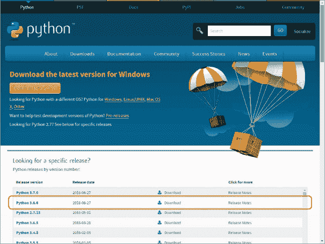

    *图 1：Python 下载页面*

1.  文件下载完成后，双击该文件以运行。

1.  在弹出的窗口中，勾选添加 Python 3.6 到 PATH（见图 2）。

1.  点击**立即安装**。

    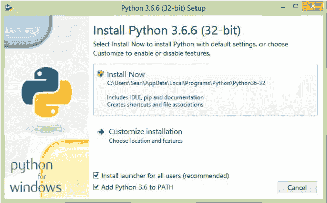

    *图 2：Python 安装程序*

1.  如果系统询问你是否允许此应用程序对设备进行更改，点击**是**。

1.  Python 安装可能需要几分钟。当安装完成后，点击**关闭**以完成安装。

#### **在 Windows 上安装 Pygame Zero**

现在你已经在计算机上安装了 Python，你可以安装 Pygame Zero。请按照以下步骤操作：

1.  按住**Windows 开始键**并按**R**。运行窗口应该会打开（参见图 3）。

1.  输入 cmd（参见图 3）。按下 ENTER 或点击**确定**。

    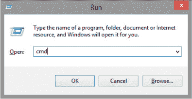

    *图 3：Windows 运行对话框*

1.  命令行窗口应该会打开，如图 4 所示。在这里，你可以输入指令来管理文件或启动程序。输入 pip install pgzero 并在行尾按下 ENTER。

    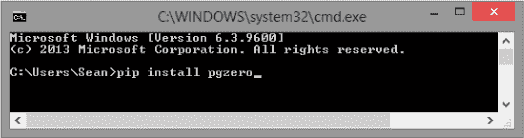

    *图 4：命令行窗口*

1.  Pygame Zero 应该开始安装。安装过程会花费一些时间，你会知道它完成了，当你的 > 提示符再次出现时。

1.  如果你收到一个错误信息，提示 pip 未被识别，尝试重新安装 Python。你可以先通过重新运行安装程序或使用 Windows 控制面板来卸载 Python。确保在安装 Python 时选择了 PATH 选项框（参见图 2）。重新安装 Python 后，再尝试重新安装 Pygame Zero。

1.  当 Pygame Zero 下载完成并且你可以重新输入时，输入以下内容：

    echo print("Hello!") > test.py

1.  这一行创建了一个名为*test.py*的新文件，文件中包含了指令 print("Hello!")。我将在第一章中解释 print()指令，但现在，这只是快速创建一个测试文件的方式。输入括号（圆括号）和引号时要小心：如果漏掉一个，文件将无法正常工作。

1.  输入以下命令以打开测试文件：

    pgzrun test.py

1.  稍等片刻后，应该会打开一个空白窗口，标题为*Pygame Zero Game*。再次点击命令行窗口将其置于最前面：你应该能看到文本 Hello！在命令行窗口按 CTRL-C 可以停止程序。

1.  如果你想删除测试程序，输入 del test.py。

#### **在其他机器上安装软件**

Python 和 Pygame Zero 也可以在其他计算机系统上使用。Pygame Zero 部分是为使游戏能够在不同计算机上运行而设计的，因此*Escape*代码应该能够在任何运行 Pygame Zero 的地方运行。本书仅为 Windows 和 Raspberry Pi 用户提供指导。但如果你使用其他计算机，可以在* [`www.python.org/downloads/`](https://www.python.org/downloads/)* 下载 Python，并可以在* [`pygame-zero.readthedocs.io/en/latest/installation.html`](http://pygame-zero.readthedocs.io/en/latest/installation.html)* 查找有关安装 Pygame Zero 的建议。

### **下载游戏文件**

我已经提供了你需要的所有程序文件、声音和图片，供你用来制作*Escape*游戏。你还可以下载书中的所有代码清单，如果你有哪个无法运行的，可以使用我的代码。所有书中的内容都会作为一个名为*escape.zip*的单独 ZIP 文件下载。

#### **在 Raspberry Pi 上下载并解压文件**

在树莓派上下载游戏文件，请按照以下步骤操作，并参考图 5。图 5 中的数字告诉你每一步应该怎么做。

➊ 打开你的网页浏览器，访问*[`nostarch.com/missionpython/`](https://nostarch.com/missionpython/)。点击链接下载文件。

➋ 从桌面上，点击屏幕顶部任务栏上的文件管理器图标。

➌ 双击你的下载文件夹以打开它。

➍ 双击*escape.zip*文件。

➎ 点击**提取文件**按钮，打开“提取文件”对话框。

➏ 更改你将要提取到的文件夹，使其显示为*/home/pi/escape*。

➐ 确保选择了“提取文件时保留完整路径”选项。

➑ 点击**提取**。

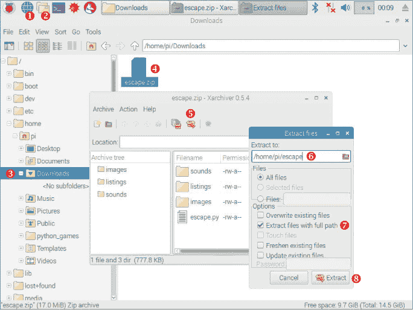

*图 5：你应该采取的步骤来解压文件*

#### **在 Windows PC 上解压文件**

在 Windows PC 上解压文件，请按以下步骤操作。

1.  打开你的网页浏览器，访问*[`nostarch.com/missionpython/`](https://nostarch.com/missionpython/)。点击链接下载文件。将 ZIP 文件保存在桌面、*文档*文件夹或其他你能轻松找到的地方。

1.  根据你使用的浏览器，ZIP 文件可能会自动打开，或者可能会在屏幕底部有一个打开它的选项。如果没有，按住**Windows 开始键**并按**E**。Windows 资源管理器窗口应该会打开。前往你保存 ZIP 文件的文件夹。双击 ZIP 文件。

1.  点击窗口顶部的**全部提取**。

1.  我建议你在*文档*文件夹中创建一个名为*escape*的文件夹，并将文件提取到那里。我的文档文件夹是*C:\Users\Sean\Documents*，所以我只需在文件夹名称末尾输入*\escape*，以便在该文件夹中创建一个新文件夹（见图 6）。如果需要，你可以先使用**浏览**按钮进入你的*文档*文件夹。

1.  点击**提取**。

    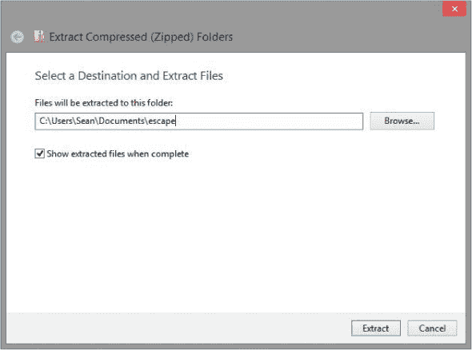

    *图 6：设置解压游戏文件的文件夹*

#### **ZIP 文件包含的内容**

你刚下载的 ZIP 文件包含三个文件夹和一个 Python 程序，*escape.py*（见图 7）。这个 Python 程序是*Escape*游戏的最终版本，所以你可以立即开始玩游戏。*images*文件夹包含了你在游戏和本书其他项目中所需的所有图片。*sounds*文件夹包含了声音效果。

在*listings*文件夹中，你将找到本书中所有的编号清单。如果你无法让程序正常运行，试试从这个文件夹中的我的版本。你需要先从*listings*文件夹复制它，然后粘贴到现在有*escape.py*程序的*escape*文件夹中。这样做的原因是因为程序需要与*images*和*sounds*文件夹放在一起，才能正常运行。

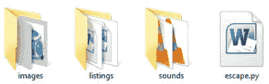

*图 7：ZIP 文件的内容在 Windows 中显示的样子*

### **运行游戏**

当你下载 Python 时，另一个名为 IDLE 的程序也会随之下载。IDLE 是一个集成开发环境（IDE），它是一个可以用来编写 Python 程序的软件。你可以使用本书中提供的说明，在 IDLE Python 编辑器中运行其中的一些代码。然而，大多数程序都使用 Pygame Zero，你需要从命令行运行这些程序。请按照这里的说明运行 *Escape* 游戏以及其他任何 Pygame Zero 程序。

#### **在树莓派上运行 Pygame Zero 程序**

如果你使用的是树莓派，请按照以下步骤运行 *Escape* 游戏：

1.  使用文件管理器，进入 *pi* 文件夹中的 *escape* 文件夹。

1.  点击菜单中的 **工具**，然后选择 **在终端中打开当前文件夹**，或者按 F4\。命令行窗口（也称为 *shell*）应该会打开，如 图 8 所示。你可以在这里输入命令来管理文件或启动程序。

    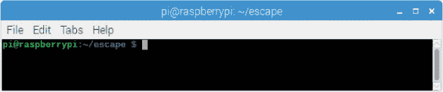

    *图 8：树莓派上的命令行窗口*

1.  输入以下命令并按回车键。游戏开始了！

    输入 `pgzrun escape.py`

这是在树莓派上运行 Pygame Zero 程序的方法。要再次运行相同的程序，重复上一步骤。要运行保存在同一文件夹中的其他程序，重复上一步骤，但更改 pgzrun 后的文件名。要在不同文件夹中运行 Pygame Zero 程序，从第 1 步开始，按照步骤操作，但从包含你要运行的程序的文件夹打开命令行。

#### **在 Windows 中运行 Pygame Zero 程序**

如果你使用的是 Windows，请按照以下步骤运行程序：

1.  进入你的 *escape* 文件夹。（按住 **Windows 启动键**，然后按 **E** 以再次打开 Windows 资源管理器。）

1.  点击你文件上方的长条，如 图 9 所示。将 cmd 输入到这个条中，并按回车键。

    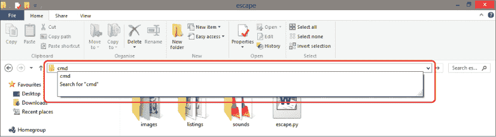

    *图 9：查找 Pygame 文件的路径*

1.  命令行窗口将打开，你的 *escape* 文件夹将在最后一行的 > 前显示，如 图 10 所示。

    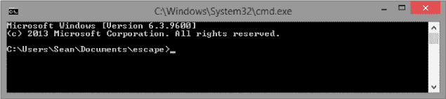

    *图 10：Windows 中的命令行窗口*

1.  在命令行窗口中输入 `pgzrun escape.py`，然后按回车键，*Escape* 游戏就开始了。

这是在 Windows 计算机上运行 Pygame Zero 程序的方法。你可以通过重复上一步骤再次运行程序。要运行保存在同一文件夹中的其他程序，只需重复上一步骤，但在 pgzrun 后更改文件名。要在不同文件夹中运行 Pygame Zero 程序，从第 1 步开始，按照步骤操作，但要从包含要运行程序的文件夹打开命令行。

### **玩游戏**

你独自在火星上的太空站工作，离家数百万公里远。其余的队员正在执行一项远距离任务，探索峡谷以寻找生命迹象，并且几天后才会回来。生命支持系统的嗡嗡声环绕在你周围。

当警报响起时，你吓了一跳！太空站墙壁出现裂缝，空气正在慢慢泄漏到火星的大气中。你迅速但小心地穿上太空服，但电脑告诉你太空服已经损坏。你的生命正面临危险。

你的首要任务是修复太空服并确保空气供应可靠。第二个任务是通过无线电呼救，但太空站的无线电系统出现故障。昨晚从地球发射的贵宾犬着陆器在火星尘土中迫降。如果你能找到它，也许可以用它的无线电发出求救信号。

使用箭头键在太空站内移动。要检查物品，站在物品上并按空格键。或者，如果物品是你无法走上的，走到物品前按空格键。

要捡起物品，走到物品上并按 G 键（代表*拿*）。

要选择你物品栏中的物品，物品栏显示在屏幕顶部（见图 11），按 TAB 键在物品之间切换。要丢弃选择的物品，按 D 键。

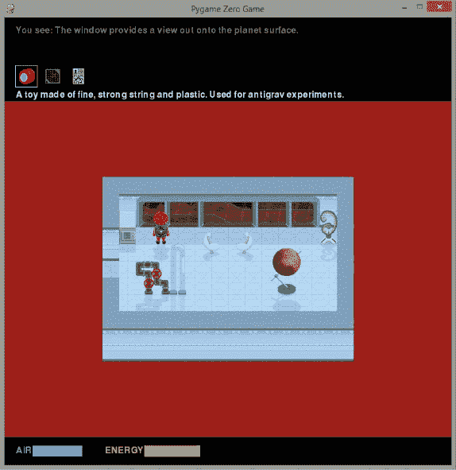

*图 11：你的冒险开始了！*

要使用物品，可以在物品栏中选择它，或者走到物品上并按 U 键。你可以在携带一个物品并站在另一个物品上，或者携带一个物品并走进另一个物品时按 U 键来将物品组合或一同使用。

你需要利用有限的资源创造性地克服障碍，找到安全的地方。祝你好运！
