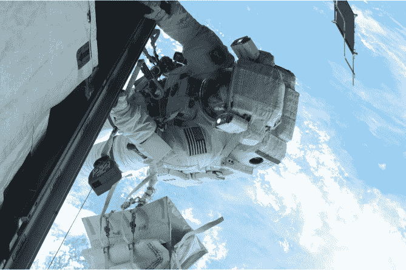
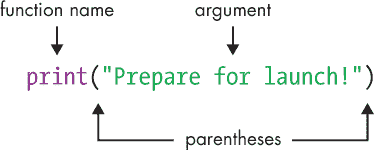
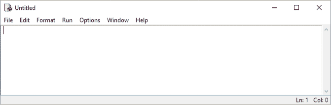
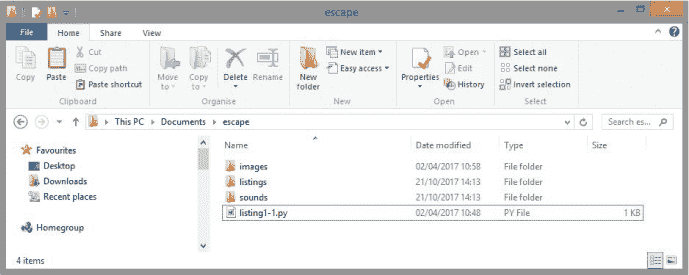
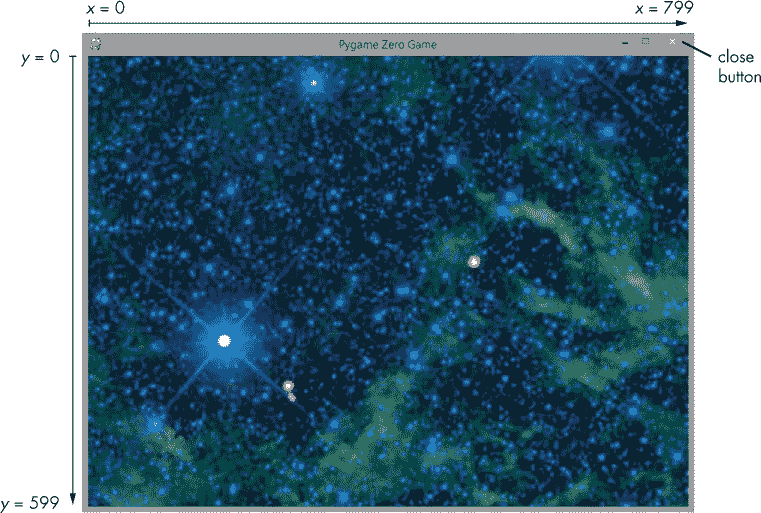
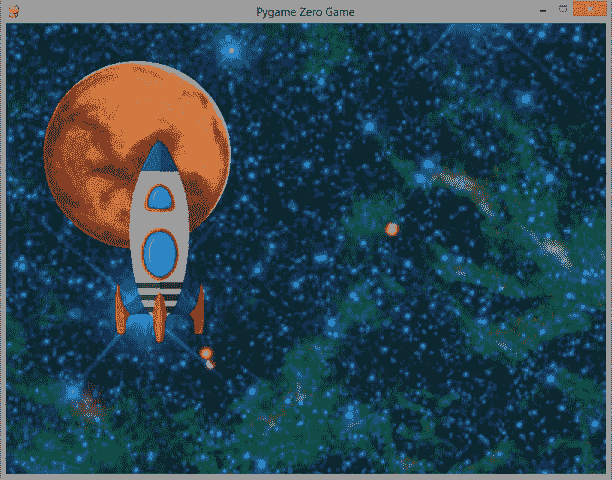
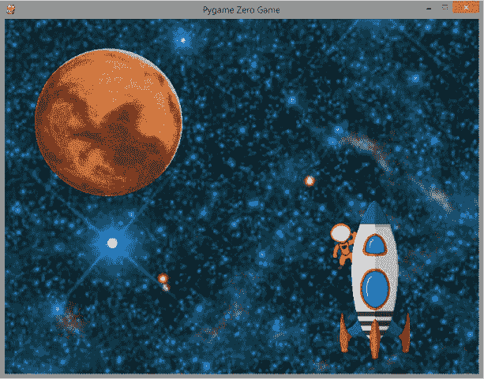
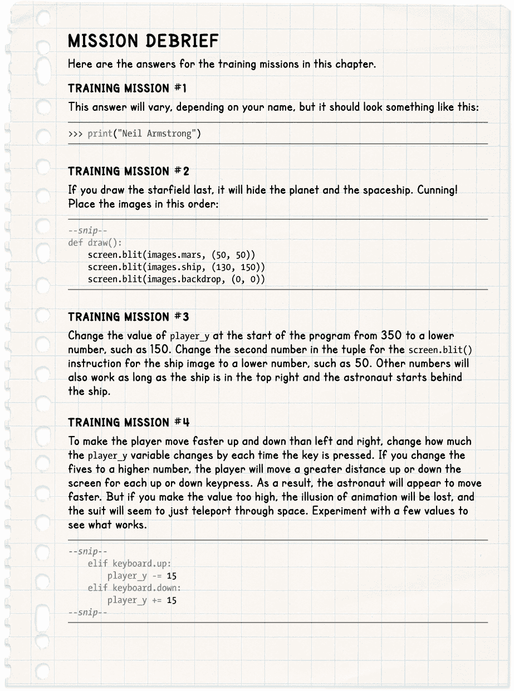

## **1**

**你的第一次太空行走**

欢迎加入太空军团。你的任务是建立人类在火星的第一个前哨基地。多年来，世界上最伟大的科学家们一直派遣机器人进行近距离研究。很快，你也将踏上这颗尘土飞扬的星球表面。

前往火星的旅程需要六到八个月，具体取决于地球和火星的对齐情况。在旅程中，飞船面临撞击陨石和其他太空碎片的风险。如果发生任何损坏，你需要穿上宇航服，前往气闸，然后走入太空的虚空进行修理，类似于图 1-1 中的宇航员。

在本章中，你将通过使用 Python 来进行一次太空行走，控制一个角色在屏幕上移动。你将启动你的第一个 Python 程序，并学习一些构建太空站所需的基本 Python 指令，后续章节中会用到。你还将学习如何通过重叠图像来创造深度感，这对我们稍后在 第三章 创建 *Escape* 游戏的 3D 效果至关重要。

*图 1-1: 美国宇航局宇航员 Rick Mastracchio 于 2010 年进行的 26 分钟太空行走，照片由宇航员 Clayton Anderson 拍摄。此次太空行走是在国际空间站外进行的，是一系列更换冷却罐任务的一部分。*

如果你还没有安装 Python 和 Pygame Zero（Windows 用户），请参阅 “安装软件” 在 第 3 页。你还需要本章中的*Escape*游戏文件。 “下载游戏文件” 在 第 7 页 告诉你如何下载和解压这些文件。

### **启动 Python 编辑器**

正如我在简介中提到的，本书将使用 Python 编程语言。编程语言为计算机编写指令提供了一种方式。我们的指令将告诉计算机如何做一些事情，比如响应按键或显示图像。我们还将使用 Pygame Zero，它为 Python 提供了一些处理声音和图像的附加指令。

Python 附带了 IDLE 编辑器，我们将使用该编辑器来创建我们的 Python 程序。由于你已经安装了 Python，IDLE 应该也已经安装在你的计算机上。接下来的部分将根据你使用的计算机类型，解释如何启动 IDLE。

#### **在 Windows 10 中启动 IDLE**

在 Windows 10 中启动 IDLE，按照以下步骤操作：

1.  点击屏幕底部的 Cortana 搜索框，在框中输入 Python。

1.  点击**IDLE**以打开它。

1.  在 IDLE 运行时，右键点击屏幕底部任务栏中的图标并将其固定。以后你可以通过单击它来运行 IDLE。

#### **在 Windows 8 中启动 IDLE**

在 Windows 8 中启动 IDLE，按照以下步骤操作：

1.  将鼠标移动到屏幕的右上角以显示 Charms 栏。

1.  点击搜索图标，在框中输入 Python。

1.  点击**IDLE**以打开它。

1.  在 IDLE 运行时，右键单击任务栏底部的图标并将其固定。这样，以后您可以通过单击图标快速运行它。

#### **在 Raspberry Pi 上启动 IDLE**

要在 Raspberry Pi 上启动 IDLE，请按照以下步骤操作：

1.  点击屏幕左上角的“程序”菜单。

1.  找到“编程”类别。

1.  点击 Python 3 (IDLE) 图标。Raspberry Pi 上安装了 Python 2 和 Python 3，但本书中的大多数程序只能在 Python 3 中运行。

### **介绍 Python Shell**

当您启动 IDLE 时，您应该会看到 Python 的*shell*，如图 1-2 所示。这个窗口是您可以输入 Python 指令并立即看到计算机响应的地方。三个箭头 (>>>) 被称为*提示符*。它们表示 Python 已经准备好接受您的指令。

*图 1-2：Python shell*

那么，让我们给 Python 安排点事情吧！

#### **显示文本**

对于我们的第一个指令，让我们告诉 Python 在屏幕上显示文本。输入以下行并按下 ENTER 键：

>>> print("准备启动！")

当您输入时，文本的颜色会发生变化。它开始是黑色的，但一旦 Python 识别出命令（如 print），文本的颜色会发生变化。

图 1-3 显示了您刚才输入的指令的不同部分的名称。紫色的单词 print 是一个*内置函数*的名称，它是 Python 中总是可用的众多指令之一。print() 函数会显示您放置在*括号*（圆括号）中的信息。函数括号中的信息是该函数的*参数*。

*图 1-3：您首次指令的不同部分*

在我们的第一个指令中，print() 函数的参数是一个*字符串*，这是程序员用来表示一段文本的术语。（字符串可以包含数字，但它们被当作字母处理，因此不能在字符串中进行计算。）双引号（" "）标识字符串的开始和结束。您在双引号之间输入的任何内容都会变为绿色，双引号本身也会变成绿色。

颜色不仅仅是为了点亮屏幕：它们还突出显示指令的不同部分，帮助您查找错误。例如，如果您的最终括号是绿色的，那意味着您忘记了字符串的闭合双引号。

如果您正确输入指令，计算机将显示以下文本：

准备启动！

显示为绿色的字符串现在以蓝色显示在屏幕上。所有的*输出*（计算机给您的信息）都以蓝色显示。如果您的命令没有生效，请检查您是否做了以下操作：

1.  正确拼写了 print。如果您做到了，它将变为紫色（参见图 1-3）。

1.  使用了两个括号。其他形状的括号将无法使用。

1.  使用了两个双引号。不要使用两个撇号（''）代替双引号（"）。虽然双引号包括两个符号，但它只是键盘上的一个符号。在美国键盘上，双引号位于字母中间行的右侧，必须与 SHIFT 键一起使用。在英国键盘上，双引号位于数字 2 键上。

如果你在双引号之间输入的文本有错误，指令仍然会执行，但计算机会显示你输入的内容。例如，试试这个：

>>> print("Prepare for lunch!")

现在如果你输入字符串错误也没关系，但在后续章节中输入字符串或指令时要小心。错误通常会导致程序无法正常工作，而且在较长的程序中跟踪错误可能会很困难，即使有颜色编码的帮助。

**训练任务 #1**

你能输入一个新指令来输出你的名字吗？（你将在每章末尾的“任务总结”部分找到训练任务的答案。）

#### **输出和使用数字**

到目前为止，你已经使用 print() 函数输出了一个字符串，但它也可以进行计算并输出数字。输入以下代码：

>>> print(4 + 1)

计算机应该输出数字 5，这是 4 + 1 的结果。与字符串不同，数字和计算式不需要用引号括起来。但你仍然需要使用括号来标记你希望传递给 print() 函数的信息的开始和结束。

如果你把引号放在 4 + 1 周围会发生什么？试试看！结果是计算机会输出 "4 + 1"，因为它不会将 4 和 1 当作数字。相反，它将该参数当作一个字符串。你要求它输出 "4 + 1"，它就会完全按照你的要求输出！

>>> print(4 + 1)

5

>>> print("4 + 1")

4 + 1

Python 只有在你不加引号时才会进行计算。在你的程序中，你会经常使用 print() 函数。

### **介绍脚本模式**

Shell 非常适合快速计算和执行简短的指令。但对于较长的指令集，比如游戏，创建程序要容易得多。*程序*是可重复执行的一组指令，我们保存它们，以便在需要时随时运行并进行修改，而不必重新输入它们。我们将使用 IDLE 的 *脚本模式* 来编写程序。当你在脚本模式下输入指令时，它们不会像在 Shell 中那样立即运行。

使用 Shell 窗口顶部的菜单，选择 **文件**，然后选择 **新建文件** 来打开一个空白的新窗口，如 图 1-4 所示。窗口顶部的标题栏会显示 *未命名*，直到你保存文件并为其命名。一旦保存文件，标题栏会显示文件名。从现在起，在创建 Python 代码时，我们几乎总是会使用脚本模式。

*图 1-4：Python 脚本模式*

当你在脚本模式中输入指令时，可以使用鼠标或箭头键更改、添加和删除指令，这样修正错误和构建程序会更加容易。从第四章开始，我们将通过逐步添加内容并测试每个新部分，来构建*Escape*游戏。

**提示**

如果你不确定自己是处于外壳模式还是脚本模式窗口，可以查看顶部的标题栏。外壳显示的是*Python Shell*，而脚本模式窗口则显示*Untitled*或你的程序名称。

### **创建星空背景**

我们将编写的第一个程序将显示我们将用作*太空行走*程序背景的星空图像。该图像位于*escape*文件夹中的*images*文件夹内。从在 IDLE 中新建空白窗口中输入 Listing 1-1 开始。

**注意**

*在本书中，我将使用圆圈中的数字（像这样：➊）来引用解释中不同的代码部分，以便你更容易跟随。不要在程序中输入这些数字。当你在文本中看到圆圈中的数字时，回到程序清单中查看我提到的程序部分。*

Listing 1-1 是一个简短的程序，但在你输入时，有几个细节需要注意：def 语句 ➍ 末尾需要加上冒号，下一行 ➎ 需要以四个空格开头。当你在 def 行末尾添加冒号并按下 ENTER 键时，IDLE 会自动在下一行的开头为你添加四个空格。

*listing1-1.py*

➊ # 太空行走

# 作者：Sean McManus

# www.sean.co.uk / www.nostarch.com

➋ WIDTH = 800

HEIGHT = 600

➌ player_x = 600

player_y = 350

➍ def draw():

➎     screen.blit(images.backdrop, (0, 0))

*Listing 1-1: 在 Pygame Zero 中查看星空。*

选择屏幕顶部的**文件**菜单，然后选择**保存**（从现在起，我们将使用这种简化的方式表示菜单选择：**文件** ▸ **保存**）。在保存对话框中，将程序命名为*listing1-1.py*。你需要将文件保存在引言中设置的*escape*文件夹内。这样，它就与书中的*images*文件夹位于同一文件夹中，当你运行程序时，Pygame Zero 可以找到图像文件。保存文件后，你的*escape*文件夹应包含*listing1-1.py*文件和*images*文件夹，如图 1-5 所示（以及*listings*和*sounds*文件夹）。

*图 1-5：你的新 Python 程序和*images*文件夹应保存在同一位置。*

我将很快解释*listing1-1.py*程序是如何工作的，但首先让我们运行程序，以便欣赏星空背景。该程序需要一些来自 Pygame Zero 的指令来管理图像，因此为了使用这些指令，我们需要使用 pgzrun 指令来运行程序。每当我们在 Python 程序中使用 Pygame Zero 的任何指令时，都需要通过 pgzrun 来运行程序。

我们将像在引言中运行*Escape*游戏时那样，在计算机的命令行中输入这些内容。首先，回到“运行游戏”一节，查看第 9 页的指示，按照那里提供的步骤，从*escape*文件夹打开你计算机的命令行终端。然后从命令行运行以下指令：

pgzrun listing1-1.py

**红色警报**

*不要在 IDLE 中输入此指令：确保在 Windows 或树莓派命令行中输入。引言部分已经告诉你如何操作。*

如果一切按计划进行，你应该看到壮丽的太空，如图 1-6 所示。

*图 1-6：星空背景。该星空图像由 NASA/JPL-Caltech/UCLA 提供，显示了星团 NGC 2259。*

**使用我的示例清单**

如果你无法让书中的某个程序正常工作，你可以使用我的示例程序。比如，你可以使用我的*listing1-1.py*示例，并对其进行修改，快速制作出属于自己的*listing1-2.py*，这样你就可以继续跟着书中的内容进行学习。

我的程序可以在*listings*文件夹中找到，该文件夹位于*escape*文件夹内。只需在 Windows 或树莓派桌面中打开*listings*文件夹，找到你需要的示例，复制它，然后粘贴到*escape*文件夹中。然后在 IDLE 中打开复制的示例，并按照书中的下一步操作进行操作。查看文件夹时，你应该能看到 Python 文件和*images*文件夹位于同一位置（见图 1-5）。

#### **到目前为止理解程序**

本书中你将看到的大多数指令都可以在任何 Python 程序中使用。例如，print()函数始终可用。为了编写本书中的程序，我们还使用了 Pygame Zero。它为 Python 增添了一些新的功能和能力，特别是在屏幕显示和声音方面，以便创建游戏。清单 1-1 介绍了我们首次使用 Pygame Zero 的指令，用于设置游戏窗口和绘制星空。

让我们仔细看看*listing1-1.py*程序是如何工作的。

前几行程序是*注释* ➊。当你使用#符号时，Python 会忽略该行#符号后面的所有内容，并且这一行会显示为红色。这些注释帮助你和其他阅读程序的人理解程序的功能及其工作原理。

接下来，程序需要存储一些信息。程序几乎总是需要存储程序使用或需要稍后引用的信息。例如，在许多游戏中，计算机需要跟踪分数和玩家在屏幕上的位置。由于这些细节在程序运行过程中可能会发生变化（或*不同*），它们会被存储在被称为*变量*的东西中。变量是你赋予某个信息（无论是数字还是文本）的一种名称。

要创建一个变量，你可以使用类似这样的指令：

variable_name = value

**注意**

*斜体显示的代码术语是占位符，需要被填写。比如，*variable_name* 你应该输入你自己的变量名。*

例如，以下指令将数字 500 存入变量 score 中：

score = 500

你可以几乎随意命名你的变量。然而，为了让你的程序易于编写和理解，你应该选择能够描述每个变量内部信息的变量名。注意，你不能使用 Python 用于其语言的名字作为变量名，比如 print。

**红色警报**

*Python 是区分大小写的，这意味着它严格区分变量名的大小写。事实上，它将* score*、* SCORE* 和* Score* 视为三个完全不同的变量。确保你准确复制我的示例程序，否则它们可能无法正常工作。*

列表 1-1 从创建一些变量开始。Pygame Zero 使用 WIDTH 和 HEIGHT 变量 ➋ 来设置游戏窗口的大小。我们的窗口比它的高度要宽，因为 WIDTH 值（800）大于 HEIGHT 值（600）。

注意，我们将这些变量用大写字母拼写。变量名中的大写字母告诉我们这些是*常量*。常量是一种特殊类型的变量，其值在设置之后不应该再改变。大写字母帮助其他程序员理解，这些变量不应该在程序的其他地方被修改。

player_x 和 player_y 变量 ➌ 将在你执行太空行走时存储你在屏幕上的位置。在本章稍后，我们将使用这些变量来在屏幕上绘制你的图像。

然后，我们使用 def() 语句 ➍ 来定义一个函数。*函数* 是一组指令，你可以在程序中任何需要时运行它们。你已经见过一个内置函数叫做 print()。我们将在这个程序中创建自己的函数叫做 draw()。Pygame Zero 将用它在每次屏幕变化时绘制屏幕显示。

我们使用关键字 def ➍ 来定义一个函数，后面跟上我们选择的函数名、空括号和冒号。稍后你会看到，你有时会在函数的括号中传递信息。

然后，我们需要给函数指令，告诉它应该做什么。为了告诉 Python 哪些指令属于函数，我们通过缩进四个空格来区分它们。来自 Pygame Zero 的 `screen.blit()` 指令 ➎ 用于在屏幕上绘制图像。在括号中，我们告诉它绘制哪张图像以及在哪里绘制，像这样：

`screen.blit(images.image_name, (x, y))`

在 *images* 文件夹中，我们将使用 *backdrop.jpg* 文件，它是星空背景。在我们的 *listing1-1.py* 程序中，我们将其引用为 `images.backdrop`。我们不需要使用文件的 *.jpg* 扩展名，因为我们正在使用 Pygame Zero 来处理图像，而 Pygame Zero 不需要扩展名。程序知道图像的位置，因为所有图像必须放在 *images* 文件夹中，Pygame Zero 才能找到它们。

我们将图像放在屏幕上的位置 (0, 0) ➌，这是屏幕的左上角。第一个数字，称为 *x 位置*，告诉 `screen.blit()` 指令我们希望图像距离左边缘多远；第二个数字，称为 *y 位置*，描述我们希望图像距离顶部多远。*x* 位置从窗口左边缘的 0 到右边缘的 799，因为我们的窗口宽度为 800 像素。同样，*y* 位置从窗口顶部的 0 到底部的 599（参见 图 1-6）。

对于屏幕上的位置，我们使用一个*元组*，它只是一个括号内的数字或字符串的组合，例如 (0, 0)。在元组中，数字之间用逗号分隔，也可以加上可选的空格以提高可读性。

你需要了解关于元组的最重要的一点是，要小心标点符号。因为元组使用括号，并且我们把这个元组放入 `screen.blit()` 的括号中，所以这里有两组括号。因此，你需要在元组值周围加上括号，但也需要在元组后关闭 `screen.blit()` 的括号。

### **停止你的 Pygame Zero 程序**

类似于太空，你的 Pygame Zero 程序将永远运行下去。要停止它，可以点击游戏窗口右上角的关闭按钮（参见 图 1-6）。你也可以通过按 CTRL-C 关闭命令行窗口中的程序，那里你输入了 `pgzrun` 指令。

**紧急警报**

*不要关闭命令行窗口本身。否则，你需要重新打开它才能运行另一个 Pygame Zero 程序。如果你不小心关闭了它，可以参阅 “运行游戏” 在 第 9 页 重新打开它。*

### **添加行星和宇宙飞船**

让我们把火星和宇宙飞船显示出来。在 IDLE 中，添加 Listing 1-2 中的最后两行到你现有的 *listing 1-1.py* 程序中。

**注意**

*我将使用* --snip-- *在代码清单中显示我省略的代码部分，通常是因为这些代码在之前已经出现过。我还会将任何重复的代码以灰色显示，以便你能更清楚地看到需要添加的新代码。不要再添加重复的代码！*

在以下代码中，我省略了注释和变量设置部分，以节省空间并使你更容易看到新增的代码。但请确保你在程序中保留这些指令。只需在末尾添加这两行新代码。

*listing1-2.py*

--snip--

def draw():

screen.blit(images.backdrop, (0, 0))

screen.blit(images.mars, (50, 50))

screen.blit(images.ship, (130, 150))

*清单 1-2：添加火星和飞船*

将更新后的程序保存为 *listing1-2.py*，方法是选择 **文件** ▸ **另存为**。通过切换回命令行窗口并输入命令 pgzrun listing1-2.py 来运行程序。图 1-7 显示了现在屏幕的样子，红色的行星和飞船位于其上方。

*图 1-7：火星和飞船。火星图像由哈勃太空望远镜于 1991 年拍摄。*

**注意**

*如果程序没有按预期工作，请检查所有的* screen.blit() *指令前面是否有准确的四个空格，并且它们是否对齐。*

新指令中的第一条将图像 *mars.jpg* 放置在屏幕的（50, 50）位置，即靠近左上角的位置。第二条新指令将飞船放置在（130, 150）位置。在这两种情况下，使用的坐标是图像的左上角。

#### **改变视角：飞船飞过行星后方**

现在让我们看看如何让飞船飞到火星的后面。按照 清单 1-3 中所示，交换最后两条指令的顺序。在 IDLE 中进行此操作时，选中其中一行，按 CTRL-X 剪切它，点击新的一行，然后按 CTRL-V 粘贴到该位置。你也可以使用屏幕顶部编辑菜单中的剪切和粘贴选项。

*listing1-3.py*

--snip--

def draw():

screen.blit(images.backdrop, (0, 0))

screen.blit(images.ship, (130, 150))

screen.blit(images.mars, (50, 50))

*清单 1-3：交换行星和飞船指令的顺序*

如果程序的先前版本仍在运行，请现在关闭它。将新的程序保存为 *listing1-3.py*，并通过命令行输入 pgzrun listing1-3.py 来运行它。你应该能看到飞船现在位于火星的后面，如 图 1-8 所示。如果没有，确保你运行了正确的文件 (*listing1-3.py*)，然后检查程序中的指令是否正确。

飞船会被火星遮挡，因为图像是按程序绘制顺序添加到屏幕上的。在我们更新的程序中，我们先绘制星空，再绘制飞船，最后绘制火星。每个新图像都会出现在前一个图像的上方。如果两个图像重叠，最后绘制的图像会出现在前一个图像前面。

*图 1-8：飞船现在在行星后面。*

**训练任务 #2**

你能否通过仅移动程序中的一个绘图指令，使行星和飞船消失？如果你不确定该怎么做，可以尝试移动绘图指令，看看每次保存程序并重新运行时会有什么效果。

确保你在 draw() 函数内将绘图指令保持对齐，并使用四个空格缩进。当你完成实验后，再次对照 Listing 1-3 来恢复飞船和火星的显示。

#### **太空行走！**

现在是从飞船底部爬出来，开始太空行走的时候了。编辑你的程序，使其与 Listing 1-4 一致。但一定要保持这里没有显示的变量指令与之前相同。将更新后的程序保存为 *listing1-4.py*。

*listing1-4.py*

--snip--

def draw():

screen.blit(images.backdrop, (0, 0))

screen.blit(images.mars, (50, 50))

➊     screen.blit(images.astronaut, (player_x, player_y))

➋     screen.blit(images.ship, (550, 300))

➌ def game_loop():

➍     global player_x, player_y

➎     if keyboard.right:

➏         player_x += 5

➐     elif keyboard.left:

player_x -= 5

➑     elif keyboard.up:

player_y -= 5

elif keyboard.down:

player_y += 5

➒ clock.schedule_interval(game_loop, 0.03)

*Listing 1-4: 添加太空行走指令*

在这个列表中，我们添加了一个新的指令➊，在程序开始时（在 Listing 1-1 中设置的）player_x 和 player_y 变量所指定的位置绘制宇航员的图像。如你所见，我们可以用这些变量名代替数字来表示宇航员的位置。程序会使用这些变量中存储的当前数字来确定每次绘制时宇航员的位置。

请注意，程序中图像绘制的顺序已经改变，现在是背景、火星、宇航员和飞船。确保你改变 screen.blit() 指令的顺序，以匹配这个列表。

宇航员一开始会和飞船重叠。因为宇航员在飞船之前绘制，所以宇航员看起来像是从飞船下面（后面）冒出来的。我们还将飞船的位置➋更改到屏幕的右下方。这为宇航员提供了飞向行星的空间。

运行程序，输入 pgzrun listing1-4.py。你现在应该能够使用箭头键在太空中自由移动，穿着太空服，正如在图 1-9 中所示。你会看到你飞行在飞船后面，但在火星和星空之前。我们绘制图像的顺序创造了一个简单的深度错觉。当我们在第三章开始绘制空间站时，我们将使用这种绘图技巧来创建每个房间的 3D 透视。我们将从后到前绘制房间，以营造深度感。

*图 1-9：你从飞船中出来，开始太空行走。*

**训练任务 #3**

你能修改代码让宇宙飞船和宇航员移动到屏幕的右上角吗？你需要更改`player_x`和`player_y`的初始值，以及飞船的绘制位置。确保在程序开始时，玩家“在”飞船里面（实际上是在飞船下方）。也可以尝试其他位置。这是熟悉屏幕位置的好方法。如果需要，参考图 1-6。

#### **理解太空行走列表**

太空行走列表，列表 1-4 很有趣，因为它允许你通过键盘控制程序的一部分，这对于*逃脱*游戏来说至关重要。让我们看看我们的最终太空行走程序是如何工作的。

我们在之前的列表基础上添加了一个新的函数，叫做`game_loop()` ➌。这个函数的作用是，当你按下箭头键时，改变`player_x`和`player_y`变量的值。改变这些变量使得你可以移动宇航员角色，因为这些变量决定了宇航员在绘制时的位置。

在继续之前，我们需要了解两种不同类型的变量。在函数内部修改的变量通常属于该函数，不能被其他函数使用。它们被称为*局部变量*，并且它们减少了程序的各个部分之间互相干扰的可能性，从而避免错误的发生。

但是在太空行走列表中，我们需要让`draw()`和`game_loop()`这两个函数使用相同的`player_x`和`player_y`变量，因此它们需要是*全局变量*，任何程序部分都可以使用这些变量。我们在程序开始时设置全局变量，放在任何函数之外。

为了告诉 Python `game_loop()`函数需要使用并修改我们在函数外部设置的全局变量，我们使用`global`命令 ➍。我们把它放在函数的开头，并列出我们希望作为全局变量使用的变量。这样做就像是覆盖了防止你修改函数外部创建的变量的安全功能。我们在`draw()`函数中不需要使用`global`，因为`draw()`函数不需要修改这些变量，它只需要查看这些变量的值。

我们使用`if`命令告诉程序使用键盘控制。通过这个指令，我们告诉 Python 只在特定条件满足时才执行某些操作。我们使用四个空格来缩进属于`if`命令的指令。这意味着这些指令在列表 1-4 中总共缩进了八个空格，因为它们也在`game_loop()`函数内。只有在`if`命令后的条件为真时，这些指令才会执行。如果条件不成立，属于`if`命令的指令将被跳过。

使用空格来显示哪些指令属于一组，可能看起来很奇怪，尤其是如果你使用过其他编程语言，但它使得程序易于阅读。其他语言通常需要在这样的指令组周围加上括号，而 Python 则保持简单。

我们使用 if 命令来检查是否按下了右箭头键➎。如果按下了，我们通过加 5 来改变 player_x 的值➏，将宇航员的图像向右移动。符号+=表示*增加*，因此以下代码行将 player_x 变量中的数字增加 5：

player_x += 5

同样，-=表示*减少*，因此以下指令将 player_x 中的数字减去 5：

player_x -= 5

如果右箭头键没有被按下，我们检查是否按下了左箭头键。如果按下了，程序将从 player_x 的值中减去 5，将宇航员的位置向左移动。为此，我们使用 elif 命令➐，它是“else if”的缩写。你可以将*else*理解为*否则*。用简单的话来说，这部分程序的意思是：“如果按下了右箭头键，就在*x*位置上加 5。否则，如果按下了左箭头键，就从*x*位置中减去 5。”我们接着使用 elif 来检查上和下方向键的按下情况，并以相同的方式改变*y*位置，使宇航员向上或向下移动。draw()函数使用 player_x 和 player_y 变量来表示宇航员的位置，因此改变这些变量中的数字会使宇航员在屏幕上移动。

**提示**

如果你把➑处的 elif 命令改为 if 命令，程序允许你同时上下和左右移动，让你走斜线。这在太空漫步程序中很有趣，但我们稍后将使用类似的代码在空间站中移动，在那里看起来就不自然了。

最后的指令➒设置 game_loop()函数每 0.03 秒运行一次，使用 Pygame Zero 中的时钟，这样程序就会频繁地检查你的按键并更新位置变量。注意，这里在 game_loop 后面没有加括号。这个指令没有缩进，因为它不属于任何函数。当程序启动时，它会按顺序运行不属于任何函数的指令，从上到下。因此，程序的最后一行是变量设置完后最先运行的一行。这一行启动了 game_loop()函数。

draw()函数会在每次需要更新屏幕时自动运行。这是 Pygame Zero 的一个特点。

**训练任务#4**

让我们为宇航服装配一些新的推进器。你能算出如何使宇航员在上下方向上移动得比在左右方向上更快吗？每次按下上或下方向键时，宇航服应该比按下左或右方向键时移动得更多。

在你进行太空行走并修复你的飞船时，享受令人叹为观止的景色。我们将在 第二章 再次汇合，届时你将学习一些有助于你在太空中保持安全的程序。

### **你准备好飞行了吗？**

请勾选以下框以确认你已掌握本章的关键知识点。如果你对某些内容不确定，请翻回章节并重新查看相关主题。

  使用 IDLE 的脚本模式来创建一个你可以保存、编辑并再次运行的程序。通过选择 **文件** ▸ **新建文件** 进入脚本模式，或通过选择 **文件** ▸ **打开** 来编辑现有文件。

  字符串是代码中的一段文本。双引号标记字符串的开始和结束。字符串可以包含数字，但它们被当作字母处理。

  变量用于存储信息，可以是数字或字符串。

  print() 函数将信息输出到屏幕。你可以用它输出字符串、数字、计算结果或变量的值。

  程序中的 # 符号用于标记注释。Python 会忽略 # 后面的内容，注释对于你和与他人共享代码时是一个方便的提醒。

  使用 WIDTH 和 HEIGHT 变量来设置游戏窗口的大小。

  要运行 Pygame Zero 程序，请打开你 Python 程序所在文件夹中的命令行窗口，然后在命令行中输入 pgzrun filename.py 来运行它。

  函数是一组指令，你可以在任何需要这些指令时执行它们。Pygame Zero 使用 draw() 函数来绘制或更新游戏屏幕。

  使用 screen.blit(images.image_name, (x, y)) 在屏幕上绘制图像，位置为 (*x*, *y*)。x 轴和 y 轴从左上角的 0 开始编号。

  *元组* 是一组括号中的数字或字符串，用逗号分隔。元组的内容一旦设置，就不能被程序更改。

  要结束你的 Pygame Zero 程序，可以点击窗口的关闭按钮或在命令行窗口按 CTRL-C。

  如果图像重叠，程序中最后绘制的图像会出现在最前面。

  elif 命令是“else if”的简写。使用它可以将 if 条件组合在一起，从而保证只有一组指令能运行。在我们的程序中，我们使用它来防止玩家同时向两个方向移动。

  如果我们想在一个函数内部修改变量并在另一个函数中使用它，我们需要使用 *全局变量*。我们在函数外部设置它，并在函数内部使用 global 关键字来表示计划修改该变量。

 我们可以利用 Pygame Zero 中的时钟功能设置一个定期运行的函数。

