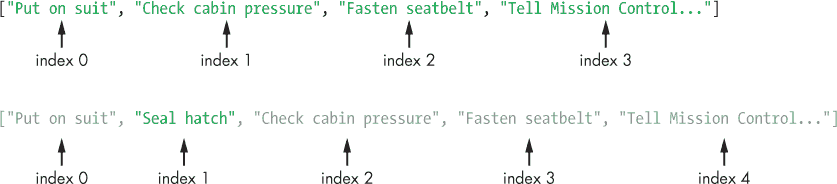
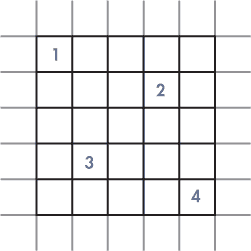
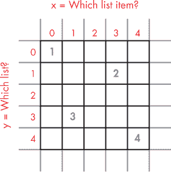
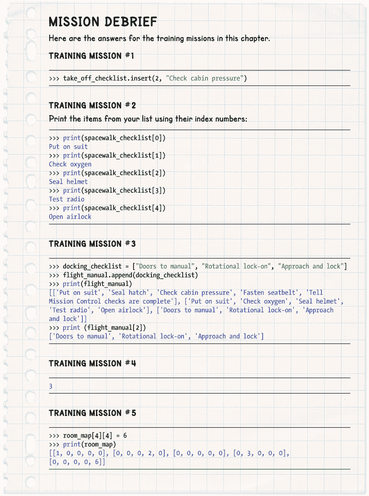

## **2

列表可以拯救你的生命**

宇航员的生活离不开列表。他们使用的安全检查清单帮助确保所有系统在他们将生命交托给这些系统之前正常运行。例如，紧急检查清单告诉宇航员在危急情况下该如何做，以避免他们惊慌失措。程序性检查清单则确认他们正确使用设备，以确保没有损坏并能顺利返回地球。这些清单有一天可能会救他们的命。

在本章中，你将学习如何在 Python 中管理列表，并如何使用它们来制作检查清单、地图以及几乎任何其他东西。当你制作*逃脱*游戏时，你将使用列表来存储有关空间站布局的信息。

### **创建你的第一个列表：起飞检查清单**

起飞是太空旅行中最危险的方面之一。当你被固定在火箭上时，你需要在发射前仔细检查一切。一个简单的起飞检查清单可能包含以下步骤：

  穿上宇航服

  密封舱口

  检查舱内压力

  系好安全带

Python 有一个完美的方法来存储这些信息：Python 中的*列表*就像一个可以存储多个项的变量。正如你将看到的，你可以将它用于数字、文本，甚至是二者的组合。

让我们在 Python 中创建一个名为 take_off_checklist 的列表，供我们的宇航员使用。由于我们只是用一个简短的示例来练习，我们将在 Python shell 中输入代码，而不是创建一个程序。（如果你需要复习如何使用 Python shell，可以查看《介绍 Python Shell》，见第 15 页。）在 IDLE shell 中输入以下内容，每行末尾按 ENTER 键开始新的一行：

>>> take_off_checklist = ["穿上宇航服",

"密封舱口",

"检查舱内压力",

"系好安全带"]

**红色警报**

*确保你代码中的括号、引号和逗号准确无误。如果遇到任何错误，请重新输入列表代码，并仔细检查括号、引号和逗号是否放置正确。为了避免重新输入代码，可以用鼠标选中命令行中的文本，右键点击选中文本，选择**复制**，再右键点击并选择**粘贴**。*

让我们仔细看看如何制作 take_off_checklist 列表。你可以通过一个左方括号来标记列表的开始。Python 会知道，直到它检测到最后一个右方括号，列表才算结束。这意味着你可以在每行的末尾按下 ENTER 键继续输入指令，而 Python 知道你没有完成，直到你输入最后一个括号。

引号告诉 Python 你正在给它一些文本，并且每一段文本的开始和结束位置在哪里。每一项都需要自己独立的开头和结尾引号。你还需要用逗号分隔不同的文本段落。最后一项后不需要逗号，因为后面没有其他项。

#### **查看你的清单**

要查看你的清单，你可以使用 print() 函数，就像我们在第一章中做的那样。将清单的名称添加到 print() 函数中，像这样：

>>> print(take_off_checklist)

['穿上衣服', '封舱', '检查舱内气压', '系好安全带']

你不需要在 take_off_checklist 周围加上引号，因为它是清单的名称，而不是一段文本。如果你加上引号，Python 只会在屏幕上显示文本 take_off_checklist，而不是给你返回清单。试试看，看看会发生什么。

#### **添加和删除项**

即使你已经创建了一个清单，你也可以使用 append() 命令向其中添加一个项。*append* 这个词意味着在末尾添加某些东西（想想附录，就在书的末尾）。你可以像这样使用 append() 命令：

>>> take_off_checklist.append("告诉任务控制中心检查已完成")

你输入清单的名称（没有引号），后跟一个句点和 append() 命令，然后将要添加的项放入括号中。该项将被添加到清单的末尾，就像你再次打印清单时看到的那样：

>>> print(take_off_checklist)

['穿上衣服', '封舱', '检查舱内气压', '系好安全带', '告诉

任务控制中心检查已完成']

你还可以使用 remove() 命令从清单中移除项。我们来移除封舱项：

>>> take_off_checklist.remove("封舱")

>>> print(take_off_checklist)

['穿上衣服', '检查舱内气压', '系好安全带', '告诉任务

控制检查已完成']

再次输入清单的名称，后跟一个句点和 remove() 命令，然后在括号内指定你想要删除的项。

**红色警报**

*当你从清单中删除一个项时，确保你输入的内容与项完全匹配，包括大写字母和任何标点符号。否则，Python 将无法识别它，并且会给你一个错误。*

### **使用索引号**

嗯，我们应该在任务控制中心的人注意到之前，把封舱检查重新放回清单里。你可以通过使用项的索引号在清单中插入一个特定位置的项。*索引*是项在清单中的位置。Python 从 0 开始计数，而不是从 1，所以清单中的第一个项总是索引 0，第二个项索引 1，依此类推。

#### **插入项**

使用位置索引，我们将封舱项放回它应该在的位置：

>>> take_off_checklist.insert(1, "封舱")

>>> print(take_off_checklist)

['穿上衣服', '封舱', '检查舱内气压', '系好安全带', '告诉

任务控制中心检查已完成']

呼，感觉我们挺顺利的。由于索引从 0 开始，当我们插入“密封舱口”时，我们把它放在了位置 1，也就是列表中的第二项。其余的列表项向下移动，增加了它们的索引号，正如图 2-1 所示。

*图 2-1：在索引 1 处插入项。上排：插入前。下排：插入后。*

#### **访问单个项**

你还可以通过列表名称加上方括号中的索引号来访问特定项。例如，若要打印列表中的特定项，可以输入如下内容：

>>> print(take_off_checklist[0])

穿上宇航服

>>> print(take_off_checklist[1])

密封舱口

>>> print(take_off_checklist[2])

检查舱内压力

现在你可以看到列表中的单个项了！

**红色警报**

*不要弄混括号。大致来说：当你告诉 Python 使用哪个列表项时，使用方括号；当你对列表或其中的项执行某些操作时，如打印列表或向列表中添加项，使用圆括号。每个左括号都需要有一个匹配的右括号。*

#### **替换项**

如果你知道某个项的索引号，你也可以替换它。只需输入列表名称，后面跟着你要替换的项的索引号，然后使用等号（=）告诉 Python 在该索引位置上放入你想要的内容，像这样：

>>> take_off_checklist[3] = "自拍"

>>> print(take_off_checklist)

['穿上宇航服', '密封舱口', '检查舱内压力', '自拍', '告知任务控制检查已完成']

任务控制检查已完成']

索引 3 处的旧项已被移除并替换为新项。请注意，当你替换一个项时，Python 会忘记原始项。回想一下你的训练，像这样把它放回去：

>>> take_off_checklist[3] = "系好安全带"

>>> print(take_off_checklist)

['穿上宇航服', '密封舱口', '检查舱内压力', '系好安全带', '告知任务控制']

任务控制检查已完成']

#### **删除项**

如果你知道某个项在列表中的位置，你也可以通过其索引号删除它，像这样：

>>> del take_off_checklist[2]

>>> print(take_off_checklist)

['穿上宇航服', '密封舱口', '系好安全带', '告知任务控制检查已完成']

已完成']

"检查舱内压力" 项从列表中消失。

**训练任务 #1**

现在是时候练习你的技能了！我们刚刚删除了列表中的第 2 项。你能把它插回列表中的正确位置吗？打印列表检查是否成功。

### **创建太空行走检查清单**

正如你在第一章中所知道的，宇航员面临的另一个危险活动是仅穿着宇航服、依靠它来提供保护和氧气，冒险进入黑暗的太空真空中。以下是一个帮助你在太空行走时保持安全的检查清单：

  穿上宇航服

  检查氧气

  密封头盔

  测试无线电

 打开气闸

让我们把这个检查单变成一个 Python 列表。我们称它为 spacewalk_checklist，像这样：

>>> spacewalk_checklist = ["穿上宇航服",

"检查氧气",

"封闭头盔",

"测试无线电",

"打开气闸"]

记得小心逗号和括号。

**训练任务 #2**

测试代码总是一个好主意，这样你就知道它是否按预期工作。你能试着打印所有列表项，检查它们是否在正确的位置吗？

### **列表的列表：飞行手册**

现在我们有两个检查单：一个是起飞检查单，一个是太空行走检查单。我们可以通过将它们放入另一个列表中来组织它们，从而创建我们的“飞行手册”。可以把飞行手册想象成一个文件夹，里面有两张纸，每张纸上都有一个列表。

#### **制作一个列表的列表**

这是我们如何制作飞行手册的列表列表：

>>> flight_manual = [take_off_checklist, spacewalk_checklist]

我们给 IDLE 飞行手册列表名称，使用等号（=），然后将我们想放入飞行手册列表的两个列表放入方括号中。就像我们之前制作列表时一样，用逗号分隔两个项。新的飞行手册列表有两个项：起飞检查单和太空行走检查单。当你打印飞行手册时，它看起来像这样：

>>> print(flight_manual)

[['穿上宇航服', '封闭舱口', '检查舱内压力', '系好安全带',

'告诉任务控制检查完成'], ['穿上宇航服', '检查氧气',

'封闭头盔', '测试无线电', '打开气闸']]

**提示**

记住，你不需要在列表名称周围加上引号；只有在你将文本输入到列表时，才使用引号。

**红色警报**

*如果你没有看到* '检查舱内压力' *在你的列表中，那是因为你跳过了训练任务 #1。为了让你更容易跟上，我建议你返回并完成那个任务。如果需要，你可以在章节末尾查看训练任务的答案。*

输出看起来很混乱！为了弄清楚发生了什么，仔细看看括号。方括号标记了每个列表的开始和结束。如果你去掉列表项，输出会像这样：

[ [ 第一个列表在这里 ], [ 第二个列表在这里 ] ]

在中间，你可以看到第一个列表以一个闭合括号结束，后面跟着一个逗号，然后下一个列表以一个开括号开始。那么，当你尝试打印飞行手册中的第一个项目时会发生什么呢？

>>> print(flight_manual[0])

第一个项目是起飞检查单，因此输出看起来像这样：

['穿上宇航服', '封闭舱口', '检查舱内压力', '系好安全带', '告诉

任务控制检查完成']

**训练任务 #3**

尝试将其他检查单添加到 flight_manual 并打印它们。例如，你可以添加一个着陆检查单或与另一艘宇宙飞船对接的检查单。

#### **在飞行手册中查找项目**

如果你想查看 flight_manual 中的某个列表项，必须向 Python 提供两个信息：该项所在的列表，以及该项在列表中的索引，顺序很重要。对于每个信息，你可以使用索引数字，如下所示：

>>> print(flight_manual[0][1])

密封舱口

将你的结果与在 shell 中更高位置打印出来的检查单进行对比。密封舱口项位于第一个列表（索引 0）中，即 take_off_checklist，并且它是该列表中的第二项（索引 1）。我们用这两个索引数字找到了它。让我们从第二个列表中选择一个项目：

>>> print(flight_manual[1][3])

测试无线电

这次，我们从第二个列表（索引 1）中打印，并从该列表中打印第四项（索引 3）。虽然 Python 从 0 开始计数可能让人感到困惑，但很快你就会习惯从目标位置减去 1 的方式了。记得去购物时别忘了购买少一件东西！

**提示**

要在屏幕上打印列表或变量，你可以在 shell 中输入时省略 print()命令，如下所示：

>>> flight_manual[0][2]

‘检查舱内压力’

然而，这仅在 shell 中有效，不能在程序中使用。通常，在 Python 中你会有许多方法可以做同一件事。本书专注于对制作*逃脱*游戏最有帮助的技巧。随着你学习 Python，你会找到自己的风格和偏好。

### **合并列表**

你可以使用加号（+）将两个列表连接起来，合并为一个单一的列表。让我们创建一个包含起飞和太空行走所需技能的列表，命名为 skills_list：

>>> skills_list = take_off_checklist + spacewalk_checklist

>>> print(skills_list)

['穿上宇航服', '密封舱口', '检查舱内压力', '系好安全带', '告知

任务控制检查已完成', '穿上宇航服', '检查氧气', '密封舱口

头盔', '测试无线电', '打开气闸']

这里显示的输出是一个包含了我们已经列出的两个清单中宇航员所需技能的单一列表。我们还可以通过输入合并后的列表名称并使用+=将单个项目或其他列表添加到列表的末尾，从而向列表中添加更多技能。（在第一章中，你学习了如何使用+=将数字添加到变量的值中。）

很少有人能进入太空，所以宇航员的一项重要职责就是分享这种经历。让我们添加一个名为 pr_list 的列表，记录宇航员可能需要的公关（PR）技能。毕竟，我觉得自拍技能可能还是有用的！

>>> pr_list = ["自拍",

"做讲座",

"做电视采访",

"与公众见面"

>>> skills_list += pr_list

>>> print(skills_list)

['穿上宇航服', '密封舱口', '检查舱内压力', '系好安全带',

'告知任务控制检查已完成', '穿上宇航服', '检查氧气',

'密封头盔', '测试无线电', '打开气闸', '自拍', '做讲座'

讲座', '做电视采访', '与公众见面']

skills_list 现在已经将 pr_list 中的项目添加进去了。skills_list 仍然只是一个包含单独项目的列表，不同于 flight_manual，它内部包含两个独立的列表。

**提示**

你可能已经注意到，这行代码：

skills_list += pr_list

只是写成这样的简化形式：

skills_list = skills_list + pr_list

这是一个非常实用的快捷方式！

### **从列表制作地图：紧急室**

导航是宇航员必备的技能。你必须时刻知道你的位置、最近的避难所在哪里，甚至要知道空气在哪里，这样你才能在紧急情况下做好准备。*Escape* 游戏会保持玩家所在房间的地图，以便它能正确绘制房间并让玩家与物体互动。我们来看看如何利用列表制作一个紧急物资室的地图。

#### **制作地图**

现在你已经知道如何管理列表和列表中的列表了，你可以制作地图了。这次，我们将创建一个程序，而不是在 shell 中操作。在 Python 窗口的顶部，选择 **文件** ▸ **新建文件** 以打开新窗口。

将 Listing 2-1 输入到你的新程序窗口中：

*listing2-1.py*

room_map = [ [1, 0, 0, 0, 0],

[0, 0, 0, 2, 0],

[0, 0, 0, 0, 0],

[0, 3, 0, 0, 0],

[0, 0, 0, 0, 4]

]

print(room_map)

*Listing 2-1：设置紧急室*

请注意，列表中的最后一行不需要逗号。这个程序创建并显示一个名为 room_map 的列表。我们的新紧急室是 5 米乘 5 米的。room_map 列表包含五个列表，每个列表包含五个数字，表示地图的一行。我已将代码中的数字排列成类似 图 2-2 中显示的网格地图，该图展示了房间的地图。对比图示和程序，你会发现第一个列表是顶行，第二个列表是第二行，依此类推。0 代表网格中的空白位置，数字 1 到 4 用来表示房间中的各种紧急物资。我们在本章使用的数字代表以下物品：

*图 2-2：我们第一个简单的地图*

1.  化肥

1.  备用氧气瓶

1.  剪刀

1.  牙膏

1.  紧急毯子

1.  紧急无线电

**红色警报**

*确保你的括号和逗号位置正确。将 Listing 2-1 放入程序中，而不是直接在 shell 中输入的一个原因是，如果出错，你可以轻松进行修正。*

点击 **文件** ▸ **保存** 并将程序保存为 *listing2-1.py*。该程序不使用 Pygame Zero，因此我们可以从 IDLE 运行它。在窗口顶部的菜单栏中点击 **运行**，然后点击 **运行模块**。你应该会在 shell 窗口中看到以下输出：

[[1, 0, 0, 0, 0], [0, 0, 0, 2, 0], [0, 0, 0, 0, 0], [0, 3, 0, 0, 0],

[0, 0, 0, 0, 4]]

当列表以这种方式显示时，很难看出你在看什么，这就是为什么我在程序列表中将数字排成网格的原因。但是这个 shell 输出是相同的地图和相同的数据，所以一切都在正确的位置：它只是以不同的方式呈现。在 第三章 中，你将学会如何打印这个地图数据，使它看起来更像我们创建的列表。

#### **寻找紧急物品**

要查找地图中特定位置的物品，你需要给 Python 提供一个坐标来检查。*坐标* 是 *y* 位置（从上到下）和 *x* 位置（从左到右）的组合，顺序是这样的。*y* 位置将是你要检查的 room_map 中的列表（即网格中的行）。*x* 位置将是你要查看的该列表中的项目（即列）（参见 图 2-3）。像往常一样，记住索引号从 0 开始。

*图 2-3：y 坐标表示我们要查看的列表，x 坐标表示该列表中的项目。*

**红色警报**

*如果你以前使用过坐标，你知道通常是将 x 坐标放在 y 坐标之前。我们这里做的是相反的，因为这样可以使代码更简单。如果我们先放* x *，就必须让* room_map *中的每个列表表示地图的一列，从上到下，而不是一行，从左到右。那样会导致我们的地图在代码中显示错误：地图会倒过来并且是镜像的，这样就会非常混乱！只要记住，我们的地图坐标使用* y *然后是* x *。*

让我们通过一个例子来分析：我们来找出在简单地图图示上标记为 2 的位置对应的物品。我们需要知道以下信息：

+   2 位于第二行（从上到下），因此它位于 room_map 中的第二个列表。索引从 0 开始，所以我们从 2 中减去 1，得到 *y* 位置的索引号，即 1。使用 图 2-3 来检查这个索引号：行的索引号显示在网格的左侧，以红色标示。

+   2 位于列表的第四列（从左到右）。同样地，我们减去 1 得到 *x* 位置的索引号，即 3。使用 图 2-3 来检查这个索引号。列的索引号显示在网格的顶部，以红色标示。

去 shell 中输入以下 print() 命令来查看该位置在地图上的数字：

>>> print(room_map[1][3])

2

如预期的那样，结果是数字 2，恰好是备用氧气罐。你已经成功导航了你的第一个地图！

**训练任务 #4**

在你将以下命令输入到 shell 之前，尝试预测输出结果：

>>> print(room_map[3][1])

参考图 2-2 中的地图和你的代码清单来做出预测。如果你需要更多帮助，可以查看图 2-3。然后通过在 shell 中输入指令来检查你的答案。

#### **交换房间中的物品**

你也可以更改房间中的物品。让我们再次使用 shell 检查地图左上角的位置上是哪一个物品：

>>> print(room_map[0][0])

1

1 是肥料。我们在急救室中不需要肥料，所以让我们将地图中的这个项目更改为应急毯。我们将用 5 表示它们。还记得我们如何使用等号（=）来更改列表中项的值吗？我们可以用相同的方法来更改地图中的数字，像这样：

>>> room_map[0][0] = 5

我们输入坐标，然后输入一个新的数字来替换原来的数字。我们可以通过再次打印该坐标的值来检查代码是否有效，之前的值是 1。让我们还打印一下 room_map，确认应急毯是否出现在正确的位置：

>>> print(room_map[0][0])

5

>>> print(room_map)

[[5, 0, 0, 0, 0], [0, 0, 0, 2, 0], [0, 0, 0, 0, 0], [0, 3, 0, 0, 0], [0, 0, 0,

0, 4]]

完美！应急毯被存储在房间的左上角。项目 5 是第一个列表中的第一个项。

**训练任务 #5**

急救室里的空间非常宝贵！将牙膏（4）替换为应急收音机（6）。你需要先找到 4 的坐标，然后输入命令进行更改。如果需要更多关于索引号的帮助，请参考图 2-2 和图 2-3。

在*逃脱*游戏中，room_map 列表用于记住玩家当前所在房间的物品。地图存储了每个位置上出现的物体的编号，如果地面上没有物品，则为 0。游戏中的房间会比这个 5 × 5 的网格更大，所以 room_map 的大小会根据玩家所在房间的宽度和高度而有所不同。

### **你准备好飞行了吗？**

勾选以下框以确认你已经掌握了本章的关键知识点。

  Python 列表可以存储单词、数字或两者的混合。

  要查看列表中的一个项，请使用它在方括号中的索引号：例如，print(take_off_checklist[2])。

  append()函数将项目添加到列表的末尾。

  remove()函数从列表中删除项：例如，太空行走

_checklist.remove("密封头盔")。

  你可以使用索引号删除或插入一个项目到列表中的特定位置。

  索引号从 0 开始。

  你可以使用等号（=）修改列表中的项：例如，take_off_checklist[3] = "测试通信"。

  你可以创建一个包含其他列表的列表来构建一个简单的地图。

 你可以使用坐标检查地图中的物品：例如，使用 room_map[y 坐标][x 坐标]。

 请确保先使用 *y* 然后使用 *x* 来表示坐标。在空间中，一切都是颠倒的。

 坐标是索引数字，因此两者都从 0 开始，而不是 1。

 你可以使用 += 将一个项目添加到列表中，或者连接两个列表。

