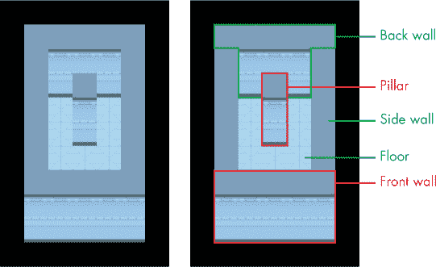
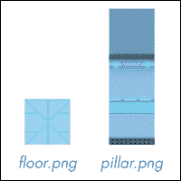
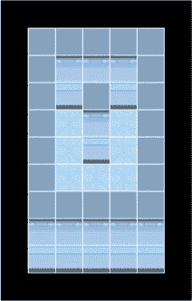
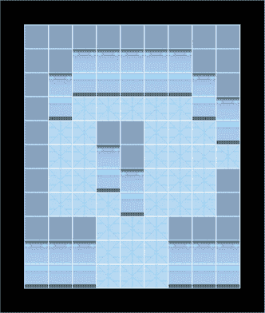
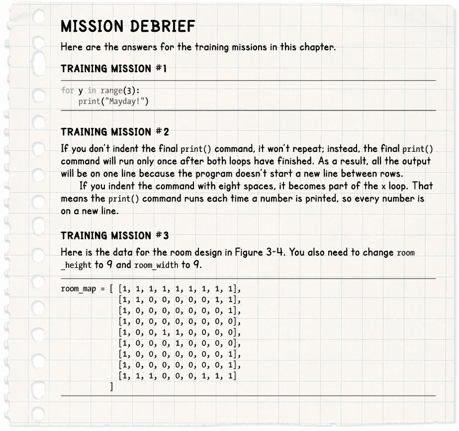

## **3

**跟我重复一遍**

每个人都在谈论太空旅行的英雄主义和光辉，但其中有些工作是日常的、重复的。当你在清洁、在太空站温室中种植植物，或锻炼保持体力时，你在遵循详尽的计划，这些计划是为了确保团队的安全和太空站的正常运作。幸运的是，机器人可以处理一些繁重的工作，而且它们从不抱怨需要重复同样的工作。

无论是编程机器人还是制作游戏，循环都是你基本的编程构件之一。*循环*是程序中的一部分，它会重复执行：有时它会重复固定的次数，有时它会持续到某个特定事件发生。有时，你甚至会设置一个循环让它永远继续下去。在本章中，你将学习如何使用循环在程序中重复执行指令的指定次数。你将使用循环，结合你对列表的知识，来显示地图并绘制 3D 房间图像。

### **使用循环显示地图**

在*Escape*游戏中，我们将广泛使用循环。通常，我们会用它们从列表中提取信息，并对其执行某些操作。

让我们首先使用循环来显示一个文本地图。

#### **创建房间地图**

在本章的示例中，我们将创建一个新地图，用 1 表示墙壁，0 表示地板空间。我们的房间四周都有墙壁，中间靠近的地方有一根柱子。柱子和墙壁一样，所以也用 1 标记。我选择了这个位置，使得我们稍后在本章中绘制 3D 房间时，它看起来会很好。这个房间没有其他物体，所以目前我们不使用其他数字。

在 IDLE 中，打开一个新的 Python 程序，输入 Listing 3-1 中的代码，并将其保存为*listing3-1.py*：

*listing3-1.py*

room_map = [ [1, 1, 1, 1, 1],

[1, 0, 0, 0, 1],

[1, 0, 1, 0, 1],

[1, 0, 0, 0, 1],

[1, 0, 0, 0, 1],

[1, 0, 0, 0, 1],

[1, 1, 1, 1, 1]

]

print(room_map)

*Listing 3-1: 添加房间地图数据*

这个程序创建了一个名为 room_map 的列表，其中包含七个其他列表。每个列表以方括号开始和结束，并且与下一个列表之间用逗号分隔。如你在第二章中学到的，最后一个列表后不需要逗号。每个列表表示地图的一行。通过点击**运行** ▸ **运行模块**来运行程序，应该能在命令行窗口看到以下内容：

[[1, 1, 1, 1, 1], [1, 0, 0, 0, 1], [1, 0, 1, 0, 1], [1, 0, 0, 0, 1], [1, 0, 0, 0, 1], [1, 0, 0,

0, 1], [1, 1, 1, 1, 1]]

如你在第二章中看到的，打印地图列表会把所有行连接在一起，这样查看地图并不直观。我们将使用循环以一种更容易阅读的方式显示地图。

#### **使用循环显示地图**

为了按行列显示地图，请删除程序中的最后一行，并添加 Listing 3-2 中显示的两行新代码。像以前一样，不要输入灰色的行—仅将它们用来帮助你找到程序中的位置。将程序保存为 *listing3-2.py*。

*listing3-2.py*

--snip--

[1, 0, 0, 0, 1],

[1, 1, 1, 1, 1]

]

➊ for y in range(7):

➋     print(room_map[y])

*Listing 3-2：使用循环显示房间地图*

**红色警报**

*记得在第一行新代码的末尾加上冒号！没有它，程序将无法正常工作。第二行新代码应该缩进四个空格，以告诉 Python 你希望重复哪些指令。如果你在 for 行的末尾添加了冒号，按下 ENTER 键进入下一行时，空格会自动为你添加。*

当你再次运行程序时，你应该会在命令行中看到以下内容：

[1, 1, 1, 1, 1]

[1, 0, 0, 0, 1]

[1, 0, 1, 0, 1]

[1, 0, 0, 0, 1]

[1, 0, 0, 0, 1]

[1, 0, 0, 0, 1]

[1, 1, 1, 1, 1]

这是一种更有用的查看地图的方式。现在你可以很容易地看到墙壁（用 1 表示）环绕在边缘。那么代码是如何工作的呢？for 命令 ➊ 是这里的核心。它是一个循环命令，告诉 Python 重复执行某段代码一定次数。Listing 3-2 告诉 Python 对我们房间地图列表中的每一项执行 print() 指令 ➋。room_map 中的每一项是一个包含地图一行数据的列表，所以分别打印它们就可以一行一行地展示我们的地图，从而实现这种有序的显示。

让我们更详细地解析一下代码。我们使用 range() 函数创建一个数字序列。通过 range(7)，我们告诉 Python 生成一个小于 7 的数字序列。为什么要排除最后一个数字呢？这就是 range() 函数的工作方式！如果我们只给 range() 函数一个数字，Python 会假设我们希望从 0 开始计数。所以 range(7) 会生成一个数字序列：0、1、2、3、4、5 和 6。

每次代码重复时，for 命令中的变量都会从序列中取出下一个项。在这个例子中，y 变量会依次取值为 0、1、2、3、4、5 和 6。这与 room_map 中的索引值完全一致。

我选择了 y 作为变量名，因为我们用它来表示我们想要显示的地图行，而地图中的行被称为 y 坐标。

print(room_map[y]) 命令 ➋ 被缩进了四个空格，这告诉 Python 这是我们希望 for 循环 ➊ 重复的代码块。

第一次循环时，y 的值为 0，所以 print(room_map[y]) 打印的是 room_map 中的第一个元素，也就是包含地图第一行数据的列表。第二次循环时，y 的值为 1，所以 print(room_map[y]) 打印的是第二行。代码会重复，直到它打印完 room_map 中的所有七个列表。

**训练任务 #1**

在空间站的紧急情况下，你可能需要发出求救信号。编写一个简单的程序，只用循环打印单词*Mayday!*三次。

如果你卡住了，从 Listing 3-2 开始，它用于打印地图。你只需要改变程序打印的内容和它循环打印代码的次数。

### **循环循环**

我们的地图输出已经在改进，但仍然有一些局限性。一个是逗号和括号让它看起来很乱。另一个局限性是我们不能对房间内的单独墙板或空间做任何操作。我们需要能够分别处理房间内每个位置的内容，以便正确显示其图像。为此，我们需要使用更多的循环。

#### **嵌套循环以获取房间坐标**

*listing3-2.py* 程序使用一个循环来提取地图的每一行。现在，我们需要使用另一个循环来检查每一行中的每个位置，以便我们可以单独访问那里存在的对象。这样做将使我们能够完全控制物品的显示方式。

你刚刚看到我们可以在循环中重复一段代码。我们还可以将一个循环放入另一个循环中，这称为*嵌套循环*。为了了解这个如何工作，我们首先使用这种技术打印房间中每个空间的坐标。编辑你的代码以匹配 Listing 3-3：

*listing3-3.py*

--省略--

[1, 0, 0, 0, 1],

[1, 1, 1, 1, 1]

]

➊ for y in range(7):

➋     for x in range(5):

➌         print("y=", y, "x=", x)

➍     print()

*Listing 3-3：打印坐标*

**红色警报**

*正如每个宇航员所知道的，太空可能是危险的，空间也一样。如果循环中的缩进错误，程序就无法正常工作。将第一个* print() *命令* ➌ *用八个空格缩进，使其成为内部* x *循环的一部分。确保最后一个* print() *指令* ➍ *与第二个* for *命令* ➋ *(缩进四个空格)对齐，这样它就留在外部循环中。当你开始一行新代码时，Python 会将其缩进与上一行相同，但当你不再需要缩进时，可以删除它。*

将程序保存为*listing3-3.py*并通过点击**运行** ▸ **运行模块**来运行程序。你将看到以下输出：

y= 0 x= 0

y= 0 x= 1

y= 0 x= 2

y= 0 x= 3

y= 0 x= 4

y= 1 x= 0

y= 1 x= 1

y= 1 x= 2

y= 1 x= 3

y= 1 x= 4

y= 2 x= 0

y= 2 x= 1

y= 2 x= 2

--省略--

输出将继续，最后结束在 y= 6 x= 4。

我们设置的 y 循环和之前一样，重复七次 ➊，每次取 0 到 6 之间的数字，将该值赋给 y 变量。这次程序中的不同之处在于：在 y 循环内部，我们启动了一个新的 for 循环，使用 x 变量并给它一个包含五个值的范围，从 0 到 4 ➋。第一次通过 y 循环时，y 为 0，此时 x 依次取 0、1、2、3、4 的值。第二次通过 y 循环时，y 为 1，我们再次启动一个新的 x 循环，x 依次取 0、1、2、3、4 的值，这时 y 为 1。这个循环会继续进行，直到 y 为 6，x 为 4。

你可以通过查看程序的输出，理解循环是如何工作的：在 x 循环内部，每次 x 循环重复时，我们都会打印出 y 和 x 的值 ➌。当 x 循环结束后，我们会打印一个空行 ➍，然后再开始 y 循环的下一次重复。我们通过让 print() 函数的括号为空来实现这一点。空行会将 y 循环的每次重复分开，输出会显示每次进入内部 x 循环时 x 和 y 的值。正如你所看到的，这个程序输出了房间中每个位置的 y 坐标和 x 坐标。

**提示**

我们在循环中使用了变量名 y 和 x，但这些变量名并不会影响程序的运行。你可以把它们叫做香肠和鸡蛋，程序照样能运行。但这样就不容易理解了。因为我们获取的是 x 和 y 坐标，所以使用 x 和 y 作为变量名是有意义的。

#### **清理地图**

我们将在循环中使用坐标来打印没有括号和逗号的地图。编辑你的程序，按照 第 3-4 号列表的示例修改内部嵌套循环：

*listing3-4.py*

--snip--

for y in range(7):

for x in range(5):

print(room_map[y][x], end="")

print()

*Listing 3-4: 整理地图显示*

将程序保存为 *listing3-4.py*，然后通过点击 **Run** ▸ **Run Module** 来运行程序。你应该会在 shell 中看到以下内容：

11111

10001

10101

10001

10001

10001

11111

这个地图看起来更加清晰，易于理解。它的工作方式与 第 3-3 号列表中的程序一样。它逐行处理每一行，通过 y 循环获取每一行，然后使用 x 循环获取这一行中的每个位置。这次，我们不是输出坐标，而是查看 room_map 中每个位置的内容，并将其打印出来。正如你在 第二章 中学到的那样，你可以通过坐标形式 room_map[y 坐标][x 坐标] 获取地图中的任何项目。

我们格式化输出的方式使得地图看起来像房间：我们把同一行的所有数字放在一起，只有在开始新的一行时（即开始新的 y 循环时）才会在屏幕上换行。

x 循环内的 print() 指令以 end="" 结束（引号之间没有空格），以防止每打印一个数字后自动换行。否则，默认情况下，print() 函数会在每个输出项后添加一个换行符。但我们告诉它在结束时什么也不加 ("")。因此，x 循环的一次完整执行（从 0 到 4）的所有项将出现在同一行上。

每打印完一行后，我们使用一个空的 print() 命令来开始新的一行。由于我们仅用四个空格缩进此命令，它属于 y 循环，而不是 x 循环中重复的代码。这意味着它只会在 y 循环每次执行时运行一次，在 x 循环打印完一行数字后。

**训练任务 #2**

最后的 print() 命令使用四个空格缩进。试试看当你将它缩进八个空格时会发生什么，再看看如果完全不缩进它会发生什么。在每种情况下，记录它运行了多少次，以及缩进如何改变输出。

### **显示 3D 房间图像**

现在你已经掌握了足够的地图知识，可以显示 3D 房间图像了。在第一章中，你学习了如何使用 Pygame Zero 将图像显示在屏幕上。让我们将这些知识与获取 room_map 数据的技能结合起来，这样我们就可以使用图像而不是 0 和 1 来显示地图。

点击 **文件** ▸ **新建文件** 开始一个新的 Python 文件，然后输入 Listing 3-5 中的代码。你可以复制你本章最新程序中的 room_map 数据。

*listing3-5.py*

room_map = [ [1, 1, 1, 1, 1],

[1, 0, 0, 0, 1],

[1, 0, 1, 0, 1],

[1, 0, 0, 0, 1],

[1, 0, 0, 0, 1],

[1, 0, 0, 0, 1],

[1, 1, 1, 1, 1]

]

➊ WIDTH = 800 # 窗口大小

➋ HEIGHT = 800

top_left_x = 100

top_left_y = 150

➌ DEMO_OBJECTS = [images.floor, images.pillar]

room_height = 7

room_width = 5

⟳ def draw():

for y in range(room_height):

for x in range(room_width):

➎             image_to_draw = DEMO_OBJECTS[room_map[y][x]]

➏             screen.blit(image_to_draw,

(top_left_x + (x*30),

top_left_y + (y*30) - image_to_draw.get_height()))

*Listing 3-5: 显示 3D 房间的代码*

将程序保存为 *listing3-5.py*。你需要将它保存在 *escape* 文件夹中，因为程序将使用该文件夹内的 *images* 文件夹中的文件。不要将文件保存在 *images* 文件夹内部：它应该与该文件夹并列保存。如果你还没有下载 *Escape* 游戏文件，请参见 第 7 页的“下载游戏文件”部分了解下载说明。

*listing3-5.py* 程序使用了 Pygame Zero，因此你需要打开命令行并输入指令 `pgzrun listing3-5.py` 来运行程序。关于如何运行使用 Pygame Zero 的程序，包括最终的 *Escape* 游戏，请参见 第 9 页的“运行游戏”部分。

*listing3-5.py* 程序使用 *Escape* 游戏的图像文件来创建一个房间的图像。图 3-1 显示了一个带有单一支柱的房间。*Escape* 游戏使用简化的 3D 透视图，我们可以看到物体的前面和顶部表面。房间前后方的物体绘制成相同的大小。

当你在第一章中创建太空行走模拟器时，你已经看到绘制物体的顺序决定了哪些物体在其他物体的前面。在 *Escape* 游戏和列表 3-5 中，物体是从房间的后方绘制到前方的，这样我们就能创建 3D 效果。靠近观察者（坐在计算机前）的物体看起来像是在房间后方物体的前面。

*图 3-1：你的第一个 3D 房间（左）以及带有标注部分的同一个房间（右）*

### **理解房间是如何绘制的**

现在让我们看看 *listing3-5.py* 程序是如何工作的。程序中的许多内容你应该在第一章和第二章中已经很熟悉了。WIDTH ➊ 和 HEIGHT ➋ 变量存储窗口的大小，我们使用 draw() 函数告诉 Pygame Zero 在屏幕上绘制什么 ➍。y 和 x 循环来自列表 3-4，为我们提供房间中每个空间的坐标。

我们不再使用 range() 函数中的数字来告诉 Python 循环重复的次数，而是使用新的变量 room_height 和 room_width。这些变量存储我们的房间地图的大小，并告诉 Python 循环需要重复多少次。例如，如果我们将 room_height 变量改为 10，y 循环将重复 10 次并处理地图的 10 行。room_width 变量控制 x 循环重复的次数，以此类推，这样我们就能显示更宽的房间。

**红色警报**

*如果你使用的房间宽度和高度大于实际的* room_map *数据，将会导致错误。*

*listing3-5.py* 程序使用了 *images* 文件夹中的两张图像：一张地板砖（文件名为 *floor.png*）和一根墙柱（名为 *pillar.png*），如图 3-2 所示。*PNG（便携式网络图形）*是一种 Pygame Zero 可以使用的图像文件类型。PNG 支持图像的某些部分透明，这对我们的 3D 游戏透视图非常重要。否则，我们无法看到植物间隙中的背景景色，例如，宇航员看起来就像是被一个方形光环围绕。

*图 3-2：用于创建第一个 3D 房间的图像*

在 draw()函数 ➍ 内，我们使用 y 和 x 循环依次查看房间地图中的每个位置。如前所述，我们可以通过访问 room_map[y][x]来找到地图上每个位置的数字。在这个地图中，数字将是 1 表示墙柱，0 表示空地板空间。我们不再像之前那样将数字直接打印到屏幕上，而是用这个数字在 DEMO_OBJECTS 列表 ➎ 中查找相应的图像。该列表包含了我们的两张图像 ➌：地板瓷砖位于索引位置 0，墙柱位于索引位置 1。如果我们正在查看的 room_map 位置包含 1，比如说，我们就从 DEMO_OBJECTS 列表中取出索引为 1 的物品，这就是墙柱的图像。我们将该图像存储在变量 image_to_draw ➎ 中。

然后，我们使用 screen.blit()将该图像绘制到屏幕上，给它提供屏幕上我们想要绘制的像素坐标 x 和 y ➏。此指令跨越了三行，以便更容易阅读。第二行和第三行的缩进量并不重要，因为这些行被包含在 screen.blit()的括号内。

### **确定绘制每个物品的位置**

要确定绘制组成房间的每个图像的位置，我们需要在 ➏ 处进行计算。我们将看到这个计算是如何进行的，但在此之前，我将解释空间站的设计。所有图像的设计都要适应一个网格。我们用来衡量计算机上图像的单位叫做*像素*，它是你在屏幕上看到的最小点的大小。我们将网格中的每个小方块称为*瓷砖*。每个瓷砖宽 30 个像素，纵向也是 30 个像素。这与一个地板瓷砖的大小相同。我们用瓷砖来定位物体，因此一把椅子可能位于 4 个瓷砖下、4 个瓷砖横向的位置，从左上角测量。

图 3-3 显示了我们刚刚创建的房间，并在其上叠加了一个网格。每个地板瓷砖和柱子宽度为一个瓷砖。柱子很高，因此覆盖了三个瓷砖的空间：墙柱的前表面高两块瓷砖，而柱子的顶部表面则覆盖了另一块瓷砖的空间。

*图 3-3：覆盖在你第一个房间上的瓷砖网格*

top_left_x 和 top_left_y 变量存储我们想要开始在窗口中绘制第一个房间图像的坐标。在本章中，我们从不改变这些变量。我选择从 x 为 100，y 为 150 的地方开始绘制，这样房间图像周围就有一点边框。

要确定在哪里绘制墙壁或地板，我们需要将地图上的位置（例如，x 方向的范围为 0 到 4）转换为窗口中的像素位置。

每个格子的大小为 30 像素，所以我们将 x 循环次数乘以 30，并将结果加到 top_left_x 位置上，得到图像的 x 坐标。在 Python 中，*符号表示乘法。top_left_x 的值是 100，因此第一个图像绘制在 100 + (0 * 30)，即 100 的位置。第二个图像绘制在 100 + (1 * 30)，即 130 的位置，它比第一个图像向右移动了一格。第三个图像绘制在 100 + (2 * 30)，即 160 的位置。这些位置确保了图像并排显示。

*y*位置的计算方式类似。我们使用 top_left_y 作为起始垂直位置，并将 y * 30 加到该位置，以确保图像精确地连接在一起。不同之处在于，我们需要减去我们正在绘制的图像的高度，这样可以确保图像底部对齐。因此，高大的物体可以从格子空间中升起，遮挡住它们后面的景物或地板瓦片，营造出立体的效果。如果我们没有让图像在底部对齐，它们会在顶部对齐，这样就会破坏 3D 效果。例如，第二排和第三排的地板砖将覆盖住背墙的前表面。

**训练任务 #3**

现在你已经知道如何显示一个 3D 房间了，试着调整地图，改变房间的布局，添加新的柱子或地板空间。你可以编辑 room_map 数据，向地图中添加新的一行或一列。记得也要修改 room_height 和 room_width 变量。

也许可以尝试制作一个更多行的房间，并通过将用于柱子的 1 替换为 0，添加一个门口。在最终的*Escape*游戏中，每个门口将占三个格子。为了获得最佳效果，请设计宽度和高度为奇数的房间，这样你可以将门居中在墙上。

图 3-4 展示了我设计的一个房间，宽度和高度为 9。如果你愿意，可以尝试复制我的设计。我添加了一个网格，以便更容易计算 room_map 列表中的数据。墙柱从地面上升了两格，所以显示的网格高度为 11 格。计算柱子位置时，请看柱子的底部，而不是顶部。有关如何制作此房间的代码，请参见本章末尾。

*图 3-4：一种可能的新房间设计*

在真实的*Escape*游戏中，高大的墙柱仅会用于房间的边缘。如果它们位于房间中央，尤其是当它们接触到后墙时，它们看起来可能有点奇怪。当我们在本书的后面为游戏添加阴影时，房间中央的物体看起来就不会像漂浮在空间中，这也是这种模拟 3D 透视方式的一大风险。

### **你适合飞行吗？**

请勾选以下框，确认你已经学会了本章的关键内容。

  for 循环会重复执行一段代码一定次数。

  range()函数创建一个数字序列。

  你可以使用 range() 来告诉 for 循环要重复多少次。

  for 语句末尾的冒号是必需的。

  为了告诉 Python 循环中哪些行需要重复，请使用四个空格来缩进这些行。

  一个循环嵌套在另一个循环中，这种情况叫做*嵌套循环*。

  图片被对齐到底部，以便创造一个 3D 视觉效果，使高物体从地面上升起。

  room_height 和 room_width 变量存储了 *Escape* 中房间的大小，并用于设置显示房间的循环。

