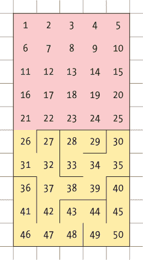
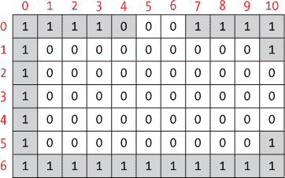
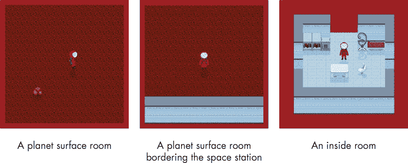
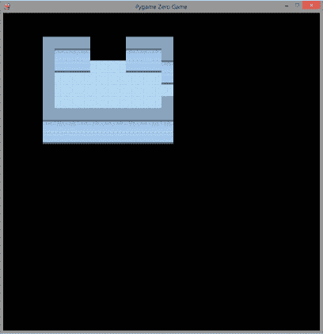
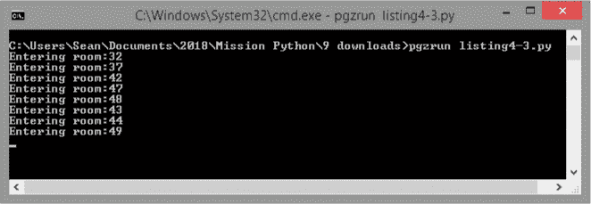
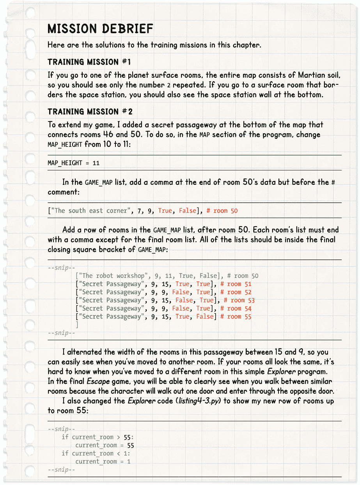

## **4

创建空间站**

在本章中，你将构建火星上的空间站地图。使用本章中你将添加的简单*Explorer*代码，你将能够查看每个房间的墙壁，并开始找到方向。我们将使用列表、循环和你在第一章、第二章和第三章中学到的技术来创建地图数据并以 3D 显示房间。

### **自动化地图制作过程**

我们当前的 room_map 数据的问题在于它太庞大了。*Escape*游戏包括 50 个位置。如果你必须为每个位置输入 room_map 数据，那将是极其低效并且费时的。例如，如果每个房间由 9 × 9 的瓷砖组成，那么每个房间将有 81 个数据项，总共会有 4,050 个数据项。仅房间数据就会占据本书的 10 页。

其中大部分数据是重复的：0 表示地板和出口，1 表示墙壁边缘。从第三章你已经知道我们可以使用循环来高效地管理重复数据。我们可以利用这个知识制作一个程序，当我们提供某些信息（如房间大小和出口位置）时，它将自动生成 room_map 数据。

### **自动地图生成器的工作原理**

*Escape*程序的工作方式是这样的：当玩家访问一个房间时，我们的代码将获取该房间的数据（其大小和出口位置），并将其转换为 room_map 数据。room_map 数据将包括表示地板、边缘墙壁和出口位置的列和行。最终，我们将使用 room_map 数据来绘制房间，确保地板和墙壁的位置正确。

图 4-1 展示了空间站的地图。我将每个位置称为房间，尽管 1 到 25 号是空间站区域内的地面部分，类似于一个花园。26 到 50 号是空间站内的房间。

室内布局是一个简单的迷宫，有许多走廊、死胡同和房间可供探索。当你制作自己的地图时，尽量创造曲折的小路和角落供玩家探索，即使地图不大。一定要通过在每个走廊的尽头放置一个有用或吸引人的物品来奖励玩家的探索。玩家在探索游戏世界时通常更喜欢从左向右行进，所以玩家的角色将在地图的左侧 31 号房间开始。

在外面，玩家可以随意走动，但篱笆会阻止他们离开车站区域（或偏离游戏地图）。由于空间站内部的封闭氛围，玩家在外面会体验到一种自由感，拥有可以漫游的空间。

*图 4-1：空间站地图*

当你玩最终版的*逃脱*游戏时，你可以参考这张地图，但你可能会觉得没有地图或者自己制作地图更有趣。该地图没有显示门的位置，在最终游戏中，这将防止玩家在找到正确的钥匙卡之前访问地图的某些部分。

### **创建地图数据**

让我们创建地图数据。我们空间站的房间将全部连接起来，因此我们只需要存储从一侧墙壁到出口的位置。例如，房间 31 右侧的出口和房间 32 左侧的出口是连接两间房间的相同门口。我们不需要为两间房间都指定该出口。对于地图中的每个房间，我们将存储是否在顶部或右侧有出口。程序可以自行判断是否在底部或左侧有出口（我稍后会解释）。这种方法还确保地图的一致性，且不会出现走过出口后出口消失的情况。如果你能通过一个出口进入，你总是能从另一个方向返回。

地图中的每个房间需要以下数据：

+   房间的简短描述。

+   瓷砖高度，这是房间从屏幕上到下的大小。（这与从地板到天花板的距离无关。）

+   瓷砖宽度，这是房间从屏幕左侧到右侧的大小。

+   是否在顶部有出口（真或假）。

+   是否在右侧有出口（真或假）。

**提示**

真和假被称为*布尔值*。在 Python 中，这些值必须以大写字母开头，而且不需要加引号，因为它们不是字符串。

我们将用来衡量房间大小的单位称为*瓷砖*，因为它的大小与地砖相同。正如你在第三章中学到的，瓷砖将作为我们所有物体的基本测量单位。例如，房间中的单个物体，如椅子或柜子，通常是一个瓷砖的大小。在第三章（参见图 3-1 和清单 3-5），我们制作了一个房间地图，地图有七行，每行五个列表项，因此该房间的高度为七个瓷砖，宽度为五个瓷砖。

拥有不同大小的房间可以为地图增添多样性：有些房间可以像走廊一样狭窄，有些房间则可以像社区房间一样宽敞。为了适应我们的游戏窗口，房间的最大大小为 15 个瓷砖高，25 个瓷砖宽。不过，较大的房间或包含许多物品的房间在旧电脑上可能会运行较慢。

这是房间 26 的数据示例：它是一个狭窄的房间，13 个瓷砖高，5 个瓷砖宽，顶部有出口，但右侧没有出口（参见图 4-1 中的地图）。

["气闸", 13, 5, 真, 假]

我们为房间命名（或描述），分别给出高度和宽度的数字，以及顶部和右侧是否有出口的 True 和 False 值。在这个游戏中，每面墙只能有一个出口，且出口会自动定位在墙的中间。

当程序为隔壁的房间 27 生成 room_map 数据时，它将检查房间 26 是否在右侧有出口。因为房间 26 没有右侧出口，程序将知道房间 27 没有左侧出口。

我们将为每个房间的数据显示创建一个名为 GAME_MAP 的列表。

### **编写 GAME_MAP 代码**

点击 **文件** ▸ **新建文件** 来在 Python 中创建新文件。输入来自示例 4-1 的代码来开始构建太空站。将你的文件保存为 *listing4-1.py*。

**提示**

当你编写一个长程序时，记得定期保存工作。就像许多应用程序一样，你可以在 IDLE 中按 CTRL-S 来保存。

*listing4-1.py*

# Escape - 一款 Python 冒险游戏

# 由 Sean McManus / www.sean.co.uk 编写

# 由 PUT YOUR NAME HERE 输入

import time, random, math

###############

## 变量 ##

###############

WIDTH = 800 # 窗口大小

HEIGHT = 800

#PLAYER 变量

➊ PLAYER_NAME = "Sean" # 改成你的名字！

FRIEND1_NAME = "Karen" # 改成朋友的名字！

FRIEND2_NAME = "Leo" # 改成另一个朋友的名字！

current_room = 31 # 起始房间 = 31

➋ top_left_x = 100

top_left_y = 150

➌ DEMO_OBJECTS = [images.floor, images.pillar, images.soil]

###############

##    地图    ##

###############

➍ MAP_WIDTH = 5

MAP_HEIGHT = 10

MAP_SIZE = MAP_WIDTH * MAP_HEIGHT

➎ GAME_MAP = [ ["房间 0 - 存放未使用物品的地方", 0, 0, False, False] ]

outdoor_rooms = range(1, 26)

➏ for planetsectors in range(1, 26): # 这里生成房间 1 到 25

GAME_MAP.append( ["尘土飞扬的星球表面", 13, 13, True, True] )

➐ GAME_MAP += [

#["房间名称", 高度, 宽度, 顶部出口?, 右侧出口?]

["气闸", 13, 5, True, False], # 房间 26

["工程实验室", 13, 13, False, False], # 房间 27

["贵宾任务控制室", 9, 13, False, True], # 房间 28

["观景厅", 9, 15, False, False], # 房间 29

["船员浴室", 5, 5, False, False], # 房间 30

["气闸入口舱", 7, 11, True, True], # 房间 31

["左肘房", 9, 7, True, False], # 房间 32

["右肘房", 7, 13, True, True], # 房间 33

["科学实验室", 13, 13, False, True], # 房间 34

["温室", 13, 13, True, False], # 房间 35

[PLAYER_NAME + "的卧室", 9, 11, False, False], # 房间 36

["西走廊", 15, 5, True, True], # 房间 37

["简报室", 7, 13, False, True], # 房间 38

["船员公共休息室", 11, 13, True, False], # 房间 39

["主任务控制室", 14, 14, False, False], # 房间 40

["医务舱", 12, 7, True, False], # 房间 41

["西走廊", 9, 7, True, False], # 房间 42

["公用控制室", 9, 9, False, True], # 房间 43

["系统工程舱", 9, 11, False, False], # 房间 44

["“安全入口通道到任务控制中心”", 7, 7, True, False], # 房间 45

➑          [FRIEND1_NAME + "的休息区", 9, 11, True, True], # 房间 46

[FRIEND2_NAME + "的休息区", 9, 11, True, True], # 房间 47

["“管道工作区”", 13, 11, True, False], # 房间 48

["“首席科学家办公室”", 9, 7, True, True], # 房间 49

["“机器人车间”", 9, 11, True, False] # 房间 50

]

# 对上面的地图进行简单的检查，确保数据输入正确

➒ assert len(GAME_MAP)-1 == MAP_SIZE, "地图大小与 GAME_MAP 不匹配"

*清单 4-1：* GAME_MAP *数据*

让我们仔细看看这段设置房间地图数据的代码。请记住，在构建 *Escape* 游戏时，我们将不断地添加新的内容。为了帮助你更好地浏览程序，我会用类似这样的标题标记不同的部分：

###############

## 变量 ##

###############

# 符号标记为注释，告诉 Python 忽略它后面的内容，因此无论是否有这些注释，游戏都能正常运行。这些注释将帮助你在浏览代码时了解自己所在的位置，并知道何时需要添加新的指令，尤其是当程序变得越来越大时。我使用注释符号画了框，以便在浏览程序代码时，标题能够突出显示。

三名宇航员驻扎在空间站，你可以在代码中个性化他们的名字 ➊。将 PLAYER_NAME 改成你自己的名字，并为 FRIEND1_NAME 和 FRIEND2_NAME 变量添加两个朋友的名字。在整个代码中，每当需要使用你朋友的名字时，我们都会用到这些变量：例如，每个宇航员都有自己的休息区。我们现在需要设置这些变量，因为稍后我们将在程序中使用它们来设置一些房间描述。你会带谁一起去火星？

程序还设置了一些我们将在本章结束时需要的变量来绘制房间：top_left_x 和 top_left_y 变量 ➋ 指定从哪里开始绘制房间；DEMO_OBJECTS 列表包含要使用的图像 ➌。

首先，我们设置变量来包含地图的高度、宽度和整体大小（以瓦片为单位） ➍。我们创建 GAME_MAP 列表 ➎ 并为房间 0 提供数据：这个房间用于存储游戏中尚未出现的物品，因为玩家还没有发现或创建它们。这不是玩家可以访问的真实房间。

然后，我们使用一个循环 ➏ 为构成复合体地面的 25 个行星表面房间添加相同的数据。range(1, 26) 函数被用来重复 25 次。第一个数字是我们想要开始的数字，第二个数字是我们想要结束的数字加一（range() 不包括你给它的最后一个数字，记住这一点）。每次通过循环，程序都会将相同的数据添加到 GAME_MAP 的末尾，因为所有的行星表面“房间”大小相同并且有四个方向的出口。每个表面房间的数据看起来是这样的：

["“尘土飞扬的行星表面”", 13, 13, True, True]

当这个循环完成后，GAME_MAP 将包括房间 0，并且房间 1 到 25 会有相同的“尘土飞扬的星球表面”数据。我们还设置了 outdoor_rooms 范围来存储房间 1 到 25 的房间号。当我们需要检查某个房间是否位于空间站内外时，会使用这个范围。

最后，我们将房间 26 到 50 添加到 GAME_MAP ➐中。我们通过使用+=操作符将一个新列表添加到 GAME_MAP 的末尾。这个新列表包含了剩余房间的数据。每个房间的数据都不同，因此我们需要分别输入它们的数据。你之前已经看到了房间 26 的信息：数据包括房间名称、房间的高度和宽度，以及它是否在顶部和右侧有出口。每一项房间数据都是一个列表，因此它的开始和结束都有方括号。在每一项房间数据的末尾（除了最后一项），我们必须使用逗号将其与下一项分隔开。我还在每行的末尾加了房间编号的注释，以帮助跟踪房间号。这些注释在开发游戏时会非常有用。像这样注释代码是一个好习惯，这样你在回头查看时能够理解代码。

房间 46 和 47 会将变量 FRIEND1_NAME 和 FRIEND2_NAME 添加到房间描述中，因此你会有两个房间的名称类似于“凯伦的睡房”，使用你朋友的名字 ➑。除了使用+符号来添加数字和合并列表外，你还可以使用它来合并字符串。

在*listing4-1.py*的末尾，我们通过使用 assert()进行一个简单的检查，确保地图数据是合理的 ➒。我们检查 GAME_MAP 的长度（地图数据中的房间数量）是否与地图的大小相同，地图的大小是通过➍处计算的，方法是将宽度和高度相乘。如果不相同，意味着我们丢失了一些数据或者数据过多。

我们必须从 GAME_MAP 的长度中减去 1，因为它也包含了房间 0，而我们在计算地图大小时没有包括房间 0。这个检查不会捕获所有的错误，但它可以告诉你在输入地图数据时是否遗漏了某一行。尽可能的，我会尝试添加像这样的简单测试，帮助你在输入程序代码时检查是否有错误。

### **测试与调试代码**

通过点击**运行** ▸ **运行模块**，或按 F5（快捷键）来运行*listing4-1.py*。应该不会发生什么特别的事情。命令行窗口应该只会显示一条消息，上面写着"RESTART:"以及你的文件名。原因是我们要求程序做的只是设置一些变量和列表，因此没有什么可见的内容。但是如果你在输入代码时犯了错误，你可能会在命令行窗口看到一个红色的错误信息。如果你确实看到错误，请仔细检查以下细节：

+   引号是否放置在正确的位置？在 Python 程序窗口中，字符串显示为绿色，所以你可以注意到大块的绿色区域，提示你可能没有关闭字符串。如果房间描述是黑色的，说明你没有打开字符串。这两种情况都表示缺少引号。

+   你是否在正确的位置使用了正确的括号和圆括号？在这个列表中，方括号用于包围列表项，圆括号（即弯括号）用于函数，比如 range()和 append()。大括号{…}根本没有用到。

+   你是否漏掉了任何括号或圆括号？一个简单的检查方法是数一下开括号和闭括号、开圆括号和闭圆括号的数量。每个开括号或圆括号都应该有一个形状相同的闭括号或圆括号。

+   你必须按照打开括号和圆括号的顺序反向关闭它们。如果先打开一个圆括号，再打开一个方括号，你必须先用闭方括号关闭它们，然后再用闭圆括号关闭。正确的格式是：（[ … ]）。错误的格式是：（[ … ) ]。

+   你的逗号放置正确吗？请记住，GAME_MAP 中的每个房间列表后面都必须有一个逗号，用来将其与下一个房间的数据分开（除了最后一个房间）。

**提示**

为什么不邀请一个朋友帮忙一起开发游戏呢？程序员经常成对工作，互相帮助出主意，也许最重要的是，能有两双眼睛检查所有内容。你们也可以轮流输入代码！

### **根据数据生成房间**

现在，空间站地图存储在我们的 GAME_MAP 列表中。下一步是添加一个功能，从 GAME_MAP 中获取当前房间的数据，并将其扩展到*Escape*游戏中使用的 room_map 列表，以查看房间内每个位置的内容。room_map 列表始终存储玩家当前所在房间的信息。当玩家进入不同的房间时，我们将用新房间的地图替换 room_map 中的数据。在本书后面，我们还会向 room_map 中添加场景和道具，供玩家互动。

room_map 数据是通过我们将要创建的函数 generate_map()生成的，如 Listing 4-2 所示。

将 Listing 4-2 中的代码添加到 Listing 4-1 的末尾。灰色的代码显示了 Listing 4-1 的结束位置。确保所有的缩进都是正确的。缩进决定了代码是属于 get_floor_type()还是 generate_map()函数，某些代码进一步缩进是为了告诉 Python 它属于哪个 if 或 for 语句。

将程序保存为*listing4-2.py*，然后点击**Run** ▸ **Run Module**来运行它，并检查是否有任何错误信息出现在终端。

**红色警报**

*不要用 Listing 4-2 中的代码开始新的程序：确保你将 Listing 4-2 添加到 Listing 4-1 的末尾。随着你在本书中学习，你将不断扩展现有的程序来构建*Escape*游戏。*

*listing4-2.py*

--snip--

# 对上述地图进行简单的合理性检查，检查数据录入

assert len(GAME_MAP)-1 == MAP_SIZE, "地图大小和 GAME_MAP 不匹配"

###############

## 创建地图  ##

###############

➊ def get_floor_type():

if current_room in outdoor_rooms:

return 2 # 土壤

else:

return 0 # 瓦片地板

def generate_map():

# 这个函数为当前房间创建地图，

# 使用房间数据、场景数据和道具数据。

global room_map, room_width, room_height, room_name, hazard_map

global top_left_x, top_left_y, wall_transparency_frame

➋     room_data = GAME_MAP[current_room]

room_name = room_data[0]

room_height = room_data[1]

room_width = room_data[2]

➌     floor_type = get_floor_type()

if current_room in range(1, 21):

bottom_edge = 2 #土壤

side_edge = 2 #土壤

if current_room in range(21, 26):

bottom_edge = 1 #墙

side_edge = 2 #土壤

if current_room > 25:

bottom_edge = 1 #墙

side_edge = 1 #墙

# 创建房间地图的顶部线。

➍     room_map=[[side_edge] * room_width]

# 添加房间地图的中间线（墙、地板填充宽度、墙）。

➎     for y in range(room_height - 2):

room_map.append([side_edge]

+ [floor_type]*(room_width - 2) + [side_edge])

# 添加房间地图的底部线。

➏     room_map.append([bottom_edge] * room_width)

# 添加门口。

➐     middle_row = int(room_height / 2)

middle_column = int(room_width / 2)

➑     if room_data[4]: # 如果此房间的右侧有出口

room_map[middle_row][room_width - 1] = floor_type

room_map[middle_row+1][room_width - 1] = floor_type

room_map[middle_row-1][room_width - 1] = floor_type

➒     if current_room % MAP_WIDTH != 1: # 如果房间不在地图的左边

room_to_left = GAME_MAP[current_room - 1]

# 如果左侧的房间有右侧出口，则在此房间添加左侧出口

if room_to_left[4]:

room_map[middle_row][0] = floor_type

room_map[middle_row + 1][0] = floor_type

room_map[middle_row - 1][0] = floor_type

➓     if room_data[3]: # 如果此房间的顶部有出口

room_map[0][middle_column] = floor_type

room_map[0][middle_column + 1] = floor_type

room_map[0][middle_column - 1] = floor_type

if current_room <= MAP_SIZE - MAP_WIDTH: # 如果房间不在底部行

room_below = GAME_MAP[current_room+MAP_WIDTH]

# 如果下方的房间有顶部出口，则在此房间的底部添加出口

if room_below[3]:

room_map[room_height-1][middle_column] = floor_type

room_map[room_height-1][middle_column + 1] = floor_type

room_map[room_height-1][middle_column - 1] = floor_type

*Listing 4-2: 生成*room_map*数据*

你可以构建*Escape*游戏，甚至在不了解 room_map 代码如何工作的情况下制作你自己的游戏地图。但如果你感到好奇，继续阅读，我会带你一步步了解。

#### **房间生成代码的工作原理**

让我们先回顾一下 generate_map()函数的目标。根据房间的高度和宽度，以及出口的位置，我们希望它生成一个房间地图，可能看起来像这样：

[

[1, 1, 1, 1, 0, 0, 0, 1, 1, 1, 1],

[1, 0, 0, 0, 0, 0, 0, 0, 0, 0, 1],

[1, 0, 0, 0, 0, 0, 0, 0, 0, 0, 0],

[1, 0, 0, 0, 0, 0, 0, 0, 0, 0, 0],

[1, 0, 0, 0, 0, 0, 0, 0, 0, 0, 0],

[1, 0, 0, 0, 0, 0, 0, 0, 0, 0, 1],

[1, 1, 1, 1, 1, 1, 1, 1, 1, 1, 1]

]

这是地图上的 31 号房间，玩家开始游戏的房间。它的高度是 7 个瓷砖，宽度是 11 个瓷砖，顶部和右侧都有出口。地板区域（以及墙壁中的出口）用 0 表示。房间周围的墙壁用 1 表示。图 4-2 显示了同一个房间的网格布局，索引号显示在顶部和左侧的列表中。

*图 4-2：表示 31 号房间的网格；1 表示墙壁柱子，0 表示空地。*

玩家当前所在房间的编号存储在 current_room 变量中，你在程序的 VARIABLES 部分设置了这个变量（见清单 4-1）。generate_map()函数首先从 GAME_MAP ➋中收集当前房间的数据，并将其存储到一个名为 room_data 的列表中。

如果你回忆一下我们设置 GAME_MAP 时的情况，room_data 列表中的信息现在会类似于这样：

["气闸", 13, 5, True, False]

这种列表格式使我们能够通过获取索引为 0 的第一个元素来设置 room_name。我们可以通过获取下一个元素来找到房间的高度（索引 1）和宽度（索引 2）。generate_map()函数将高度和宽度信息存储在 room_height 和 room_width 变量中。

#### **创建基本房间形状**

下一步是设置我们将用于建造房间的材料，并使用这些材料创建基本的房间形状。我们稍后会添加出口。我们将为每个房间使用三个元素：

+   *地板类型*，它存储在变量 floor_type 中。在空间站内部，我们使用地板砖（在 room_map 中表示为 0），而在外部我们使用土壤（在 room_map 中表示为 2）。

+   *边缘类型*，出现在房间边缘的每个空间中。对于内部房间，这是一个墙壁柱子，表示为 1。对于外部房间，这是土壤。

+   *底边类型*，它是空间站内部的墙壁，外部通常是土壤。外部复合区域的底部行，在与空间站交接的地方，是一个特殊的情况，因为这里可以看到空间站的墙壁，因此 bottom_edge 类型是墙壁柱子（见图 4-3）。

    

    *图 4-3：根据房间在空间站中的位置，房间的边缘和底部边缘使用不同的材料。（请注意，宇航员和额外的景观还不会出现在你的游戏中。）*

我们使用一个名为 get_floor_type() ➊ 的函数来查找该房间的正确地面类型。函数可以通过 return 指令将信息传回程序的其他部分，如你在这个函数中看到的那样。get_floor_type() 函数会检查当前房间值是否在户外房间范围内。如果是，该函数返回数字 2，表示火星土壤。否则，返回数字 0，表示瓷砖地面。这个检查被放在一个单独的函数中，以便程序的其他部分也可以使用它。generate_map() 函数将 get_floor_type() 返回的数字放入 floor_type 变量中。使用一条指令 ➌，generate_map() 将 floor_type 变量设置为 get_floor_type() 返回的内容，并且告诉 get_floor_type() 函数现在开始运行。

generate_map() 函数还为底部边缘和侧边缘设置了变量。这些变量存储将用于构建房间边缘的材料类型，如图 4-3 所示。侧边缘材料用于顶部、左侧和右侧，底部边缘材料用于底部边缘。如果房间编号在 1 到 20 之间（含 20），则是普通的行星表面房间，底部和边缘为土壤。在这种情况下，房间编号在 21 到 25 之间时，则是一个与太空站底部接触的行星表面房间。这是一个特殊情况：侧边缘材料为土壤，但底部边缘是由墙柱构成。如果房间编号高于 25，则侧边缘和底边缘由墙柱构成，因为它是一个室内房间。（你可以在图 4-1 中查看这些房间编号是否合理。）

我们通过创建顶部行来开始制作 room_map 列表，这将是外面的土壤行或里面的后墙行。顶部行由相同的材料组成，因此我们可以使用快捷方式。你可以在终端中尝试这个：

>>> print([1] * 10)

[1, 1, 1, 1, 1, 1, 1, 1, 1, 1]

print() 指令中的[1]是一个仅包含一个项目的列表。当我们将其乘以 10 时，得到一个包含该项目 10 次的列表。在我们的程序中，我们将正在使用的边缘类型乘以房间的宽度 ➍。如果顶部边缘中有出口，我们会稍后添加它。

房间的中间行通过一个循环 ➎ 来制作，该循环依次将每一行添加到 room_map 的末尾。房间中的所有中间行都是相同的，并且由以下内容组成：

1.  房间左侧的边缘瓷砖（墙壁或土壤）。

1.  房间中间的地面。我们可以在这里再次使用我们的快捷方式。我们将**地面类型**乘以房间中间空间的大小。即房间宽度减去 2，因为两侧有边缘空间。

1.  右侧的边缘部分。

底部边缘然后加上 ➏，并以与顶部边缘相同的方式生成。

#### **添加出口**

接下来，我们在需要的地方添加墙壁的出口。我们将出口放在墙壁的中间，所以我们先计算出中间的行和列 ➐，通过将房间的高度和宽度分别除以 2。 有时候这个计算结果会是一个带小数的数字。我们需要一个整数来作为索引位置，所以我们使用 int() 函数去掉小数部分 ➐。int() 函数将一个带小数的数字转换成整数（一个 *整数*）。

我们首先检查右侧出口 ➑。记住，room_data 包含了这个房间的信息，这些信息最初来自 GAME_MAP。值 room_data[4] 告诉我们这个房间右侧是否有出口。这条指令：

如果 room_data[4]：

是这条指令的简写：

如果 room_data[4] == True：

我们使用 == 来检查两个事物是否相同。布尔值通常是处理数据的好选择，因为它们使代码更容易阅读和编写，就像这个例子所展示的那样。

当有右侧出口时，我们将右墙中间的三个位置从边缘类型改为地板类型，形成墙壁的一个空隙。值 room_width-1 找到右边缘的 *x* 位置：我们减去 1 是因为索引从 0 开始。在 图 4-2 中，你可以看到房间宽度是 11 个瓦片，但右墙的索引位置是 10。例如，在行星表面，这段代码不会改变任何东西，因为那里没有墙来留下空隙。但让程序添加地板瓦片会更简单，这样我们就不必为特殊情况编写代码。

在检查是否需要左侧墙壁的出口之前，我们先确保房间不在地图的左边缘，因为那里无法设置出口 ➒。% 运算符用于求余，给我们提供了一个数除以另一个数后的余数。如果我们使用 % 运算符将当前的房间编号除以地图宽度 5，得到的余数是 1 时，说明房间在左边缘。左边缘的房间编号是 1、6、11、16、21、26、31、36、41 和 46。所以只有在余数不是 1 时，我们才继续检查左出口（!= 表示“不等于”）。

要查看这个房间是否需要左侧出口，我们通过从当前房间编号减去 1 来计算出墙壁另一侧的房间。然后我们检查那个房间是否有右侧出口。如果有，我们当前的房间就需要左出口，我们就添加它。

顶部和底部的出口以类似的方式添加 ➓。我们直接检查 room_data 来查看房间顶部是否有出口，如果有，我们就在墙壁上添加一个空隙。我们还可以检查下面的房间，以判断是否需要在该房间添加底部出口。

#### **测试程序**

当你运行程序时，你可以确认在 Python shell 中没有看到任何错误。你也可以通过生成地图并从 shell 打印出来来检查程序是否正常工作，像这样：

>>> generate_map()

>>> print(room_map)

[[1, 1, 1, 1, 0, 0, 0, 1, 1, 1, 1], [1, 0, 0, 0, 0, 0, 0, 0, 0, 0, 1], [1, 0, 0, 0, 0, 0, 0, 0, 0, 0, 0], [1, 0,

0, 0, 0, 0, 0, 0, 0, 0, 0], [1, 0, 0, 0, 0, 0, 0, 0, 0, 0, 0], [1, 0, 0, 0, 0, 0, 0, 0, 0, 0, 1], [1, 1, 1, 1, 1, 1, 1, 1,

1, 1, 1]]

current_room 变量默认设置为房间 31，即游戏中的起始房间，因此打印出的就是该房间的 room_map 数据。通过我们的 GAME_MAP 数据（以及图 4-2），我们可以看到这个房间有 7 行 11 列，而我们的输出也确认了这一点：我们有 7 个列表，每个列表包含 11 个数字：完美。此外，我们还可以看到第一行有四个墙柱，三个空格，然后又是四个墙柱，所以函数在此处放置了一个出口，正如我们预期的那样。三列列表的最后一个数字也是 0，表示右侧有一个出口。看起来程序运行正常！

**训练任务#1**

你可以通过命令行更改 current_room 的值，以打印不同的房间。尝试输入不同的房间值，重新生成地图并打印出来。将输出与地图以及 GAME_MAP 代码进行对比，确保结果与预期一致。以下是一个示例：

>>> current_room = 45

>>> generate_map()

>>> print(room_map)

[[1, 1, 0, 0, 0, 1, 1], [1, 0, 0, 0, 0, 0, 1], [1, 0, 0, 0, 0, 0, 1],

[1, 0, 0, 0, 0, 0, 1], [1, 0, 0, 0, 0, 0, 1], [1, 0, 0, 0, 0, 0, 1],

[1, 1, 0, 0, 0, 1, 1]]

当你输入一个行星表面房间的值时，会发生什么情况？

### **探索太空站的 3D 视图**

让我们把房间地图变成房间！我们将把我们在第三章中创建的将房间地图转化为 3D 房间的代码与提取游戏地图中房间地图的代码结合起来。这样我们就可以开始在太空站上进行巡游，并开始熟悉环境。

我们程序中的*Explorer*功能将允许我们查看太空站的所有房间。我们将在程序中为其创建一个 EXPLORER 部分。这是一个临时措施，用于快速查看结果。我们将在第七章和第八章中用更好的代码替换*Explorer*来查看房间。

将代码清单 4-3 的代码添加到你的程序中，放在代码清单 4-2 的末尾，在灰色区域显示的指令之后。然后将程序保存为*listing4-3.py*。记得将其保存在本书的其他程序所在的*escape*文件夹中，这样*images*文件夹就会在正确的位置（参见“下载游戏文件”在第 7 页）。

*listing4-3.py*

room_map[room_height-1][middle_column] = floor_type

room_map[room_height-1][middle_column + 1] = floor_type

room_map[room_height-1][middle_column - 1] = floor_type

###############

## EXPLORER  ##

###############

def draw():

global room_height, room_width, room_map

➊     generate_map()

screen.clear()

➋     for y in range(room_height):

for x in range(room_width):

image_to_draw = DEMO_OBJECTS[room_map[y][x]]

screen.blit(image_to_draw,

(top_left_x + (x*30),  

top_left_y + (y*30) - image_to_draw.get_height()))  

➌ def movement():  

global current_room  

old_room = current_room  

if keyboard.left:  

current_room -= 1  

if keyboard.right:  

current_room += 1  

if keyboard.up:  

current_room -= MAP_WIDTH  

if keyboard.down:  

current_room += MAP_WIDTH  

➍     if current_room > 50:  

➎         current_room = 50  

if current_room < 1:  

current_room = 1

➏     if current_room != old_room:  

➐         print("Entering room:" + str(current_room))  

➑ clock.schedule_interval(movement, 0.1)  

*清单 4-3：* Explorer *代码*  

清单 4-3 中的新添加内容你应该感到熟悉。我们调用 generate_map() 函数来为当前房间 ➊ 创建 room_map 数据。然后，我们使用在 清单 3-5 中创建的代码在 第三章 中显示它 ➋。我们使用键盘控制来改变 current_room 变量 ➌，这与我们在 第一章 中改变太空行走宇航员的 *x* 和 *y* 位置的方式类似（见 清单 1-4）。要在地图中上下移动一行，我们通过改变游戏地图的宽度来改变 current_room 的数字。例如，要从房间 32 向上移一行，我们减去 5 进入房间 27（见 图 4-1）。如果房间号发生变化，程序将打印 current_room 变量 ➏。str() 函数将房间号转换为字符串 ➐，这样它就可以与 "进入房间：" 字符串连接。没有使用 str() 函数，你无法将数字与字符串连接。  

最后，我们安排在定期间隔运行 movement 函数 ➑，就像我们在 第一章 中做的那样。这次，我们在每次函数运行之间有一个更长的间隔（0.1 秒），因此按键响应较慢。  

从命令行中，导航到你的 *escape* 文件夹，并使用命令行中的 pgzrun listing4-3.py 来运行程序。  

屏幕应类似于 图 4-4，显示房间 31 的墙壁和门口。  

  

*图 4-4：* Explorer *以 3D 显示你的起始房间*  

现在你可以使用箭头键来探索地图。程序将为你绘制一个房间，并允许你通过按箭头键进入邻近的房间。此时，你只看到房间的外壳：墙壁和地板。稍后我们会在房间里添加更多的物体和角色。  

目前，你可以朝任何方向走，包括穿过墙壁：程序不会检查任何移动错误。如果你从地图的左边走出去，你会在右边重新出现，且高出一行。如果你从右边走出去，你会在左边重新出现，且低出一行。如果你尝试走出地图的顶部或底部，程序会将你返回到房间 1（顶部）或房间 50（底部）。例如，如果房间号超过（>）50 ➍，它会被重置为 50 ➎。在这段代码中，我降低了键盘的灵敏度，以减少房间穿越过快的风险。如果你发现控制不响应或有些迟钝，可能需要稍微长按一下按键。

探索空间站，并将你屏幕上看到的与图 4-1 中的地图进行对比。如果看到任何错误，回到 GAME_MAP 数据检查数据，然后再检查 generate_map()函数，确保它已正确输入。为了帮助你跟随地图，当你进入新房间时，房间号会显示在你输入 pgzrun 命令的命令行窗口中，如图 4-5 所示。

*图 4-5：命令行窗口会告诉你你正在进入哪个房间。*

另外，检查两侧是否都有出口：如果你走过一扇门，而从另一边看时它不在那里，那么 generate_map()函数就输入错误了。在开始调试之前，最好先沿着地图走一遍，确保你没有走出地图边界再回到另一侧。此时花时间确认你的地图数据和函数都正确是值得的，因为破损的地图数据会使你无法完成*Escape*游戏！

**训练任务 #2**

为了更好地享受玩*Escape*并解决谜题，我建议你使用我为游戏地图提供的数据。最好不要更改数据，直到你完成游戏并决定重新设计它。否则，某些物品可能会出现在你无法到达的地方，从而使游戏无法完成。

不过，你可以安全地扩展地图。最简单的方法是，在地图底部添加一行房间，确保至少有一个新房间通过门与现有的底部房间连接。记得修改 MAP_HEIGHT 变量。你还需要将*Explorer*代码（*listing4-3.py*）中的数字 50 改成你的最高房间编号（见 ➍ 和 ➎）。现在为什么不添加一个走廊呢？

### **制作你自己的地图**

在你完成*Escape*的构建和游戏后，你可以使用这段代码自定义地图或设计你自己的游戏布局。

如果你想为房间 1 到 25 添加你自己的地图数据，删除自动生成这些数据的代码（见 Listing 4-1 中的 ➏）。然后，你可以为这些房间添加你自己的数据。

或者，如果你不想使用行星表面的地点，只需封锁通往它们的出口。通往行星表面的出口位于 26 号房间。更改该房间在 GAME_MAP 列表中的条目，使其不再有顶部出口。你可以从 26 号房间开始使用房间编号，并将地图向下扩展，制作一个完全封闭在室内的游戏。这样，你就不需要对代码进行任何更改来处理行星表面。

如果你从*Escape*游戏地图中移除一个门口（包括 26 号房间中的门口），你可能还需要移除一个门。房间的顶部和底部一些出口会有门将它们封闭。（我们将在第十一章中向*Escape*游戏中添加门。）

### **你适合飞行吗？**

勾选下列框以确认你已学习本章的关键内容。

  GAME_MAP 列表存储*Escape*的主要地图数据。

  GAME_MAP 只需要存储房间顶部和右侧的出口。

  当玩家访问一个房间时，generate_map()函数会为当前房间生成 room_map 列表。room_map 列表描述了房间内墙壁和物体的位置。

  位置 1 到 25 位于行星表面，循环会生成它们的地图数据。位置 26 到 50 是空间站的房间，你需要手动输入它们的数据。

  我们使用注释来帮助我们在*Escape*程序列表中找到自己的位置。

  在脚本模式下使用程序添加数据时，你可以使用 Shell 来检查列表和变量的内容，确保程序正确运行。记得首先运行程序以设置数据！

  *Explorer*代码使你能够使用箭头键查看游戏地图中的每个房间。

  确保游戏地图与图 4-1 匹配是非常重要的。否则，玩家可能无法完成*Escape*游戏。你可以使用*Explorer*程序来进行检查。

