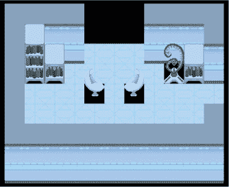
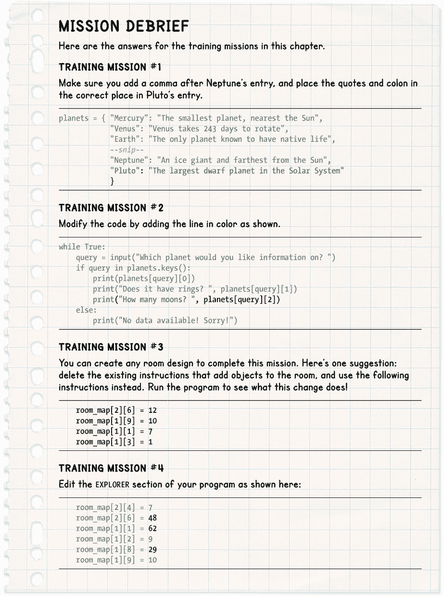

## 准备空间站设备**


现在，空间站的墙壁已经搭建完成，我们可以开始安装设备了。我们需要有关各种设备的详细信息，包括家具、生存系统和实验机械。在本章中，你将添加空间站上所有物品的信息，包括它们的图片和描述。你还将尝试设计自己的房间，并通过你在第四章中创建的*Explorer*程序查看它。

### **创建一个简单的行星字典**

为了存储关于空间站设备的信息，我们将使用一个编程概念，称为字典。*字典*有点像列表，但内置了搜索引擎。让我们更仔细地看看它是如何工作的。

#### **理解列表和字典之间的区别**

和纸质字典一样，你可以使用单词或短语在 Python 字典中查找信息。这个单词或短语叫做*键*，而与键相关的信息叫做*值*。与纸质字典不同，Python 字典中的条目可以是无序的，它们不必是按字母顺序排列的。Python 可以直接定位到你需要的条目，无论它在哪里。

假设你有一个包含以前太空任务信息的列表。你可以通过以下这行代码获取列表中的第一个项目：

```py
print(mission_info[0])
```

如果`mission_info`是一个字典而不是列表，你可以使用任务名称代替索引号来获取该任务的信息，像这样：

```py
print(mission_info["Apollo 11"])
```

键可以是一个单词或短语，也可以是一个数字。我们将从使用单词开始，因为这样更容易理解列表和字典之间的区别。

#### **制作天文学备忘单字典**

所有宇航员都需要对太阳系有良好的理解，因此在构建我们的第一个字典时，让我们了解一下行星。我们将使用行星的名称作为键，并将每个名称与该行星的信息连接起来。

看一下清单 5-1，它创建了一个名为`planets`的字典。当你创建字典时，使用大括号`{}`来标记字典的开始和结束，而不是用于列表的方括号。

字典中的每个条目由键、后跟冒号，再然后是该条目的信息组成。和列表一样，我们用逗号分隔条目，并将文本部分用双引号括起来。

在 IDLE 中打开一个新文件（**文件** ▸ **新建文件**），并输入以下程序。将其保存为*listing5-1.py*。

*listing5-1.py*

```py
   planets = { "Mercury": "The smallest planet, nearest the Sun",
               "Venus": "Venus takes 243 days to rotate",
               "Earth": "The only planet known to have native life",
               "Mars": "The Red Planet is the second smallest planet",
               "Jupiter": "The largest planet, Jupiter is a gas giant",
               "Saturn": "The second largest planet is a gas giant",
               "Uranus": "An ice giant with a ring system",
               "Neptune": "An ice giant and farthest from the Sun"
               }

➊ while True:
➋     query = input("Which planet would you like information on? ")
➌     print(planets[query])
```

*清单 5-1：你的第一个字典程序*

这个程序没有使用 Pygame Zero，因此你可以通过点击 IDLE 窗口顶部的**Run** ▸ **Run Module**来运行它。（即使你通过`pgzrun`运行，它仍然能正常工作，但使用菜单更方便。）当你运行程序时，它会使用`input()`内置函数 ➋询问你想要查询哪个行星的信息。试着输入“Earth”或“Jupiter”作为行星名称。

```py
Which planet would you like information on? Earth
The only planet known to have native life
Which planet would you like information on? Jupiter
The largest planet, Jupiter is a gas giant
```

你输入的每个行星名称都会存储在变量`query`中。然后，变量会用来在`planets`字典 ➌ 中查找该行星的信息。与我们在列表中使用索引号不同，这里我们使用输入的单词来获取信息，这个单词被存储在`query`变量中。

在 Python 中，我们可以使用`while` ➊循环来重复一组指令。与我们用来重复指定次数的`for`循环不同，`while`循环通常会一直重复，直到某些条件发生变化。在游戏中，`while`命令通常会检查某个变量，决定是否继续重复指令。例如，`while lives > 0`指令可以让游戏在玩家生命值大于 0 时继续进行。当`lives`变量变为 0 时，循环中的指令会停止重复。

我们在*listing5-1.py*中使用的`while` `True`命令会一直重复，因为它意味着“只要`True`为`True`”，这总是成立的。为了使这个`while` `True`命令正常工作，确保你将`True`的 T 大写，并且在行末加上冒号。

在`while`命令下，我们使用四个空格来缩进应该重复的指令。这里，我们已经缩进了要求你输入行星名称并给出行星信息的行，因此它们是需要重复的指令。在你输入行星名称并获取信息后，程序会继续要求你输入另一个行星名称，一直重复下去，直到你按下 CTRL-C 停止程序为止。

尽管这个程序可以正常运行，但它还不完整。如果你输入一个不在字典中的行星名称，可能会得到一个没有帮助的错误信息。让我们修复代码，让它返回一个有用的提示信息。

#### **字典错误防护**

当你输入一个字典中不存在的键时，你会看到一个错误信息。Python 会查找完全匹配的项。因此，如果你试图查找字典中不存在的项或拼写错误，程序就不会返回你想要的信息。

字典的键名像变量名一样区分大小写，所以如果你输入`earth`而不是`Earth`，程序就会崩溃。如果你输入一个不存在的行星，结果会是这样：

```py
Which planet would you like information on? Pluto
Traceback (most recent call last):
  File "C:\Users\Sean\Documents\Escape\listing5-1.py", line 13, in <module>
    print(planets[query])
KeyError: 'Pluto'
>>>
```

可怜的冥王星！经过 76 年的服务，它在 2006 年被取消了行星资格，因此它不在我们的`planets`字典中。

**训练任务 #1**

你能为冥王星在字典中添加一项吗？请特别注意引号、冒号和逗号的位置。你可以在字典中的任何位置添加它。

当程序查找字典中不存在的项时，它会停止运行并返回到 Python shell 提示符。为了避免这种情况，我们需要程序在尝试使用某个单词之前，检查它是否是字典中的键之一。

你可以通过输入字典名称后跟一个点和 `keys()` 来查看字典中有哪些键。这个技术术语叫做 *方法*。简单来说，方法是一组指令，你可以通过句点将它附加到数据上。请在 Python shell 中运行以下代码：

```py
>>> print(planets.keys())
dict_keys(['Mars', 'Pluto', 'Jupiter', 'Earth', 'Uranus', 'Saturn', 'Mercury',
'Neptune', 'Venus'])
```

你可能会注意到一个奇怪的地方。当我完成训练任务 #1 时，我把冥王星作为字典中的最后一项添加进去。但在这个输出中，它排在我的键列表的第二个位置。当你向列表中添加项时，它们会被放在末尾，但在字典中情况并非总是如此。这取决于你使用的是哪个版本的 Python。（最新版本会保持字典项按添加顺序排列。）不过，正如前面提到的，字典中键的顺序并不重要。Python 会自动确定键的位置，所以你不需要去思考它。

为了防止程序在用户请求字典中没有的行星信息时崩溃，请按照 列表 5-2 中的新增代码修改程序。

*listing5-2.py*

```py
   --snip--
   while True:
       query = input("Which planet would you like information on? ")
➊     if query in planets.keys():
➋         print(planets[query])
       else:
➌         print("No data available! Sorry!")
```

*列表 5-2：字典查找的错误防护*

将程序保存为 *listing5-2.py*，然后通过点击 **运行** ▸ **运行模块** 来运行它。通过正确输入一个行星名称来检查程序是否正常工作，然后再输入一个不在键列表中的行星名称。这是一个例子：

```py
Which planet would you like information on? Venus
Venus takes 243 days to rotate
Which planet would you like information on? Tatooine
No data available! Sorry!
```

我们通过在程序尝试使用 `query` 中的键之前，检查该键是否存在于字典中，从而防止程序崩溃 ➊。如果该键存在，我们像之前一样使用查询 ➋。否则，我们会向用户发送一条消息，告诉他们我们字典中没有该信息 ➌。现在程序变得更加友好。

#### **将列表放入字典中**

我们的行星字典目前有些有限。如果我们想添加更多信息，比如行星是否有环和它有多少颗卫星呢？为此，我们可以使用列表来存储关于行星的多个信息，然后将该列表放入字典中。

例如，以下是金星的新条目：

```py
"Venus": ["Venus takes 243 days to rotate", False, 0]
```

方括号标记了列表的开始和结束，列表中有三个项目：一个简短的描述，一个表示行星是否有环的 `True` 或 `False` 值，以及它拥有的卫星数量。因为金星没有环，所以第二项是 `False`。它也没有卫星，所以第三项是 0。

**红色警报**

**True** *和* **False** *的值需要以大写字母开头，并且不应该加引号。当你在 IDLE 中正确输入时，单词会变成橙色。*

更改你的字典代码，使每个键都有一个列表，如示例 5-3 所示，其余代码保持不变。记住，字典条目之间由逗号分隔，因此所有列表的右括号后面都需要有逗号，除了最后一个列表。将更新后的程序保存为*listing5-3.py*。

我也为冥王星加入了信息。有些人猜测冥王星可能有环，探索仍在进行中。当你阅读本书时，我们对冥王星的理解可能已经发生了变化。

*listing5-3.py*

```py
planets = { "Mercury": ["The smallest planet, nearest the Sun", False, 0],
            "Venus": ["Venus takes 243 days to rotate", False, 0],
            "Earth": ["The only planet known to have native life", False, 1],
            "Mars": ["The second smallest planet", False, 2],
            "Jupiter": ["The largest planet, a gas giant", True, 67],
            "Saturn": ["The second largest planet is a gas giant", True, 62],
            "Uranus": ["An ice giant with a ring system", True, 27],
            "Neptune": ["An ice giant and farthest from the Sun", True, 14],
            "Pluto": ["Largest dwarf planet in the Solar System", False, 5]
            }
--snip--
```

*示例 5-3：将列表放入字典中*

通过选择**运行** ▸ **运行模块**来运行程序。现在，当你请求某颗行星的信息时，程序应该显示该行星的整个列表：

```py
Which planet would you like information on? Venus
['Venus takes 243 days to rotate', False, 0]
Which planet would you like information on? Mars
['The second smallest planet', False, 2]
```

#### **从字典中的列表提取信息**

我们知道如何从字典中获取信息列表，所以下一步是从该列表中获取单个信息。例如，`False`项本身意义不大。如果我们能够将其从列表中分离出来，可以在旁边添加解释，以便更容易理解结果。我们之前在第四章中使用了*列表*中的列表来表示房间地图。现在，就像之前一样，我们将使用索引号从*字典*中的列表中获取条目。

因为`planets[query]`是整个列表，我们可以通过使用`planets[query][0]`来查看描述（列表中的第一个条目）。我们可以通过使用`planets[query][1]`来查看它是否有环。简而言之，以下是我们正在做的事情：

1.  我们使用存储在变量`query`中的行星名称，从`planets`字典中访问特定的列表。

1.  我们使用索引号从列表中提取单个项。

修改你的程序，使其看起来像示例 5-4。像之前一样，只修改未灰显的行。将程序保存为*listing5-4.py*，并通过点击**运行** ▸ **运行模块**来运行它。

*listing5-4.py*

```py
   --snip--
   while True:
       query = input("Which planet would you like information on? ")
       if query in planets.keys():
➊         print(planets[query][0])
➋         print("Does it have rings? ", planets[query][1])
       else:
           print("Databanks empty. Sorry!")
```

*示例 5-4：显示从字典中存储的列表获取的信息*

当你运行*listing5-4.py*程序时，你应该会看到类似以下内容：

```py
Which planet would you like information on? Earth
The only planet known to have native life
Does it have rings?  False
Which planet would you like information on? Saturn
The second largest planet is a gas giant
Does it have rings?  True
```

这应该适用于字典中的每一颗行星！

当你输入字典中存在的行星名称时，程序现在会打印出该行星信息列表中的第一个项，即描述➊。在下一行，程序会询问该行星是否有环，并显示`True`或`False`的答案，这是该行星信息列表中的第二项➋。你可以通过用逗号分隔来在同一个`print()`指令中显示一些文本和一些数据。这样显示比打印整个列表要清晰得多，信息也更易于理解。

**训练任务 #2**

你能修改程序，让它同时告诉你这颗行星有多少颗卫星吗？

### **制作太空站对象字典**

让我们将如何使用字典以及在字典中使用列表的知识应用到空间站上。空间站上需要的家具、生命支持设备、工具和个人物品众多，我们需要跟踪大量信息。我们将使用一个名为`objects`的字典来存储游戏中所有不同物品的信息。

我们将使用数字作为对象的键。这样比为每个对象使用一个单词更简单。而且，使用数字会让你更容易理解房间地图，如果你想像我们在第四章中那样打印出来的话。也减少了输入错误的风险。当我们稍后为谜题创建代码时，解决方案就不那么显而易见了，这意味着如果你在玩游戏之前构建游戏，会减少剧透。

你可能记得我们在第四章中使用了数字 0、1 和 2 来表示地板瓷砖、墙柱和土壤。我们将继续使用这些数字来表示这些物品，其余的物品将使用数字 3 到 81。

字典中的每个条目都是一个包含该物品信息的列表，类似于我们在本章前面创建的`planets`字典。列表中包含每个对象的以下信息：

**一个对象图像文件** 不同的对象可以使用相同的图像文件。例如，所有的访问卡都使用相同的图像。

**一个阴影图像文件** 我们使用阴影来增强游戏中的 3D 效果。两个标准阴影是*images.full_shadow*，它填充一个完整的瓷砖空间，适用于较大的物体；另一个是*images.half_shadow*，它填充一个半个瓷砖空间，适用于较小的物体。像仙人掌这样的物体有自己独特的轮廓，它们有专用的阴影图像文件，仅用于该物体。一些物品，比如椅子，其阴影包含在图像文件内。有些物品没有阴影，比如陨石坑和玩家可以携带的任何物品。当图像没有阴影时，我们在字典中的阴影文件名位置写`None`。`None`是 Python 中的一种特殊数据类型。像`True`和`False`一样，你不需要给它加引号，而且它应该以大写字母开头。正确输入时，`None`在代码中会变成橙色。

**一个长描述** 当你在游戏中检查或选择一个对象时，会显示一个长描述。一些长描述包含线索，而其他的则只是描述环境。

**一个简短描述** 通常只有几个词，例如“一个访问卡”，简短描述会在你与对象互动时显示在屏幕上。例如，“你丢下了一张访问卡。”简短描述仅在玩家可以拾取或使用的物品上需要，比如访问卡或自动售货机。

游戏可以重用`objects`字典中的物品。例如，如果一个房间由 60 个或更多相同的墙壁支柱构成，游戏只需重用同一个墙壁支柱对象。它只需要在字典中出现一次。

有些物品使用相同的图像文件，但有其他不同之处，这意味着我们必须在字典中将它们分开存储。例如，通行卡根据持有者的不同描述不同，门也有不同的描述，告诉你使用哪把钥匙。每张通行卡和每扇门在`objects`字典中都有自己的条目。

#### **添加逃脱游戏中的第一个物品**

打开你在第四章中创建的*listing4-3.py*。该列表包含了游戏地图和生成房间地图的代码。我们将对这个程序进行扩展，继续构建*逃脱*游戏。

首先，我们需要设置一些额外的变量。在冒险开始之前，一艘名为“波杜尔着陆器”的科研飞船坠毁在行星表面。我们将在这些新变量中存储随机坠机地点的坐标。我们现在添加这些变量，因为地图对象（编号 27）将需要它们来描述其位置。

将 Listing 5-5 中的新行添加到现有*listing4-3.py*文件中的`VARIABLES`部分，该部分由一个哈希框标记。我建议将它们添加到其他变量的末尾，紧接着`MAP`部分开始的位置，这样你的列表和我的列表就一致了。将程序保存为*listing5-5.py*。如果现在运行它，程序不会做任何新的操作，但如果你想尝试，可以输入 pgzrun listing5-5.py。

*listing5-5.py*

```py
--snip--
###############
## VARIABLES ##
###############

--snip--

DEMO_OBJECTS = [images.floor, images.pillar, images.soil]

LANDER_SECTOR = random.randint(1, 24)
LANDER_X = random.randint(2, 11)
LANDER_Y = random.randint(2, 11)

###############
##    MAP    ##
###############
--snip--
```

*Listing 5-5: 添加坠机地点变量*

这些新指令创建了变量，用来记住波杜尔着陆器所着陆的区块（或房间编号），以及它在该区块中的*x*和*y*位置。这些指令使用了`random.randint()`函数，它会从你提供的两个数字之间随机选择一个数字。这些指令在游戏开始时执行一次，因此每次你玩游戏时，着陆器的位置都会不同，但游戏过程中不会改变。

现在让我们添加第一部分物品数据，如 Listing 5-6 所示。本部分提供了从物品 0 到 12 的数据。因为玩家无法拾取或使用这些物品，它们没有简短的描述。

将本段代码添加到现有程序中的`MAKE MAP`部分（*listing5-5.py*）之前。为了帮助你在代码中找到位置，你可以在 IDLE 中按 CTRL-F 搜索特定的单词或短语。例如，尝试搜索*make map*，查看在哪里开始添加 Listing 5-6 中的代码。搜索后，点击搜索对话框上的关闭按钮。记住，如果你在列表中迷失了方向，始终可以参考附录 A 中的完整游戏代码。

如果你不想手动输入数据，可以使用位于列表文件夹中的 *data-chapter5.py* 文件。它包含了 `objects` 字典，你可以将它复制并粘贴到你的程序中。你可以先粘贴前 12 项。

*listing5-6.py*

```py
--snip--

assert len(GAME_MAP)-1 == MAP_SIZE, "Map size and GAME_MAP don't match"

###############
##  OBJECTS  ##
###############

objects = {
    0: [images.floor, None, "The floor is shiny and clean"],
    1: [images.pillar, images.full_shadow, "The wall is smooth and cold"],
    2: [images.soil, None, "It's like a desert. Or should that be dessert?"],
    3: [images.pillar_low, images.half_shadow, "The wall is smooth and cold"],
    4: [images.bed, images.half_shadow, "A tidy and comfortable bed"],
    5: [images.table, images.half_shadow, "It's made from strong plastic."],
    6: [images.chair_left, None, "A chair with a soft cushion"],
    7: [images.chair_right, None, "A chair with a soft cushion"],
    8: [images.bookcase_tall, images.full_shadow,
        "Bookshelves, stacked with reference books"],
    9: [images.bookcase_small, images.half_shadow,
        "Bookshelves, stacked with reference books"],
    10: [images.cabinet, images.half_shadow,
         "A small locker, for storing personal items"],
    11: [images.desk_computer, images.half_shadow,
         "A computer. Use it to run life support diagnostics"],
    12: [images.plant, images.plant_shadow, "A spaceberry plant, grown here"]
    }

###############
## MAKE MAP  ##
###############
--snip--
```

*列表 5-6：添加第一个对象*

记住，代码的颜色可以帮助你发现错误。如果你的文本部分不是绿色的，说明你漏掉了开头的双引号。如果有过多的绿色，可能是你忘了关闭的双引号。有些列表会继续在下一行，而 Python 知道列表没有完成，直到看到闭合的括号。如果你在让任何代码示例工作时遇到困难，你可以使用我提供的代码版本（参见 “使用我的示例代码” 在 第 21 页），从任何点开始继续这个项目。

列表 5-6 看起来与我们之前的 `planets` 字典相似：我们使用大括号标记字典的开始和结束，每个字典条目是一个列表，因此它位于方括号内。主要的区别是这次键是数字而不是单词。

将你新的程序保存为 *listing5-6.py*。这个程序使用 Pygame Zero 进行图形处理，因此你需要通过输入 `pgzrun listing5-6.py` 来运行它。它应该和之前一样工作，因为我们添加了新的数据，但还没有使用这些数据。无论如何都值得运行一下程序，因为如果你在命令行窗口看到错误信息，你可以在继续之前修复新代码。

#### **使用空间站浏览器查看对象**

要查看对象，我们必须告诉游戏使用新的字典。将程序中 `EXPLORER` 部分的以下行更改为：

```py
image_to_draw = DEMO_OBJECTS[room_map[y][x]]
```

改成如下：

```py
image_to_draw = objects[room_map[y][x]][0]
```

这个小变化使得 *Explorer* 代码使用我们新的 `objects` 字典，而不是我们之前指定的 `DEMO_OBJECTS` 列表。

注意，我们现在使用的是小写字母而不是大写字母。在这个程序中，我使用大写字母表示常量，其值不会改变。`DEMO_OBJECTS` 列表从未改变：它仅用于查找图像文件名。但 `objects` 字典在游戏过程中有时会更改其内容。

另一个区别是 `[0]` 现在位于行末。这是因为当我们从 `objects` 字典中提取一个条目时，它会给我们一整个信息列表。但我们这里只想使用图像，它是该列表中的第一个项目，因此我们使用索引 `[0]` 来提取它。

保存程序并再次运行，你应该会看到房间看起来与之前相同。这是因为我们还没有添加任何新的对象，我们保持了楼层、墙壁和土壤的对象编号与之前使用的索引编号相同。

#### **设计一个房间**

让我们在房间显示中添加一些物品。在代码的`EXPLORER`部分，添加 Listing 5-7 中显示的新行：

*listing5-7.py*

```py
--snip--

###############
## EXPLORER  ##
###############

def draw():
    global room_height, room_width, room_map
    print(current_room)
    generate_map()
    screen.clear()
    room_map[2][4] = 7
    room_map[2][6] = 6
    room_map[1][1] = 8
    room_map[1][2] = 9
    room_map[1][8] = 12
    room_map[1][9] = 9
--snip--
```

*Listing 5-7：在房间显示中添加一些物体*

这些新指令在房间显示之前，将物体添加到`room_map`列表中的不同位置。

记住，`room_map`使用 y 坐标在前，x 坐标在后。第一个索引数字表示物体离房间后面的距离；数字越小，物体越靠近后面。最小的有效数字通常是 1，因为墙壁在第 0 行。

第二个数字表示物体离房间的左边有多远，通常从左到右。第 0 列通常是墙壁，所以 1 也是这个位置的最小有效数字。

等号另一边的数字是特定物体的键。你可以通过查看 Listing 5-6 中的`objects`字典来检查每个数字代表的物体。

所以这一行：

```py
room_map[1][1] = 8
```

将物体 8（一组高书架）放置在房间的左上角。而这一行：

```py
room_map[2][6] = 6
```

将一把椅子（物体 6）放置在距离顶部三行和距离左边七个位置的地方。（记住，索引编号是从 0 开始的。）

将你的程序保存为 *listing5-7.py*，然后输入 `pgzrun listing5-7.py` 运行它。图 5-1 显示了现在你应该看到的内容。



*图 5-1：温馨！*Explorer*程序中显示的一些物体*

因为*Explorer*程序只是一个示例，所以一些功能还没有实现。例如，一些物体下面有一个黑色的方块，因为那里没有地板瓦片。另外，所有的房间看起来都一样，因为我们已经把物体编码到`EXPLORER`部分，所以它们出现在我们显示的每个房间里。这意味着你不能再查看所有的房间，因为某些房间里无法容纳物体。因此，你不能使用箭头键查看所有的房间。程序也不能正确显示像床这样的宽物体。我们稍后会解决这些问题，但在此期间，我们可以继续构建和测试空间站。

**训练任务#3**

尝试修改你在*Explorer*程序中添加的代码，将家具重新定位到你喜欢的位置。玩这个代码是学习如何在房间中定位物体的好方法。如果你想玩一个更大的房间，可以将`VARIABLES`部分中的`current_room`值从 31 改为 40（这是游戏中最大的房间）。将程序保存为 *mission5-3.py*，并使用`pgzrun mission5-3.py`运行它。你需要保留现有的*Explorer*代码（*listing5-7.py*）的备份，以便在训练任务#4 中使用。

#### **添加其余的物体**

到目前为止，我们已经将对象 0 到 12 添加到`objects`字典中。游戏中总共有 81 个物品，所以现在让我们通过在清单 5-8 中添加新行来添加其余的物品。记得在添加字典中其余物品之前，在物品 12 后添加逗号。

当同一个文件名或类似的描述用于多个物品时，你可以直接复制粘贴它。要复制代码，点击并按住鼠标左键，在代码块的开头开始，移动鼠标并高亮选中代码，然后按 CTRL-C。接着点击鼠标到你想粘贴代码的位置，按 CTRL-V。记住，如果你想节省打字时间，你也可以复制并粘贴整个*data-chapter5.py*文件中的字典。

将程序保存为*listing5-8.py*。你可以通过输入 pgzrun listing5-8.py 来测试程序是否仍然有效，尽管你目前还看不到任何新内容。

这是清单 5-8：

*listing5-8.py*

```py
   ###############
   ##  OBJECTS  ##
   ###############

   objects = {
       0: [images.floor, None, "The floor is shiny and clean"],
       --snip--

       12: [images.plant, images.plant_shadow, "A spaceberry plant, grown locally"],
➊     13: [images.electrical1, images.half_shadow,
            "Electrical systems used for powering the space station"],
       14: [images.electrical2, images.half_shadow,
            "Electrical systems used for powering the space station"],
       15: [images.cactus, images.cactus_shadow, "Ouch! Careful on the cactus!"],
       16: [images.shrub, images.shrub_shadow,
            "A space lettuce. A bit limp, but amazing it's growing here!"],
       17: [images.pipes1, images.pipes1_shadow, "Water purification pipes"],
       18: [images.pipes2, images.pipes2_shadow,
            "Pipes for the life support systems"],
       19: [images.pipes3, images.pipes3_shadow,
            "Pipes for the life support systems"],
➋     20: [images.door, images.door_shadow, "Safety door. Opens automatically \
   for astronauts in functioning spacesuits."],
       21: [images.door, images.door_shadow, "The airlock door. \
   For safety reasons, it requires two person operation."],
       22: [images.door, images.door_shadow, "A locked door. It needs " \
            + PLAYER_NAME + "'s access card"],
       23: [images.door, images.door_shadow, "A locked door. It needs " \
            + FRIEND1_NAME + "'s access card"],
       24: [images.door, images.door_shadow, "A locked door. It needs " \
            + FRIEND2_NAME + "'s access card"],
       25: [images.door, images.door_shadow,
            "A locked door. It is opened from Main Mission Control"],
       26: [images.door, images.door_shadow,
            "A locked door in the engineering bay."],
➌     27: [images.map, images.full_shadow,
            "The screen says the crash site was Sector: " \
            + str(LANDER_SECTOR) + " // X: " + str(LANDER_X) + \
            " // Y: " + str(LANDER_Y)],
       28: [images.rock_large, images.rock_large_shadow,
            "A rock. Its coarse surface feels like a whetstone", "the rock"],
       29: [images.rock_small, images.rock_small_shadow,
            "A small but heavy piece of Martian rock"],
       30: [images.crater, None, "A crater in the planet surface"],
       31: [images.fence, None,
            "A fine gauze fence. It helps protect the station from dust storms"],
       32: [images.contraption, images.contraption_shadow,
            "One of the scientific experiments. It gently vibrates"],
       33: [images.robot_arm, images.robot_arm_shadow,
            "A robot arm, used for heavy lifting"],
       34: [images.toilet, images.half_shadow, "A sparkling clean toilet"],
       35: [images.sink, None, "A sink with running water", "the taps"],
       36: [images.globe, images.globe_shadow,
            "A giant globe of the planet. It gently glows from inside"],
       37: [images.science_lab_table, None,
            "A table of experiments, analyzing the planet soil and dust"],
       38: [images.vending_machine, images.full_shadow,
            "A vending machine. It requires a credit.", "the vending machine"],
       39: [images.floor_pad, None,
            "A pressure sensor to make sure nobody goes out alone."],
       40: [images.rescue_ship, images.rescue_ship_shadow, "A rescue ship!"],
       41: [images.mission_control_desk, images.mission_control_desk_shadow, \
            "Mission Control stations."],
       42: [images.button, images.button_shadow,
            "The button for opening the time-locked door in engineering."],
       43: [images.whiteboard, images.full_shadow,
            "The whiteboard is used in brainstorms and planning meetings."],
       44: [images.window, images.full_shadow,
            "The window provides a view out onto the planet surface."],
       45: [images.robot, images.robot_shadow, "A cleaning robot, turned off."],
       46: [images.robot2, images.robot2_shadow,
            "A planet surface exploration robot, awaiting set-up."],
       47: [images.rocket, images.rocket_shadow, "A 1-person craft in repair."],
       48: [images.toxic_floor, None, "Toxic floor - do not walk on!"],
       49: [images.drone, None, "A delivery drone"],
       50: [images.energy_ball, None, "An energy ball - dangerous!"],
       51: [images.energy_ball2, None, "An energy ball - dangerous!"],
       52: [images.computer, images.computer_shadow,
            "A computer workstation, for managing space station systems."],
       53: [images.clipboard, None,
            "A clipboard. Someone has doodled on it.", "the clipboard"],
       54: [images.bubble_gum, None,
            "A piece of sticky bubble gum. Spaceberry flavour.", "bubble gum"],
       55: [images.yoyo, None, "A toy made of fine, strong string and plastic. \
   Used for antigrav experiments.", PLAYER_NAME + "'s yoyo"],
       56: [images.thread, None,
            "A piece of fine, strong string", "a piece of string"],
       57: [images.needle, None,
            "A sharp needle from a cactus plant", "a cactus needle"],
       58: [images.threaded_needle, None,
            "A cactus needle, spearing a length of string", "needle and string"],
       59: [images.canister, None,
            "The air canister has a leak.", "a leaky air canister"],
       60: [images.canister, None,
            "It looks like the seal will hold!", "a sealed air canister"],
       61: [images.mirror, None,
            "The mirror throws a circle of light on the walls.", "a mirror"],
       62: [images.bin_empty, None,
            "A rarely used bin, made of light plastic", "a bin"],
       63: [images.bin_full, None,
            "A heavy bin full of water", "a bin full of water"],
       64: [images.rags, None,
            "An oily rag. Pick it up by a corner if you must!", "an oily rag"],
       65: [images.hammer, None,
            "A hammer. Maybe good for cracking things open...", "a hammer"],
       66: [images.spoon, None, "A large serving spoon", "a spoon"],
       67: [images.food_pouch, None,
            "A dehydrated food pouch. It needs water.", "a dry food pack"],
       68: [images.food, None,
            "A food pouch. Use it to get 100% energy.", "ready-to-eat food"],
       69: [images.book, None, "The book has the words 'Don't Panic' on the \
   cover in large, friendly letters", "a book"],
       70: [images.mp3_player, None,
            "An MP3 player, with all the latest tunes", "an MP3 player"],
       71: [images.lander, None, "The Poodle, a small space exploration craft. \
   Its black box has a radio sealed inside.", "the Poodle lander"],
       72: [images.radio, None, "A radio communications system, from the \
   Poodle", "a communications radio"],
       73: [images.gps_module, None, "A GPS Module", "a GPS module"],
       74: [images.positioning_system, None, "Part of a positioning system. \
   Needs a GPS module.", "a positioning interface"],
       75: [images.positioning_system, None,
            "A working positioning system", "a positioning computer"],
       76: [images.scissors, None, "Scissors. They're too blunt to cut \
   anything. Can you sharpen them?", "blunt scissors"],
       77: [images.scissors, None,
            "Razor-sharp scissors. Careful!", "sharpened scissors"],
       78: [images.credit, None,
            "A small coin for the station's vending systems",
            "a station credit"],
       79: [images.access_card, None,
            "This access card belongs to " + PLAYER_NAME, "an access card"],
       80: [images.access_card, None,
            "This access card belongs to " + FRIEND1_NAME, "an access card"],
       81: [images.access_card, None,
            "This access card belongs to " + FRIEND2_NAME, "an access card"]
       }

➍ items_player_may_carry = list(range(53, 82))
   # Numbers below are for floor, pressure pad, soil, toxic floor.
➎ items_player_may_stand_on = items_player_may_carry + [0, 39, 2, 48]

   ###############
   ## MAKE MAP  ##
   ###############
   --snip--
```

*清单 5-8：完成* Escape *游戏的物品数据*

一些物品的列表在程序中跨越了多行 ➊。这没问题，因为 Python 知道列表直到看到闭括号才算完成。要将字符串（或任何其他代码片段）分割成多行，你可以在行尾使用`\` ➋。*listing5-8.py*中的换行只是为了让代码在书页上排版得更整齐：在屏幕上，如果你愿意，代码可以延伸到右侧。

对象 27 是一个显示贵宾犬坠毁地点的地图。它的长描述包括你在清单 5-5 中设置的贵宾犬位置变量。`str()`函数用于将这些变量中的数字转换为字符串，以便它们可以与其他字符串组合，构成长描述 ➌。

我们还设置了一些在游戏中需要的额外列表：`items_player_may_carry`存储玩家可以拾取的物品编号 ➍。这些物品编号是 53 到 81。因为它们是连续的，我们可以使用范围来设置`items_player_may_carry`列表。*范围*是一个数字序列，它从给定的第一个数字开始，直到最后一个数字*之前*的数字为止。（我们在第三章中使用了范围。）我们通过`list(range(53 to 82))`将该范围转化为列表，从而得到包含 53 到 81 之间所有数字的列表。

如果以后添加更多玩家可以携带的物品，可以将它们添加到这个列表的末尾。例如，要添加编号为 89 和 93 的新物品，玩家可以携带，可以使用`items_player_may_carry = list(range(54, 82)) + [89, 93]`。你也可以将新物品添加到`objects`列表的末尾，并扩展用于设置`items_player_may_carry`的范围。

另一个新列表是`items_player_may_stand_on`，它指定玩家是否被允许站在某个物品上➎。玩家只能站在足够小以便能被捡起的物品和不同类型的地面上。我们通过将不同地面类型的物品编号添加到`items_player_may_carry`列表中来创建这个列表。

完成了 F 第五章清单之后，你就完成了*Escape*游戏中的`OBJECTS`部分！但是我们还没有将物品放入游戏地图中。我们将在第六章开始做这件事。

**训练任务 #4**

试验一下你刚刚添加到游戏中的一些新物品。通过修改代码，你能否 . . .

+   将高书架换成一个垃圾箱（物品 62）？

+   将太空浆果植物换成一块小石头（物品 29）？

+   将右边的椅子换成一块有毒的地面（物品 48）？

为了理解哪个指令放置了哪个物品，你可以使用现有代码中的坐标，或者查阅`objects`字典中的物品编号（屏幕上或本章的清单中）。运行你的程序以确保它正常工作。

### **你准备好飞行了吗？**

勾选以下框以确认你已经学会了本章的关键内容。

  要从字典中获取信息，你需要使用该信息的键。键可以是一个单词或数字，也可以存储在变量中。

  如果你尝试使用字典中没有的键，会导致错误。

  为了避免错误，在程序尝试使用键之前，检查该键是否存在于字典中。

  你可以将列表放入字典中。然后，你可以使用字典键后跟列表索引来获取列表中的特定项。例如：`planets["Earth"][1]`。

  *Escape*游戏使用`objects`字典来存储游戏中所有物品的信息。字典中的每个项都是一个列表。

  你可以使用该列表的索引号来访问物品的图片文件、阴影图片文件以及长短描述。


