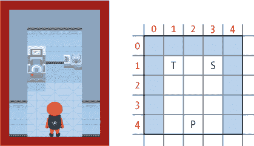
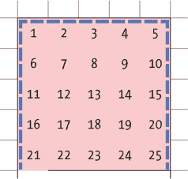
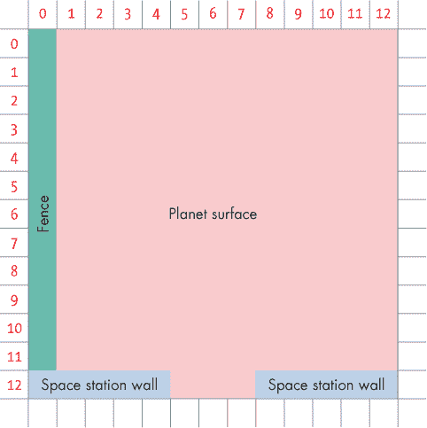
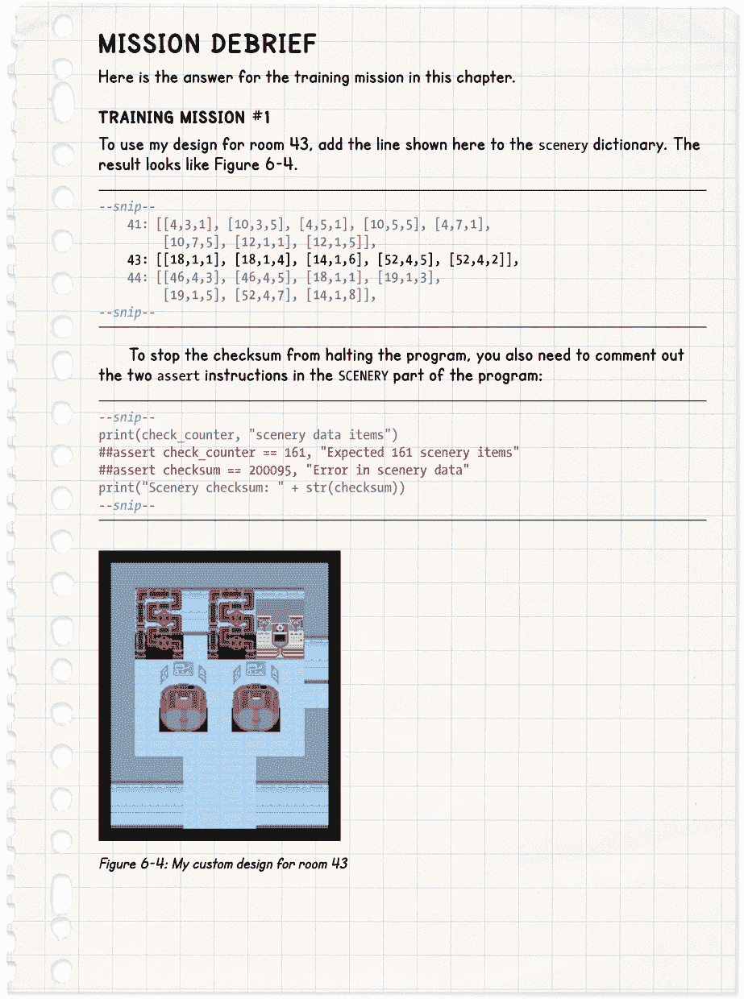

## 第六章：安装空间站设备**


在第五章中，你准备了所有将在任务中使用的设备信息。在本章中，你将把一些设备安装到空间站，并使用*Explorer*查看任何房间或行星表面的位置。这是你第一次有机会探索将成为你家的火星基地设计。

### **理解景物数据的字典**

空间站上有两种不同类型的物体：

+   **景物** 是在*Escape*游戏中始终保持在同一位置的设备，包括家具、管道和电子设备。

+   **道具** 是在游戏中可以出现、消失或移动的物体。它们包括玩家可以创建和拾取的物品。道具还包括门，当门关闭时它们出现在房间中，打开时则消失。

用于定位景物和道具的数据是分开存储的，且组织方式不同。本章中，我们只会添加景物数据。

我们的程序已经知道所有游戏中物体的图片和描述，因为它们已经在你在第五章中创建的`objects`字典中。现在，我们将告诉程序将景物物体放置在空间站的位置。为此，我们将创建一个新的字典，称为`scenery`。这是我们为一个房间构建条目的方式：

```py
room number: [[object number, y, x], [object number, y, x]]
```

字典的键将是房间号。对于每个房间号，字典存储一个列表，列表的开头和结尾有方括号。列表中的每一项是另一个列表，告诉程序将*一个*物体放置在房间中的位置。在这里，我将一个物体设置为红色，另一个设置为绿色，这样你可以看到它们的起始和结束位置。

每个物体需要以下三条信息：

**物体编号** 这是与`objects`字典中用作键的编号相同的编号。例如，编号 5 代表一张桌子。

**物体的 *y* 位置** 这是物体在房间中的位置，从后到前。后墙通常在 0 行，所以我们通常从 1 开始放置物体。最大有用数值通常是房间的高度减去 2：我们减去 1 是因为地图位置从 0 开始，再减去 1 是因为前墙占用了空间。实际上，最好在房间前面留更多空间，因为前墙可能会遮挡其他物体。你可以在第四章中添加的`GAME_MAP`代码中查看房间的大小。

**物体的 *x* 位置** 这告诉程序物体在房间中从左到右的具体位置。通常，墙壁的 x 位置是 0。通常有用的最大数值是房间的宽度减去 2。

为了更好地理解这些数字，让我们来看一下图 6-1，它展示了空间站中的一个房间的截图和地图。在这张图片中，水槽（S）位于从后向前数的第二排，因此它的*y*位置是 1。记住，最靠后的第一排墙壁的位置是*y* = 0。水槽的*x*位置是 3。它左边有两个瓷砖空间，墙壁的位置是*x* = 0。



*图 6-1: 游戏中看到的空间站房间示例（左）和通过地图表示的房间（右）。T = 厕所，S = 水槽，P = 玩家。*

让我们看看这个房间的数据。暂时不要输入这个代码。我会很快给你所有的景观数据。

```py
scenery = {
--snip--
30: [[34,1,1], [35,1,3]],
--snip--
}
```

这段代码告诉程序房间 30 中的物体信息。房间 30 在左上角有编号 34 的厕所，位置是*y* = 1 和 *x* = 1，另外在位置*y* = 1 和 *x* = 3 有编号 35 的水槽，离厕所很近。

你可以在房间中多次使用同一个物品，只需要为每个位置添加一个列表，并为它们使用相同的物品编号。例如，如果你愿意，你可以将房间填满不同位置的厕所，尽管这会是一个相当奇怪的做法。

你不需要在景观数据中包括墙壁，因为程序在创建`room_map`列表时会自动将它们添加到房间中，正如你之前所看到的那样。

尽管将每个物品的信息放入一个列表中意味着要增加更多的括号，但这样一目了然，数据更容易理解。括号帮助你看到房间里有多少物品，哪些是物品编号，哪些是位置编号。

### **添加景观数据**

打开*listing5-8.py*，它是第五章中的最后一个代码清单。这个清单包含了你的游戏地图和物体数据。现在我们将把景观数据添加到其中。

Listing 6-1 展示了景观数据。将这个新的`SCENERY`部分添加到`MAKE MAP`部分之前。确保括号和逗号的位置正确。记住，每个景观项需要一个由三个数字组成的列表，而且每个列表之间也要用逗号分隔。如果你不想全部手动输入数据，可以使用*data-chapter6.py*文件，它位于*listings*文件夹中。这个文件包含了你可以复制粘贴到程序中的景观字典。

*listing6-1.py*

```py
   --snip--

   items_player_may_stand_on = items_player_may_carry + [0, 39, 2, 48]

   ###############
   ##  SCENERY  ##
   ###############

   # Scenery describes objects that cannot move between rooms.
   # room number: [[object number, y position, x position]...]
   scenery = {
       26: [[39,8,2]],
       27: [[33,5,5], [33,1,1], [33,1,8], [47,5,2],
            [47,3,10], [47,9,8], [42,1,6]],
       28: [[27,0,3], [41,4,3], [41,4,7]],
       29: [[7,2,6], [6,2,8], [12,1,13], [44,0,1],
            [36,4,10], [10,1,1], [19,4,2], [17,4,4]],
       30: [[34,1,1], [35,1,3]],
       31: [[11,1,1], [19,1,8], [46,1,3]],
       32: [[48,2,2], [48,2,3], [48,2,4], [48,3,2], [48,3,3],
            [48,3,4], [48,4,2], [48,4,3], [48,4,4]],
       33: [[13,1,1], [13,1,3], [13,1,8], [13,1,10], [48,2,1],
            [48,2,7], [48,3,6], [48,3,3]],
       34: [[37,2,2], [32,6,7], [37,10,4], [28,5,3]],
       35: [[16,2,9], [16,2,2], [16,3,3], [16,3,8], [16,8,9], [16,8,2], [16,1,8],
            [16,1,3], [12,8,6], [12,9,4], [12,9,8],
            [15,4,6], [12,7,1], [12,7,11]],
       36: [[4,3,1], [9,1,7], [8,1,8], [8,1,9],
            [5,5,4], [6,5,7], [10,1,1], [12,1,2]],
       37: [[48,3,1], [48,3,2], [48,7,1], [48,5,2], [48,5,3],
            [48,7,2], [48,9,2], [48,9,3], [48,11,1], [48,11,2]],
       38: [[43,0,2], [6,2,2], [6,3,5], [6,4,7], [6,2,9], [45,1,10]],
       39: [[38,1,1], [7,3,4], [7,6,4], [5,3,6], [5,6,6],
            [6,3,9], [6,6,9], [45,1,11], [12,1,8], [12,1,4]],
       40: [[41,5,3], [41,5,7], [41,9,3], [41,9,7],
            [13,1,1], [13,1,3], [42,1,12]],
       41: [[4,3,1], [10,3,5], [4,5,1], [10,5,5], [4,7,1],
            [10,7,5], [12,1,1], [12,1,5]],
       44: [[46,4,3], [46,4,5], [18,1,1], [19,1,3],
            [19,1,5], [52,4,7], [14,1,8]],
       45: [[48,2,1], [48,2,2], [48,3,3], [48,3,4], [48,1,4], [48,1,1]],
       46: [[10,1,1], [4,1,2], [8,1,7], [9,1,8], [8,1,9], [5,4,3], [7,3,2]],
       47: [[9,1,1], [9,1,2], [10,1,3], [12,1,7], [5,4,4], [6,4,7], [4,1,8]],
       48: [[17,4,1], [17,4,2], [17,4,3], [17,4,4], [17,4,5], [17,4,6], [17,4,7],
            [17,8,1], [17,8,2], [17,8,3], [17,8,4],
            [17,8,5], [17,8,6], [17,8,7], [14,1,1]],
       49: [[14,2,2], [14,2,4], [7,5,1], [5,5,3], [48,3,3], [48,3,4]],
       50: [[45,4,8], [11,1,1], [13,1,8], [33,2,1], [46,4,6]]
       }
   checksum = 0
   check_counter = 0
   for key, room_scenery_list in scenery.items():
       for scenery_item_list in room_scenery_list:
➊         checksum += (scenery_item_list[0] * key
                        + scenery_item_list[1] * (key + 1)
                        + scenery_item_list[2] * (key + 2))
           check_counter += 1
   print(check_counter, "scenery items")
➋ assert check_counter == 161, "Expected 161 scenery items"
➌ assert checksum == 200095, "Error in scenery data"
   print("Scenery checksum: " + str(checksum))

   ###############
   ## MAKE MAP  ##
   ###############
   --snip--
```

*Listing 6-1: 添加景观数据*

将你的清单保存为*listing6-1.py*，然后在命令行中使用`pgzrun listing6-1.py`运行它。我们已经添加了一些数据，但还没有告诉程序做任何处理，所以你不会看到任何变化。但是，如果你在输入数据时犯了错误，程序应该会停止并显示消息`Error in` `scenery data`。如果发生这种情况，请返回并仔细检查你的代码与书中的内容是否一致。首先检查你是否正确输入了校验和！

该列表的后半部分是一种安全措施，称为*校验和*。它通过对数据进行计算并将结果与正确答案进行对比，检查所有数据是否完整且正确。如果你输入的数据有错误，这段代码会阻止程序运行，直到你修正错误。这防止了游戏运行时出现错误。（虽然有些错误可能会被忽略，但这段代码能够捕捉大部分错误。）

程序使用 `assert` 指令来检查数据。第一条指令检查程序是否拥有正确数量的数据项。如果没有，程序会停止并显示错误消息 ➋。程序还检查校验和（计算结果）是否为预期的数字，如果不是，它会停止程序 ➌。注意，列表 6-1 中的一条指令跨越了三行 ➊：Python 知道我们没有完成指令，直到我们关闭最后一个括号。

**提示**

如果你想更改景观数据，重新设计房间或添加自己的房间，你需要关闭校验和。这是因为基于你更改的数据的计算将不同，因此校验和会失败，程序无法运行。你只需在以 `assert` 开头的两行 ➋➌ 前加上 `#` 符号来关闭它们。如你所知，`#` 符号用于注释，Python 会忽略同一行中它后面的所有内容。在你构建或测试程序时，它是一个非常方便的开关。

### **为星球表面添加外围围栏**

你可能注意到我们还没有为房间 1 到 25 添加任何景观。我们的数据从房间 26 开始。如你所记，前 25 个位置是在星球表面外部。为了简化，我们仍然称它们为房间，尽管它们没有墙壁。

图 6-2 显示了地图上房间 1 到 25 的位置。一个栅栏，如图 6-2 所示的虚线，围绕着这些房间的外部。栅栏防止人们漫无目的地走出围墙，离开游戏地图。



*图 6-2：为星球表面位置添加围栏*

我们需要在以下位置添加围栏：

+   在房间 1、6、11、16 和 21 的左侧

+   在房间 1、2、3、4 和 5 的顶部

+   在房间 5、10、15、20、25 的右侧

每个外部房间也有一项星球表面景观，它是从包括岩石、灌木和陨石坑等适当项目的小范围中随机选择的。对于游戏来说，这些物品的放置位置无关紧要，因此它们也可以随机定位。

列表 6-2 显示了生成随机星球表面景观并添加围栏的代码。将代码添加到你刚刚创建的 `SCENERY` 部分的末尾，并将程序保存为 *listing6-2.py*。你可以使用 pgzrun listing6-2.py 来检查程序是否报告了任何错误。

*listing6-2.py*

```py
   --snip--
   print("Scenery checksum: " + str(checksum))

   for room in range(1, 26): # Add random scenery in planet locations.
➊     if room != 13: # Skip room 13.
➋         scenery_item = random.choice([16, 28, 29, 30])
➌         scenery[room] = [[scenery_item, random.randint(2, 10),
                             random.randint(2, 10)]]

   # Use loops to add fences to the planet surface rooms.
➍ for room_coordinate in range(0, 13):
➎     for room_number in [1, 2, 3, 4, 5]: # Add top fence
➏         scenery[room_number] += [[31, 0, room_coordinate]]
➐     for room_number in [1, 6, 11, 16, 21]: # Add left fence
➑         scenery[room_number] += [[31, room_coordinate, 0]]
       for room_number in [5, 10, 15, 20, 25]: # Add right fence
➒         scenery[room_number] += [[31, room_coordinate, 12]]

➓ del scenery[21][-1] # Delete last fence panel in Room 21
   del scenery[25][-1] # Delete last fence panel in Room 25

   ###############
   ## MAKE MAP  ##
   ###############

   --snip--
```

*列表 6-2：生成随机的行星表面景观*

你不需要理解这些代码就能享受构建和玩*逃脱*游戏，但如果你想深入了解，我会更详细地解释这些代码。

列表 6-2 的第一部分添加了随机的景观。对于每个房间，`random.choice()` ➋ 随机选择一个景观项。就像`random.randint()`给我们一个随机数（就像掷骰子一样），`random.choice()`则给我们一个随机项（就像抓宝袋或者抽奖游戏）。这个项从列表`[16, 28, 29, 30]`中选择。这些物品编号分别代表灌木丛、大岩石、小岩石和陨石坑。

我们还为房间➌的`scenery`字典添加了一个新条目。这个条目包含了随机的景观项以及该项的随机*y*和*x*位置。*y*和*x*位置将景观项放置在房间内，但不会太靠近边缘。

`!=`运算符➊表示“不等于”，所以只有当房间编号*不等于*13 时才会添加景观。谁知道呢？也许在你的任务中，行星表面有个空旷的空间会很有用…

列表 6-2 的第二部分添加了围栏。所有的行星表面位置都是 13 个瓦片高，13 个瓦片宽，所以我们可以使用一个循环➍来添加顶部和侧面的围栏。循环的变量`room_coordinate`从 0 数到 12，每次循环时，围栏板会放置在相应房间的顶部和侧面。

在`room_coordinate`循环内，有三个`room_number`循环。第一个`room_number`循环➎在顶部房间的顶部行添加围栏。这里不是使用`range()`，而是通过一个列表进行循环。每次循环时，变量`room_number`从列表`[1, 2, 3, 4, 5]`中取出下一个数字。我们通过`+=`将一个景观项添加到该房间的景观列表中➏。这是景观项 31（一块围栏），位于房间的顶部行（位置*y* = 0）。`room_coordinate`的值用于*x*位置。这样就把顶部围栏添加到房间 1 到 5 的顶部行。

在`room_coordinate`循环内还有两个`room_number`循环。第一个循环给房间`1`、`6`、`11`、`16`和`21`添加左边的围栏➐。这次，程序使用`room_coordinate`变量作为*y*位置，使用`0`作为*x*位置➑。这样就把围栏板放置在这些房间的左边缘。第二个循环给房间`5`、`10`、`15`、`20`和`25`添加右边的围栏。这也使用`room_coordinate`作为围栏板的*y*位置，但使用`12`作为*x*坐标，将围栏放置在这些房间的右边缘➒。

我们不希望在外部区域与空间站墙壁相接的地方出现侧围栏面板。图 6-3 显示了房间 21 的地图。房间的左下角应该是墙面，因此这里不应该有围栏面板。然而，之前的循环添加了一个围栏面板，所以我们使用指令 ➓ 删除添加到该房间的最后一个景观项，并删除位于复合体另一侧的房间 25（见图 6-2）。与其编写代码避免在此处放置围栏面板，不如直接添加这两个面板再将它们删除。索引号 `-1` 是指向列表中最后一项的便捷快捷方式。



*图 6-3：显示围栏如何接触到空间站旁边外部房间墙壁的地图*

使用随机景观和循环来定位围栏，使我们能够探索一个大区域，而不必为 200 多个围栏面板和景观项目输入数据。

**提示**

如果你在定制游戏时不想在房间 1 到 25 中添加随机景观或围栏，可以删除清单 6-2 中显示的代码部分。

### **将景观加载到每个房间**

现在我们已经将景观数据添加到程序中，接下来让我们添加一些代码，以便在空间站中看到景观！你可能还记得，`generate_map()` 函数会为你当前探索的房间创建 `room_map` 列表。`room_map` 列表用于显示和导航房间。

到目前为止，`generate_map()` 函数仅计算房间的大小、门的位置，并放置地板和墙壁。我们需要添加一些代码，从新字典中提取景观并将其添加到 `room_map` 中。但首先，我们需要对程序进行一个小但重要的调整。在程序的 `VARIABLES` 部分，靠近程序开始的位置，添加清单 6-3 中显示的新行。将程序保存为 *listing6-3.py*。

*listing6-3.py*

```py
--snip--

###############
## VARIABLES ##
###############

--snip--

LANDER_SECTOR = random.randint(1, 24)
LANDER_X = random.randint(2, 11)
LANDER_Y = random.randint(2, 11)

TILE_SIZE = 30

###############
##    MAP    ##
###############

--snip--
```

*清单 6-3：设置* TILE_SIZE *变量*

这一行创建了一个变量来存储瓷砖的大小。使用它能让程序更易读，因为我们可以用一个更有意义的短语替代数字 30。我们不必再在代码中看到数字 30 并且记住它代表的意思，而是可以看到`TILE SIZE`，它能提示我们代码的作用。

接下来，找到程序中的 `MAKE MAP` 部分：它位于 `EXPLORER` 部分之前。在 `MAKE MAP` 部分末尾添加清单 6-4，以便将景观放置到当前房间。所有清单 6-4 中的代码都属于 `generate_map()` 函数，因此我们需要将第一行缩进四个空格，然后按示例缩进剩余的行。将程序保存为 *listing6-4.py*。

*listing6-4.py*

```py
   --snip--

   def generate_map():
   --snip--

➊     if current_room in scenery:
➋         for this_scenery in scenery[current_room]:
➌             scenery_number = this_scenery[0]
➍             scenery_y = this_scenery[1]
➎             scenery_x = this_scenery[2]
➏             room_map[scenery_y][scenery_x] = scenery_number

➐             image_here = objects[scenery_number][0]
➑             image_width = image_here.get_width()
➒             image_width_in_tiles = int(image_width / TILE_SIZE)
➓             for tile_number in range(1, image_width_in_tiles):
                   room_map[scenery_y][scenery_x + tile_number] = 255

   ###############
   ## EXPLORER  ##
   ###############

   --snip--
```

*清单 6-4：为* generate_map() *函数添加的额外代码，将当前房间的景观添加到* room_map *列表中*

让我们来逐步分析一下。➊这一行检查当前房间在`scenery`字典中是否有条目。这个检查非常重要，因为我们游戏中的某些房间可能没有任何景物，如果我们尝试使用一个不存在的字典键，Python 会抛出错误并停止执行。

然后，我们设置了一个循环➋，该循环遍历房间中的所有景物项，并将它们复制到一个名为`this_scenery`的列表中。第一次进入循环时，`this_scenery`包含第一个景物项的列表；第二次时，包含第二个景物项的列表，以此类推，直到遍历完当前房间的所有景物项。

每个景物项都有一个列表，包含它的对象编号、*y*位置和*x*位置。程序使用索引提取`this_scenery`中的这些信息，并将它们放入变量`scenery_number` ➌、`scenery_y` ➍和`scenery_x` ➎中。

现在程序已经拥有了所有需要的信息，可以将景物项添加到`room_map`中。你可能还记得，`room_map`在房间的每个位置存储着该物品的对象编号。它使用房间中的*y*位置和*x*位置作为列表索引。这个程序使用`scenery_y`和`scenery_x`的值作为列表索引，将`scenery_number`放入`room_map`中➏。

如果我们的所有物品都只有一个瓦片宽，那么我们只需要做这些就足够了。但有些物品更宽，占据多个瓦片。例如，一个宽的物品放置在一个瓦片内，可能会覆盖右边的两个瓦片，但目前程序只看到它占据的一个瓦片。

我们需要在`room_map`的额外空间中添加一些内容，以便程序知道玩家不能走到那些瓦片上。我使用数字 255 来表示一个没有物品的空白区域，但玩家也无法走动。

为什么选择数字 255？这是一个足够大的数字，如果你愿意，可以为游戏添加更多的对象，它允许`objects`字典中有 254 个项目。此外，对我来说，这个数字也很有意义：它是你能用一个字节数据表示的最大数字（在我上世纪 80 年代开始编写游戏时，这个问题非常重要，那时计算机的内存大约只有 65,000 字节，用来存储所有数据、图形和程序代码）。

首先，我们需要确定图片的宽度，这样才能知道它占据了多少个瓦片。我们使用`scenery_number`作为字典键，从`objects`字典中获取关于该对象的信息➐。我们知道，`objects`字典返回的是一个信息列表，其中第一个项目是图像。所以我们使用索引 0 来提取图像，并将其放入变量`image_here`中。

然后，我们可以使用 Pygame Zero 来找出图像的宽度，通过在其名称后添加`get_width()`➑。我们将这个数字放入一个名为`image_width`的变量中。因为我们需要知道图像覆盖了多少瓦片，程序将图像宽度（像素）除以瓦片大小 30，并将其转换为整数（一个整数）➒。我们必须将这个数字转换为整数，因为我们将在`range()`函数中使用它➓，而该函数只接受整数。如果我们不转换这个数字，宽度将是一个浮动小数——一个带小数点的数字。

最后，我们设置一个循环，在景物项的右侧添加值 255，无论瓦片是否被覆盖➓。

如果一张图片宽度为 90 像素，我们将其除以 30 的瓦片大小，并将结果 3 存储在`image_width_in_tiles`中。然后，循环使用`range()`计算到 2，因为我们为它提供了 1 到`image_width_in_tiles`的范围➓。我们将循环中的数字加到物体的* x *位置，并且`room_map`中的这些位置会标记为 255。现在，覆盖三个瓦片的大型物体将在右边的下两个空间标记为 255。

现在，我们的程序包含了所有景物，并可以将其添加到`room_map`中，准备显示。接下来，我们将对`EXPLORER`部分做一些小修改，以便可以巡游空间站。

### **更新探险者以巡游空间站**

程序中的`EXPLORER`部分让你可以查看空间站中的所有房间，并使用箭头键在地图上移动。让我们更新这一部分，这样你就可以看到所有的景物了。

如果你的*Explorer*代码中包含任何用于将景物添加到`room_map`的行，你现在需要将它们关闭。尽管这些行是实验房间设计的好方法，但它们会将相同的景物强行放入每个房间并覆盖真正的房间设计。由于这些行可能包含你对房间设计的构思，所以不妨将它们注释掉，这样 Python 就会忽略它们。点击并拖动鼠标，选中所有行，然后点击**格式** ▸ **注释区域**（或使用快捷键 ALT-3）。注释符号将被添加到选中行的开头，如清单 6-5 所示：

*listing6-5.py*

```py
--snip--

###############
## EXPLORER  ##
###############

def draw():
    global room_height, room_width, room_map
    print(current_room)
    generate_map()
    screen.clear()
##    room_map[2][4] = 7
##    room_map[2][6] = 6
##    room_map[1][1] = 8
##    room_map[1][2] = 9
##    room_map[1][8] = 12
##    room_map[1][9] = 10
--snip--
```

*清单 6-5：注释掉 EXPLORER 部分的代码*

现在，我们需要对显示房间的代码做一个小修改，使其不再尝试为标记为 255 的地板空间绘制图像。这个空间将由其左侧的图像覆盖，并且我们没有为 255 在`objects`字典中创建条目。

清单 6-6 显示了你需要在程序的`EXPLORER`部分添加的新行，如图所示。`if`语句确保只有当物体编号不等于 (`!=`) 255 时，绘制物体的指令才会执行。

添加该行后，将其后的现有代码缩进四个空格。缩进告诉 Python 这些指令属于 `if` 指令。你可以在接下来的两行开头键入四个空格，或者你可以选中这些行，然后点击 **格式** ▸ **缩进区域**。

*listing6-6.py*

```py
--snip--

###############
## EXPLORER  ##
###############

--snip--

    for y in range(room_height):
        for x in range(room_width):
            if room_map[y][x] != 255:
                image_to_draw = objects[room_map[y][x]][0]
                screen.blit(image_to_draw,
                    (top_left_x + (x*30),
                    top_left_y + (y*30) - image_to_draw.get_height()))

--snip--
```

*Listing 6-6: 更新 Explorer，使其不再尝试显示图像 255*

现在你已经准备好参观基地了。将程序保存为 *listing6-6.py*，并通过输入 `pgzrun listing6-6.py` 来运行它。使用方向键在地图上移动，熟悉空间站的布局。和之前一样，*Explorer* 程序允许你在地图上朝任意方向移动，即使在游戏中遇到墙壁也不受影响。

所有景物应该已经布置好在房间里。宽物体现在应该正确显示，你也应该能够再次查看所有房间，因为你之前在 Listing 6-5 中所做的更改。某些物体下方仍然会有黑色方块，因为下面没有地板瓷砖，但我们将在 第八章 中解决这个问题。

空间站的地图和景物现在已经完成。是时候进入空间站了。在下一章中，你将传送到表面，最终踏上火星。

**训练任务 #1**

你能将自己的房间设计添加到景物数据中吗？房间编号 43 已经为空，供你填写。它的大小是 9 × 9 瓷砖，所以你可以将物体放置在每个方向的 1 到 7 的位置（记住墙壁！）。你可以以你在 第五章 中的 *Explorer* 创建的房间为基础，或者发明一个新的布局。记住，你需要关闭 `assert` 指令，以防当 `scenery` 数字不匹配时，校验和报告错误。

你的程序的 `objects` 字典（见 第五章）会告诉你每个物体的数量。使用 1 到 47 之间的物体编号，确保在完成并开始玩 *Escape* 游戏时，不会出现影响代码的任何问题。

如果你遇到困难，可以尝试构建我的示例，该示例显示在 任务回顾 中，位于 第 110 页。将 `VARIABLES` 部分中的 `current_room` 的值更改为 43，这样你第一次运行程序时就能看到重新设计的房间。记得在完成后将 `current_room` 改回 31。

### **你适合飞行吗？**

勾选以下框以确认你已经学习了本章的关键内容。

  在 *Escape* 游戏中无法移动的物品被称为 *景物*。

  `scenery` 字典使用房间编号作为键，并提供每个房间中固定物品的列表。

  每个景物项目都存储为一个包含物体编号、*y* 位置和 *x* 位置的列表。

  校验和用于检查数据是否已被更改或输入错误。

  可以使用循环将物品添加到`scenery`字典中。有些景物也可以随机放置。

  `generate_map()`函数从当前房间的`scenery`字典中获取物品，并将它们放入`room_map`列表中。然后，这些物品就可以在房间中显示出来。

  在`room_map`中的数字 255 表示一个被大物体覆盖的空间，前提是物体不从该空间开始。


