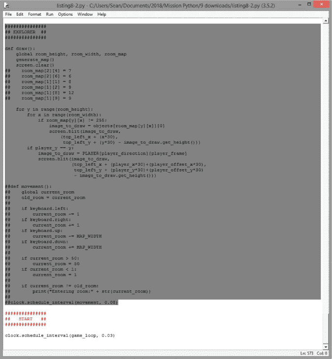
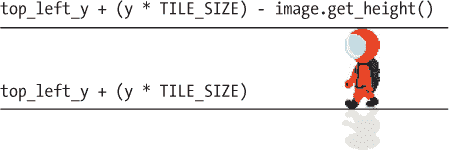
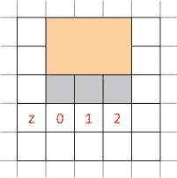
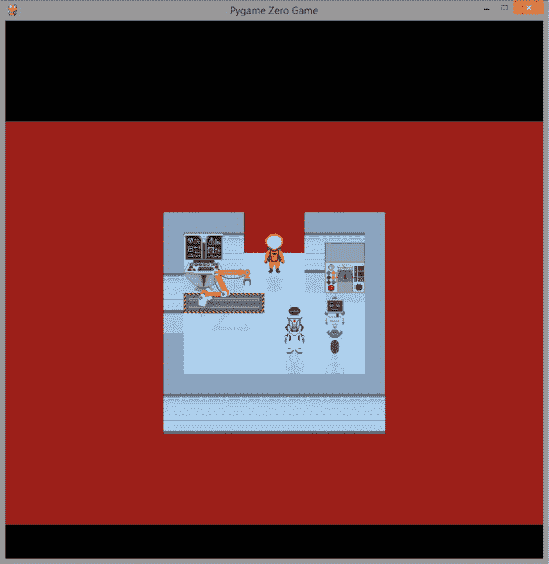
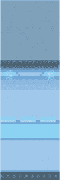
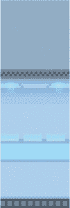
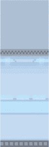
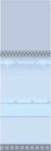
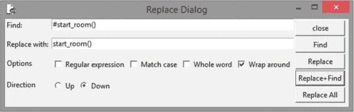
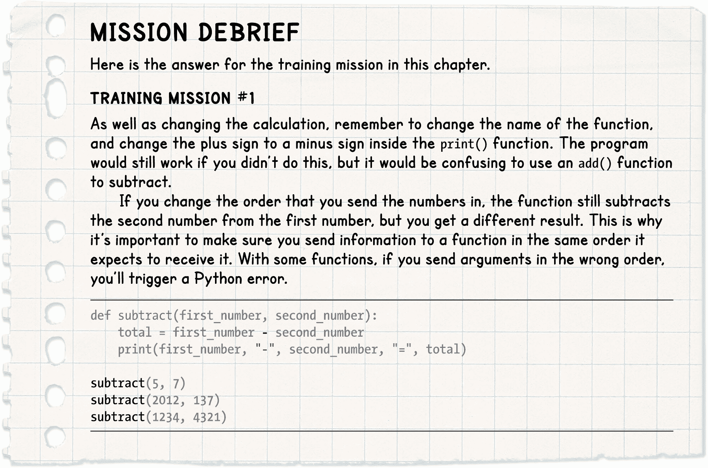

## **8

**修复太空站**

在太空站四处游荡时，你一定注意到一些东西看起来不太对劲。为了让程序快速运行，我们使用了 EXPLORER 部分来显示房间。然而，它也有一些缺点：

+   有时景物下方会显示一个空白空间，因为那里没有地板。

+   当你走到房间前面时，前墙会遮挡住宇航员。

+   当你走到屏幕背面时，宇航员的腿会消失。

+   所有房间都绘制在游戏窗口的左上角。这使得它看起来不均匀且不一致，因为房间的右侧空间远大于左侧，而且较宽的房间在右侧留下的空间比狭窄房间少。

+   没有阴影，这使得很难理解房间内物体的位置。

在本章中，我们将修复这些故障，并且还会添加一个用于显示窗口顶部信息的函数。这些信息将向玩家提供有关太空站及其在游戏中的进展情况。

当你阅读这一章时，你将学习如何将信息传递给 Python 函数，并了解如何使用 Pygame Zero 绘制矩形。到本章结束时，太空站将看起来很棒！

### **将信息发送到函数**

首次，我们需要将信息发送到一个函数。你已经看到过如何将信息放在括号中传递给 print()函数。例如，你可以像这样输出一条消息：

print("学习你的紧急疏散演习")

当该指令运行时，print()函数会接收你放在括号中的信息，并在命令行窗口或 Python shell 中显示出来。

我们还可以将信息传递给我们创建的函数。

#### **创建一个接收信息的函数**

为了实验函数，我们将构建一个可以将两个数字相加的函数。点击**文件** ▸ **新建**以打开一个新窗口，并在清单 8-1 中输入程序。

*listing8-1.py*

➊ def add(first_number, second_number):

➋     total = first_number + second_number

➌     print(first_number, "+", second_number, "=", total)

➍ add(5, 7)

add(2012, 137)

add(1234, 4321)

*清单 8-1：将信息发送到函数*

将程序保存为*listing8-1.py*。因为它没有使用任何 Pygame Zero 功能，所以你可以通过点击**运行** ▸ **运行模块**或按 F5 键来运行它。（如果你使用 Pygame Zero 运行它，结果将出现在命令行窗口中，游戏窗口将为空。）

当你运行程序时，应该看到以下输出：

5 + 7 = 12

2012 + 137 = 2149

1234 + 4321 = 5555

我们创建了一个名为 add()的新函数➊。定义完 add()之后，我们可以通过使用它的名称➍来运行它，并通过将数字放入括号中、数字之间用逗号分隔➍来向它传递数字。然后，函数会将这两个数字相加。

#### **工作原理**

为了使函数能够接收数字，我们在定义函数时为其提供了两个变量，用来存储这些数字。我将它们命名为 first_number 和 second_number ➊，以便让程序更易于理解，但这些变量名可以是任何名称。这些是局部变量：它们仅在该函数内部有效。

使用该函数时，它会将接收到的第一个项目放入变量 first_number 中。第二个项目放入 second_number 中。

当然，两个数字相加的顺序并不重要，所以传入数字的顺序也无关紧要。指令 add(5, 7)和 add(7, 5)会给出相同的结果。但有些函数需要你按照函数期望接收的顺序来传递信息。例如，如果函数是在进行减法运算，传入数字的顺序错误就会得到不同的结果。了解函数期望接收什么信息的唯一方法是查看它的代码。

函数的主体非常简单。它创建了一个名为 total 的新变量，用于存储两个数字相加的结果➋。然后，程序打印一行，包含第一个数字、加号、第二个数字、等号以及结果 total➌。

在最后三条指令中，我们传递给函数三对数字进行相加 ➍。

这个简单的示范展示了如何将信息（或*参数*）传递给函数。你可以创建接受多个参数的函数，甚至可以接受列表、字典或图像。函数使得我们可以轻松重用一组指令，而传递参数意味着我们可以用不同的信息重用这些指令。例如，示例 8-1 三次使用相同的 print()指令，显示三个不同数字对的和。在这种情况下，我们避免了重复使用 print()指令以及设置 total 变量的指令。更复杂的函数可以避免重复大量代码，这使得程序更加容易编写和理解。

**训练任务 #1**

尝试修改程序，将两个数字相减，而不是相加。当你改变传递给新函数的数字顺序时，会发生什么？你可能需要改变的不仅仅是计算部分，以确保函数的使用更加简便。

现在我们准备为*Escape*添加一些新函数，用来在太空站上绘制物体。

### **添加用于阴影、墙面透明度和颜色的变量**

为了修复我们的太空站，我们将为*Escape*游戏创建新的显示函数，利用我们新学到的函数知识。在创建这些新函数之前，我们需要为函数设置新的变量。

打开*listing7-6.py*，这是你在第七章保存的最后一个列表。找到程序开始时的 VARIABLES 部分，并添加在 Listing 8-2 中显示的新行。将程序保存为*listing8-2.py*。像往常一样，运行程序（使用 pgzrun listing8-2.py）检查是否有新的错误。

*listing8-2.py*

--snip--

###############

## 变量 ##

###############

--snip--

player_image = PLAYER[player_direction][player_frame]

player_offset_x, player_offset_y = 0, 0

➊ PLAYER_SHADOW = {

"left": [images.spacesuit_left_shadow, images.spacesuit_left_1_shadow,

images.spacesuit_left_2_shadow, images.spacesuit_left_3_shadow,

images.spacesuit_left_3_shadow

],

"right": [images.spacesuit_right_shadow, images.spacesuit_right_1_shadow,

images.spacesuit_right_2_shadow,

images.spacesuit_right_3_shadow, images.spacesuit_right_3_shadow

],

"up": [images.spacesuit_back_shadow, images.spacesuit_back_1_shadow,

images.spacesuit_back_2_shadow, images.spacesuit_back_3_shadow,

images.spacesuit_back_3_shadow

],

"down": [images.spacesuit_front_shadow, images.spacesuit_front_1_shadow,

images.spacesuit_front_2_shadow, images.spacesuit_front_3_shadow,

images.spacesuit_front_3_shadow

]

}

➋ player_image_shadow = PLAYER_SHADOW["down"][0]

➌ PILLARS = [

images.pillar, images.pillar_95, images.pillar_80,

images.pillar_60, images.pillar_50

]

➍ wall_transparency_frame = 0

➎ BLACK = (0, 0, 0)

BLUE = (0, 155, 255)

YELLOW = (255, 255, 0)

WHITE = (255, 255, 255)

GREEN = (0, 255, 0)

RED = (128, 0, 0)

###############

##    地图    ##

###############

--snip--

*Listing 8-2: 添加新显示功能所需的变量*

我们添加了一个类似于 PLAYER 字典的 PLAYER_SHADOW 字典➊。它包含了宇航员影像在地板上的动画帧。随着宇航员的移动，影像的形状也会变化。player_image_shadow ➋存储了宇航员当前的影像，类似于存储宇航员当前动画帧（或站立图像）的 player_image 变量。

在本章稍后，我们将添加一个动画效果，当你走到前墙后面时，前墙会逐渐消失，以便你仍然能看到宇航员。在这里，我们设置了一个动画帧列表➌和一个 wall_transparency_frame 变量，用于记录当前显示的帧➍。你将在后面了解这些是如何工作的。

我们还设置了一些名称，方便我们引用颜色编号➎。Pygame Zero 中的颜色是以元组的形式存储的。元组就像是一个你不能更改内容的列表，它使用圆括号而非方括号。你在绘制屏幕坐标时就见过元组（见第一章）。颜色是以三个数字存储的，分别指定颜色中的红、绿、蓝成分，按这个顺序排列。每种颜色的范围从 0 到 255。这个颜色是亮红色：

(255, 0, 0)

红色的值达到了最大值（255），而没有绿色（0）或蓝色（0）。

因为我们已经设置了这些颜色变量，现在可以使用 BLACK 代替元组(0, 0, 0)来表示黑色。使用颜色名称将使程序更易于阅读。

表 8-1 显示了你可能在程序中使用的一些颜色组合。你还可以尝试不同的数字来发明你自己的颜色。

**表 8-1：** 一些示例 RGB 颜色值

| **红色** | **绿色** | **蓝色** | **描述** |
| --- | --- | --- | --- |
| 255 | 0 | 0 | 明亮的红色 |
| 0 | 255 | 0 | 明亮的绿色 |
| 0 | 0 | 255 | 明亮的蓝色 |
| 0 | 0 | 50 | 非常深的蓝色（几乎是黑色！） |
| 255 | 255 | 255 | 白色（所有颜色的最大强度） |
| 255 | 255 | 150 | 奶油黄色（比白色少一点蓝色） |
| 230 | 230 | 230 | 银色（稍微调淡的白色） |
| 200 | 150 | 200 | 淡紫色 |
| 255 | 100 | 0 | 橙色（最大红色，略带绿色） |
| 255 | 105 | 180 | 粉色 |

### **删除 EXPLORER 部分**

我们需要添加一个新的 DISPLAY 部分，并引入一些新的函数，改善游戏的屏幕显示效果。EXPLORER 部分帮助我们快速启动，但在这一章中我们将编写一个新的、更好的 draw()函数来替代迄今为止使用的那个。为了避免 EXPLORER 代码仍然存在于程序中可能引发的问题，我们将删除它。你的 EXPLORER 部分可能比我在图 8-1 中展示的更多或更少，具体取决于你是否在之前的章节中删除了其中的一部分。

要删除整个 EXPLORER 部分，请按照以下步骤操作：

1.  在代码的末尾找到 EXPLORER 部分。

1.  点击 EXPLORER 注释框的起始位置，按住鼠标按钮，拖动鼠标到底部（见图 8-1）。该部分结束位置位于 START 部分开始的上方。

1.  按下 DELETE 或 BACKSPACE 键。

在 EXPLORER 部分有一条我们仍然需要的指令：它运行 generate_map()函数，用于为第一个房间设置房间地图。你需要将该指令添加到程序末尾，作为一行代码，如列表 8-3 所示。

*listing8-3.py*

--snip--

###############

##   START   ##

###############

clock.schedule_interval(game_loop, 0.03)

generate_map()

*列表 8-3：为第一个房间生成地图*

generate_map()行会在变量设置完成后运行，并为当前房间制作地图。

*图 8-1：删除* EXPLORER *部分*

保存你的新列表为*listing8-3.py*并使用 pgzrun listing8-3.py 运行它。如果一切顺利，你应该不会在命令行窗口看到错误信息。游戏窗口显示的是黑暗的太空，因为我们还没有添加绘制任何内容的新代码。

### **添加显示部分**

现在我们将添加新的显示部分，替代已删除的探索者部分。这个部分包含了更新屏幕显示的大部分代码。它包括绘制房间、显示消息以及改变前墙透明度的代码。

#### **添加绘制对象的函数**

首先，我们将创建一些函数来绘制某个对象、阴影或玩家在特定瓦片位置。将新的显示部分（如清单 8-4 所示）添加到你的程序中，放在游戏循环和开始部分之间。将此程序保存为*listing8-4.py*，然后使用 pgzrun listing8-4.py 运行它。再次提醒，在游戏窗口中你还看不到任何内容。

如果命令行窗口中有任何错误，你可以利用它们来帮助修复程序。最好在添加代码时进行测试，而不是先添加大量代码后再去找错误在哪里。

*listing8-4.py*

--省略--

if player_direction == "down" and player_frame > 0:

player_offset_y = -1 + (0.25 * player_frame)

###############

##  显示  ##

###############

➊ def draw_image(image, y, x):

➋     screen.blit(

image,

(top_left_x + (x * TILE_SIZE),

top_left_y + (y * TILE_SIZE) - image.get_height())

)

➌ def draw_shadow(image, y, x):

screen.blit(

image,

(top_left_x + (x * TILE_SIZE),

top_left_y + (y * TILE_SIZE))

)

def draw_player():

➍     player_image = PLAYER[player_direction][player_frame]

➎     draw_image(player_image, player_y + player_offset_y,

player_x + player_offset_x)

➏     player_image_shadow = PLAYER_SHADOW[player_direction][player_frame]

➐     draw_shadow(player_image_shadow, player_y + player_offset_y,

player_x + player_offset_x)

###############

##   开始   ##

###############

clock.schedule_interval(game_loop, 0.03)

generate_map()

*清单 8-4: 在显示部分中添加第一个函数*

第一个新函数，draw_image() ➊，在屏幕上绘制给定的图像。当我们使用它时，我们传入我们想要绘制的图像和物体在房间内的* y *和* x *瓦片位置。该函数将根据房间内的瓦片位置计算出在屏幕上的绘制位置（像素位置）。例如，我们可能会这样使用这个函数：

draw_image(player_image, 5, 2)

这行代码在房间内的* y * = 5 和* x * = 2 的位置绘制玩家图像。

当我们定义 draw_image()函数时，我们设置它为给图像命名为 image，将* y *位置放入 y 变量中，并将* x *位置放入 x 变量中➊。虽然 draw_image()函数有几行代码，但它唯一的指令是 screen.blit()，它会根据我们指定的位置绘制图像➋。这个指令几乎和我们在旧的探索者部分使用的指令一样，因此可以参考第三章复习它的工作原理。

**提示**

确保所有的括号位置正确。你需要为所有的 screen.blit() 参数加上一对括号，并且为 *y* 和 *x* 位置加上一对括号，因为它们构成一个元组。还需要为位置计算中的乘法部分加一对括号。如果程序没有正常运行，首先检查错误时可以通过计算括号的数量，确保开括号和闭括号的数量一致。

然后我们添加一个新的 draw_shadow() 函数 ➌。这个函数与绘制图像的函数类似，不同之处在于计算图像在屏幕上的位置时，不会减去图像的高度。正是这一点将阴影放置在主图像的*下方*。图 8-2 显示了宇航员及其阴影，二者基于相同的瓦片位置。记住，传递给 screen.blit() 的 *y* 位置是图像的上边缘。

*图 8-2：计算图像和阴影的位置*

第三个新函数，draw_player()，绘制了宇航员。首先，它将正确的宇航员动画帧放入 player_image ➍。然后使用新的 draw_image() 函数来绘制它 ➎。draw_image() 函数需要以下参数：

+   包含绘制图像的变量 player_image。

+   添加 player_y 和 player_offset_y 的全局变量后的结果。这是瓦片中的 *y* 位置，可能包括小数部分（例如 5.25）。

+   添加 player_x 和 player_offset_x 后的结果，得到了瓦片中的 *x* 位置。（有关如何使用偏移变量进行动画的更多信息，请参阅 “理解移动代码” 第 119 页）

我们使用类似的代码来绘制玩家的阴影：从 PLAYER_SHADOW 字典中获取正确的动画帧并放入 player_image_shadow ➏。然后使用 draw_shadow() 函数绘制它 ➐。draw_shadow() 函数使用与 draw_image() 函数相同的瓦片位置。

#### **绘制房间**

现在我们已经创建了绘制物体和玩家的函数，可以添加代码来绘制房间。Listing 8-5 中的新的 draw() 函数为场景和玩家添加了阴影，并修复了之前看到的视觉故障。

将新代码添加到 DISPLAY 部分的末尾，保存程序为 *listing8-5.py*，并使用 pgzrun listing8-5.py 运行它。就像你打开了灯一样，阴影出现在物体前面。游戏看起来可能还不太对，因为所有房间都会绘制在窗口的左上角，而且有时离开房间时房间没有正确清除。我们稍后会修复这个问题。此时，你应该不会看到任何错误信息。

*listing8-5.py*

--snip--

def draw_player():

player_image = PLAYER[player_direction][player_frame]

draw_image(player_image, player_y + player_offset_y,

player_x + player_offset_x)

player_image_shadow = PLAYER_SHADOW[player_direction][player_frame]

draw_shadow(player_image_shadow, player_y + player_offset_y,

player_x + player_offset_x)

def draw():

if game_over:

return

➊     # 清空游戏区域

box = Rect((0, 150), (800, 600))

screen.draw.filled_rect(box, RED)

box = Rect ((0, 0), (800, top_left_y + (room_height - 1)*30))

➋     screen.surface.set_clip(box)

floor_type = get_floor_type()

➌     for y in range(room_height): # 放置地板瓦片，然后是地上的物品。

for x in range(room_width):

draw_image(objects[floor_type][0], y, x)

# 下一行使得阴影可以投射到地面上的物体上

if room_map[y][x] in items_player_may_stand_on:

draw_image(objects[room_map[y][x]][0], y, x)

➍     # 26 号房间的压力垫在这里添加，因此物品可以放在它上面。

if current_room == 26:

draw_image(objects[39][0], 8, 2)

image_on_pad = room_map[8][2]

if image_on_pad > 0:

draw_image(objects[image_on_pad][0], 8, 2)

➎     for y in range(room_height):

for x in range(room_width):

item_here = room_map[y][x]

# 玩家无法走到 255：它标记了被宽物体占用的空间。

if item_here not in items_player_may_stand_on + [255]:

image = objects[item_here][0]

➏                 if (current_room in outdoor_rooms

and y == room_height - 1

and room_map[y][x] == 1) or \

(current_room not in outdoor_rooms

and y == room_height - 1

and room_map[y][x] == 1

and x > 0

and x < room_width - 1):

# 在前排添加透明墙壁图像。

image = PILLARS[wall_transparency_frame]

draw_image(image, y, x)

➐                 if objects[item_here][1] is not None: # 如果物体有阴影

shadow_image = objects[item_here][1]

# 如果阴影可能需要水平平铺

➑                     if shadow_image in [images.half_shadow,

images.full_shadow]:

shadow_width = int(image.get_width() / TILE_SIZE)

# 在物体的宽度上使用阴影。

for z in range(0, shadow_width):

draw_shadow(shadow_image, y, x+z)

else:

draw_shadow(shadow_image, y, x)

➒         if (player_y == y):

draw_player()

➓     screen.surface.set_clip(None)

###############

##   开始   ##

###############

clock.schedule_interval(game_loop, 0.03)

generate_map()

*第 8-5 段：新的* draw() *函数*

就像在第七章中的移动代码一样，即使你想自定义程序，也不需要知道 draw() 函数的工作原理。我将在下一节解释 draw() 函数，所以如果你现在不想知道它是如何工作的，可以跳到“在屏幕上定位房间”的第 141 页。

#### **理解新的 draw() 函数**

你可以将新的 draw() 函数视为先前 EXPLORER 部分使用的代码的更复杂版本。我将概述每一部分的工作原理。

##### **清理游戏区域**

程序首先通过清除游戏场景 ➊ 来启动，其中将绘制空间站。它通过绘制一个大红色矩形来实现这一点，擦除之前的屏幕显示。位于顶部和底部、提供玩家信息的区域是独立的，因此不会被更改。

在屏幕上绘制矩形有两个步骤。首先，你使用一个叫做 *Rect* 的 Pygame 对象创建形状，过程如下（不要输入此代码）：

box = Rect((left position, top position), (width, height))

名称几乎可以是你喜欢的任何东西，但我在我的程序中使用 box 这个名字。位置和大小是元组，因此它们被括号包围。

接下来，你使用类似这样的指令将你创建的矩形绘制到屏幕上（再次强调，不要输入此代码）：

screen.draw.filled_rect(box, color)

括号中的第一个项是你之前创建的矩形（Rect）框。第二项是你想要绘制的矩形颜色。这个颜色可以是由红色、绿色和蓝色数值组成的元组。在示例 8-5 中，我使用了我们在前面 VARIABLES 部分设置的名字 RED。

你还可以使用矩形（Rect）形状来创建一个*裁剪区域* ➋。它就像是一个隐形的窗口，通过这个窗口你可以查看屏幕。如果程序在窗口外绘制了什么东西，它是看不见的。我设置了一个裁剪区域，它的高度与房间相同，防止玩家的影子在他们站在前门口时溢出到游戏底部。

##### **绘制房间**

房间的绘制分为两个阶段。首先，程序绘制地板瓦片以及玩家可以行走的任何东西 ➌。先绘制它们可以确保景物、玩家和阴影被绘制在其上方。这解决了景物下出现黑洞的问题，因为在景物被绘制之前，地板瓦片已经存在于这些空间里。

接下来，程序使用新的循环添加房间中的景物，包括它的阴影 ➎。因为这些是在整个房间的地板绘制完成后绘制的，所以阴影会覆盖在地板瓦片和地面上的物品上。阴影是透明的，因此你仍然可以看到阴影下方的物体。景物绘制的循环还添加了透明的墙壁 ➏，并将玩家绘制在地板上方 ➒。

一如既往，房间是从后向前绘制的，以确保靠近房间前方的物体看起来在靠近后方的物体前面。

我们还添加了一段特殊代码，用于一个只在游戏中一个地方使用的特殊物品。第 26 号房间的地板上有一个压力垫，你可能想在游戏中放置物品（可能是重物或者是你可以让它变重的物品...）。这里的特殊代码确保地板垫和其上的物体都能可见。

在绘制完地板瓦片后，draw() 函数会检查当前房间是否是房间 26：如果是，它会绘制地板垫，然后是任何放置在其上的物体 ➍。

**红色警报**

*如果你正在自定义游戏并使用自己的地图，删除这段代码以从游戏中移除地板垫。从注释行* ➍*开始，并删除指令，直到（并包括）*draw_image(objects[image_on_pad][0], 8, 2)*指令。*

##### **使前墙透明**

当程序绘制房间的前排（当 y 循环等于 room_height - 1 时），它会检查是否需要绘制半透明的墙壁，而不是从房间地图中获取的实心墙对象 ➏。如果玩家站在墙后面，则使用半透明墙壁（参见图 8-3）。

在行星表面，程序使整个墙壁透明。在太空站内部，只有当透明墙面板不在底部角落位置时，才会使用透明墙面板（参见图 8-3）。角落总是使用实心墙面板。原因是，如果你看到实心墙壁从倒数第二行开始，看起来会很奇怪。

稍后，我们会添加代码，通过改变 wall_transparency_frame 中的数字来实现墙壁透明度的动画效果。你暂时在游戏中看不到半透明墙壁。

*图 8-3：游戏最终版本中房间前面的透明墙壁*

##### **添加阴影**

如果一个对象有阴影，则阴影从对象字典中取出，并放入 shadow_image ➐。然后程序检查是否应该使用 half_shadow 或 full_shadow，它们分别填充半个瓦片或一个完整的瓦片。这两种标准阴影用于方块形物品（如电气设备和墙壁），这些物品不需要特别的阴影轮廓。程序检查 shadow_image 是否在一个包含这两种标准图像的列表中 ➑。

这是一个简单且易于阅读的方法，用来检查 shadow_image 是否是两种东西之一。如果你检查的是三个或更多的东西，这种方法会让程序比使用多个 if 比较（结合 or）更加容易阅读。

如果阴影是标准图像之一，程序会计算阴影应该占用的瓦片宽度。这个宽度是通过将投射阴影的对象的宽度除以一个瓦片的宽度（30 像素）来计算的。例如，一个宽度为 90 像素的图像将占用 3 个瓦片宽。

然后程序创建一个循环来绘制标准的阴影图像，使用变量 z。它从 0 开始，一直到阴影的宽度减去 1。因为范围会排除最后一个项目：range(0, 3) 会给我们数字 0、1 和 2。z 值会加到主循环的*x*位置，用于绘制阴影瓦片。图 8-4 展示了一个宽度为 3 个瓦片的对象。z 循环取值为 0、1 和 2，以便将阴影放置到正确的位置。

通过在铺设地板之后绘制玩家的位置，我们确保宇航员走动时不会让他的腿消失 ➒。

*图 8-4：一个宽度为 3 个瓦片的物体，其下方可能有一个标准的阴影，该阴影被使用三次。*

draw() 函数的最后关闭了之前用于阻止阴影从游戏区域底部溢出的裁剪区域 ➓。

### **将房间定位到屏幕上**

现在让我们解决房间出现在屏幕左上角的问题。程序使用两个变量来定位房间：top_left_x 和 top_left_y。目前，它们被设置为 100 和 150，这意味着房间总是绘制在窗口的左上角。我们将添加一些代码，根据房间的大小来更改这些变量，这样房间就会被绘制在窗口的中央（见 图 8-5）。屏幕布局看起来会更好，而且游戏也更容易操作。

*图 8-5：居中显示的房间*

将 Listing 8-6 中显示的新行添加到 generate_map() 函数的末尾，该函数位于程序的 MAKE MAP 部分。由于这些代码在一个函数内部，因此每行需要缩进四个空格。

将程序保存为 *listing8-6.py*，并使用 pgzrun listing8-6.py 运行它。如 图 8-5 所示，现在每个房间应该都居中显示在屏幕上。

*listing8-6.py*

--snip--

def generate_map():

--snip--

for tile_number in range(1, image_width_in_tiles):

room_map[scenery_y][scenery_x + tile_number] = 255

➊     center_y = int(HEIGHT / 2) # 游戏窗口的中心

➋     center_x = int(WIDTH / 2)

➌     room_pixel_width = room_width * TILE_SIZE # 房间的像素大小

➍     room_pixel_height = room_height * TILE_SIZE

➎     top_left_x = center_x - 0.5 * room_pixel_width

➏     top_left_y = (center_y - 0.5 * room_pixel_height) + 110

*Listing 8-6：创建变量将房间置于游戏窗口的中央*

这些指令位于 generate_map() 函数内，该函数在玩家进入房间时设置每个房间的 room_map 列表。generate_map() 函数现在还设置了 top_left_x 和 top_left_y 变量，这些变量记录了房间在窗口中应绘制的位置。

Listing 8-6 中的新代码首先计算出窗口的中心位置。HEIGHT 和 WIDTH 变量存储了窗口的像素大小，将它们除以 2 就能得到窗口中心的坐标。我们将这些值存储在 center_y ➊ 和 center_x ➋ 变量中。

程序接着计算房间图像的宽度（以像素为单位） ➌。这个值等于房间宽度（以瓦片为单位）乘以单个瓦片的大小。结果存储在 room_pixel_width 中。房间的高度也通过类似的计算得出 ➍。

为了将房间图像放在房间的中央，我们希望房间的一半位于中心线的左侧，另一半位于右侧。因此，我们从中心线 ➎ 开始，减去房间宽度的一半（以像素为单位），并从那里开始绘制房间。

对 top_left_y 也使用了类似的计算，唯一不同的是我们在结果中加了 110 ➏。我们需要加上 110，因为我们的最终屏幕布局将使用屏幕顶部的一个区域作为信息面板。因此我们稍微将房间图像向下移动一点，为面板腾出空间。

### **让前墙逐渐显现和消失**

此时，游戏中存在一些死角，玩家无法被看到。在房间的中间，我们可以避免这种情况，通过确保物体的高度不会遮挡玩家。然而，我们仍然需要在房间前面设置一面高墙。

用墙壁阻挡玩家在房间前面可能会导致各种问题：如果你丢下东西，就找不到它，或者如果有什么东西正在伤害你，你将无法看到它！解决方法是，当玩家接近墙壁时，使墙壁逐渐消失。

draw() 函数已经使用动画帧绘制了前墙柱子。墙壁动画有五帧（编号从 0 到 4）在 PILLARS 列表中。第一帧是实心墙，最后一帧显示的是墙壁最透明的状态（见表 8-2）。随着动画帧数的增加，墙壁变得越来越透明。当前帧存储在变量 wall_transparency_frame 中。

由于图像中的透明度工作方式，当透明墙壁绘制在玩家上方时，玩家可以透过它被看到。

**表 8-2：** 前墙动画帧

| **帧编号** | **0** | **1** | **2** | **3** | **4** |
| --- | --- | --- | --- | --- | --- |
| 图像 |  |  |  |  |  |

Listing 8-7 显示了一个新函数叫做 adjust_wall_transparency()，它将使墙壁渐变显示。将它添加到 DISPLAY 部分的末尾，紧接在你刚完成的 draw() 函数之后，并在 START 部分之前。你还需要在程序的末尾（函数外）添加一行代码，定期调度该函数的运行。这行代码也在 Listing 8-7 中。

将更新后的程序保存为 *listing8-7.py* 并使用 pgzrun listing8-7.py 运行它。如果你走到前墙后面，它现在会逐渐变为透明，这样你就可以透过它看到自己（见本章前面的图 8-3）。当你再次走开时，墙壁会恢复为实心。

*listing8-7.py*

--snip--

###############

##  显示  ##

###############

--snip--

screen.surface.set_clip(None)

def adjust_wall_transparency():

global wall_transparency_frame

➊     if (player_y == room_height - 2

➋         and room_map[room_height - 1][player_x] == 1

➌         和 wall_transparency_frame < 4):

➍         wall_transparency_frame += 1 # 墙壁渐隐。

➎     如果 ((player_y < room_height - 2

➏             或 room_map[room_height - 1][player_x] != 1)

➐             和 wall_transparency_frame > 0):

➑         wall_transparency_frame -= 1 # 墙壁渐显。

###############

##   开始   ##

###############

clock.schedule_interval(game_loop, 0.03)

generate_map()

➒ clock.schedule_interval(adjust_wall_transparency, 0.05)

*代码清单 8-7：当你接近墙时让前墙变得透明*

我们在 代码清单 8-7 中添加的最后一行，使得 adjust_wall_transparency() 函数每 0.05 秒运行一次 ➒。这使得墙壁会随着玩家在房间内的移动逐渐淡入或淡出。

让我们来看看这个新函数是如何工作的。如果玩家站在墙后面，以下两个语句为真：

+   他们的 *y* 位置将等于 room_height - 2 ➊。如 图 8-6 所示，地图的底部行是 room_height - 1。因此，我们检查玩家是否在这一行的上方。

+   在房间的底部行，有一块墙与玩家的 *x* 位置对齐 ➋。在 图 8-6 中，红色方块标记了我们看不见玩家的位置。它们前方的底部行包含一个墙的 1。绿色方块则标出我们能看到玩家的位置，因为他们站在门口。此时，房间地图的底部行包含 0。

*图 8-6：判断玩家是否站在墙后*

如果玩家站在墙后面 ➊ ➋ 且墙壁透明度没有设置为最大值 ➌，墙壁透明度会增加 1 ➍。

如果以下任一条件成立，就意味着玩家 *没有* 被墙壁遮挡：

+   他们的 *y* 位置小于 room_height - 2 ➎。玩家至少部分是可见的，如果他们站得更远些。

+   在房间的底部行，没有与玩家的 *x* 位置对齐的墙块 ➏。

在这些情况下，如果墙壁透明度设置大于最小值 ➐，它会减少 1 ➑。

draw() 函数使用 wall_transparency_frame 的值来确定在 PILLARS 动画帧列表中，哪个图像应该用于前排。

效果是，墙壁会逐渐淡入或淡出，具体取决于玩家是否站在墙后面。这个渐变速度足够快，以至于玩家不会因为它而受到延迟，但也不会太快，以至于墙壁瞬间消失，这样会分散注意力。

### **显示提示、技巧和警告**

有时候，《逃脱》游戏会使用文本来告诉你发生了什么。例如，它可能会使用文本告诉你当你与一个物体互动时会发生什么，或者提供物体的描述。

程序中 DISPLAY 部分的最后一个函数将在游戏窗口顶部写入消息。有两行文本：

+   第一行，距离窗口顶部 15 像素，告诉玩家他们正在做什么。例如，它显示物品描述，并告诉玩家使用这些物品后会发生什么。

+   第二行，距离窗口顶部 50 像素，用于显示重要信息。

这些文本行被分开，是为了避免重要信息被不太重要的信息覆盖。如果游戏需要告诉你一个危及生命的情况，你可不希望那个信息被一个告诉你进入新房间的信息所替代！

将 Listing 8-8 中的新代码添加到 DISPLAY 部分的末尾，放在你在 Listing 8-7 中添加墙壁透明度代码之后。将代码保存为 *listing8-8.py*。你可以通过运行 `pgzrun listing8-8.py` 来测试它，但你暂时不会看到任何区别。稍后，我们会添加一些使用此新 show_text() 函数的指令。

*listing8-8.py*

--snip--

if ((player_y < room_height - 2

或者 room_map[room_height - 1][player_x] != 1)

and wall_transparency_frame > 0):

wall_transparency_frame -= 1 # 墙壁渐显。

➊ def show_text(text_to_show, line_number):

if game_over:

return

➋     text_lines = [15, 50]

➌     box = Rect((0, text_lines[line_number]), (800, 35))

➍     screen.draw.filled_rect(box, BLACK)

➎     screen.draw.text(text_to_show,

(20, text_lines[line_number]), color=GREEN)

###############

##   START   ##

###############

--snip--

*Listing 8-8: 添加文本显示功能*

我们将像这样使用 show_text() ➊ 函数（不要键入此内容）：

show_text("message", line number)

行号将是 0，表示第一行，或者 1，表示第二行，第二行是用于显示重要信息的。在函数开始时，信息被放入变量 text_to_show 中，行号被存储到 line_number ➊ 中。

我们使用一个名为 text_lines 的列表来记录两行文本的垂直位置（单位：像素） ➋。我们还定义了一个框 ➌，并将其填充为黑色 ➍，以便在绘制新消息之前清除当前文本行。

最后，我们使用 Pygame Zero 中的 screen.draw.text() 函数将文本显示在屏幕上 ➎。这个函数接受文本、文本的 *x* 和 *y* 位置，以及文本颜色。位置数字放在括号内（它们组成一个元组）。

在 Listing 8-8 ➎ 中，*x* 位置是从左边 20 像素，垂直位置则来自 text_lines 列表，使用 line_number 中的数字作为列表索引。

### **进入房间时显示房间名称**

为了测试 show_text() 函数，我们可以添加 start_room() 函数，当你走进一个房间时，它会显示房间的名称。将此函数放入 GAME LOOP 部分，在 game_loop() 函数之前，如 Listing 8-9 所示。将程序保存为 *listing8-9.py*，当你运行它时，暂时不会看到任何新变化。

*listing8-9.py*

--snip--

###############

## GAME LOOP ##

###############

def start_room():

show_text("You are here: " + room_name, 0)

def game_loop():

--snip--

*Listing 8-9: 添加* start_room() *函数*

这个函数使用了 room_name 变量，我们在 generate_map()函数中设置了它。它包含当前房间的名称，来自 GAME_MAP 列表。房间名称与文本"You are here: "组合后，发送到 show_text()函数。

现在，我们需要设置新的 start_room()函数，以便每次玩家进入新房间时都能运行。我们在第七章的 Listing 7-6 中包含了执行此操作的代码，但我们注释掉了它。现在，我们准备好了！在我们代码中每次出现#start_room()时，我们希望将其替换为 start_room()。那个#符号起到了“关闭开关”的作用，告诉 Python 忽略该指令。为了启用该指令，我们需要去掉#符号。

我们不会手动查找所有需要更改的行，而是让 IDLE 为我们完成这项工作。按照以下步骤操作，并参考图 8-7：

1.  点击**编辑** ▸ **替换**（或按 CTRL-H）在 IDLE 中显示替换文本对话框。

1.  在“查找”框中输入#start_room()。

1.  在“替换为”框中输入 start_room()。

1.  点击**全部替换**。

*Figure 8-7: 当玩家进入新房间时启用* start_room() *函数*

IDLE 应该会在四个地方替换该指令，并跳转到列表中的最后一个位置，如 Listing 8-10 所示（无需手动输入此列表）。

将列表保存为*listing8-10.py*，并使用 pgzrun listing8-10.py 运行程序。进入每个新房间时，应该会出现一条消息进行公告。它是通过走过门触发的，因此在第一个房间内不起作用。

*listing8-10.py*

--snip--

if player_y == -1: # 通过顶部的门

#clock.unschedule(hazard_move)

current_room -= MAP_WIDTH

generate_map()

player_y = room_height - 1 # 从底部进入

player_x = int(room_width / 2) # 通过门进入

player_frame = 0

start_room()

返回

--snip--

*Listing 8-10: 当玩家离开房间时启用* start_room() *函数*

这完成了*Escape*游戏的 DISPLAY 部分！稍后我们会做一些小的修改，展示敌人，但除此之外，我们已经为游戏的其余部分奠定了基础。

在下一章中，我们将开始整理个人物品，并为游戏添加道具。

### **你适合飞行吗？**

勾选以下复选框，确认你已经学会了本章的关键内容。

 一段发送到函数的信息叫做*参数*。

 要向函数发送信息，你需要将其放在函数名后面的括号中。如果你想传送多个参数，可以用逗号分隔它们。例如：add(5, 7)。

 要使函数接受信息，你需要在定义函数时设置本地变量来接收参数。

  程序的 DISPLAY 部分绘制房间，动画透明墙，并显示文本消息。

  show_text() 函数接受两个参数：要显示的字符串和行号（0 或 1）。第 1 行保留用于重要消息。

  你通过为位置和大小提供 Python 元组来定义一个矩形（Rect）。

  screen.draw.filled_rect() 函数绘制一个填充的矩形。

  Pygame Zero 中的颜色使用 RGB（红、绿、蓝）格式。例如 (255, 100, 0) 是橙色：最大红色，一点绿色，没有蓝色。

  如果你想替换整个程序中的某些代码，可以在 IDLE 中使用“全部替换”选项。

