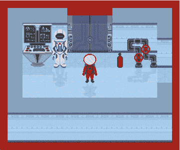
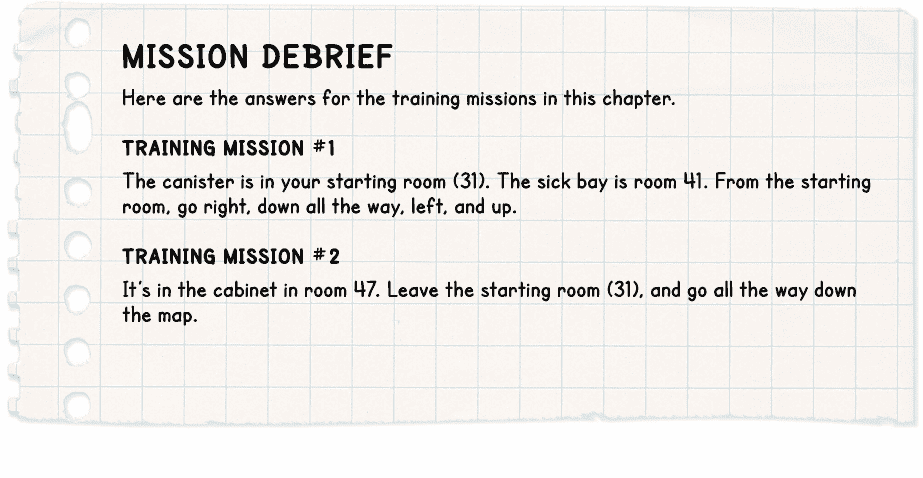

## 第九章：拆包你的个人物品**


现在空间站已经投入使用，是时候开始拆包你的个人物品以及你在执行任务时需要的各种工具和设备了。

在本章中，你将编写代码来处理可以在房间之间移动的物体（*道具*）。当你玩游戏时，你可以发现新物品，捡起它们，移动它们，并用它们解决谜题。

### **添加道具信息**

你在第五章中已经添加了一些关于道具的信息，当时你将图片文件名和描述添加到 `objects` 字典中。`objects` 字典包含关于物品的*是什么*的信息。在这一章中，我们将添加信息，告诉游戏*道具放在哪里*。

你可能会想，为什么我们要将道具和景物分开处理。我们这样做是因为它们的信息以不同的方式使用：`scenery` 字典使用房间作为键来存储信息。这是有道理的，因为程序需要一次性获取房间内所有景物的信息。在将景物信息添加到房间地图之后，`scenery` 字典不再需要，直到玩家进入新的房间。

相比之下，道具是会移动的，所以在任何时候，任何房间中可能都需要用到道具的信息。如果这些信息埋藏在一长串景物项中，它就更难以查找和修改。

我们将创建一个新的字典，叫做 `props`，来存储关于道具的信息。我们将使用物品编号作为键，每一项将是一个包含以下内容的列表：

+   道具所在的房间编号

+   道具在房间中的 *y* 位置（以瓦片为单位）

+   道具在房间中的 *x* 位置（以瓦片为单位）

例如，以下是锤子的条目，它是物品 65：

```py
65: [50, 1, 7]
```

它在房间 50，*y* 位置 1 和 *x* 位置 7。

不在游戏世界中或由玩家携带的物品的房间编号为 0，这不是游戏中的真实位置。例如，一些物品在它们被创建之前，或者在被销毁之后才会出现在游戏世界中。这些物品会存储在房间 0。

**提示**

`props` 和 `objects` 字典使用相同的键。如果你想知道 `props` 字典中物品 65 是什么，可以在 `objects` 字典中查看它的详细信息。

清单 9-1 展示了将道具信息添加到游戏中的代码。打开 *listing8-10.py*，这是你在上一章的最终程序。将新的 `PROPS` 部分添加到 `show_text()` 函数之后，`DISPLAY` 部分和 `START` 部分之前。只添加新行，并将新程序保存为 *listing9-1.py*。如果你不想手动输入数据，可以从 *data-chapter9.py* 文件中复制并粘贴数据。

你可以使用 `pgzrun listing9-1.py` 运行程序。它目前还不会做任何新操作，但你可以检查命令行窗口中是否有任何错误消息。

*listing9-1.py*

```py
   --snip--
       screen.draw.text(text_to_show,
                        (20, text_lines[line_number]), color=GREEN)

   ###############
   ##   PROPS   ##
   ###############
   # Props are objects that may move between rooms, appear or disappear.
   # All props must be set up here. Props not yet in the game go into room 0.
   # object number : [room, y, x]
➊ props = {
       20: [31, 0, 4], 21: [26, 0, 1], 22: [41, 0, 2], 23: [39, 0, 5],
       24: [45, 0, 2],
➋     25: [32, 0, 2], 26: [27, 12, 5], # two sides of same door
       40: [0, 8, 6], 53: [45, 1, 5], 54: [0, 0, 0], 55: [0, 0, 0],
       56: [0, 0, 0], 57: [35, 4, 6], 58: [0, 0, 0], 59: [31, 1, 7],
       60: [0, 0, 0], 61: [36, 1, 1], 62: [36, 1, 6], 63: [0, 0, 0],
       64: [27, 8, 3], 65: [50, 1, 7], 66: [39, 5, 6], 67: [46, 1, 1],
       68: [0, 0, 0], 69: [30, 3, 3], 70: [47, 1, 3],
➌     71: [0, LANDER_Y, LANDER_X], 72: [0, 0, 0], 73: [27, 4, 6],
       74: [28, 1, 11], 75: [0, 0, 0], 76: [41, 3, 5], 77: [0, 0, 0],
       78: [35, 9, 11], 79: [26, 3, 2], 80: [41, 7, 5], 81: [29, 1, 1]
       }

   checksum = 0
   for key, prop in props.items():
➍     if key != 71: # 71 is skipped because it's different each game.
           checksum += (prop[0] * key
                        + prop[1] * (key + 1)
                        + prop[2] * (key + 2))
➎ print(len(props), "props")
   assert len(props) == 37, "Expected 37 prop items"
   print("Prop checksum:", checksum)
➏ assert checksum == 61414, "Error in props data"

➐ in_my_pockets = [55]
   selected_item = 0 # the first item
   item_carrying = in_my_pockets[selected_item]

   ###############
   ##   START   ##
   ###############
   --snip--
```

*清单 9-1：向 Escape 中添加道具信息*

我们通过创建一个字典来存储道具信息，开始新的`PROPS`部分➊。这个字典列出了所有道具的位置，从一些门（20 到 24 号）开始，包括一艘救援船（40 号）和从 53 号开始的可携带物品。

有一个小问题需要注意。我们将门算作道具而不是场景，因为门并非总是存在：当它们打开时，会从房间中移除。大多数门在打开时会一直保持打开状态，直到游戏结束。然而，连接 27 号房间和 32 号房间的门也可以关闭，这意味着玩家可以从两边看到它。因此，我们需要两个道具来表示这扇门➋，分别显示在 27 号房间的顶部和 32 号房间的底部。这两个门的物体编号是 25 和 26。

道具 71 是贵宾犬着陆器，它在游戏开始前已迫降在行星表面。我们使用程序中`VARIABLES`部分的`LANDER_Y`和`LANDER_X`变量➌来定位着陆器，因为它的位置在每局游戏中都会变化。贵宾犬着陆时撞击力极大，它可能已经被火星土壤覆盖。它会一直待在 0 号房间，直到玩家能够将它挖出来。

与场景信息类似（见第六章），我在这里使用了校验和来帮助你检查输入数据时是否有错误。如果这里出错，可能无法将游戏进行到底。唯一没有参与校验和计算的是编号 71 的道具，因为它的位置在每个游戏中使用不同的随机数➍。

如果你想更改道具数据，最简单的方法是像这样注释掉两个校验和指令➏，以关闭它们：

```py
#assert len(props) == 37, "Expected 37 prop items"
#assert checksum == 61414, "Error in props data"
```

程序会在命令行窗口显示校验和总数和数据项数量➎，因此如果你更改了道具数据，可以利用这些信息来更新两个`assert`指令中的数字，以确保它们与你自定义的数据一致。如果你这么做，可以继续使用这些行，而不是将其注释掉。

程序还设置了两个新的变量和一个稍后在本章中需要的列表。`in_my_pockets` ➐ 列表存储玩家拾取的所有物品，也就是他们的*库存*。这些物品中总有一个被选中，以便玩家准备对其进行操作。`selected_item`变量存储该物品在`in_my_pockets`列表中的索引号。`item_carrying`变量存储玩家选中的物品的物体编号。你可以将`item_carrying`变量理解为玩家手中的物体编号。稍后我会在本章中详细讲解这些变量。

### **向房间地图添加道具**

我们已经添加了有关道具位置的信息，接下来让我们显示道具。当道具位于当前房间时，它们会在玩家进入房间时被放入`room_map`列表中。然后，`draw()`函数使用该列表来绘制房间。

我们将把添加道具到房间地图的指令放入程序的`MAKE MAP`部分，位于`generate_map()`函数内。我们只需要将这些指令添加在你在第八章中为计算`top_left_x`和`top_left_y`变量所添加的指令之后，就在`GAME LOOP`部分的开始之前。

因为新指令都是`generate_map()`函数的一部分，所以你需要将它们缩进至少四个空格。

将列表 9-2 中的新指令添加到程序中，并将其保存为*listing9-2.py*。运行程序时使用命令`pgzrun listing9-2.py`。你应该能看到一些新的物体出现在某些房间中，如图 9-1 所示。



*图 9-1：刚才那扇门好像不见了！不过那个气瓶可能会派上用场。*

*listing9-2.py*

```py
   --snip--
       top_left_x = center_x - 0.5 * room_pixel_width 
       top_left_y = (center_y - 0.5 * room_pixel_height) + 110

➊     for prop_number, prop_info in props.items():
➋         prop_room = prop_info[0]
           prop_y = prop_info[1]
           prop_x = prop_info[2]
➌         if (prop_room == current_room and
➍             room_map[prop_y][prop_x] in [0, 39, 2]):
➎                 room_map[prop_y][prop_x] = prop_number
➏                 image_here = objects[prop_number][0]
                   image_width = image_here.get_width()
                   image_width_in_tiles = int(image_width / TILE_SIZE)
➐                 for tile_number in range(1, image_width_in_tiles):
                       room_map[prop_y][prop_x + tile_number] = 255

   ###############
   ## GAME LOOP ##
   ###############
   --snip--
```

*列表 9-2：将道具添加到当前房间的房间地图中*

在新代码中，我们首先设置了一个循环，遍历`props`字典中的条目➊。对于每个条目，字典的键存入变量`prop_number`，而包含位置信息的列表存入`prop_info`列表中。

为了让程序更易于阅读，我设置了一些变量来存储`prop_info`列表中的信息➋。程序提取房间编号的信息（并将其存入`prop_room`）以及*y*和*x*位置（分别存入`prop_y`和`prop_x`变量）。

我们添加了一个检查，查看`prop_room`是否与玩家所在的房间匹配➌，以及道具是否放置在地板上➍。地板检查会将三种不同的地面类型放入一个列表中（0 表示室内，2 表示土壤，39 表示房间 26 中的压力垫）。程序检查道具的位置，以查看该位置在房间地图中的内容。如果是这些地面类型之一，意味着物体正坐落在地板上，完全可见。如果不是，那么道具被隐藏在景物中，暂时不可见。例如，如果道具位置上有一个柜子而不是地板，那么道具将不会显示在屏幕上。不过，玩家仍然可以通过检查该位置的柜子来找到道具。

如果道具在房间内并且在地板上，房间地图将更新道具编号➎。

有些道具，比如门，比一个方块宽。因此，我们会将数字 255 添加到道具覆盖的除第一个方块以外的所有方块上➐。这与我们在`generate_map()`函数中标记宽大景物的代码类似（见列表 6-4 在第 106 页）。

**从函数获取信息：掷骰子**

在第八章中，你学习了如何将信息（或*参数*）传递给函数。让我们更仔细地看看如何从函数中获取信息*返回*。我们将使用这个技巧来创建一个函数，告诉我们玩家站在什么物体上。

示例 9-3 展示了一个简单的程序，它从函数返回一个数字并将其放入一个变量中。这不是*Escape*游戏的一部分，所以请首先通过点击**文件** ▸ **新建**来创建一个新文件。

将程序保存为*listing9-3.py*。这个程序不使用 Pygame Zero，因此你可以通过点击**运行** ▸ **运行模块**来在脚本窗口中运行它。该程序模拟了一个 10 面骰子。

*listing9-3.py*

```py
➊ import random

➋ def get_number():
➌     die_number = random.randint(1, 10)
➍     return die_number

➎ random_number = get_number()
➏ print(random_number)
```

*示例 9-3：一个 10 面骰子模拟器演示了如何从函数返回一个数字。*

该程序首先告诉 Python 使用`random`模块 ➊，这个模块为 Python 提供了用于随机选择的新函数。然后我们创建了一个名为`get_number()`的新函数 ➋，它生成一个 1 到 10 之间的随机数 ➌，并将结果放入名为`dice_number`的变量中。

通常，当你调用一个函数时（在 Python 术语中称为*调用*函数），你会使用其名称，像这样：

```py
get_number()
```

这一次，我们不仅调用了函数，而且告诉 Python 将函数的结果放入一个名为`random_number`的变量中 ➎。当函数通过`return`命令 ➍返回结果时，结果就会进入`random_number`变量。程序的主部分随后可以打印出它的值 ➏。

这段代码展示了从函数中获取信息的方法：当函数开始时，设置一个变量来存储信息 ➎，并在函数结束时通过`return`指令将信息返回 ➍。你也可以返回字符串和列表，而不仅仅是数字。尽可能地，这种方式是使程序的其他部分能够使用来自函数的信息的最佳方法。这种技巧使得程序的主部分能够从函数的局部变量（在这个例子中是`dice_number`）中获取信息，而这个变量通常只在函数内部可见。

你不会再需要这个程序了，所以在你完成实验后，可以将它关闭。

### **从房间地图中查找物体编号**

稍后，我们将添加代码，允许你在空间站中捡起物体。首先，我们需要一种方法来找出哪个物体被捡起了。

当玩家与景物或道具互动时，我们需要找到他们正在使用的物体的编号。通常，这很简单。如果房间地图显示玩家所在位置的道具编号是 65，那就是一把锤子。程序可以显示锤子的描述，并允许玩家捡起或使用它。

确定物体编号对于跨越多个瓷砖的宽大物体来说比较棘手。我们使用数字 255 来标记被宽物体覆盖的瓷砖，但该数字并不对应于道具。程序需要通过在房间地图中向左移动，直到找到一个不为 255 的数字，从而计算出真实的物体编号。

例如，如果玩家检查门的最右侧第三部分，程序会看到该位置包含 255，因此会检查左边的位置。该位置也包含 255，所以程序会继续检查更左边的位置。如果该位置包含其他数字而不是 255，程序就知道它找到了真实的物体编号，举例来说，可能是 20（其中一个门）。使用物体编号 20，程序随后可以让玩家检查或打开这扇门。

我们将创建两个函数来计算物体编号，如 Listing 9-4 所示。你需要将这些添加到 Listing 9-2，因此如果需要，请点击**文件** ▸ **打开**再次打开*listing9-2.py*。我们将开始一个新的程序部分，称为`PROP INTERACTIONS`。将其放在`PROPS`部分后面。这个新部分将用于编写拾取和丢弃道具的代码。

将更新后的程序保存为*listing9-4.py*。它现在还不会做任何新功能，但你可以使用 pgzrun listing9-4.py 运行它，检查是否没有添加错误。在命令行窗口中查找任何错误信息。

*listing9-4.py*

```py
   --snip--
   in_my_pockets = [55]
   selected_item = 0 # the first item
   item_carrying = in_my_pockets[selected_item]

   #######################
   ## PROP INTERACTIONS ##
   #######################

➊ def find_object_start_x():
➋     checker_x = player_x
➌     while room_map[player_y][checker_x] == 255:
➍         checker_x -= 1
➎     return checker_x

➏ def get_item_under_player():
➐     item_x = find_object_start_x()
➑     item_player_is_on = room_map[player_y][item_x]
➒     return item_player_is_on

   --snip--
```

*Listing 9-4：查找真实物体编号*

在我们讲解这个代码如何工作的之前，我将解释一下游戏循环是如何让玩家与道具和场景进行交互的：

1.  当玩家按下移动键时，程序会改变玩家的位置（即使这会将他们移到不可能的位置，比如墙内）。

1.  程序通过使用玩家当前位置的物体来执行玩家要求的任何操作。这意味着玩家和物体此时位于房间中的同一位置。

1.  如果玩家站在一个不允许站的位置（例如在墙内），程序会将他们移回原来的位置。

整个过程发生得非常快，你甚至看不到玩家进入墙壁或其他场景物体的过程。这样，玩家可以通过按下移动键和动作键来检查或使用场景物体。例如，你可以走到墙壁前，按下空格键来检查墙壁，并查看它的描述。这个过程也适用于玩家站立的物体，比如地上的道具。

我们在 Listing 9-4 中添加的第一个新函数是`find_object_start_x()` ➊。这个函数通过向左移动来找到玩家当前位置的物体的起始位置，如果位置包含 255，则继续向左查找直到找到真实的物体编号。

为此，函数将变量`checker_x`设置为与玩家的* x *位置相同 ➋。我们使用一个循环，只要房间地图中`checker_x`的* x *位置和玩家的* y *位置包含 255，循环就会继续。在该循环内部，有一条指令将`checker_x`减少 1 ➍，使其向左移动 1 个瓦片。当循环结束时，`checker_x`包含物品开始的左侧位置。然后，该数字会返回 ➎ 给启动该函数的指令。

第二个新函数是`get_item_under_player()` ➏，它计算玩家当前位置的物品是什么。它使用第一个函数来查找物品开始的位置，并将* x *位置存储在变量`item_x`中 ➐。然后，它查看该位置的房间地图数据，以确定那里是什么物品 ➑，并将该编号返回给启动该函数的指令 ➒。

### **捡起物品**

现在这些函数已经到位，我们可以创建几个函数来捡起物品，并将它们存入玩家的背包中。接着，我们将添加一些键盘控制。

#### **捡起道具**

将列表 9-5 中显示的两个函数添加到程序中`PROP INTERACTIONS`部分的末尾，紧跟在你在列表 9-4 中添加的代码之后。

将此程序保存为*listing9-5.py*。你可以通过使用 pgzrun listing9-5.py 运行程序来检查是否有任何错误，但目前你不会看到任何变化。此代码添加了一些新函数，但不包括任何键控来启用玩家使用它们。

*listing9-5.py*

```py
   --snip--
       item_player_is_on = room_map[player_y][item_x]
       return item_player_is_on

   def pick_up_object():
       global room_map
➊     item_player_is_on = get_item_under_player()
➋     if item_player_is_on in items_player_may_carry:
➌         room_map[player_y][player_x] = get_floor_type()
➍         add_object(item_player_is_on)
           show_text("Now carrying " + objects[item_player_is_on][3], 0)
           sounds.pickup.play()
           time.sleep(0.5)
➎     else:
           show_text("You can't carry that!", 0)

➏ def add_object(item): # Adds item to inventory.
       global selected_item, item_carrying
➐     in_my_pockets.append(item)
➑     item_carrying = item
➒     selected_item = len(in_my_pockets) - 1
       display_inventory()
➓     props[item][0] = 0 # Carried objects go into room 0 (off the map).

   def display_inventory():
       print(in_my_pockets)
   --snip--
```

*列表 9-5：添加捡起物品的函数*

函数`pick_up_object()`将在玩家按下*获取*键（G）时开始执行，来捡起物品。它首先将玩家位置上物品的编号存入变量`item_player_is_on` ➊。若该物品可以携带 ➋，其余的代码将执行捡起操作。

为了从地板上移除物品，程序会将玩家位置的房间地图替换为地面（土壤或地板砖）的物品编号 ➌。`get_floor_type()`函数用于查找该房间中地面的类型。当房间重新绘制时，物品将从地板上消失，看起来像是被捡起来了。然后，物品会通过`add_object()`函数被添加到玩家携带的物品列表中 ➍。

然后，我们在屏幕上显示一条信息，告诉玩家他们捡起了一个物品，并播放一个音效。我们使用`time.sleep(0.5)`指令添加了半秒的短暂延迟，以确保确认信息不会在玩家长按按键时被覆盖。

如果物品不能被携带，我们会显示一条信息，告诉玩家他们无法携带它 ➎。例如，风景物品是无法携带的，我们需要告诉玩家这一点。否则，他们可能会认为按错了键或程序没有正常工作。

`add_object()`函数将物品添加到`in_my_pockets`列表中，这个列表存储了玩家携带的物品（他们的背包）。函数开始时，传入的物品编号被赋值给局部变量`item` ➏。物品通过`append()`方法被添加到`in_my_pockets_list`的末尾 ➐。

我们使用全局变量`item_carrying`来存储玩家手中物品的对象编号，所以它被设置为这个物品的对象编号 ➑。我们将`selected_item`变量设置为列表中的最后一个物品，也就是说，玩家刚刚捡起的物品被选中 ➒。这些变量将在后续使用物品时非常重要，尤其是在`display_inventory()`函数显示物品列表时。现在，这个函数只会在命令行窗口中打印出物品列表。

最后，我们将物品在`props`字典中的位置设置为房间 0 ➓。这意味着刚捡起的物品在游戏地图中不会显示。如果我们不这么做，物品将在玩家下次进入房间时重新出现在房间内。

#### **添加键盘控制**

为了让新功能发挥作用，我们还需要添加键盘控制。我们将使用 G 键作为获取键。

将新的指令，见于清单 9-6，放入程序中`GAME LOOP`部分的`game_loop()`函数中。新指令应该在退出检查完成后，并在玩家被移动回他们不该站立的位置之前添加。

*listing9-6.py*

```py
   --snip--
           player_frame = 0
           start_room()
           return 

➊     if keyboard.g:
➋         pick_up_object()

     # If the player is standing somewhere they shouldn't, move them back.
       if room_map[player_y][player_x] not in items_player_may_stand_on: #\ 
       #           or hazard_map[player_y][player_x] != 0:
   --snip--
```

*清单 9-6：添加键盘控制*

你需要将第一条新指令缩进四个空格 ➊，因为它在`game_loop()`函数内。第二条指令需要再缩进四个空格 ➋，因为它属于上面那个`if`指令。这些指令在玩家按下 G 键时运行`pick_up_object()`函数 ➋ ➊。

将清单保存为*listing9-6.py*。当你运行`pgzrun listing9-6.py`时，你应该能够捡起物品。

从第一个房间的空气罐开始测试。只需走到它上面并按下 G 键。你会听到声音并看到消息，物品会从房间中消失。

每次你捡起物品时，命令行窗口（你输入`pgzrun`指令的地方）也会显示物品清单，像这样：

```py
[55, 59]
```

每次你都会看到一个新物品被添加到列表末尾。游戏开始时，物品 55，溜溜球，就在你的口袋里。

### **添加背包功能**

现在，你可以捡起你在太空站周围找到的道具。我们应该添加一个简单的方法来查看你携带的物品，并选择不同的物品来使用。我们将创建一个新的`display_inventory()`函数，在游戏窗口顶部显示一个条形区域，显示玩家正在携带的物品。

接下来，我们将添加控件，以便玩家可以按 TAB 键选择列表中的下一个项。选中的项周围会画一个框，并在下方显示其描述。图 9-2 展示了它的样子。


*图 9-2：* 游戏窗口顶部的物品栏

#### **显示物品栏**

Listing 9-7 展示了需要添加的代码。Listing 9-5 中包含了部分`display_inventory()`函数的代码。请将其替换为新代码。将此列表保存为*listing9-7.py*。当你使用 pgzrun 运行 listing9-7.py 程序时，你将能够在屏幕顶部看到收集到的物品添加到物品栏中。

*listing9-7.py*

```py
   --snip--
       selected_item = len(in_my_pockets) - 1     
       display_inventory()
       props[item][0] = 0 # Carried objects go into room 0 (off the map).

   def display_inventory():
➊     box = Rect((0, 45), (800, 105))
       screen.draw.filled_rect(box, BLACK)

➋     if len(in_my_pockets) == 0:
           return

➌     start_display = (selected_item // 16) * 16
➍     list_to_show = in_my_pockets[start_display : start_display + 16]
➎     selected_marker = selected_item % 16

➏     for item_counter in range(len(list_to_show)):
           item_number = list_to_show[item_counter]
           image = objects[item_number][0]
➐         screen.blit(image, (25 + (46 * item_counter), 90))

       box_left = (selected_marker * 46) - 3
➑     box = Rect((22 + box_left, 85), (40, 40))
       screen.draw.rect(box, WHITE)
       item_highlighted = in_my_pockets[selected_item]
       description = objects[item_highlighted][2]
➒     screen.draw.text(description, (20, 130), color="white")

   ###############
   ##   START   ##
   ###############

   clock.schedule_interval(game_loop, 0.03)
   generate_map()
   clock.schedule_interval(adjust_wall_transparency, 0.05)
➓ clock.schedule_unique(display_inventory, 1)
```

*Listing 9-7：显示物品栏*

新的`display_inventory()`函数首先会在物品栏区域绘制一个黑色框，清除原有内容➊。如果玩家没有携带任何物品，函数会直接返回，不进行任何操作，因为没有物品需要显示➋。

屏幕上只能显示 16 个物品，但玩家可能携带更多物品。如果`in_my_pockets`列表太长，无法在屏幕上完全显示，程序会一次显示 16 个物品。玩家可以按 TAB 键选择屏幕上显示的任意物品，按从左到右的顺序移动。如果选中了最后一个物品并按下 TAB 键，则会显示列表的下一个部分。如果玩家在列表中的最后一项按下 TAB 键，列表的开头会再次出现。

我们将当前显示在屏幕上的`in_my_pockets`列表部分存储在另一个名为`list_to_show`的列表中，并使用循环来显示它➏。该循环将数字放入一个名为`item_counter`的变量中，`item_counter`用于每次提取正确的图像并确定绘制位置➐。

精妙之处在于确定哪些项应该放入`list_to_show`。在`start_display`变量中，我们存储了`in_my_pockets`中程序应绘制的第一个项的索引号➌。`//`运算符将选中的项编号除以 16 并向下取整。然后，将结果乘以 16 以获得批次中第一个项的索引号。例如，如果选中的项是编号 9，你会将 9 除以 16（得到 0.5625），向下取整（得到 0），然后乘以 16（仍然是 0），得到结果 0。这样就得到了列表的起始位置，这很有道理，因为我们知道屏幕上有 16 个位置，而 9 小于 16。如果你想查看包含第 22 项的项目组，你会将 22 除以 16（得到 1.375），向下取整（得到 1），然后乘以 16，得到结果 16。那就是下一个批次的起始位置，因为第一个批次的索引号范围是从 0 到 15。

我们使用一种叫做*列表切片*的技巧创建了`list_to_show`列表，这其实只是使用列表的一部分。当你给 Python 两个列表索引并用冒号分隔时，程序会切出那部分列表。我们使用的这一部分从`start_display`索引开始，15 个元素后结束 ➍。列表切片会省略最后一个元素，所以我们使用`start_display + 16`作为结束点。

我们还需要另一个计算来确定从新列表中要突出显示的选中项 ➎。该物品的索引值介于 0 和 15 之间，我们将其存储在`selected_marker`中。我们通过将选中物品的编号除以 16 后的余数来计算它。例如，如果选中的物品编号是 18，当显示第二组物品时，它将位于索引 2 处。（记住，第一项的索引是 0。）Python 有一个取余运算符 `%`，可以用来获取除法后的余数。

为了在屏幕上突出显示选中的项，我们用一个位于其左边缘的矩形框将其框起来 ➑。与您之前看到的填充矩形不同（例如 ➊），这个指令绘制了一个边框为白色的空心框。

被选中项的描述会显示在库存下方 ➒，这样玩家就可以通过 TAB 键浏览他们的物品，重新查看描述。

最后，当程序第一次运行时，它需要显示库存。这是通过略微延迟 ➓来调度的，以避免在 Pygame Zero 启动完成之前尝试使用`screen.blit()`指令时可能出现的问题。`clock.schedule_interval()`用于定期运行一个函数，而`clock.schedule_unique()`则用于在延迟后只运行一次一个函数。

#### **添加 TAB 键盘控制**

当你运行程序时，你可以看到库存，但你还没有办法在物品间切换，所以最新的物品始终被选中。我们来添加一个键盘控制，允许你通过 TAB 键在库存中选择不同的物品。

将 Listing 9-8 中的新指令放入`game_loop()`函数中，紧接在你在 Listing 9-6 中添加键盘控制以获取物品之后。你需要至少缩进四个空格，因为它们是在`game_loop()`函数内部。

将这个列表保存为 *listing9-8.py*。当你使用`pgzrun listing9-8.py`运行程序时，你将能够按 TAB 键在库存中选择不同的物品。（TAB 键通常位于键盘的左侧，可能上面有两个箭头的图标。）

在测试新的键盘控制之前，先捡起一些物品，或者跳到下一节以填充更多物品，供测试使用。

*listing9-8.py*

```py
   --snip--
       if keyboard.g:
           pick_up_object()

➊     if keyboard.tab and len(in_my_pockets) > 0:
➋         selected_item += 1
➌         if selected_item > len(in_my_pockets) - 1:
               selected_item = 0
➍         item_carrying = in_my_pockets[selected_item]
➎         display_inventory()

➏     if keyboard.d and item_carrying:
➐         drop_object(old_player_y, old_player_x)

➑     if keyboard.space:
➒         examine_object()
   --snip--
```

*Listing 9-8: 启用 TAB 键选择库存中的物品*

第一段指令在玩家按下 TAB 键时运行，但仅当`in_my_pockets`列表包含一些物品（即其长度大于 0）时 ➊。

要选择背包中的下一个物品，我们在按下 TAB 键时将`selected_item`变量加 1 ➋。这个变量存储一个索引号（从 0 开始），所以程序会从列表的长度中减去 1，检查`selected_item`是否已经超出了列表的末尾 ➌。如果超出，选中的物品会重新设置为第一个物品，即 0。

我们将变量`item_carrying`设置为选中物品的对象编号（从`in_my_pockets`列表中获取）➍。例如，如果`in_my_pockets`列表包含对象编号 55 和 65，而`selected_item`为 0，`item_carrying`将包含 55（`in_my_pockets`中的第一个物品）。最后，背包通过你之前创建的`display_``inventory()`函数来显示 ➎。

在我们处理这部分程序时，我们还添加了键盘控制来丢弃和检查物品。当玩家按下 D 键且`item_carrying`变量不为`False`时，`drop_object()`函数会执行 ➏。此函数会将玩家之前的 *y* 和 *x* 位置作为丢弃物品的位置 ➐。请记住，玩家当前的位置可能处于墙内，因为我们处于游戏循环的某个阶段。我们知道他们在移动前的最后一个位置是一个安全的地方，可以丢下物品。

我们还添加了当按下空格键时启动`examine_object()`函数的指令 ➒。

还不要在游戏中按 D 或空格键：按下它们会导致程序崩溃，因为我们还没有添加相应的函数。我们会很快添加这些函数。

#### **测试背包**

我们想要正确地测试程序，但目前你的背包里物品不多。为了节省时间，我们将调整代码，给你一个更完整的背包，这样你就可以测试显示和 TAB 控件。

我们将在游戏开始时填充`in_my_pockets`列表。最快的方法是更改程序中`PROPS`部分设置该列表的指令，如下所示（但不要现在就这么做！）：

```py
in_my_pockets = items_player_may_carry
```

这意味着你开始游戏时会携带所有可以携带的物品。不过，如果你这么做，可能会影响你玩游戏的乐趣。你将携带一些你可能希望稍后才看到的物品，这会使得一些谜题的解法变得很明显。

相反，我建议你创建一个这样的测试列表：

```py
in_my_pockets = [55, 59, 61, 64, 65, 66, 67] * 3
```

这一行创建了一个列表，包含该物品序列三次。你最终会得到一个背包，里面每个物品都有三个（这在真实的游戏中是不可能的），但它能让你测试当背包中有超过 16 个物品时，是否能够正常工作。

测试完成后，请将代码改回原样。否则，在玩游戏时你可能会遇到意外的结果。以下是该行代码应该呈现的样子：

```py
in_my_pockets = [55]
```

### **丢弃物品**

能够收集散落在空间站各处的物品非常有趣，但有时你会想把它们放下，以便你可以使用它们或将其放在某个地方。我们需要两个新函数来丢放物品，它们的工作方式有点像拾取物品函数的反向操作。

`drop_object()` 函数（`pick_up_object()` 函数的反向操作）将允许你将物品丢放到玩家最近站立的位置。你已经在 Listing 9-8 中为此功能添加了键盘控制。

`remove_object()` 函数类似于 `add_object()` 函数的反向操作：它从库存中取出物品并更新库存。

将新的函数添加到程序的 `PROP INTERACTIONS` 部分的末尾，如 Listing 9-9 中所示。将新程序保存为 *listing9-9.py*。

当你运行程序并使用 `pgzrun listing9-9.py` 时，你将能够丢放物品。包括你在游戏开始时携带的悠悠球以及你在探索空间站时捡到的任何新物品。

*listing9-9.py*

```py
   --snip--
       description = objects[item_highlighted][2]
       screen.draw.text(description, (20, 130), color="white")

➊ def drop_object(old_y, old_x):
       global room_map, props
➋     if room_map[old_y][old_x] in [0, 2, 39]: # places you can drop things
➌         props[item_carrying][0] = current_room
           props[item_carrying][1] = old_y
           props[item_carrying][2] = old_x
➍         room_map[old_y][old_x] = item_carrying
           show_text("You have dropped " + objects[item_carrying][3], 0)
           sounds.drop.play()
➎         remove_object(item_carrying)
           time.sleep(0.5)
➏     else: # This only happens if there is already a prop here
           show_text("You can't drop that there.", 0)
           time.sleep(0.5)

   def remove_object(item): # Takes item out of inventory
       global selected_item, in_my_pockets, item_carrying
➐     in_my_pockets.remove(item)
➑     selected_item = selected_item - 1
➒     if selected_item < 0:
           selected_item = 0
➓     if len(in_my_pockets) == 0: # If they're not carrying anything
           item_carrying = False # Set item_carrying to False
       else: # Otherwise set it to the new selected item
           item_carrying = in_my_pockets[selected_item]
       display_inventory()

   ###############
   ##   START   ##
   ###############
   --snip--
```

*Listing 9-9: 添加丢放物品的函数*

`drop_object()` 函数需要两项信息：玩家的旧 *y* 和 *x* 位置。如果玩家这次通过 `game_loop()` 函数移动过，那么这些就是玩家尝试移动之前所在的位置。如果没有，这些数字将与玩家当前所在的位置相同。我们知道这是一个合理的放置物品的位置，不会把物品放到墙内。玩家的旧位置会存储在函数中的 `old_y` 和 `old_x` 变量中 ➊。

程序会检查玩家旧位置的房间地图是否属于地面类型。如果是，那么就可以在这里丢下物品，接着会使用丢放指令。如果不是 ➏，玩家会看到一条消息，告诉他们不能在该位置丢放物品。例如，如果该位置已有物品，则会出现这种情况。

如果玩家可以丢下物品，我们需要更新 `props` 字典。变量 `item_carrying` 包含玩家正在携带的物品的编号。它在 `props` 字典中的条目是一个列表。列表的第一个元素（索引 0）是物品所在的房间，第二个元素（索引 1）是物品的 *y* 位置，第三个元素是物品的 *x* 位置（索引 2）。这些值将被设置为当前房间和玩家的旧位置 ➌。

当前房间的房间地图也需要更新，以便房间中包含丢放的物品 ➍。游戏会显示一条消息并播放声音，告诉玩家他们已经成功丢放了物品，然后物品会通过 `remove_object()` 函数从库存中移除 ➎。

`remove_object()` 函数从玩家的物品栏中移除一个物品，并更新 `selected_item` 变量。传递给这个函数的物体编号存储在 `item` 变量中，然后 `remove()` ➐ 将它从 `in_my_pockets` 列表中移除。现在，选定的物品已被移除，选定物品的数量减少 1 ➑，因此列表中的前一个物品会被选中。如果这意味着选定的物品数量小于 0，则选定物品会重置为 0 ➒。如果玩家从物品栏中丢掉第一个物品，就会发生这种情况。

如果玩家的手现在是空的，`item_carrying` 变量会被设置为 `False` ➓。否则，它会设置为玩家所选物品的编号。最后，`display_inventory()` 会重新绘制物品栏，显示物品已经被移除。

**训练任务 #1**

现在是进行安全演练的时候了。你能把气瓶拿起来并送到医务室吗？将它放在中间的床附近。为了测试程序是否正常工作，交付后离开房间，再回来确认它还在那里。

### **检查物体**

当你探索太空站时，你会想要仔细研究物体，看看它们如何帮助完成任务。*examine* 指令会显示物体的详细描述，并适用于场景和道具。通过检查物体，你有时也能发现其他物体。例如，当你检查一个橱柜时，你可能会发现橱柜里有东西。

按下空格键触发 `examine_object()` 函数。（你在 Listing 9-8 中添加了键盘控制。）将这个新函数，如 Listing 9-10 所示，放在你在 Listing 9-9 中添加的 `remove_object()` 函数之后。

将你的程序保存为 *listing9-10.py*。使用 `pgzrun listing9-10.py` 运行程序。现在你可以通过走到物体旁边或站在物体上并按下空格键来检查物体。例如，当你站在房间后面的墙边时，如果按上箭头键和空格键，你就可以检查墙壁。

*listing9-10.py*

```py
   --snip--
           item_carrying = in_my_pockets[selected_item]
       display_inventory()

   def examine_object():
➊     item_player_is_on = get_item_under_player()
➋     left_tile_of_item = find_object_start_x()
➌     if item_player_is_on in [0, 2]: # don't describe the floor
           return
➍     description = "You see: " + objects[item_player_is_on][2]
➎     for prop_number, details in props.items():
           # props = object number: [room number, y, x]
➏         if details[0] == current_room: # if prop is in the room
               # If prop is hidden (= at player's location but not on map)
               if (details[1] == player_y
                   and details[2] == left_tile_of_item
                   and room_map[details[1]][details[2]] != prop_number):
➐                 add_object(prop_number)
➑                 description = "You found " + objects[prop_number][3]
                   sounds.combine.play()
➒     show_text(description, 0)
➓     time.sleep(0.5)

   ###############
   ##   START   ##
   ###############
   --snip--
```

*Listing 9-10: 添加代码以检查物体*

清单 9-10 基于你在本章中已经完成的添加函数的工作。我们首先获取玩家想要检查的物品的编号，并将其存储在`item_player_is_on` ➊中。在`game_loop()`函数的这一部分，玩家的位置将会在他们想要检查的物品上，或者可能是在物品内，如果它是一个景物。我们将物品的起始*x*位置放入变量`left_tile_of_item` ➋中。如果玩家当前位置没有物品可以检查，函数将结束而不执行任何进一步的操作 ➌。忽略一个空白区域比描述地板要自然，尤其是在你操作失误的情况下。如果玩家的位置有物品，物品的描述将存入`description`变量中，取自`objects`字典中的长描述 ➍。

程序接着检查玩家正在检查的物品内部是否隐藏有道具。我们使用循环遍历`props`字典中的所有物品 ➎。如果一个物品位于玩家所在房间的当前位置，但房间地图在该位置上没有包含道具编号 ➏，则说明该物品被隐藏。因此，我们将隐藏的物品添加到玩家的背包中 ➐，并给玩家一个消息，告诉他们发现了什么。这个消息使用物品的简短描述，告诉玩家他们找到了什么 ➑。

在函数的末尾，显示了描述 ➒，我们在这里加入了一个短暂的暂停，以防玩家按住键时描述立即被覆盖 ➓。

如果你希望在自己的游戏设计中将道具隐藏在景物内，确保给玩家一个明确的提示，告诉他们哪里有隐藏的物品。在*Escape*中，你可能会在橱柜里找到物品。如果你发现某些东西不寻常，通常建议检查它以了解更多信息，你也许会找到一些其他有趣的东西。不过，你不需要检查每一把椅子、床和墙面板。

如果你决定将道具隐藏在宽敞的景物中（例如床上），确保将道具隐藏在景物的*x*位置，而不是隐藏在房间地图上被 255 覆盖的空间中。

**训练任务 #2**

你能找到 MP3 播放器吗？它在你在第四章中命名为`FRIEND2`的人的卧室里。如果你使用的是我的代码，它就在 Leo 的卧室里。

现在所有道具都已经拆开，你可以放松地玩你的溜溜球，看看还能发现什么。在下一章中，你将向程序中添加一个新部分，使你能够使用遇到的道具。

### **你准备好飞行了吗？**

勾选以下框以确认你已经学会了本章的关键内容。

  道具位置的信息存储在`props`字典中。

  道具编号是字典的键，每个条目包含一个列表，列出了房间编号以及道具的*y*和*x*位置。

  要从函数接收一个数字，在调用函数时设置一个变量来存储该信息。例如，变量名 `=` 函数名`()`。

  要从函数中返回一个数字（或其他任何内容），使用 `return` 指令。

  `//` 操作符用于除法，并将结果向下舍入，去除答案中的任何小数。

  `%` 操作符可以在除法后返回余数：`5 % 2` 结果是 `1`。

  你可以更改变量和列表的值以帮助测试程序，例如，在开始时创建一个完整的库存。记得测试后要恢复它们！

  你可以将道具隐藏在场景中，但要确保它们位于场景开始的位置，并给玩家一个强烈的提示，告诉他们在哪些地方值得寻找。


