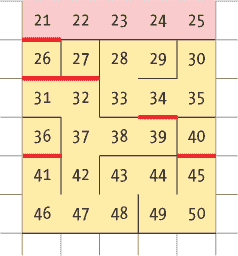
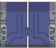
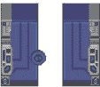
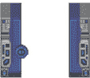
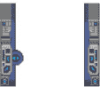
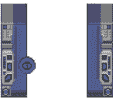
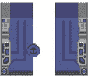
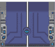
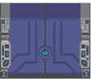
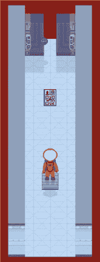

## 启动安全门**


在空间站中，门限制了对某些区域的访问，确保宇航员只能进入他们有资格工作的区域。许多门需要个人访问卡才能打开，而工程舱的门只能通过任务控制室的按钮打开。工程舱的门还带有定时器，可以自动关闭，以增强安全性。

这些门还执行安全规则，要求宇航员在进入气闸之前必须穿戴好宇航服，并且在行星表面的大门打开之前必须有一个同伴陪同。监控摄像头的录像显示，一些宇航员找到了绕过同伴要求的方法，这样他们就能独自享受在行星表面漫步的宁静。

当你安装道具时，你在空间站里安装了这些门。在本章中，你将添加开关门的代码，并增加一些其他的技巧和谜题，让游戏更加有趣。

### **规划安全门的位置**

门显然是空间站设计中至关重要的一部分，但它们对游戏设计同样重要。最明显的是，它们呈现了一个具有挑战性的谜题：玩家需要找到一种方法来打开锁住的门。

这些门也帮助我们讲述一个故事，在这个故事中，英雄必须利用他们的生存训练和逻辑思维来克服障碍。只有当玩家稍微思考一下谜题时，游戏中的解谜才会令人满意。因此，控制玩家看到不同谜题元素的时机非常重要。想象一下，你进入一个房间，另一侧的出口被熊熊火焰阻挡。如果你已经拿着灭火器，你只需拿出来并使用，根本没有挑战。更吸引人的是，你看到威胁（或谜题），然后必须想出解决办法。通过封锁地图的部分区域，我们可以引导玩家在看到解决方案之前先看到问题。我们不能确定他们会注意到我们放在他们面前的每一项内容，但我们可以给他们一个体验游戏最佳状态的机会。

门还使我们能够从地图中获得更多的价值。尽管在输入后可能感觉不到，游戏地图并不巨大。通过要求玩家多次穿越困难的房间，我们可以提供更丰富的体验和更长的游戏时长。例如，如果我们把一把钥匙放在走廊的尽头，我们可以引导玩家沿着走廊重新走一遍，并使用他们之前经过的门上的钥匙。

图 11-1 显示了游戏中门的位置。虽然不想剧透太多，玩家在进入空间站的右上角区域（通过房间 34）之前，是无法进入房间 36 的。玩家也无法在进入房间 40 之前访问房间 27。通过在锁住的房间中战略性地放置物品，包括访问卡，我们可以引导玩家进行游戏并推进故事情节。



*图 11-1：游戏地图，门用红色标出*

当你设计自己的游戏时，要仔细考虑道具的摆放位置。这是确保游戏为玩家提供愉快挑战的最重要元素之一。

### **门的位置设置**

我在 *Escape* 中将所有门的位置都设置在房间的顶部或底部出口，这是因为游戏采用了自上而下的视角。如果门设置在侧边出口，玩家只能看到门的顶部表面，我们需要确保像门这样的关键元素能够清晰可见。

大多数门都位于房间的顶部，且在玩家打开后保持开启。唯一的例外是房间 32 和房间 27 之间的门，它有一个定时器机制，会自动关闭。这一定时器带来了额外的挑战：玩家必须在门关闭前迅速从开门的开关处跑到房间。

*Escape* 中的门是对象 20 到 26。它们的图像和描述在 `objects` 字典中进行设置（参见 第 85 页 的 “制作空间站对象字典”）。门的位置在 `props` 字典中进行设置（参见 第 151 页 的 “添加道具信息”）。每扇门都有一个 *x* 坐标，它将门放置在房间的门口。要计算门的 *x* 坐标，只需将房间宽度除以 2，向下取整，然后减去 1。

现在让我们添加一些控制，允许玩家打开门。

### **添加访问控制**

为了让玩家能够打开门，我们需要在程序的 `USE OBJECTS` 部分的 `use_object()` 函数中添加一些指令。一个新的代码片段将在玩家按下某个房间内的按钮时打开通往工程区的定时门。你将在处理对象 16 和 68 的指令之间添加这段代码。

另一个新增的代码功能将使玩家能够使用访问卡打开门：将此代码放在使用配方的代码之后。

清单 11-1 显示了需要添加的新代码。因为这些指令是 `use_object()` 函数的一部分，所以第一条指令缩进了四个空格。你的新 `elif` 指令应与其上方的 `elif` 指令对齐。

打开上一章节中的*listing10-7.py*并将这些新代码行添加到其中。将程序保存为*listing11-1.py*。你可以使用 pgzrun listing11-1.py 来运行它，但我们还没有添加所有必要的代码来使门正常工作。不过，你应该不会看到任何错误消息。

*listing11-1.py*

```py
   --snip--
       elif item_player_is_on == 16:
           energy += 1
           if energy > 100:
               energy = 100
           use_message = "You munch the lettuce and get a little energy back"
           draw_energy_air()

➊     elif item_player_is_on == 42:
➋         if current_room == 27:
➌             open_door(26)
➍         props[25][0] = 0 # Door from RM32 to engineering bay
           props[26][0] = 0 # Door inside engineering bay
➎         clock.schedule_unique(shut_engineering_door, 60)
           use_message = "You press the button"
           show_text("Door to engineering bay is open for 60 seconds", 1)
           sounds.say_doors_open.play()
           sounds.doors.play()

       elif item_carrying == 68 or item_player_is_on == 68:
           energy = 100
           use_message = "You use the food to restore your energy"
           remove_object(68)
           draw_energy_air()

   --snip--

      for recipe in RECIPES:
           ingredient1 = recipe[0]
           ingredient2 = recipe[1]
   --snip--
               add_object(combination)
               sounds.combine.play()

       # {key object number: door object number}
➏     ACCESS_DICTIONARY = { 79:22, 80:23, 81:24 }
➐     if item_carrying in ACCESS_DICTIONARY:
           door_number = ACCESS_DICTIONARY[item_carrying]
➑         if props[door_number][0] == current_room:
               use_message = "You unlock the door!"
➒             sounds.say_doors_open.play()
               sounds.doors.play()
               open_door(door_number)

       show_text(use_message, 0)
       time.sleep(0.5)

   --snip--
```

*清单 11-1：添加开门功能*

打开工程舱门的按钮是物品 42。工程舱外有一个按钮提供通道，工程舱内另有一个按钮，确保玩家不会被困在里面。

如果玩家使用按钮 ➊，打开门的代码会运行。如果他们使用房间内的按钮 ➋，则会使用`open_door()`函数来展示门的打开 ➌。我们很快会添加这个函数。

`props`字典被更新，用于将门的房间号更改为 0，从而将门从房间中移除（也从游戏中移除） ➍。这个门是基于计时器工作的，所以程序会安排在 60 秒后关闭门的函数 ➎。如果你觉得在限定时间内赶到房间太困难，可以将 60 改为更大的数字。无论你使用的是 PC、Raspberry Pi 3，还是运行稍微慢一点的 Raspberry Pi 2，这个数字都应该足够给你足够的时间。

第二部分代码使玩家可以使用钥匙来打开门。我们创建了一个新的字典 `ACCESS_DICTIONARY`，该字典将门禁卡号作为键，门号作为数据 ➏。举例来说，物品 79（门禁卡）用来打开门 22。

**提示**

在*Escape*中，用于打开门的物品都是门禁卡，但如果你修改游戏，可以使用任何物品。你可以使用撬棍来撬开门，或者（如果你制作的是一个幻想世界中的游戏）使用不同的魔法咒语。只要确保玩家能够合理地猜测该使用什么物品即可。

当玩家按下 U 键时，如果他们选择了字典中用于解锁门的某个物品 ➐，并且他们站在解锁门的同一房间里 ➑，门就会打开。我们还会播放一段计算机声音效果，提示“门已打开” ➒。这只是一个录音，像游戏中的任何其他声音一样。

### **制作门的开关功能**

我们将把开门、关门和动画效果的函数放入程序的一个新部分 `DOORS`。你需要在`USE OBJECTS`部分之后、`START`部分之前添加这个新部分。

清单 11-2 展示了你需要添加的前两个函数，以启动`DOORS`部分。添加新的代码行，并将程序保存为*listing11-2.py*。`DOORS`部分仍不完整：你可以运行程序（使用 pgzrun listing11-2.py）来检查错误，但门暂时还无法正常工作。

*listing11-2.py*

```py
   --snip--
           sounds.completion.play()
           sounds.say_mission_complete.play()

   ###############
   ##   DOORS   ##
   ###############

➊ def open_door(opening_door_number):
       global door_frames, door_shadow_frames
       global door_frame_number, door_object_number
➋     door_frames = [images.door1, images.door2, images.door3,
                      images.door4, images.floor]
       # (Final frame restores shadow ready for when door reappears).
       door_shadow_frames = [images.door1_shadow, images.door2_shadow,
                             images.door3_shadow, images.door4_shadow,
                             images.door_shadow]
       door_frame_number = 0
       door_object_number = opening_door_number
➌     do_door_animation()

➍ def close_door(closing_door_number):
       global door_frames, door_shadow_frames
       global door_frame_number, door_object_number, player_y
➎     door_frames = [images.door4, images.door3, images.door2,
                      images.door1, images.door]
       door_shadow_frames = [images.door4_shadow, images.door3_shadow,
                             images.door2_shadow, images.door1_shadow,
                             images.door_shadow]
       door_frame_number = 0
       door_object_number = closing_door_number
       # If player is in same row as a door, they must be in open doorway
➏     if player_y == props[door_object_number][1]:
➐         if player_y == 0: # if in the top doorway
➑             player_y = 1 # move them down
           else:
➒             player_y = room_height - 2 # move them up
➓     do_door_animation()

   ###############
   ##   START   ##
   ###############
   --snip--
```

*清单 11-2：设置门的动画效果*

`open_door()` 和 `close_door()` 函数设置了门的开关动画。你已经在 清单 11-1 中见过 `open_door()` ➊。在 清单 11-2 中，我们定义了该函数，这样它就能在玩家使用钥匙打开门时运行。

门的动画共有五帧，编号为 0 到 4，如 表 11-1 所示。我们将动画的图片存储在一个名为 `door_frames` 的列表中 ➋➎，并将帧编号存储在变量 `door_frame_number` 中。在 `open_door()` 和 `close_door()` 函数中，我们将帧编号设置为 0，即第一帧。

在变量 `door_object_number` 中，我们存储将要开关的门的对象编号。在设置好变量和列表后，函数 `do_door_animation()` 会开始执行并使用这些数据进行动画 ➌➓。我们稍后会添加该函数。

关闭门 ➍ 的函数与开门 ➊ 的函数相似，只有两个区别：动画帧不同，并且有一个检查来防止门关上时压到玩家。

如果玩家与门的 *y* 位置相同 ➏，这意味着玩家正站在门口。如果玩家位于顶部行 ➐，我们会将其 *y* 位置设置为 1 ➑，让他移到下一行。如果玩家不在顶部行，我们会将其 *y* 位置设置为倒数第二行 ➒，也就是门的内部。

这意味着宇航员会主动跳开门的路径，但比起他们被困在门里面，这样显得更为真实！

**表 11-1：门的动画帧**

| **帧编号** | **0** | **1** | **2** | **3** | **4** |
| --- | --- | --- | --- | --- | --- |
| **开门** |  |  |  |  | **最终帧为地面砖（没有门）。** |
| **关闭** |  |  |  |  |  |

### **添加门的动画**

`do_door_animation()` 函数将管理门的开关动画。

将 `do_door_animation()` 函数放在程序的 `DOORS` 部分，紧跟着你在 清单 11-2 中添加的 `close_door()` 函数。添加 清单 11-3 中的新行，并将程序保存为 *listing11-3.py*。你可以通过运行 pgzrun listing11-3.py 来启动这个版本的游戏。现在，用钥匙打开的门应该已经能正常工作了。我会很快告诉你如何在训练任务 #1 中进行测试。

*listing11-3.py*

```py
   --snip--
               player_y = room_height - 2 # move them up
       do_door_animation()

   def do_door_animation():
       global door_frames, door_frame_number, door_object_number, objects
➊     objects[door_object_number][0] = door_frames[door_frame_number]
       objects[door_object_number][1] = door_shadow_frames[door_frame_number]
➋     door_frame_number += 1
➌     if door_frame_number == 5:
➍         if door_frames[-1] == images.floor:
➎             props[door_object_number][0] = 0 # remove door from props list
           # Regenerate room map from the props
           # to put the door in the room if required.
➏         generate_map()
➐     else:
➑         clock.schedule(do_door_animation, 0.15)

   ###############
   ##   START   ##
   ###############
   --snip--
```

*清单 11-3：添加门的动画*

`objects`字典包含了许多内容，其中之一是用于特定物体的图像。这个新函数首先通过将字典中门的图像更改为当前的动画帧 ➊ 来开始。当房间被重新绘制时，它将使用该动画帧。

然后，该函数将动画帧编号增加 1 ➋，以便下次函数运行时显示下一个动画帧。如果此时帧为 5，意味着我们已经到达动画的结尾 ➌。在这种情况下，我们检查门是否已打开（而不是关闭），通过查看最后一帧是否是地板瓷砖，表示没有门 ➍。(`-1`的索引会给你列表中的最后一项。)

如果门现在已经完全打开，物品数据会被更新，通过将门的房间编号更改为 0 ➎ 来从游戏中移除此门。如果当前动画帧是最后一帧，无论门是开还是关，都会生成一个新的房间地图 ➏，确保门在当前房间中正确地被添加或移除。

如果当前帧不是最终的动画帧 ➐，该函数将在 0.15 秒后 ➑ 重新运行，以显示序列中的下一个帧。

你可能会想，为什么我没有将两个`if`语句合并在一起 ➌➍。原因是`generate_map()`函数需要在动画结束时运行，无论门是开还是关。如果我们合并了这两个`if`语句，这个函数只会在门打开时运行。

**训练任务 #1**

在程序的这个阶段，门应该完全功能正常。你能测试它们是否正常工作吗？在社区房间找到门的门禁卡并使用它。站在社区房间里，通过选择库存中的门禁卡并按 U 键来使用它。如果你需要提示，可以查看图 11-1 中的地图。社区房间是 39 号，门禁卡在 41 号房间。记住，有时人们会把东西整理起来，钥匙可能不会明目张胆地摆在眼前。

### **关闭定时门**

接下来，我们需要添加一个新函数，名为`shut_engineering_door()`，以便在工程舱门自动关闭时使用。这个函数设置为在门打开后的 60 秒延迟后运行（参见 Listing 11-1），给玩家一分钟的时间从按钮跑到门口，门就会关闭！

将此函数放在程序的`DOORS`部分，在你刚刚添加的`do_door_animation()`函数之后。添加 Listing 11-4 中的新行，并将程序保存为*listing11-4.py*。然后使用`pgzrun listing11-4.py`运行此程序，你应该不会看到任何错误信息。定时门应该现在能正常工作，不过我稍后会向你展示一个更简单的测试方法。

*listing11-4.py*

```py
   --snip--
       else:
           clock.schedule(do_door_animation, 0.15)

   def shut_engineering_door():
       global current_room, door_room_number, props
➊     props[25][0] = 32 # Door from room 32 to the engineering bay.
➋     props[26][0] = 27 # Door inside engineering bay.
➌     generate_map() # Add door to room_map for if in affected room.
➍     if current_room == 27:
➎         close_door(26)
➏     if current_room == 32:
➐         close_door(25)
       show_text("The computer tells you the doors are closed.", 1)
       sounds.say_doors_closed.play()

   ###############
   ##   START   ##
   ###############
   --snip--
```

*Listing 11-4: 自动关闭工程门的代码*

`shut_engineering_door()`函数有两个门属性要操作，物体 25 和 26，因为玩家可以根据所在房间的不同，从任何一侧看到这个门。我们首先要做的是更新`props`字典，以便这些门出现在房间中➊➋。

然后我们调用`generate_map()`函数➌。如果玩家在包含这些门的房间中，该函数将更新当前房间的房间地图。在其他情况下，`generate_map()`函数仍会运行，但不会有任何变化。

如果玩家在工程舱（房间 27）➍，他们需要看到 26 号门关闭➎，因此程序启动动画。如果玩家在门的另一边，在房间 32 ➏，我们需要展示 25 号门关闭➐。

**红色警报**

*不要混淆门号和房间号。门号是物体编号，与它所在的房间无关。*

为了测试工程舱门是否正常工作，我们需要运行游戏，按下按钮，然后快速跑到工程舱。因此，为了节省时间，我们将设计一种解决方案，使我们能够更快速地穿越空间站。

### **添加传送门**

在你仍在构建空间站时，能够瞬间跳转到任何房间可能会对你有所帮助。利用最新的分子传输技术，我们可以安装一个*传送门*，允许你输入房间号并直接到达那里。这对测试游戏时是一个巨大的好处，但它是受限技术，在真实的空间站任务中并未批准使用。在你完成游戏构建之前，你需要将其移除。我信任你处理这种高度机密的技术。

将传送门代码与其他玩家控制代码放置在`game_loop()`函数中，即程序的`GAME LOOP`部分。我建议你在启动`use_object`函数的指令后添加它。因为这些指令在函数内部，你需要将`if`指令缩进四个空格，然后再将其下方的指令缩进四个空格。

在清单 11-5 中添加新的指令，然后将文件保存为*listing11-5.py*。你可以使用 pgzrun listing11-5.py 来运行这个程序。

*listing11-5.py*

```py
   --snip--

       if keyboard.u:
           use_object()

   ## Teleporter for testing
   ## Remove this section for the real game
➊     if keyboard.x:
➋         current_room = int(input("Enter room number:"))
➌         player_x = 2
           player_y = 2
➍         generate_map()
➎         start_room()
           sounds.teleport.play()
   ## Teleport section ends

   --snip--
```

*清单 11-5：添加传送门*

当你按下 X 键➊时，程序会要求你输入一个房间号➋。这个请求会出现在命令行窗口中，在这里你输入`pgzrun`指令来运行程序。你可能需要点击这个窗口将其置于前端，并且之后需要点击游戏窗口才能再次进行游戏。

`input()`函数会将你输入的内容存入一个字符串中。因为我们需要将输入转换为数字，所以我们使用`int()`函数将其转换为整数（或整数）➋。

你输入的数字会进入`current_room`变量。这里没有错误检查，所以如果你没有输入有效的房间号，程序可能会崩溃。例如，如果你输入的是文本而不是数字，程序会冻结。

你会被传送到你选择的房间内的*y* = 2，*x* = 2 ➌位置。这通常是一个相对安全的地方，但如果传送器将你放置在一些场景中，你通常可以直接走出来。房间地图会重新生成 ➍，房间会重新启动 ➎，完成你传送到新目的地的过程。

**训练任务 #2**

使用传送器传送到 27 号房间，以便测试工程舱中的门。使用房间顶部的按钮打开门（在走向按钮时按下 U），并在房间里等待门关闭。再次打开门，但这次离开房间，检查从另一侧看到时门是否仍然会关闭。门的动画应该能正常工作。

### **激活气闸安全门**

作为一个安全功能，通往星球表面的气闸门使用重量传感器来打开它。必须有一名宇航员站在压力垫上才能打开门，从而使另一名宇航员能够穿过它。这一设计确保了宇航员在没有空间站支援的情况下不能单独进入星球表面。

为了启用这个安全功能，我们需要在程序的`DOORS`部分添加一个新函数。清单 11-6 显示了新函数的代码，用于动画化门。在你在清单 11-4 中添加的`shut_engineering_door()`函数后添加这段代码。将更新后的程序保存为*listing11-6.py*。你可以使用`pgzrun listing11-6.py`来运行你的程序，但气闸门尚未激活。

*listing11-6.py*

```py
   --snip--
       show_text("The computer tells you the doors are closed.", 1)
       sounds.say_doors_closed.play()

   def door_in_room_26():
       global airlock_door_frame, room_map
➊     frames = [images.door, images.door1, images.door2,
                 images.door3,images.door4, images.floor
                 ]

       shadow_frames = [images.door_shadow, images.door1_shadow,
                        images.door2_shadow, images.door3_shadow,
                        images.door4_shadow, None]

➋     if current_room != 26:
           clock.unschedule(door_in_room_26)
           return

       # prop 21 is the door in Room 26.
➌     if ((player_y == 8 and player_x == 2) or props[63] == [26, 8, 2]) \
               and props[21][0] == 26:
➍         airlock_door_frame += 1

➎         if airlock_door_frame == 5:
               props[21][0] = 0 # Remove door from map when fully open.
               room_map[0][1] = 0
               room_map[0][2] = 0
               room_map[0][3] = 0

➏     if ((player_y != 8 or player_x != 2) and props[63] != [26, 8, 2]) \
               and airlock_door_frame > 0:
           if airlock_door_frame == 5:
               # Add door to props and map so animation is shown.
               props[21][0] = 26
               room_map[0][1] = 21
               room_map[0][2] = 255
               room_map[0][3] = 255
           airlock_door_frame -= 1

➐     objects[21][0] = frames[airlock_door_frame]
       objects[21][1] = shadow_frames[airlock_door_frame]

   ###############
   ##   START   ##
   ###############
   --snip--
```

*清单 11-6：在气闸中添加重量激活门*

我已经向游戏中添加了`door_in_room_26()`函数，以启用一个特定的谜题。为了避免直接告诉你解决方案并破坏谜题的乐趣，我在这里不会覆盖代码中的所有内容，但我相信如果你想的话，可以自己搞明白！

我们将门的动画帧存储在列表`frames`中，包括显示门关闭的第一帧和显示空地板瓷砖而不是门的最后一帧➊。

我们将气闸门的动画帧存储在`airlock_door_frame`变量中。如果玩家站在压力垫上（位置*y* = 8，*x* = 2），且门在房间中➌，则动画帧编号会增加，门会稍微打开一些 ➍。如果动画帧现在是 5 ➎，则门完全打开，`props`字典和房间地图会更新，将门从房间中移除。

我们添加了另一段代码，用于在玩家*不*站在压力垫上且门已经至少部分打开时关闭门 ➏，因此当玩家离开压力垫时，门会关闭。程序只会显示当前房间地图中存在的道具，因此第一条指令将门（对象 21）添加到房间地图中，尽管第一帧动画将显示门完全打开。

最后，我们将`objects`字典中门的图像文件更改为当前的动画帧 ➐。门的阴影图像也会更新。因此，当房间绘制时，门的图像会显示其当前的动画帧。

这个气闸程序创建了一个平滑的效果，当玩家踩上压力垫时，门会滑开；但当玩家离开时，它又会迅速关闭。如果他们在门关闭时重新踩上垫子，门会重新打开。

为了使气闸程序正常工作，我们还需要添加指令，让`door_in_room_26()`函数在玩家进入房间时每 0.05 秒运行一次。当`door_in_room_26()`函数启动时，它会检查玩家是否还在 26 号房间。如果玩家已经离开该房间，Listing 11-6 中的第➋条指令会停止定期运行该函数并退出函数（使用`return`指令），以便门的动画停止。

我们将把启动`door_in_room_26()`函数的代码放入`start_room()`函数中，该函数位于`GAME LOOP`部分的顶部。`start_room()`函数在玩家进入房间时运行。Listing 11-7 展示了需要添加的新指令。

*listing11-7.py*

```py
--snip--
###############
## GAME LOOP ##
###############

def start_room():
    global airlock_door_frame
    show_text("You are here: " + room_name, 0)
    if current_room == 26: # Room with self-shutting airlock door
        airlock_door_frame = 0
        clock.schedule_interval(door_in_room_26, 0.05)

--snip--
```

*Listing 11-7: 为气闸安排门动画*

将程序保存为*listing11-7.py*，并使用 pgzrun listing11-7.py 运行它。在游戏中，按 X 键使用传送器并传送到 26 号房间。现在你可以测试压力垫是否按预期工作（参见 Figure 11-2）。尝试在上面走动、离开或穿过它，观察门的表现。

请注意，如果你从房间底部的出口离开，门会出现并挡住你回来的路。（通常，你只会通过打开那扇门并将其从游戏中移除来进入气闸舱。）当你传送到房间时，像这样的奇怪情况可能会发生。它会扰乱时空连续性。



*Figure 11-2: 踩在压力垫上会打开门。*

### **为你自己的游戏设计移除出口**

如果你在自己的地图设计中需要关闭出口，可能也需要移动或移除这些出口中的门。要从游戏中移除一扇门，可以在`props`字典中将该门的条目修改为其第一个数字为 0，或者删除字典中的条目。

如果你在自定义游戏，你可能还想移除一些自定义代码，这些代码启用了工程舱和气闸的特殊门。要禁用压力垫门，请删除 Listings 11-6 和 11-7 中的新增代码。要移除通往工程舱的定时门，请删除 Listing 11-4 中的代码，同时还需要移除 Listing 11-1 中的第一部分新代码（使用对象 42 按下按钮）。

### **任务完成了吗？**

你现在已经完成了空间站的建设，并且它已经完全功能化。看来你现在可以开始新生活，进行实验并探索红色星球了。

等等！这是什么？前方可能有麻烦。

### **你准备好飞行了吗？**

勾选以下框以确认你已经学会了本章的关键知识点。

  门可以封闭游戏地图的某些部分，因此玩家可以按正确的顺序发现谜题元素。

  门需要放置在房间的顶部或底部。

  通过访问卡打开的门将保持打开状态。

  你可以使用提供的功能添加自动关闭的门，比如工程舱里的门。

  门的位置是通过 `props` 字典进行设置的。它们的图像和描述存储在 `objects` 字典中。

  为了给门添加动画，程序会更改 `objects` 字典中的门图像。当房间被重新绘制时，门会使用新的图像。

  如果一扇门从两边都能看到，则需要用两个门道具表示：每个房间里各有一个门。

  `ACCESS_DICTIONARY` 用于记住哪些访问卡可以解锁哪些门。你可以通过在这个字典中做出修改，使用其他物品来打开门。

  要调整游戏的难度，你可以更改工程门关闭前的延迟时间。

  传送器使你能够传送到任何房间进行测试。

  Python 中的 `input()` 函数将你输入的内容视为字符串。为了让玩家输入数字，可以使用 `int()` 函数将输入内容转换为整数。
