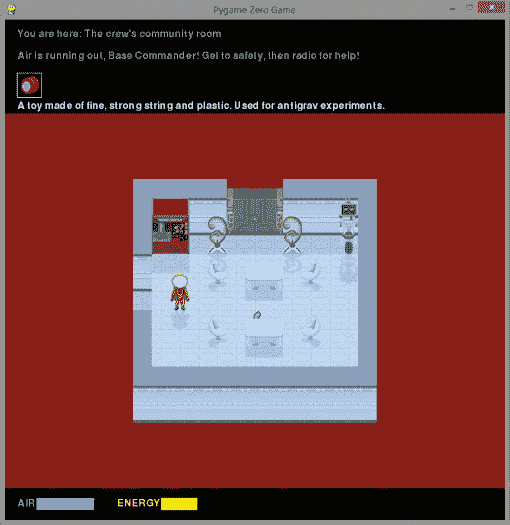
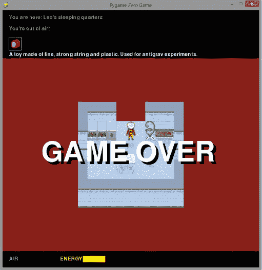
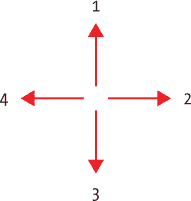
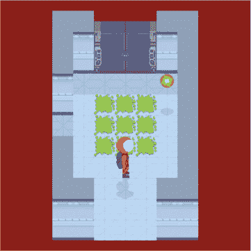
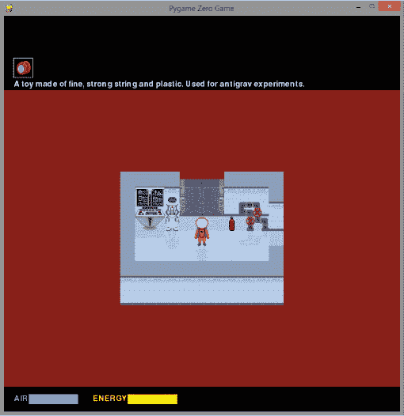
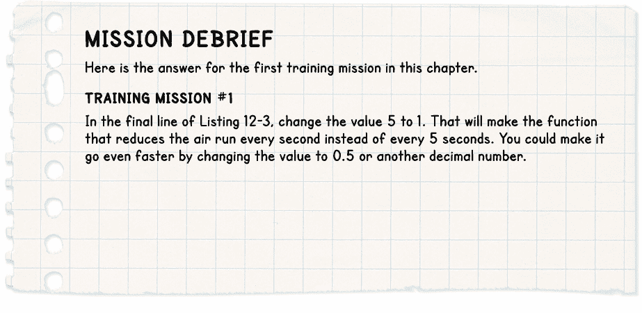

## **12

**危险！危险！添加危险物体**

当空间站系统故障时，各种威胁会出现。在本章中，你将看到空气开始从站内泄漏，并会在某些房间发现移动的危险物体，包括流氓机器人、能量球和有毒的积水。

我把危险的部分放在最后，这样你就可以在此之前测试游戏，而不必担心时间或能量耗尽。在本章中，我们将启动空气泄漏并绘制一个计时条，以告诉你剩余的空气量。我们还会添加可以伤害你并消耗你能量的危险。最后，我们将清理游戏并准备好开始游戏！

### **添加空气倒计时**

游戏中玩家失败的方式有两种：空气用尽或能量耗尽。屏幕底部的两个条形图显示玩家剩余的空气和能量（见图 12-1）。

*图 12-1：屏幕底部的两个条形图显示你剩余的空气和能量。*

你会因为走过有毒的溢出物或被移动的危险物体撞到而失去能量，同时由于空间站墙壁的泄漏，空气也会逐渐耗尽。如果你穿上宇航服，你可以延长生存时间，但宇航服中的空气罐最终也会耗尽。你最艰难的决定之一可能就是决定何时补充空气以及何时使用食物来恢复能量。

#### **显示空气和能量条**

我们将创建一个新的程序部分，称为 AIR，你需要将其放在 DOORS 部分之后，但在程序末尾的 START 部分之前。将列表 12-1 中的新代码添加到上一章的最终清单中（*listing11-7.py*）。将文件保存为*listing12-1.py*。如果你运行程序，它目前不会做任何新事情，但这段代码创建了用于绘制空气和能量条的功能。

*listing12-1.py*

--snip--

objects[21][0] = frames[airlock_door_frame]

objects[21][1] = shadow_frames[airlock_door_frame]

###############

##    AIR    ##

###############

def draw_energy_air():

box = Rect((20, 765), (350, 20))

➊     screen.draw.filled_rect(box, BLACK) # 清空空气条。

➋     screen.draw.text("AIR", (20, 766), color=BLUE)

➌     screen.draw.text("ENERGY", (180, 766), color=YELLOW)

➍     if air > 0:

➎         box = Rect((50, 765), (air, 20))

➏         screen.draw.filled_rect(box, BLUE) # 绘制新的空气条。

➐     if energy > 0:

box = Rect((250, 765), (energy, 20))

screen.draw.filled_rect(box, YELLOW) # 绘制新的能量条。

###############

##   START   ##

###############

--snip--

*列表 12-1：绘制空气和能量条*

我们通过在屏幕底部的状态区域绘制一个黑色框来清除它 ➊，开始新的 draw_energy_air() 函数。接着，我们以蓝色 ➋ 添加 AIR 标签，并以黄色 ➌ 添加 ENERGY 标签。这个函数将使用空气和能量变量，这些变量已经在程序的 VARIABLES 部分设置为 100。

如果玩家还有一些空气（即空气变量大于 0） ➍，则创建一个框，使用空气变量作为其宽度 ➎。然后该框被填充为蓝色 ➏。这将绘制 AIR 指示条，起初它的宽度是 100 像素，随着 AIR 变量的减少而变小。

我们使用类似的指令来绘制能量条 ➐，但能量条的起始位置更偏右（*x* 位置是 250 而不是 50）。

#### **添加空气倒计时功能**

我们将创建三个函数来启用空气倒计时。当你没有空气时，end_the_game() 函数会执行。它会显示玩家未完成任务的原因，播放一些音效，并在游戏窗口中央显示一个大型的 GAME OVER 消息。

air_countdown() 函数会消耗空气。我们还将添加一个 alarm() 函数，它会在游戏开始后不久运行，提醒玩家他们的空气即将耗尽。

这三个函数在 列表 12-2 中。将这里显示的新代码添加到程序的 AIR 部分，位于你刚刚添加的 draw_energy_air() 函数之后。将你的程序保存为 *listing12-2.py*。你可以使用 pgzrun listing12-2.py 运行这个程序，但你还看不到任何新内容。

*listing12-2.py*

--省略--

如果能量大于 0：

box = Rect((250, 765), (energy, 20))

screen.draw.filled_rect(box, YELLOW) # 绘制新的能量条。

➊ def end_the_game(reason):

global game_over

➋     show_text(reason, 1)

➌     game_over = True

sounds.say_mission_fail.play()

sounds.gameover.play()

➍     screen.draw.text("GAME OVER", (120, 400), color = "white",

字体大小 = 128, 阴影 = (1, 1), 颜色 = "black")

➎ def air_countdown():

global air, game_over

如果 game_over：

return # 如果玩家已经死了，就不再消耗空气。

➏     空气 -= 1

➐     如果空气等于 20：

sounds.say_air_low.play()

如果空气等于 10：

sounds.say_act_now.play()

➑     draw_energy_air()

➒     如果空气少于 1：

end_the_game("你没空气了！")

➓ def alarm():

show_text("空气快没了，" + PLAYER_NAME

+ "! 快去安全地点，然后呼叫求救！", 1)

sounds.alarm.play(3)

sounds.say_breach.play()

###############

##   开始   ##

###############

--省略--

*列表 12-2：添加空气倒计时*

air_countdown() 函数 ➎ 每次运行时都会减少空气变量的值 ➏。如果值等于 20 ➐ 或 10，系统会播放警告音效，提醒玩家空气不足。

你在 列表 12-1 中添加的 draw_energy_air() 函数会更新空气和能量显示 ➑。如果空气用尽 ➒，end_the_game() 函数会运行，并显示字符串 "你没空气了！"。

**提示**

音频文件必须存储在*sounds*文件夹中，并且应该是*.wav*或*.ogg*格式。要播放名为*bang.wav*的音效，可以使用 sounds.bang.play()。与图片一样，你无需告知 Pygame Zero 文件的扩展名或音频文件存储的位置。为什么不尝试录制并添加你自己的音效，应用到游戏的不同环节中呢？

在 end_the_game()函数中 ➊，我们使用变量 reason 来接收信息，并将其显示在屏幕上作为死亡原因 ➋。game_over 变量被设置为 True ➌。其他函数会利用这个变量来判断游戏是否结束，从而使一切停止。end_the_game()函数随后在屏幕中央绘制“GAME OVER”字样，字体大小为 128 ➍，位置为*x* = 120, *y* = 400，颜色为白色。我们还为文字添加了一个投影效果，偏移量为 1 像素，颜色为黑色（参见图 12-2）。

*图 12-2：糟糕！你没有空气了！*

本节的最后一个函数 alarm() ➓，播放警报声音并显示一条信息，告诉你需要通过无线电请求帮助。它会在警告中使用玩家的名字，以此来个性化提示。

sounds.alarm.play()命令中括号内的数字表示音效播放的次数（在 Listing 12-2 中是三次）。

#### **启动空气倒计时并触发警报**

我们还没有设置三个新函数的运行。为此，我们需要在程序的 START 部分添加一些指令，START 部分（也许会有些令人困惑！）位于程序列表的末尾。添加在 Listing 12-3 中显示的新指令，并将其保存为*listing12-3.py*。

*listing12-3.py*

--snip--

###############

##   开始   ##

###############

clock.schedule_interval(game_loop, 0.03)

generate_map()

clock.schedule_interval(adjust_wall_transparency, 0.05)

clock.schedule_unique(display_inventory, 1)

clock.schedule_unique(draw_energy_air, 0.5)

clock.schedule_unique(alarm, 10)

# 更高的数字会给出更长的时间限制。

clock.schedule_interval(air_countdown, 5)

*Listing 12-3: 启动空气倒计时*

现在游戏有了时间限制。当空气用尽时，游戏结束。使用 pgzrun 运行程序 listing12-3.py，你应该会看到空气供应慢慢减少。

如果你觉得玩最终版本的游戏太困难，可以通过将 Listing 12-3 最后一行中的 5 改为更大的数字，给自己更多时间。这个数字决定了 air_countdown()函数每隔多少秒消耗一次空气供应。特别是，如果你使用的是 Raspberry Pi 2，时间限制可能会比较具有挑战性，因为该设备上的游戏运行较慢。完成游戏还是有可能的，不过你可以增加这个数字 5，给自己多一点，嗯，呼吸空间。

**训练任务 #1**

当你的空气供应达到 0 时，你应该会看到“游戏结束”信息，并且发现你无法再移动宇航员。你的能量每 5 秒下降 1%，所以大约需要 8.5 分钟（500 秒）才能耗尽。你能找出如何让空气泄漏更频繁，这样你就可以更轻松地测试空气耗尽时会发生什么吗？

完成训练任务后，确保将程序恢复：否则，你会发现任务相当难以完成！

### **添加移动障碍物**

游戏中有三种类型的移动障碍物：两种类型的能量球和一只已经失控的飞行无人机。

图 12-3 显示了移动障碍物所使用的方向编号。

障碍物沿直线移动，直到碰到某物，然后我们加一个数值来改变其方向。我们加的这个数值将决定障碍物的运动模式。例如，如果我们加 1 到方向编号，障碍物将按顺时针方向（上、右、下、左）移动。如果我们加 -1 到方向编号，障碍物将按逆时针方向（左、下、右、上）移动。如果我们加 2，它将在左和右之间（2 和 4）或上下之间（1 和 3）反弹。看看 图 12-3，并检查这是否对你有意义。每个障碍物都可以有自己的运动模式。

*图 12-3：移动障碍物所使用的方向编号按顺时针顺序编号。*

如果加法结果大于 4，我们会减去 4。例如，如果一个障碍物按顺时针方向移动，每当它碰到某物时，我们将其方向编号加 1。如果它向下移动（方向 3），我们加 1 后它将开始向左移动（方向 4）。下次它碰到某物时，我们加 1，但这使得方向编号变为 5。因此，我们减去 4，得到方向编号 1。如 图 12-3 所示，这就是顺时针方向上从 4 开始的下一个方向编号。

表 12-1 总结了我们可以使用的不同运动模式的编号。

**表 12-1：** 障碍物碰到某物时如何改变方向

| **运动模式** |  | **需要加到方向编号的数值** |
| --- | --- | --- |
| 顺时针 |  | 1 |
| 逆时针 |  | -1 |
| 左/右 |  | 2 |
| 上/下 |  | 2 |

**红色警报**

*小心不要混淆描述运动的两个编号。方向编号（见 图 12-3）告诉程序障碍物正在朝哪个方向移动。我们加到方向编号的数值（见 表 12-1）告诉程序障碍物碰到某物时应该朝哪个方向反弹。*

#### **添加障碍数据**

在 AIR 和 START 部分之间，我们将向程序添加一个新的部分，称为 HAZARDS。Listing 12-4 显示了危险数据。将其添加到程序中，并保存为 *listing12-4.py*。如果你运行程序，它暂时不会做任何新事情，但你可以检查是否没有出现错误信息。

*listing12-4.py*

--snip--

sounds.alarm.play(3)

sounds.say_breach.play()

###############

##  HAZARDS  ##

###############

hazard_data = {

# 房间编号：[[y, x, 方向, 碰撞后方向变化量]]

➊     28: [[1, 8, 2, 1], [7, 3, 4, 1]], 32: [[1, 5, 1, 1]],

34: [[5, 1, 1, 1], [5, 5, 1, 2]], 35: [[4, 4, 1, 2], [2, 5, 2, 2]],

36: [[2, 1, 2, 2]], 38: [[1, 4, 3, 2], [5, 8, 1, 2]],

40: [[3, 1, 3, 1], [6, 5, 2, 2], [7, 5, 4, 2]],

41: [[4, 5, 2, 2], [6, 3, 4, 2], [8, 1, 2, 2]],

42: [[2, 1, 2, 2], [4, 3, 2, 2], [6, 5, 2, 2]],

46: [[2, 1, 2, 2]],

48: [[1, 8, 3, 2], [8, 8, 1, 2], [3, 9, 3, 2]]

}

###############

##   START   ##

###############

--snip--

*Listing 12-4: 添加危险数据*

我们创建了一个 hazard_data 字典，使用房间编号作为字典的键。每个房间都有一个包含所有危险数据的列表。每个危险的数据是一个列表，包含了危险的 *y* 位置、*x* 位置、起始方向以及碰到物体后加的数字。

例如，房间 28 ➊ 有一个危险，数据列表为 [7, 3, 4, 1]。这意味着该危险从 *y* = 7, *x* = 3 开始。它开始向左移动（方向 4），当它碰到物体时，会顺时针旋转，因为我们会将方向数字加 1。

房间 41 包含三个危险（在三个列表中），它们从左到右来回移动。我们知道这一点，因为它们的方向是 2 或 4（右或左），并且当它们碰到物体时会将方向加 2（变成 4 或 6：我们知道，减去 4 后 6 会变成 2）。

#### **消耗玩家能量**

在危险数据之后，我们需要添加一个名为 deplete_energy() 的函数，当危险击中玩家时，减少玩家的能量。Listing 12-5 显示了新的函数。将其添加到程序的 HAZARDS 部分，并保存为 *listing12-5.py*。你可以使用 pgzrun listing12-5.py 运行程序来检查错误，但它不会有任何新变化。

*listing12-5.py*

--snip--

46: [[2, 1, 2, 2]],

48: [[1, 8, 3, 2], [8, 8, 1, 2], [3, 9, 3, 2]]

}

➊ def deplete_energy(penalty):

global energy, game_over

if game_over:

return # 当它们已经死掉时，不要消耗能量。

➋     energy = energy - penalty

draw_energy_air()

if energy < 1:

end_the_game("你已经没有能量了！")

###############

##   START   ##

###############

--snip--

*Listing 12-5: 减少玩家能量*

deplete_energy() 函数接受一个数字 ➊，并使用该数字减少玩家的能量变量 ➋。因此，我们可以使用此函数来处理不同能量消耗量的危险。

#### **启动和停止危险物体**

当玩家进入新房间时，hazard_start() 函数会将危险物体放入房间。 Listing 12-6 显示了这个函数，你需要将它添加到程序中 HAZARDS 部分的 deplete_energy() 函数后面。将程序保存为 *listing12-6.py*。如果使用 pgzrun listing12-6.py 运行它，暂时不会有任何变化，因为我们还没有设置这个函数来运行。

*listing12-6.py*

--snip--

if energy < 1:

end_the_game("你的能量耗尽了！")

def hazard_start():

global current_room_hazards_list, hazard_map

➊      if current_room in hazard_data.keys():

➋          current_room_hazards_list = hazard_data[current_room]

➌          for hazard in current_room_hazards_list:

hazard_y = hazard[0]

hazard_x = hazard[1]

➍             hazard_map[hazard_y][hazard_x] = 49 + (current_room % 3)

➎          clock.schedule_interval(hazard_move, 0.15)

###############

##   开始   ##

###############

--snip--

*Listing 12-6：将危险物体添加到当前房间*

每当玩家进入新房间时，hazard_start() 函数就会运行，因此它首先检查当前房间在 hazard_data 字典中是否有条目 ➊。若有，该房间应有移动的危险物体，函数的其余部分将继续执行。我们将该房间的危险物体数据存入名为 current_room_hazards_list 的列表 ➋。然后，函数使用循环 ➌ 逐个处理列表中的每个危险物体。

危险物体使用自己的房间地图，称为 hazard_map，这样它们可以轻松地飞过地板上的物体，而不会覆盖房间地图中的物体。如果危险物体使用与道具相同的房间地图，它们在飞过道具时会擦掉道具，或者我们需要一种复杂的方法来记住危险物体下方的内容。

这三个危险物体在对象字典中的编号是 49、50 和 51。程序通过简单的计算来确定哪个编号对应特定房间。正如你之前看到的，Python 的 % 运算符在进行除法运算后会返回余数。当你将任何数字除以 3，余数只能是 0、1 或 2。所以程序将房间号除以 3，然后将余数加到 49 来选择一个物体编号 ➍。例如，如果我们在房间 34，程序会计算出 34 % 3 为 1，然后将 1 加到 49，选择编号为 50 的危险物体，所有该房间的危险物体都将使用这个编号。

这种选择危险物体编号的方式确保了玩家进入房间时，危险物体总是同一类型。由于地图宽度为五个房间，它还保证了两个直接相连的房间不能有相同的危险物体。这为地图增添了多样性，尽管并非所有房间都有危险物体，所以实际上玩家可能会连续遇到同一个危险物体，只是在它们之间穿过一些空房间。

该函数通过调度 hazard_move() 函数，每 0.15 秒运行一次 ➎。

为了在玩家进入新房间时启动 hazard_start() 函数，请在 start_room() 函数中添加指令，如 列表 12-7 所示。将程序保存为 *listing12-7.py*。这个版本的程序会在你离开起始房间时冻结，因为我们还没有完成添加危害的代码。

*listing12-7.py*

--省略--

###############

## GAME LOOP ##

###############

def start_room():

global airlock_door_frame

show_text("你在这里: " + room_name, 0)

if current_room == 26: # 带有自关闭空气锁门的房间

airlock_door_frame = 0

clock.schedule_interval(door_in_room_26, 0.05)

hazard_start()

--省略--

*列表 12-7：当玩家进入房间时启动危害*

不是所有的房间都有危害，因此当玩家离开房间时，我们将停止危害的移动。我们之前在 game_loop() 函数中添加了指令，以便在玩家换房间时关闭使危害移动的功能。我们已经将它们注释掉，因为我们当时还没准备好。

现在我们准备好了！按照以下步骤取消注释这些指令（你在 第八章 中做过类似的操作）：

1.  点击 **编辑** ▸ **替换**（或按 CTRL-H）在 IDLE 中显示替换文本对话框。

1.  在查找框中键入 #clock.unschedule(hazard_move)。

1.  在“替换为”框中键入 clock.unschedule(hazard_move)。

1.  点击 **全部替换**。IDLE 应该会在四个位置替换指令，并跳转到列表中的最后一个位置。列表 12-8 显示了在过程结束时将被高亮的新行（你不需要键入这个列表）。在这段代码块的上方，有三个类似的代码块，它们现在也会在玩家通过一个出口离开房间时，停止危害的移动。

*listing12-8.py*

--省略--

if player_y == -1: # 通过顶部的门

clock.unschedule(hazard_move)

current_room -= MAP_WIDTH

generate_map()

player_y = room_height - 1 # 从底部进入

player_x = int(room_width / 2) # 从门口进入

player_frame = 0

start_room()

return

--省略--

*列表 12-8：当玩家离开房间时停止危害的移动*

将更新后的程序保存为 *listing12-8.py*。如果运行这个版本的程序，你将在控制台看到一个错误信息，且当你离开房间时游戏会冻结。原因是我们还没有添加 hazard_move() 函数。

#### **设置危害地图**

现在我们需要确保，在为场景和道具生成房间地图时，也会生成一个空的危害地图。hazard_start() 函数将会填充房间中的任何危害。

在程序的 MAKE MAP 部分，generate_map() 函数的末尾添加 列表 12-9 中显示的新代码。将此新代码放置在 GAME LOOP 部分之前，并确保将第一行缩进四个空格，因为它在一个函数内部。

将程序保存为 *listing12-9.py*。当你运行它时，程序仍然无法正常工作，因为它尚未完成。

*listing12-9.py*

--snip--

for tile_number in range(1, image_width_in_tiles):

room_map[prop_y][prop_x + tile_number] = 255

hazard_map = [] # 空列表

for y in range(room_height):

hazard_map.append( [0] * room_width )

###############

## 游戏循环 ##

###############

--snip--

*列表 12-9: 创建空的危害地图*

这些新指令为危害地图创建了一个空列表，并用与房间宽度相同的 0 填充了若干行。

#### **让危害移动**

现在让我们添加缺失的 `hazard_move()` 函数，使得危害能够移动。将其放在程序中的 HAZARDS 部分，并紧跟在 `hazard_start()` 函数之后，如 列表 12-10 所示。将程序保存为 *listing12-10.py*。

*listing12-10.py*

--snip--

hazard_map[hazard_y][hazard_x] = 49 + (current_room % 3)

clock.schedule_interval(hazard_move, 0.15)

def hazard_move():

global current_room_hazards_list, hazard_data, hazard_map

global old_player_x, old_player_y

if game_over:

return

for hazard in current_room_hazards_list:

hazard_y = hazard[0]

hazard_x = hazard[1]

hazard_direction = hazard[2]

➊         old_hazard_x = hazard_x

old_hazard_y = hazard_y

hazard_map[old_hazard_y][old_hazard_x] = 0

➋         if hazard_direction == 1: # up

hazard_y -= 1

if hazard_direction == 2: # right

hazard_x += 1

if hazard_direction == 3: # down

hazard_y += 1

if hazard_direction == 4: # left

hazard_x -= 1

hazard_should_bounce = False

➌         if (hazard_y == player_y and hazard_x == player_x) or \

(hazard_y == from_player_y and hazard_x == from_player_x

and player_frame > 0):

sounds.ouch.play()

deplete_energy(10)

hazard_should_bounce = True

➍         # 防止危害越过门口

if hazard_x == room_width:

hazard_should_bounce = True

hazard_x = room_width - 1

if hazard_x == -1:

hazard_should_bounce = True

hazard_x = 0

if hazard_y == room_height:

hazard_should_bounce = True

hazard_y = room_height - 1

if hazard_y == -1:

hazard_should_bounce = True

hazard_y = 0

➎         # 当危害碰到景物或其他危害时停止。

if room_map[hazard_y][hazard_x] not in items_player_may_stand_on \

or hazard_map[hazard_y][hazard_x] != 0:

hazard_should_bounce = True

➏         if hazard_should_bounce:

hazard_y = old_hazard_y # 返回到最后一个有效位置。

hazard_x = old_hazard_x

➐             hazard_direction += hazard[3]

➑             if hazard_direction > 4:

hazard_direction -= 4

if hazard_direction < 1:

hazard_direction += 4

➒             hazard[2] = hazard_direction

➓         hazard_map[hazard_y][hazard_x] = 49 + (current_room % 3)

hazard[0] = hazard_y

hazard[1] = hazard_x

###############

##   START   ##

###############

--snip--

*列表 12-10: 添加危害移动函数*

`hazard_move()` 函数使用了类似于玩家移动的思路。障碍物的位置存储在 `old_hazard_x` 和 `old_hazard_y` 变量中 ➊。然后障碍物会移动 ➋。

然后我们检查障碍物是否碰到玩家 ➌，是否走出了门 ➍，或者是否撞到景物或其他障碍物 ➎。如果是 ➏，那么它的位置会重置为原来的值，并且通过将其数据列表中的最后一个数字加到方向数字上来改变其方向 ➐。如果加上这个数字后，方向数字超过了 4 ➑，函数会减去 4，如本章前面所述，因为 4 是最大有效的方向数字。另一方面，如果加上这个数字后，方向数字低于 1，函数会加上 4。最后，将新的方向保存到障碍物的数据中 ➒。

在函数的末尾 ➓，将障碍物放入障碍物地图中。

你可以使用 `pgzrun listing12-10.py` 运行这个程序。第一个有障碍物的房间是你起始房间右边的那个房间。当你进入时，能量会神秘地减少，即使你看不见任何危险。这是因为我们还没有添加代码来绘制障碍物。

**提示**

当障碍物碰到你 ➌ 时，`deplete_energy()` 函数会减少你的能量 10%。如果你觉得游戏太难，可以将这个数值改为 5。如果你完成了游戏并想挑战更高难度，下次可以将其改为 20！

#### **在房间中显示障碍物**

隐形的危险看起来不太公平，所以我们来加几行代码，显示房间中的障碍物。列表 12-11 显示了要在程序的 DISPLAY 部分的 `draw()` 函数中添加的三行新代码。把这些代码放在函数的末尾，在绘制玩家角色的代码之前。

由于这些指令在 `draw()` 函数内部（4 个空格），在 `y` 循环内（另 4 个空格），以及在 `x` 循环内（再 4 个空格缩进），因此总共缩进 12 个空格。将程序保存为 *listing12-11.py*。

*listing12-11.py*

--snip--

# 在物体的宽度上使用阴影。

`for z in range(0, shadow_width):`

`draw_shadow(shadow_image, y, x+z)`

否则：

`draw_shadow(shadow_image, y, x)`

`hazard_here = hazard_map[y][x]`

`if hazard_here != 0:` # 如果这个位置有障碍物

`draw_image(objects[hazard_here][0], y, x)`

`if (player_y == y):`

`draw_player()`

--snip--

*列表 12-11：显示移动的障碍物*

这个列表完成了移动障碍物的功能。使用 `pgzrun listing12-11.py` 运行你的程序。然后开始拼命奔跑吧！现在你应该能看到移动的障碍物，例如 图 12-4 中显示的能量球。

*图 12-4：这个能量球在房间内逆时针弹跳。*

**训练任务 #2**

测试移动危险物是否正常工作。进入你起始房间右侧的房间（或者如果需要，传送到房间 32）。当能量球击中你时，你的能量是否减少？能量球是否会从你身上反弹？你能将能量球反弹进两个门口并检查它是否保持在房间内吗？当你的能量耗尽时，游戏是否结束？

#### **阻止玩家穿过危险物**

我们还需要添加一行代码来阻止玩家走入或穿过危险物。实际上，危险物通常会从玩家身上反弹，但如果不做出 Listing 12-12 中的修复，有时玩家还是有可能穿过危险物。

我们已经在 game_loop()函数中添加了所需的代码，但我们将其注释掉了。现在是时候取消注释，通过删除行末\前的#符号，以及删除下一行开始的#符号来恢复这些代码。

我们还需要删除 items_player_may_stand_on 后面的冒号。快速找到程序中的正确部分的方法是按 CTRL-F 打开搜索框，然后输入#\。 Listing 12-12 展示了你需要修改的行。

*listing12-12.py*

--snip--

# 如果玩家站在不该站的位置，将其移回。

如果 room_map[player_y][player_x]不在 items_player_may_stand_on 中 \

或者 hazard_map[player_y][player_x] != 0：

player_x = old_player_x

player_y = old_player_y

player_frame = 0

--snip--

*Listing 12-12：阻止玩家穿过危险物*

将程序保存为*listing12-12.py*并用`pgzrun listing12-12.py`运行它。你能在空间站中追踪到所有三种类型的飞行危险物吗？

### **添加有毒泄漏**

你可能注意到了 Figure 12-4 中的绿色地板溅出物。那是有毒泄漏，当你走在上面时会消耗你的能量。你需要考虑策略。你应该跑过去以便更快到达目的地吗？还是应该小心绕过它，节省能量以备后用，但可能会稍微拖慢你的速度？

Listing 12-13 展示了在你走在有毒地板上时消耗能量的指令。这些指令放在 game_loop()函数中，紧接在你在 Listing 12-12 中修复的指令后面。

将程序保存为*listing12-13.py*。你可以通过运行程序`pgzrun listing12-13.py`来测试它是否有效，然后在有毒地板上行走。这个有毒地板是对象 48，并且被放置为房间中的景物。

*listing12-13.py*

--snip--

# 如果玩家站在不该站的位置，将其移回。

如果 room_map[player_y][player_x]不在 items_player_may_stand_on 中 \

或者 hazard_map[player_y][player_x] != 0：

player_x = old_player_x

player_y = old_player_y

player_frame = 0

如果 room_map[player_y][player_x] == 48: # 有毒地板

deplete_energy(1)

如果 player_direction == "right"并且 player_frame > 0：

player_offset_x = -1 + (0.25 * player_frame)

--snip--

*Listing 12-13: 玩家走在有毒地板上时减少能量*

### **完善细节**

游戏现在几乎完成。在你开始探索太空站之前，我们需要删除一些在构建和测试游戏时使用的指令。

#### **禁用传送器**

任务规则禁止在太空站工作开始后使用传送器。找到它在 game_loop()函数中的指令，用鼠标选中它们，然后点击**格式** ▸ **注释掉区域**来禁用它们。你的代码现在应该像 Listing 12-14 一样。

*listing12-14.py*

--snip--

#### 用于测试的传送器

#### 删除这一部分用于实际游戏

##    if keyboard.x:

##        current_room = int(input("输入房间号："))

##        player_x = 2

##        player_y = 2

##        generate_map()

##        start_room()

##        sounds.teleport.play()

#### 传送门部分结束

--snip--

*Listing 12-14: 传送器已关闭。*

#### **清理数据**

在测试游戏时，你可能已经更改了一些变量和列表的内容。游戏开始时应该像图 12-5 那样。如果不是，请查看程序中的 VARIABLES 部分，确保 current_room 变量设置为 31。

*图 12-5：任务开始时的画面*

如果你携带的物品超过了悠悠球，请查看程序中的 PROPS 部分，并确保这一行是正确的：

in_my_pockets = [55]

#### **冒险开始**

这是一个激动人心的时刻：你的训练已经完成，太空站已经准备就绪，你的火星任务即将开始。让我们在游戏开始时播放一段科幻风格的音乐。Listing 12-15 展示了你将添加到*Escape*中的最后一条指令。

*listing12-15.py*

--snip--

clock.schedule_unique(alarm, 10)

clock.schedule_interval(air_countdown, 11) # 较大的数字会给出更长的倒计时

时间限制。

sounds.mission.play() # 任务音乐

*Listing 12-15: 游戏开始时播放的科幻风格音乐。*

将最终程序保存为*escape.py*。现在，你可以通过 pgzrun escape.py 来玩游戏。查看“玩游戏”在第 11 页上的说明，了解如何操作。

恭喜你完成了太空站的建造。你确实配得上参加这次任务。现在是时候开始在行星表面展开工作了！

### **你的下一个任务：自定义游戏**

你在*Escape*游戏中成功到达安全地点了吗？真是千钧一发！接下来的任务是尝试自定义游戏。使用这本书的方式有很多种，所以在你构建游戏时可能已经做了一些自定义。以下是一些修改游戏的建议，从最简单的开始：

+   将游戏中的角色名称更改为你朋友的名字。查看 Listing 4-1 在第 63 页的第四章中的内容。

+   自定义图片。你可以编辑我们的图片，或者创建你自己的。游戏中包含一个白板图片，你可以使用你喜欢的绘画软件进行编辑。如果你制作的图片与我们的尺寸相同，使用相同的文件名，并将其存储在*images*文件夹中，它们应该能够顺利地导入游戏世界。

+   重新设计房间布局。第六章 解释了如何在房间中布置景物。

+   向游戏中添加你自己的物品。首先创建它们的图片。道具应该是 30 像素见方。景物可以更大，并且应该触及其瓦片空间的左右两侧，这样当玩家无法靠近景物时，不会看起来很奇怪。（例如，如果你的图片宽度为 30、60 或 90 像素，并且触及地面两侧，它应该看起来没有问题。）你需要在物品字典中添加这些新项目（参见第五章）。有关定位景物的帮助，请参见第六章。有关定位道具的建议，请参见第九章。

+   创建你自己的太空站地图（参见第四章）。

+   使用游戏引擎制作你自己的游戏。你可以替换图片和地图，编写自己的谜题代码，基于*Escape*代码制作一个全新的游戏。**使用物品**部分是编程游戏谜题的地方。它详细描述了当物品被单独使用或与其他物品组合时会发生什么。保留组合物品的代码（配方）并仅更新它可能会有用（参见第十章）；保留显示标准响应的代码（参见第十章）；以及保留开门的代码（参见第十一章）。

如果你做出任何影响 26 号房间的更改，你需要禁用其压力垫的代码（参见第十一章）。

请记住，你所做的任何更改都可能会破坏原始*Escape*游戏中的谜题，导致无法完成。例如，可能无法找到重要的工具。我建议你将所做的任何更改单独保存，以便你始终可以返回原始代码。

**分享你的自定义内容**

我很想听听你们的自定义内容！你可以在 Twitter 上找到我，用户名是@musicandwords，或者访问我的网站*[www.sean.co.uk](http://www.sean.co.uk)*，该网站包括本书的附加内容。如果你将你修改过的*Escape*游戏与他人分享，或者分享你基于其代码、声音或图片制作的游戏，请注明本书及其作者，并明确表示你已修改了代码。谢谢！

### **你适合飞行吗？**

勾选以下框来确认你已经学习了本章的关键内容。

 你可以使用 Pygame Zero 绘制带有阴影的文字，并调整显示文本的大小。

  你可以通过在 sounds.sound_name.play() 指令中将播放次数放在括号中，来让声音播放多次。

  移动中的危险物体的方向编号从顶部的 1 开始，按顺时针方向编号。要为一个危险物体创建移动模式，你需要提供一个数字，该数字会在它碰到障碍物时添加到它的方向编号上。

  deplete_energy() 函数会减少玩家的能量。

  危险物体使用自己专用的房间地图，称为 hazard_map。这使得它们能更容易地穿越地板上的物体。

  在开始游戏之前，检查起始变量是否正确。

