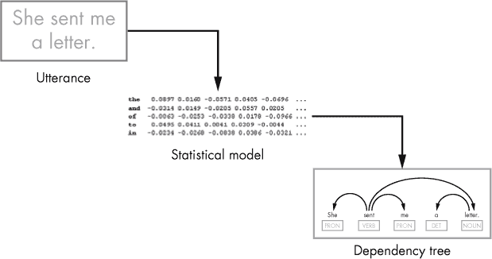

## 第一章：**自然语言处理是如何工作的**


在 19 世纪，探险者发现了*rongorongo*，这是一种神秘的象形文字系统，位于复活节岛（通常被称为复活节岛）。研究人员从未成功破译 rongorongo 铭文，甚至没有弄清楚这些铭文是书写还是原始书写（传达信息但与语言无关的图形符号）。此外，虽然我们知道铭文的创造者也建造了摩艾像，这些大大的雕像是复活节岛最著名的象征，但建造者的动机仍然不明。我们只能推测。

如果你不了解人们的写作方式——或者他们描述事物的方式——你很可能就无法理解他们生活中的其他方面，包括他们做什么以及为什么这么做。

*自然语言处理（NLP）* 是人工智能的一个子领域，旨在处理和分析自然语言数据。它包括教机器用自然语言与人类互动（自然语言是通过使用自然发展出来的语言）。通过创建旨在处理比复活节岛上发现的那二十几块石板更大的未知数据集的机器学习算法，数据科学家可以了解我们如何使用语言。它们还能做的不仅仅是解读古代铭文。

今天，你可以使用算法来观察那些语义和语法规则已经被很好理解的语言（不同于 rongorongo 铭文），然后构建能够“理解”该语言发音的应用程序。企业可以利用这些应用程序帮助人类摆脱枯燥、单调的任务。例如，一个应用程序可以接受食物订单或回答客户经常提出的技术支持问题。

毫不奇怪，生成和理解自然语言是 NLP 中最具前景且最具挑战性的任务。在本书中，你将使用 Python 编程语言，通过 spaCy（一个领先的开源 Python 自然语言处理库）来构建一个自然语言处理器。但在开始之前，本章将概述构建自然语言处理器时幕后发生的事情。

### **计算机如何理解语言？**

如果计算机只是没有情感的机器，那怎么可能训练它们理解人类语言并作出恰当的回应呢？事实上，机器无法本地理解自然语言。如果你希望你的计算机对语言数据进行计算操作，你需要一个能够将自然语言单词转换为数字的系统。

#### ***通过词嵌入映射单词和数字***

*词嵌入*是一种将单词与数字关联的技术。在词嵌入中，你将单词映射到实数向量，这些向量将每个单词的意义分布到对应词向量的坐标上。具有相似意义的单词应当在这种向量空间中彼此接近，从而让你通过单词的“邻居”来确定其含义。

以下是此类实现的一个片段：

```py
the 0.0897 0.0160 -0.0571 0.0405 -0.0696  ...

and -0.0314 0.0149 -0.0205 0.0557 0.0205  ...

of -0.0063 -0.0253 -0.0338 0.0178 -0.0966 ...

to 0.0495 0.0411 0.0041 0.0309 -0.0044    ...

in -0.0234 -0.0268 -0.0838 0.0386 -0.0321 ...
```

这个片段将单词“the”，“and”，“of”，“to”和“in”映射到它后面的坐标。如果你用图形方式表示这些坐标，那么具有相似意义的单词也会在图形中靠得更近。（但这并不意味着你可以期望在像这里展示的片段这样的文本表示中，相似意义的单词会聚集在一起。词向量空间的文本表示通常以最常见的单词开头，比如“the”，“and”等。这是词向量空间生成器布局单词的方式。）

**注意**

*多维向量空间的图形表示可以通过二维或三维投影的形式来实现。为了准备这样的投影，你可以分别使用向量的前两个或三个主成分（或坐标）。我们将在第五章回到这一概念。*

一旦你有了将单词映射到数字向量的矩阵，你就可以对这些向量进行算术运算。例如，你可以确定单词、句子，甚至整个文档的*语义相似性*（同义性）。

在数学上，确定两个单词之间的语义相似性就变成了计算它们对应向量之间的余弦相似性，或者计算向量之间的夹角余弦。尽管计算语义相似性的完整解释超出了本书的范围，第五章将更详细地讲解如何处理词向量。

#### ***使用机器学习进行自然语言处理***

你可以使用机器学习算法来生成用于填充向量的数字。*机器学习*是人工智能的一个子领域，它创建可以从数据中自动学习的计算机系统，而无需明确编程。机器学习算法可以对新数据做出预测，学习识别图像和语音，分类照片和文本文件，自动化控制，并协助游戏开发。

机器学习使计算机能够完成那些否则非常困难，甚至不可能完成的任务。举个例子，如果你想用传统的编程方法为机器编写下象棋程序，其中你明确指定算法在每种情境下应该做什么，想象一下你需要定义多少个 `if...else` 条件。即便你成功了，使用这种应用程序的用户很快就会发现你逻辑中的弱点，并利用这些弱点在游戏中获胜，直到你在代码中做出必要的修正。

相比之下，基于机器学习算法构建的应用程序并不依赖于预定义的逻辑，而是利用从过去经验中学习的能力。因此，基于机器学习的国际象棋应用会寻找它从之前的游戏中记住的位置，并做出能达到最佳位置的移动。它将这些过去的经验存储在一个统计模型中，具体内容请参见 “什么是 NLP 中的统计模型？” 以及 第 8 页。

在 spaCy 中，除了生成词向量外，机器学习还可以帮助你完成三个任务：*句法依赖解析*（确定句子中单词之间的关系）、*词性标注*（识别名词、动词及其他词类）和*命名实体识别*（将专有名词分为人名、组织名和地点等类别）。我们将在接下来的章节中详细讨论这些内容。

一个典型的机器学习系统的生命周期包括三个步骤：模型训练、测试和预测。

##### 模型训练

在第一阶段，你通过向算法输入大量数据来训练模型。为了让这些算法给出可靠的结果，你必须提供足够多的输入数据——比如比 rongorongo 铭文多得多。当涉及到 NLP 时，像 Wikipedia 和 Google News 这样的平台就包含了足够的文本，几乎可以喂养任何机器学习算法。但如果你想构建一个特定于你用例的模型，你可能会让它从使用你网站的客户那里学习。

图 1-1 提供了模型训练阶段的高层次描述。


*图 1-1：使用大量文本数据作为输入，通过机器学习算法生成统计模型*

你的模型处理大量的文本数据，以理解哪些单词具有共同的特征；然后它为这些单词创建反映这些共享特征的词向量。

正如你将在 “什么是 NLP 中的统计模型？” 和 第 8 页 中学到的那样，这样的词向量空间并不是为 NLP 构建的统计模型的唯一组成部分。实际的结构通常更加复杂，它提供了一种根据上下文提取每个单词语言特征的方法。

在第十章中，你将学习如何使用新示例训练一个已经存在的、预训练的模型，以及如何从头开始训练一个空白模型。

##### 测试

一旦你训练好了模型，你可以选择性地对其进行测试，以了解它的表现如何。测试模型时，你将输入它之前未见过的文本，检查它是否能成功识别训练过程中学到的语义相似性和其他特征。

##### 进行预测

如果一切按预期工作，你可以使用该模型在你的 NLP 应用中进行预测。例如，你可以使用它预测你输入的文本的依赖树结构，如图 1-2 所示。*依赖树结构*表示句子中单词之间的关系。



*图 1-2：使用统计模型预测发话的依赖树结构*

在视觉上，我们可以使用不同长度的弧线来表示依赖树，连接语法上相关的单词对。例如，这里展示的依赖树告诉我们动词“sent”与代词“she”相匹配。

#### ***为什么在自然语言处理中使用机器学习？***

你的算法预测并不是事实陈述；它们通常是根据一定的确定性计算得出的。为了实现更高的准确度，你需要实现更复杂的算法，这些算法效率较低，且实施起来不太实用。通常，人们会努力在准确性和性能之间找到合理的平衡。

由于机器学习模型无法做到完美预测，你可能会想知道机器学习是否是用于构建自然语言处理（NLP）应用中模型的最佳方法。换句话说，是否存在一种基于严格定义规则的更可靠方法，类似于编译器和解释器处理编程语言时使用的方法？简短的回答是否定的。原因如下。

首先，编程语言包含的单词数量相对较少。例如，Java 编程语言包含 61 个保留字，每个保留字在该语言中都有预定义的含义。

相比之下，*《牛津英语词典》* 1989 年发布，收录了当前使用的 171,476 个单词。2010 年，哈佛大学和谷歌的一个研究团队统计了约 1,022,000 个单词，这些单词出现在包含约 4%已出版图书的数字化文本中。该研究估计，语言每年会增长几千个单词。为每个单词分配一个对应的数字将需要太长时间。

但即使你尝试去做，你也会发现，出于几个原因，确定自然语言中使用的单词数量几乎是不可能的。首先，什么算作一个独立的单词并不清楚。例如，我们应该把动词“count”算作一个单词，还是两个，或更多呢？在一种情况下，“count”可能意味着“有价值或重要性”。在另一种情况下，它可能意味着“一个接一个地说数字”。当然，“count”也可以是一个名词。

我们是否也应该把屈折变化——名词的复数形式、动词时态等——当作独立的实体来计算呢？我们是否应该计算*借词*（从外语中借用的单词）、科学术语、俚语和缩写？显然，自然语言的词汇定义很松散，因为很难弄清楚应该包括哪些单词组。在像 Java 这样的编程语言中，试图在代码中包括一个未知单词会迫使编译器中断处理并报错。

对于形式规则，也存在类似的情况。像它的词汇一样，许多自然语言的形式规则定义得很松散。有些规则会引发争议，比如*分裂不定式*，这是一种语法结构，其中副词被放置在不定式动词和它的介词之间。以下是一个例子：

```py
spaCy allows you to programmatically extract the meaning of an utterance.
```

在这个例子中，副词“programmatically”将介词和不定式“to extract”分开。那些认为分裂不定式不正确的人可能会建议将句子改写如下：

```py
spaCy allows you to extract the meaning of an utterance programmatically.
```

但无论你对分裂不定式有什么看法，你的 NLP 应用程序应该能同等好地理解这两个句子。

相比之下，处理编程语言代码的计算机程序并未设计来处理这种问题。原因在于，编程语言的正式规则被严格定义，不留任何歧义。例如，考虑以下用 SQL 编程语言编写的语句，你可能会用它来向数据库表中插入数据：

```py
INSERT INTO table1 VALUES(1, 'Maya', 'Silver')
```

这个陈述相当直白。即使你不知道 SQL，你也能很容易猜到，这个语句应该是向表 1 中插入三个值。

现在，假设你把它修改成如下：

```py
INSERT VALUES(1, 'Maya', 'Silver') INTO table1
```

从讲英语读者的角度来看，第二个陈述应该与第一个陈述具有相同的意义。毕竟，如果你像读英语句子那样去读，它仍然是有意义的。但如果你尝试在 SQL 工具中执行它，你将会遇到错误`missing INTO keyword`。那是因为 SQL 解析器——像任何其他编程语言中使用的解析器——依赖于硬编码的规则，这意味着你必须精确地按照它预期的方式指定你希望它执行的操作。在这个例子中，SQL 解析器期望在关键字`INSERT`之后紧跟着看到`INTO`关键字，而没有任何其他可能的选项。

毫无疑问，这种限制在自然语言中是无法实现的。考虑到所有这些差异，显而易见的是，像我们为编程语言定义计算模型那样，定义一套正式规则来指定自然语言的计算模型是低效甚至不可能的。

我们不使用基于规则的方法，而是采用基于观察的方法。机器学习算法通过生成统计模型来检测大量语言数据中的模式，并对新出现的、以前未见过的文本数据的句法结构做出预测，而不是通过为每个单词分配一个预定的数字来编码语言。

图 1-3 总结了自然语言和编程语言处理的工作流程。

自然语言处理系统使用一个基础统计模型来预测输入文本的意义，然后生成适当的响应。相比之下，处理编程代码的编译器则应用一套严格定义的规则。


*图 1-3：左侧是处理自然语言的基本工作流程，右侧是处理编程语言的基本工作流程*

### **什么是自然语言处理中的统计模型？**

在自然语言处理中，*统计模型*包含了语言单位（如单词和短语）概率分布的估计，从而使你能够为这些单位分配语言特征。在概率论和统计学中，某一变量的*概率分布*是一个数值表，它将该变量的所有可能结果映射到在实验中发生这些结果的概率。表 1-1 展示了“count”一词在给定句子中可能的词性标签概率分布。（记住，一个单词可能在不同的语境中充当多个词性。）

**表 1-1：** 语境中语言单位的概率分布示例

| **动词** | **名词** |
| --- | --- |
| 78% | 22% |

当然，你会在另一种语境中看到“count”一词的其他图示。

统计语言建模对于许多自然语言处理任务至关重要，比如自然语言生成和自然语言理解。因此，统计模型几乎是所有自然语言处理应用的核心。

图 1-4 提供了自然语言处理应用如何使用统计模型的概念性描述。


*图 1-4：自然语言处理应用架构的高层次概念图*

应用程序与 spaCy 的 API 进行交互，后者抽象了底层的统计模型。统计模型包含诸如词向量和语言学注释等信息。语言学注释可能包括如词性标签和句法注释等特征。统计模型还包含一组机器学习算法，可以从存储的数据中提取必要的信息。

在实际系统中，模型的数据通常以二进制格式存储。二进制数据对人类来说不太友好，但它是机器的最佳伙伴，因为它容易存储并且加载速度快。

#### ***神经网络模型***

在 NLP 工具（如 spaCy）中用于句法依赖解析、词性标注和命名实体识别的统计模型是神经网络模型。一个*神经网络*是一组预测算法。它由大量简单的处理单元组成，类似于大脑中的神经元，这些单元通过发送和接收信号与邻近节点进行交互。

在神经网络中，节点通常被分组到各个层次中，包括输入层、输出层和位于中间的一个或多个隐藏层。每个层中的节点（除输出层外）通过连接与后续层的每个节点相连。每个连接都有一个与之相关的权重值。在训练过程中，算法会调整权重值，以最小化其预测中的误差。这种架构使得神经网络能够识别模式，甚至在复杂的数据输入中也能做到。

从概念上讲，我们可以如图 1-5 所示表示神经网络。


*图 1-5：神经网络布局和一个节点操作的概念性图示*

当信号传入时，它会乘以一个权重值，这是一个实数。传递到神经网络的输入和权重值通常来自网络训练期间生成的词向量。

神经网络将每个节点的乘法结果相加，然后将总和传递给激活函数。激活函数生成的结果通常在 0 到 1 之间，从而产生一个新的信号，传递给后续层中的每个节点，或者在输出层的情况下，传递给输出参数。通常，输出层的节点数量等于给定算法的可能输出结果的数量。例如，用于词性标注的神经网络应该在输出层有与系统支持的词性标签数量相等的节点，正如图 1-6 所示。


*图 1-6：简化的词性标注过程图示*

然后，词性标注器会输出给定单词在特定上下文中的所有可能词性的概率分布。

#### ***卷积神经网络用于自然语言处理（NLP）***

一个真实的神经网络模型的架构可能相当复杂，它由多个不同的层组成。因此，spaCy 中使用的神经网络模型是一个*卷积神经网络（CNN）*，它包括一个卷积层，该卷积层在词性标注器、依赖解析器和命名实体识别器之间共享。卷积层将*a 组检测滤波器应用于输入数据的区域，以测试是否存在特定特征。*

*作为一个例子，让我们看看卷积神经网络（CNN）在前面示例中执行词性标注任务时的工作原理：*

```py
Can we count on them?
```

卷积层并不是单独分析每个词，而是首先将句子划分为多个块。你可以将 NLP 中的句子视为一个矩阵，其中每一行表示一个词的向量形式。所以，如果每个词向量有 300 维，而你的句子有五个词，那么你就会得到一个 5 × 300 的矩阵。卷积层可能使用一个大小为三的检测滤波器，应用于三个连续的词，从而得到一个 3 × 300 的平铺区域大小。这应该能提供足够的上下文信息，帮助做出每个词的词性标注决定。

使用卷积方法进行词性标注的操作如图 1-7 所示。


*图 1-7：卷积方法在 NLP 任务中如何工作的概念性展示*

在前面的例子中，标注器面临的最具挑战性的任务是确定“count”一词的词性。问题在于，这个词可以是动词，也可以是名词，具体取决于上下文。但是，当标注器看到包含“we count on”这个词组时，这个任务就变得轻松了。在这种情况下，很明显，“count”一词只能是动词。

深入了解卷积架构的内部工作原理超出了本书的范围。如需了解有关 spaCy 中使用的统计模型背后的神经网络模型架构的更多信息，请查看 spaCy API 文档中的“神经网络模型架构”部分。

### **仍需你自己处理的部分**

如你在前一节中学到的，spaCy 使用神经模型进行句法依赖分析、词性标注和命名实体识别。由于 spaCy 为你提供了这些功能，那么作为 NLP 应用程序的开发者，你需要做的还有什么呢？

spaCy 不能为你做的一件事是识别用户的意图。例如，假设你在卖衣服，你的在线应用程序接收到了用户的以下请求：

```py
I want to order a pair of jeans.
```

该应用程序应该能够识别用户打算订购一条牛仔裤。

如果你使用 spaCy 对这个语句执行句法依赖分析，你将得到图 1-8 中所示的结果。


*图 1-8：样本语句的依赖树*

请注意，spaCy 在生成的语法树中并没有标记任何内容作为用户的意图。事实上，如果它做了这样的标记，反而显得很奇怪。原因在于，spaCy 并不知道你是如何实现应用逻辑的，也不知道你具体期待看到哪种意图。选择哪些词作为任务中的关键术语完全由你决定。

为了从话语或言论中提取意义，你需要理解以下关键方面：关键词、上下文和意义转换。

#### ***关键词***

你可以利用句法依存解析的结果来选择对意义识别最重要的词汇。在“I want to order a pair of jeans.”这个例子中，关键词可能是“order”和“jeans”。

通常，及物动词和它的直接宾语能够很好地构成意图。但在这个特定的例子中，情况有点复杂。你需要遍历依存树，提取“order”（及物动词）和“jeans”（与直接宾语“pair”相关的介词的宾语）。

#### ***上下文***

在选择关键词时，上下文可能很重要，因为相同的短语在不同应用中可能有不同的含义。假设你需要处理以下的言论：

```py
I want the newspaper delivered to my door.
```

根据上下文，这句话可能是请求订阅一份报纸，或者请求将报纸送到门口。在第一种情况下，关键词可能是“want”和“newspaper”。在后一种情况下，关键词可能是“delivered”和“door”。

#### ***意义转换***

通常，人们会用不止一句话来表达一个非常简单的意图。比如，考虑以下话语：

```py
I already have a relaxed pair of jeans. Now I want a skinny pair.
```

在这篇论述中，反映意图的词语出现在两个不同的句子中，如图 1-9 所示。


*图 1-9：识别话语的意图*

正如你可能猜到的，“want”和“jeans”这两个词最能描述这段话的意图。以下是找到最佳描述用户意图的关键词的一般步骤：

1.  在话语中，找到一个现在时的及物动词。

1.  找出步骤 1 中发现的及物动词的直接宾语。

1.  如果在上一步中找到的直接宾语是代词形式，找到它在前文中的先行词。

使用 spaCy，你可以轻松地以编程方式实现这些步骤。我们将在第八章中详细描述这一过程。

### **总结**

在这一章中，你学到了自然语言处理的基础知识。你现在知道，与人类不同，机器使用基于向量的单词表示方法，这使你能够对自然语言单元（包括单词、句子和文档）进行数学运算。

你学到的词向量是基于神经网络架构的统计模型实现的。接着，你了解了作为一个 NLP 应用开发者，仍然需要你自己完成的任务。*
