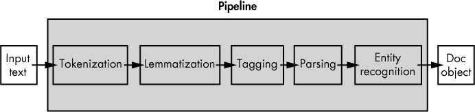
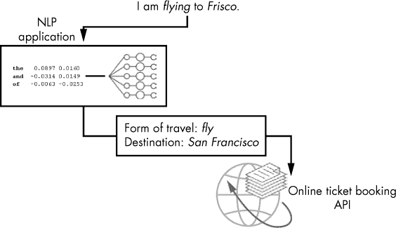
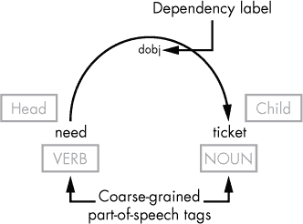
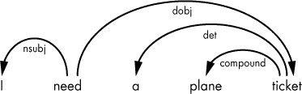

## 第二章：文本处理管道**


现在你已经理解了 NLP 应用程序的结构，是时候在实际操作中看到这些基础概念的应用了。在本章中，你将安装 spaCy 并设置工作环境。接着，你将学习 *文本处理管道*，这是你用来确定话语的含义和意图的一系列基本 NLP 操作。这些操作包括分词、词形还原、词性标注、句法依赖解析和命名实体识别。

### **设置工作环境**

在开始使用 spaCy 之前，你需要通过在机器上安装以下软件组件来设置工作环境：

+   Python 2.7 或更高版本，或 3.4 或更高版本

+   spaCy 库

+   spaCy 的统计模型

你需要 Python 2.7 或更高版本，或 3.4 或更高版本才能使用 spaCy v2.0.*x*。可以在 *[`www.python.org/downloads/`](https://www.python.org/downloads/)* 下载并按照说明设置 Python 环境。接下来，在你的 Python 环境中使用 `pip` 安装 spaCy，运行以下命令：

```py
$ pip install spacy
```

如果你的系统上有多个 Python 安装，请选择与你想要使用的 Python 安装相关的 `pip` 可执行文件。例如，如果你想在 Python 3.5 中使用 spaCy，应该运行以下命令：

```py
$ pip3.5 install spacy
```

如果你的系统中已经安装了 spaCy，你可能想将其升级到新版本。本书中的示例假设你使用的是 spaCy v2.0.*x* 或更高版本。你可以使用以下命令验证安装的 spaCy 版本：

```py
$ python -m spacy info
```

你可能需要将 `python` 命令替换为适用于你特定环境中的 Python 可执行文件的命令，例如 `python3.5`。从现在开始，我们将使用 `python` 和 `pip`，无论你的系统使用的是哪个可执行文件。

如果你决定将已安装的 spaCy 包升级到最新版本，可以使用以下 `pip` 命令进行升级：

```py
$ pip install -U spacy
```

### **安装 spaCy 的统计模型**

spaCy 安装包并不包括你开始使用库时所需的统计模型。这些统计模型包含从一组来源收集的关于特定语言的知识。你必须单独下载并安装每个你想要使用的模型。

有多个预训练的统计模型可供不同语言使用。例如，针对英语，可以从 spaCy 的网站下载以下模型：`en_core_web_sm`、`en_core_web_md`、`en_core_web_lg` 和 `en_vectors_web_lg`。这些模型遵循以下命名规则：*lang_type_genre_size*。*Lang*指定语言。*Type*表示模型的功能（例如，core 是一个通用模型，包括词汇、语法、实体和向量）。*Genre*表示模型训练的文本类型：web（如 Wikipedia 或类似的媒体资源）或 news（新闻文章）。*Size*表示模型的大小：`lg`是大型，`md`是中型，`sm`是小型。模型越大，所需的磁盘空间也越大。例如，`en_vectors_web_lg-2.1.0`模型需要 631MB，而`en_core_web_sm-2.1.0`只需要 10MB。

为了跟随本书中提供的示例，`en_core_web_sm`（最轻量的模型）就能很好地工作。当你使用 spaCy 的下载命令时，spaCy 会默认选择这个模型：

```py
$ python -m spacy download en
```

命令中的`en`快捷链接指示 spaCy 下载并安装适用于英语的最佳默认模型。在这个上下文中，最佳匹配的模型是指为指定语言（例如英语）生成的通用模型，且是最轻量的。

要下载特定的模型，您必须指定其名称，如下所示：

```py
$ python -m spacy download en_core_web_md
```

安装完成后，你可以使用安装时指定的相同快捷链接加载模型：

```py
nlp = spacy.load('en')
```

### **使用 spaCy 的基本 NLP 操作**

让我们开始执行一系列基本的 NLP 操作，我们称之为处理管道。spaCy 会在后台为你执行所有这些操作，让你能够专注于应用程序的特定逻辑。图 2-1 提供了该过程的简化示意图。



*图 2-1：处理管道的高层视图*

处理管道通常包括分词、词形还原、词性标注、句法依存分析和命名实体识别。我们将在本节中介绍这些任务。

#### ***分词***

任何自然语言处理（NLP）应用程序通常对文本执行的第一个操作是将文本解析为*词元*，词元可以是单词、数字或标点符号。分词是第一个操作，因为所有其他操作都需要你首先获取词元。

以下代码展示了分词过程：

```py
➊ import spacy

➋ nlp = spacy.load('en') 

➌ doc = nlp(u'I am flying to Frisco')

➍ print([w.text for w in doc])
```

我们通过导入 spaCy 库 ➊ 来访问它的功能。然后，我们使用`en`快捷链接 ➋ 加载一个模型包，以创建一个 spaCy 语言类的实例。语言对象包含该语言的词汇和来自统计模型的其他数据。我们将这个语言对象命名为`nlp`。

接下来，我们将刚刚创建的对象 ③ 应用到示例句子中，创建一个*Doc 对象*实例。Doc 对象是一个用于存储一系列 Token 对象的容器。spaCy 会根据你提供的文本隐式地生成它。

到此为止，仅用三行代码，spaCy 已经生成了示例句子的语法结构。你如何使用它完全取决于你自己。在这个非常简单的示例中，你只需要打印出每个标记的*文本内容* ④。

脚本将示例句子的标记输出为一个列表：

```py
['I', 'am', 'flying', 'to', 'Frisco']
```

*文本内容*——组成标记的字符组，例如标记“am”中的字母“a”和“m”——是 Token 对象的许多属性之一。你还可以提取分配给标记的各种语言特征，正如你将在以下示例中看到的那样。

#### ***词形还原***

*词形*是一个标记的基本形式。你可以把它看作是标记如果列在字典中会出现的形式。例如，“flying”这个标记的词形是“fly”。*词形还原*是将单词形式还原为其词形的过程。以下脚本提供了一个使用 spaCy 进行词形还原的简单示例：

```py
import spacy

nlp = spacy.load('en')

doc = nlp(u'this product integrates both libraries for downloading and
applying patches')

for token in doc:

  print(➊token.text, ➋token.lemma_)
```

脚本中的前三行与之前的脚本相同。回顾一下，这些行导入了 spaCy 库，使用`en`快捷方式加载了一个英文模型，创建了一个文本处理管道，并将管道应用于示例句子——通过创建一个 Doc 对象，你可以访问句子的语法结构。

**注意**

*在语法中，句子结构是指单个单词、短语和从句在句子中的排列方式。句子的语法意义取决于这种结构组织。*

一旦你拥有了包含示例句子标记的 Doc 对象，你就可以在循环中遍历这些标记，并打印出标记的文本内容 ➊ 以及其对应的词形 ➋。该脚本将输出如下结果（为了便于阅读，我已将其整理成表格）：

```py

this        this

product     product

integrates  integrate

both        both

libraries   library

for         for

downloading download

and         and

applying    apply

patches     patch
```

左侧列包含标记，右侧列包含它们的词形。

#### ***应用词形还原进行语义识别***

词形还原是语义识别任务中的一个重要步骤。为了理解这一点，让我们回到上一节中的示例句子：

```py
I am flying to Frisco.
```

假设这个句子被提交到一个与在线系统交互的 NLP 应用程序，该系统提供了一个 API 用于预定旅行票务。该应用程序处理客户的请求，从中提取必要的信息，然后将信息传递给底层 API。这个设计可能看起来像图 2-2 所示。



*图 2-2：在提取客户请求中必要信息的过程中使用词形还原*

自然语言处理应用尝试从客户请求中获取以下信息：一种旅行方式（飞机、火车、公交等）和目的地。应用程序首先需要确定客户是想要机票、火车票还是公交票。为此，应用程序会搜索与预定义关键词列表中的某个关键词匹配的单词。简化这些关键词搜索的一个简单方法是，首先将句子中的所有单词转换为它们的词元。这样，预定义的关键词列表就会简短而清晰。例如，你不需要包括“fly”这个词的所有词形（如“fly”，“flying”，“flew”和“flown”），就能作为客户想要机票的指示，从而将所有可能的变体简化为该词的基础形式——也就是“fly”。

词元化在应用程序尝试从提交的请求中确定目的地时也非常有用。全球城市有很多昵称。但系统需要的是官方名称，预设的执行词元化的分词器无法区分城市、国家等的昵称和官方名称。为了解决这个问题，你可以向现有的分词器实例添加特例规则。

以下脚本演示了如何实现目的地城市的词元化。它会打印出组成句子的单词的词元。

```py
   import spacy

   from spacy.symbols import ORTH, LEMMA

   nlp = spacy.load('en')

   doc = nlp(u'I am flying to Frisco')

   print([w.text for w in doc])

➊ special_case = [{ORTH: u'Frisco', LEMMA: u'San Francisco'}]

➋ nlp.tokenizer.add_special_case(u'Frisco', special_case)

➌ print([w.lemma_ for w in nlp(u'I am flying to Frisco')])
```

你为单词`Frisco`定义了一个*特例* ➊，通过将其默认词元替换为`San Francisco`。然后你将这个特例添加到分词器实例中 ➋。一旦添加，分词器实例将在每次请求`Frisco`的词元时使用这个特例。为了确保一切按预期工作，你可以打印出句子中单词的词元 ➌。

脚本生成以下输出：

```py
['I', 'am', 'flying', 'to', 'Frisco']

['-PRON-', 'be', 'fly', 'to', 'San Francisco']
```

输出列出了句子中所有单词的词元（lemmas），但不包括`Frisco`，对于`Frisco`，它列出的是`San Francisco`。

#### ***词性标注***

*词性标注*告诉你在特定句子中给定单词的词性（名词、动词等）。（回想一下第一章，一个单词根据出现的上下文可以作为多个词性。）

在 spaCy 中，词性标注可以包含关于一个标记（token）的详细信息。对于动词，可能会告诉你以下特征：时态（过去、现在或将来）、体（简单、进行时或完成时）、人称（第一、第二或第三）和数（单数或复数）。

提取这些动词词性标签可以帮助在仅进行标记化和词形还原不足以判断时识别用户意图。例如，前一节中的机票预订应用程序的词形还原脚本并不能决定 NLP 应用程序如何选择句子中的词汇来构建请求底层 API 的请求。在实际情况中，做出这样的决定可能相当复杂。例如，客户的请求可能包含多于一个句子：

```py
I have flown to LA. Now I am flying to Frisco.
```

对于这些句子，词形还原的结果如下：

```py
['-PRON-', 'have', 'fly', 'to', 'LA', '.', 'now', '-PRON-', 'be', 'fly', 'to', 'San Francisco', '.']
```

仅执行词形还原并不足够；应用程序可能会将第一个句子中的“fly”和“LA”作为关键字，从而表示客户打算飞往洛杉矶，而实际上客户打算飞往旧金山。问题的部分原因是词形还原会将动词转换为其原形形式，这使得很难知道它们在句子中扮演的角色。

这就是词性标签发挥作用的地方。在英语中，核心词性包括名词、代词、限定词、形容词、动词、副词、介词、连词和感叹词。（有关这些词性的更多信息，请参阅附录中的语言学入门。）在 spaCy 中，这些相同的类别——以及一些额外的符号、标点符号等类别——被称为*粗粒度词性*，并通过 `Token.pos`（整数）和 `Token.pos_`（unicode）属性以固定标签集的形式提供。

此外，spaCy 提供了*细粒度词性*标签，它们提供了关于标记的更详细的信息，涵盖了形态学特征，例如动词时态和代词类型。显然，细粒度词性标签的列表包含了比粗粒度列表更多的标签。细粒度词性标签可以通过 `Token.tag`（整数）和 `Token.tag_`（unicode）属性获得。

表 2-1 列出了 spaCy 中用于英文模型的一些常见词性标签。

**表 2-1：** 一些常见的 spaCy 词性标签

| **标签（细粒度词性）** | **词性（粗粒度词性）** | **形态学** | **描述** |
| --- | --- | --- | --- |
| `NN` | 名词 | 数量=单数 | 名词，单数 |
| `NNS` | 名词 | 数量=复数 | 名词，复数 |
| `PRP` | 代词 | 代词类型=人称 | 代词，人称代词 |
| `PRP$` | 代词 | 代词类型=人称 有主格 | 代词，所有格 |
| `VB` | 动词 | 动词形式=原形 | 动词，基础形式 |
| `VBD` | 动词 | 动词形式=陈述 时态=过去 | 动词，过去时 |

| `VBG` | 动词 | 动词形式=进行时 时态=现在 |

方面=进行时 | 动词，动名词或现在分词 |

| `JJ` | 形容词 | 程度=原级 | 形容词 |
| --- | --- | --- | --- |

**注意**

*你可以在“词性标注”部分的注释规范手册中找到 spaCy 中使用的所有细粒度词性标签，手册链接为* *[`spacy.io/api/annotation#pos-tagging`](https://spacy.io/api/annotation#pos-tagging)*。

时态和体是自然语言处理应用中最有趣的动词特性之一。它们一起表示动词与时间的关系。例如，我们使用动词的*现在时进行体*形式来描述当前正在发生的事情或即将发生的事情。要形成现在时进行体动词，你需要在动词“to be”的现在时形式前加上-ing 动词。例如，在句子“I am looking into it.”中，你在动词“looking”前加上“am”——这是动词“to be”在第一人称单数的现在时形式。在这个例子中，“am”表示现在时，“looking”指向进行时体。

#### ***使用词性标签来寻找相关动词***

票务预订应用可以使用 spaCy 提供的细粒度词性标签来过滤对话中的动词，只选择那些可能有助于确定顾客意图的动词。

在进入这个过程的代码之前，让我们尝试弄清楚顾客可能会用什么样的表达来表示他们想预订飞往 LA 的机票。我们可以通过查找包含以下词根组合的句子来开始：“fly”、“to”和“LA”。这里有一些简单的选项：

```py
I flew to LA.

I have flown to LA.

I need to fly to LA.

I am flying to LA.

I will fly to LA.
```

注意，虽然这些句子如果简化为词根形式都会包含“fly to LA”组合，但只有其中一部分句子暗示顾客有预订飞往 LA 的机票的意图。前两句显然不合适。

快速分析表明，动词“fly”的过去式和过去完成式——这两个时态出现在前两句——并不暗示我们要寻找的意图。只有不定式和现在进行时形式才是合适的。以下脚本演示了如何在示例对话中找到这些形式：

```py
import spacy

nlp = spacy.load('en')

doc = nlp(u'I have flown to LA. Now I am flying to Frisco.')

print([w.text for w in doc if ➊w.tag_== ➋'VBG' or w.tag_== ➌'VB'])
```

`tag_`属性 ➊ 是 Token 对象的一个属性，包含分配给该对象的细粒度词性标签。你可以对构成对话的 tokens 执行循环，检查是否分配给某个 token 的细粒度词性标签是`VB`（动词的不定式形式） ➌ 或 `VBG`（动词的现在进行时形式） ➋。

在示例对话中，只有第二句中的动词“flying”符合指定条件。所以你应该看到以下输出：

```py
['flying']
```

当然，细粒度的词性标签不仅仅是分配给动词的；它们也分配给句子中的其他词性。例如，spaCy 会将“LA”和“Frisco”识别为专有名词——表示人名、地名、物体或组织名称的名词——并用`PROPN`标签标记它们。如果你想，你可以将以下代码行添加到之前的脚本中：

```py
print([w.text for w in doc if w.pos_ == 'PROPN'])
```

添加该代码应该输出以下列表：

```py
['LA', 'Frisco']
```

示例对话中的专有名词出现在列表中。

#### ***上下文很重要***

细粒度的词性标签可能并不总是足以确定话语的含义。为此，你可能仍然需要依赖上下文。举个例子，考虑以下话语：“I am flying to LA.” 在这个例子中，词性标注器会将动词“flying”标注为 `VBG`，因为它是现在进行时。但由于我们使用这种动词形式来描述正在发生的事情或即将发生的事情，这句话的含义可能是“我已经在天上，飞往洛杉矶。”或者“我要飞往洛杉矶。”当提交给机票预订 NLP 应用程序时，该应用程序应该仅将其中一句解读为“我需要一张去洛杉矶的机票。”同样，考虑以下话语：“I am flying to LA. In the evening, I have to be back in Frisco.” 这很可能意味着说话者想要一张从洛杉矶飞往弗里斯科的晚班机票。你可以在《使用上下文改善机票预订聊天机器人》的第 91 页中找到更多关于基于上下文识别含义的例子。

#### ***句法关系***

现在让我们将适当的专有名词与之前词性标注器选出的动词结合起来。回想一下，你可以用来识别话语意图的动词列表中，在第二个句子中只有“flying”这个动词。那么如何获得最佳描述话语背后意图的动词/专有名词组合呢？人类显然会将来自同一句话的动词和专有名词组合在一起。因为第一句中的动词“flown”不符合指定的条件（记住，只有不定式和现在进行时形式符合条件），所以你只能为第二句组合这样的词对：“flying, Frisco”。

为了以编程方式处理这些情况，spaCy 提供了一个句法依赖解析器，它能够发现句子中各个词汇之间的句法关系，并通过单一的弧线将句法相关的词对连接起来。

就像前面章节中讨论的词元和词性标签一样，*句法依赖标签*是 spaCy 分配给构成 Doc 对象中文本的 Token 对象的语言学特征。例如，依赖标签 `dobj` 代表“直接宾语”。我们可以通过图 2-3 中所示的箭头弧线来说明它所表示的句法关系。

**主词与子词**

句法依存关系标签描述了句子中两个单词之间的句法关系类型。在这样的对中，一个单词是句法上的支配词（也叫做主词或父项），另一个是依存词（也叫做子项）。spaCy 将句法依存关系标签分配给对中的依存词。例如，在“need, ticket”这一对中，提取自句子“I need a plane ticket”，单词“ticket”是子项，而“need”是主词，因为“need”是所谓的动词短语中的动词。在同一个句子中，“a plane ticket”是名词短语：名词“ticket”是主词，而“a”和“plane”是它的子项。要了解更多，请查阅《依存语法与短语结构语法》，见第 185 页。

每个句子中的每个单词都有一个确切的主词。因此，一个单词只能作为一个主词的子项。相反的情况并不总是成立。同一个单词可以作为多个对中的主词。后者意味着该主词有多个子项。这也解释了为什么依存关系标签总是赋给子项。



*图 2-3：句法依存弧的图示表示*

`dobj`标签分配给单词“ticket”，因为它是该关系的子项。依存关系标签总是赋给子项。在你的脚本中，你可以使用`Token.head`属性来确定关系的主词。

你可能还想查看句子中其他的主词/子项关系，像图 2-4 中展示的那些关系。



*图 2-4：整个句子中的主词/子项关系*

如你所见，句子中的同一个单词可以参与多种句法关系。表 2-2 列出了最常用的一些英语依存关系标签。

**表 2-2：** 一些常见的依存关系标签

| **依存关系标签** | **描述** |
| --- | --- |
| `acomp` | 形容词补语 |
| `amod` | 形容词修饰语 |
| `aux` | 助动词 |
| `compound` | 复合词 |
| `dative` | 与格 |
| `det` | 限定词 |
| `dobj` | 直接宾语 |
| `nsubj` | 名词主语 |
| `pobj` | 介词宾语 |
| `ROOT` | 根 |

`ROOT`标签标记的是其主词是自身的词。通常，spaCy 会将其分配给句子的主动词（谓语的核心动词）。每个完整的句子应该有一个带有`ROOT`标签的动词和一个带有`nsubj`标签的主语。其他元素是可选的。

**注意**

*本书中的大多数示例假定提交的文本是完整的句子，并使用`ROOT`标签来定位句子的主动词。请记住，这并不适用于所有可能的输入。*

以下脚本演示了如何访问示例中在 “词性标注” 中的语篇中标记的句法依赖标签，参考 第 21 页：

```py
import spacy

nlp = spacy.load('en')

doc = nlp(u'I have flown to LA. Now I am flying to Frisco.')

for token in doc:

  print(token.text, ➊token.pos_, ➋token.dep_)
```

该脚本输出了粗粒度的词性标签 ➊（见 表 2-1）和分配给构成示例语篇的标记 ➋ 的依赖标签：

```py

I      PRON   nsubj

have   VERB   aux

flown  VERB   ROOT

to     ADP    prep

LA     PROPN  pobj

.      PUNCT  punct

Now    ADV    advmod

I      PRON   nsubj

am     VERB   aux

flying VERB   ROOT

to     ADP    prep

Frisco PROPN  pobj

.      PUNCT  punct
```

但它没有展示的是单词是如何通过通常所说的 *依赖弧* 在句子中相互关联的，这一点在本节开始时已作解释。要查看示例语篇中的依赖弧，请将前面脚本中的循环替换为以下内容：

```py
for token in doc:

  print(➊token.head.text, token.dep_, token.text)
```

一个标记对象的头部属性 ➊ 指的是该标记的句法主语。当你打印这一行时，你会看到语篇中的单词是如何通过句法依赖关系互相连接的。如果它们以图形化方式呈现，你会看到每一行都对应一个弧线，除了 `ROOT` 关系。原因是分配给该标签的单词是句子中唯一没有主语的单词：

```py

flown  nsubj  I

flown  aux    have

flown  ROOT   flown

flown  prep   to

to     pobj   LA

flown  punct  .

flying advmod Now

flying nsubj  I

flying aux    am

flying ROOT   flying

flying prep   to

to     pobj   Frisco

flying punct  .
```

查看之前的句法依赖列表，让我们尝试找出哪些标签指向的标记可以最好地描述客户的意图：换句话说，你需要找到一对能够单独恰当地描述客户意图的标记。

你可能对标记为 `ROOT` 和 `pobj` 依赖标签的标记感兴趣，因为在这个例子中它们是意图识别的关键。如前所述，`ROOT` 标签标记了句子的主要动词，而 `pobj` 在本例中标记了与动词共同总结整个话语意义的实体。

以下脚本定位分配给这两个依赖标签的单词：

```py
   import spacy

   nlp = spacy.load('en')

   doc = nlp(u'I have flown to LA. Now I am flying to Frisco.')

➊ for sent in doc.sents:

  ➋ print([w.text for w in sent ➌if w.dep_ == 'ROOT' or w.dep_ == 'pobj'])
```

在这个脚本中，你 *分割语篇* ➊，通过 `doc.sents` 属性将句子分开，该属性会遍历文档中的句子。当你需要在语篇的每个句子中找到某些词性时，将文本分割成单独的句子是非常有用的。（我们将在下一章讨论 `doc.sents`，在那里你会看到如何使用句子级别的索引引用文档中的标记。）这使你能够基于分配给标记的特定依赖标签，创建每个句子的潜在关键词列表 ➋。此示例中使用的过滤条件是根据前一个脚本生成的句法相关对的检查来选择的。特别是，你挑选出带有 `ROOT` 和 `pobj` 依赖标签的标记 ➌，因为这些标记组成了你感兴趣的对。

脚本的输出应该如下所示：

```py
['flown', 'LA']

['flying', 'Frisco']
```

在这两个句子对中，输出的名词是被标记为 `pobj` 的词汇。你可以在你的机票预订应用程序中使用它，选择与动词最匹配的名词。在这种情况下，就是“flying”（飞行），它与“Frisco”（旧金山）匹配。

这是一个简化的使用依赖标签进行信息提取的示例。在接下来的章节中，你将看到如何在句子的依存树甚至整篇语篇中迭代提取所需信息的更复杂示例。

#### ***试试看***

现在你知道如何利用词形还原、词性标注和句法依赖标签，你可以将它们结合起来做一些有用的事情。尝试将前面各节的示例结合成一个脚本，正确识别出说话者飞往旧金山的意图。

你的脚本应该生成以下输出：

```py
 ['fly', 'San Francisco']
```

为了实现这一点，从本节的最新脚本开始，并增强循环中的条件语句，添加条件以考虑细粒度的词性标签，如在“词性标注”中第 21 页讨论的内容。然后将词形还原功能添加到脚本中，如在“词形还原”中第 18 页讨论的内容。

#### ***命名实体识别***

*命名实体*是你可以通过专有名词引用的真实对象。它可以是人、组织、地点或其他实体。命名实体在自然语言处理中的重要性在于，它们揭示了用户所谈论的地点或组织。以下脚本查找了前面示例中使用的语料中的命名实体：

```py
 import spacy

 nlp = spacy.load('en')

 doc = nlp(u'I have flown to LA. Now I am flying to Frisco.')

 for token in doc:

➊ if token.ent_type != 0:

    print(token.text, ➋token.ent_type_)
```

如果一个词汇的 `ent_type` 属性未设置为 0 ➊，那么该词汇就是命名实体。如果是这样，你就打印该词汇的 `ent_type_` 属性 ➋，它包含了该命名实体的类型，且以 Unicode 编码形式表示。最终，脚本应输出如下结果：

```py
LA     GPE

Frisco GPE
```

`LA` 和 `Frisco` 都被标记为 `GPE`，即“地理政治实体”的缩写，包括国家、城市、州和其他地名。

### **总结**

在本章中，你为使用 spaCy 设置了工作环境。然后，你学习了简单的脚本，演示了如何使用 spaCy 的功能来执行基本的自然语言处理操作，以提取重要信息。这些操作包括分词、词形还原和识别句子中各个词汇之间的句法关系。本章提供的示例是简化的，并未反映现实世界的场景。要编写一个更复杂的脚本来使用 spaCy，你需要实现一个算法，从依存树中推导出必要的词汇，使用分配给词汇的语言学特征。我们将在第四章回顾如何提取和使用语言学特征，并将在第六章详细介绍依存树。

在下一章中，您将了解 spaCy API 的关键对象，包括容器和处理管道组件。此外，您还将学习使用 spaCy 的 C 级数据结构和接口来创建能够处理大量文本的 Python 模块。
