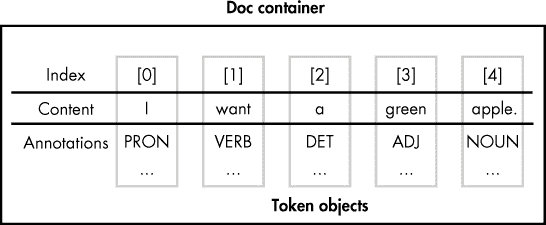
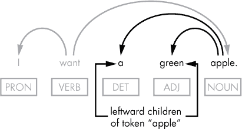
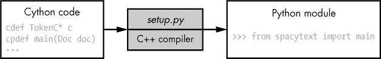

## 第三章：与容器对象和定制 spaCy**工作


你可以将构成 spaCy API 的主要对象分为两类：容器（例如 Tokens 和 Doc 对象）和处理管道组件（例如 词性标注器和命名实体识别器）。本章将进一步探讨容器对象。通过使用容器对象及其方法，你可以访问 spaCy 为文本中的每个词元分配的语言学注释。

你还将学习如何定制管道组件以适应你的需求，并使用 Cython 代码加速耗时的 NLP 任务。

### **spaCy 的容器对象**

一个 *容器对象* 将多个元素组织成一个单一的单元。它可以是一个对象集合，如词元或句子，或与单个对象相关的一组注释。例如，spaCy 的 Token 对象是一个容器，用于存储与文本中单个词元相关的一组注释，如该词元的词性。spaCy 中的容器对象模仿了自然语言文本的结构：一篇文本由句子组成，每个句子包含多个词元。

Token、Span 和 Doc 是从用户角度来看最常用的 spaCy 容器对象，分别表示一个词元、一个短语或句子以及一段文本。一个容器可以包含其他容器——例如，一个 Doc 包含多个 Token。在本节中，我们将探讨如何与这些容器对象一起工作。

#### ***获取 Doc 对象中词元的索引***

一个 Doc 对象包含通过对提交的文本进行分词处理而生成的 Token 对象集合。这些词元具有索引，使你可以根据它们在文本中的位置来访问它们，如 图 3-1 所示。



*图 3-1：Doc 对象中的词元*

这些词元的索引从 0 开始，这意味着文档的长度减去 1 即为结束位置的索引。为了将 Doc 实例拆分为词元，你可以通过从起始词元到结束词元的迭代，将词元导出为 Python 列表：

```py
>>> [doc[i] for i in range(len(doc))]

[A, severe, storm, hit, the, beach, .]
```

值得注意的是，我们可以通过显式地使用构造函数来创建一个 Doc 对象，如下例所示：

```py
>>> from spacy.tokens.doc import Doc

>>> from spacy.vocab import Vocab

>>> doc = Doc(➊Vocab(), ➋words=[u'Hi', u'there'])

doc

Hi there
```

我们调用 Doc 的构造函数，并传入以下两个参数：一个 *词汇对象* ➊——它是一个存储容器，提供词汇数据，如词性（形容词、动词、名词等）——以及一组词元，用于添加到正在创建的 Doc 对象中 ➋。

#### ***迭代一个词元的句法子节点***

假设我们需要在句子的句法依赖解析中查找一个词元的左子节点。例如，我们可以对一个名词执行此操作，以获得其形容词（如果有的话）。如果我们想知道哪些形容词可以修饰给定的名词，我们可能需要进行此操作。举个例子，考虑以下句子：

```py
I want a green apple.
```

图 3-2 中的图示突出了相关的句法依赖关系。



*图 3-2：左侧句法依赖关系示例*

为了编程方式地获取单词“apple”在此示例句子中的左侧句法子节点，我们可能会使用以下代码：

```py
>>> doc = nlp(u'I want a green apple.')

>>> [w for w in doc[4].lefts]

[a, green]
```

在这个脚本中，我们简单地遍历 apple 的子节点，并将它们以列表的形式输出。

有趣的是，在这个例子中，单词“apple”的左侧句法子节点代表了该标记所有句法子节点的完整序列。实际上，这意味着我们可以用`Token.children`替换`Token.lefts`，后者会找到标记的所有句法子节点：

```py
>>> [w for w in doc[4].children]
```

结果列表将保持不变。

我们还可以使用`Token.rights`来获取标记的右侧句法子节点：在这个例子中，单词“apple”是单词“want”的右侧子节点，如图 3-1 所示。

#### ***doc.sents 容器***

通常，分配给标记的语言注释只有在标记所在的句子上下文中才有意义。例如，关于单词是否为名词或动词的信息可能只适用于该单词所在的句子（如前面章节讨论的“count”一词）。在这种情况下，能够通过句子级索引访问文档中的标记会非常有用。

`doc.sents`属性使我们能够将文本分割成单独的句子，如下例所示：

```py
   >>> doc = nlp(u'A severe storm hit the beach. It started to rain.')

➊ >>> for sent in doc.sents:

➋ ...   [sent[i] for i in range(len(sent))]

   ...

   [A, severe, storm, hit, the, beach, .]

   [It, started, to, rain, .]

   >>>
```

我们遍历`doc`中的句子 ➊，为每个句子创建一个单独的标记列表 ➋。

同时，我们仍然可以使用全局或文档级索引引用多句文本中的标记，如下所示：

```py
>>> [doc[i] for i in range(len(doc))]

[A, severe, storm, hit, the, beach, ., It, started, to, rain, .]
```

如果需要检查正在处理的文本中第二个句子的第一个单词是否为代词（比如我们想找出两个句子之间的联系：第一个句子包含名词，第二个句子包含指代该名词的代词），那么通过句子级索引引用文档中的标记对象会非常有用：

```py
>>> for i,sent in enumerate(doc.sents):

...   if i==1 and sent[0].pos_== 'PRON':

...     print('The second sentence begins with a pronoun.')

The second sentence begins with a pronoun.
```

在这个例子中，我们在`for`循环中使用枚举器通过索引区分句子。这样我们可以筛选出不感兴趣的句子，只检查第二个句子。

确定句子中的第一个单词非常简单，因为它的索引总是 0。那最后一个呢？例如，如果我们需要找出文本中有多少个句子以动词结尾（当然不算句号）怎么办？

```py
>>> counter = 0

>>> for sent in doc.sents:

...   if sent[len(sent)-2].pos_ == 'VERB':

...     counter+=1

>>> print(counter)

1
```

虽然句子的长度各不相同，但我们可以通过`len()`函数轻松确定给定句子的长度。我们将`len(sent)`的值减去 2，原因有二：首先，索引总是从 0 开始，结束时是 size-1；其次，示例中两个句子的最后一个标记是句号，我们需要忽略它。

#### ***doc.noun_chunks 容器***

Doc 对象的`doc.noun_chunks`属性允许我们迭代文档中的名词短语。*名词短语*是以名词为核心的短语。例如，前一句包含以下名词短语：

```py
A noun chunk

a phrase

a noun

its head
```

使用`doc.noun_chunks`，我们可以按如下方式提取它们：

```py
>>> doc = nlp(u'A noun chunk is a phrase that has a noun as its head.')

>>> for chunk in doc.noun_chunks:

...   print(chunk)
```

或者，我们可以通过迭代句子中的名词并找到每个名词的句法子节点来提取名词短语。如在“迭代标记的句法子节点”中所示，您看到过如何基于句法依赖分析提取短语的示例。现在让我们将这一技术应用到本示例中的样本句子，手动组成名词短语：

```py
 for token in doc:

➊ if token.pos_=='NOUN':

     chunk = ''

  ➋ for w in token.children:

     ➌ if w.pos_ == 'DET' or w.pos_ == 'ADJ':

         chunk = chunk + w.text + ' '

➍ chunk = chunk + token.text

   print(chunk)
```

迭代标记时，我们只选择名词 ➊。接下来，在内层循环中，我们迭代名词的子节点 ➋，只选择那些是限定词或形容词的标记来构成名词短语（名词短语还可以包含其他词性，比如副词） ➌。然后我们将名词添加到短语中 ➍。因此，脚本的输出应与前一个示例相同。

#### ***试试看***

注意，用于修饰名词的词（限定词和形容词）始终是名词的左侧句法子节点。这使得我们能够在之前的代码中将`Token.children`替换为`Token.lefts`，然后根据需要移除对子节点是限定词或形容词的检查。

重写之前的代码片段，整合此处建议的修改。最终生成的名词短语集应该与您的脚本中的保持一致。

#### ***Span 对象***

Span 对象是 Doc 对象的一个切片。在前面的部分中，您已经看到了如何将它作为句子和名词短语的容器，分别来源于`doc.sents`和`doc.noun_chunks`。

Span 对象的使用不仅限于作为句子或名词短语的容器。我们还可以通过指定索引范围，将文档中相邻的多个标记包含在内，如以下示例所示：

```py
>>> doc=nlp('I want a green apple.')

>>> doc[2:5]

a green apple
```

Span 对象包含几个方法，其中最有趣的一个是`span.merge()`，它允许我们将 Span 合并为单一标记，从而重新标记文档。当文本包含由多个单词组成的名称时，这非常有用。

以下示例中的句子包含了两个由多个单词组成的地名（“Golden Gate Bridge”和“San Francisco”），我们可能希望将它们归为一类。默认的标记化方式不会将这些多词地名识别为单一标记。查看当我们列出文本的标记时会发生什么：

```py
>>> doc = nlp(u'The Golden Gate Bridge is an iconic landmark in San Francisco.')

>>> [doc[i] for i in range(len(doc))]

[The, Golden, Gate, Bridge, is, an, iconic, landmark, in, San, Francisco, .]
```

每个单词和标点符号都是它自己的标记。

使用`span.merge()`方法，我们可以改变这种默认行为：

```py
>>> span = doc[1:4]

>>> lem_id = doc.vocab.strings[span.text]

>>> span.merge(lemma = lem_id)

Golden Gate Bridge
```

在这个示例中，我们为“Golden Gate Bridge”span 创建一个词形，然后将该词形作为参数传递给`span.merge()`。（准确地说，我们传递了通过`doc.vocab.string`属性获取的词形 ID。）

请注意，`span.merge()`方法默认不会合并相应的词形。当没有参数时，它将合并的词元的词形设置为被合并的 span 中第一个词元的词形。为了指定我们希望分配给合并词元的词形，我们将其作为词形参数传递给`span.merge()`，如下面所示。

让我们检查一下词形还原器、词性标注器和依存解析器是否能够正确处理新创建的词形：

```py
>>> for token in doc:

      print(token.text, token.lemma_, token.pos_, token.dep_)
```

这应该会产生以下输出：

```py

The                the                DET   det

Golden Gate Bridge Golden Gate Bridge PROPN nsubj

is                 be                 VERB  ROOT

an                 an                 DET   det

iconic             iconic             ADJ   amod

landmark           landmark           NOUN  attr

in                 in                 ADP   prep

San                san                PROPN compound

Francisco          francisco          PROPN pobj

.                  .                  PUNCT punct
```

列表中显示的所有属性都已正确分配给“Golden Gate Bridge”词元。

#### ***试试看***

前面示例中的句子还包含“San Francisco”，这是另一个多词地名，你可能希望将其合并为单个词元。为了实现这一点，请执行与前面的代码片段中“Golden Gate Bridge”span 相同的操作。

在确定文档中“San Francisco”span 的起始和结束位置时，别忘了，位于新创建的“Golden Gate Bridge”词元右侧的词元索引已经相应地向下移动了。

### **自定义文本处理流水线**

在前面的章节中，你了解了 spaCy 的容器对象如何表示语言单元，如文本和单个词元，从而使你能够提取与它们相关的语言特征。现在，让我们来看看 spaCy API 中创建这些容器并将相关数据填充到其中的对象。

这些对象被称为处理流水线组件。正如你已经了解的，默认情况下，流水线设置包括词性标注器、依存解析器和实体识别器。你可以像这样检查你的 nlp 对象可用的流水线组件：

```py
>>> nlp.pipe_names

['tagger', 'parser', 'ner']
```

如下文所讨论的，spaCy 允许你自定义流水线中的组件，以最适合你的需求。

#### ***禁用流水线组件***

spaCy 允许你加载选定的流水线组件，并禁用不必要的组件。你可以通过设置`disable`参数来做到这一点：

```py
nlp = spacy.load('en', disable=['parser'])
```

在这个示例中，我们创建了一个没有依存解析器的处理流水线。如果我们在文本上调用这个 nlp 实例，词元将不会收到依存标签。以下示例清楚地说明了这一点：

```py
>>> doc = nlp(u'I want a green apple.')

>>> for token in doc:

...   print(➊token.text, ➋token.pos_, ➌token.dep_)

I     PRON

want  VERB

a     DET

green ADJ

apple NOUN

.     PUNCT
```

我们尝试为每个来自示例句子的词元打印出以下信息：文本内容➊、词性标记➋和依存标签➌。但依存标签没有出现。

#### ***逐步加载模型***

你可以通过`spacy.load()`一次性执行多个操作来加载模型。例如，当你进行以下调用时：

```py
nlp = spacy.load('en')
```

spaCy 在幕后执行以下步骤：

1.  在查看要加载的模型名称时，spaCy 会识别它应该初始化哪个语言类。在这个例子中，spaCy 会创建一个包含共享词汇和其他语言数据的英语类实例。

1.  spaCy 遍历处理管道的名称，创建相应的组件，并将它们添加到处理管道中。

1.  spaCy 从磁盘加载模型数据，并将其提供给语言类实例。

这些实现细节被`spacy.load()`隐藏，通常情况下，这会为你节省时间和精力。但有时，你可能需要显式地实现这些步骤，以便对过程进行更精细的控制。例如，你可能需要将一个自定义组件加载到处理管道中。该组件可以打印有关管道中 Doc 对象的一些信息，如标记数量或某些词性是否存在。

像往常一样，更精细的控制要求你提供更多的信息。首先，你需要获取实际的模型名称，而不是指定快捷方式，这样你才能获取模型包的路径。

你可以按照以下方式识别模型的完整名称：

```py
>>> print(nlp.meta['lang'] + '_' + nlp.meta['name'])

en_core_web_sm
```

代码中使用的`nlp.meta`属性是一个字典，包含已加载模型的元数据。在此示例中，你需要的是模型的语言和模型的名称。

既然你知道了模型的名称，你可以通过使用`get_package_path`工具函数来找到它在系统中的位置：

```py
>>> from spacy import util

>>> util.get_package_path('en_core_web_sm')

PosixPath('/usr/local/lib/python3.5/site-packages/en_core_web_sm')
```

这段代码中指定的路径可能会因你的 Python 安装目录不同而有所不同。但无论如何，这不是完整的路径。你需要再附加一个文件夹名。这个文件夹的名称由模型名称和附加的模型版本组成。（这是模型包所在的位置。）你可以通过以下方式确定它的名称：

```py
>>> print(nlp.meta['lang'] + '_' + nlp.meta['name'] + '-' + nlp.

meta['version'])

en_core_web_sm-2.0.0
```

你可能还想查看与模型一起使用的管道组件列表。（了解在模型上下文中支持哪些组件以及因此可以加载到管道中是很重要的。）你可以通过`nlp.meta`属性的`'pipeline'`字段来获取此信息，如下所示（或通过在“自定义文本处理管道”一文的第 37 页(page 37)中介绍的`nlp.pipe_names`属性）：

```py
>>> nlp.meta['pipeline']

['tagger', 'parser', 'ner']
```

有了这些信息，我们可以创建一个脚本，按照本节开头提供的步骤进行操作：

```py
   >>> lang = 'en'

   >>> pipeline = ['tagger', 'parser', 'ner']

   >>> model_data_path = '/usr/local/lib/python3.5/site-packages/en_core_web_sm/

   en_core_web_sm-2.0.0'

➊ >>> lang_cls = spacy.util.get_lang_class(lang) 

   >>> nlp = lang_cls() 

➋ >>> for name in pipeline:

➌ ...   component = nlp.create_pipe(name) 

➍ ...   nlp.add_pipe(component)

➎ >>> nlp.from_disk(model_data_path)
```

在这个脚本中，我们使用`spacy.util.get_lang_class()` ➊来加载一个语言类。加载哪个类取决于作为参数指定的两字母语言代码。在这个例子中，我们加载英语。接下来，在一个循环中 ➋，我们创建 ➌ 并添加 ➍ 管道组件到处理管道中。然后，我们从磁盘加载一个模型，指定你机器上使用的路径 ➎。

看这段代码，可能会觉得一旦我们将管道组件添加到处理管道中，它们就变得可用。实际上，在加载模型数据之前，我们不能使用它们，所以如果我们省略脚本中的最后一行代码，我们甚至无法使用这个 nlp 实例创建 Doc 对象。

#### ***自定义管道组件***

通过自定义管道组件，你可以最好地满足应用程序的需求。例如，假设你希望模型的命名实体识别系统将“Festy”识别为一个城市区。默认情况下，它会将其识别为一个组织，如下所示：

```py
>>> doc = nlp(u'I need a taxi to Festy.')

>>> for ent in doc.ents:

...  print(ent.text, ent.label_)

Festy ORG
```

标签`ORG`代表公司、机构和其他组织。但你希望让实体识别器将其分类为`DISTRICT`类型的实体。

实体识别器组件在 spaCy API 中作为`EntityRecognizer`类实现。通过使用该类的方法，你可以初始化一个`ner`实例，然后将其应用于文本。在大多数情况下，你无需显式执行这些操作；spaCy 在你创建 nlp 对象并创建 Doc 对象时会自动为你处理这些操作。

但是当你想用自己的示例更新现有模型的命名实体识别系统时，你需要显式地使用一些`ner`对象的方法。

在以下示例中，你首先需要向支持的实体类型列表中添加一个名为`DISTRICT`的新标签。然后你需要创建一个训练示例，这将是你向实体识别器展示的内容，让它学习如何将`DISTRICT`标签应用到文本中。准备步骤的最简单实现可能如下所示：

```py
LABEL = 'DISTRICT'

TRAIN_DATA = [

➊ ('We need to deliver it to Festy.', {

    ➋ 'entities': [(25, 30, 'DISTRICT')]

  }),

➌ ('I like red oranges', {

'entities': []

  })

]
```

为了简单起见，这个训练集只包含两个训练样本（通常，你需要提供更多的样本）。每个训练样本包括一个句子，这个句子可能包含也可能不包含需要分配新实体标签的实体 ➊。如果样本中包含实体，你需要指定它的起始和结束位置 ➋。训练集中的第二个句子根本不包含“Festy”这个词 ➌。这是因为训练过程的组织方式。第十章会更深入地讲解这个过程的细节。

下一步是向实体识别器添加一个新的实体标签`DISTRICT`：但在此之前，你必须获取`ner`管道组件的实例。你可以通过以下方式实现：

```py
ner = nlp.get_pipe('ner')
```

一旦你有了`ner`对象，你可以使用`ner.add_label()`方法向其中添加新的标签，如下所示：

```py
ner.add_label(LABEL)
```

另一个在开始训练实体识别器之前需要进行的操作是禁用其他管道，以确保在训练过程中只有实体识别器会被更新：

```py
nlp.disable_pipes('tagger')

nlp.disable_pipes('parser')
```

然后你可以开始使用本节前面创建的`TRAIN_DATA`列表中的训练样本来训练实体识别器：

```py
optimizer = nlp.entity.create_optimizer()

import random

for i in range(25):

    random.shuffle(TRAIN_DATA)

    for text, annotations in TRAIN_DATA:

        nlp.update([text], [annotations], sgd=optimizer)
```

在训练过程中，样本示例会以循环的方式随机顺序展示给模型，以便有效地更新底层模型的数据，避免根据训练示例的顺序进行任何泛化。执行将花费一些时间。

一旦前面的代码成功完成，你可以测试更新后的优化器如何识别 Festy 这个标记：

```py
>>> doc = nlp(u'I need a taxi to Festy.')

>>> for ent in doc.ents:

... print(ent.text, ent.label_) 

...

Festy DISTRICT
```

根据输出，它工作正常。

请记住，当你关闭此 Python 解释器会话时，你刚刚所做的更新将会丢失。为了解决这个问题，`Pipe`类——`EntityRecognizer`类和其他处理流程组件类的父类——有一个`to_disk()`方法，可以将管道序列化到磁盘：

```py
>>> ner.to_disk('/usr/to/ner')
```

现在你可以使用`from_disk()`方法将更新后的组件加载到新的会话中。为了确保它正常工作，关闭当前的解释器会话，启动一个新的会话，然后运行以下代码：

```py
   >>> import spacy

   >>> from spacy.pipeline import EntityRecognizer

➊ >>> nlp = spacy.load('en', disable=['ner'])

➋ >>> ner = EntityRecognizer(nlp.vocab)

➌ >>> ner.from_disk('/usr/to/ner')

➍ >>> nlp.add_pipe(ner)
```

你加载模型，禁用其默认的`ner`组件 ➊。接着，你创建一个新的`ner`实例 ➋，并将其从磁盘加载数据 ➌。然后，你将`ner`组件添加到处理流程中 ➍。

现在你可以这样测试它：

```py
>>> doc = nlp(u'We need to deliver it to Festy.')

>>> for ent in doc.ents:

... print(ent.text, ent.label_)

Festy DISTRICT
```

如你所见，实体识别器正确地标记了“Festy”这个名字。

虽然我只向你展示了如何定制命名实体识别器，但你也可以以类似的方式定制其他处理流程组件。

### **使用 spaCy 的 C 级数据结构**

即使是 spaCy，涉及大量文本处理的自然语言处理（NLP）操作也可能非常耗时。例如，你可能需要为某个特定名词编写最合适的形容词列表，为此你需要检查大量的文本。如果处理速度对你的应用程序至关重要，spaCy 允许你利用 Cython 的 C 级数据结构和接口。Cython 是 spaCy 编写的语言之一（另一个是 Python）。因为 Cython 是 Python 的超集，所以 Cython 几乎认为所有 Python 代码都是有效的 Cython 代码。除了 Python 的功能，Cython 还允许你本地调用 C 函数并声明快速的 C 类型，从而使编译器能够生成非常高效的代码。你可能希望使用 Cython 来加速耗时的文本处理操作。

spaCy 的核心数据结构作为 Cython 对象实现，spaCy 的公共 API 允许你访问这些结构。有关详细信息，请参阅文档中的 Cython 架构页面，链接为 *[`spacy.io/api/cython/`](https://spacy.io/api/cython/)*。

#### ***原理***

要在 spaCy 中使用 Cython 代码，你必须将其转换为 Python 扩展模块，然后可以将其导入到你的程序中，如图 3-3 所示。



*图 3-3：从 Cython 脚本构建 Python 扩展模块*

你可以通过将 Cython 代码保存为*.pyx*文件，然后运行一个*setup.py* Python 脚本来完成这一步，该脚本首先将 Cython 代码转换为相应的 C 或 C++代码，然后调用 C 或 C++编译器。脚本会生成 Python 扩展模块。

#### ***准备工作环境并获取文本文件***

在开始构建 Cython 代码之前，你需要在机器上安装 Cython 并获取一个大型文本文件作为工作材料。

使用`pip`在你的机器上安装 Cython：

```py
pip install Cython
```

接下来，为了模拟一个耗时的任务并衡量性能，你需要一个大型文本文件。为此，你可以使用一个*Wikipedia dump file*，它包含了一组用 XML 包装的页面。Wikipedia dump 文件可以在*[`dumps.wikimedia.org/enwiki/latest/`](https://dumps.wikimedia.org/enwiki/latest/)*下载。滚动到*enwiki-latest-pages-articles*.xml-*.bz2*文件，并选择一个足够大进行测试的文件。但除非你愿意花几个小时等待你的机器完成测试代码，否则不要选择太大的文件。10–100MB 大小的 dump 文件应该足够合适。

下载完文件后，使用像*gensim.corpora.wikicorpus*这样的工具提取原始文本（*[`radimrehurek.com/gensim/corpora/wikicorpus.html`](https://radimrehurek.com/gensim/corpora/wikicorpus.html)*），该工具专为从 Wikipedia 数据库 dump 构建文本语料库而设计。

#### ***你的 Cython 脚本***

现在我们来写一个 Cython 脚本，用于分析文本文件。为简单起见，假设你要做的就是统计提交文本中的人称代词数量。这意味着你需要统计被分配了`PRP`词性标签的 token 数量。

**警告**

*如文档所述，旨在从 Cython 使用的 C 级别方法优先考虑速度而非安全性。代码中的错误可能导致执行突然崩溃。*

在本地文件系统中的一个目录下，创建一个名为*spacytext.pyx*的文件，并将以下代码插入其中：

```py
   from cymem.cymem cimport Pool

   from spacy.tokens.doc cimport Doc

   from spacy.structs cimport TokenC

   from spacy.typedefs cimport hash_t

➊ cdef struct DocStruct:

       TokenC* c

       int length

➋ cdef int counter(DocStruct* doc, hash_t tag):

       cdef int cnt = 0

       for c in doc.c[:doc.length]:

          if c.tag == tag:

             cnt += 1

       return cnt

➌ cpdef main(Doc mydoc):

       cdef int cnt

       cdef Pool mem = Pool()

       cdef DocStruct* doc_ptr = <DocStruct*>mem.alloc(1, sizeof(DocStruct))

       doc_ptr.c = mydoc.c

       doc_ptr.length = mydoc.length

       tag = mydoc.vocab.strings.add('PRP')

       cnt = counter(doc_ptr, tag)

       print(doc_ptr.length)

       print(cnt)
```

我们首先使用一组`cimport`语句导入必要的 Cython 模块，主要来自 spaCy 库。

然后，我们定义 Cython 结构体`DocStruct`，作为处理中文本的容器，以及`TokenC*`变量 ➊，它是一个指向 spaCy 中用于表示 Token 对象的数据容器`TokenC`结构体的指针。

接下来，我们定义一个 Cython 函数`counter` ➋，用于统计文本中的人称代词数量。

**注意**

*`cdef`*函数在导入该模块的 Python 代码中不可用。如果你想创建一个函数，既能在 Python 中可见，又能同时利用 C 级别的数据结构和接口，你需要将该函数声明为`cpdef`。

最后，我们定义一个`cpdef`的 Cython/Python 主函数 ➌，我们可以在 Python 中使用它。

#### ***构建 Cython 模块***

与 Python 不同，你必须编译 Cython 代码。你可以通过多种方式进行编译，其中最好的方式是编写一个 distutils/setuptools *setup.py* Python 脚本。在与 Cython 脚本相同的目录中创建一个*setup.py*文件。你的*setup.py*文件应包括以下代码：

```py
   from distutils.core import setup

   from Cython.Build import cythonize

➊ import numpy

   setup(name='spacy text app',

     ➋ ext_modules=cythonize("spacytext.pyx", language="c++"),

      ➌ include_dirs=[numpy.get_include()]

          )
```

这是一个常规的 distutils/setuptools *setup.py*脚本，只是多了两个与我们当前示例相关的部分。首先，我们导入了`numpy` ➊，然后显式指定了在哪里找到库的*.h*文件 ➌。我们这样做是为了避免在某些系统中发生的*numpy/arrayobject.h*编译错误。我们使用另一个设置选项，`language = "c++"` ➋，以指示设置过程使用 C++编译器，而不是默认的 C 编译。

现在我们有了设置脚本，你可以构建你的 Cython 代码。你可以在系统终端中执行此操作，方法如下：

```py
python setup.py build_ext --inplace
```

在编译过程中会显示一堆信息，其中一些可能是警告，但很少是关键性的。例如，你可能会看到这个消息，但它对过程并不关键：

```py
#warning "Using deprecated NumPy API ...
```

#### ***测试模块***

编译成功完成后，`spacytext`模块将被添加到你的 Python 环境中。为了测试新创建的模块，打开一个 Python 会话并运行以下命令：

```py
>>> from spacytext import main
```

如果没有显示错误，你可以输入以下命令（假设你的文本数据保存在一个*test.txt*文件中）：

```py
   >>> import spacy

   >>> nlp = spacy.load('en')

➊ >>> f= open("test.txt","rb")

   >>> contents =f.read()

➋ >>> doc = nlp(contents[:100000].decode('utf8'))

➌ >>> main(doc)

   21498

   216
```

你以二进制模式打开包含文本数据的文件（在本例中）以获取一个字节对象 ➊。如果文件太大，你可以在创建 Doc 对象时只选择其部分内容 ➋。一旦你创建了 Doc 对象，就可以使用 Cython 创建的`spacytext`模块，调用其`main()`函数 ➌。

`spacytext.main()`函数生成的输出中的第一个数字表示提交的文本中找到的总词汇数。第二个数字表示在同一文本中找到的人称代词的数量。

### **总结**

在本章中，你学习了 spaCy 中最重要的容器对象。你还学会了如何自定义文本处理管道，并使用 Cython 中的 spaCy C 级数据结构和接口。
