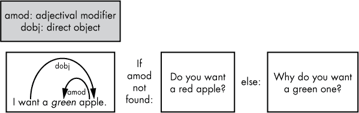

## 第四章：提取和使用语言特征**


在前几章中，你学习了如何访问语言特征，如词性标注、句法依赖关系和命名实体，作为文本处理管道的一部分。本章将向你展示如何使用词性标注和句法依赖标签来提取和生成文本，帮助你构建提问型聊天机器人、定位文本中的特定短语等。

几乎每个 NLP 应用程序都需要从文本中提取特定的信息，并生成与特定情境相关的新文本。例如，一个聊天机器人必须能够与用户进行对话，这意味着它必须能够识别出用户文本中的特定部分，然后生成适当的回应。让我们看看如何使用语言特征做到这一点。

### **使用词性标注提取和生成文本**

词性标注可以帮助你从文本中检索特定类型的信息，它们还可以帮助你根据提交的句子生成全新的句子。在这一部分，我们将向你介绍一些新的词性标注，编写一个脚本来查找描述金额的短语，并将陈述句转化为疑问句。有关 spaCy 中用于英语模型的常见词性标注列表，请参见表 2-1 中的第 22 页。

#### ***数字、符号和标点符号标注***

除了名词、动词和句子中的其他词的词性标注外，spaCy 还有符号、数字和标点符号的标注。让我们通过处理以下句子来看这些标注：

```py
The firm earned $1.5 million in 2017.
```

首先，让我们从句子中的标记中提取粗粒度的词性特征，看看 spaCy 如何区分不同的词性类别。我们可以通过以下脚本实现：

```py
>>> import spacy

>>> nlp = spacy.load('en')

>>> doc = nlp(u"The firm earned $1.5 million in 2017.")

>>> for token in doc:

...   print(token.text, ➊token.pos_, ➋spacy.explain(token.pos_))

...
```

我们为提交的句子创建一个 Doc 对象，然后输出粗粒度的词性标注➊。我们还使用`spacy.explain()`函数，它会返回给定语言特征的描述➋。

输出应如下所示：

```py

The     DET   determiner

firm    NOUN  noun

earned  VERB  verb

$       SYM   symbol

1.5     NUM   numeral

million NUM   numeral

in      ADP   adposition

2017    NUM   numeral

.       PUNCT punctuation
```

注意到粗粒度标注器将数字、符号和标点符号区分为独立的类别。如你所见，它甚至能识别出拼写出来的“million”。

现在，为了比较，我们将输出该示例句子的粗粒度和细粒度词性标注，并为细粒度标注添加一列描述：

```py
>>> for token in doc:

...   print(token.text, token.pos_, token.tag_, spacy.explain(token.tag_))
```

输出应如下所示：

```py

The     DET   DT  determiner

firm    NOUN  NN  noun, singular

earned  VERB  VBD verb, past tense

$       SYM   $   symbol, currency

1.5     NUM   CD  cardinal number

million NUM   CD  cardinal number

in      ADP   IN  conjunction, subordinating or preposition

2017    NUM   CD  cardinal number

.       PUNCT .   punctuation mark, sentence closer
```

第二列和第三列分别包含粗粒度和细粒度词性标注。第四列给出了第三列中细粒度标注的描述。

细粒度标签将每个类别细分为子类别。例如，粗粒度类别 `SYM`（符号）有三个细粒度子类别。它们分别是：`$` 代表货币符号，`#` 代表数字符号，`SYM` 代表其他所有符号，如 +、−、×、÷、=。这种细分在你需要区分不同类型符号时非常有用。例如，你可能在处理数学文章时，想要脚本识别数学公式中常见的符号。或者，你可能在编写一个需要识别财务报告中的货币符号的脚本。

**注意**

*由于 spaCy 的词性标注器依赖于标记的上下文来生成标签，你可能会遇到不同上下文中使用的标记得到不同标签的情况。*

现在让我们看看如何利用这些特定的词性标签来提取和生成文本。

#### ***提取货币描述***

假设你正在开发一个处理财务报告的应用程序，需要从冗长乏味的文本中提取必要的信息。实际上，财务报告通常很大，但你真正需要的只是其中的数字。特别是，你关心的是那些表示金额且以货币符号开头的短语。例如，你的脚本应该能够从前述示例句子中提取出短语“$1.5 million”，而不是“2017”。

以下脚本展示了如何仅依靠词性标签提取句子中的短语。你可以将此脚本保存到文件中，然后运行它，或者在 Python 会话中执行代码：

```py
   import spacy

   nlp = spacy.load('en')

   doc = nlp(u"The firm earned $1.5 million in 2017.")

   phrase = ''

➊ for token in doc:

   ➋ if token.tag_ == '$':

         phrase = token.text

         i = token.i+1

      ➌ while doc[i].tag_ == 'CD':

             phrase += doc[i].text + ' '

             i += 1

      ➍ break

phrase = phrase[:-1]

print(phrase)
```

我们遍历句子的标记 ➊，寻找一个词性标签为 `$` 的标记 ➋。这个标签表示货币符号，通常用于表示金额的短语开头。一旦找到货币符号，我们就开始构建短语，检查紧随其后的标记是否是数字。为此，我们实现了一个 `while` 循环，循环中我们获取货币符号右侧的标记，并检查它们是否有 `CD` 标签，这是表示基数的词性标签 ➌。当我们遇到非数字标记时，我们退出 `while` 循环并跳出遍历句子标记的 `for` 循环 ➍。

当我们运行脚本时，输出应该如下所示：

```py
$1.5 million
```

这正是我们所期望的输出。

请记住，分配给 `$` 细粒度词性标签的货币符号不一定是`$`。这个词性标签也可能标记其他常见的货币符号，如 £ 和 €。例如，上述脚本会识别“£1,500,000”这个短语。

#### ***尝试这个***

我们编写了这个脚本，用于从提交的句子中提取一个指代金额的短语。一旦脚本找到该短语，它便会完成执行。但在实践中，你可能会遇到一个句子，其中有多个这样的短语，例如以下示例：“公司在 2017 年赚了 150 万美元，而 2016 年赚了 120 万美元。”

修改脚本，使其能够提取句子中所有指代金额的短语。为此，删除`break`语句，以防止循环在找到第一个感兴趣的短语后结束。然后，将负责准备和打印找到的短语的代码（脚本中的最后两行）移入循环中，这样你就可以对每个在提交的句子中找到的感兴趣短语调用这两行代码。

#### ***将陈述转换为问题***

假设你的自然语言处理应用程序必须能够根据提交的陈述生成问题。例如，聊天机器人与用户保持对话的一种方式是通过向用户提问确认性问题。当用户说“我确定”时，聊天机器人可能会问“你真的确定吗？”要做到这一点，聊天机器人必须能够生成一个相关的问题。

假设用户提交的句子是这样的：

```py
I can promise it is worth your time.
```

这个句子包含了几个动词和代词，每个都有不同的形态。为了更清楚地看到这一点，我们来看看 spaCy 为这个句子中的标记分配的词性标注：

```py
>>> doc = nlp(u"I can promise it is worth your time.")

>>> for token in doc:

...   print(token.text, token.pos_, token.tag_)

...
```

我们打印出这些标记、它们的粗粒度词性标注和精粒度词性标注，生成如下输出：

```py

I       PRON PRP

can     VERB MD

promise VERB VB

it      PRON PRP

is      VERB VBZ

worth   ADJ  JJ

your    ADJ  PRP$

time    NOUN NN

.      PUNCT .
```

从精细的词性标注中，你可以区分句中动词和代词的形态类别。例如，精细的词性标注`PRP`标记人称代词，`PRP$`标记所有格代词，这使得你能够在程序中区分这两种代词。我们在处理这个示例时会需要这些信息。

这里讨论的句子的确认性问题可能如下所示（当然，另一个陈述会需要另一个确认性问题）：

```py
Can you really promise it is worth my time?
```

从人类的角度来看，从陈述中形成这个问题看起来相当简单：你只需要改变一些词语的顺序，适当地更改代词，并将副词修饰语“really”添加到主谓动词（紧跟在主语后面的那个动词）。但如何在程序中实现所有这些操作呢？

我们来看看一些词性标注。在这个示例句子中，形成问题所涉及的动词是“can”和“promise”。精细的词性标注将第一个动词“can”标记为情态助动词，而将第二个动词标记为基本形式的动词。注意，在前面的确认性问题中，情态助动词与人称代词交换了位置，这一过程称为*倒装*。我们需要在脚本中实现这一点。

关于代词，聊天机器人应该遵循常见的日常对话模式。表 4-1 总结了此类应用中的代词使用方法。

**表 4-1:** 聊天机器人中代词的使用

|  | **人称代词** | **物主代词** |
| --- | --- | --- |
| 聊天机器人 | 我, 我自己 | 我的, 我的东西 |
| 用户 | 你 | 你的, 你的东西 |

换句话说，聊天机器人将自己称为“我”或“我自己”，并将用户称为“你”。

以下步骤概述了我们需要做的事情，以从原始陈述中生成一个问题：

1.  将原句中的单词顺序从“主语 + 情态助动词 + 不定式动词”更改为“情态助动词 + 主语 + 不定式动词”。

1.  将人称代词“I”（句子的主语）替换为“你”。

1.  将物主代词“你的”替换为“我的”。

1.  将副词修饰语“really”放置在动词“promise”之前，以强调后者。

1.  将句末的标点符号“.”替换为“?”。

以下脚本实现了这些步骤：

```py
  import spacy

  nlp = spacy.load('en')

  doc = nlp(u"I can promise it is worth your time.")

  sent = ''

  for i,token in enumerate(doc):

➊ if token.tag_ == 'PRP' and doc[i+1].tag_ == 'MD' and doc[i+2].tag_ == 'VB':

    ➋ sent = doc[i+1].text.capitalize() + ' ' + doc[i].text

       sent = sent + ' ' + ➌doc[i+2:].text

    ➍ break

 #By now, you should have: 'Can I promise it is worth your time.'

   #Retokenization

➎ doc=nlp(sent)

   for i,token in enumerate(doc):

 ➏ if token.tag_ == 'PRP' and token.text == 'I':

        sent = doc[:i].text + ' you ' + doc[i+1:].text

        break

 #By now, you should have: 'Can you promise it is worth your time.'

 doc=nlp(sent)

 for i,token in enumerate(doc):

➐ if token.tag_ == 'PRP$' and token.text == 'your':

       sent = doc[:i].text + ' my ' + doc[i+1:].text

       break

 #By now, you should have: 'Can you promise it is worth my time.' 

 doc=nlp(sent)

 for i,token in enumerate(doc):

   if token.tag_ == 'VB':

    ➑ sent = doc[:i].text + ' really ' + doc[i:].text

      break

 #By now, you should have: 'Can you really promise it is worth my time.'

 doc=nlp(sent)

➒ sent = doc[:len(doc)-1].text + '?'

 #Finally, you should have: 'Can you really promise it is worth my time?'

 print(sent)
```

我们在单独的 `for` 循环中执行前四个步骤。首先，我们遍历句子中的标记，改变主语和动词的顺序，使句子变为一个问题。在这个例子中，我们寻找一个紧跟在人称代词后的情态助动词（标记为 `MD`），并且后面跟着不定式动词 ➊。找到这一系列词后，我们将情态助动词立即移到人称代词前面，置于句首 ➋。

为了组成一个新句子，我们使用在 Python 中称为 *切片* 的技术，它允许我们通过指定起始和结束索引，从序列对象（如字符串或列表）中提取子序列。在这种情况下，我们可以对 Doc 对象应用切片，以从中提取给定的标记子序列。例如，`slice doc[2:]` 将包含从索引 2 开始到文档末尾的标记，在这个例子中是“保证这值得你花时间。” ➌。一旦我们将情态助动词移到新位置，就退出 `for` 循环 ➍。

你可能会想，为什么我们不直接使用人称代词和情态助动词的索引来进行倒装呢？因为我们知道人称代词位于索引 0，而情态助动词位于索引 1，为什么我们还需要使用一个循环，遍历整个词汇集来找到情态助动词的位置呢？动词不总是紧跟主语，因此应该是句子的第二个单词吗？

事实上，句子并不总是从主语开始。例如，如果句子是“果然，我可以保证这值得你花时间。”呢？在这种情况下，脚本会知道省略前两个词并从主语开始处理。

由于倒装，我们得到一个新的句子作为字符串。为了进一步处理这个句子，我们需要为它获取一个 Doc 对象 ➎。

接下来，我们创建一个新的`for`循环，将个人代词“I”替换为个人代词“you”。为此，我们搜索个人代词（标记为`PRP`）。如果个人代词是“I”，我们将其替换为“you” ➏。然后我们退出`for`循环。

我们重复这个过程，通过搜索`PRP$`标签 ➐来将所有的物主代词“your”替换成“my”。然后，在一个新的`for`循环中，我们找到一个不定式形式的动词，并在它前面插入副词修饰语“really” ➑。

最后，我们将句子的句号替换为问号。这是唯一一个不需要使用循环的步骤。原因是，在所有可能的句子中，句号和问号都位于句子的末尾，因此我们可以通过`len(doc)-1`的索引可靠地找到它们 ➒。

当我们运行这段代码时，我们应该得到以下输出：

```py
Can you really promise it is worth my time?
```

这个脚本是一个好的开始，但它并不能处理每一个提交的陈述句。例如，句子中可能包含一个除“I”之外的个人代词，但我们的脚本没有明确检查这一点。此外，有些句子没有助动词，比如句子“I love eating ice cream”（我喜欢吃冰淇淋）。在这种情况下，我们必须使用“do”这个词来构成问题，而不是像“can”或“should”这样的词，像这样：“Do you really love eating ice cream?” 但如果句子包含动词“to be”，比如“I am sleepy”（我困了），我们必须把动词移到句首，变成这样：“Are you sleepy?”

这个聊天机器人真正的实现必须能够为提交的句子选择合适的选项。你可以在“决定聊天机器人应该问什么问题”一节中看到一个“做”的例子，位于第 56 页。

#### ***尝试这个***

检查“将陈述句转化为问题”中的脚本时，你可能会注意到其中一些代码块看起来非常相似，包含重复的操作。在每一步中，你都会替换句子中的某个部分，然后重新分词。这意味着你可以尝试将代码进行泛化，把重复的操作放入一个函数中。

在编写这样的函数之前，花点时间了解它需要接受哪些参数，以便执行你在脚本中看到的文本操作。特别地，你需要明确指定你要搜索的词元和你希望对其执行的操作，方法是将其替换为另一个词元或在它前面添加一个词元。

一旦你定义了这个函数，就可以编写调用它的主代码，实现与原脚本相同的功能。

### **在文本处理中使用句法依赖标签**

正如你在“使用词性标签提取和生成文本”一节中学习的那样，词性标签是智能文本处理的强大工具。但在实际操作中，你可能需要了解更多关于句子中的词元信息，以便更智能地处理它。

例如，你可能需要知道一个人称代词是句子的主语还是语法宾语。有时候，这个任务很简单。人称代词“I”，“he”，“she”，“they”和“we”几乎总是主语。当用作宾语时，“I”变成“me”，比如在句子“A postman brought me a letter.”中。

但当涉及到一些其他人称代词时，比如“you”或“it”，它们作为主语或宾语时看起来是一样的，这一点可能不那么清晰。考虑以下两个句子：“I know you. You know me.” 在第一个句子中，“you”是动词“know”的直接宾语。在第二个句子中，“you”是动词的主语。

让我们使用句法依存关系标签和词性标签来解决这个问题。然后我们将应用句法依存关系标签来构建一个更好的问答聊天机器人版本。

#### ***区分主语和宾语***

要程序化地确定像“you”或“it”这样的代词在给定句子中的角色，你需要检查分配给它的依存关系标签。通过将词性标签与依存关系标签结合使用，你可以获得更多关于句子中词汇的信息。

让我们回到前面的句子，并查看对其进行依存解析的结果：

```py
>>> doc = nlp(u"I can promise it is worth your time.")

>>> for token in doc:

...   print(token.text, token.pos_, token.tag_, token.dep_, spacy.explain(token.dep_))
```

我们提取词性标签、依存关系标签以及依存关系标签的描述：

```py
I       PRON  PRP  nsubj     nominal subject

can     VERB  MD   aux       auxiliary

promise VERB  VB   ROOT      None

it      PRON  PRP  nsubj     nominal subject

is      VERB  VBZ  ccomp     clausal complement

worth   ADJ   JJ   acomp     adjectival complement

your    ADJ   PRP$ poss      possession modifier

time    NOUN  NN   npadvmod  noun phrase as adverbial modifier

.       PUNCT .    punct     punctuation
```

第二列和第三列分别包含粗粒度和细粒度的词性标签。第四列包含依存关系标签，第五列包含这些依存关系标签的描述。

将词性标签和依存关系标签结合起来，可以为你提供更清晰的每个词汇在句子中的语法角色，比单独使用词性标签或依存关系标签更有帮助。例如，在这个例子中，分配给词汇“is”的词性标签`VBZ`表示它是第三人称单数现在时动词，而依存关系标签`ccomp`则表示“is”是一个*从句补语*（带有内部主语的依赖从句）。在这个例子中，“is”是动词“promise”的从句补语，内部主语是“it”。

为了弄清楚在“I know you. You know me.”中“you”的角色，我们需要查看以下为这些词汇分配的词性标签和依存关系标签：

```py
I     PRON  PRP  nsubj  nominal subject

know  VERB  VBP  ROOT   None

you   PRON  PRP  dobj   direct object

.     PUNCT .    punct  punctuation

You   PRON  PRP  nsubj  nominal subject

know  VERB  VBP  ROOT   None

me    PRON  PRP  dobj   direct object

.     PUNCT .    Punct  punctuation
```

在这两种情况下，“you”都被分配了相同的词性标签：`PRON`和`PRP`（粗粒度和细粒度标签，分别）。但这两个情况有不同的依存关系标签：第一个句子中的`dobj`和第二个句子中的`nsubj`。

#### ***决定聊天机器人应该提问什么问题***

有时候，你可能需要浏览句子的依存树以提取必要的信息。例如，考虑以下聊天机器人与用户之间的对话：

```py
User: I want an apple.

Bot: Do you want a red apple?

User: I want a green apple.

Bot: Why do you want a green one?
```

聊天机器人能够通过提问继续对话。但请注意，名词“apple”是否有形容词修饰语在决定它应该提什么类型的问题时起着关键作用。

英语中有两种基本的提问类型：是/否问题和信息型问题。是/否问题，比如我们在“将陈述转为问题”一节中讨论的例子，在第 51 页，只有两个可能的答案：是或否。要形成这种类型的问题，可以将情态助动词放在主语前面，主语后面是主要动词。例如：“Could you modify it?”

信息型问题的回答应该提供比简单的“是”或“否”更多的信息。它们以疑问词开头，如“what”，“where”，“when”，“why”或“how”。在疑问词之后，形成信息型问题的过程与是/否问题相同。例如：“What do you think about it?”

在前面苹果示例中的第一个案例中，聊天机器人询问的是一个是/否问题。在第二个案例中，当用户用形容词“green”修饰名词“apple”时，聊天机器人会询问一个信息型问题。

图 4-1 中的流程图总结了这种方法。



*图 4-1：输入句子中是否存在修饰语决定了聊天机器人提问的问题类型。*

以下脚本只是分析提交的句子以决定提问什么类型的问题，然后形成适当的问题。我们将通过单独的部分来逐步讲解代码，但你应该将整个程序保存为一个名为*question.py*的文件。

首先导入`sys`模块，它提供了接受句子作为处理参数的功能：

```py
import spacy

import sys
```

这是对之前脚本的改进，之前我们是将要分析的句子硬编码在程序中。现在用户可以提交自己的句子作为输入。

接下来，我们定义一个函数，它可以识别并提取提交文档中任何作为直接宾语的名词短语。例如，如果你提交的文档包含句子“I want a green apple.”，它将返回短语“a green apple”：

```py
 def find_chunk(doc):

   chunk = ''

➊ for i,token in enumerate(doc):

  ➋ if token.dep_ == 'dobj':

     ➌ shift = len([w for w in token.children])

     ➍ #print([w for w in token.children])

     ➎ chunk = doc[i-shift:i+1]

        break

 return chunk
```

我们遍历提交的句子中的标记 ➊，并通过检查其依赖标签是否为`dobj` ➋来寻找作为直接宾语的单词。在句子“I want a green apple.”中，直接宾语是名词“apple”。一旦我们找到了直接宾语，就需要确定它的句法子项 ➌，因为它们组成了我们用来决定应该提问什么类型问题的部分。为了调试目的，我们还可能需要查看直接宾语的子项 ➍。

为了提取块，我们对`Doc`对象进行切片，计算切片的起始和结束索引，方法如下：起始索引是直接宾语的索引减去其语法子节点的数量。正如你可能猜到的，这是最左侧子节点的索引。结束索引是直接宾语的索引加一，所以块中包含的最后一个标记是直接宾语 ➎。

为了简化，脚本中实现的算法假设直接宾语只有左向的子节点。事实上，情况并非总是如此。例如，在以下句子中，“I want to touch a wall painted green.”（我想摸一面涂了绿色的墙。）我们需要检查直接宾语“wall”的左右子节点。此外，因为“green”不是“wall”的直接子节点，我们需要沿着依存树走，确定“green”是“wall”的修饰语。我们将在第六章中更深入地讨论前修饰语和后修饰语。

以下函数检查块并决定聊天机器人应提出什么样的问题：

```py
 def determine_question_type(chunk):

➊ question_type = 'yesno'

   for token in chunk:

  ➋ if token.dep_ == 'amod':

    ➌ question_type = 'info'

   return question_type
```

我们将`question_type`变量初始化为`yesno`，表示是/否问题类型 ➊。然后，在提交的块中，我们搜索标记为`amod`的标记，它表示形容词修饰语 ➋。若找到，我们将`question_type`变量设置为`'info'`，表示信息性问题类型 ➌。

一旦我们确定了使用哪种问题类型，以下函数会根据提交的句子生成一个问题：

```py

def generate_question(doc, question_type):

  sent = ''

  for i,token in enumerate(doc):

    if token.tag_ == 'PRP' and doc[i+1].tag_ == 'VBP':

     sent = 'do ' + doc[i].text

     sent = sent + ' ' + doc[i+1:].text

     break

  doc=nlp(sent)

  for i,token in enumerate(doc):

    if token.tag_ == 'PRP' and token.text == 'I':

     sent = doc[:i].text + ' you ' + doc[i+1:].text

     break

   doc=nlp(sent)

➊ if question_type == 'info':

     for i,token in enumerate(doc):

       if token.dep_ == 'dobj':

         sent = 'why ' + doc[:i].text + ' one ' + doc[i+1:].text

         break

➋ if question_type == 'yesno':

     for i,token in enumerate(doc):

       if token.dep_ == 'dobj':

     ➌ sent = doc[:i-1].text + ' a red ' + doc[i:].text

        break

   doc=nlp(sent)

   sent = doc[0].text.capitalize() +' ' + doc[1:len(doc)-1].text + '?'

   return sent
```

在一系列`for`循环中，我们通过进行倒装和改变人称代词，将提交的陈述句转化为疑问句。在这个例子中，因为陈述句中没有情态助动词，我们在人称代词前加上动词“do”来构成疑问句。（记住，这只适用于某些句子；在更完整的实现中，我们需要通过编程来确定使用哪种处理方法。）

如果`question_type`被设置为`info`，我们在问题的开头加上“why” ➊。如果`question_type`变量设置为`yesno` ➋，我们在问题中的直接宾语前插入一个形容词来修饰它。在这个例子中，为了简单起见，我们硬编码了形容词。我们选择了形容词“red” ➌，它在某些句子中可能听起来有些奇怪。例如，我们可以说，“Do you want a red orange?”（你想要一个红色的橙子？），但不能说，“Do you want a red idea?”（你想要一个红色的想法？）。在这个聊天机器人的更好实现中，我们可以找到一种方法来编程确定适合的形容词来修饰直接宾语。我们将在第六章中回到这个话题。

另外需要注意的是，这里使用的算法假设提交的句子以标点符号结束，比如“.” 或 “!”。

现在我们已经定义了所有函数，以下是脚本的主块：

```py
➊ if len(sys.argv) > 1:

     sent = sys.argv[1]

     nlp = spacy.load('en')

  ➋ doc = nlp(sent)

  ➌ chunk = find_chunk(doc)

  ➍ if str(chunk) == '':

       print('The sentence does not contain a direct object.')

       sys.exit()

  ➎ question_type = determine_question_type(chunk)

  ➏ question = generate_question(doc, question_type)

     print(question)

  else:

     print('You did not submit a sentence!')
```

首先，我们检查用户是否作为命令行参数传递了一个句子➊。若提交了句子，我们会将 spaCy 的处理管道应用于该句子，创建一个 Doc 对象实例➋。

然后，我们将文档发送给`find_chunk`函数，该函数应该返回一个包含直接宾语的名词短语，例如“一个绿色的苹果”，以便进一步处理➌。如果提交的句子中没有这样的名词短语➍，我们将收到消息“该句子不包含直接宾语”。

接下来，我们将刚刚提取的短语传递给`determine_question_type`函数，该函数根据短语的结构决定要提出什么问题➎。

最后，我们将提交的句子和问题类型传递给`generate_question`函数，该函数将生成一个适当的问题并将其作为字符串返回➏。

脚本的输出取决于提交的具体句子。以下是一些可能的变体：

```py
➊ $ python question.py 'I want a green apple.'

   Why do you want a green one?

➋ $ python question.py 'I want an apple.'

   Do you want a red apple?

➌ $ python question.py 'I want...'

   The sentence does not contain a direct object.

➍ $ python question.py

   You did not submit a sentence!
```

如果我们提交一个包含形容词修饰语的句子，例如“绿色”修饰直接宾语“苹果”，脚本应生成一个信息性问题➊。

如果句子包含没有形容词修饰语的直接宾语，脚本应返回一个是/否问题➋。

如果我们提交一个没有直接宾语的句子，脚本应立即识别这一点并要求我们重新提交➌。

最后，如果我们忘记提交句子，脚本应返回一个适当的消息➍。

#### ***试试这个***

如前所述，上节中讨论的脚本并不适用于所有句子。该脚本通过添加“do”来构成问题，但只适用于不含助动词的句子。

增强该脚本的功能，使其能够处理包含情态助动词的陈述句。例如，对于以下陈述句：“我可能想要一个绿色的苹果”，脚本应生成“你为什么可能想要一个绿色的苹果？”有关如何将包含情态助动词的陈述句转化为问题的详细信息，请参考《将陈述句转化为问题》（见第 51 页）。

### **总结**

语言特征是所有 NLP 任务的核心。本章向你介绍了一些处理文本和生成文本的智能技术，运用了语言特征。你学会了如何提取某种类型的短语（例如，指代金额的短语），然后编写了一个使用依赖标签和词性标签的脚本，生成了对用户提交句子的有意义的回应。

我们将在第六章中重新讨论语言特征，在那里你将把它们应用于更复杂的场景。
