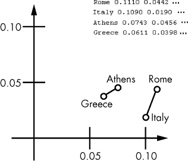

## 第五章：**使用词向量**


词向量是表示自然语言单词意义的一系列实数。如同你在第一章中学到的，它们使机器能够理解人类语言。在本章中，你将使用词向量来计算不同文本的语义相似性，这将使你能够，例如，根据文本所涵盖的主题对这些文本进行分类。

你将首先从概念上了解词向量，这样你就能大致了解如何在数学上计算以向量形式表示的单词之间的语义相似性。接着，你将学习机器学习算法如何生成在 spaCy 模型中实现的词向量。你将使用 spaCy 的 *相似性方法*，该方法通过比较容器对象的词向量来确定它们意义的接近程度。你还将学习如何在实际中使用词向量并执行预处理步骤，例如选择关键词，以提高你的操作效率。

### **理解词向量**

在构建统计模型时，我们将单词映射到反映单词语义相似性的实数向量。你可以将词向量空间想象成一个云，在这个云中，具有相似意义的词的向量相互靠近。例如，表示“土豆”这个词的向量应该比表示“哭泣”这个词的向量更接近表示“胡萝卜”这个词的向量。为了生成这些词向量，我们必须能够对这些词的意义进行编码。本节将概述几种编码意义的方法。

#### ***通过坐标定义意义***

生成有意义的词向量的一种方法是将现实世界中的物体或类别分配给每个词向量的坐标。例如，假设你正在为以下词汇生成词向量：罗马、意大利、雅典和希腊。词向量应在数学上反映出罗马是意大利的首都，并且与意大利的关系是雅典所没有的。同时，它们还应该反映出雅典和罗马都是首都城市，而希腊和意大利是国家。表格 5-1 展示了该词向量空间可能以矩阵形式呈现的样子。

**表格 5-1：** 简化的词向量空间

|  | **国家** | **首都** | **希腊语** | **意大利语** |
| --- | --- | --- | --- | --- |
| 意大利 | 1 | 0 | 0 | 1 |
| 罗马 | 0 | 1 | 0 | 1 |
| 希腊 | 1 | 0 | 1 | 0 |
| 雅典 | 0 | 1 | 1 | 0 |

我们已经将每个词的意义分布在四维空间的坐标上，表示“国家”、“首都”、“希腊语”和“意大利语”这几个类别。在这个简化的例子中，一个坐标值可以是 1 或 0，表示一个对应的词是否属于某个类别。

一旦你拥有一个词向量空间，其中数字的向量捕捉了相应单词的意义，你就可以对这个向量空间进行向量运算，以深入理解一个单词的意义。为了找出雅典是哪个国家的首都，你可以使用以下公式，其中每个标记代表其对应的向量，X 是一个未知的向量：

```py
Italy - Rome = X - Athens
```

这个公式表达了一种类比，其中 X 代表与`雅典`的关系类似于`意大利`与`罗马`之间关系的词向量。为了解出 X，我们可以像这样重新写这个公式：

```py
X = Italy - Rome + Athens
```

我们首先通过减去相应的向量元素，将`罗马`的向量从`意大利`的向量中减去。然后我们将得到的向量和`雅典`的向量相加。表 5-2 总结了这个计算过程。

**表 5-2：** 在词向量空间上执行向量数学运算

|  |  | **国家** | **首都** | **希腊** | **意大利** |
| --- | --- | --- | --- | --- | --- |
| ― | 意大利 | 1 | 0 | 0 | 1 |
| + | 罗马 | 0 | 1 | 0 | 1 |
|  | 雅典 | 0 | 1 | 1 | 0 |
|  | 希腊 | 1 | 0 | 1 | 0 |

通过从意大利的词向量中减去罗马的词向量，然后再加上雅典的词向量，我们得到一个等于`希腊`的词向量。

#### ***使用维度表示意义***

尽管我们刚才创建的向量空间只有四个类别，但现实世界中的向量空间可能需要成千上万个类别。如此大的向量空间对于大多数应用来说不切实际，因为它需要一个巨大的词嵌入矩阵。例如，如果你有 10,000 个类别和 1,000,000 个实体需要编码，你将需要一个 10,000 × 1,000,000 的嵌入矩阵，进行操作时将非常耗时。减少嵌入矩阵大小的明显方法是减少向量空间中的类别数量。

现实世界中的词向量空间不是使用坐标来表示所有类别，而是使用向量之间的距离来量化和分类语义相似性。各个维度通常没有固有的意义，而是表示向量空间中的位置，向量之间的距离则表明相应单词意义的相似度。

以下是从*fastText*（一个词向量库）提取的 300 维词向量空间的一个片段，您可以在* [`fasttext.cc/docs/en/english-vectors.html`](https://fasttext.cc/docs/en/english-vectors.html) *下载它：

```py
compete   -0.0535 -0.0207 0.0574 0.0562 ... -0.0389 -0.0389

equations -0.0337 0.2013 -0.1587 0.1499 ...  0.1504 0.1151

Upper     -0.1132 -0.0927 0.1991 -0.0302 ... -0.1209 0.2132

mentor     0.0397 0.1639 0.1005 -0.1420 ... -0.2076 -0.0238

reviewer  -0.0424 -0.0304 -0.0031 0.0874 ... 0.1403 -0.0258
```

每一行包含一个词，以一个多维空间中的实数向量表示。图形上，我们可以用二维或三维投影表示这样一个 300 维的向量空间。为了准备这样的投影，我们可以分别使用向量的前两或前三个主坐标。图 5-1 展示了 300 维向量空间中向量的二维投影。



*图 5-1：二维投影的多维向量空间片段*

你可能会注意到的一个有趣细节是，分别连接希腊与雅典、意大利与罗马的线几乎是平行的。它们的长度看起来也相当可比。实际上，这意味着，如果你有上述四个向量中的三个，你可以计算出缺失向量的大致位置，因为你知道如何移动向量以及移动的距离。

图中的向量展示了国家和首都之间的关系，但它们也可以代表其他类型的关系，例如男女关系、动词时态等。

#### ***相似度方法***

在 spaCy 中，每种类型的容器对象都有一个*相似度方法*，该方法允许你通过比较单词向量计算两个容器对象之间的语义相似度估计值，无论它们的类型如何。为了计算跨度和文档的相似度（它们没有自己的单词向量），spaCy 会对它们所包含的词汇的单词向量进行平均。

**注意**

*spaCy 的小型模型（那些模型大小指示符为 %`sm` 的模型）不包括单词向量。你仍然可以使用这些模型的相似度方法来比较标记、跨度和文档，但结果的准确性较低。*

即使两个容器对象不同，你也可以计算它们的语义相似度。例如，你可以将 Token 对象与 Span 对象进行比较，将 Span 对象与 Doc 对象进行比较，等等。

以下示例计算了一个 Span 对象与一个 Doc 对象的相似度：

```py
>>> doc=nlp('I want a green apple.')

>>> doc.similarity(doc[2:5])

0.7305813588233471
```

这段代码计算了句子“I want a green apple.”与从同一句话中提取的短语“a green apple”之间的语义相似度估计值。正如你所看到的，计算出的相似度足够高，可以认为这两个对象的内容相似（相似度的范围是从 0 到 1）。

不出所料，当你将一个对象与它自身进行比较时，`similarity()` 方法返回 1：

```py
>>> doc.similarity(doc)

1.0

>>> doc[2:5].similarity(doc[2:5])

1.0
```

你还可以将一个 Doc 对象与另一个 Doc 对象中的一个片段进行比较：

```py
>>> doc2=nlp('I like red oranges.')

>>> doc2.similarity(doc[2:5])

0.28546574467463354
```

这里，我们将存储在 `doc2` 中的句子“I like red oranges.”与从 `doc` 中提取的“a green apple”跨度进行比较。在这种情况下，这次的相似度并不高。是的，橙子和苹果都是水果（相似度方法识别了这一点），但动词“want”和“like”表达的是不同的存在状态。

你还可以比较两个标记。在以下示例中，我们将 Token 对象“oranges”与包含单个标记“apple”的 Span 对象进行比较。

```py
>>> token = doc2[3:4][0]

>>> token

oranges

>>> token.similarity(doc[4:5])

0.3707084280155993
```

首先，我们显式地将包含单个标记“oranges”的 Span 对象通过引用跨度中的第一个元素转换为 Token 对象。然后，我们计算它与“apple”跨度的相似度。

`similarity()` 方法能够识别属于相同或相似类别并经常出现在相关上下文中的单词，对这些单词显示出较高的相似度。

#### ***选择用于语义相似度计算的关键词***

相似度方法将为你计算语义相似度，但为了让该计算结果有用，你需要选择正确的关键字进行比较。为了理解其原因，考虑以下文本片段：

```py
Redwoods are the tallest trees in the world. They are most common in the coastal forests of California.
```

我们可以根据想要使用的类别集以多种方式对这段文本进行分类。例如，如果我们在寻找关于地球上最高植物的文本，“*最高树木*”和“*全球范围内*”将是关键短语。将这些短语与搜索短语“*最高植物*”和“*地球上的*”进行比较，应该会显示出很高的语义相似度。我们可以通过使用 Doc 对象的 `doc.noun_chunk` 属性提取名词短语，然后使用相似度方法检查这些名词短语与搜索短语的相似度来实现这一点。

但如果我们在寻找关于世界上某个地方的文本，那么“*加利福尼亚*”将是关键字。当然，我们无法预先知道文本中会出现哪个地理政治名称：它可能是加利福尼亚，或者是亚马逊地区。无论是什么，它都应该在语义上类似于“地理学”这样的词，我们可以将其与文本中的其他名词进行比较（或者，更好地，仅与其命名实体进行比较）。如果我们能够确定有很高的相似度，我们就可以假设该命名实体代表一个地理政治名称。（我们也可以提取 Token 对象的 `token.ent_type` 属性来实现这一点，正如第二章中所描述的。但我们无法使用命名实体识别来检查那些不是命名实体的单词的相似性，比如水果。）

### **安装词向量**

如果你的 Python 环境中安装了 spaCy 模型，你可以立即开始使用词向量。你还可以安装第三方词向量包。不同的统计模型使用不同的词向量，因此你进行的操作结果会略有不同，具体取决于你使用的模型。你可以尝试几个模型，以确定哪个模型在你的特定应用中表现更好。

#### ***利用 spaCy 模型附带的词向量***

许多 spaCy 模型都包含词向量。例如，`en_vectors_web_lg` 包含超过一百万个在 300 维向量空间中定义的独特词向量。有关特定模型的详细信息，请查看 *[`github.com/explosion/spacy-models/releases/`](https://github.com/explosion/spacy-models/releases/)*。

通常，小型模型（其名称以 `sm` 结尾）不包含词向量。相反，它们包含上下文敏感的 *张量*，这仍然允许你使用相似度方法比较标记、跨度和文档——尽管这样做的准确性较低。

要跟随本章中的示例，你可以使用任何 spaCy 模型，甚至是小型模型。但如果你安装一个较大的模型，结果会更加准确。关于如何安装 spaCy 模型的详细信息，请参考 “Installing Statistical Models for spaCy” 章节的 第 16 页。请注意，你的环境中可能安装了多个模型。

#### ***使用第三方词向量***

你还可以使用 spaCy 的第三方词向量包。你可以检查一个第三方包是否比 spaCy 模型中提供的原生词向量更适合你的应用。例如，你可以使用一个包含英语词向量的 fastText 预训练模型，下载地址是 *[`fasttext.cc/docs/en/english-vectors.html`](https://fasttext.cc/docs/en/english-vectors.html)*。包的名称会标识包的大小、词向量的维度以及用于训练词向量的数据类型。例如，*wiki-news-300d-1M.vec.zip* 表示它包含一百万个 300 维度的词向量，这些向量是在 Wikipedia 和 *statmt.org* 新闻数据集上训练的。

下载包后，解压它，然后从包中的词向量创建一个新的模型，这样你就可以在 spaCy 中使用它。为此，导航到你保存包的文件夹，然后使用 `init-model` 命令行工具，如下所示：

```py
$ python -m spacy init-model en /tmp/en_vectors_wiki_lg --vectors-loc wiki-news-300d-1M.vec
```

该命令将从 *wiki-news-300d-1M.vec* 文件中提取的词向量转换为 spaCy 格式，并为它们创建新的模型目录 */tmp/en_vectors_wiki_lg*。如果一切顺利，你会看到以下信息：

```py
Reading vectors from wiki-news-300d-1M.vec

Open loc

999994it [02:05, 7968.84it/s]

Creating model...

0it [00:00, ?it/s]

    Successfully compiled vocab

    999731 entries, 999994 vectors
```

一旦你创建了模型，你可以像使用常规的 spaCy 模型一样加载它：

```py
nlp = spacy.load('/tmp/en_vectors_wiki_lg')
```

然后你可以像往常一样创建一个 Doc 对象：

```py
doc = nlp(u'Hi there!')
```

与常规的 spaCy 模型不同，为在 spaCy 中使用而转换的第三方模型可能不支持 spaCy 针对 doc 对象中文本进行的一些操作。例如，如果你尝试使用 `doc.sents` 将 doc 拆分成句子，你会遇到以下错误：`ValueError: [E030] Sentence boundaries unset...`

### **比较 spaCy 对象**

我们将使用词向量来计算容器对象的相似性，这是使用词向量的最常见任务。在本章的剩余部分，我们将探讨一些你可能需要确定语言单位语义相似性的场景。

#### ***使用语义相似性进行分类任务***

确定两个对象的句法相似性可以帮助你将文本分类或挑选出相关的文本。例如，假设你在网站上筛选用户评论，以找出所有与“fruits”相关的评论。假设你有以下需要评估的语句：

```py
I want to buy this beautiful book at the end of the week. 

Sales of citrus have increased over the last year. 

How much do you know about this type of tree?
```

你可以轻松识别出只有第二句话与水果直接相关，因为它包含了“柑橘”这个词。但要通过编程选择出这个句子，你必须将“水果”这个词的词向量与样本句子中的词向量进行比较。

让我们从做这项任务最简单但最不成功的方法开始：将“水果”与每个句子进行比较。如前所述，spaCy 通过比较两个容器对象的相应词向量来确定它们的相似度。为了将单个 Token 与整个句子进行比较，spaCy 将句子的词向量进行平均，从而生成一个全新的向量。以下脚本将每个前述句子样本与“水果”这个词进行比较：

```py
   import spacy

   nlp = spacy.load('en')

➊ token = nlp(u'fruits')[0]

➋ doc = nlp(u'I want to buy this beautiful book at the end of the week. Sales of

   citrus have increased over the last year. How much do you know about this type

   of tree?')

➌ for sent in doc.sents:

     print(sent.text)

 ➍ print('similarity to', token.text, 'is', token.similarity(sent),'\n')
```

我们首先为“水果”这个词创建一个 Token 对象 ➊。然后我们将管道应用于我们正在分类的句子，创建一个单一的 Doc 对象来保存它们 ➋。我们将文档切割成句子 ➌，然后打印出每个句子及其与“水果”这个 Token 的语义相似度，这个相似度是通过 Token 对象的 similarity 方法获得的 ➍。

输出应该像这样（尽管实际数字将取决于你使用的模型）：

```py
I want to buy this beautiful book at the end of the week.

similarity to fruits is 0.06307832979619851 

Sales of citrus have increased over the last year.

similarity to fruits is 0.2712141843864381 

How much do you know about this type of tree?

similarity to fruits is 0.24646341651210604
```

“水果”这个词与第一句话的相似度非常小，表明这句话与水果没有关系。第二句话——包含“柑橘”这个词的那一句——与“水果”最为相关，这意味着脚本正确地识别了相关句子。

但请注意，脚本也将第三句话识别为与水果相关，可能是因为它包含了“树”这个词，而水果长在树上。认为相似度计算算法“知道”橙子和柑橘是水果是天真的。它所知道的只是这些词（“橙子”和“柑橘”）通常与“水果”这个词共享相同的上下文，因此它们在向量空间中靠得很近。但“树”这个词也常常出现在与“水果”相关的上下文中。例如，“果树”这个短语并不罕见。因此，计算出的“水果”（或其词元“fruit”）和“树”之间的相似度接近我们为“柑橘”和“水果”得到的结果。

这种分类文本的方法还有一个问题。当然，在实际应用中，你可能有时需要处理的文本要比本节中使用的样本文本大得多。如果你正在平均的大文本非常庞大，最重要的词可能对句法相似度值几乎没有影响。

为了从相似度方法中获得更准确的结果，我们需要对文本进行一些准备。让我们看看如何改进脚本。

#### ***提取名词作为预处理步骤***

一个更好的分类技术是提取最重要的词汇，并仅比较这些词汇。以这种方式准备文本进行处理叫做*预处理*，它可以帮助提高你的 NLP 操作成功的概率。例如，你可以尝试比较某些词性的词向量，而不是比较整个对象的词向量。在大多数情况下，你会专注于名词——无论它们是作为主语、直接宾语还是间接宾语——以识别它们所在文本中传达的意义。例如，在句子“几乎所有的野生狮子生活在非洲”中，你可能会专注于“狮子”，“非洲”或“非洲的狮子”。类似地，在关于水果的句子中，我们专注于挑选出名词“柑橘”。在其他情况下，你可能需要其他词汇，如动词，来决定文本的主题。例如，假设你经营一家农产品公司，必须对来自生产、加工和销售农产品的报价进行分类。你经常会看到像“我们种植蔬菜”或“我们拿番茄去加工”这样的句子。在这个例子中，动词和之前例句中的名词一样重要。

让我们修改第 70 页上的脚本。我们将不再将“水果”与整个句子进行比较，而是仅与句子的名词进行比较：

```py
   import spacy

   nlp = spacy.load('en')

➊ token = nlp(u'fruits')[0]

   doc = nlp(u'I want to buy this beautiful book at the end of the week. Sales of

   citrus have increased over the last year. How much do you know about this type

   of tree?')

similarity = {}

➋ for i, sent in enumerate(doc.sents):

   ➌ noun_span_list = [sent[j].text for j in range(len(sent)) if sent[j].pos_ 

      == 'NOUN']

   ➍ noun_span_str = ' '.join(noun_span_list)

   ➎ noun_span_doc = nlp(noun_span_str)

   ➏ similarity.update({i:token.similarity(noun_span_doc)})

    print(similarity)
```

我们首先定义了“水果”这个词项，然后用它进行一系列的比较 ➊。遍历每个句子中的词项 ➋，我们提取出名词并将其存储在 Python 列表中 ➌。接下来，我们将列表中的名词连接成一个普通字符串 ➍，然后将该字符串转换为一个 Doc 对象 ➎。然后，我们将这个 Doc 与“水果”词项进行比较，以确定它们的语义相似度。我们将每个词项的句法相似度值存储在一个 Python 字典中 ➏，并最终将其打印出来。

脚本的输出应该类似于以下内容：

```py
{0: 0.17012682516221458, 1: 0.5063824302533686, 2: 0.6277196645922878}
```

如果你将这些数字与前一个脚本的结果进行比较，你会注意到这次每个句子与“水果”一词的相似度更高。但总体结果看起来相似：第一句的相似度最低，而其他两句的相似度要高得多。

#### ***尝试这个***

在前面的示例中，只比较“水果”与名词时，你通过只考虑最重要的单词（在本例中是名词）改进了相似度计算的结果。你将“水果”这个词与从每个句子提取的所有名词进行了比较，合并在一起。更进一步，你可以查看这些名词与“水果”一词在语义上的关系，以找出哪个名词的相似度最高。这对于评估文档与“水果”一词的整体相似度非常有用。为了实现这一点，你需要修改之前的脚本，以便计算“水果”与每个句子中的名词之间的相似度，从而找出与之最相似的名词。

#### ***提取和比较命名实体***

在某些情况下，除了提取你比较的文本中的每个名词外，你可能只想提取某种类型的名词，例如命名实体。假设你正在比较以下文本：

“Google Search，通常简称为 Google，是目前使用最广泛的搜索引擎。它每天处理大量搜索。”

“Microsoft Windows 是一系列由微软开发和销售的专有操作系统。该公司还生产广泛的其他桌面和服务器软件。”

“Titicaca 是安第斯山脉中的一个大而深的山地湖泊。它被认为是世界上最高的可航行湖泊。”

理想情况下，你的脚本应该能识别出前两段文本是关于大型科技公司的，而第三段则不是。但比较这些文本中的所有名词可能并不十分有用，因为其中许多词汇，比如第一句中的“number”，与上下文无关。句子之间的差异包括以下单词：“Google”、“Search”、“Microsoft”、“Windows”、“Titicaca”和“Andes”。spaCy 能识别出这些都是命名实体，这使得从文本中提取和识别它们变得非常轻松，下面的脚本演示了这一过程：

```py
   import spacy

   nlp = spacy.load('en')

   #first sample text

   doc1 = nlp(u'Google Search, often referred to as simply Google, is the most

   used search engine nowadays. It handles a huge number of searches each day.') 

   #second sample text

   doc2 = nlp(u'Microsoft Windows is a family of proprietary operating systems

   developed and sold by Microsoft. The company also produces a wide range of

   other software for desktops and servers.') 

   #third sample text

   doc3 = nlp(u"Titicaca is a large, deep, mountain lake in the Andes. It is

   known as the highest navigable lake in the world.")

➊ docs = [doc1,doc2,doc3]

➋ spans = {}

➌ for j,doc in enumerate(docs):

   ➍ named_entity_span = [doc[i].text for i in range(len(doc)) if 

      doc[i].ent_type != 0]

   ➎ print(named_entity_span)

   ➏ named_entity_span = ' '.join(named_entity_span)

   ➐ named_entity_span = nlp(named_entity_span)

   ➑ spans.update({j:named_entity_span})
```

我们将包含样本文本的 Docs 分组到一个列表中，以便在循环中迭代 ➊。我们定义一个 Python 字典来存储每个文本的关键词 ➋。在迭代 Docs 的循环中 ➌，我们为每个文本提取这些关键词，并将它们保存在一个单独的列表中，只选择标记为命名实体的词汇 ➍。然后我们打印出该列表，查看它包含的内容 ➎。接下来，我们将这个列表转换为一个普通的字符串 ➏，然后将其应用管道，将其转换为一个 Doc 对象 ➐。然后我们将这个 Doc 添加到之前定义的 `spans` 字典中 ➑。

脚本应该产生以下输出：

```py
['Google', 'Search', 'Google']

['Microsoft', 'Windows', 'Microsoft']

['Titicaca', 'Andes']
```

现在我们可以看到每个文本中的词汇，它们的向量将被用来进行比较。

接下来，我们在这些 spans 上调用 `similarity()` 并打印结果：

```py
print('doc1 is similar to doc2:',spans[0].similarity(spans[1]))

print('doc1 is similar to doc3:',spans[0].similarity(spans[2]))

print('doc2 is similar to doc3:',spans[1].similarity(spans[2]))
```

这次的输出应如下所示：

```py
doc1 is similar to doc2: 0.7864886939527678

doc1 is similar to doc3: 0.6797676349647936

doc2 is similar to doc3: 0.6621659567003596
```

这些图表表明，第一篇和第二篇文本之间的相似度最高，这两篇都是关于美国 IT 公司的。那么，词向量是如何“知道”这一事实的呢？它们可能知道，因为“Google”和“Microsoft”这两个词在训练文本语料库中经常出现在相同的文本中，而不是与“Titicaca”和“Andes”这些词一起出现。

### **总结**

在本章中，你使用了词向量，它们是表示单词意义的实数向量。这些表示方式让你可以运用数学来确定语言单元的语义相似度，这对于文本分类任务非常有用。

但是，当你尝试在不对文本进行任何预处理的情况下确定两个文本的相似性时，数学方法可能效果不佳。通过应用预处理，你可以将文本简化为最重要的单词，这些单词有助于判断文本的主题。在特别大的文本中，你可能会挑选出其中的命名实体，因为它们最可能最好地描述文本的类别。
