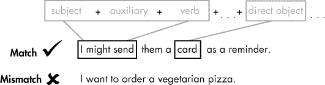
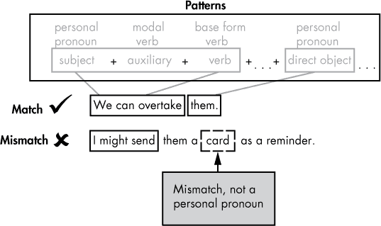
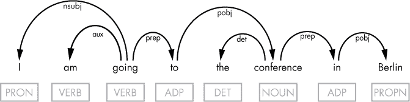
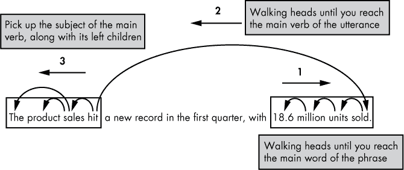
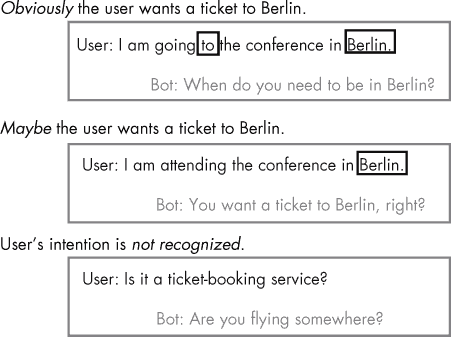
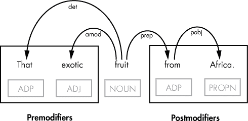

## 第六章：查找模式与遍历依赖树**


如果你希望你的应用程序能够对文本进行分类、提取特定短语或判断它与另一个文本的语义相似度，它必须能够“理解”用户提交的语句，并生成有意义的回应。

你已经学会了一些执行这些任务的技巧。本章讨论了另外两种方法：使用词序模式来分类和生成文本，以及遍历语法依赖树来从中提取必要的信息。我将向你介绍 spaCy 的 Matcher 工具，用于查找模式。我还将讨论在何种情况下你可能仍然需要依赖上下文来决定合适的处理方法。

### **词序模式**

*词序模式*由施加特定要求的单词特征组成，要求序列中的每个单词必须满足某些条件。例如，短语“I can”将匹配以下词序模式：“代词 + 情态助动词”。通过搜索词序模式，你可以识别具有相似语言特征的单词序列，从而使输入能够被正确分类和处理。

例如，当你收到一个以使用“情态助动词 + 专有名词”模式开头的问题时，比如“Can George”，你就知道这个问题是关于专有名词所指代的某人或某物的能力、可能性、许可或义务。

在接下来的章节中，你将学习通过识别常见的语言特征模式来分类句子。

#### ***基于语言特征查找模式***

我们需要在文本中查找模式，因为在大多数情况下，我们甚至无法在文本中找到两个完全相同的句子。通常，一篇文本由不同的句子组成，每个句子包含不同的单词。为每个句子编写处理代码是不可行的。

幸运的是，一些看起来完全不同的句子可能遵循相同的词序模式。例如，考虑以下两个句子：“We can overtake them.” 和 “You must specify it.” 这两个句子没有任何相同的单词。但如果你查看这些句子中单词的语法依赖标签，就会出现一个模式，如以下脚本所示：

```py
   import spacy

   nlp = spacy.load('en')

   doc1 = nlp(u'We can overtake them.')

   doc2 = nlp(u'You must specify it.')

➊ for i in range(len(doc1)-1): 

   ➋ if doc1[i].dep_ == doc2[i].dep_:

     ➌ print(doc1[i].text, doc2[i].text, doc1[i].dep_, spacy.explain(doc1[i].dep_))
```

因为这两个句子的单词数量相同，我们可以在一个循环中遍历这两个句子中的单词➊。如果在这两个句子中具有相同索引的单词的依赖标签相同➋，我们就打印这些单词及其对应的标签，并提供每个标签的描述➌。

输出应如下所示：

```py
We       You     nsubj  nominal subject

can      must    aux    auxiliary

overtake specify ROOT   None

them     it      dobj   direct object
```

如你所见，两个句子的依赖标签列表是相同的。这意味着这两个句子基于以下句法依赖标签遵循相同的单词顺序模式：“主语 + 助动词 + 动词 + 直接宾语”。

还要注意，这些示例句子的词性标签（粗粒度和细粒度）列表也是相同的。如果我们在前面的脚本中将所有对`.dep`_ 的引用替换为`.pos`_，我们将得到以下结果：

```py
We       You     PRON  pronoun

can      must    VERB  verb

overtake specify VERB  verb

them     it      PRON  pronoun
```

这些示例句子不仅匹配句法依赖标签模式，还匹配词性标签的模式。

#### ***尝试这个***

在前面的示例中，我们创建了两个 Doc 对象——每个示例句子一个。但在实际应用中，一篇文本通常包含许多句子，这使得逐句创建 Doc 对象的方法不太实用。重写脚本，使其只创建一个 Doc 对象。然后使用第二章中介绍的`doc.sents`属性对每个句子进行操作。

但请注意，`doc.sents`是一个生成器对象，这意味着它不可通过下标访问——你无法通过索引来引用它的项。为了解决这个问题，将`doc.sents`转换为列表，如下所示：

```py
sents = list(doc.sents)
```

当然，你可以通过`for`循环遍历`doc.sents`，按顺序获取请求的`sents`。

#### ***检查语句是否符合模式***

在前面的示例中，我们比较了两个示例句子，以找出它们共享的语言特征模式。但在实际应用中，我们很少需要比较句子之间是否共享共同的模式。相反，检查提交的句子是否符合我们已经感兴趣的模式会更有用。

例如，假设我们要在用户输入的语句中找到表示以下某一项的语句：能力、可能性、许可或义务（与描述已经发生、正在发生或定期发生的实际行动的语句相对）。例如，我们要找到“我能做到”而不是“我做到了”。

为了区分不同的语句，我们可能需要检查某个语句是否符合以下模式：“主语 + 助动词 + 动词 + …… + 直接宾语 ……”。省略号表示直接宾语不一定位于动词后面，这使得这个模式与前面示例中的模式略有不同。

以下句子符合模式：“I might send them a card as a reminder.”。在这个句子中，名词“card”是直接宾语，代词“them”是间接宾语，它将直接宾语与动词“send”分开。这个模式并没有指定直接宾语在句子中的位置，它仅要求直接宾语的存在。

图 6-1 展示了这个设计的图形化表示：



*图 6-1：根据语言特征检查提交的语句与词序模式的一致性*

在以下脚本中，我们定义了一个实现此模式的函数，然后在一个示例句子上进行测试：

```py
   import spacy

   nlp = spacy.load('en')

➊ def dep_pattern(doc):

  ➋ for i in range(len(doc)-1):

    ➌ if doc[i].dep_ == 'nsubj' and doc[i+1].dep_ == 'aux' and

       doc[i+2].dep_ == 'ROOT':

      ➍ for tok in doc[i+2].children:

             if tok.dep_ == 'dobj':

          ➎ return True

  ➏ return False

➐ doc = nlp(u'We can overtake them.')

   if ➑dep_pattern(doc):

     print('Found')

   else:

     print('Not found')
```

在这个脚本中，我们定义了`dep_pattern`函数，它以 Doc 对象作为参数 ➊。在函数中，我们遍历 Doc 对象的标记 ➋，搜索“主语 + 助动词 + 动词”模式 ➌。如果找到了这个模式，我们检查动词是否在其句法子节点中有一个直接宾语 ➍。最后，如果找到了直接宾语，函数返回`True` ➎。否则，返回`False` ➏。

在主代码中，我们将文本处理管道应用于示例句子 ➐，并将 Doc 对象传递给`dep_pattern`函数 ➑，如果该示例符合函数中实现的模式，则输出`Found`，否则输出`Not found`。

因为本示例中使用的示例符合该模式，脚本应该输出以下结果：

```py
Found
```

在接下来的几个部分中，你将看到一些使用`dep_pattern`函数的示例。

#### ***使用 spaCy 的 Matcher 来查找单词序列模式***

在上一节中，你学会了如何通过遍历文档的标记并检查它们的语言特征来找到单词序列模式。事实上，spaCy 为这个任务预定义了一个功能，叫做*Matcher*，它是一个专门设计用来根据模式规则找到标记序列的工具。例如，使用 Matcher 实现“主语 + 助动词 + 动词”模式的代码可能如下所示：

```py
   import spacy

   from spacy.matcher import Matcher

   nlp = spacy.load("en")

➊ matcher = Matcher(nlp.vocab)

➋ pattern = [{"DEP": "nsubj"}, {"DEP": "aux"}, {"DEP": "ROOT"}]

➌ matcher.add("NsubjAuxRoot", None, pattern)

   doc = nlp(u"We can overtake them.")

➍ matches = matcher(doc)

➎ for match_id, start, end in matches:

       span = doc[start:end]

    ➏ print("Span: ", span.text)

       print("The positions in the doc are: ", start, "-", end)
```

我们创建一个 Matcher 实例，将与 Matcher 将要处理的文档共享的词汇对象传入 ➊。然后我们定义一个模式，指定一个单词序列应该匹配的依赖标签 ➋。我们将新创建的模式添加到 Matcher 中 ➌。

接下来，我们可以将 Matcher 应用于示例文本，并将匹配的标记以列表形式获取 ➍。然后我们遍历这个列表 ➎，打印出模式标记在文本中的起始和结束位置 ➏。

脚本应该输出以下结果：

```py
Span: We can overtake

The positions in the doc are: 0 - 3
```

Matcher 允许你在文本中找到一个模式，而不需要显式地遍历文本的标记，从而将实现细节隐藏在你背后。因此，你可以获得组成符合指定模式的单词序列的起始和结束位置。当你对紧跟在一起的单词序列感兴趣时，这种方法非常有用。

但通常你需要一个包含分散在句子中的单词的模式。例如，你可能需要实现类似于我们在“检查话语中的模式”中使用的“主语 + 助动词 + 动词 + ... + 直接宾语 ...”模式。问题是你无法事先知道“主语 + 助动词 + 动词”序列与直接宾语之间可以有多少个单词。Matcher 不允许你定义这样的模式。因此，在本章剩余部分，我将手动定义模式。

#### ***应用多个模式***

你可以将多个匹配模式应用于一个话语，以确保它满足所有条件。例如，你可能会将一个话语与两个模式进行比较：一个实现依赖标签序列（如在“检查话语模式”中讨论的第 77 页），另一个则检查词性标签的顺序。如果你想确保话语中的直接宾语是人称代词，这将非常有用。若是这样，你可以开始确定赋予代词意义的名词，并且该名词在对话中有其他提及。

从图示上来看，这个设计可能像图 6-2 一样。



*图 6-2：将多个匹配模式应用于用户输入*

除了使用在“检查话语模式”中定义的依赖标签序列外，你还可以通过实现基于词性标签的模式来定义一个新函数。词性标签模式可能会搜索句子，以确保主语和直接宾语是人称代词。这个新函数可能会实现以下模式：“人称代词 + 情态助动词 + 基本形式动词 + . . . + 人称代词 . . .”。

这是代码：

```py
import spacy

nlp = spacy.load('en')

#Insert the dep_pattern function from a previous listing here

#...

➊ def pos_pattern(doc):

  ➋ for token in doc:

       if token.dep_ == 'nsubj' and token.tag_ != 'PRP':

         return False

       if token.dep_ == 'aux' and token.tag_ != 'MD':

         return False

       if token.dep_ == 'ROOT' and token.tag_ != 'VB':

         return False

       if token.dep_ == 'dobj' and token.tag_ != 'PRP':

         return False

  ➌ return True

   #Testing code

   doc = nlp(u'We can overtake them.')

➍ if dep_pattern(doc) and pos_pattern(doc):

       print('Found')

   else:

       print('Not found')
```

我们首先添加之前脚本中定义的`dep_pattern`函数的代码。为了创建第二个模式，我们定义`pos_pattern`函数 ➊，该函数包含一个带有多个`if`语句的`for`循环 ➋。每个`if`语句检查句子的某个部分是否匹配某个词性标签。当函数检测到不匹配时，它返回`False`。否则，在所有检查完成且未发现不匹配的情况下，函数返回`True` ➌。

为了测试这些模式，我们将管道应用于一个句子，然后检查该句子是否匹配这两个模式 ➍。因为示例中使用的句子匹配了这两个模式，所以我们应该看到以下输出：

```py
Found
```

但是，如果我们用这个句子替换示例句子：“I might send them a card as a reminder.”，我们应该看到以下输出：

```py
Not found
```

原因在于该句子不匹配词性标签模式，因为直接宾语“card”不是人称代词，即使该句子完全满足第一个模式的条件。

#### ***基于定制特征创建模式***

在创建词序列模式时，你可能需要通过定制 spaCy 提供的语言特征来增强其功能，以满足你的需求。例如，你可能希望前面的脚本识别另一个模式，通过数目来区分代词（无论是单数还是复数）。如果你需要查找代词所指的前一句中的名词时，这将非常有用。

尽管 spaCy 按数量区分名词，但它并不对代词做这样的区分。然而，识别代词是单数还是复数的能力在意义识别或信息提取的任务中非常有用。例如，考虑以下对话：

```py
The trucks are traveling slowly. We can overtake them.
```

如果我们能确认第二个句子中的直接宾语“them”是一个复数代词，那么我们就有理由相信它指的是第一个句子中的复数名词“trucks”。我们经常使用这种技术根据上下文来识别代词的含义。

以下脚本定义了一个`pron_pattern`函数，用于找到提交句子中的任何直接宾语，确定该直接宾语是否为个人代词，然后判断该代词是单数还是复数。脚本在测试了“检查语句模式”第 77 页和“应用多个模式”第 80 页中定义的两个模式之后，应用该函数到示例句子中。

```py
   import spacy

   nlp = spacy.load('en')

   #Insert the dep_pattern and pos_pattern functions from the previous

   listings here

   #...

➊ def pron_pattern(doc):

  ➋ plural = ['we','us','they','them']

     for token in doc:

    ➌ if token.dep_ == 'dobj' and token.tag_ == 'PRP':

      ➍ if token.text in plural:

        ➎ return 'plural'

         else:

        ➏ return 'singular'

  ➐ return 'not found'

   doc = nlp(u'We can overtake them.')

   if dep_pattern(doc) and pos_pattern(doc):

       print('Found:', 'the pronoun in position of direct object is',

       pron_pattern(doc))

   else:

       print('Not found')
```

我们首先通过在脚本中添加在“检查语句模式”和“应用多个模式”中定义的`dep_pattern`和`pos_pattern`函数来开始。在`pron_pattern`函数 ➊中，我们定义了一个包含所有可能的复数个人代词的 Python 列表 ➋。接下来，我们定义一个循环，遍历提交句子中的标记，查找作为直接宾语的个人代词 ➌。如果找到这样的标记，我们会检查它是否在复数个人代词的列表中 ➍。如果是，函数返回`plural` ➎。否则，它返回`singular` ➏。如果函数未能检测到直接宾语，或者找到的代词不是个人代词，它将返回`Not found` ➐。

对于句子“We can overtake them.”，我们应该得到以下输出：

```py
Found: the pronoun in position of direct object is plural
```

我们可以利用这些信息找到前一句中代词对应的名词。

#### ***选择应用哪些模式***

一旦定义了这些模式，你就可以根据不同情况选择应用哪些模式。请注意，即使一个句子未完全满足`dep_pattern`和`pos_pattern`函数，它仍然可能匹配`pron_pattern`函数。例如，句子“I know it.”不符合`dep_pattern`或`pos_pattern`函数，因为它没有情态助动词。但它满足`pron_pattern`，因为它包含一个作为直接宾语的个人代词。

这些模式之间的松散耦合使你可以将它们与其他模式一起使用或独立使用。例如，如果你想确保句子的主语和直接宾语都是名词，你可以将`dep_pattern`（检查句子是否符合“主语 + 助动词 + 动词 + ... + 直接宾语...”模式）与“名词 + 情态助动词 + 基本形式动词 + ... + 名词...”模式结合使用。这两个模式将匹配以下示例：

```py
Developers might follow this rule.
```

正如你所猜测的那样，不同方式组合模式的能力使你可以用更少的代码处理更多的场景。

#### ***在聊天机器人中使用词序列模式生成陈述***

如前所述，NLP 中最具挑战性的任务是理解和生成自然语言文本。聊天机器人必须理解用户的输入，然后生成适当的响应。基于语言学特征的词序列模式可以帮助你实现这些功能。

在第四章中，你学会了如何将陈述转化为相关问题，以继续与用户的对话。通过使用词序列模式，你还可以生成其他类型的响应，例如相关的陈述。

假设你的聊天机器人收到了以下用户输入：

```py
The symbols are clearly distinguishable. I can recognize them promptly.
```

聊天机器人可能会做出如下反应：

```py
I can recognize symbols promptly too.
```

你可以使用前面章节中实现的模式来完成这个文本生成任务。步骤列表可能如下所示：

1.  将对话输入与之前定义的`dep_pattern`和`pos_pattern`函数进行匹配，分别找到符合“主语 + 助动词 + 动词 + ... + 直接宾语...”和“代词 + 情态助动词 + 基本形式动词 + ... + 代词...”模式的陈述。

1.  检查步骤 1 中找到的陈述是否与`pron_pattern`模式匹配，以确定直接宾语的人称代词是复数还是单数。

1.  通过搜索与人称代词相同数量的名词，找到给人称代词赋予意义的名词。

1.  将步骤 1 中句子中作为直接宾语的人称代词替换为步骤 3 中找到的名词。

1.  在生成的陈述末尾添加单词“too”。

以下脚本实现了这些步骤。它使用了本章前面定义的`dep_pattern`、`pos_pattern`和`pron_pattern`函数（为了节省空间，省略了它们的代码）。它还引入了两个新函数：`find_noun`和`gen_utterance`。为了方便起见，我们将分三个步骤来讲解代码：初步操作和`find_noun`函数，它用于查找与人称代词匹配的名词；`gen_utterance`函数，它根据该问题生成相关陈述；最后是测试陈述的代码。以下是第一部分：

```py
   import spacy

   nlp = spacy.load('en')

   #Insert the dep_pattern, pos_pattern and pron_pattern functions from the 

   previous listings here

   #...

➊ def find_noun(➋sents, ➌num):

     if num == 'plural':

    ➍ taglist = ['NNS','NNPS']

     if num == 'singular':

    ➎ taglist = ['NN','NNP']

  ➏ for sent in reversed(sents):

    ➐ for token in sent:

      ➑ if token.tag_ in taglist:

           return token.text

     return 'Noun not found'
```

在插入`dep_pattern`、`pos_pattern`和`pron_pattern`函数的代码后，我们定义了`find_noun`函数，该函数接受两个参数 ➊。第一个参数包含从话语开始到满足所有模式的句子的句子列表。在这个示例中，这个列表将包括话语中的所有句子，因为只有最后一句话满足所有模式 ➋。但是，给代词赋予意义的名词可以在之前的句子中找到。

传递给`find_noun`的第二个参数是满足所有模式的句子中直接宾语代词的位置 ➌。`pron_pattern`函数确定了这一点。如果该参数的值为`'plural'`，我们定义一个包含用于标记复数名词的细粒度词性标签的 Python 列表 ➍。如果是`'singular'`，我们创建一个标签列表，包含用于标记单数名词的细粒度词性标签 ➎。

在`for`循环中，我们按逆序遍历句子，从包含要替换的代词的句子开始 ➏。我们从最接近的句子开始，因为我们要找的名词很可能就在这里。在这里，我们使用 Python 的 reversed 函数，它返回一个列表的反向迭代器。在内层循环中，我们遍历每个句子中的标记 ➐，寻找其细粒度词性标签是否在之前定义的标签列表中 ➑。

然后我们定义了`gen_utterance`函数，它生成我们的新语句：

```py
   def gen_utterance(doc, noun):

     sent = ''

  ➊ for i,token in enumerate(doc):

    ➋ if token.dep_ == 'dobj' and token.tag_ == 'PRP':

      ➌ sent = doc[:i].text + ' ' + noun + ' ' + doc[i+1:len(doc)-2].text + 'too.'

      ➍ return sent

   ➎ return 'Failed to generate an utterance'
```

我们使用`for`循环遍历句子 ➊ 中的标记，寻找直接宾语为人称代词 ➋。找到后，我们生成一个新的表达式。我们通过将人称代词替换为匹配的名词，并在其末尾加上“too”来修改原句 ➌。然后，函数返回这个新生成的表达式 ➍。如果没有找到以人称代词形式出现的直接宾语，函数会返回一个错误信息 ➎。

现在我们已经准备好了所有函数，我们可以使用以下代码对示例表达式进行测试：

```py
➊ doc = nlp(u'The symbols are clearly distinguishable. I can recognize them 

   promptly.')

➋ sents = list(doc.sents)

   response = ''

   noun = ''

➌ for i, sent in enumerate(sents): 

     if dep_pattern(sent) and pos_pattern(sent):

  ➍ noun = find_noun(sents[:i], pron_pattern(sent))

       if noun != 'Noun not found':

    ➎ response = gen_utterance(sents[i],noun)

       break

print(response)
```

在将管道应用于示例话语 ➊ 后，我们将其转换为句子列表 ➋。然后我们遍历这个列表 ➌，寻找符合`dep_pattern`和`pos_pattern`函数定义的模式的句子。接着，我们使用`find_noun`函数确定在上一步找到的句子中赋予代词意义的名词 ➍。最后，我们调用`get_utterance`函数生成响应表达式 ➎。

前面的代码输出应该是这样的：

```py
I can recognize symbols too.
```

#### ***试试这个***

请注意，前面的代码仍然有改进的空间，因为原始语句在名词“symbols”前面包含了冠词“the”。更好的输出应该在名词前加上相同的冠词。为了生成在此上下文中最有意义的语句，需要扩展脚本，使其在名词前插入冠词“the”，使其变成“我也能识别这些符号”。为此，你需要检查名词前面是否有冠词，然后将该冠词添加进去。

### **从句法依赖树中提取关键词**

在话语中找到符合特定模式的单词序列，可以帮助你构建一个语法正确的回应——无论是陈述句还是疑问句，都基于提交的文本。但是，这些模式并不总是有助于提取文本的含义。

例如，在第二章的票务预订应用中，用户可能会提交如下句子：

```py
I need an air ticket to Berlin.
```

你可以通过搜索模式“to + `GPE`”轻松找到用户的目的地，其中`GPE`是指国家、城市和州的命名实体。这个模式可以匹配像“to London”（去伦敦）、“to California”（去加利福尼亚）这样的短语。

但是假设用户提交了以下其中一句话：

```py
I am going to the conference in Berlin. I need an air ticket. 

I am going to the conference, which will be held in Berlin. I would like to

book an air ticket.
```

如你所见，“to + `GPE`”模式在这两个例子中都无法找到目的地。在这两个例子中，“to”直接指向的是“the conference”，而不是柏林。你需要使用类似“to + . . . + `GPE`”的模式。那么，如何知道在“to”和“`GPE`”之间需要或者允许插入什么呢？例如，下面的句子包含了“to + . . . + `GPE`”模式，但与预订前往柏林的机票无关：

```py
I want to book a ticket on a direct flight without landing in Berlin.
```

通常，你需要检查句子中单词之间的关系，以获得必要的信息。这就是走访句子的依赖树能提供巨大帮助的地方。

走访依赖树意味着以自定义顺序进行遍历——不一定从第一个标记遍历到最后一个标记。例如，你可以在找到所需组件后立即停止遍历依赖树。记住，句子的依赖树显示了单词对之间的句法关系。我们通常将这些关系表示为箭头，连接一个关系的头词和子词。句子中的每个单词都涉及至少一个关系。这保证了如果从`ROOT`开始遍历整个句子的依赖树，你会通过句子中的每个单词。

在本节中，我们将通过分析句子的结构来搞清楚用户的意图。

#### ***走访依赖树进行信息提取***

让我们回到票务预订应用的例子。为了找到用户的预期目的地，你可能需要遍历句子的依赖树，判断“to”是否与“Berlin”在语义上相关。如果你记住组成依赖树的头/子句关系（在第 25 页的“头和子句”框中介绍），这将很容易实现。

图 6-3 展示了句子“我去柏林参加会议”的依赖树：



*图 6-3：一个话语的句法依赖树*

动词“going”是句子的根，它不是任何其他单词的子节点。它右边的直接子节点是“to”。如果你沿着依赖树遍历，每次移动到当前单词的右子节点，最终你会到达“Berlin”。这表明句子中“to”和“Berlin”之间存在语义联系。

#### ***遍历标记的头***

现在，让我们来分析如何以编程方式表示句子中“to”和“Berlin”之间的关系。一个方法是从左到右遍历依赖树，从“to”开始，每次选择当前单词的直接右子节点。如果你能通过这种方式从“to”到达“Berlin”，那么可以合理地假设这两个词之间存在语义联系。

但这种方法有一个缺点。在某些情况下，一个单词可能有多个右子节点。例如，在句子“我去参加在柏林举行的 spaCy 会议”中，单词“conference”有两个直接的右子节点：单词“on”和“held”。这就要求你检查多个分支，增加了代码的复杂性。

另一方面，尽管一个头可以有多个子节点，但句子中的每个单词都有且只有一个头。这意味着你也可以从右到左移动，从“Berlin”开始，试图到达“to”。以下脚本在`det_destination`函数中实现了这一过程：

```py
   import spacy

   nlp = spacy.load('en')

   #Here's the function that figures out the destination

➊ def det_destination(doc):

     for i, token in enumerate(doc):

   ➋ if token.ent_type != 0 and token.ent_type_ == 'GPE':

      ➌ while True:

        ➍ token = token.head

           if token.text == 'to':

          ➎ return doc[i].text

        ➏ if token.head == token:

             return 'Failed to determine'

     return 'Failed to determine'

   #Testing the det_destination function

   doc = nlp(u'I am going to the conference in Berlin.')

➐ dest = det_destination(doc)

   print('It seems the user wants a ticket to ' + dest)
```

在`det_destination`函数 ➊中，我们遍历提交的句子中的所有标记，寻找`GPE`实体 ➋。如果找到了，我们启动一个`while`循环 ➌，遍历每个标记的头，起始位置是包含`GPE`实体的标记 ➍。当循环到达包含“to”的标记 ➎或句子的根节点时，停止。我们可以通过比较标记与其头来检查是否达到了根节点 ➏，因为根标记的头总是指向它自身。（或者，也可以检查`ROOT`标签。）

为了测试这个功能，我们将管道应用到示例句子上，然后调用`det_destination`函数进行处理 ➐。

脚本应生成以下输出：

```py
It seems the user wants a ticket to Berlin
```

如果我们修改示例句子，使其不包含“to”或`GPE`命名实体，应该会得到如下输出：

```py
It seems the user wants a ticket to Failed to determine
```

我们可以改进脚本，使其在无法确定用户目的地的情况下使用另一条消息。

#### ***使用依存树压缩文本***

依存句法树方法不仅限于聊天机器人。你可以在例如报告处理应用中使用它。假设你需要开发一个应用程序，必须通过提取报告中最重要的信息来压缩零售报告。

例如，你可能想选择包含数字的句子，生成一个关于销售量、收入和成本的简洁数据总结。（你已经在第四章中学会了如何提取数字。）然后，为了使你的新报告更简洁，你可能会缩短选中的句子。

作为一个快速示例，考虑下面的句子：

```py
The product sales hit a new record in the first quarter, with 18.6 million units sold.
```

处理后，它应该看起来像这样：

```py
The product sales hit 18.6 million units sold.
```

要完成这一任务，你可以通过以下步骤分析句子的依存树：

1.  通过从包含数字的标记开始，沿着标记的头部从左到右遍历，提取包含该数字的整个短语（在这个例子中是 18.6）。

1.  从提取短语的主词（其头部不在短语中）开始，沿着依存树遍历到句子的主要动词，遍历头部并将其收集，用于形成新的句子。

1.  提取主要动词的主语，并与其左侧的子节点一起处理，这些通常包括限定词以及可能的一些修饰语。

图 6-4 表示这一过程。



*图 6-4：一个将句子压缩到仅包含重要元素的示例*

让我们从第一步开始，在这个例子中应该提取短语“18.6 百万单位销售”。以下代码片段展示了如何以编程方式实现这一过程：

```py
 doc = nlp(u"The product sales hit a new record in the first quarter, with 18.6 million units sold.")

 phrase = ''

 for token in doc:

➊ if token.pos_ == 'NUM':

       while True:

         phrase = phrase + ' ' + token.text

      ➋ token = token.head

      ➌ if token not in list(token.head.lefts):

           phrase = phrase + ' ' + token.text

        ➍ break

    ➎ break

 print(phrase.strip())
```

我们遍历句子的标记，寻找表示数字的标记 ➊。如果找到了，我们开始一个`while`循环，遍历右侧的头部 ➋，从数字标记开始，并将每个头部的文本附加到`phrase`变量中，形成一个新短语。为了确保下一个标记的头部在该标记的右侧，我们检查该标记是否在其头部的左子节点列表中 ➌。一旦这个条件返回假，我们跳出`while`循环 ➍，然后跳出外部`for`循环 ➎。

接下来，我们从包含数字的短语的主词（在这个例子中是“sold”）开始，沿着标记的头部遍历，直到到达句子的主要动词（在这个例子中是“hit”），排除介词（在这个例子中是“with”）。我们可以按照下面的代码实现这一过程：

```py
 while True:

➊ token = doc[token.i].head

   if token.pos_ != 'ADP':

  ➋ phrase = token.text + phrase

➌ if token.dep_ == 'ROOT':

➍ break
```

我们在`while`循环中遍历标记的头部 ➊，将每个头部的文本附加到正在形成的短语 ➋。在到达主要动词（标记为`ROOT`） ➌后，我们跳出循环 ➍。

最后，我们提取句子的主语及其左侧的词：“The”和“product”。在这个例子中，主语是“sales”，所以我们提取出以下名词短语：“The product sales”。可以使用以下代码来完成这一操作：

```py
➊ for tok in token.lefts:

  ➋ if tok.dep_ == 'nsubj':

   ➌ phrase = ' '.join([tok.text for tok in tok.lefts]) + ' ' + tok.text + ' '

      + phrase

      break

➍ print(phrase)
```

我们首先迭代主要动词的子节点 ➊，寻找主语 ➋。然后，我们将主语的子节点和短语的主语加到前面 ➌。要查看结果短语，我们打印出来 ➍。

输出应该如下所示：

```py
The product sales hit 18.6 million units sold.
```

结果是原始句子的压缩版本。

#### ***试试这个***

编写一个脚本，通过提取仅包含金额相关短语的句子来压缩财务报告。此外，脚本需要将选定的句子进行压缩，使其仅包含主语、主要动词、金额相关短语，以及从金额短语的主词到句子的主要动词之间的所有词汇。例如，给定以下句子：

```py
The company, whose profits reached a record high this year, largely attributed

to changes in management, earned a total revenue of $4.26 million.
```

你的脚本应该返回以下句子：

```py
The company earned revenue of $4.26 million.
```

在这个例子中，“million”是短语“$4.26 million”中的关键词。 “million”的主词是“of”，它是“revenue”的子词，而“revenue”又是“earned”（句子的主要动词）的子词。

### **利用上下文提升购票聊天机器人功能**

正如你现在毫无疑问已经意识到的那样，没有一种适用于所有智能文本处理任务的单一解决方案。例如，本章前面展示的购票脚本，只有在提交的句子包含“to”时才会找到目的地。

使这些脚本更有用的一种方法是考虑上下文来确定适当的响应。让我们增强购票脚本的功能，使其能够处理更广泛的用户输入，包括不包含“to + `GPE`”组合的表达。例如，看看以下的表达：

```py
I am attending the conference in Berlin.
```

在这里，用户表达了前往柏林的意图，但没有使用“to”。句子中仅包含`GPE`实体“Berlin”。在这种情况下，聊天机器人提出确认性问题是合理的，例如：

```py
You want a ticket to Berlin, right?
```

改进后的购票聊天机器人应该根据三种不同的情况生成不同的输出：

+   用户明确表示有意购买前往某个目的地的机票。

+   用户是否想要前往提到的目的地，目前还不清楚。

+   用户没有提到任何目的地。

根据用户输入的类别，聊天机器人会生成相应的回答。图 6-5 展示了如何在图表中表示这种用户输入处理方式。



*图 6-5：购票应用中用户输入处理的示例*

以下脚本实现了这一设计。为了方便，代码分为几个部分。

第一个代码片段包含 `guess_destination` 函数，该函数在句子中搜索 `GPE` 实体。同时，我们还需要插入在 “迭代标记的头部” 中定义并讨论的 `dep_destination` 函数，见第 87 页。回想一下，这个函数会在句子中搜索 “to + `GPE`” 模式。我们需要 `dep_destination` 和 `guess_destination` 函数来分别处理用户输入的第一种和第二种场景。

```py
import spacy

nlp = spacy.load('en')

#Insert the dep_destination function from a previous listing here

#...

def guess_destination(doc):

  for token in doc:

 ➊ if token.ent_type != 0 and token.ent_type_ == 'GPE': 

    ➋ return token.text

➌ return 'Failed to determine'
```

`guess_destination` 函数中的代码会遍历句子中的标记，寻找 `GPE` 实体 ➊。一旦找到，函数将其返回给调用代码 ➋。如果没有找到，函数将返回 `'Failed to determine'` ➌，表示句子中没有 `GPE` 实体。

在接下来的 `gen_function` 中，我们根据前面片段中定义的函数返回的内容生成响应。

```py
 def gen_response(doc):

➊ dest = det_destination(doc)

   if dest != 'Failed to determine':

  ➋ return 'When do you need to be in ' + dest + '?'

➌ dest = guess_destination(doc)

   if dest != 'Failed to determine':

   ➍ return 'You want a ticket to ' + dest +', right?'

 ➎ return 'Are you flying somewhere?'
```

`gen_response` 函数中的代码首先调用 `det_destination` 函数 ➊，该函数判断一个话语是否包含 “to + `GPE`” 组合。如果找到这样的组合，我们假设用户想要前往某个目的地，并且他们需要明确他们的出发时间 ➋。

如果 `det_destination` 函数没有在话语中找到 “to + `GPE`” 组合，我们会调用 `guess_destination` 函数 ➌。该函数尝试查找 `GPE` 实体。如果找到了该实体，它会询问用户是否想飞往该目的地 ➍。否则，如果在话语中没有找到 `GPE` 实体，脚本会询问用户是否想飞往某个地方 ➎。

为了测试代码，我们将管道应用于一个句子，然后将文档传递给我们在前面的代码中使用的 `gen_response` 函数：

```py
doc = nlp(u'I am going to the conference in Berlin.') 

print(gen_response(doc))
```

对于本示例提交的语句，您应该看到以下输出：

```py
When do you need to be in Berlin?
```

您可以尝试使用示例语句来查看不同的输出。

### **通过找到合适的修饰语让聊天机器人更智能**

让聊天机器人更智能的一种方法是使用依赖树来查找特定单词的修饰语。例如，您可以教会您的应用程序识别适用于特定名词的形容词。然后，您可以告诉机器人，“我想读一本书”，智能机器人可能会这样回答：“您想要一本小说书吗？”

*修饰语* 是短语或从句中的可选元素，用于改变另一个元素的意思。去掉修饰语通常不会改变句子的基本意思，但会使句子变得不那么具体。举个简单的例子，考虑以下两句话：

```py
I want to read a book.

I want to read a book on Python.
```

第一句话没有使用修饰语。第二句使用了修饰语“on Python”，使得请求更加详细。

如果您想要更具体，必须使用修饰语。例如，为了生成对用户的适当回应，您可能需要学习哪些修饰语可以与特定的名词或动词一起使用。

考虑以下短语：

```py
That exotic fruit from Africa.
```

在这个名词短语中，“fruit”是中心词，“that”和“exotic”是*前修饰词*——位于被修饰单词前的修饰词——而“from Africa”是*后修饰词*短语——一个跟随被限定或修饰单词的修饰词。图 6-6 展示了该短语的依存树。



*图 6-6：前修饰词和后修饰词的示例*

假设你想确定单词“fruit”的可能形容词修饰词。（形容词修饰词总是前修饰词。）此外，你还想查看在同一个单词的后修饰词中可以找到哪些`GPE`实体。这些信息可能会在以后帮助你在关于水果的对话中生成发言。

以下脚本实现了这个设计：

```py
   import spacy

   nlp = spacy.load('en')

➊ doc = nlp(u"Kiwano has jelly-like flesh with a refreshingly fruity taste. This 

   is a nice exotic fruit from Africa. It is definitely worth trying.")

➋ fruit_adjectives = []

➌ fruit_origins = []

   for token in doc:

  ➍ if token.text == 'fruit': 

    ➎ fruit_adjectives = fruit_adjectives + [modifier.text for modifier in

       token.lefts if modifier.pos_ == 'ADJ']

    ➏ fruit_origins = fruit_origins + [doc[modifier.i + 1].text for modifier 

       in token.rights if modifier.text == 'from' and doc[modifier.i + 1].ent_

       type != 0]

   print('The list of adjectival modifiers for word fruit:', fruit_adjectives)

   print('The list of GPE names applicable to word fruit as postmodifiers:', 

   fruit_origins)
```

我们首先将管道应用于一个包含单词“fruit”的简短文本，该单词具有前修饰词和后修饰词 ➊。我们定义了两个空列表：`fruit_adjectives` ➋ 和 `fruit_origins` ➌。第一个列表将保存所有找到的“fruit”的形容词修饰词。第二个列表将保存所有在“fruit”的后修饰词中找到的`GPE`实体。

接下来，在一个遍历整个文本的循环中，我们寻找单词“fruit” ➍。一旦找到该单词，我们首先通过获取它的左侧句法子节点来确定其形容词前修饰词，并仅选择形容词（限定词和复合词也可以是前修饰词）。我们将形容词修饰词附加到`fruit_adjectives`列表 ➎。

然后，我们通过检查“fruit”右侧的句法子节点来寻找后修饰词。特别是，我们寻找命名实体，然后将它们附加到`fruit_origins`列表 ➏。

脚本输出以下两个列表：

```py
The list of adjectival modifiers for word fruit: ['nice', 'exotic']

The list of GPE names applicable to word fruit as postmodifiers: ['Africa']
```

现在，你的机器人“知道”水果可以是美味的、异国的（或既美味又异国），并且可能来自非洲。

### **总结**

当你需要处理一段话，甚至只是一个短语时，通常重要的是要查看其结构，以确定它匹配哪些通用模式。通过使用 spaCy 的语言学特性，你可以检测到这些模式，从而让你的脚本理解用户的意图并作出适当回应。

使用基于语言学特征的模式在你需要识别句子的通用结构时效果很好，这些结构包括主语、情态助动词、主要动词和直接宾语。但一个真实世界的应用程序需要识别更复杂的句子结构，并为更广泛的用户输入做好准备。这就是句子的句法依存树变得非常有用的地方。你可以通过不同的方式遍历句子的依存树，从中提取必要的信息。例如，你可以使用依存树查找特定单词的修饰语，然后利用这些信息生成智能文本。
