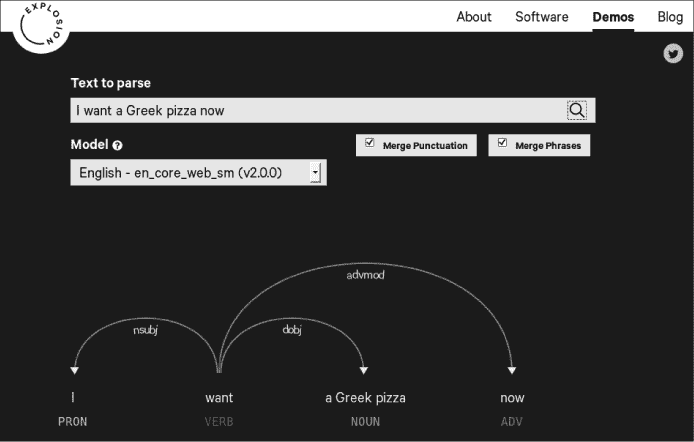
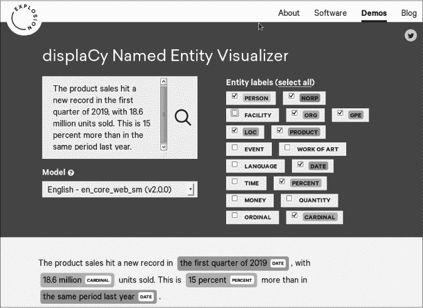
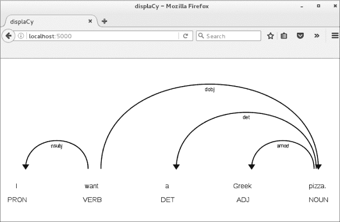
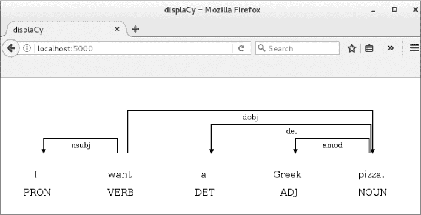
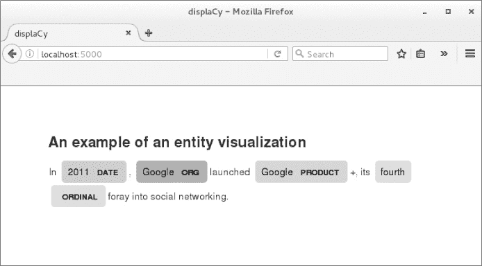
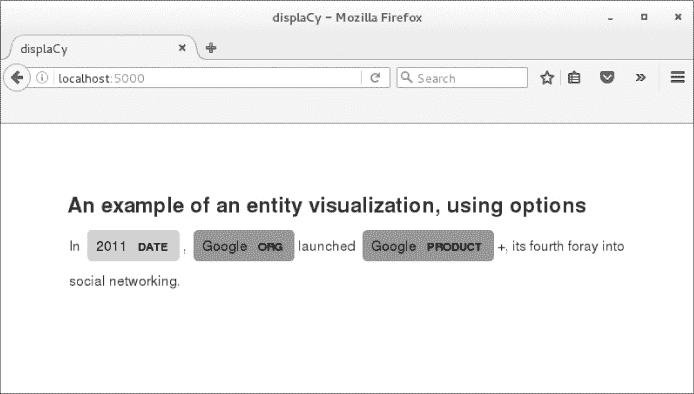

## 第七章：VISUALIZATIONS**


发现数据中的见解，也许最简单的方法就是以图形方式呈现数据。像图 7-1 所示的可视化效果，能够让你立即识别数据中的模式。

在本章中，你将学习如何使用 spaCy 内置的可视化工具：displaCy 依存关系可视化器和 displaCy 命名实体可视化器，来生成句子的句法结构和文档中的命名实体的可视化效果。

我们将从探索这些可视化工具的互动演示开始，这些演示可以在 Explosion AI 网站上找到（Explosion AI 是 spaCy 的开发者），以便了解 spaCy 的可视化工具可以完成什么功能。接下来，你将学习如何在你的机器上启动 displaCy Web 服务器，从而能够在 spaCy 中编程可视化一个 Doc 对象。你还将学习如何自定义你的可视化效果。最后，你将学习如何使用 displaCy 渲染手动准备的数据，而无需传入一个 Doc 对象。

### **使用 spaCy 内置可视化工具入门**

让我们首先探索 displaCy 依存关系可视化器和 displaCy 命名实体可视化器是如何工作的。开始使用 spaCy 内置可视化工具的最快方法是利用它们提供的互动演示，链接可见于*[`explosion.ai/demos/`](https://explosion.ai/demos/)*。在这个页面上，你会找到两个 displaCy 可视化工具的演示页面链接以及其他一些演示链接。

#### ***displaCy 依存关系可视化器***

displaCy 依存关系可视化器为提交的文本生成句法依存关系的可视化效果。要使用其互动演示，请访问*[`explosion.ai/demos/displacy/`](https://explosion.ai/demos/displacy/)*。将“Text to parse”文本框中的示例句子替换为你的文本，然后点击框右侧的搜索图标（放大镜），生成可视化效果。结果可能类似于图 7-1。



*图 7-1：Explosion AI 网站上的 displaCy 依存关系可视化器*

该依存关系可视化器展示了提交文本中的词性标记和句法依存关系，立即呈现其句法结构。

该可视化工具允许你使用“合并标点符号”和“合并短语”复选框来自定义图形。“合并标点符号”将标点符号与前一个词合并，使得可视化效果更加紧凑，从而提高可读性。“合并短语”将每个名词短语合并为一个单一的词元，正如图 7-1 中的示例所示。默认情况下，这两个选项都是启用的。

你可以通过取消选中相应的框来更改其中一个或两个默认设置。例如，如果你取消选中“I want a Greek pizza now”的“合并短语”框，你将看到该句子的更详细的依赖解析，展示名词短语“a Greek pizza”中的依赖关系。

保持选中“合并短语”框可以让你获得一个更加紧凑的依赖树，这在处理包含多个名词短语的句子时尤其有用。例如，考虑以下句子：“I see a few young people working in their vegetable field.” 它包含两个名词短语：“a few young people”和“their vegetable field”。第一个是动词“see”的直接宾语，第二个是修饰动词“work”的介词短语中的宾语，分别显示依赖标签`dobj`和`pobj`。严格来说，这些依赖标签是与相应短语中的名词相关，而不是与整个句子相关。

除了“合并标点符号”和“合并短语”选项外，你还可以从可用模型列表中选择一个统计语言模型来使用。这个选项让你可以在不下载和安装到你的环境中的情况下，尝试一个依赖解析模型。目前，你可以从以下模型中选择：`en_core_web_sm`、`en_core_web_md`和`en_core_web_lg`，以及其他欧洲语言（如德语、西班牙语、葡萄牙语、法语、意大利语和荷兰语）的“小（sm）”模型。

#### ***displaCy 命名实体可视化工具***

displaCy 命名实体可视化工具为提交的文本生成命名实体可视化图。你可以在* [`explosion.ai/demos/displacy-ent/`](https://explosion.ai/demos/displacy-ent/)* 上找到它的交互式演示。从用户的角度来看，它的工作方式与上一节讨论的 displaCy 依赖可视化工具演示类似。要为文本生成可视化图，将其输入文本框中，然后点击搜索图标。可视化工具会处理你的查询并在窗口底部输出原始文本，突出显示已发现的命名实体及其标签，如图 7-2 所示。

你可以通过选中或取消选中“实体标签”下的框来选择应用程序应在提交的文本中识别哪些类型的命名实体。在图 7-2 所示的示例中，你将`PERCENT`和`CARDINAL`添加到默认选择的实体标签类型列表中。添加`PERCENT`实体类型会告诉可视化工具识别表示百分比的短语或包含“%”符号的短语。添加`CARDINAL`实体类型则保证可视化工具能够识别与提交文本中的数字相关的短语。

您应该选择哪些框取决于您的上下文。在处理财务报告时，您可能会选择 `money` 和 `date` 框。但如果报告中包含多个公司的财务活动记录，您可能还希望选择 `ORG` 实体标签框，以指示可视化器在文本中突出显示公司名称。



*图 7-2：Explosion AI 网站上的 displaCy 命名实体可视化器*

### **从 spaCy 内部进行可视化**

从 spaCy v2.0 开始，displaCy 可视化工具已集成到核心库中。这意味着在安装 spaCy 后，您可以立即在 Python 代码中使用它们。

为此，您必须使用以下流程：启动一个内置的 Web 服务器，然后将一个 Doc 对象（或 Doc 对象的列表）发送给它进行渲染。服务器会为提交的 Doc 生成可视化，您随后可以在浏览器中查看它。我们将在本节中介绍几个示例。

#### ***可视化依存句法分析***

以下脚本展示了生成一个句子的依存树可视化的最简单方法：

```py
   import spacy

   nlp = spacy.load('en')

➊ doc = nlp(u"I want a Greek pizza.")

➋ from spacy import displacy

➌ displacy.serve(doc, ➍style='dep')
```

我们创建一个 Doc 对象并提交给 displaCy ➊。然后我们从核心库中导入 displaCy 库 ➋，接着可以启动一个 displaCy 网络服务器，并将 Doc 对象传递给它。两个操作都是通过调用 `displacy.serve()` 方法 ➌ 来完成的。通过将参数 style 设置为 `'dep'`，我们指示 displaCy 使用依存句法可视化器 ➍，为 Doc 对象中的文本生成依存树可视化。如果您有兴趣实现本章前面探讨的复选框选项，请参考“试试看”在 104 页中的内容。

无论您是在 Python 会话中运行此代码，还是作为单独的脚本运行，执行会进入一个无限循环，并显示来自 displaCy 网络服务器的消息。您应该看到的初始消息如下：

```py
Serving on port 5000...

Using the 'dep' visualizer
```

这意味着服务器已经为提交的文本生成了依存树可视化，并且在您的主机上通过 5000 端口（默认端口）提供 HTTP 请求。实际上，这意味着您可以将浏览器指向 *http://localhost:5000* 来查看该可视化。在此示例中，它应该像图 7-3 所示。



*图 7-3：您可以从 Python 代码中生成并在浏览器中查看的依存树可视化示例*

要关闭 displaCy 服务器，请在启动服务器的终端中按 CTRL-C。这样，您应该会看到来自服务器的以下最终消息：

```py
Shutting down server on port 5000.
```

关闭服务器后，您将无法在浏览器中生成新的可视化副本，但您仍然可以查看已经生成的副本。

#### ***试试看***

通过修改前一部分中依赖关系可视化器的脚本，尝试使用命名实体可视化器。为了指示 displaCy 应用命名实体可视化器，将`displacy.serve()`方法的 style 参数设置为`'ent'`。

为了生成更有趣的可视化效果，你可能会使用包含多句的较长文本。例如，可以尝试使用以下文本：

```py
Microsoft Windows is a family of proprietary operating systems developed and

sold by Microsoft. Bill Gates announced Microsoft Windows on November 10,

1983\. Microsoft first released Windows for sale on November 20, 1985\. Windows

1.0 was initially sold for $100.00, and its sales surpassed 500,000 copies in

April 1987\. For comparison, more than a million copies of Windows 95 were sold

in just the first 4 days.
```

在对 Doc 对象调用`displacy.serve()`方法后，将浏览器指向*http://localhost:5000*以查看可视化效果。请注意实体识别器在此示例文本中识别的命名实体及其类型。特别是，你应该看到实体识别器能识别出人名、产品名、公司名以及与日期、数字和金钱相关的短语。

#### ***逐句可视化***

当你处理单个句子时，依赖关系树的可视化效果很好。但当你在可视化长文本时，图形可能会变得冗长且占用空间，使得它们在一行中显示时变得难以阅读。尽管 displaCy 为每个句子生成单独的可视化效果，但当你传入包含多个句子的 Doc 时，它会将它们排列在一行中。

你也许想要逐句进行可视化，而不是传入一个 Doc 对象。例如，当你需要从整篇文章中提取含义，并且想要探索一系列句子时，这可能会很有用。从版本 2.0.12 开始，displaCy 允许你传入 Span 对象，然后将可视化效果按行排列。如果你想为`doc.sents`中找到的每个句子生成一个可视化效果，可以传入`doc.sents`的列表，如以下代码所示：

```py
   import spacy

   nlp = spacy.load('en')

   doc = nlp(u"I have a relaxed pair of jeans. Now I want a skinny pair.")

➊ spans = list(doc.sents)

   from spacy import displacy

   displacy.serve(➋spans, style='dep')
```

如第三章所讨论，Doc 对象的`doc.sents`属性是一个迭代器，遍历 Doc 对象中的句子。因此，你不能使用这个属性通过索引引用句子，但你可以在循环中迭代它们，或者创建一个 Span 对象的列表，其中每个 span 代表一个句子。在这段代码中，我们将 Doc 中的句子转换为 Span 对象的列表➊。然后我们将该 Span 列表传递给`displacy.serve()`进行可视化➋。

这将为每个句子生成一个可视化效果，并按行排列，允许你通过垂直滚动查看它们。

### **使用 Options 参数定制可视化效果**

除了你到目前为止在示例中看到的 docs 和 style 参数外，`displacy.serve()`方法还可以接受其他几个参数。`options`参数可能是最有趣的之一，因为它允许你定义一个设置字典，用于定制可视化的布局。在本节中，我们将介绍一些最有用的`options`设置。

#### ***使用依赖关系可视化器选项***

长句子在一行内显示时可能很难查看。在这种情况下，你可以创建*紧凑模式*的可视化效果，这种模式占用更少的空间。为此，你需要在`options`参数中将`'compact'`选项设置为`True`，如本脚本所示。脚本还更改了可视化器使用的字体。（displaCy API 文档中可用选项的完整列表可以在*[`spacy.io/api/top-level/#options-dep/`](https://spacy.io/api/top-level/#options-dep/)*找到。）

```py
import spacy

nlp = spacy.load('en')

doc = nlp(u"I want a Greek pizza.")

from spacy import displacy

options = {➊'compact': True, ➋'font': 'Tahoma'}

displacy.serve(doc, style='dep', ➌options=options)
```

`displacy.serve()`方法期望`options`参数是一个字典。在这个例子中，我们只设置了两个选项：将`'compact'`选项设置为`True` ➊，将`'font'`选项设置为`'Tahoma'` ➋，分别更改了它们的默认值。（可视化器允许你使用大多数标准的网页字体，如 Arial、Courier 等。）然后我们将选项字典传递给`options`参数 ➌。

图 7-4 展示了运行脚本后，当你将浏览器指向*http://localhost:5000*时应该看到的内容。

你在图中看到的方形弧线可能看起来不太寻常，但它们使整体可视化更加紧凑，通常可以避免你需要滚动才能看到整个图示。



*图 7-4：定制化依存关系可视化示例*

#### ***试试看***

在“displaCy 依存关系可视化器”交互式演示中，讨论了第 98 页，你使用了“合并短语”和“合并标点符号”选项。在 spaCy 中，你可以通过`collapse_phrases`选项将名词短语合并为一个标记（图 7-1 展示了 displaCy 可视化器网站上相应的选项），默认设置为`False`。`collapse_punct`选项用于将标点符号附加到标记上，默认设置为`True`。

修改之前脚本中的代码，使其将`collapse_phrases`选项设置为`True`，并传递给选项集。运行脚本，然后在浏览器中查看生成的可视化效果，确保名词短语作为一个整体显示。

#### ***使用命名实体可视化选项***

命名实体可视化选项的列表（可以在*[`spacy.io/api/top-level/#displacy_options-ent/`](https://spacy.io/api/top-level/#displacy_options-ent/)*找到）比依存关系可视化选项的列表要短得多。在使用实体可视化器时，你可以选择通过`'ents'`选项突出显示哪些实体类型，并通过`'colors'`选项覆盖默认颜色。

第一个选项是两个选项中更重要的，因为它允许你指示可视化器仅高亮显示选定类型的实体。以下示例展示了你可能想要限制可视化器显示的实体类型的情况。

在这个脚本中，我们没有提供任何实体可视化器的选项，这意味着它会高亮显示提交的文档中的所有类型的实体。

```py
import spacy

nlp = spacy.load('en')

doc = nlp(u"In 2011, Google launched Google +, its fourth foray into social

networking.")

➊ doc.user_data['title'] = "An example of an entity visualization"

   from spacy import displacy

   displacy.serve(doc, style=➋'ent')
```

我们使用文档的 `user_data` 属性为文档设置标题 ➊。displaCy 可视化器会自动将此属性中的文本作为可视化的标题。为可视化添加标题是可选的，但在需要注释可视化时非常有用。

我们将 `displacy.serve()` 方法的样式参数设置为 `'ent'` ➋，指示 displaCy 使用命名实体可视化器。生成的可视化效果应类似于图 7-5 中的效果（尽管这些图像是灰度的，网站上使用的是彩色）。



*图 7-5：使用默认选项生成的命名实体可视化示例*

总体来说，视觉效果看起来不错。但在这个上下文中，突出显示序数“第四”可能是不必要的。在这种情况下，很难弄清楚为什么我们需要提取这个信息。使用 `'ents'` 选项时，我们选择要突出显示的实体类型。以下代码演示了如何实现这一点。要查看效果，我们将前一个脚本的最后一行代码替换为以下两行代码，然后运行更新后的脚本：

```py
options = {➊'ents': ["ORG", "PRODUCT", "DATE"], ➋'colors': {"ORG": "aqua",

"PRODUCT": "aqua"}}

displacy.serve(doc, style='ent', options=options)
```

这次，可视化器不应识别除 `ORG`、`PRODUCT` 或 `DATE` 类型之外的任何实体 ➊。此示例还说明了如何使用 `'colors'` 选项来更改分配给实体类型的默认颜色。在这个示例中，我们将 `ORG` 和 `PRODUCT` 类型映射到颜色 `"aqua"` ➋。

**注意**

*使用 `'colors'` 选项时，可以将实体类型映射到网页颜色名称或十六进制颜色代码。在第 105 页的示例中，使用十六进制代码 `"``#00FFFF``"` 等同于使用颜色名称 `"``aqua``"`。*

图 7-6 说明了生成的可视化效果应该是什么样的。



*图 7-6：使用指定的 `'ents'` 和 `'colors'` 选项生成的实体可视化示例*

如您所见，此可视化几乎与图 7-5 中显示的完全相同。但这次可视化器没有突出显示 `ORDINAL` 类型的实体，因为我们传入的 `'ents'` 选项列表中不包括此类型。

### **将可视化导出为文件**

在之前的示例中，我们使用了 displaCy Web 服务器来查看正在生成的可视化。正如您在这些示例中学到的，只要通过相同的 `displacy.serve()` 调用启动的服务器正在运行，您就可以在浏览器中打开通过 `displacy.serve()` 方法生成的可视化。

使用 `displacy.render()` 方法，您可以避免这个限制并创建一个可供后续使用的可视化。`displacy.render()` 方法允许您将标记渲染为 HTML 页面，然后将其保存在单独的文件中。稍后，您可以在任何浏览器中打开该文件，而无需调用 Web 浏览器。

以下脚本展示了如何使用`displacy.render()`方法来进行命名实体可视化，如图 7-5 所示：

```py
import spacy

nlp = spacy.load('en')

doc = nlp(u"In 2011, Google launched Google +, its fourth foray into social

   networking.")

➊ doc.user_data["title"] = "An example of an entity visualization"

   #In the next block, you instruct displaCy to render the markup wrapped as a

   full HTML page.

   from spacy import displacy

➋ html = displacy.render(doc, style='ent', ➌page=True)

   #In the next block, you save the html file generated by displacy.render() to

   disk on your machine. 

➍ from pathlib import Path

➎ output_path = Path("/visualizations/ent_visual.html")

➏ output_path.open("w", encoding="utf-8").write(html)
```

我们可以将脚本中的代码分为三个部分，每一部分都以注释行开始。第一部分应该是大家熟悉的。这里，我们创建一个文本处理管道，然后将其应用于文本。接着我们使用 Doc 的`user_data`属性为 Doc 设置一个标题 ➊。

在第二个代码块中，我们使用`displacy.render()`方法为前一步创建的 Doc 渲染命名实体可视化➋。与`displacy.serve()`不同，`displacy.render()`不会启动一个 Web 服务器，而是生成一个可视化的 HTML 标记。通过将页面参数设置为`True`，我们指示`displacy.render()`生成一个完整 HTML 页面的标记 ➌。

在最后一个代码块中，我们从 Python 3.4 引入的`pathlib`模块中导入了`Path`类➍。我们可以使用`Path`对路径对象执行系统调用。在这个例子中，我们在以下路径上实例化了这个类：*/visualizations/ent_visual.html* ➎，假设我们在本地文件系统中已经有了*/visualizations*文件夹（否则会抛出异常）。然后，我们打开*ent_visual.html*文件（如果文件不存在，将创建该文件），并将前一步生成的 HTML 页面写入该文件 ➏。

总结来说，这个脚本生成一个包含提交文本命名实体可视化的 HTML 文件，并将该文件保存在你的文件系统中。如果你进入保存文件的文件夹并双击该文件，它将在浏览器中打开。

### **使用 displaCy 手动渲染数据**

displaCy 可视化工具允许你手动创建数据集，然后进行渲染，而不是将数据作为 doc 或 span 传递进来。当你需要，比如说，可视化其他 NLP 库的输出或使用一组自定义标签或自定义依赖关系标签来创建可视化时，这会非常有用。（我将在第十章中讨论如何制作这些自定义标签和标签。）

作为一个例子，接下来我们手动渲染句子“I want a Greek pizza.”

#### ***数据格式化***

首先，你需要将数据转换为 displaCy 的格式：一个包含两个列表的字典：`"words"`和`"arcs"`，如下代码所示：

```py
sent = {

    "words": [

     ➊ {"text": "I", "tag": "PRON"},

        {"text": "want", "tag": "VERB"},

        {"text": "a", "tag": "DET"},

        {"text": "Greek", "tag": "ADJ"},

        {"text": "pizza", "tag": "NOUN"}

    ],

    "arcs": [

     ➋ {"start": 0, "end": 1, "label": "nsubj", "dir": "left"},

        {"start": 2, "end": 4, "label": "det", "dir": "left"},

        {"start": 3, "end": 4, "label": "amod", "dir": "left"},

        {"start": 1, "end": 4, "label": "dobj", "dir": "right"}

    ]

}
```

`sent`字典包含两个列表：`"words"`和`"arcs"`，每个列表中包含一组字典。在`"words"`列表中的字典为句子中的特定标记分配一个标签 ➊，而在`"arcs"`列表中的字典定义了依赖树中的一条弧，连接句子中两个语法上相关的单词 ➋。在这个例子中，句子中有五个单词，并定义了四个语法关系。正因如此，字典在`"words"`列表中包含五个项目，在`"arcs"`列表中包含四个项目。

现在我们已经有了包含数据的字典，我们需要为示例句子生成一个依赖关系解析的可视化效果；可以使用以下代码进行渲染：

```py
➊ from spacy import displacy

   displacy.serve(➋sent, style="dep", ➌manual=True)
```

请注意，我们不需要导入整个 spaCy 库。我们只需从中导入 `displacy` 模块 ➊。然后调用 `displacy.serve()` 方法，将 `sent` 字典作为第一个参数传入，代替 Doc 对象 ➋。第三个参数 `manual` 告诉 displaCy 我们是手动创建的数据集用于渲染 ➌，因此 displaCy 不需要从 Doc 对象中提取数据。

#### ***尝试这个***

当你选择手动创建一个字典并将数据渲染为可视化时，你可以使用自定义标签，例如指定可视化工具使用细粒度的词性标签，而不是默认的粗粒度标签。

你可以通过在传入 Doc 对象进行渲染时，仅仅将 `fine_grained` 选项设置为 `True` 来完成此任务，但为了练习，试着手动实现这一过程。

在 “格式化数据” 的示例中（见第 108 页），更改 `"sent"` 字典中 `"words"` 列表里的标签，使它们的值成为细粒度标签。接着，启动 displaCy 服务器，并指示它基于 `"sent"` 字典中指定的数据生成可视化。然后，打开浏览器并访问 *http://localhost:5000* 来查看可视化效果。

### **总结**

你在之前的章节中已经见过句法结构的可视化图像，但在这一章中，你学习了如何使用 displaCy 依赖关系可视化工具生成这些可视化效果。你还学习了如何使用 displaCy 命名实体可视化工具生成命名实体信息的图像。
