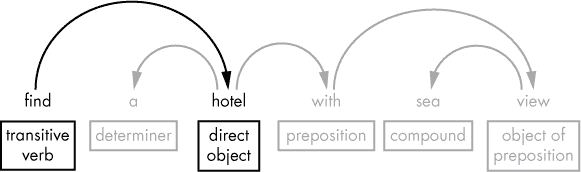
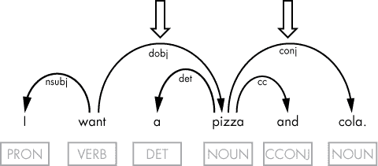
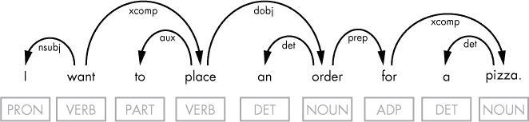
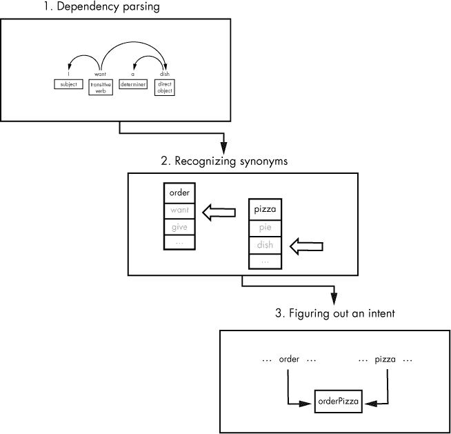
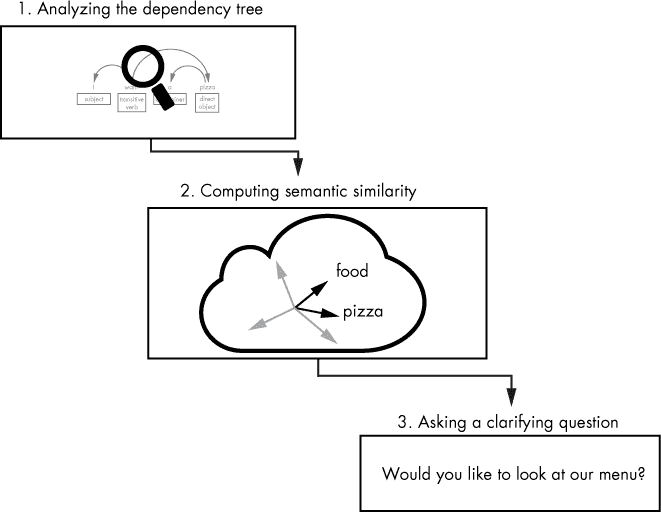
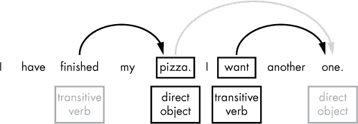
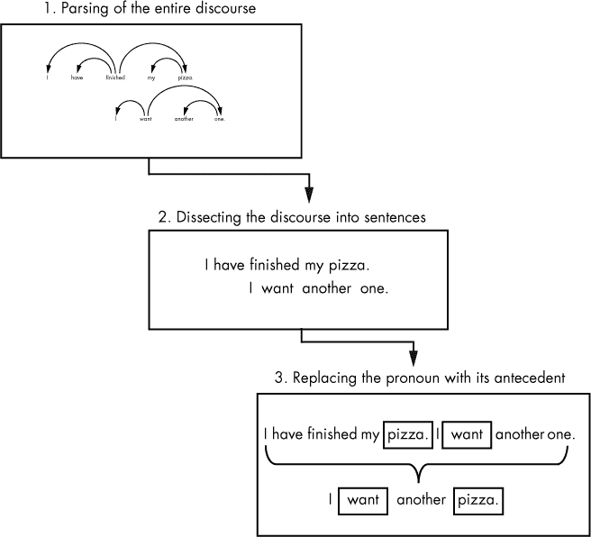

## 第八章：意图识别**


聊天机器人应足够聪明，能够理解用户的需求。例如，一个对话型聊天机器人必须识别用户的意图，才能与用户维持正确的对话，而一个食品订购聊天机器人则需要理解顾客的意图才能接单。虽然意图识别的任务在前面的章节中有所涉及，但本章会更深入地讨论它。

你将从通过提取发话中的及物动词和直接宾语来识别用户的意图开始。然后，你将探索如何从一系列句子中推导出用户的意图，识别不同可能意图的同义词，并通过语义相似性来确定用户的意图。

### **提取及物动词和直接宾语以进行意图识别**

通常，你可以通过三步来识别用户的意图：将句子解析为标记，将标记连接起来，标记之间的弧线表示句法关系，并通过遍历这些弧线提取相关标记。在许多情况下，提取句子的及物动词和直接宾语可以识别用户的意图，如图 8-1 所示的句法依赖解析所示。



*图 8-1：句子句法结构的图形表示示例*

连接及物动词和直接宾语的弧线表示用户的意图是寻找一家酒店，或者如果你将及物动词和直接宾语合并成一个词，就是`findHotel`。你可以在程序的后续部分使用这种结构作为*意图标识符*，如下所示的代码片段：

```py
      intent = extract_intent(doc) 

      if intent == 'orderPizza': 

        print('We need you to answer some questions to place your order.') 

        ...

      elif intent == 'showPizza': 

        print('Would you like to look at our menu?')

        ...
```

**注意**

*在第十一章中，你将看到更多关于如何在聊天机器人应用的代码中使用意图标识符的详细示例。*

但有时从及物动词/直接宾语对中找出含义并不那么容易。你可能需要探讨及物动词和直接宾语的句法关系，以找到最佳描述意图的动词和名词。

在其他情况下，用户的意图并未明确表达出来，因此你必须通过推测隐含的意图来理解。在本节中，你将学习如何使用句法依赖结构来提取意图的策略。

#### ***获取及物动词/直接宾语对***

让我们通过检查每个标记的依赖标签，寻找`dobj`来从句子中提取及物动词/直接宾语对。一旦找到直接宾语，我们就可以通过获取直接宾语的句法主干，轻松找到相应的及物动词，正如以下脚本所示：

```py
   import spacy

   nlp = spacy.load('en')

➊ doc = nlp(u'show me the best hotel in berlin')

➋ for token in doc:

     if token.dep_ == 'dobj':

       print(➌token.head.text + token.text.capitalize())
```

在这个脚本中，我们首先对示例句子 ➊ 应用管道处理，然后遍历标记，查找其依赖标签为 `dobj` 的标记 ➋。找到后，我们通过获取直接宾语的中心词 ➌ 来确定对应的及物动词。在这个例子中，我们还将及物动词和其直接宾语连接起来，以便将意图以单一单词的形式表达出来。

脚本生成以下字符串：

```py
showHotel
```

请记住，并非所有包含及物动词/直接宾语对的句子都表示意图。例如，“他给了我一本书”只是陈述事实。我们可以通过检查动词的特征来过滤掉这样的句子，仅挑选出那些动词为现在时并且不是第三人称的句子。然而，像这样的句子从客户与接单聊天机器人之间的对话中听到的可能性不大。

#### ***使用 token.conjuncts 提取多个意图***

有时，你可能会遇到似乎表达多个意图的句子。例如，考虑以下句子：

```py
I want a pizza and cola.
```

在这种情况下，用户想要订购一份披萨和一瓶可乐。但在大多数情况下，你可以将这些意图视为单一复杂意图的一部分。尽管用户请求不同类型的物品，你通常会将这个句子视为由多个物品组成的单一订单。在这个例子中，你可能会将意图识别为 `orderPizza`，这是通过将及物动词和直接宾语对结合起来形成的，但会提取 `pizza` 和 `cola` 作为订单中的物品。

图 8-2 显示了示例句子的依赖树。



*图 8-2：包含直接宾语及其连接词的句子的依赖树*

在图示中，你可以看到有两条箭头指向直接宾语“pizza”和与之相关的连接词“cola”。名词的*连接词*是通过连词如“和”、“或”等连接的另一个名词。为了提取直接宾语及其相关的连接词，我们可以使用以下代码：

```py
   doc = nlp(u'I want a pizza and cola.')

   #extract the direct object and the conjunct associated with it

   for token in doc:

     if token.dep_ == 'dobj':

       dobj = [token.text]

       conj = [t.text for t in ➊token.conjuncts]

   #compose the list of the extracted elements

➋ dobj_conj = dobj + conj 

   print(dobj_conj)
```

我们通过使用直接宾语 ➊ 的 Token 对象的 `conjuncts` 属性来提取与直接宾语相关的连接词。一旦获得了直接宾语及其连接词，我们将它们合并成一个列表 ➋。

脚本输出应该如下所示：

```py
['pizza', 'cola']
```

为了构建意图，我们还应提取动词。我们在已经拥有直接宾语的情况下，获取直接宾语的句法中心词是获得动词的最简单方法（你在《获取及物动词/直接宾语对》中第 113 页看到过这个例子）：

```py
verb = dobj.head
```

然后，使用动词和直接宾语的文本属性，我们可以组合出意图。

#### ***试一试***

在 第 114 页提供的脚本中，你通过 `Token` 对象的 `conjuncts` 属性访问了与直接宾语相关的连接词。在新的脚本中，替换这一行代码，通过寻找从直接宾语向外延伸的标记为 `conj` 的弧线来提取连接词。你可以在同一个循环中完成这项工作，在该循环中，你通过寻找标记为 `dobj` 的弧线获得直接宾语。务必检查 `conj` 弧线的头词是否与直接宾语匹配。

#### ***使用词汇表提取意图***

在某些情况下，除了及物动词和直接宾语外，其他词汇可能更好地描述用户的意图。这些词汇通常与及物动词或直接宾语相关。因此，你需要进一步探讨及物动词和直接宾语的句法关系，以发现能够最好表达意图的词汇。

举个例子，考虑以下话语：

```py
I want to place an order for a pizza.
```

在这个句子中，“want”和“pizza”这两个词最能表达意图，但它们都不是直接宾语或及物动词。然而，通过查看话语的依赖树，你会发现“want”和“pizza”分别与及物动词“place”和直接宾语“order”相关。图 8-3 展示了这里讨论的依赖树。



*图 8-3：一个话语的依赖树，其中的及物动词和直接宾语并未传达用户的意图*

为了从话语中提取这些词，我们将使用一个预定义的词汇表，然后在用户的话语中搜索这些词。

一位经验丰富的程序员可能会质疑硬编码如此长的列表的有效性，尤其是在多种不同场景下使用时。但如果这个列表是针对特定场景的，例如下订单披萨，它可能出奇的简短，这使得这种方法非常高效。以下代码实现了这种方法：

```py
   #apply the pipeline to the sample sentence

   doc = nlp(u'I want to place an order for a pizza.')

   # extract the direct object and its transitive verb

   dobj = ''

   tverb = ''

   for token in doc:

  ➊ if token.dep_ == 'dobj':

       dobj = token

       tverb = token.head 

   # extract the verb for the intent's definition

   intentVerb = ''

   verbList = ['want', 'like', 'need', 'order']

➋ if tverb.text in verbList: 

     intentVerb = tverb

➌ else:

     if tverb.head.dep_ == 'ROOT':

       intentVerb = tverb.head

   # extract the object for the intent's definition

   intentObj = ''

   objList = ['pizza', 'cola']

➍ if dobj.text in objList: 

     intentObj = dobj

   else:

     for child in dobj.children:

       if child.dep_ == 'prep': 

        ➎ intentObj = list(child.children)[0]

           break

    ➏ elif child.dep_ == 'compound': 

           intentObj = child

           break

   # print the intent expressed in the sample sentence 

   print(intentVerb.text + intentObj.text.capitalize())
```

和往常一样，我们从查找并提取直接宾语及其及物动词 ➊ 开始。一旦得到它们，我们检查它们是否能在相应的预定义词汇表中找到。这里我们当然使用简化的词表：`verbList` 列表包含顾客可能用来下订单的动词，而 `objList` 列表包含可能的菜单项作为直接宾语。我们首先检查及物动词 ➋。如果它不在允许的动词列表 ➌ 中，我们就检查句子的主动词（`ROOT`），它是及物动词的头词。如果及物动词是句子的主动词，这个实现依然有效，因为主动词（`ROOT`）的头词指向它自己。

接下来，我们继续检查直接宾语 ➍。如果它不在允许的词汇列表中，我们检查它的句法子节点。我们首先检查直接宾语的介词。如果存在介词，我们会选取介词的子节点（它只能有一个子节点） ➎，该子节点始终是介词的宾语。

为了使这种方法适用于更多的情况，光是检查直接宾语的子节点中的介词是不够的。例如，下面这句话就无法使用此逻辑：“I want to place a pizza order”（我想下个披萨订单），其中没有介词子分支。相反，直接宾语有一个左子节点，“pizza”（披萨），spaCy 将其标记为复合词。因此，我们检查直接宾语的子节点中是否有复合词 ➏。

最后，我们打印表示意图标识符的字符串。我们应该得到以下字符串：

```py
wantPizza
```

注意，我们使用 `wantPizza` 作为意图标识符，而不是 `placeOrder`（如果我们仅仅使用及物动词/直接宾语对，本来会得到这个标识符）。这种方法使我们能够减少应用程序中使用的意图标识符的数量。

### **使用同义词和语义相似性来找出词义**

英语，像许多其他自然语言一样，允许你以不同的方式表达相同的思想和意图，因为它包含了*同义词*——意思几乎相同的单词或短语。

作为一个聊天机器人应用程序的开发者，你需要考虑到用户可能会使用一套相当广泛的短语来表达每个应用程序应支持的意图。这意味着你的应用程序必须能够识别用户输入中的同义短语。事实上，如果你是在像 Google 的 Dialogflow 这样的流行机器人平台上构建你的聊天机器人，你需要为每个可能的意图提交一组短语。然后，你可以在后台使用这些话语来训练机器人的模型。

识别同义词有不止一种方法。一种方法是使用预定义的同义词列表。你可以将感兴趣的单词与这些列表进行比对，从而根据它所在的列表识别单词的意义。另一种方法是基于语义相似性来识别同义词，这个任务在第五章中有详细描述。我将在接下来的部分讨论这两种方法。

#### ***使用预定义列表识别同义词***

你已经知道，在大多数情况下，及物动词和它的直接宾语能最准确地描述一个短语的意图。识别两个短语是否表达相同意图的一个简单方法是，确保这两个短语中的及物动词是同义的，并且它们的直接宾语也是同义的。

例如，下面这三句话表达了相同的意图，你可以将其定义为 `orderPizza`（订披萨）：

```py
I want a dish. I'd like to order a pizza. Give me a pie.
```

处理这些话语的步骤如下：

1.  执行依存句法分析，从句子中提取及物动词及其直接宾语。

1.  使用预定义的同义词列表，替换及物动词和直接宾语，用应用程序识别的单词替代。

1.  构建表示意图的字符串。

图 8-4 中的图示总结了这些步骤，展示了这如何适用于例如“我想要一份菜”的情况。



*图 8-4：使用同义词列表处理意图识别*

在依赖分析之后（在你应用管道处理语句时会隐式完成），你提取出直接宾语和及物动词，然后将它们与对应的同义词列表进行对比。如果找到匹配项，你将该单词替换为列表中的第一个元素，应用程序应该能够识别这个词。

让我们来看一下这个场景的 Python 实现可能是什么样的：

```py
   #apply the pipeline to the sample sentence

   doc = nlp(u'I want a dish.')

   #extract the transitive verb and its direct object from the dependency tree

➊ for token in doc:

     if token.dep_ == 'dobj':

       verb = token.head.text 

       dobj = token.text

   #create a list of tuples for possible verb synonyms

➋ verbList = [('order','want','give','make'),('show','find')]

   #find the tuple containing the transitive verb extracted from the sample

➌ verbSyns = [item for item in verbList if verb in item]

   #create a list of tuples for possible direct object synonyms

➍ dobjList = [('pizza','pie','dish'),('cola','soda')]

   #find the tuple containing the direct object extracted from the sample

   dobjSyns = [item for item in dobjList if dobj in item]

   #replace the transitive verb and the direct object with synonyms supported by

   the application

   #and compose the string that represents the intent 

➎ intent = verbSyns[0][0] + dobjSyns[0][0].capitalize()

   print(intent)
```

我们首先为示例句子创建一个 Doc 对象实例。然后，我们通过 Doc 对象迭代可用的依赖树，提取及物动词及其直接宾语 ➊。接下来，我们创建一个包含所有允许的及物动词及其同义词的元组列表 ➋。每个元组的第一个元素是应用程序可以识别的及物动词，元组中的其他元素是其同义词。

现在我们已经定义了允许的及物动词及其同义词，并将它们放入一个元组列表中，我们可以遍历整个列表，寻找包含从示例句子提取的及物动词的元组 ➌。

同样，我们为已识别的直接宾语及其同义词创建一个元组列表，然后找到包含从示例中提取的直接宾语的元组 ➍。

最后，我们将选择的元组的第一个元素拼接起来，组成意图名称 ➎。结果，打印命令应该输出以下字符串：

```py
orderPizza
```

请记住，选择给定动词的同义词集合在很大程度上取决于我们正在创建的应用类型。例如，在一个接收披萨订单的机器人应用中，“make”和“give”这两个动词可以被认为是同义的。原因是用户在点披萨时可能交替使用“Make me a pizza”和“Give me a pizza”这两种说法。

#### ***试试看***

使用第 118 页提供的示例代码作为创建新脚本的基础。让脚本保持原有功能，但当找不到及物动词、直接宾语或两者时，将意图名称生成“unrecognized”。为了测试代码，可以用示例句子进行实验，修改它以便看到新功能的效果。例如，你可以使用以下句子：

```py
I want an apple.
```

用一个包含列表中没有的动词的句子来测试它。

另外，你可能会尝试使用同义词列表处理前面章节中讨论的连接词问题。

#### ***通过语义相似性识别隐含的意图***

现实世界的实现可能会比本章所展示的示例更为复杂。即使使用大量预定义的同义词列表，也不总是奏效。原因在于用户以多种不同方式表达他们的意图，而且他们并不总是明确表达。

识别隐含意图很大程度上依赖于上下文。例如，如果你的机器人是为特定类型的任务设计的，比如订餐，它应该能够识别暗示请求的短语，如“我想吃一个馅饼。”，并理解这是下披萨订单的意图。

一种广为人知的技巧是通过询问澄清性问题来让用户更明确地表达他们的意图。为了确定该问什么问题，你可以计算之前用户话语的语义相似度。

图 8-5 展示了如何实现这一任务。



*图 8-5：通过计算语义相似度并询问澄清性问题来识别隐含意图*

你首先分析输入语句的依存关系树，以提取直接宾语及其及物动词。例如，如果在预定义的同义词列表中找不到直接宾语，如在“使用预定义列表识别同义词”第 117 页中讨论的那样，你可以尝试确定直接宾语与列表中词汇的相似度。基于计算语义相似度的结果，你可以生成一个澄清性问题。

让我们通过代码来实现这一技巧，我将其分成几个部分。和往常一样，我们从将文本处理管道应用于示例句子开始：

```py
doc = nlp(u'I feel like eating a pie.')
```

然后我们提取直接宾语词元：

```py
for token in doc:

  if token.dep_ == 'dobj':

    dobj = token
```

我们为“食物”一词创建一个词元。我们将计算这个词元与直接宾语词元之间的语义相似度：

```py
tokens = nlp(u'food')
```

如果相似度超过预定阈值，应用程序会猜测用户很可能有下单的意图。然后，它会提出一个澄清性问题以确认这一点：

```py
if dobj.similarity(tokens[0]) > 0.6:

  question = 'Would you like to look at our menu?'
```

回想一下第五章中提到的，spaCy 使用词向量来计算词元的语义相似度。两个向量在向量空间中的距离越近，它们之间的相似度就越高。在这个示例中，我们使用 0.6 作为假设直接宾语与食品产品相似的最低相似度标准。

#### ***尝试这个***

当然，你无法预先知道用户将使用哪些短语，也无法预测识别用户意图的难易程度。你的应用程序也无法做到这一点。这就是为什么实际应用通常结合多种方法来识别意图。结合基于识别同义词的方法与基于处理隐含意图的方法（如前文所述），这样你可以应对更多的可能情况。首先尝试使用基于同义词的方法从发话中提取意图。如果失败，再尝试基于语义相似性的方式。如果两种方法都失败，你可以将发话标记为表达了无法识别的意图。

### **从一系列句子中提取意图**

在一个话语中，反映用户意图的词语可能分布在不同的句子中，如以下示例所示：

```py
I have finished my pizza. I want another one.
```

你的机器人应该能够处理这种场景，从整个话语中提取用户的意图。在本节中，我将向你介绍一种实现这一目标的技术。

#### ***遍历话语的依赖结构***

让我们首先看看话语的依赖解析，它将揭示每个句子中的及物动词/直接宾语对，如图 8-6 所示。



*图 8-6：整个话语的依赖解析的可视化表示*

图中的淡箭头表示相关的依赖关系。换句话说，你需要将代词“one”替换成它所代表的名词“pizza”。但是 spaCy 中的依赖解析器并不会显示这一连接，因为它无法连接来自不同句子的标记。所以，确定这些依赖关系的任务交给了你。

#### ***替换代词与其先行词***

*先行词*是一个表达（如单词或从句），它为*代词*（如代词或代动词）赋予了意义。在这种意图提取中，你需要确定先行词，并将相应的代词替换为先行词。你可以通过以下步骤进行操作：

1.  解析整个话语的依赖关系。

1.  将话语分解为句子。

1.  找到与及物动词的直接宾语相关的代词先行词，用于意图定义。

图 8-7 以图示方式展示了这些步骤。



*图 8-7：从一系列句子中提取意图的图示*

在 spaCy 中，我们可以通过几行代码实现前两个步骤：

```py
doc = nlp(u'I have finished my pizza. I want another one.')
```

我们将`doc.sents`属性返回的对象转换为列表，这样我们就可以通过索引引用文本中的每个句子。（我们也可以直接使用`for`循环遍历`doc.sents`中的句子序列。）

接下来，我们定义两个列表，分别包含允许的及物动词和允许的直接宾语：

```py
verbList = [('order','want','give','make'),('show','find')]

dobjList = [('pizza','pie','pizzaz'),('cola','soda')]
```

这些列表包含同义词元组（详情请参见 “使用预定义列表识别同义词” 以及 第 117 页）。

我们还需要定义一个允许的替代品列表。为此，我们必须确定直接宾语可能是什么代词。首先，让我们弄清楚可以替代最后一个句子的其他短语，并在每个短语中突出显示直接宾语。可能的替代包括以下内容：

```py
I want another one. I want it again. I want the same. I want more.
```

因此，我们可以将替代列表定义如下：

```py
substitutes = ('one','it','same','more')
```

与及物动词和直接宾语列表不同，替代列表结构简单，因为我们不需要对替代项进行分组。同一个替代项可以指代任何一个直接宾语。

除了这些列表，我们还可能想定义一个字典，以便在提取过程中存储意图定义的各个部分：

```py
intent = {'verb': '', 'dobj': ''}
```

现在我们已经准备好开始意图识别过程：

```py
for sent in doc.sents:

  for token in sent:

    if token.dep_ == 'dobj':

      verbSyns = [item for item in verbList if token.head.text in item]

   ➊ dobjSyns = [item for item in dobjList if token.text in item]

      substitute =  [item for item in substitutes if token.text in item]

      if ➋(dobjSyns != [] or substitute != []) and ➌verbSyns != []:

          intent['verb'] = verbSyns[0][0]

   ➍ if dobjSyns != []:

          intent['dobj'] = dobjSyns[0][0]
```

外层循环遍历存储在 Doc 对象中的句子序列。内层循环则遍历句子中的每个标记。我们检查每个标记，看看它是否是直接宾语。如果是，我们进一步判断该直接宾语是否在直接宾语同义词列表或替代列表中 ➊。我们还会检查对应的及物动词是否在及物动词同义词列表中。

只有当直接宾语在直接宾语同义词列表或替代列表中时，我们才会提取它 ➋。例如，我们不会对以下短语中的及物动词感兴趣（除非我们卖苹果，当然）：

```py
I want an apple.
```

如果及物动词不在允许列表 ➌ 中，即使它的直接宾语满足此条件，我们也不关心该及物动词，如以下短语所示：

```py
I like it.
```

这就是为什么，在提取及物动词之前，我们不仅检查直接宾语是否在直接宾语同义词列表或替代列表中，还要检查及物动词是否在及物动词同义词列表中。

最后，为了提取定义意图的直接宾语，我们需要确保它能在直接宾语同义词列表 ➍ 中找到。现在我们可以组成意图定义了：

```py
intentStr = intent['verb'] + intent['dobj'].capitalize()
```

可选地，我们可能想要打印出来，以确保一切按预期工作：

```py
print(intentStr)
```

我们应该得到以下输出：

```py
orderPizza
```

这个结果表明用户打算点一个披萨。

#### ***尝试一下***

在某些语境中，几个句子可能会把一个先行词与其代词分开。例如，考虑以下句子序列：

```py
I have finished my pizza. It was delicious. I want another one.
```

编辑 第 124 页 提供的脚本，使其能够处理这个或类似的句子序列。

### **总结**

意图识别是一项复杂的任务，可能需要你结合多种方法。在本章中，你学习了如何提取话语依存树中最重要的部分用于意图识别。然后，你使用预定义的列表、语义相似度或两者结合的方法进行分析。你还通过用指代词替换其指代词先行词，从一系列句子中提取意图。
