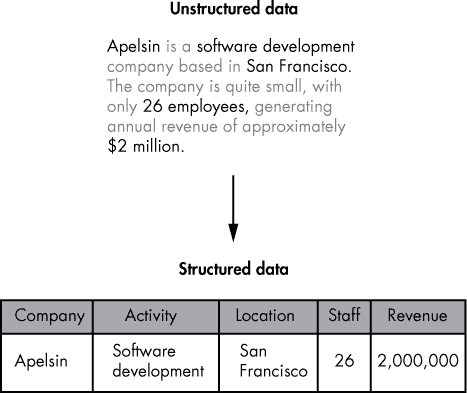
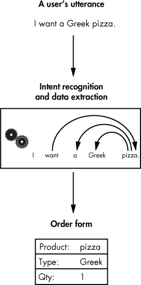
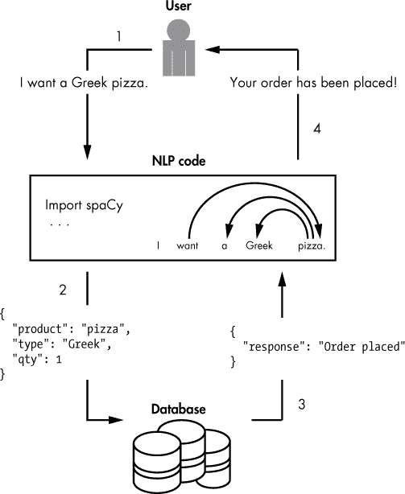
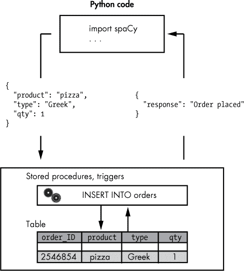

## 第九章：将用户输入存储在数据库中**


许多为业务设计的应用程序在某个时候都需要将它们处理的数据转移到数据库中。例如，一个食品订购聊天机器人可能会在与客户对话中提取信息并填写订单表单后将其保存。一旦订单出现在数据库中，它就可以进行进一步处理，并最终将产品运送给客户。

本章讨论了如何将从提交文本中提取的信息转换为结构化格式，以便你可以在*关系*（行和列）数据库中存储和操作它。通过示例，你将学习如何将聊天机器人将输入文本剪碎成片段，并从中构建一个准备好进入数据库的结构。

### **将非结构化数据转换为结构化数据**

*结构化数据* 是使用预定义的数据模式在格式化存储库中组织的。如果你以前使用过关系数据库，你会知道必须首先将要输入数据库的任何数据转换为结构化格式，以便它适合表或相关表中。

应用程序收到的自然语言输入存在一个问题，即*非结构化*，意味着它没有预定义的组织模式。非结构化数据的典型例子包括文本和多媒体内容，比如电子邮件、网页、业务文件、视频、照片等等。尽管你仍然可以将非结构化数据存储在数据库中，通常在插入时需要进行一些预处理。例如，你可能需要标记照片以便数据库能够对其进行分类，或者为文本文档分配 ID 以便数据库能够区分它们。

有时，你可能需要对非结构化文本内容执行更为激进的转换，例如从中提取信息片段，然后将这些片段分组到一个格式化的结构中。例如，业务聊天机器人通常需要解析客户的话语以填写某种表单。不同的应用程序可能仅从网页中提取特定元素，并为这些元素打上标签，然后将信息转换为表格，正如图 9-1 中所示。



*图 9-1：将非结构化内容转换为结构化数据的示例*

像 spaCy 这样的工具通过在句子中为每个标记打上语言学注释的方式揭示了文本的内部结构。这种预处理使你能够从中提取特定元素，通常通过检查文本的句法依赖标签来实现。图 9-2 描述了一个食品订购聊天机器人如何通过依赖于 spaCy 为每个标记分配的句法依赖标签，识别并提取用户话语中的必要元素时的情形，这是应用文本处理流程到其上的结果。



*图 9-2：将原始文本转换为行-列数据的高层视图*

接下来，你将看到一旦提取了这些元素，如何将它们结构化并插入到数据库表格中作为一行数据。

#### ***将数据提取到交换格式中***

许多当前的关系型数据库原生支持多种常见的数据交换格式。例如，MySQL 原生支持 XML 和 JSON，这两种是网络上最常见的数据交换格式。

你选择的数据格式会影响你收集数据的方式。例如，如果你使用的数据库支持 JSON，你可以直接将数据提取为 JSON 对象，然后将其发送到数据库进行进一步处理。JSON 对象是一种由大括号包围的键值数据格式，格式如下：

```py
{"product": "pizza", "type": "Chicago", "qty": 1}
```

除了基本值，如字符串和数字外，JSON 还支持复杂值，如数组和其他 JSON 对象。你将在“构建数据库驱动的聊天机器人”一节中看到这一点，见第 132 页。

实际上，使用 JSON 格式大大简化了在 Python 脚本中为数据库构建数据结构的过程。首先，你不需要准备符合较少使用的格式的结构，这样使得你的代码不那么依赖于特定的数据库类型。其次，JSON 对象中的元素可以按照任意顺序排列，这对从输入文本中确定和提取必要元素的过程施加了较少的限制。

图 9-3 展示了一个食品订购聊天机器人应用如何使用 JSON 与其底层数据库进行交互。



*图 9-3：食品订购聊天机器人应用的工作流程*

在步骤 1 中，用户向聊天机器人提交一个请求，要求购买希腊披萨。在步骤 2 中，聊天机器人使用 spaCy 处理提交的语言表达，生成一个包含订单所需信息的 JSON 对象。在步骤 3 中，表示订单表单的 JSON 对象被提交到数据库，数据库存储该表单并为聊天机器人生成关于订单的响应。在步骤 4 中，聊天机器人通知用户订单是否已经成功下单。

#### ***将应用逻辑移至数据库***

请注意，在图 9-3 所示的聊天机器人应用中的数据库，不仅存储提交的 JSON 对象，还会生成关于保存订单操作是否成功的响应。原因是数据库执行了一部分应用逻辑。

对于数据库驱动的应用程序来说，将与数据处理相关的应用逻辑保留在数据库中是相当常见的做法。这种方法可以减少应用程序逻辑层与底层数据库之间的数据传输，消除冗余，提高数据处理效率，并确保数据安全。

图 9-4 详细描述了图 9-3 中展示的聊天机器人应用的数据库部分。



*图 9-4：聊天机器人应用中使用的数据库的更详细视图，如图 9-3 所示*

在这个应用程序中，数据库将把输入的 JSON 对象转换为关系数据，并以确保数据正确完整的方式将其存储在关系表中。如果某个字段的值缺失，客户将收到一条消息，告知他们应该提供哪些信息。

在将输入数据移到表中之前，你可以借助存储过程、SQL 语句中的`ON ERROR`子句，或定义在数据表上的触发器来检查每个字段的值。关于 SQL 的更详细讨论超出了本书的范围。但在“准备你的数据库环境”第 135 页中，你会看到一个使用 SQL 创建数据库基础设施并通过 Python 与其交互的示例。

**注意**

*如果你使用的数据库不支持将 JSON 数据转换为关系数据等功能，你将需要在 Python 中自行实现检查数据完整性的逻辑；然而，这部分内容超出了本章的讨论范围。*

### **构建基于数据库的聊天机器人**

现在你已经大致了解了如何实现一个基于数据库的聊天机器人应用程序，让我们为图 9-3 中展示的应用创建一个简单的示例。该应用应处理用户的发话，提取必要的信息来填写订单表格，如产品名称、产品类型和数量。然后，这些信息将被打包成一个 JSON 对象，并发送到底层数据库。数据库应将该 JSON 对象拆解成关系数据，并根据数据的完整性向应用发送响应。

#### ***收集数据并构建 JSON 对象***

我们将从开发应用程序的逻辑层开始，使用 Python 构建一个 JSON 对象，随后可以将其发送到任何类型的数据库。以下代码展示了该实现的可能样式：

```py
   import spacy

   nlp = spacy.load('en')

   doc = nlp(u'I want a Greek pizza.')

➊ orderdict ={}

➋ for token in doc:

  ➌ if token.dep_ == 'dobj':

       dobj = token

    ➍ orderdict.update(product = dobj.lemma_)

    ➎ for child in dobj.lefts:

      ➏ if child.dep_ == 'amod' or child.dep_ == 'compound': 

           orderdict.update(ptype = child.text )

      ➐ elif child.dep_ == 'det': 

           orderdict.update(qty = 1 )

      ➑ elif child.dep_ == 'nummod': 

           orderdict.update(qty = child.text)

       break
```

我们将`orderdict`字典定义为正在创建的 JSON 对象的容器➊。稍后，我们将能够轻松地将这个字典转换为 JSON 字符串。

然后，我们遍历发话中的标记 ➋，寻找直接宾语 ➌。我们可能想要一个比萨，或者可能会要求某人给我们做一个比萨。无论哪种情况，“比萨”都将是我们发话中的直接宾语，因此我们在这里寻找直接宾语。当然，实际实现中会进行更多的检查。

一旦找到它，我们在`orderdict`字典中定义一个键值对，将`product`作为键，直接对象的词根作为值➍。我们使用词形还原将产品名称的可能词形简化为其基本形式（在大多数情况下将复数转换为单数）。

接下来，我们遍历直接对象的句法左子节点 ➎，因为我们期望在这里获得关于请求的产品类型的信息。就句法依赖标签而言，产品的`type`可以是复合词或形容词修饰语（`amod`）➏。例如，spaCy 会将短语“a Greek pizza”中的“Greek”视为形容词修饰语，而将“a Chicago pizza”中的“Chicago”视为复合词。

现在，我们检查修饰符或复合词的子节点中是否存在限定词。如果存在“a”限定词，则意味着客户请求一个单位的产品 ➐。相反，带有依赖标签`nummod`的词则表示特定数量的单位 ➑。

使用以下命令打印`orderdict`字典：

```py
print(orderdict)
```

这应该给出以下结果：

```py
{'product': 'pizza', 'ptype': 'Greek', 'qty': 1}
```

现在我们有一个 JSON 字符串，可以将其发送到底层数据库进行进一步处理。

#### ***将数字单词转换为数字***

在进入将你的 JSON 字符串发送到数据库的代码之前，考虑一下当用户明确指定产品数量时，情况会如何，如以下语句所示：

```py
I want two Greek pizzas.
```

如果你将这段代码放入之前的脚本中，你将得到以下结果：

```py
{'product': 'pizza', 'ptype': 'Greek', 'qty': two}
```

在第一个示例句子中，`'qty'`键的值是一个数字。在第二个示例中，它是一个以单词拼写的数字。在此阶段，这种差异看起来不是什么问题。但问题在于，我们在创建关系表时必须为每个列定义一个数据类型。如果尝试将其他类型的数据插入该列，将会失败。

你应该为你的聊天机器人做好准备，因为客户会以任何他们喜欢的方式指定产品数量。为了解决这个问题，你需要将表示数字单词的字符串转换为相应的整数值。

为此，定义一个包含拼写为单词的数字并按递增顺序排序的列表；然后遍历该列表以找到正确的数字。在此示例中，我们定义一个数字单词列表，范围从“zero”到“twenty”，假设我们不期望客户在一次交易中购买超过二十个同样的产品。

我们需要实现一个转换场景，该场景作为一个函数，接受一个数字单词或数字（在后者情况下，不需要转换）并返回一个数字。然后，我们应该使用这个函数来修改前一部分中的脚本代码。下面是该函数实现可能的样子：

```py
➊ def word2int(numword):

     num = 0

  ➋ try:

    ➌ num = int(numword)

    ➍ return num

     except ValueError:

    ➎ pass

  ➏ words = ["zero", "one", "two", "three", "four", "five", "six", "seven",

     "eight","nine", "ten", "eleven", "twelve", "thirteen", "fourteen", 

     "fifteen", "sixteen", "seventeen", "eighteen", "nineteen", "twenty"]

  ➐ for idx, word in enumerate(words):

        ➑ if word in numword:

             num = idx 

  ➒ return num
```

`word2int()`函数接受一个参数：要转换为相应数字的数字单词，或者已经是数字的情况，在这种情况下我们不需要转换它 ➊。该函数必须处理这两种情况，因为我们无法预知客户的发言中会是哪种情况。

我们使用`try`和`except`块来处理无需转换的情况➋。我们检查输入是否为整数➌，如果是，我们只需要返回输入的数字 ➍。否则，我们忽略尝试将非数字值当作整数处理所引发的错误，并继续将其转换为数字 ➎。

我们定义了一个数字单词列表，从`zero`开始，并按递增顺序列出它们 ➏。然后我们使用`enumerate()`方法 ➐遍历这个列表，寻找函数接收到的输入单词 ➑。当我们找到匹配项时，我们返回当前迭代的编号（该单词在列表中的索引）作为输入数字单词的数字表示 ➒。

将`word2int()`函数定义添加到之前的脚本中。然后移动到脚本的末尾，找到以下代码行：

```py
      elif child.dep_ == 'nummod': 

        orderdict.update(qty = child.text)
```

按照以下方式进行更改，使用本节中定义的`word2int()`函数：

```py
      elif child.dep_ == 'nummod': 

        orderdict.update(qty = word2int(child.text))
```

现在让我们看看脚本如何处理这个句子：

```py
I want two Greek pizzas.
```

这次，你应该得到以下结果：

```py
{'product': 'pizza', 'ptype': 'Greek', 'qty': 2}
```

`'qty'`字段的值现在是一个数字，我们拥有一致的格式来发送到数据库。

#### ***准备你的数据库环境***

为了准备你的数据库环境，你需要安装或获得访问数据库的权限；创建你需要的数据库组件，例如数据库模式、表格等；并安装一个能够与数据库进行交互的 Python 模块。

虽然你可以选择任何能够接收和处理 JSON 数据的数据库，例如 Oracle 数据库，本节使用 MySQL。MySQL 数据库长期支持最流行的数据交换格式，XML 和 JSON。而且，MySQL 是全球最受欢迎的开源数据库，并且可以在大多数现代操作系统上使用，包括 Linux、Windows、Unix 和 macOS。MySQL 提供了一个免费可下载版本，并且还有商业版来满足特定的业务需求。

对于本章，你可以使用 MySQL Community Edition——在 GPL 许可证下可以自由下载的版本。要了解更多关于 MySQL Community Edition 的信息，请访问其官方网站 *[`www.mysql.com/products/community/*`](https://www.mysql.com/products/community/*)。

你首先需要在系统上安装 MySQL。截至本文写作时，MySQL 8.0 是最新版本。请参考 MySQL 8.0 参考手册中的“安装和升级 MySQL”章节 *[`dev.mysql.com/doc/refman/8.0/en/installing.html`](https://dev.mysql.com/doc/refman/8.0/en/installing.html)*，或者查看未来版本 MySQL 的等效章节。这里，你将找到适用于你的操作系统的详细安装说明。

安装完成后，您可以使用安装指南为您的操作系统指定的命令启动 MySQL 服务器。在开始与数据库工作之前，您需要获取在安装过程中生成的`mysql`超级用户（‘root’@‘localhost’）密码。您可以在安装错误日志文件中找到该密码。

一旦获得超级用户密码，您可以从系统终端使用以下命令连接到 MySQL 服务器：

```py
$ mysql -uroot -p

Enter password: ******

mysql>
```

如果您更喜欢使用图形界面，您可以利用 MySQL Workbench (*[`www.mysql.com/products/workbench/`](https://www.mysql.com/products/workbench/)*), 这是一款统一的可视化工具，旨在建模和管理 MySQL 数据库。

连接到服务器后，您的第一步是为 root 用户选择一个新密码，替换安装过程中生成的随机密码。使用以下命令进行更改：

```py
ALTER USER 'root'@'localhost' IDENTIFIED BY 'Your-pswd';
```

现在，您已准备好开始在服务器上开发应用所需的基础设施。您将首先创建一个数据库，用作应用需要交互的其他对象的容器。要创建数据库，请在`mysql>`提示符下输入以下命令：

```py
mysql> CREATE DATABASE mybot;

Query OK, 1 row affected (0.03 sec)
```

然后选择新创建的数据库进行使用，如下所示：

```py
mysql> USE mybot;

Database changed
```

您已准备好开始创建数据库结构。对于此示例，您需要使用以下命令创建一个单独的表：

```py
CREATE TABLE orders (

  id INT NOT NULL AUTO_INCREMENT,

  product VARCHAR(30),

  ptype VARCHAR(30),

  qty INT,

  PRIMARY KEY (id)

);
```

设置好数据库基础设施后，您需要安装 MySQL Connector/Python 驱动程序，它允许您的 Python 代码与该基础设施进行交互。在任何操作系统上，您可以通过`pip`安装 Connector/Python，如下所示：

```py
pip install mysql-connector-python
```

有关如何安装此驱动程序的更多详细信息，请查阅文档 *[`dev.mysql.com/doc/connector-python/en/`](https://dev.mysql.com/doc/connector-python/en/)*。

使用以下简单脚本，确保您已安装 Connector/Python：

```py
import mysql.connector

cnx = mysql.connector.connect(user='root', password='Your_pswd',

                              host='127.0.0.1',

                              database='mybot')

cnx.close()
```

如果安装成功，您应该看不到任何错误信息。

#### ***将数据发送到底层数据库***

让我们回到第 134 页的脚本。以下代码将连接到您的数据库，并将订单数据传递到`orders`表中。将此代码附加到脚本中：

```py
   import json

➊ json_str = json.dumps(orderdict)

   import mysql.connector

   from mysql.connector import errorcode

   try:

  ➋ cnx = mysql.connector.connect(user='root', password='Your_pswd',

                                   host='127.0.0.1',

                                   database='mybot')

  ➌ query = ("""INSERT INTO orders (product, ptype, qty)

     SELECT product, ptype, qty FROM

         JSON_TABLE(

        ➍ %s,

           "$" COLUMNS(

             qty    INT PATH '$.qty', 

             product   VARCHAR(30) PATH "$.product",

             ptype     VARCHAR(30) PATH "$.ptype"

           )

         ) AS jt1""")

  ➎ cursor = cnx.cursor()

  ➏ cursor.execute(query, ➐(json_str,))

  ➑ cnx.commit()

➒ except mysql.connector.Error as err:

     print("Error-Code:", err.errno)

     print("Error-Message: {}".format(err.msg))

   finally:

     cursor.close()

     cnx.close()
```

我们首先将`orderdict`字典转换为 JSON 字符串 ➊。接下来，我们连接到数据库 ➋，并定义一个插入 SQL 语句，将其传递到数据库进行处理 ➌。注意语句中使用了占位符（称为*绑定变量*） ➍。使用占位符允许我们编写在运行时接受输入的 SQL 语句。

在我们执行语句之前，我们先创建一个`mysql.connector`光标对象 ➎，它使我们能够对连接到的数据库中的对象执行操作。然后我们可以执行`INSERT`语句 ➏，将我们在这段代码开头获得的 JSON 字符串 ➐ 绑定到语句中的占位符。请注意，`JSON_TABLE`函数将提交的 JSON 数据转换为表格数据，从而使其适合插入到关系型表中。

在执行完`INSERT`语句后，我们需要显式地使用`commit()`方法 ➑提交语句的更改。否则，当连接关闭时（无论是显式地使用`cnx.close()`，还是脚本执行完成时），插入操作将会回滚。

如果数据库端发生错误，`except`块将开始执行 ➒。在下一部分，你将学习如何在传入的 JSON 字符串不包含所有字段时利用此功能。

现在执行脚本。如果你没有看到任何错误消息，请返回到上一节中使用的`mysql`提示符并输入以下选择语句：

```py
mysql> SELECT * FROM orders;

ID   PRODUCT     PTYPE    QTY

---- ----------- -------- ---

1    pizza       Greek    2
```

如果你能看到这个输出，说明你的 Python 脚本按预期工作。

#### ***当用户的请求没有包含足够的信息时***

有时，用户的请求可能没有包含足够的信息来填写订单表单中的所有字段。例如，考虑以下话语：

```py
I want two pizzas.
```

表 9-1 展示了应用程序从这个句子生成的订单表单。

**表 9-1：** 缺失信息的订单表单

| **product** | **ptype** | **quantity** |
| --- | --- | --- |
| pizza |  | 2 |

`ptype`字段的值缺失，因为用户没有指定他们想要的披萨类型。为了解决这个问题，可以按照以下方式增强之前脚本中的`INSERT`语句：

```py
  query = ("""INSERT INTO orders (product, ptype, qty)

  SELECT product, ptype, qty FROM

      JSON_TABLE(

        %s,

        "$" 

        COLUMNS(

             qty    INT PATH '$.qty' ➊ERROR ON EMPTY, 

             product   VARCHAR(30) PATH "$.product" ➊ERROR ON EMPTY,

             ptype     VARCHAR(30) PATH "$.ptype" ➊ERROR ON EMPTY

        )

      ) AS jt1""");
```

我们为`JSON_TABLE`中的每一列添加了`ERROR ON EMPTY`选项 ➊。这个选项允许我们处理插入不包含所有应有字段的 JSON 字符串时产生的错误。

现在，当你使用“我想要两张披萨。”这个示例句子执行脚本时，你应该能看到以下输出：

```py
Error-Code: 3665

Error-Message: Missing value for JSON_TABLE column 'ptype'
```

我们可以扩展脚本，以便在这种情况下，聊天机器人询问客户澄清订单，提问如下：

```py
What type of pizza do you want?
```

一个答案可能是这样的：

```py
I want Greek ones.
```

代表我们预期收到的答案的句子结构与原始句子的结构相似。因此，我们可以使用与分析原始句子时相同的代码来分析这个答案。当然，这种方法假设了用户的响应。一个实际的实现会以这种方法为起点，然后根据需要扩展到其他可能的响应结构。例如，用户的回答可能是一个单词，“Greek”。在这种情况下，我们只需检查它是否包含在我们的披萨类型列表中。

#### ***尝试这个***

错误信息会告诉你缺失的是哪个具体字段。但你仍然需要从信息中提取出这个字段名，以便你可以要求客户澄清订单中的某个具体部分。一种方法是查看信息中介词的宾语。例如，在信息中，`Error-Message:` `Missing value for JSON_TABLE column 'ptype'`，介词的宾语是`ptype`。

### **总结**

在这一章中，你学习了如何将原始文本切割成片段，以便将文本插入到关系型数据库中。你使用了 JSON 格式与能够处理 JSON 输入的数据库进行交互，将其提取为关系数据。你还学会了如何借助纯 SQL 在数据库中实现一些应用逻辑，使数据处理更加接近数据本身。为了实现更复杂的场景，你可能需要使用触发器和存储过程——有关详细信息，可以参阅你使用的数据库文档。
