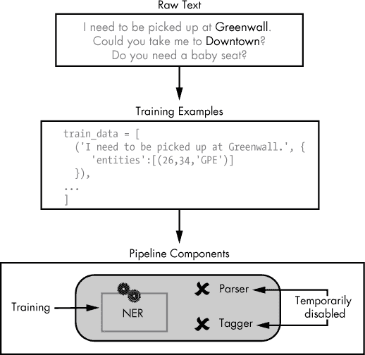
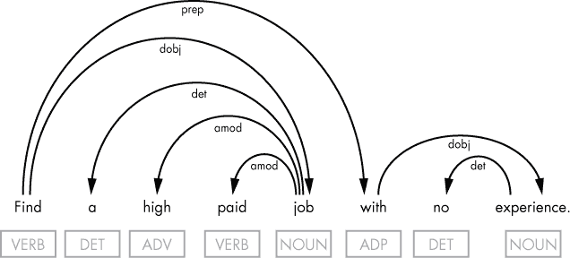

## 第十章：**训练模型**


正如你在第一章中学到的，spaCy 包含了用于执行命名实体识别、词性标注、句法依赖解析和语义相似性预测的统计神经网络模型。但你并不局限于仅使用预训练好的现成模型。你也可以使用自己的训练样本训练一个模型，根据应用需求调整它的管道组件。

本章讲解如何训练 spaCy 的命名实体识别器和依赖解析器，这些是你最常需要定制的管道组件，以使你使用的模型适应特定的应用场景。原因是某些领域通常需要特定的实体集，且有时需要特定的依赖解析方式。你将学习如何使用新的例子训练现有模型，或者从零开始训练一个空模型。你还将把定制的管道组件保存到磁盘，以便在以后的脚本或模型中加载。

### **训练模型的管道组件**

你很少需要从零开始训练一个模型来满足你应用的特定需求。相反，你可以使用现有的模型，并仅更新你需要更改的管道组件。这个过程通常包括两个步骤：准备*训练样本*（包含注释的句子集合，模型可以从中学习），然后将管道组件暴露给这些训练样本，正如在图 10-1 中所示。



*图 10-1：管道组件的训练过程*

为了准备训练样本，你需要将原始文本数据转化为包含句子和每个词元注释的训练样本。在训练过程中，spaCy 利用训练样本来调整模型的权重：目标是最小化模型预测的误差（称为*损失*）。简单来说，算法计算词元与其注释之间的关系，以确定该词元应该分配给该注释的可能性。

一个现实世界的实现可能需要数百甚至数千个训练样本，才能高效地训练模型的某个组件。在开始训练该组件之前，你需要暂时禁用模型的其他所有管道组件，以保护它们免受不必要的修改。

### **训练实体识别器**

假设你正在为一家出租车公司开发一个聊天机器人应用。该应用必须能够正确识别所有指代城市及其周边区域的地名。为此，你可能需要用你自己的例子来更新模型的命名实体识别系统，使其识别例如“Solnce”这个词——它指的是某个城市的一个社区——作为一个地理政治实体。以下章节将描述你如何完成这个任务。

#### ***决定是否需要训练实体识别器***

让我们首先看看默认英语模型中的现有命名实体识别器（通常是`en_core_web_sm`模型）是如何识别感兴趣的命名实体的。你可能不需要更新命名实体识别器。对于这项任务，你可以使用像这样的常见出租车预定句子：

```py
Could you pick me up at Solnce?
```

要查看识别器如何在句子中分类“Solnce”，请使用以下脚本打印句子的命名实体：

```py
import spacy

nlp = spacy.load('en')

doc = nlp(u'Could you pick me up at Solnce?')

  for ent in doc.ents:

    print(ent.text, ent.label_)
```

在这个示例中，“Solnce”是唯一的命名实体，因此脚本生成了以下单行输出：

```py
Solnce LOC
```

请注意，这个实体的输出可能会根据你使用的模型和句子有所不同。要获取输出中`LOC`实体标签的描述，你可以使用`spacy.explain()`函数：

```py
>>> print(spacy.explain('LOC'))

'Non-GPE locations, mountain ranges, bodies of water'
```

结果是命名实体识别器将“Solnce”分类为非`GPE`位置，这与预期不符。要将其更改为将“Solnce”分类为`GPE`类型的实体，你需要更新识别器，如以下章节所述。

**注意**

*为了简单起见，我们在这个示例中使用了一个单一的命名实体。但你可以创建更多地区名称来训练识别器。*

与其更新现有的识别器，你可以用一个自定义识别器来替代它。然而，在这种情况下，你需要更多的训练示例来保留那些与`GPE`实体无关但你可能仍然需要的功能。

#### ***创建训练示例***

一旦你知道需要训练实体识别器以满足应用需求，下一步是创建一组适当的训练示例。为此，你需要一些相关文本。

最佳的数据来源可能是你之前收集的真实客户输入。选择包含你需要用于训练的命名实体的话语。通常，你会将客户输入以纯文本格式记录在文件中。例如，出租车应用的客户输入日志文件可能包含以下话语：

```py
Could you send a taxi to Solnce? 

Is there a flat rate to the airport from Solnce? 

How long is the wait for a taxi right now?
```

要从这些话语中创建训练示例，你需要将它们转换为元组列表，其中每个训练示例表示一个单独的元组，如下所示：

```py
train_exams = [

 ➊ ('Could you send a taxi to Solnce?', {

     ➋ 'entities': [(25, 32, 'GPE')]

    }),

    ('Is there a flat rate to the airport from Solnce?', {

        'entities': [(41, 48, 'GPE')]

    }),

    ('How long is the wait for a taxi right now?', {

        'entities': []

    })

]
```

每个元组由两个值组成：一个表示话语的字符串➊和一个包含该话语中找到的实体注释的字典。实体的注释包括其在话语中的起始和结束位置（以构成话语的字符为单位）以及要分配给实体的标签➋。

#### ***自动化示例创建过程***

正如你无疑已经意识到的，手动创建训练示例集可能会耗时且容易出错，尤其是当你需要处理数百或数千条话语时。你可以通过使用以下脚本来自动化这一繁琐的任务，它可以快速从提交的文本中创建一组训练示例。

```py
   import spacy

   nlp = spacy.load('en')

➊ doc = nlp(u'Could you send a taxi to Solnce? I need to get to Google. Could

   you send a taxi an hour later?')

➋ #f = open("test.txt","rb")

   #contents =f.read()

   #doc = nlp(contents.decode('utf8'))

➌ train_exams = []

➍ districts = ['Solnce', 'Greenwal', 'Downtown']

   for sent in doc.sents:

     entities = [] 

     for token in sent:

       if token.ent_type != 0: 

        ➎ start = token.idx - sent.start_char

           if token.text in districts:

             entity = (start, start + len(token), 'GPE')

           else:

             entity = (start, start + len(token), token.ent_type_)

           entities.append(entity)

     tpl = (sent.text, {'entities': entities})

  ➏ train_exams.append(tpl)
```

为了便于阅读，我们按照通常的方式处理一些话语：通过在脚本中硬编码它们 ➊。但注释掉的代码行展示了我们如何从文件中获取话语 ➋。

一旦我们获得了话语——无论是来自文件还是明确传递给文档——我们就可以开始从中生成训练示例列表。我们首先创建一个空列表 ➌。接下来，我们需要定义一个包含希望模型以不同方式识别的实体名称的列表 ➍。（在这个例子中是区的列表。）

记住，真实的客户输入可能包含识别器已经正确识别的实体（例如，Google 或 London），所以我们不应该在分类这些实体时改变识别器的行为。我们为这些实体创建训练示例，并处理用于生成训练示例的所有实体，而不仅仅是新的实体。真实实现的训练集必须包括不同类型实体的多个示例。根据应用需求，训练集可能包含数百个示例。

我们遍历提交的所有话语，在每次迭代中创建一个新的空实体列表。然后，为了填充这个列表，我们遍历话语中的标记，查找实体。对于每个找到的实体，我们确定它在话语中的起始字符索引 ➎。然后，我们通过将 `len(token)` 加到起始索引来计算结束索引。

此外，我们必须检查该实体是否在我们希望为其分配新标签的实体列表中。如果是，我们为其分配 `GPE` 标签。否则，识别器将使用实体注释中的当前标签。之后，我们可以定义一个表示训练示例的元组，然后将其追加到训练集 ➏。

脚本将正在生成的训练示例发送到 `train_exams` 列表，脚本执行后该列表应该如下所示：

```py
>>> train_exams

[

  ➊ ('Could you send a taxi to Solnce?', {'entities': [(25, 31, 'GPE')]}),

  ➋ ('I need to get to Google.', {'entities': [(17, 23, 'ORG')]}),

  ➌ ('Could you send a taxi an hour later?', {'entities': []})

]
```

为简便起见，我们在这里使用的训练集仅包含少量训练示例。请注意，只有第一个示例包含我们需要让识别器熟悉的实体（本例中的区列表） ➊。这并不意味着第二个和第三个训练示例没有用处。第二个训练示例 ➋ 混入了另一种实体类型，防止识别器“忘记”之前学到的内容。

第三个训练示例不包含任何实体 ➌。为了改善学习结果，我们需要混合不仅是其他类型实体的示例，还包括不包含任何实体的示例。下一节“训练过程”将讨论训练过程的详细信息。

#### ***禁用其他管道组件***

spaCy 文档建议在开始训练某个管道组件之前禁用所有其他管道组件，这样你只需修改想要更新的组件。以下代码禁用了除命名实体识别器外的所有管道组件。你需要将这段代码添加到前一节中介绍的脚本，或者在该脚本执行后的同一个 Python 会话中执行（我们将在下一节中添加最终的代码片段，涵盖训练过程）：

```py
other_pipes = [pipe for pipe in nlp.pipe_names if pipe != 'ner']

nlp.disable_pipes(*other_pipes)
```

现在你已经准备好开始训练命名实体识别器，让它学习识别训练示例中定义的新实体。

#### ***训练过程***

在训练过程中，你会对训练示例进行打乱并循环遍历，调整模型，使其权重更加准确地反映令牌和注解之间的关系。欲了解更多关于神经网络模型的详细解释，包括权重的含义，请参考第一章。

为了提高准确性，你可以在训练循环中应用几种技术。例如，以下代码演示了如何批量处理训练示例。这种技术通过不同的表示方式展示训练示例，以避免训练语料中出现的泛化问题。

将以下代码添加到在“创建训练示例”一节中首次介绍的脚本中，该脚本在前一节中已被修改。

```py
   import random

   from spacy.util import minibatch, compounding

➊ optimizer = nlp.entity.create_optimizer()

   for i in range(25):

    ➋ random.shuffle(train_exams)

       max_batch_size = 3

    ➌ batch_size = compounding(2.0, max_batch_size, 1.001)

    ➍ batches = minibatch(train_exams, size=batch_size)

       for batch in batches:

           texts, annotations = zip(*batch)

        ➎ nlp.update(texts, annotations, sgd=optimizer)

➏ ner = nlp.get_pipe('ner')

➐ ner.to_disk('/usr/to/ner')
```

在我们开始训练之前，我们需要创建一个*优化器* ➊——一个在训练过程中用于存储模型权重更新之间中间结果的函数。我们可以使用 `nlp.begin_training()` 方法创建优化器。但该方法会移除现有的实体类型。在本示例中，由于我们正在更新现有模型，并且不希望它“遗忘”已有的实体类型，我们使用 `nlp.entity.create_optimizer()` 方法。该方法为命名实体识别器创建优化器，并且不会丢失现有的实体类型。

在训练过程中，脚本以循环的方式将示例展示给模型，并且是随机顺序的，以避免因示例的顺序而产生任何泛化 ➋。脚本还会将训练示例分批处理，spaCy 文档建议，当训练示例数量足够大时，这可能会提高训练过程的有效性。为了让批次大小在每一步中变化，我们使用`compounding(``)`方法，它生成一个批次大小的生成器。特别地，它生成一个无限的复合值序列：从第一个参数指定的值开始，通过将前一个值乘以作为第三个参数指定的复合率来计算下一个值，并且不超过第二个参数指定的最大值 ➌。然后，我们使用`minibatch()`方法批处理训练示例。这样，批次大小参数就会被设置为前一行代码中调用`compounding()`方法生成的迭代器 ➍。

接下来，我们对批次进行迭代，每次迭代时更新命名实体识别器模型。每个批次都需要通过调用`nlp.update()` ➎来更新模型，这会对批次中包含的示例中的每个实体进行预测，然后检查提供的标注，看预测是否正确。如果预测错误，训练过程会调整底层模型中的权重，以便下次正确的预测能得分更高。

最后，我们需要将更新后的命名实体识别器组件序列化到磁盘，以便以后在另一个脚本（或另一个 Python 会话）中加载它。为此，我们首先必须从管道中获取该组件 ➏，然后使用其`to_disk()`方法 ➐将其保存到磁盘。确保你已经在系统中创建了*/usr/to*目录。

#### ***评估更新后的识别器***

现在你可以测试更新后的识别器。如果你正在 Python 会话中执行本章讨论的示例，关闭它，打开一个新的会话，并输入以下代码以确保模型已经做出了正确的泛化。（如果你已经从前面的代码段中构建了一个单独的脚本并运行它，你可以将以下代码作为单独的脚本运行，或者在 Python 会话中运行它。）

```py
   import spacy

   from spacy.pipeline import EntityRecognizer

➊ nlp = spacy.load('en', disable=['ner'])

➋ ner = EntityRecognizer(nlp.vocab)

➌ ner.from_disk('/usr/to/ner')

➍ nlp.add_pipe(ner, "custom_ner")

➎ print(nlp.meta['pipeline'])

➏ doc = nlp(u'Could you pick me up at Solnce?')

   for ent in doc.ents:

     print(ent.text, ent.label_)
```

我们首先加载没有命名实体识别器组件的管道组件 ➊。原因是，训练一个现有模型的管道组件不会永久性地覆盖该组件的原始行为。当我们加载一个模型时，构成模型管道的组件的原始版本会默认加载；因此，要使用更新版，我们必须显式地从磁盘加载它。这使我们能够拥有多个相同管道组件的自定义版本，并在必要时加载适当的版本。

我们通过两个步骤创建这个新组件：首先从`EntityRecognizer`类构建一个新的管道实例 ➋，然后从磁盘加载数据到其中，指定我们序列化识别器的目录 ➌。

接下来，我们将加载的命名实体识别组件添加到当前的管道中， 可选择使用自定义名称 ➍。如果我们打印出当前可用的管道组件名称 ➎，我们应该能够看到自定义名称在 `'tagger'` 和 `'parser'` 名称之间。

剩下的唯一任务是测试加载的命名实体识别组件。确保使用与训练数据集中的句子不同的句子➏。

结果，我们应该看到如下输出：

```py
Available pipe components: ['tagger', 'parser', 'custom_ner']

Solnce GPE
```

更新后的命名实体识别组件现在可以正确识别自定义实体名称。

### **创建一个新的依赖解析器**

在接下来的部分中，你将学习如何创建一个适合特定任务的自定义依赖解析器。特别是，你将训练一个解析器，揭示句子中的语义关系，而不是句法依赖关系。*语义关系*指的是句子中单词和短语的意义之间的关系。

#### ***自定义句法解析以理解用户输入***

为什么你需要语义关系呢？假设你的聊天机器人应用需要理解用户用普通英语表达的请求，然后将其转换为 SQL 查询，以便传递给数据库。为了实现这一点，应用会执行句法解析以提取意义，将输入分解为若干部分，并用它们来构建数据库查询。例如，假设你有以下句子需要解析：

```py
Find a high paid job with no experience.
```

从这个句子生成的 SQL 查询可能如下所示：

```py
SELECT * FROM jobs WHERE salary = 'high' AND experience = 'no'
```

首先，让我们看看一个常规的依赖解析器如何处理样本句子。为此，你可以使用以下脚本：

```py
import spacy

nlp = spacy.load('en')

doc = nlp(u'Find a high paid job with no experience.')

print([(t.text, t.dep_, t.head.text) for t in doc])
```

脚本会输出每个标记的文本、其依赖标签和句法头。如果你使用的是`en_core_web_sm`模型，结果应该如下所示：

```py
[

  ('Find', 'ROOT', 'Find'), 

  ('a', 'det', 'job'),

  ('high', 'amod', 'job'),

  ('paid', 'amod', 'job'),

  ('job', 'dobj', 'Find'),

  ('with', 'prep', 'Find'),

  ('no', 'det', 'experience'),

  ('experience', 'pobj', 'with'),

  ('.', 'punct', 'Find')

]
```

从图示上看，这种依赖关系解析像是图 10-2。



*图 10-2：样本句子的依赖关系解析*

这种句法解析可能无法帮助你从句子中生成所需的数据库查询。前面这一节中展示的 SQL 查询使用`SELECT`语句来选择满足“高薪”和“无经验”要求的工作。在这种逻辑中，“job”不仅应该与“high paid”建立联系，还应该与“no experience”建立联系，但句法解析并没有将“job”与“no experience”连接起来。

为了满足你的处理需求，你可能需要以简化生成数据库查询的方式更改标签。为此，你需要实现一个自定义解析器，显示语义关系，而不是句法依赖关系。在这种情况下，这意味着你希望在“job”和“experience”这两个词之间建立一条弧线。接下来的部分将描述如何实现这一点。

#### ***决定使用的语义关系类型***

首先，你需要选择一组关系类型来用于标注。spaCy 文档包含一个自定义消息解析器的示例（*[`spacy.io/usage/training/#intent-parser`](https://spacy.io/usage/training/#intent-parser)*)，它使用了以下语义关系：`ROOT`、`PLACE`、`ATTRIBUTE`、`QUALITY`、`TIME` 和 `LOCATION`。例如，你可以将`PLACE`标注为某项活动发生的地点，比如在句子“I need a hotel in Berlin.”中的“hotel”。而“Berlin”则会作为该句中的`LOCATION`，这样可以区分地理区域和更小的设置。

为了遵循这个示例中使用的语义，你可能会向列表中添加一个新类型：`ACTIVITY`，你可以用它来标注样本句子中的“job”一词。（当然，你也可以使用原来的关系类型集。毕竟，工作通常与工作场所相关联，在这种情况下你可以使用`PLACE`类型。）

#### ***创建训练示例***

正如训练管道组件的过程通常一样，你首先需要准备训练示例。在训练解析器时，你需要知道每个标记的依赖标签以及每个关系的头词。在这个例子中，你只使用了几个训练示例，以保持简短和简单。当然，现实中的实现需要更多的示例来训练解析器组件。

```py
TRAINING_DATA = [

    ('find a high paying job with no experience', {

        'heads': [0, 4, 4, 4, 0, 7, 7, 4],

        'deps': ['ROOT', '-', 'QUALITY', 'QUALITY', 'ACTIVITY', '-', 'QUALITY', 'ATTRIBUTE']

    }),

    ('find good workout classes near home', {

        'heads': [0, 4, 4, 4, 0, 6, 4], 

        'deps': ['ROOT', '-', 'QUALITY', 'QUALITY', 'ACTIVITY', 'QUALITY', 'ATTRIBUTE']

    })
]
```

注意，新的解析器中，语法相关的词语可能不总是语义上相关的。为了清楚地看到这一点，你可以执行以下测试，这会生成一个列表，列出从`TRAINING_DATA`列表中第一个训练示例的样本句子中找到的*句法*依赖的头词：

```py
import spacy

nlp = spacy.load('en')

doc = nlp(u'find a high paying job with no experience')

heads = []

for token in doc:

    heads.append(token.head.i)

print(heads)
```

假设你使用的是`en_core_web_sm`模型，这段代码应该输出以下的标记头索引：

```py
[0, 4, 4, 4, 0, 4, 7, 5]
```

当你将这个列表与`TRAINING_DATA`列表中为同一句子提供的头词进行对比时，你应该会注意到一些差异。例如，在训练示例中，“with”是“experience”一词的子词，而根据标准的句法规则，“with”在这句话中应该是“job”的子词。如果稍微改变一下句子，这个偏差就能得到合理解释：

```py
find a high paying job without any experience
```

就语义而言，“without”可以被看作是“experience”的修饰词，因为“without”改变了“experience”的含义。修饰词反过来总是依赖于它所修饰的词。因此，考虑到语义，在这个例子中将“without”视为 without/experience 对中的子词是相当合理的。

#### ***训练解析器***

以下脚本演示了如何从头开始训练一个解析器，使用空白模型。在这个示例中，创建一个全新的解析器比更新现有解析器更为合理：原因在于，尝试训练一个现有的句法依赖解析器来识别语义关系会非常困难，因为这两种关系往往是冲突的。但这并不意味着你不能将自定义解析器与现有模型一起使用。你可以将其加载到任何模型中，替换其原始的句法依赖解析器。

为了训练解析器，以下脚本使用了前面部分定义的`TRAINING_DATA`列表中的训练示例。确保在以下代码前添加`TRAINING_DATA`列表：

```py
   import spacy

➊ nlp = spacy.blank('en')

➋ parser = nlp.create_pipe('parser')

➌ nlp.add_pipe(parser, first=True)

➍ for text, annotations in TRAINING_DATA:

  ➎ for d in annotations.get('deps', []):

    ➏ parser.add_label(d)

➐ optimizer = nlp.begin_training()

   import random

➑ for i in range(25):

       ➒ random.shuffle(TRAINING_DATA)

       for text, annotations in TRAINING_DATA:

           nlp.update([text], [annotations], sgd=optimizer)

➓ parser.to_disk('/home/oracle/to/parser')
```

我们从创建一个空白模型开始 ➊。然后，我们创建一个空白的解析器组件 ➋，并将其添加到模型的管道中 ➌。

在这个示例中，我们从`TRAINING_DATA`列表中派生出解析器需要使用的标签集合，这个列表是我们必须添加到代码中的。我们在两个循环中实现这个操作。在外部循环中，我们遍历训练示例，从每个示例中提取带有头部和依赖注释的元组 ➍。在内部循环中，我们遍历这些注释元组，从`deps`列表中提取每个标签 ➎并将其添加到解析器中 ➏。

现在我们可以开始训练过程。首先，我们获取一个优化器 ➐，然后实现一个简单的训练循环 ➑，将训练示例随机打乱顺序 ➒。接着，我们遍历训练示例，在每次迭代时更新解析器模型。

最后，我们将自定义解析器序列化到磁盘，以便稍后在其他脚本中加载和使用 ➓。

#### ***测试您的自定义解析器***

你可以使用以下脚本将自定义解析器从磁盘加载到现有模型的管道中：

```py
   import spacy

   from spacy.pipeline import DependencyParser

➊   nlp = spacy.load('en', disable=['parser'])

➋ parser = DependencyParser(nlp.vocab)

➌ parser.from_disk('/home/oracle/to/parser')

➍ nlp.add_pipe(parser, "custom_parser")

   print(nlp.meta['pipeline'])

   doc = nlp(u'find a high paid job with no degree')

➎ print([(w.text, w.dep_, w.head.text) for w in doc if w.dep_ != '-'])
```

请注意，这个脚本与之前在《评估更新后的识别器》一节中展示的加载定制命名实体识别器的脚本类似，见第 148 页。我们加载一个常规模型，禁用其中的某个组件——在这个例子中是解析器 ➊。接着，我们创建一个解析器 ➋并加载之前序列化到磁盘的数据 ➌。为了使解析器可用，我们需要将其添加到模型的管道中 ➍。然后我们可以测试它 ➎。

该脚本应生成以下输出：

```py
['tagger', 'ner', 'custom_parser']

[

  ('find', 'ROOT', 'find'),

  ('high', 'QUALITY', 'job'),

  ('paid', 'QUALITY', 'job'),

  ('job', 'ACTIVITY', 'find'),

  ('no', 'QUALITY', 'degree'),

  ('degree', 'ATTRIBUTE', 'job')

]
```

原始的解析器组件已被替换为定制的解析器组件，在常规模型中使用，而其他管道组件保持不变。稍后，我们可以通过使用`spacy.load('en')`加载模型来重新加载原始组件。

#### ***试试这个***

现在你已经有了一个经过训练的自定义解析器，用来揭示语义关系，你可以开始使用它了。继续本节中的示例，编写一个脚本，从普通英语请求中生成 SQL 语句。在该脚本中，检查每个请求的 `ROOT` 元素，以确定是否需要构造 `SELECT` 语句。然后使用 `ACTIVITY` 元素引用数据库表，生成的语句将在该表上执行。使用 `QUALITY` 和 `ATTRIBUTE` 元素在语句的 `WHERE` 子句中。

### **总结**

你可以从 spaCy 下载一组预训练的统计模型，立即使用。但这些模型可能并不总是适合你的目的。你可能希望改善现有模型中的某个管道组件，或者创建一个新的组件，放入空白模型中，更好地满足你的应用需求。

在本章中，你学习了如何训练一个现有的命名实体识别组件，以识别默认未正确标注的额外实体。然后，你学习了如何训练一个自定义解析器组件，以预测一种与输入文本相关的树形结构，该结构显示的是语义关系而非句法依赖。

在这两种情况下，第一步（也许是最重要且最耗时的一步）是准备训练数据。完成此步骤后，你只需要几行代码，就能实现你的自定义组件的训练循环。
