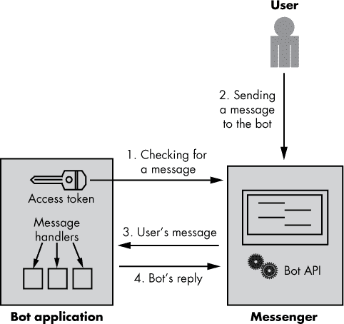
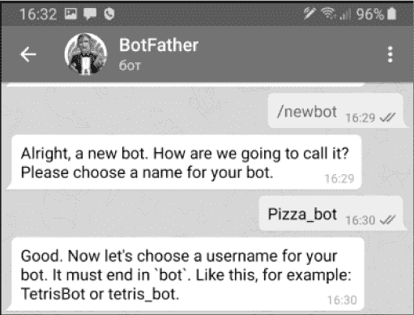
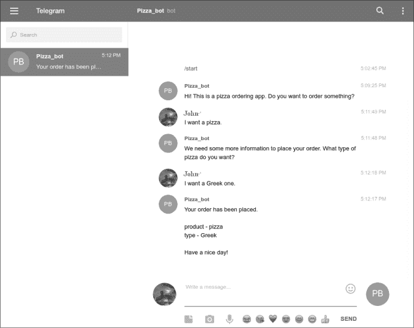

## 第十一章：**部署你自己的聊天机器人**


在前面的章节中，你通过手动将文本分配给 doc 对象来将所有输入硬编码到 NLP 脚本中。但是当你为像接收订单这样的任务构建聊天机器人时，事情会变得更加复杂。你需要将应用程序部署到一个*机器人频道*，比如 Telegram，这样可以促进机器人与用户之间的通信。

本章从概述如何组织一个聊天机器人应用程序开始。你将学习如何为你的聊天机器人准备一个平台，并将其部署到 Telegram 平台。你将了解如何使用 Telegram API 处理多种类型的用户输入，并保持对话状态，以跟踪哪些问题已经被询问过。

### **聊天机器人实现与部署的工作原理**

本节将详细介绍典型聊天机器人与用户之间如何传递信息，以及这种传输所需的结构。

一个典型的聊天机器人应用程序由多个层次组成。在你已经在本地机器上实现了处理用户输入的逻辑之后，你还需要一个消息平台应用程序，允许你创建供程序操作的账户。用户不会直接与本地机器上的机器人实现互动；相反，他们将通过消息平台与机器人聊天。除了消息平台之外，你的聊天机器人可能还需要一些额外的服务，比如数据库或其他存储。

图 11-1 中的示意图展示了典型聊天机器人应用程序如何将这些层次结合起来。



*图 11-1：用户与集成到消息平台的机器人之间的典型交互*

机器人应用程序首先以无限循环的方式向消息平台发送请求，检查用户是否已开始对话。这些请求包括在开发者创建机器人时生成的认证令牌。*认证令牌*（也叫访问令牌或 API 密钥）是唯一的，允许消息平台识别来自此特定机器人的请求。

当用户向机器人发送消息时，消息平台处理它，并将其转发给接收方。机器人选择一个合适的*处理程序*—一个针对特定类型的用户消息生成响应的程序—并将生成的回复发送给用户。

聊天机器人用来与用户互动的中介程序通常是由消息平台应用提供的机器人平台，比如 Skype、Facebook Messenger 或 Telegram。从消息平台的角度看，机器人是一个在消息平台内运行的第三方应用程序。

下一节将指导你如何将用 Python 实现的聊天机器人部署到 Telegram 的机器人平台。你将看到一些特定于 Telegram 机器人平台的实现细节，并学习如何使用其功能，使机器人开发变得更加简便。

我选择了 Telegram 机器人平台作为这个例子，因为它为 Python 开发者提供了全面的资源，包括 Python Telegram Bot 文档、指南和教程，以及 GitHub 上的示例。也就是说，Telegram 提供了构建 Python 聊天机器人的一切所需。在其他消息应用程序中，例如 Facebook Messenger，你需要使用第三方工具，如 Flask 或 Ngrok，这会使机器人的实现更加复杂，并且无法严格集中在 NLP 任务上。

### **使用 Telegram 作为你的机器人平台**

Telegram 是一款基于云的即时通讯应用，也是全球领先的消息应用之一。除了其他功能外，它提供了一个创建机器人的平台，并提供了一个 Python 库，提供了易于使用的接口。你可以在 Android、iOS、Windows、Linux 和 macOS 平台上使用 Telegram。但它主要是为智能手机设计的。

#### ***创建 Telegram 账户并授权你的机器人***

在你能够在 Telegram 中创建机器人之前，你必须注册一个 Telegram 账户。为此，你需要一部运行 iOS 或 Android 的智能手机或平板。Telegram 的 PC 版本无法完成此操作。然而，一旦你创建了 Telegram 账户，你就可以在 PC 上使用它。

你可以在 *[`telegramguide.com/create-a-telegram-account/`](https://telegramguide.com/create-a-telegram-account/)* 上找到创建 Telegram 账户的详细步骤。一旦你拥有了 Telegram 账户，你就可以创建一个机器人。你可以通过智能手机或 PC 来完成这个操作，具体步骤如下所示：

1.  在 Telegram 应用中，搜索 @BotFather 或者打开链接 *[`telegram.me/botfather/`](https://telegram.me/botfather/)*。BotFather 是一个 Telegram 机器人，用于管理你账户中的所有其他机器人。

1.  在 BotFather 页面，点击**开始**按钮，你将看到可以用来设置 Telegram 机器人命令的列表。

1.  要创建一个新的机器人，请在**写信息**框中输入`/newbot`命令。系统会提示你为你的机器人设置一个名称和用户名。然后你会得到一个新机器人的授权令牌。图 11-2 展示了这一过程在智能手机上的截图。



*图 11-2：在智能手机上创建 Telegram 机器人的过程*

现在，你可以将你在本地机器上用 Python 文件实现的机器人功能与刚刚在 Telegram 创建的机器人进行集成，具体操作将在下一节讨论。

**注意**

*重要的是要知道，你刚刚在 Telegram 中创建的机器人并没有实现处理用户输入的逻辑。事实上，它只是你需要自己实现的实际机器人的一个封装。*

#### ***开始使用 python-telegram-bot 库***

若要将 Python 中实现的聊天机器人功能连接到 Telegram，你需要`python-telegram-bot`库，该库建立在 Telegram Bot API 之上。该库为开发 Telegram 应用的机器人程序员提供了一个易于使用的接口。它使你能够专注于编写机器人的代码，而不必关注消息传递应用与机器人实现之间的交互细节。

`python-telegram-bot`库是一个自由软件，采用 LGPLv3 许可证发布。你可以通过`pip`使用以下命令安装或升级它：

```py
$ pip install python-telegram-bot --upgrade
```

**注意**

*本章其余部分提供的示例假设你正在使用`python-telegram-bot`版本 12.0 或更高版本。*

安装好库后，使用以下代码行进行快速测试，以验证你是否能通过 Python 访问 Telegram 机器人。此测试需要网络连接才能正常工作。

```py
import telegram

bot = telegram.Bot(token='XXXXXX...')
```

在`'XXXXX'`的位置，填写你在创建机器人时获得的令牌。然后使用这一行代码检查你的凭证：

```py
print(bot.get_me())
```

如果`bot.get_me()`函数返回你的凭证，则你之前指定的机器人认证令牌是有效的。

#### ***使用 telegram.ext 对象***

要构建一个真正的机器人，你需要使用`telegram.ext`对象，包括`telegram.ext.Updater`和`telegram.ext.Dispatcher`。这两个对象是库中最重要的对象，因为它们在每个实现中都是必需的。简而言之，`Updater`对象接收来自 Telegram 的消息，并将其传递给`Dispatcher`。然后，`Dispatcher`将数据传递给适当的处理程序进行处理。以下代码展示了如何在一个简单的回显机器人中使用这些对象，该机器人会回复每条消息，内容与原始消息相同：

```py
   from telegram.ext import Updater, MessageHandler, Filters

   #function that implements the message handler 

➊ def echo(update, context):

     update.message.reply_text(update.message.text)

   #creating an Updater instance

➋ updater = Updater('TOKEN', use_context=True)

   #registering a handler to handle input text messages

   updater.dispatcher.add_handler(MessageHandler(Filters.text, echo))

   #starting polling updates from the messenger 

   updater.start_polling()

   updater.idle()
```

我们首先从`telegram.ext`包中导入`Updater`和`MessageHandler`模块。然后定义`echo()`函数，它接收两个对象作为参数：`update`和`context` ➊。`update`对象表示一个传入的消息，可以是文本、照片、贴纸等。`context`对象包含一些属性，可以存储来自同一聊天和用户的数据。`update`和`context`这两个对象是在后台自动生成的，并传递给*回调*函数——这是分配给特定处理程序的消息处理函数。在这个示例中，文本消息处理程序的回调函数是`echo()`；它包含一行代码，指示 Telegram 将用户的文本消息原封不动地返回。

接下来，我们创建一个`Updater`对象➋，我们将使用它来协调脚本中的机器人执行过程。当我们创建一个`Updater`对象时，`Dispatcher`对象会自动为我们创建，这样我们就可以注册不同类型的输入数据的处理程序，比如文本和照片。在这个例子中，我们注册了一个处理程序，专门处理文本消息，并将之前在脚本中实现的回调函数传给它。现在，每当聊天机器人收到包含文本的 Telegram 消息时，它都会调用这个回调函数。

然后，我们通过调用`Updater`的`start_polling()`方法来启动机器人，该方法启动从消息应用程序中轮询新消息的过程。由于`start_polling()`是一个非阻塞方法，我们还必须调用`Updater`的`idle()`方法，这会阻塞我们的脚本，直到接收到消息或用户输入退出快捷键（CTRL-C）。有关`python-telegram-bot`库中可用的类和方法的更多细节，请参阅 Python Telegram Bot 的文档。

为了测试这个脚本，可以在连接互联网的机器上运行它。运行后，任何 Telegram 用户都可以与你的聊天机器人开始对话。在 Telegram 应用中，搜索@*<用户名>*，输入你为机器人创建时指定的用户名，然后选择它。要开始对话，点击**/start**按钮或输入`/start`命令。然后，你可以开始向机器人发送消息。因为你实现了一个回音机器人，所以机器人回复的任何消息应该都包含你发送的相同文本。

#### ***创建一个使用 spaCy 的 Telegram 聊天机器人***

在上一节中，我们使用了`python-telegram-bot`库，并构建了一个集成到 Telegram 中的简单脚本。现在，让我们增强我们的实现，添加 spaCy，以确保在 Telegram 中创建的机器人能够完全运行。

以下代码创建了一个简单的机器人，该机器人处理用户的语句并判断它是否包含直接宾语。根据这些信息，它会生成一个回复消息。这段代码本身并不特别有用，但它应该向你展示如何将使用 spaCy 实现的文本处理代码与使用`python-telegram-bot`库实现的代码连接起来。

```py
   import spacy

   from telegram.ext import Updater, MessageHandler, Filters

   #the callback function that uses spaCy

➊ def utterance(update, context):

     msg = update.message.text

     nlp = spacy.load('en')

     doc = nlp(msg)

     for token in doc:

       if token.dep_ == 'dobj':

         update.message.reply_text('We are processing your request...') 

         return

     update.message.reply_text('Please rephrase your request. Be as specific as

     possible!')     

   #the code responsible for interactions with Telegram

   updater = Updater('TOKEN', use_context=True)

   updater.dispatcher.add_handler(MessageHandler(Filters.text, utterance))

   updater.start_polling()

   updater.idle()
```

请注意，负责与 Telegram 交互的代码与前一个脚本中的代码是一样的。唯一的区别在于回调函数的实现➊。在这种情况下，`utterance()`函数使用 spaCy 来处理用户的输入。

在那个函数中，我们首先从传递给该函数的`update`对象中提取消息文本。接下来，我们将其转换为一个 spaCy 的 Doc 对象，然后检查这个语句中是否包含直接宾语。如果语句中不包含直接宾语，我们会要求用户更加具体。例如，用户可能会说“我饿了”，这暗示着他们想要点一些食物。但要下订单，我们需要他们更加明确；比如“我想要一个披萨”。

这个例子最有趣的一点是，它展示了 spaCy 能够处理的输入在机器人应用中可能来自哪里。在前几章的示例中，我们使用了硬编码在脚本中的输入。这是你第一次看到现实中的聊天机器人如何获取输入。

#### ***扩展聊天机器人功能***

现在，你大致知道如何将使用 spaCy 的聊天机器人集成到 Telegram 中，让我们创建一个更有趣的机器人。例如，你可以增强前一节中机器人的功能，使其从用户的消息中提取意图，而不是仅仅打印“正在处理请求”的消息。为了实现这一点，你可以重用前面章节中的某个脚本。

回到第八章的“使用预定义列表识别同义词”脚本，该脚本使用同义词列表来提取用户输入的意图。将此脚本中的代码放入一个独立的函数中，比如命名为`extract_intent()`，该函数应接收一个参数——作为 Doc 对象的用户消息文本（确保排除脚本开头的硬编码输入行以及脚本末尾打印意图的那行）。此外，你创建的函数必须返回一个识别出的意图，作为字符串返回。在你创建的脚本中，将新函数放在回调函数上方，并将回调函数修改为如下所示：

```py
...

def extract_intent(doc):

  #Put the code from Chapter 8 here 

def utterance(update, context):

  msg = update.message.text

  nlp = spacy.load('en')

  doc = nlp(msg)

  for token in doc:

    if token.dep_ == 'dobj':

   ➊ intent = extract_intent(doc) 

   ➋ if intent == 'orderPizza': 

        update.message.reply_text('We need some more information to place your

        order.')

      elif intent == 'showPizza': 

        update.message.reply_text('Would you like to look at our menu?')

      else:

        update.message.reply_text('Your intent is not recognized.')

      return

  update.message.reply_text('Please rephrase your request. Be as specific as

  possible!')     

...
```

我们在用户输入的回调函数中调用了新创建的`extract_intent()`函数来获取用户的意图 ➊。然后，根据获取的意图采取适当的行动。在这个例子中，我们只是简单地向用户发送一条相关的消息 ➋。

虽然我们可以将第八章中的代码直接放入回调函数，但这样做会降低代码的可读性，因此被认为是不好的编程习惯。

#### ***保持当前聊天状态***

你现在使用的机器人不仅仅是评估用户的消息；它还能识别用户的意图。不过，这还不足以从用户那里接收指令。主要的问题在于，即使机器人已经识别了意图，到了需要向用户提问的时刻，它仍会对每个用户输入使用相同的回调函数。

为了解决这个问题，你需要*保持*当前聊天的状态，这样机器人就知道哪些问题已经回答，哪些问题还需要询问。接着，你需要修改回调函数，使其能够根据当前聊天状态处理用户消息。

这个机器人可以这样工作：如果机器人还没有发现用户意图，它应该询问用户表达意图。找到意图后，机器人应该切换到另一个与当前聊天状态相关的问题。

为了简化这种实现，`python-telegram-bot` 库包含了 `ConversationHandler` 对象；它允许你通过将入口点和对话状态与处理程序绑定，来定义对话的入口点和状态。

一个入口点——例如，类似 `/start` 的 Telegram 命令——与一个处理程序绑定，可以触发聊天的开始。处理程序的回调函数必须返回对话的初始状态；这个动作决定了接下来用户消息应该使用哪个处理程序。要改变对话的状态，处理程序的回调函数在回复用户后返回一个新的状态。

以下代码片段展示了如何使用 `ConversationHandler` 在聊天机器人和用户之间切换对话状态：

```py
def start(update, context):

...

  ➊ return 'ORDERING'

def intent_ext(update, context):

...

  ➋ if context.user_data.has_key('intent'):

        return 'ADD_INFO'

    else:

        update.message.reply_text('Please rephrase your request.')

        return 'ORDERING'

def add_info(update, context):

...

    return ConversationHandler.END

def cancel(update, context):

...

    return ConversationHandler.END

...

def main():

...

    disp = updater.dispatcher

    conv_handler = ConversationHandler(

        entry_points=[CommandHandler('start', start)],

        states={

            ➌ 'ORDERING': [MessageHandler(Filters.text,

                                        intent_ext)

                        ],

            'ADD_INFO': [MessageHandler(Filters.text,

                                        add_info)

                        ],

        },

        fallbacks=[CommandHandler('cancel', cancel)]

    )

    disp.add_handler(conv_handler)

...
```

使用 `ConversationHandler` 允许我们定义多个回调函数，并指定它们的调用顺序。回调函数处理用户的消息，根据处理结果，可能会改变对话流程的状态。

在这个例子中，`/start` 命令的回调函数将对话切换到 `ORDERING` 状态 ➊，这意味着接下来用户发送的消息将由 `intent_ext()` 函数处理。原因是 `intent_ext()` 函数是属于 `ORDERING` 状态的处理程序 ➌ 中的回调函数，正如在 `ConversationHandler` 对象的 `states` 字典中所定义的那样。

请注意，聊天机器人可以根据条件逻辑在状态之间切换，正如 `intent_ext()` 函数中所展示的那样：在那里，只有当识别到意图 ➋ 时，对话的状态才会变更为 `ADD_INFO`（即收集附加信息的状态）。

#### ***将所有部分组合在一起***

现在你已经对如何构建一个遵循预定义对话流程的 Telegram 机器人有了初步了解，接下来让我们看看完整实现这种脚本的样子。这个机器人需要依次向用户询问一系列问题，以完成一个订单表单。因为这是一个简化的例子，聊天机器人只能处理一个意图，`orderPizza`，并且在填写订单表单时只要求用户指定披萨的种类。

以下脚本分成多个部分，每个部分代表一个函数定义：

```py
import logging

import sys

import spacy

from telegram.ext import Updater, CommandHandler, MessageHandler, Filters, ConversationHandler

#allows you to obtain generic debug info

logger = logging.getLogger(__name__)

logging.basicConfig(stream=sys.stdout, level=logging.DEBUG)

def extract_intent(doc):

  #Here should be the code created as suggested in the Expanding the Chatbot section earlier

  ...

  return intent
```

`extract_intent()` 函数从提交的语句中提取意图。我们将在接下来的 `intent_ext()` 回调函数中调用这个函数。`extract_intent()` 函数的代码在这里没有提供，但你可以参考前面在《扩展聊天机器人》中描述的代码，见第 161 页。

```py
def details_to_str(user_data):

    details = list()

    for key, value in user_data.items():

        details.append('{} - {}'.format(key, value))

    return "\n".join(details).join(['\n', '\n'])
```

`details_to_str()` 函数简单地将 `user_data` 字典的内容转换为字符串。`user_data` 字典包含了聊天机器人从对话中提取的信息，比如用户想要的披萨种类和披萨数量。机器人将这些信息包含在发送给用户的最终消息中。

到目前为止，我们已经定义了将在机器人回调函数中直接或间接调用的辅助函数。现在让我们定义回调函数。

```py
def start(update, context):

    update.message.reply_text('Hi! This is a pizza ordering app. Do you want to order something?')

    return 'ORDERING'
```

`start()`函数是`/start` Telegram 命令的回调函数。换句话说，聊天机器人在开始聊天时会调用这个函数。该函数返回`ORDERING`状态，这意味着接收到的下一个消息将由附加到`ORDERING`状态处理器（此例中的`intent_ext()`函数）的回调进行处理。

```py
def intent_ext(update, context):

  msg = update.message.text

  nlp = spacy.load('en')

  doc = nlp(msg)

  for token in doc:

    if token.dep_ == 'dobj':

      intent = extract_intent(doc) 

      if intent == 'orderPizza': 

        context.user_data['product'] = 'pizza'

        update.message.reply_text('We need some more information to place your order. What type

        of pizza do you want?')

        return 'ADD_INFO'

      else:

        update.message.reply_text('Your intent is not recognized. Please rephrase your request.')

        return 'ORDERING'

      return

  update.message.reply_text('Please rephrase your request. Be as specific as possible!')
```

为了简单起见，这里使用的`intent_ext()`函数只能识别一个意图：`orderPizza`。如果它检测到此意图，它将返回`ADD_INFO`状态。否则，它将返回`ORDERING`状态，这将导致再次调用`intent_ext()`函数以处理下一个用户消息。`ADD_INFO`状态的处理函数可以这样实现：

```py
def add_info(update, context):

  msg = update.message.text

  nlp = spacy.load('en')

  doc = nlp(msg)

  for token in doc:

    if token.dep_ == 'dobj':

      dobj = token

      for child in dobj.lefts:

        if child.dep_ == 'amod' or child.dep_ == 'compound': 

          context.user_data['type'] = child.text

          user_data = context.user_data

          update.message.reply_text("Your order has been placed."

                                    "{}"

                                    "Have a nice day!".format(details_to_str(user_data)))

          return ConversationHandler.END

    update.message.reply_text("Cannot extract necessary info. Please try again.")

    return 'ADD_INFO'
```

`add_info()`函数是`ADD_INFO`状态处理器的回调函数。在这个实现中，它期望用户在订购披萨时指定他们想要的披萨类型，然后将状态切换为`ConversationHandler.END`，即最后一个状态，如下所示：

```py
def cancel(update, context):

    update.message.reply_text("Have a nice day!")

    return ConversationHandler.END
```

这里使用的`cancel()`函数只是向用户发送一个告别消息，并将状态切换为`ConversationHandler.END`。

最后，`main()`函数应该如下所示：

```py
def main():

    #Replace TOKEN with a real token 

    updater = Updater("TOKEN", use_context=True)

    disp = updater.dispatcher

    conv_handler = ConversationHandler(

        entry_points=[CommandHandler('start', start)],

        states={

            'ORDERING': [MessageHandler(Filters.text,

                                        intent_ext)

                        ],

            'ADD_INFO': [MessageHandler(Filters.text,

                                        add_info)

                        ],

        },

        fallbacks=[CommandHandler('cancel', cancel)]

    )

    disp.add_handler(conv_handler)

    updater.start_polling()

    updater.idle()

if __name__ == '__main__':

    main()
```

像往常一样，机器人脚本的`main()`函数协调机器人执行过程。

你可以通过使用计算机上的 Telegram 网页版应用或智能手机上的 Telegram 应用来测试脚本。图 11-3 展示了 Telegram 网页版应用运行脚本时的截图。



*图 11-3：使用 Telegram 网页版应用测试你的机器人*

#### ***动手试试***

修改前面章节中的脚本，使其能够识别和处理比`orderPizza`更多的意图。另一个相关的意图可能是`showPizza`，意味着用户想查看菜单。为了实现这一点，你需要修改`intent_ext()`函数，在文档处理循环中添加`if intent == 'showPizza'`条件。同时，你还需要在`ConversationHandler`对象的`states`字典中添加一个新的状态——例如`SHOW_MENU`——并实现其回调函数。

### **总结**

在本章中，你学习了如何使用 Telegram 机器人平台这个流行的消息应用程序来实现和部署一个简单的聊天机器人应用。你学会了如何在对话中定义和保持状态。特别地，你还看到了一个例子，展示了你可能会使用 spaCy 处理的用户消息究竟来自哪里。
