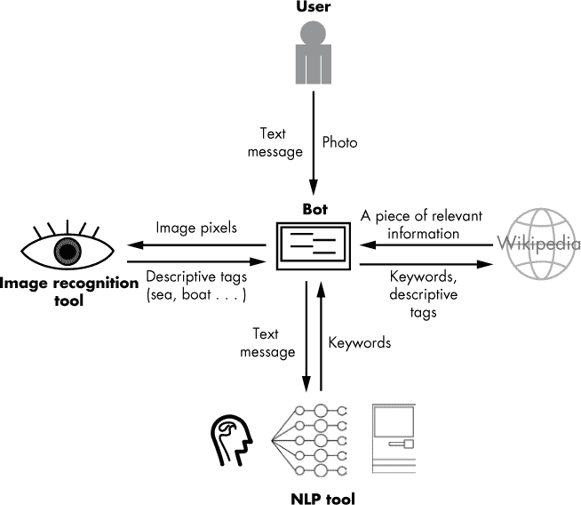
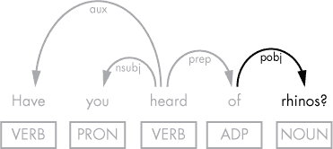
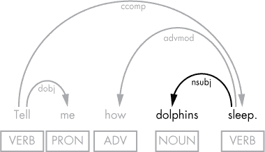
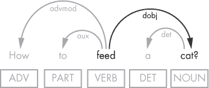
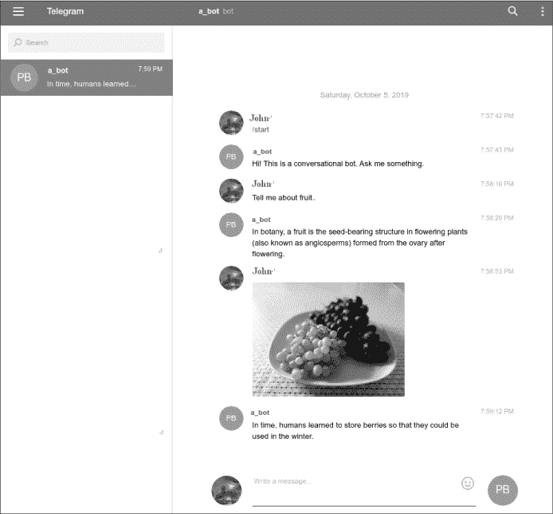

## 第十二章：实现网页数据与图像处理**


现实生活中的聊天机器人应该能够应对各种输入，例如用户提出的关于不熟悉话题的问题，甚至是通过消息应用发送的图片。例如，聊天机器人应用的用户不仅可以发送文本消息，还可以发送照片，机器人应能适当地回应这两者。

本章提供了一些示例，展示如何在开发机器人应用时使用 Python 人工智能生态系统中的其他库。首先，你将结合 spaCy 和 Wikipedia，查找来自用户问题的关键词的信息。接下来，你将借助 Clarifai（一个图像和视频识别工具）获取提交图像的描述标签，从而使你的应用能够解释视觉内容。

然后，你将把所有组件组合在一起，构建一个 Telegram 机器人，通过从 Wikipedia 提取信息来生成与文本和图片相关的回应。

### **工作原理**

图 12-1 显示了我们将在本章中构建的机器人示意图。这个机器人设计用于理解文本消息和图片，并通过 Wikipedia 返回文本回应。



*图 12-1：一个可以处理文本消息和图片的机器人的工作原理*

使用这个机器人，用户可以发送文本消息或图片。如果发布的是图片，机器人会将其发送到图像识别工具进行处理。该工具会返回一组描述标签，提供图片的文字描述。如果发布的是文本消息，机器人将使用像 spaCy 这样的 NLP 工具从中提取关键词或关键短语。然后，机器人使用标签或关键短语在 Wikipedia（或互联网上的其他地方）找到最相关的内容，并将其中的一部分返回给用户。你可以在你设计的聊天机器人中使用这种场景来进行各种话题的对话，无论是娱乐、学习还是个人使用。

### **让你的机器人从 Wikipedia 中找到问题的答案**

让我们先讨论一下你可以在机器人中实现的技术，使其能够解释广泛的文本消息。前面的章节讨论了通常用于商业目的的机器人如何向用户询问特定信息，然后使用答案来填充订单或预订请求。相比之下，设计用来进行非正式对话的机器人应该能够回答用户的各种问题。

帮助聊天机器人回答用户问题的一种方法是选择问题中的关键词或关键短语，作为提示，以确定答案中应包含的信息。一旦得到了这个关键词或关键短语，就可以使用它来搜索答案，使用像 Python 的 Wikipedia API 等工具。Wikipedia 的 API 允许你以编程方式访问和解析 Wikipedia 内容，通过搜索关键词来检索最相关的 Wikipedia 文章中的内容。以下章节将描述如何做到这一点。

但是在继续看例子之前，请确保你正在使用最新的 spaCy 模型，因为新版本的依存分析准确性更高。你可以使用以下命令检查当前模型的版本：

```py
nlp.meta['version']
```

然后访问 *[`explosion.ai/demos/displacy/`](https://explosion.ai/demos/displacy/)* 演示页面（在第七章中讨论过）查看最新的 spaCy 模型稳定版本。或者，你也可以访问 spaCy 的文档 *[`spacy.io/usage/`](https://spacy.io/usage/)* 来查看 spaCy 的最新版本。spaCy 及其模型遵循相同的版本控制方案。根据这些信息，你可能希望更新你当前使用的模型。有关如何下载和安装 spaCy 模型的详细信息，请参见第二章。

#### ***确定问题的主题***

在一个问题中，某些词比其他词更为重要，特别是当你试图确定说话者想要询问的内容时。有时候，仅仅看问题中的一个词就足够了，比如跟在介词后面的名词。例如，用户可能会用以下任何问题让机器人寻找关于犀牛的信息：

```py
Have you heard of rhinos? Are you familiar with rhinos? What could you tell me about rhinos?
```

让我们看看这种句子的依存分析可能是什么样的。图 12-2 展示了第一句话依存分析的图形表示。



*图 12-2：包含介词宾语的句子的依存分析*

该分析展示了在这类问题中，通过提取介词宾语，可以获得“犀牛”这个词。“犀牛”将是该问题中最有助于找到答案的词。以下代码片段展示了如何提取问题中第一次出现的介词宾语：

```py
doc = nlp(u"Have you heard of rhinos?")

for t in doc:

  if t.dep_ == 'pobj' and (t.pos_ == 'NOUN' or t.pos_ == 'PROPN'):

    phrase = (' '.join([child.text for child in t.lefts]) + ' ' + t.text).lstrip()

    break
```

在代码中，我们还会提取介词宾语的左孩子节点，因为该宾语可能有重要的修饰成分，如下例所示：“你能告诉我关于野生山羊的事吗？”当给出这个问题时，代码应将“野生山羊”赋值给`phrase`变量。

注意在末尾使用了`break`语句，它确保只有句子中介词的第一个宾语会被提取出来。例如，在句子“告诉我关于美利坚合众国的事”中，“美利坚合众国”这一短语会被提取出来，但“美国”不会。

但这种行为并不总是理想的。那么，如果用户问：“告诉我关于天空颜色的事”呢？这时我们需要应用更复杂的逻辑。特别是，我们可能希望提取紧跟第一个介词宾语之后的任何介词宾语，前提是后者依赖于前者。

这是你可能实现该逻辑的方法：

```py
doc = nlp(u"Tell me about the color of the sky.")

for t in doc:

  if t.dep_ == 'pobj' and (t.pos_ == 'NOUN' or t.pos_ == 'PROPN'):

    phrase = (' '.join([child.text for child in t.lefts]) + ' ' + t.text).lstrip()

    if bool([prep for prep in t.rights if prep.dep_ == 'prep']): 

      prep = list(t.rights)[0]

      pobj = list(prep.children)[0] 

      phrase = phrase + ' ' + prep.text + ' ' + pobj.text

    break
```

请注意，只有当第一个介词对象的依赖项中存在前述的介词对象时，这段代码才会处理作为第一个介词对象依赖项的介词对象。否则，这段代码将与前面展示的代码一样工作。

现在，让我们来看一下以下示例中的另一种问题类型，其中两个词——一个动词和它的主语——提供了最有信息量的内容，用来回应用户的问题：

```py
Do you know what an elephant eats? Tell me how dolphins sleep. What is an API?
```

图 12-3 展示了这类句子的依存句法解析可能是什么样的。



*图 12-3：句子的依存句法解析，其中主语/动词对是发现发言者想要了解的最有信息量的元素*

通过查看图中的解析，请注意，在试图确定发言者询问内容时，句子末尾出现的主语/动词对是最有信息量的。程序上，你可以使用以下代码从句子中提取主语和动词对：

```py
doc = nlp(u"Do you know what an elephant eats?")

for t in reversed(doc):

  if t.dep_ == 'nsubj' and (t.pos_ == 'NOUN' or t.pos_ == 'PROPN'):

    phrase = t.text + ' ' + t.head.text

    break

```

在检查这段代码时，请注意我们使用 Python 的`reversed()`函数从句子的末尾反向遍历。原因是我们需要找到句子中的最后一个主语/动词对，就像这个例子一样：“你知道大象吃什么吗？”在这个句子中，我们关注的是“elephant eats”这一短语，而不是“you know”，尽管它也是一个主语/动词对。

此外，在某些问题中，句子中的最后一个名词是一个动词的直接宾语，对于确定问题的内容至关重要，就像以下示例一样：

```py
How to feed a cat?
```

在这个句子中，单独提取直接宾语“cat”是不够的，因为我们还需要“feed”这个词来理解问题。理想情况下，我们会生成关键短语“feeding a cat”。也就是说，我们会将动词的“to”不定式形式替换为动名词形式，通过添加“-ing”，优化这个关键短语以便进行网络搜索。图 12-4 展示了这个句子的依存句法解析。



*图 12-4：包含动词/直接宾语对作为最具信息量短语的句子的依存句法解析*

这段句法解析表明，提取所需的短语是容易的，因为直接宾语和其及物动词通过直接连接相互关联。

这里讨论的提取的代码实现可能看起来像这样：

```py
doc = nlp(u"How to feed a cat?")

for t in reversed(doc):

  if t.dep_ == 'dobj' and (t.pos_ == 'NOUN' or t.pos_ == 'PROPN'):

    phrase = t.head.lemma_ + 'ing' + ' ' + t.text

    break

```

在这种情况下，我们再次从句子的末尾反向遍历。为了理解为什么这样做，可以考虑以下句子：“告诉我关于如何喂猫的一些事情。”它包含了两个动词/直接宾语对，但我们只关心句子末尾的那个。

#### ***试试看***

修改上一部分中提取短语“elephant eats”的代码，使得从句子中提取的关键短语包括主语可能的修饰词，而不包括可能的限定词。例如，在句子“告诉我雌性猎豹是如何捕猎的”中，你的脚本应该返回“雌性猎豹捕猎”，并去掉名词短语中的“a”限定词。作为你可能如何实现这一点的示例，请参阅下面的代码图 12-2。在那段代码中，你提取了介词的宾语的修饰词。

此外，还要添加检查，以查看被提取的短语中的动词是否有直接宾语，如果有，将直接宾语附加到关键短语中。例如，问题“你知道海龟每次产多少个蛋吗？”应该返回以下关键短语：“海龟产蛋”。

#### ***使用维基百科回答用户问题***

现在你已经有了一个关键短语，它可以帮助你找到生成与用户问题相关的回答所需的信息，你需要检索这些信息。机器人可以从多个地方获取用户问题的答案，选择合适的来源取决于应用场景，但维基百科是一个很好的起点。`wikipedia` Python 库（* [`pypi.org/project/wikipedia/`](https://pypi.org/project/wikipedia/) *）允许你在 Python 代码中访问维基百科文章。

你可以通过 `pip` 安装该库，方法如下：

```py
pip install wikipedia
```

为了测试新安装的库，请使用以下脚本，它依赖于上一部分的代码片段，从提交的句子中提取关键字。然后，它将该关键字用作维基百科搜索词。

```py
   import spacy

   import wikipedia

   nlp = spacy.load('en')

   doc = nlp(u"What do you know about rhinos?")

   for t in doc:

     if t.dep_ == 'pobj' and (t.pos_ == 'NOUN' or t.pos_ == 'PROPN'):

 ➊ phrase = (' '.join([child.text for child in t.lefts]) + ' ' + t.text).

       lstrip()

       break

➋ wiki_resp = wikipedia.page(phrase)

   print("Article title: ", wiki_resp.title)

   print("Article url: ", wiki_resp.url)

   print("Article summary: ", wikipedia.summary(phrase, sentences=1))
```

在这个脚本中，我们从提交的句子中提取一个关键字或关键短语 ➊，并将其发送到 `wikipedia.page()` 函数，后者返回与给定关键字最相关的文章 ➋。然后我们只需打印出文章的标题、URL 和第一句。

该脚本生成的输出应该如下所示：

```py
Article title:  Rhinoceros

Article url:  https://en.wikipedia.org/wiki/Rhinoceros

Article summary:  A rhinoceros (, from Greek  rhinokero–s, meaning 'nose-horned', from  rhis,

meaning 'nose', and  keras, meaning 'horn'), commonly abbreviated to rhino, is one of ...
```

#### ***试试看***

增强上一部分的脚本，使它能够“看到”第一个介词宾语及其依赖的介词宾语的子元素。例如，在问题“你听说过黄番茄炒蛋吗？”中，它应该提取关键短语“黄番茄炒蛋”。

### **对聊天中发送的图片作出反应**

除了文本消息，消息应用的用户通常还会发布图片。其他人通常会根据图片的内容发表评论。例如，一个用户发布了一张葡萄的照片，另一个用户留下了这样的评论：“我喜欢水果，它含有丰富的纤维和维生素。”你如何教一个机器人做同样的事情呢？一种方法是为图像生成描述性标签，机器人可以利用这些标签进行处理。这时，你需要一个图像识别工具，比如 Clarifai，它提供了内置的模型，这些模型通过来自不同领域（如服装、旅游或名人）的照片进行训练。

Clarifai 允许一个机器人为提交的照片获取一组类别，使得机器人能够猜测图像中展示的内容。你可以通过两步获取照片的有用类别。首先，使用 Clarifai 的通用图像识别模型获取描述性标签（带有概率的对象），这可以大致告诉你照片展示的是什么内容。例如，“没有人”标签的出现意味着照片中没有人。

其次，在检查标签之后，你可以对同一张照片应用更具体的模型，比如 Clarifai 的食品或服装模型。这两个模型分别训练用于识别食品和时尚相关的物品。这一次，你将获得另一组更细致的标签，从而更好地了解照片的内容。欲了解 Clarifai 的所有图像识别模型，请访问其模型页面：[`www.clarifai.com/models/`](https://www.clarifai.com/models/)。

#### ***使用 Clarifai 生成图像描述性标签***

Clarifai 提供了一个 Python 客户端与其识别 API 进行交互。你可以使用`pip`安装最新的稳定包：

```py
pip install clarifai --upgrade
```

在开始使用 Clarifai 库之前，你必须通过创建一个账户并点击**GET API KEY**按钮来获取 API 密钥，网址为*[`www.clarifai.com/`](https://www.clarifai.com/)*。

一旦你获得密钥，就可以测试 Clarifai 库。以下简单脚本将一张图片传递给 Clarifai 模型，并打印出一组表达图片可能类别的标签：

```py
   from clarifai.rest import ClarifaiApp, client, Image

   app = ClarifaiApp(api_key='YOUR_API_KEY')

➊ model = app.public_models.general_model

   filename = '/your_path/grape.jpg'

➋ image = Image(file_obj=open(filename, 'rb'))

   response = model.predict([image])

➌ concepts = response['outputs'][0]['data']['concepts']

   for concept in concepts:

     print(concept['name'], concept['value'])
```

在这个示例中，我们使用 Clarifai 的 Predict API 与通用模型进行调用➊。Clarifai 只接受像素作为输入，因此请确保以`'rb'`模式打开图像文件➋，该模式以二进制格式打开文件供读取。Predict API 会为提交的照片生成一系列描述性标签，如水果、葡萄、健康等➌，让代码能够“理解”图像内容。

本示例中使用的*grape.jpg*文件包含了图 12-5 中显示的照片。


*图 12-5：前述脚本中提交给 Clarifai 的照片*

脚本为照片生成的概念列表应该如下所示：

```py
no person 0.9968359470367432

wine 0.9812138080596924

fruit 0.9805494546890259

juicy 0.9788177013397217

health 0.9755384922027588

grow 0.9669009447097778

grape 0.9660607576370239

...
```

每个条目代表一个类别，以及图像符合该类别的概率。因此，列表中的第一个标签告诉我们，提交的照片中没有人，概率为 0.99。请注意，并非所有标签都会直接描述所呈现的内容。例如，标签“葡萄酒”被包含在内，可能是因为葡萄酒是由葡萄制成的。标签列表中间接标签的存在为你的机器人提供了更多的选项来解读图像。

#### ***利用标签生成图像的文本回应***

现在你知道如何为图像获取描述性标签，那么你如何利用这些标签来回应图像呢？或者你如何从生成的标签列表中选择最重要的标签？考虑以下一般性问题：

+   你可能只希望考虑那些具有高概率的标签。为此，你可以为标签选择一个概率阈值。例如，只考虑前五个或十个标签。

+   你可能只会选择与当前聊天上下文相关的标签。第十一章展示了如何使用`context.user_data`字典在 Telegram 机器人中保持当前聊天的上下文。

+   你可能会遍历生成的标签，搜索某个特定的标签。例如，你可能会搜索“水果”或“健康”标签，以确定是否继续在这个话题上展开对话。

下一节中讨论的机器人将实现第三种选项。

### **将所有模块整合到一个 Telegram 机器人中**

在本章的其余部分，我们将构建一个使用 Wikipedia API 和 Clarifai API 的 Telegram 聊天机器人。这个机器人将能够智能地响应食物的文本和图像。有关如何在 Telegram 中创建新机器人的详细信息，请参考第十一章。

#### ***导入库***

代码的导入部分必须包括我们将在机器人代码中使用的所有库。在本例中，我们导入了访问 Telegram Bot API、Wikipedia API、Clarifai API 和 spaCy 所需的库。

```py
import spacy

import wikipedia

from telegram.ext import Updater, CommandHandler, MessageHandler, Filters

from clarifai.rest import ClarifaiApp, Image
```

如果你按照本章和第十一章中的指示操作，所有这些库应该已经安装在你的系统中。

#### ***编写助手函数***

接下来，我们需要实现助手函数，这些函数将在机器人的回调函数中被调用。`keyphrase()`函数接收一个句子作为 Doc 对象，并尝试从中提取出最具信息量的单词或短语，正如我们在“确定问题的主题是什么”一节中讨论的那样，在第 171 页有详细说明。以下实现使用了你在该节中看到的代码片段，并对其进行了调整，以便在一个函数中使用：

```py
def keyphrase(doc): 

  for t in doc:

    if t.dep_ == 'pobj' and (t.pos_ == 'NOUN' or t.pos_ == 'PROPN'):

      return (' '.join([child.text for child in t.lefts]) + ' ' + t.text).

      lstrip()

  for t in reversed(doc):

    if t.dep_ == 'nsubj' and (t.pos_ == 'NOUN' or t.pos_ == 'PROPN'):

      return t.text + ' ' + t.head.text

  for t in reversed(doc):

    if t.dep_ == 'dobj' and (t.pos_ == 'NOUN' or t.pos_ == 'PROPN'):

      return t.head.text + 'ing' + ' ' + t.text 

  return False
```

请注意，代码中的条件是按优先级排序的。因此，如果找到了介词的宾语，我们就提取它并退出，而不再检查其他条件。当然，一些复杂的问题可能会符合多个条件，但如果检查这一点，会使函数实现变得更加复杂。

与 `keyphrase()` 函数类似，`photo_tags()` 函数旨在为用户的输入确定最具描述性的词。但与 `keyphrase()` 不同，它分析的是一张照片。它通过 Clarifai 来帮助进行分析，Clarifai 为提交的照片生成一组描述性标签。此实现只使用了两个 Clarifai 模型：通用模型和食品模型。

```py
def photo_tags(filename):

  app = ClarifaiApp(api_key=CLARIFAI_API_KEY)

  model = app.public_models.general_model

  image = Image(file_obj=open(filename, 'rb'))

  response = model.predict([image])

  concepts = response['outputs'][0]['data']['concepts']

  for concept in concepts:

    if concept['name'] == 'food':

      food_model = app.public_models.food_model

      result = food_model.predict([image])

      first_concept = result['outputs'][0]['data']['concepts'][0]['name']

      return first_concept

  return response['outputs'][0]['data']['concepts'][1]['name']
```

这段代码首先应用通用模型。如果在生成的标签列表中找到 `'food'` 标签，它将应用食品模型来为图像中显示的食物项目获取更多描述性标签。此实现将只使用第一个标签作为搜索的关键字。

现在，我们已经得到了关键字或关键短语，无论是通过 `keyphrase()` 函数还是通过 `photo_tags()` 函数，我们需要获取与该关键字或关键短语紧密相关的信息。以下 `wiki()` 函数完成了这项工作：

```py
def wiki(concept):

  nlp = spacy.load('en')

  wiki_resp = wikipedia.page(concept)

  doc = nlp(wiki_resp.content)

  if len(concept.split()) == 1:

    for sent in doc.sents:

      for t in sent:

        if t.text == concept and t.dep_ == 'dobj':

          return sent.text

  return list(doc.sents)[0].text
```

我们在这里使用的算法会在检索到的内容中搜索包含关键字作为直接宾语的句子。

但是，这个简单的实现只能智能处理单个词输入。当提交一个词时，我们在这里使用的算法只会从维基百科文章中提取与该词相关的第一个句子。

#### ***编写回调和 main() 函数***

接下来，我们添加机器人的回调函数。`start()` 函数简单地在收到 `/start` 命令时向用户发送问候。

```py
def start(update, context):

    update.message.reply_text('Hi! This is a conversational bot. Ask me something.')
```

`text_msg()` 函数是处理机器人用户文本消息的回调函数。

```py
def text_msg(update, context):

  msg = update.message.text

  nlp = spacy.load('en')

  doc = nlp(msg)

  concept = keyphrase(doc)

  if concept != False:

    update.message.reply_text(wiki(concept))

  else: 

    update.message.reply_text('Please rephrase your question.')
```

首先，我们将 spaCy 的管道应用于消息，将其转换为 Doc 对象。然后，我们将 Doc 发送到之前讨论过的 `keyphrase()` 函数，从消息中提取关键字或关键短语。返回的关键字或关键短语随后会传递给 `wiki()` 函数，以获取相关的信息，这在本实现中应该是一个单独的句子。

以下代码中显示的 `photo()` 函数是处理用户提交照片的机器人回调函数：

```py
def photo(update, context):

  photo_file = update.message.photo[-1].get_file()

  filename = '{}.jpg'.format(photo_file.file_id)

  photo_file.download(filename) 

  concept = photo_tags(filename)

  update.message.reply_text(wiki(concept))
```

该函数将提交的图像作为文件进行检索，并将其发送给前面讨论过的帮助函数进行进一步处理，相关内容可以参考“编写帮助函数”在第 178 页的内容。

最后，我们添加了 `main()` 函数，在其中为文本消息和照片注册处理程序。

```py
def main():

    updater = Updater("YOUR_TOKEN", use_context=True)

    disp = updater.dispatcher

    disp.add_handler(CommandHandler("start", start))

    disp.add_handler(MessageHandler(Filters.text, text_msg))

    disp.add_handler(MessageHandler(Filters.photo, photo))

    updater.start_polling()

    updater.idle()

if __name__ == '__main__':

    main()
```

这个 Telegram 机器人的`main()`函数非常简洁。我们创建了`Updater`并将机器人的令牌传递给它。接着我们获取调度器以注册处理程序。在这个示例中，我们注册了三个处理程序。第一个是`/start`命令的处理程序。第二个处理来自用户的文本消息。第三个处理用户发布的照片。注册处理程序后，我们通过调用`updater.start_polling()`启动机器人，然后调用`updater.idle()`来阻塞脚本，等待用户消息或退出快捷键（CTRL-C）。

#### ***测试机器人***

现在我们已经创建了机器人，是时候测试它了。你可以在智能手机或电脑上测试它。在智能手机上，在 Telegram 应用中搜索你的机器人名称，后跟@符号，然后输入`/start`命令开始聊天。在电脑上，使用 Telegram Web 访问* [`web.telegram.org`](https://web.telegram.org)*。

在收到机器人的问候后，发送一个简单的请求，例如“告诉我关于水果的事。”机器人应该会回应一个从相关的维基百科文章中提取的单句。为了简化起见，选择一个使用直接宾语（此示例中的“水果”）作为关键词的句子。

你也可以提交一张照片，检查机器人会给出什么样的评论。图 12-6 展示了这样的测试截图。



*图 12-6：我们创建的机器人的截图*

请记住，此实现只能正确处理食物照片。

#### ***试试这个***

请注意，前一部分提供的机器人实现无法生成对许多不同类型用户输入的智能响应。我们使用的`wiki()`函数只能正确处理那些`keyphrase()`返回单一单词的请求。如果该关键词是一个直接宾语，它的效果会更好。此外，机器人只能对食物图片做出智能回应。

增强`wiki()`函数，使其能够处理短语，而不仅仅是一个单词，例如“海豚睡觉”。对于这样的短语，找到合适的句子需要使用依存标签，因为你需要找到一个主语/动词对。此外，你还需要将词语还原为它们的基本词形。例如，“海豚睡觉”和“海豚睡着”应该符合搜索条件。

你可能还想增强`photo_tags()`函数的功能，使其不仅可以处理食物照片，还可以处理显示其他物品的照片——例如衣物。

### **总结**

在本章中，你看到了如何将 spaCy 与 Python 的其他库结合使用，构建一个能够处理不同类型数据的 AI 应用程序。通过使用 Wikipedia 和 Clarifai 的 Python API，我们设计了一个可以对图片做出反应并从维基百科中提取文本的聊天机器人，这些技术使得机器人成为一个更智能的对话者。

阅读完这本书后，你可能想要扩展和提升你所学的知识。最自然的方式是继续通过与聊天机器人进行实验来增强你的知识。从使用第十一章中提供的说明，使用 Python 构建一个 Telegram 脚本开始；接下来，按照本章提供的说明增强其功能。然后，继续改进你在本书中学到的算法，使它们更加适合你的应用场景。
