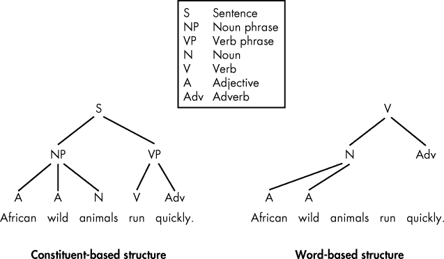
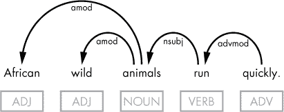

## 第十三章：**语言学基础**

本书的大多数章节专注于分析句子结构，以使用 spaCy 识别单词序列中的模式。为了理解句子分析和模式，您需要一些基本的语言学知识。本附录包含了一个语言学基础部分，供您参考。

### **依存语法与短语结构语法的对比**

默认情况下，spaCy 使用的是依存语法，而不是语言学中更常用的短语结构语法。本节解释了这两种语法类型之间的区别。如果您有正式的语言学背景，可能会发现这些信息很有帮助。

也被称为基于成分的语法，*短语结构语法*根据单词如何组合成句子中的成分来建模自然语言。在句法中，*成分*是指在句子中作为一个单一单位发挥作用的单词组合。短语结构规则将句子分解为其成分部分，形成一棵树结构，从单个单词开始，逐渐构建更大的成分。

相对而言，*依存语法*是一种基于单词的语法，关注的是单词之间的关系，而不是成分之间的关系。因此，依存解析（例如本书中展示的解析）形成一棵树，反映了句子中单词与单词之间的关系。

图 A-1 展示了使用这两种语法类型解析句子的示例。

*图 A-1：基于成分的短语结构语法（左）和基于单词的依存语法（右）的树结构示例*

短语结构树根据句子由名词短语和动词短语构成这一事实，将句子分解。那些短语出现在层级结构的第二层，直接位于句子（S）标记下方——这是正式的顶层。在最底层是构成这些短语的单个单词。

相对而言，依存结构将动词作为句子的结构中心。其他单词通过定向链接（称为*依存关系*）与动词直接或间接连接。spaCy 默认使用的依存语法将句子的语法结构表示为单词之间的一一对应关系。

每种关系表示一种语法功能，其中一个单词是*子项*（或依赖词），另一个是*主项*（或支配词）。例如，在“blue sky”这一对词组中，“sky”是主导词，而“blue”——它的修饰词——是从属词。你可以把主项看作是最具相对“重要性”的单词，缺少它，子项就没有意义。相对地，关系的主项通常可以单独出现在句子中，而不需要子项（例如，在图 A-1 中展示的句子里，你不需要“非洲”或“野生”，也不需要“快速”）。

图 A-2 展示了该概念的图形表示。

*图 A-2：基于主词/子节点概念的依存关系树结构示例*

请注意，在图 A-2 中显示的依存关系树与图 A-1 中右侧的表示相似。这两种表示之间的唯一区别是视觉上的：虽然图 A-1 中的树形图有一个金字塔形的视图，但图 A-2 中的树形图使用标注的有向弧线来强调主词/子节点链接。

句子中的每个单词必须连接到恰好一个主词。但同一个单词可能没有子节点、一个子节点或多个子节点。spaCy 语法假设句子的主词（`ROOT` 词性）是它自己的主词。在这个例子中，动词“run”是句子的主词，因此表示该词的 Token 对象的 `head` 属性将指向同一个 Token 对象。

请注意，主词/子节点关系与句子中的线性顺序无关。例如，子节点“wild”在其主词“animals”之前，但子节点“quickly”在其主词“run”之后。

### **常见语法概念**

本节讨论了本书中使用的更高级的语法概念，包括及物动词和直接宾语、介词宾语、情态助动词和人称代词。

#### ***及物动词和直接宾语***

*直接宾语*是一个名词（或名词短语），表示一个动词直接作用的对象。*及物动词*接受直接宾语。在大多数情况下，为了识别意图，及物动词和其直接宾语是句子中最重要的提取词。这是因为这些词通常能最准确地描述动作和被作用的事物。例如，在句子“I want a pizza”中，“want”和“pizza”表达了句子的意图。

#### ***介词宾语***

*介词*用于将名词短语与句子中的其他词连接。介词如“in”，“above”，“under”，“after”和“before”表示空间或时间关系。其他介词如“to”，“of”和“for”则表示语义角色。例如，在句子“你会在书下找到信封”中，介词“under”表示信封与书之间的空间关系。在句子“我会将它部署到一个频道”中，介词“to”表示介词短语“一个频道”所表达的目标角色。

*介词的宾语*（在理论语言学中称为补语）是跟随在介词后面的名词、代词或名词短语。在句子“I wrote a series of articles”中，词“articles”就是介词的宾语。

在某些问题中，提取介词的宾语可能会给你提供最有用的单词或短语，以帮助找到答案，正如在问题“什么可以解决气候变化？”中所示，短语“气候变化”是确定问题主题的关键短语。

spaCy 依赖分析器将介词标记为 `'prep'`，介词的宾语标记为 `'pobj'`。

#### ***情态助动词***

情态助动词包括“may”、“might”、“can”、“could”、“must”、“ought”、“shall”、“should”、“will”和“would”等。它们与动词原形一起使用，表示*情态*——即可能性、许可、能力、必要性、意愿或建议。

spaCy 词性标注器能够识别情态助动词，并通过精细的词性标签 `'MD'` 标记它们。句法依赖分析器将其标记为 `'aux'`。例如，在需要从问题中重构句子时，你可能需要检查句子是否使用了情态助动词。

#### ***人称代词***

人称代词指代特定的人、物体或多个人或物体。在英语中，人称代词有多种形式，根据它们在句子中的语法角色进行区分：

+   主格形式（I, you, he, she, it, we, they）通常用作动词的主语。

+   宾格形式（me, you, him, her, it, us, them）通常用作动词或介词的宾语。

+   反身形式（myself, yourself/yourselves, himself, herself, itself, ourselves, themselves）通常指代同一从句中指定的主语。

spaCy 分析器根据人称代词的形式分配不同的依赖标签。因此，主格形式的人称代词通常会分配 `'nsubj'` 依赖标签，表示“名词性主语”。有趣的是，在许多用户生成的聊天机器人句子中，句子的主语是“I”。

在宾格形式中，人称代词可以被分配为 `'dobj'` 或 `'iobj'`，分别代表直接宾语和间接宾语。反身代词通常也作为直接宾语或间接宾语出现。
