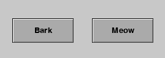
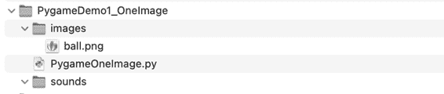
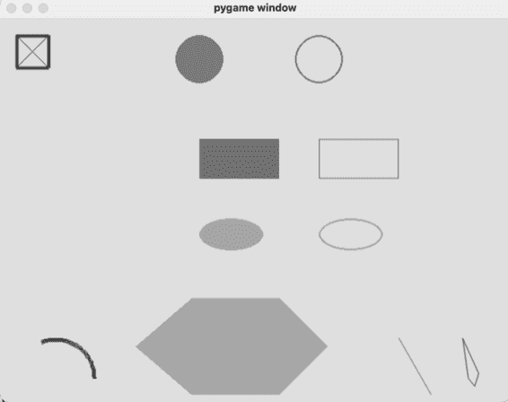
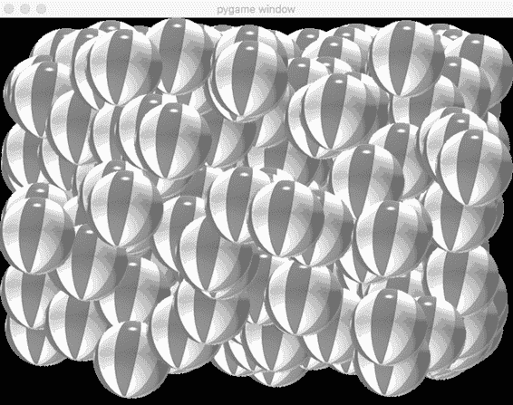

如果方法调用引发 AbortTransaction 异常，控制将转移到

跳转到 except 语句 4\。

异常是对象。在 except 子句中，我们处理 AbortTransaction 异常

异常在任何较低级别引发时，我们将异常的值分配给

**82** 第四章

异常并存储在错误变量中。当我们打印该变量时，用户将看到相关的错误信息。因为异常已经在

except 子句中，程序继续运行，并询问用户想做什么

他们希望做的事情。

**对一组对象调用相同的方法**

与我们的银行示例不同，在个别对象不需要

为了唯一标识每个对象，使用对象列表效果非常好。让我们

假设你正在编写一个游戏，需要一些坏人角色，

飞船、子弹、僵尸，或者其他什么。每个这样的对象通常

拥有一些它记住的数据和一些它可以执行的动作。只要

每个对象不需要唯一标识符时，处理方式通常是

这是从类中创建多个对象实例，并将它们放在一起

将对象放入列表：

objectList = [] # 从空列表开始

for i in range(nObjects):

oNewObject = MyClass() # 创建一个新的实例

objectList.append(oNewObject) # 将对象存储在列表中

在我们的游戏中，我们将世界表示为一个大的网格，类似于电子表格。

我们希望怪物出现在网格中的随机位置。示例 4-12

显示一个怪物类的开头，其中包含 __init__() 方法和 move()

方法。当实例化一个怪物时，它会被告知行数和

网格中的列和最大速度，然后选择一个随机的

初始位置和速度。

**文件：MonsterExample.py**

import random

class Monster()

def __init__(self, nRows, nCols, maxSpeed):

self.nRows = nRows # 保存行数

self.nCols = nCols # 保存列数

self.myRow = random.randrange(self.nRows) # 选择一个随机的行

self.myCol = random.randrange(self.nCols) # 选择一个随机的列

self.mySpeedX = random.randrange(-maxSpeed, maxSpeed + 1) # 选择一个 X 速度

self.mySpeedY = random.randrange(-maxSpeed, maxSpeed + 1) # 选择一个 Y 速度

# 设置其他实例变量，如健康、力量等

def move(self):

self.myRow = (self.myRow + self.mySpeedY) % self.nRows

self.myCol = (self.myCol + self.mySpeedX) % self.nCols

*示例 4-12：一个可以用来实例化多个怪物的 Monster 类*

管理多个对象 **83**

使用这个 Monster 类，我们可以像这样创建一个怪物对象列表： N_MONSTERS = 20

N_ROWS = 100 # 可以是任何大小

N_COLS = 200 # 可以是任何大小

MAX_SPEED = 4

monsterList = [] # 从空列表开始

for i in range(N_MONSTERS):

oMonster = Monster(N_ROWS, N_COLS, MAX_SPEED) # 创建一个怪物

monsterList.append(oMonster) # 将怪物添加到我们的列表中

这个循环将实例化 20 个怪物，每个怪物都会知道自己的起始位置

网格中的起始位置和各自的速度。一旦你有一个对象列表，

对象，当你希望每个对象执行相同的

操作，你可以写一个简单的循环，调用每个对象的相同方法

列表中的每个对象：

对于 objectVariable 在 objectVariablesList 中：

objectVariable.someMethod()

例如，如果我们希望每个 Monster 对象都移动，我们可以

使用类似这样的循环：

对于 oMonster 在 monsterList 中：

oMonster.move()

由于每个 Monster 对象记住了它的位置和速度，在

move() 方法，每个 Monster 都可以移动到并记住它的新位置。

这种构建对象列表并调用相同方法的技术

列表中所有对象的方法非常有用，它是处理集合的标准

处理一组相似对象的标准方法。我们将使用这种

当我们稍后使用 pygame 构建游戏时，经常采用这种方法。

**接口 vs. 实现**

我们之前的 Account 类似乎有方法和实例变量

工作得如何。当你确信你的代码工作正常时，你就不再

不需要关心类内部的细节。当一个类做

你想要它做什么，只需记住哪些方法是可用的，

类中可用的两种不同方式：关注

根据对象的 *接口* 以及它的 *实现* 如何运作，来判断它能做什么。

**接口**

类提供的方法集合（以及每个方法的参数）

期望的方式）。接口展示了对象从类创建后能做 *什么*。

**实现** 类的实际代码，展示对象是 *如何* 完成它的任务的。

**第八十四章**

如果你是类的创建者或维护者，你需要完全理解实现——所有方法的代码以及它们

一起影响实例变量。如果你只是写代码

要 *使用* 一个类，你只需要关注接口——

类中可用的不同方法，所需的值必须

传递给每个方法的值，以及从方法返回的任何值。如果

如果你是在独立编程（作为“单人团队”），那么你将同时

类的实现者和接口的用户之间的关系。

只要类的接口不变，类的实现

实现可以随时更改。也就是说，如果你发现一个方法可以

以更快或更高效的方式实现，改变相关的代码

类内部的更改不会对程序的其他部分产生不良副作用。

程序。

**总结**

对象管理器对象是一个管理其他对象的对象。它不做

通过具有一个或多个实例变量，它们是列表或字典，来实现这一点

由其他对象组成。对象管理器可以调用任何特定对象的

特定对象或所有管理对象的。此技术提供了对类的完全控制，

所有管理对象都归对象管理器管理。

当你在方法或函数中遇到错误时，你可以抛出一个

异常。raise 语句将控制权返回给调用者。调用者可以

通过将调用放入 try 块中，可以检测潜在错误，并对其做出反应

使用 except 块处理任何此类错误。

类的接口是所有方法和

类中的相关参数。实现是实际的代码

类的实现。你需要了解的内容取决于你的角色。编写者/

类的维护者需要理解代码的细节，而

使用类的任何人只需理解类的接口

类提供的功能。

管理多个对象 **85**

**第二部分**

**图形用户界面**

**与 Pygame 的接口**

这些章节将向你介绍*pygame*，一个外部

包，它为 GUI 程序添加了常见的功能

克拉姆。Pygame 允许你编写 Python 程序

那些有窗口、响应鼠标和键盘输入的

主板、播放声音等等。

第五章 g 为你提供了对 pygame 如何工作的基本理解，并提供了构建基于 pygame 的程序的标准模板。我们将

先构建几个简单程序，创建一个控制图像的程序

使用键盘输入，然后我们将构建一个球体反弹程序。

第六章 e 解释了如何将 pygame 最好地作为面向对象框架使用。你将看到如何使用

面向对象技术，并开发简单的按钮和文本输入

领域。

第七章 d 描述了 pygwidgets 模块，它包含了许多标准用户界面控件的完整实现，比如按钮、输入框

和输出字段、单选按钮、复选框等，所有这些都使用面向对象技术

面向对象编程的文档。所有代码都可以供你使用

用它来构建你自己的应用程序。我会提供几个示例。

**5**

**P Y G A M E 简介**

Python 语言的设计旨在处理

处理文本输入和文本输出。它提供

获取文本并发送文本到

用户、文件和互联网的核心语言

语言本身没有处理更现代的方式

现代概念，如窗口、鼠标点击、声音等，

等等。那么，如果你想使用 Python 创建

想做些比基于文本的程序更先进的东西吗？在这一章中

我将介绍 *pygame*，一个免费的开源外部包，旨在扩展 Python 以允许程序员构建游戏程序。你可以

还可以使用 pygame 构建其他类型的图形交互程序——

图形用户界面（GUI）。它增加了创建窗口、显示图像的功能，

识别鼠标移动和点击、播放声音等等。简而言之，它

允许 Python 程序员构建游戏和应用程序

当前计算机用户已经熟悉的。

我并不打算让你们都成为游戏程序员——尽管

这可能是一个有趣的结果。而是，我将使用 pygame 环境来

使某些面向对象编程技巧更清晰、更具视觉效果。通过使用 pygame 在窗口中显示对象并

处理用户与这些对象交互时，你应该更深入地

理解如何有效使用面向对象编程（OOP）技术。

本章提供了 pygame 的一般介绍，因此大多数

本章中的信息和示例将使用过程化编程。开始

接下来的章节中，我将解释如何使用 pygame 有效地运用 OOP。

**安装 Pygame**

Pygame 是一个免费的可下载包。我们将使用包管理器

*pip*（即*pip 安装包*）用于安装 Python 包。如引言中所述，我假设你已经从*python.org*安装了官方版本的 Python。pip 程序作为该下载的一部分包含在内，因此你应该已经安装了它。

与标准应用程序不同，你必须从命令行运行 pip

一行。在 Mac 上，启动终端应用程序（位于*实用工具*文件夹内）。

子文件夹位于*应用程序*文件夹内）。在 Windows 系统中，点击

Windows 图标，输入**cmd**，然后按回车。

**注**

*本书没有在 Linux 系统上进行测试。然而，大部分内容* *应该可以在最小调整的情况下运行。在 Linux 发行版上安装 pygame，*

*以你惯用的方式打开终端。*

在命令行输入以下命令：

python3 -m pip install -U pip --user

python3 -m pip install -U pygame --user

第一个命令确保你拥有最新版本的 pip。

程序。第二行安装 pygame 的最新版本。

如果你在安装 pygame 时遇到任何问题，请查阅 pygame 文档

文档可以在[*https://www.pygame.org/wiki/GettingStarted*](https://www.pygame.org/wiki/GettingStarted)查阅。要测试 pygame 是否正确安装，打开 IDLE（Python 的开发环境，

随 Python 的默认实现一起捆绑在一起），并且在 shell 中 win-

然后按回车：

import pygame

如果你看到类似“Hello from the pygame

社区”或者如果你根本没有收到任何消息，那么 pygame 已经安装

正确无误。没有错误消息表示 Python 已经能够

查找并加载 pygame 包并准备就绪。如果你想

查看使用 pygame 的示例游戏，输入以下命令（这

启动一个版本的*太空侵略者*）：

python3 -m pygame.examples.aliens

**90** 第五章

在我们开始使用 pygame 之前，我需要解释两个重要的概念。首先，我将解释程序中如何处理单个像素。

使用 GUI 的程序。然后，我将讨论事件驱动的程序以及它们如何不同于

与典型的基于文本的程序有所不同。之后，我们将编写一些程序

演示关键 pygame 功能的程序。

**窗口详情**

计算机屏幕由大量的行列组成

由称为*像素*的小点组成（源自*图像元素*）。用户通过一个或多个窗口与 GUI 程序进行交互；每个窗口都是屏幕上的矩形区域。程序可以控制任何单个

窗口中的像素。如果你运行多个 GUI 程序，每个

程序通常在自己的窗口中显示。在这一节中，我将讨论

如何在窗口中定位和改变单个像素。这些概念是

独立于 Python；它们是所有计算机通用的，并用于

所有编程语言。

***窗口坐标系统***

你可能熟悉图 5-1 中那样的笛卡尔坐标。

y 轴

6

5

4

3

2

1

x 轴

–6 –5 –4 –3 –2 –1

1

2

3

4

5

6

–1

–2

–3

–4

–5

–6

*图 5-1：标准的笛卡尔坐标系统*

Pygame 简介 **91**

笛卡尔网格中的任何点都可以通过指定其 x 和 y 坐标（按此顺序）来定位。原点是指定为 (0, 0) 的点，并

位于网格的中心。

计算机窗口坐标的工作方式类似（图 5-2）。

0

最大 x

0

最大 y

*图 5-2：计算机窗口的坐标系统*

然而，有一些关键的区别：

1\. 原点 (0, 0) 位于窗口的左上角。

2\. y 轴被反转，因此 y 值从窗口顶部的零开始。

向下时，行和列增加。

3\. x 和 y 值总是整数。每个 (x, y) 对指定一个

窗口中的像素。这些值总是相对于

窗口的左上角，而不是屏幕的位置。这样，用户可以

将窗口移动到屏幕的任何位置，而不会影响坐标-

程序中元素的坐标在窗口中显示。

整个计算机屏幕有一套独立的 (x, y) 坐标，

像素并使用相同类型的坐标系统，但程序很少，除非

然而，需要处理屏幕坐标的情况很少。

当我们编写一个 pygame 应用程序时，我们需要指定窗口的宽度和

窗口的高度我们想要创建。在窗口中，我们可以定位

使用 x 和 y 坐标来引用任意像素，如图 5-3 所示\。

图 5-3 显示了在位置 (3, 5) 处的黑色像素。那是 x 值为 3

（请注意，这实际上是第四列，因为坐标从 0 开始）

并且 y 值为 5（实际上是第六行）。窗口中的每个像素都是计算

通常被称为 *点*。要引用窗口中的点，可以

通常使用 Python 元组。例如，你可能有一个赋值

语句像这样，先写 x 值：

pixelLocation = (3, 5)

**92** 第五章

0

1

2

3

4

5

6

7

8

9

10 11 12 13 …

0

1

2

3

4

5

6

7

8

9

10

11

12

13

…

*图 5-3：计算机窗口中的单个点（单个像素）*

要在窗口中显示图像，我们需要指定其

起始点——始终是图像的左上角——作为 (x, y) 对，

如图 5-4 所示，我们在位置 (3, 5) 绘制图像。

在处理图像时，你经常需要处理

*边界矩形*，即可以形成的最小矩形

完全围绕图像的所有像素。矩形表示

在 pygame 中由一组四个值表示：x, y, 宽度, 高度。矩形的

图 5-4 中的图像具有 3、5、11、7 的值。我将展示如何使用

即使是下一个示例程序中这样的矩形，也会用到。即使你的

如果图像不是矩形的（例如，如果它是圆形或椭圆形），你

仍然必须考虑其边界矩形以进行定位和碰撞检测

检测。

《Pygame 简介**93**

0

1

2

3

4

5

6

7

8

9

10 11 12 13 …

0

1

2

3

4

5

6

7

8

9

10

11

12

13

…

*图 5-4：窗口中的图像*

***像素颜色***

让我们探索一下颜色在计算机屏幕上的表示方式。如果你

如果你有使用过像 Photoshop 这样的图形程序，你可能

你可能已经知道这是如何工作的，但你可能还是想要快速复习一下。

屏幕上的每个像素都是由三种颜色的组合构成：

红色、绿色和蓝色，通常称为*RGB*。屏幕上显示的颜色

每个像素由一定量的红色、绿色和蓝色组成，其中

每种颜色的量通过一个 0 到 255 之间的值来指定，0 表示没有，255 表示最大强度-

以全强度显示。因此，存在 256 × 256 × 256 种可能的组合-

组合的可能性或 16,777,216 种（通常简称“1600 万”）种颜色，

为每个像素。

pygame 中的颜色是通过 RGB 值给出的，我们将它们写成 Python

使用三个数字的元组。以下是我们为主要颜色创建常量的方式：

RED = (255, 0, 0) # 完全红色，无绿色，无蓝色

GREEN = (0, 255, 0) # 无红色，完全绿色，无蓝色

BLUE = (0, 0, 255) # 无红色，无绿色，完全蓝色

**94** 第五章

以下是几种颜色的定义。你可以使用任意组合的三种数字（0 到 255 之间）来创建颜色：

BLACK = (0, 0, 0) # 无红色，无绿色，无蓝色

WHITE = (255, 255, 255) # 完全红色，完全绿色，完全蓝色

DARK_GRAY = (75, 75, 75)

MEDIUM_GRAY = (128, 128, 128)

LIGHT_GRAY = (175, 175, 175)

TEAL = (0, 128, 128) # 无红色，半强度绿色，半强度蓝色

YELLOW = (255, 255, 0)

PURPLE = (128, 0, 128)

在 pygame 中，当你想要填充窗口背景时，你需要指定颜色-

在窗口的背景上绘制一个形状，绘制文本等。

提前定义颜色作为元组常量可以使它们非常容易辨识

稍后在代码中。

**事件驱动程序**

在到目前为止书中的大多数程序中，主要代码通常位于

当调用内建的 input()函数时，程序会停止并

等待用户输入以便工作。程序的输出通常由

使用 print()函数输出。

在交互式图形用户界面（GUI）程序中，这种模型不再适用。GUI 介绍-

引入了一种新的计算模型，称为*事件驱动*模型。事件-

驱动程序不再依赖 input()和 print()；相反，用户通过

可以通过键盘和/或鼠标或其他指点设备在窗口中随意操作元素

指点设备。用户可能能够点击各种按钮或图标，进行

从菜单中选择，提供文本框输入，或通过

点击或按键来控制窗口中的某个化身。

**注释**

*调用 print() 仍然在调试时非常有用，可以用来输出中间结果。*

事件驱动编程的核心概念是 *事件*。事件

很难定义这些事件，最好通过示例来描述，比如鼠标

点击和按键事件（每个事件实际上由两个事件组成：鼠标

向下、鼠标抬起、按键按下和按键抬起事件，分别对应）。这是我的

工作定义。

**事件**

在程序运行时发生的事件，程序希望对其作出反应

或者需要响应的事件。大多数事件都是由用户的操作生成的。

一个事件驱动的 GUI 程序会不断在无限循环中运行。每个

每次循环时，程序都会检查是否有新的事件需要

响应并执行适当的代码来处理这些事件。此外，每个

每次循环时，程序需要重新绘制所有元素，

窗口更新用户看到的内容。

Pygame 简介 **95**

例如，假设我们有一个简单的 GUI 程序，显示两个按钮

吠声和喵声按钮。点击时，吠叫按钮播放狗叫声

吠叫和喵喵按钮播放猫咪叫声（图 5-5）。

*图 5-5：一个简单的程序*

*带有两个按钮*

用户可以随时以任何顺序点击这些按钮。为了处理

处理用户的操作时，程序会在循环中运行并不断检查

查看哪个按钮被点击。当程序接收到鼠标按下事件时，

当点击按钮时，程序会记住该按钮已被点击，并

绘制按下状态的按钮图像。当它接收到鼠标抬起

在按钮上发生的事件，程序记住新的状态并重新绘制按钮

保持原来的外观，并播放适当的声音。因为

主循环运行得非常快，用户感觉声音是即时播放的。

每次点击按钮后立即执行。每次通过循环时，

程序会重新绘制两个按钮，并用与每个按钮当前

租赁状态。

**使用 Pygame**

一开始，pygame 可能看起来是一个庞大的软件包，包含很多

有很多不同的调用可用。虽然它很大，但实际上没有很多

您需要理解的内容，才能让一个小程序顺利运行。为了介绍

引入 pygame 时，我将首先提供一个模板，您可以将其用于所有 pygame

你所创建的程序。然后我会在此基础上构建，添加关键部分

一点一点地完善功能。

在接下来的部分，我将向您展示如何：

• 打开空白窗口。

• 显示图像。

• 检测鼠标点击。

• 检测单次和连续的键盘按键。

• 创建简单的动画。

• 播放音效和背景音效。

• 绘制形状。

在下一章中，我们将继续讨论 pygame，您将

了解如何：

• 动画多个对象。

• 构建并响应按钮。

• 创建文本显示区域。

**96** 第五章

***打开空白窗口***

正如我之前所说，pygame 程序会不断地在循环中运行，检查

事件。你可以把程序当作动画来看，其中

每次通过主循环就是一帧。用户可能会点击

在每一帧中做点什么，并且你的程序不仅要响应

对该输入进行处理，同时跟踪所有需要绘制的内容

窗口。比如，在本章后面的一个示例程序中，我们会

移动一个球穿越窗口，所以在每一帧中，球会被绘制在一个

略微不同的位置。

清单 5-1 是一个通用模板，你可以将其作为

这是你所有 pygame 程序的基础。这个程序打开一个窗口，并绘制

整个内容被涂成黑色。用户唯一能做的就是点击关闭按钮

让程序无法退出。

**文件：PygameDemo0_WindowOnly/PygameWindowOnly.py**

# pygame 演示 0 - 仅窗口

# 1 - 导入包

import pygame

from pygame.locals import *

import sys

# 2 - 定义常量

BLACK = (0, 0, 0)

WINDOW_WIDTH = 640

WINDOW_HEIGHT = 480

FRAMES_PER_SECOND = 30

# 3 - 初始化世界

pygame.init()

window = pygame.display.set_mode((WINDOW_WIDTH, WINDOW_HEIGHT))

clock = pygame.time.Clock()

# 4 - 加载资源：图像、声音等。

# 5 - 初始化变量

# 6 - 永久循环

while True:

# 7 - 检查并处理事件

for event in pygame.event.get():

# 点击了关闭按钮？退出 pygame 并结束程序

如果事件类型是 pygame.QUIT：

pygame.quit()

sys.exit()

# 8 - 执行任何“每帧”操作

# 9 - 清除窗口

Pygame 简介 **97**

window.fill(BLACK)

# 10 - 绘制所有窗口元素

# 11 - 更新窗口

pygame.display.update()

# 12 - 稍微放慢速度

clock.tick(FRAMES_PER_SECOND)

*清单 5-1：创建 pygame 程序的模板*

让我们逐步了解这个模板的不同部分：

1\. 导入包。

模板从导入语句开始。我们首先导入 pygame

游戏包本身，然后是 pygame 中定义的一些常量

稍后我们会用到的。最后一个导入是 sys 包，我们将用它来退出

我们的程序。

2\. 定义常量。

接下来我们为程序定义常量。首先我们定义

RGB 值为 BLACK，我们将用它来绘制窗口的背景。

我们的窗口。然后我们为窗口的宽度和高度定义常量，

以像素为单位的窗口宽度和高度，并为程序定义一个刷新率常量。

这个数字定义了程序每秒钟将执行的最大循环次数

每秒钟的循环次数（因此会重新绘制窗口）。我们的值为 30

这种方式是相当典型的。如果主循环中执行的工作量过多，

由于程序可能会运行得比这个值慢，但永远不会

运行得更快。刷新率过高可能导致程序运行

运行过快。在我们的球的示例中，这意味着球可能会反弹

使得窗口的周围区域运行速度比预期更快。

3\. 初始化 pygame 环境。

在这一部分，我们调用一个函数来告诉 pygame 初始化自身。

然后我们让 pygame 为我们的程序创建一个窗口，使用

pygame.display.set_mode() 函数并传入所需的宽度和

窗口的高度。最后，我们调用另一个 pygame 函数来创建

创建一个时钟对象，这将在我们的主循环底部用于

维持我们的最大帧率。

4\. 加载资源：图像、声音等。

这是一个占位部分，我们最终会在其中添加代码来

从磁盘加载外部图像、声音等资源供我们的程序使用。

在这个基本程序中，我们没有使用任何外部资源，所以

这个部分现在是空的。

5\. 初始化变量。

在这里，我们最终会初始化程序中需要的任何变量。

使用。目前我们没有外部资源，所以这里没有代码。

**98** 第五章

6\. 无限循环。

这里我们开始我们的主循环。这是一个简单的 while True 无限循环。

同样，你可以把主循环中的每次迭代当作一个

动画中的每一帧。

7\. 检查并处理事件；通常称为*事件循环*。

在这一部分，我们调用 pygame.event.get()来获取事件列表，

自上次检查以来发生了什么（上次主循环执行时）

运行时），然后遍历事件列表。每个事件都被报告给

程序是一个对象，每个事件对象都有一个类型。如果没有事件

发生的事情，这部分会被跳过。

在这个最小的程序中，用户唯一能做的操作是

关闭窗口时，我们检查的唯一事件类型是常量

pygame.QUIT，由 pygame 在用户点击关闭按钮时生成。

如果我们发现这个事件，我们告诉 pygame 退出，这样可以释放出任何

使用它的资源。然后，我们退出程序。

8\. 执行任何“每帧”操作。

在这一部分，我们最终会放入每一帧需要运行的代码。

帧。它可能涉及到移动窗口中的物体或检查

元素之间的碰撞。在这个最小程序中，我们没有任何

这里没有代码要做。

9\. 清空窗口。

在主循环的每次迭代中，我们的程序必须重新绘制

清空窗口中的所有内容，这意味着我们需要先清空它。这个

最简单的方法是直接用颜色填充窗口，我们在这里就做了这个

使用 window.fill()调用，指定一个黑色背景。我们也可以

画一个背景图，但我们现在先不做。

10\. 绘制所有窗口元素。

这里我们会放入代码来绘制我们希望在窗口中显示的所有内容。

窗口。在这个示例程序中没有东西需要绘制。

在实际程序中，事物是按照它们在代码中的顺序绘制的。

代码按层次从最远到最近进行绘制。例如，假设我们

我们想要绘制两个部分重叠的圆，A 和 B。如果我们先画 A

如果我们先画 A，它将出现在 B 后面，A 的一部分会被 B 遮挡。

如果我们先画 B 然后是 A，情况就相反，我们看到 A 在

在 B 前面。这是一个自然的映射，等同于图形中的层次结构。

例如 Photoshop 这样的图形程序。

11\. 更新窗口。

这一行告诉 pygame 将我们包含的所有绘图内容展示出来。

它在窗口中。Pygame 实际上在步骤 8、9 和

10 在一个离屏缓冲区中。当你告诉 pygame 更新时，它会将

将离屏缓冲区的内容放入实际窗口。

Pygame 简介 **99**

12\. 稍微放慢节奏。

计算机运行速度非常快，如果循环继续到下一个迭代

如果程序没有暂停，程序可能会比设计的帧速率运行得更快，

直到经过指定的帧速率时间后，pygame 才会继续执行。该段代码告诉 pygame 等到

经过指定时间后，为了使我们的帧显示一致，

程序按照我们指定的帧速率运行。这一点非常重要

确保程序以一致的速率运行，不受计算机速度的影响

计算机的运行速度。

当你运行这个程序时，程序会直接显示一个空白窗口

填充为黑色。要结束程序，请点击

标题栏。

***绘制图像***

让我们在窗口中绘制一些东西。显示一个图像有两个部分

图像文件：首先我们将图像加载到计算机内存中，然后我们

在应用程序窗口中显示图像。

在 pygame 中，所有图像（和声音）都需要保存在外部文件中

路径类型：相对路径和绝对路径。

pygame 支持许多标准的图像文件格式，包括*.png*、*.jpg*和*.gif*。在这个程序中，我们将从文件*ball.png*中加载一个球的图片。提醒一下，本书中所有主要示例的代码和相关资源都可以在[*https://www.nostarch.com/*](https://www.nostarch.com/objectorientedpython/) 下载。

[*objectorientedpython/* a](https://www.nostarch.com/objectorientedpython/)和[*https://github.com/IrvKalb/O*](https://github.com/IrvKalb/Object-Oriented-Python-Code/) *面向对象 Python 代码/*。

尽管在这个程序中我们只需要一个图像文件，但最好

使用一致的方式处理图像和声音文件，因此我会这样组织

这里给你提供了一个例子。首先，创建一个项目文件夹。将你的主程序

在该文件夹中，以及包含 Python 类和相关文件的任何文件

功能。然后，在项目文件夹中创建一个*images*文件夹，在其中放入你要在程序中使用的任何图像文件。还要创建

一个*声音*文件夹，并将你要使用的任何声音文件放在那里。图 5-6

显示了建议的结构。本书中的所有示例程序

将使用这个项目文件夹结构。

*图 5-6：建议的项目文件夹层次结构*

*路径*（也称为*路径名*）是唯一标识文件或文件夹在计算机上位置的字符串。要加载图像或声音文件

将文件加载到你的程序中时，必须指定文件的路径。有两种

路径有两种类型：相对路径和绝对路径。

*相对路径*是相对于当前文件夹的路径，通常称为*当前* *工作目录*。当你使用 IDLE 或

**100** 第五章

如果你使用 PyCharm，它会将当前文件夹设置为包含你主 Python 程序的文件夹，因此你可以轻松使用相对路径。在本书中，我假设

如果你使用的是 IDE，并且会将所有路径表示为相对路径。

图形文件的相对路径（例如，*ball.png*）在同一

文件夹作为你的主 Python 文件时，路径将只是文件名字符串（例如

例如，'ball.png'）。使用建议的项目结构，相对路径

路径将是 'images/ball.png'。

这表示在项目文件夹内将有一个名为

*图像*，并且该文件夹内有一个名为 *ball.png* 的文件。在路径字符串中，文件夹名称之间用斜杠字符分隔。

然而，如果你打算从命令行运行程序，

然后你需要为所有文件构建绝对路径。*绝对路径*是指从文件系统的根目录开始，并包含到文件的完整文件夹层次结构。要构建到任何文件的绝对路径，可以使用

代码类似于这样，它构建了一个绝对路径字符串指向项目文件夹内 *images* 文件夹中的 *ball.png* 文件：

来自 pathlib 的 Path

# 将此放入第二部分，定义一个常量

BASE_PATH = Path(__file__).resolve().parent

# 构建到图像文件夹中文件的路径

pathToBall = BASE_PATH + 'images/ball.png'

现在我们将创建球的程序代码，从最初的部分开始—

liar 12 步模板并只添加两行新代码，如下所示

列表 5-2。

**文件：PygameDemo1_OneImage/PygameOneImage.py**

# pygame 示例 1 – 绘制一张图像

--- 截取 ---

# 3 - 初始化世界

pygame.init()

window = pygame.display.set_mode((WINDOW_WIDTH, WINDOW_HEIGHT))

clock = pygame.time.Clock()

# 4 - 加载资源：图像、声音等。

1 ballImage = pygame.image.load('images/ball.png')

# 5 - 初始化变量

--- 截取 ---

# 10 - 绘制所有窗口元素

# 在位置 100 处绘制球（x 轴）和 200 处（y 轴）

2 window.blit(ballImage, (100, 200))

# 11 - 更新窗口

Pygame 介绍 **101**

pygame.display.update()

# 12 - 稍微放慢一点

clock.tick(FRAMES_PER_SECOND) # 让 pygame 等待

*列表 5-2：加载一张图像并在每一帧中绘制它。*

首先，我们告诉 pygame 找到包含球图像的文件

并将该图像加载到内存中 1。变量 ballImage 现在指向

球的图像。请注意，这个赋值语句只有在

在主循环开始之前，已经执行一次。

**注**

*在 pygame 的官方文档中，所有图像，包括应用程序窗口，都被称为* surface *。我将使用更具体的术语：我将把应用程序*窗口*简单地称为*窗口*，而将从外部文件加载的任何图片称为*图像*。我保留*surface*一词，用于指代任何动态绘制的图片。*

然后我们告诉程序每次循环时绘制球 2

主循环。我们指定代表位置的坐标来放置

图像边界矩形的左上角，通常表示为一个元组

x 和 y 坐标。

函数名 blit() 是对 *bit block* 词组的一个非常旧的引用

*转移*，但在这个上下文中，它实际上只是意味着“绘制”。由于程序之前已经加载了球的图像，pygame 知道图像的大小，所以我们

只需要告诉它在哪里绘制球。在列出 5-2 中，我们给了一个 x 值

100 和 y 值为 200\。

当你运行程序时，在每次循环迭代中（每秒 30 次）

每秒 30 次) 每次循环时，窗口中的每个像素都会被设置为黑色，然后绘制球

是绘制在背景上的。从用户的角度来看，它看起来像是

没有什么发生——球只是停留在一个位置，左上角

它的边界矩形的左上角位置在 (100, 200)。

***检测鼠标点击***

接下来，我们将允许程序检测并响应鼠标点击。用户

你将能够点击球，使它出现在窗口中的另一个位置

窗口。当程序检测到在球上点击鼠标时，它会随机

会选择新的坐标，并在该新位置绘制球。与其

使用硬编码的坐标 (100, 200)，我们将创建两个变量，ballX

和 ballY，指的是窗口中球的位置坐标

元组 (ballX, ballY)。列出 5-3 提供了代码。

**文件：PygameDemo2_ImageClickAndMove/PygameImageClickAndMove.py**

# pygame 演示 2 - 一个图像，点击并移动

# 1 - 导入包

import pygame

从 pygame.locals 导入 *

import sys

**102** 第五章

1 import random

# 2 - 定义常量

黑色 = (0, 0, 0)

窗口宽度 = 640

窗口高度 = 480

每秒帧数 = 30

2 BALL_WIDTH_HEIGHT = 100

MAX_WIDTH = 窗口宽度 - BALL_WIDTH_HEIGHT

MAX_HEIGHT = 窗口高度 - BALL_WIDTH_HEIGHT

# 3 - 初始化世界

pygame.init()

window = pygame.display.set_mode((窗口宽度, 窗口高度))

clock = pygame.time.Clock()

# 4 - 加载资源：图像、声音等

ballImage = pygame.image.load('images/ball.png')

# 5 - 初始化变量

3 ballX = random.randrange(MAX_WIDTH)

ballY = random.randrange(MAX_HEIGHT)

4 ballRect = pygame.Rect(ballX, ballY, BALL_WIDTH_HEIGHT, BALL_WIDTH_HEIGHT)

# 6 - 永久循环

while True:

# 7 - 检查并处理事件

for event in pygame.event.get():

# 点击了关闭按钮？退出 pygame 并结束程序

如果 event.type == pygame.QUIT:

pygame.quit()

sys.exit()

# 查看用户是否点击

5 如果 event.type == pygame.MOUSEBUTTONUP:

# mouseX, mouseY = event.pos  # 如果我们需要，可以使用这个

# 检查点击是否发生在球的矩形区域内

# 如果是，选择一个随机的新位置

6 如果 ballRect.collidepoint(event.pos):

ballX = random.randrange(MAX_WIDTH)

ballY = random.randrange(MAX_HEIGHT)

ballRect = pygame.Rect(ballX, ballY, BALL_WIDTH_HEIGHT,

BALL_WIDTH_HEIGHT)

# 8 执行每帧的操作

# 9 - 清除窗口

window.fill(黑色)

# 10 - 绘制所有窗口元素

# 在随机位置绘制球

7 window.blit(ballImage, (ballX, ballY))

Pygame 入门 **103**

# 11 - 更新窗口

pygame.display.update()

# 12 - 稍微减慢一下

clock.tick(每秒帧数)  # 使 pygame 等待

*列出 5-3：检测鼠标点击并做出反应*

由于我们需要生成随机数来确定球的位置，

我们导入 random 包 1\.

然后我们添加一个新的常量来定义我们球的高度和宽度

图像大小为 100 像素 2\. 我们还创建了两个常量来限制最大

最大宽度和高度坐标。通过使用这些常量而不是

窗口的大小时，我们确保我们的球形图像始终会出现

窗口内完全显示（记住，当我们提到一个物体的位置时，它是指

图像，我们指定的是它的左上角位置。我们使用这些

常量，用于为球的初始 x 和 y 坐标选择随机值

我们的球 3\.

接下来，我们调用 pygame.Rect() 来创建一个矩形 4\. 定义一个矩形

需要四个参数——一个 x 坐标、一个 y 坐标、一个宽度和一个

高度，按此顺序：

*<rectObject>* = pygame.Rect( *<x>* , *<y>* , *<width>* , *<height>* ) 这将返回一个 pygame 矩形对象，或者叫 rect。我们将使用该矩形

在事件处理过程中，球形图像的位置。

我们还添加了代码来检查用户是否点击了鼠标。如前所述，

鼠标点击实际上由两个不同的事件组成：一个是鼠标按下

事件和鼠标释放事件。由于鼠标释放事件通常用于

信号激活时，我们仅在此处查找该事件。此事件通过键盘触发。

通过一个新的 event.type 值 pygame.MOUSEBUTTONUP 5。当我们发现

鼠标释放事件发生后，我们将检查事件发生的位置是否

用户点击的位置是否在当前球形矩形内。

当 pygame 检测到事件发生时，它会构建一个事件

对象包含大量数据。在这种情况下，我们只关心事件发生时的 x 和

y 坐标，获取事件发生时的 (x, y) 位置。

使用 event.pos 来获取点击位置，它提供一个包含两个值的元组。

**注**

*如果我们需要分离点击的 x 和 y 坐标，我们可以解包元组* *并将值存储到两个变量中，如下所示：*

mouseX, mouseY = event.pos

现在我们检查事件是否发生在矩形区域内

使用 collidepoint() 来检测球形图像 6，语法如下：

*<booleanVariable>* = *<someRectangle>* .collidepoint( *<someXYLocation>* ) **104** 第五章

该方法返回一个布尔值 True，如果给定的点在矩形内。如果用户点击了球，我们将为球随机选择新的位置

ballX 和 ballY。我们使用这些值来为球创建一个新的矩形

新的随机位置。

唯一的变化是我们始终在该位置绘制球形图像

由元组（ballX, ballY）给出 7\. 其效果是，每当用户

点击球形矩形内，球会移动到一个新的随机位置

窗口中的随机位置。

***处理键盘事件***

下一步是允许用户控制程序的某些方面

处理用户按键有两种不同的方法——

面板交互：作为单个按键事件，或者当用户长按某个键时

按下某个键表示应在该键保持按下时执行某个操作

（称为 *连续模式*）。

**识别单个按键按下**

像鼠标点击一样，每次按下一个键都会生成两个事件：按键按下和按键抬起

向上。两个事件有不同的事件类型：pygame.KEYDOWN 和 pygame.KEYUP。

列表 5-4 展示了一个小示例程序，允许用户移动

使用键盘在窗口中显示小球的图像。程序还显示了

窗口中的目标矩形。用户的目标是移动小球图像

使其与目标图像重叠。

**文件：PygameDemo3_MoveByKeyboard/PygameMoveByKeyboardOncePerKey.py**

# pygame 演示 3(a) - 一张图像，通过键盘移动

# 1 - 导入包

import pygame

from pygame.locals import *

import sys

import random

# 2 - 定义常量

BLACK = (0, 0, 0)

WINDOW_WIDTH = 640

WINDOW_HEIGHT = 480

FRAMES_PER_SECOND = 30

BALL_WIDTH_HEIGHT = 100

MAX_WIDTH = WINDOW_WIDTH - BALL_WIDTH_HEIGHT

MAX_HEIGHT = WINDOW_HEIGHT - BALL_WIDTH_HEIGHT

1 TARGET_X = 400

TARGET_Y = 320

TARGET_WIDTH_HEIGHT = 120

N_PIXELS_TO_MOVE = 3

# 3 - 初始化世界

pygame.init()

Pygame 简介 **105**

window = pygame.display.set_mode((WINDOW_WIDTH, WINDOW_HEIGHT))

clock = pygame.time.Clock()

# 4 - 加载资源：图像、声音等

ballImage = pygame.image.load('images/ball.png')

2 targetImage = pygame.image.load('images/target.jpg')

# 5 - 初始化变量

ballX = random.randrange(MAX_WIDTH)

ballY = random.randrange(MAX_HEIGHT)

targetRect = pygame.Rect(TARGET_X, TARGET_Y, TARGET_WIDTH_HEIGHT, TARGET_

WIDTH_HEIGHT)

# 6 - 永久循环

while True:

# 7 - 检查并处理事件

for event in pygame.event.get():

# 点击了关闭按钮？退出 pygame 并结束程序

if event.type == pygame.QUIT:

pygame.quit()

sys.exit()

# 检查用户是否按下了一个键

3 elif event.type == pygame.KEYDOWN:

if event.key == pygame.K_LEFT:

ballX = ballX - N_PIXELS_TO_MOVE

elif event.key == pygame.K_RIGHT:

ballX = ballX + N_PIXELS_TO_MOVE

elif event.key == pygame.K_UP:

ballY = ballY - N_PIXELS_TO_MOVE

elif event.key == pygame.K_DOWN:

ballY = ballY + N_PIXELS_TO_MOVE

# 8 执行任何“每帧”操作

# 检查小球是否与目标发生碰撞

4 ballRect = pygame.Rect(ballX, ballY,

BALL_WIDTH_HEIGHT, BALL_WIDTH_HEIGHT)

5 如果 ballRect.colliderect(targetRect):

print('小球正在接触目标')

# 9 - 清空窗口

window.fill(BLACK)

# 10 - 绘制所有窗口元素

6 window.blit(targetImage, (TARGET_X, TARGET_Y)) # 绘制目标

window.blit(ballImage, (ballX, ballY)) # 绘制小球

# 11 - 更新窗口

pygame.display.update()

# 12 - 稍微放慢速度

clock.tick(FRAMES_PER_SECOND) # 让 pygame 等待

*列表 5-4：检测并响应单个按键按下*

**106** 第五章

首先我们添加几个新的常量 1 来定义目标矩形左上角的 x 和 y 坐标，以及目标矩形的宽度和高度

目标。我们接着加载目标矩形的图像 2\。

在我们寻找事件的循环中，我们添加了一个按键按下的测试

通过检查事件类型是否为 pygame.KEYDOWN 来检测按键事件 3\。如果是按键按下事件

一旦检测到按键，我们会查看事件来找出按下了哪个键。每个

每个按键在 pygame 中都有一个关联常量，因此我们检查用户是否

按下了左、上、下或右方向键。对于这些键，我们进行修改

适当调整球的 x 或 y 坐标的值，数值较小

像素的数量。

接下来我们基于球的 x 和 y 坐标创建一个 pygame 矩形对象

y 坐标及其高度和宽度 4。我们可以检查两个矩形是否相交

角度重叠的处理调用：

*<booleanVariable>* = *<rect1>* .colliderect( *<rect2>* ) 这个调用比较两个矩形，如果它们有任何重叠，则返回 True

或者如果它们没有重叠，则返回 False。我们将球的矩形与目标矩形进行比较

角度为 5，如果它们重叠，程序会打印“Ball is touching the target”（球与目标接触）

输出到命令行窗口。

最后的变化是我们绘制目标和球的位置。 

目标先绘制，这样当两个矩形重叠时，球会出现在目标上方

目标 6\。

当程序运行时，如果球的矩形与目标的矩形重叠

目标的角度，消息会写入到命令行窗口。如果你移动

如果球与目标的矩形不再重叠，消息停止输出。

**处理连续模式中的重复键**

处理键盘交互的第二种方式是*轮询*键盘

键盘。这涉及到询问 pygame 获取一个表示哪些键被按下的列表

当前每帧按下的键使用以下调用：

*<aTuple>* = pygame.key.get_pressed()

这个调用返回一个由 0 和 1 组成的元组，表示每个键的状态：

如果按键处于松开状态则为 0，按下状态为 1。然后可以使用已定义的常量

在 pygame 中作为返回元组的索引，查看特定的按键是否被按下。例如，以下几行可以用来判断

A 键的状态：

keyPressedTuple = pygame.key.get_pressed()

# 现在使用常量来获取元组中适当的元素

aIsDown = keyPressedTuple[pygame.K_a]

pygame 中定义的所有按键常量的完整列表

可以在[a](https://www.pygame.org/docs/ref/key.html)找到。

Pygame 介绍 **107**

列表 5-5 中的代码展示了如何使用这种技巧来连续移动图像，而不是每次按下键时只移动一次。在这个版本中，我们

将键盘处理从第七部分移到第八部分。其余部分的

代码与列表 5-4 中的前一个版本完全相同。

**文件：PygameDemo3_MoveByKeyboard/PygameMoveByKeyboardContinuous.py**

# pygame 演示 3(b) - 一张图像，连续模式下，键按住时持续移动

--- 截断 ---

# 7 - 检查并处理事件

for event in pygame.event.get():

# 点击了关闭按钮？退出 pygame 并结束程序

如果 event.type == pygame.QUIT:

pygame.quit()

sys.exit()

# 8 - 执行每帧动作

# 检查用户是否按下了键

1 keyPressedTuple = pygame.key.get_pressed()

如果 keyPressedTuple[pygame.K_LEFT]: # 向左移动

ballX = ballX - N_PIXELS_TO_MOVE

如果 keyPressedTuple[pygame.K_RIGHT]: # 向右移动

ballX = ballX + N_PIXELS_TO_MOVE

如果 keyPressedTuple[pygame.K_UP]: # 向上移动

ballY = ballY - N_PIXELS_TO_MOVE

如果 keyPressedTuple[pygame.K_DOWN]: # 向下移动

ballY = ballY + N_PIXELS_TO_MOVE

# 检查球是否与目标发生碰撞

ballRect = pygame.Rect(ballX, ballY,

BALL_WIDTH_HEIGHT, BALL_WIDTH_HEIGHT)

如果 ballRect.colliderect(targetRect):

print('球正在触碰目标')

--- 省略 ---

*列表 5-5：处理按住的按键*

列表 5-5 中的键盘处理代码不依赖于事件，

所以我们将新代码放在循环外面，循环会遍历所有

由 pygame 返回的事件 1\。

因为我们在每一帧都在做这个检查，所以

只要用户按住一个键，球就会持续出现。对于

例如，如果用户按下并保持右箭头键，该代码将

在每一帧中将 3 加到 ballX 坐标的值，用户将看到

看到球平滑地向右移动。当他们停止按下键时，

当运动停止时。

**108** 第五章

另一个变化是这种方法允许你同时检测多个按键被按下。例如，如果用户按下并保持

左箭头和下箭头键被按下时，球会沿对角线向下左移。

向左。你可以检查任意数量的键是否被按下。然而，

操作系统、键盘硬件以及许多其他因素限制了可以同时检测到的键盘按键数。

一般限制大约是四个按键，但实际情况可能有所不同。

***创建基于位置的动画***

接下来，我们将构建一个基于位置的动画。此代码将允许我们

将图像对角线移动，然后让它看起来从边缘弹回

窗口的左边缘。这是老式 CRT 屏幕保护程序中的常见技巧之一。

基于显示器，以避免图像烧录成静态图像。

我们将在每一帧中稍微改变图像的位置。我们将

还要检查该运动的结果是否会将图像的某部分放置到

检查球是否已超出窗口边界，如果是，反转运动方向

那个方向。例如，如果图像正在向下移动并会越过

如果球碰到窗口底部，我们将反转方向并让球

图像开始向上移动。

我们将再次使用相同的起始模板。列表 5-6 给出了完整的代码。

源代码

**文件：PygameDemo4_OneBal Bounce/PygameOneBal BounceXY.py**

# pygame 演示 4(a) - 一张图像，使用 (x, y) 坐标在窗口内弹跳

# 1 - 导入包

导入 pygame

从 pygame.locals 导入 *

导入 sys

导入 random

# 2 - 定义常量

BLACK = (0, 0, 0)

WINDOW_WIDTH = 640

WINDOW_HEIGHT = 480

FRAMES_PER_SECOND = 30

BALL_WIDTH_HEIGHT = 100

N_PIXELS_PER_FRAME = 3

# 3 - 初始化世界

pygame.init()

window = pygame.display.set_mode((WINDOW_WIDTH, WINDOW_HEIGHT))

clock = pygame.time.Clock()

# 4 - 加载资源：图像、声音等

ballImage = pygame.image.load('images/ball.png')

# 5 - 初始化变量

Pygame 介绍 **109**

MAX_WIDTH = WINDOW_WIDTH - BALL_WIDTH_HEIGHT

MAX_HEIGHT = WINDOW_HEIGHT - BALL_WIDTH_HEIGHT

1 ballX = random.randrange(MAX_WIDTH)

ballY = random.randrange(MAX_HEIGHT)

xSpeed = N_PIXELS_PER_FRAME

ySpeed = N_PIXELS_PER_FRAME

# 6 - 无限循环

while True:

# 7 - 检查并处理事件

对 pygame.event.get() 中的每个事件进行循环：

# 点击了关闭按钮？退出 pygame 并结束程序

如果 event.type == pygame.QUIT:

pygame.quit()

sys.exit()

# 8 - 执行任何“每帧”操作

2 如果 (ballX < 0) 或 (ballX >= MAX_WIDTH):

xSpeed = -xSpeed # 反转 X 方向

如果 (ballY < 0) 或 (ballY >= MAX_HEIGHT):

ySpeed = -ySpeed # 反转 Y 方向

# 更新球的位置，使用两个方向的速度

3 ballX = ballX + xSpeed

ballY = ballY + ySpeed

# 9 - 在重新绘制之前清空窗口

window.fill(BLACK)

# 10 - 绘制窗口元素

window.blit(ballImage, (ballX, ballY))

# 11 - 更新窗口

pygame.display.update()

# 12 - 稍微减缓速度

clock.tick(FRAMES_PER_SECOND)

*列出 5-6：基于位置的动画，球在窗口中反弹*

我们从创建并初始化两个变量 xSpeed 和 ySpeed 开始 1，

这些决定了图像应该在两个方向上移动多远和朝哪个方向

每一帧。我们将两个变量初始化为每帧移动的像素数

每帧（3），所以图像将首先向右移动三像素（正的 x 方向）

在 X 方向上移动三像素（正的 x 方向）并且向下三像素（正的 y 方向）。

在程序的关键部分，我们处理 x 和 y 坐标

分开处理 2。首先，我们检查球的 x 坐标是否小于

小于零，意味着图像的某部分已越过左边缘，或者超出了

MAX_WIDTH 像素，实际上是从右边缘离开。如果其中任何一个条件成立，

如果是这种情况，我们将反转 x 方向速度的符号，意味着它将朝

向相反的方向移动。例如，如果球向右移动

**110** 第五章

并且越过右边缘，我们会将 xSpeed 的值从 3 改为

-3 使球开始向左移动，反之亦然。

然后我们对 y 坐标进行类似的检查，使球

根据需要从顶部或底部边缘反弹。

最后，我们通过将 xSpeed 添加到

ballX 坐标并将 ySpeed 添加到 ballY 坐标 3。此位置

将球的位置在两个轴上重新定位。

在主循环的底部，我们绘制球。由于我们在更新

通过更新 ballX 和 ballY 的值，每一帧，球似乎在动。

平滑地配合。试试看。每当球碰到任何一个边缘时，它似乎

反弹。

***使用 Pygame rects***

接下来我将展示一种不同的方法来实现相同的结果。与其

分别跟踪球的当前 x 和 y 坐标

我们将使用球的 rect 来跟踪变量，每一帧更新 rect，

检查执行更新是否会导致矩形的任何部分移动

超出窗口边缘。这会减少变量的数量，并且因为

我们将首先调用获取图像的 rect，它将直接与这些属性一起使用  

任意大小的图像。  

当你创建一个 rect 对象时，除了记住左边、顶部，  

它的宽度和高度作为矩形的属性，这个对象还会计算  

并为你维护许多其他属性。你可以通过：  

这些属性可以通过 *点语法* 直接按名称访问，如表 5-1 所示。（我将在第八章提供更多细节）  

**表 5-1：** 直接访问 rect 属性  

**属性**  

**描述**  

*<rect>* .x  

rect 左边缘的 x 坐标  

*<rect>* .y  

rect 顶边的 y 坐标  

*<rect>* .left  

rect 左边缘的 x 坐标（与  

*<rect>* .x)  

*<rect>* .top  

rect 顶边的 y 坐标（与  

*<rect>* .y)  

*<rect>* .right  

rect 右边缘的 x 坐标  

*<rect>* .bottom  

rect 底边的 y 坐标  

*<rect>* .topleft  

一个包含两个整数的元组：左上角的坐标  

rect  

*<rect>* .bottomleft 相同）  

一个包含两个整数的元组：左下角的坐标  

rect  

*<rect>* .topright  

一个包含两个整数的元组：右上角的坐标  

rect  

*<rect>* .bottomright  

一个包含两个整数的元组：右下角的坐标  

rect  

*(继续)*  

Pygame 介绍 **111**  

**表 5-1：** 直接访问 rect 属性 *(继续)* **属性**  

**描述**  

*<rect>* .midtop  

一个包含两个整数的元组：顶部中点的坐标  

rect 边缘的坐标  

*<rect>* .midleft  

一个包含两个整数的元组：左侧中点的坐标  

rect 边缘的坐标  

*<rect>* .midbottom  

一个包含两个整数的元组：底部中点的坐标  

rect 底边的坐标

*<rect>* .midright  

一个包含两个整数的元组：右下角中点的坐标  

rect 边缘的 x 坐标相同）  

*<rect>* .center  

一个包含两个整数的元组：rect 中心的坐标  

*<rect>* .centerx  

rect 宽度中心的 x 坐标  

*<rect>* .centery  

rect 高度中心的 y 坐标  

*<rect>* .size  

一个包含两个整数的元组：（宽度，高度）  

*<rect>* .width  

rect 的宽度  

*<rect>* .height  

rect 的高度  

*<rect>* .w  

rect 的宽度（与 *<rect>* .width 相同）  

*<rect>* .h  

rect 的高度（与 *<rect>* .height 相同）  

pygame 的 rect 也可以看作并访问为一个包含四个元素的列表  

元素。具体来说，你可以使用索引来获取或设置 rect 的任何部分  

例如，使用 ballRect，可以访问单独的元素  

访问这些属性  

• ballRect[0] 是 x 值（但你也可以使用 ballRect.left）  

• ballRect[1] 是 y 值（但你也可以使用 ballRect.top）  

• ballRect[2] 是宽度（但你也可以使用 ballRect.width）  

• ballRect[3] 是高度（但你也可以使用 ballRect.height）  

列表 5-7 是我们的反弹球程序的另一个版本  

将关于球的信息保存在矩形对象中。

**文件: PygameDemo4_OneBal Bounce/PygameOneBal BounceRects.py**

# pygame 演示 4(b) - 一个图像，使用矩形在窗口中反弹

# 1 - 导入包

import pygame

from pygame.locals import *

import sys

import random

# 2 - 定义常量

BLACK = (0, 0, 0)

WINDOW_WIDTH = 640

WINDOW_HEIGHT = 480

**112** 第五章

FRAMES_PER_SECOND = 30

N_PIXELS_PER_FRAME = 3

# 3 - 初始化世界

pygame.init()

window = pygame.display.set_mode((WINDOW_WIDTH, WINDOW_HEIGHT))

clock = pygame.time.Clock()

# 4 - 加载资源：图像、声音等

ballImage = pygame.image.load('images/ball.png')

# 5 - 初始化变量

1 ballRect = ballImage.get_rect()

MAX_WIDTH = WINDOW_WIDTH - ballRect.width

MAX_HEIGHT = WINDOW_HEIGHT - ballRect.height

ballRect.left = random.randrange(MAX_WIDTH)

ballRect.top = random.randrange(MAX_HEIGHT)

xSpeed = N_PIXELS_PER_FRAME

ySpeed = N_PIXELS_PER_FRAME

# 6 - 无限循环

while True:

# 7 - 检查并处理事件

for event in pygame.event.get():

# 点击关闭按钮？退出 pygame 并结束程序

if event.type == pygame.QUIT:

pygame.quit()

sys.exit()

# 8 - 执行每帧的操作

2 if (ballRect.left < 0) or (ballRect.right >= WINDOW_WIDTH):

xSpeed = -xSpeed # 反转 X 方向

if (ballRect.top < 0) or (ballRect.bottom >= WINDOW_HEIGHT):

ySpeed = -ySpeed # 反转 Y 方向

# 更新球的矩形，使用两个方向的速度

ballRect.left = ballRect.left + xSpeed

ballRect.top = ballRect.top + ySpeed

# 9 - 在重新绘制之前清除窗口

window.fill(BLACK)

# 10 - 绘制窗口元素

3 window.blit(ballImage, ballRect)

# 11 - 更新窗口

pygame.display.update()

# 12 - 稍微减慢速度

clock.tick(FRAMES_PER_SECOND)

*Listing 5-7: 基于位置的动画，使用矩形让球在窗口中反弹* Pygame 简介 **113**

使用矩形对象的方法既不比使用独立变量更好，也不更差。结果程序的工作方式完全相同

原始代码。这里的重要教训是你如何使用和操作

矩形对象的属性。

加载完球的图像后，我们调用 get_rect()方法 1

获取图像的边界矩形。这个调用返回一个矩形对象，

我们将其存储到名为 ballRect 的变量中。我们使用 ballRect.width 和

ballRect.height 直接访问球图像的宽度和高度。

（在之前的版本中，我们使用了一个常量 100 作为宽度和

height.) 从加载的图像中获取这些值使我们的代码更加简洁

这样做更加灵活，因为意味着我们可以使用任何大小的图像。

该代码还使用矩形的属性，而不是使用

用于检查球的矩形是否超出任何部分的独立变量

如果球矩形超出了边界，我们可以使用 ballRect.left 和 ballRect.right 来判断

从左侧或右侧边缘掉出 2。我们使用 ballRect.top 和 ballRect-

Rect.bottom。与其更新单独的 x 和 y 坐标变量，

我们更新 ballRect 的左上角位置。

另一个微妙但重要的变化是在调用绘制小球的代码中 3\.

blit() 调用中的第二个参数可以是一个 (x, y) 元组或一个

rect。blit() 中的代码使用 rect 的左上角坐标作为位置

x 和 y 坐标。

**播放声音**

你可能希望在你的程序中播放两种类型的声音：

程序：短音效和背景音乐。

***播放音效***

所有音效必须存储在外部文件中，并且必须是 *.wav* 或

*.ogg* 格式。播放相对较短的音效包括两步：首先从外部音频文件加载声音；然后在适当的时候播放

播放声音。

要将音效加载到内存中，你可以使用如下代码：

*<soundVariable>* = pygame.mixer.Sound( *<声音文件路径>* ) 要播放声音效果，只需要调用它的 play() 方法：

*<soundVariable>* .play()

我们将修改清单 5-7，以便每次小球改变方向时添加“boing”音效

小球撞击窗口的一侧时。项目文件夹中有一个 *sounds* 文件夹，与主程序同级。加载小球后，紧接着

图像时，我们通过添加以下代码加载声音文件：

# 4 - 加载资源：图像、声音等

ballImage = pygame.image.load('images/ball.png')

bounceSound = pygame.mixer.Sound('sounds/boing.wav')

**第一百一十四章 第五章**

为了在每次更改小球的水平或垂直方向时播放“boing”声音效果，我们修改第八部分，使其看起来像这样：

# 8 - 执行任何“每帧”操作

if (ballRect.left < 0) 或 (ballRect.right >= WINDOW_WIDTH):

xSpeed = -xSpeed # 反转 X 方向

bounceSound.play()

if (ballRect.top < 0) 或 (ballRect.bottom >= WINDOW_HEIGHT):

ySpeed = -ySpeed # 反转 Y 方向

bounceSound.play()

当你发现应该播放音效的条件时，你只需添加一个

调用 sound 的 play() 方法。还有许多其他选项可以选择

控制音效；详细信息可以在官方文档中找到

at [*https://www.pygame.org/docs/ref/mixer.html*](https://www.pygame.org/docs/ref/mixer.html).

***播放背景音乐***

播放背景音乐涉及两行代码，使用调用 pygame.mixer.music 来加载和播放音乐。

pygame.mixer.music 模块。首先，你需要使用它将声音文件加载到

内存：

pygame.mixer.music.load( *<声音文件路径>* )

*<声音文件路径>* 是一个路径字符串，指向音频文件的位置。你可以使用 *.mp3* 文件（似乎是最合适的格式），也可以使用 *.wav* 或 *.ogg* 文件。当你想开始播放音乐时，你需要调用以下代码：

pygame.mixer.music.play( *<循环次数>* , *<起始位置>* ) 要反复播放一些背景音乐，你可以传递 -1 来进行无限循环

*<循环次数>* 用于无限循环音乐。 *<起始位置>* 通常设置为 0，表示从头开始播放声音。

有一个可下载的修改版弹跳球程序

程序正确加载音效和背景音乐文件并

启动背景音效播放。唯一的更改是在第四部分，

如此处所示。

**文件：PygameDemo4_OneBal Bounce/PyGameOneBal BounceWithSound.py**

# 4 - 加载资源：图像、声音等

ballImage = pygame.image.load('images/ball.png')

bounceSound = pygame.mixer.Sound('sounds/boing.wav')

pygame.mixer.music.load('sounds/background.mp3')

pygame.mixer.music.play(-1, 0.0)

Pygame 允许更加精细的背景处理

声音。你可以在[a*tps://www.pygame.org/docs/*](https://www.pygame.org/docs/ref/music.html#module-pygame.mixer.music)找到完整的文档

[*ref/music.html#module-pygame.mixer.music*](https://www.pygame.org/docs/ref/music.html#module-pygame.mixer.music).

Pygame 简介 **115**

**注释**

*为了使未来的示例更加专注于面向对象编程，我将省略播放音效和背景音乐的调用。* *但是添加声音会大大增强游戏的* *用户体验，我强烈建议加入它们。*

**绘制形状**

Pygame 提供了多个内建函数，可以用来绘制某些

形状被称为*原始形状*，包括线条、圆形、椭圆、弧形、多边形和矩形。表 5-2 列出了这些函数。请注意

有两个调用用于绘制*抗锯齿*线条。这些线条的边缘包含了混合颜色，使得线条看起来平滑，减少了锯齿感。

使用这些绘图函数有两个关键优点：它们执行

可爱得极快，而且它们允许你无需

无需从外部文件创建或加载图像。

**表 5-2：** 绘制形状的函数

**功能**

**描述**

pygame.draw.aaline()

画一条抗锯齿线

pygame.draw.aalines()

画一系列抗锯齿线

pygame.draw.arc()

画一个弧

pygame.draw.circle()

画一个圆

pygame.draw.ellipse()

画一个椭圆

pygame.draw.line()

画一条线

pygame.draw.lines()

画一系列线条

pygame.draw.polygon()

画一个多边形

pygame.draw.rect()

画一个矩形

图 5-7 显示了演示示例程序的输出

调用这些基础绘图函数。

清单 5-8 是示例程序的代码，使用了相同的 12 步

模板生成了图 5-7 中的输出。

**文件：PygameDemo5_DrawingShapes.py**

# pygame 示例 5 - 绘图

--- 截断 ---

while True:

# 7 - 检查并处理事件

for event in pygame.event.get():

# 点击了关闭按钮？退出 pygame 并结束程序

if event.type == pygame.QUIT:

pygame.quit()

sys.exit()

**116** 第五章

# 8 - 执行任何"每帧"动作

# 9 - 清除窗口

window.fill(GRAY)

1 # 10 - 绘制所有窗口元素

# 画一个框

pygame.draw.line(window, BLUE, (20, 20), (60, 20), 4) # 上

pygame.draw.line(window, BLUE, (20, 20), (20, 60), 4) # 左

pygame.draw.line(window, BLUE, (20, 60), (60, 60), 4) # 右

pygame.draw.line(window, BLUE, (60, 20), (60, 60), 4) # 底部

# 在框内画一个 X

pygame.draw.line(window, BLUE, (20, 20), (60, 60), 1)

pygame.draw.line(window, BLUE, (20, 60), (60, 20), 1)

# 绘制一个填充圆和一个空心圆

pygame.draw.circle(window, GREEN, (250, 50), 30, 0) # 填充

pygame.draw.circle(window, GREEN, (400, 50), 30, 2) # 2 像素边缘

# 绘制一个填充矩形和一个空心矩形

pygame.draw.rect(window, RED, (250, 150, 100, 50), 0) # 填充

pygame.draw.rect(window, RED, (400, 150, 100, 50), 1) # 1 像素边缘

# 绘制一个填充椭圆和一个空心椭圆

pygame.draw.ellipse(window, YELLOW, (250, 250, 80, 40), 0) # 填充

pygame.draw.ellipse(window, YELLOW, (400, 250, 80, 40), 2) # 2 像素边缘

# 绘制一个六边形

pygame.draw.polygon(window, TEAL, ((240, 350), (350, 350),

(410, 410), (350, 470),

(240, 470), (170, 410)))

# 绘制一个弧形

pygame.draw.arc(window, BLUE, (20, 400, 100, 100), 0, 2, 5)

# 绘制抗锯齿线：一条线，然后是一组点

pygame.draw.aaline(window, RED, (500, 400), (540, 470), 1)

pygame.draw.aalines(window, BLUE, True,

((580, 400), (587, 450),

(595, 460), (600, 444)), 1)

# 11 - 更新窗口

pygame.display.update()

# 12 - 稍微放慢一些

clock.tick(FRAMES_PER_SECOND) # 让 pygame 等待

*清单 5-8：一个程序，展示如何在 pygame 中使用 cal s 绘制基本图形函数* 所有基础图形的绘制发生在第十章。我们进行

调用 pygame 的绘图函数，绘制一个带有两条对角线的矩形，填充

填充和空心圆，填充和空心矩形，填充和空心椭圆，一个六边形—

六边形、多边形弧线和两条抗锯齿线。

Pygame 简介 **117**

*图 5-7：一个示例程序，展示如何使用 cal s 绘制基本形状*

***基础形状参考***

供你参考，以下是 pygame 方法的文档

绘制这些基本形状。在以下所有内容中，color 参数期待

允许你传入一个 RGB 值的元组：

**抗锯齿线**

pygame.draw.aaline(window, color, startpos, endpos, blend=True)

在窗口中绘制一条抗锯齿线。如果 blend 为 True，颜色将

将与现有的像素颜色混合，而不是覆盖像素。

**抗锯齿线**

pygame.draw.aalines(window, color, closed, points, blend=True)

在窗口中绘制一系列抗锯齿线。封闭参数—

`ment` 是一个简单的布尔值；如果它为 True，一条线将在

通过连接第一个和最后一个点来完成形状。points 参数是一个点的列表

或 (x, y) 坐标的元组，通过线段连接这些点（至少需要两个点）。

必须至少有两个点）。布尔值 blend 参数，如果设置为 True，将会

与现有的像素颜色混合，而不是覆盖它们。

**118** 第五章

**弧形**

pygame.draw.arc(window, color, rect, angle_start, angle_stop, width=0)

在窗口中绘制一个弧形。弧形将适应给定的矩形。

两个角度参数是初始角度和结束角度（以弧度表示，范围从

右侧为零）。width 参数是绘制

外边缘。

**圆形**

pygame.draw.circle(window, color, pos, radius, width=0)

在窗口中绘制一个圆形。pos 是圆心，

radius 是半径。width 参数是绘制

外边缘。如果 width 为 0，则圆形将被填充。

**椭圆**

pygame.draw.ellipse(window, color, rect, width=0)

在窗口中绘制一个椭圆。给定的 rect 是椭圆的区域

椭圆将被填充。width 参数是绘制外边缘的粗细。

边缘。如果 width 为 0，则椭圆将被填充。

**线条**

pygame.draw.line(window, color, startpos, endpos, width=1)

在窗口中绘制一条线。width 参数是线条的粗细。

**线条**

pygame.draw.lines(window, color, closed, points, width=1)

在窗口中绘制一系列线条。closed 参数是一个简单的

布尔值；如果为 True，则会在第一个和最后一个点之间绘制一条线。

完成形状的坐标。points 参数是一个包含（x，y）坐标的列表或元组。

坐标由线段连接（必须至少有

两个）。width 参数是线条的粗细。注意，指定比 1 更宽的线条不会填补线条之间的空隙。

设定线条宽度大于 1 不会填充线条之间的间隙。

因此，宽线条和锐角不会无缝连接。

**多边形**

pygame.draw.polygon(window, color, pointslist, width=0)

在窗口中绘制一个多边形。pointslist 指定了多边形的顶点

多边形的顶点。width 参数是绘制外边缘的粗细。

边缘。如果 width 为 0，则多边形将被填充。

Pygame 简介 **119**

**矩形**

pygame.draw.rect(window, color, rect, width=0)

在窗口中绘制一个矩形。rect 是矩形的区域。

width 参数是绘制外边缘的粗细。如果 width 为 0，

那么矩形将被填充。

**注释**

*有关更多信息，请参见* [`www.pygame.org/docs/ref/draw.html *.*`](http://www.pygame.org/docs/ref/draw.html)

一组原始调用允许你灵活地绘制任何形状。

你希望的顺序。再次提醒，调用的顺序非常重要。想象

你调用的顺序作为层次；早期绘制的元素可能会被覆盖。

由后续的任何其他绘图原语函数调用构成。

**总结**

在这一章中，我介绍了 pygame 的基础知识。你已经安装了 pygame

你的计算机，接着了解了事件驱动编程的模型

以及事件的使用，这与编写基于文本的程序有很大不同。

程序。我解释了窗口中像素的坐标系统以及如何

颜色在代码中的表示方式。

为了从一开始就学习 pygame，我介绍了一个 12 节的

一个不做任何事情的模板，只是打开一个窗口，可以用来构建

任何基于 pygame 的程序。使用这个框架，我们接着构建了示例

程序展示了如何在窗口中绘制图像（使用 blit()）,

如何检测鼠标事件，以及如何处理键盘输入。接下来

演示都解释了如何构建基于位置的动画。

矩形在 pygame 中非常重要，所以我介绍了如何使用其属性

rect 对象的属性可以被使用。我还提供了一些示例代码

展示如何播放音效和背景音乐，以增强用户的

增强你程序的乐趣。最后，我介绍了如何使用 pygame 方法

使用方法在窗口中绘制原始形状。

尽管我在 pygame 中介绍了许多概念，但几乎每个

本章中展示的所有内容本质上都是过程化的。rect

对象是直接构建在 pygame 中的面向对象代码的一个例子。在

在下一章中，我将展示如何在代码中使用 OOP，使得 pygame 的使用更加

有效地。

**120** 第五章

**6**

**面向对象的 pygame 游戏**

在本章中，我将展示如何

你可以在代码中有效地使用 OOP 技术，

pygame 框架。我们将从

一个过程化代码的例子，然后将其拆分

将代码拆分成一个类和一些主代码来调用

该类的方法。之后，我们将构建两个

类 SimpleButton 和 SimpleText 实现了

基本用户界面小部件：一个按钮和一个字段，用于

显示文本。我还将介绍一个

回调函数。

**用 OOP 和 Pygame 构建屏幕保护程序球**

在第五章中，我们创建了一个老式的屏幕保护程序，其中一个球在窗口内弹跳（如果你需要回忆，查看清单 5-6）。

该代码可以正常工作，但球体的数据和操控代码交织在一起，这意味着有大量的初始化代码，

使得球体的数据和代码相互交织，这意味着有大量的初始化代码，

更新和绘制球体的代码被嵌入在 12 步的程序中

框架。

更具模块化的方法是将代码拆分成一个 Ball 类和一些

主程序实例化一个 Ball 对象并调用其方法。

在本节中，我们将进行这次拆分，我将展示如何创建多个

从 Ball 类中创建球体。

***创建一个 Ball 类***

我们将首先从主程序中提取所有与球体相关的代码，

程序并将其移动到一个独立的 Ball 类中。查看原始代码，

我们可以看到，处理球体的各个部分包括：

• 第四部分，加载球体图像的代码

• 第五部分，创建并初始化所有具有

与球体有关的东西

• 第八部分，其中包括移动球体、检测边缘的代码

弹跳，改变速度和方向

• 第十部分，绘制球体的代码

从中我们可以得出结论，我们的 Ball 类将需要以下内容

方法：

**create()** 加载一个图像，设置位置，并初始化所有实例

变量

**update()** 在每一帧中根据

球体的 x 速度和 y 速度

**draw()** 在窗口中绘制球体

第一步是创建一个项目文件夹，其中需要一个*Ball.py*

新的 Ball 类代码文件、主代码文件*Main_BallBounce.py*，以及包含*ball.png*图像文件的*images*文件夹。

列表 6-1 显示了新 Ball 类的代码。

**文件: PygameDemo6_Ball BounceObjectOriented/Bal .py**

import pygame

from pygame.locals import *

import random

# Ball 类

class Ball():

1 def __init__(self, window, windowWidth, windowHeight):

self.window = window  # 记住窗口，以便以后绘制

self.windowWidth = windowWidth

self.windowHeight = windowHeight

**122** 第六章

2 self.image = pygame.image.load('images/ball.png')

# 一个矩形由 [x, y, 宽度, 高度] 组成

ballRect = self.image.get_rect()

self.width = ballRect.width

self.height = ballRect.height

self.maxWidth = windowWidth - self.width

self.maxHeight = windowHeight - self.height

# 选择一个随机的起始位置

3 self.x = random.randrange(0, self.maxWidth)

self.y = random.randrange(0, self.maxHeight)

# 选择一个在 -4 到 4 之间的随机速度，但不能为零，

# 在 x 和 y 两个方向上

4 speedsList = [-4, -3, -2, -1, 1, 2, 3, 4]

self.xSpeed = random.choice(speedsList)

self.ySpeed = random.choice(speedsList)

5 def update(self):

# 检查是否撞墙。如果是，改变方向。

如果(self.x < 0) 或者 (self.x >= self.maxWidth):

self.xSpeed = -self.xSpeed

如果(self.y < 0) 或者 (self.y >= self.maxHeight):

self.ySpeed = -self.ySpeed

# 更新球的 x 和 y 坐标，使用两个方向的速度

self.x = self.x + self.xSpeed

self.y = self.y + self.ySpeed

6 def draw(self):

self.window.blit(self.image, (self.x, self.y))

*列表 6-1: 新的 Ball 类*

当我们实例化一个 Ball 对象时，__init__() 方法接收三个

一些数据：绘制窗口、窗口宽度和

窗口的高度 1\. 我们将窗口变量保存到实例变量中-

将 self.window 赋值给窗口，以便以后在 draw() 方法中使用，我们这样做

同样操作 self.windowHeight 和 self.windowWidth 实例变量。

然后我们使用文件路径加载球的图像并获取

该球的图像矩形 2\. 我们需要这个矩形来计算最大值-

调整 x 和 y 方向上的速度值，使得球总是完全出现在窗口中。接下来，

我们为球选择一个随机的起始位置 3\. 最后，我们设置

x 和 y 方向上的速度随机设置为 -4 到 4 之间的值（但

不是 0)，表示每帧移动的像素数 4\. 因为

这些数字的不同组合，球的运动可能每次运行程序时都不同-

程序。所有这些值都保存在实例变量中，以供其他

方法。

在主程序中，我们将在每一帧调用 update() 方法

主循环中，因此这是我们放置检查球

面向对象的 Pygame **123**

如果撞到窗口的任何边界 5\. 如果碰到边缘，我们反转该方向的速度并修改 x 和 y 坐标（self.x 和

self.y) 由当前的 x 和 y 方向速度决定。

我们还将调用 draw() 方法，该方法只是调用 blit() 来绘制

每帧在主循环中，我们将绘制球的位置，它位于当前的 x 和 y 坐标 6。

***使用 Ball 类***

现在，所有与球相关的功能都已经被放入 Ball 类中

类代码。主程序需要做的就是创建球对象，然后调用

它的 update() 和 draw() 方法在每一帧中都被调用。示例 6-2 显示了大大简化的

主程序的简化代码。

**文件：PygameDemo6_BallBounceObjectOriented/Main_BallBounce.py**

# pygame 示例 6(a) - 使用 Ball 类，反弹一个球

# 1 - 导入包

import pygame

from pygame.locals import *

import sys

import random

1 from Ball import * # 引入 Ball 类代码

# 2 - 定义常量

BLACK = (0, 0, 0)

WINDOW_WIDTH = 640

WINDOW_HEIGHT = 480

FRAMES_PER_SECOND = 30

# 3 - 初始化世界

pygame.init()

window = pygame.display.set_mode((WINDOW_WIDTH, WINDOW_HEIGHT))

clock = pygame.time.Clock()

# 4 - 加载资源：图像、声音等

# 5 - 初始化变量

2 oBall = Ball(window, WINDOW_WIDTH, WINDOW_HEIGHT)

# 6 - 无限循环

while True:

# 7 - 检查并处理事件

for event in pygame.event.get():

if event.type == pygame.QUIT:

pygame.quit()

sys.exit()

# 8 - 执行任何“每帧”操作

3 oBall.update() # 告诉 Ball 更新自己

**124** 第六章

# 9 - 在绘制之前清空窗口

window.fill(BLACK)

# 10 - 绘制窗口元素

4 oBall.draw() # 告诉 Ball 绘制自己

# 11 - 更新窗口

pygame.display.update()

# 12 - 稍微减慢速度

clock.tick(FRAMES_PER_SECOND)

*示例 6-2：新的主程序，实例化一个 Ball 并调用其方法* 如果你将这个新的主程序与原始代码进行比较，

在示例 5-6 中，你会发现这变得更加简单和清晰。我们使用了一个 import

语句来引入 Ball 类代码 1。我们创建一个 Ball 对象，传递

在我们创建的窗口中，以及该窗口的宽度和高度 2，

然后我们将得到的 Ball 对象保存在一个名为 oBall 的变量中。

移动球的责任现在在 Ball 类的代码中，所以

在这里我们只需要调用 oBall 对象的 update() 方法 3。由于

Ball 对象知道窗口的大小，球的图像大小，

它的大小、位置和速度，Ball 对象可以做所有需要的计算，

它需要做的就是移动球并使其反弹。

主代码调用了 oBall 对象的 draw() 方法 4，但是

实际的绘制操作是在 oBall 对象中完成的。

***创建多个 Ball 对象***

现在让我们对主程序做一个稍微但重要的修改，以

创建多个 Ball 对象。这是面向对象编程的真正力量之一，

说明：为了创建三个球，我们只需要实例化三个 Ball 对象

从 Ball 类中引入。这里我们将使用一种基本方法，构建一个 Ball 对象的列表

对象。每一帧中，我们将遍历 Ball 对象的列表，告诉每个

更新位置后，再次迭代，让每个对象自行绘制。

示例 6-3 显示了一个修改过的主程序，它创建并更新三个

Ball 对象。

**文件：PygameDemo6_BallBounceObjectOriented/Main_BallBounceManyBalls.py**

# pygame 演示 6(b) - 使用 Ball 类，反弹多个小球

--- 略 ---

N_BALLS = 3

--- 略 ---

# 5 - 初始化变量

1 ballList = []

对每个 oBall 在范围 0 到 N_BALLS 中：

# 每次循环时，创建一个 Ball 对象

oBall = Ball(window, WINDOW_WIDTH, WINDOW_HEIGHT)

面向对象的 Pygame **125**

ballList.append(oBall) # 将新的 Ball 对象添加到 Ball 列表中

# 6 - 永久循环

while True:

--- 略 ---

# 8 - 执行“每帧”动作

2 对每个 oBall 在 ballList 中：

oBall.update() # 告诉每个 Ball 更新自己

# 9 - 在重新绘制窗口之前清除它

window.fill(BLACK)

# 10 - 绘制窗口元素

3 对每个 oBall 在 ballList 中：

oBall.draw() # 告诉每个 Ball 绘制自己

# 11 - 更新窗口

pygame.display.update()

# 12 - 稍微减慢速度

clock.tick(FRAMES_PER_SECOND)

*清单 6-3：创建、移动和显示三个小球*

我们从一个空的 Ball 对象列表开始 1。然后我们有一个循环

这段代码创建了三个 Ball 对象，我们将每个 Ball 对象添加到 Ball 列表中

对象，ballList。每个 Ball 对象选择并记住一个随机化的

起始位置和随机的 x 和 y 方向速度。

在主循环中，我们遍历所有 Ball 对象并告诉

每个对象更新自己 2，改变每个 Ball 的 x 和 y 坐标

将对象移动到一个新位置。然后，我们再次遍历列表，调用

每个 Ball 对象的 draw()方法 3。

当我们运行程序时，我们看到三个小球，每个小球都从一个随机

随机位置，并且每个球以随机的 x 和 y 速度移动。每个

小球正确地从窗口边界反弹。

使用这种面向对象的方法，我们没有对 Ball 类做任何更改

类别，但我们刚刚修改了主程序，现在管理一个 Ball 对象的列表

对象而不是单一的 Ball 对象。这是一个常见且非常积极的

OOP 代码的副作用：编写良好的类通常可以在不做任何修改的情况下重用

改变。

***创建许多、许多 Ball 对象***

我们可以将常量 N_BALLS 的值从 3 改为更大的值

更大的值，例如 300，快速创建那样多的球（图 6-1）。通过

通过仅更改一个常量，我们使行为发生了重大变化

程序的部分。每个球保持自己的速度和位置，并绘制

本身。

**126** 第六章

*图 6-1：创建、更新和绘制 300 个 Ball 对象*

我们可以从一个类实例化任意数量的对象

该脚本在定义游戏对象（如飞船、僵尸等）时至关重要，

干尸、子弹、宝物等等，也可用于构建 GUI 控件，如

按钮、复选框、文本输入框和文本输出框。

**构建一个可重用的面向对象按钮**

简单按钮是图形界面中最具辨识度的元素之一

用户界面。按钮的标准行为是用户用鼠标点击按钮图像并释放它。

用户使用鼠标点击按钮图像并释放它。

按钮通常由至少两个图像组成：一个表示*按下*状态

或按钮的正常状态和另一个表示*按下*或已按下的状态

按钮的状态。单击的过程可以分解为以下步骤

以下步骤：

1\. 用户将鼠标指针移动到按钮上

2\. 用户按下鼠标按钮

3\. 程序通过将图像更改为按下状态来做出响应

4\. 用户释放鼠标按钮

5\. 程序通过显示按钮的上升图像来做出响应

6\. 程序根据按钮点击执行某些操作

好的 GUI 还允许用户在按钮上点击一下，暂时

鼠标滑出按钮，按钮切换为上升状态，然后，随着

面向对象的 Pygame **127**

鼠标按钮仍然按下，鼠标滑回按钮图像时，按钮会切换回按下图像。如果用户点击按钮，但随后滑动

鼠标移开并抬起鼠标按钮时，不能算作一次

单击。这意味着程序仅在用户按下时才会采取行动

按下并释放时，鼠标仍然位于按钮图像上。

***构建一个按钮类***

按钮的行为应该对所有使用的按钮是通用且一致的

在图形用户界面（GUI）中，我们将构建一个类来处理行为细节。一旦

一旦我们构建了一个简单的按钮类，我们就可以实例化任意数量的按钮

它们的工作方式完全相同。

让我们考虑一下我们的按钮类必须支持哪些行为。我们需要

方法包括：

• 加载上升和按下状态的图像，然后初始化任何实例

需要的变量来跟踪按钮的状态。

• 告诉按钮所有主程序已检测到的事件

并检查按钮是否需要对其中的任何事件做出反应。

• 绘制当前的按钮图像。

第 6-4 号列出了 SimpleButton 类的代码。（我们将在第七章构建一个

更复杂的按钮类。）这个类有三个方法，__init__()、handleEvent() 和 draw()，它们实现了上述行为。handleEvent()方法的代码有点棘手，但

一旦你使它正常工作，使用起来非常简单。随时可以根据自己的需求进行修改

完成它，但要知道代码的实现并不是那么

相关的。这里重要的是理解目的和使用方式

其中一个不同的方法。

**文件：PygameDemo7_SimpleButton/SimpleButton.py**

# SimpleButton 类

#

# 使用“状态机”方法

#

导入 pygame

从 pygame.locals 导入*

类 SimpleButton():

# 用于跟踪按钮的状态

STATE_IDLE = 'idle' # 按钮抬起，鼠标不在按钮上

STATE_ARMED = 'armed' # 按钮按下，鼠标悬停在按钮上

STATE_DISARMED = 'disarmed' # 点击按钮，滑出按钮

def __init__(self, window, loc, up, down): 1

self.window = window

self.loc = loc

self.surfaceUp = pygame.image.load(up)

**128** 第六章

self.surfaceDown = pygame.image.load(down)

# 获取按钮的矩形（用于检查鼠标是否悬停在按钮上）

self.rect = self.surfaceUp.get_rect()

self.rect[0] = loc[0]

self.rect[1] = loc[1]

self.state = SimpleButton.STATE_IDLE

def handleEvent(self, eventObj): 2

# 如果用户点击按钮，此方法将返回 True。

# 通常返回 False。

如果 eventObj.type 不在(MOUSEMOTION, MOUSEBUTTONUP, MOUSEBUTTONDOWN)中：3

# 按钮只关心与鼠标相关的事件。

返回 False

eventPointInButtonRect = self.rect.collidepoint(eventObj.pos)

如果 self.state == SimpleButton.STATE_IDLE:

如果(eventObj.type == MOUSEBUTTONDOWN)且 eventPointInButtonRect:

self.state = SimpleButton.STATE_ARMED

elif self.state == SimpleButton.STATE_ARMED:

如果(eventObj.type == MOUSEBUTTONUP)且 eventPointInButtonRect:

self.state = SimpleButton.STATE_IDLE

return True # 已点击！

如果(eventObj.type == MOUSEMOTION)且(not eventPointInButtonRect):

self.state = SimpleButton.STATE_DISARMED

elif self.state == SimpleButton.STATE_DISARMED:

如果 eventPointInButtonRect:

self.state = SimpleButton.STATE_ARMED

elif eventObj.type == MOUSEBUTTONUP:

self.state = SimpleButton.STATE_IDLE

返回 False

def draw(self): 4

# 将按钮的当前外观绘制到窗口中。

如果 self.state == SimpleButton.STATE_ARMED:

self.window.blit(self.surfaceDown, self.loc)

否则：# IDLE 或 DISARMED

self.window.blit(self.surfaceUp, self.loc)

*列表 6-4：SimpleButton 类*

`__init__()`方法首先将所有传入的值保存到

实例变量 1 用于在其他方法中。它随后初始化了几个

更多实例变量。

每当主程序检测到任何事件时，它都会调用 handleEvent()

方法 2。这方法首先检查事件是否为 MOUSEMOTION 之一，

面向对象的 Pygame **129**

MOUSEBUTTONUP，或者 MOUSEBUTTONDOWN 3。方法的其余部分已实现。

作为一个*状态机*，这个技术我将在后面详细介绍。

第十五章 代码有些复杂，你可以自由地研究它是如何工作的，但现在请注意它使用了实例变量

self.state（在多次调用过程中）用于检测用户是否

用户点击了按钮时。`handleEvent()`方法在用户点击按钮时返回 True。

用户通过按下按钮完成鼠标点击，然后稍后

在同一个按钮上释放。其他所有情况下，handleEvent()返回

False。

最后，`draw()`方法使用对象实例变量的状态。

self.state 决定绘制哪个图像（上或下）4。

***主代码使用 SimpleButton***

在主代码中使用 SimpleButton 时，我们首先从

在主循环开始之前，使用如下代码初始化 SimpleButton 类：

oButton = SimpleButton(window, (150, 30)，

'images/buttonUp.png'，

'images/buttonDown.png')

这一行创建一个 SimpleButton 对象，并指定绘制位置。

它（如通常一样，坐标指的是边界矩形的左上角）

矩形）并提供上下两张按钮图像的路径。

在主循环中，每当发生任何事件时，我们需要调用

使用 handleEvent()方法检查用户是否点击了按钮。如果用户

用户点击按钮时，程序应执行某些操作。也在

在主循环中，我们需要调用 draw()方法来显示按钮。

窗口中。

我们将构建一个小型测试程序，它将生成一个用户界面。

如图 6-2 所示，加入一个 SimpleButton 实例。

*图 6-2：一个包含单个 SimpleButton 实例的程序用户界面* 每当用户完成对按钮的点击时，程序

在 shell 中输出一行文本，表明按钮已被点击。

列表 6-5 包含主程序代码。

**文件：PygameDemo7_SimpleButton/Main_SimpleButton.py**

# Pygame 演示 7 - SimpleButton 测试

--- 省略 ---

# 5 - 初始化变量

# 创建 SimpleButton 实例

**130** 第六章

1 oButton = SimpleButton(window, (150, 30)，

'images/buttonUp.png'，

'images/buttonDown.png')

# 6 - 永久循环

while True:

# 7 - 检查并处理事件

for event in pygame.event.get()：

if event.type == pygame.QUIT:

pygame.quit()

sys.exit()

# 将事件传递给按钮，查看是否被点击

2 如果 oButton.handleEvent(event):

3 print('用户已点击按钮')

# 8 - 执行任何“每帧”操作

# 9 - 清空窗口

window.fill(GRAY)

# 10 - 绘制所有窗口元素

4 oButton.draw()  # 绘制按钮

# 11 - 更新窗口

pygame.display.update()

# 12 - 稍微减慢速度

clock.tick(FRAMES_PER_SECOND)

*列表 6-5：创建并响应 SimpleButton 的主程序*

再次，我们从第五章的标准 pygame 模板开始。

在主循环之前，我们创建一个 SimpleButton 1 的实例，并指定—

创建一个窗口用于绘制，指定位置、上图像路径和

按下图像。

每次进入主循环时，我们需要对检测到的事件做出反应。

在主程序中。为了实现这一点，我们调用 SimpleButton 类的

handleEvent()方法 2 并传入来自主程序的事件。

handleEvent()方法跟踪用户在按钮上的所有操作

（按下、释放、滚出、滚回）。当 handleEvent()

返回 True，表示已发生点击事件，我们执行相应的操作。

与点击该按钮相关的操作，这里我们只是在 3 中打印一条信息。

最后，我们调用按钮的 draw()方法 4，绘制一个表示

发送按钮的相应状态（按下或释放）。

***创建一个包含多个按钮的程序***

使用我们的 SimpleButton 类，我们可以实例化任意数量的按钮。

例如，我们可以修改我们的主程序，加入三个按钮。

SimpleButton 实例，如图 6-3 所示。

面向对象的 Pygame **131**

*图 6-3：包含三个 SimpleButton 对象的主程序*

我们不需要对 SimpleButton 类文件做任何修改来

我们这样做，只需要修改主程序代码以实例化三个 SimpleButton

对象而不是一个。

**文件：PygameDemo7_SimpleButton/Main_SimpleButton3Buttons.py**

oButtonA = SimpleButton(window, (25, 30)，

'images/buttonAUp.png'，

'images/buttonADown.png')

oButtonB = SimpleButton(window, (150, 30)，

'images/buttonBUp.png',

'images/buttonBDown.png')

oButtonC = SimpleButton(window, (275, 30)，

'images/buttonCUp.png',

'images/buttonCDown.png')

我们现在需要调用所有三个按钮的 handleEvent() 方法：

# 将事件传递给每个按钮，查看是否有一个被点击了。

如果 oButtonA.handleEvent(event):

print('用户点击了按钮 A。')

elif oButtonB.handleEvent(event):

print('用户点击了按钮 B。')

elif oButtonC.handleEvent(event):

print('用户点击了按钮 C。')

最后，我们告诉每个按钮绘制自己：

oButtonA.draw()

oButtonB.draw()

oButtonC.draw()

当你运行程序时，你会看到一个包含三个按钮的窗口。

点击任何一个按钮都会打印一条信息，显示哪个按钮被点击了。

被点击的按钮。

这里的关键思想是，由于我们使用了三个 SimpleButton 类的实例

使用相同的 SimpleButton 类时，每个按钮的行为都会相同。一个

这种方法的重要好处是，任何代码的更改都会影响到

SimpleButton 类会影响从该类实例化的所有按钮。每个

主程序无需关心内部工作细节

按钮代码的内部工作，只需要调用 handleEvent() 方法

主循环中的每个按钮。每个按钮会返回 True 或 False 来表明

它是否被点击过。

**第一百三十二章 第六部分**

**构建可重用的面向对象文本显示**

在 pygame 程序中有两种不同类型的文本：显示文本和

输入文本。显示文本是程序的输出，相当于调用了

print() 函数，区别在于它显示在一个 pygame 窗口中。输入文本是字符串

用户输入，相当于调用 input()。在这一部分，我会讨论显示文本。我们将在下一章讨论如何处理输入文本。

***显示文本的步骤***

在 pygame 中显示文本是一个相对复杂的过程

因为它不是简单地作为字符串显示在命令行中，而是需要你

选择位置、字体和大小等其他属性。例如，你

你可能会使用类似以下的代码：

pygame.font.init()

myFont = pygame.font.SysFont('Comic Sans MS', 30)

textSurface = myfont.render('Some text', True, (0, 0, 0))

window.blit(textSurface, (10, 10))

我们首先初始化 pygame 的字体系统；我们在此之前执行此操作

主循环开始时。然后我们告诉 pygame 从

系统按名称。这里，我们请求 Comic Sans 字体，字体大小为 30\。

下一步是关键一步：我们用该字体来 *渲染* 文本，

创建文本的图形图像，在 pygame 中称为 *surface*。我们提供希望输出的文本、一个布尔值来表示是否需要抗锯齿处理，

进行抗锯齿处理，并且使用 RGB 格式的颜色。这里，（0, 0, 0）表示

我们希望文本为黑色。最后，使用 blit() 函数，我们绘制文本图像。

将文本绘制到窗口的某个 (x, y) 位置。

这段代码能很好地将提供的文本显示在窗口中的

给定位置的文本。然而，如果文本没有改变，每次迭代时都会有很多

每次迭代时重新创建 textSurface 是浪费工作，

主循环。这里有很多细节需要记住，而且你必须确保

它们都正确地绘制文本。我们可以隐藏大部分实现的细节。

通过构建一个类来减少复杂度。

***创建一个 SimpleText 类***

这个想法是构建一组方法，处理字体加载和文本

在 pygame 中进行渲染，这意味着我们不再需要记住实现的细节

实现的细节。列表 6-6 包含一个新类，叫做 SimpleText

执行此工作的功能。

**文件：PygameDemo8_SimpleTextDisplay/SimpleText.py**

# SimpleText 类

import pygame

from pygame.locals import *

面向对象的 Pygame **133**

class SimpleText():

1 def __init__(self, window, loc, value, textColor):

2 pygame.font.init()

self.window = window

self.loc = loc

3 self.font = pygame.font.SysFont(None, 30)

self.textColor = textColor

self.text = None # 这样下面调用 setText 时将

# 强制创建文本图像

self.setValue(value) # 设置绘制的初始文本

4 def setValue(self, newText):

如果 self.text == newText:

return # 无需更改

self.text = newText # 保存新文本

self.textSurface = self.font.render(self.text, True, self.textColor)

5 def draw(self):

self.window.blit(self.textSurface, self.loc)

*列表 6-6：用于显示文本的 SimpleText 类*

你可以把 SimpleText 对象看作是窗口中的一个字段，在那里你

希望显示文本。你可以用它来显示不变的标签文本

或显示在程序中不断变化的文本。

SimpleText 类只有三个方法。__init__() 方法 1

预期窗口会绘制的内容、绘制文本的位置

窗口、任何你想在字段中显示的初始文本以及文本

颜色。调用 pygame.font.init() 2 启动 pygame 的字体系统。此调用

在第一个实例化的 SimpleText 对象中实际上执行了初始化；任何

额外的 SimpleText 对象也会进行此调用，但由于字体已

如果已经初始化，此调用会立即返回。我们创建一个新的 Font

使用 pygame.font.SysFont() 3 创建对象。与其提供特定的字体

name, None 表示我们将使用系统默认字体。

setValue() 方法渲染文本的图像以供显示，并保存

该图像保存在 self.textSurface 实例变量中 4。随着程序的运行，

每当你想更改显示的文本时，调用 setValue()
