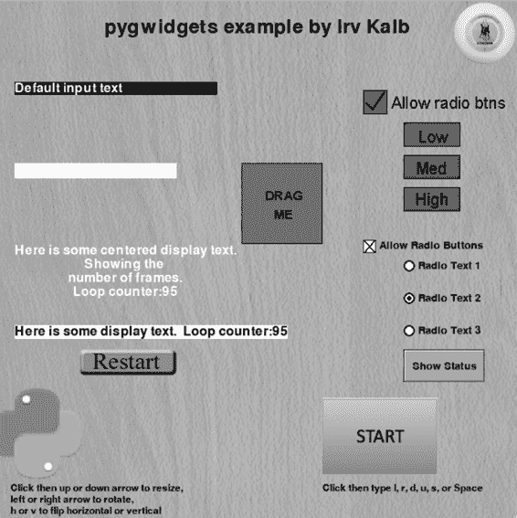
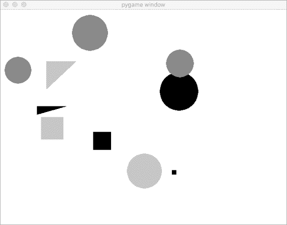

方法，传入新的显示文本。setValue() 方法有一个可选的

优化也做得很好：它记住了上次渲染的文本，并且在执行之前

如果文本没有变化，什么都不做，方法直接返回。如果有新文本，

如果文本没有变化，什么也不做，方法直接返回。

有新文本，它将渲染新的文本到一个要绘制的表面。

draw() 方法 5 绘制 self.textSurface 中包含的图像

将实例变量放入窗口的指定位置。此方法应在每一帧中调用。

必须在每一帧中调用。

这种方法有多个优点：

• 该类隐藏了 pygame 渲染文本的所有细节，因此用户

该类的实例不需要知道需要哪些特定于 pygame 的调用

显示文本。

**134** 第六章

• 每个 SimpleText 对象记住它绘制文本的窗口、文本放置的位置和文本颜色。因此，

只需在实例化时指定这些值一次

SimpleText 对象，通常在主循环开始之前。

• 每个 SimpleText 对象还被优化为记住它显示的文本

它记住了上次绘制的图像（self.textSurface），如果

当前文本的变化。只有当

文本发生变化时。

• 要在窗口中显示多段文本，你只需要实例化

创建多个 SimpleText 对象。这是面向对象编程的一个关键概念

编程。

**演示球与 SimpleText 和 SimpleButton**

最后，我们将修改示例 6-2，使用 SimpleText 和 SimpleButton

类的更新程序在示例 6-7 中跟踪了

它会检查主循环运行的次数，并在顶部报告该信息。

在窗口上。点击重启按钮会重置计数器。

**文件：PygameDemo8_SimpleTextDisplay/Main_Bal TextAndButton.py**

# pygame 演示 8 - SimpleText、SimpleButton 和 Ball

# 1 - 导入包

import pygame

from pygame.locals import *

import sys

import random

1 from Ball import *  # 导入 Ball 类代码

from SimpleText import *

from SimpleButton import *

# 2 - 定义常量

BLACK = (0, 0, 0)

WHITE = (255, 255, 255)

WINDOW_WIDTH = 640

WINDOW_HEIGHT = 480

FRAMES_PER_SECOND = 30

# 3 - 初始化世界

pygame.init()

window = pygame.display.set_mode((WINDOW_WIDTH, WINDOW_HEIGHT))

clock = pygame.time.Clock()

# 4 - 加载资源：图像、声音等

# 5 - 初始化变量

2 oBall = Ball(window, WINDOW_WIDTH, WINDOW_HEIGHT)

oFrameCountLabel = SimpleText(window, (60, 20),

'程序已经运行了这么多次：', WHITE)

面向对象的 Pygame **135**

oFrameCountDisplay = SimpleText(window, (500, 20), '', WHITE)

oRestartButton = SimpleButton(window, (280, 60),

'images/restartUp.png', 'images/restartDown.png')

frameCounter = 0

# 6 - 无限循环

while True:

# 7 - 检查并处理事件

for event in pygame.event.get():

if event.type == pygame.QUIT:

pygame.quit()

sys.exit()

3 if oRestartButton.handleEvent(event):

frameCounter = 0 # 点击按钮，重置计数器

# 8 - 执行任何“每帧”操作

4 oBall.update() # 告诉球更新自己

frameCounter = frameCounter + 1 # 每帧递增

5 oFrameCountDisplay.setValue(str(frameCounter))

# 9 - 在重新绘制之前清空窗口

window.fill(BLACK)

# 10 - 绘制窗口元素

6 oBall.draw() # 告诉球绘制自己

oFrameCountLabel.draw()

oFrameCountDisplay.draw()

oRestartButton.draw()

# 11 - 更新窗口

pygame.display.update()

# 12 - 稍微减慢一些

clock.tick(FRAMES_PER_SECOND)

*Listing 6-7: 一个示例主程序，展示 Ball、SimpleText 和 SimpleButton* 在程序的顶部，我们导入 Ball、SimpleText 的代码，

和 SimpleButton 类 1\. 在主循环开始之前，我们创建了一个实例

作为 Ball 2 的两个实例，SimpleText 类的两个实例（oFrameCountLabel 用于

不变的消息标签和 oFrameCountDisplay 用于显示帧数的变化，

帧数显示（以及帧数的变化），还有一个 SimpleButton 类的实例，我们将其存储在

oRestartButton。我们还初始化了一个变量 frameCounter 为零，后续会使用

每次通过主循环时递增。

在主循环中，我们检查用户是否按下了重启按钮 3\. 如果

没错，我们重置了帧计数器。

我们告诉球更新其位置 4\. 我们递增帧计数器—

然后调用文本字段的 setValue()方法，显示新的计数

帧数 5\. 最后，我们告诉球绘制自己，并告诉文本字段绘制

它们自己，并通过调用 draw()方法，告诉重启按钮绘制自己

每个对象的方法 6\。

**136** 第六章

在 SimpleText 对象的实例化中，最后一个参数是文本颜色，我们指定这些对象应以白色渲染，因此

这样它们就能在黑色背景下显示出来。在下一章，我将展示

如何扩展 SimpleText 类以包含更多属性，而不

不会使类的接口变得复杂。我们将构建一个功能更全的文本

对象有合理的默认值来设置这些属性，但

允许你重写这些默认值。

**接口与实现**

SimpleButton 和 SimpleText 示例引出了一个重要的话题

接口与实现。如第四章中提到的，接口指的是某个东西如何被使用，而实现则指的是其内部工作原理。

内部是如何运作的（即某些功能的实现）。

在 OOP 环境中，接口是类中一组方法的集合，

它们相关的参数——也称为*应用程序编程接口*

*(API)*。实现则是类中所有方法的实际代码。

一个外部包，如 pygame，通常会附带文档

API 文档解释了可以调用的函数以及每次调用时你需要传递的参数。

你需要在每次调用时传递的参数。完整的 pygame API

文档可以在 [*https://www.pygame.org/docs/*](https://www.pygame.org/docs/) 找到。

当你编写调用 pygame 的代码时，你不需要担心

关于你正在使用的方法的实现。例如，

当你调用 blit() 来绘制图像时，你其实并不关心 *如何*

blit() 做它应该做的事情；你只需要知道 *它* 的调用是做什么的，以及需要传入哪些参数。另一方面，你可以相信

实现者（编写 blit() 方法的人）已经深入思考了

关于如何让 blit() 高效工作。

在编程世界中，我们经常扮演两种角色，既是实现者，

设计者和应用程序开发人员，因此我们需要努力设计

不仅在当前情况下有意义，而且是通用的 API，

足够通用，可以供我们自己未来的程序和其他人编写的程序使用

由其他人编写。我们的 SimpleButton 和 SimpleText 类是很好的例子，

因为它们是以通用的方式编写的，因此可以轻松重用。我会讲解

更多关于接口与实现的内容参见第八章，w，我们将在那时探讨封装。

**回调函数**

使用 SimpleButton 对象时，我们处理检查并响应

按钮点击事件如下：

如果 oButton.handleEvent(event):

print('按钮被点击了')

面向对象的 Pygame **137**

这种事件处理方法适用于 SimpleButton 类。

然而，其他一些 Python 包和许多其他编程语言

语言通过不同的方式处理事件：使用 *回调函数*。

**回调函数**

当某个特定的动作、事件或条件发生时，一个对象的函数或方法会被调用。

一个容易理解这个概念的方法是思考一下 1984 年上映的热门电影

*幽灵捕手*。电影的标语是“你会打电话给谁？” 在

电影中，幽灵捕手在电视上播出了一则广告，告诉人们，如果他们看到

一个幽灵（这就是需要寻找的事件），他们应该联系幽灵捕手（

callback) 来摆脱它。接收到调用时，幽灵捕手会采取行动

采取适当的行动来消除幽灵。

例如，考虑一个按钮对象，它被初始化为拥有一个

回调函数。当用户点击按钮时，按钮会调用回调函数

函数或方法。那个函数或方法执行任意代码

需要响应按钮点击事件。

***创建回调函数***

要设置回调函数，当你创建一个对象或调用一个对象的

方法，你传递一个函数的名称或一个对象的方法，以便执行

被调用。举个例子，有一个用于 Python 的标准 GUI 包，名为

tkinter。使用此包创建按钮的代码非常不同，

与我展示的有所不同——这是一个示例：

导入 tkinter

def myFunction():

print('myCallBackFunction 被调用了')

oButton = tkinter.Button(text='点击我', command=myFunction)

当你使用 tkinter 创建按钮时，必须传入一个函数（或

一个对象的方法），当用户点击按钮时，它会被调用。

按钮。这里，我们将 myFunction 作为回调函数传递。

（这个调用使用了关键字参数，我们将在后续详细讨论）

在第七章，tkinter 按钮将该函数记住作为回调函数，当用户点击该按钮时，它会调用该函数。

myFunction().

当你启动一些可能需要时间的操作时，你也可以使用回调。

需要一些时间。与其等待操作完成并导致程序

程序看起来会在一段时间内冻结，你提供一个回调函数

在动作完成时调用。例如，假设你希望

发出互联网请求。与其进行调用并等待

为了让这个调用返回数据，可能需要一些时间，相关的包

让你使用调用并设置回调函数的方法。

这样，程序可以继续运行，用户不会被锁定

**138** 第六章

从中解脱出来。这通常涉及多个 Python 线程，超出了本书的范围，但使用回调的技术是一般的方式

确保它已完成。

***使用回调函数与 SimpleButton***

为了演示这个概念，我们将对

修改 SimpleButton 类，使其能够接受回调函数。作为附加的可选项

参数中，调用者可以提供一个函数或对象的方法作为回调

当点击 SimpleButton 对象时，会回调该函数。每个实例

SimpleButton 在实例变量中记住回调函数。当用户

完成点击后，SimpleButton 的实例调用回调函数。

清单 6-8 中的主程序创建了三个实例

SimpleButton 类，每个类以不同的方式处理按钮点击。

第一个按钮 oButtonA 不提供回调；oButtonB 提供回调函数

到一个函数；oButtonC 指定一个回调，调用对象的方法。

**文件：PygameDemo9_SimpleButtonWithCallback/Main_SimpleButtonCallback.py**

# pygame 演示 9 - 3 个按钮测试与回调函数

# 1 - 导入包

import pygame

from pygame.locals import *

from SimpleButton import *

import sys

# #2 - 定义常量

GRAY = (200, 200, 200)

WINDOW_WIDTH = 400

WINDOW_HEIGHT = 100

FRAMES_PER_SECOND = 30

# 定义一个函数，作为“回调”

def myCallBackFunction(): 1

print('用户按下了按钮 B，调用了我的回调函数')

# 定义一个类，并为其方法指定一个“回调”函数

class CallBackTest(): 2

--- 剪切掉该类中的其他方法 ---

def myMethod(self):

print('用户按下了按钮 C，调用了 CallBackTest 对象的 myMethod')

# 3 - 初始化世界

pygame.init()

window = pygame.display.set_mode((WINDOW_WIDTH, WINDOW_HEIGHT))

clock = pygame.time.Clock()

# 4 - 加载资源：图片、声音等。

# 5 - 初始化变量

面向对象的 Pygame **139**

oCallBackTest = CallBackTest() 3

# 创建 SimpleButton 的实例

# 无回调函数

oButtonA = SimpleButton(window, (25, 30), 4

'images/buttonAUp.png',

'images/buttonADown.png')

# 指定一个函数作为回调函数

oButtonB = SimpleButton(window, (150, 30),

'images/buttonBUp.png',

'images/buttonBDown.png',

callBack=myCallBackFunction)

# 指定一个对象的方法进行回调

oButtonC = SimpleButton(window, (275, 30),

'images/buttonCUp.png',

'images/buttonCDown.png',

callBack=oCallBackTest.myMethod)

counter = 0

# 6 - 永久循环

while True:

# 7 - 检查并处理事件

for event in pygame.event.get():

如果 event.type == pygame.QUIT:

pygame.quit()

sys.exit()

# 将事件传递给按钮，查看它是否被点击

如果 oButtonA.handleEvent(event): 5

print('用户按下了按钮 A，已在主循环中处理')

# oButtonB 和 oButtonC 都有回调，

# 不需要检查这些调用的结果

oButtonB.handleEvent(event) 6

oButtonC.handleEvent(event) 7

# 8 - 执行任何“每帧”动作

counter = counter + 1

# 9 - 清除窗口

window.fill(GRAY)

# 10 - 绘制所有窗口元素

oButtonA.draw()

oButtonB.draw()

oButtonC.draw()

# 11 - 更新窗口

pygame.display.update()

# 12 - 稍微减缓速度

clock.tick(FRAMES_PER_SECOND) # 让 pygame 等待

*Listing 6-8: 处理按钮点击的三种不同方式的主程序版本* **140** 第六章

我们从一个简单的函数 myCallBackFunction() 1 开始，它只会打印一条消息，表示它已被调用。接下来，我们有一个 CallBackTest

包含方法 myMethod() 的类 2，它打印自己的消息

以宣布它已被调用。我们从 oCallBackTest 创建一个对象

CallBackTest 类 3\. 我们需要这个对象，以便可以设置回调函数来

oCallBack.myMethod()。

然后我们创建三个 SimpleButton 对象，每个对象使用不同的

方法 4\. 第一个，oButtonA，没有回调。第二个，oButtonB，设置

将回调函数设置为 myCallBackFunction()。第三个，oButtonC，设置它的

回调到 oCallBack.myMethod()。

在主循环中，我们检查用户是否点击了三个按钮中的任何一个

通过调用每个按钮的 handleEvent() 方法来处理按钮事件。由于 oButtonA

如果没有回调函数，我们必须检查返回的值是否为 True 5，并且，如果是的话，

执行某个操作。当 oButtonB 被点击时 6，myCallBackFunction()

函数将被调用并打印消息。当 oButtonC 被点击时 7，

oCallBackTest 对象的 myMethod() 方法将被调用，并且

打印它的消息。

一些程序员更喜欢使用回调方法，因为目标—

被调用的方法是在创建对象时设置的。理解这一点非常重要—

理解这种技术，特别是当你使用一个需要

它。然而，我将使用原始方法来检查返回值

在我所有的示范代码中，都会通过调用 handleEvent() 返回。

**总结**

在本章中，我展示了如何从一个过程化程序开始并

提取相关代码以构建一个类。我们创建了一个 Ball 类来演示

然后将我们的示范程序的主要代码从之前的

本章介绍了如何调用类的方法，以告诉 Ball 对象*做什么*，而不必担心*如何*实现结果。所有相关代码都在一个单独的类中，我们可以轻松地创建对象列表，并根据需要实例化和管理多个对象。

然后我们构建了一个 SimpleButton 类和一个 SimpleText 类，这些类隐藏了

复杂性隐藏在其实现内部，并创建高可复用的代码。在

在下一章，我将基于这些类来开发“专业级”功能，

按钮和文本显示类。

最后，我介绍了回调的概念，在回调中传递一个函数，

在对对象的调用中传递函数或方法。回调将在事件发生或动作完成时被调用。

事件发生或动作完成时。

面向对象的 Pygame **141**

**7**

**P Y G A M E G U I W I D G E T S**

Pygame 允许程序员以

基于文本的 Python 语言及其应用

构建基于 GUI 的程序。Windows，

指针设备、点击、拖动等操作，

声音已成为我们体验中所有标准部分之一。

使用计算机的体验。不幸的是，pygame

包含的程序包没有内置的基本用户交互功能，

界面元素，因此我们需要自己构建它们。

我们将使用 pygwidgets，这是一个 GUI 小部件库。

本章解释了如何构建标准小部件，例如图像、按钮、

输入或输出字段可以构建为类，客户端代码如何使用它们

它们中。将每个元素构建为一个类，使程序员能够融入

在创建 GUI 时，可以为每个元素创建多个实例。在我们继续之前，

在开始构建这些 GUI 小部件之前，我需要讨论一个

另一个 Python 特性：在调用函数或方法时传递数据。

**将参数传递给函数或方法**

在调用函数时传递的参数和函数中定义的参数之间有一一对应关系，

函数的参数之间有一一关系，因此第一个参数的值将

如果第一个参数提供了值，第二个参数的值将

传递给第二个参数的值，依此类推。

图 7-1，复制自第三章，显示了当你调用一个对象的方法时，同样的规则适用。我们可以看到，第一个参数，总是 self，被设置为调用中的对象。

def someMethod(self, *<任何其他参数>* ):

oSomeObject.someMethod( *<任何其他参数>* )

*图 7-1：传递到方法中的参数如何与其参数匹配*

然而，Python（和一些其他语言）允许你为一些

的参数是可选的。如果调用中没有提供可选参数，

我们可以提供一个默认值来代替函数或方法中的参数值。我会

通过一个现实世界的类比来解释。

如果你在 Burger King 餐厅点一份汉堡，你的汉堡会

配有番茄酱、芥末和泡菜。但 Burger King 以

这种方式说：“你可以按自己的方式来。”如果你想要其他组合的

调料时，你必须在点餐时说出你想要（或不想要）什么

按照你的顺序。

我们将从编写一个 orderBurgers() 函数开始，它模拟下订单

按照我们定义函数的常规方式订购汉堡，

实现默认值：

def orderBurgers(nBurgers, ketchup, mustard, pickles):

你必须指定你想要订购的汉堡数量，但是

理想情况下，如果你想要添加番茄酱、芥末和酸黄瓜的默认值 True

酸黄瓜，你不需要传递更多的参数。因此，要订购两个

使用标准默认值订购汉堡时，你可能认为你的调用应该

看起来像这样：

orderBurgers(2) # 带番茄酱、芥末和酸黄瓜

然而，在 Python 中，这将触发一个错误，因为存在不匹配—

调用中的参数数量与

在函数中指定的参数：

TypeError：orderBurgers() 缺少 3 个必需的位置参数：'ketchup'，

'芥末'，和'酸黄瓜'

让我们看看 Python 如何允许我们设置可选参数，这些参数可以

如果没有指定任何值，它们将被赋予默认值。

**144** 第七章

***位置和关键字参数***

Python 有两种不同类型的参数：位置参数和

关键字参数。*位置参数*是我们已经熟悉的类型，

熟悉的位置参数，其中调用中的每个参数都有一个对应的参数

函数或方法定义。

一个*关键字参数*允许你指定一个默认值。你写一个关键字参数的方式是变量名、等号和默认值，像这样：

def someFunction( *<keywordParameter>* = *<default value>* ): 你可以有多个关键字参数，每个参数都有一个名称和一个

默认值。

一个函数或方法可以同时具有位置参数和关键字参数，

关键字参数，在这种情况下，你必须在每次调用时指定所有位置参数

在任何关键字参数*之前*：

def someOtherFunction(positionalParam1, positionalParam2, ...

*<keywordParameter1>* = *<default value 1>* ,

*<keywordParameter2>* = *<default value 2>* , ...):

让我们重写 orderBurgers()，使用一个位置参数和三个

带有默认值的关键字参数，像这样：

def orderBurgers(nBurgers, ketchup=True, mustard=True, pickles=True):

当我们调用这个函数时，nBurgers 是一个位置参数

因此，必须在每次调用时作为参数指定。其他三个

是关键字参数。如果没有为番茄酱、芥末和酸黄瓜传递值，

否则，函数将对这些参数使用默认值 True

变量。现在我们可以这样订购两个汉堡，附带所有调味料：

orderBurgers(2)

如果我们想要其他的值而不是默认值，我们可以指定名字

关键字参数和调用中的不同值。例如，如果我们

如果我们只想在两个汉堡上加番茄酱，我们可以这样调用：

orderBurgers(2, mustard=False, pickles=False)

当函数运行时，芥末和酸黄瓜变量的值

默认设置为 False。由于我们没有为番茄酱指定值，它会被赋予

默认为 True。

你也可以按位置指定所有参数来进行调用，包括-

将它们写为关键字参数。Python 会使用参数的顺序

给每个参数分配正确值时，你的参数是：

orderBurgers(2, True, False, False)

在这个调用中，我们再次指定了两个加番茄酱的汉堡，没有芥末-

无腌黄瓜且无芥末。

Pygame GUI 小部件 **145**

***关于关键字参数的额外说明***

让我们快速回顾一些关于使用关键字参数的约定和技巧-

参数。作为 Python 约定，当你使用关键字参数和关键字参数时-

带有参数的关键字和值之间的等号

不应*有*空格，以表明这些不是典型的赋值语句。这些行格式正确：

def orderBurgers(nBurgers, ketchup=True, mustard=True, pickles=True):

orderBurgers(2, mustard=False)

这些行也能正常工作，但它们不符合格式约定-

约定且可读性较差：

def orderBurgers(nBurgers, ketchup = True, mustard = True, pickles = True):

orderBurgers(2, mustard = False)

当调用一个同时包含位置参数和关键字参数的函数时-

关键字参数中，你必须为所有位置参数提供值。

首先，在任何可选的关键字参数之前。

调用中的关键字参数可以以任何顺序指定。我们对关键字参数的调用

orderBurgers()函数可以通过多种方式实现，例如：

orderBurgers(2, mustard=False, pickles=False) # 只有番茄酱

或者：

orderBurgers(2, pickles=False, mustard=False, ketchup=False) # 普通汉堡

所有关键字参数都会被赋予适当的值，独立地

参数顺序的独立性。

虽然 orderBurgers() 示例中的所有默认值都是布尔类型

值，一个关键字参数可以具有任何数据类型的默认值。例如，

举个例子，我们可以写一个函数，允许顾客点冰淇淋

以这种方式点冰激凌：

def orderIceCream(flavor, nScoops=1, coneOrCup='cone', sprinkles=False):

调用者必须指定口味，但默认情况下会得到一球‘regular’。

cone，没有洒糖。调用者可以通过不同的方式覆盖这些默认值-

其他关键字值。

***使用 None 作为默认值***

有时候，知道调用者是否为某个参数传递了值是很有帮助的

是否使用关键字参数。举个例子，调用者点了一份比萨饼。在

至少，调用者必须指定一个大小。第二个参数将是

样式默认为“regular”，但可以是“deepdish”。作为第三个参数，

**146** 第七章

调用者可以选择性地传递一个想要的配料。如果调用者想要配料，我们必须额外收费。

在列表 7-1 中，我们将为大小使用一个位置参数和关键字参数-

对样式和配料使用关键字参数。样式的默认值是字符串

由于配料是可选的，我们将使用特殊的 Python

None 值作为默认值，但调用者可以传递他们想要的配料

选择。

**文件：OrderPizzaWithNone.py**

def orderPizza(size, style='regular', topping=None):

# 根据大小和风格进行一些计算

# 检查是否指定了配料

PRICE_OF_TOPPING = 1.50 # 每种配料的价格

if size == 'small':

price = 10.00

elif size == 'medium':

price = 14.00

else: # 大号

price = 18.00

if style == 'deepdish':

price = price + 2.00 # 对深盘收取额外费用

line = '你订购了一个 ' + size + ' ' + style + ' 比萨，上面有 '

1 if topping is None: # 检查是否没有传入配料

print(line + '没有配料')

else:

print(line + topping)

price = price + PRICE_OF_TOPPING

print('价格是 $', price)

print()

# 你可以通过以下几种方式订购比萨：

2 orderPizza('large') # 大号，默认为常规，没有配料

orderPizza('large', style='regular') # 与上面相同

3 orderPizza('medium', style='deepdish', topping='mushrooms')

orderPizza('small', topping='mushrooms') # 风格默认为常规

*清单 7-1：带有默认值为 None 的关键字参数的函数*

第一个和第二个调用会被视为相同，topping 的值为

变量 topping 设置为 None 2\. 在第三和第四个调用中，topping 的值为

topping 设置为 'mushrooms' 3\. 因为 'mushrooms' 不是 None，在这些调用中

代码会为比萨上的配料添加额外费用 1\。

使用 None 作为关键字参数的默认值为你提供了一种方法来

查看调用者是否在调用中提供了值。这可能是非常微妙的用法

关键字参数，但它将在我们接下来的讨论中非常有用。

Pygame GUI 小部件 **147**

***选择关键字和默认值***

使用默认值使调用函数和方法变得更简单，但

这存在一个缺点。你为关键字参数选择的每个关键字

非常重要。一旦程序员开始调用覆盖默认值的函数，

默认值时，改变关键字参数的名称就变得非常困难

因为该名称必须在*所有*对函数或方法的调用中都进行更改

同步进行。否则，原本正常运行的代码将会崩溃。更多广泛

分布式代码，这可能会给程序员带来很大的麻烦——

使用你代码的程序员。最重要的是，不要改变关键字的名称

除非绝对必要，否则不要更改关键字参数的名称。所以，明智地选择！

同样，选择适合最大范围用户的默认值也非常重要

可能适合更广泛用户范围的（顺便说一句，我*讨厌*芥末！每次去汉堡王时，我都得记得指定不加芥末，否则我会得到我认为无法吃的汉堡。我觉得他们做出了一个糟糕的默认选择。）

***GUI 小部件中的默认值***

在下一节中，我将展示一系列类，你可以用来

可以轻松在 pygame 中创建按钮和文本字段等 GUI 元素。

这些类将通过使用一些位置参数来初始化

还将包含各种可选的关键字参数，所有这些参数都有合理的

默认为让程序员通过仅指定一个来创建 GUI 小部件

少数位置参数。通过指定更精确的控制可以获得更多的控制，

为关键字参数的默认值提供新的值。

为了展示一个深入的例子，我们将看一个用于显示文本的小部件

应用程序窗口。文本可以以各种字体、字体大小、颜色、背景色等形式显示。我们将构建一个 DisplayText 类来展示这一点。

字体、背景色等方面。我们将构建一个 DisplayText 类来展示这一点。

这些属性有默认值，但会给客户端代码提供

指定不同值的选项。

**pygwidgets 包**

本章剩余内容将聚焦于 pygwidgets（发音为“pig widgets”）包

wijits”) 包，该包的编写目标是：

1\. 展示多种不同的面向对象编程技术

2\. 让程序员可以轻松创建和使用 pygame 中的 GUI 小部件

程序

pygwidgets 包包含以下类：

**TextButton**

使用文本字符串构建的标准艺术按钮

**CustomButton**

带有自定义艺术作品的按钮

**148** 第七章

**TextCheckBox**

使用文本字符串构建的标准艺术复选框

**CustomCheckBox**

带有自定义艺术作品的复选框

**TextRadioButton**

使用文本字符串构建的标准艺术单选按钮

**CustomRadioButton**

带有自定义艺术作品的单选按钮

**DisplayText**

用于显示输出文本的字段

**InputText**

用户可以输入文本的字段

**Dragger**

允许用户拖动图像

**图像**

在指定位置显示图像

**ImageCollection**

在指定位置显示一张图片

**动画**

显示一系列图像

**SpriteSheetAnimation**

从单个较大图像中显示一系列图像

***设置***

要安装 pygwidgets，请打开命令行并输入以下内容：

python3 -m pip install -U pip --user

python3 -m pip install -U pygwidgets --user

这些命令下载并安装最新版本的 pygwidgets

从 Python 包索引（PyPI）下载。它被放置在一个文件夹中（命名为

*site-packages*)，它对所有 Python 程序可用。安装后，你可以通过在程序开始部分包括以下语句来使用 pygwidgets：

导入 pygwidgets

这将导入整个包。导入后，你可以实例化

从其类中创建对象并调用这些对象的方法。

Pygame GUI 小部件 **149**

pygwidgets 的最新文档可以在 [*https://pygwidgets*](https://pygwidgets.readthedocs.io/en/latest/) 找到

[*.readthedocs.io/en/latest/*](https://pygwidgets.readthedocs.io/en/latest/)。如果你想查看该包的源代码，可以通过我的 GitHub 仓库访问，链接在这里：[*https://github.com/IrvKalb/pygwidgets/*.](https://github.com/IrvKalb/pygwidgets/)

***总体设计方法***

如第五章所示，在每个 pygame 程序中你首先要做的事情之一就是定义应用程序的窗口。以下一行创建了

创建应用程序窗口并将其引用保存在名为 window 的变量中：

window = pygame.display.set_mode((WINDOW_WIDTH, WINDOW_HEIGHT))

正如我们很快会看到的，每当我们实例化一个小部件时，我们都需要

将窗口变量传递给小部件，以便小部件可以在应用程序的

窗口。

pygwidgets 中的大多数小部件工作方式类似，通常涉及

这三步如下：

1\. 在主 while 循环开始之前，创建一个小部件实例，传入

在任何初始化参数中。

2\. 在主循环中，每当发生任何事件时，调用 handleEvent()

小部件的 handleEvent() 方法（传入事件对象）。

3\. 在主循环底部，调用小部件的 draw() 方法。

使用任何小部件的第一步是通过以下代码实例化一个：

oWidget = pygwidgets. *<SomeWidgetClass>* (window, loc, *<其他需要的参数>* ) 第一个参数始终是应用程序的窗口。第二个

参数始终是小部件显示在窗口中的位置。

获取的事件是一个元组：(x, y)。

第 2 步是通过调用 handleEvent() 处理任何可能影响小部件的事件

对象的 handleEvent() 方法位于事件循环中。如果任何事件（如鼠标

如果发生点击或按键事件，并且小部件处理该事件，则此调用将

返回 True。主 while 循环顶部的代码通常看起来像这样：

while True:

for event in pygame.event.get():

if event.type == pygame.QUIT:

pygame.quit()

sys.exit()

如果 oWidget.handleEvent(event):

# 用户对 oWidget 做了某些事情，我们应该对此做出响应

# 在此处添加代码

第 3 步是在 while 循环的底部添加一行，调用

小部件的 draw() 方法，以使其在窗口中显示：

oWidget.draw()

**第一百五十章 第七章**

由于我们指定了要绘制的窗口、位置以及任何

在第 1 步中影响小部件外观的详细信息，我们没有传递任何

在调用 draw() 时，您可以处理绘制过程中的任何问题。

***添加图像***

我们的第一个示例将是最简单的小部件：我们将使用 Image 类显示

在窗口中显示图像。当您实例化一个图像对象时，唯一需要提供的

必需的参数是窗口，以及要在窗口中绘制的位置

图像及其文件路径。创建图像对象应在

主循环开始时，如下所示：

oImage = pygwidgets.Image(window, (100, 200), 'images/SomeImage.png')

此处使用的路径假定项目文件夹中包含

主程序还包含一个名为 *images* 的文件夹，其中包含

*SomeImage.png* 文件。然后，在主循环中，您只需调用该对象的 draw() 方法：

oImage.draw()

Image 类的 draw() 方法包含一个调用 blit() 来实际

实际绘制图像，因此您无需直接调用 blit()。要移动图像，

图像时，您可以调用它的 setLoc() 方法（简写为设置位置），指定

作为元组传入新的 x 和 y 坐标：

oImage.setLoc((newX, newY))

下一次绘制图像时，它将显示在新的坐标位置。

坐标。文档列出了您可以调用的许多附加方法

翻转、旋转、缩放，获取图像的位置和矩形，等等。

**精灵模块**

Pygame 有一个内置模块可以在窗口中显示图像，称为*精灵*。

*模块*。这种图像被称为*精灵*。精灵模块提供了一个 Sprite 类来处理单个精灵和一个 Group 类来处理多个精灵。

Sprite 对象。一起，这些类提供了出色的功能，如果

如果您打算进行大量的 pygame 编程，可能值得您的时间来深入了解它们。不过，为了说明底层的面向对象编程概念，

是时候深入了解它们了。然而，为了说明底层的 OOP 概念，

概念上，我选择不使用这些类。相反，我将继续使用生成类。

一般 GUI 元素，以便它们可以在任何环境和语言中使用。

如果您想了解更多关于精灵模块的信息，请参阅教程 [*https://*](https://www.pygame.org/docs/tut/SpriteIntro.html)

[*www.pygame.org/docs/tut/SpriteIntro.html*](https://www.pygame.org/docs/tut/SpriteIntro.html)

Pygame GUI 小部件 **151**

***添加按钮、复选框和单选按钮***

当您在 pygwidgets 中实例化按钮、复选框或单选按钮小部件时，

您有两个选项：实例化一个文本版本，该版本绘制自己的艺术图像，或者

添加一个基于您传递字符串的文本标签，或者实例化一个自定义版本

版本，您提供艺术作品的位置。表 7-1 显示了不同的按钮类。

可用的。

**表 7-1：** pygwidgets 中的文本和自定义按钮类。

**文本版本（在飞行中构建艺术作品）**

**自定义版本（使用飞行中的艺术作品）**

**（即时创建）**

**您的艺术作品)**

按钮

TextButton

CustomButton

复选框

TextCheckBox

CustomCheckBox

单选按钮

TextRadioButton

CustomRadioButton

这些类的文本和自定义版本之间的差异。

仅在实例化时相关。一旦您从

文本或自定义按钮类，所有剩余方法对这一对

这些类是相同的。为了明确这一点，我们来看看 TextButton

和 CustomButton 类。

**TextButtons**

这是 TextButton 类的 __init__()方法的实际定义。

在 pygwidgets 中：

def __init__(self, window, loc, text,

width=None,

height=40,

textColor=PYGWIDGETS_BLACK,

upColor=PYGWIDGETS_NORMAL_GRAY,

overColor=PYGWIDGETS_OVER_GRAY,

downColor=PYGWIDGETS_DOWN_GRAY,

fontName=DEFAULT_FONT_NAME,

fontSize=DEFAULT_FONT_SIZE,

soundOnClick=None,

enterToActivate=False,

callback=None

nickname=None):

然而，与其阅读类的代码，程序员

通常会参考其文档。如前所述，您可以找到

pygwidgets 的完整文档可以在[*https://pygwidgets.readthedocs.io/*](https://pygwidgets.readthedocs.io/en/latest/)查看。

[*en/latest/*](https://pygwidgets.readthedocs.io/en/latest/).

您也可以通过调用内置的 help()函数来查看类的文档。

在 Python shell 中可以这样调用函数：

>>> help(pygwidgets.TextButton)

**152** 第七章

当您创建一个 TextButton 的实例时，您只需要传递

在窗口中，窗口中的位置，以及要显示的文本。

button。如果你只指定这些位置参数，按钮将使用

合理的默认值包括宽度和高度、背景颜色等

按钮的四种状态（不同的灰色阴影）、字体和字体大小。

默认情况下，当用户点击按钮时不会播放任何声音效果。

创建一个使用所有默认设置的 TextButton 的代码如下：

oButton = pygwidgets.TextButton(window, (50, 50), '文本按钮')

TextButton 类的 __init__() 方法中的代码使用了

pygame 绘图方法用于构建其所有四种状态的艺术图像（上、

按下、悬停和禁用）。前一行创建了一个“up”版本的

看起来像图 7-2 的按钮。

*图 7-2：一个文本按钮*

*使用默认值*

你可以使用关键字值重写任何或所有默认参数。

使用方式如下：

oButton = pygwidgets.TextButton(window, (50, 50), '文本按钮',

width=200,

height=30,

textColor=(255, 255, 128),

upColor=(128, 0, 0),

fontName='Courier',

fontSize=14,

soundOnClick='sounds/blip.wav',

enterToActivate=True)

这个实例化将创建一个像图 7-3 所示的按钮\。

*图 7-3：一个使用关键字的文本按钮*

*字体、大小、颜色等参数*

这两个按钮的图像切换行为会完全相同

使用相同的方式；唯一的区别在于图像的外观。

**自定义按钮**

CustomButton 类允许你使用自己的艺术作品来制作按钮。要实例化一个

要实例化一个 CustomButton，你只需要传入一个窗口、一个位置和一个路径

到按钮的 up 状态图像。这里是一个示例：

restartButton = pygwidgets.CustomButton(window, (100, 430),

'images/RestartButtonUp.png')

Pygame GUI 小部件 **153**

按钮的按下、悬停和禁用状态是可选的关键字参数，对于这些没有传值的状态，CustomButton 将使用

up 图像。更典型（且强烈建议）的是传入图像路径，

可选的图像，如下所示：

restartButton = pygwidgets.CustomButton(window, (100, 430),

'images/RestartButtonUp.png',

down='images/RestartButtonDown.png',

over='images/RestartButtonOver.png',

disabled='images/RestartButtonDisabled.png',

soundOnClick='sounds/blip.wav',

nickname='restart')

这里我们还指定了一个声音效果，应该在

用户点击按钮时播放该声音效果，并提供一个内部的昵称供我们

稍后使用。

**使用按钮**

实例化后，这里是一些典型的代码来使用按钮对象 oButton，

无论是 TextButton 还是 CustomButton，都是独立的：

while True:

for event in pygame.event.get():

if event.type == pygame.QUIT:

pygame.quit()

sys.exit()

if oButton.handleEvent(event):

# 用户点击了这个按钮

*<你想在按钮点击时运行的任何代码>*

--- 截断 ---

oButton.draw() # 在 while 循环的底部，告诉它绘制

每次我们检测到一个事件时，都需要调用 handleEvent() 方法

允许按钮根据用户的操作作出反应。这个调用通常

返回 False，但当用户完成点击时返回 True

按钮。在主循环的底部，我们需要调用 draw()

按钮的 method 方法允许它绘制自己。

***文本输出和输入***

正如我们在第六章，h 中所见，处理文本输入和输出在 pygame 中是棘手的，但在这里我将介绍用于文本显示字段和输入文本的新类

字段。这两个类都有最小的必需（位置）参数，

它们对其他属性（如字体、字体大小、颜色等）有合理的默认值，

颜色等）这些都可以轻松覆盖。

**文本输出**

pygwidgets 包含一个 DisplayText 类，用于显示文本，这是一个

更完整版本的 SimpleText 类来自第六章。当你**154** 第七章

实例化一个 DisplayText 字段时，唯一必需的参数是窗口和位置。第一个关键字参数是 value，它可以通过字符串指定作为显示在字段中的起始文本。这通常是

用于默认的最终用户值或从不改变的文本，如标签

或说明。由于 value 是第一个关键字参数，它可以作为

无论是位置参数还是关键字参数。例如，这个：

oTextField = pygwidgets.DisplayText(window, (10, 400), 'Hello World')

将与此相同地工作：

oTextField = pygwidgets.DisplayText(window, (10, 400), value='Hello World')

你还可以通过指定任意或

所有可选的关键字参数。例如：

oTextField = pygwidgets.DisplayText(window, (10, 400)，

value='一些标题文本'，

fontName='Courier'，

fontSize=40，

width=150，

justified='center'，

textColor=(255, 255, 0))

DisplayText 类有许多额外的方法，其中最

最重要的是 setValue()，你可以调用它来更改绘制的文本

在字段中：

oTextField.setValue('任何你想看到的新文本')

在主循环的底部，你需要调用对象的

draw() 方法：

oTextField.draw()

当然，你可以根据需要创建多个 DisplayText 对象，

每个显示不同的文本，并且每个都有自己的字体、大小、颜色等。

**文本输入**

在典型的基于文本的 Python 程序中，要获取用户输入，你

会调用 input() 函数，程序会暂停，直到

用户在终端窗口中输入文本。但在事件驱动的世界里，

GUI 程序中的主循环永远不会停止。因此，我们必须使用不同的

不同的方法。

对于来自用户的文本输入，GUI 程序通常会呈现一个字段

用户可以在其中输入的内容。输入字段必须处理所有键盘按键，

其中一些显示，其他用于编辑或光标移动

字段中的值。它还必须允许用户按住键来重复

它。pygwidgets 的 InputText 类提供了所有这些功能。

Pygame GUI 小部件 **155**

实例化 InputText 对象所需的唯一参数是窗口和位置：

oInputField = pygwidgets.InputText(window, (10, 100))

然而，你可以通过以下方式自定义 InputText 对象的文本属性

指定可选的关键字参数：

oInputField = pygwidgets.InputText(window, (10, 400)，

value='Starting Text'，

fontName='Helvetica'，

fontSize=40，

width=150，

textColor=(255, 255, 0))

在实例化 InputText 字段后，主循环中的典型代码是

会像这样：

while True:

for event in pygame.event.get():

如果 event.type == pygame.QUIT:

pygame.quit()

sys.exit()

如果 oInputField.handleEvent(event):

# 用户按下了 Enter 或 Return 键

userText = oInputField.getValue()  # 获取用户输入的文本

*<你想要通过用户输入运行的任何代码>*

--- 剪辑 ---

oInputField.draw()  # 在主 while 循环的底部

对于每个事件，我们需要调用 InputText 的 handleEvent() 方法

字段以响应按键和鼠标点击。这通常通过以下方式调用

返回 False，但当用户按下 ENTER 或 RETURN 键时，它返回 True。

然后，我们可以通过调用 getValue() 方法来获取用户输入的文本

对象的方法。

在主 while 循环的底部，我们需要调用 draw() 方法

以允许字段自行绘制。

如果一个窗口包含多个输入字段，键盘按键会由

当前有键盘焦点的字段，当用户点击时会发生变化

在不同的领域中。如果你希望一个字段拥有初始的键盘焦点，

然后你可以将 initialFocus 关键字参数设置为 True，在 InputText

在创建该对象时，选择你想要的对象。此外，如果你有多个

在一个窗口中有多个 InputText 字段时，典型的用户界面设计方法是

以包括一个 OK 或 Submit 按钮。当点击这个按钮时，你可以

然后调用每个字段的 getValue() 方法。

**156** 第七章

**注**

*在撰写本文时，InputText 类不支持通过拖动鼠标高亮显示多个字符。如果以后版本添加了这个功能，* *那么使用 InputText 的程序将无需做任何更改，因为代码完全会包含在该类中。任何新的行为将自动支持所有* *InputText 对象。*

***其他 pygwidgets 类***

正如你在本节开始时看到的，pygwidgets 包含了多个

其他类。

ImageCollection 类允许你从一组图像中显示任何单个图像。

一组图像。例如，假设你有一个角色的图像

面朝前方、左侧、后方和右侧。为了表示所有可能的图像，你

你可以构建一个像这样的字典：

imageDict = {'front':'images/front.png', 'left':'images/left.png'，

'back':'images/back.png', 'right':'images/right.png'}

然后，你可以创建一个 ImageCollection 对象，指定这个字典

以及你想要开始使用的图像的键。要更改为不同的图像

图片时，你调用 replace() 方法并传入一个不同的键。调用该方法

循环底部的`draw()`方法始终显示当前的图像。

Dragger 类显示一张单独的图像，但允许用户拖动该图像

在窗口中任何位置显示图像。你必须调用其 handleEvent()方法

事件循环。当用户完成拖动时，handleEvent()返回 True，

你可以调用 Dragger 对象的 getMouseUpLoc()方法来获取鼠标释放的位置

用户释放鼠标按钮时的位置。

Animation 和 SpriteSheetAnimation 类处理构建和

显示动画。两者都需要一组图像进行迭代。

Animation 类从单独的文件中获取图像，而

SpriteSheetAnimation 类需要一张内部均匀间隔的图像

图像。我们将在第十四章中更详细地探讨这些类。

***pygwidgets 示例程序***

图 7-4 显示了一个示例程序的截图，演示了这些

从许多 pygwidgets 类实例化的对象，包括 Image，

DisplayText, InputText, TextButton, CustomButton, TextRadioButton, CustomRadioButton, TextCheckBox, CustomCheckBox, ImageCollection 和 Dragger。

该示例程序的源代码可以在*pygwidgets_test*文件夹中找到

我 GitHub 仓库中的文件夹，[*https://github.com/IrvKalb/pygwidgets/*.](https://github.com/IrvKalb/pygwidgets/)

Pygame GUI 小部件 **157**

*图 7-4：演示实例化对象的程序窗口*

*来自各种 pygwidgets 类*

**一致性 API 的重要性**

关于为一组类构建 API 的最后一点：尽可能地

在方法的参数中构建一致性是一个非常好的主意

不同但类似的类。作为一个很好的例子，前两个参数

pygwidgets 中每个类的 __init__()方法中都有 window 和 loc 两个参数，

这种顺序。如果这些在某些调用中顺序不同，使用参数

整个包将变得更加复杂。

此外，如果不同的类实现相同的功能，最好

使用相同的方法名是个好主意。例如，许多类

pygwidgets 中的类都有一个名为 setValue()的方法和另一个名为 getValue()的方法。

我将在下一节中详细讨论为什么这种一致性如此重要

两章内容。

**总结**

本章介绍了面向对象的 pygwidgets

图形用户界面小部件包。我们首先讨论了默认

方法中参数的值，我解释了一个关键字参数

参数允许在没有匹配的参数值时使用默认值

在调用中指定。

**第一百五十八章 第七章**

然后我向你介绍了 pygwidgets 模块，它包含多个预构建的 GUI 小部件类，并展示了如何使用其中的几个

这些。最后，我展示了一个示例程序，提供了大部分的示例

这些小部件。

编写像 pygwidgets 中的类有两个主要优点。

首先，类可以在方法中隐藏复杂性。一旦你有了类

正常工作时，你再也不需要担心内部细节了。

第二，你可以通过创建多个类实例来复用代码

你需要的。通过包括关键字，你的类可以提供基本功能

参数，使用精心挑选的默认值。然而，默认值可以

可以轻松地被覆盖，以允许定制化。

你可以公开类的接口，供其他程序员使用

（以及你自己）可以在不同的项目中利用。良好的文档

规范化和一致性对于使这些类型的类

高度可用。

Pygame GUI 小部件 **159**

**第三部分**

**封装**

**多态性，和**

**继承**

面向对象编程的三大原则

编程的封装、多态和继承是

实例。接下来的三章将解释每一个

这些反过来描述了底层的概念和

展示了它们如何在

Python。为了使编程语言能够调用

本身就是一门面向对象编程语言，它必须支持所有这三者

这些核心要求。（如果你在面试中被问到

面试中要求语言的条件

面向对象的，这里有一个简单的记忆方法：

它就像 PIE 一样简单！）

第八章 e 解释了封装：隐藏细节并将所有内容保持在一个地方。

第九章 d 讨论了多态：多个类可以拥有相同名称的方法。

第十章 c 介绍了继承：在已有代码的基础上构建。

最后，第十一章 g 详细讨论了若干主题（大多数涉及内存管理），这些内容在逻辑上不适合前面

这三章虽然重要，但也有用且对面向对象编程非常重要。

**8**

**封装**

面向对象编程的三大原则之一

面向对象编程的一个重要概念是*封装*。这个

这个词可能会让人想起太空

胶囊，一个细胞壁，或一个药用胶囊，其中

内部的宝贵货物受到外部的保护

环境。在编程中，封装具有

相似但更详细的含义：隐藏

内部状态和行为的细节不受任何外部

代码并且将所有代码放在一个地方。

在本章中，我们将看到封装如何与函数配合使用，然后

与对象的方法。我要讨论封装的不同解释

封装：使用直接访问与使用 getter 和 setter。我将展示如何

Python 允许你将实例变量标记为私有，表示

它不应该被类外的代码访问，我会触及到

Python 属性装饰器。最后，我将讨论抽象的概念

类的设计。

**封装与函数**

函数是封装的一个典型例子，因为当你调用一个

函数时，你通常不关心*函数*如何在内部工作。一个写得很好的函数包含了一系列步骤，构成了一个更大的单一任务，

你关心的是哪些内容。函数的名称应该描述

它的代码体现的动作。考虑内置的 len() 函数

Python 标准库，用于查找字符串中的字符数

或列表中的元素。你传入一个字符串或列表，它会返回计数。

当你编写调用这个函数的代码时，你不需要关心 len() 是如何

它的代码做什么。你不会停下来考虑函数代码

包含两行代码或两千行代码，无论它使用一个局部变量

或一百个。你只需要知道传入什么参数并如何

使用返回的结果。

你编写的函数也同样如此，比如这个计算列表平均值的函数：

计算并返回一组数字的平均值：

def calculateAverage(numbersList):

total = 0.0

for number in numbersList:

total = total + number

nElements = len(numbersList)

average = total / nElements

return average

一旦测试过这样的函数并确认它有效，你

不再需要担心实现的细节。你

你只需要知道向函数传入什么参数，以及它

返回值。

然而，如果有一天你发现有一个更简单或更快速的算法，

算法计算平均值，你可以用新的方式重写函数。

只要接口（输入和输出）没有改变，就没有问题。

不需要改变任何对该函数的调用。这种模块化

使代码更具可维护性。

**对象的封装**

与常规函数中使用的变量不同，对象中的实例变量每次

在不同的方法调用之间保持一致。为了保持接下来的讨论清晰，

我来介绍一个新术语：*客户端*。（我不想在这里使用*用户*这个术语，因为它通常指的是最终程序的人类用户。）

**客户端**

任何从类中创建对象并调用其方法的软件，

那个对象。

我们还必须考虑对象或类的*内部*与*外部*的二元性。当你在类内部工作时（编写方法的代码

在类中），你需要关心不同方法的

**164** 第八章

类共享实例变量。你考虑算法的效率。你思考接口应该是什么样子：应该提供哪些方法，每个方法的参数是什么，应该

可以用作默认值。简而言之，你关心的是设计和

方法的实现。

从外部，作为客户端程序员，你需要了解接口

类的接口面。你关心的是类方法做什么，

参数应该传递什么数据，以及每个方法从类中返回什么数据

方法。

因此，类通过以下方式提供封装：

• 隐藏其方法和实例中的所有实现细节

变量

• 通过其

接口（类中定义的方法）

***对象拥有自己的数据***

在面向对象编程中，我们说数据存在于对象内部，属于

*由对象* 拥有。面向对象编程（OOP）程序员通常同意，作为好的

设计原则是，客户端代码只应该关注接口

应该只关心类的接口，而不必关心方法的实现。

考虑一下列表 8-1 中简单的 Person 类示例。

class Person():

def __init__(self, name, salary):

self.name = name

self.salary = salary

*列表 8-1：Person 类中的数据所有权*

实例变量 self.name 和 self.salary 的值已经设置

每当我们实例化新的 Person 对象时，像这样：

oPerson1 = Person('Joe Schmoe', 90000)

oPerson2 = Person('Jane Smith', 99000)

每个 Person 对象拥有自己的一组实例变量。

**封装的解释**

这里是一个有争议的地方。不同的程序员

对于实例变量的访问权限，Python 程序员

通过允许直接访问，提供了封装的宽松解释

使用简单的点语法访问实例变量。客户端代码可以

使用语法合法地访问对象的实例变量

*<object>* . *<instanceVariableName>* .

封装 **165**

然而，封装的*严格*解释认为，客户端软件永远不应该能够检索或更改实例变量的值

直接访问。相反，客户端访问或更改值的唯一方法是

存储在对象中的数据可以通过类提供的方法进行访问。

让我们来看一下这两种方法。

***直接访问及为何应该避免它***

如前所述，Python 确实允许直接访问实例变量。列表 8-2

实例化了与列表 8-1 中相同的两个 Person 类对象

在上一节中提到，接着直接访问它们的 self.salary 实例变量。

**文件：PersonGettersSettersAndDirectAccess/Main_PersonDirectAccess.py**

# Person 示例主程序使用直接访问

from Person import *

oPerson1 = Person('Joe Schmoe', 90000)

oPerson2 = Person('Jane Smith', 99000)

# 直接获取薪资变量的值

1 print(oPerson1.salary)

print(oPerson2.salary)

# 直接更改薪资变量

2 oPerson1.salary = 100000

oPerson2.salary = 111111

# 获取更新后的薪资并再次打印

print(oPerson1.salary)

print(oPerson2.salary)

*列表 8-2：使用直接访问实例变量的示例主代码*

Python 允许你编写这样的代码，直接访问对象中的数据

直接获取 1 和设置 2 任何实例变量，使用标准的点语法。

大多数 Python 程序员认为这种技术完全可以接受。

事实上，Python 的创造者 Guido van Rossum 曾在提到

关于这个问题的回应是，“我们都是成年人”，意思是程序员

当程序员尝试访问实例变量时，应该知道他们在做什么，并意识到其中的风险。

直接访问实例变量。

然而，我坚信直接访问实例变量

直接访问一个对象是一个极其危险的做法，因为它破坏了核心思想

封装的核心思想。为了说明为什么会这样，让我们看几个示例

直接访问可能会带来问题的示例场景。

**更改实例变量的名称**

直接访问的第一个问题是更改实例变量名称时

实例变量将破坏任何使用原始名称的客户端代码

**第一百六十六章 第八部分**

直接地。这可能发生在类的开发者决定变量名称的初始选择不理想时，原因可能包括

以下内容：

• 名称没有清晰地描述它所表示的数据。

• 变量是布尔值，他们想交换 True 和 False

通过重命名变量来表示（例如，将 closed 更改为 open，将 allowed 更改为 disallowed）。

将“不允许”更改为“活动”变为“禁用”。

• 原始名称存在拼写或大小写错误。

• 变量最初是布尔值，但后来他们意识到他们

需要表示两个以上的值。

在这些情况下，如果开发者更改了实例的名称

类中的变量从 self. *<originalName>* 更改为 self. *<newName>*，那么任何直接使用原始名称的客户端软件将会出错。

**将实例变量转变为计算**

第二种情况下，直接访问存在问题，当

一个类需要改变以满足新的要求。假设当

编写类时，你使用实例变量来表示一块数据，

但是功能发生了变化，所以你需要一个算法来计算

不如改为使用一个值。以我们在第四章中的 Account 类为例。为了使我们的银行账户更具现实感，我们可能希望添加一个利率。

你可能认为这是一个简单的增加实例变量的问题，用来表示

利率命名为 self.interestRate。然后，使用直接访问

这种方法下，客户端软件可以通过以下方式访问 Account 对象的该值：

oAccount.interestRate

这样可以工作，一段时间。然而，后来银行可能决定新的

政策——比如利率将取决于账户中的金额

账户。利率可能是这样计算的：

def calculateInterestRate(self):

# 假设 self.balance 在另一个方法中已经被设置

如果 self.balance < 1000：

self.interestRate = 1.0

elif self.balance < 5000：

self.interestRate = 1.5

其他：

self.interestRate = 2.0

与其只依赖 self.interestRate 中的单一利率值，

calculateInterestRate()方法根据

账户余额。

任何直接访问 oAccount.interestRate 的客户端软件和

使用实例变量的值可能会得到一个过时的值，

取决于上次调用 calculateInterestRate()的时间。任何

封装**第一百六十七章**

设置新 interestRate 的客户端软件可能会发现，新值被某些其他调用 calculateInterestRate()的代码神秘地更改了

或者当银行账户所有者进行存款或取款时。

如果利率计算方法名为 getInterestRate()

如果客户端软件调用了那个方法，利率总是会被计算——

计算在运行时进行，这样就没有潜在的错误。

**验证数据**

避免直接访问设置值的第三个原因是客户端

代码过于容易将实例变量设置为无效值。一个更好的方法是

方法是调用类中的一个方法，该方法的任务是设置值。考虑列表 8-3 中的代码，

作为开发者，你可以在该方法中包含验证代码，确保

确保设置的值是合适的。考虑列表 8-3 中的代码，

其目的是管理俱乐部的成员。

**文件：ValidatingData_ClubExample/Club.py**

# Club 类

class Club():

def __init__(self, clubName, maxMembers):

self.clubName = clubName 1

self.maxMembers = maxMembers

self.membersList = []

def addMember(self, name): 2

# 确保还有足够的空间

如果 len(self.membersList) < self.maxMembers:

self.membersList.append(name)

print('好的。', name, '已被加入到', self.clubName, '俱乐部')

else:

print('抱歉，我们无法将', name, '添加到', self.clubName, '俱乐部。')

print('这个俱乐部已经有了最多的', self.maxMembers, '名成员。')

def report(self): 3

print()

print('这里是', len(self.membersList), '名', self.clubName, '俱乐部的成员。')

'club:'

for name in self.membersList:

print(' ' + name)

print()

*列表 8-3：Club 类示例*

俱乐部代码跟踪俱乐部的名称、最大成员数量等。

成员数量和成员列表都在实例变量中 1。一次

一旦实例化，你可以调用方法来向俱乐部添加成员，并且可以

报告俱乐部成员 3。（我们可以轻松地添加更多方法来

**168** 第八章

删除成员、修改名称等，但这两个方法足够展示这个观点。

下面是一些使用 Club 类的测试代码。

**文件：ValidatingData_ClubExample/Main_Club.py**

# Club 示例主程序

从 Club 导入 *

# 创建一个最多允许 5 个成员的俱乐部

oProgrammingClub = Club('编程', 5)

oProgrammingClub.addMember('Joe Schmoe')

oProgrammingClub.addMember('Cindy Lou Hoo')

oProgrammingClub.addMember('Dino Richmond')

oProgrammingClub.addMember('Susie Sweetness')

oProgrammingClub.addMember('Fred Farkle')

oProgrammingClub.report()

我们创建了一个最多允许五个成员的编程俱乐部

然后我们添加了五个成员。代码运行良好，并报告了这些成员—

添加到俱乐部的成员：

好的。Joe Schmoe 已经加入了编程俱乐部

好的。Cindy Lou Hoo 已经加入了编程俱乐部

好的。Dino Richmond 已经加入了编程俱乐部

好的。Susie Sweetness 已经加入了编程俱乐部

好的。Fred Farkle 已经加入了编程俱乐部

现在我们来尝试加入第六个成员：

# 尝试添加额外的成员

oProgrammingClub.addMember('Iwanna Join')

这次尝试添加成员被拒绝，我们看到一个适当的

错误信息：

抱歉，但我们无法将 "Iwanna Join" 加入编程俱乐部。

这个俱乐部已经有最多 5 名成员。

addMember()的代码做了所有必要的验证，确保

一个添加新成员的调用是否正常工作，或者生成错误信息。

然而，直接访问的情况下，客户端可以改变基础的本质。

Club 类的一个示例。例如，客户端可以恶意或意外地

更改最大成员数：

oProgrammingClub.maxMembers = 300

此外，假设你知道 Club 类表示俱乐部成员，

作为列表，你知道表示成员的实例变量的名称。

封装 **169**

成员。如果是这种情况，你可以直接编写客户端代码来添加成员到成员列表中，而不需要调用方法，如下所示：

oProgrammingClub.memberList.append('Iwanna Join')

这行代码会使会员人数超过预定的上限，因为

它避免了确保请求添加成员有效的代码。

使用直接访问的客户端代码甚至可能会在

Club 对象。例如，实例变量 self.maxMembers 旨在

是整数。使用直接访问，客户端代码可能会将其值更改为一个

字符串。任何后续调用 addMember()的操作都会在第一行崩溃。

方法，尝试比较成员列表的长度

超过最大成员数，因为 Python 无法比较

比较一个整数和字符串。

允许从外部直接访问实例变量可能会

可能会很危险，绕过旨在保护数据的安全措施

对象的。

***严格解释与 Getter 和 Setter***

严格的封装方法要求客户端代码*永远*不直接访问实例变量。如果类希望允许客户端软件访问

要获取对象内部信息，标准做法是包含一个

类中的*getter*和*setter*方法。

**getter**

一个从类实例化的对象中检索数据的方法。

**setter**

一个将数据分配到从类实例化的对象中的方法。

Getter 和 setter 方法的设计旨在允许客户端软件的编写者

获取数据和设置数据时，软件无需显式访问对象内部数据。

没有了解类的实现细节的情况下，造成错误。

不需要知道或使用任何实例变量的名称。Person 类代码

在清单 8-1 中，Person 类具有实例变量 self.salary。在清单 8-4 中，我们添加了一个

向 Person 类添加 getter 和 setter，以允许调用者获取和设置该

工资，而不提供直接访问 Person 的 self.salary 实例

变量。

**文件：PersonGettersSettersAndDirectAccess/Person.py**

class Person():

def __init__(self, name, salary):

self.name = name

self.salary = salary

# 允许调用者检索工资

1 def getSalary(self):

**170** 第八章

return self.salary

# 允许调用者设置新的工资

2 def setSalary(self, salary):

self.salary = salary

*列表 8-4：包含 getter 和 setter 的 Person 类示例*

这些方法名称中的 get 1 和 set 2 部分不是必须的

但是通过惯例使用。你通常会跟随这些词，并加上描述性

访问数据时需要考虑的封装性，在这种情况下是薪水。虽然通常

使用访问的实例变量名称，这通常不是

要求。

列表 8-5 展示了一些测试代码，实例化了两个 Person 对象，

然后使用这些 getter 和 setter 方法获取和设置他们的薪水。

**文件：PersonGettersSettersAndDirectAccess/Main_PersonGetterSetter.py**

# Person 示例主程序使用 getter 和 setter

from Person import *

1 oPerson1 = Person('乔·史密斯', 90000)

oPerson2 = Person('简·史密斯', 99000)

# 获取薪水并打印

2 print(oPerson1.getSalary())

print(oPerson2.getSalary())

# 使用 setter 修改薪水

3 oPerson1.setSalary(100000)

oPerson2.setSalary(111111)

# 获取薪水并再次打印

print(oPerson1.getSalary())

print(oPerson2.getSalary())

*列表 8-5：使用 getter 和 setter 方法的示例主代码*

首先我们从 Person 类创建了两个 Person 对象 1\。然后我们使用

使用 getter 和 setter 方法获取 2 和更改 3 薪水

这些是 Person 对象。

Getter 和 setter 提供了一种正式的方式来获取和设置对象中的值

对象。它们执行了一层保护，只允许访问实例

变量如果类的编写者允许它的话。

**注**

*一些 Python 文献使用术语* 访问器 *表示 getter 方法，* 修改器 *表示 setter 方法。这些只是相同概念的不同名称。我将使用* *更通用的术语* getter *和* setter *。*

封装 **171**

***安全的直接访问***

在某些情况下，访问似乎是合理的

实例变量直接访问：当明确知道实例变量时，

能够意味着，几乎不需要数据验证，并且没有

很少有可能发生名称更改。一个很好的例子是 Rect

（矩形）类在 pygame 包中定义。一个 pygame 中的矩形通过

使用四个值—x, y, 宽度和高度—像这样：

oRectangle = pygame.Rect(10, 20, 300, 300)

在创建了那个矩形对象后，使用 oRectangle.x, oRectangle.y,

oRectangle.width 和 oRectangle.height 直接作为变量使用似乎是可以接受的。

**使实例变量更加私密**

在 Python 中，所有实例变量都是公共的（即可以被代码

外部访问类实例变量）。但是如果你想允许访问某些变量呢

类的实例变量，但并不是所有变量？一些面向对象编程语言允许

你可以显式地标记某些实例变量为公共或私有，但

Python 没有这些关键字。然而，有两种方法可以让程序员

在 Python 中开发类的程序员可以表明他们的实例

变量和方法通常被认为是私有的。

***隐式私有***

要标记一个实例变量为永远不应被外部访问的类型——

最终，按照约定，你应当以一个下划线开始实例变量的名称  

下划线前缀：  

self._name  

self._socialSecurityNumber  

self._dontTouchThis  

像这样的实例变量名称是用于表示私有数据的，  

私有数据，客户端软件不应尝试直接访问。  

如果实例变量被访问，代码仍然可能工作，但这并不是  

保证。  

对方法名也使用相同的约定：  

def _internalMethod(self):  

def _dontCallMeFromClientSoftware(self):  

再次强调，这仅仅是一种约定，并没有强制执行。如果任何客户端  

软件调用以下划线开头的方法名时  

得分，Python 会允许它，但很有可能这样做会  

可能会导致意外错误。  

**172** 第八章  

***更明确的私有化***  

Python 确实提供了一个更明确的私有化级别。为了禁止客户端  

软件直接访问数据时，你会创建一个实例变量  

以两个下划线开头的名称。  

假设我们创建一个名为 PrivatePerson 的类，并且有一个实例变量  

self.__privateData 是不应该从外部访问的：  

# PrivatePerson 类  

class PrivatePerson():  

def __init__(self, name, privateData):  

self.name = name  

1 self.__privateData = privateData  

def getName(self):  

return self.name  

def setName(self, name):  

self.name = name  

然后，我们可以创建一个 PrivatePerson 对象，传入一些我们  

希望保持私有 1\. 尝试访问 __privateData 实例变量时  

客户端软件可以直接访问，像这样：  

usersPrivateData = oPrivatePerson.__privateData  

会生成错误：  

AttributeError: 'PrivatePerson' 对象没有属性 '__privateData'  

同样，如果你创建一个以两个下划线开头的方法名称，  

客户端软件的任何调用该方法的尝试都会生成一个错误。  

Python 提供了通过 *名称重整* 实现这个功能。幕后

在幕后，Python 会通过  

在名称前加上下划线和类名，因此 __ *<name>*  

变成 _ *<className>* __ *<name>*。例如，在 PrivatePerson 类中，Python 会将 self.__privateData 更改为 self._PrivatePerson__privateData。因此，  

如果客户端尝试使用名称 oPrivatePerson.__privateData，该名称将不会  

会被识别。  

这是一个微妙的变化，旨在阻止直接  

访问，但你应该注意，这并不绝对保证隐私。  

如果客户端程序员知道这个工作原理，他们仍然可以访问  

实例变量以 *<object>* ._ *<className>* __ *<name>* （或者在我们的示例中是 oPrivatePerson._PrivatePerson__privateData）。  

封装 **173**  

**装饰器和 @property**  

从高层次看，装饰器是一个方法，它接受另一个方法作为  

参数并扩展原方法的工作方式。（装饰器可以  

也可以是装饰函数或方法的函数，但我将集中讨论  

（专注于方法。）装饰器是一个高级主题，通常超出  

本书的范围之外。不过，有一组内建装饰器可以

提供了直接访问和使用 getter、setter 之间的折中。

类中的成员。

装饰器是以@符号开头的行，后面跟着

通过装饰器名称，并且直接放置在方法的 def 语句之前。

方法。它应用装饰器给方法增加行为：

@ *<decorator>*

def *<someMethod>* (self, *<parameters>* )

我们将使用两个内建装饰器，并将它们应用到一个类中的两个方法。

class 实现一个*property*。

**property**

一个类的属性，看起来像是客户端代码中的实例变量，但实际上，当访问它时会调用一个方法。

一个属性允许类开发者使用间接访问，类似于

魔术师使用调虎离山之计——观众以为他们看到的是一种

做着相同的事情，但背后发生的事情却大不相同。

在编写使用属性装饰器的类时，开发者编写一个 getter 方法，

一个 getter 方法和一个 setter 方法，并为每个方法添加一个独特的内建装饰器。

第一个方法是 getter 方法，并且之前带有内建的@property 装饰器。

装饰器。方法的名称定义了一个由

客户端代码。第二个方法是 setter 方法，并且之前带有@ *<name*

*property>* .setter 装饰器。以下是一个最小的示例类：

class Example():

def __init__(self, startingValue):

self._x = startingValue

@property

def x(self): # 这是带有装饰器的 getter 方法

return self._x

@x.setter

def x(self, value): # 这是带有装饰器的 setter 方法

self._x = value

在 Example 类中，x 是属性的名称。标准

`__init__()` 方法，异常之处在于我们有两个方法，它们都

它们有相同的名称：属性的名称。第一个方法是一个 getter 方法。

一个 getter 方法，第二个是 setter 方法。setter 方法是可选的，如果没有提供

如果只存在 getter 方法，那么这个属性将是只读的。

**174** 第八章

给定 Example 类，以下是一些客户端代码示例：

oExample = Example(10)

print(oExample.x)

oExample.x = 20

在这段代码中，我们创建了一个 Example 类的实例，调用了

print()并执行一个简单的赋值。从客户端的角度来看，

这段代码具有很高的可读性。当我们写 oExample.x 时，看起来像是我们正在

使用直接访问实例变量。然而，当客户端代码

访问对象属性的值（出现在赋值语句的右边）。

作为函数或方法调用中的参数，或者作为赋值语句的一部分，

Python 将其转换为对对象的 getter 方法的调用。当一个

对象的 dot 属性出现在赋值语句的左侧，

Python 调用 setter 方法。getter 和 setter 方法会影响

实际的实例变量，self._x。

这里是一个更实际的示例，应该有助于理解。

清单 8-6 展示了一个 Student 类，其中包含一个属性 grade，正确地使用了装饰器。

装饰过的 getter 和 setter 方法，以及一个私有实例变量 __grade。

**文件：PropertyDecorator/Student.py**

# 使用属性间接访问对象中的数据。

class Student():

def __init__(self, name, startingGrade=0):

self.__name = name

self.grade = startingGrade 1

@property 2

def grade(self): 3

return self.__grade

@grade.setter 4

def grade(self, newGrade): 5

try:

newGrade = int(newGrade)

except (TypeError, ValueError) as e:

raise type(e)('New grade: ' + str(newGrade) + ', is an invalid type.')

if (newGrade < 0) or (newGrade > 100):

raise ValueError('New grade: ' + str(newGrade) + ', must be between 0 and 100.')

self.__grade = newGrade

*列表 8-6：带有属性装饰器的 Student 类*

__init__() 方法有一个小技巧，让我们来检查一下

其他方法先执行。注意我们有两个名为 grade() 的方法。

在第一个 grade() 方法的定义前，我们添加了一个 @property 装饰器。

装饰器 2\。这将定义名称 grade 作为任何创建的对象的属性。

从这个类创建的对象，第一种方法 3 是一个 getter 方法，只返回

封装 **175**

当前成绩的值存储在私有的 self.__grade 实例变量中，但也可以包含任何计算值所需的代码

return it.

第二个 grade() 方法前有一个 @grade.setter 装饰器 4\。

第二种方法 5 接受一个新值作为参数，进行一系列数值操作。

通过一系列检查确保值有效，然后将新值设置到

self.__grade.

__init__() 方法首先将学生的姓名存储在实例中。

变量。下一行 1 看似直接，但有些不寻常。正如

正如我们所看到的，我们通常将参数的值存储到实例变量中。

因此，我们可能会倾向于将这一行写成：

self.__grade = startingGrade

但实际上，我们是将起始成绩存储到属性 grade 中。

由于 grade 是一个属性，Python 会将此赋值语句转换为

调用 setter 方法 5，这有一个验证输入的优点

在将值存储到实例变量 self.__grade 之前。

列表 8-7 提供了一些测试代码，使用了 Student 类。

**文件：PropertyDecorator/Main_Property.py**

# 主学生属性示例

1 oStudent1 = Student('Joe Schmoe')

oStudent2 = Student('Jane Smith')

# 使用 'grade' 属性获取学生的成绩并打印

2 print(oStudent1.grade)

print(oStudent2.grade)

print()

# 使用 'grade' 属性设置新值。

3 oStudent1.grade = 85

oStudent2.grade = 92

4 print(oStudent1.grade)

print(oStudent2.grade)

*列表 8-7：创建 Student 对象并访问属性的主代码* 在测试代码中，我们首先创建两个 Student 对象 1 并打印当前

每个 2 的成绩。看起来我们直接访问每个对象获取

成绩值，但由于 grade 是一个属性，Python 将这些行转换为

调用 getter 方法并返回私有实例变量的值

为每个对象提供 self.__grade 属性。

然后为每个 Student 对象设置新的成绩值 3。在这里看起来

就像我们直接设置每个对象的数据一样，但再次强调，由于

如果成绩是一个属性，Python 会将这些行转换为调用 setter 方法。

该方法在进行赋值前验证每个值。测试

代码最终会打印出新的成绩值 4\。

**176** 第八章

当我们运行测试代码时，得到的输出与预期一致：

0

0

85

92

使用 @property 和 @ *<property_name>* .setter 装饰器，您可以同时享受直接访问和 getter/setter 两种方式的优点。客户端软件

代码可以写得*看似*直接访问实例变量，但作为类的开发者，您的装饰方法会获取并设置实际的

实例变量由对象拥有，甚至可以进行验证

输入。这种方法支持封装，因为客户端代码不能

直接访问实例变量。

虽然许多专业的 Python 开发者使用这种技术，

我个人觉得它有些模糊，因为当我阅读其他开发者的

开发者使用这种方法时，代码并不立即显现它是否

使用直接访问实例变量或使用 Python 的属性

转换为对装饰方法的调用。我更喜欢使用标准的 getter

和 setter 方法，并将在本书的其余部分使用它们。

**pygwidgets 类中的封装**

本章开始时对封装的定义关注了两个

区别：隐藏内部细节，并将所有相关代码集中在一个地方。所有

pygwidgets 中的类设计时考虑了这些因素。

作为示例，考虑 TextButton 和 CustomButton 类。

这两个类的方法封装了所有的功能

GUI 按钮。虽然这些类的源代码是公开的，但没有

客户端程序员不需要查看它就能有效地使用它们。这里

客户端代码也无需尝试访问它们的实例变量，

按钮功能都可以通过调用方法来实现，

这些类遵循了封装的严格解释，

这意味着客户端软件访问对象数据的*唯一*方式是通过调用该对象的方法。客户端程序员可以将这些

类作为黑盒使用，因为没有理由去查看它们是如何实现的。

完成他们的任务。

**注**

*一个完整的* 黑盒测试 *行业围绕着测试程序员在没有看到类代码的情况下被给定一个类进行测试的概念*。

*测试者只会获得接口的文档，并根据这些文档编写* *测试所有接口的代码，涵盖不同的情况，确保所有方法* *按描述工作。测试集不仅确保代码和文档一致*，*而且每当对类中的代码进行添加或修改时，还会再次使用这些测试*，*以确保更改没有破坏任何功能。*

封装 **177**

**来自现实世界的故事**

几年前，我参与了一个非常大的教育项目的设计和开发

一个非常大的教育项目是在一个叫做 base 的环境中构建的

来自 Macromedia（后来的 Adobe）的 *Director*，使用面向对象的 *Lingo* 语言。Director 设计为通过 *XTRAs* 扩展，XTRA 可以

添加功能，类似于浏览器中插件的添加方式。这些

XTRA 是由多个第三方供应商开发并销售的。在

在设计时，我们计划存储导航和其他与课程相关的信息

在数据库中的通信。我查看了所有不同的数据库 XTRA

可用的 XTRA，最终购买了一个特定的 XTRA，称之为 XTRA1。

每个 XTRA 都附带了其 API 文档，展示了如何

使用结构化查询语言（SQL）向数据库发起查询。我

我们决定创建一个 Database 类，融合所有

使用 XTRA1 的 API 访问数据库。这样，所有与数据库交互的代码

直接与 XTRA 通信的代码位于 Database 类中。图 8-1 显示了

整体架构。

请求

信息

构建

SQL

访问

数据库

主

数据库

数据库

程序

对象

XTRA

返回

结果

返回

数据库

返回

结果

结果

*图 8-1：使用对象和 XTRA 访问数据库的架构* 当程序启动时，它创建了一个 Database 类的单一实例

类。主代码是数据库对象的客户端。每当主代码

代码希望从数据库中获取信息，而不是格式化 SQL

查询本身，它调用了 Database 对象的一个方法，提供了有关

想要什么信息时，数据库对象中的方法会将其转换

每个请求都会转化为一个 SQL 查询，发给 XTRA1 从数据库中获取数据

这样，只有 Database 对象的代码知道如何访问

使用其 API 的 XTRA。

程序运行得很好，客户们都很喜欢使用这个产品

这个产品。但偶尔，我们会遇到获取的数据中出现错误

从数据库返回的数据。我联系了 XTRA1 的开发者，提出了很多

容易复制的例子中说明了这些问题。不幸的是，开发者

从未解决这些问题。

由于缺乏回应，我们最终决定购买一个

另一个数据库 XTRA，XTRA2，来实现这个目的。XTRA2 在

**178** 第八章

以类似的方式工作，但在初始化和 SQL 查询构建方式上有一些微妙的差异，需要做一些小的修改。

因为 Database 类封装了所有与通信相关的细节，

与 XTRA 一起工作，我们能够进行所有必要的修改以使其正常工作

仅在数据库类中使用 XTRA2。我们没有改动主程序中的任何一行

主程序（客户端代码）。

在这种情况下，我既是 Database 类的开发者，也是客户端软件的开发者

软件开发人员。如果我的客户端代码使用了实例变量的名称

如果在类中，我将不得不逐步修改程序中的代码，

每一行相关的代码。通过使用类的封装，我避免了

无数的返工和测试时间。

作为这个故事的延续，虽然 XTRA2 表现良好，但该公司

最终破产了，我不得不经历同样的过程

再次，由于封装，只有数据库的代码

类被修改以与 XTRA3\一起工作。

**抽象**

抽象是另一个与封装密切相关的 OOP 概念；许多

开发人员认为它是面向对象编程（OOP）的第四条原则。

封装关注的是实现，隐藏了

代码和数据构成一个类，*抽象*是关于客户端如何看待这个类的。这是关于从外部看待类的感知。

**抽象**

通过隐藏不必要的细节来处理复杂性。

本质上，抽象提醒我们确保用户看到的视图

系统的设计应尽可能简单。

抽象在消费品中非常常见。许多人

每天都使用电视、电脑、微波炉、汽车等。我们变得

通过这些产品扩展的用户界面，我们变得

他们的控制界面提供了功能的抽象。你按下

汽车中的加速踏板使其向前行驶。用微波炉时，你

设置时间并按开始键来加热食物。但是很少有人

真正了解这些产品如何在内部工作。

这是计算机科学中抽象的一个例子。

在编程中，*栈*是一种按*后进先出*（*LIFO*）顺序记住数据的机制。可以把它想象成一堆盘子，干净的盘子被放在最上面，用户需要盘子时从最上面拿取。栈

有两个标准操作：push 将项目添加到栈顶，和

pop 从栈中移除最上面的项目。

每当你的程序进行任何导航时，栈特别有用

因为它可以用来留下寻找你

返回的方式。这就是编程语言跟踪执行

函数和方法调用的过程：当你调用一个函数或方法时，

返回点被推入栈中，当函数或方法

封装 **179**

返回时，通过弹出栈顶的最新信息来发现返回的位置。这样，代码可以进行任意数量的

根据需要调用的层级，它总是能够正确地展开。

作为一种抽象，假设客户端程序需要功能

栈的特性使其容易创建，并提供了

用来推送和弹出信息。如果将其编写为一个类，客户端代码

将创建一个这样的栈：

oStack = Stack()

客户端可以通过像这样调用 push()方法来添加信息：

oStack.push( *<someData>* )

它将通过调用 pop()方法来检索最新的数据

如下所示：

*<someVariable>* = oStack.pop()

客户端无需知道或关心这些方法如何实现

栈的实现或者数据如何存储。栈的实现

这些将完全由 Stack 类的方法处理。

尽管客户端代码可能将 Stack 类视为一个黑盒，但编写

在 Python 中实现这样的类相对简单。清单 8-8 显示了它如何

实现。

**文件：Stack/Stack.py**

# Stack 类

类 Stack():

''' Stack 类实现了一个先进后出（LIFO）算法'''

def __init__(self, startingStackAsList=None):

如果 startingStackAsList 为 None：

1 self.dataList = [ ]

否则：

self.dataList = startingStackAsList[:]  # 创建一个副本

2 def push(self, item):

self.dataList.append(item)

3 def pop(self):

如果 len(self.dataList) == 0：

引发 IndexError

元素 = self.dataList.pop()

返回元素

**180** 第八章

4 def peek(self):

# 获取栈顶元素，而不移除它

item = self.dataList[-1]

返回项目

5 def getSize(self):

nElements = len(self.dataList)

返回 nElements

6 def show(self):

# 显示栈的垂直排列

print('栈内容为：')

对 self.dataList 进行反转遍历：

print(' ', value)

*清单 8-8：作为 Python 类的栈*

Stack 类通过一个列表实例变量来跟踪所有的数据

命名为 self.dataList 1。客户端不需要知道这一层细节，

但是 push() 2 只是通过 Python 的 append() 方法将项目添加到内部列表

而 pop() 3 将最后一个元素从内部列表中弹出。因为

它很容易实现，这个 Stack 类的实现也包括了三个

其他方法：

• peek() 4 允许调用者获取栈顶的数据，而不移除它

从栈中移除它。

• getSize() 5 返回栈中的项目数量。

• show() 6 打印栈的内容，按照客户端

想象一个栈：数据垂直显示，最新的操作

数据推送显示在顶部。这在调试客户端

涉及多次调用 push() 和 pop() 的代码。

这是一个非常简单的示例，但随着你经验的积累

编写类时，你的类通常会变得更复杂。随着

这样，你可能会找到更简洁、更高效的方式来编写一些方法

并且可能会重写它们。因为对象提供了封装和

抽象，作为一个类的编写者，你应该自由修改其代码

并且数据，只要发布的接口不变。对代码的更改

方法的实现不应该对客户端软件产生不良影响

相反，应该允许你在不影响任何客户端代码的情况下进行改进

代码。事实上，如果你找到方法让你的代码更加高效并发布一个

新版本的客户端代码可能看起来更快，且无需做任何更改

到那段代码。

属性是抽象的一个极好例子。正如你之前所看到的，

使用属性时，客户端程序员可以使用一种语法，使得他们

意图明确（获取和设置对象中的值）。在此

方法调用的结果可能会更加复杂，但应该

完全隐藏于客户端代码之外。

封装 **181**

**总结**

封装是面向对象编程的第一个主要原则，

允许类隐藏它们的实现和数据，避免暴露给客户端代码

并确保类提供客户端所需的所有功能

在一个地方实现。

面向对象编程的一个关键概念是对象拥有它们的数据，这就是

我建议你提供 getter 和 setter 方法，如果你希望客户端

外部代码访问实例变量中的数据。Python 并不

允许通过点符号直接访问实例变量，但我强烈

鼓励你避免使用这种语法，原因已在

本章内容。

有约定用来标记实例变量和方法为

私有化，使用前导下划线或双下划线，具体取决于

根据所需的私有化级别进行限制。作为折衷，Python 还允许

使用@property 装饰器。这使得客户端代码看起来像是在

能够直接访问实例变量，而在幕后，Python

将此类引用转化为对装饰过的 getter 和 setter 方法的调用

在类中。

pygwidgets 包提供了许多封装的良好示例。

作为客户端程序员，你从外部看到一个类，并与

类提供的接口。作为类的设计者，抽象——处理

通过隐藏细节来减少复杂性——帮助你通过考虑设计良好的接口

从客户端角度考虑类的接口。然而，在

在 Python 中，你通常可以查看源代码，这样你可以查看

如果愿意，可以提供实现。

**182** 第八章

**9**

**多态**

本章讲解第二个主要原则

面向对象编程的基本原则之一：*多态*。它的组成部分

这些部分来自希腊语：前缀*poly*

意味着“多”或“许多”，而*morphism*意思是

“形状”、“形式”或“结构”。

所以，*多态*本质上意味着*多种形式*。我不是在谈论一种*星际迷航*风格的变形外星人——实际上，它是完全相反的。与其说是一个事物变成多种形态，不如说面向对象编程中的多态是关于

如何让多个类拥有相同名称的方法。这个

最终，我们将获得一种高度直观的方式来操作一组对象，

无论每个方法来自哪个类，它们的行为是独立的。

面向对象编程的程序员通常会使用“发送消息”这个术语来描述

关于客户端代码调用对象的方法。对象应该做什么

当它接收到消息时，做什么由对象决定。通过多态，我们可以

发送相同的消息给多个对象，每个对象将作出不同反应，

根据它的设计和可用的数据，可能会有所不同。

在本章中，我将讨论这种能力如何让你构建封装

提供易于扩展和可预测的类的优点。我们还将使用

使用运算符的多态性使相同的运算符根据它们所处理的数据类型执行不同的操作。最后，

我将向你展示如何使用 print()函数来获取有价值的调试

从对象中获取信息。

**向现实世界的对象发送消息**

让我们用汽车作为例子来看看现实世界中的多态性。所有

汽车有加速踏板。当驾驶员踩下那个踏板时，它们会

发送“加速”消息给汽车。驾驶的汽车可能会

都配备有内燃机或电动机，或者是混合动力。

这些类型的汽车都有自己的实现方式来处理加速消息，

当它接收到加速消息时，每个对象会根据自身行为做出反应。

多态性让新技术更容易被采纳。如果某个

如果有人开发了一辆核能汽车，汽车的用户界面

保持一致——驾驶员仍然会踩下加速踏板

发送相同的消息——但实现机制完全不同，使得

核能汽车会加速。

作为另一个现实世界的例子，假设你走进一个大房间，里面有

控制各种不同灯光的电灯开关组合。有些灯泡是

灯泡有的是旧式的白炽灯泡，有的是荧光灯泡，有的是

更新的 LED 灯泡。当你把所有的开关都打开时，你实际上是在发送

向所有灯泡发送“打开”的消息。导致灯泡发光的底层机制

白炽灯、荧光灯和 LED 灯泡发光的方式有很大不同，

但每种方式都能实现用户的目标。

**编程中多态性的经典示例**

在面向对象编程（OOP）中，多态性指的是客户端代码如何调用

使用相同方法名但在不同对象中进行实现，且每个对象执行不同的操作。

它将根据该对象的需求执行方法的实际意义。

多态性的经典示例是考虑代码中

表示不同类型的宠物的集合。假设你有一群狗、猫和

狗、猫和鸟会理解一些基本命令。如果你问这些宠物

以说话（也就是说，你将“speak”消息发送给每个对象），狗会说

“汪”，猫会说“喵”，鸟会说“叽叽”。列出 9-1

展示了我们如何在代码中实现这一点。

**文件：PetsPolymorphism.py**

# 宠物的多态性

# 三个类，每个类都有不同的 "speak" 方法

class Dog():

def __init__(self, name):

self.name = name

**184** 第九章

1 def speak(self):

print(self.name, '说汪汪汪！')

class Cat():

def __init__(self, name):

self.name = name

2 def speak(self):

print(self.name, '说喵喵喵')

class Bird():

def __init__(self, name):

self.name = name

3 def speak(self):

print(self.name, '说叽叽')

oDog1 = Dog('Rover')

oDog2 = Dog('Fido')

oCat1 = Cat('Fluffy')

oCat2 = Cat('Spike')

oBird = Bird('大鸟')

4 petsList = [oDog1, oDog2, oCat1, oCat2, oBird]

# 发送相同的消息（调用相同的方法）给所有宠物

对于 petsList 中的每个 oPet：

5 oPet.speak()

*列出 9-1：向从不同类实例化的对象发送“speak”消息* 每个类都有一个 speak() 方法，但每个方法的内容

是不同的 1 2 3\. 每个类都根据其实现方式做出响应

此方法的实现；方法名相同，但实现不同

实现。

为了便于处理，我们将所有宠物对象放入一个列表 4 中。

为了让它们都发声，我们循环遍历所有对象并发送

通过调用每个类中具有相同名称的方法来传递相同的消息

对象 5，用户无需担心对象的类型。

**使用 Pygame 形状的示例**

接下来，我们将查看使用 pygame 的多态性演示。在

第五章 w 我们使用 pygame 绘制了矩形、圆形、多边形、椭圆形和直线等基本形状。在这里，我们将构建一个演示

程序将随机创建并绘制不同的形状到窗口中。

用户可以点击任何形状，程序将报告

形状的类型和面积。

随机创建，每次程序运行时，形状的大小、位置、数量，

和形状的不同。图 9-1 展示了一些示例

演示程序的输出。

多态性 **185**

*图 9-1：基于 pygame 的使用多态性绘制不同形状的示例* 我们将实现一个程序，每种不同的形状（方形、圆形和三角形）都有一个类。这里需要注意的是

所有三个形状类都包含具有相同名称的方法：__init__()，

draw(), getType(), getArea(), 和 clickedInside()，这些方法执行相同的任务。

然而，每个方法的实现不同，因为每个

类处理的是不同的形状。

***方形形状类***

我将从最简单的形状开始。列表 9-2 展示了方形的代码

类。

**文件：Shapes/Square.py**

# 方形类

导入 pygame

导入 random

# 设置颜色

红色 = (255, 0, 0)

绿色 = (0, 255, 0)

蓝色 = (0, 0, 255)

class Square():

**186** 第九章

1 def __init__(self, window, maxWidth, maxHeight):

self.window = window

self.widthAndHeight = random.randrange(10, 100)

self.color = random.choice((RED, GREEN, BLUE))

self.x = random.randrange(1, maxWidth - 100)

self.y = random.randrange(25, maxHeight - 100)

self.rect = pygame.Rect(self.x, self.y, self.widthAndHeight,

self.widthAndHeight)

self.shapeType = 'Square'

2 def clickedInside(self, mousePoint):

clicked = self.rect.collidepoint(mousePoint)

返回 clicked

3 def getType(self):

返回 self.shapeType

4 def getArea(self):

theArea = self.widthAndHeight * self.widthAndHeight

返回 theArea

5 def draw(self):

pygame.draw.rect(self.window, self.color,

(self.x, self.y, self.widthAndHeight,

self.widthAndHeight))

*列表 9-2：方形类*

在 __init__()方法 1 中，我们设置了多个实例变量来

在类的方法中使用。这让我们能够保持方法代码的

非常简单。由于 __init__()方法保存了方形的矩形，

clickedInside()方法 2 仅检查鼠标点击的位置是否

在该矩形内部，返回 True 或 False。

getType()方法 3 仅返回被点击形状的类型和面积信息。由于形状是随机创建的，

clicked 是一个正方形。getArea() 方法 4 将宽度与

height 并返回计算得到的面积。draw() 方法 5 使用 pygame 的

draw.rect() 用于用随机选择的颜色绘制形状。

***Circle 和 Triangle 形状类***

接下来，让我们看看 Circle 类和 Triangle 类的代码。

需要注意的重要事项是，这些类包含具有以下功能的方法

和 Square 类的方法有相同的名称，但这些方法中的代码（特别是

clickedInside() 和 getArea() 方法的区别非常大。列表 9-3 展示了 Circle

class。列表 9-4 展示了 Triangle 类，该类创建了随机大小的直角

三角形的边与 x 和 y 轴平行，且有一个直角

在左上角。

多态性 **187**

**文件：Shapes/Circle.py**

# Circle 类

import pygame

import random

import math

# 设置颜色

RED = (255, 0, 0)

GREEN = (0, 255, 0)

BLUE = (0, 0, 255)

class Circle():

def __init__(self, window, maxWidth, maxHeight):

self.window = window

self.color = random.choice((RED, GREEN, BLUE))

self.x = random.randrange(1, maxWidth - 100)

self.y = random.randrange(25, maxHeight - 100)

self.radius = random.randrange(10, 50)

self.centerX = self.x + self.radius

self.centerY = self.y + self.radius

self.rect = pygame.Rect(self.x, self.y,

self.radius * 2, self.radius * 2)

self.shapeType = 'Circle'

1 def clickedInside(self, mousePoint):

distance = math.sqrt(((mousePoint[0] - self.centerX) ** 2) +

((mousePoint[1] - self.centerY) ** 2))

if distance <= self.radius:

return True

else:

return False

2 def getArea(self):

theArea = math.pi * (self.radius ** 2) 平方

return theArea

def getType(self):

return self.shapeType

3 def draw(self):

pygame.draw.circle(self.window, self.color,

(self.centerX, self.centerY),

self.radius, 0)

*列表 9-3：Circle 类*

**188** 第九章

**文件：Shapes/Triangle.py**

# Triangle 类

import pygame

import random

# 设置颜色

RED = (255, 0, 0)

GREEN = (0, 255, 0)

BLUE = (0, 0, 255)

class Triangle():

def __init__(self, window, maxWidth, maxHeight):

self.window = window

self.width = random.randrange(10, 100)

self.height = random.randrange(10, 100)

self.triangleSlope = -1 * (self.height / self.width)

self.color = random.choice((RED, GREEN, BLUE))

self.x = random.randrange(1, maxWidth - 100)

self.y = random.randrange(25, maxHeight - 100)

self.rect = pygame.Rect(self.x, self.y,

self.width, self.height)

self.shapeType = 'Triangle'

4 def clickedInside(self, mousePoint):

inRect = self.rect.collidepoint(mousePoint)

if not inRect:

return False

# 进行一些数学运算，查看该点是否在三角形内

xOffset = mousePoint[0] - self.x

yOffset = mousePoint[1] - self.y

if xOffset == 0:

return True

# 计算斜率（上升除以运行）

pointSlopeFromYIntercept = (yOffset - self.height) / xOffset

if pointSlopeFromYIntercept < self.triangleSlope:

return True

else:

return False

def getType(self):

return self.shapeType

5 def getArea(self):

theArea = .5 * self.width * self.height

return theArea

多态性 **189**

6 def draw(self):

pygame.draw.polygon(self.window, self.color,

((self.x, self.y + self.height),

（self.x, self.y），

(self.x + self.width, self.y)))

*Listing 9-4: 三角形类*

要理解这里的多态性，我们来看一下

clickedInside()方法的代码。clickedInside()

正方形类的 method 非常简单：检查鼠标

点击发生在正方形的矩形内部。计算细节

圆形和三角形类中 clickedInside()的计算并不完全相同，

特别重要的是，它们显然在进行不同的计算。每个形状的

圆形类的 clickedInside()方法 1 仅在用户

点击形状的彩色像素。也就是说，它检测的是点击是否位于

圆的边界矩形内，但点击也必须在

圆的半径才会被算作一次点击。圆形类的 clickedInside()方法

三角形类 4 必须判断用户是否点击了位于内部的像素

矩形的彩色三角形部分内。所有三个方法中的方法

这些类接受鼠标点击作为参数，并返回 True 或 False

结果。

这些类的 getArea() 2 5 和 draw() 3 6 方法具有名称

与正方形类的方法相同，但它们做的是不同的工作

内部有所不同。它们的面积计算不同，绘制的方式也不同

形状。
