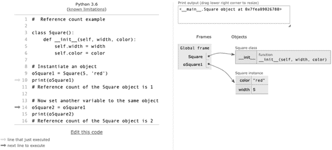
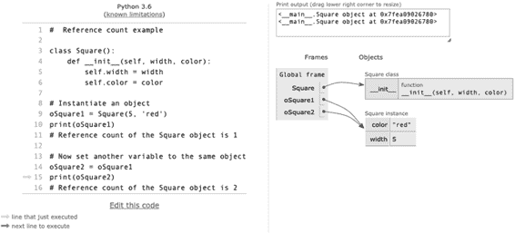
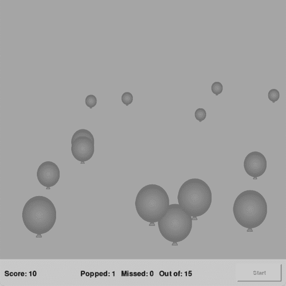
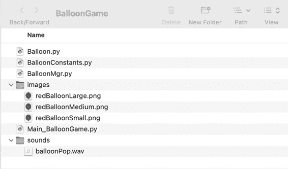
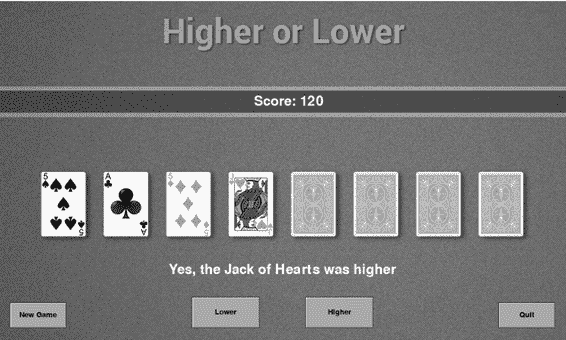
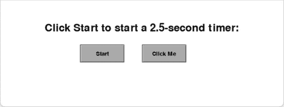
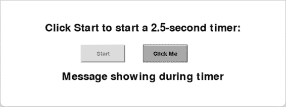
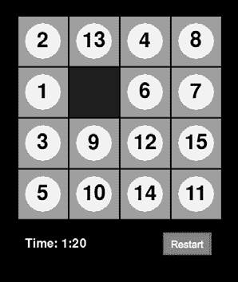

Python 和面向对象编程（OOP）的概念，例如

对象的生命周期（包括删除一个

对象）和类变量，不太适合

在本节的前几章中讨论过。将这一切

一起，我们将构建一个小型游戏。我还将介绍

插槽，这是对象的内存管理技术。

本章应能帮助你更好地理解

你的代码如何影响内存管理的方式

被对象使用。

**对象生命周期**

在第二章中，我定义了一个对象为“数据，加上对数据的操作代码，随着时间推移。”我已经讲了很多关于数据（实例变量）和

操作该数据的代码（方法），但我还没有详细解释过

时间方面。这将是我在这里关注的重点。

你已经知道，程序可以随时创建一个对象。

通常，程序会在启动时创建一个或多个对象，并使用这些

对象在其操作过程中不断使用。然而，在许多情况下，程序将

当程序需要时，想要创建一个对象，但在不需要时释放或删除该对象

使用完毕后释放对象所用资源（内存等）的方法

内存、文件、网络连接等资源）。以下是一些示例：

• 一个“交易”对象，在客户进行电子购买时使用

电子购买。当购买完成时，对象被

被销毁。

• 一个处理互联网通信的对象，在完成后被释放

当通信完成时。

• 游戏中的瞬态对象。程序可以实例化许多副本

恶棍、外星人、宇宙飞船等的系列；当玩家摧毁每一个

一旦不再使用，程序可以消除底层对象。

从对象实例化到销毁之间的时间段

被称为对象的*生命周期*。要理解对象的生命周期，首先需要了解一个相关的底层概念，涉及

Python 中对象的实现（以及一些其他面向对象语言）：对

引用计数。

***引用计数***

Python 有多种不同的实现方式。以下是

引用计数的讨论适用于由

Python 软件基金会——从*python.org*下载的版本

通常被称为*CPython*。Python 的其他实现可能

使用不同的方法。

Python 的哲学之一是程序员永远不应该

你无需担心管理内存的细节。Python 会处理这些

Python 如何管理内存的基本了解会对你有帮助

有助于理解对象何时以及如何被释放回

系统。

每当程序从类中实例化一个对象时，Python 会允许

创建内存以存储在类中定义的实例变量。

每个对象还包含一个额外的内部字段，称为*引用计数*，它跟踪有多少不同的变量引用该对象。

展示这个如何在清单 11-1 中工作\。

**242** 第十一章

**文件：ReferenceCount.py**

# 引用计数示例

1 class Square():

def __init__(self, width, color):

self.width = width

self.color = color

# 实例化一个对象

2 oSquare1 = Square(5, '红色')

print(oSquare1)

# Square 对象的引用计数是 1

# 现在设置另一个变量引用相同的对象

3 oSquare2 = oSquare1

print(oSquare2)

# Square 对象的引用计数为 2

*清单 11-1：一个简单的 Square 类，用于演示引用计数*

我们可以使用 Python Tutor（*http://pythontutor.com/*）逐步执行代码。我们从一个简单的 Square 类开始，类中包含几个实例变量。然后，我们实例化一个对象并将其赋值给变量 oSquare1 2\。

图 11-1 显示了我们在实例化第一个对象后的结果：如你所见

看，变量 oSquare1 引用的是 Square 类的一个实例。

*图 11-1：单个变量（oSquare1）引用一个对象*

接下来，我们设置第二个变量来引用相同的 Square 对象 3

并打印新变量的值。请注意，语句 oSquare2 =

oSquare1 并不会创建一个新的 Square 对象！图 11-2 显示了

执行这两行代码后的结果。

管理对象使用的内存 **243**

*图 11-2：两个变量引用相同的对象*

变量 oSquare1 和 oSquare2 都引用相同的 Square 对象。

你也可以在上面的框中看到，两次调用 print() 显示相同的

内存地址。因此，该对象的引用计数现在是 2。如果

如果我们给另一个变量赋值：

oSquare3 = oSquare2 # 或 oSquare1

引用计数将增加到 3（因为所有三个变量

会引用相同的对象，以此类推。

对象的引用计数很重要，因为当它达到

当引用计数降为零时，Python 会将相关内存标记为不再使用。

程序。这被称为 *被标记为垃圾*。Python 有一个垃圾回收机制，

清理器会运行以回收所有标记为垃圾的内存块。

垃圾；稍后我会在本章讨论它。

Python 标准库包含 getrefcount() 函数，

返回的值是引用该对象的变量数量。这里我们使用

可以查看首次实例化 Square 对象后的引用计数

来自 Square 类的：

oSquare1 = Square(5, '红色')

print('引用计数为', sys.getrefcount(oSquare1))

这会打印出 2 的计数。这可能让你感到惊讶——你可能预期

计数应该是 1。不过，正如该函数文档中所述：

函数解释道：“返回的计数通常比你预期的多一个。”

这是预期的，因为它包含了作为参数传递的（临时）引用。

getrefcount()。”

**244** 第十一章

**增加引用计数**

有几种方式可以增加一个对象的引用计数：

1\. 当给另一个变量赋值来引用相同的对象时：

oSquare2 = oSquare1

2\. 当一个对象被传递到函数中时，它会作为一个局部参数：

参数变量被设置为引用该对象：

def myFunctionOrMethod(oLocalSquareParam):

# oLocalSquareParam 现在引用了参数引用的对象

*<myFunctionOrMethod 函数体>*

myFunctionOrMethod(oSquare1) # 调用函数并传入对象

3\. 当一个对象被放入容器中，例如列表或字典时：

myList = [oSquare1, someValue, someOtherValue]

如果 oSquare1 已经引用了一个对象，执行这行代码后，列表

包含对同一个 Square 对象的额外引用。

**递减引用计数**

引用计数的递减也有几种方式。为了演示

演示这一点，我们创建一个对象并增加它的引用计数：

oSquare1 = Square(20, BLACK)

oSquare2 = oSquare1

myList = [oSquare1]

myFunctionOrMethod(oSquare1) # 调用函数并传入对象

当 myFunctionOrMethod() 开始时，引用对象会被复制

进入一个局部参数变量，供函数内部使用。引用

这个 Square 对象的引用计数目前为 4：两个对象变量，一个副本

在列表中，以及函数内的局部参数变量。这个引用

引用计数可以递减：

1\. 当任何引用对象的变量被重新赋值时。例如：

oSquare2 = 5

2\. 每当一个引用对象的局部变量超出作用域时。

当一个变量在函数或方法内创建时，它的作用域

该变量的作用域仅限于该函数或方法。当执行

管理对象所使用的内存 **245**

当前函数或方法的结束，那个变量会真的消失。在这个例子中，当 myFunctionOrMethod() 结束时，局部变量

引用该对象的变量被消除。

3\. 当一个对象从像列表、元组或字典这样的容器中移除时：

数组，例如这样：

myList.pop()

调用列表的 remove() 方法也会递减引用

引用计数。

4\. 当你使用 del 语句显式删除引用对象的变量时

指向对象。这消除了该变量并减少了引用

该对象的引用计数：

del oSquare3 # 删除该变量

5\. 如果对象容器（在这种情况下是 myList）的引用计数

引用计数降为零：

del myList # 当 myList 中的元素引用了一个对象时

如果你有一个引用对象的变量，并且你希望保持

变量，但失去对对象的引用，你可以执行一个语句

像下面这样：

oSquare1 = None

这保持了变量名，但降低了引用计数

对象。

**死亡通知**

当对象的引用计数降到零时，Python 知道该

对象可以安全地被删除。在销毁一个对象之前，Python 会调用

该对象有一个魔术方法 __del__()，用来通知对象其

即将到来的终结。

在任何类中，你都可以写一个自己的 __del__() 方法版本。

在你的版本中，你可以包含任何你希望对象执行的代码

（哈哈！这个词选择挺有意思的）在对象永远消失之前。为了

例如，你的对象可能需要关闭文件，关闭网络连接，

等等。

当对象被删除时，Python 会检查它的实例变量

变量引用其他对象。如果是这样，这些对象的引用计数

也会减少引用计数。如果这导致另一个对象的引用计数

当计数为零时，该对象也会被删除。此类型的链式或

*级联*删除可以深入多层，直到需要为止。示例 11-2

提供了一个示例。

**第 246 页** 第十一章

**文件：DeleteExample_Teacher_Student.py**

# 学生类

class 学生():

def __init__(self, name):

self.name = name

print('创建学生对象', self.name)

1 def __del__(self):

print('在学生的 __del__ 方法中:', self.name)

# 教师类

class 教师():

def __init__(self):

print('正在创建教师对象')

2 self.oStudent1 = 学生('Joe')

self.oStudent2 = 学生('Sue')

self.oStudent3 = 学生('Chris')

3 def __del__(self):

print('在教师的 __del__ 方法中')

# 实例化教师对象（创建学生对象）

4 oTeacher = 教师()

# 删除教师对象

5 del oTeacher

*示例 11-2：展示 __del__()方法的类*

这里我们有两个类，学生和教师。主要代码实例化—

创建了一个教师对象 4，其 __init__()方法创建了三个实例

学生类 2 中的对象，每个分别是 Joe、Sue 和 Chris。因此，在

启动时，教师对象有三个实例变量，它们是学生

对象。第一部分的输出为：

创建教师对象

创建学生对象 Joe

创建学生对象 Sue

正在创建学生对象 Chris

接下来，主要代码使用 del 语句删除教师

对象 5。由于我们在教师类 3 中编写了 __del__()方法，

教师*对象*的 __del__()方法被调用——为了演示目的，

仅打印一条消息。

当教师对象被删除时，Python 会看到它包含三个

其他对象（这三个学生对象）。因此，Python 降低了引用

将这些对象的计数从 1 递减到 0\。

一旦发生这种情况，学生对象的 __del__()方法就会被调用。

被调用 1，并且每个输出一条消息。所有三个对象使用的内存：

管理对象使用的内存 **247**

然后，学生对象会被标记为垃圾。程序结束时的输出是：

在教师的 __del__ 方法中

在学生的 __del__ 方法中：Joe

在学生的 __del__ 方法中：Sue

在学生的 __del__ 方法中：Chris

因为 Python 会跟踪所有对象的引用计数，你

在 Python 中，你几乎不需要担心内存管理

你通常不需要包括 __del__()方法。然而，你可能会考虑

使用 del 语句显式告诉 Python 删除使用该语句的对象。

如果你不再使用它们，可能会占用大量内存。对于

例如，你可能想删除一个加载大量记录的对象，

从数据库中加载记录，或者加载许多图像，当你不再使用它时。

此外，Python 不保证在调用 __del__() 方法时

程序退出时，你应该避免放置任何会影响程序结束的关键

代码在这个方法中。

***垃圾回收***

当一个对象被删除时，要么是引用计数归零

或者通过显式使用 del 语句，作为程序员你应该

考虑该对象不可访问。

然而，垃圾回收器的具体实现是复杂的

完全由 Python 决定。决定何时进行垃圾回收的算法细节

实际的垃圾回收代码是否运行对你作为程序员并不重要

作为程序员，它可能在你的程序实例化对象时运行，而 Python

需要分配内存，或者在随机时间，或者在某些计划的时刻

算法可能会从一个版本的 Python 变动到另一个版本。

无论是哪种情况，Python 会处理垃圾回收，你不需要

不用担心具体细节。

**类变量**

我已经广泛讲解了如何在类中定义实例变量

并且每个从类实例化的对象都有自己的一组所有

实例变量。前缀 self. 用于标识每个实例变量。

可用。然而，你也可以在类级别创建*类变量*。

**类变量**

由类定义和拥有的变量。每个类变量只有一个，无论创建多少个该类的实例。

你通过赋值语句创建类变量，这在约定上

这一部分代码放在类声明和第一个 def 语句之间，如下所示：

class MyDemoClass():

myClassVariable = 0 # 创建一个类变量并将其赋值为 0

**248** 第十一章

def __init__(self, *<otherParameters>* ):

# 这里是更多的代码

因为这个类变量是由类拥有的，在类的方法中

你将其称为 MyDemoClass.myClassVariable。每个实例化的对象

从类中获取对象可以访问该类中定义的所有类变量。

类变量有两个典型的用途：定义常量和

创建一个计数器。

***类变量常量***

你可以创建一个类变量作为常量，像这样：

class MyClass():

DEGREES_IN_CIRCLE = 360 # 创建一个类变量常量

要在类的方法中访问这个常量，你应该写

MyClass.DEGREES_IN_CIRCLE。

提醒一下，Python 实际上没有常量。相反，那里

在 Python 程序员中有一个约定：任何变量的名称

由所有大写字母组成，单词之间用下划线分隔，是一种

意味着应该将其视为常量。也就是说，这种类型的变量应该

永远不应重新赋值。

我们还可以使用类变量常量来节省资源（内存

而且是时间问题）。假设我们正在编写一个游戏，我们创建了很多实例

是一个 SpaceShip 类的实例。我们创建了一张飞船的图片并将文件放在

一个名为*images*的文件夹。在考虑类变量之前，__init__()

我们的 SpaceShip 类的方法会从实例化一个 Image 对象开始

如下所示：

class SpaceShip():

def __init__(self, window, ...):

self.image = pygwidgets.Image(window, (0, 0),

'images/ship.png')

这个技术工作得很好。然而，以这种方式编码意味着不是

每个从 SpaceShip 类实例化的对象都必须共享

加载图像的时间，但每个对象占用所有所需的内存

表示相同图像的副本。相反，我们可以让类加载图像

图像一次加载，然后每个 SpaceShip 对象使用该图像

类中，如下所示：

class SpaceShip():

SPACE_SHIP_IMAGE = pygame.image.load('images/ship.png')

def __init__(self, window, ...):

self.image = pygwidgets.Image(window, (0, 0),

SpaceShip.SPACE_SHIP_IMAGE)

一个图像对象（在 pygwidgets 中，如此处所用）可以使用一个路径

指向图像或已加载的图像。允许类加载

管理对象使用的内存 **249**

图像仅加载 *一次* 可以加速启动，并减少内存使用。

***用于计数的类变量***

使用类变量的第二种方式是跟踪已实例化的对象数量

已从类实例化的对象数。列出 11-3 显示了一个示例。

**文件：ClassVariable.py**

# Sample 类

class Sample():

1 nObjects = 0 # 这是 Sample 类的一个类变量

def __init__(self, name):

self.name = name

2 Sample.nObjects = Sample.nObjects + 1

def howManyObjects(self):

3 print('There are', Sample.nObjects, 'Sample objects')

def __del__(self):

4 Sample.nObjects = Sample.nObjects - 1

# 实例化 4 个对象

oSample1 = Sample('A')

oSample2 = Sample('B')

oSample3 = Sample('C')

oSample4 = Sample('D')

# 删除 1 个对象

del oSample3

# 看看我们有多少个

oSample1.howManyObjects()

*列出 11-3：使用类变量来计算从类实例化的对象数* 在 Sample 类中，nObjects 是一个类变量，因为它被定义

在类作用域内，通常位于类声明与第一个 def 之间

语句 1。它用于计算现存的 Sample 对象的数量

并且初始化为零。所有方法都通过该变量来引用

名称 Sample.nObjects。每当一个 Sample 对象被实例化时，计数

计数增加 2。当一个被删除时，计数减少 4。

howManyObjects() 方法报告当前计数 3。

主要代码创建了四个对象，然后删除了一个。运行时，这个

程序输出：

有 3 个 Sample 对象

**250** 第十一章

**将一切整合在一起：气球示例程序**

在本节中，我们将结合我们覆盖的多个概念

将它们组合在一起，形成一个相对简单的游戏——至少，从

用户的视角。游戏会展示一些气球

三种大小的气球会向上移动。用户的目标是打破

尽可能多地弹爆气球，直到它们浮到窗口的顶部。

小气球值 30 分，中等气球值 20 分，

大气球值 10 分。

游戏可以扩展，加入更多的关卡和更快移动的气球。

气球有多个，但目前只有一个关卡。大小和位置

每个气球的类型是随机选择的。在每一轮开始之前，会有一个开始按钮。

一旦玩家完成当前回合，系统会允许用户再次玩。图 11-3 是游戏运行中的截图。

游戏运行中的一张截图。

*图 11-3：气球游戏截图*

管理对象使用的内存 **251**

图 11-4 显示了游戏的项目文件夹。

*图 11-4：气球游戏项目文件夹*

该游戏由四个 Python 源文件实现：

***Main_BalloonGame.py*** 主代码，运行主循环

***BalloonMgr.py*** 包含了处理所有气球对象的 BalloonMgr 类

***Balloon.py*** 包含了 Balloon 类以及 BalloonSmall、BalloonMedium 和 BalloonLarge 子类

***BalloonConstants.py*** 包含多个文件使用的常量 图 11-5 显示了该实现的对象图。

主代码

气球管理器

气球

气球

气球

…

气球

*图 11-5：气球游戏的对象图*

主要代码（位于 *Main_BalloonGame.py*）实例化一个单独的

气球管理器（oBalloonMgr）对象来自 BalloonMgr 类。气球

**252** 第十一章

然后气球管理器实例化若干气球，每个气球从 BalloonSmall、BalloonMedium 和 BalloonLarge 类中随机选择，并保持这个

实例变量中的对象列表。每个气球对象设置自己的速度，

每个气球的点数和从窗口底部随机起始位置。

根据这种结构，主代码负责呈现总数。

所有用户界面。它只与 oBalloonMgr 进行通信。oBalloonMgr

与所有气球对象交互。因此，主代码甚至不知道

使气球对象存在。它依赖于气球管理器来处理

让我们一起走一遍程序的不同部分，看看它们是如何工作的。

每一部分是如何工作的。

***常量模块***

这个组织结构引入了一个新技术，用于处理多个模块之间的交互。

Python 文件，每个通常称为 *模块*。如果你发现自己处于多个 Python 模块需要访问

为了避免多个文件中都包含相同的常量，一个好的解决方案是创建一个常量模块。

导入该模块到所有使用这些常量的模块中。列表 11-4

显示了一些在 *BalloonConstants.py* 中定义的常量。

**文件：BalloonGame/BalloonConstants.py**

# 多个 Python 模块共享的常量

N_BALLOONS = 15 # 一轮游戏中的气球数量

BALLOON_MISSED = '错过' # 气球飞出了顶部

BALLOON_MOVING = '气球移动中' # 气球正在移动

*列表 11-4：一个被其他模块导入的常量模块*

这只是一个简单的 Python 文件，包含了多个 Python 文件共享的常量。

比一个模块更多。主代码需要知道有多少个气球。

是为了显示该数字。气球管理器需要知道

数字，以便可以实例化正确数量的气球对象。

这种方法使得修改气球数量变得非常简单

对象。如果我们增加不同气球数量的关卡，我们可以

只在这个文件中构建一个列表或字典，其他所有文件都会

获取这些信息。

其他两个常量在每个气球对象中作为状态指示符使用。

tors 随着气球向上移动窗口。我在讨论

游戏过程中，你会看到气球管理器（oBalloonMgr）向每个

气球对象的状态，每个都以这两种方式之一做出响应——

常量。将共享常量放在模块中，并导入该模块

在使用常量的模块中，这是一个简单且有效的技巧

确保程序的不同部分使用一致的值。这是一个

是应用“不要重复自己”（DRY）原则的一个好例子

只在一个地方定义值。

管理对象占用的内存 **253**

***主程序代码***

我们示例程序的主代码，如第 11-5 行所示，遵循了

我在本书中使用的 12 步模板。它显示了用户的分数，

游戏状态，并在窗口底部有一个开始按钮，它

对用户点击开始按钮的响应。

**文件：BalloonGame/Main_BalloonGame.py**

# 气球游戏主代码

# 1 - 导入包

from pygame.locals import *

import pygwidgets

import sys

import pygame

from BalloonMgr import *

# 2 - 定义常量

BLACK = (0, 0, 0)

GRAY = (200, 200, 200)

BACKGROUND_COLOR = (0, 180, 180)

WINDOW_WIDTH = 640

WINDOW_HEIGHT = 640

PANEL_HEIGHT = 60

USABLE_WINDOW_HEIGHT = WINDOW_HEIGHT - PANEL_HEIGHT

FRAMES_PER_SECOND = 30

# 3 - 初始化世界

pygame.init()

window = pygame.display.set_mode((WINDOW_WIDTH, WINDOW_HEIGHT))

clock = pygame.time.Clock()

# 4 - 加载资源：图像、声音等

oScoreDisplay = pygwidgets.DisplayText(window, (10, USABLE_WINDOW_HEIGHT + 25),

'得分: 0', textColor=BLACK,

backgroundColor=None, width=140, fontSize=24)

oStatusDisplay = pygwidgets.DisplayText(window, (180, USABLE_WINDOW_HEIGHT + 25),

'', textColor=BLACK, backgroundColor=None,

width=300, fontSize=24)

oStartButton = pygwidgets.TextButton(window,

(WINDOW_WIDTH - 110, USABLE_WINDOW_HEIGHT + 10),

'开始')

# 5 - 初始化变量

oBalloonMgr = BalloonMgr(window, WINDOW_WIDTH, USABLE_WINDOW_HEIGHT)

playing = False 1 # 等待用户点击开始

# 6 - 无限循环

while True:

# 7 - 检查并处理事件

nPointsEarned = 0

for event in pygame.event.get():

**254** 第十一章

if event.type == pygame.QUIT:

pygame.quit()

sys.exit()

if playing: 2

oBalloonMgr.handleEvent(event)

theScore = oBalloonMgr.getScore()

oScoreDisplay.setValue('得分: ' + str(theScore))

elif oStartButton.handleEvent(event): 3

oBalloonMgr.start()

oScoreDisplay.setValue('得分: 0')

playing = True

oStartButton.disable()

# 8 - 执行任何“每帧”操作

if playing: 4

oBalloonMgr.update()

nPopped = oBalloonMgr.getCountPopped()

nMissed = oBalloonMgr.getCountMissed()

oStatusDisplay.setValue('已爆炸: ' + str(nPopped) +

' 弹破气球数: ' + str(nMissed) +

' 剩余气球数: ' + str(N_BALLOONS))

如果 (nPopped + nMissed) == N_BALLOONS: 5

playing = False

oStartButton.enable()

# 9 - 清空窗口

window.fill(BACKGROUND_COLOR)

# 10 - 绘制所有窗口元素

如果 playing: 6

oBalloonMgr.draw()

pygame.draw.rect(window, GRAY, pygame.Rect(0,

USABLE_WINDOW_HEIGHT, WINDOW_WIDTH, PANEL_HEIGHT))

oScoreDisplay.draw()

oStatusDisplay.draw()

oStartButton.draw()

# 11 - 更新窗口

pygame.display.update()

# 12 - 稍微减慢速度

clock.tick(FRAMES_PER_SECOND) # 使 pygame 等待

*列出 11-5: 气球游戏的主代码*

代码基于一个布尔变量 playing，初始值为 False

默认让用户按下开始按钮来开始游戏 1\。

当 playing 为 True 时，主代码调用 handleEvent() 方法 2

在气球管理器的 oBalloonMgr 中处理所有事件。我们调用气球管理器

使用气球管理器的 getScore() 方法获取分数，并更新分数

字段的文本。

管理对象使用的内存 **255**

当游戏结束时，程序等待用户按下开始按钮 3\. 按下按钮时，气球管理器开始工作

游戏结束时，用户界面会更新。

在每一帧，如果游戏正在运行，我们发送 update() 消息

向气球管理器发送更新消息 4，触发它将 update() 消息传递给

所有气球。然后我们询问气球管理器气球的数量

剩余气球和已弹破的气球。我们使用这些信息来更新

用户界面。

当用户弹破所有气球或最后一个气球漂浮到顶部时

当窗口关闭时，我们将 playing 变量设置为 False，并启用开始按钮

按钮 5\。

绘制代码非常简单 6\. 我们告诉气球管理器

使气球绘制，触发所有气球自行绘制。然后我们

绘制底部栏，显示状态数据和开始按钮。

***气球管理器***

气球管理器负责跟踪所有气球， 

包括创建 Balloon 对象，告诉每个对象绘制自己，告诉每个对象移动， 

并使每个气球移动，跟踪弹破和错过的数量。

Listing 11-6 包含了 BalloonMgr 类的代码。

**文件：BalloonGame/BalloonMgr.py**

# BalloonMgr 类

import pygame

import random

从 pygame.locals 导入 *

import pygwidgets

从 BalloonConstants 导入 *

从 Balloon 导入 *

# 气球管理器管理一个气球对象列表

class BalloonMgr():

1 def __init__(self, window, maxWidth, maxHeight):

self.window = window

self.maxWidth = maxWidth

self.maxHeight = maxHeight

2 def start(self):

self.balloonList = []

self.nPopped = 0

self.nMissed = 0

3 对于 balloonNum 在 0 到 N_BALLOONS 范围内：

randomBalloonClass = random.choice((BalloonSmall,

BalloonMedium,

BalloonLarge))

oBalloon = randomBalloonClass(self.window, self.maxWidth,

self.maxHeight, balloonNum)

**256** 第十一章

self.balloonList.append(oBalloon)

def handleEvent(self, event):

4 如果 event.type == MOUSEBUTTONDOWN：

# 以“反向”方式进行，这样最上面的气球会先被弹破

for oBalloon in reversed(self.balloonList):

wasHit, nPoints = oBalloon.clickedInside(event.pos)

如果 wasHit:

如果 nPoints > 0: # 移除这个气球

self.balloonList.remove(oBalloon)

self.nPopped = self.nPopped + 1

self.score = self.score + nPoints

return # 无需检查其他内容

5 def update(self):

for oBalloon in self.balloonList:

status = oBalloon.update()

如果 status == BALLOON_MISSED:

# 气球从顶部飞出时，移除它

self.balloonList.remove(oBalloon)

self.nMissed = self.nMissed + 1

6 def getScore(self):

return self.score

7 def getCountPopped(self):

return self.nPopped

8 def getCountMissed(self):

return self.nMissed

9 def draw(self):

for oBalloon in self.balloonList:

oBalloon.draw()

*Listing 11-6: 气球管理器类*

当实例化时，气球管理器会被告知窗口的宽度和高度

窗口 1，并将此信息保存在实例变量中。

start()方法 2 背后的概念非常重要。它的目的是

目的是初始化一轮游戏所需的任何实例变量，

所以它会在用户开始一轮游戏时被调用。在这个游戏中，

start()重置已爆气球和漏气球的计数——

气球。然后，它会通过一个循环创建所有气球对象（随机

随机从三种不同的尺寸中选择，使用三种不同的类）

并将它们存储在一个列表中 3。当该方法创建一个气球对象时，

它传递窗口以及窗口的宽度和高度。（为了未来

扩展，每个气球对象都被赋予一个唯一的编号。）

每次通过主循环时，主代码都会调用 handleEvent()

气球管理器的方法 4。在这里，我们检查用户是否已点击

在任何气球上。如果检测到的事件是 MOUSEDOWNEVENT，代码将循环

遍历所有气球对象，询问每个气球点击是否发生在内部

该气球。每个气球返回一个布尔值，表示它是否被击中，如果

管理对象使用的内存 **257**

所以，这是用户应该因打爆它而获得的积分。（代码是这样设置的，方便未来扩展，正如文末的说明所提到的那样）

部分。）然后，气球管理器使用 remove()方法将其消除

从列表中移除该气球，增加已爆炸气球的数量，并

更新分数。

在主循环的每次迭代中，主代码还会调用 update()

气球管理器的方法 5，将此调用传递给所有

气球，告诉它们更新自己。每个气球向上移动

根据自身的速度设置更新屏幕，并返回其状态：即它是否

仍在移动（BALLOON_MOVING），或者它已经移动到窗口顶部之外——

dow (BALLOON_MISSED)。如果气球被漏掉，气球管理器将移除

从列表中移除该气球并增加漏气球的数量。

气球管理器提供了三个 getter 方法，允许

主代码获取分数 6、被打爆的气球数量 7，以及

漏掉气球的数量 8\。

每次通过主循环时，主代码都会调用气球

管理器的 draw()方法 9. 气球管理器没有任何东西

由自身绘制，但会遍历所有 Balloon 对象并调用 draw()

每个的 method。（注意这里的多态性。气球管理器有

每个气球对象都有一个 draw()方法。)

**注意**

*作为挑战，尝试扩展此游戏，添加一种新的气球类型（子类），如* *MegaBalloon。不同之处在于，MegaBalloon 需要三次点击才能爆炸。游戏的* *艺术作品包含在下载文件中。*

***气球类和对象***

最后，我们有了气球类。为了强化继承的概念

来自第十章的内容，Balloon.py 模块包括一个抽象基类 Balloon 和三个子类：BalloonSmall、BalloonMedium 和

BalloonLarge。气球管理器从这些子类实例化 Balloon 对象

子类。每个子类仅包含一个 __init__()方法，定义

重写并调用抽象方法 __init__()在 Balloon

class。每个气球图像将从某个随机位置开始（位于

窗口的底部）并且会在每一帧中向上移动几个像素。

列表 11-7 展示了 Balloon 类及其子类的代码。

**文件：BalloonGame/Balloon.py**

# Balloon 基类和 3 个子类

import pygame

import random

from pygame.locals import *

import pygwidgets

from BalloonConstants import *

from abc import ABC, abstractmethod

**258** 第十一章

1 class Balloon(ABC):

popSoundLoaded = False

popSound = None  # 在第一个气球创建时加载

@abstractmethod

2 def __init__(self, window, maxWidth, maxHeight, ID,

oImage、大小、nPoints、speedY）：

self.window = window

self.ID = ID

self.balloonImage = oImage

self.size = size

self.nPoints = nPoints

self.speedY = speedY

if not Balloon.popSoundLoaded:  # 仅首次加载

Balloon.popSoundLoaded = True

Balloon.popSound = pygame.mixer.Sound('sounds/balloonPop.wav')

balloonRect = self.balloonImage.getRect()

self.width = balloonRect.width

self.height = balloonRect.height

# 位置，使气球位于窗口宽度内，

# 但位于底部以下

self.x = random.randrange(maxWidth - self.width)

self.y = maxHeight + random.randrange(75)

self.balloonImage.setLoc((self.x, self.y))

3 def clickedInside(self, mousePoint):

myRect = pygame.Rect(self.x, self.y, self.width, self.height)

if myRect.collidepoint(mousePoint):

Balloon.popSound.play()

return True, self.nPoints  # True 表示已被点击

否则：

return False, 0  # 没有碰撞，没有得分

4 def update(self):

self.y = self.y - self.speedY  # 按照速度更新 y 位置

self.balloonImage.setLoc((self.x, self.y))

if self.y < -self.height:  # 离开窗口顶部

return BALLOON_MISSED

否则：

return BALLOON_MOVING

5 def draw(self):

self.balloonImage.draw()

6 def __del__(self):

print(self.size, '气球', self.ID, '正在离开')

7 class BalloonSmall(Balloon):

balloonImage = pygame.image.load('images/redBalloonSmall.png')

def __init__(self, window, maxWidth, maxHeight, ID):

oImage = pygwidgets.Image(window, (0, 0),

BalloonSmall.balloonImage)

管理对象使用的内存 **259**

super().__init__(window, maxWidth, maxHeight, ID,

oImage, 'Small', 30, 3.1)

8 class BalloonMedium(Balloon):

balloonImage = pygame.image.load('images/redBalloonMedium.png')

def __init__(self, window, maxWidth, maxHeight, ID):

oImage = pygwidgets.Image(window, (0, 0),

BalloonMedium.balloonImage)

super().__init__(window, maxWidth, maxHeight, ID,

oImage, 'Medium', 20, 2.2)

9 class BalloonLarge(Balloon):

balloonImage = pygame.image.load('images/redBalloonLarge.png')

def __init__(self, window, maxWidth, maxHeight, ID):

oImage = pygwidgets.Image(window, (0, 0),

BalloonLarge.balloonImage)

super().__init__(window, maxWidth, maxHeight, ID,

oImage, 'Large', 10, 1.5)

*示例 11-7: 气球类*

气球类是一个抽象类 1，因此 BalloonMgr 会实例化。

随机生成对象（BalloonSmall 7、BalloonMedium 8 和

BalloonLarge 9 类。每个类都会创建一个 pygwidgets 图像对象。

然后调用气球基类中的 `__init__()` 方法。我们通过

使用气球的图像、大小、数量等参数。

分数和速度。

`__init__()` 方法在气球类 2 中存储信息。

获取每个气球的矩形信息。

会记住气球的图像以及其宽度和高度。我们设置一个随机化的

水平位置会确保气球图像完全显示。

在窗口内。

每当发生 MOUSEDOWNEVENT 事件时，气球管理器会循环。

遍历气球对象并调用每个 3\ 的 `clickedInside()` 方法。

这里的代码检查检测到的 MOUSEDOWNEVENT 是否发生在当前气球内。

如果发生了，它会播放爆炸音效。

并返回一个布尔值，表示气球是否被点击，以及点击的次数。

气球所值的分数。如果没有被点击，则返回 False 和零。

在每一帧中，气球管理器会调用每个气球的 `update()` 方法。

气球 4，它通过减去自身的 y 坐标来更新气球的 y 位置。

速度，以便使气球更高地移动到窗口中。改变位置后，

`update()` 方法返回 BALLOON_MISSED（如果气球已完全移出窗口顶部）或 BALLOON_MOVING（表示气球仍在游戏中）。

如果气球已完全移出窗口顶部，返回 BALLOON_MISSED，否则返回 BALLOON_MOVING（表示气球仍在播放）。

`draw()` 方法简单地在合适的位置绘制气球的图像。

合适的 (x, y) 位置 5\。虽然 y 坐标保持为浮动小数。

数值，pygame 会自动将其转换为整数，用于像素位置的放置。

在窗口内。

最后的方法 `__del__()` 6 被添加用于调试和未来开发。

每当气球管理器删除一个气球时，

当该气球对象被删除时，会调用 `__del__()` 方法。此方法用于演示。

**260** 第十一章

目前仅用于打印显示气球的大小和 ID 号码的消息。

当程序运行并且用户开始点击气球时，

我们在 shell 或控制台窗口中看到类似这样的输出：

小气球 2 正在消失

小气球 8 正在消失

小气球 3 正在消失

小气球 7 正在消失

小气球 9 正在消失

小气球 12 正在消失

小气球 11 正在消失

小气球 6 正在消失

中气球 14 正在消失

大气球 1 正在消失

中气球 10 正在消失

中气球 13 正在消失

中气球 0 正在消失

中气球 4 正在消失

大气球 5 正在消失

当游戏结束时，程序等待用户点击

开始按钮。当按钮被点击时，气球管理器重新创建

气球对象的列表重置其实例变量，游戏

再次开始。

**内存管理：插槽**

如我们所讨论的，当你实例化一个对象时，Python 必须分配

用于类中定义的实例变量的空间。默认情况下，Python 会

这通过一个特殊名称的字典实现：__dict__。要查看其作用，

你可以在任何类的 __init__() 方法末尾添加这一行：

print(self.__dict__)

字典是表示所有实例变量的绝佳方式

字典是动态的——它可以在 Python 遇到新的实例变量时增长

每当 Python 遇到一个在类中未见过的实例变量时，都会动态添加。虽然我推荐

你需要确保在 __init__() 方法中初始化所有实例变量，确保

事实上，你可以在任何方法中定义实例变量，并且这些实例变量

执行方法时，新的实例变量会被添加到字典中。虽然

我个人认为下面的做法不太好，它展示了对

动态地为对象添加实例变量：

myObject = MyClass()

myObject.someInstanceVariable = 5

为了允许这种动态功能，字典通常

实现时从足够的空白空间开始，以表示一些数量的实例变量

实例变量的列表（确切数量是 Python 的内部细节）。

管理对象使用的内存 **261**

每当遇到新的实例变量时，它会被添加到字典中。如果字典空间不足，Python 会增加更多空间。通常情况下，

这种做法是可行的，而且程序员通常不会遇到问题

实现。

然而，假设你有一个如下所示的类，其中包含两个实例

在 __init__() 方法中创建的变量，并且你知道你不会

不需要再添加任何实例变量：

class Point():

def __init__(self, x, y):

self.x = x

self.y = y

# 更多方法

现在，假设你需要实例化大量的对象

（成百上千，甚至百万）个该类的对象。一个例子

像这样的方法可能会累计占用大量浪费的内存

空间（内存）的需求。

为了应对这种潜在的浪费，Python 给我们提供了不同的方法，

被称为*槽（slots）*，用于表示实例变量。这个想法是你可以提前告诉 Python 所有实例变量的名称，然后 Python

将使用一种数据结构，仅为这些

实例变量。要使用槽（slots），你需要包含特殊的类变量。

可以使用 __slots__ 来定义一个变量列表：

__slots__ = [ *<instanceVar1>* , *<instanceVar2>* , ... *<instanceVarN>* ]

这是我们示例类修改版的样子：

类 PointWithSlots():

# 为两个实例变量定义槽

__slots__ = ['x', 'y']

def __init__(self, x, y):

self.x = x

self.y = y

print(x, y)

这两个类将以相同的方式工作，但从

PointWithSlots 将占用显著更少的内存。为了演示

为了演示区别，我们将在两个 __init__()方法的末尾添加这一行

类：

# 尝试创建一个额外的实例变量

self.color = 'black'

现在，当我们尝试从这两个类实例化一个对象时，

Point 类没有问题可以添加另一个实例变量，但

PointWithSlots 类会因以下错误而失败：

AttributeError: 'PointWithSlots'对象没有属性'color'

**262** 第十一章

使用槽（slots）在牺牲动态实例变量的情况下，具有非常高的内存效率。如果你处理的是大量的

从类中创建对象时，这种权衡可能是值得的。

**总结**

本章重点讨论了一些在之前章节中没有直接涉及的概念。

各个章节。首先，我讨论了在什么情况下你可能会遇到

想要删除一个对象时。我们查看了引用计数及其如何追踪

多少变量引用同一个对象，这引发了对

对象生命周期和垃圾回收。当引用计数为零时，

当引用计数为零时，该对象可以被垃圾回收。如果类有 __del__()

方法，那么从该类创建的任何对象都可以使用 __del__()

方法来处理它们可能想要进行的任何清理工作。

接下来，我讨论了类变量与实例变量的区别。

变量。每个从类实例化的对象都会获得自己的一套所有

类中的实例变量。然而，每个类中只有一个

变量，这对从类创建的所有对象都是可访问的。类

变量通常用作常量、计数器，或用于加载某些内容。

大小并将其提供给所有从该类实例化的对象。

为了将多种技巧和概念结合起来，我们构建了一个

气球爆炸游戏，并且组织得非常高效。我们有一个文件

仅包含其他文件使用的常量的那个文件。主代码由

主要循环和状态显示组成，而气球管理器

负责管理对象的工作。这种分工方式允许

将游戏分成更小的、逻辑清晰的部分。每一部分的角色是

明确的定义，使整个程序更易于管理。

最后，我解释了一种名为插槽的技术，允许实现内存

实例变量的高效表示方式。

管理对象使用的内存 **263**

**第四部分**

**使用面向对象的游戏**

**开发**

在本书的这一部分，我们将构建一些示例

使用 pygwidgets 构建游戏。我还会介绍 pyghelpers

模块，包括许多类和函数。

可以在构建游戏程序时非常有用的类和函数。

第十二章 re 回顾了第一章中的高低游戏。我们将构建一个带有图形用户界面的游戏版本，并介绍可以在任何卡牌游戏程序中重用的 Deck 和 Card 类。

第十三章 f 聚焦于定时器。我们将构建多个不同的定时器类，允许你的程序在运行的同时并发地检查时间限制。

第十四章 d 讨论了不同的动画类，可以用来显示图像序列。这将使你能够轻松构建更具艺术感的游戏。

和程序。

第十五章 i 介绍了一种构建可以包含多个场景的方法，比如开始场景、游戏场景和游戏结束场景。我将

显示一个 SceneMgr 类，用于管理程序中的任意数量的场景。

构建的场景，并将使用它来构建一个石头、剪刀、布游戏。

第十六章 d 演示了如何显示并响应不同类型的对话框。然后你将使用所学内容来构建一个完全功能的动画游戏。

第十七章 i 介绍了设计模式的概念，以模型-视图-控制器模式为例。然后简要总结

本书的内容。

**12**

**扑克牌游戏**

在本书的剩余章节中，

我们将使用 pygame 和 pygwidgets 构建一些演示程序。

pygame 和 pygwidgets。每个程序将

展示一个或多个可重用的类，并展示

如何在示例项目中使用这些类。

第一章，我介绍了一个基于文本的高低游戏。在这一章中，我们将创建游戏的 GUI 版本，如图 12-1 所示。

快速回顾游戏规则：我们从七张牌开始，牌面朝下

和一张翻面的牌。玩家猜测下一张牌是否

翻转的牌比上一张可见牌大或小，玩家按下按钮来判断。

高低游戏结束时，用户可以点击“新游戏”按钮来

开始新一轮游戏。玩家从 100 分开始，答对得 15 分，答错扣 10 分。

玩家答对得 15 分，答错扣 10 分。

*图 12-1：高低游戏的用户界面*

**Card 类**

在原始的基于文本的游戏版本中，处理牌堆的代码

这副扑克牌无法在其他项目中轻松重用。为了解决这个问题，

为了解决这个问题，我们将在这里创建一个高度可重用的 Deck 类，用于管理来自一副扑克牌的牌。

Card 类。

为了在 pygame 中表示一张牌，我们需要存储以下数据：

每个卡片对象的实例变量：

• 牌面（ace, 2, 3, … 10, jack, queen, king）

• 花色（梅花、红心、方块、黑桃）

• 值（1, 2, 3, … 12, 13）

• 名称（使用牌面和花色来构建：例如，梅花 7）

• 卡片的背面图像（所有卡片对象共享的单一图像）

• 牌的正面图像（每个卡片对象的独特图像）

每张卡片必须能够执行以下行为，具体行为包括

我们将创建以下方法：

• 将其标记为隐藏（背面朝上）

• 将其标记为已揭示（正面朝上）

• 返回其名称

• 返回其值

• 设置并获取其在窗口中的位置

• 绘制自身（显示的图片或隐藏的图片）

**268** 第十二章

尽管以下卡片行为在“高低游戏”中没有使用，但我们也将它们添加到这里，以备在其他游戏中需要时使用：

• 返回其牌面

• 返回其花色

Listing 12-1 显示了 Card 类的代码。

**文件：HigherOrLower/Card.py**

# Card 类

import pygame

import pygwidgets

class Card():

1 BACK_OF_CARD_IMAGE = pygame.image.load('images/BackOfCard.png')

2 def __init__(self, window, rank, suit, value):

self.window = window

self.rank = rank

self.suit = suit

self.cardName = rank + ' of ' + suit

self.value = value

3 fileName = 'images/' + self.cardName + '.png'

# 设置一些起始位置；使用 setLoc 方法更改

4 self.images = pygwidgets.ImageCollection(window, (0, 0),

{'front': fileName,

'back': Card.BACK_OF_CARD_IMAGE}, 'back')

5 def conceal(self):

self.images.replace('back')

6 def reveal(self):

self.images.replace('front')

7 def getName(self):

return self.cardName

def getValue(self):

return self.value

def getSuit(self):

return self.suit

def getRank(self):

return self.rank

8 def setLoc(self, loc): # 调用 ImageCollection 的 setLoc 方法

self.images.setLoc(loc)

卡片游戏 **269**

9 def getLoc(self): # 从 ImageCollection 获取位置 loc = self.images.getLoc()

return loc

a def draw(self):

self.images.draw()

*Listing 12-1: Card 类*

Card 类假设所有 52 张卡片的图像文件，以及一张

所有卡片背面的图像都存储在一个名为 *images* 的文件夹中，该文件夹位于项目文件夹内。如果你下载了与本章相关的文件，

你会看到 *images* 文件夹包含了完整的 . *png* 文件集。这些文件可以通过我的 GitHub 仓库访问 [*https://github.com/IrvKalb/*](https://github.com/IrvKalb/Object-Oriented-Python-Code/)

[*Object-Oriented-Python-Code*](https://github.com/IrvKalb/Object-Oriented-Python-Code/) */*。

该类只加载卡片背面的图像一次，并将其保存在一个

类变量 1。该图片对所有卡片对象都是可用的。

每次为每张卡片调用时，__init__() 方法首先存储

窗口；构建并存储卡片的名称；并存储其

rank、value 和 suit 作为实例变量。然后构建文件的路径

在*images*文件夹中，包含该特定卡片 3 的图像。对于

例如，如果等级是 ace 且花色是黑桃，我们构建一个路径，存放在*images/*

*Ace of Spades.png*。我们使用一个 ImageCollection 对象来记住这些路径

用于正面和背面图像 4；我们会使用'back'来表示我们希望

显示卡片的背面作为起始图像。

conceal()方法 5 告诉 ImageCollection 将卡片背面设置为

作为当前图像。reveal()方法 6 告诉 ImageCollection 设置

将卡片的正面作为当前图像。

getName()、getValue()、getSuit()和 getRank()方法 7 是 getter

允许调用者获取卡片的名称、值、花色和等级的方法

给定的卡片。

setLoc()方法为卡片 8 设置新位置，getLoc()

检索当前的位置 9。位置保存在 ImageCollection 中。

最后，draw()在窗口中绘制卡片的图像。更具体地说

更具体地说，它告诉 ImageCollection 在当前指示的位置绘制图像

记住的位置。

**Deck 类**

Deck 对象是对象管理器对象的经典示例。它的工作是

创建并管理 52 张卡片对象。清单 12-2 包含我们的代码

Deck 类。

**文件：HigerOrLower/Deck.py**

# Deck 类

import random

from Card import *

**270** 第十二章

class Deck():

1 SUIT_TUPLE = ('Diamonds', 'Clubs', 'Hearts', 'Spades')

# 这个字典将每个卡片的等级映射到一个标准牌组的值

STANDARD_DICT = {'Ace':1, '2':2, '3':3, '4':4, '5':5,

'6':6, '7':7, '8': 8, '9':9, '10':10,

'Jack':11, 'Queen':12, 'King':13}

2 def __init__(self, window, rankValueDict=STANDARD_DICT):

# rankValueDict 默认为 STANDARD_DICT，但你可以调用它

# 使用一个不同的字典，例如，适用于二十一点的特殊字典

self.startingDeckList = []

self.playingDeckList = []

对于每个花色，在 Deck.SUIT_TUPLE 中：

3 对于 rank, value 在 rankValueDict.items()中：

oCard = Card(window, rank, suit, value)

self.startingDeckList.append(oCard)

self.shuffle()

4 def shuffle(self):

# 复制起始牌组并将其保存在游戏牌组列表中

self.playingDeckList = self.startingDeckList.copy()

对于 self.playingDeckList 中的每个 oCard：

oCard.conceal()

random.shuffle(self.playingDeckList)

5 def getCard(self):

如果 self.playingDeckList 的长度为 0：

raise IndexError('没有更多的卡片')

# 从牌组中弹出一张卡片并返回

oCard = self.playingDeckList.pop()

return oCard

6 def returnCardToDeck(self, oCard):

# 将一张卡片放回牌组

self.deckList.insert(0, oCard)

*清单 12-2：一个管理 52 张卡片对象的 Deck 类*

我们通过创建一些类变量 1 来开始 Deck 类，这些变量将

使用来创建 52 张具有正确花色和值的卡片。只有四种

方法。

对 __init__()方法 2，我们传递了一个窗口的引用和一个

可选的字典，将卡片的等级映射到它们的值。如果没有传递

在这里，我们使用一个字典来表示标准的牌组值。我们构建一副牌

52 张卡片，保存在 self.startingDeckList 中，通过遍历所有花色，

然后遍历所有卡片的等级和值。在内层的 for 循环 3 中，

我们使用字典的 items()方法调用，它允许我们轻松

通常可以在一个语句中轻松获取键和值（在这里是等级和值）。

每次进入内循环时，我们实例化一个 Card 对象，并传入

新卡片的等级、花色和数值。我们将每个 Card 对象附加到

列表 self.startingDeckList 来创建一副完整的卡组。

卡牌游戏 **271**

最后一步是调用 shuffle()方法 4 来随机化

卡组。这个方法的目的似乎很明显：洗牌。

但是，它做了一些额外的小技巧。__init__()方法构建了

self.startingDeckList，并且这项工作应该只做一次。所以，当

每次洗牌时，我们不会重新创建所有的 Card 对象，而是

创建初始卡组列表的副本，保存在 self.playingDeckList 中，并

洗牌。复制的是将被用作游戏中操作的卡组。

运行时。通过这种方法，我们可以从 self.playingDeckList 中移除卡片

然后不必担心稍后将它们重新添加回卡组或重新加载-

交换卡片。两个列表 self.startingDeckList 和 self.playingDeckList 共享

引用相同的 52 个 Card 对象。

注意，当我们在游戏的后续运行中调用 shuffle()时，一些

Card 对象的状态可能是“已揭示”状态。所以，在继续之前，我们

遍历整个卡组并在每张卡片上调用 conceal()方法，

使所有的卡片初始时都显示为面朝下。shuffle()方法通过

通过使用 random.shuffle()随机化卡组，洗牌操作完成。

getCard()方法 5 从卡组中获取一张卡片。它首先检查

以查看卡组是否为空，如果是，则引发异常。否则，既然

如果卡组已经洗牌，它会从卡组中弹出一张卡片并返回该

返回卡片给调用者。

Deck 和 Card 一起提供了一个高度可复用的类组合。

可用于大多数卡牌游戏的卡片。高低游戏仅使用

每回合抽取八张卡片，并在每轮开始时洗牌整副卡组。

游戏。因此，在这个游戏中，Deck 对象不可能会用尽

卡片。对于一款需要知道卡组是否用尽的卡牌游戏，

卡片时，你可以在调用 getCard()时构建一个 try 块，并使用 except

使用 try-except 语句来捕获异常。如何处理异常由你决定。

尽管在这个游戏中没有使用，returnCardToDeck()方法 6 允许

让你将卡片放回卡组。

**高低游戏**

实际游戏的代码相当简单：主代码实现了

主循环，而 Game 对象包含游戏逻辑本身。

***主程序***

列表 12-3 是设置游戏世界并包含主要程序的代码。

主循环。它还创建了一个 Game 对象来运行游戏。

**文件：HigherOrLower/Main_HigherOrLower.py**

# 高低游戏 - pygame 版本

# 主程序

--- 剪切 ---

# 4 - 加载资源：图像、音效等。

1 background = pygwidgets.Image(window, (0, 0),

**272** 第十二章

'images/background.png')

newGameButton = pygwidgets.TextButton(window, (20, 530),

'New Game', width=100, height=45)

higherButton = pygwidgets.TextButton(window, (540, 520),

'Higher', width=120, height=55)

lowerButton = pygwidgets.TextButton(window, (340, 520),

'Lower', width=120, height=55)

quitButton = pygwidgets.TextButton(window, (880, 530),

'Quit', width=100, height=45)

# 5 - 初始化变量

2 oGame = Game(window)

# 6 - 永远循环

while True:

# 7 - 检查并处理事件

for event in pygame.event.get():

如果((event.type == QUIT) 或者

((event.type == KEYDOWN) and (event.key == K_ESCAPE)) or

(quitButton.handleEvent(event))):

pygame.quit()

sys.exit()

3 如果 newGameButton.handleEvent(event):

oGame.reset()

lowerButton.enable()

higherButton.enable()

如果 higherButton.handleEvent(event):

gameOver = oGame.hitHigherOrLower(HIGHER)

如果 gameOver:

higherButton.disable()

lowerButton.disable()

如果 lowerButton.handleEvent(event):

gameOver = oGame.hitHigherOrLower(LOWER)

如果 gameOver:

higherButton.disable()

lowerButton.disable()

# 8 - 执行任何“每帧”操作

# 9 - 在重新绘制之前清除窗口

4 background.draw()

# 10 - 绘制窗口元素

# 告诉游戏绘制自身

5 oGame.draw()

# 绘制剩余的用户界面组件

newGameButton.draw()

higherButton.draw()

lowerButton.draw()

quitButton.draw()

Card Games **273**

# 11 - 更新窗口

pygame.display.update()

# 12 - 稍微放慢一下

clock.tick(FRAMES_PER_SECOND)

*列表 12-3：Higher or Lower 游戏的主代码*

主程序加载背景图像并构建四个按钮-

如果为 1，则实例化 Game 对象 2\。

在主循环中，我们监听按钮的按下事件 3，且

当其中一个被触发时，我们调用 Game 对象中的相应方法。

在循环底部，我们绘制窗口元素 4，从

带有背景。最重要的是，我们调用了`draw()`方法

Game 对象 5\。正如你所见，Game 对象将此消息传递给每个

Card 对象的最终绘制。最后，我们绘制所有四个按钮。

***游戏对象***

Game 对象处理实际游戏逻辑。列表 12-4 包含了

Game 类的代码。

**文件：HigherOrLower/Game.py**

# Game 类

import pygwidgets

from Constants import *

from Deck import *

from Card import *

class Game():

CARD_OFFSET = 110

CARDS_TOP = 300

CARDS_LEFT = 75

NCARDS = 8

POINTS_CORRECT = 15

POINTS_INCORRECT = 10

def __init__(self, window): 1

self.window = window

self.oDeck = Deck(self.window)

self.score = 100

self.scoreText = pygwidgets.DisplayText(window, (450, 164),

'Score: ' + str(self.score),

fontSize=36, textColor=WHITE,

justified='right')

self.messageText = pygwidgets.DisplayText(window, (50, 460),

'', width=900, justified='center',

fontSize=36, textColor=WHITE)

self.loserSound = pygame.mixer.Sound("sounds/loser.wav")

**274** 第十二章

self.winnerSound = pygame.mixer.Sound("sounds/ding.wav") self.cardShuffleSound = pygame.mixer.Sound("sounds/cardShuffle.wav")

self.cardXPositionsList = []

thisLeft = Game.CARDS_LEFT

# 计算所有卡片的 x 位置，一次性完成

for cardNum in range(Game.NCARDS):

self.cardXPositionsList.append(thisLeft)

thisLeft = thisLeft + Game.CARD_OFFSET

self.reset() # 开始一轮游戏

def reset(self): 2 # 这个方法在新一轮开始时被调用

self.cardShuffleSound.play()

self.cardList = []

self.oDeck.shuffle()

for cardIndex in range(0, Game.NCARDS): # 发牌

oCard = self.oDeck.getCard()

self.cardList.append(oCard)

thisXPosition = self.cardXPositionsList[cardIndex]

oCard.setLoc((thisXPosition, Game.CARDS_TOP))

self.showCard(0)

self.cardNumber = 0

self.currentCardName, self.currentCardValue = \

self.getCardNameAndValue(self.cardNumber)

self.messageText.setValue('起始牌是 ' + self.currentCardName +

'. 下一张牌会更大还是更小？')

def getCardNameAndValue(self, index):

oCard = self.cardList[index]

theName = oCard.getName()

theValue = oCard.getValue()

return theName, theValue

def showCard(self, index):

oCard = self.cardList[index]

oCard.reveal()

def hitHigherOrLower(self, higherOrLower): 3

self.cardNumber = self.cardNumber + 1

self.showCard(self.cardNumber)

nextCardName, nextCardValue = self.getCardNameAndValue(self.cardNumber)

if higherOrLower == HIGHER:

if nextCardValue > self.currentCardValue:

self.score = self.score + Game.POINTS_CORRECT

self.messageText.setValue('是的，' + nextCardName + ' 更大')

self.winnerSound.play()

else:

self.score = self.score – Game.POINTS_INCORRECT

self.messageText.setValue('不，' + nextCardName + ' 并不更大')

self.loserSound.play()

卡片游戏 **275**

else: # 用户点击了“更小”按钮

if nextCardValue < self.currentCardValue:

self.score = self.score + Game.POINTS_CORRECT

self.messageText.setValue('是的，' + nextCardName + ' 更小')

self.winnerSound.play()

else:

self.score = self.score – Game.POINTS_INCORRECT

self.messageText.setValue('不，' + nextCardName + ' 并不更小')

self.loserSound.play()

self.scoreText.setValue('分数: ' + str(self.score))

self.currentCardValue = nextCardValue # 为下一张牌设置

done = (self.cardNumber == (Game.NCARDS - 1)) # 我们是否已经到达最后一张牌？

return done

def draw(self): 4

# 告诉每一张牌自己绘制自己

for oCard in self.cardList:

oCard.draw()

self.scoreText.draw()

self.messageText.draw()

*清单 12-4：运行游戏的 Game 对象*

在 __init__() 方法 1 中，我们初始化了多个实例变量

这只需要设置一次。我们创建 Deck 对象并设置起始

分数，并创建了一个 DisplayText 对象，用于显示分数和结果

每一步的操作。我们还加载了若干个音频文件供游戏过程中使用。

最后，我们调用了 reset() 方法 2，其中包含了新一轮所需的任何代码

游戏的一次操作：也就是说，洗牌，播放洗牌音效，

发牌八张卡片，将它们显示在之前计算的位置，并

显示第一张卡片的正面。

当用户按下“Higher”或“Lower”按钮时，主程序调用

hitHigherOrLower() 3，它翻转下一张卡片，比较值

与之前的正面朝上的卡片一起，并奖励或扣除积分。

draw() 方法 4 遍历当前游戏中的所有卡片，

告诉每个对象绘制自己（通过调用每个 Card 对象的 draw() 方法）。它

然后绘制当前回合的分数和反馈文本。

**使用 __name__ 进行测试**

当你编写类时，最好编写一些测试代码

确保从该类创建的对象能正确工作。作为一个

提示：任何包含 Python 代码的文件都称为 *模块*。一个标准的

常见做法是编写一个或多个类在一个模块中，然后使用 import

声明语句将该模块引入另一个模块。当你编写一个

包含一个类（或多个类）的模块，你可以添加一些测试代码，

**276** 第十二章

仅在模块作为主程序运行时执行，而在模块被其他模块导入时不会运行，

Python 文件。

在一个包含多个 Python 模块的项目中，你通常会有一个主模块

和多个其他模块。当你的程序运行时，Python 会创建

在每个模块中，Python 都会创建一个特殊变量 __name__。无论哪个模块

在控制权交给第一个时，Python 会将 __name__ 的值设置为字符串 '__main__'。

因此，你可以编写代码检查 __name__ 的值，并执行

仅当模块作为主程序运行时，才执行一些测试代码。

我将以 Deck 类为例。在 *Deck.py* 的结尾，在

类的代码，我已经添加了这段代码来创建 Deck 类的实例

并输出它创建的卡片：

--- 截取 Deck 类的代码 ---

if __name__ == '__main__':

# 主程序测试 Deck 类

import pygame

# 常量

WINDOW_WIDTH = 100

WINDOW_HEIGHT = 100

pygame.init()

window = pygame.display.set_mode((WINDOW_WIDTH, WINDOW_HEIGHT))

oDeck = Deck(window)

for i in range(1, 53):

oCard = oDeck.getCard()

print('姓名: ', oCard.getName(), ' 值:', oCard.getValue())

这段代码检查 *Deck.py* 文件是否作为主程序运行。在

typical 情况下，Deck 类由其他模块导入，

__name__ 的值将是 'Deck'，所以这段代码什么也不做。但如果我们运行

*Deck.py* 作为主程序运行时，仅用于测试，Python 设置

将 __name__ 的值设置为 '__main__'，然后这段测试代码运行。

在测试代码中，我们构建了一个最小化的 pygame 程序，创建了

Deck 类的实例，然后打印出所有 52 张卡片的名称和值

卡片。运行 *Deck.py* 作为主程序时，输出在终端或控制台窗口中如下所示：

姓名: 4 的黑桃 值: 4

姓名: 4 的钻石 值: 4

姓名: 红心杰克 值: 11

姓名: 8 的黑桃 值: 8

姓名: 10 的钻石 值: 10

姓名: 3 的梅花 值: 3

姓名: 钻石杰克 值: 11

名称：黑桃 9 价值：9

名称：方块 A 价值：1

名称：梅花 2 价值：2

名称：梅花 7 价值：7

扑克牌游戏 **277**

名称：梅花 4 价值：4

名称：红心 8 价值：8

名称：方块 3 价值：3

名称：黑桃 7 价值：7

名称：方块 7 价值：7

名称：方块国王 价值：13

名称：黑桃 10 价值：10

名称：红心 A 价值：1

名称：方块 8 价值：8

名称：方块皇后 价值：12

...

这样的代码对于测试类的基本功能非常有用

我们期望在不需要处理更大的主程序的情况下进行实例化

它快速地确保我们的类没有问题。根据需要

根据我们的需求，我们可以进一步添加一些示例代码来说明

类方法的典型调用。

**其他扑克牌游戏**

有许多扑克牌游戏使用标准的 52 张扑克牌。我们可以

使用 Deck 和 Card 类来构建像桥牌、红心、金牌等游戏

Rummy 和大多数单人纸牌游戏。然而，也有一些扑克牌游戏

使用不同牌值或不同数量的牌的扑克牌游戏。让我们看看一个

几个示例并看看我们的类如何适应这些情况。

***二十一点扑克牌***

尽管二十一点（Blackjack）使用的牌与标准扑克牌相同，

对于标准扑克牌，卡牌的 *值* 是不同的：10、杰克、皇后和国王的卡牌值都是 10。Deck 类的 __init__() 方法开始

像这样：

def __init__(self, window, rankValueDict=STANDARD_DICT):

要创建一副 Blackjack 扑克牌，您只需要提供不同的

为 rankValueDict 提供字典，像这样：

blackJackDict = {'Ace': 1, '2': 2, '3': 3, '4': 4, '5': 5,

'6': 6, '7': 7, '8': 8, '9': 9, '10': 10,

'Jack': 10, 'Queen': 10, 'King': 10}

oBlackjackDeck = Deck(window, rankValueDict=blackJackDict)

一旦您以这种方式创建了 oBlackjackDeck，您就可以调用已存在的

shuffle() 和 getCard() 方法无需任何更改即可使用。在实现中

对于二十一点，您还必须处理一个王牌可以有

一个值为 1 或 11。但正如我们所说的那样，这是留给读者的练习！

**278** 第十二章

***具有不寻常扑克牌的游戏***

有许多扑克牌游戏不使用标准的 52 张扑克牌

扑克牌。Canasta 游戏需要至少两副包含小丑的牌，作为一个

一副总共有 108 张牌。Pinochle 扑克牌包含两副 9、10、杰克、

各花色的 10、杰克、皇后、国王和王牌，共 48 张牌。

对于像这样的游戏，您仍然可以使用 Deck 类，但您需要

您需要创建一个以 Deck 为基类的子类。新的 CanastaDeck

或 PinochleDeck 类将需要其自己的 __init__() 方法来

构建一个由适当的 Card 对象组成的列表作为扑克牌。但是，

shuffle() 和 getCard() 方法可以从 Deck 类继承。

因此，CanastaDeck 或 PinochleDeck 类将继承 Deck 类

并且仅由一个 __init__() 方法组成。

**总结**

在本章中，我们构建了一个“高低牌”游戏的图形界面版本

来自 第一章 使用高度可重用的 Deck 和 Card 类。主程序实例化一个 Game 对象，它创建一个 Deck 对象，后者实例化 52 张 Card

对象，每张卡片都会在结果牌组中有一个。每个 Card 对象负责

负责在窗口中绘制相应图像，并能响应

关于它的名称、等级、花色和数值的查询。Game 类包含

游戏的逻辑与主代码是分开的，后者运行的是

主循环。

我演示了 Python 如何创建一个叫做 __name__ 的特殊变量

并根据文件是否作为主程序运行，赋予其不同的值

主程序或不包含。你可以利用这个功能添加一些测试代码

当你将文件作为主程序运行时（用于测试代码）

模块），但在文件被作为模块导入时通常不会运行

另一个模块。

最后，我展示了如何构建不同类型的卡片牌组，

可以根据它们与 Deck 类的差异来进行调整。

卡牌游戏 **279**

**13**

**计时器**

本章介绍的是计时器。一个 *计时器*

允许你的程序进行计数或等待

在继续之前的给定时间

执行其他操作。在

基于文本的 Python 程序，这很容易实现

使用 time.sleep() 来指定秒数

让程序暂停。为了暂停两秒半，你

可以写成：

import time

time.sleep(2.5)

然而，在 pygame 世界里，以及事件驱动编程中，

一般来说，用户应该始终能够与程序进行交互，所以

这种方式暂停是不合适的。调用 time.sleep() 会使得

在睡眠期间，程序将变得无响应。

相反，主循环需要继续以任意帧速率运行

你选择的速率。你需要一种方式让程序继续循环，

但也能从给定的起点计时到未来某个时间。

这可以通过三种不同的方法实现：

• 通过计算帧数来衡量时间。

• 使用 pygame 创建一个将来触发的事件。

• 记住开始时间，并持续检查已过去的时间。

我会简要讨论前两者，但我会重点讲解第三种方法，因为它提供了

提供最简洁且最准确的方法。

**计时器演示程序**

为了展示不同的方法，我将使用不同实现的

如图 13-1 所示的测试程序。

*图 13-1：计时器演示程序*

当用户点击开始时，2.5 秒的计时器开始，窗口

会变更为如图 13-2 所示的样式\。

*图 13-2：计时器运行时显示的消息*

在两秒半的时间内，开始按钮会被禁用，窗口

消息会显示在按钮下方。当时间到期时，消息消失，

消息消失，开始按钮重新启用。与计时器

程序运行时，用户在此期间希望做的其他操作仍然需要

以响应为目标。在这个示例中，点击“点击我”会打印一条消息到

shell 窗口，无论计时器是否正在运行。

**282** 第十三章

**实现计时器的三种方法**

在本节中，我将讨论实现计时器的三种不同方法。

方法：计数帧、生成 pygame 事件，并检查经过的时间。

时间。为了使这些概念更加清晰，以下代码示例进行了构建

直接在主循环中。

***计数帧***

创建计时器的一个直接方法是计数

经过的帧数。如果你知道

程序的帧率，你可以通过将帧率乘以来计算等待的时间

根据帧率计算等待的时间。以下代码展示了关键

实现的各个部分：

**文件：InLineTimerExamples/CountingFrames.py**

FRAMES_PER_SECOND = 30 # 每帧需要 1/30 秒

TIMER_LENGTH = 2.5

--- 略 ---

timerRunning = False

这段代码展示了用户点击“开始”按钮时会发生什么：

如果 startButton.handleEvent(event):

timerRunning = True

nFramesElapsed = 0 # 初始化计数器

nFramesToWait = int(FRAMES_PER_SECOND * TIMER_LENGTH)

startButton.disable()

timerMessage.show()

程序计算出它应该等待 75 帧（即 2.5 秒）

× 每秒 30 帧），并将 timerRunning 设置为 True，表示

计时器已经启动。在主循环中，我们使用这段代码来检查何时

计时器结束时：

如果 timerRunning:

nFramesElapsed = nFramesElapsed + 1 # 增加计数器

如果 nFramesElapsed >= nFramesToWait:

startButton.enable()

timerMessage.hide()

print('计时器通过计数帧结束')

timerRunning = False

当计时器结束时，我们重新启用“开始”按钮，隐藏消息，

并重置 timerRunning 变量。（如果你愿意，你可以设置计数器）

而是根据帧数来等待并倒计时到零。）这个

这种方法效果不错，但它依赖于程序的帧率。

计时器 **283**

***计时器事件***

作为第二种方法，我们将利用 pygame 内置的计时器。

Pygame 允许你向事件队列添加一个新的事件——这被称为

就是*发布*一个事件。具体来说，我们将请求 pygame 创建并发布一个计时器事件。我们只需要指定希望事件发生的未来时间。

事件发生。给定时间后，pygame 会在事件队列中发出计时器事件

在主循环中，类似于它发出其他标准事件（例如

KEYUP、KEYDOWN、MOUSEBUTTONUP、MOUSEBUTTONDOWN 等。你的代码需要

去寻找并响应这种类型的事件。

以下文档来源于[*https://www.pygame.org/docs/ref/*](https://www.pygame.org/docs/ref/time.html)

[*time.html*:](https://www.pygame.org/docs/ref/time.html)

pygame.time.set_timer()

*重复在事件队列中创建事件*

set_timer(eventid, milliseconds) -> None

set_timer(eventid, milliseconds, once) -> None

设置一个事件类型，在事件队列中每隔指定的帧数出现

毫秒数。第一个事件不会出现，直到所需的时间

已经过去了。

每个事件类型都可以附加一个单独的计时器。最好是

使用 pygame.USEREVENT 和 pygame.NUMEVENTS 之间的值。

要禁用某个事件的计时器，可以将毫秒参数设置为 0\。

如果 once 参数为 True，则只发送一次计时器。

每种事件类型在 pygame 中都有一个唯一的标识符。从

pygame 2.0 开始，现在可以调用 pygame.event.custom_type()来获取一个

自定义事件的标识符。

**文件：InLineTimerExamples /TimerEvent.py**

TIMER_EVENT_ID = pygame.event.custom_type()  # pygame 2.0 中的新功能

TIMER_LENGTH = 2.5  # 秒

当用户点击“开始”时，代码创建并发布计时器事件：

if startButton.handleEvent(event):

pygame.time.set_timer(TIMER_EVENT_ID,

int(TIMER_LENGTH * 1000), True)

--- 截取 禁用按钮，显示消息 ---

计算得到的值是 2500 毫秒。True 表示计时器

应该只运行一次（只生成一个事件）。现在我们需要在

检查事件发生的事件循环：

if event.type == TIMER_EVENT_ID:

--- 截取 启用按钮，隐藏消息 ---

**284** 第十三章

由于我们在调用设置计时器时指定了 True，因此该事件仅会发出一次。如果我们希望每 2500 毫秒重复事件，可以设置

原始调用中的最后一个参数为 False（或保持默认值为 False）。

要结束重复的计时器事件，我们需要调用 set_timer()并传递

0（零）作为第二个参数。

***通过计算经过的时间来构建计时器***

实现计时器的第三种方法是使用当前时间作为

起始点。然后我们可以持续查询当前时间并

通过简单的减法来计算经过的时间。展示的代码

本例中的代码运行在主循环中；稍后，我们会提取与计时器相关的

代码并构建一个可重用的 Timer 类。

Python 标准库中的 time 模块具有这个功能：

time.time()

调用此函数会返回当前的秒数，返回值为浮动的

点数。返回的值是已经过去的秒数

自“纪元时间”以来已经过去，该时间定义为 1970 年 1 月 1 日 00:00:00 UTC\。

清单 13-1 中的代码通过记住时间来创建计时器

当用户点击开始时。计时器运行时，我们每帧检查一次

查看是否已经经过所需的时间。你已经看到了用户

由于界面部分的细节较多，我会省略这些细节和一些设置代码以简化内容。

**文件：InLineTimerExamples/ElapsedTime.py**

# 主循环中的计时器

--- 截取 ---

TIMER_LENGTH = 2.5  # 秒

--- 截取 ---

timerRunning = False

# 6 - 永久循环

while True:

# 7 - 检查并处理事件

for event in pygame.event.get():

if event.type == pygame.QUIT:

pygame.quit()

sys.exit()

1 if startButton.handleEvent(event):

timeStarted = time.time()  # 记住开始时间

startButton.disable()

timerMessage.show()

print('启动计时器')

timerRunning = True

计时器 **285**

如果 clickMeButton.handleEvent(event):

print('点击了其他按钮')

# 8 - 执行任何“每帧”操作

2 如果 timerRunning：# 如果计时器正在运行

elapsed = time.time() - timeStarted

3 如果 elapsed >= TIMER_LENGTH：# 这里为 True 意味着计时器已结束

startButton.enable()

timerMessage.hide()

print('计时器结束')

timerRunning = False

# 9 - 清除窗口

window.fill(WHITE)

# 10 - 绘制所有窗口元素

headerMessage.draw()

startButton.draw()

clickMeButton.draw()

timerMessage.draw()

# 11 - 更新窗口

pygame.display.update()

# 12 - 稍微放慢速度

clock.tick(FRAMES_PER_SECOND) # 使 pygame 等待

*示例 13-1：一个内建于主循环中的计时器*

这个程序中需要注意的重要变量是：

**TIMER_LENGTH** 一个常量，表示我们希望计时器运行的时间

**timerRunning** 一个布尔值，表示计时器是否正在运行

**timeStarted** 用户按下“开始”按钮时的时间

当用户点击“开始”时，timerRunning 设置为 True 1\。我们初始化

变量 startTime 设置为当前时间。然后禁用“开始”按钮并

显示按钮下方的消息。

每次进入循环时，如果计时器正在运行 2，我们会减去

从当前时间计算已过去的时间

因为计时器已经开始。当经过的时间大于或等于 TIMER_LENGTH 时，

当经过的时间大于或等于 TIMER_LENGTH 时，我们可以执行任何操作

时间到时可以发生。在这个示例程序中，我们启用了“开始”按钮，

关闭底部消息，打印简短的文本输出，并重置

timerRunning 变量设置为 False 3\。

示例 13-1 中的代码工作正常... 对于一个单独的计时器。然而，这

这是一本关于面向对象编程的书，因此我们希望它具有可扩展性。

为了通用化功能，我们将计时代码转换为一个类。

我们将重要的变量转换为实例变量，并

将代码拆分为方法。这样，我们可以定义并使用任意数量

**286** 第十三章

程序中的计时器类，以及用于在 pygame 程序中显示计时的其他类，都可以在名为 pyghelpers 的模块中找到。

pyghelpers。

**安装 pyghelpers**

要安装 pyghelpers，打开命令行并输入以下两个

命令：

**python3 -m pip install -U pip --user**

**python3 -m pip install -U pyghelpers --user**

这些命令从 PyPI 下载并安装 pyghelpers 到一个

目录，以便所有 Python 程序都可以访问。一旦安装完成，你可以

使用 pyghelpers 时，请在程序开头包括以下语句

程序：

import pyghelpers

然后你可以实例化模块中的类并调用

这些对象的方法。pyghelpers 的最新文档

pyghelpers 的最新文档可以在[*https://pyghelpers.readthedocs.io/en/latest/*](https://pyghelpers.readthedocs.io/en/latest/) 查阅，源代码可以通过我的 GitHub 仓库在[*https://github.com/IrvKalb/pyghelpers/*](https://github.com/IrvKalb/pyghelpers) 获取。

**计时器类**

列表 13-2 包含了一个非常简单的定时器类的代码。此代码是

内置在 pyghelpers 包中的 Timer 类（我已经省略了一些文档内容）

文档为了简洁省略此部分）。

**文件：（作为 pyghelpers 模块的一部分可用）**

# 定时器类

类定时器（Timer）：

--- 截断 ---

1 def __init__(self, timeInSeconds, nickname=None, callBack=None):

self.timeInSeconds = timeInSeconds

self.nickname = nickname

self.callBack = callBack

self.savedSecondsElapsed = 0.0

self.running = False

2 def start(self, newTimeInSeconds=None):

定时器 **287**

--- 截断 ---

如果 newTimeInSeconds 不为 None：

self.timeInSeconds = newTimeInSeconds

self.running = True

self.startTime = time.time()

3 def update(self):

--- 截断 ---

如果 self.running 不为 True：

return False

self.savedSecondsElapsed = time.time() - self.startTime

如果 self.savedSecondsElapsed < self.timeInSeconds：

return False  # 正在运行但未达到限制

否则：# 定时器已结束

self.running = False

如果 self.callBack 不为 None：

self.callBack(self.nickname)

return True  # 这里的 True 表示定时器已结束

4 def getTime(self):

--- 截断 ---

如果 self.running：

self.savedSecondsElapsed = time.time() - self.startTime

return self.savedSecondsElapsed

5 def stop(self):

"""停止定时器"""

self.getTime()  # 记住最终的 self.savedSecondsElapsed

self.running = False

*列表 13-2：一个简单的定时器类*

创建定时器对象时，唯一必需的参数是您希望定时器运行的秒数 1。您可以选择提供一个

您希望定时器运行的秒数 1。您可以选择提供一个

定时器的昵称和一个回调函数或方法，当定时器结束时调用

时间已经过去。如果您指定了回调函数，昵称将会被传递

当回调发生时

你调用 start()方法 2 来启动定时器。定时器

对象在实例变量 self.startTime 中记住开始时间。

每次通过主循环时，必须调用 update()方法 3

循环。如果定时器正在运行并且经过了适当的时间

elapsed，此方法返回 True。在其他任何调用中，此方法返回

错误。

如果定时器正在运行，调用 getTime() 4 将返回已过去的时间

elapsed 对于该定时器。您可以调用 stop()方法 5 来立即

停止定时器。

现在我们可以重写定时器演示程序，如下所示

图 13-1 展示了如何使用 pyghelpers 包中的 Timer 类。列表 13-3

显示了我们如何在代码中使用定时器对象。

**288** 第十三章

**文件：TimerObjectExamples/SimpleTimerExample.py**

# 简单的定时器示例

--- 截断 ---

1 oTimer = pyghelpers.Timer(TIMER_LENGTH)  # 创建一个定时器对象

# 6 - 永远循环

while True:

# 7 - 检查并处理事件

for event in pygame.event.get():

如果事件类型是 pygame.QUIT：

pygame.quit()

sys.exit()

如果 startButton.handleEvent(event)：

2 oTimer.start()  # 启动定时器

startButton.disable()

timerMessage.show()

print('启动定时器')

如果 clickMeButton.handleEvent(event)：

print('另一个按钮被点击')

# 8 - 执行任何“每帧”操作

3 if oTimer.update():  # 这里的 True 表示定时器已结束

startButton.enable()

timerMessage.hide()

print('计时器结束')

# 9 - 清除屏幕

window.fill(WHITE)

# 10 - 绘制所有屏幕元素

headerMessage.draw()

startButton.draw()

clickMeButton.draw()

timerMessage.draw()

# 11 - 更新屏幕

pygame.display.update()

# 12 - 稍微放慢节奏

clock.tick(FRAMES_PER_SECOND) # 让 pygame 等待

*列表 13-3：一个使用 Timer 类实例的主程序*

同样，我省略了设置代码。在主循环开始之前，我们创建了一个

Timer 对象 1\。当用户点击开始时，我们调用 oTimer.start() 2 来启动

计时器正在运行。

Timers **289**

每次循环中，我们调用 Timer 对象的 update() 方法

object 3\。有两种方法可以知道计时器何时结束。简单的

一种方法是检查该调用是否返回 True。示例代码见列表 13-3

使用这种方法。或者，如果我们在

__init__() 调用，当计时器完成时，指定的内容将作为

callBack 值会被回调。在大多数情况下，我建议使用

第一个方法开始。

使用 Timer 类有两个优点。首先，它隐藏了

定时代码；只有在需要时才创建 Timer 对象，且

你可以调用该对象的方法。其次，你可以根据需要创建多个 Timer

对象，按需运行，每个对象都独立运行。

**显示时间**

许多程序需要计算并显示时间给用户。例如-

例如，在游戏中，经过的时间可能会不断显示和更新，

或者用户可能有一个固定的时间来完成任务，这需要一个

倒计时器。我将通过 Slider 演示如何做这两者

如图 13-3 所示的拼图游戏\。

*图 13-3：Slider 拼图用户界面*

当你开始这个游戏时，瓷砖会被随机重新排列，并且

只有一个空的黑色空间。游戏的目标是一次移动一块瓷砖

将它们按 1 到 15 的顺序排列。你只能点击一个

水平或垂直相邻于空白方块。点击一个有效的瓷砖

用空格交换它。我不会详细讲解完整实现-

游戏的实现（尽管源代码在线可用，剩下的部分）

（书中的资源）。相反，我将重点讲解如何集成计时器。

pyghelpers 包包含两个类，允许程序员

跟踪时间的版本。第一个是 CountUpTimer，它从零开始并无限制地计数-

无限期地，或者直到你告诉它停止。第二个是 CountDownTimer，它从

在给定时间内倒计时至零。我已经构建了一个

**290** 第十三章

每个游戏的计时。第一个版本让用户看到他们解谜所花的时间。第二个版本中，用户被赋予一定的

用户开始游戏时的时间，如果他们在

当计时器达到零时，他们就输了游戏。

***CountUpTimer***

使用 CountUpTimer 类，你可以创建一个计时器对象并告诉它何时

start。 然后，在每一帧中，你可以调用三种不同的方法之一来

获取不同格式的经过时间。

列表 13-4 包含 CountUpTimer 类的实现

pyghelpers。 这段代码是如何使用不同方法的一种良好示例。

类共享实例变量。

**文件：（作为 pyghelpers 模块的一部分提供）**

# CountUpTimer 类

class CountUpTimer():

--- snip ---

def __init__(self): 1

self.running = False

self.savedSecondsElapsed = 0.0

self.secondsStart = 0  # 保障措施

def start(self): 2

--- snip ---

self.secondsStart = time.time()  # 获取当前时间并保存该值

self.running = True

self.savedSecondsElapsed = 0.0

def getTime(self): 3

"""返回经过的时间，单位为浮动数"""

if not self.running:

return self.savedSecondsElapsed  # 什么也不做

self.savedSecondsElapsed = time.time() - self.secondsStart

return self.savedSecondsElapsed  # 返回浮动数

def getTimeInSeconds(self): 4

"""返回经过的时间，单位为整数秒"""

nSeconds = int(self.getTime())

return nSeconds

# 使用 fStrings 的更新版本

def getTimeInHHMMSS(self, nMillisecondsDigits=0): 5

--- snip ---

nSeconds = self.getTime()

mins, secs = divmod(nSeconds, 60)

hours, mins = divmod(int(mins), 60)

if nMillisecondsDigits > 0:

定时器 **291**

secondsWidth = nMillisecondsDigits + 3

else:

secondsWidth = 2

if hours > 0:

output =

f'{hours:d}:{mins:02d}:{secs:0{secondsWidth}.{nMillisecondsDigits}f}'

elif mins > 0:

output = f'{mins:d}:{secs:0{secondsWidth}.{nMillisecondsDigits}f}'

else:

output = f'{secs:.{nMillisecondsDigits}f}'

return output

def stop(self): 6

"""停止计时器"""

self.getTime()  # 记住最终的 self.savedSecondsElapsed

self.running = False

*列表 13-4：CountUpTimer 类*

实现依赖于三个关键实例变量 1：

• self.running 是一个布尔值，表示计时器是否正在运行。

否则。

• self.savedSecondsElapsed 是一个浮动数，表示计时器经过的时间。

计时器。

• self.secondsStart 是计时器开始运行的时间。

客户端调用 start() 方法 2 启动计时器。响应中，

method 调用 time.time()，将起始时间存储在 self.secondsStart 中，并设置

self.running 设置为 True，表示计时器正在运行。

客户端可以调用这三种方法中的任何一种来获取经过的时间

与计时器相关的不同格式：

• getTime() 3 返回以浮动数表示的经过时间。

• getTimeInSeconds() 4 返回整数形式表示的经过时间。

seconds.

• getTimeInHHMMSS() 5 返回格式化的字符串表示的经过时间。

getTime() 方法调用 time.time() 来获取当前时间并

减去起始时间以计算经过的时间。另两个方法

ods 每次调用此类的 getTime() 方法来计算

经过的时间，然后对输出进行不同的处理：getTimeInSeconds()

将时间转换为整数秒数，getTimeInHHMMSS()

将时间格式化为*小时:分钟:秒*的字符串格式。这些方法的输出用于发送到 DisplayText 对象（定义

在 pygwidgets 包中）将显示在窗口中。

可以调用 stop()方法停止计时器（例如，

当用户完成拼图时）。

**292** 第十三章

本版本滑动拼图游戏的主文件与本书的其他资源一起提供，路径为*SliderPuzzles/Main_SliderPuzzleCountUp.py*。

它在主循环开始之前实例化一个 CountUpTimer 对象并保存

它存储在变量 oCountUpTimer 中。然后，它立即调用 start()方法。

它还创建一个 DisplayText 字段来显示时间。每次通过主循环时，

主循环中，主代码调用 getTimeInHHMMSS()方法并显示

导致字段中的结果：

timeToShow = oCountUpTimer.getTimeInHHMMSS() # 请求计时器对象的经过时间 oTimerDisplay.setValue('Time: ' + timeToShow) # 将其放入文本字段

变量 oTimerDisplay 是一个 pygwidgets.DisplayText 的实例

类。DisplayText 类的 setValue()方法经过优化，可以检查

用来检查新显示的文本是否与之前的文本相同。

因此，尽管我们要求字段显示时间的量

每秒更新 30 次，但直到时间

每秒一次地进行变化。

游戏代码检查是否已解决拼图，当拼图

被解决时，调用 stop()方法冻结时间。如果用户点击

重启按钮以开始新游戏时，游戏调用 start()来重启

计时器对象。

***倒计时器***

CountDownTimer 类有一些微妙的区别。它不是计时上升

从零开始，你可以通过提供一个起始秒数来初始化 CountDownTimer

秒，并从该值开始倒计时。创建一个

CountDownTimer 如下所示：

CountDownTimer(nStartingSeconds, stopAtZero=True, nickname=None,

callBack=None):

还有第二个可选参数 stopAtZero，默认为 True—

该方法假设你希望计时器在达到零时停止。你可以

还可以选择指定一个函数或方法作为回调，当计时器

达到零时，最后，你可以提供一个昵称，在计时器

回调被触发时。

客户端调用 start()方法开始倒计时。

从客户端的角度来看，getTime()、getTimeInSeconds(),

getTimeInHHMMSS()和 stop()方法与它们的计时器对象相似

在 CountUpTimer 类中的相关部分。

CountDownTimer 有一个名为 ended()的额外方法。应用程序

应用程序需要在其主循环中每次调用 ended()方法。它

当计时器仍在运行时返回 False，计时器结束时返回 True。

（即，达到零时）。

滑动拼图游戏倒计时版本的主文件可以在

与本书的资源一起提供，路径为*SliderPuzzles/Main_SliderPuzzleCountDown.py*。

代码与之前的计数版本非常相似，但

这个版本改为创建一个 CountDownTimer 实例，并提供一组

定时器 **293**

它允许的秒数来解决难题。它还每帧调用 getTimeInHHMMSS(2) 并以两位小数更新时间。最后，它包含

每帧调用 ended() 方法来检查时间是否已耗尽。如果

如果计时器在用户解谜之前结束，它会播放一个声音并

显示一条信息，告诉用户他们的时间已到。

**总结**

本章为你提供了多种处理程序中计时的方法。我

讨论了三种不同的方法：第一种通过计数帧，第二种通过

创建自定义事件，最后通过记住开始时间和

从当前时间减去，得到经过的时间。

使用第三种方法，我们构建了一个通用的可重用 Timer 类（

你可以在 pyghelpers 包中找到的）。我还展示了两个额外的类

来自此包的 CountUpTimer 和 CountDownTimer，可以用来处理

处理程序中需要向用户显示计时器的时间。

**294** 第十三章

**14**

**A N I M A T I O N**

本章讲解的是动画—

特别是传统的图像动画。

在非常简单的层面上，你可以将其看作

这就像一本翻页书：一系列图像，每个

稍有不同，但仍然是

按顺序显示。用户每次看到一个图像时，

短时间内并体验到

动作。动画提供了一个很好的机会

用于构建一个类，因为显示的机制

随着时间变化，图像的显示方式已被充分理解并

容易编码。

为了展示一般原理，我们将首先实现两个动画

动画类：一个基于一系列独立图像文件的 SimpleAnimation 类，

和一个简单的 SpriteSheetAnimation 类，它使用一个包含

一系列图像。然后我将展示两个更健壮的动画类，来自 pygwidgets 包：Animation 和 SpriteSheetAnimation，它们与

解释它们是如何使用一个公共基类构建的。

**构建动画类**

动画类背后的基本思想相对简单。这个

客户端将提供一个有序的图像集和一个时间段。客户端

当前的代码会告诉动画何时开始播放，并会定期

告诉动画更新自己。动画中的图像将会被

按顺序播放，每个图像播放给定的时间。

***SimpleAnimation 类***

一般方法是首先加载完整的图像集，

将它们存储在列表中，并显示第一张图像。当客户端告诉

动画开始时，动画开始跟踪时间。每次

对象被告知更新自己时，我们的代码检查指定的时间段是否已过

是否已过去指定时间，如果是，显示序列中的下一个图像。

当动画完成时，我们再次显示第一张图像。

**创建类**

Listing 14-1 包含了 SimpleAnimation 类的代码，它处理…

由单独的图像文件组成的动画。为了保持清晰的组织结构，

为了保持组织清晰，我强烈建议您将所有相关图像文件放置在一个单独的文件夹中。

在项目文件夹中的*images*文件夹内的子文件夹中，包含动画和图像。此处给出的示例将使用此结构，且相关的…

代码和主程序可以在本书其他资源中找到。

**File: SimpleAnimation/SimpleAnimation.py**

# SimpleAnimation 类

import pygame

import time

class SimpleAnimation():

def __init__(self, window, loc, picPaths, durationPerImage): 1

self.window = window

self.loc = loc

self.imagesList = []

for picPath in picPaths:

image = pygame.image.load(picPath) # 加载一张图片

image = pygame.Surface.convert_alpha(image) 2 # 优化绘制

self.imagesList.append(image)

self.playing = False

self.durationPerImage = durationPerImage

self.nImages = len(self.imagesList)

**296** 第十四章

self.index = 0

def play(self): 3

if self.playing:

return

self.playing = True

self.imageStartTime = time.time()

self.index = 0

def update(self): 4

if not self.playing:

return

# 自从我们开始显示这张图像以来，已经过去了多少时间

self.elapsed = time.time() - self.imageStartTime

# 如果足够的时间已经过去，切换到下一张图像

if self.elapsed > self.durationPerImage:

self.index = self.index + 1

if self.index < self.nImages: # 切换到下一张图像

self.imageStartTime = time.time()

else: # 动画已完成

self.playing = False

self.index = 0 # 重置到起始位置

def draw(self): 5

# 假设 self.index 已在之前的 update()方法中设置。

# 它被用作图像列表的索引，以找到当前的图像。

theImage = self.imagesList[self.index] # 选择要显示的图像

self.window.blit(theImage, self.loc) # 显示图像

*Listing 14-1: SimpleAnimation 类*

当客户端实例化一个 SimpleAnimation 对象时，必须传入这些

以下内容：

**window** 要绘制的窗口。

**loc** 图像在窗口中的绘制位置。

**picPaths** 一个包含图像路径的列表或元组。这些图像将被…

按照此处给出的顺序播放。

**durationPerImage** 每张图像显示的时间（秒）。

在 __init__()方法 1 中，我们将这些参数变量保存为相似命名的实例变量。该方法遍历路径列表，

类似命名的实例变量。该方法遍历路径列表，

加载每张图像，并将结果图像保存到列表中。列表是一个完美的…

表示有序图像集合的方式。该类将使用 self.index

用于跟踪当前图像的变量。

文件中的图像格式与屏幕上显示的图像格式不同。

在屏幕上显示时。调用 convert_alpha() 2 方法会从…

文件格式转换为屏幕格式，以优化显示时的性能。

在窗口中绘制图像。实际的绘制操作将在后续的 draw()方法中完成。

动画 **297**

`play()` 方法会启动动画运行。它首先检查动画是否已经在运行，如果是的话，方法将直接返回。
