否则，它将 self.playing 设置为 True，表示动画现在正在播放，

正在运行。

当创建 SimpleAnimation 时，调用者指定每个图像显示的时间长度

每个图像应该显示的时间长度，这保存在 self.durationPerImage 中。

因此，我们必须在 SimpleAnimation 运行时跟踪时间，以知道何时

以切换到下一个图像。我们调用 time.time() 来获取当前时间（以毫秒为单位），

毫秒）并将其保存到一个实例变量中。使类基于时间

这意味着由此类构建的任何 SimpleAnimation 对象都将正常工作，

独立于主循环使用的帧率。最后，我们设置变量

将 self.index 设为 0，表示我们应该显示第一张图像。

update() 方法需要在每一帧中调用

主循环。如果动画没有播放，update() 什么也不做，直接返回。

返回。否则，update() 会计算自从当前图像开始显示以来经过的时间。

当前图像开始显示的时间，通过获取当前时间来实现

系统的 time.time() 函数返回的当前时间，并将其与

当前图像开始显示的时间。

如果经过的时间大于每张图像应该显示的时间长度，

如果应显示该图像，是时候切换到下一个图像了。在这种情况下，我们增加了

修改 self.index 以便即将调用的 draw() 方法绘制

合适的图像。然后我们检查动画是否已经完成。

如果不是，我们保存新图像的开始时间。如果动画完成，我们

将 self.playing 设置回 False（表示我们不再播放动画）

动画），并将 self.index 重置为 0，这样 draw() 方法就会显示

再次显示第一张图像。

最后，我们在每一帧调用 draw() 来绘制当前图像

动画。draw() 方法假定 self.index 已经正确设置。

由之前的方法直接计算，并用来索引图像列表。

然后在指定的位置的窗口中绘制该图像。

**示例主程序**

Listing 14-2 展示了一个创建并使用 SimpleAnimation 的主程序

对象。这将动画化一个骑自行车的恐龙。

**文件：SimpleAnimation/Main_SimpleAnimation.py**

# 动画示例

# 展示了 SimpleAnimation 对象的示例

# 1 - 导入库

import pygame

from pygame.locals import *

import sys

import pygwidgets

from SimpleAnimation import *

# 2 定义常量

SCREEN_WIDTH = 640

**298** 第十四章

SCREEN_HEIGHT = 480

FRAMES_PER_SECOND = 30

BGCOLOR = (0, 128, 128)

# 3 - 初始化世界

pygame.init()

window = pygame.display.set_mode([SCREEN_WIDTH, SCREEN_HEIGHT])

clock = pygame.time.Clock()

# 4 - 加载资源：图像、声音等。

1 dinosaurAnimTuple = ('images/Dinobike/f1.gif',

'images/Dinobike/f2.gif',

'images/Dinobike/f3.gif',

'images/Dinobike/f4.gif',

'images/Dinobike/f5.gif',

'images/Dinobike/f6.gif',

'images/Dinobike/f7.gif',

'images/Dinobike/f8.gif',

'images/Dinobike/f9.gif',

'images/Dinobike/f10.gif')

# 5 - 初始化变量

oDinosaurAnimation = SimpleAnimation(window, (22, 140),

dinosaurAnimTuple，.1)

oPlayButton = pygwidgets.TextButton(window, (20, 240), "Play")

# 6 - 永远循环

while True:

# 7 - 检查并处理事件

for event in pygame.event.get():

if event.type == QUIT:

pygame.quit()

sys.exit()

2 如果 oPlayButton.handleEvent(event):

oDinosaurAnimation.play()

# 8 - 执行任何“每帧”操作

3 oDinosaurAnimation.update()

# 9 - 清空窗口

window.fill(BGCOLOR)

# 10 - 绘制所有窗口元素

4 oDinosaurAnimation.draw()

oPlayButton.draw()

# 11 - 更新窗口

pygame.display.update()

# 12 - 稍微减慢速度

clock.tick(FRAMES_PER_SECOND) # 让 pygame 等待

*Listing 14-2: 实例化并播放 SimpleAnimation 的主程序*

动画 **299**

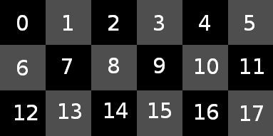

所有的动画图像都在文件夹 *images/* 中

*DinoBike/*。我们首先构建一个包含图像的元组 1。然后，使用该元组，

我们创建一个 SimpleAnimation 对象，并指定每个图像应该是

显示的时间为十分之一秒。我们还实例化了一个播放按钮。

在主循环中，我们调用 oDinosaurAnimation 的 update() 和 draw() 方法，

oDinosaurAnimation 对象。程序会不断循环，持续绘制

当前的动画图像和播放按钮。当动画-

如果动画没有运行，用户只会看到第一张图像。

当用户点击播放按钮 2 时，程序会调用 play()

oDinosaurAnimation 方法来启动动画。

在主循环中，我们调用 oDinosaur Animation 3 的 update() 方法，

它决定是否已经过了足够的时间来播放动画

移动到下一张图像。

最后，我们调用 draw() 4，并且对象绘制相应的图像。

***SimpleSpriteSheetAnimation 类***

第二种类型的动画在 SimpleSpriteSheetAnimation 类中实现

类。*精灵表*是一个由多个相同大小的较小图像组成的单一图像，目的是按顺序显示以创建动画。从

从开发者的角度来看，精灵表有三个优势。首先，

所有图像都在一个文件中，因此无需担心构建问题。

为每个单独的文件命名。其次，可以看到

一个动画包含在一个文件中，而不是必须翻阅一系列

图像的数量。最后，加载单个文件比加载由多个文件组成的动画要快。

图 14-1 显示了一个精灵表的示例。

*图 14-1: 由多个小图像组成的精灵表*

*18 张较小的图像*

本例旨在展示从 0 到 17 的数字。原始-

原始文件包含一个 384×192 像素的图像。简单的除法可以得出

每个单独的数字图像是 64×64 像素。这里的关键思想是我们

使用 pygame 创建*子图像*，将一个较大的图像分割成一组 18 张新的 64×64 像素图像。然后可以使用

我们在 SimpleAnimation 类中使用的技术相同。

**300** 第十四章

**创建类**

Listing 14-3 包含了处理精灵图像的 SimpleSpriteSheetAnimation 类

基于精灵图的动画。在初始化时，单个精灵图的内容会

精灵图像被拆分为较小的图像，并将其添加到

由其他方法显示。

**文件：SimpleSpriteSheetAnimation/SimpleSpriteSheetAnimation.py**

# SimpleSpriteSheetAnimation 类

导入 pygame

导入 time

class SimpleSpriteSheetAnimation():

def __init__(self, window, loc, imagePath, nImages, width, height, durationPerImage): 1

self.window = window

self.loc = loc

self.nImages = nImages

self.imagesList = []

# 加载精灵图

spriteSheetImage = pygame.image.load(imagePath)

# 优化 blitting

spriteSheetImage = pygame.Surface.convert_alpha(spriteSheetImage)

# 计算起始图像中的列数

nCols = spriteSheetImage.get_width() // width

# 将起始图像拆分为子图像

row = 0

col = 0

对于 imageNumber 在范围 nImages 内:

x = col * height

y = row * width

# 从大的精灵图中创建子图像

subsurfaceRect = pygame.Rect(x, y, width, height)

image = spriteSheetImage.subsurface(subsurfaceRect)

self.imagesList.append(image)

col = col + 1

如果 col == nCols:

col = 0

row = row + 1

self.durationPerImage = durationPerImage

self.playing = False

self.index = 0

def play(self):

如果 self.playing:

返回

self.playing = True

动画 **301**

self.imageStartTime = time.time()

self.index = 0

def update(self):

如果 self.playing 为 False:

返回

# 自开始显示此图像以来，已过的时间

self.elapsed = time.time() - self.imageStartTime

# 如果已经过足够的时间，转到下一张图像

如果 self.elapsed > self.durationPerImage:

self.index = self.index + 1

如果 self.index < self.nImages:  # 转到下一张图像

self.imageStartTime = time.time()

else:  # 动画结束

self.playing = False

self.index = 0  # 重置为起始位置

def draw(self):

# 假设 self.index 已在 update() 方法中设置。

# 它用作索引，以便在 imagesList 中查找当前图像。

theImage = self.imagesList[self.index]  # 选择要显示的图像

self.window.blit(theImage, self.loc)  # 显示图像

*清单 14-3：SimpleSpriteSheetAnimation 类*

这个类与 SimpleAnimation 类非常相似，但因为这个动画

基于精灵图的动画，__init__() 方法必须传入不同的参数

信息 1. 该方法需要标准窗口和 loc 参数-

参数，另外还有：

**imagePath** 精灵图像路径（单个文件）

**nImages** 精灵图中的图像数量

**width** 每个子图像的宽度

**height** 每个子图像的高度

**durationPerImage** 每张图像显示的时间（秒）

根据这些值，__init__() 方法加载精灵图文件，并

它使用一个循环将较大的图像拆分为一个较小的子图像列表

通过调用 pygame 的 subsurface() 方法来实现。较小的图像随后

然后将其添加到 self.imagesList 列表中，以供其他方法使用。

__init__() 方法使用计数器来计算子图像的数量，

直到达到调用者指定的数量；因此，最后一行图片

不需要是完整的一行。例如，我们可以使用一个精灵

仅包含数字 0 到 14 的图像贴图，而不是需要

直到填充到 17 行。nImages 参数是使其工作的关键。

这一类的其他部分具有与之前完全相同的方法

SimpleAnimation 类：play()、update() 和 draw()。

**302** 第十四章

**示例主程序**

Listing 14-4 提供了一个示例主程序，创建并显示

一个显示动画水滴的 SimpleSpriteSheetAnimation 对象

水滴着陆并扩散开来。如果你下载了所有内容

*SpriteSheetAnimation* 文件夹中的资源，你将得到

代码和相应的艺术资源。

**文件：SimpleSpriteSheetAnimation/Main_SimpleSpriteSheetAnimation.py**

# 显示 SimpleSpriteSheetAnimation 对象的示例

# 1 - 导入库

import pygame

from pygame.locals import *

import sys

import pygwidgets

from SimpleSpriteSheetAnimation import *

# 2 定义常量

SCREEN_WIDTH = 640

SCREEN_HEIGHT = 480

FRAMES_PER_SECOND = 30

BGCOLOR = (0, 128, 128)

# 3 - 初始化世界

pygame.init()

window = pygame.display.set_mode([SCREEN_WIDTH, SCREEN_HEIGHT])

clock = pygame.time.Clock()

# 4 - 加载资源：图片、声音等

# 5 - 初始化变量

1 oWaterAnimation = SimpleSpriteSheetAnimation(window, (22, 140),

'images/water_003.png',

5, 50, 192, 192, .05)

oPlayButton = pygwidgets.TextButton(window, (60, 320), "Play")

# 6 - 永久循环

while True:

# 7 - 检查并处理事件

for event in pygame.event.get():

如果事件类型是 QUIT：

pygame.quit()

sys.exit()

如果 oPlayButton.handleEvent(event)：

oWaterAnimation.play()

# 8 - 执行任何“每帧”动作

oWaterAnimation.update()

动画 **303**

# 9 - 清空窗口

window.fill(BGCOLOR)

# 10 - 绘制所有窗口元素

oWaterAnimation.draw()

oPlayButton.draw()

# 11 - 更新窗口

pygame.display.update()

# 12 - 稍微减慢速度

clock.tick(FRAMES_PER_SECOND) # 让 pygame 等待

*Listing 14-4: 一个示例主程序，创建并使用 SimpleSpriteSheetAnimation* *对象*

这个示例的唯一显著区别是它实例化了一个

SimpleSpriteSheetAnimation 对象 1，而不是 SimpleAnimation 对象。

***合并两个类***

SimpleAnimation 和 SimpleSpriteSheetAnimation 中的 __init__() 方法

拥有不同的参数，但另外三个方法（start()、update()、draw()）

并且 draw() 方法是相同的。一旦你实例化了其中任何一个类，

访问生成对象的方式完全相同。 “不要重复自己” (DRY) 原则指出，拥有这些重复的方法

“不要重复自己” (DRY) 原则说明了这些重复的方法是不必要的

这样做是不好的，因为任何 bug 修复和/或增强将

在这两个方法的副本中应用。

相反，这是一个很好的机会来合并类。我们可以创建

这是一个通用的抽象基类，供这些类继承。基类

类将拥有自己的 __init__() 方法，其中包括任何公共代码

来自两个原始类的 __init__()方法，它将包含

play()、update()和 draw()方法。

每个原始类将继承自新的基类，并实现

它自己的 __init__()方法，使用适当的参数。每个类都将执行

它自己的工作是创建 self.imagesList，接着在其他三个

新基类中的方法。

与展示这两个“简单”类合并后的结果相比，

我将展示这个合并结果，在“专业级”动画中

SpriteSheetAnimation 类使用，它们是 pygwidgets 包的一部分。

**pygwidgets 中的动画类**

pygwidgets 模块包含以下三个动画类：

**PygAnimation** 一个抽象基类，供动画类和

SpriteSheetAnimation 类

**Animation** 一个基于图像的动画类（单独的图像文件）

**SpriteSheetAnimation** 一个基于精灵图的动画类（一个

单个大图像）

**304** 第十四章

我们将逐个查看每个类。动画类和 SpriteSheetAnimation 类使用相同的基本概念，但也提供更多选项。

通过初始化参数提供。

***动画类***

你可以使用 pygwidget 的 Animation 类创建一个由许多不同图像组成的动画。

相关图像文件。以下是接口：

Animation(window, loc, animTuplesList, autoStart=False,

loop=False, nickname=None, callBack=None, nIterations=1):

必需的参数是：

**window**

窗口绘制区域。

**loc**

图像应该绘制的左上角。

**animTuplesList**

描述动画序列的元组列表（或元组）。

每个内层元组包含：

**pathToImage** 图像文件的相对路径。

**Duration** 显示此图像的持续时间（单位：秒，浮动类型）

结束时显示的起始点。

**offset (可选)** 如果存在，则是一个(x, y)元组，作为相对于

显示此图像的主要位置。

这些参数都是可选的：

**autoStart**

如果你希望动画立即开始，设置为 True；默认为 False。

**loop**

如果你希望动画持续循环，设置为 True；默认为 False。

**showFirstImageAtEnd**

当动画结束时，重新显示第一张图片；默认为 True。

**nickname**

分配给此动画的内部名称，用作参数。

当指定 callBack 时。

**callBack**

动画完成时要调用的函数或对象方法。

**nIterations**

动画循环的次数；默认为 1。

与 SimpleAnimation 不同，后者对所有图像使用相同的持续时间，

Animation 类允许你为*每个*图像指定持续时间，从而允许动画**305**

在显示图像的时序方面提供更大的灵活性。你还可以在绘制每个图像时指定 x、y 偏移量，但通常来说，这

不需要。这里是一些示例代码，创建一个 Animation 对象

显示一个奔跑的霸王龙：

TRexAnimationList = [('images/TRex/f1.gif', .1),

('images/TRex/f2.gif', .1),

('images/TRex/f3.gif', .1),

('images/TRex/f4.gif', .1),

('images/TRex/f5.gif', .1),

('images/TRex/f6.gif', .1),

('images/TRex/f7.gif', .1),

('images/TRex/f8.gif', .1),

('images/TRex/f9.gif', .1),

('images/TRex/f10.gif', .4)]

# 5 - 初始化变量

oDinosaurAnimation = pygwidgets.Animation(window, (22, 145),

TRexAnimationList, 回调函数=myFunction, 昵称='Dinosaur')

这将创建一个动画对象，显示 10 张不同的图像。该

前九张图像每张显示十分之一秒，但最后一张图像

显示四分之一秒的图像。动画将只播放一次并

不会自动开始播放。动画完成时，

myFunction() 将会以参数'Dinosaur'被调用。

***SpriteSheetAnimation 类***

对于 SpriteSheetAnimation，您需要传入单个精灵图集文件的路径。

这是 SpriteSheetAnimation 将大型动画分解为多个子动画的顺序

对于较小的图像，您必须指定所有子图像的宽度和高度。对于

持续时间，您有两个选择：您可以指定单一值，表示所有图像

图像应该显示相同的时间，或者您可以指定一个

持续时间列表或元组，每个图像对应一个持续时间。以下是接口：

SpriteSheetAnimation(window, loc, imagePath, nImages,

宽度、高度、持续时间或持续时间列表，

autoStart=False, loop=False, nickname=None,

回调函数=None, 迭代次数=1):

必需的参数为：

**窗口** 用于绘制的窗口

**位置** 图像绘制的左上角

**图像路径** 精灵图集图像文件的相对路径

**nImages** 精灵图集中的子图像总数

**宽度** 每个生成的单一子图像的宽度

**高度** 每个生成的单一子图像的高度

**持续时间或持续时间列表** 每个子图像显示的时间，

每个子图像应在动画期间显示，或指定一个持续时间列表，每个子图像对应一个

子图像（长度必须是 nImages）

**306** 第十四章

以下是可选参数：

**自动开始**

如果您希望动画立即开始，可以设置为 True；默认为 False。

**循环**

如果您希望动画循环播放，可以设置为 True；默认为 False。

**结束时显示第一张图像**

当动画结束时，重新显示第一张图像；默认为 True。

**昵称**

为此动画分配的内部名称，用作参数

当指定回调函数时。

**回调函数**

动画完成时要调用的函数或对象方法。

**迭代次数**

循环播放的次数；默认为 1\。

下面是创建 SpriteSheetAnimation 对象的一个典型语句：

oEffectAnimation = pygwidgets.SpriteSheetAnimation(window, (400, 150),

'images/effect.png', 35, 192, 192, .1,

autoStart=True, loop=True)

这将使用在给定路径中找到的单个图像文件创建一个 SpriteSheetAnimation 对象。

在给定路径下的原始图像包含 35 个子图像。每个较小的

图像大小为 192×192 像素，每个子图像将显示十分之一秒，

每张图像显示的时间为一秒。动画将自动开始并持续循环。

***公共基类：PygAnimation***

Animation 和 SpriteSheetAnimation 类每个仅包含一个

__init__() 方法并从一个公共抽象基类继承，

PygAnimation。两个类的 __init__() 方法调用了继承的

PygAnimation 基类的 __init__() 方法。因此，__init__()

Animation 和 SpriteSheetAnimation 类的方法仅初始化

它们类中的独特数据。

在创建 Animation 或 SpriteSheetAnimation 对象后，客户端代码

需要在每一帧中包含对 update() 和 draw() 的调用。以下是

列出通过基类可供两个类使用的方法：

**handleEvent( *event*****)**

如果你想检查用户是否点击了

在动画上。如果是这样，你传递 pygame 提供的事件。此

方法大多数时候返回 False，但当用户

点击图像时，通常会调用 play()。

**play()**

启动动画播放。

动画 **307**

**stop()**

停止动画并将其重置为仅显示第一帧

图像。

**pause()**

导致动画在当前图像上暂时停止。你

可以通过调用 play() 继续播放。

**update()**

应该在每一帧中调用。当动画运行时，显示此

方法负责计算正确的时间以推进到下一个

下一个图像。它通常返回 False，但当动画

当动画结束时（并且没有设置为循环）。

**draw()**

应该在每一帧中调用。该方法绘制当前图像

动画的内容。

**setLoop( *trueOrFalse*****)**

传入 True 或 False 来指示动画是否应循环或

否。

**getLoop()**

如果动画设置为循环，则返回 True；如果没有，则返回 False。

**注**

*动画在窗口中的位置由传递给 __init__() 的原始 loc 值决定。Animation 和 SpriteSheetAnimation 都继承自* *公共的 PygAnimation 类，而该类又继承自 PygWidget。由于* *所有在 PygWidget 中可用的方法在两个动画类中都可用，* *你可以轻松构建一个在播放时改变位置的动画。你可以通过调用从* *PygWidget 继承的 setLoc() 方法，并为每个图像提供任何 x 和 y 位置来使动画移动。*

***示例动画程序***

图 14-2 显示了一个示例程序的截图，演示了多重

由 Animation 和 SpriteSheetAnimation 类构建的多重动画。

左侧的小恐龙是一个 Animation 对象。它被设置为 autoStart，因此

动画在程序开始时播放，但只播放一次。点击

小恐龙下面的按钮会对 Animation 进行适当的调用

对象。如果你点击播放，动画会再次播放。当动画正在

正在播放时，点击暂停会冻结动画，直到你再次点击播放。

如果播放动画然后点击停止，动画将停止并

显示第一张图像。下面是两个复选框。默认情况下，

动画将不会循环。如果你勾选了循环（Loop），然后按下播放（Play），动画

重复，直到你取消勾选循环（Loop）。显示复选框使动画

可见或不可见。

**308** 第十四章

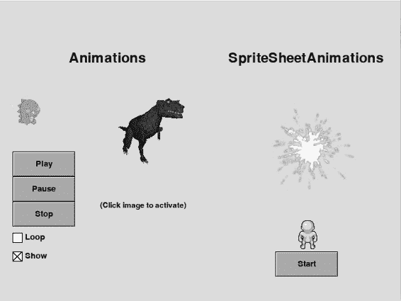

*图 14-2：使用 Animation 和*类的一个示例动画程序。

*SpriteSheetAnimation 类*

第二个（T-rex）Animation 对象没有设置为自动启动（autoStart），因此只有

看看动画的第一张图像。如果点击这张图像，动画-

动画设置为迭代其所有图像三次（循环三次）后

停止。

右上角是一个烟花 SpriteSheetAnimation 对象，来自

来自一个包含 35 个子图像的单一图像。此动画设置为循环，

因此你会看到它持续运行。

右下角是一个由单一图像组成的行走 SpriteSheetAnimation。

带有 36 个子图像。当你点击开始（Start）时，动画会播放完所有

只显示一次图像。

该程序的完整源代码可在*AnimationExample/*

*Main_AnimationExample.py*文件与本书的其余资源一起提供。

程序实例化了两个 Animation 对象（小恐龙和

T-rex）和两个 SpriteSheetAnimation 对象（烟花和行走-

当点击小恐龙下方的按钮时，我们调用

合适的恐龙动画对象方法。点击小

恐龙或 T-rex 的点击会调用该动画的 start()方法。

程序显示多个动画可以同时运行

时间。这是因为主循环调用了 update()和 draw()方法-

每一帧中的*每个*动画都遵循主循环中的方法，每个动画

根据当前图像或显示下一个图像做出自己的决定。

显示下一个图像。

Animation **309**

**总结**

在本章中，我们探索了动画类中所需的机制。

通过构建我们自己的 SimpleAnimation 和 SimpleSpriteSheetAnimation 类。

前者由多个图像组成，而后者使用单一的

包含多个子图像的较大图像。

这两个类有不同的初始化方法，但其余的方法-

类的结构是相同的。我解释了合并这两个

通过构建一个公共抽象基类来组织类。

然后我介绍了 Animation 类和 SpriteSheetAnimation 类

在 pygwidgets 中。我解释了这两个类只实现了它们自己的

__init__()方法的不同版本，继承它们的其他方法来自

通用基类 PygAnimation。我最后展示了一个示范

提供示例动画和精灵图集动画的程序。

**15**

**场景**

游戏和程序通常需要

向用户展示不同的场景。对于

本讨论的目的，我将定义一个*场景*

以及任何窗口布局和相关的用户交互-

状态与任何其他状态有显著不同。例如

例如，一个像 *Space Invaders* 这样的游戏可能有一个开始

或 *欢迎* 场景，主要游戏场景，最高得分

场景，也许还有一个结束或告别场景。

在本章中，我将讨论两种不同的编写程序的方法

拥有多个场景的程序更加可扩展。首先，我将介绍状态机技术

技术，它适用于相对较小的程序。然后，我将展示一个完整的

面向对象的方法，每个场景都作为一个对象来实现，

由场景管理器控制。后者对于

更大的程序。

**状态机方法**

在本书的开头，我们开发了一个软件模拟器

开关。在第一章，我们首先使用过程代码实现了一个灯光开关，然后我们用类重新编写了它。在这两种情况下，位置

（或开关的状态）由一个布尔变量表示；True

表示打开的为 True，表示关闭的为 False。

有许多情况下，一个程序或对象可能处于

在多个不同状态之一运行的，且根据

基于当前状态。例如，考虑以下步骤的序列：

使用 ATM 时。有一个初始（问候）状态，然后你需要输入

你的 ATM 卡；然后你需要输入 PIN 码，选择想要

你想要执行的操作，等等。任何时候，你可能需要返回到之前的状态。

步骤或甚至重新开始。一般的实现方法是使用一个

*状态机*。

**状态机**

一个模型，表示并控制通过一系列状态的执行流程。

状态机的实现包括：

• 一组预定义状态，通常表示为常量，这些常量

值是由一个单词或简短短语组成的字符串，用于描述

状态中会发生什么

• 一个单一的变量来跟踪当前状态

• 一个初始状态（来自预定义状态集）

• 一组清晰定义的状态转换

一个状态机在任何给定时刻只能处于一个状态，但可以

移动到一个新状态，通常基于用户的特定输入。

在第七章，我讨论了 pygwidgets 包中的 GUI 按钮类。当滚动并点击按钮时，用户会看到三种不同的图像——上升、悬停和按下——这些图像对应于按钮的不同状态。

按钮。图像切换是在 handleEvent() 方法中完成的（该方法

每当事件发生时都会调用此方法。让我们仔细看看这是如何

已实现。

handleEvent() 方法被构建为一个状态机。状态被保持在

在实例变量 self.state 中保持状态。每个按钮从上升状态开始，显示

显示“向上”图像。当用户将光标移动到按钮上时，我们

显示“悬停”图像，并且代码过渡到悬停状态。当

当用户点击按钮时，我们显示“按下”图像，并且代码

移动到“down”状态（内部称为*armed*状态）。当用户释放鼠标按钮（点击“up”）时，我们再次显示“over”图像，并

代码将过渡回“over”状态（并且 handleEvent()返回 True 以

表示点击已发生）。如果用户随后将光标移出

按钮时，我们再次显示“up”图像并过渡回“up”状态。

**312** 第十五章

接下来，我将向你展示如何使用状态机来表示用户在一个较大程序中可能遇到的不同场景。作为一种通用

例如，我们将有以下场景：*Splash*（起始）、*Play*和*End*。

我们将创建一组常量，表示不同的状态，并创建一个

变量称为 state，并将其赋值为起始状态：

STATE_SPLASH = 'splash'

STATE_PLAY = 'play'

STATE_END = 'end'

state = STATE_SPLASH # 初始化为起始状态

为了在不同的状态下执行不同的操作，在程序中

程序的主循环中使用了 if/elif/elif/.../else 结构进行分支

根据状态变量的当前值：

while True:

if state == STATE_SPLASH:

# 在此处执行你想在 Splash 状态中做的任何事情

elif state == STATE_PLAY:

# 在此处执行你想在 Play 状态中做的任何事情

elif state == STATE_END:

# 在此处执行你想在结束状态中做的任何事情

否则：

raise ValueError('状态值未知：' + state)

由于状态初始设置为 STATE_SPLASH，只有第一个分支会执行

语句将运行。

状态机的思想是，在某些情况下，通常

通常由某个事件触发，程序通过为状态变量赋值来改变其状态

不同的值给状态变量。例如，起始的 Splash 场景

可能只会显示一个带有开始按钮的游戏介绍。当用户

点击开始按钮时，游戏将执行一个赋值语句，表示

更改状态变量的值，以便过渡到“Play”状态：

state = STATE_PLAY

一旦执行该行，只有第一个 elif 中的代码会执行，并完全

会执行不同的代码——即显示并响应“Play”状态的代码。

类似地，无论程序如何或何时到达游戏结束条件，它都会执行以下代码以过渡到

游戏的结束条件触发时，它将执行以下代码以过渡到

结束状态：

state = STATE_END

从那时起，每次程序执行 while 循环时，

第二个 elif 分支的代码将执行。

总结来说，状态机有一组状态，一个变量用于保持

跟踪程序当前处于哪个状态，并有一组事件会导致程序

程序从一个状态过渡到另一个状态。由于只有一个变量

场景 **313**

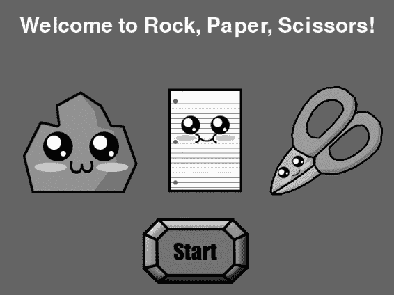

用来跟踪状态的变量，程序只能处于一个状态

随时发生。用户采取的不同动作（点击按钮、按下

按键、拖动物品等事件（如计时器倒计时）

计时器倒计时）等其他事件也可以导致程序从一个状态过渡到另一个状态。

根据所处的状态，程序可能会监听不同的事件

事件将通常执行不同的代码。

**一个带有状态机的 pygame 示例**

接下来，我们将构建一个使用状态机的石头、纸、剪刀游戏。

用户选择石头、纸或剪刀；然后计算机会随机

在三者中做出选择。如果玩家和计算机选择相同

如果是平局，分数不变。否则，玩家或计算机得一分。

计算机根据以下规则做出选择：

• 石头压碎剪刀。

• 剪刀剪纸。

• 纸覆盖石头。

用户将看到三个场景：一个开场或 Splash 场景

（图 15-1），一个游戏场景（图 15-2），以及一个结果场景（图 15-3）。

*图 15-1：石头、纸、剪刀 Splash 场景*

Splash 场景等待用户点击“开始”按钮。

**314** 第十五章

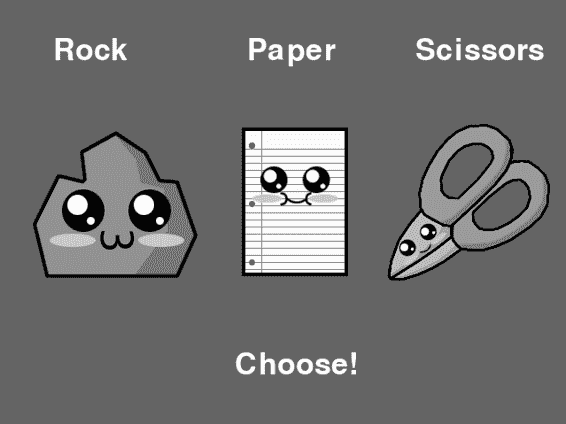

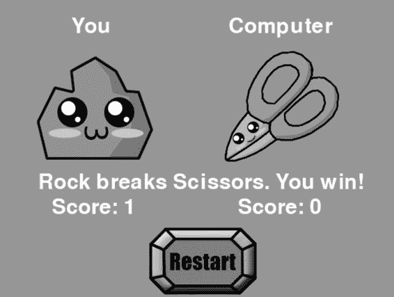

*图 15-2：石头、纸、剪刀游戏场景*

游戏进行场景是用户做出选择的地方。用户点击后

用户选择图标来表示他们的选择，计算机做出随机选择。

*图 15-3：石头、纸、剪刀结果场景*

场景 **315**

结果场景显示回合的结果和得分。它等待用户点击“重启”按钮以开始另一个回合。

在这个游戏中，每个状态值对应一个不同的场景。

图 15-4 是一个*状态图*，展示了状态及其转换（

动作或事件导致程序从一个状态转移到

另一个）。

选择石头、纸或剪刀

按下开始按钮

Splash

游戏进行

结果

按下重启按钮

*图 15-4：石头、纸、剪刀状态图*

当程序处于空闲状态（等待用户时），当前场景通常

保持不变。也就是说，在主事件循环中，程序将

通常不会改变状态变量的值。（状态可能会变化

当定时器结束时，但这种情况很少发生。）这个游戏从 Splash

场景，当用户按下“开始”按钮时，游戏转移到

游戏场景。游戏的进行在“游戏”场景与

结果场景。虽然这是一个简单的示例，但状态图可以非常

在理解更复杂程序的流程时非常有用。

清单 15-1 提供了石头、纸、剪刀程序的代码，

省略了样板代码以节省空间。

**文件：RockPaperScissorsStateMachine/RockPaperScissors.py**

# 在 pygame 中的石头、纸、剪刀

# 状态机演示

--- snip ---

ROCK = 'Rock'

PAPER = 'Paper'

SCISSORS = 'Scissors'

# 为每个状态设置常量

STATE_SPLASH = 'Splash' 1

STATE_PLAYER_CHOICE = 'PlayerChoice'

STATE_SHOW_RESULTS = 'ShowResults'

# 3 - 初始化世界

--- snip ---

# 4 - 加载资源：图像、声音等。

--- snip ---

**316** 第十五章

# 5 - 初始化变量

playerScore = 0

computerScore = 0

state = STATE_SPLASH 2 # 初始状态

# 6 - 永久循环

while True:

# 7 - 检查并处理事件

for event in pygame.event.get():

如果 event.type == pygame.QUIT:

pygame.quit()

sys.exit()

如果 state == STATE_SPLASH: 3

如果 startButton.handleEvent(event):

state = STATE_PLAYER_CHOICE

elif state == STATE_PLAYER_CHOICE: 4 # 让用户选择

playerChoice = '' # 表示尚未做出选择

如果 rockButton.handleEvent(event):

playerChoice = ROCK

rpsCollectionPlayer.replace(ROCK)

elif paperButton.handleEvent(event):

playerChoice = PAPER

rpsCollectionPlayer.replace(PAPER)

elif scissorButton.handleEvent(event):

playerChoice = SCISSORS

rpsCollectionPlayer.replace(SCISSORS)

如果 playerChoice != '': # 玩家已做出选择，开始电脑选择

# 电脑从动作元组中选择

rps = (ROCK, PAPER, SCISSORS)

computerChoice = random.choice(rps) # 电脑选择

rpsCollectionComputer.replace(computerChoice)

# 评估游戏

如果 playerChoice == computerChoice: # 平局

resultsField.setValue('平局！')

tieSound.play()

elif playerChoice == ROCK and computerChoice == SCISSORS:

resultsField.setValue('石头压碎剪刀。你赢了！')

playerScore = playerScore + 1

winnerSound.play()

elif playerChoice == ROCK and computerChoice == PAPER:

resultsField.setValue('石头被纸覆盖。你输了。')

computerScore = computerScore + 1

loserSound.play()

场景 **317**

elif playerChoice == SCISSORS and computerChoice == PAPER: resultsField.setValue('剪刀剪断纸。你赢了！')

playerScore = playerScore + 1

winnerSound.play()

elif playerChoice == SCISSORS and computerChoice == ROCK:

resultsField.setValue('剪刀被石头压碎。你输了。')

computerScore = computerScore + 1

loserSound.play()

elif playerChoice == PAPER and computerChoice == ROCK:

resultsField.setValue('纸覆盖石头。你赢了！')

playerScore = playerScore + 1

winnerSound.play()

elif playerChoice == PAPER and computerChoice == SCISSORS:

resultsField.setValue('纸被剪刀剪断。你输了。')

computerScore = computerScore + 1

loserSound.play()

# 显示玩家得分

playerScoreCounter.setValue('你的得分: ' + str(playerScore))

# 显示电脑得分

computerScoreCounter.setValue('电脑得分: ' + str(computerScore))

state = STATE_SHOW_RESULTS # 改变状态

elif state == STATE_SHOW_RESULTS: 5

如果 restartButton.handleEvent(event):

state = STATE_PLAYER_CHOICE # 改变状态

否则:

raise ValueError('状态值未知:', state)

# 8 - 执行每帧动作

如果 state == STATE_PLAYER_CHOICE:

messageField.setValue(' 剪刀石头布')

elif state == STATE_SHOW_RESULTS:

messageField.setValue('你 电脑')

# 9 - 清空窗口

window.fill(GRAY)

# 10 - 绘制所有窗口元素

messageField.draw()

如果 state == STATE_SPLASH: 6

rockImage.draw()

paperImage.draw()

scissorsImage.draw()

startButton.draw()

# 绘制玩家选择

elif state == STATE_PLAYER_CHOICE: 7

rockButton.draw()

**318** 第十五章

paperButton.draw()

scissorButton.draw()

chooseText.draw()

# 绘制结果

elif state == STATE_SHOW_RESULTS: 8

resultsField.draw()

rpsCollectionPlayer.draw()

rpsCollectionComputer.draw()

playerScoreCounter.draw()

computerScoreCounter.draw()

`restartButton.draw()`

# 11 - 更新窗口

`pygame.display.update()`

# 12 - 稍微减慢一些

`clock.tick(FRAMES_PER_SECOND)` # 使 pygame 等待

*Listing 15-1: 石头、剪子、布游戏*

在此列表中，我省略了创建图像、按钮和

用于 Splash、Play 和 Results 场景的文本字段。可下载文件

书中包含完整的源代码和所有相关艺术资源。

在程序进入主循环之前，我们定义所有三个状态 1，

实例化并加载所有屏幕元素，并设置初始状态 2\。

我们根据程序当前的状态进行不同的事件检查

在“Splash”状态中，我们只检查是否点击了开始按钮 3\。在

在“Play”状态中，我们检查是否点击了“石头、剪子、布”图标按钮 4\。

在 Results 状态中，我们只检查是否点击了重启按钮 5\。

按钮点击或在一个场景中做出选择会更改状态变量的值

状态变量的变化，因此将游戏移动到不同的场景。

在主循环的底部 6 7 8，我们绘制不同的屏幕元素

取决于程序当前所处的状态。

这种技术适用于少量状态/场景。然而，

在一个规则更复杂或有多个场景的程序中，/

或状态，跟踪应该在何处做什么可能变得非常困难，

困难。相反，我们可以利用许多面向对象的编程技术

本书前面介绍的面向对象编程技术可以帮助构建一个不同的

基于独立场景的架构中，所有场景由一个对象管理，程序架构

管理器对象。

**一个用于管理多个场景的场景管理器**

构建一个包含多个场景的程序的第二种方法是使用

一个 *场景管理器*：一个集中处理不同场景的对象。

我们将创建一个 `SceneMgr` 类，并实例化一个 oSceneMgr 对象

它。在接下来的讨论中，我将把 oSceneMgr 对象称为场景

管理器，因为我们只实例化一个。如您所见，场景管理器

相关场景利用了封装、继承和

多态性。

场景 **319**

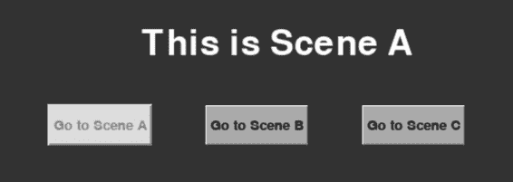

使用场景管理器可能有点棘手，但最终的程序

结果是一个高度模块化、易于修改的程序。一种

使用场景管理器的程序将由以下文件组成：

**主程序** 您编写的小型主程序必须首先

创建程序中每个场景的实例，然后创建

获取场景管理器的实例，传递场景列表并

帧率。要启动程序，您需要调用 `run()` 方法

场景管理器。对于每个新的项目，您必须编写一个新的

主程序。

**场景管理器** 场景管理器是为您编写的，并且可用，

作为 *pyghelpers.py* 文件中类似于 SceneMgr 类的对象。它跟踪所有不同的场景，记住当前的场景，调用

当前场景，允许场景之间的切换，并处理场景之间的通信。

场景之间的通信。

**场景** 你的程序可以根据需要有任意数量的场景。

每个场景通常作为一个独立的 Python 文件进行开发。每个场景

类必须继承自预编写的 Scene 基类，并拥有一组

预定义名称的那些方法。场景管理器使用多态性来调用这些方法。

使用多态性来调用当前场景中的这些方法。我已经提供了一个

模板 *ExampleScene.py* 文件展示了如何构建一个场景。

SceneMgr 类的代码和 Scene 基类的代码位于

在 pyghelpers 包中。场景管理器是一个对象管理器对象

它管理任意数量的场景对象。

**使用场景管理器的演示程序**

作为演示，我们将构建一个包含三个场景的场景演示程序。

简单场景：场景 A、场景 B 和场景 C。其概念是从任何

在场景中，你可以点击一个按钮进入任何其他场景。图 15-5 到

图 15-7 展示了三种场景的截图。

*图 15-5：用户在场景 A 中看到的内容*

从场景 A，你可以进入场景 B 或场景 C。

**320** 第十五章

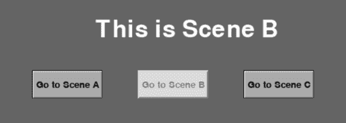

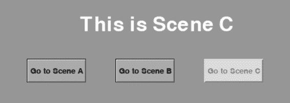

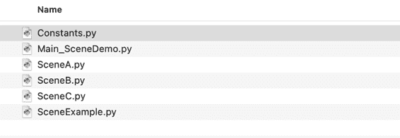

*图 15-6：用户在场景 B 中看到的内容*

从场景 B，你可以进入场景 A 或场景 C。

*图 15-7：用户在场景 C 中看到的内容*

从场景 C，你可以进入场景 A 或场景 B。

项目文件夹的结构如图 15-8 所示。请注意

这假设你已经安装了 pygwidgets 和 pyghelpers

模块位于正确的 *site-packages* 文件夹中。

*图 15-8：展示主程序和不同场景文件的项目文件夹* *Main_SceneDemo.py* 是主程序。*Constants.py* 包含一些

由主程序和所有场景共享的常量。*SceneA.py*、*SceneB.py* 和 *SceneC.py* 是实际的场景，每个场景文件都包含一个相关的场景类。

*SceneExample.py* 是一个示例文件，展示了一个典型场景文件的样子。场景 **321**

看起来会是什么样子。它在本程序中没有使用，但你可以参考它，了解如何编写一个典型场景的基本知识。

图 15-9 展示了程序中各个对象之间的关系。

**主**

*(实例化所有场景*

*以及场景管理器)*

*启动*

*场景管理器*

**场景管理器**

*(管理导航和*

*场景之间的通信)*

场景 1

场景 2

场景 3

…

场景 N

*所有场景都继承自 Scene 基类*

*图 15-9：项目中对象的层次结构*

让我们看看使用场景管理器的程序不同部分是如何工作的。

共同工作，从主程序开始。

***主程序***

主程序对于每个项目来说都是独一无二的。它的目的是初始化

初始化 pygame 环境，实例化所有场景，创建一个实例

使用 SceneMgr 的代码，然后将控制权转移到场景管理器 oSceneMgr。

列表 15-2 展示了演示主程序的代码。

**文件：SceneDemo/Main_SceneDemo.py**

# 场景演示主程序，包含三个场景

--- 截取 ---

# 1 - 导入包

导入 pygame

1 导入 pyghelpers

来自 SceneA 的导入*

来自 SceneB 的导入*

来自 SceneC 的导入*

# 2 - 定义常量

2 WINDOW_WIDTH = 640

WINDOW_HEIGHT = 180

FRAMES_PER_SECOND = 30

**322** 第十五章

# 3 - 初始化世界

pygame.init()

window = pygame.display.set_mode((WINDOW_WIDTH, WINDOW_HEIGHT))

# 4 - 加载资源：图像、声音等。

# 5 - 初始化变量

# 实例化所有场景并将它们存储到一个列表中

3 scenesList = [SceneA(window),

SceneB(window)，

SceneC(window)]

# 创建场景管理器，传入场景列表和 FPS

4 oSceneMgr = pyghelpers.SceneMgr(scenesList, FRAMES_PER_SECOND)

# 告诉场景管理器开始运行

5 oSceneMgr.run()

*列表 15-2：使用场景管理器的示例主程序*

主程序的代码相对简短。我们首先导入

使用 pyghelpers 导入所有场景（在本例中为 Scene A、Scene B 和

Scene C) 1。然后我们定义更多常量，初始化 pygame，并

创建窗口 2。接下来，我们创建每个场景的实例并存储。

所有场景列表 3。此行执行后，我们有了一个初始化

每个场景的对象。

然后，我们实例化场景管理器对象（oSceneMgr）4 来自于

SceneMgr 类。当我们创建这个对象时，我们需要传入两个值：

• 场景列表，场景管理器可以知道所有的场景。

场景列表中的第一个场景作为启动场景。

程序。

• 程序应保持的每秒帧数（帧率）。

最后，我们通过调用其 run()方法告诉场景管理器开始运行

方法 5。场景管理器始终将一个场景作为当前场景进行维护，

租赁场景——即用户看到并与之交互的场景。

请注意，使用这种方法时，主程序实现了初始化

典型 pygame 程序的初始化，但*不*构建主循环。

相反，主循环是由场景管理器本身构建的。

***构建场景***

为了理解场景管理器和任何单独场景之间的交互，

对于每个场景，我将解释如何构建一个典型场景。

每次进入其循环时，场景管理器都会调用一组预定义的

当前场景中用于处理事件、执行任何操作的方法集合

每帧操作，并绘制该场景中需要绘制的任何内容。

因此，每个场景的代码必须拆分为这些方法。该

该方法使用了多态：每个场景都需要实现一个

公共方法集。

场景 **323**

**每个场景中需要实现的方法**

每个场景都作为继承自 Scene 基类的类来实现。

类定义在*pyghelpers.py*文件中。因此，每个场景必须导入

pyghelpers。至少，场景需要包含一个 __init__()方法

并且必须重写 getSceneKey()、handleInputs()和 draw()方法

来自基类。

每个场景必须有一个唯一的*场景键*——一个字符串，场景

管理器用来识别每个场景。我建议你创建一个文件，里面包含

名称像*Constants.py*这样的文件，包含所有场景的键，并将此文件导入到每个场景文件中。例如，示例程序的*Constants.py*文件包含：

# 场景键（任何唯一的值）：

SCENE_A = 'scene A'

SCENE_B = 'scene B'

SCENE_C = 'scene C'

在初始化过程中，场景管理器调用 getSceneKey()

每个场景的方法，它简单地返回其唯一的场景键。该

场景管理器会构建一个场景键和场景的内部字典，

对象。当程序中的任何场景想要切换到不同的

场景时，它会调用 self.goToScene()（在下面的章节中描述），然后

传入目标场景的场景键。场景管理器使用这个键

在字典中查找关联的场景对象；然后它设置新的

场景对象作为当前场景并调用它的方法。

每个场景必须包含自己版本的 handleInputs()来处理任何

事件通常会在主循环中处理，并且每个场景有自己的版本。

draw()的作用是绘制场景想要在窗口中绘制的任何内容。如果你的

场景没有覆盖这两个方法，它将无法响应

任何事件，并且不会在窗口中绘制任何内容。

让我们仔细看看你需要为每个场景实现的四个方法。

每个场景：

**def __init__(self, window):**

每个场景应该以其自己的 __init__()方法开始。窗口

参数是程序绘制的窗口。你应该

通过此语句开始你的方法，以保存窗口参数供

用于 draw()方法：

self.window = window

之后，你可以包含任何你想要的其他初始化代码，或者

需要的代码，例如实例化按钮和文本字段、加载

图像和声音等等。

**def getSceneKey(self):**

这个方法必须在你编写的每个场景中实现。你的

方法必须返回与此场景关联的唯一场景键。

**324** 第十五章

**def handleInputs(self, events, keyPressedList):**

这个方法必须在你编写的每个场景中实现。它

应该处理所有处理事件或键所需的操作。事件

参数是自上次帧以来发生的事件列表，

keyPressedList 是一个布尔值列表，表示键盘上所有键的状态。

键（True 表示按下）。要找出某个特定键是处于按下还是松开状态，

你应该使用常量，而不是整数索引。常量

代表所有键的键盘在 pygame 文档中都可以找到。

实现文档[( *https://www.pygame.org/docs/ref/key.html*).](https://www.pygame.org/docs/ref/key.html)

你对这个方法的实现应该包含一个 for 循环，该循环

遍历传入的事件列表中的所有事件。如果你愿意，它可以

还可以包含实现处理事件的连续模式的代码。

键盘，如第五章所述 i

**def draw(self):**

这个方法必须在你编写的每个场景中实现。它

应该绘制当前场景中需要绘制的所有内容。

场景管理器还会在每个场景中调用以下方法。在

场景基类（Scene base class），这些方法每个都包含一个简单的 pass 语句，因此

他们什么也不做。您可以重写其中的任何一个或全部，来执行任何

您想要为特定场景定义的代码：

**def enter(self, data):**

该方法在场景管理器完成过渡后被调用

进入此场景的操作。此方法有一个数据参数，默认为 None。

默认情况下。如果数据不为 None，则它包含的信息是由

从前一个场景当它调用 goToScene() 时（在

下一个部分）。数据的值可以是任何形式——从单一的

字符串或数字值到列表或字典，再到对象——只要

离开场景和进入场景都同意数据类型

正在传递的数据。enter() 方法应执行它需要执行的任何操作

当场景即将交出控制权时。

**def update(self):**

该方法在每一帧中调用。在这里，您可以执行任何

您将在原始 12 步模板的第 8 步中执行的操作

第五章中介绍过。例如，您可能希望这个方法来移动屏幕上的图像，检查碰撞等等。

**def leave(self):**

每当程序

程序即将切换到不同的场景。它应执行任何清理

离开之前需要完成的工作，例如将信息写入

一个文件。

场景 **325**

**场景之间的导航**

场景时，场景管理器和场景基类提供了一种简单的方式来导航

场景之间的连接。当程序想要切换到另一个

场景时，当前场景应该调用自己的 goToScene() 方法，这在

继承的场景基类，像这样：

self.goToScene(nextSceneKey, data)

goToScene() 方法通知场景管理器您

想要切换到不同场景的程序，其场景键是 nextSceneKey。您

应该通过一个文件（例如 *Constants.py*）使所有场景键可用。数据参数是您想传递给下一个场景的任何可选信息。

场景。如果不需要传输数据，可以省略这个参数。

典型的调用方式如下：

self.goToScene( *SOME_SCENE_KEY*) # 无需传递数据

# 或

self.goToScene( *ANOTHER_SCENE_KEY*, data= *someValueOrValues*) # 跳转到一个场景并传递数据 数据的值可以是任何形式，只要离开和进入的场景都能理解该格式。在响应这个调用时，在离开

当前场景之前，场景管理器会调用该场景的 leave() 方法。

离开当前场景时，场景管理器会调用该场景的 leave() 方法。

当下一个场景即将激活时，场景管理器会调用该

场景的 enter() 方法并将数据值传递给新场景。

**退出程序**

场景管理器负责处理用户退出程序的三种不同方式

当前正在运行的程序：

• 通过点击窗口顶部的关闭按钮。

• 通过按下 ESCAPE 键。

• 通过任何附加机制，例如退出按钮。在这种情况下，

调用以下方法（该方法也内置于场景基类中）：

self.quit()  # 退出程序

***一个典型场景***

列表 15-3 显示了典型场景的示例——这是 *SceneA.py* 文件，展示了演示程序中实现场景 A，如图 15-5 所示。记住

请记住，主循环由场景管理器实现。在其主循环中，

场景管理器调用 handleInputs()、update() 和 draw() 方法以

当前场景。

**326** 第十五章

**文件：SceneDemo/SceneA.py**

# 场景 A

import pygwidgets

import pyghelpers

import pygame

from pygame.locals import *

from Constants import *

class SceneA(pyghelpers.Scene):

1 def __init__(self, window):

self.window = window

self.messageField = pygwidgets.DisplayText(self.window,

(15, 25)，'这是场景 A'，字体大小=50，

textColor=WHITE, width=610, justified='center')

self.gotoAButton = pygwidgets.TextButton(self.window,

(250, 100)，'转到场景 A')

self.gotoBButton = pygwidgets.TextButton(self.window,

(250, 100)，'转到场景 B')

self.gotoCButton = pygwidgets.TextButton(self.window,

(400, 100)，'转到场景 C')

self.gotoAButton.disable()

2 def getSceneKey(self):

返回 SCENE_A

3 def handleInputs(self, eventsList, keyPressedList):

对于事件列表中的每个事件：

如果 self.gotoBButton.handleEvent(event):

4 self.goToScene(SCENE_B)

如果 self.gotoCButton.handleEvent(event):

5 self.goToScene(SCENE_C)

--- snip（测试代码以发送消息） ---

6 def draw(self):

self.window.fill(GRAYA)

self.messageField.draw()

self.gotoAButton.draw()

self.gotoBButton.draw()

self.gotoCButton.draw()

--- snip（测试代码以响应消息） ---

*列表 15-3：一个典型的场景（场景 A，在 Scene Demo 程序中）*

场景 **327**

在 __init__() 方法 1 中，我们将 window 参数保存在实例变量中。然后我们创建一个 DisplayText 字段的实例，用来显示

标题并创建一些 TextButton 按钮，以便导航到其他场景。

getSceneKey() 方法 2 只是返回唯一的场景键（在

在 *Constants.py* 中（适用于此场景）。在 handleInputs() 方法 3 中，如果用户点击了不同场景的按钮，我们调用 self.goToScene()

导航方法 4 5 将控制转移到新场景。在 draw() 方法中

在方法 6 中，我们填充背景，绘制消息区域，并绘制

按钮。这个示例场景做的很少，因此我们不需要编写自己的

具有自己的 enter()、update() 和 leave() 方法。对这些方法的调用将

由场景基类中的同名方法处理，这些方法

方法什么都不做——它们只是执行一个 pass 语句。

另外两个场景文件是 *SceneB.py* 和 *SceneC.py*。唯一的不同是显示的标题、绘制的按钮，以及点击按钮时的效果

按钮用于转移到适当的新场景。

**使用场景的石头、剪刀、布**

让我们构建一个交替实现的石头、剪刀、布游戏

使用场景管理器。对用户来说，游戏将完全一样

与早期的状态机版本以相同的方式工作。我们将构建一个 Splash 场景、一个游戏

场景，以及一个结果场景。

所有源代码都可以获得，因此我不会逐行讲解每个 Python

文件。Splash 场景只是一个背景图像和一个开始按钮。当

当用户按下开始按钮时，代码执行 goToScene(SCENE_PLAY) 切换到

切换到游戏场景。在游戏场景中，用户会看到一组

图像（石头、纸和剪刀），并要求选择其中一个。点击一个

图像将控制权转移到结果场景。清单 15-4 包含了代码

“游戏”场景的代码。

**文件：RockPaperScissorsWithScenes/ScenePlay.py**

# 游戏场景

# 玩家从石头、纸或剪刀中选择

import pygwidgets

import pyghelpers

import pygame

from Constants import *

import random

class ScenePlay(pyghelpers.Scene):

def __init__(self, window):

self.window = window

self.RPSTuple = (ROCK, PAPER, SCISSORS)

**328** 第十五章

--- snip ---

def getSceneKey(self): 1

return SCENE_PLAY

def handleInputs(self, eventsList, keyPressedList): 2

playerChoice = None

for event in eventsList:

if self.rockButton.handleEvent(event):

playerChoice = ROCK

if self.paperButton.handleEvent(event):

playerChoice = PAPER

if self.scissorButton.handleEvent(event):

playerChoice = SCISSORS

if playerChoice is not None: 3 # 用户已经做出了选择

computerChoice = random.choice(self.RPSTuple) # 计算机选择

dataDict = {'player': playerChoice, 'computer': computerChoice} 4

self.goToScene(SCENE_RESULTS, dataDict) 5 # 切换到结果场景

# 无需包含 update 方法，默认为继承的方法，它什么都不做

def draw(self):

self.window.fill(GRAY)

self.titleField.draw()

self.rockButton.draw()

self.paperButton.draw()

self.scissorButton.draw()

self.messageField.draw()

*清单 15-4：石头、剪子、布游戏的“游戏”场景*

我已经略去了创建文本字段以及石头、纸和剪刀的代码

sors 按钮。getSceneKey() 方法 1 仅返回场景的键

这个场景。

最重要的方法是 handleInputs() 2，它在每个

框架。如果任何按钮被点击，我们将设置一个名为 playerChoice 的变量

适当的常量 3，然后我们为计算机做一个随机选择。

然后我们获取玩家的选择和计算机的选择并构建一个

简单的字典 4 包含了两者信息，以便我们可以传递这些信息

作为数据传递到结果场景。最后，为了切换到结果场景，我们调用

goToScene() 并传递字典 5\。

场景管理器接收到此调用后，会调用当前场景的 leave()

(游戏)，将当前场景更改为新场景（结果），并调用 enter()

用于新场景（结果场景）。它将离开场景的数据传递到

新场景（结果场景）的 enter() 方法。

清单 15-5 包含了结果场景的代码。这里有很多代码

这里的代码大部分涉及显示适当的图标和评估结果。

回合结果的操作。

场景 **329**

**文件：RockPaperScissorsWithScenes/SceneResults.py**

# 结果场景

# 玩家看到当前回合的结果

import pygwidgets

import pyghelpers

import pygame

from Constants import *

class SceneResults(pyghelpers.Scene):

def __init__(self, window, sceneKey):

self.window = window

self.playerScore = 0

self.computerScore = 0

1 self.rpsCollectionPlayer = pygwidgets.ImageCollection(

window, (50, 62),

{ROCK: 'images/Rock.png',

PAPER: 'images/Paper.png',

SCISSORS: 'images/Scissors.png'}, '')

self.rpsCollectionComputer = pygwidgets.ImageCollection(

window, (350, 62),

{ROCK: 'images/Rock.png',

PAPER: 'images/Paper.png',

SCISSORS: 'images/Scissors.png'}, '')

self.youComputerField = pygwidgets.DisplayText(

window, (22, 25),

'你 计算机',

fontSize=50, textColor=WHITE,

width=610, justified='center')

self.resultsField = pygwidgets.DisplayText(

self.window, (20, 275), '',

fontSize=50, textColor=WHITE,

width=610, justified='center')

self.restartButton = pygwidgets.CustomButton(

self.window, (220, 310),

up='images/restartButtonUp.png',

down='images/restartButtonDown.png'

over='images/restartButtonHighlight.png')

self.playerScoreCounter = pygwidgets.DisplayText(

self.window, (86, 315), '得分:',

fontSize=50, textColor=WHITE)

self.computerScoreCounter = pygwidgets.DisplayText(

self.window, (384, 315), '得分:',

fontSize=50, textColor=WHITE)

**330** 第十五章

# 声音

self.winnerSound = pygame.mixer.Sound("sounds/ding.wav")

self.tieSound = pygame.mixer.Sound("sounds/push.wav")

self.loserSound = pygame.mixer.Sound("sounds/buzz.wav")

2 def enter(self, data):

# data 是一个字典（来自 Play 场景），其格式如下：

# {'player': playerChoice, 'computer': computerChoice}

playerChoice = data['player']

computerChoice = data['computer']

# 设置玩家和计算机的图片

3 self.rpsCollectionPlayer.replace(playerChoice)

self.rpsCollectionComputer.replace(computerChoice)

# 评估游戏的胜/负/平局条件

4 如果 playerChoice == computerChoice:

self.resultsField.setValue("平局！")

self.tieSound.play()

elif playerChoice == ROCK and computerChoice == SCISSORS:

self.resultsField.setValue("石头打破剪刀。你赢了！")

self.playerScore = self.playerScore + 1

self.winnerSound.play()

--- snip ---

# 显示玩家和计算机的得分

self.playerScoreCounter.setValue(

'得分: ' + str(self.playerScore))

self.computerScoreCounter.setValue(

'得分: ' + str(self.computerScore))

5 def handleInputs(self, eventsList, keyPressedList):

for event in eventsList:

如果 self.restartButton.handleEvent(event):

self.goToScene(SCENE_PLAY)

# 无需包含更新方法，

# 默认为继承的方法，不做任何操作

6 def draw(self):

self.window.fill(OTHER_GRAY)

self.youComputerField.draw()

self.resultsField.draw()

self.rpsCollectionPlayer.draw()

self.rpsCollectionComputer.draw()

self.playerScoreCounter.draw()

self.computerScoreCounter.draw()

self.restartButton.draw()

*Listing 15-5: 石头、剪刀、布游戏的结果场景*

场景 **331**

在这里，我截取了部分游戏评估逻辑。enter()

方法 2 是此类中最重要的方法。当玩家

在前一个游戏场景做出选择后，程序会切换到这个场景

结果场景。首先，我们提取玩家和计算机的选择，这些选择

作为字典从游戏场景传入的数据，格式如下：

{'player': playerChoice, 'computer': computerChoice}

在 __init__() 方法 1 中，我们为

玩家和计算机，各自包含岩石、纸张和剪刀的图像。

在 enter() 方法 2 中，我们使用 ImageCollection 3 的 replace() 方法

显示玩家和计算机选择的图像。

然后，评估过程非常简单 4。如果计算机和玩家

如果双方做出了相同的选择，我们平局，并播放相应的平局声音。

如果玩家获胜，我们增加玩家的分数并播放一段快乐的声音。

如果计算机获胜，我们增加计算机的分数并播放一段悲伤的

声音。我们更新玩家或计算机的分数，并显示分数

在匹配的文本显示区域中。

在 enter() 方法执行后（每回合执行一次），

handleInputs() 方法 5 会在每一帧由场景管理器调用。

当用户点击重启时，我们会调用继承的 goToScene() 方法

用于返回到游戏场景。

draw() 方法 6 会绘制当前场景中的所有内容。

在这个场景中，我们每帧没有做任何额外的工作，所以我们不

需要编写一个 update() 方法。当场景管理器调用 update() 时，

场景基类中的继承方法会运行，并执行一个 pass

语句。

**场景间通信**

场景管理器提供了一组方法，允许场景之间进行通信：

场景之间通过发送或请求信息来进行通信。这种通信

这种通信并不是所有程序都需要的，但它非常有用。该

场景管理器允许任何场景：

• 从其他场景请求信息

• 向另一个场景发送信息

• 向所有其他场景发送信息

在以下章节中，我将把用户当前看到的场景称为 *cur-*

*current* 场景。当前场景向其发送信息的目标场景或

请求信息的场景是 *目标* 场景。用于传输的方式

传递信息的操作都在 Scene 基类中实现。因此，所有

场景（必须继承自 Scene 基类）可以访问这些

方法使用 self.*<method>* ()。

**332** 第十五章

***从目标场景请求信息***

要从任何其他场景请求信息，一个场景会调用

继承的 request() 方法，像这样：

self.request(targetSceneKey, requestID)

这个调用允许当前场景从目标场景请求信息

场景，通过其场景键（targetSceneKey）标识。requestID 唯一

确定了你请求的信息。用于请求的 requestID 的值

通常会在像 *Constants.py* 这样的文件中定义为常量。调用

返回请求的信息。一个典型的调用看起来像这样：

someData = self.request( *SOME_SCENE_KEY*, *SOME_INFO_CONSTANT*)

这实际上表示，“向*SOME_SCENE_KEY*场景发出请求，要求

以*SOME_INFO_CONSTANT*标识的信息。”返回的数据并分配给 someData 变量。

场景管理器充当中介：它接收到调用并将其转换为

request()方法并将其转换为对目标场景中 respond()的调用。为了使

如果目标场景能够提供信息，则必须实现一个 respond()方法。

该场景类中的方法应像这样开始：

def respond(self, requestID):

respond()方法的典型代码检查 requestID 的值。

参数并返回适当的数据。返回的数据可以是格式化的。

以当前场景和目标场景一致的任何格式进行格式化。

***将信息发送到目标场景***

要将信息发送到目标场景，当前场景需要调用

继承的 send()方法，如下所示：

self.send(targetSceneKey, sendID, info)

此调用允许当前场景将信息发送到目标场景，

通过其场景键(targetSceneKey)标识。sendID 唯一标识

你正在发送的信息。info 参数是你

想要发送到目标场景的信息。

一个典型的调用看起来像这样：

self.send( *SOME_SCENE_KEY*, *SOME_INFO_CONSTANT*, data)

这实际上表示，“将信息发送到*SOME_SCENE_KEY*场景。该信息

信息由*SOME_INFO_CONSTANT*标识，信息存储在变量 data 的值中。”

场景管理器接收到 send()调用并将其转换为调用

收到的信息。为了允许场景将信息发送到

场景 **333**

如果是另一个场景，你必须在目标场景类中实现一个 receive()方法，如下所示：

def receive(self, receiveID, info):

如果需要，receive()方法可以包含 if/elif/else 结构。

以处理 receiveID 的不同值。传输的信息可以是

信息可以以当前场景和目标场景一致的任何格式进行格式化。

***将信息发送到所有场景***

作为额外的便利，场景可以将信息发送到所有其他场景。

使用单一方法 sendAll()发送信息到所有场景：

self.sendAll(sendID, info)

此调用允许当前场景将信息发送到所有其他场景。

场景。sendID 唯一标识你正在发送的信息。该

info 参数是你想发送到所有场景的信息。

一个典型的调用看起来像这样：

self.sendAll( *SOME_INFO_CONSTANT*, data)

这实际上表示，“将信息发送到所有场景。信息

由*SOME_INFO_CONSTANT*标识，信息存储在变量 data 的值中。”

为了使其工作，所有除当前场景外的场景必须实现

如前节所述，receive()方法。场景管理器

将消息发送到所有场景（除了当前场景）。当前

场景可能包含一个 receive() 方法，用于接收其他场景发送的信息。

***测试场景间的通信***

场景演示程序（包含场景 A、场景 B 和场景 C）中讨论了

如之前在清单 15-2 和 15-3 中所展示的，每个场景中都包含演示

send()、request() 和 sendAll() 方法调用的代码。此外，场景每个

实现 receive() 和 respond() 方法的简单版本。在演示中

在程序中，你可以通过按下 A、B 或 C 向其他场景发送信息。

按下 X 会向所有场景发送一条信息。按下 1、2 或 3 会发送一个请求

从目标场景获取数据。目标场景用字符串作回应。

**场景管理器的实现**

这里我们将看看场景管理器是如何实现的。然而，有一点

OOP 的一个重要教训是，客户端代码的开发者不需要了解

了解一个类的实现，仅仅是接口。至于

对于场景管理器，你不需要知道它是如何工作的，只需要知道它有哪些方法

你必须在场景中实现的内容，当它们被调用时，以及它们有哪些方法

你可以调用的。因此，如果你对内部实现不感兴趣，可以直接跳

直接跳到总结部分。如果你感兴趣，本节将详细讲解

**334** 第十五章

实现细节，顺便你会学到一种有趣的技术，可以实现对象之间的双向通信。

场景管理器在名为 SceneMgr 的类中实现

pyghelpers 模块。如前所述，在你的主程序中，你创建—

创建场景管理器的单一实例，像这样：

oSceneMgr = SceneMgr(scenesList, FRAMES_PER_SECOND)

你的主程序的最后一行需要是：

oSceneMgr.run()

清单 15-6 包含 SceneMgr 类的 __init__()方法的代码

类。

--- 截取 ---

def __init__(self, scenesList, fps):

# 构建一个字典，每个条目是 sceneKey : 场景对象

1 self.scenesDict = {}

2 对于 oScene 在 scenesList 中：

key = oScene.getSceneKey()

self.scenesDict[key] = oScene

# 列表中的第一个元素被用作起始场景

3 self.oCurrentScene = scenesList[0]

self.framesPerSecond = fps

# 给每个场景一个返回 SceneMgr 的引用。

# 这样可以让任何场景执行 goToScene、request、send 操作，

# 或 sendAll，它们会被转发到场景管理器。

4 对于键值对 key, oScene 在 self.scenesDict.items() 中：

oScene._setRefToSceneMgr(self)

*清单 15-6：SceneMgr 类的 __init__()方法*

__init__() 方法通过一个字典 1 跟踪所有场景。它

遍历场景列表，要求每个场景提供它的场景键，并

构建一个字典 2\. 列表中的第一个场景对象被用作

起始场景 3\.

__init__() 方法的最后一部分做了一些有趣的工作。该部分

场景管理器持有对每个场景的引用，因此它可以向

任何和每个场景。但是每个场景也需要能够发送信息

场景管理器。为了让每个场景都能做到这一点，最后一个 for 循环在

__init__() 方法调用了特殊方法 _setRefToSceneMgr() 4，来

它存在于每个场景的基类中，并传递 self，这是一个引用

到场景管理器。该方法的完整代码只有一行：

def _setRefToSceneMgr(self, oSceneMgr):

--- 剪切 ---

self.oSceneMgr = oSceneMgr

场景 **335**

该方法只是将这个引用存回场景管理器的实例变量 self.oSceneMgr。每个场景可以使用这个变量来执行

调用场景管理器的方法。我稍后会展示场景如何使用这个方法。

小节。

***run() 方法***

对于你构建的每一个项目，你都必须编写一个小的主程序，它

实例化场景管理器。你的主程序的最后一步是调用

到场景管理器的 run() 方法。这是主循环所在的位置。

整个程序都在运行。列表 15-7 包含了该方法的代码。

def run(self):

--- 剪切 ---

clock = pygame.time.Clock()

# 6 - 无限循环

while True:

1 keysDownList = pygame.key.get_pressed()

# 7 - 检查并处理事件

2 eventsList = []

for event in pygame.event.get():

如果 (event.type == pygame.QUIT) 或 \

((event.type == pygame.KEYDOWN) 和

(event.key == pygame.K_ESCAPE)):

# 告诉当前场景我们要离开它了。

self.oCurrentScene.leave()

pygame.quit()

sys.exit()

eventsList.append(event)

# 在这里，我们让当前场景处理所有事件，

# 在 update 方法中执行任何“每帧”动作，

# 并绘制所有需要绘制的内容。

3 self.oCurrentScene.handleInputs(eventsList, keysDownList)

4 self.oCurrentScene.update()

5 self.oCurrentScene.draw()

# 11 - 更新窗口

6 pygame.display.update()

# 12 - 稍微减慢一些

clock.tick(self.framesPerSecond)

*列表 15-7：SceneMgr 类的 run() 方法*

**336** 第十五章

run() 方法是场景管理器工作原理的关键。记住，所有场景必须是多态的——至少每个场景必须实现

包含 handleInputs() 和 draw() 方法。每次循环时，run()

该方法执行以下操作：

• 获取所有键盘键的列表 1（False 表示按键抬起，True 表示按键按下）。

• 构建事件列表 2，记录自上次循环以来发生的事件。

循环。

• 调用当前场景的多态方法 3。当前场景

当前场景始终保存在名为 self.oCurrentScene 的实例变量中。

在调用场景的 handleInputs() 方法时，场景管理器

传入已发生的事件列表和按键列表。每个

场景负责处理事件并处理

键盘的状态。

• 调用 update() 方法 4，允许场景执行任何每帧操作。

操作覆盖此方法。Scene 基类实现了一个 update() 方法，该方法只是

包含 pass 语句，但场景可以通过

它可以执行任何它想要的代码。

• 调用 draw() 方法 5，允许场景绘制它需要绘制的任何内容。

在窗口中绘制。

在循环的底部（与标准的主循环完全相同）：

场景管理器更新窗口 6 并等待适当的时间。

适当的时间。

***主要方法***

SceneMgr 类的其余方法实现了导航和

场景之间的通信：

**_goToScene()** 调用，用于切换到另一个场景

**_request_respond()** 调用，用于查询另一个场景中的数据

**_send_receive()** 调用，用于将信息从一个场景发送到另一个场景

**_sendAll_receive()** 调用，用于将信息从一个场景发送到所有

其他场景

你编写的任何场景代码都不应直接调用这些方法

直接调用，并且不应被重写。前面的下划线

其名称暗示这些是私有（内部）方法。虽然它们

这些方法并非在场景管理器本身内直接调用，而是由

场景基类。

为了说明这些方法是如何工作的，我将首先给出一个概览

步骤的过程，当场景想要跳转到另一个场景时。为

要进行场景跳转，当前场景调用：

self.goToScene( *某场景键*)

场景 **337**

当场景发起此调用时，该调用会进入继承的 Scene 基类中的 goToScene()方法。继承方法的代码由以下内容组成

一行代码：

def goToScene(self, nextSceneKey, data=None):

--- 截取部分 ---

self.oSceneMgr._goToScene(nextSceneKey, data)

这会调用场景管理器中的私有方法 _goToScene()。

管理器。在场景管理器的方法中，我们需要给当前

给场景提供机会进行必要的清理工作，然后转移到

将控制权交给新场景。以下是场景管理器中 _goToScene()方法的代码

场景管理器：

def _goToScene(self, nextSceneKey, dataForNextScene):

--- 截取部分 ---

如果 nextSceneKey 为 None：# 表示退出

pygame.quit()

sys.exit()

# 调用旧场景的 leave 方法，以便它进行清理。

# 设置新场景（基于场景键）并

# 调用新场景的 enter 方法。

1 self.oCurrentScene.leave()

pygame.key.set_repeat(0) # 关闭字符重复

尝试：

2 self.oCurrentScene = self.scenesDict[nextSceneKey]

除了 KeyError：

raise KeyError("尝试跳转到场景 '" + nextSceneKey +

"' 但是那个键不在场景字典中。")

3 self.oCurrentScene.enter(dataForNextScene)

_goToScene()方法执行一系列步骤以实现场景过渡

从当前场景切换到目标场景。首先，它在当前场景中调用 leave()，

当前场景 1，以便当前场景进行必要的清理。然后，

使用传入的目标场景键，找到目标场景的对象

场景 2，并将其设置为当前场景。最后，它调用新场景的 enter()方法。

当前场景 3，允许新当前场景进行必要的设置。

从此时起，场景管理器的 run()方法开始循环

调用当前场景的 handleInputs()、update()和 draw()方法。

这些方法将在当前场景中被调用，直到程序执行完毕

发起另一次对 self.goToScene()的调用，以切换到另一个场景或

用户退出程序时。

***场景间通信***

最后，让我们讨论一个场景如何与另一个场景通信。要

从另一个场景请求信息，一个场景只需要发出一个调用

到 self.request()，该方法位于 Scene 基类中，如下所示：

dataRequested = self.request( *某场景键*, *某数据标识符*)

**338** 第十五章

目标场景必须有一个 respond()方法。该方法需要像这样定义：

def respond(self, requestID):

它使用 requestID 的值来唯一标识要检索的数据

并返回该数据。同样，请求场景和目标场景

必须对任何标识符的值达成一致。完整的过程如下所示

图 15-10\。

**场景管理器**

self._request_respond()

返回数据

2

5

**场景**

**场景**

*(基类)*

*(基类)*

arget.respond()

返回数据

oT

4

3

self.request()

返回数据

1

**当前**

6

**当前**

**场景**

**场景**

*图 15-10：一个场景向另一个场景请求信息的通信路径*

*另一个场景*

当前场景不能直接从另一个场景获取信息，

因为当前场景没有对任何其他场景的引用。

相反，它使用场景管理器作为中介。这里是它的全部

工作原理：

1. 当前场景调用 self.request()，该方法位于

继承的 Scene 基类。

2. 

Scene 基类在其

实例变量 self.oSceneMgr，允许其方法调用

场景管理器中。self.request()方法调用场景

管理器的 _request_respond()方法来请求场景的

目标场景。

3. 场景管理器有一个字典，存储所有场景键及其相关

对象，并且它使用传入的参数来找到该对象

目标场景中调用 respond()方法（你必须编写该方法）

与目标场景相关的方法。然后它在

4. 

respond()方法（你必须编写）来返回数据

无论它需要做什么来生成所请求的数据，然后

返回数据给场景管理器。

场景**339**

5. 场景管理器将数据返回给当前场景继承的 Scene 基类中的 request()方法。

6. 最后，Scene 基类中的 request()方法将数据返回给

原始调用者。

相同的机制用于实现 send()和 sendAll()。该

唯一的区别是，当向一个场景或所有场景发送消息时，

没有数据会返回给原始调用者。

**总结**

在本章中，我介绍了两种不同的方法来实现一个程序

它包含多个场景。状态机是一种用于表示和控制通过一系列状态的执行流的技术；

展示和控制通过一系列状态的执行流；

你可以用它来实现一个场景数量较少的程序。该

场景管理器旨在帮助你构建更大的多场景应用程序

通过提供导航和一种通用的方式，使场景能够互相通信

彼此互动。我还解释了场景管理器是如何实现这一切的

功能。

场景管理器和 Scene 基类提供了封装的清晰示例

面向对象编程的三大基本原则：封装、多态、

多态性和继承。每个场景都是封装的一个很好的示例

因为场景的所有代码和数据都是作为类编写的。每个场景类

必须是多态的，必须实现一组通用的方法

为了使其与场景管理器的调用兼容。最后，每个场景

继承自公共的 Scene 基类。场景之间的双向通信

场景管理器和 Scene 基类由每个场景实现

使用继承的基类方法和实例变量。

**340** 第十五章

**16**

**完整游戏：Dodger**

本章我们将构建一个完整的游戏，名为

Dodger 使用了许多技术

和已解释的概念

本书中讨论的内容。这是一个完全面向对象的

游戏的扩展版本，最初由

Al Sweigart 在他的书《创造自己的计算机游戏》中提到过

*与 Python 一起*（《无锈出版社》，2016；基础游戏概念，

图形和声音是经过授权使用的）。

在我进入游戏本身之前，我将介绍一组函数

展示我们将在游戏中使用的模态对话框。*模态对话框*是那种

强制用户与之交互——例如选择一个选项——

在他们继续使用底层程序之前。这些对话框

在点击选项之前，程序无法继续运行。

**模态对话框**

pyghelpers 模块有两种类型的模态对话框：

• *是/否对话框* 提出一个问题并等待用户点击其中一个

两个按钮。这些按钮的文本默认为“是”和“否”，尽管

你可以使用任何文本（例如，确定和取消）。如果没有文本

如果为“否”按钮指定了文本，则此对话框可用作警报框，文本

只有一个“是”（或通常是“确定”）按钮。

• *答案对话框* 提出一个问题，提供一个文本框让用户输入，和一组按钮，默认文本为确定和取消。用户可以

回答问题后点击确定或取消（关闭）对话框

点击取消时关闭对话框。

你通过调用特定的函数向用户展示每种类型的对话框

pyghelpers 模块中的对话框。每个对话框有两种形式：一种简单的

基于 TextButton 的版本和更复杂的自定义版本。简单的

简单文本版本使用默认布局，包含两个 TextButton 对象，非常适合

用于快速原型设计。在自定义版本中，你可以提供一个背景

用于对话框，定制问题文本，定制答案文本（例如

一个答案对话框），并为按钮提供自定义图形。

***是/否和警报对话框***

我们首先来看一下是/否对话框，从文本版本开始。

**文本版本**

这是 textYesNoDialog() 函数的接口：

textYesNoDialog(theWindow, theRect, prompt, yesButtonText='Yes',

noButtonText='No'，

backgroundColor=DIALOG_BACKGROUND_COLOR，

textColor=DIALOG_BLACK)

当你调用这个函数时，需要传入窗口以进行绘制

进入，一个矩形对象或元组表示位置和大小

用于创建对话框的函数，需要传入一个文本提示进行显示。你还可以选择

指定两个按钮的文本，一个背景颜色，以及

提示文本创建对象。如果没有指定，按钮文本默认为“是”和“否”。

这里是调用此函数的一个典型示例：

returnedValue = pyghelpers.textYesNoDialog(window,

(75, 100, 500, 150)，

'你想要薯条吗？'

这个调用显示了图 16-1 中的对话框。

**342** 第十六章

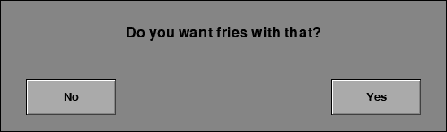

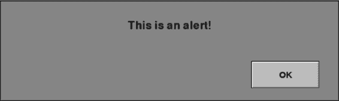

*图 16-1：一个典型的 textYesNoDialog 对话框*

Yes 和 No 按钮是 pygwidgets 中 TextButton 类的实例。

主程序在对话框显示时会停止。当用户点击

按钮，函数返回 True 表示“是”，返回 False 表示“否”。你的代码应该

根据返回的布尔值进行相应操作；然后

主程序会在对话框显示后继续运行。

你也可以使用此函数来创建一个简单的只有

一个按钮。如果传入的 noButtonText 值为 None，则该按钮不会

只显示一个按钮。你可以像这样调用以显示一个按钮：

忽略 = pyghelpers.textYesNoDialog(window, (75, 80, 500, 150),

'这是一个警告！', '确定', None)

图 16-2 显示了最终的警告对话框。

*图 16-2：作为警告对话框使用的 textYesNoDialog*

**自定义版本**

设置自定义的 Yes/No 对话框更复杂，但可以提供更多

更多控制的警告对话框。以下是 customYesNoDialog()函数的接口：

customYesNoDialog(theWindow, oDialogImage, oPromptText, oYesButton,

oNoButton)

在你调用此函数之前，你需要为

对话框的背景、提示文本以及 Yes 和 No 按钮。你

通常会使用 Image、DisplayText 和 CustomButton（或 TextButton）对象

这些对象是通过 pygwidgets 类创建的，专门用于这个目的。customYesNoDialog()

代码通过调用 handleEvent()方法展示了多态性

按钮，因此无论你使用 CustomButtons 还是 TextButtons，都没有关系，

通过调用所有构成对话框的对象的 draw()方法来绘制它们。因为

你创建了所有这些对象后，可以自定义它们中的任何一个或所有对象的外观。

你需要为任何 Image 和 CustomButton 提供自己的图像

对象并习惯性地将它们放置在项目的*images*文件夹中。

完整游戏：Dodger **343**

在实现自定义的 Yes/No 对话框时，通常你会编写一个像 showCustomYesNoDialog()这样的中介函数，如清单 16-1 所示。

然后，在你希望显示对话框的代码位置，代替直接调用 customYesNoDialog()，你应该调用中介

与直接调用 customYesNoDialog()相比，你应该调用中介

函数，它同时实例化小部件并实际调用它们。

def showCustomYesNoDialog(theWindow, theText):

1 oDialogBackground = pygwidgets.Image(theWindow, (60, 120),

'images/dialog.png'）

2 oPromptDisplayText = pygwidgets.DisplayText(theWindow, (0, 170)，

theText，width=WINDOW_WIDTH，

justified='center'，fontSize=36）

3 oNoButton = pygwidgets.CustomButton(theWindow, (95, 265)，

'images/noNormal.png'，

over='images/noOver.png'，

down='images/noDown.png'，

disabled='images/noDisabled.png'）

oYesButton = pygwidgets.CustomButton(theWindow, (355, 265)，

'images/yesNormal.png'，

over='images/yesOver.png'，

down='images/yesDown.png'，

disabled='images/yesDisabled.png'）

4 userAnswer = pyghelpers.customYesNoDialog(theWindow，

oDialogBackground，

oPromptDisplayText，

oYesButton，oNoButton）

5 return userAnswer

*列表 16-1：创建自定义 Yes/No 对话框的中介函数*

在函数内部，你编写代码来为提示 2 创建一个 Image 对象，

使用你指定的图像作为背景 1。你还创建了一个 DisplayText

提示对象，指定放置位置、文本大小，

字体等。然后你可以创建按钮，作为 TextButton 对象或者

更可能的是，使用 CustomButton 对象，这样你就可以显示自定义图像 3。最后，

该函数调用 customYesNoDialog()，并传入你刚刚创建的所有对象，

创建了 4。调用 customYesNoDialog() 会将用户的选择返回给此

中介函数，然后中介函数返回用户的

选择返回给原始调用者 5。此方法效果良好，因为窗口 -

获取对象（oDialogBackground，oPromptDisplayText，oYesButton 和 oNoButton）

在此函数内部创建的变量都是局部变量，因此会全部

在中介函数结束时返回。

当你调用此函数时，你只需要传入窗口和

要显示的文本提示。例如：

returnedValue = showCustomYesNoDialog(window，

'你想要薯条吗？')

图 16-3 显示了最终的对话框。这只是一个例子；你

你可以设计任何你喜欢的布局。

**344** 第十六章

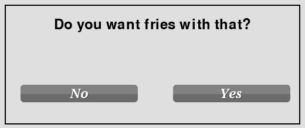

*图 16-3：一个典型的 customYesNoDialog 对话框*

与简单文本版本一样，如果传入的 oNoButton 值是

如果为 None，则该按钮不会显示，这在构建和显示时很有用 -

显示一个警告对话框。

内部，textYesNoDialog() 和 customYesNoDialog() 函数各自

运行他们自己的 while 循环来处理事件、更新和绘制

对话框。这样，调用程序会被挂起（其主循环不会

不会运行，直到用户点击按钮并且模态对话框返回

选择的答案。（这两个函数的源代码可以在

pyghelpers 模块。）

***答案对话框***

一个答案对话框增加了一个输入文本框，用户可以在其中输入

response。pyghelpers 模块还包含函数 textAnswerDialog()。

和 customAnswerDialog() 来处理这些对话框，它们的工作方式类似于

他们的 Yes/No 对应按钮。

**文本版本**

这是 textAnswerDialog() 函数的接口：

textAnswerDialog(theWindow, theRect, prompt, okButtonText='确定'

cancelButtonText='取消'，

backgroundColor=DIALOG_BACKGROUND_COLOR，

promptTextColor=DIALOG_BLACK,

inputTextColor=DIALOG_BLACK)

如果用户点击了 OK 按钮，函数返回用户输入的文本。

用户输入的内容。如果用户点击了取消按钮，函数返回 None。

这是一个典型的调用：

userAnswer = pyghelpers.textAnswerDialog(window, (75, 100, 500, 200),

'你最喜欢的冰淇淋口味是什么？'

如果 userAnswer 不是 None：

# 用户点击了 OK，可以对变量 userAnswer 做任何操作

else:

# 这里可以做任何操作，知道用户点击了取消

完整游戏：Dodger **345**

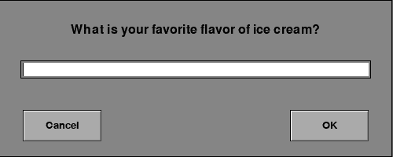

这将显示图 16-4 中的对话框。

*图 16-4：一个典型的 textAnswerDialog 对话框*

**自定义版本**

要实现自定义 Answer 对话框，你需要编写一个中间函数

函数，类似于在 customYesNoDialog() 中展示的做法。你的主代码

代码调用中间函数，后者再调用 customAnswerDialog()。

列表 16-2 显示了一个典型的中间函数的代码。

def showCustomAnswerDialog(theWindow, theText):

oDialogBackground = pygwidgets.Image(theWindow, (60, 80),

'images/dialog.png')

oPromptDisplayText = pygwidgets.DisplayText(theWindow, (0, 120),

theText, width=WINDOW_WIDTH,

justified='center', fontSize=36)

oUserInputText = pygwidgets.InputText(theWindow, (225, 165), '',

fontSize=36, initialFocus=True)

oNoButton = pygwidgets.CustomButton(theWindow, (105, 235),

'images/cancelNormal.png',

over='images/cancelOver.png',

down='images/cancelDown.png',

isabled='images/cancelDisabled.png')

oYesButton = pygwidgets.CustomButton(theWindow, (375, 235),

'images/okNormal.png',

over='images/okOver.png',

down='images/okDown.png',

disabled='images/okDisabled.png')

response = pyghelpers.customAnswerDialog(theWindow,

oDialogBackground, oPromptDisplayText,

oUserInputText,

oYesButton, oNoButton)

return response

*列表 16-2：创建自定义 Answer 对话框的中间函数*

你可以自定义整个对话框的外观：背景

图像、字体、大小和显示与输入文本框的布局

**346** 第十六章

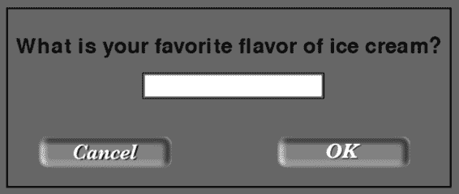

和这两个按钮。要显示自定义对话框，主代码会调用

中间函数，并传入提示文本，像这样：

userAnswer = showCustomAnswerDialog(window,

'你最喜欢的冰淇淋口味是什么？'

该调用显示一个自定义的 Answer 对话框，如图所示

图 16-5\。

*图 16-5：一个典型的 customAnswerDialog 对话框*

如果用户点击 OK，函数返回用户输入的文本。如果用户

用户点击取消按钮时，函数返回 None。

一个演示程序，展示所有类型的对话框，*DialogTester/*

*Main_DialogTester.py*，可以在可下载资源中找到

书籍。

**构建完整游戏：Dodger**

在这一节中，我们将把本书这一部分的所有内容整合在一起

在名为 Dodger 的游戏上下文中。从用户的角度来看，

游戏非常简单：通过躲避红色

恶棍和与绿色好人接触。

***Game Overview***

红色恶棍将从窗口顶部掉下来，用户必须避免

它们。任何一路掉到游戏底部的恶棍

区域被移除，用户获得一分。用户将鼠标移到

控制一个玩家图标。如果玩家碰到任何恶棍，游戏结束。A

少数绿色好人会随机出现并水平移动，

用户触摸任何好人会获得 25 分。

游戏有三个场景：一个开始或 Splash 场景，包含说明，

一个 Play 场景，在其中你可以玩游戏，还有一个 High Scores 场景，你可以

可以查看前十名高分。如果你的得分进入前十，你会被给予

有输入名字和得分的选项，可以将其记录到高分表中。

图 16-6 展示了三个场景。

完整游戏：Dodger **347**

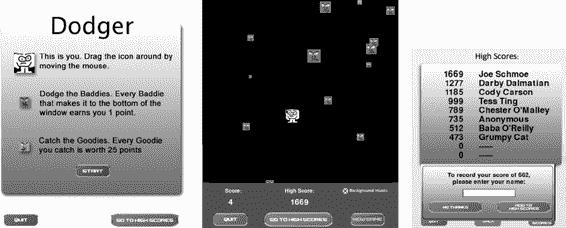

*图 16-6：从左到右是 Splash、Play 和 High Score 场景*

***实现***

*Dodger* 项目文件夹的内容如下（文件名为斜体）：

***__init__.py*** 空文件，表示这是一个 Python 包

***Baddies.py*** 包含 Baddie 和 BaddieMgr 类

***Constants.py*** 包含多个场景使用的常量

***Goodies.py*** 包含 Goodie 和 GoodieMgr 类

***HighScoresData.py*** 包含 HighScoresData 类

**images** 文件夹包含所有游戏的艺术作品

***Main_Dodger.py*** 主要程序

***Player.py*** 包含 Player 类

***SceneHighScores.py*** 显示并记录高分的场景

***ScenePlay.py*** 主要的游戏场景

***Scene.Splash.py*** Splash 场景

**sounds** 文件夹包含所有游戏的声音文件

项目文件夹随书籍资源一起提供。我不会谈论

整个代码会通过，但是我会逐步讲解源文件和

解释关键部分是如何工作的。

**文件：Dodger/Constants.py**

这个文件包含可以被多个源文件使用的常量。

最重要的常量是场景键：

# 场景键

SCENE_SPLASH = 'scene splash'

SCENE_PLAY = 'scene play'

SCENE_HIGH_SCORES = 'scene high scores'

**348** 第十六章

这些常量的值是唯一的字符串，用于标识不同的场景。

**文件：Main_Dodger.py**

主要文件执行必要的初始化，然后将控制权交给

场景管理器。文件中最重要的代码是：

# 实例化所有场景并将其存储在列表中

scenesList = [SceneSplash(window)

SceneHighScores(window)

ScenePlay(window)]

# 创建场景管理器，传入场景列表和每秒帧数（FPS）

oSceneMgr = pyghelpers.SceneMgr(scenesList, FRAMES_PER_SECOND)

# 告诉场景管理器开始运行

oSceneMgr.run()

在这里我们为每个场景创建一个实例，并实例化场景管理器

ager，然后将控制权交给场景管理器。场景管理器的

run() 方法将控制权交给列表中的第一个场景。在这个游戏中，它交给了

将控制权交给 Splash 场景。

如前一章所讨论的，每个场景类都继承自这个类。

场景基类。除了提供自己的 __init__()方法外，每个

这些类中的每个都需要重写 getSceneKey()、handleInputs()和

基类中的 draw()方法。

**文件：Dodger/SceneSplash.py**

启动场景向用户展示游戏规则的图形，点击“前往高分榜”按钮将用户带到高分榜页面。

三个按钮：开始、退出和前往高分榜。这个场景的代码如下。

类只包含必需的方法；所有其他方法默认为

继承自场景基类的方法。

__init__()方法创建背景图像对象。

图像和三个 CustomButton 对象供用户选择。

getSceneKey()方法必须在所有场景中实现；它只是

返回场景的唯一标识符。

handleInputs()方法检查用户是否点击了任何按钮。

一堆代码。如果用户点击开始，我们会调用继承的 self.goToScene()方法。

请求场景管理器将控制权转交给游戏场景。同样，

点击“前往高分榜”按钮会把用户带到高分榜页面。

场景。如果用户点击退出，我们会调用场景继承的 self.quit()方法，

方法，退出程序。

在 draw()方法中，程序绘制背景并显示三个

按钮。

**文件：Dodger/ScenePlay.py**

游戏场景负责实际的游戏过程：用户控制

玩家图标、坏蛋和好蛋的生成与移动、

完整游戏：Dodger **349**

以及碰撞检测。它还管理窗口底部的显示元素，包括当前游戏得分和最高得分，并

响应用户点击退出、前往高分榜和开始按钮的操作。

背景音乐复选框。

游戏场景的代码相当多，因此我会将其分成

较小的部分（Listings 16-3 至 16-7）来解释这些方法。

该场景遵循第十五章中建立的设计规则，通过实现 __init__()、handleInputs()、update()和 draw()方法来执行。

一个 enter()方法，用来处理场景成为当前场景时应该做的事情。

当前活动场景和 leave()方法用于处理用户

用户离开时的行为。最后，它有一个 reset()方法，用于在重新开始前重置状态。

启动新一轮游戏。Listing 16-3 展示了初始化代码。

# 游戏场景 - 主要的游戏进行场景

--- 省略导入部分以及 showCustomYesNoDialog ---

BOTTOM_RECT = (0, GAME_HEIGHT + 1, WINDOW_WIDTH,

WINDOW_HEIGHT - GAME_HEIGHT)

STATE_WAITING = 'waiting'

STATE_PLAYING = 'playing'

STATE_GAME_OVER = 'game over'

class ScenePlay(pyghelpers.Scene):

def __init__(self, window):

1 self.window = window

self.controlsBackground = pygwidgets.Image(self.window,

(0, GAME_HEIGHT),

'images/controlsBackground.jpg')

self.quitButton = pygwidgets.CustomButton(self.window,

(30, GAME_HEIGHT + 90),

up='images/quitNormal.png',

down='images/quitDown.png',

over='images/quitOver.png',

disabled='images/quitDisabled.png')

self.highScoresButton = pygwidgets.CustomButton(self.window,

(190, GAME_HEIGHT + 90),

up='images/gotoHighScoresNormal.png',

down='images/gotoHighScoresDown.png',

over='images/gotoHighScoresOver.png',

disabled='images/gotoHighScoresDisabled.png')

self.startButton = pygwidgets.CustomButton(self.window,

(450, GAME_HEIGHT + 90),

up='images/startNewNormal.png',

down='images/startNewDown.png',

over='images/startNewOver.png',

disabled='images/startNewDisabled.png',

enterToActivate=True)

**350** 第十六章

self.soundCheckBox = pygwidgets.TextCheckBox(self.window,

(430, GAME_HEIGHT + 17),

'背景音乐',

True, textColor=WHITE)
