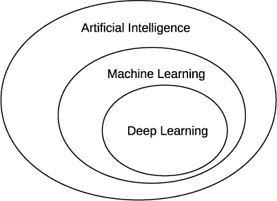
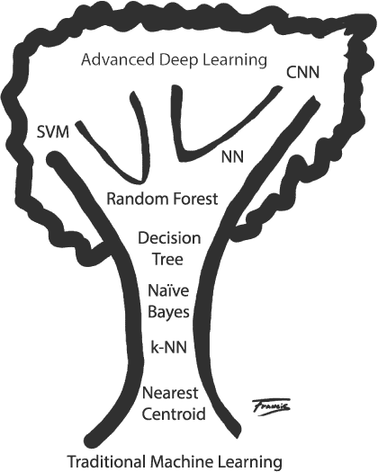

## 引言

在我上高中时，我想写一个井字游戏程序，用户可以和计算机对战。当时，我完全不知道真正的计算机科学家是如何处理这样的问题的。我只有自己的想法，那就是用粗糙的 if-then 语句和不结构化的 Applesoft BASIC 来实现大量的规则。这是许多规则——几百行代码。

最终，程序运行得足够好，直到我发现了一些我的规则没有覆盖的动作序列，并且能够每次都获胜。我确信一定有一种方法可以通过展示示例来教计算机如何做事情，而不是依赖死板的代码和规则——一种让计算机自我学习的方法。

上世纪 80 年代末，作为一名本科生，我非常兴奋地报名参加了人工智能课程。课程最终解答了我关于如何写一个井字游戏程序的问题，但计算机并没有学习；它仍然只是在使用一个巧妙的算法。顺便说一句，同一课程还曾向我们保证，虽然预计有一天计算机会打败世界上最好的国际象棋选手，这一事件在 1997 年发生了，但计算机永远不可能打败最顶尖的围棋选手。然而，2016 年 3 月，AlphaGo 深度学习程序就做到了这一点。

2003 年，当我在一家科学计算公司担任顾问时，我被分配到一个与一家大型医疗设备制造商的项目中。目标是通过使用*机器学习*：一种能够从数据中自我学习、并发展出非人工显式编程模型的人工智能子领域，在实时中对冠状动脉的血管内超声图像进行分类。这正是我所期待的！

我大致了解机器学习以及有一种叫做神经网络的奇怪存在，它们能够做一些有趣的事情，但大多数时候，机器学习只是一个小小的研究领域，并不是普通计算机科学人员关注的重点。然而，在这个项目中，我爱上了训练机器做有用的事情，而不是显式地写很多代码的想法。即使项目结束后，我依然在自学。

大约在 2010 年，我参与了另一个机器学习项目，时机非常合适。人们开始讨论一种新的机器学习方法，叫做*深度学习*，它重新激活了旧有的神经网络。2012 年，局面发生了剧变。我有幸参加了 2012 年在苏格兰爱丁堡举行的 ICML 会议，当时谷歌展示了它们初步的深度学习突破，能够识别 YouTube 视频中的猫。会场非常拥挤，毕竟当时会议有多达 800 人参加。

现在是 2020 年，我最近参加的机器学习大会有超过 13,000 名与会者。机器学习已经爆炸性增长：它不是一个会消失的潮流。机器学习深刻地影响了我们的生活，并将继续如此。了解一些关于机器学习的知识是很有用的，能够突破那些经常被夸大其词的演讲，深入到其本质核心，这本身就很有趣，根本不需要炒作。这也是本书存在的原因，帮助你学习机器学习的基本要素。具体来说，我们将重点介绍一种称为深度学习的方法。

### 本书适合谁？

我写这本书是为那些没有机器学习背景的读者，但他们充满好奇心并愿意进行实验的人。我将数学内容保持在最低限度。我的目标是帮助你理解核心概念，并建立你可以在未来使用的直觉。

同时，我不想写一本仅仅教你如何使用现有工具包的书，而是缺乏关于事物*为什么*的实际内容。确实，如果你只关心*如何*做，你可以构建有用的模型。但没有*为什么*，你只是机械地模仿，而不是理解，更别提通过自己的贡献推动这个领域向前发展了。

至于我的假设，我假设你对计算机编程有所了解，使用任何语言都可以。无论你是学生还是大型公司，机器学习的首选语言是 Python，因此我们将使用 Python。我还假设你对高中数学有所了解，但不一定懂微积分。虽然书中会稍微涉及一些微积分，但你应该能够跟得上，即使该技术对你来说不熟悉。我还假设你了解一些统计学和基础概率。如果你自高中以来忘记了这些内容，别担心——你将在第一章中找到相关章节，为你提供足够的背景，帮助你跟上叙述。

### 你可以期待学习哪些内容？

如果你完整地读完本书，你可以预期学习以下内容：

+   如何构建一个好的训练数据集。这是一个能够确保你的模型在“真实环境”中成功的 dataset。

+   如何使用两个主流的机器学习工具包：scikit-learn 和 Keras。

+   如何在训练和测试模型后评估其性能。

+   如何使用几种经典的机器学习模型，比如*k*-最近邻、随机森林或支持向量机。

+   神经网络如何工作以及如何训练。

+   如何使用卷积神经网络开发模型。

+   如何从一组给定的数据出发，构建一个成功的模型。

### 本书简介

这本书讲的是机器学习。机器学习是关于构建模型，这些模型接收输入数据并从这些数据中得出结论。这个结论可能是一个标签，将对象归类到某一特定类别中，比如某种狗，或者是一个连续的输出值，例如根据给定的设施要求为房子定价。这里的关键是模型能够自行从数据中学习。实际上，模型是通过示例来学习的。

你可以把模型看作一个数学函数，*y* = *f* (*x*)，其中 *y* 是输出，可能是类别标签或连续值，*x* 是代表未知输入的一组 *特征*。特征是关于输入的测量或信息，模型可以利用这些信息来学习生成什么输出。例如，*x* 可能是一个向量，表示一条鱼的长度、宽度和重量，其中每个测量值都是一个特征。我们的目标是找到 *f*，即 *x* 和 *y* 之间的映射，我们希望能够在新的 *x* 实例上使用它，而这些实例的 *y* 是我们所不知道的。

学习 *f* 的标准方法是给我们的模型（或算法）提供已知数据，并让模型学习它所需的参数，以便使 *f* 成为一个有用的映射。这就是为什么它被称为 *机器学习*：机器正在学习模型的参数。我们并不是自己思考规则并将其固化在代码中。实际上，对于一些模型类型，比如神经网络，甚至无法清楚地知道模型学到了 *什么*，只知道模型现在在执行上已经达到了有用的水平。

机器学习有三个主要分支：*监督学习*、*无监督学习* 和 *强化学习*。我们刚才描述的过程属于监督学习。我们通过一组已知的 *x* 和 *y* 值来监督模型的训练，这组数据叫做 *训练集*。我们称这种数据集为 *标记数据集*，因为我们知道每个 *x* 对应的 *y* 值。无监督学习则试图仅通过 *x* 来学习模型使用的参数。我们这里不讨论无监督学习，但如果你稍后想要自己探索这一领域，可以将我们对监督学习的讨论转移到无监督学习上。

强化学习训练模型执行任务，比如下棋或围棋。模型学习一组动作，以便根据当前的世界状态采取行动。这是机器学习的一个重要领域，最近在一些以前被认为仅属于人类领域的任务上取得了显著的成功。遗憾的是，为了使这本书更具可读性，我们将完全忽略强化学习的内容。

关于术语的一个简短说明。在媒体中，我们在本书中讨论的很多内容被称为*人工智能*，或称为*AI*。虽然这并不错误，但有些误导：机器学习是人工智能这一广泛领域的一个子领域。你还经常会听到另一个术语是*深度学习*。这个术语有点模糊，但在我们这里，我们将其用来指代使用神经网络的机器学习，特别是具有多层的神经网络（因此称为*深度*）。图 1 展示了这些术语之间的关系。

*图 1：人工智能、机器学习和深度学习的关系*

当然，在机器学习和深度学习领域内，存在着相当大的多样性。在本书中，我们将遇到许多模型。我们可以将它们组织成我们所称的“机器学习树”，如图 2 所示。

*图 2：机器学习的树*

这棵树展示了从传统机器学习到现代深度学习的成长过程，树根处为传统机器学习，树顶为现代深度学习。把这看作是对未来内容的预览：在本书中，我们将逐一探讨这些模型。

与此同时，我们将以每章内容的简要概述来结束本章的介绍。

**第一章：入门** 本章介绍了如何设置我们假设的工作环境。它还包括有关向量、矩阵、概率和统计的内容，可以作为复习资料或背景知识。

**第二章：使用 Python** 本章将帮助你入门 Python。

**第三章：使用 NumPy** NumPy 是 Python 的一个扩展，它使得 Python 在机器学习中变得非常有用。如果你不熟悉它，可以浏览本章内容。

**第四章：数据处理** 不良的数据集会导致糟糕的模型；我们将教你如何构建好的数据集。

**第五章：构建数据集** 我们将构建本书中使用的数据集。你还将学习如何扩增数据集。

**第六章：经典机器学习** 为了理解你将要前往的方向，有时了解你来自何处也是有帮助的。在这里，我们将介绍一些最初的机器学习模型。

**第七章：经典模型的实验** 本章展示了老式机器学习方法的优缺点。我们将在全书中引用这些结果进行对比。

**第八章：神经网络简介** 现代深度学习就是围绕神经网络展开的；我们将在这里介绍它们。

**第九章：训练神经网络** 这一具有挑战性的章节为你提供了理解神经网络训练过程所需的知识。本章中涉及了一些基础的微积分内容，但不用担心——它们是从高层次进行讨论的，目的是帮助你建立直觉，而且这些符号并不像它们乍看上去那样可怕。

**第十章：神经网络实验** 在这里，我们通过实验来建立直觉，感受实际操作数据的过程。

**第十一章：评估模型** 为了理解机器学习论文、演讲和讲座中呈现的结果，我们需要理解如何评估模型。本章将带领你了解这个过程。

**第十二章：卷积神经网络简介** 本书将重点讨论的深度学习体现在卷积神经网络（CNN）这一概念中。本章将讨论这些网络的基本构建块。

**第十三章：使用 Keras 和 MNIST 的实验** 在这里，我们将通过对 MNIST 数据集进行实验，探索卷积神经网络（CNN）的工作原理，MNIST 是深度学习中的常用数据集。

**第十四章：使用 CIFAR-10 的实验** 尽管 MNIST 数据集很有用，但它对 CNN 来说是一个相对简单的挑战。在这里，我们将探索另一个常用数据集 CIFAR-10，它包含实际的图像，将对我们的模型提出更大的挑战。

**第十五章：案例研究：音频样本分类** 我们将通过一个案例研究来结束。本章从一个新的数据集开始，这个数据集并未广泛使用，并且通过构建一个好的模型来解决问题。这个章节应用了本书中所学的所有内容，从数据构建和增强，到经典模型、传统神经网络、CNN 和模型集成。

**第十六章：进一步探索** 没有一本书是完美的，本书也不会尝试做到这一点。本章指出了我们忽略的一些内容，并帮助你筛选出机器学习领域中海量资源，确保你能够专注于下一步应该学习的内容。

本书中的所有代码，按章节组织，可以在这里找到： *[`nostarch.com/practical-deep-learning-python/`](https://nostarch.com/practical-deep-learning-python/)*。接下来，让我们看看如何设置我们的操作环境。
