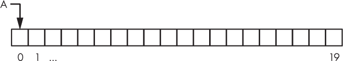
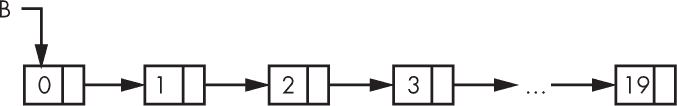
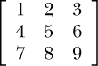

## **3

使用 NUMPY**

NumPy 是本书中所有机器学习内容的基础。如果你已经熟悉 NumPy，可以跳过本章。如果不熟悉，不要害羞，把本章当作复习，尽情深入学习吧。

NumPy 的完整教程超出了我们在此讨论的范围，所以如果你有兴趣，可以进一步查阅 *[`docs.scipy.org/doc/numpy/user/quickstart.html`](https://docs.scipy.org/doc/numpy/user/quickstart.html)*。

### 为什么选择 NumPy？

Python 是一种优雅的编程语言，但它缺乏一个对科学和数学编程至关重要的数据结构：数组。是的，你可以使用字典作为数组，或者使用一个预定义的较大列表，但这会滥用这些数据结构——而且，更实际的是，这样会很慢。让我们来看看数组和列表之间的实现差异。Python 列表比我们这里使用的列表概念更为先进，但本质上它们是一样的。

#### 数组与列表

*数组* 只是一个固定大小的*连续*内存块，是一块没有空隙的单一 RAM 区域，用来表示一个包含 *n* 个元素的集合，每个元素占用恰好 *m* 字节。例如，一个 IEEE 754 双精度浮点数占用 64 位内存，即 8 字节，Python 在底层使用这一格式来表示其 float 数据类型。因此，一个包含 *n* = 100 个 Python 浮点数的数组至少会占用 *nm* = 100(8) = 800 字节内存。如果 Python 有数组这种数据结构，它将分配 800 字节内存，并将数组变量名 A 指向该内存区域，如图 3-1 所示。

*图 3-1：存储在连续内存中的数组*

每当我们想访问数组的一个元素，比如 x[3]，我们可以通过将 3(8) = 24 加到数组基址的内存地址，快速计算出该元素在内存中的精确位置。这就是数组的索引操作。

多维数组也存储在内存中作为连续的内存块，索引操作只是稍微复杂一点。*多维数组* 使用两个或更多的数字来索引元素。想象一个棋盘；需要两个数字来确定棋子的所在位置：行和列。因此，棋盘是一个二维数组。如果我们再增加一个维度，将棋盘变成一个棋盘堆叠，则需要三个数字来定位棋子：行、列和棋盘编号。因此，我们有了一个三维数组。

在本书中，我们将使用一维、二维和三维数组。这些数组都作为一个连续的内存块存储。重点是，数组的索引操作非常快速，因此可以非常高效地对数组元素进行操作。

将此与列表进行对比。图 3-2 展示了内存中列表 B 的基本结构。在这种情况下，列表中的元素并不是存储在连续的内存空间中，而是分散在 RAM 中，通过指针将一个元素与下一个元素连接，像一条链条。链条中的每个链接包含我们要存储的数据值，以及指向链中下一个链接内存的指针。

*图 3-2：以一系列散布在内存中的链接节点形式存储的列表*

我们不能通过仅仅将偏移量添加到基本内存地址来索引列表。相反，如果我们想要列表中的第四个元素，那么我们需要从列表的头部开始，利用那里到下一个元素的链接，再到下一个，再到下一个，直到找到与第四个元素相关联的内存，即图 3-2 中的 3。这个过程还不算太麻烦，直到我们想要索引第 1,000,000 个元素，并且不得不重复这个过程一百万次，而不是一次性将 8 百万加到基本地址上。

大多数机器学习任务涉及数组。如果数组只有一个维度，我们称之为*向量*；向量是许多模型的输入。如果数组有两个维度，它就是*矩阵*。矩阵可以被看作是棋盘或图像，每个像素代表棋盘上的一个位置。矩阵也可以作为我们模型的输入，或者由模型内部使用；例如，神经网络的权重矩阵，或卷积神经网络的卷积核和滤波器输出都是矩阵。

因此，能够快速操作数组数据至关重要。这就是 numpy 库的用武之地。它为 Python 增加了缺失的数组数据类型，使我们能够快速进行计算。坦率地说，没有它，Python 不适合实现复杂的机器学习算法。然而，有了 NumPy，Python 立即成为机器学习研究的首选环境。

#### 测试数组和列表的速度

让我们快速看一个示例，看看 NumPy 相较于纯 Python 能提高多少速度。我们将执行的代码在清单 3-1 中。

❶ import numpy as np

import time

import random

n = 1000000

a = [random.random() for i in range(n)]

b = [random.random() for i in range(n)]

s = time.time()

❷ c = [a[i]*b[i] for i in range(n)]

print("列表推导式:", time.time()-s)

s = time.time()

c = []

❸ for i in range(n):

c.append(a[i]*b[i])

print("for 循环:", time.time()-s)

s = time.time()

❹ c = [0]*n

for i in range(n):

c[i] = a[i]*b[i]

print("现有列表:", time.time()-s)

❺ x = np.array(a)

y = np.array(b)

s = time.time()

c = x*y

print("NumPy 时间", time.time()-s)

*清单 3-1：将 NumPy 与纯 Python 进行比较。请参见 numpy_speed_test.py。*

在 Listing 3-1 中，我们首先导入 numpy 库❶，然后使用列表推导式创建两个包含 1,000,000 个元素的随机数列表。我们的目标是尽可能快速地将这两个列表逐元素相乘。

我们可以通过记录程序的开始时间（单位为秒），然后从结束时间中减去它来测量程序的运行时间。当我们打印时，time 模块的 time 函数返回自设定起始时间（1970 年 1 月 1 日）以来的秒数，包括秒的小数部分。我们在每次运行操作后打印 time.time()-s。

在我们第一次尝试将 a 和 b 相乘时，我们使用了列表推导式❷。接下来，我们使用循环❸从 a 和 b 中选择每个元素，并将它们的乘积附加到列表 c 中。请注意，这种方法从一个空列表开始，并将每个新的乘积附加到其中，因此列表需要在内存中增长。

作为第三种方法，我们预先分配了输出列表，这样我们就不需要将每个输出附加到 c，而是更新 c 中相应的元素❹。这种方法可能稍微快一些——我们将看看结果。

最后，我们使用 NumPy 进行计算❺。我们排除了将两个列表转换为 NumPy 数组（第 25-26 行）所花费的时间，因为我们本可以轻松地使用 NumPy 随机数模块创建随机数组（由于它们是一维的，所以是向量）。整个 NumPy 向量操作是 c = x*y。注意，这里没有显式的循环。NumPy 是一个数组处理库，它会自动遍历所有数组元素。

如果我们运行 Listing 3-1 中的代码十次，以获取四种方法的平均运行时间，我们会得到以下结果：

| ***方法*** | ***运行时间（秒，均值* ± *SE）*** |
| --- | --- |
| 列表推导式 | 0.158855 ± 0.000426 |
| for 循环 | 0.226371 ± 0.000823 |
| 带有现有列表的 for 循环 | 0.201825 ± 0.000409 |
| NumPy | 0.009253 ± 0.000027 |

该表显示，NumPy 的平均速度比纯 Python 的简单实现快了大约 25 倍。这就是为什么我们在 Python 中进行机器学习时想要使用 NumPy！这里，*SE*表示*均值的标准误差*，即标准差除以参与计算均值的值的平方根，在此例中是 10。*标准差*是衡量数据点与均值之间差异的一个指标。标准差较大意味着数据值分布在较宽的范围内。由于这些标准差很小，说明每次运行的时间是一致的。

Listing 3-1 展示了 NumPy 的真正强大之处。操作会立即广播到兼容的维度，而无需显式的循环。向量和矩阵上的常规线性代数操作也可以使用，但通常，NumPy 数组上的操作是逐元素自动执行的，而无需循环。

现在你已经了解了我们为什么要使用 NumPy，接下来我们来看看它的一些功能。

### 基本数组

NumPy 完全是围绕数组的，因此我们从这里开始。让我们先从一些基本的例子开始，然后解释它们的功能以及为什么它们看起来是这样的。

#### 使用 np.array 定义一个数组

我们从一些基本的数组创建开始：

>>> import numpy as np

>>> a = np.array([1,2,3,4])

>>> a

array([1, 2, 3, 4])

>>> a.size

4

>>> a.shape

(4,)

>>> a.dtype

dtype('int64')

这里我们使用 `array` 函数定义了一个数组 a。传递给 `array` 函数的参数需要是 NumPy 可以转换为数组的东西。列表是 NumPy 可以转换为数组的类型，元组也是，因此这些通常是传递给 `array` 函数的参数。

如果我们让 Python 展示数组 a 的内容，它会告诉我们这是一个数组，并给出值。NumPy 会显示数组的内容，但如果数组有很多元素，它只会显示前几个和最后几个元素。

接下来，我们查询 NumPy 数组的三个最常见属性：大小、形状和数据类型 (`dtype`)。数组 a 有四个元素，因此它的大小是 4。数组的大小是它包含的元素数量。数组 a 是一个向量，意味着它只有一个维度，因此返回的形状是一个元组，其中第一个也是唯一一个维度为 4，表示第一维包含四个元素。

数据类型是新的，因为 Python 通常不关心数据类型。但为了提高内存效率，numpy 库必须关心数据类型。当我们使用 `array` 创建数组时，并没有指定数据类型，因此 NumPy 默认使用 64 位整数，因为我们给 `array` 的列表中所有值都是整数。如果其中有一个值是浮点数，NumPy 会默认使用 64 位浮点数，这与 C、C++ 和 Java 等语言中的 double 类型相同。

现在让我们明确指定我们希望 NumPy 数组存储的数据类型：

>>> b = np.array([1,2,3,4], dtype="uint8")

>>> b.dtype

dtype('uint8')

>>> c = np.array([1,2,3,4], dtype="float64")

>>> c.dtype

dtype('float64')

这里我们定义了两个数组 b 和 c。两个数组都包含来自列表 [1,2,3,4] 的相同元素。然而，请注意 `array` 中的 `dtype` 关键字参数。这告诉 NumPy 使用什么数据类型来创建数组。对于 b，我们告诉 NumPy 使用无符号 8 位整数（uint8），即一个字节或一个 ASCII 字符。如果我们查询 `dtype` 属性，我们会看到数组 b 确实是无符号 8 位整数类型。

数组 c 包含与 b 相同的元素，但这里我们告诉 NumPy 使数组存储 64 位浮点数。同样，查询数据类型告诉我们数组 c 是请求的类型。在使用 NumPy 时，我们必须注意数组将存储的数据类型。

最常用的 NumPy 数据类型及其 C 语言中的对应类型，请参见 表 3-1。在定义数组时，使用数据类型名称的字符串来指定 NumPy 数据类型。接下来我们将看到相关的示例。

**表 3-1：** NumPy 数据类型名称、C 语言等效类型和范围

| **NumPy 名称** | **C 语言等效类型** | **范围** |
| --- | --- | --- |
| float64 | 双精度浮动小数型 | ± [2.225 × 10^(–308), 1.798 × 10³⁰⁸] |
| float32 | 浮动小数型 | ± [1.175 × 10^(–38), 3.403 × 10³⁸] |
| int64 | 长整型 | [–2⁶³, 2⁶³–1] |
| uint64 | 无符号长整型 | [0, 2⁶⁴–1] |
| int32 | 长整型 | [–2³¹, 2³¹–1 |
| uint32 | 无符号长整型 | [0, 2³²–1] |
| uint8 | 无符号字符型 | [0, 255 = 2⁸–1] |

到目前为止，我们只使用 NumPy 创建了向量。接下来看看如何创建矩阵，一个二维数组：

>>> d = np.array([[1,2,3],[4,5,6],[7,8,9]])

>>> d.shape

(3, 3)

>>> d.size

9

>>> d

array([[1, 2, 3],

[4, 5, 6],

[7, 8, 9]])

我们使用和之前相同的 array 函数，但这次我们传入的是一个列表的列表，而不是单一的列表。提供的列表的每个元素本身是一个包含三个元素的列表，总共有三个这样的列表。因此，结果的 NumPy 数组将是一个 3×3 的矩阵。矩阵的第一行是第一个包含三个元素的列表 ([1,2,3])，第二行是第二个列表 ([4,5,6])，第三行是第三个列表 ([7,8,9])。

如果我们请求 d 的形状，系统会告诉我们它是 (3, 3)。这个元组表示数组有两个维度，因为元组中有两个元素，第一个维度长度为 3（三行），第二个维度也为 3（三列）。请求 d 的大小会告诉我们它包含九个元素。NumPy 数组的大小等于 shape 返回的元组中所有值的乘积，这里是 3 × 3 = 9。

请求数组本身会导致 NumPy 打印出来。由于数组很小，NumPy 会将整个数组作为二维矩阵显示：

NumPy 不仅限于二维数组。例如，下面是一个三维数组：

>>> d = np.array([[[1,11,111],[2,22,222]],

[[3,33,333],[4,44,444]]])

>>> d.shape

(2, 2, 3)

>>> d

array([[[ 1, 11, 111],

[ 2, 22, 222]],

[[ 3, 33, 333],

[ 4, 44, 444]]])

我们知道 d 是三维的，因为 shape 返回的是一个包含三个元素的元组。我们还知道 d 是三维的，因为传递给 array 的列表包含两个子列表，每个子列表包含两个包含三个元素的子列表，因此形状为 (2, 2, 3)。NumPy 在两个 2×2 子数组之间显示 d 时，会插入一个空行。我们可以将三维数组视为一个向量，其中向量的每个元素都是一个矩阵。我们将使用三维 NumPy 数组来存储图像集合。在这个示例中，d 可以被视为存储了两张图片，每张图片有两行三列。

#### 定义包含 0 和 1 的数组

使用 array 函数定义 NumPy 数组会非常繁琐，尤其是当我们想要一个大数组时，因为我们需要提供数组的所有元素。幸运的是，NumPy 并不那么残忍。现在让我们看看两种在本书中经常使用的 NumPy 核心函数。第一个函数用于创建每个元素初始化为 0 的数组：

>>> x = np.zeros((2,3,4))

>>> x.shape

(2, 3, 4)

>>> x.dtype

dtype('float64')

>>> b = np.zeros((10,10),dtype="uint32")

>>> b.shape

(10, 10)

>>> b.dtype

dtype('uint32')

zeros 函数返回新数组，数组中的每个元素都被设置为 0。这个例子将 x 定义为一个三维数组，因为 zeros 函数的参数是新数组的形状——在这个例子中是元组(2,3,4)。可以将这个数组视为一对小图像，每个图像大小为 3×4 像素。注意，使用 zeros 创建的数组的默认数据类型是 64 位浮点数（dtype）。这意味着每个数组元素占用 8 个字节的内存。

数组 b 有两个维度，包含 10×10 个元素，我们已经显式声明它为 32 位无符号整数。这意味着每个元素只占用 4 个字节的内存。在使用 NumPy 时，我们需要关注数组可能占用的内存量，以避免分配异常大的数组或数据类型较大的数组，例如 float64，这会浪费内存。

我们的第二个核心函数类似于 zeros，但它会将每个元素初始化为 1：

>>> y = np.ones((3,3))

>>> y

array([[1., 1., 1.],

[1., 1., 1.],

[1., 1., 1.]])

>>> y = 10*np.ones((3,3))

>>> y

array([[10., 10., 10.],

[10., 10., 10.],

[10., 10., 10.]])

>>> y.dtype

dtype('float64')

>>> y.astype("uint8")

array([[10, 10, 10],

[10, 10, 10],

[10, 10, 10]], dtype=uint8)

与 zeros 一样，ones 接受一个元组，指定数组每个维度的元素数量，这里是一个 3×3 的矩阵。我们也可以选择性地指定 dtype，使数组存储其他类型的数据，而不是 64 位浮点数。

ones 的实际用途是创建初始化为任意值的数组。我们通过将 ones 数组与所需值相乘来实现这一点，这里是 10。注意，NumPy 会自动识别我们正在与一个标量值相乘，并对数组的每个元素执行该操作——无需循环。

我们引入了一个新方法，astype 方法。这个方法作用于一个数组，返回该数组的副本，并将每个元素转换为指定的数据类型。请注意，转换为无法容纳原始值的数据类型（例如将 64 位浮点数转换为无符号字节）会导致数据丢失。NumPy 会尽力处理，但在使用 NumPy 时需要注意这一点。

最后，在 Python 中，列表或字典对象是通过引用传递的，因此将其赋给一个新变量不会创建副本；它只是创建一个指向原始内存的别名。这节省了时间和空间，但如果我们不小心，可能会导致意外后果。NumPy 数组也是如此。它们可能非常大，因此每次将它们传递给函数时复制它们是没有意义的。如果你想真正创建一个 NumPy 数组的副本，可以使用 `copy` 方法或表示数组所有元素的数组切片。与 Python 列表不同，NumPy 数组是扁平的：数组中特定位置的值不能是另一个数组。

所以，除了第二条，所有以下语句都会创建数组 a 的副本：

>>> a = np.arange(10)

>>> b = a

>>> c = a.copy()

>>> d = a[:]

修改 a 中的一个元素将改变 b 中对应的元素，因为 b 指向与 a 相同的内存，但 c 和 d 中的元素不会受到影响。

### 访问数组中的元素

在本节中，我们将介绍两种不同的方式来访问数组中的元素。

#### 数组索引

如果我们不能引用数组中的元素并在必要时更新它们，那么数组就没什么用处了。这就是所谓的*数组索引*。理解数组索引对于充分利用 NumPy 至关重要。让我们通过一些示例来了解一下：

>>> b = np.zeros((3,4),dtype='uint8')

>>> b

array([[0, 0, 0, 0],

[0, 0, 0, 0],

[0, 0, 0, 0]], dtype=uint8)

❶ >>> b[0,1] = 1

>>> b[1,0] = 2

>>> b

array([[0, 1, 0, 0],

[2, 0, 0, 0],

[0, 0, 0, 0]], dtype=uint8)

我们对数组的索引方式与对列表的索引方式相同，使用方括号：`[`开始索引，`]`结束索引。在方括号之间放置一个表达式，告诉 NumPy 要返回或赋值数组的哪些元素——这就是*下标*。下标附加到数组名后面，用于指定一个或多个数组元素。

在上面的例子中，b 是一个包含三行四列的矩阵，每个元素都初始化为 0。我们在评估 b 时可以看到这一点。

接下来，我们做一些新的事情：我们设置一个赋值语句 ❶，其中语句的左侧不是一个单一的变量名，而是一个带有下标的变量名，文本为 [0,1]。这个下标告诉 NumPy 语句右侧的值，在这里是 1，应该放入 b 中第 0 行第 1 列的元素。同样，NumPy 应该将 2 放入第 1 行第 0 列的元素。我们可以通过查看 b 来看到 NumPy 按照我们的要求进行了操作，结果是第 0 行的第二列现在是 1，第 1 行的第一列现在是 2。

如果我们继续使用之前定义的 b，我们可以看到如何从数组中向 NumPy 请求元素：

>>> b[1,0]

2

>>> b[1]

array([2, 0, 0, 0], dtype=uint8)

>>> b[1][0]

2

因为 b 是一个矩阵，我们需要下标来选择其中的特定元素，一个用于行，一个用于列。因此，b[1,0] 应该返回第二行第一列的值，正如我们看到的那样。

下一行使用了单个下标，b[1]，并返回了 b 的整个第二行。这是一个非常有用的功能，我们将在本书中的代码中看到它。

最后，如果 b[1]返回矩阵 b 的整个第二行，那么我们可以使用 b[1][0]来获取该行的第一个元素。我们看到它与我们最开始使用的 b[1,0]语法的结果相匹配。

#### 切片数组

使用单一索引访问数组的单个元素或整个子数组是有用的，但 NumPy 的灵活性远不止如此。可以通过使用*切片*来指定数组的部分，这会像刀切割一样返回从大数组中切出来的子数组。让我们看看它是如何工作的：

>>> a = np.arange(10)

>>> a

array([0, 1, 2, 3, 4, 5, 6, 7, 8, 9])

>>> a[1:4]

array([1, 2, 3])

>>> a[3:7]

array([3, 4, 5, 6])

在这里，我们使用 arange，这是 NumPy 中的 Python range 函数的类似功能，将 a 设置为一个包含数字[0,9]的向量。然后我们请求这个向量的切片 a[1:4]，并看到它返回了[1, 2, 3]。该切片使用了两个值进行指定：第一个是起始索引 1，第二个是结束索引 4。

等一下——如果结束索引是 4，那切片应该返回[1, 2, 3, 4]才对吧？NumPy 遵循 Python 列表的约定，因此结束索引永远不会包含在返回的子数组中。我们可以将切片理解为请求所有从索引 1 开始、直到*但不包括*索引 4 的 a 中的元素。数学上，表示为 a[x:y]的切片意味着所有满足*x* ≤ *i* < *y*的 a 中的元素。因此，第二个例子 a[3:7]现在就能理解了，它是请求所有从索引 3 开始、直到但不包括索引 7 的 a 中的元素。

这些切片选择了给定范围内的所有元素。NumPy 允许一个可选的第三个切片参数来指定步长。如果没有给定，步长默认为 1。因此，当 a 作为一个数字向量时，我们得到：

>>> a[0:8:2]

array([0, 2, 4, 6])

>>> a[3:7:2]

array([3, 5])

第一个切片从数组的起始位置，即索引 0 开始，到索引 8（但不包括索引 8）结束，返回每隔一个的元素。第二个例子从索引 3 开始，做同样的操作。

完整的切片语法[x:y:z]的任何部分都可以省略，但至少需要保留一个冒号。如果省略了某部分，则默认值为第一个索引（对于 x），最后一个索引（对于 y），以及 1（对于 z）。例如：

>>> a[:6]

array([0, 1, 2, 3, 4, 5])

>>> a[6:]

array([6, 7, 8, 9])

在第一个例子中，起始索引被省略，因此默认为 0，我们得到了 a 的前六个元素。在第二个例子中，结束索引被省略，因此默认为最后一个索引，这意味着“返回从索引 6 到结束的所有内容。”在这两种情况下，增量都被省略，默认为 1。

数组切片提供了一些便捷的快捷方式。这里给出了两个示例：

>>> a[-1]

9

>>> a[::-1]

array([9, 8, 7, 6, 5, 4, 3, 2, 1, 0])

第一个例子告诉我们，就像 Python 列表一样，NumPy 数组也可以用负值进行索引，从轴的末尾开始计数。因此，索引为 -1 时将总是返回最后一个元素。

第二个例子刚开始看起来有点神秘。我们知道 a 是一个包含数字 0 到 9 的向量。这个例子将向量按相反顺序返回。怎么做到的呢？让我们来解析 `::-1` 的含义。我们之前说过，数组切片的任何部分都可以省略，如果省略了，默认值是第一个索引、最后一个索引或增量。在这个例子中，省略了第一个索引，所以它默认是 0。需要的冒号（:）存在，然后省略了最后一个索引，默认它是最后一个索引。接着是一个增量的 `:`，它被指定为 -1，表示从结束索引向开始索引倒数。这就是倒着数并反转数组元素的方式。

自然地，数组切片适用于任意维度的 NumPy 数组。让我们看一下切片一个二维矩阵的例子：

>>> b = np.arange(20).reshape((4,5))

>>> b

array([[ 0,  1,  2,  3,  4],

[ 5,  6,  7,  8,  9],

[10, 11, 12, 13, 14],

[15, 16, 17, 18, 19]])

>>> b[1:3,:]

array([[ 5,  6,  7,  8,  9],

[10, 11, 12, 13, 14]])

>>> b[2:,2:]

array([[12, 13, 14],

[17, 18, 19]])

我们通过使用 `arange` 定义 b 为一个包含 [0, 19] 数字的向量，然后立即使用 `reshape` 将这个向量转换为一个 4 行 5 列的矩阵。传给 `reshape` 的参数是一个元组，指定了数组的新形状。数组中的元素个数必须与新形状中的元素个数一致。这个向量有 20 个元素，而新形状有 4 × 5 = 20 个元素，所以在这个例子中是可以的。

数组切片按维度应用，因此第二个例子 `b[1:3,:]` 是要求获取第 1 和第 2 行以及这些行的所有列。`:` 代表所有元素——在该轴上的所有元素。

下一个例子要求获取从第 2 行和第 2 列开始的所有行和列。这是从完整矩阵 b 的右下角提取出的子矩阵。

#### 省略号

NumPy 支持一种简写的切片方式，有时非常有用。我们先展示这个方式，然后再讨论它的作用。不过，在此之前，我们需要定义一些数组来操作：

>>> c = np.arange(27).reshape((3,3,3))

>>> c

array([[[ 0,  1,  2],

[ 3,  4,  5],

[ 6,  7,  8]],

[[ 9, 10, 11],

[12, 13, 14],

[15, 16, 17]],

[[18, 19, 20],

[21, 22, 23],

[24, 25, 26]]])

>>> a = np.ones((3,3))

>>> a

array([[1., 1., 1.],

[1., 1., 1.],

[1., 1., 1.]])

首先我们定义 c 为一个三维数组，每个维度上有三个元素。我们使用与之前相同的 `reshape` 技巧，知道它会成功，因为 3 × 3 × 3 = 27，而初始向量由 `arange` 生成了 27 个元素。我们可以将 c 看作是三张 3×3 的图像堆叠在一起。接下来我们使用 `ones` 定义了一个简单的 3×3 矩阵，其中每个值都设置为 1。

从我们目前对数组切片的讨论中，我们知道可以通过使用冒号表示法来替换 c 中任何特定的“图像”的 3×3 子数组。例如，让我们用 a 替换 c 的第二个“图像”：

>>> c[1,:,:] = a

>>> c

array([[[ 0,  1,  2],

[ 3,  4,  5],

[ 6,  7,  8]],

[[ 1,  1,  1],

[ 1,  1,  1],

[ 1,  1,  1]],

[[18, 19, 20],

[21, 22, 23],

[24, 25, 26]]])

在这里，我们告诉 NumPy 用 a 中的 3×3 数组替换第二个子数组，即 3×3 数组。它是第二个子数组，因为第一个索引是 1。当我们打印 c 时，我们看到第二个 3×3 子数组现在全是 1。

现在来看一下简写表示法。这次，我们要用 a 替换 c 的第一个 3×3 子数组。我们可以用 c[0,:,:] 来实现，但我们将使用简写表示法：

>>> c[0,...] = a

>>> c

array([[[ 1,  1,  1],

[ 1,  1,  1],

[ 1,  1,  1]],

[[ 1,  1,  1],

[ 1,  1,  1],

[ 1,  1,  1]],

[[18, 19, 20],

[21, 22, 23],

[24, 25, 26]]])

注意到我们使用了 c[0,...]，而不是 c[0,:,:]，在后者中，我们指定了 c 的所有剩余维度的所有索引。NumPy 将 c[0,...] 解释为“根据需要用尽可能多的冒号来覆盖所有剩余的维度”。当然，a 的形状必须与所有剩余维度指定的子数组的形状匹配。在这个例子中，有两个剩余维度，而 a 是一个二维数组，因此它们匹配。省略号表示法 (...) 在与机器学习相关的 Python 代码中很常见，所以我在这里提到它。你可以认为，从可读性的角度来看，使用 ... 并不是一个好主意，因为它要求读者记住一个数组有多少维度。

### 运算符和广播

NumPy 使用所有标准的数学运算符以及一堆其他实现更高级操作的方法和函数。NumPy 还使用一个叫做 *广播* 的概念来决定如何将运算符应用于数组。让我们来看一些简单的运算符和广播：

>>> a = np.arange(5)

>>> a

array([ 0, 1, 2, 3, 4])

>>> c = np.arange(5)[::-1]

>>> c

array([ 4, 3, 2, 1, 0])

>>> a*3.14

array([ 0., 3.14, 6.28, 9.42, 12.56])

>>> a*a

array([ 0,  1,  4,  9, 16])

>>> a*c

array([0, 3, 4, 3, 0])

>>> a//(c+1)

array([0, 0, 0, 1, 4])

从之前的例子中我们知道，a 是一个包含数字 0 到 4 的向量。而且，我们知道根据数组切片的讨论，c 是一个包含从 4 到 0 的数字的向量，也就是 a 的反转。

有鉴于此，我们看到将 a 乘以 3.14 会将每个元素乘以 3.14。NumPy 将标量 3.14 广播到数组 a 的所有元素上。无论 a 的形状如何，NumPy 都会执行此操作。对数组与标量进行运算时，操作会应用于数组的所有元素，而不管其形状如何。

表达式`a * a`将`a`与自身相乘。在这种情况下，NumPy 看到这两个数组具有相同的形状，因此它会逐元素相乘，从而对`a`的每个元素进行平方。将`a`与`c`相乘也很简单，因为`c`的形状与`a`相同。

最后一个例子使用了两次广播。首先，它将标量 1 广播到`c`上，使`c`的每个元素都加 1。这个操作并不会改变`c`的形状，所以通过使用整数除法（`//`而不是`/`）将`a`除以表达式`(c+1)`，是可行的，因为它们的形状是一样的。

让我们看一些更多的例子。我们可以给出无数个例子，但再给一个小的例子应该能帮助我们巩固这些概念。首先是一个更复杂的广播例子：

>>> a

array([0, 1, 2, 3, 4])

>>> b=np.arange(25).reshape((5,5))

>>> b

array([[ 0,  1,  2,  3,  4],

[ 5,  6,  7,  8,  9],

[10, 11, 12, 13, 14],

[15, 16, 17, 18, 19],

[20, 21, 22, 23, 24]])

>>> a*b

array([[ 0,  1,  4,  9, 16],

[ 0,  6, 14, 24, 36],

[ 0, 11, 24, 39, 56],

[ 0, 16, 34, 54, 76],

[ 0, 21, 44, 69, 96]])

记住，`a`是一个数字向量。接下来，我们将`b`定义为一个 5×5 的矩阵，包含从 0 到 24 的数字。然后，我们将`a`和`b`相乘。

在这一点上，你可能会提出疑问。我们如何在形状不匹配的情况下相乘这两个数组呢？数组`a`只有 5 个元素，而`b`有 25 个元素。这时广播就发挥了作用。NumPy 识别到`a`中的五元素向量与`b`的每一*行*的大小相同，所以它将`a`与`b`的每一行相乘，返回一个新的 5×5 矩阵。这种广播实际上非常方便。我们将主要以二维 NumPy 数组的形式存储我们的数据集，其中每一行是一个样本，列对应于该样本的输入值。

NumPy 还支持矩阵数学运算。这些是线性代数中对向量和矩阵进行的运算。例如：

>>> x = np.arange(5)

>>> x

array([0, 1, 2, 3, 4])

>>> np.dot(x,x)

30

在这里，我们定义`x`为一个简单的五元素向量。然后我们引入 NumPy 的主要向量和矩阵乘积函数`dot`，来计算`x`与自身的乘积。我们已经知道，如果我们用标准方式计算`x * x`，会得到每个元素与自身相乘的结果，得到[0,1,4,9,16]，但这不是我们得到的结果。相反，我们得到的是一个标量值，30。为什么会这样呢？

这个答案与`dot`函数的作用有关。它并不是实现逐元素相乘，而是实现线性代数中的矩阵乘法。具体来说，因为`dot`的两个参数都是向量，它实现的是向量与向量的乘法，这就是所谓的*点积*，因此 NumPy 函数也得名“dot”。向量的点积是将第一个向量的每个元素与第二个向量的相应元素相乘，然后将所有这些乘积加起来。所以，对于`dot(x,x)`，NumPy 的计算过程如下：

[0, 1, 2, 3, 4] × [0, 1, 2, 3, 4] = [0, 1, 4, 9, 16]; 0 + 1 + 4 + 9 + 16 = 30

dot 函数可以用来乘以两个向量，一个向量和一个矩阵，或者两个矩阵，所有操作都遵循线性代数的规则，这些规则超出了本书的讨论范围。不过，dot 函数对我们来说非常重要，因为它是机器学习中使用 NumPy 的核心函数。最终，现代机器学习的核心就是与向量和矩阵相关的数学。

让我们看一个使用 dot 计算两个矩阵的例子：

>>> a = np.arange(9).reshape((3,3))

>>> b = np.arange(9).reshape((3,3))

>>> a

array([[0, 1, 2],

[3, 4, 5],

[6, 7, 8]])

>>> np.dot(a,b)

array([[ 15,  18,  21],

[ 42,  54,  66],

[ 69,  90, 111]])

>>> a*b

array([[ 0,  1,  4],

[ 9, 16, 25],

[36, 49, 64]])

在这里，我们定义 a 和 b 都是包含数字 0 到 9 的 3×3 矩阵。然后我们使用 dot 对这两个矩阵进行计算。为了对比，我们也展示了这两个矩阵的常规乘法。

这两个结果并不相同。第一个结果使用线性代数规则来乘以两个 3×3 矩阵，该规则指出，3×3 输出的第一个元素将是 b 的第一列 [0, 3, 6]，与 a 的第一行 [0, 1, 2] 按元素相乘，每个乘积相加：

[0, 3, 6] × [0, 1, 2] = [0, 3, 12]; 0 + 3 + 12 = 15

类似的过程也适用于其他条目的创建。对于简单的乘法，3×3 输出的第一个元素就是 0 × 0 = 0。

如果 dot 的输入是矩阵，那么 dot 的作用如我们所预期：它是矩阵乘法。只有当一个输入是向量而另一个是矩阵时，情况才会有些混乱。NumPy 对向量是行向量还是列向量不太在意——它会产生正确的结果，尽管结果的形状可能不会完全遵循线性代数规则。

我们在经历了线性代数的例子后，因为在你继续探索机器学习的过程中，你会频繁遇到使用 dot 的代码。了解它的功能是很有必要的，但由于它对输入的形状具有容忍性，你可能需要仔细检查代码，特别关注数组的实际形状，以避免迷失。

### 数组输入与输出

如果 NumPy 不提供将数组存储到磁盘和从磁盘读取数组的功能，它将很难使用。当然，我们可以使用像 pickle 这样的标准 Python 模块，但那样效率低下，而且让不同软件包之间的交换变得困难。幸运的是，NumPy 的创始人考虑周到，包含了输入/输出函数。

接下来，我们将提到几个磁盘文件。第一个是 *abc.txt*，内容如下：

1 2 3

4 5 6

7 8 9

这是一个包含三行的文件，每行有三个由空格分隔的数字。第二个文件是 *abc_tab.txt*，它与 *abc.txt* 完全相同，只不过空格已被制表符替换，\t 在 Python 中表示。制表符分隔文件通常用于存储数据。最后一个文件是 *abc.csv*，这是一个逗号分隔值（CSV）文件，常被电子表格程序使用。它与 *abc.txt* 完全相同，只不过空格已被逗号替换。现在，让我们看看 NumPy 的基本输入/输出功能。

>>> a = np.loadtxt("abc.txt")

>>> a

array([[1., 2., 3.],

[4., 5., 6.],

[7., 8., 9.]])

>>> a = np.loadtxt("abc_tab.txt")

>>> a

array([[1., 2., 3.],

[4., 5., 6.],

[7., 8., 9.]])

❶ >>> a = np.loadtxt("abc.csv", delimiter=",")

>>> a

array([[1., 2., 3.],

[4., 5., 6.],

[7., 8., 9.]])

❷ >>> np.save("abc.npy", a)

❸ >>> b = np.load("abc.npy")

>>> b

array([[1., 2., 3.],

[4., 5., 6.],

[7., 8., 9.]])

❹ >>> np.savetxt("ABC.txt", b)

>>> np.savetxt("ABC.csv", b, delimiter=",")

前三个示例使用 loadtxt，它读取文本文件并将其转换为 NumPy 数组。前两个示例显示了 loadtxt 如何解析以空格和制表符分隔的文件。该函数将文本文件的行作为矩阵的行，每行的值作为每行的元素。

第三个示例明确指出，文本文件中值之间的分隔符是逗号字符（,） ❶。这就是如何在 NumPy 中读取 *.csv* 文件。

NumPy 使用 save 函数将数组写入磁盘 ❷。该函数将单个数组写入指定的文件名。NumPy 使用 *.npy* 文件扩展名来标识文件包含 NumPy 数组。我们将在本书中广泛使用 *.npy* 文件。

要从磁盘读取数组到内存，请使用 load ❸。注意，数组中的数据已被加载，但你必须将其分配给一个新的变量名。*.npy* 文件不存储数组的原始名称。

有时我们希望以其他程序或人类可读的格式写入数组。在这种情况下，我们将使用 savetxt 函数 ❹。这些示例首先使用空格分隔值，然后使用逗号分隔值来写入文本文件。

如果我们想要将多个数组写入磁盘怎么办？我们是否必须为每个数组使用一个单独的文件？幸运的是，不必，我们可以使用 savez 函数并使用 load 函数读取它们。

例如：

>>> a

array([[1., 2., 3.],

[4., 5., 6.],

[7., 8., 9.]])

>>> b

array([[1., 2., 3.],

[4., 5., 6.],

[7., 8., 9.]])

❶ >>> np.savez("arrays.npz", a=a, b=b)

>>> q = np.load("arrays.npz")

❷ >>> list(q.keys())

['a', 'b']

>>> q['a']

array([[1., 2., 3.],

[4., 5., 6.],

[7., 8., 9.]])

>>> q['b']

array([[1., 2., 3.],

[4., 5., 6.],

[7., 8., 9.]])

这里我们将两个数组 `a` 和 `b` 存储到一个单一的文件 *arrays.npz* ❶ 中。我们仍然使用 `load` 来读取文件，但与数组不同，`q` 更像是一个字典，因此，如果我们请求作为列表的键 ❷，我们将得到一个包含从文件中读取的数组名称的列表。通过名称引用数组会返回该数组。

再次看一下对 `savez` 的调用 ❶。注意我们是如何指定数组的吗？这是使用关键字的方法，它为数组指定了关键字名称，我们将其命名为与变量名相同，这样在打开文件后请求键时，我们会得到我们期望的名称。我们本可以省略关键字名称，直接使用以下方式：

>>> np.savez("arrays.npz", a, b)

这将使用默认的名称 `arr_0` 和 `arr_1` 将数组写入文件。最后，由于数组可能相当大，我们可能想对其进行压缩（无损压缩！），为了实现这一点，我们会使用 `savez_compressed` 来代替 `savez`。

压缩可能是值得的，但它会降低读写速度。例如，一个包含 1000 万个元素的 64 位浮动点数组，至少需要 80,000,000 字节的内存。使用 `savez` 将该数组写入磁盘需要 80,000,244 字节，仅需几分之一秒。额外的 244 字节是字典结构的开销。将压缩后的文件写入磁盘需要一两秒，但最终生成的文件只有 11,960,115 字节，显著更小。由于这个例子是使用 `arange` 创建的，因此输出数组的每个元素都是唯一的，所以压缩并不是因为存储了一个包含 1000 万个零的数组。对于好奇的人来说，存储 1000 万个零的未压缩数组仍然使用 80,000,244 字节，而压缩后在磁盘上仅使用 77,959 字节。所以，数组越冗余，压缩时节省的空间越多。

### 随机数

NumPy 对伪随机数生成有广泛的支持。我们会随便地称之为*随机数*，但需要理解的是，计算机无法通过任何算法过程生成真正的随机数——如果你对伪随机数生成感兴趣，可以阅读我的书《*随机数与计算机*》（Springer 2018）。NumPy 随机数库位于 `random` 模块下，可以从许多不同的分布中生成样本，最常见的是均匀分布，[0,1)。这意味着在该范围内的任何（可表示的）浮动点数都有相同的概率。通常情况下，这就是我们所需要的。有时我们可能需要使用正态分布，它看起来像经典的钟形曲线。许多物理过程遵循这一曲线。NumPy 也能生成此类样本。

本书中我们将使用的随机数函数包括 random.random（从[0,1)区间生成随机数），random.normal（从钟形曲线中生成随机数），以及 random.seed（设置生成器的种子，以便我们可以多次生成相同的随机数序列）。我们将留给哲学家们来决定，是否这种序列仍然值得被称为*随机*，或者说，它是否曾经是，甚至不管种子值如何。

### NumPy 与图像

我们将使用的一些数据集是基于图像的。我们希望在 NumPy 中处理这些数据集，因此我们需要了解如何在 Python 中处理图像，以及如何将图像导入和导出 NumPy 数组。幸运的是，这个过程相当简单。除了 NumPy，我们还需要使用 Pillow 模块（PIL）来读取和写入图像。我们已经安装了 Pillow，它与我们的主要工具包一起安装。我们还可以使用一些作为 sklearn 一部分的示例图像。

在处理图像时，我们需要考虑两个世界。一个是“NumPy”世界，图像已被转换为 NumPy 数组，另一个是 PIL 世界，PIL 可以读取和写入常见的图像格式，如 JPEG 和 PNG。其实，这个区分并不是绝对的——我们也可以在 PIL 中进行图像处理，有时这更为方便；但目前，我们只将 PIL 用作读取和写入图像文件的工具。

图像是二维数字数组，但如果图像是彩色的，每个像素将有三个或甚至四个数字，每个数字表示红色、绿色、蓝色以及有时是透明度（alpha）通道的强度。我们假设所有图像要么是单通道的灰度图像，要么是三通道的 RGB 图像。当我们遇到带有 alpha 通道的图像时，我们会将其去除。alpha 通道决定了像素的透明度。

首先，让我们看看如何获取 sklearn 提供的示例图像，如何将它们转换为 PIL 图像，保存到磁盘，并显示它们：

❶ >>> from PIL import Image

>>> from sklearn.datasets import load_sample_images

❷ >>> china = load_sample_images().images[0]

>>> flower = load_sample_images().images[1]

>>> china.shape, china.dtype

((427, 640, 3), dtype('uint8'))

>>> flower.shape, flower.dtype

((427, 640, 3), dtype('uint8'))

❸ >>> imChina = Image.fromarray(china)

>>> imFlower = Image.fromarray(flower)

>>> imChina.show()

>>> imFlower.show()

❹ >>> imChina.save("china.png")

>>> imFlower.save("flower.png")

❺ >>> im = Image.open("china.png")

>>> im.show()

首先，我们需要导入 PIL ❶ 和来自 sklearn 的示例图像函数。一旦有了这些，我们就能将实际的图像作为 NumPy 数组 ❷。我们看到，*china* 和 *flower* 图像是三维数组，这意味着它们是 RGB 图像。这些图像的大小是 427×640 像素，第三维是 3，分别对应红色、绿色和蓝色通道。如果图像是灰度图像，它们将只有二维。

我们可以通过使用 fromarray 函数将 NumPy 数组转换回 PIL 图像对象 ❸。该函数的参数假定为适当格式的 NumPy 数组。通常，这意味着数组的数据类型必须是 uint8。得到 PIL 图像对象后，我们可以使用 show 方法查看图像。

为了将图像保存为实际的图形文件而不是 NumPy 数组，我们使用 PIL 对象的 save 方法 ❹。输出文件的格式由文件扩展名决定。这里我们使用的是 PNG 格式。

要从磁盘读取图像文件，我们使用 open 函数 ❺。请注意，open 返回的是一个 PIL 图像对象，而不是 NumPy 数组。

让我们看看如何将 PIL 图像对象转换为 NumPy 数组。还让我们看看如何使用 PIL 将彩色图像转换为灰度图像，然后再将其转换为 NumPy 数组。我们将在书中的后续部分使用这些步骤：

>>> im = Image.open("china.png")

❶ >>> img = np.array(im)

>>> img.shape, img.dtype

((427, 640, 3), dtype('uint8'))

❷ >>> gray = im.convert("L")

>>> gray.show()

>>> g = np.array(gray)

>>> g.shape, g.dtype

((427, 640), dtype('uint8'))

我们首先将图像从磁盘加载到一个 PIL 图像对象 im 中。然后，我们通过 array 函数 ❶ 将图像对象传递给 NumPy。这个函数足够智能，可以识别 PIL 图像对象并进行适当的转换为 NumPy 数组。

我们还可以使用 convert 方法将 PIL RGB 图像转换为灰度图像。注意，PIL 使用 L 代表 *luminance* 来指代灰度图像 ❷。同样，array 函数将现在的灰度图像转换为 NumPy 数组。我们可以看到，图像只有两个维度，这是灰度图像的预期表现，其中每个像素值只是灰色的一个阴影，而不是颜色。

PIL 模块还有许多其他功能。建议访问 Pillow 网站，* [`pillow.readthedocs.io/en/5.1.x/`](https://pillow.readthedocs.io/en/5.1.x/)*，了解你可以用 PIL 做的其他事情。

### 总结

在本章中，我们回顾了如何使用 NumPy，这是 sklearn 和 Keras 都使用的基础工具包。这为我们理解后续书中的代码示例提供了背景。理解如何使用 NumPy 至少在基础层面是至关重要的。本章中的示例应能提供帮助。

现在我们已经熟悉了 NumPy，准备深入处理数据了。
